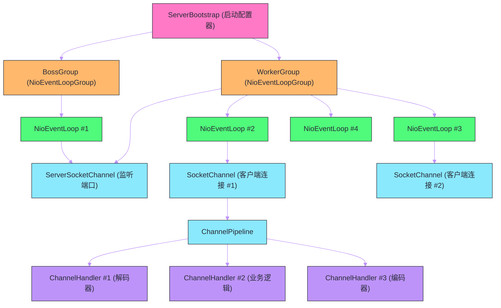
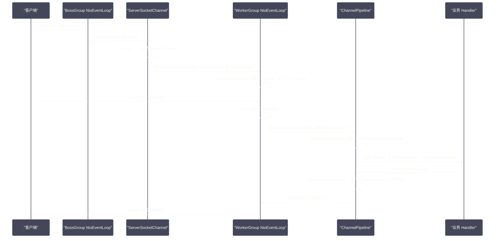

# Netty全局架构——从BossGroup到ChannelPipeline

## 摘要

Netty 是目前 Java 生态中事实上的高性能网络编程框架，Dubbo、RocketMQ、gRPC-Java、Elasticsearch 等主流中间件都以 Netty 为底层网络层。要真正掌握 Netty，必须先建立清晰的全局架构认知——知道每个组件负责什么、各组件之间如何协作、一个请求从 TCP 连接建立到业务逻辑执行的完整路径是什么。本文以一个 Netty 服务器的启动和请求处理流程为主线，系统讲解 `EventLoopGroup`（线程组）的主从 Reactor 架构、`Channel` 与 `ChannelPipeline` 的绑定关系、`Bootstrap`/`ServerBootstrap` 的配置与启动过程、以及 `ChannelHandler` 在数据处理链路中的角色，勾勒出 Netty 的完整架构全貌。

---

## 第 1 章 Netty 解决了什么问题

### 1.1 站在 Netty 作者的视角

上一篇我们看到，原生 Java NIO 已经具备了非阻塞 I/O 的能力。那么 Netty 的价值是什么？

用一句话概括：**Netty 是"正确实现 NIO 编程"的答案**。

"正确实现"意味着两个层面：

**第一层：正确性**。NIO 编程有大量容易出错的细节：
- `Selector.select()` 在某些 Linux 内核下的空轮询 Bug；
- `OP_WRITE` 必须按需注册/注销，否则 CPU 空转；
- TCP 粘包/拆包必须在应用层处理，`read()` 一次不一定能读完一条完整消息；
- `ByteBuffer` 的 `flip()`/`clear()`/`compact()` 使用规范，忘记 `flip()` 是初学者最常犯的错误；
- 连接关闭、半关闭、连接超时、异常处理……每一个都是坑。

Netty 通过精心设计的 API 和内部实现，把这些坑都填好了，让使用者只需专注于业务逻辑。

**第二层：性能**。正确实现 NIO 只是入门，高性能才是 Netty 的核心竞争力：
- `ByteBuf` 比 NIO 的 `ByteBuffer` 更高效（读写指针分离、池化内存、零拷贝）；
- `PooledByteBufAllocator` 通过 jemalloc 算法管理堆外内存，彻底消除频繁 GC 压力；
- `FastThreadLocal` 比 JDK `ThreadLocal` 更快；
- `HashedWheelTimer` 高效处理大量定时任务；
- 无锁化的 `EventLoop` 设计，Channel 的所有操作都在同一线程执行，消除了大量锁竞争。

### 1.2 Netty 的版本演进

理解 Netty 要先了解版本历史，因为网络上大量资料混用了 Netty 3.x 和 Netty 4.x 的 API，容易引起混乱：

| 版本 | 状态 | 核心变化 |
| --- | --- | --- |
| Netty 3.x | 已停止维护 | 入站/出站 Handler 接口分离，`ChannelBuffer` |
| Netty 4.x | **当前主流** | Handler 统一为 `ChannelHandler`，引入 `ByteBuf`，重构线程模型 |
| Netty 5.x | 已放弃 | 尝试引入 `ForkJoinPool`，因复杂度过高放弃 |

本专栏所有内容基于 **Netty 4.x**（当前最新稳定版 4.1.x）。

---

## 第 2 章 Reactor 模式：Netty 架构的理论基石

### 2.1 什么是 Reactor 模式

在深入 Netty 的具体组件之前，必须先理解其架构背后的设计模式——**Reactor 模式**（也称为事件驱动模式或 Dispatcher 模式）。

Reactor 模式是处理并发 I/O 的经典设计模式，由 Douglas Schmidt 在 1995 年的论文《Reactor: An Object Behavioral Pattern for Demultiplexing and Dispatching Handles for Synchronous Events》中正式提出。它的核心思想是：

> 将 I/O 事件的"等待就绪"与"事件处理"分离。专门有一个组件（Reactor）负责监听事件并分发，具体的处理逻辑由注册的 Handler 完成。

Reactor 模式由三个角色构成：
1. **Reactor（反应堆/事件分发器）**：持续监听 I/O 事件，将就绪事件分发给对应的 Handler；
2. **Acceptor（接受者）**：专门处理新连接事件，将新建的 Channel 注册到 Reactor；
3. **Handler（处理者）**：处理具体的 I/O 事件（读、写、业务逻辑）。

这个角色划分对应到 Netty 中：
- Reactor → `NioEventLoop`（内部的 `Selector` + 事件循环）
- Acceptor → `ServerBootstrap` 注册到 `BossGroup` 的 `ServerSocketChannel` Handler
- Handler → `ChannelPipeline` 中的各个 `ChannelHandler`

### 2.2 三种 Reactor 线程模型

Reactor 模式根据线程配置不同，衍生出三种线程模型，理解这三种模型是理解 Netty `BossGroup`/`WorkerGroup` 设计的前提：

**单线程 Reactor 模型**：

一个线程既负责 `accept()` 新连接，又负责处理所有连接的 I/O 和业务逻辑。

```
单 Reactor 线程
├── Selector（监听所有事件）
├── accept() → 建立连接
├── read()   → 读取请求
├── 业务逻辑处理
└── write()  → 写回响应
```

优点：实现简单，无线程切换开销。缺点：一旦某个 Handler 处理耗时，所有连接都被阻塞。只适合低并发、简单业务的场景。

**多线程 Reactor 模型**：

一个专用线程负责 `accept()` 新连接，一个线程池负责处理已建立连接的 I/O 和业务逻辑。

```
Reactor 主线程
└── Selector（只监听 ACCEPT 事件）
    └── accept() → 将 SocketChannel 分配给线程池中某个线程

Reactor 子线程池（多个线程）
每个线程：
├── Selector（监听分配到自己的 Channel 事件）
├── read() → 读取请求
├── 业务逻辑处理
└── write() → 写回响应
```

这是 Netty 默认的主从 Reactor 模型，`BossGroup` 对应主线程，`WorkerGroup` 对应子线程池。

**主从多线程 Reactor 模型**：

主 Reactor 有多个线程（线程池），专门处理 `accept()` 和 SSL 握手等连接建立阶段的工作；从 Reactor 有多个线程，处理已建立连接的 I/O；业务逻辑由独立的业务线程池处理。

这种模型适合极高并发（每秒数万新连接）场景，如大型 API 网关。Netty 支持这种配置，`BossGroup` 设置多个线程即可。

---

## 第 3 章 Netty 的核心组件全景

### 3.1 组件总览

理解 Netty 的关键，是先在脑海中建立各组件之间的层次关系：



各组件的职责一句话概括：

- **`ServerBootstrap`**：服务端启动的"配置中心"，将所有组件组装起来，最终绑定端口；
- **`NioEventLoopGroup`（BossGroup）**：负责监听端口、接受新连接，通常只需 1 个线程；
- **`NioEventLoopGroup`（WorkerGroup）**：负责处理已建立连接的所有 I/O 操作，通常 CPU 核数 × 2 个线程；
- **`NioEventLoop`**：一个真实的线程，内部有一个 `Selector`，负责处理分配给自己的 Channel 的所有事件；
- **`Channel`**：对一个网络连接的抽象，`ServerSocketChannel` 对应监听套接字，`SocketChannel` 对应客户端连接；
- **`ChannelPipeline`**：每个 `Channel` 内部有一个 `ChannelPipeline`，是 `ChannelHandler` 的有序链表；
- **`ChannelHandler`**：实际的业务逻辑处理单元，可以是解码器、编码器、业务逻辑处理器等，组成处理链路。

### 3.2 一个请求的完整生命周期

以一个简单的 HTTP 请求为例，串联所有组件的协作过程：



这个时序图清晰揭示了 Netty 的工作模式：
1. **BossGroup** 只做一件事：`accept()` 新连接；
2. 新连接被注册到 **WorkerGroup** 的某个 `EventLoop`，之后该连接的所有 I/O 事件都在这个 `EventLoop` 中处理；
3. **`EventLoop` 是单线程的**，Channel 的所有操作都在同一线程执行，无需加锁；
4. 数据读取后进入 **`ChannelPipeline`**，依次经过各个 `ChannelHandler` 处理，最终到达业务逻辑。

---

## 第 4 章 Bootstrap：启动配置器

### 4.1 ServerBootstrap 的配置链

`ServerBootstrap` 是 Netty 服务端的启动入口，采用链式 Builder 风格配置：

```java
// Netty 服务端启动的标准写法
NioEventLoopGroup bossGroup = new NioEventLoopGroup(1);    // 1个线程接受连接
NioEventLoopGroup workerGroup = new NioEventLoopGroup();   // 默认 CPU核数×2 个线程处理I/O

try {
    ServerBootstrap b = new ServerBootstrap();
    b.group(bossGroup, workerGroup)            // 设置 BossGroup 和 WorkerGroup
     .channel(NioServerSocketChannel.class)    // 使用 NIO 的 ServerSocketChannel
     .option(ChannelOption.SO_BACKLOG, 128)    // TCP 连接队列大小（服务端 Channel 的 option）
     .childOption(ChannelOption.SO_KEEPALIVE, true) // 已连接 Channel 的 option（TCP Keepalive）
     .childOption(ChannelOption.TCP_NODELAY, true)  // 禁用 Nagle 算法，降低延迟
     .handler(new LoggingHandler(LogLevel.INFO))    // BossGroup Channel 的处理器
     .childHandler(new ChannelInitializer<SocketChannel>() {
         // 每当有新连接建立时，这个方法被调用，为新 Channel 初始化 Pipeline
         @Override
         protected void initChannel(SocketChannel ch) throws Exception {
             ChannelPipeline pipeline = ch.pipeline();
             pipeline.addLast(new HttpServerCodec());        // HTTP 编解码器
             pipeline.addLast(new HttpObjectAggregator(65536)); // 聚合 HTTP 消息
             pipeline.addLast(new MyBusinessHandler());      // 业务逻辑处理
         }
     });

    // 绑定端口，同步等待成功
    ChannelFuture f = b.bind(8080).sync();
    System.out.println("Server started on port 8080");

    // 等待服务器关闭
    f.channel().closeFuture().sync();
} finally {
    workerGroup.shutdownGracefully();
    bossGroup.shutdownGracefully();
}
```

### 4.2 option 与 childOption 的区别

`option()` 和 `childOption()` 是 `ServerBootstrap` 的两套配置接口，区别在于作用对象：

- **`option()`**：作用于 `ServerSocketChannel`（监听端口的 Channel），如 `SO_BACKLOG`（listen 队列大小）；
- **`childOption()`**：作用于每个新建立的 `SocketChannel`（客户端连接），如 `SO_KEEPALIVE`、`TCP_NODELAY`。

常用的 `ChannelOption` 及其含义：

| 选项 | 默认值 | 含义 |
| --- | --- | --- |
| `SO_BACKLOG` | 128 | TCP 全连接队列（accept queue）大小，高并发服务应增大到 1024+ |
| `SO_KEEPALIVE` | false | TCP 层的 Keepalive，空闲连接存活探测（注意：与应用层心跳不同）|
| `TCP_NODELAY` | false | 禁用 Nagle 算法，小数据包不缓冲等待，降低延迟（RPC 框架必开）|
| `SO_RCVBUF` | 系统默认 | 接收缓冲区大小，影响吞吐量 |
| `SO_SNDBUF` | 系统默认 | 发送缓冲区大小，影响吞吐量 |
| `SO_REUSEADDR` | false | 允许端口重用（服务重启时立即绑定已处于 TIME_WAIT 的端口）|

> [!info] TCP_NODELAY 与 RPC 延迟
> Nagle 算法（1984 年 John Nagle 提出）的设计初衷是减少网络上的小数据包数量：它规定，在有未被确认的数据包时，新产生的小数据包不立即发送，而是等待更多数据一起发送或等到 ACK 到来。这个策略对批量传输很好，但对 RPC 调用非常有害——RPC 请求往往是一个小包（请求头+少量参数），Nagle 算法会让它等待几十毫秒再发送，显著增加延迟。因此 RPC 框架（Dubbo、gRPC 等）几乎无一例外地设置 `TCP_NODELAY=true`。

### 4.3 ChannelInitializer：延迟初始化的设计

`ChannelInitializer` 是 Netty 的一个特殊 `ChannelHandler`，其核心设计是**延迟初始化**：

每当有新连接建立时，Netty 才调用 `initChannel()` 方法为这个 `SocketChannel` 初始化 `ChannelPipeline`。这样做的原因是每个连接的 Pipeline 配置可能不同（虽然大多数情况下相同），且 `ChannelInitializer` 本身在 `initChannel()` 执行完后会自动从 Pipeline 中移除自己（它只是初始化工具，不参与后续数据处理）。

```java
public abstract class ChannelInitializer<C extends Channel> extends ChannelInboundHandlerAdapter {
    
    // 子类实现：为新 Channel 添加 Handler
    public abstract void initChannel(C ch) throws Exception;
    
    @Override
    public final void channelRegistered(ChannelHandlerContext ctx) throws Exception {
        // Channel 注册到 EventLoop 时触发
        if (initChannel(ctx)) {
            // initChannel() 执行完后，触发后续 channelRegistered 传播
            ctx.pipeline().fireChannelRegistered();
            removeState(ctx);
        } else {
            ctx.fireChannelRegistered();
        }
    }
    
    private boolean initChannel(ChannelHandlerContext ctx) throws Exception {
        if (initMap.add(ctx)) {
            try {
                initChannel((C) ctx.channel());  // 调用子类实现
            } catch (Throwable cause) {
                exceptionCaught(ctx, cause);
            } finally {
                // 关键：初始化完成后，将自己从 Pipeline 中移除
                ChannelPipeline pipeline = ctx.pipeline();
                if (pipeline.context(this) != null) {
                    pipeline.remove(this);
                }
            }
            return true;
        }
        return false;
    }
}
```

---

## 第 5 章 EventLoopGroup 与 EventLoop

### 5.1 EventLoopGroup 的职责

`EventLoopGroup` 是 `EventLoop` 的容器，本质是一个线程池。`NioEventLoopGroup` 在创建时初始化指定数量的 `NioEventLoop`，每个 `NioEventLoop` 对应一个真实的 Java 线程。

`EventLoopGroup` 的核心能力是 Channel 到 `EventLoop` 的分配（Register）：

```java
// EventLoopGroup 的 next() 方法：轮询选择下一个 EventLoop
EventLoop eventLoop = workerGroup.next();
// 将 Channel 注册到选中的 EventLoop
channel.register(eventLoop);
```

Netty 默认使用轮询（Round-Robin）策略将 Channel 均匀分配到各个 `EventLoop`，确保负载均衡。

### 5.2 NioEventLoop 的内部结构

`NioEventLoop` 是 Netty 最核心的类之一，理解它的内部结构对理解 Netty 的全局运行机制至关重要：

```java
public final class NioEventLoop extends SingleThreadEventLoop {
    // 核心：Java NIO 的 Selector（对 epoll/kqueue 的封装）
    private Selector selector;
    private Selector unwrappedSelector;  // 原始 Selector（未被 Netty 包装的）
    
    // 注册到这个 EventLoop 的所有 Channel 集合
    private final Set<SelectionKey> selectedKeys;
    
    // 任务队列：存放其他线程提交的任务（Netty 线程安全模型的关键）
    // 继承自 SingleThreadEventExecutor.taskQueue
    
    // 定时任务队列
    // 继承自 AbstractScheduledEventExecutor.scheduledTaskQueue
    
    // EventLoop 的核心循环
    @Override
    protected void run() {
        int selectCnt = 0;
        for (;;) {
            try {
                int strategy;
                try {
                    // 如果有待处理的任务，使用 selectNow()（非阻塞立即返回）
                    // 如果没有任务，使用 select(timeoutMillis)（阻塞等待）
                    strategy = selectStrategy.calculateStrategy(selectNowSupplier, hasTasks());
                    switch (strategy) {
                        case SelectStrategy.CONTINUE:
                            continue;
                        case SelectStrategy.BUSY_WAIT:
                            // 某些平台不支持，降级为 SELECT
                        case SelectStrategy.SELECT:
                            long curDeadlineNanos = nextScheduledTaskDeadlineNanos();
                            if (curDeadlineNanos == -1L) {
                                curDeadlineNanos = NONE;
                            }
                            nextWakeupNanos.set(curDeadlineNanos);
                            try {
                                if (!hasTasks()) {
                                    strategy = select(curDeadlineNanos);  // 阻塞 select
                                }
                            } finally {
                                nextWakeupNanos.lazySet(AWAKE);
                            }
                        default:
                    }
                } catch (IOException e) {
                    // epoll bug 触发，重建 Selector
                    rebuildSelector0();
                    selectCnt = 0;
                    handleLoopException(e);
                    continue;
                }
                
                selectCnt++;
                cancelledKeys = 0;
                needsToSelectAgain = false;
                final int ioRatio = this.ioRatio;  // I/O 操作与任务处理的时间比例（默认 50）
                
                boolean ranTasks;
                if (ioRatio == 100) {
                    // 全部时间用于 I/O
                    try {
                        if (strategy > 0) {
                            processSelectedKeys();  // 处理就绪的 I/O 事件
                        }
                    } finally {
                        ranTasks = runAllTasks();  // 处理任务队列中的所有任务
                    }
                } else if (strategy > 0) {
                    // 按比例分配 I/O 与任务处理时间
                    final long ioStartTime = System.nanoTime();
                    try {
                        processSelectedKeys();
                    } finally {
                        final long ioTime = System.nanoTime() - ioStartTime;
                        // 根据 I/O 耗时和 ioRatio 计算任务处理的时间预算
                        ranTasks = runAllTasks(ioTime * (100 - ioRatio) / ioRatio);
                    }
                } else {
                    ranTasks = runAllTasks(0);  // 只运行最少量任务
                }
                
                // epoll 空轮询检测
                if (ranTasks || strategy > 0) {
                    if (selectCnt > MIN_PREMATURE_SELECTOR_RETURNS && logger.isDebugEnabled()) {
                        logger.debug("...");
                    }
                    selectCnt = 0;
                } else if (unexpectedSelectorWakeup(selectCnt)) {
                    // 连续空轮询超过阈值，重建 Selector
                    selectCnt = 0;
                }
            } catch (CancelledKeyException e) {
                // 正常情况：Channel 关闭导致 Key 取消
            } catch (Error e) {
                throw (Error) e;
            } catch (Throwable t) {
                handleLoopException(t);
            }
        }
    }
}
```

`NioEventLoop` 的 `run()` 方法展示了其工作的三个阶段：
1. **`select()`**：阻塞等待 I/O 事件（或超时，或被任务队列中的新任务唤醒）；
2. **`processSelectedKeys()`**：处理就绪的 I/O 事件（触发 `ChannelHandler` 的 `channelRead()` 等回调）；
3. **`runAllTasks()`**：执行任务队列中积累的非 I/O 任务（如其他线程提交的操作、定时任务等）。

### 5.3 ioRatio：I/O 与任务的时间分配

`ioRatio` 是 `NioEventLoop` 的一个重要配置参数（默认 50），控制 I/O 操作与任务处理之间的 CPU 时间分配比例：

- `ioRatio = 50`（默认）：I/O 处理时间 ∶ 任务处理时间 = 1 ∶ 1；
- `ioRatio = 100`：不限制任务处理时间（先处理所有 I/O，再处理所有任务）；
- `ioRatio = 70`：I/O 处理时间占 70%，任务处理时间占 30%。

适当调整 `ioRatio` 可以优化特定场景下的性能：I/O 密集型应用可以提高 `ioRatio`，任务密集型应用（如大量定时任务）可以降低 `ioRatio`。

---

## 第 6 章 Channel：连接的抽象

### 6.1 Netty Channel 与 JDK Channel 的关系

Netty 的 `Channel` 接口对 JDK `java.nio.channels.Channel` 进行了高度封装，增加了大量 Netty 特有的能力：

```
JDK java.nio.channels.Channel
└── Netty io.netty.channel.Channel
    ├── 关联的 EventLoop（所有操作在这个线程执行）
    ├── ChannelPipeline（Handler 链）
    ├── ChannelConfig（连接参数配置）
    ├── Unsafe（底层 I/O 操作的内部接口，不暴露给用户）
    ├── write()/writeAndFlush()（带缓冲区的发送接口）
    ├── close()/disconnect()（连接关闭接口）
    └── attr()（自定义属性存储，AttributeMap）
```

Netty 的 `Channel` 提供了 `attr()` 方法，可以在 Channel 上附加任意的键值对属性（类似 `SelectionKey.attachment()`，但更强大）：

```java
// 定义属性 Key（通常作为静态常量）
static final AttributeKey<UserSession> SESSION_KEY = AttributeKey.valueOf("session");

// 在 Handler 中设置属性（登录成功时存储会话）
ctx.channel().attr(SESSION_KEY).set(new UserSession(userId, token));

// 在另一个 Handler 中读取属性（用于鉴权）
UserSession session = ctx.channel().attr(SESSION_KEY).get();
if (session == null || !session.isValid()) {
    ctx.close();  // 未登录，关闭连接
}
```

这个机制让不同 `ChannelHandler` 之间能够共享同一个 Channel 上的状态，而无需全局变量或线程本地变量。

### 6.2 Channel 的生命周期与状态

Netty `Channel` 有四个状态，对应 `ChannelHandler` 的四个生命周期回调：

| Channel 状态 | 触发的 Handler 方法 | 说明 |
| --- | --- | --- |
| `REGISTERED` | `channelRegistered()` | Channel 注册到 EventLoop 的 Selector |
| `ACTIVE` | `channelActive()` | TCP 连接建立成功（三次握手完成）|
| `INACTIVE` | `channelInactive()` | TCP 连接断开 |
| `UNREGISTERED` | `channelUnregistered()` | Channel 从 EventLoop 注销 |

状态转换路径：

```
创建 Channel
    ↓
channelRegistered()  → Channel 注册到 EventLoop
    ↓
channelActive()      → TCP 连接建立（或 ServerSocketChannel 绑定端口）
    ↓
... 正常数据收发 ...
    ↓
channelInactive()    → TCP 连接断开
    ↓
channelUnregistered() → Channel 从 EventLoop 注销，资源释放
```

在实际开发中，`channelActive()` 常用于在连接建立时发送 "welcome" 消息或初始化连接状态；`channelInactive()` 常用于清理连接相关资源（如移除在线用户列表中的记录）。

---

## 第 7 章 ChannelPipeline：责任链的实现

### 7.1 Pipeline 的本质

`ChannelPipeline` 是 Netty 中最精妙的设计之一。每个 `Channel` 创建时，Netty 自动为其创建一个 `ChannelPipeline`。Pipeline 本质上是一个双向链表，链表节点是 `ChannelHandlerContext`，每个节点包装了一个 `ChannelHandler`。

数据在 Pipeline 中的流动方向有两种：
- **Inbound（入站）**：数据从网络到业务，方向是 head → tail（从链表头到链表尾）；
- **Outbound（出站）**：数据从业务到网络，方向是 tail → head（从链表尾到链表头）。

```
                  网络 (底层 I/O)
                       ↕
      ┌────────────────────────────────┐
      │          ChannelPipeline       │
      │                                │
      │  Head ←──────────────────── Tail
      │   ↑    ↓           ↑    ↓      │
      │  [ChannelHandlerContext #1]    │  ← 解码器（InboundHandler）
      │         ↓           ↑          │
      │  [ChannelHandlerContext #2]    │  ← 业务逻辑（In/Outbound Handler）
      │         ↓           ↑          │
      │  [ChannelHandlerContext #3]    │  ← 编码器（OutboundHandler）
      └────────────────────────────────┘
                       ↕
                   业务层代码
```

**入站数据流**（读请求）：Head → 解码器 → 业务逻辑 → Tail
**出站数据流**（写响应）：Tail ← 编码器 ← 业务逻辑 ← Head

> [!info] Head 和 Tail 是什么
> Netty 在 Pipeline 两端自动插入 `HeadContext` 和 `TailContext`：
>
> - `HeadContext`：同时是 Inbound 和 Outbound Handler，负责最终的 I/O 操作（底层 `unsafe.read()`/`unsafe.write()`）和异常处理；
> - `TailContext`：Inbound Handler，当入站消息没有被任何 Handler 消费时，`TailContext` 会打印警告日志，防止消息被静默丢弃。

### 7.2 Handler 的分类

`ChannelHandler` 分为两种子接口：

**`ChannelInboundHandler`**（入站处理器）：

处理入站事件，如数据读取、连接建立/断开、异常等。数据流向：网络 → Handler → 业务。

常用方法：
- `channelActive(ctx)`：连接建立
- `channelInactive(ctx)`：连接断开
- `channelRead(ctx, msg)`：收到数据
- `channelReadComplete(ctx)`：本次读取完成
- `exceptionCaught(ctx, cause)`：发生异常

**`ChannelOutboundHandler`**（出站处理器）：

处理出站操作，如数据写出、连接建立、绑定端口等。数据流向：业务 → Handler → 网络。

常用方法：
- `write(ctx, msg, promise)`：写数据
- `flush(ctx)`：刷新发送缓冲区
- `connect(ctx, addr, localAddr, promise)`：建立连接
- `close(ctx, promise)`：关闭连接

**`ChannelDuplexHandler`**：同时实现 Inbound 和 Outbound 功能，适合需要处理双向数据的 Handler（如日志记录、监控指标收集）。

### 7.3 ctx.fireXxx() 与 ctx.channel().xxx() 的区别

这是 Netty 初学者最容易混淆的地方：

```java
// 方式一：ctx.fireChannelRead(msg)
// 将事件传递给 Pipeline 中的下一个 InboundHandler
// 数据流：当前 Handler → 下一个 InboundHandler
ctx.fireChannelRead(decodedMessage);

// 方式二：ctx.channel().read()
// 将操作从 Pipeline 的 tail 开始，向 head 方向传播
// 效果：直接触发整条 Pipeline 的 read 操作，从头到尾

// 方式三：ctx.write(msg)
// 从当前位置向 Pipeline 的 head 方向找下一个 OutboundHandler
// 不会经过比当前 Handler 更靠 tail 方向的 Handler

// 方式四：ctx.pipeline().write(msg)  或  ctx.channel().write(msg)
// 从 Pipeline 的 tail 开始，向 head 方向传播
// 会经过所有 OutboundHandler
```

核心规则：
- `ctx.fireXxx()`：从当前 Handler 位置向后传播入站事件（找下一个 InboundHandler）；
- `ctx.write(msg)`：从当前 Handler 位置向前传播出站操作（找下一个 OutboundHandler，即更靠近 head 的）；
- `ctx.channel().write(msg)` / `ctx.pipeline().write(msg)`：从 tail 开始的出站操作，经过所有 OutboundHandler。

> [!warning] 忘记调用 ctx.fireChannelRead() 的后果
> 如果一个 InboundHandler 在 `channelRead()` 方法中没有调用 `ctx.fireChannelRead()`，消息就会在这个 Handler "截断"，后续的 Handler 收不到这条消息。这是 Pipeline 设计的精髓——每个 Handler 可以选择性地"消费"消息（不往下传）或"转发"消息（继续往下传）。
>
> Netty 提供了 `SimpleChannelInboundHandler<T>` 帮助处理这个问题：它在 `channelRead()` 调用你的 `messageReceived()` 后自动释放消息（`ReferenceCountUtil.release(msg)`），同时默认不往下传递。如果消息是泛型类型 `T` 的实例则处理，否则直接往下传。

---

## 总结

Netty 的全局架构建立在主从 Reactor 线程模型之上，各组件各司其职，协同完成高性能网络通信：

- **`ServerBootstrap`** 是组装器，将 `BossGroup`、`WorkerGroup`、`Channel` 类型、`ChannelOption` 和 `ChannelHandler` 配置粘合起来，最终绑定端口启动服务；

- **`BossGroup`**（通常 1 个线程）专注于 `accept()` 新连接，新连接建立后立即移交给 `WorkerGroup`；**`WorkerGroup`**（通常 CPU 核数 × 2 个线程）负责已建立连接的所有 I/O 事件处理，这是主从 Reactor 模型的体现；

- **`NioEventLoop`** 是真实的执行线程，每个 `EventLoop` 绑定一个 `Selector`，通过 `select()` 等待事件，通过 `processSelectedKeys()` 处理事件，通过任务队列接受其他线程的任务提交；**一个 Channel 的整个生命周期都绑定在同一个 `EventLoop`**，这是 Netty 无锁化设计的基础；

- **`ChannelPipeline`** 是每个 `Channel` 内置的双向处理链，入站数据从 head 流向 tail（解码 → 业务逻辑），出站数据从 tail 流向 head（业务逻辑 → 编码）；

- **`ChannelHandler`** 是业务逻辑的载体，分为 InboundHandler 和 OutboundHandler，通过 `ctx.fireXxx()` 传递入站事件，通过 `ctx.write()` 传递出站操作；`ChannelInitializer` 在连接建立时动态初始化 Pipeline，用完后自动从 Pipeline 移除。

下一篇深入剖析 `EventLoop` 的线程模型——Netty 如何通过 `EventLoop` 实现完全无锁的并发模型，以及 `ioRatio`、任务队列等关键设计的细节：[[03 EventLoop与线程模型——Reactor模式的落地实现]]。

---

> [!note] 参考资料
> - Norman Maurer, Marvin Allen Wolfthal,《Netty in Action》, Manning, 2016
> - `io.netty.channel.nio.NioEventLoop` 源码
> - `io.netty.bootstrap.ServerBootstrap` 源码
> - `io.netty.channel.DefaultChannelPipeline` 源码
> - Douglas Schmidt,《Reactor: An Object Behavioral Pattern》, 1995

---

> [!note] 思考题
> 1. Netty 的 Reactor 模式中，BossGroup 负责接受连接，WorkerGroup 负责处理 IO 读写。BossGroup 通常只需要 1 个 EventLoop（线程），但 WorkerGroup 默认使用 CPU 核数 × 2 个 EventLoop。如果你的业务是 CPU 密集型（如加解密），WorkerGroup 的线程数应该增大还是减小？为什么？
> 2. Netty 的 EventLoop 保证了一个 Channel 的所有 IO 事件都由同一个线程处理——这消除了多线程竞争。但如果 ChannelHandler 中有一个耗时操作（如数据库查询），会阻塞 EventLoop 线程，影响该线程上所有 Channel 的处理。除了使用 `DefaultEventExecutorGroup` 将耗时操作卸载到业务线程池，还有哪些方案？
> 3. Netty 4.x 的 EventLoop 采用'一个线程绑定多个 Channel'的模型，而 Netty 3.x 是'一个线程对应一个 Channel'。前者在大量空闲连接（如 WebSocket 长连接场景）时的优势是什么？如果某个 Channel 突然收到大量数据，会影响绑定在同一个 EventLoop 上的其他 Channel 吗？
