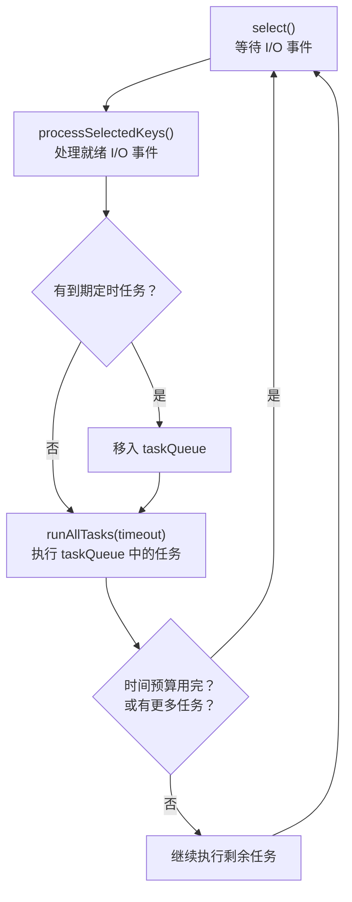

# EventLoop与线程模型——Reactor模式的落地实现

**摘要：**

`EventLoop` 是 Netty 线程模型的核心，也是其高性能的根本来源。Netty 做出了一个大胆的设计决定：一个 Channel 的整个生命周期中，所有 I/O 操作和事件处理都绑定在同一个 `EventLoop` 线程中执行，不切换线程。这个"单线程化"的设计彻底消除了 Channel 操作的锁竞争——不需要 `synchronized`，不需要 `ConcurrentHashMap`，数据天然线程安全。本文从多线程并发访问 Channel 的代价出发，深入剖析线程封闭（Thread Confinement）这一并发编程经典技术在 Netty 中的落地：`inEventLoop()` 的线程判断逻辑、任务队列的提交与执行机制、`ChannelFuture` 与 `Promise` 的异步结果通知、`EventLoop` 的懒启动与唤醒机制，以及 EventLoop 线程模型在实际开发中最容易踩的坑——在 Handler 中执行阻塞操作。最后讨论单线程模型的固有限制与设计权衡，揭示"无锁化"背后的代价与边界。

---

## 第 1 章 为什么 Netty 选择单线程化 Channel 操作

### 1.1 多线程并发访问 Channel 的代价

要理解 Netty 为什么选择单线程化设计，不妨先做一个反事实假设：如果不采用单线程化，允许多个线程并发操作同一个 Channel，会发生什么？

考虑一个常见的场景：连接建立后，定时任务线程要发送心跳包，同时业务线程也在发送响应数据。两个线程同时调用同一个 Channel 的 `writeAndFlush()`，在 NIO 的 `SocketChannel` 层面，写操作涉及将数据放入发送缓冲区、注册或更新 `OP_WRITE` 事件到 Selector、`Selector.select()` 检测发送缓冲区可写时将数据写入内核 TCP 发送缓冲区、调用 `flush()` 触发底层写操作。如果两个线程并发执行这些步骤，每一步都需要加锁保护——发送缓冲区的写入需要 `synchronized` 防止数据交错，`OP_WRITE` 的注册需要防止 ABA 问题，`Selector` 的 `interestOps` 修改虽然线程安全但效率不高。

```java
// 不安全的并发写（假设 Netty 不是单线程模型）
// 定时器线程
channel.writeAndFlush(heartbeatMsg);

// 业务线程（同时）
channel.writeAndFlush(responseMsg);
```

更糟糕的是，`ChannelPipeline` 中的 Handler 通常假设自己在单线程环境下运行——解码器的累积缓冲区、业务 Handler 的会话状态、编码器的临时变量，这些都没有同步保护。如果多个线程并发进入同一个 Pipeline，Handler 中的有状态数据会产生竞争条件，导致数据错乱、消息丢失、甚至 JVM 崩溃。要解决这个问题，要么给每个 Handler 加锁（大幅降低性能），要么把所有 Handler 的状态都改成线程安全的（大幅增加开发复杂度）。

这种设计需要大量 `synchronized` 块和 `ConcurrentXxx` 数据结构，极大增加代码复杂度，且频繁加锁解锁会导致显著的性能下降——上下文切换、CPU 缓存失效、锁竞争等待，这些隐形成本在高并发场景下会把性能拖垮。Doug Lea 在《Java Concurrency in Practice》中指出，锁的代价不仅在于获取和释放的开销，更在于竞争时的线程调度开销——当多个线程争抢同一把锁时，操作系统调度器的介入会把原本纳秒级的操作变成微秒甚至毫秒级。在高并发网络服务器中，这种锁竞争的代价是致命的——每秒数万次 I/O 操作如果每次都涉及锁竞争，CPU 时间将被大量消耗在锁等待和线程调度上，而非真正的 I/O 处理。

### 1.2 线程封闭：Netty 的解法

Netty 采用了并发编程中"线程封闭"（Thread Confinement）的经典技术：将对象的所有访问限制在单一线程中，从而天然保证线程安全。这个技术并非 Netty 发明——Doug Lea 在 1999 年的《Concurrent Programming in Java》中就系统阐述了线程封闭的概念，Swing 的事件分发线程（Event Dispatch Thread）和 JavaScript 的单线程模型都是线程封闭的典型应用。Netty 的贡献在于把这个思想落地到了高性能网络编程的工程实践中。

核心规则只有一句话：Channel 注册到哪个 `EventLoop`，这个 Channel 的所有操作——包括 I/O 事件处理、用户 Handler 调用、Channel 写操作——都在那个 `EventLoop` 的线程中执行。当外部线程（如定时器线程、业务线程池）想要操作某个 Channel 时，不是直接操作，而是将操作封装成 `Runnable` 任务提交到该 Channel 所属的 `EventLoop` 的任务队列，由 `EventLoop` 线程串行执行。

这个设计的精妙之处在于三方面。第一，Channel 相关的所有操作都是串行的（因为都在同一线程执行），天然无并发问题，不需要任何同步原语。第二，任务队列本身用 MPSC（多生产者单消费者）无锁队列实现，多个外部线程提交任务是高效的 CAS 操作，不会成为瓶颈。第三，用户 Handler 代码无需加锁，大幅简化了业务开发——程序员可以像写单线程程序一样编写 Handler 逻辑，不需要考虑并发问题。

线程封闭可以用一个银行柜台的比喻来理解：传统多线程模型是多个柜员同时操作同一个账户，每次操作都需要锁账户本防止数据错乱；线程封闭模型是一个账户指定一个专属柜员，所有对这个账户的操作都由这个柜员串行处理，不需要锁。柜员之间不共享账户本，自然没有竞争。这个比喻的局限在于，银行柜台的操作是同步阻塞的（柜员处理一个客户时其他客户排队等待），而 Netty 的 `EventLoop` 是事件驱动的——柜员只在有事件（客户到来）时才工作，没有事件时在 `select()` 上等待，CPU 时间不被浪费。

线程封闭并非没有代价。它的核心代价是"不可迁移"——一旦 Channel 绑定到某个 `EventLoop`，就不能迁移到另一个 `EventLoop`，因为 Handler 中的状态可能依赖当前线程的上下文。这意味着负载均衡只能在连接建立时进行，运行时不能重新平衡。另一个代价是"单点阻塞"——如果某个 Handler 在 `EventLoop` 线程中执行了阻塞操作，该 `EventLoop` 上所有 Channel 都受影响。这些代价是线程封闭设计的固有后果，Netty 通过 `DefaultEventExecutorGroup`（业务线程池卸载）和 `ioRatio`（时间分配控制）等机制来缓解，但无法完全消除——架构即权衡，选择了线程封闭的简洁性，就必须接受它的局限性。

### 1.3 inEventLoop()：线程安全的守卫

Netty 实现"线程封闭"的关键是 `inEventLoop()` 方法——每次在 `EventLoop` 中执行操作之前，Netty 都会检查当前线程是否就是该 `EventLoop` 的线程。如果是，直接执行；如果不是，把操作包装成任务提交到任务队列。

```java
// AbstractChannel 中的 write 操作（简化版）
public final void write(Object msg, ChannelPromise promise) {
    // 关键判断：当前线程是否是 EventLoop 线程？
    if (eventLoop.inEventLoop()) {
        // 是 EventLoop 线程：直接执行
        outboundBuffer.addMessage(msg, size, promise);
    } else {
        // 不是 EventLoop 线程：封装成任务提交到任务队列
        Runnable task = () -> outboundBuffer.addMessage(msg, size, promise);
        eventLoop.execute(task);
    }
}
```

`inEventLoop()` 的实现极其简单——只是一个线程引用的比较，O(1) 操作：

```java
// SingleThreadEventExecutor.inEventLoop()
@Override
public boolean inEventLoop(Thread thread) {
    return thread == this.thread;  // 比较线程引用
}
```

这个判断遍布 Netty 的代码库——任何对 Channel 的操作，在执行前都会做这个检查。`channel.write()`、`channel.read()`、`pipeline.addLast()`、`channel.close()`，每一个方法内部的第一步都是 `inEventLoop()` 判断。这个设计确保了无论调用方在哪个线程，操作最终都在正确的 `EventLoop` 线程中执行，程序员不需要手动判断和提交任务——Netty 的 API 把这一切封装成了透明的行为。

`inEventLoop()` 的透明性是 Netty API 设计的一个核心优势。如果没有这个机制，程序员每次跨线程操作 Channel 时都需要手动写类似这样的代码：

```java
// 没有 inEventLoop() 时的手动写法（Netty 实际不需要这样写）
if (channel.eventLoop().inEventLoop()) {
    channel.writeAndFlush(msg);  // 直接执行
} else {
    channel.eventLoop().execute(() -> channel.writeAndFlush(msg));  // 提交任务
}
```

Netty 的 `channel.writeAndFlush()` 内部已经做了这个判断和提交，程序员只需一行代码就能安全地跨线程操作 Channel。这个"透明线程安全"的设计大幅降低了 Netty 的使用门槛——你不需要深入理解线程封闭的原理就能写出正确的并发代码，但理解了原理才能写出高效的并发代码（譬如知道在 `EventLoop` 线程中直接调用 `writeAndFlush()` 比从外部线程调用更快，因为省掉了任务提交的开销）。

---

## 第 2 章 EventLoop 的任务队列机制

### 2.1 三种类型的任务

`EventLoop` 需要处理三类任务，它们有不同的优先级和存储位置。

第一类是 I/O 事件任务，由 `Selector.select()` 返回的就绪事件触发，如 `OP_READ`、`OP_WRITE`、`OP_ACCEPT`、`OP_CONNECT`。这些任务通过 `processSelectedKeys()` 处理，优先于任务队列中的其他任务——I/O 事件是 Netty 的"本职工作"，必须最先处理。

第二类是普通任务，由外部线程或 `EventLoop` 自己提交的一次性任务，存放在 `taskQueue` 中。`taskQueue` 默认使用 Netty 自定义的 `MpscQueue`（多生产者单消费者无锁队列），多个外部线程可以安全地并发提交任务。

```java
// 外部线程向某个 Channel 的 EventLoop 提交任务
channel.eventLoop().execute(() -> {
    // 这段代码会在 EventLoop 线程中执行
    channel.writeAndFlush(someMessage);
});
```

第三类是定时任务，通过 `schedule()` 或 `scheduleAtFixedRate()` 提交的延迟或周期性任务，存放在按执行时间排序的优先队列（`PriorityQueue`）中。定时任务在 Netty 中有广泛的用途——心跳检测、连接超时检测、空闲检测、延迟重试等。

```java
// 30 秒后执行心跳检测
channel.eventLoop().schedule(() -> {
    if (channel.isActive()) {
        channel.writeAndFlush(HEARTBEAT_PING);
    }
}, 30, TimeUnit.SECONDS);
```

### 2.2 任务的执行顺序

`NioEventLoop` 的核心循环中，三类任务的执行顺序是固定的：先 `select()` 等待 I/O 事件，再 `processSelectedKeys()` 处理就绪的 I/O 事件，最后 `runAllTasks()` 处理任务队列中的任务（含到期的定时任务）。



这个顺序意味着 I/O 事件的处理优先于任务队列中的任务。如果 I/O 事件很多，任务队列中的任务可能被延迟执行——这就是 `ioRatio` 参数存在的意义：通过限制 I/O 处理时间来保证任务队列得到及时处理。`runAllTasks(timeoutNanos)` 会在时间预算用完时停止执行任务，把 CPU 时间还给 I/O 处理，避免任务队列中的大量任务"饿死"I/O 事件。

定时任务从 `scheduledTaskQueue` 移入 `taskQueue` 的时机是每次 `runAllTasks()` 调用前——`EventLoop` 检查 `scheduledTaskQueue` 中所有到期的任务，将它们移入 `taskQueue`，然后按 FIFO 顺序执行。这个设计避免了定时任务和普通任务之间的优先级竞争——所有任务在 `taskQueue` 中一视同仁，按入队顺序执行。

`select()` 的超时时间计算也和定时任务有关。`EventLoop` 在调用 `select()` 前会检查 `scheduledTaskQueue` 中最近一个定时任务的到期时间，把这个时间作为 `select()` 的超时参数——这样 `EventLoop` 既不会在无 I/O 事件时空转（最多等到最近定时任务到期就返回），也不会错过定时任务的执行。如果 `scheduledTaskQueue` 为空，`select()` 使用默认超时（由 `io.netty.eventLoopMaxWaitTime` 系统属性控制，默认 1 秒）。这个"自适应超时"机制是 `EventLoop` 高效运转的关键之一——它确保了 `EventLoop` 在无事件时不会 CPU 空转，在有事件或定时任务时能及时响应。

### 2.3 MpscQueue：高效的多生产者单消费者队列

Netty 对任务队列的性能非常敏感——多个外部线程可能同时向同一个 `EventLoop` 提交任务（多生产者），但只有 `EventLoop` 这一个线程消费任务（单消费者）。这是典型的 MPSC（Multi-Producer Single-Consumer）场景，Netty 使用 JCTools 库提供的 `MpscArrayQueue` 或 `MpscLinkedQueue` 来实现。

`MpscArrayQueue` 的核心设计是：多生产者通过 CAS（Compare-And-Swap）原语实现无锁入队，每个生产者先 CAS 抢占一个 slot，然后写入数据；单消费者通过简单的数组索引递增实现无锁出队，不需要 CAS。相比 `LinkedBlockingQueue`（使用 `ReentrantLock` 保护），`MpscArrayQueue` 在多生产者场景下的吞吐量显著更高——CAS 操作的代价远低于锁竞争，且不会导致线程调度（锁竞争失败时操作系统会挂起线程）。

这是 Netty 性能优化的一个典型细节：在业务代码中不显眼，但在高并发场景下影响显著。当每秒有数万次跨线程任务提交时，`LinkedBlockingQueue` 的锁竞争会成为瓶颈，而 `MpscArrayQueue` 的无锁设计把这个瓶颈消除了。笔者在后续高性能篇中会详细剖析 MpscQueue 的实现原理。

### 2.4 任务的拒绝策略

当 `EventLoop` 进入关闭过渡期后，`execute()` 会拒绝新任务并抛出 `RejectedExecutionException`。这个行为和 `ThreadPoolExecutor` 的拒绝策略类似，但 Netty 的拒绝策略更简单——直接抛异常，不提供 `AbortPolicy`、`CallerRunsPolicy` 等可选策略。这是因为 Netty 的 `EventLoop` 关闭是一个有序的过程，不应该在关闭过程中还接受新任务——如果允许新任务进入，关闭过程可能永远无法完成。

在应用层面，如果你需要在 `EventLoop` 关闭后还能处理某些"收尾任务"（如持久化最后的状态），应该在 `shutdownGracefully()` 之前完成这些操作，或者使用独立的线程池来执行收尾逻辑——不要依赖正在关闭的 `EventLoop` 来执行关闭后的任务。

---

## 第 3 章 EventLoop 的启动与唤醒

### 3.1 懒启动设计

`NioEventLoop` 并不在 `NioEventLoopGroup` 创建时立即启动线程，而是采用懒启动（Lazy Initialization）策略：当第一个任务被提交到 `EventLoop` 时，才真正创建并启动底层线程。

```java
// SingleThreadEventExecutor.execute() — 任务提交入口（简化版）
private void execute(Runnable task, boolean immediate) {
    boolean inEventLoop = inEventLoop();
    addTask(task);  // 将任务加入队列

    if (!inEventLoop) {
        startThread();  // 外部线程提交时：尝试启动 EventLoop 线程
        if (isShutdown()) {
            reject();  // EventLoop 已关闭，拒绝任务
        }
    }

    if (!addTaskWakesUp && immediate) {
        wakeup(inEventLoop);  // 唤醒可能正在 select() 阻塞的线程
    }
}

private void startThread() {
    if (state == ST_NOT_STARTED) {
        if (STATE_UPDATER.compareAndSet(this, ST_NOT_STARTED, ST_STARTED)) {
            doStartThread();  // CAS 确保只启动一次
        }
    }
}
```

懒启动的好处是显而易见的：如果某个 `EventLoop` 从未被分配任何 Channel（譬如 `WorkerGroup` 有 16 个线程，但服务器连接数很少，只用了 4 个），未使用的 `EventLoop` 线程不会被创建，节省了线程栈内存和调度开销。在一个 `EventLoopGroup` 创建后可能长时间没有连接的服务器上（如冷启动阶段），这个设计避免了"创建即浪费"的问题。

`startThread()` 用 CAS 操作确保线程只启动一次——多个外部线程可能同时提交任务，从而同时调用 `startThread()`，CAS 保证了只有一个线程成功启动 `EventLoop` 线程，其余线程发现状态已变为 `ST_STARTED` 后直接返回。这个 CAS 是 `EventLoop` 线程安全的起点——从线程创建到任务执行，每一步都考虑了并发安全。

### 3.2 线程的唤醒机制

当 `EventLoop` 线程阻塞在 `Selector.select()` 时，如果有新任务被提交到任务队列，需要唤醒它，让它及时处理新任务——否则任务要等到下一次 `select()` 超时或 I/O 事件到来时才能被执行，延迟可能高达数秒。

```java
// NioEventLoop.wakeup()
@Override
protected void wakeup(boolean inEventLoop) {
    if (!inEventLoop && nextWakeupNanos.getAndSet(AWAKE) != AWAKE) {
        selector.wakeup();  // 让 select() 立即返回
    }
}
```

`Selector.wakeup()` 是 Java NIO 提供的线程安全方法，它向 Selector 注入一个"唤醒信号"，使正在阻塞的 `select()` 调用立即返回（返回 0）。底层实现上，Linux 的 `epoll` 通过向一个内部管道写一个字节来触发就绪事件，使得 `epoll_wait()` 立即返回。这个机制是跨线程通信的基础——外部线程提交任务后调用 `wakeup()`，`EventLoop` 线程被唤醒后检查任务队列并执行新任务。

`wakeup()` 的调用有一个优化：`nextWakeupNanos` 的 CAS 确保了多次 `wakeup()` 调用只触发一次 `selector.wakeup()`——如果 `EventLoop` 已经是 AWAKE 状态（不在 `select()` 阻塞中），就不需要再调用 `selector.wakeup()`。这个优化避免了不必要的系统调用，在高频任务提交场景下有可观的性能收益。

`Selector.wakeup()` 本身是一个相对昂贵的操作——在 Linux 上它通过向内部管道写一个字节来触发 `epoll_wait` 返回，涉及一次系统调用和管道写入。如果每秒有数千次任务提交，每次提交都调用 `wakeup()` 会产生数千次系统调用。Netty 的 `nextWakeupNanos` 优化把这个开销降到了最低——只有在 `EventLoop` 确实在 `select()` 阻塞时才真正调用 `selector.wakeup()`，否则只做一次 CAS 操作就返回。这个细节体现了 Netty 对性能的极致追求——每一个系统调用都被仔细审视，能省则省。

### 3.3 线程的创建与命名

`EventLoop` 的线程创建通过 `ThreadFactory` 完成，默认使用 `FastThreadLocalThread` 而非普通 `Thread`。`FastThreadLocalThread` 是 Netty 自定义的线程类，它覆盖了 `FastThreadLocal` 的访问方式——普通 `Thread` 用 `ThreadLocalMap` 存储 `ThreadLocal` 变量，而 `FastThreadLocalThread` 用数组直接索引，访问速度从 O(n) 的哈希探测降为 O(1) 的数组访问。这个优化对 Netty 的性能至关重要，因为 Netty 内部大量使用 `FastThreadLocal`（如 `ByteBuf` 的线程本地缓存、`Recycler` 的对象池），如果用普通 `Thread`，每次 `FastThreadLocal` 访问都要走哈希探测，性能会显著下降。

`EventLoop` 线程的命名遵循 `poolName-threadId` 的格式（如 `nioEventLoopGroup-2-1`），便于在线程 dump 和日志中识别。在排查生产问题时，线程名称是定位"哪个 `EventLoop` 出了问题"的第一线索——如果你在 jstack 中看到 `nioEventLoopGroup-2-3` 线程长时间阻塞在某个操作上，你就知道是 `WorkerGroup` 的第 3 个 `EventLoop` 出了问题，可以进一步排查该 `EventLoop` 上绑定了哪些 Channel。

线程的 `UncaughtExceptionHandler` 也是 `EventLoop` 设计中需要关注的细节。`EventLoop` 线程的 `run()` 方法内部用 try-catch 包裹了所有操作，确保任何异常都不会导致线程退出——如果 `EventLoop` 线程因为一个未捕获的异常而退出，该线程上所有 Channel 将永远无法再被处理，相当于连接全部"失联"。Netty 在 `run()` 的 catch 块中记录异常日志后继续循环，确保 `EventLoop` 的"心跳"不会因为单个异常而停止。这个设计体现了"出错是必然，可靠系统由会死会重生的部件构成"的架构思想——`EventLoop` 不会因为单个操作的失败而崩溃，它会吞掉异常、记录日志、继续运转。

---

## 第 4 章 ChannelFuture 与 Promise：异步操作的结果通知

### 4.1 为什么需要 Future/Promise

Netty 的所有 I/O 操作都是异步的——`channel.write(msg)` 调用之后，数据并不一定已经写入 TCP 发送缓冲区，可能还在 `EventLoop` 的任务队列中等待执行。那么，调用者如何知道操作是否成功完成？

Java 标准库的 `Future<V>` 接口是一种方案，但它只支持阻塞等待——`future.get()` 会阻塞当前线程直到操作完成。这在 `EventLoop` 线程中是致命的：在 `EventLoop` 线程中调用 `future.get()` 会造成死锁，因为 `EventLoop` 线程等待操作完成，而操作本身需要 `EventLoop` 线程来执行，两者互相等待，永远无法完成。

Netty 引入了自己的 `Future`/`Promise` 体系，核心是**非阻塞的监听器（Listener）回调机制**。调用者注册一个监听器到 `ChannelFuture` 上，当操作完成时（无论成功还是失败），监听器被异步回调，调用者不需要阻塞等待。

```java
// Netty 异步操作的标准模式
ChannelFuture future = channel.writeAndFlush(message);

// 注册回调监听器（不阻塞）
future.addListener(f -> {
    if (f.isSuccess()) {
        System.out.println("Message sent successfully");
    } else {
        Throwable cause = f.cause();
        System.err.println("Failed to send: " + cause.getMessage());
        channel.close();  // 写失败通常需要关闭连接
    }
});
```

### 4.2 Future 与 Promise的关系

在 Netty 中，`Future` 和 `Promise` 分别代表异步操作结果的两种视角。`Future` 是消费者视角，表示一个异步操作的"只读"结果——你可以读取操作状态（成功、失败、未完成）、注册监听器，但不能设置结果。`Promise` 是生产者视角，是 `Future` 的子接口，表示一个可写的"结果占位符"——执行操作的代码通过 `promise.setSuccess()` 或 `promise.setFailure()` 填写结果，这会触发所有注册在 `Future` 上的监听器。

```java
// Promise 的使用模式（框架内部）
DefaultChannelPromise promise = new DefaultChannelPromise(channel);

// 执行异步操作...
eventLoop.execute(() -> {
    try {
        doWrite(msg);       // 真正的写操作
        promise.setSuccess();  // 成功：通知所有 Listener
    } catch (Exception e) {
        promise.setFailure(e); // 失败：通知所有 Listener
    }
});

// 调用方收到 promise（作为 ChannelFuture）
ChannelFuture future = promise;
future.addListener(f -> {
    if (f.isSuccess()) { /* 成功处理 */ }
});
```

这种"读写分离"的设计借鉴了 Scala 的 `Future`/`Promise` 模型——消费者只能读不能写，生产者才能写结果，职责清晰，防止了消费者意外修改操作状态。Java 8 的 `CompletableFuture` 也采用了类似的设计（`complete()` 和 `completeExceptionally()` 是生产者方法），但 Netty 的 `Promise` 比 `CompletableFuture` 更早出现，且更贴合网络编程的场景。

`DefaultPromise` 的内部实现有一个值得注意的细节：监听器列表用 `listeners` 字段存储，初始为 `null`（没有监听器时不占内存），第一个监听器注册时直接赋值到 `listeners`，第二个监听器注册时才创建链表。这个"懒初始化"设计避免了每个 `Promise` 都预分配监听器列表的内存开销——在大多数 I/O 操作中，`Promise` 不会被添加监听器（操作很快完成，调用方直接检查结果），预分配列表是浪费。只有需要异步通知的场景才付出链表的内存代价，这是"按需分配"原则的微观体现。

`DefaultPromise` 的 `setSuccess()` 和 `setFailure()` 方法是线程安全的——它们内部用 CAS 操作确保结果只被设置一次，多次调用会被忽略（或抛出异常，取决于 `checkOldValue` 配置）。结果设置后，所有已注册的监听器被依次通知。如果监听器是在结果设置后注册的，监听器会被立即执行（因为结果已经知道）——这个设计确保了无论监听器在结果设置前还是后注册，都能被正确通知。

`DefaultPromise` 还处理了一个微妙的并发问题：监听器注册和结果设置可能同时发生——一个线程在 `addListener()` 注册监听器，另一个线程在 `setSuccess()` 设置结果。如果 `setSuccess()` 先完成，`addListener()` 需要立即执行新注册的监听器；如果 `addListener()` 先完成，`setSuccess()` 需要通知所有已注册的监听器。`DefaultPromise` 用 `synchronized` 或 CAS 操作保证了这两种情况的正确性——无论谁先谁后，监听器都会被执行且只执行一次。这个看似简单的"只执行一次"保证，在并发编程中需要精心设计才能实现。

### 4.3 监听器的执行线程

这是一个容易踩坑的细节：`ChannelFuture` 的监听器在哪个线程中被调用？结论是：监听器在 `Promise.setSuccess()` 或 `setFailure()` 被调用的那个线程中执行。而 Netty 内部的 I/O 操作通常在 `EventLoop` 线程中完成，因此监听器默认在 `EventLoop` 线程中被回调。

```java
future.addListener(f -> {
    // 这段代码在 EventLoop 线程中执行
    // 不要在这里做耗时操作（如数据库查询、HTTP 请求）
    // 否则会阻塞 EventLoop，影响所有连接的 I/O 处理

    // 正确做法：耗时操作提交给业务线程池
    businessThreadPool.execute(() -> {
        handleResult(f);
    });
});
```

监听器在 `EventLoop` 线程中执行这个设计有利有弊。利在于监听器可以安全地操作 Channel（因为在正确的线程中），不需要额外的线程切换。弊在于如果监听器中有耗时操作，会阻塞 `EventLoop` 线程，影响所有绑定在该 `EventLoop` 上的 Channel。Netty 也提供了 `promise.addListener(listener, executor)` 的重载版本，允许指定监听器在特定的 `EventExecutor` 中执行，但这需要额外封装，使用频率不高。

### 4.4 sync() 与 await() 的使用边界

Netty 的 `ChannelFuture` 提供了 `sync()` 和 `await()` 方法，允许阻塞等待操作完成，但两者有重要区别。`sync()` 等待操作完成，如果操作失败则抛出异常（包括 `cause` 中的异常）；`await()` 等待操作完成但不抛异常，需要调用者手动检查 `isSuccess()` 和 `cause()`。

```java
// sync()：等待完成，失败抛异常
ChannelFuture f = b.bind(8080).sync();  // 绑定失败抛异常

// await()：等待完成，不抛异常
ChannelFuture f = channel.writeAndFlush(msg);
f.await();
if (!f.isSuccess()) {
    Throwable cause = f.cause();
    // 手动处理错误
}
```

> [!warning] 禁止在 EventLoop 线程中调用 sync()/await()
> `sync()` 和 `await()` 都会阻塞当前线程直到操作完成。如果在 `EventLoop` 线程中调用，会造成**死锁**：`EventLoop` 线程等待 `ChannelFuture` 完成，而 `ChannelFuture` 的完成需要 `EventLoop` 线程来执行操作，两者互相等待，永远无法完成。Netty 在 `DefaultPromise.await()` 中做了检测：如果发现当前线程是 `EventLoop` 线程，会直接抛出 `BlockingOperationException`，提醒开发者这是危险操作。`sync()`/`await()` 只应该在 `EventLoop` 外部的线程中调用（如启动线程、业务线程等）。

---

## 第 5 章 EventLoop 线程模型的最大陷阱

### 5.1 在 Handler 中执行阻塞操作

这是 Netty 开发中最常见也最致命的错误。看这段代码：

```java
// 危险的 Handler 写法（生产事故高发区）
public class UserHandler extends SimpleChannelInboundHandler<Request> {
    @Override
    protected void messageReceived(ChannelHandlerContext ctx, Request request) {
        // 错误！直接在 EventLoop 线程中查询数据库
        User user = userRepository.findById(request.getUserId());  // 可能耗时 10ms~500ms
        Response response = buildResponse(user);
        ctx.writeAndFlush(response);
    }
}
```

`messageReceived()` 在 `EventLoop` 线程中执行。`userRepository.findById()` 是一个数据库 I/O 操作，即使最快也需要几毫秒，极端情况下可能需要几秒（数据库高负载、网络延迟、锁等待）。在这段时间内，`EventLoop` 线程被完全占用，无法处理其他 Channel 的 I/O 事件。如果这个 `EventLoop` 管理了一千个连接，这一千个连接的所有事件都被阻塞——其他客户端的请求得不到处理，心跳包发不出去，连接超时检测也停止了。一个慢查询拖垮整个 `EventLoop` 上的所有连接，这就是"阻塞 `EventLoop`"的连锁反应。

**正确做法是将阻塞操作卸载到业务线程池**：

```java
// 正确的写法：使用独立的业务线程池处理阻塞操作
public class UserHandler extends SimpleChannelInboundHandler<Request> {
    private final ExecutorService businessPool = Executors.newFixedThreadPool(
        Runtime.getRuntime().availableProcessors() * 4);

    @Override
    protected void messageReceived(ChannelHandlerContext ctx, Request request) {
        // 将数据库查询提交到业务线程池（立即返回，不阻塞 EventLoop）
        businessPool.submit(() -> {
            try {
                User user = userRepository.findById(request.getUserId());
                Response response = buildResponse(user);
                // writeAndFlush 内部会检查 inEventLoop，自动提交回 EventLoop 执行
                ctx.writeAndFlush(response);
            } catch (Exception e) {
                ctx.fireExceptionCaught(e);
            }
        });
    }
}
```

Netty 也为这种模式提供了内置支持——在 `ChannelPipeline.addLast()` 时可以指定一个 `EventExecutorGroup`，让该 Handler 的所有回调在这个线程组中执行，而非 `EventLoop` 线程：

```java
// 为特定 Handler 指定独立的业务线程池
EventExecutorGroup businessPool = new DefaultEventExecutorGroup(16);

pipeline.addLast(new HttpServerCodec());            // 在 EventLoop 线程执行（快速）
pipeline.addLast(businessPool, new UserHandler());  // 在 businessPool 线程执行（可以阻塞）
```

这是 Netty 提供的最优雅的解决方案：解码在 `EventLoop` 线程（快速），业务逻辑在独立线程池（允许阻塞），编码写出回到 `EventLoop` 线程（快速）。`DefaultEventExecutorGroup` 的 Handler 回调在业务线程池中执行，`ctx.writeAndFlush()` 会自动把写操作提交回 `EventLoop` 线程——线程切换由 Netty 框架自动处理，程序员不需要手动管理。

但这个方案也有代价。第一是线程切换开销——数据从 `EventLoop` 线程切换到业务线程池，处理完再切换回来，每次切换涉及两次任务提交和两次线程调度。对于极轻量的业务逻辑（如简单的字段提取和转发），线程切换的开销可能超过业务逻辑本身的执行时间。第二是编程模型复杂度——Handler 的回调在业务线程池中执行，但 `ctx.writeAndFlush()` 又回到 `EventLoop` 线程，程序员需要清楚地知道哪些代码在哪个线程中执行，否则容易出错。第三是顺序性问题——如果同一个 Channel 的多个请求被提交到业务线程池，它们可能被不同的线程执行，顺序不再保证——这对于需要顺序处理的协议（如请求-响应配对）是一个挑战。

因此，是否使用 `DefaultEventExecutorGroup` 需要根据业务特征权衡：如果业务逻辑确实耗时（数据库查询、远程调用），使用业务线程池是正确的；如果业务逻辑只是简单的数据搬运（如代理转发），直接在 `EventLoop` 线程中执行反而更高效——省掉了线程切换的开销，且 `EventLoop` 的单线程模型保证了顺序性。

### 5.2 如何检测 EventLoop 被阻塞

Netty 提供了一个工具来检测 `EventLoop` 是否被阻塞：`EventLoop` 在每次循环迭代时记录 `lastExecutionTime`，如果两次迭代之间的间隔超过 `maxBlockingTime`（默认不检测，可通过 `io.netty.eventLoopMaxBlockingTime` 系统属性配置），Netty 会打印警告日志。这个机制可以帮助你在生产环境中发现"哪个 Handler 阻塞了 `EventLoop`"。

更主动的检测方式是使用 `BlockingTaskHandler` 或自定义的 `EventExecutorGroup`，在任务执行前后记录耗时，超过阈值的任务记录调用栈。这种监控在生产环境中非常有价值——`EventLoop` 阻塞是 Netty 应用最常见的性能问题，但它的表现是"整体变慢"而非"某个请求报错"，不容易被传统的错误监控发现。

另一个常见的阻塞来源是 `Thread.sleep()` 和 `Object.wait()`。有些程序员在 Handler 中用 `Thread.sleep()` 来实现"延迟响应"或"限流"，这在 `EventLoop` 线程中是灾难性的——`Thread.sleep()` 会阻塞当前线程，`EventLoop` 在 sleep 期间无法处理任何 I/O 事件。正确的做法是用 `eventLoop.schedule()` 提交延迟任务，让 `EventLoop` 在延迟期间继续处理其他事件。同理，`Object.wait()` 和 `CountDownLatch.await()` 也应该避免在 `EventLoop` 线程中使用——它们都会阻塞线程，破坏 `EventLoop` 的事件循环。

### 5.3 阻塞操作的完整清单

在 `EventLoop` 线程中应该避免的操作包括但不限于：数据库查询（JDBC 调用）、远程 HTTP/RPC 调用（同步阻塞式）、文件 I/O（`FileInputStream.read()`）、`Thread.sleep()`、`Object.wait()`、`CountDownLatch.await()`、`Future.get()`（Java 标准库的 `Future`）、`ChannelFuture.sync()` 和 `await()`（在 `EventLoop` 线程中会死锁）、重量级序列化/反序列化（如大 JSON 的 Jackson 解析）、复杂正则匹配（某些正则表达式在恶意输入下可能指数级耗时）。这些操作有一个共同特征——它们的执行时间不确定或可能很长，而 `EventLoop` 线程的每一毫秒都关乎数千连接的响应速度。

判断一个操作是否应该在 `EventLoop` 线程中执行，有一个简单的经验法则：如果操作的执行时间在微秒级（如简单的字段提取、对象创建、Buffer 读写），可以在 `EventLoop` 线程中执行；如果执行时间在毫秒级或更长（涉及 I/O、锁竞争、复杂计算），应该卸载到业务线程池。这个法则不是绝对的——某些微秒级操作如果被高频调用（如每个请求都做一次正则匹配），累积起来也可能成为瓶颈。最佳实践是在生产环境中监控 `EventLoop` 的任务执行时间，及时发现并优化耗时操作。

### 5.4 异步编程的心理负担

`EventLoop` 的单线程模型虽然简化了并发问题，但引入了异步编程的心理负担。程序员必须时刻意识到"这段代码在哪个线程中执行""这个操作是同步还是异步""这个 `ChannelFuture` 什么时候完成"。一个常见的错误是在 `writeAndFlush()` 后立即检查 Channel 的状态——`writeAndFlush()` 是异步的，数据可能还没有真正写入网络，此时检查状态得到的是旧值。另一个常见错误是在监听器中修改共享变量但没加同步——监听器在 `EventLoop` 线程中执行，但如果共享变量也被其他线程访问，仍然需要同步。

这些心理负担是异步编程的固有代价。Netty 通过 `inEventLoop()` 的透明线程安全和 `ChannelFuture` 的回调机制，把负担降到了最低——但无法完全消除。理解异步编程的心智模型，是使用 Netty 的必修课——不是理解 API 怎么调用，而是理解"代码在何时何地执行""数据在何时何地可见"。

### 5.5 阻塞 EventLoop 的真实事故案例

笔者在生产环境中遇到过几次典型的 `EventLoop` 阻塞事故，值得分享。第一次是一个 RPC 服务的 Provider 端，业务 Handler 中调用了 `UserService.findById()` 查询用户信息，底层是 JDBC 连接 MySQL。正常情况下查询耗时 2-5 毫秒，但当 MySQL 出现慢查询（如大表的全表扫描）时，查询耗时飙升到 500 毫秒甚至数秒。这段时间内，该 `EventLoop` 上绑定的两千多个连接全部无响应——Consumer 端表现为大面积超时，但 Provider 端的 CPU 和内存都正常，监控指标看起来一切正常。排查时通过 jstack 发现 `EventLoop` 线程阻塞在 `Socket.read()` 上（等待 MySQL 返回结果），才定位到根因。

第二次是一个 WebSocket 推送服务，Handler 中调用了 `Thread.sleep(100)` 来"限流"——开发者认为每秒推送 10 条消息就够了，所以每次推送后 sleep 100 毫秒。这个逻辑在低并发时工作正常，但当连接数增加到数千时，`EventLoop` 线程大部分时间都在 sleep，I/O 事件严重积压，心跳包发不出去，连接被对端认为已经死亡而断开。修复方案是用 `eventLoop.schedule()` 替代 `Thread.sleep()`——推送任务作为定时任务提交，`EventLoop` 在两次推送之间继续处理 I/O 事件。

这些事故的共同特征是：代码在低并发时工作正常，在高并发或外部依赖变慢时才暴露问题。`EventLoop` 阻塞是"潜伏期"很长的隐患——开发环境和压力测试时可能完全发现不了，只有在生产环境遇到特定条件（慢查询、网络抖动、连接数激增）时才爆发。预防的方法只有一个：永远不要在 `EventLoop` 线程中执行任何可能阻塞的操作，无论它在测试环境中"看起来多快"。这是 Netty 编程的第一铁律，违反它的代价在生产环境中才会真正显现，而那时排查的难度远大于编码时多写几行线程池提交代码的成本。

---

## 第 6 章 EventLoop 的优雅关闭

### 6.1 关闭流程

`EventLoopGroup` 的关闭通过 `shutdownGracefully()` 完成，支持指定"静默期"（quietPeriod）和"最长等待时间"（timeout）：

```java
// 标准的关闭写法（在 finally 块中）
bossGroup.shutdownGracefully(2, TimeUnit.SECONDS, 15, TimeUnit.SECONDS);
workerGroup.shutdownGracefully(2, TimeUnit.SECONDS, 15, TimeUnit.SECONDS);
```

关闭流程分为五个步骤：接收到 `shutdownGracefully()` 调用后，`EventLoop` 进入"关闭过渡期"；拒绝接受新任务（`execute()` 会抛出 `RejectedExecutionException`）；继续处理任务队列中已积累的任务；静默期内无新任务提交则关闭 `Selector`，线程退出；超过最长等待时间则强制关闭（可能有任务被丢弃）。

> [!info] 为什么需要静默期
> 静默期（quietPeriod）是为了防止"关闭竞态"：系统刚发出关闭命令，一些异步操作（如发送最后一条消息、记录关闭日志）还在提交任务。静默期确保这些"收尾任务"有机会完成，而不是被粗暴拒绝。这个设计体现了"出错是必然"的架构思想——关闭过程中可能有各种异步操作正在进行，与其假设关闭时一切都已经完成，不如给系统一个"收尾窗口"让它自然完成。

### 6.2 关闭的时序与资源释放

优雅关闭的时序涉及多个组件的协调。`shutdownGracefully()` 首先标记 `EventLoopGroup` 为关闭中状态，然后逐个通知每个 `EventLoop` 进入关闭流程。每个 `EventLoop` 停止接受新任务后，继续执行任务队列中的剩余任务，同时处理静默期内可能到达的 I/O 事件。静默期过后，`EventLoop` 关闭所有注册的 Channel（触发 `channelInactive` 和 `channelUnregistered` 回调），关闭 `Selector`，最后释放线程。

资源释放的顺序很重要：先关闭 Channel（释放网络资源），再关闭 Selector（释放 epoll 实例），最后释放线程（归还线程栈）。如果顺序反了——先释放线程再关闭 Channel——会导致 Channel 关闭操作无法执行（没有线程来执行），造成连接泄漏。Netty 的关闭流程严格遵循了这个顺序，确保每一步的资源释放都有对应的线程来执行。

在实际生产中，优雅关闭经常遇到的问题是"关闭超时"——`shutdownGracefully()` 的 `timeout` 到了但任务队列还没排空，导致强制关闭。这通常是因为某个任务卡在了外部调用上（如等待远程服务的响应），无法在合理时间内完成。排查方法是查看 `EventLoop` 的任务队列中还有哪些任务未执行，定位到卡住的任务并修复其超时逻辑。预防方法是在设计阶段就确保所有提交到 `EventLoop` 的任务都是短时操作——如果有长时操作，应该用独立的线程池执行，而非直接提交到 `EventLoop`。

---

## 第 7 章 EventLoop 线程模型的设计权衡

### 7.1 单线程模型的固有限制

Netty `EventLoop` 单线程模型在带来简洁性和性能的同时，也有固有的限制，理解这些限制才能在实践中扬长避短。

**限制一：单个 EventLoop 的处理能力上限是有限的。** 如果一台服务器有十万个连接，均匀分配到 16 个 `EventLoop`，每个 `EventLoop` 管理约 6250 个连接。如果某个 `EventLoop` 管理的连接都非常活跃（如 WebSocket 推送），单个线程的 CPU 可能成为瓶颈——即使没有阻塞操作，纯粹的事件处理也可能跟不上 I/O 事件的到达速度。解决方案是适当增加 `WorkerGroup` 的线程数（超过 CPU 核数乘 2），或将计算密集型工作卸载到业务线程池。

**限制二：Channel 一旦绑定 EventLoop，不会迁移。** Netty 不支持将 Channel 从一个 `EventLoop` 迁移到另一个。这意味着负载均衡只能在连接建立时（分配阶段）进行，一旦建立就不能重新平衡。如果某些 Channel 比其他 Channel 活跃得多，可能导致 `EventLoop` 间负载不均——轮询分配策略无法感知 Channel 的实际活跃度。这个限制是线程封闭设计的直接代价——迁移 Channel 意味着切换线程，而 Handler 中的状态数据可能依赖当前线程的上下文（如 `FastThreadLocal`），迁移会破坏这些隐含的线程亲和性。

**限制三：对 GC 的敏感性。** Stop-The-World GC 暂停会同时影响所有 `EventLoop` 线程，导致所有连接在 GC 期间无响应。对延迟敏感的应用需要使用 G1、ZGC 或 Shenandoah 等低停顿 GC，并合理调整堆大小。这个问题不是 Netty 特有的——任何多线程 Java 应用都受 GC 暂停影响——但 Netty 的影响面更大，因为一个 `EventLoop` 管理数千个连接，一次 GC 暂停影响的是数千个连接的响应延迟。

**限制四：串行化带来的队头阻塞。** `EventLoop` 的所有操作是串行的——如果某个 Channel 的事件处理耗时较长，排在后面的 Channel 的事件必须等待。这就是"队头阻塞"（Head-of-Line Blocking）问题。在 HTTP/1.1 的 pipelining 场景中，如果第一个请求的处理耗时，后续请求即使已经到达也必须等待——因为 `EventLoop` 在处理第一个请求时无法处理后续请求的 I/O 事件。HTTP/2 通过多路复用（stream）在协议层面缓解了这个问题，但在 `EventLoop` 层面，队头阻塞依然是单线程串行处理的固有代价。

### 7.2 与传统线程池模型的对比

| 对比维度 | Netty EventLoop 模型 | 传统线程池模型（BIO） |
|----------|----------------------|----------------------|
| 线程数量 | 少（CPU 核数 × 2） | 多（与连接数相关） |
| 线程切换 | 极少（Channel 绑定单线程） | 频繁（每次请求可能切换线程） |
| 同步需求 | 极少（单线程内无竞争） | 大量（共享状态需同步） |
| 内存占用 | 低（线程栈总量小） | 高（大量线程栈） |
| 编程复杂度 | 中（需理解 EventLoop 模型） | 低（直观的阻塞式编程） |
| 适用场景 | 高并发、I/O 密集 | 低并发、CPU 密集或阻塞操作多 |

这个对比揭示了架构权衡的本质：Netty 的 EventLoop 模型用"编程复杂度"换取了"性能和可扩展性"——程序员需要理解 EventLoop 模型、注意不要阻塞 EventLoop、正确使用异步 API，但这些代价换来的是在高并发场景下的卓越性能。传统线程池模型编程简单直观，但在连接数上万时性能急剧下降。没有银弹，只有因地制宜——如果你的应用连接数以百计且业务逻辑简单，BIO 加线程池可能就够了；如果你的应用需要处理成千上万的并发连接，EventLoop 模型是更合适的选择。

### 7.3 EventLoop 与 Actor 模型的比较

Netty 的 EventLoop 模型和 Erlang/Akka 的 Actor 模型在理念上有相似之处——两者都通过"消息传递"而非"共享内存加锁"来实现并发。Actor 模型中，每个 Actor 有自己的私有状态，通过异步消息与其他 Actor 通信，消息按顺序到达并被串行处理。EventLoop 模型中，每个 `EventLoop` 有自己管理的 Channel 和 Handler 状态，通过任务队列接受外部提交的操作，操作按顺序执行。

两者的关键区别在于粒度和隔离性。Actor 模型的隔离更彻底——每个 Actor 是独立的逻辑实体，有自己的生命周期和监督策略，Actor 之间不共享任何状态。EventLoop 模型的隔离是"线程级"的——同一个 `EventLoop` 上的多个 Channel 共享同一个线程，Handler 之间通过 `Channel.attr()` 可以共享状态，隔离性不如 Actor。但 EventLoop 模型的性能更高——Actor 模型的消息传递涉及序列化和跨 Actor 调度，而 EventLoop 的任务提交只是一个队列操作。这两种模型各有适用场景，Actor 更适合需要强隔离的分布式系统，EventLoop 更适合需要高性能的网络 I/O 处理。

### 7.4 ioRatio 的调优实践

`ioRatio` 的调优在实践中需要结合监控数据来决定。Netty 提供了 `EventLoop` 的运行时统计（通过 `SingleThreadEventExecutor` 的 `pendingTasks()` 方法和 `ioRatio` 配置），可以帮助你判断 `EventLoop` 的负载特征。如果 `pendingTasks()` 经常返回较大的值，说明任务队列积压严重，可能需要降低 `ioRatio` 让 `EventLoop` 花更多时间处理任务；如果 I/O 事件处理经常超时（通过 `processSelectedKeys()` 的执行时间监控），可能需要提高 `ioRatio` 让 `EventLoop` 花更多时间在 I/O 上。

但 `ioRatio` 的调优效果是有限的——它只是调整 I/O 处理和任务执行之间的时间比例，不能从根本上解决性能问题。如果 `EventLoop` 被阻塞（Handler 中有耗时操作），无论 `ioRatio` 怎么调都无法解决。`ioRatio` 调优适用于"I/O 和任务都很快但比例不合适"的场景，不适用于"某个操作很慢"的场景——后者需要从代码层面优化或卸载到业务线程池。盲目调 `ioRatio` 而不解决根本的阻塞问题，只是治标不治本，最终性能瓶颈依然存在。

---

## 总结

`EventLoop` 是 Netty 高性能的根本来源，其设计核心是**线程封闭（Thread Confinement）**。一个 Channel 绑定一个 `EventLoop`，Channel 的所有操作都在这个线程中串行执行，天然无竞争、无锁。`inEventLoop()` 是线程安全的守卫——任何对 Channel 的操作都先检查是否在正确的线程，不在则提交到任务队列。三类任务按优先级处理：I/O 事件优先于普通任务，定时任务到期后移入普通任务队列，`ioRatio` 控制 I/O 与任务的时间分配。`ChannelFuture`/`Promise` 实现异步操作的非阻塞结果通知，监听器在 `EventLoop` 线程中回调，避免了阻塞等待——但禁止在 `EventLoop` 线程中调用 `sync()`/`await()`，否则死锁。

Handler 中禁止阻塞操作是最重要的实践原则：数据库查询、HTTP 调用等阻塞 I/O 必须提交到独立的业务线程池，通过 `pipeline.addLast(executor, handler)` 或手动提交。MpscQueue 无锁队列、懒启动线程、`Selector.wakeup()` 唤醒机制是支撑 `EventLoop` 高效运转的底层细节。

单线程模型不是银弹——它有处理能力上限、不支持 Channel 迁移、对 GC 敏感、有队头阻塞等固有限制。但这些限制是权衡的代价而非设计缺陷——线程封闭换来的是无锁化的高性能，不可迁移换来的是线程亲和性的稳定性，GC 敏感性是所有 Java 应用的共性问题，队头阻塞是串行处理的固有代价。理解这些权衡，才能在实践中扬长避短，既享受 EventLoop 模型的性能优势，又通过合理的线程池配置和 GC 调优规避其局限。架构者的第一职责是做决策权衡，Netty 的 EventLoop 模型正是这一命题的精彩注脚——它用一组精心设计的约束（单线程、串行、不可迁移）换来了高性能和简洁性，同时通过 `DefaultEventExecutorGroup`、`ioRatio`、`FastThreadLocal` 等机制为固有限制提供了缓解路径，让程序员在"享受性能"和"规避局限"之间有足够的选择空间。

下一篇深入 Netty 的内存管理核心——`ByteBuf`：为什么它比 JDK `ByteBuffer` 更好用、引用计数如何防止内存泄漏、池化内存的 jemalloc 算法：[[04 ByteBuf——引用计数、池化与零拷贝]]。

---

## 参考资料

1. Doug Lea. *Concurrent Programming in Java*. Addison-Wesley, 1999
2. Brian Goetz et al. *Java Concurrency in Practice*. Addison-Wesley, 2006
3. Norman Maurer, Marvin Allen Wolfthal. *Netty in Action*, Chapter 7. Manning, 2016
4. `io.netty.channel.nio.NioEventLoop` 源码
5. `io.netty.util.concurrent.SingleThreadEventExecutor` 源码
6. `io.netty.util.concurrent.DefaultPromise` 源码
7. JCTools library: `MpscArrayQueue` 源码

---

> [!note] 思考题
> 1. Netty 的 `EventLoop` 保证了一个 Channel 的所有操作都在同一线程中执行，消除了锁竞争。但如果业务 Handler 中有一个耗时操作（如数据库查询），会阻塞 `EventLoop` 线程，影响该线程上所有 Channel 的处理。使用 `DefaultEventExecutorGroup` 将耗时操作卸载到业务线程池是一种方案，但这引入了线程切换开销和 `ctx.writeAndFlush()` 的跨线程提交。在什么场景下，直接在 `EventLoop` 线程中执行耗时操作反而是更好的选择？
> 2. `ChannelFuture` 的监听器默认在 `EventLoop` 线程中回调。如果监听器中有耗时操作，会阻塞 `EventLoop`。Netty 提供了 `promise.addListener(listener, executor)` 允许指定监听器在别的线程池中执行。为什么 Netty 默认在 `EventLoop` 线程中回调监听器，而不是默认使用独立线程池？这个默认选择的权衡是什么？
> 3. Netty 的 `EventLoop` 不支持将 Channel 从一个 `EventLoop` 迁移到另一个。这意味着如果某些 Channel 比其他 Channel 活跃得多，可能导致 `EventLoop` 间负载不均。如果让你设计一个支持 Channel 迁移的机制，需要考虑哪些问题？迁移过程中 Handler 的状态数据（如 `FastThreadLocal`）如何处理？
