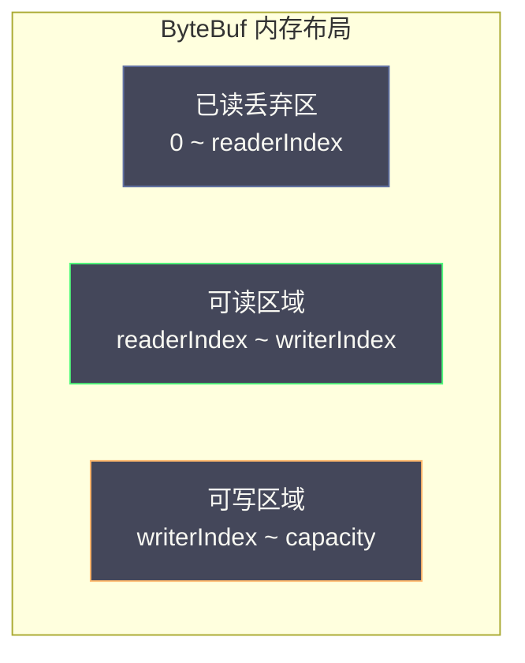

# ByteBuf——引用计数、池化与零拷贝

**摘要：**

如果说 `EventLoop` 是 Netty 的"心脏"，那么 `ByteBuf` 就是 Netty 的"血液"——网络通信中所有的数据读写都通过 `ByteBuf` 流转。Netty 没有复用 JDK 的 `ByteBuffer`，而是彻底重新设计了一套内存缓冲区体系。这个设计决策背后是对网络编程场景的深刻理解：`ByteBuffer` 的单指针模型在频繁读写切换时笨拙易错，固定容量无法适应动态长度的网络数据，缺少引用计数使得堆外内存的生命周期管理只能依赖 GC 的不确定回收。`ByteBuf` 相比 `ByteBuffer` 有三大核心优势：读写双指针消除了让人头疼的 `flip()` 调用，引用计数为堆外内存提供了精确的生命周期管理，池化内存通过 jemalloc 算法复用内存块消除了高并发下频繁分配释放的 GC 压力。本文从 `ByteBuffer` 的设计缺陷出发，深入剖析 `ByteBuf` 的读写指针机制、五种内存分配方式的选择策略、引用计数的工作原理与内存泄漏的排查方法、`CompositeByteBuf` 实现零拷贝聚合的原理，以及 `PooledByteBufAllocator` 的核心分配逻辑。

---

## 第 1 章 ByteBuffer 的设计缺陷

### 1.1 单指针模型的困境

要理解 `ByteBuf` 的设计动机，必须先回到 JDK 1.4 引入 NIO 时的 `ByteBuffer`。`ByteBuffer` 用三个属性——`capacity`、`position`、`limit`——描述缓冲区的状态，其中 `position` 指针同时承担"写入位置"和"读取位置"两个职责。写入时 `position` 向后移动，`flip()` 之后 `position` 回到 0 变成读取起始位置，`limit` 取代原来的 `position` 作为读取结束位置。这种"单指针复用"的设计在简单的顺序读写场景下勉强可用，但在网络编程的复杂场景中暴露了三个根本缺陷。

第一个缺陷是读写状态不能并存。在 `ByteBuffer` 中，要么是写模式，要么是读模式，不能同时进行读写。网络编程中常见一种"追加写"操作——先写入一些数据，然后读取验证，再追加写更多数据。用 `ByteBuffer` 实现这个操作需要频繁调用 `flip()` 和 `compact()`，代码逻辑混乱且容易出错：

```java
// ByteBuffer 的追加写（繁琐且容易出错）
ByteBuffer buf = ByteBuffer.allocate(1024);
buf.put("Hello".getBytes());     // 写
buf.flip();                       // 切换到读模式
byte[] data = new byte[5];
buf.get(data);                    // 读（验证）
buf.compact();                    // 将未读数据移到头部，切换回写模式
buf.put(", World!".getBytes());  // 再追加写
buf.flip();                       // 再切换回读模式
```

这段代码中 `flip()` 和 `compact()` 的调用顺序是 `ByteBuffer` 编程中最容易出错的地方——忘记 `flip()` 会导致读到 0 字节，忘记 `compact()` 会丢失未读数据。在网络协议的编解码中，这种读写切换更加频繁，一个 HTTP 请求的解析可能涉及多次"读一点、解析一点、再读一点"的循环，每次切换都需要小心翼翼地调用 `flip()`/`compact()`。

第二个缺陷是不支持动态扩容。`ByteBuffer` 是固定容量的，一旦创建不能扩容。网络数据的长度往往是动态的——HTTP 响应体可以从几百字节到几十兆字节，预先分配固定大小的缓冲区要么浪费内存（分配过大），要么在数据超出容量时无法处理（分配过小）。程序员必须自己实现"缓冲区不够时分配更大的并拷贝"的逻辑，这增加了代码复杂度且容易引入 bug。

第三个缺陷是缺少便利方法。`ByteBuffer` 的 API 设计比较原始，没有 `writeInt()`/`writeUtf8String()` 这类便利方法，也不支持链式调用，使用体验差。写一个 int 需要手动拆成 4 个字节用 `put()` 写入，写一个字符串需要先转成 `byte[]` 再写入，这些繁琐的操作在网络编程中每天都要重复无数次。

### 1.2 ByteBuf 的解决方案

Netty 的 `ByteBuf` 用两个独立指针彻底解决了这些问题。`readerIndex` 是下一个要读取的位置，`readXxx()` 后自动前进；`writerIndex` 是下一个要写入的位置，`writeXxx()` 后自动前进。两个指针独立工作，读写互不干扰，不再需要 `flip()`。`capacity` 可以动态扩展，通过 `ensureWritable(n)` 触发。



```java
// ByteBuf 的读写（直观自然，无需 flip()）
ByteBuf buf = Unpooled.buffer(1024);

// 写入（writerIndex 自动前进）
buf.writeBytes("Hello".getBytes());
buf.writeInt(42);
buf.writeLong(System.currentTimeMillis());

// 直接读取（readerIndex 自动前进），无需 flip()
byte[] strBytes = new byte[5];
buf.readBytes(strBytes);
int num = buf.readInt();
long timestamp = buf.readLong();
```

双指针设计的精妙之处在于它把"写状态"和"读状态"解耦了——你可以随时写入新数据（`writerIndex` 前进），也可以随时读取已写入的数据（`readerIndex` 前进），两者互不影响。在网络编程中，这意味着你可以一边从网络读取数据到 `ByteBuf`，一边解析已读取的部分，不需要在读写之间切换模式。这个看似简单的改进，大幅降低了网络编程的心智负担——`ByteBuf` 的 API 使用起来就像在读一本可以随时 append 的书，而不是在一块固定黑板上反复擦写。

### 1.3 动态扩容的实现

`ByteBuf` 的动态扩容是通过 `ensureWritable(int minWritableBytes)` 实现的。当写入操作发现 `writableBytes()` 不足以容纳新数据时，会调用 `ensureWritable` 触发扩容。扩容策略是：新容量为 `capacity` 的两倍与 `writerIndex + minWritableBytes` 的较大者，但不超过 `maxCapacity`。如果新容量仍不够，且未超过 `maxCapacity`，则直接设为 `writerIndex + minWritableBytes`；如果超过 `maxCapacity`，抛出 `IndexOutOfBoundsException`。

```java
// 扩容逻辑（简化版）
public ByteBuf ensureWritable(int minWritableBytes) {
    if (minWritableBytes <= writableBytes()) {
        return this;  // 空间足够，无需扩容
    }
    if (minWritableBytes > maxCapacity - writerIndex) {
        throw new IndexOutOfBoundsException("...");  // 超过最大容量
    }
    // 计算新容量：max(capacity * 2, writerIndex + minWritableBytes)
    int newCapacity = calculateNewCapacity(writerIndex + minWritableBytes, maxCapacity);
    capacity(newCapacity);  // 实际扩容（涉及内存分配和数据拷贝）
}
```

扩容涉及内存分配和数据拷贝——新分配一块更大的内存，将旧数据拷贝过去，释放旧内存。这个代价是不可避免的，但 Netty 的两倍扩容策略（类似 `ArrayList`）保证了均摊 O(1) 的写入复杂度——连续写入 n 字节的总拷贝次数不超过 n，均摊到每次写入是 O(1)。在实践中，合理设置初始容量可以减少扩容次数——如果你知道大致的数据量，用 `ctx.alloc().buffer(estimatedSize)` 而非默认容量，可以避免多次扩容。

池化 `ByteBuf` 的扩容有一个特殊处理：扩容时不会立即分配新内存，而是从内存池中申请更大的内存块，将旧数据拷贝到新块，旧块归还到内存池。这个过程对调用方透明，但涉及内存池的操作，比非池化的扩容更复杂。这也是为什么池化 `ByteBuf` 的扩容性能在极端场景下可能不如非池化——内存池的分配可能涉及跨 Arena 的协调，而非池化只是简单的 `System.arraycopy`。

---

## 第 2 章 ByteBuf 的五种分类

### 2.1 按内存位置分类：堆内 vs 堆外

`ByteBuf` 按内存位置分为堆内（Heap）和堆外（Direct）两种。堆内缓冲区的内存分配在 JVM 堆上，受 GC 管理，创建快，有 `byte[]` 作为底层存储便于直接操作。缺点是做 I/O 时需要额外的一次内存拷贝——JVM 在执行 `channel.write(heapByteBuf)` 时，必须先将堆内数据拷贝到堆外临时缓冲区，再进行 I/O。这是因为 GC 可能移动堆对象导致地址不固定，而内核 DMA 需要固定地址的缓冲区。

```java
// 堆内 ByteBuf
ByteBuf heapBuf = Unpooled.buffer(1024);
System.out.println(heapBuf.hasArray());    // true：有底层 byte[]
byte[] array = heapBuf.array();           // 直接访问底层数组
```

堆外缓冲区的内存分配在 JVM 堆外（操作系统内存），不受 GC 管理。I/O 操作时不需要额外拷贝——内核可以直接 DMA 读写这块内存，性能更好。缺点是分配和释放代价高（涉及系统调用），不受 GC 管理（需要手动释放，Netty 通过引用计数管理）。

```java
// 堆外 ByteBuf（推荐用于 I/O 操作）
ByteBuf directBuf = Unpooled.directBuffer(1024);
System.out.println(directBuf.hasArray());   // false：没有底层 byte[]
System.out.println(directBuf.isDirect());   // true
```

> [!info] Netty 默认使用堆外内存
> `PooledByteBufAllocator.DEFAULT` 默认分配堆外直接内存（`preferDirect = true`），因为 Netty 的主要场景是网络 I/O，堆外内存减少了一次数据拷贝，性能更好。如果你看到 Handler 中创建了堆内 ByteBuf，在写出时 Netty 会自动检测并在写入网卡之前将其转换为堆外内存。这个转换是隐式的，但会有额外的拷贝开销。

堆内和堆外的选择是"便利性 vs 性能"的权衡。堆内 `ByteBuf` 的优势在于可以通过 `array()` 直接访问底层数组，便于在业务逻辑中与遗留代码（如期望 `byte[]` 的 API）交互。堆外 `ByteBuf` 的优势在于 I/O 性能——避免了堆内到堆外的拷贝，在数据量大时这个优势显著。Netty 的默认选择是堆外，但在需要频繁访问底层数组的场景（如某些序列化框架），堆内可能更合适。

堆外内存还有一个隐含的优势：它不受 GC 停顿的影响。在 Stop-The-World GC 期间，堆内对象的地址可能被移动（压缩 GC），而堆外内存的地址是固定的。这意味着即使 GC 正在进行，堆外 `ByteBuf` 的 I/O 操作也不会被阻塞——内核可以继续 DMA 读写堆外内存。对于延迟敏感的应用，这个特性有额外价值——GC 停顿期间网络 I/O 仍然可以继续，只是 `EventLoop` 线程被 GC 暂停无法处理事件回调。

### 2.2 按是否池化分类：池化 vs 非池化

`ByteBuf` 按是否池化分为池化（Pooled）和非池化（Unpooled）两种。非池化每次分配创建新的内存，用完释放，适合临时性、一次性使用的场景。池化从内存池中取出预先分配好的内存块，用完归还（不真正释放，供下次复用），适合高并发、频繁分配释放的场景。

```java
// 非池化分配（每次 new 一个新的）
ByteBuf buf1 = Unpooled.buffer(1024);       // 非池化堆内
ByteBuf buf2 = Unpooled.directBuffer(1024); // 非池化堆外

// 池化分配（从内存池取出）
ByteBuf buf = PooledByteBufAllocator.DEFAULT.buffer(1024);
// 等价于
ByteBuf buf = ctx.alloc().buffer(1024);  // 在 Handler 中使用
```

池化内存的背后是 jemalloc 算法，第七篇将专门讲解。这里只需要记住一个结论：高并发场景下，池化内存对性能的提升是数量级的——JVM GC 无需频繁回收大量短生命周期的堆外内存，内存分配释放的开销接近 O(1)。Netty 4.x 之后默认使用 `PooledByteBufAllocator`，这个默认值的选择基于一个事实：网络服务器是高频分配释放 `ByteBuf` 的场景，池化的收益远大于其复杂度代价。

池化内存的引入并非一帆风顺。Netty 4.0 刚引入 `PooledByteBufAllocator` 时，曾出现过内存泄漏和分配不公平的问题——某些 `EventLoop` 的线程本地缓存积累了大量内存而不归还，导致整体内存占用远超实际需要。Netty 4.1 对池化分配器做了大量优化，包括更积极的内存归还策略、更精细的 `PoolThreadCache` 控制、以及 `Recycler` 的对象池化。这些优化使得池化分配器在生产环境中稳定可靠，但它的内部实现复杂度也大幅增加——理解 `PooledByteBufAllocator` 的源码需要同时理解 jemalloc 算法和 Netty 的线程模型，这是 Netty 中最复杂的模块之一。

### 2.3 四种组合

实际使用中，`ByteBuf` 的四种组合各有适用场景：

| 类型 | 创建方式 | 适用场景 |
|------|----------|----------|
| 池化堆外（默认推荐） | `ctx.alloc().directBuffer()` | 网络 I/O（减少拷贝 + 池化复用） |
| 池化堆内 | `ctx.alloc().heapBuffer()` | 业务逻辑中频繁创建的中间缓冲区 |
| 非池化堆外 | `Unpooled.directBuffer()` | 大块临时缓冲区（如文件传输） |
| 非池化堆内 | `Unpooled.buffer()` | 单元测试、简单场景 |

这个分类不是绝对的——在某些特殊场景下，你可能需要偏离默认选择。譬如在内存受限的嵌入式设备上，池化内存的"预分配"可能占用过多固定内存，此时非池化更合适。又譬如在需要与 JNI 代码交互的场景下，堆外内存可以通过指针直接传给 native 代码，避免了 JNI 的数组拷贝。理解每种组合的适用场景，才能在非典型场景中做出正确的选择。

### 2.4 堆外内存的分配代价

堆外内存的分配和释放代价远高于堆内内存——堆内内存只是 JVM 堆上的对象分配（TLAB 内的指针碰撞，纳秒级），堆外内存则需要通过 `Unsafe.allocateMemory()` 或 `ByteBuffer.allocateDirect()` 调用操作系统的 `malloc`/`mmap`，涉及系统调用和内核内存管理，微秒级甚至更高。释放同样昂贵——`Unsafe.freeMemory()` 或 `Cleaner` 触发的 `free()` 也是系统调用。

这就是池化内存存在的根本理由——通过复用已分配的内存块，避免每次都走系统调用分配释放。池化分配器在初始化时预分配一批内存块，后续的分配请求从池中获取（O(1) 的指针操作），释放时归还到池中（O(1) 的指针操作），只有在池中内存不足时才触发新的 `malloc`。在高频分配释放的场景下（如网络服务器每秒处理数万请求），池化把分配释放的代价从微秒级降到了纳秒级，性能提升可达数十倍。

堆外内存的另一个代价是"不可见性"——它不在 JVM 堆中，常规的 JVM 监控工具（如 `jmap`、`jvisualvm`）看不到它。你需要通过 Netty 的 `PlatformDependent.usedDirectMemory()` 或操作系统的 `pmap`、`/proc/<pid>/status` 来监控堆外内存使用量。在生产环境中，堆外内存泄漏（`ByteBuf` 未 `release`）会导致进程的 RSS 持续增长，最终被 OOM Killer 杀掉——而 JVM 堆内存可能完全正常，给排查带来困难。这就是为什么 `ResourceLeakDetector` 和引用计数如此重要——它们是堆外内存管理的"安全网"。

---

## 第 3 章 引用计数：堆外内存的生命周期管理

### 3.1 为什么堆外内存需要引用计数

JVM GC 只管理堆内内存。堆外内存（`DirectByteBuffer`）不在 GC 的管辖范围内，如果不主动释放，就会造成堆外内存泄漏。JDK 的 `DirectByteBuffer` 依赖 `PhantomReference` 加 `Cleaner` 机制：当 `DirectByteBuffer` 对象被 GC 回收时，`Cleaner` 会调用 `free()` 释放堆外内存。这个机制有两个问题。第一是延迟释放——堆外内存的释放依赖 GC 触发，而 GC 时机不可预测，可能积累大量未释放的堆外内存，即使 JVM 堆内存充足，也会因堆外内存耗尽报 `OutOfMemoryError: Direct buffer memory`。第二是无法池化——`Cleaner` 是单向的（只能释放，不能"归还"到池中），不支持内存池化复用。

Netty 引入引用计数（Reference Counting）来精确管理 `ByteBuf` 的生命周期。每个 `ByteBuf` 都有一个 `refCnt`（引用计数），初始值为 1。`retain()` 增加引用计数，表示又有一个地方持有这个 `ByteBuf`；`release()` 减少引用计数，表示这个持有者不再使用；当引用计数降为 0 时，立即释放内存（或归还到内存池）。

```java
// 引用计数的基本操作
ByteBuf buf = ctx.alloc().directBuffer(1024);
System.out.println(buf.refCnt());  // 1（刚创建）

buf.retain();                       // 引用计数 → 2（另一个地方持有）
System.out.println(buf.refCnt());  // 2

buf.release();                      // 引用计数 → 1
System.out.println(buf.refCnt());  // 1

buf.release();                      // 引用计数 → 0，内存被释放（或归还池中）
// 此后不能再使用 buf！访问已释放的 ByteBuf 会抛出 IllegalReferenceCountException
```

引用计数相比 GC 的优势在于"确定性"——内存的释放时机是明确的（引用计数归零时），而非依赖 GC 的不确定触发。这对于堆外内存尤为重要——堆外内存不受 GC 管理，如果用 GC 机制回收，释放时机完全不可控。引用计数的代价是"必须手动管理"——程序员必须确保每个 `retain()` 都有对应的 `release()`，否则内存泄漏。这个代价是 Netty 用确定性换取的——在网络编程中，内存泄漏的排查成本远高于手动管理引用计数的编码成本。

引用计数的实现有一个值得注意的细节：Netty 4.1 之后的 `refCnt` 用 `AtomicIntegerFieldUpdater` 或 `VarHandle` 实现 CAS 操作，确保 `retain()` 和 `release()` 的线程安全。但早期的 Netty 4.0 用 `synchronized` 实现引用计数的更新，在高并发下有锁竞争。4.1 改用 CAS 后，引用计数的更新变成了无锁操作，性能显著提升。这个改进看似微小，但在每秒数万次 `retain`/`release` 的场景下，锁竞争的消除是可观的性能收益。

引用计数还有一个微妙的并发问题：`release()` 把计数从 1 减到 0 时，必须确保之后不会有其他线程再 `retain()`——否则会"复活"一个已经被释放的 `ByteBuf`。Netty 的处理方式是：`release()` 把计数减到 0 后，`ByteBuf` 被标记为"已释放"，后续的 `retain()` 会抛出 `IllegalReferenceCountException`。这个"不可复活"的设计确保了释放操作的确定性——一旦释放，内存就真的归还了，不会被意外复活。

### 3.2 谁负责释放 ByteBuf

引用计数模型要求"谁持有，谁负责最终释放"。在 Netty 的使用规范中，有三条规则需要遵守。

**规则一：入站消息由消费方释放。** Netty 读取网络数据后创建 `ByteBuf`，传入 `ChannelPipeline`。这个 `ByteBuf` 的初始 `refCnt = 1`，责任链中的 Handler 需要确保最终被释放。如果 Handler 消费了消息（不再往下传），必须调用 `ReferenceCountUtil.release(msg)` 释放；如果 Handler 转发了消息（调用 `ctx.fireChannelRead(msg)`），则由下游 Handler 负责；`TailContext`（Pipeline 末端）会自动释放未被消费的 `ByteBuf`，作为最后防线。

`SimpleChannelInboundHandler<T>` 自动处理了这个问题：

```java
public abstract class SimpleChannelInboundHandler<I> extends ChannelInboundHandlerAdapter {
    @Override
    public void channelRead(ChannelHandlerContext ctx, Object msg) throws Exception {
        boolean release = true;
        try {
            if (acceptInboundMessage(msg)) {
                channelRead0(ctx, (I) msg);  // 调用子类的业务处理方法
            } else {
                release = false;
                ctx.fireChannelRead(msg);  // 类型不匹配，往下传
            }
        } finally {
            if (autoRelease && release) {
                ReferenceCountUtil.release(msg);  // 自动释放
            }
        }
    }

    protected abstract void channelRead0(ChannelHandlerContext ctx, I msg) throws Exception;
}
```

**规则二：出站消息由 Netty 自动释放。** `channel.writeAndFlush(msg)` 后，Netty 在数据实际写入网络（或写失败）后会自动释放 `msg`。调用者不应该在 `writeAndFlush()` 之后再次释放，否则引用计数会变为负数，抛出 `IllegalReferenceCountException`。

**规则三：自己创建的 ByteBuf 自己负责释放。** 如果在 Handler 中创建了 `ByteBuf` 但没有通过 `write()` 传出（譬如构建了响应但发送失败），必须手动释放：

```java
ByteBuf response = ctx.alloc().buffer();
try {
    buildResponse(response);
    ctx.writeAndFlush(response);
    response = null;  // 置 null，避免在 finally 中双重释放
} finally {
    if (response != null) {
        response.release();  // writeAndFlush 之前出现异常，手动释放
    }
}
```

这三条规则的核心思想是"所有权转移"——`ByteBuf` 从一个地方传到另一个地方时，释放责任也随之转移。`channelRead` 收到的 `ByteBuf`，如果你消费了它，释放责任在你；如果你传给下游，释放责任在下游。`writeAndFlush` 传出的 `ByteBuf`，释放责任在 Netty。这个"所有权转移"模型虽然简单，但在实践中容易出错——特别是在异常路径和分支逻辑中，很容易忘记释放或重复释放。

### 3.3 引用计数与 Pipeline 的协作

`ByteBuf` 的引用计数与 `ChannelPipeline` 的事件传播机制紧密协作，确保 `ByteBuf` 在 Pipeline 中的传递不会泄漏。入站 `ByteBuf` 从 `HeadContext` 进入 Pipeline，沿链路向 tail 传播。每个 Handler 有三种选择：消费消息（调用 `release` 后不传）、转发消息（调用 `fireChannelRead` 传递，不 `release`）、转换消息（消费原 `ByteBuf`，创建新 `ByteBuf` 传给下游）。`TailContext` 作为最后防线，会自动释放到达它的未被消费的 `ByteBuf`。

这个机制保证了只要 Pipeline 配置正确，入站 `ByteBuf` 不会泄漏——即使所有 Handler 都不处理，`TailContext` 也会释放。但出站 `ByteBuf` 的生命周期更复杂——`writeAndFlush` 把 `ByteBuf` 放入 Channel 的出站缓冲区（`ChannelOutboundBuffer`），实际写入网络后释放。如果写入失败（如连接已关闭），`ByteBuf` 也会被释放。但如果 `EventLoop` 关闭时还有未写出的 `ByteBuf`，这些 `ByteBuf` 的释放依赖于 `ChannelOutboundBuffer` 的清理逻辑——Netty 在 Channel 关闭时会释放所有未写出的 `ByteBuf`，确保不泄漏。

理解引用计数与 Pipeline 的协作，是排查内存泄漏的关键。当你看到 `ResourceLeakDetector` 报告泄漏时，日志中的"Recent access records"会显示 `ByteBuf` 最后被哪些 Handler 操作过——沿着这个调用链回溯，通常能定位到"哪个 Handler 忘记了 release"或"哪个 Handler 在消费后还调用了 fireChannelRead"。

### 3.3 内存泄漏检测

Netty 提供了内置的内存泄漏检测机制，通过 `ResourceLeakDetector` 实现。检测级别有四种：`DISABLED` 关闭检测，生产环境最高性能但无法发现泄漏；`SIMPLE`（默认）随机抽样约 1% 的 `ByteBuf` 进行跟踪，极低开销；`ADVANCED` 抽样跟踪且记录访问位置的完整堆栈，开销中等；`PARANOID` 跟踪所有 `ByteBuf`，记录完整堆栈，性能影响大，仅用于调试。

```java
// 启动时通过 JVM 参数设置
// -Dio.netty.leakDetection.level=ADVANCED
ResourceLeakDetector.setLevel(ResourceLeakDetector.Level.PARANOID);
```

检测原理是 `ResourceLeakDetector` 使用 `PhantomReference`（幽灵引用）监控 `ByteBuf` 对象。当 `ByteBuf` 对象被 GC 回收时（说明 Java 层的引用都消失了），`ResourceLeakDetector` 检查引用计数是否已经归零。如果没有（内存未被显式释放），说明发生了内存泄漏，打印警告日志：

```
LEAK: ByteBuf.release() was not called before it's garbage-collected.
  Recent access records:
    #1: io.netty.handler.codec.http.HttpObjectDecoder.decode(HttpObjectDecoder.java:284)
    #2: io.netty.handler.codec.ByteToMessageDecoder.channelRead(ByteToMessageDecoder.java:275)
```

> [!warning] 生产环境建议
> 建议在测试环境使用 `PARANOID` 级别排查所有内存泄漏，在预发/生产环境使用 `SIMPLE` 级别（几乎零开销，但能发现约 1% 的泄漏样本）。发现泄漏后，临时切换到 `ADVANCED` 级别定位具体的泄漏位置。`PARANOID` 级别在生产环境中不可用——它跟踪所有 `ByteBuf` 的所有访问，性能影响极大，足以让一个高性能服务器变成慢动作。

`ResourceLeakDetector` 的设计有一个值得注意的细节：它用 `PhantomReference` 而非 `WeakReference` 来监控对象。`PhantomReference` 在对象被 GC 回收前不会进入引用队列，确保了检测不会干扰对象的正常生命周期——只有当对象真的要被回收时，检测逻辑才介入。这个选择体现了 Netty 对细节的严谨——用错误的引用类型会导致检测本身影响被检测对象的行为，引入难以发现的副作用。

### 3.5 引用计数的性能影响

引用计数的 `retain()`/`release()` 操作虽然只是 CAS 加条件判断，但在高频调用下仍有可观的累积开销。Netty 4.1 对此做了优化：`ByteBuf` 的 `refCnt` 字段用 `AtomicIntegerFieldUpdater` 更新，`retain()` 和 `release()` 都是无锁的 CAS 操作。但 CAS 在高并发下仍可能产生竞争——多个线程同时操作同一个 `ByteBuf` 的引用计数时，CAS 会重试。

在实践中，`ByteBuf` 的引用计数操作通常在同一个 `EventLoop` 线程中完成（入站 `ByteBuf` 从读取到消费都在 `EventLoop` 线程），CAS 竞争很少发生。只有在跨线程传递 `ByteBuf`（譬如从 `EventLoop` 传给业务线程池）时，引用计数才涉及多线程操作。Netty 的 `retain()` 和 `release()` 设计为线程安全的，但你应该尽量避免不必要的跨线程引用计数操作——譬如不要在业务线程池中 `retain` 一个 `ByteBuf` 然后异步处理，而是应该在 `EventLoop` 线程中完成 `ByteBuf` 的读取和转换，把转换后的 Java 对象（而非 `ByteBuf`）传给业务线程池。

---

## 第 4 章 ByteBuf 的核心 API

### 4.1 读写 API

`ByteBuf` 提供两种读写方式。相对读写随 `readerIndex`/`writerIndex` 移动，是最常用的方式：

```java
ByteBuf buf = Unpooled.buffer(64);

// 写入（writerIndex 自动前进）
buf.writeByte(0x01);                       // 写 1 字节
buf.writeShort(0x0203);                    // 写 2 字节
buf.writeInt(0x04050607);                  // 写 4 字节
buf.writeLong(0x0809101112131415L);        // 写 8 字节
buf.writeBytes("Hello".getBytes());        // 写字节数组
buf.writeCharSequence("World", CharsetUtil.UTF_8);  // 写字符串

// 读取（readerIndex 自动前进）
byte b = buf.readByte();
short s = buf.readShort();
int i = buf.readInt();
long l = buf.readLong();
byte[] bytes = new byte[5];
buf.readBytes(bytes);
String str = buf.readCharSequence(5, CharsetUtil.UTF_8).toString();
```

绝对读写指定下标，不移动 `readerIndex`/`writerIndex`，适合在已知偏移量的情况下随机访问数据（如解析固定格式的二进制协议头部）：

```java
// 绝对写（指定 index，不改变 writerIndex）
buf.setByte(0, 0xFF);
buf.setInt(4, 12345);

// 绝对读（指定 index，不改变 readerIndex）
byte val = buf.getByte(0);
int num = buf.getInt(4);
```

`ByteBuf` 还提供了丰富的便利方法：`writeBoolean`/`readBoolean`、`writeFloat`/`readFloat`、`writeDouble`/`readDouble`、`writeMedium`/`readMedium`（3 字节中等整数，在某些协议中用于节省空间）、`writeBytes(InputStream)`/`readBytes(OutputStream)`（与流交互）。这些便利方法大幅简化了网络编程中的数据操作——你不需要手动拆解基本类型为字节，`ByteBuf` 已经为你做好了。

### 4.2 缓冲区查询与维护

```java
int readableBytes = buf.readableBytes();    // 可读字节数 = writerIndex - readerIndex
int writableBytes = buf.writableBytes();    // 可写字节数 = capacity - writerIndex
boolean readable = buf.isReadable();       // 是否有数据可读
boolean writable = buf.isWritable();       // 是否有空间可写
int capacity = buf.capacity();            // 当前容量（可动态扩展）
int maxCapacity = buf.maxCapacity();      // 最大容量上限

// 回收已读区域：将 readerIndex 重置为 0，将可读区域移到头部
buf.discardReadBytes();  // 释放 [0, readerIndex) 的空间
```

`discardReadBytes()` 是一个需要谨慎使用的方法——它会将可读区域的数据移动到缓冲区头部，释放已读区域的空间供写入使用。这个操作涉及内存拷贝（`System.arraycopy`），有性能开销。在已读区域远大于可读区域时，这个操作是值得的；在已读区域很小时，不如直接分配新的 `ByteBuf`。Netty 的 `ByteToMessageDecoder` 在累积缓冲区的已读区域超过一定比例时会自动调用 `discardReadBytes()` 或压缩缓冲区，避免内存浪费。

### 4.3 派生缓冲区

Netty 提供了多种从已有 `ByteBuf` 创建派生缓冲区的方法：

```java
// slice()：创建一个共享底层内存的子缓冲区（不拷贝数据）
ByteBuf slice = buf.slice(0, 10);  // 取 [0, 10) 的区域

// duplicate()：创建一个共享整个底层内存的副本（独立的 readerIndex/writerIndex）
ByteBuf dup = buf.duplicate();

// copy()：创建一个完全独立的拷贝（深拷贝，不共享内存）
ByteBuf copy = buf.copy();

// readSlice()：从当前 readerIndex 读取 n 字节的 slice（readerIndex 前进 n）
ByteBuf header = buf.readSlice(4);
```

> [!warning] slice 和 duplicate 的引用计数陷阱
> `slice()`/`duplicate()` 创建的派生缓冲区与原缓冲区**共享引用计数**，但并不自动增加引用计数。如果你将 `slice` 传出当前作用域（譬如传给另一个 Handler），必须先调用 `slice.retain()`（增加引用计数），否则原缓冲区释放后，`slice` 访问的内存就变成了"悬空指针"。这是 `ByteBuf` 内存泄漏和野指针问题的高发场景之一，初学者几乎都会在这里踩坑。

派生缓冲区的"共享内存但不共享引用计数"设计看似矛盾，实则有它的道理。`slice()` 和 `duplicate()` 的常见用法是在当前作用域内创建一个临时视图——你创建 `slice`，用它做一些操作，然后丢弃它，原缓冲区的生命周期不受影响。如果 `slice()` 自动 `retain()`，你就需要在每次使用完 `slice` 后手动 `release()`，增加了编码负担。Netty 选择了"不自动 `retain`"的设计，让程序员在需要跨作用域传递 `slice` 时显式 `retain()`——这是一个"默认不安全、显式才安全"的设计，虽然容易踩坑，但避免了"每次 `slice` 都要 `release`"的繁琐。

### 4.4 ByteBuf 的工具类

Netty 提供了两个常用的 `ByteBuf` 工具类：`Unpooled` 和 `ByteBufUtil`。`Unpooled` 是非池化分配的工厂方法集合，提供了 `buffer()`、`directBuffer()`、`wrappedBuffer()`、`copiedBuffer()` 等静态方法。`ByteBufUtil` 提供了 `hexDump()`（十六进制转储，用于调试）、`equals()`（比较两个 `ByteBuf` 内容）、`writeUtf8()`（写入 UTF-8 字符串）等工具方法。

`Unpooled.wrappedBuffer(byte[])` 是一个常用的方法——它把一个已有的 `byte[]` 包装成 `ByteBuf`，不拷贝数据，直接共享数组。这个方法在将遗留代码的 `byte[]` 传入 Netty 时很有用，但要注意：包装后的 `ByteBuf` 持有 `byte[]` 的引用，`release()` 时不会释放数组（数组由 GC 管理），只会释放 `ByteBuf` 对象本身。如果你修改了原始 `byte[]`，`ByteBuf` 的内容也会变化——因为它们共享同一块内存。

`Unpooled.copiedBuffer(byte[])` 与 `wrappedBuffer` 的区别在于它会拷贝数据——创建一个新的 `ByteBuf`，把 `byte[]` 的内容拷贝进去。这个方法更安全（修改原数组不影响 `ByteBuf`），但有拷贝开销。在性能敏感的场景下，优先用 `wrappedBuffer`；在需要数据隔离的场景下，用 `copiedBuffer`。

---

## 第 5 章 CompositeByteBuf：零拷贝的数据聚合

### 5.1 聚合多个缓冲区的朴素做法与其代价

网络编程中，经常需要将多个独立的 `ByteBuf` 组合成一个逻辑上连续的缓冲区。譬如 HTTP 响应的头部（Header）和正文（Body）分别存储在不同的 `ByteBuf` 中，发送时需要合并为一个完整的响应。朴素做法是分配一个新的 `ByteBuf`，将两个部分的数据依次拷贝进去：

```java
// 朴素做法：数据拷贝合并（有性能损耗）
ByteBuf header = buildHeader();    // 假设 200 字节
ByteBuf body = buildBody();        // 假设 50000 字节

ByteBuf combined = ctx.alloc().buffer(header.readableBytes() + body.readableBytes());
combined.writeBytes(header);       // 数据拷贝！200 字节
combined.writeBytes(body);         // 数据拷贝！50000 字节

ctx.writeAndFlush(combined);
header.release();
body.release();
combined.release();
```

这种做法对于大文件传输来说，每次请求都要额外拷贝数万字节，在高并发下会造成可观的 CPU 和内存带宽消耗。数据在内存中存在两份（原 `ByteBuf` 一份，合并后的 `ByteBuf` 一份），拷贝过程消耗 CPU 时间和内存带宽，合并后的 `ByteBuf` 还需要额外分配内存。

### 5.2 CompositeByteBuf：逻辑聚合，物理不拷贝

`CompositeByteBuf` 允许将多个 `ByteBuf` 组合成一个逻辑上连续的视图，不进行实际的数据拷贝：

```java
// 零拷贝聚合
CompositeByteBuf composite = ctx.alloc().compositeBuffer();
composite.addComponents(true, header, body);
// true 参数表示：自动增加各组件的引用计数，并更新 writerIndex

// 外部使用者看到的是一个连续的缓冲区，但底层是两块独立的内存
System.out.println(composite.readableBytes());  // header + body 的可读字节数

// 读取时 CompositeByteBuf 负责跨组件的透明读取
byte firstByte = composite.readByte();  // 从 header 读

ctx.writeAndFlush(composite);  // 发送
composite.release();  // 释放（内部组件的引用计数随之减少）
```

`CompositeByteBuf` 内部维护一个组件列表（`Component` 数组），每个组件记录起始偏移量。读取时，根据当前 `readerIndex` 计算属于哪个组件，再在该组件的 `ByteBuf` 上进行实际读取。这个设计让多个物理上不连续的内存块在逻辑上呈现为连续的缓冲区，调用方不需要关心数据实际存储在哪里。

这就是 Netty 所谓的"零拷贝"之一——数据在内存中只存在一份，通过逻辑聚合的方式呈现为连续视图，消除了数据拷贝。`CompositeByteBuf` 配合操作系统的 `GatheringByteChannel`（聚集写）可以进一步优化——`write()` 调用时，内核一次性从多个内存区域读取数据并发送到网卡，无需在用户态合并。

### 5.3 CompositeByteBuf 的代价与边界

`CompositeByteBuf` 虽然消除了数据拷贝，但它不是免费的。第一，随机访问的代价更高——`getByte(index)` 需要先二分查找定位属于哪个组件，再在该组件上访问，时间复杂度从 O(1) 变为 O(log n)。对于顺序读取（`readByte()` 连续调用），`CompositeByteBuf` 会缓存当前组件的引用，访问效率接近普通 `ByteBuf`；但对于随机访问，性能差距明显。第二，组件数量过多时，组件列表本身的管理开销增大——每次 `addComponent` 都可能触发数组扩容，组件的元数据（偏移量、长度）也占用内存。第三，`CompositeByteBuf` 不支持 `hasArray()` 和 `array()`——因为它没有单一的底层 `byte[]`，无法直接暴露给需要 `byte[]` 的 API。

因此，`CompositeByteBuf` 的适用场景是"少量大块内存的逻辑聚合"——譬如 HTTP 响应的 Header 和 Body，两三个组件，顺序读取，发送后释放。如果你需要频繁随机访问或组件数量很多，直接拷贝合并到一个普通 `ByteBuf` 中可能更快。"零拷贝"不是银弹，在特定场景下它的间接开销可能超过直接拷贝。

### 5.4 CompositeByteBuf 的内部实现

`CompositeByteBuf` 的内部实现值得深入理解。它维护一个 `Component` 数组，每个 `Component` 包装了一个子 `ByteBuf` 及其在组合缓冲区中的偏移量信息（`offset` 表示该组件在组合缓冲区中的起始位置）。当调用 `readByte()` 时，`CompositeByteBuf` 根据当前 `readerIndex` 二分查找定位到对应的 `Component`，计算在该 `Component` 内的相对偏移量，然后调用该 `Component` 的 `ByteBuf` 的 `getByte()` 读取。

`addComponents(true, buf1, buf2)` 的 `true` 参数表示"自动 `retain`"——调用后每个组件的引用计数增加 1，`CompositeByteBuf` 成为这些组件的额外持有者。当 `CompositeByteBuf` 被 `release()` 时，它的引用计数归零，会依次 `release` 所有组件，组件的引用计数减 1。这个设计确保了 `CompositeByteBuf` 持有期间，组件不会被意外释放——即使原始创建者已经 `release` 了组件，`CompositeByteBuf` 的 `retain` 保证了组件内存仍然有效。

`CompositeByteBuf` 的扩容（`addComponent` 时组件数组不够大）涉及数组拷贝，有 O(n) 的开销。因此，如果你知道组件数量，可以用 `ctx.alloc().compositeBuffer(expectedNumComponents)` 预分配数组，避免扩容。在大多数场景下，组件数量很少（2-3 个），扩容开销可以忽略。

### 5.4 Netty 的其他零拷贝机制

除了 `CompositeByteBuf`，Netty 还有两种零拷贝技术。

**slice 零拷贝**：如前所述，`buf.slice(offset, length)` 返回的是原缓冲区某段内存的只读视图，不拷贝数据。在解析消息时，可以直接用 `slice` 引用原始字节数据中的某个字段，而不是将字段数据拷贝到新的 `ByteBuf`。譬如解析一个包含 header 和 payload 的消息，可以用 `slice` 分别引用 header 部分和 payload 部分，避免拷贝。

**FileRegion（sendfile 系统调用）**：在 Netty 中，将文件内容发送给客户端时，可以使用 `DefaultFileRegion`，它封装了 JDK `FileChannel.transferTo()`，底层触发 Linux 的 `sendfile()` 系统调用，实现内核态的零拷贝文件传输——数据从文件直接传输到网卡，不经过用户态：

```java
// 零拷贝文件发送
FileChannel fileChannel = new FileInputStream("large_file.zip").getChannel();
FileRegion region = new DefaultFileRegion(fileChannel, 0, fileChannel.size());
ctx.writeAndFlush(region);  // 底层：sendfile()，不经过用户态
```

`sendfile()` 的零拷贝比 `CompositeByteBuf` 更彻底——它不仅消除了用户态的数据拷贝，还消除了内核态的数据拷贝（数据从文件系统缓冲区直接 DMA 到网卡）。但 `sendfile()` 只能用于文件到网络的传输，不能用于任意内存到网络的传输——它的适用场景比 `CompositeByteBuf` 窄，但在文件下载、静态资源分发等场景下性能优势显著。

### 5.5 零拷贝的整体视角

把 Netty 的三种零拷贝技术放在一起看，可以发现它们作用于数据传输的不同环节。`CompositeByteBuf` 消除了"多个缓冲区合并"时的用户态拷贝；`slice` 消除了"提取子缓冲区"时的用户态拷贝；`sendfile` 消除了"文件到网络"时的用户态和内核态拷贝。这三种技术覆盖了网络编程中最常见的三种数据拷贝场景，组合使用可以最大化减少内存拷贝。

但零拷贝不是没有代价的。`CompositeByteBuf` 的随机访问变慢，`slice` 的引用计数管理更复杂，`sendfile` 只能用于文件传输。在数据量小的场景下（如几十字节的协议头），零拷贝的间接开销可能超过直接拷贝——分配一个 `CompositeByteBuf` 的元数据（组件数组、偏移量）可能比拷贝几十字节更耗时。零拷贝是"大数据量优化"，不是"小数据量优化"——理解这个边界，才能在合适的场景使用合适的零拷贝技术。

---

## 第 6 章 ByteBufAllocator：分配器的选择

### 6.1 三种分配器

Netty 提供了三种 `ByteBufAllocator` 实现。`PooledByteBufAllocator`（默认，推荐）基于内存池的分配器，采用 jemalloc 算法管理内存块复用，适合高并发、频繁创建释放 `ByteBuf` 的场景。`UnpooledByteBufAllocator` 每次都分配新内存，用完释放，适合内存使用量不可预测的场景（避免内存池占用过多固定内存）。`PreferHeapByteBufAllocator` 包装另一个分配器，优先分配堆内内存。

```java
// 两种等效方式获取 PooledByteBufAllocator
ByteBuf buf = PooledByteBufAllocator.DEFAULT.buffer(1024);
ByteBuf buf = ctx.alloc().buffer(1024);  // ctx.alloc() 默认返回 PooledByteBufAllocator
```

### 6.2 在 ServerBootstrap 中配置分配器

```java
// 为所有新建的 Channel 配置 ByteBufAllocator
serverBootstrap
    .childOption(ChannelOption.ALLOCATOR, PooledByteBufAllocator.DEFAULT);
```

也可以在 Handler 中通过 `ctx.alloc()` 获取当前 Channel 配置的分配器，这是在 Handler 中创建 `ByteBuf` 的推荐方式（而非直接使用 `Unpooled` 工具类）：

```java
@Override
public void channelRead(ChannelHandlerContext ctx, Object msg) {
    ByteBuf response = ctx.alloc().buffer(1024);
    try {
        buildResponse(response, (ByteBuf) msg);
        ctx.writeAndFlush(response);
        response = null;
    } finally {
        if (response != null) response.release();
    }
}
```

`ctx.alloc()` 返回的分配器与 Channel 绑定，确保了分配的 `ByteBuf` 在同一 `EventLoop` 线程中被创建和释放——这对于池化分配器的性能至关重要，因为 `PooledByteBufAllocator` 内部为每个 `EventLoop` 维护了线程本地缓存（`PoolThreadCache`），同线程的分配和释放可以走快速路径，跨线程则走慢速路径。

### 6.3 池化 vs 非池化的选择

虽然 Netty 默认使用池化分配器，但在某些场景下非池化更合适。第一，内存受限的嵌入式环境——池化分配器会预分配一定大小的内存块作为内存池，在内存非常紧张的环境中，这个预分配可能占用过多资源。第二，`ByteBuf` 的生命周期极长且数量少——如果 `ByteBuf` 创建后长期持有（如连接的会话缓冲区），池化的复用优势无法发挥，反而增加了内存池的管理开销。第三，调试和排查内存问题时——非池化分配器的行为更简单直接，每个 `ByteBuf` 都是独立分配的，容易在堆 dump 中追踪。

在大多数生产场景中，池化分配器是正确的选择——网络服务器的 `ByteBuf` 生命周期通常很短（一个请求-响应周期），分配释放频率极高，池化的复用收益远大于其复杂度代价。但理解池化的边界，才能在非典型场景中做出正确的选择——没有"永远正确"的默认值，只有"适合当前场景"的选择。

### 6.4 池化分配器的内存占用

`PooledByteBufAllocator` 的内存占用是生产环境中需要关注的指标。池化分配器在初始化时会创建多个 `PoolArena`（默认 `CPU 核数 * 2` 个堆 Arena 和 `CPU 核数 * 2` 个直接 Arena），每个 Arena 预分配一定大小的 `PoolChunk`（默认 16MB）。这意味着即使没有任何分配请求，池化分配器也会占用 `Arena 数 * Chunk 大小` 的内存——在 16 核服务器上，直接内存的预分配约为 `32 * 16MB = 512MB`。

这个预分配不是立即占用 512MB 物理内存——`PoolChunk` 的底层是按需分配的（`ByteBuffer.allocateDirect` 在 Linux 上用 `mmap` 分配，只有访问时才真正占用物理内存），但虚拟内存地址空间会被预留。在生产环境中，如果你发现 Netty 进程的虚拟内存很大但物理内存（RSS）正常，这通常是池化分配器的预分配导致的，不是内存泄漏。

如果你需要限制池化分配器的内存占用，可以通过 `PooledByteBufAllocator` 的构造函数调整 `chunkSize`、`arenaCount` 等参数，或通过 `io.netty.allocator.numDirectArenas`、`io.netty.allocator.chunkSize` 等系统属性配置。在内存受限的环境中，减少 Arena 数量或 Chunk 大小可以降低预分配，但会增加分配时的竞争（Arena 少）或碎片（Chunk 小）——这是另一个需要权衡的参数。

---

## 第 7 章 ByteBuf 使用规范总结

### 7.1 核心使用规范

将 `ByteBuf` 的核心使用规范总结为以下几点，是生产代码中防止内存泄漏的关键。

**规范一：谁创建谁负责最终释放（或传递责任）。** 在 `channelRead` 中，如果消费了 `ByteBuf`（不往下传），必须释放；如果往下传，释放责任转移给下游。

```java
@Override
public void channelRead(ChannelHandlerContext ctx, Object msg) {
    ByteBuf buf = (ByteBuf) msg;
    try {
        // 处理数据...
    } finally {
        buf.release();  // 必须释放
    }
}
// 或者
ctx.fireChannelRead(msg);  // 往下传，不在这里释放
```

**规范二：优先使用 SimpleChannelInboundHandler。** 在 Handler 只处理某种特定类型的消息时，继承 `SimpleChannelInboundHandler`，自动处理引用计数。

**规范三：writeAndFlush 之后不要再 release。** `writeAndFlush` 会在写完后自动释放 `ByteBuf`，再次 `release` 会导致引用计数为负。

**规范四：slice/duplicate 后，传出范围前先 retain。** 派生缓冲区共享原缓冲区的引用计数但不会自动 `retain`，跨作用域传递前必须显式 `retain`。

**规范五：异常路径同样需要释放。** 在 try-catch 中，异常发生时如果 `ByteBuf` 还没传出，必须手动释放。

### 7.2 常见错误模式

笔者在生产代码 review 中见过的 `ByteBuf` 常见错误模式包括：在 `channelRead` 中消费了 `ByteBuf` 但忘记 `release`（导致内存泄漏）；在 `writeAndFlush` 后又调用了 `release`（导致引用计数异常）；在 `slice` 传给其他 Handler 前忘记 `retain`（导致悬空指针）；在异常路径中忘记释放 `ByteBuf`（导致特定异常时才泄漏）；在 `channelRead` 中既消费了 `ByteBuf` 又调用了 `fireChannelRead`（导致下游收到已释放的 `ByteBuf`）。

这些错误模式的共同特征是：在测试环境中不容易发现（内存泄漏需要时间积累才报错，悬空指针需要特定时序才触发），在生产环境的高并发下才暴露。预防的方法是严格遵循上述五条规范，并在测试环境启用 `PARANOID` 级别的泄漏检测——`ResourceLeakDetector` 会在 `ByteBuf` 被 GC 回收但未 `release` 时打印警告，帮你及时发现泄漏。

### 7.3 ByteBuf 在 Dubbo 中的实践

Dubbo 作为 Netty 的重度使用者，其 `ChannelStateHandler` 和 `InternalDecoder` 中大量使用 `ByteBuf`。Dubbo 的协议解码器继承自 `ByteToMessageDecoder`，利用 `ByteToMessageDecoder` 的累积缓冲区（`cumulation`）机制处理粘包拆包——`cumulation` 是一个 `ByteBuf`，每次 `channelRead` 时把新到达的数据追加到 `cumulation`，然后尝试解码，解码成功后从 `cumulation` 中移除已消费的部分。

Dubbo 在 `ByteBuf` 使用上的一个经验是：解码后的 Java 对象不应该持有原始 `ByteBuf` 的引用。Dubbo 的 `Request` 和 `Response` 对象在解码完成后只包含 Java 基本类型和 POJO，不包含 `ByteBuf`——这样原始 `ByteBuf` 可以安全释放，不会因为 Java 对象的生命周期长于 `ByteBuf` 而导致泄漏。这个实践值得借鉴：`ByteBuf` 的生命周期应该尽可能短，解码完成后尽快释放，转换为 Java 对象后在业务逻辑中传递。把 `ByteBuf` 当作"网络数据的临时载体"而非"业务数据的长期容器"，是避免内存泄漏的有效原则。这条原则在所有基于 Netty 的中间件中都被严格遵守。

---

## 总结

`ByteBuf` 是 Netty 高性能的关键支柱之一，其设计在 JDK `ByteBuffer` 的基础上做出了三项根本性改进。读写双指针（`readerIndex`/`writerIndex`）彻底消除了 `flip()`/`compact()` 的使用负担，读写操作独立、直观。引用计数为堆外内存的生命周期管理提供了精确的控制机制，通过 `retain()`/`release()` 明确所有权，配合 `ResourceLeakDetector` 实现内存泄漏的及时发现。池化内存（`PooledByteBufAllocator`）通过 jemalloc 算法复用内存块，避免高并发下频繁的堆外内存分配释放，极大减轻 GC 压力。配合 `CompositeByteBuf`、`slice()` 和 `FileRegion` 三种零拷贝技术，最大化减少内存拷贝开销。

`ByteBuf` 的设计体现了几个工程哲学。第一是"确定性优于便利性"——引用计数的手动管理虽然比 GC 麻烦，但它提供了确定的释放时机，对于堆外内存这种不受 GC 管理的资源是必要的。第二是"零拷贝是目标而非教条"——`CompositeByteBuf` 消除了数据拷贝但引入了随机访问的代价，`sendfile` 消除了用户态拷贝但只适用于文件传输，每种零拷贝技术都有其适用边界。第三是"默认值服务于典型场景"——Netty 默认使用池化堆外内存，因为网络服务器是高频分配释放 `ByteBuf` 的场景，但在非典型场景下程序员应该知道如何偏离默认值。

回顾 `ByteBuf` 的设计历程，可以看到一条清晰的演进脉络。从 `ByteBuffer` 的单指针模型到 `ByteBuf` 的双指针模型，解决的是"读写切换"的便利性问题。从 GC 管理的 `DirectByteBuffer` 到引用计数管理的 `ByteBuf`，解决的是"堆外内存确定性释放"的问题。从非池化分配到 `PooledByteBufAllocator` 的 jemalloc 算法，解决的是"高频分配释放的性能"问题。从朴素的数据拷贝合并到 `CompositeByteBuf` 的逻辑聚合，解决的是"多缓冲区合并的零拷贝"问题。每一步演进都是对前一步痛点的回应，每一次改进都引入了新的复杂度——双指针增加了状态管理，引用计数增加了手动管理负担，池化增加了内存预分配，`CompositeByteBuf` 增加了随机访问开销。架构即权衡，`ByteBuf` 的演进史正是这一命题的注脚。

`ByteBuf` 的引用计数模型是 Netty 学习曲线中最陡峭的部分之一——初学者几乎都会在 `release` 时机上踩坑，而踩坑的后果（内存泄漏或悬空指针）在生产环境中才真正显现。但一旦掌握了"所有权转移"的心智模型，`ByteBuf` 的使用就会变得自然——你不再需要思考"什么时候释放"，而是思考"这个 `ByteBuf` 的所有权现在在谁手里"。这种心智模型的转变，是从"Netty 用户"到"Netty 理解者"的关键一步。

`ByteBuf` 的设计也反映了 Netty 团队对"性能"和"安全"的平衡取舍。引用计数提供了确定性的内存管理，但增加了编程复杂度；池化内存提供了高频分配的性能，但增加了内存预分配和碎片管理的复杂度；零拷贝技术减少了数据拷贝，但增加了 API 的使用门槛。每一个设计决策都是在"性能"和"易用性"之间做权衡——Netty 选择了偏向性能的一端，因为它的目标场景是高性能网络服务器，而非通用编程。如果你用 Netty 写一个低并发的内部工具，`ByteBuf` 的复杂度可能显得过度——但如果你用它支撑每秒数十万请求的在线服务，`ByteBuf` 的每一个设计决策都是值得的。

下一篇深入 `ChannelPipeline` 的设计精髓——双向链表结构、InboundHandler 与 OutboundHandler 的传播机制、以及 `ChannelHandlerContext` 在链路传播中的核心作用：[[05 ChannelPipeline与ChannelHandler——责任链模式的精妙设计]]。

---

## 参考资料

1. Norman Maurer, Marvin Allen Wolfthal. *Netty in Action*, Chapter 5: ByteBuf. Manning, 2016
2. Jason Evans. *A Scalable Concurrent malloc Implementation for FreeBSD*. jemalloc 论文, 2006
3. `io.netty.buffer.ByteBuf` 源码
4. `io.netty.buffer.PooledByteBufAllocator` 源码
5. `io.netty.buffer.CompositeByteBuf` 源码
6. `io.netty.util.ResourceLeakDetector` 源码
7. JDK `java.nio.ByteBuffer` 源码与文档

---

> [!note] 思考题
> 1. `CompositeByteBuf` 允许将多个 `ByteBuf` 组合为一个逻辑视图，避免了内存拷贝。在 HTTP 响应中，Header 和 Body 通常是两个独立的 `ByteBuf`——使用 `CompositeByteBuf` 可以零拷贝地将它们合并为一个完整的响应。但 `CompositeByteBuf` 在什么场景下反而比直接拷贝更慢？请从随机访问开销和组件管理开销两个角度分析。
> 2. Netty 的 `ByteBuf` 使用引用计数管理生命周期。`retain()` 增加计数，`release()` 减少计数，计数归零时回收内存。如果一个 `ChannelHandler` 从 `channelRead` 收到 `ByteBuf` 后既不处理也不传递给下一个 Handler（譬如因为类型不匹配而忽略），这个 `ByteBuf` 的引用计数会怎样？这是 Netty 内存泄漏最常见的原因吗？
> 3. Netty 的池化内存分配器（`PooledByteBufAllocator`）参考了 jemalloc 的设计——使用 Arena、Chunk、Page 三级结构管理内存。池化分配器在高并发场景下避免了频繁的 `malloc`/`free` 系统调用。但池化也意味着内存不会立即归还给操作系统——在什么场景下你应该关闭池化（使用 `UnpooledByteBufAllocator`）？请从内存占用、分配频率和生命周期三个维度分析。
