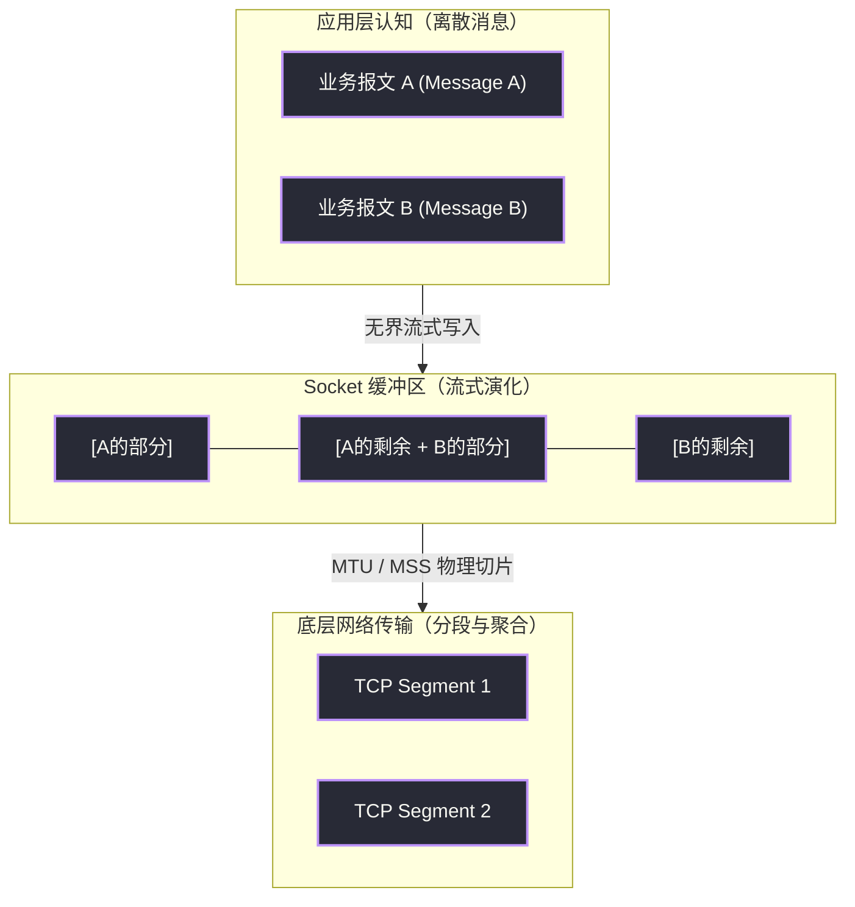
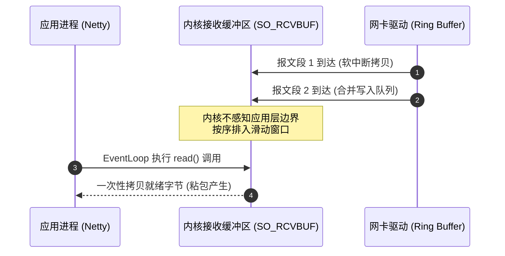
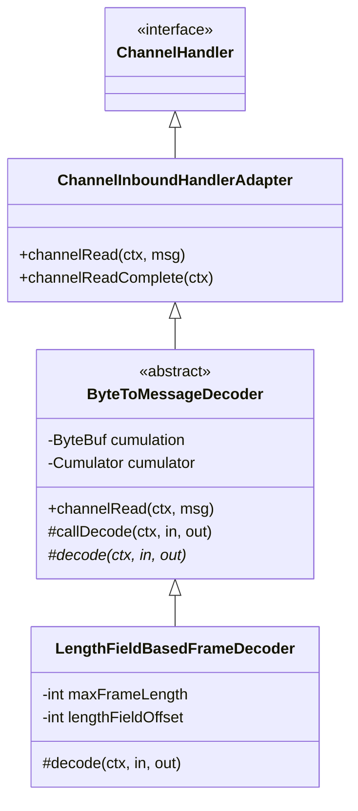
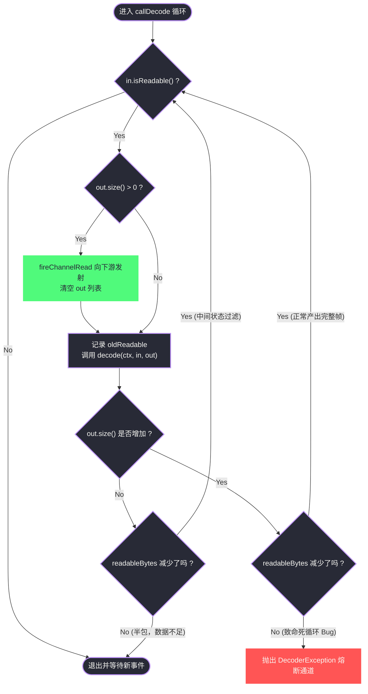
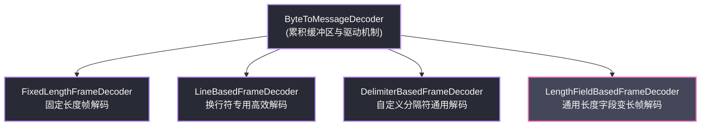
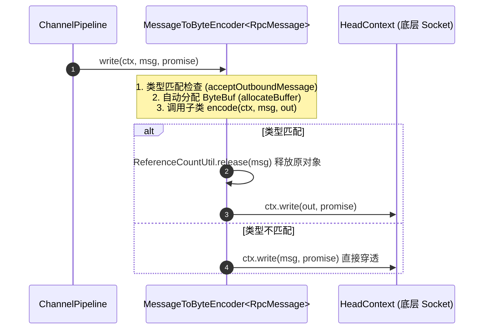
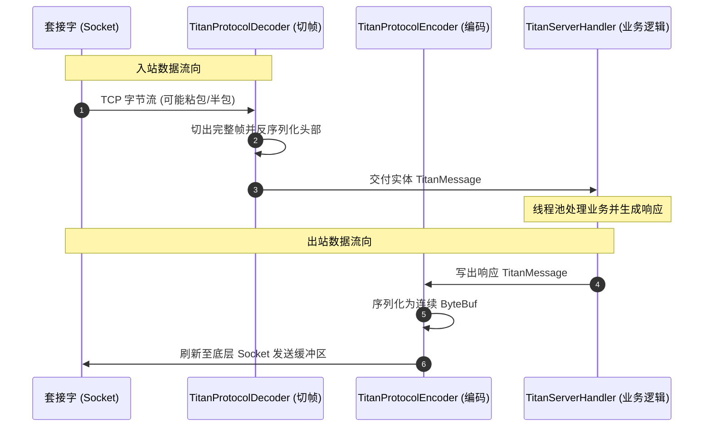
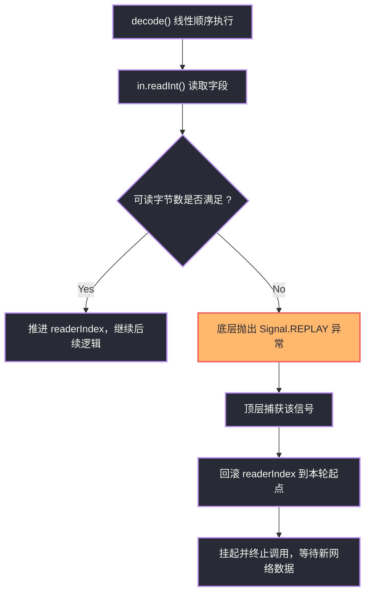
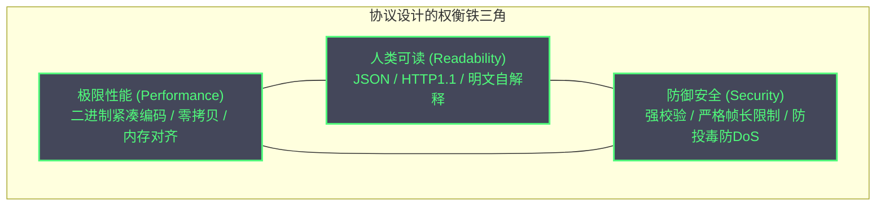

# 编解码器——LengthFieldBasedFrameDecoder与自定义协议

**摘要：**

在网络协议的分层演进史中，传输层与应用层之间始终存在着一条认知鸿沟：传输控制协议（TCP，Transmission Control Protocol）自 1981 年由 RFC 793 确立以来，其核心抽象始终是端到端、可靠且保序的「无界字节流（Unbounded Byte Stream）」；然而分布式的上层业务系统，赖以协同的物理载体却是具有明确语法语义的「离散结构化报文（Discrete Application Message）」。这种底层流模型与上层消息模型之间的范式冲突，在工程实践中不可避免地催生了困扰无数开发者的**粘包（Packet Stitching）**与**拆包（Packet Splitting）**难题。Netty 并未试图改变 TCP 的流式本质，而是在其责任链流水线中构建了成熟的编解码体系。本文以 TCP 报文传输的物理制约为起点，追溯网络分段与内核缓冲区调度的机理；深入剖析入站抽象基类 `ByteToMessageDecoder` 的累积缓冲区机制与 `callDecode()` 循环驱动哲学；系统拆解通用帧切分器 `LengthFieldBasedFrameDecoder` 的六大参数拓扑几何学；随后通过一套工业级 RPC 二进制协议实战，阐述魔数校验、双工多路复用与防御性编程的落地细节；最后对比状态机与 `ReplayingDecoder` 的性能边界，揭示网络基础设施如何在物理流中建立起确定性的消息秩序。

---
## 第 1 章 TCP 流协议与报文边界的本质矛盾

### 1.1 字节流与结构化报文的范式冲突

审视现代计算机网络的通信基石，便会发现传输层协议与应用层程序在数据交换的基本单元上存在着深刻的分歧。对于操作系统的网络协议栈而言，自 Jon Postel 在 1981 年起草 RFC 793 规范以来，TCP 协议的核心契约便被限定为「提供高可靠的、面向连接的、全双工的字节流传输服务」。所谓字节流，本质上就像自来水管道：网络协议栈只保证注入管道的每一个水分子都会按序流出水龙头，但它既不关心、也完全无法感知用户是用大桶装水还是用小杯饮水。换言之，TCP 协议对应用层注入的数据没有丝毫的结构感知能力，在它的视野里，既不存在所谓「订单请求报文」，也不存在所谓「用户心跳数据」，存在的唯有一连串连续无界的 8 位字节序列。

相比之下，SCTP 或 UDP 天然保留了消息边界，但 TCP 为了在不可靠网际网络中追求极限的传输效能，舍弃了结构抽象。然而，分布式应用软件的世界却完全建立在离散的语义对象之上。无论是远程过程调用（RPC）中封装的方法参数，还是微服务通信中的 JSON、Protobuf 实体，应用程序进行业务决策的最小原子单位必然是边界清晰的业务报文。当应用程序调用套接字的写入方法时，它发出的是一条完整的「业务消息」；但当这段数据穿透套接字缓冲区、流经物理网络并抵达远端应用层时，接收方却往往无法在一次读取操作中恰好还原出这条消息。这种底层字节流与上层消息模型之间的错位，正是网络编程领域粘包与拆包现象的根本渊源。



在工程表象上，**粘包（Packet Stitching）**表现为接收端在一次读取操作中，获取到了多条原本独立的业务报文拼接在一起的字节流。譬如客户端先后连续发送了报文 A（"Hello"）与报文 B（"World"），服务端调用底层读取接口时，却一次性读出了包含十个字节的 "HelloWorld"。此时若直接将这十个字节送入单一反序列化器，程序必然因无法识别复合数据而抛出异常。反之，**拆包（Packet Splitting）**则表现为一条完整的业务报文被撕裂在多次读取之中。譬如客户端发出了 1024 字节的请求，服务端第一次仅读取到前 600 字节，剩余 424 字节在下一次网络事件触发时才到达。在真实的生产高并发环境中，粘包与拆包往往交织发生，单次套接字读取可能捕获到上一条报文的尾部、中间数条完整报文，以及下一条报文的破碎头部。

### 1.2 网络物理制约与协议栈的协同机制

部分初涉网络编程的开发者容易产生一种误解，认为粘包拆包是某种由于代码缺陷或网络不稳定导致的异常状态。但事实恰恰相反，在计算机网络的物理拓扑中，粘包与拆包是协议栈为了榨取信道极限吞吐、规避链路拥塞而精心设计的主动机制。其背后交织着三大核心动力：

第一项制约源于链路层的**最大传输单元（MTU，Maximum Transmission Unit）**与 TCP 的**最大报文段长度（MSS，Maximum Segment Size）**。在标准以太网中，MTU 的物理限制通常为 1500 字节。去除 20 字节 IP 头与 20 字节 TCP 头后，MSS 被严格限定在 1460 字节左右。倘若应用层写入一个 100KB 的大对象，TCP 协议栈绝不可能将其作为单一帧向网络倾泻，否则在路由网关必然引发强制分片与重传放大。因此，TCP 会在传输层主动实施**拆包**，将其切分为数十个小于或等于 MSS 的独立报文段分批发出。

第二项制约源自传输层的 **Nagle 算法（Nagle's Algorithm）**与接收端的**延时确认（Delayed ACK）**机制。1984 年，John Nagle 在 RFC 896 中提出了 Nagle 算法，旨在解决微小分组对带宽的侵蚀。如果当前连接中有已发但未确认的数据，发送方产生的微小数据块会滞留在内核缓冲区累积，直到收到 ACK 或数据达到 MSS 上限才统一发出。这种优化传输效率的攒批行为，直接构成了发送端**粘包**的成因。虽然配置 `TCP_NODELAY` 可禁用 Nagle 算法，但这仅仅消除了发送端的主动延迟，无法消除套接字接收侧的缓冲聚合。



第三项制约植根于操作系统的**套接字缓冲区调度（Socket Buffer Scheduling）**与用户态读取节奏的解耦。内核为套接字分配的 `SO_SNDBUF` 与 `SO_RCVBUF` 在物理上是有限的内存结构。在非阻塞 I/O（NIO）的世界里，网卡驱动将物理帧写入内存，而 Netty `EventLoop` 线程依托 epoll 在就绪事件驱动下按周期调用 `read()`。发送端写入速率、网络传播延迟与接收端 CPU 调度延迟是完全异步的。即使发送端严格按 100 字节一条报文发送，若网卡驱动连续收到 5 个数据帧填入内核缓冲区，当用户态执行单次 `read()` 时，内核会一次性拷贝就绪的 500 个字节，展现在面前的依然是粘包。

### 1.3 反事实推演：倘若应用层放弃边界防御

倘若一个分布式系统假定网络传输天然具备「一次写入对应一次读出」的原子特性，系统将会陷入崩溃深渊。在低延迟的本地开发环境中，发送端的数据往往能够瞬时被提取，极易给开发者造成假象。然而一旦推向生产环境，面对跨云网络抖动，灾难便会爆发：两个请求合并在一次 `read()` 中返回，若反序列化器直接将 500 字节当作单个 JSON 解析，必然抛出语法解析异常；若序列化框架静默截断后半段数据，第二个请求将无声丢失。在半包场景中，若仅读到了报文前半段便尝试构造对象，反序列化框架会触发 `EOFException`，甚至由于字节错位将校验和误判为业务数据。由此可见，在流式传输之上建立**确定性的消息边界识别机制**，是网络应用程序通往健壮可用的生命线。

### 1.4 界定应用层报文边界的四种经典范式

为了在无界字节流中划定清晰边界，工业界沉淀出四种标准范式：

| 划分方案 | 工作原理与边界定义机制 | 核心工程优势 | 固有物理局限 | 典型工业级代表应用 |
| :--- | :--- | :--- | :--- | :--- |
| **固定长度（Fixed Length）** | 约定每个报文恰好占用 $N$ 字节，不足部分由发送方强制填充无意义字符。 | 解码状态机极度纯粹，无需扫描特征字节，预分配精准。 | 空间利用率低，存在内部碎片；长度上限静态锁死，难承载动态业务。 | 银行专线结算、传感器上报 |
| **特定分隔符（Delimiter Based）** | 在每条报文末尾追加特殊字节序列（如 `\r\n` 或 `\0`）作为截断边界。 | 具备人类可读性，报文长度自适应，便于命令行调试。 | 二进制载荷不友好；内容若包含分隔符必须转义，吞噬解析性能。 | HTTP/1.1 头部、Redis RESP 协议 |
| **长度字段前缀（Length Field Prefix）** | 在 Header 固定偏移处开辟固定长度字段，写入后续 Body 的精确字节数。 | 高性能且通用；天然适配任意二进制数据，零转义开销。 | 无法直接由文本终端阅读；若长度字段被篡改可能诱发内存攻击。 | **主流高性能 RPC**（Dubbo、gRPC） |
| **结构化状态机（State Machine Frames）** | 结合报文拓扑语义（固定帧头、变长扩展头、多路复用流标识），多阶段推进。 | 表现力极致丰富，天然支持单链路上多路复用与双向流控。 | 解码器实现复杂度高；状态繁杂，对内存管理要求苛刻。 | HTTP/2、HTTP/3、WebSocket |

Netty 针对这四种范式均提供了开箱即用的支持。其中基于**长度字段前缀**的解析范式，因其在现代微服务与分布式存储系统中的高效性与普适性，构成了绝对的主流。

---
## 第 2 章 ByteToMessageDecoder：累积缓冲区与驱动机制

### 2.1 解码器的骨架与生命周期约束

在 Netty 的流水线架构中，所有入站数据的处理工作都交由 `ChannelInboundHandler` 链条驱动。为了搭建起从物理字节到业务领域对象的桥梁，Netty 设计了抽象基类 `ByteToMessageDecoder`。

从继承关系看，`ByteToMessageDecoder` 继承自 `ChannelInboundHandlerAdapter`。但它与普通业务 Handler 之间存在着一道根本区别：**它是有状态的**。在遭遇半包时，解码器必须将当前网络事件中尚未构成完整帧的残余字节保存在内部容器中，直至下一次网络读取事件带来新的字节。这种对上下文状态的依赖，直接导出了 Netty 编码规范中的一条红线：**`ByteToMessageDecoder` 及其所有派生子类，绝不可标注 `@ChannelHandler.Sharable` 注解**。每个独立的连接在构建 Pipeline 时，都必须为其配置专属的解码器实例；倘若多个连接共享同一个实例，跨连接的并发字节流必然会在累积缓冲区中发生互相污染。



在生命周期管理上，`ByteToMessageDecoder` 还严密覆盖了连接终止的边界条件。当底层连接断开触发 `channelInactive()` 回调时，解码器会调用其内部钩子 `decodeLast(ctx, in, out)`。该方法为解码器提供了最后一次审查累积缓冲区的机会：如果对端在发送完最后一个合法报文后立即发起了 TCP FIN 握手关闭连接，`decodeLast` 依然能够将残留在 `cumulation` 中的最后一个报文解组交付业务层；在解组完成后，解码器显式调用 `cumulation.release()` 释放堆外内存，杜绝内存泄漏隐患。

### 2.2 累积缓冲区 cumulation 与合并策略的深层博弈

`ByteToMessageDecoder` 能够跨越多次 `channelRead()` 调用实现数据拼接的核心，在于其持有的成员变量 `ByteBuf cumulation`。当新的数据块涌入时，解码器面临的第一个决策是：如何将新到来的 `ByteBuf` 与旧有的 `cumulation` 整合为一体？

Netty 将该行为抽象为策略接口 `ByteToMessageDecoder.Cumulator`，并提供了两种截然不同的策略：

```java
public abstract class ByteToMessageDecoder extends ChannelInboundHandlerAdapter {
    ByteBuf cumulation;
    private Cumulator cumulator = MERGE_CUMULATOR; // 默认采用合并积累器

    public interface Cumulator {
        ByteBuf cumulate(ByteBufAllocator alloc, ByteBuf cumulation, ByteBuf in);
    }
}
```

第一种策略是系统默认的 **`MERGE_CUMULATOR`（合并积累器）**。该策略的运行哲学是追求数据的**物理连续性**。当已有 `cumulation` 存在时，它会评估当前 `cumulation` 的可写容量是否足够；若不足，则调用 `expandCumulation()` 分配一块更大的连续内存，将新旧数据完全复制进去；若容量充足，则直接将新数据追加写入尾部，并释放新接收的缓冲区。

`MERGE_CUMULATOR` 的优势在于数据的物理连续性。在随后的协议解析中，读取基本数据类型时 CPU 能够充分利用局部性原理，完全无需处理跨内存块寻址。其代价是在频繁发生半包或报文较大时，内存重分配与数据拷贝会消耗指令周期。

第二种策略则是 **`COMPOSITE_CUMULATOR`（组合积累器）**。该策略直接基于 `CompositeByteBuf` 容器构建。当新数据到来时，它不执行物理深拷贝，而是将新接收的缓冲区作为一个新的 Component 节点追加到链表尾部。

```java
public static final Cumulator COMPOSITE_CUMULATOR = new Cumulator() {
    @Override
    public ByteBuf cumulate(ByteBufAllocator alloc, ByteBuf cumulation, ByteBuf in) {
        ByteBuf buffer;
        try {
            if (cumulation.refCnt() > 1) {
                buffer = expandCumulation(alloc, cumulation, in);
            } else {
                CompositeByteBuf composite;
                if (cumulation instanceof CompositeByteBuf) {
                    composite = (CompositeByteBuf) cumulation;
                } else {
                    composite = alloc.compositeBuffer(Integer.MAX_VALUE);
                    composite.addComponent(true, cumulation);
                }
                composite.addComponent(true, in);
                in = null;
                buffer = composite;
            }
            return buffer;
        } finally {
            if (in != null) in.release();
        }
    }
};
```

`COMPOSITE_CUMULATOR` 实现了在累积阶段的零拷贝，对于巨型文件上传场景能够减轻内存带宽压力。但 `CompositeByteBuf` 内部维护着复杂的映射关系，后续解码阶段跨组件读取整数时存在寻址与分支判断开销。在微小 RPC 报文场景下，其解码吞吐反而低于连续内存。因此在高并发 RPC 服务中，保持默认的 `MERGE_CUMULATOR` 往往是更明智的选择。

### 2.3 内存紧缩与释放：discardSomeReadBytes 的平摊代价

累积缓冲区内部还内置了空间压缩机制。当解码器不断切出完整报文向下游传递后，`cumulation` 的 `readerIndex` 会持续后移，头部积累大量已消费区域。为了防止累积缓冲区在长连接中无限扩容撑爆内存，`ByteToMessageDecoder` 维护了一个计数器 `numReads`：每当累积读取达到阈值（默认 16 次），系统便触发 `discardSomeReadBytes()`。

```java
if (cumulation != null && !cumulation.isReadable()) {
    numReads = 0;
    cumulation.release();
    cumulation = null;
} else if (++numReads >= discardAfterReads) {
    numReads = 0;
    discardSomeReadBytes();
}
```

该方法调用 `ByteBuf.discardSomeReadBytes()` 将尚未读取的有效数据搬迁至内存首地址。内存搬迁本身是一项昂贵的操作，倘若每次读取哪怕一个字节都立刻搬迁，CPU 将不堪重负；Netty 通过引入 16 次周期的平摊机制，在**内存紧缩损耗**与**无用内存占用**之间达成了动态平衡。

### 2.4 callDecode() 循环驱动哲学与死循环熔断保护

当字节汇入累积缓冲区后，`callDecode()` 方法便启动了核心驱动逻辑。粘包场景要求：一次网络读取带来的数据，可能包含多条完整报文。如果解码器只解码一次便草草收工，剩余报文将静默滞留在缓冲区中，等待下一次事件触发，引发严重的延迟毛刺。

为了保证所有就绪报文在当前执行周期内被立即消化，`callDecode()` 采用坚决的 `while` 循环驱动解析：

```java
protected void callDecode(ChannelHandlerContext ctx, ByteBuf in, List<Object> out) {
    try {
        while (in.isReadable()) {
            int outSize = out.size();

            if (outSize > 0) {
                fireChannelRead(ctx, out, outSize);
                out.clear();
                if (ctx.isRemoved()) {
                    break;
                }
                outSize = 0;
            }

            int oldInputLength = in.readableBytes();
            decodeRemovalReentryProtection(ctx, in, out);

            if (ctx.isRemoved()) {
                break;
            }

            if (outSize == out.size()) {
                if (oldInputLength == in.readableBytes()) {
                    // 遭遇半包，数据不足，正常退出等待新数据
                    break;
                } else {
                    // 消耗了字节但未产出对象（如过滤填充字符），继续推进
                    continue;
                }
            }

            // 致命防御：产出了对象但读指针未移动，判定为死循环 Bug
            if (oldInputLength == in.readableBytes()) {
                throw new DecoderException(
                    StringUtil.simpleClassName(getClass()) +
                    ".decode() did not read anything but decoded a message.");
            }

            if (isSingleDecode()) {
                break;
            }
        }
    } catch (DecoderException e) {
        throw e;
    } catch (Exception cause) {
        throw new DecoderException(cause);
    }
}
```

`callDecode()` 的四种分支划分展现了严密的防御性设计：
- **产出对象且消耗字节**：正常切出一帧，读指针推进，继续循环处理后续粘包数据；
- **未产出对象且未消耗字节**：遭遇半包，当前字节不足以构成一帧，执行 `break` 退出并等待新网络事件；
- **未产出对象但消耗了字节**：推进了过滤状态机，执行 `continue` 继续下一轮解析；
- **产出对象但未消耗字节**：如果由于子类代码缺陷导致产出对象时读指针纹丝未动，外层 `while` 将瞬间化为死循环吞噬 CPU。Netty 在此处断然抛出 `DecoderException` 熔断通道，杜绝了系统雪崩隐患。



---
## 第 3 章 Netty 内置帧解码器演进谱系

在探索最通用的长度字段解码器之前，我们需要建立对 Netty 预置帧解码器家族的全景认知。针对界定消息边界的四种经典范式，Netty 统一依托 `ByteToMessageDecoder` 构建了帧解码工具矩阵：



### 3.1 FixedLengthFrameDecoder：定长世界的确定性与代价

`FixedLengthFrameDecoder` 是最极简的解码器。它的构建参数仅有一个整数 `frameLength`。其实现简单直接：检查累积缓冲区的 `in.readableBytes()` 是否达到预设长度；若不足则返回 `null` 等待，若满足则调用 `in.readRetainedSlice(frameLength)` 切出一个子缓冲区传递给下游。

```java
// 每条报文固定 64 字节，不足则等待，超出则连续切分
pipeline.addLast(new FixedLengthFrameDecoder(64));
```

该解码器消除了搜索扫描开销，在传感器遥测上报等场景下依旧适用。然而其灵活性极差：若业务数据长度动态变化，必须依赖填充占位符，带来空间浪费；且一旦报文未来扩容超过阈值，整套系统需停机调整。

### 3.2 LineBasedFrameDecoder 与 DelimiterBasedFrameDecoder

为了支持动态长度报文，分隔符解码器应运而生。`LineBasedFrameDecoder` 针对回车换行符（`\r\n` 或 `\n`）设计，而 `DelimiterBasedFrameDecoder` 则允许传入自定义的 `ByteBuf` 作为边界。

在实现细节上，**处理换行符文本时应坚决选用 `LineBasedFrameDecoder`**。`DelimiterBasedFrameDecoder` 为了兼顾匹配多个候选分隔符，必须执行双重循环比对。而 `LineBasedFrameDecoder` 直接调用 `ByteBuf.indexOf()`，能够利用向量化内联与 CPU 的 SIMD（单指令多数据流）指令集在单周期内并发比对多个字节，吞吐优势显著。

### 3.3 maxFrameLength 的安全熔断与丢弃模式

分隔符解码器最核心的安全防线在于其 `maxFrameLength` 参数。如果客户端持续发送数据却故意不发送分隔符，累积缓冲区无限扩容将诱发 JVM 的 `OutOfMemoryError`。为此，Netty 引入了带快速失败的超长保护机制：

```java
// 单行最大 8192 字节，超出则立即抛出 TooLongFrameException 并进入丢弃模式
pipeline.addLast(new LineBasedFrameDecoder(8192, true, true));
```

当累积未解析数据跨越门槛时，解码器抛出异常并进入「丢弃模式（Discarding Mode）」：直接推进读指针静默丢弃后续流入的垃圾字节，直至在流中捕获到下一个合法分隔符才恢复正常。这种防御弹性体现了工业级网络库的成熟度。

### 3.4 帧切分器与业务解码器的分层责任链协作

在架构落地中，不应在一个 Handler 内揉杂全部逻辑。正统的 Netty 实践将解码拆分为两个独立的流水线阶段：
1. **帧切分层（Framing Layer）**：由帧解码器充当，输入是边界模糊的原始流，输出是单条完整报文的子 `ByteBuf`；
2. **对象解析层（Message Parsing Layer）**：紧随其后挂载业务专属的 `MessageToMessageDecoder<ByteBuf>`，专注于将完整帧反序列化为领域模型。

这种关注点分离让帧切分逻辑能够作为通用基础设施在不同协议间复用，保持架构模块的清爽解耦。

---
## 第 4 章 LengthFieldBasedFrameDecoder：六参数的几何学

当面对二进制紧凑编码的分布式系统时，定长填充与分隔符转义均显笨拙。基于显式长度字段的协议设计成为了当之无愧的行业基准，而 Netty 的集大成者正是 `LengthFieldBasedFrameDecoder`。

### 4.1 协议帧的通用几何拓扑

绝大多数私有二进制协议都可以抽象为**协议头（Header）**与**协议体（Body）**两部分。为了使接收端知晓后续数据跨度，协议头中会开辟固定宽度的字段记录长度数值。其通用的物理内存布局如下：

```
+------------------------------------------------------------------------------------------------+
|                                        整个物理报文帧 (Frame)                                   |
+------------------------------------+------------------+------------------+---------------------+
|         前置头部 (Leading Header)   | 长度字段 (Length)| 后置头部 (Trailer)|  消息体净荷 (Payload)|
+------------------------------------+------------------+------------------+---------------------+
|<-------- lengthFieldOffset ------->|<-lengthFieldLen->|                  |                     |
|<------------------------- 协议头整体 (Header) -------->|                  |                     |
|<----------------------------- 整个业务帧的物理跨度 -------------------------------------------->|
```

`LengthFieldBasedFrameDecoder` 通过一组参数，将任意二进制报文帧抽象为一种**可参数化推演的空间几何模型**，只要长度字段的位置与语义确定，便能在零修改的前提下实现精准切帧。

### 4.2 六大参数语义的数学表达与物理推演

构建 `LengthFieldBasedFrameDecoder` 需理解以下六大参数的代数关系：

```java
public LengthFieldBasedFrameDecoder(
    int maxFrameLength,
    int lengthFieldOffset,
    int lengthFieldLength,
    int lengthAdjustment,
    int initialBytesToStrip,
    boolean failFast
)
```

1. **`maxFrameLength`（最大帧长门槛）**：单个物理帧允许的最大字节数上限。解析出的帧长度一旦超越该值，立即触发熔断保护；
2. **`lengthFieldOffset`（长度字段偏移量）**：长度字段在报文帧中的起始位置，以帧首（偏移量 0）为基准向后测量的字节距离；
3. **`lengthFieldLength`（长度字段自身跨度）**：长度字段本身所占的字节宽度，支持 1、2、3、4 或 8 字节；
4. **`lengthAdjustment`（长度数值补偿量）**：对长度字段内记录的原始数值施加的代数补偿。其核心使命是**填补「长度字段数值」与「紧随长度字段后的第一个字节到帧末尾的实际距离」之间的代数差**。

物理整帧总长度的公理公式可表述为：

$$
\text{实际整帧长度} = \text{lengthFieldOffset} + \text{lengthFieldLength} + \text{原始长度值} + \text{lengthAdjustment}
$$

反向求解即可得出 `lengthAdjustment` 的通用算式：

$$
\text{lengthAdjustment} = \text{实际整帧长度} - (\text{lengthFieldOffset} + \text{lengthFieldLength} + \text{原始长度值})
$$

5. **`initialBytesToStrip`（解码跳过字节数）**：切出完整帧后，向 Pipeline 下游传递前从头部剥离的字节数。若为 0 则保留完整帧，若等于头部长度则只向业务层暴露纯净 Payload；
6. **`failFast`（快速失败机制）**：若为 `true`，检测到超长帧立即抛出异常；若为 `false`，则等待超长帧全部接收并丢弃后才抛出异常。高并发场景建议保持 `true`。

### 4.3 经典拓扑图谱与六大典型场景拆解

我们通过网络协议中常见的场景来建立空间直觉：

#### 场景 1：最简模型——长度字段仅表示 Body 长度，解码后剥离长度头

```
原始物理报文帧布局：
+-------------------------+--------------------------------+
|  Length (4 Bytes = 12)  |   Actual Payload (12 Bytes)    |
+-------------------------+--------------------------------+
参数推导：
- lengthFieldOffset = 0, lengthFieldLength = 4
- 长度值(12)恰好等于后续字节数：lengthAdjustment = 0
- 业务层不需要长度元数据：initialBytesToStrip = 4
最终交付 ByteBuf 仅包含 12 字节 Payload。
```

#### 场景 2：整帧长度模型——长度字段数值包含整帧全部字节

```
原始物理报文帧布局：
+-------------------------+--------------------------------+
|  Length (4 Bytes = 16)  |   Actual Payload (12 Bytes)    |
+-------------------------+--------------------------------+
参数推导：
- lengthFieldOffset = 0, lengthFieldLength = 4
- 原始长度值为 16。根据公式：16 = 0 + 4 + 16 + lengthAdjustment，解得 lengthAdjustment = -4
- 保留完整帧：initialBytesToStrip = 0
```

#### 场景 3：魔数前缀模型——长度字段前嵌入协议魔数

```
原始物理报文帧布局：
+-------------------+-------------------------+--------------------------------+
|  Magic (2 Bytes)  |  Length (4 Bytes = 12)  |   Actual Payload (12 Bytes)    |
+-------------------+-------------------------+--------------------------------+
参数推导：
- lengthFieldOffset = 2, lengthFieldLength = 4
- 长度值 12 仅表示 Payload：lengthAdjustment = 0
- 保留完整帧供下游校验：initialBytesToStrip = 0
```

#### 场景 4：多字段交织模型——长度字段前后均有元数据

```
原始物理报文帧布局：
+-------------+---------------+-----------------------+--------------+-------------------+
| Magic (2B)  | Version (1B)  | Length (4B, Value=12) | Flags (1B)   | Payload (12B)     |
+-------------+---------------+-----------------------+--------------+-------------------+
参数推导：
- lengthFieldOffset = 3, lengthFieldLength = 4
- 紧随长度字段后有 Flags(1B) 与 Payload(12B)，整帧长度为 20 字节。
  根据公式：20 = 3 + 4 + 12 + lengthAdjustment，解得 lengthAdjustment = 1
- 下游仅需 [Flags + Payload]，跳过前 7 字节：initialBytesToStrip = 7
```

#### 场景 5：后置校验尾模型——报文末尾追加 CRC32

```
原始物理报文帧布局：
+-----------------------+-------------------------+--------------------+
| Length (4B, Value=12) | Actual Payload (12B)    | CRC32 Checksum (4B)|
+-----------------------+-------------------------+--------------------+
参数推导：
- lengthFieldOffset = 0, lengthFieldLength = 4
- 整帧长度为 20 字节，根据公式：20 = 0 + 4 + 12 + lengthAdjustment，解得 lengthAdjustment = 4
- 保留整帧：initialBytesToStrip = 0
```

#### 场景 6：跨语言异构通信中的字节序陷阱

网络传输一律要求采用**大端序（Big-Endian）**。若 x86 架构的 C/C++ 客户端以**小端序（Little-Endian）**输出了长度整数，默认解码器会得出荒谬数值。此时需重写 `getUnadjustedFrameLength` 钩子方法切换读取字节序：

```java
public class LittleEndianLengthFrameDecoder extends LengthFieldBasedFrameDecoder {
    public LittleEndianLengthFrameDecoder(int maxFrameLength, int offset, int length) {
        super(maxFrameLength, offset, length);
    }

    @Override
    protected long getUnadjustedFrameLength(ByteBuf buf, int offset, int length, ByteOrder order) {
        return super.getUnadjustedFrameLength(buf, offset, length, ByteOrder.LITTLE_ENDIAN);
    }
}
```


### 4.4 丢弃模式（Discarding Mode）与生产内存保护

在 `LengthFieldBasedFrameDecoder` 的底层源码中，隐藏着一段极具工程智慧的状态转移逻辑——超长帧的丢弃模式。考虑一个生产事故场景：某客户端因为内存错乱或恶意攻击，发送了一个声明长度为 100MB 的畸形报文，而服务端的 `maxFrameLength` 被硬性限定为 10MB。

当解码器读取到该长度字段时，它面临两难抉择：此时这 100MB 的物理数据并没有全部到达，内核仅仅收到了前 4KB 的碎片。如果此时仅仅抛出 `TooLongFrameException` 并终止本次调用，那么在随后的数十秒内，网卡驱动依然会源源不断地将剩余的 99.99MB 垃圾字节灌入内核套接字缓冲区。如果不改变解码状态，下一次 `channelRead` 到来时，解码器会将原本属于报文 Body 的中间垃圾数据误当作下一个协议帧的 Header 进行解析，引发持续数十秒的连续解析崩溃。

为了彻底阻断这种连锁反应，Netty 引入了 `discardingTooLongFrame` 标志位。当检测到帧长度超越门槛时：
1. 若 `failFast` 为 `true`，解码器立即抛出 `TooLongFrameException` 向业务层报警；
2. 同时计算出剩余未到达的字节跨度：`bytesToDiscard = frameLength - in.readableBytes()`；
3. 将内部状态切换为 `discardingTooLongFrame = true`。在此后触发的每一次网络读取中，解码器不再尝试寻找任何长度字段，而是直接推进 `in.readerIndex` 执行静默丢弃，直至将预计算的 `bytesToDiscard` 垃圾字节完全冲刷殆尽，状态机才重新复位回到正常的帧解析流程。这种状态记忆与自动排毒机制，正是构建抗 DoS 韧性系统的精髓所在。

---
## 第 5 章 出站镜像：MessageToByteEncoder 与编解码合体

### 5.1 编码器的职责与生命周期自动化

在入站解码的镜像对称面上，负责将领域对象序列化为字节流的是抽象基类 `MessageToByteEncoder<I>`。



`MessageToByteEncoder` 继承自 `ChannelOutboundHandlerAdapter`，其运行机制包括：
1. **类型动态匹配**：通过 `TypeParameterMatcher` 判断出站对象是否匹配泛型参数 `I`，不匹配则原样向下透传；
2. **缓冲区智能分配**：根据当前通道配置偏好，通过 `ctx.alloc()` 分配合适的 `ByteBuf`；
3. **子类模板方法**：触发子类重写的 `encode(ChannelHandlerContext ctx, I msg, ByteBuf out)` 填充物理字节；
4. **资源自动释放**：在 `finally` 块中自动调用 `ReferenceCountUtil.release(cast)` 将原消息对象引用计数减 1。

### 5.2 自动释放的恩赐与内存泄漏排查

若开发者在 `encode()` 内部临时分配了过渡性 `ByteBuf` 却未对其调用 `release()`，将诱发堆外内存泄漏。Netty 提供了资源泄漏探测器（`ResourceLeakDetector`）。通过在 JVM 启动参数中配置 `-Dio.netty.leakDetection.level=PARANOID`，系统会在每一个 `ByteBuf` 分配时通过虚引用追踪记录调用栈，帮助开发者定位未释放的隐患。

### 5.3 编解码合体：ByteToMessageCodec vs CombinedChannelDuplexHandler

在协议工程化组织上，Netty 提供了两种将编解码器整合的形式：

第一种是 **`ByteToMessageCodec<I>`**。它在同一个类中集中实现入站解码与出站编码：

```java
public class MyProtocolCodec extends ByteToMessageCodec<MyMessage> {
    @Override
    protected void encode(ChannelHandlerContext ctx, MyMessage msg, ByteBuf out) {
        // 出站编码
    }

    @Override
    protected void decode(ChannelHandlerContext ctx, ByteBuf in, List<Object> out) {
        // 入站解码
    }
}
```

该方式直观，但因包含入站累积状态，导致整座 Handler 无法标注 `@Sharable`，即使其编码逻辑完全无状态也无法跨连接共享。

第二种是更受推崇的 **`CombinedChannelDuplexHandler<D, E>`**。它遵循组合优于继承的原则，将 Decoder 与 Encoder 解耦为两个独立的类，随后通过容器将其粘合成一个节点：

```java
public class MyProtocolDuplexCodec extends CombinedChannelDuplexHandler<MyProtocolDecoder, MyProtocolEncoder> {
    public MyProtocolDuplexCodec() {
        super(new MyProtocolDecoder(), new MyProtocolEncoder());
    }
}
```

采用组合容器不仅便于单元测试分别 Mock 断言，而且当 Encoder 具备无状态特性时，可以直接注入全局单例，兼顾了模块划分与运行时的轻量化。


### 5.4 隐秘的穿透：TypeParameterMatcher 与类型静默逃逸

在 `MessageToByteEncoder` 的日常使用中，存在一个常令初学者困惑的经典排错难题：当业务层调用 `channel.writeAndFlush(msg)` 后，网络抓包却发现网卡完全没有数据发出，且控制台没有抛出任何 `EncoderException`。经过漫长的单步调试，最终却在 Pipeline 最顶端的 `HeadContext` 处捕获到了 `IllegalArgumentException: unsupported message type`。

这种现象的根源在于 `MessageToByteEncoder` 内部的 `acceptOutboundMessage` 过滤机制。在编码器被实例化时，Netty 通过 `TypeParameterMatcher.find(this, MessageToByteEncoder.class, "I")` 反射探测泛型实参 `I` 的实际类型。当一个出站对象穿流而过时，编码器首先执行 `matcher.match(msg)`：

```java
@Override
public void write(ChannelHandlerContext ctx, Object msg, ChannelPromise promise) throws Exception {
    ByteBuf buf = null;
    try {
        if (acceptOutboundMessage(msg)) {
            // 类型匹配：分配缓冲区并执行实际序列化
            I cast = (I) msg;
            buf = allocateBuffer(ctx, cast, preferDirect);
            encode(ctx, cast, buf);
            ReferenceCountUtil.release(cast);
            ctx.write(buf, promise);
        } else {
            // 类型不匹配：不报错，直接绕行穿透给前驱节点！
            ctx.write(msg, promise);
        }
    } catch (Exception e) {
        throw new EncoderException(e);
    }
}
```

请注意，编码器被设计为责任链中的一个普通环节，它的哲学是「非我之客，放行通过」，允许由流水线上游的其他编码器进行处理。但如果流水线上并不存在第二个能处理该对象的编码器，这个未被序列化的普通 Java 实体就会一路逃逸穿透到 `HeadContext`。而作为底层的 `HeadContext`，其 `Unsafe.write()` 只认物理 `ByteBuf` 或零拷贝的 `FileRegion`，遭遇 Java POJO 实体自然只能断然报错。因此，在排查出站丢失与异常时，优先核验业务写出的对象是否严格与编码器声明的泛型类型一致，是每位 Netty 工程师必备的肌肉记忆。

---
## 第 6 章 工业级私有 RPC 协议设计与实战

我们将落地一套类似 Apache Dubbo 2.0 与蚂蚁 SOFARPC 的二进制通信协议——**`Titan-RPC` 协议**。

### 6.1 工业级私有协议头部拓扑设计

一个成熟的企业级协议必须在紧凑头部中容纳治理元数据。`Titan-RPC` 协议帧拓扑如下：

```
Titan-RPC 协议帧拓扑结构（固定头部：16 字节）：
+---------------+---------------+---------------+---------------+
| 0xCA   | 0xFE |    Version    | Serialize ID  |   Type / Flags|
+---------------+---------------+---------------+---------------+
| 2B Magic (魔数)| 1B ProtocolVer| 1B 序列化标识 | 1B 消息类型标志 |
+---------------+---------------+---------------+---------------+
| Status (1B)   |               Reserved (2B) 保留位             |
+---------------+---------------+---------------+---------------+
|                     Request ID (8 Bytes, Long)                |
|                    全双工多路复用请求唯一链路追踪标识           |
+---------------+---------------+---------------+---------------+
|                     Payload Length (4 Bytes, Int)             |
|                           消息体实际字节长度                   |
+---------------+---------------+---------------+---------------+
|                   Body Payload (N Bytes, 变长载荷)             |
+---------------------------------------------------------------+
```

字段语义定义：
- **Magic Number（2 字节）**：固定为 `0xCAFE`，用于快速过滤非法连接；
- **Version（1 字节）**：当前设为 `0x01`，支撑协议平滑升级；
- **Serialize ID（1 字节）**：标识序列化引擎（`0x01`=Hessian2, `0x02`=Protobuf, `0x03`=JSON）；
- **Type / Flags（1 字节）**：低 2 位为消息类型（Ping/Pong/OneWay/TwoWay），第 3 位为 Request/Response 标志，第 4 位为 GZIP 压缩标志；
- **Status（1 字节）**：仅用于响应报文，指示调用状态码；
- **Reserved（2 字节）**：预留空间，保持 16 字节对齐并供后续演进；
- **Request ID（8 字节）**：实现**全双工多路复用（Full-Duplex Multiplexing）**的关键，异步关联请求与响应；
- **Payload Length（4 字节）**：记录后续 Payload 的真实字节数，位于固定头部末尾（偏移量 12）。

### 6.2 领域实体定义与协议模型

定义核心实体 `TitanMessage`：

```java
public final class TitanMessage {
    public static final short MAGIC = (short) 0xCAFE;
    public static final byte VERSION_1 = 0x01;
    public static final int HEADER_LENGTH = 16;

    public static final byte FLAG_REQUEST = 0x01;
    public static final byte FLAG_RESPONSE = 0x02;
    public static final byte FLAG_HEARTBEAT_PING = 0x04;
    public static final byte FLAG_HEARTBEAT_PONG = 0x08;

    private byte version = VERSION_1;
    private byte serializeType;
    private byte messageFlags;
    private byte status;
    private long requestId;
    private byte[] payload;

    public byte getVersion() { return version; }
    public void setVersion(byte version) { this.version = version; }
    public byte getSerializeType() { return serializeType; }
    public void setSerializeType(byte serializeType) { this.serializeType = serializeType; }
    public byte getMessageFlags() { return messageFlags; }
    public void setMessageFlags(byte messageFlags) { this.messageFlags = messageFlags; }
    public byte getStatus() { return status; }
    public void setStatus(byte status) { this.status = status; }
    public long getRequestId() { return requestId; }
    public void setRequestId(long requestId) { this.requestId = requestId; }
    public byte[] getPayload() { return payload; }
    public void setPayload(byte[] payload) { this.payload = payload; }
}
```

### 6.3 工业级解码器实现：分段切割与防御性解析

采取两阶段设计模式：外层由 `LengthFieldBasedFrameDecoder` 负责物理切帧，随后在完整帧内进行字段解析：

```java
public class TitanProtocolDecoder extends LengthFieldBasedFrameDecoder {
    private static final int MAX_FRAME_LENGTH = 10 * 1024 * 1024; // 单帧上限 10MB
    private static final int LENGTH_FIELD_OFFSET = 12;            // 长度字段在偏移 12 处
    private static final int LENGTH_FIELD_LENGTH = 4;             // 长度字段占 4 字节
    private static final int LENGTH_ADJUSTMENT = 0;               // 长度值即 Payload，无偏差
    private static final int INITIAL_BYTES_TO_STRIP = 0;          // 保留完整头部供解析

    public TitanProtocolDecoder() {
        super(
            MAX_FRAME_LENGTH,
            LENGTH_FIELD_OFFSET,
            LENGTH_FIELD_LENGTH,
            LENGTH_ADJUSTMENT,
            INITIAL_BYTES_TO_STRIP
        );
    }

    @Override
    protected Object decode(ChannelHandlerContext ctx, ByteBuf in) throws Exception {
        Object decoded = super.decode(ctx, in);
        if (decoded == null) {
            return null;
        }

        ByteBuf frame = (ByteBuf) decoded;
        try {
            return decodeFrame(ctx, frame);
        } finally {
            frame.release(); // 释放物理切片缓冲
        }
    }

    private TitanMessage decodeFrame(ChannelHandlerContext ctx, ByteBuf frame) {
        short magic = frame.readShort();
        if (magic != TitanMessage.MAGIC) {
            ctx.close();
            throw new IllegalArgumentException("Unknown magic: 0x" + Integer.toHexString(magic));
        }

        byte version = frame.readByte();
        if (version > TitanMessage.VERSION_1) {
            throw new UnsupportedOperationException("Unsupported version: " + version);
        }

        byte serializeType = frame.readByte();
        byte messageFlags = frame.readByte();
        byte status = frame.readByte();
        frame.skipBytes(2); // 跳过保留位

        long requestId = frame.readLong();
        int payloadLength = frame.readInt();
        byte[] payloadBytes = null;
        if (payloadLength > 0) {
            payloadBytes = new byte[payloadLength];
            frame.readBytes(payloadBytes);
        }

        TitanMessage message = new TitanMessage();
        message.setVersion(version);
        message.setSerializeType(serializeType);
        message.setMessageFlags(messageFlags);
        message.setStatus(status);
        message.setRequestId(requestId);
        message.setPayload(payloadBytes);
        return message;
    }
}
```

### 6.4 工业级编码器实现：单例无状态的高效写出

编码器继承自 `MessageToByteEncoder<TitanMessage>`，由于不持有连接状态，标注 `@Sharable` 实现单例共享：

```java
@ChannelHandler.Sharable
public class TitanProtocolEncoder extends MessageToByteEncoder<TitanMessage> {
    public static final TitanProtocolEncoder INSTANCE = new TitanProtocolEncoder();

    private TitanProtocolEncoder() {}

    @Override
    protected void encode(ChannelHandlerContext ctx, TitanMessage msg, ByteBuf out) throws Exception {
        out.writeShort(TitanMessage.MAGIC);
        out.writeByte(msg.getVersion());
        out.writeByte(msg.getSerializeType());
        out.writeByte(msg.getMessageFlags());
        out.writeByte(msg.getStatus());
        out.writeZero(2); // 填充保留位
        out.writeLong(msg.getRequestId());

        byte[] payload = msg.getPayload();
        if (payload == null || payload.length == 0) {
            out.writeInt(0);
        } else {
            out.writeInt(payload.length);
            out.writeBytes(payload);
        }
    }
}
```

### 6.5 流水线组装与数据流向全景

在 `ChannelInitializer` 中完成挂载：

```java
ch.pipeline().addLast("frameDecoder", new TitanProtocolDecoder());
ch.pipeline().addLast("frameEncoder", TitanProtocolEncoder.INSTANCE);
ch.pipeline().addLast("serverHandler", new TitanServerHandler());
```




### 6.6 异步双工匹配与超时扫描机制

在 RPC 架构中，全双工通信的核心在于将网络层完全异步的字节交换，与业务层线性的同步/异步调用协同起来。客户端如何根据唯一的 `requestId` 还原调用结果？这依赖于客户端维护的待决表（Pending Table）：

```java
// 客户端全局待决请求映射表
public class RpcPendingHolder {
    private static final ConcurrentMap<Long, CompletableFuture<TitanMessage>> PENDING_MAP = 
        new ConcurrentHashMap<>();

    public static void put(long requestId, CompletableFuture<TitanMessage> future) {
        PENDING_MAP.put(requestId, future);
    }

    public static void complete(long requestId, TitanMessage response) {
        CompletableFuture<TitanMessage> future = PENDING_MAP.remove(requestId);
        if (future != null) {
            future.complete(response); // 唤醒业务等待线程或触发异步 CompletableFuture 回调
        }
    }
}
```

当客户端发出 RPC 请求时，生成递增的 `requestId`，并在将报文交由 `TitanProtocolEncoder` 编码写出的同时，将一个未完成的 `CompletableFuture` 注册到哈希表中。当远端服务完成运算返回响应时，服务端的 `TitanProtocolDecoder` 切帧解析出 `TitanMessage`，客户端入站 Handler 依据响应头中的 `requestId` 检索并移除对应的 Future 实例，执行 `complete()` 注入结果。

如果服务出现宕机或网络丢包，响应可能永远不会到来。为了防止 `PENDING_MAP` 中累积海量悬挂对象引发内存泄漏，系统通常结合 Netty 的 `HashedWheelTimer`（时间轮定时器）为每个请求注册一个超时任务：一旦超时未返回，主动从待决表中摘除并抛出 `TimeoutException`。这种将物理编解码、多路复用与定时器协同的设计，构成了现代 RPC 调用的完整闭环。

---
## 第 7 章 状态机解码器与 ReplayingDecoder 的边界

### 7.1 ReplayingDecoder 的魔法与代价

为了避免每次读取前手工编写 `if (in.readableBytes() < 4) return;` 判定，Netty 提供了 `ReplayingDecoder<T>`。它的核心设计依赖「伪阻塞」机制：使用 `ReplayingDecoderByteBuf` 装饰原始缓冲区，当读取操作越界时抛出特殊的内部异常 `Signal.REPLAY`。



控制循环捕获异常后回滚 `readerIndex` 并挂起，简化了开发者的防卫编码。然而这伴随着显著的工程代价：
1. **异常捕获指令开销**：即便压制了堆栈填充，异常控制流开销依然高于整数比较；
2. **重复回滚计算（Replay Penalty）**：报文尾部若遇半包，读指针回退到起点，已解析的前置字段需在下一次重复执行；
3. **部分接口限制**：装饰缓冲区无法支持所有的 `ByteBuf` 原生方法。

### 7.2 基于枚举状态机的优雅解码

`ReplayingDecoder<State>` 引入了显式状态枚举与 `checkpoint(State)` 机制：

```java
public enum RpcParseState {
    READ_MAGIC,
    READ_HEADER,
    READ_PAYLOAD
}

public class StateMachineDecoder extends ReplayingDecoder<RpcParseState> {
    private TitanMessage message = new TitanMessage();

    public StateMachineDecoder() {
        super(RpcParseState.READ_MAGIC);
    }

    @Override
    protected void decode(ChannelHandlerContext ctx, ByteBuf in, List<Object> out) {
        switch (state()) {
            case READ_MAGIC:
                short magic = in.readShort();
                if (magic != TitanMessage.MAGIC) {
                    ctx.close();
                    return;
                }
                checkpoint(RpcParseState.READ_HEADER);

            case READ_HEADER:
                message.setVersion(in.readByte());
                message.setSerializeType(in.readByte());
                message.setMessageFlags(in.readByte());
                message.setStatus(in.readByte());
                in.skipBytes(2);
                message.setRequestId(in.readLong());
                int length = in.readInt();
                checkpoint(RpcParseState.READ_PAYLOAD);

            case READ_PAYLOAD:
                byte[] bytes = new byte[in.readInt()];
                in.readBytes(bytes);
                message.setPayload(bytes);

                out.add(message);
                message = new TitanMessage();
                checkpoint(RpcParseState.READ_MAGIC);
                break;
        }
    }
}
```

通过检查点机制，指针回滚锚点动态更新，消除了跨阶段的重复计算。但在 Dubbo、RocketMQ 等高吞吐场景中，架构师依然倾向于选用纯粹的 `ByteToMessageDecoder` 配合手工索引检查，以换取最高的性能确定性。

---
## 第 8 章 协议设计的架构哲学与演进权衡

### 8.1 协议的向前向后兼容性设计

任何一套网络协议从诞生那一刻起，便注定要面对残酷的演进法则。随着业务边界的不断拓展，协议头中必然需要承载新的元数据属性。倘若协议在初始设计阶段缺乏足够的远见，哪怕仅仅是增加一个 2 字节的灰度路由标识，都可能导致整套集群中老版本节点因无法识别新格式而发生全网通信雪崩。在周志明先生于《凤凰架构》中所反复强调的演进思想中，**架构从来不是一蹴而就的发明，而是在不断包容变化中演化出来的形态**。在设计私有二进制协议时，保证版本向前与向后兼容的核心策略通常包含两项工程准则：

第一项准则是**保留字段（Reserved Fields）的合理预留**。在我们在 `Titan-RPC` 协议中规划的 16 字节头部中，专门预留了 2 字节的 `Reserved` 空间并强制填充全零。这绝非无谓的内存浪费，在计算机内存对齐体系中，16 字节恰好契合 64 位机器总线周期的自然对齐边界，能够最大化内存读写的吞吐效率。更为关键的是，当未来需要引入流量染色（Traffic Coloring）或链路超时透传功能时，新的协议实现可以直接占用这 2 字节的语义而完全无需改变固定头部的物理几何跨度，老版本的解码器依然能够基于 `skipBytes(2)` 正常解析剩余部分，平稳完成全网的平滑升级。

第二项准则是**变长元数据采用 TLV（Type-Length-Value）结构扩展**。对于无法预估规模的动态扩展属性，绝不可在固定头部中无限制堆砌。通用的做法是在固定头部之后、Body 载荷之前，开辟一个可选的扩展字段区（Extra Header）。扩展区内部以 `[KeyLength | Key | ValLength | Val]` 的 TLV 模式链式串联。解码器在解析扩展区时，一旦遇到自身无法识别的扩展 Type，可以直接根据其 Length 属性跳过对应字节，继续解析后续内容。这一设计原则与 Google Protobuf 的字段编号（Field Tag）与 Wire Type 映射机制在思想上一脉相承。

### 8.2 性能、可读性与安全性的铁三角权衡

在网络协议的选型与设计旅程中，架构师必须直面一个永恒的铁三角制约：**传输性能（Performance）、人类可读性（Readability）与系统安全性（Security）**。



以明文为核心的文本协议（如 HTTP/1.1 与 JSON）将人类可读性推向了顶峰，开发者甚至只需凭借肉眼和普通的 Wireshark 抓包工具就能快速定位业务缺陷。但其代价是冗长的字符串键名带来了严重的带宽膨胀，且字符转义与文本解析需要消耗大量原本属于业务逻辑的 CPU 指令周期。反之，二进制私有协议将报文压缩到了字节极限，配合 `LengthFieldBasedFrameDecoder` 可以实现每秒数百万次的高效分帧，但其调试诊断必须依赖专用解包脚本，对研发团队的工程素养提出了更高要求。

而安全性则是压舱的基石。在设计二进制编解码器时，必须始终假定**网络链路另一端的客户端可能已经被恶意黑客完全挟持**。倘若解码器未曾设置 `maxFrameLength` 保护，或者在解析 `length` 字段后盲目信任该数值并直接调用 `new byte[length]` 分配内存，攻击者只需构造一个携带负数或天文数字长度字段的微小 TCP 报文，就能瞬间在服务端触发 `NegativeArraySizeException` 或 `OutOfMemoryError` 堆内存雪崩。真正的防御性协议设计，必然在协议头部的第一微秒便实施严苛的魔数检查、版本边界判定与内存熔断，这也是 Netty 的编解码框架赋予所有分布式系统的核心工程价值。

### 8.3 架构权衡收束：物理流现实与逻辑消息秩序

行文至此，我们不难发现，整个网络编解码体系的演进本质上是一场在物理客观现实与逻辑工程诉求之间的调和过程。TCP 协议为了最大化利用全球通信信道的传输效能，坚定不移地选择了无界字节流的道路；而分布式应用程序为了构建高可用的业务闭环，又必须依赖结构确定、边界分明的离散报文。

复杂性并不会凭空消失，它只会发生转移。Netty 编解码器框架的卓越之处，正在于它勇敢地将这种由范式冲突所催生出来的所有复杂性——半包的跨事件暂存、粘包的无缝循环消费、内存碎片的周期紧缩、畸形报文的快速熔断——统统拦截并封印在了网络通信的基础设施层，替上层成千上万的业务微服务遮蔽了底层物理网络的混沌与风雨。没有放之四海皆准的万能协议，只有因地制宜的权衡取舍。理解每一款编解码器背后的物理代价，在协议设计的空间拓扑中建立起清澈的数学直觉，正是每一位网络架构师攀登技术巅峰的必经之路。

---

## 总结

网络编解码体系是整个现代异步网络通信大厦中承上启下的枢纽。面对 TCP 协议无界字节流的物理本原，Netty 没有试图以抽象的谎言掩盖现实，而是直面物理分段、缓冲区调度与并发时序带来的粘包与拆包挑战，建立了一套严谨的层次化解决方案：

- **`ByteToMessageDecoder` 确立了状态化累积的核心范式**：通过有状态的 `cumulation` 容器跨事件聚合半包碎片，依托 `callDecode()` 内在的循环驱动逻辑彻底消化粘包堆叠，并在底层设置了严苛的死循环探测与内存紧缩机制，成为所有安全解码器的坚实地基；
- **四种内置帧解码器覆盖了主流协议场景**：`FixedLengthFrameDecoder` 以定长换取极限确定性，`LineBasedFrameDecoder` 依托 SIMD 级指令优化在文本领域傲视群雄，而 `LengthFieldBasedFrameDecoder` 则以参数化几何模型成为了现代二进制私有协议的事实标准；
- **`LengthFieldBasedFrameDecoder` 将协议解析提升为通用空间几何学**：通过六大参数的代数协同，将长度字段的偏移、宽度、代数补偿与头部剥离彻底参数化，以一套通用代码优雅征服了整个工业界 90% 以上的二进制私有协议；
- **编解码全双工镜像与防卫**：出站阶段的 `MessageToByteEncoder` 实现了类型过滤与缓冲区分配的自动化，而完整的工业级私有协议则需将魔数、协议版本、全局请求 ID、保留位对齐与防御性异常抛出融为一体，保障分布式集群在不可预测的物理网络环境下长治久安；
- **架构权衡的终极落脚点在于因地制宜**：从极致极简的 `FixedLengthFrameDecoder` 到便捷易用但性能受限的 `ReplayingDecoder`，再到确定高效的手写状态机，没有放之四海皆准的万能设计。明晰每一种编解码机制背后的代价与边界，在协议设计的性能、灵活性与安全性之间求得动态平衡，方显系统架构师的深厚功力。

下一篇我们将深入 Netty 整个性能大厦最神秘的基石——`PooledByteBufAllocator` 如何借鉴著名内存分配器 jemalloc 的核心设计，在 Java 堆外内存的世界中实现微秒级的高并发无锁内存管理：[[07 Netty内存管理——jemalloc算法在Java中的实现]]。

---

## 参考资料

1. Postel, J. *Transmission Control Protocol (RFC 793)*. Internet Engineering Task Force (IETF), 1981.
2. Nagle, J. *Congestion Control in IP/TCP Internetworks (RFC 896)*. Internet Engineering Task Force (IETF), 1984.
3. Norman Maurer, Marvin Allen Wolfthal. *Netty in Action*, Chapter 10: The Codec Framework. Manning Publications, 2016.
4. 周志明.《凤凰架构：构建可靠的大型分布式系统》. 机械工业出版社, 2021.
5. Netty Source Code: `io.netty.handler.codec.ByteToMessageDecoder`.
6. Netty Source Code: `io.netty.handler.codec.LengthFieldBasedFrameDecoder`.
7. Netty Source Code: `io.netty.handler.codec.MessageToByteEncoder`.
8. Netty Source Code: `io.netty.handler.codec.ReplayingDecoder`.

---

> [!note] 思考题
> 1. 在配置 `LengthFieldBasedFrameDecoder` 时，假定某种遗留协议的长度字段值表示「从整个报文帧的起始位置，一直到报文体末尾的总字节数」（即包含所有头部和长度字段自身），且在长度字段之后还有 2 字节的额外校验位（CheckSum）未被计入长度数值中。请依据本文推导出的通用代数公式，写出该协议下 `lengthAdjustment` 的精确取值算式，并说明为什么该算式能够确保整帧物理跨度的正确性？
> 2. `ByteToMessageDecoder` 内部提供了 `MERGE_CUMULATOR` 与 `COMPOSITE_CUMULATOR` 两种积累器策略。为什么对于绝大多数以小报文为核心的 RPC 框架（如 Dubbo、gRPC）而言，即便 `MERGE_CUMULATOR` 存在着潜在的连续内存扩容与数组拷贝开销，其整体解码吞吐量依然显著高于采用零拷贝机制的 `COMPOSITE_CUMULATOR`？其背后的计算机体系结构与 CPU 缓存行机理是什么？
> 3. 在实现基于多路复用（Multiplexing）的长连接 RPC 客户端时，如果服务端因为某些严重 Bug 或网络故障，在回传响应报文时发生了严重的数据错位（例如解码器将后一个响应的 Payload 拼装到了前一个响应的请求 ID 之下），客户端流水线在将错位的报文交付业务层时会发生什么连锁反应？在工业级协议设计中，应当引入哪些校验手段来防止这种隐蔽的数据错位扩散？
