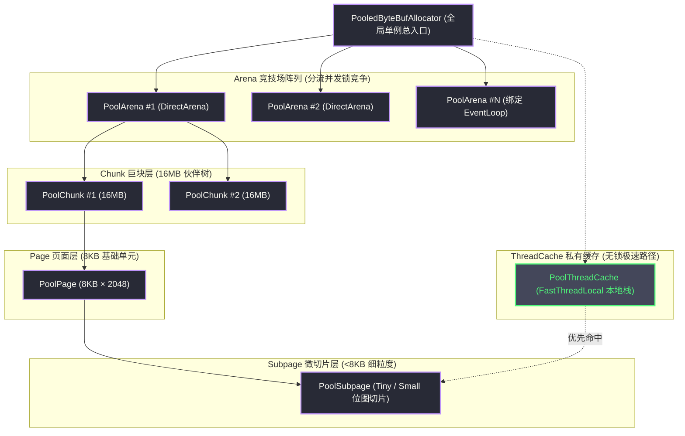
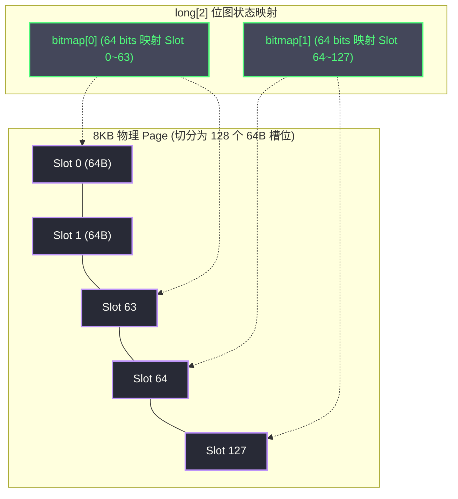

# Netty内存管理——jemalloc算法在Java中的实现

**摘要：**

高性能网络通信的基础设施之争，归根结底是一场对底层计算资源的控制权夺取之战。在每秒需要吞吐数以万计高并发网络报文的场景下，`ByteBuf` 的频繁申请与归还构成了整个数据链路中最沉重的负担。倘若盲目依赖 Java 原生的堆外内存（Direct Memory）直接分配，操作系统级昂贵的系统调用开销、页表映射延迟，以及与 Java 垃圾收集器（GC）脱钩所引发的内存泄漏风险，将迅速击穿服务的性能底线。Netty 的 `PooledByteBufAllocator` 借鉴了 2006 年 Jason Evans 为 FreeBSD 研发的著名内存分配器 jemalloc，在 Java 堆外内存的世界中复刻了一座精密的内存工业体系。本文从堆外内存分配与回收的物理瓶颈切入，深入剖析为什么传统 GC 与 `Cleaner` 机制在高并发网络通信中难以为继；系统解构 `PoolArena` 隔离线程竞争、`PoolChunk` 完全二叉树伙伴算法（Buddy System）管理连续页面、`PoolSubpage` 基于 64 位整型位图（Bitmap）高效治理小对象碎片的工程原理；进而推演 `PoolThreadCache` 依托无锁线程私有环形队列抹平并发锁争用的底层细节；最后结合生产实践给出监控指标度量、内存池参数调优与堆外内存泄漏的排障方法，阐明 Netty 如何在受限的受托管语言环境中建立起微秒级响应的确定性内存秩序。

---
## 第 1 章 内存分配的物理困境与池化宿命

### 1.1 堆内 TLAB 与堆外 DirectMemory 的鸿沟

审视 Java 虚拟机的内存管理演进，必须首先正视堆内内存（Heap Memory）与堆外内存（Direct Memory）在分配机理上的物理鸿沟。对于运行于 JVM 托管环境中的常规 Java 对象而言，其内存分配操作之所以极其轻量，根本原因在于 HotSpot 虚拟机所实现的**线程本地分配缓冲区（TLAB，Thread-Local Allocation Buffer）**技术。TLAB 在新生代的 Eden 区中预先为每个线程划分出一小块私有地址空间，在大部分常规对象的创建过程中，内存分配仅仅退化为单一内部指针的原子碰撞移动（Bump-the-pointer），耗时仅在数个纳秒级别，完全无需进行全局加锁或发起昂贵的操作内核调度。

然而，在追求极致吞吐的高性能网络 I/O 领域，堆内内存却存在着难以克服的先天缺陷。当 Java 应用程序试图将堆内字节数组写入物理网络套接字时，受制于垃圾收集器的对象移动与内存整理机制，操作系统的底层套接字发送接口无法直接消费堆内数据，必须由 JVM 内部在 C 堆（堆外地址空间）中临时分配一块暂存缓冲区，将堆内数据执行一次额外的深拷贝（Memory Copy），随后才能交由网卡驱动发出。这一额外的内存拷贝在海量吞吐场景下不仅白白挥霍了 CPU 总线带宽，更诱发了年轻代 GC 的剧烈颠簸。

为了达成真正的零拷贝（Zero-Copy），直接使用基于堆外物理内存的 `ByteBuffer.allocateDirect(n)` 似乎成为了唯一正途。但其背后的分配代价却高昂得令人窒息。每次在 Java 层面发起一次堆外内存分配，其底层均需穿透 JNI 调用进入操作系统的 `malloc()` 或 `mmap()` 函数。在 Linux 操作系统的内核视野中，这一调用涉及虚拟内存地址空间的重新划分、缺页异常（Page Fault）处理、物理页帧（Page Frame）的挂载，以及强制性的内存安全清零（Zero-filling）操作。整个调用的延迟跨越了从微秒到数十微秒的漫长周期，相较于 TLAB 的指针碰撞，其开销放大了整整三个数量级。倘若一个微服务每秒需要承载 10 万次网络请求，每次请求均瞬态申请一块独立的堆外内存，仅系统调用本身便足以将服务器的多核 CPU 完全拖垮。


### 1.2 GC 对堆外内存的失控与 Cleaner 的致命延迟

更为严峻的矛盾在于，堆外内存完全游离于 JVM 垃圾收集器的直接掌控之外。在 JDK 原生规范中，`DirectByteBuffer` 内部仅仅通过一个轻量级的虚引用对象——`sun.misc.Cleaner`（基于 `PhantomReference` 构建）来维系对堆外裸内存的生命周期追踪：

```
DirectByteBuffer 的双重生命周期断层：
[JVM 堆空间 (托管区)]            [系统堆外空间 (操作系统区)]
+------------------------+      +-------------------------------+
| DirectByteBuffer 对象  | ---> | 实际物理堆外内存 (如 10MB)    |
| (堆内开销仅几十字节)   |      |                               |
+------------------------+      +-------------------------------+
           | (虚引用关联)
           v
+------------------------+
| Cleaner (PhantomRef)   | ---> 等待 GC 回收堆内宿主后，才执行 free()
+------------------------+
```

这种机制在高并发生产环境中引发了致命的**生命周期失序困境**：
1. **GC 触发的认知偏差**：JVM 垃圾收集器的启动阈值完全由堆内内存的使用水位决定。一个占据了 100MB 堆外物理内存的 `DirectByteBuffer`，其在 JVM 堆内的宿主 Java 对象本身仅占用几十个字节的浅堆（Shallow Heap）。当堆内内存极其充裕时，JVM 根本不会主动触发 Full GC；
2. **堆外内存耗尽雪崩**：由于垃圾回收迟迟未能启动，堆内 `DirectByteBuffer` 实例无法被垃圾回收器判定为不可达，挂载在其上的 `Cleaner` 也就无法被推入 `ReferenceQueue`。最终的表象是，即便 JVM 堆内还有数十吉字节（GB）的空闲空间，操作系统层面的堆外内存却已被彻底耗尽，进而抛出灾难性的 `java.lang.OutOfMemoryError: Direct buffer memory`；
3. **不可复用的单向销毁**：`Cleaner` 机制本质上是一个单向的物理终结者。即便 `DirectByteBuffer` 被回收，堆外内存也只能通过系统调用归还给操作系统内核，无法被下一个网络连接复用。频繁的申请与销毁让整个操作系统的虚拟内存子系统疲于奔命。

### 1.3 内存碎片的空间拓扑：内部碎片与外部碎片的必然博弈

倘若脱离 GC 的控制而引入朴素的自定义内存池，开发者立刻需要面对操作系统层面的第二大梦魇——**内存碎片（Memory Fragmentation）**。

内存碎片在拓扑学上被严格划分为两类：
- **外部碎片（External Fragmentation）**：内存池中虽然总的剩余未分配空闲字节数十分庞大，但由于被散布的、尚未释放的细小内存块所切割，导致在物理地址上不存在一段连续的、足够大的内存空间来满足新的分配诉求。譬如一个连续 1MB 的内存池在经过数十万次变长报文的借出与归还后，可能退化为数百个仅有 2KB 到 4KB 的散碎空洞，此时一个 8KB 的分配请求便会因寻址不连续而被迫宣告失败；
- **内部碎片（Internal Fragmentation）**：内存分配器为了简化数据结构的索引与对齐复杂度，通常将内存划分成固定的离散阶梯规格（如 16 字节、32 字节、64 字节）。当应用程序仅需分配 17 字节时，系统强制分配了 32 字节的槽位，其中多余的 15 字节虽然被该对象独占却从未被有效利用，造成了净荷空间的静默浪费。

```
内存碎片空间拓扑对照：
[外部碎片]
| 已分配 (4KB) | 空闲 (2KB) | 已分配 (8KB) | 空闲 (4KB) | 已分配 (16KB) |
* 尽管总空闲有 6KB，但无法分配出一段连续的 6KB 空间！

[内部碎片]
| 实际业务数据 (17 字节) | 规格对齐填充浪费 (15 字节) | (总分配槽位 32 字节)
* 浪费的空间封装在分配块内部，无法供他人使用！
```

朴素的链表空闲块合并算法（如 First-Fit、Best-Fit）在面对高并发微秒级网络吞吐时，由于必须在全局链表上进行复杂的加锁线性遍历，其时间复杂度将从理想的 $O(1)$ 退化为恶劣的 $O(N)$。如何以极低的时间复杂度彻底抹平锁争用，并同时将内部与外部碎片压制在数学极限之内？这正是现代顶级内存分配器所必须攻克的终极命题。

---

### 1.4 Bits.reserveMemory() 机制与 DisableExplicitGC 陷阱

在深入探讨 Netty 自研内存池之前，我们必须先剖析 JDK 内部究竟是如何限制堆外内存的。在 OpenJDK 的实现中，无论是调用 `ByteBuffer.allocateDirect()` 还是底层 JNI 申请，最终都会进入 `java.nio.Bits.reserveMemory(long size, int cap)` 方法。该方法负责检查当前进程已借出的堆外内存总和是否跨越了 `-XX:MaxDirectMemorySize` 的物理红线。

如果剩余堆外额度不足以满足当前申请，JDK 并不会立刻抛出异常，而是会执行一段极具争议的「自救逻辑」：它会首先尝试休眠 100 毫秒，并在循环中连续多次主动触发 `System.gc()`，寄希望于通过一次强制性的 Full GC 唤醒垃圾回收线程，使挂载在已死 `DirectByteBuffer` 上的 `Cleaner` 虚引用尽快完成内存释放。

然而，在追求极致高可用的现代微服务生产环境中，运维与架构团队为了规避某些第三方库或遗留代码滥用 `System.gc()` 引发长时间的 Stop-The-World（STW）停顿，通常会在 JVM 启动参数中强行配置 `-XX:+DisableExplicitGC`。这一配置直接将代码中的 `System.gc()` 转义为了无意义的空操作。其后果是灾难性的：当堆外内存吃紧时，`Bits.reserveMemory()` 触发的救命 GC 被彻底静默忽略，而堆内的细微对象由于没有达到年轻代垃圾回收的晋升阈值，垃圾收集器根本不予理会。最终，系统在堆外物理内存明明还有大量可释放对象的前提下，硬生生由于 `Cleaner` 无法执行而直接抛出 `OutOfMemoryError: Direct buffer memory` 宣告进程崩溃。这种将物理资源绑定于不确定 GC 回收周期的机制，正是促使 Netty 必须亲手接管堆外内存生杀大权的直接导火索。

---

## 第 2 章 jemalloc 的设计哲学与 Netty 的移植之道

### 2.1 2006 年 FreeBSD 与 Jason Evans 的范式革命

面对多核时代高并发内存分配的性能断崖，2006 年，资深工程师 Jason Evans 为 FreeBSD 操作系统的默认 `malloc` 实现设计了一套全新的内存分配器——**jemalloc**。jemalloc 在问世之后展现出了无与伦比的多核吞吐扩展性，不仅随后被 Facebook、Mozilla Firefox 等诸多巨头全面采用作为底层基础设施，更直接成为了现代并发内存管理的经典教科书。

jemalloc 能够颠覆传统分配器的核心哲学高度凝练为两大基石：
1. **多 Arena 竞技场隔离**：彻底摒弃传统内存分配器采用全局单一大锁保护内存状态的陈旧思路。jemalloc 将全局堆划分为多个在逻辑与物理上完全对等的独立子区域——**Arena（竞技场）**。线程在生命周期中被哈希绑定到特定的 Arena 上，彼此之间的分配与归还互不干扰，将高并发下的全局锁争用彻底分流降解为细粒度的局部竞争；
2. **按大小分级管理的规整几何**：jemalloc 将所有内存请求在数学上划分为 Small（小对象）、Large/Normal（常规对象）以及 Huge（超大对象）三大层级，不同层级分别配备针对性的数据拓扑结构，在最大化规避外部碎片的同时，将内部碎片牢牢压制在 12.5% 的理论界限之下。

Netty 设计团队在 4.x 架构演进中，敏锐地洞察到了网络密集型应用与 jemalloc 场景的高度契合。自 Netty 4.0 引入池化缓冲区、并在 4.1.52 升级对齐 jemalloc 4.x 算法以来，`PooledByteBufAllocator` 在 Java 虚拟机之上完全用纯 Java 代码复刻了这一套精密体系。

### 2.2 四级内存结构全景

在 Netty 的实现中，jemalloc 的思想被具象化为一套严密的四级树状分层结构：



各层级的核心职责清晰分明：
- **`PooledByteBufAllocator`**：全局分配器门面，对外屏蔽内部复杂性，持有 `PoolArena` 数组并提供单例入口；
- **`PoolArena`**：核心调度中枢。每个 Arena 负责一组物理 Chunk 的申请、维护与释放，并驱动请求的智能路由；
- **`PoolChunk`**：向操作系统直接申请的物理连续大内存块（默认大小 16MB），内部依托伙伴算法（Buddy System）管理其切分的 2048 个标准 Page；
- **`PoolPage`**：Chunk 内部不可分割的基准分配单位（默认大小 8KB）；
- **`PoolSubpage`**：小对象分配专用器。当分配请求小于一个 Page 时，Netty 将某个 Page 借出并切分成等大小的微小槽位（Slot），通过位图进行毫秒级的无损标记；
- **`PoolThreadCache`**：挂载在每个执行线程（尤其是 `EventLoop`）私有上下文上的无锁高速缓冲池。内存释放时优先截留在此，下次分配优先命中，构成绝对零锁的最快路径。

---

### 2.3 规格化（Size Classes）的代数规整逻辑

在 jemalloc 的核心数学体系中，所有传入的原始请求容量（`reqCapacity`）在抵达物理分配前，都必须经过一次强制性的规整化计算——`normalizeCapacity(int reqCapacity)`。这绝非简单的向上取整，而是为了将离散的动态长度映射到一组精心测算的几何规格阶梯上。

在 Netty 的实现中，这一映射体系被固化为一个高度优化的查表与位运算逻辑：
- 当请求小于 512 字节时，系统将其规整到最近的 16 字节整数倍：
  $$
  \text{normCapacity} = (\text{reqCapacity} + 15) \ \& \sim 15
  $$
- 当请求位于 512 字节至 8KB 之间时，系统通过求取最高非零位（`Integer.numberOfLeadingZeros`），将其规格化为最邻近的 2 的整次幂（512B, 1024B, 2048B, 4096B）；
- 当请求介于 8KB 至 16MB 之间时，系统同样通过位移向上对齐至 2 的整次幂，确保所申请的连续物理 Page 数量恰好构成完全二叉树中的一个合法子树。

这一代数规整机制带来的直接工程收益在于：它将无穷无尽的任意字节尺寸，严格约束为有限的数十种标准形态。在整个内存池的生命周期中，相同尺寸的碎片可以被同规格的后续请求 100% 精准填补，彻底终结了传统分配器因微小尺寸不合而导致的碎片泛滥。

---

## 第 3 章 PoolChunk：伙伴算法在二叉树上的 Java 实现

### 3.1 16MB 连续物理空间的骨架构建

在 Netty 内存池中，`PoolChunk` 是向底层操作系统索取物理堆外内存的最小批发单位。其默认物理尺寸被设定为 16MB（即 $8192 \times 2^{11} = 16,777,216$ 字节）。一个 Chunk 在逻辑上被等分为 2048 个基准物理 Page（每 Page 占 8KB）。

为了在高并发下实现对这 2048 个 Page 及其任意组合的极速分配与合并，Netty 并没有采用复杂的链表或红黑树结构，而是采用了一棵**完全二叉树（Complete Binary Tree）**来管理整座 Chunk 的拓扑空间：

```
Chunk 完全二叉树拓扑结构（高度 11，叶子节点 2048 个）：
深度 (Depth)                                                          所辖内存空间
0                    Node[1] (整个 Chunk)                                16MB
                  /                       \
1             Node[2]                   Node[3]                          8MB
             /       \                 /       \
2        Node[4]   Node[5]           Node[6]   Node[7]                   4MB
         /    \   /    \           /    \   /    \
...
11     [2048] [2049] ... [4095] (共 2048 个叶子节点，对应 Page 0 ~ 2047)  8KB
```

该二叉树的总节点数为 $2^{12} - 1 = 4095$ 个。Netty 极其精妙地使用了一维字节数组 `byte[] memoryMap` 与 `byte[] depthMap` 来扁平化存储这一树形状态。根节点索引为 1，对于任意索引为 $k$ 的节点，其左子节点索引恰好为 $2k$，右子节点索引恰好为 $2k + 1$，父节点索引则为 $k / 2$。这种利用整型下标位移进行树形遍历的技巧，使得所有节点导航均可在单个 CPU 时钟周期内通过算术指令完成。

### 3.2 完全二叉树状态映射与位运算艺术

理解 `PoolChunk` 的关键在于领悟 `memoryMap` 数组中每个字节数值的代数含义：

```java
final class PoolChunk<T> {
    final PoolArena<T> arena;
    final T memory; // 真正的物理内存载体（堆外 DirectByteBuffer 或堆内 byte[]）

    private final byte[] memoryMap; // 动态状态：存储节点当前可分配的最大连续块深度
    private final byte[] depthMap;  // 静态基准：存储各节点在树中的固定深度 (0~11)

    private final int maxOrder = 11; // 树的最大深度，2^11 = 2048 个 Page
    private final int pageSize = 8192; // 8KB
    private final int chunkSize = 16 * 1024 * 1024; // 16MB
    private final byte unusable = 12; // 标记节点已被完全耗尽
}
```

每个节点的初始状态满足 `memoryMap[id] = depthMap[id]`。其动态演化公理如下：
- 若 `memoryMap[id] == depthMap[id]`：说明该节点所管辖的子树**完全处于空闲状态**，能够完整输出其所代表的整块连续内存；
- 若 `memoryMap[id] > depthMap[id]` 且 `memoryMap[id] <= maxOrder`：说明该节点的子树已经被**部分分配**，其数值精确指代了该子树中目前尚存的、能够满足分配的最大连续块的深度；
- 若 `memoryMap[id] == unusable`（取值为 12）：说明该节点所辖的物理空间已**完全被耗尽**，不可再接受任何分配。

### 3.3 伙伴算法分配推导的 O(1) 推进

当应用程序发起一个需要分配连续 $N$ 个 Page 的请求时，系统首先通过对数计算确定目标节点所需的树深度 $d = \text{maxOrder} - \log_2(N)$。随后，分配器从根节点（id = 1）启动一次确定的二叉检索：

```java
private int allocateNode(int d) {
    int id = 1; // 从根节点启动
    int initial = -(1 << d); // 用于快速位掩码判断
    byte val = value(id);
    if (val > d) {
        return -1; // 整个 Chunk 当前可用容量已无法满足深度 d 的要求，宣告失败
    }

    while (val < d || (id & initial) == 0) {
        id <<= 1; // 优先尝试左子节点
        val = value(id);
        if (val > d) {
            id ^= 1; // 左子节点空间不足，立刻跨越到右兄弟节点
            val = value(id);
        }
    }

    byte value = value(id);
    setValue(id, unusable); // 命中可用节点，标记为不可用
    updateParentsAlloc(id); // 递归向根部回溯，更新所有祖先节点的状态值
    return id;
}
```

请仔细品味 `allocateNode` 中极其精悍的 `while` 循环：它永远优先探查左子树，仅在左子树无法满足时才通过异或运算 `id ^= 1` 闪避至右子树。一旦定位到目标深度的节点，其 `memoryMap[id]` 立即被覆写为 `unusable`。

随后触发的祖先状态回溯逻辑同样严密：
```java
private void updateParentsAlloc(int id) {
    while (id > 1) {
        int parentId = id >>> 1;
        byte val1 = value(id);
        byte val2 = value(id ^ 1);
        // 父节点的值更新为左右子节点的较小值（代表子树可用的最小深度，即最大容量）
        byte val = val1 < val2 ? val1 : val2;
        setValue(parentId, val);
        id = parentId;
    }
}
```

由于完全二叉树的高度被硬性限定在 11 层，整个搜索与状态回溯过程的步长上限恒定为 11 次循环。在计算机算法理论中，其时间复杂度虽然形式上记作 $O(\log N)$，但在物理工程上它是一个不随并发量和内存规模膨胀而波动的绝对常数——**真正的物理 $O(1)$ 复杂度**。

### 3.4 伙伴合并与释放逆过程

当应用程序调用 `ByteBuf.release()` 导致某个分配节点被归还时，伙伴系统启动逆向的**伙伴合并（Buddy Merging）**：
1. 释放器依据节点 ID 将其 `memoryMap[id]` 恢复为其静态深度 `depthMap[id]`；
2. 检测其兄弟节点（`id ^ 1`）是否同样完全处于空闲状态；
3. 若兄弟节点同样空闲，说明两者共同构成的更大物理块已经完整归拢，系统向上递推将父节点的数值同步更新为其深度值；
4. 该合并过程一路向根节点传导，原本破碎的细小 Page 在瞬间被重新熔融为一个巨大的连续内存块。伙伴算法正是以此种自底向上的数学确定性，从物理底层彻底根除了外部碎片的生存空间。

---

### 3.5 分配推导全流程实战追踪

为了彻底固化对完全二叉树状态机位移的认知，我们不妨以一个具体的分配场景为例，逐指令追踪 `PoolChunk` 的状态演化：

假定当前 Chunk 处于全新的初始状态，所有节点的 `memoryMap[id]` 均严格等于其静态深度 `depthMap[id]`。此时应用程序发起一个需要分配 1 个 Page（8KB）的请求：
1. **计算目标深度**：由于单 Page 位于二叉树的最底层（第 11 层，叶子节点），系统确定目标深度 $d = 11$；
2. **检索左倾路径**：从根节点（id = 1, value = 0）启动，检测其可用深度 $0 \le 11$，且子树容量充足；进入左子节点 id = 2（value = 1），继续左偏至 id = 4（value = 2）... 这一过程以左倾偏好一路下沉，直至命中二叉树的第 11 层首个叶子节点 `Node[2048]`（对应物理 Page 0）；
3. **状态冻结**：将 `memoryMap[2048]` 覆写为 `unusable`（数值 12），标示 Page 0 已经被物理独占；
4. **祖先回溯递推**：
   - 检查其兄弟节点 `Node[2049]`（对应 Page 1），此时 `Node[2049]` 依然完全空闲（value = 11）；
   - 父节点 `Node[1024]` 的状态更新为左右子节点的较小值：$\min(12, 11) = 11$。这向上一层表明：尽管 Node[1024] 失去了一个 Page，但其名下依然存在着能够满足深度 11（8KB）的空闲块，只是无法再满足深度 10（16KB）的连续分配；
   - 沿链向根部逐级回溯，父节点 `Node[512]` 同样更新为 11... 根节点 `Node[1]` 最终也被更新为 1。这意味着虽然整座 Chunk 已经失去了 8KB，但由于其余子树完好，它依然能响应高达 8MB 的连续分配。

这种基于标量值的状态维护机制，彻底摒弃了复杂的动态链表指针操作。所有判断均收敛为紧凑的数组寻址与位运算，使得哪怕在高达千万次的极限压测中，伙伴系统的 CPU 缓存命中率依然逼近理论峰值。

---

## 第 4 章 PoolSubpage：小对象的位图切片管理

### 4.1 为什么 Page 级分配会引发小对象的碎片灾难

伙伴算法在管理页面级（$\ge 8$KB）的常规分配时堪称完美。但网络应用中海量的控制帧、心跳包以及 RPC 元数据头，其体积往往只有几十到几百字节。倘若为一个 64 字节的心跳请求直接分配一个 8KB 的物理 Page，此时的内部碎片率将高达：

$$
\frac{8192 - 64}{8192} \approx 99.22\%
$$

高达 99% 以上的物理内存将被虚掷在填充对齐之中。为了打破这一边界，jemalloc 在 Page 的微观维度设计了二次切分机制——**`PoolSubpage`**。

### 4.2 SubPage 的规格切片与对齐哲学

Netty 将所有小于 8KB 的分配诉求划归为小对象管理，并在内部细分了两大规格阶梯：
- **Tiny 规格（< 512 字节）**：从 16 字节开始，以 16 字节为绝对公差线性递增（16B, 32B, 48B, 64B ... 直至 496B），共计 31 种规格；
- **Small 规格（512 字节 ～ 4KB）**：从 512 字节开始，按 2 的次幂成倍递增（512B, 1024B, 2048B, 4096B），共计 4 种规格。

这一精密的阶梯划分带来了一项无可辩驳的数学结论：**任意小对象的内部碎片率被严格封顶在 12.5% 以下**。同时，将最小粒度铆定在 16 字节，能够天然契合现代 x86 与 ARM 处理器的 SIMD（单指令多数据）指令集内存对齐规范，避免跨缓存行访问引发的总线撕裂锁（Bus Split Lock）。

### 4.3 64 位 long 数组位图状态机

当一个 8KB 的 Page 被首次降级为 `PoolSubpage` 时，它会根据目标规格（譬如 64 字节）被均匀地物理划分为 $N = 8192 / 64 = 128$ 个等长的微槽位（Slot）。为了追踪这 128 个微槽位的分配状态，Netty 引入了一个基于 `long[]` 数组的极简位图（Bitmap）：

```java
final class PoolSubpage<T> {
    final PoolChunk<T> chunk;
    private final int memoryMapIdx; // 所属 Chunk 二叉树叶子节点的编号
    private final int runOffset;    // 对应 Page 在物理 Chunk 内部的绝对字节偏移

    final int elemSize;      // 每个槽位的大小（如 64 字节）
    private int maxNumElems; // 总槽位数 = 8192 / elemSize
    private int numAvail;    // 当前剩余可用槽位数

    // 状态位图：每一位精确对应一个槽位（0 代表空闲可用，1 代表已被占用）
    // 一个 long 拥有 64 个 bit，足以追踪 64 个连续槽位
    private final long[] bitmap;
}
```



在位图上检索可用空闲槽位时，Netty 展现了堪称惊艳的位运算技艺。分配器无需逐位循环比对，而是直接利用 CPU 原生内联指令 `Long.numberOfTrailingZeros(~bits)`：

```java
// 核心位图槽位极速分配逻辑
long bits = bitmap[i];
if (~bits != 0) { // 只要当前 64 位整型取反后非零，说明必有未分配的 0 位可用
    int baseVal = i << 6;
    // 单条 CPU 指令极速定位末尾第一个 0 位的局部偏移量
    int val = Long.numberOfTrailingZeros(~bits);
    bits |= 1L << val; // 将该位原子翻转为 1，标示已占用
    bitmap[i] = bits;
    if (--numAvail == 0) {
        removeFromPool(); // 若槽位已全部耗尽，将当前 Subpage 从可用链表中脱挂
    }
    return toHandle(baseVal | val);
}
```

`Long.numberOfTrailingZeros` 在 JIT 编译后直接映射到底层硬件的 `TZCNT` 或 `BSF` 汇编指令，在 1 个 CPU 指钟周期内即可完成跨越 64 个状态位的瞬时判别。这种逼近物理极限的算法设计，使得哪怕在成千上万个细碎小对象的争抢中，Netty 的小对象切片定位依然坚如磐石。

---

### 4.4 句柄（Handle）的 64 位压缩编码哲学

在 `PoolChunk` 与 `PoolSubpage` 的交互边界上，存在一个极具美感的底层设计——内存句柄（Handle）的 64 位压缩编码。在 Java 中，若要返回一个复合数据结构来描述「你在哪个 Chunk 的哪个 Page 的哪个微槽位中分配了内存」，常规的面向对象思维是定义一个 `AllocationResult` 对象。然而，在高并发下每秒创建数十万个临时的结果封装对象，本身就会加剧 GC 负担。

Netty 坚决采用了 C 语言式的位压缩技艺，将所有的定位元数据无损压缩进了一个单一的 64 位 `long` 整数句柄中：

```
Netty 内存句柄 (64 位 long handle) 拓扑结构：
+-------+-----------------------+-----------------------+-----------------------+
| 1 Bit |        31 Bits        |        32 Bits        |      工程物理语义      |
+-------+-----------------------+-----------------------+-----------------------+
| Flag  |  bitmapIdx (位图槽位)  | memoryMapIdx (二叉树) |                       |
+-------+-----------------------+-----------------------+-----------------------+
|   0   |           0           |    二叉树节点编号      | 常规 Page 级或跨页分配 |
+-------+-----------------------+-----------------------+-----------------------+
|   1   |   Subpage 位图槽位编号 |    所属叶子节点编号    | Subpage 微切片细粒度  |
+-------+-----------------------+-----------------------+-----------------------+
```

当分配的内存是一个标准的 Page 时，最高位为 0，高 32 位全部置零，低 32 位直接存储其在完全二叉树中的叶子节点编号 `memoryMapIdx`。而当分配发生在一个 `PoolSubpage` 内部时，最高符号位被翻转为 1，高 32 位直接编码其在 `long[] bitmap` 中的槽位索引（`bitmapIdx`），低 32 位则精确记录该 Subpage 所挂载的二叉树节点号。

释放内存时，系统仅凭这一个 64 位整数，通过单次位移运算即可瞬时裁决：最高位是否为 1？若是，则剥离出槽位号与叶子节点号，直接进入对应 Subpage 的位图清零逻辑；若否，则直接推进二叉树节点的伙伴合并。这种零对象分配（Zero-allocation）的纯标量化设计，将 Java 语言在系统级底层的表达能力推向了极致。

---

## 第 5 章 PoolArena：并发隔离与请求路由中枢

### 5.1 多 Arena 并发隔离设计

即使底层的 Chunk 伙伴算法与 SubPage 位图达到了极速，倘若全局所有并发线程都在同一个数据结构上执行 `synchronized` 争抢，多核 CPU 的互斥锁竞争依然会成为吞吐的绞杀索。为了将全局竞争化整为零，Netty 构建了宏观上的并发调度器——**`PoolArena`**。

在 `PooledByteBufAllocator` 初始化时，系统会默认探测宿主机 CPU 的逻辑核心数，并构建一组由多个独立 Arena 组成的并行矩阵：

```java
// 默认 Arena 实例数的物理基准：
// DirectArena 数量 = min(CPU 核心数 * 2, 64)
// HeapArena 数量   = CPU 核心数
```

每个 `EventLoop` 线程在绑定物理 Channel 展开工作前，会被轮询哈希锚定到一个固定的 `PoolArena` 实例上。尽管同一个 Arena 仍然可能由数个线程共享，但这种分区洗牌机制已将线程并发争抢的概率降低了数十倍。

### 5.2 请求路由算法与三层阶梯分流

当线程发起内存申请时，`PoolArena.allocate()` 扮演着指挥中枢的角色，依据规格尺寸将请求分流至三条不同的物理通道：

```java
private void allocate(PoolThreadCache cache, PooledByteBuf<T> buf, final int reqCapacity) {
    final int normCapacity = normalizeCapacity(reqCapacity); // 规整化为最近的规格阶梯

    if (isTinyOrSmall(normCapacity)) {
        // 第一通道：小对象阶梯 (< 8KB)
        // 1. 先查当前线程的私有无锁缓存 PoolThreadCache
        if (cache.allocateTiny(this, buf, reqCapacity, normCapacity)) return;

        // 2. 缓存未命中，加锁访问当前 Arena 的专用 SubPage 链表
        synchronized (this) {
            allocateSubpage(buf, reqCapacity, normCapacity);
        }
    } else if (normCapacity <= chunkSize) {
        // 第二通道：常规页面阶梯 (8KB ~ 16MB)
        // 1. 优先查当前线程私有缓存中的 Normal 槽位
        if (cache.allocateNormal(this, buf, reqCapacity, normCapacity)) return;

        // 2. 缓存未命中，加锁遍历当前 Arena 的 Chunk 队列矩阵
        synchronized (this) {
            allocateNormal(buf, reqCapacity, normCapacity);
        }
    } else {
        // 第三通道：超大对象阶梯 (> 16MB)
        // 绕过内存池，直接通过操作系统底层申请非池化裸内存（单次使用后归还）
        allocateHuge(buf, reqCapacity);
    }
}
```

### 5.3 六大使用率 Chunk 链表与防颠簸策略

在常规页面（Normal）级别的分配中，`PoolArena` 内部维护了 6 个以双向链表相接的 Chunk 队列。这 6 个队列并不是随意设立的，而是按照 Chunk 的**物理内存使用率水位线**进行了精密的阶梯划分：

| 队列标号 | 内存使用率准入区间 | 队列核心角色与流转逻辑 |
| :--- | :--- | :--- |
| **`qInit`** | $0\% \sim 25\%$ | 刚刚分配出来的初始新 Chunk，随时可能因使用率上升而移入下一队列 |
| **`q000`** | $1\% \sim 50\%$ | 曾承载过负载但目前使用率较低的存量 Chunk |
| **`q025`** | $25\% \sim 75\%$ | 处于健康中等利用率状态的活跃 Chunk |
| **`q050`** | $50\% \sim 100\%$ | **最高优先级分配目标队列**；高使用率使得整块内存能够被紧凑压榨 |
| **`q075`** | $75\% \sim 100\%$ | 接近饱和的 Chunk，剩余空间有限 |
| **`q100`** | $100\%$ | 已被完全填满的 Chunk，不参与任何新分配遍历 |

```mermaid
%%{init: {'theme': 'dracula'}}%%
graph LR
    qInit["qInit<br/>0~25%"] -->|使用率上升| q000["q000<br/>1~50%"]
    q000 -->|上升| q025["q025<br/>25~75%"]
    q025 -->|上升| q050["q050<br/>50~100%"]
    q050 -->|上升| q075["q075<br/>75~100%"]
    q075 -->|满载| q100["q100<br/>100%"]

    q075 -.->|释放回落| q050
    q050 -.->|回落| q025
    q025 -.->|回落| q000
    q000 -.->|完全空闲 (0%)| Destroy["销毁归还操作系统"]

    classDef default fill:#282a36,stroke:#bd93f9,stroke-width:2px,color:#f8f8f2;
    classDef priority fill:#44475a,stroke:#50fa7b,stroke-width:2px,color:#50fa7b;
    class q050 priority;
```

当分配请求到达时，Netty **绝不盲目从 `qInit` 或 `q000` 寻找空闲块**，而是执着地优先探查 **`q050`**。这一反直觉的设计蕴含着深刻的工程哲学：
- 优先向使用率已经达到 50% 的 Chunk 压入新数据，能够迅速将该 Chunk 紧凑填满，最大化提高单个物理大块的内存利用密度；
- 使得那些使用率处于 `q000` 低水位的 Chunk 获得宝贵的冷却期。当低水位 Chunk 上的存量业务对象陆续释放归零时，该 Chunk 便能顺理成章地被彻底解构，将 16MB 连续物理内存完整归还给操作系统内核。

各队列之间设置了交错重叠的水位区间（譬如 `q000` 与 `q025` 均涵盖了 25%~50% 区间），这是为了有效防御边界附近的**队列震荡效应（Hysteresis Prevention）**：避免一个 Chunk 因为某单个对象的频繁申请与释放而在两个链表之间发生永无休止的来回迁移。

---
## 第 6 章 PoolThreadCache：极致的无锁本地缓存

### 6.1 伪共享与锁争用的终局方案

尽管 `PoolArena` 成功将并发压力分摊至多个分区，但在万级并发连接同时涌入时，Arena 内部的 `synchronized` 同步块依然会在 CPU 缓存一致性协议（MESI）层面引发剧烈的总线风暴与 Cacheline 频繁失效。为了抵达性能的最巅峰，Netty 引入了终极武器——**`PoolThreadCache`**。

`PoolThreadCache` 的本质是为每一个核心工作线程分配一份完全专属的、无须任何互斥锁介入的线程本地缓存容器。它的设计逻辑构成了 Netty 内存分配的黄金法则：
```
分配请求到达时：
先查当前线程私有的 PoolThreadCache（绝对无锁，命中直接返回）
           │ (未命中)
           ▼
回退至关联的 PoolArena（局部加锁，执行二叉树或位图分配）

对象调用 release() 释放时：
优先归还至当前线程私有的 PoolThreadCache（绝对无锁，下次立即可复用）
           │ (缓存队列已满)
           ▼
回退至原始关联的 PoolArena（局部加锁，执行伙伴合并或位图清零）
```

### 6.2 环形对象池 MemoryRegionCache

在 `PoolThreadCache` 的内部，针对 Tiny、Small 以及 Normal 三种规格，分别维护了一组由对象池构成的固定容量环形队列——`MemoryRegionCache`：

```java
final class PoolThreadCache {
    final PoolArena<ByteBuffer> directArena;

    // 针对各种规格分别建立独立的缓存队列数组
    private final MemoryRegionCache<ByteBuffer>[] tinySubPageDirectCaches;
    private final MemoryRegionCache<ByteBuffer>[] smallSubPageDirectCaches;
    private final MemoryRegionCache<ByteBuffer>[] normalDirectCaches;

    private int allocations; // 本地分配计数器
    private final int freeSweepAllocationThreshold; // 触发修剪的周期阈值（默认 8192 次）
}
```

每个 `MemoryRegionCache` 内部包含一个环形数组队列（Entry Queue）。每一个 Entry 节点仅仅记录了目标 Chunk 引用与其在二叉树/位图中的索引 Handle，并未持有多余数据。当特定规格的 `ByteBuf` 被当前线程释放时，系统简单地将该内存 Handle 推入当前线程对应的队列尾部；下次同一线程再次申请同规格内存时，从队列头部弹出 Handle，直接在物理内存对应偏移处重新初始化一个包装 `PooledByteBuf` 即可。整个过程彻底规避了一切原子指令与锁总线事务。

### 6.3 周期性修剪（Trim）与线程消亡防御

纯粹的线程本地缓存极易陷入另一个极端困境：**内存滞留膨胀（Cache Bloat）**。倘若某些工作线程突发处理了一批大消息后转入长期休眠，大量原本属于公共池的内存块将死锁滞留在该线程的私有队列中无法被他人共享，造成公共内存池的虚假饥饿。

为了化解这一隐患，Netty 在 `PoolThreadCache` 中设计了**平摊修剪机制（Incremental Cache Trimming）**：
1. 线程私有缓存内部维护着一个局部计数器 `allocations`；
2. 线程每在此处执行一次分配，计数器递增 1；
3. 当分配计数器累积跨越阈值（默认 8192 次）时，系统主动调用 `trim()` 方法；
4. `trim()` 方法会巡检该线程名下的所有规格队列，将那些超出活跃时间或长期沉淀未被消费的内存块弹出，批量归还给其最初诞生的 `PoolArena`；
5. 当工作线程（如 `EventLoop`）正常优雅退出（`shutdownGracefully()`）时，其持有的 `PoolThreadCache` 会被彻底注销，内部所有残留的内存块被强制全部释放回母体 Arena。

---

### 6.4 跨线程借还的性能天堑与安全边界

在异步事件驱动架构中，内存的生命周期往往超越了单一线程的边界。最经典的场景出现在 RPC 服务端流水线中：网络 I/O 线程（`EventLoop A`）从 `PoolArena` 分配了一个 `ByteBuf` 用于承载请求报文；随后，该缓冲区被作为参数派发给业务线程池中的工作线程（`Worker Thread B`）执行耗时的业务逻辑；最终，业务线程在完成反序列化或数据库操作后，就地调用 `buf.release()` 进行销毁。

此时，一个深刻的架构矛盾浮出水面：**这块内存究竟应当归还给谁？**

Netty 在 `PoolArena.free()` 中确立了严格的线程安全闭环：
1. 当 `Worker Thread B` 调用释放时，Netty 首先探测当前执行线程是否持有 `PoolThreadCache`。如果业务线程池配置了 Netty 的线程工厂（采用了 `FastThreadLocal` 体系），它确实拥有一份私有缓存；
2. 但请注意：**Thread B 的私有缓存与 Thread A 最初分配该内存的 `PoolArena` 可能完全不属于同一个竞技场**！
3. Netty 做出了一项至关重要的权衡：为了防止内存块跨 Arena 漂移导致各 Arena 之间的物理配额彻底失衡，**内存块在跨线程释放时，绝不进入当前线程的私有缓存**，而是直接穿透回退至该内存块所归属的原始 `PoolArena`；
4. 由于释放操作是由非宿主线程发起的，回退至原始 Arena 必须加锁执行 `synchronized (this)`，在互斥状态下执行伙伴树更新或位图清零。

这一机制清晰地揭示了一条隐藏在高性能神话背后的生产铁律：**尽可能保证内存的「同线程借还（Same-Thread Allocation & Deallocation）」**。倘若所有 `ByteBuf` 均在 I/O 线程借出、却统统在外部业务线程池中归还，Netty 精心构筑的 `PoolThreadCache` 无锁加速通道将彻底形同虚设，系统不仅无法享受到私有队列的红利，反而会因为跨线程的争抢而退化为全局锁竞争。

---

## 第 7 章 生产级内存池的可观测性与调优防御

### 7.1 PooledByteBufAllocatorMetric 监控体系

一个成熟的基础设施绝不能是一座不可窥探的黑盒。Netty 通过 `PooledByteBufAllocator.DEFAULT.metric()` 暴露了工业级的实时监控指标接口，使 SRE 与架构师能够全方位度量内存池的运行健康度：

```java
PooledByteBufAllocatorMetric metric = PooledByteBufAllocator.DEFAULT.metric();

// 1. 宏观拓扑与容量监控
int directArenas = metric.numDirectArenas();
long usedDirectMemory = metric.usedDirectMemory(); // 当前内存池所向操作系统实际借出的堆外总字节数

// 2. 细粒度 Arena 状态下钻
for (PoolArenaMetric arena : metric.directArenas()) {
    long activeBytes = arena.numActiveBytes(); // 正在被业务对象持有的净荷字节数
    long allocCount = arena.numAllocations();  // 累计分配次数
    long deallocCount = arena.numDeallocations(); // 累计释放次数
    int numChunkLists = arena.numChunkLists();
}

// 3. 线程本地私有缓存统计
int activeCaches = metric.numThreadLocalCaches();
```

通过这些指标，我们能够建立三项至关重要的生产告警基准：
- **内存泄漏判定比**：持续监控 `usedDirectMemory` 与业务真实请求吞吐。若业务流量已回落至低谷，但堆外已分配内存与 `activeBytes` 依然维持在高位且持续阶梯爬升，必然存在未成对调用的 `ByteBuf.release()`；
- **Arena 负载均衡度**：横向比对不同 Arena 之间的 `numAllocations`。若各 Arena 计数呈现严重偏斜，说明底层线程绑定策略或线程池配置存在局部热点；
- **ThreadCache 膨胀率**：活跃的 `numThreadLocalCaches` 应当严格等于或者无限逼近当前活跃的 I/O 线程数。若该数值高达数千，说明有大量短命的业务线程错误地调用了池化分配，导致私有缓存急剧膨胀。

### 7.2 核心调优参数与配置规范

针对不同的生产工作负载形态，应当因地制宜地调谐 JVM 系统启动参数：

```yaml
# Netty 内存池生产推荐调优基准 (针对高性能网关/微服务容器)

# 1. 物理 Page 尺寸与 Chunk 阶梯 (默认 8KB 与 16MB)
-Dio.netty.allocator.pageSize=8192
-Dio.netty.allocator.maxOrder=11

# 2. Arena 数量定制 (高吞吐网关可对齐 CPU 逻辑核数)
-Dio.netty.allocator.numDirectArenas=16
-Dio.netty.allocator.numHeapArenas=0 # 纯网关场景彻底禁用堆内池化，杜绝多余元数据开销

# 3. 线程本地缓存容量调谐
-Dio.netty.allocator.tinyCacheSize=512
-Dio.netty.allocator.smallCacheSize=256
-Dio.netty.allocator.normalCacheSize=64

# 4. 线程本地缓存修剪门限 (按业务频度调节，高频业务可上调至 16384 降低修剪损耗)
-Dio.netty.allocator.maxCachedBufferCapacity=32768
-Dio.netty.allocator.cacheTrimInterval=8192

# 5. JVM 虚拟机直接内存物理红线 (防止失控击穿容器 cgroups 限制触发 OOMKilled)
-XX:MaxDirectMemorySize=4g
```

### 7.3 堆外内存泄漏的排查流程

当生产监控发出堆外内存持续逼近红线的告警时，排查工作必须遵循严谨的工业法则：

1. **第一步：物理定性**：通过操作系统层面的 `pmap -x <pid>` 或 `jcmd <pid> VM.native_memory baseline` 确认膨胀的物理内存确实归属于 Direct 区域，而非 JVM 代码缓存或元空间溢出；
2. **第二步：挂载探针**：在测试或灰度集群中，通过动态注入启动参数开启 Netty 的进阶泄漏检测器：
   `-Dio.netty.leakDetection.level=ADVANCED`
   该级别下，Netty 会以 1% 的采样率对分配出的 `ByteBuf` 建立软引用/弱引用包裹。一旦某个 `ByteBuf` 被 GC 判定不可达、但其内部的引用计数 `refCnt` 依然大于 0 时，控制台将喷涌出警示日志：`LEAK: ByteBuf.release() was not called before it's garbage-collected`；
3. **第三步：全景断罪**：若采样定位依然模糊，可在单节点临时切换至终极模式 `-Dio.netty.leakDetection.level=PARANOID`。该级别会对 100% 的分配动作强制记录包含所有调用栈追踪的 `record()` 历史快照。开发者只需在异常日志中审视该缓冲区在何处被创建、流经哪些 Handler，便能瞬间捕捉到那个遗漏了 `ReferenceCountUtil.release()` 的罪魁祸首。

---

### 7.4 内存池的优雅停机与资源销毁

在服务发布或节点优雅下线时，若内存池未能得到妥善清理，堆外物理内存将驻留直至操作系统回收进程，可能导致滚动部署期间单机物理内存瞬间翻倍打满。

Netty 为此建立了由顶至底的瀑布式销毁链路：
1. 当调用 `EventLoopGroup.shutdownGracefully()` 时，事件循环线程在退出前会触发其关联的 `PoolThreadCache` 执行强制注销；
2. 私有缓存将内部所有滞留的 `MemoryRegionCache` 条目逐一归还至对应的 `PoolArena`；
3. `PoolArena` 进而遍历其名下的六大 Chunk 队列（从 `qInit` 到 `q100`），对持有的每一个 `PoolChunk` 调用底层的物理销毁方法 `destroyChunk(chunk)`；
4. `destroyChunk` 最终穿透 JNI 调用 JDK 的 `PlatformDependent.freeDirectBuffer()`，通过反射调用 `DirectByteBuffer` 的释放接口直接向操作系统内核归还物理内存。整套链路如同多米诺骨牌般环环相扣，确保了分布式系统在生命周期终点处的从容与洁净。

---

## 第 8 章 内存管理的架构权衡与演进启示

### 8.1 空间换时间、复杂度换吞吐的架构取舍

纵览 Netty 仿 jemalloc 内存池的宏大设计，处处激荡着计算机系统架构中最根本的**权衡（Trade-off）**法则：
- **空间换时间**：为了换取 $O(1)$ 的无锁内存访问，每个工作线程都被迫背负了多份独立的私有缓存队列；每个 Chunk 都在堆外内存中预留了 16MB 的庞大骨架；
- **复杂度换吞吐**：整个体系引入了二叉树位图、六大使用率队列、三级分配阶梯与虚引用泄漏探测。相比于 `ByteBuffer.allocate()` 的极简，Netty 内存池的代码实现极为复杂，任何边界条件的失控都可能导致严重的堆外碎片；
- **物理现实与语言抽象的妥协**：Java 本质上是一门鼓励对象瞬态创建、由自动化 GC 抹平一切物理内存细节的高级语言。然而，当它遭遇网络数据吞吐的物理极限时，工程师们不得不穿透 Java 的美好外壳，在受托管虚拟机的头顶上，用纯 Java 语法重新造出了一套原本只属于 C/C++ 世界的、精细到每一个字节和 CPU 缓存行的操作系统级内存管理体系。

### 8.2 复杂性守恒定律与基础设施的担当

正如周志明先生在《凤凰架构》中所深刻指出的：**软件系统的复杂性从来不会凭空凭空消失，它所能做到的极限，只是被安全地转移**。

假若 Netty 没有在底层扛起这套仿 jemalloc 的池化重担，那么这数以万计的并发系统调用、不可控的外部碎片整理、难以预料的堆外内存溢出，以及频繁的 GC 挂起停顿，就必须由无数编写上层业务逻辑的普通工程师在各自的业务代码中战战兢兢地手工应付。Netty 将所有的复杂性统统拦截并焊死在 `PooledByteBufAllocator` 这一座坚不可摧的铁盒之内，向上层业务只提供优雅纯粹的 `ByteBuf` 抽象。这不仅是一项工程实现的绝技，更是所有优秀基础设施软件对于分布式软件工业的最大担当与贡献。

---

## 总结

高性能网络通信对内存分配的严苛要求，倒逼 Netty 走上了一条彻底重塑内存管理范式的道路。面对堆外内存申请代价高昂、GC 无力干预与多核并发锁争用的三重绞杀，Netty 巧妙借力 jemalloc 的经典思想，构建了一套坚实完备的解决方案：

- **分层解耦的四级物理骨架**：`PoolArena` 通过多实例洗牌机制瓦解全局并发锁竞争，`PoolChunk` 依托完全二叉树与伙伴算法（Buddy System）实现了大块连续 Page 的 $O(1)$ 分配与合并，`PoolSubpage` 基于 64 位整型位图（Bitmap）与硬件指令实现了小对象的高速切片，从空间几何上将内部与外部碎片压制在极低阈值；
- **极致无锁的高速私有路径**：`PoolThreadCache` 为各核心工作线程构建了私有对象池，绝大多数高频对象的申请与借还均在无锁环境中瞬时完成，并通过基于周期的平摊修剪机制阻断了内存滞留；
- **可观测性与韧性防御**：通过全景度量指标与多级泄漏采样机制，赋予了系统在面对不可预测异常与恶意流量冲击时的快速自愈与定位能力；
- **架构哲学的因地制宜**：在追求吞吐的极致道路上，充分理解空间冗余、算法复杂度与执行性能之间的临界点，因地制宜地调配参数，方能释放出这套精密内存引擎的最大威力。

下一篇我们将深入 Netty 的高性能工具箱——`FastThreadLocal`（彻底超越 JDK 原生实现的新一代线程本地变量）、`HashedWheelTimer`（$O(1)$ 复杂度的大规模定时任务时间轮）与 `MpscQueue`（无锁的多生产者单消费者并发队列）：[[08 Netty高性能之道——FastThreadLocal、HashedWheelTimer与无锁队列]]。

---

## 参考资料

1. Jason Evans. *A Scalable Concurrent malloc(3) Implementation for FreeBSD*. BSDCan Conference, 2006.
2. Norman Maurer, Marvin Allen Wolfthal. *Netty in Action*, Chapter 5: ByteBuf. Manning Publications, 2016.
3. 周志明.《凤凰架构：构建可靠的大型分布式系统》. 机械工业出版社, 2021.
4. Netty Source Code: `io.netty.buffer.PooledByteBufAllocator`.
5. Netty Source Code: `io.netty.buffer.PoolArena`.
6. Netty Source Code: `io.netty.buffer.PoolChunk`.
7. Netty Source Code: `io.netty.buffer.PoolSubpage`.
8. Netty Source Code: `io.netty.buffer.PoolThreadCache`.

---

> [!note] 思考题
> 1. 在 `PoolChunk` 的完全二叉树伙伴算法中，假定某个 Page 大小为 8KB，`maxOrder` 为 11。如果一个应用程序并发申请两个 16KB（即连续 2 个 Page）的缓冲区，系统分配了节点 A 与节点 B。这两个节点在二叉树拓扑上必须满足怎样的空间亲缘关系？为什么将它们合并时必须检测其互为「伙伴（Buddy）」，而不是任意两个相邻的空闲块都能直接合并？
> 2. `PoolSubpage` 在切分小对象时，将小于 512 字节的 Tiny 规格严格限定为按 16 字节公差递增。为什么 Netty 不采用更细粒度的 4 字节或 8 字节对齐？从现代 CPU 缓存行（Cacheline）与硬件体系架构的角度分析，16 字节对齐带来了哪些底层的指令优化收益？
> 3. `PoolThreadCache` 显著降低了分配时的锁竞争，但在多线程交叉借还的场景下（譬如对象在线程 A 中被分配，随后跨线程流转至线程 B 处理完毕后调用 `release()` 回收），该内存块最终会归还到线程 A 的私有缓存、线程 B 的私有缓存，还是直接退回至公共的 `PoolArena`？这种跨线程回收的机制是如何实现的，它是否存在潜在的内存偏斜风险？
