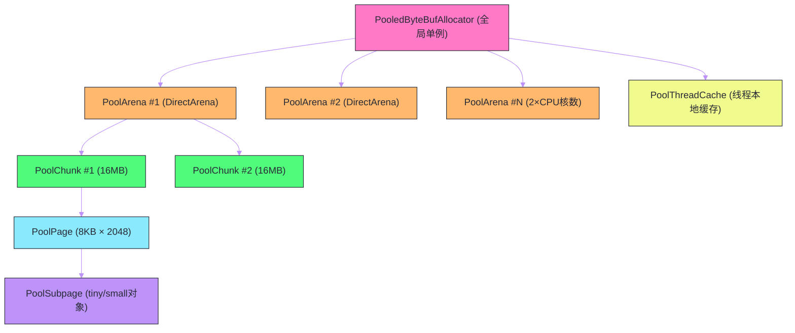

# Netty内存管理——jemalloc算法在Java中的实现

## 摘要

高性能网络服务器的内存管理是一门精密的工程学。每秒处理数万个请求，意味着每秒需要分配和释放数万个 `ByteBuf`——如果每次都向操作系统申请和归还堆外内存，系统调用的开销和内存碎片问题将成为不可忽视的性能瓶颈。Netty 的 `PooledByteBufAllocator` 借鉴了 Facebook 工程师 Jason Evans 于 2006 年为 FreeBSD 实现的 jemalloc 内存分配器，在 Java 层面实现了一套精密的内存池体系：Arena 隔离线程争用、Chunk 管理大块内存、Page 作为分配单元、SubPage 处理小对象碎片，ThreadCache 提供无锁的线程本地缓存。本文从 JVM 堆外内存管理的困境出发，逐层剖析 `PoolArena`、`PoolChunk`、`PoolSubpage`、`PoolThreadCache` 四级结构的设计原理，解释为什么这套机制能将内存分配的时间复杂度降到接近 O(1)，以及如何监控和调优生产环境中的内存池参数。

---

## 第 1 章 为什么需要内存池

### 1.1 堆外内存的分配代价

在 Java 中分配堆外内存（Direct Memory）的代价远高于分配堆内内存：

**堆内内存分配**：JVM 的 TLAB（Thread-Local Allocation Buffer）机制让堆内对象的分配极其廉价——大多数情况下只是一个指针的移动，无需系统调用，时间复杂度 O(1)，耗时纳秒级。

**堆外内存分配**：`ByteBuffer.allocateDirect(n)` 在底层调用 `malloc(n)`（或 `mmap()`），这涉及：
1. 操作系统内核的内存页分配（涉及页表操作）；
2. 内存清零（安全要求）；
3. 可能触发内存碎片整理。

整个过程需要数微秒到数十微秒，是 TLAB 分配的几百倍。

在高并发场景下，假设每秒处理 10 万个请求，每个请求分配一个 4KB 的 `DirectByteBuffer`，每次分配耗时 10μs，单这一项的 CPU 时间就需要 1 秒——服务器被内存分配拖垮了。

### 1.2 GC 对堆外内存的无能为力

堆外内存不在 JVM GC 的管辖范围内。JDK 的 `DirectByteBuffer` 通过 `Cleaner`（基于 `PhantomReference`）来延迟释放堆外内存，但这个机制有两个严重问题：

**问题一：释放时机不可预测**

`Cleaner` 在 `DirectByteBuffer` 对象被 GC 回收后才触发堆外内存释放，而 GC 的触发时机由 JVM 堆的使用情况决定，与堆外内存的使用情况无关。极端情况下：JVM 堆很空，GC 迟迟不触发，但堆外内存已经耗尽，导致 `OutOfMemoryError: Direct buffer memory`，而此时 JVM 堆内存可能还有大量空余。

**问题二：无法复用**

Cleaner 是单向的"销毁者"，每个 `DirectByteBuffer` 被销毁后内存归还给 OS，不能"归还到池中"供下次复用。这意味着即使内存分配和释放的频率完全稳定，每次分配仍然需要重新向 OS 申请。

内存池（Memory Pool）是解决这两个问题的标准方案：预先申请一大块堆外内存，然后自己管理这块内存的分配和回收，不依赖 GC，不需要频繁的系统调用。

### 1.3 内存碎片问题

朴素的内存池还需要解决**内存碎片**问题。想象一个 1MB 的内存块，经过大量分配和释放后，可能变成这样：

```
[已用][空闲][已用][空闲][已用][空闲][已用][空闲]
  4KB   2KB   8KB   1KB   16KB  4KB   2KB   2KB
```

总空闲内存 = 9KB，但最大连续空闲块只有 4KB。如果来了一个 8KB 的分配请求，即使总空闲内存足够，也无法满足——这就是**外部碎片**（External Fragmentation）。

还有**内部碎片**（Internal Fragmentation）：分配的块大于实际需求。比如请求 5 字节，分配了 8 字节（最小分配单元为 8 字节），浪费了 3 字节。

jemalloc 通过精心设计的内存分级（大对象、中等对象、小对象分别管理）和伙伴算法（Buddy System）来最小化碎片。

---

## 第 2 章 jemalloc 的核心思想

### 2.1 jemalloc 的历史背景

Jason Evans 在 2006 年为 FreeBSD 内核替换默认 malloc 实现而设计了 jemalloc。其核心创新有两点：

**多 Arena 隔离争用**：传统 malloc 使用全局锁保护分配器状态，高并发下锁争用严重。jemalloc 将内存划分为多个独立的 Arena（竞技场），每个线程绑定到一个 Arena，不同线程的分配操作在不同 Arena 中进行，几乎消除了锁争用。

**按大小分级管理**：将所有内存分配请求按大小划分为 Small（小对象）、Large（大对象）、Huge（巨大对象）三类，分别采用不同的分配策略，在减少碎片的同时保持高效。

Netty 在 4.x 版本引入了仿 jemalloc 的内存池实现（最初基于 jemalloc 3.x，后来在 4.1.52 版本更新为仿 jemalloc 4.x 算法），将其应用于 `ByteBuf` 的堆外内存（和堆内内存）管理。

### 2.2 四级内存结构

Netty 的内存池分为四级：



- **`PooledByteBufAllocator`**：全局入口，持有 DirectArena 数组和 HeapArena 数组；
- **`PoolArena`**：独立的内存竞技场，负责 Chunk 的生命周期管理和分配请求的路由；
- **`PoolChunk`**：向 OS 申请的大块内存（默认 16MB），用伙伴算法管理内部 Page 的分配；
- **`PoolSubpage`**：将一个 Page（8KB）切割成等大小的小块，专门服务小对象分配（< 8KB）；
- **`PoolThreadCache`**：每个线程持有的本地缓存，缓存已释放的内存块，下次分配时优先从缓存取，无锁。

---

## 第 3 章 PoolChunk：伙伴算法管理 Page

### 3.1 Chunk 的内部结构

`PoolChunk` 是 Netty 向 OS 申请的基本单位，默认大小 16MB（`DEFAULT_PAGE_SIZE * MAX_ORDER = 8KB * 2048`）。每个 Chunk 内部被划分为 2048 个 Page，每个 Page 大小 8KB。

Chunk 使用**完全二叉树**管理这 2048 个 Page 的使用状态：

```
                          深度 0（根节点）：整个 Chunk（16MB）
                      /                           \
              深度 1（8MB）                     深度 1（8MB）
            /         \                         /         \
        深度 2（4MB）  深度 2（4MB）         ...           ...
        ...
        深度 11（Page 级，8KB）：2048 个叶子节点
```

二叉树共有 2^12 - 1 = 4095 个节点（11 层，叶子节点 2048 个）。Netty 用一个 `byte[]` 数组存储每个节点的"最大可用 Page 数"的对数值（`memoryMap[]`）：

```java
// PoolChunk 内部结构（简化）
final class PoolChunk<T> {
    final PoolArena<T> arena;
    final T memory;        // 实际内存块（DirectByteBuffer 或 byte[]）
    
    private final byte[] memoryMap;   // 节点状态：存储每个节点"最大连续可用 Page 数"的 log2 值
    private final byte[] depthMap;    // 节点深度：静态，用于计算节点对应内存的偏移量
    
    private int freeBytes;  // 当前 Chunk 中剩余可分配字节数
    
    // maxOrder = 11（对应 2048 个叶子 Page）
    // pageSize = 8192（8KB）
    // chunkSize = 16MB
}
```

`memoryMap[node]` 的值含义：
- `memoryMap[node] = depthMap[node]`：此节点**全部可用**（子树中所有 Page 空闲）；
- `memoryMap[node] = MAX_ORDER + 1`（= 12）：此节点**全部已分配**（不可用）；
- 介于两者之间：此节点**部分可用**，`memoryMap[node]` 表示子树中最大连续可用块的大小的 log2 值。

### 3.2 伙伴算法的分配过程

分配 N 个 Page 时：

1. **计算需要的节点深度**：需要 N 个连续 Page，要在二叉树中找到深度 d = `log2(2048/N)` 的节点（该节点对应 N 个 Page 的内存块）；
2. **从根节点开始搜索**：在二叉树中找到深度 ≥ d、`memoryMap[node] = d` 的节点（表示该节点的子树还有 N 个连续空闲 Page）；
3. **分配并更新**：将该节点标记为已分配（`memoryMap[node] = MAX_ORDER + 1`），更新其所有祖先节点的 `memoryMap` 值（重新取左右子节点的最大值）。

释放时：将节点标记为可用，与其"伙伴节点"（二叉树中的兄弟节点）合并——如果兄弟节点也是空闲的，则向上合并，直到无法合并为止。这就是"伙伴"（Buddy）的含义。

```java
// 分配 N 个 Page 的伙伴算法（简化）
private long allocateRun(int normCapacity) {
    int d = maxOrder - (log2(normCapacity) - pageShifts);  // 计算目标深度
    int id = allocateNode(d);  // 在二叉树中找到可用节点
    if (id < 0) return id;    // 分配失败（Chunk 空间不足）
    freeBytes -= runLength(id);  // 更新剩余空间
    return id;
}

private int allocateNode(int d) {
    int id = 1;  // 从根节点（id=1）开始
    int initial = -(1 << d);  // 用于跳转到目标深度的位运算
    byte val = value(id);
    if (val > d) return -1;  // 根节点可用量不足，整个 Chunk 无法满足请求
    
    while (val < d || (id & initial) == 0) {
        id <<= 1;  // 左子节点
        val = value(id);
        if (val > d) {
            id ^= 1;  // 左子节点不够，尝试右子节点
            val = value(id);
        }
    }
    
    byte value = value(id);
    assert value == d && (id & initial) == 1 << d : String.valueOf(value);
    setValue(id, unusable);  // 标记为已分配
    updateParentsAlloc(id);  // 更新祖先节点
    return id;
}
```

这个算法的时间复杂度是 O(log n)，其中 n 是树的深度（11 层），实际上是 O(11) = O(1)（常数次操作）。

---

## 第 4 章 PoolSubpage：小对象的切片管理

### 4.1 为什么需要 SubPage

伙伴算法的最小分配单元是一个 Page（8KB）。如果应用需要大量分配 64 字节的小对象，每个分配都消耗整个 Page，内部碎片率将高达 99.2%——极大浪费内存。

`PoolSubpage` 解决了这个问题：将一个 Page 切割成若干等大小的小块，用位图（bitmap）追踪每个小块的使用状态。

### 4.2 SubPage 的分配规格

Netty 将小对象（< 8KB）按照规格大小（Size Classes）划分，确保内部碎片率不超过 12.5%：

**Tiny 规格**（< 512B，按 16 字节对齐）：

16, 32, 48, 64, 80, 96, ... 496 字节（共 31 种规格）

**Small 规格**（512B～4KB，按 2 倍增长）：

512, 1024, 2048, 4096 字节（共 4 种规格）

举例：请求 100 字节 → 规格化为 112 字节（最近的 16 字节对齐值），内部碎片 10.7%。

> [!note] 为什么按 16 字节对齐？
> CPU 缓存行通常是 64 字节，内存对齐对于向量化计算很重要。16 字节是 SIMD 指令（SSE2）的对齐要求，按 16 字节对齐可以利用硬件对齐优化。

### 4.3 SubPage 的位图管理

每个 `PoolSubpage` 对应一个 Page，被切割成 N 个等大小的小块（N = 8192 / elemSize）：

```java
final class PoolSubpage<T> {
    final PoolChunk<T> chunk;     // 所属 Chunk
    private final int memoryMapIdx; // 在 Chunk 二叉树中的节点 ID
    private final int runOffset;    // 在 Chunk 内存中的偏移量（字节）
    
    final int elemSize;   // 每个小块的大小（规格化后的值，如 64 字节）
    private int maxNumElems;  // 最大小块数 = 8192 / elemSize
    private int numAvail;     // 当前可用小块数
    private int nextAvail;    // 下一个可分配的小块索引
    
    // 位图：每个 bit 代表一个小块的使用状态（0=空闲，1=已分配）
    // long[] 每个元素有 64 个 bit，可以代表 64 个小块
    private long[] bitmap;
    private int bitmapLength;  // bitmap 有效 long 的数量
}
```

分配时：在位图中找到第一个 0 bit，将其置为 1，返回对应的内存偏移量。查找 0 bit 可以用 `Long.numberOfTrailingZeros(~word)`（对 long 取反后计算末尾 0 的数量）实现 O(1) 查找。

释放时：将对应 bit 置 0，更新 `numAvail`。如果整个 SubPage 变为全空闲，归还 Page 给 PoolChunk（触发伙伴算法的合并）。

---

## 第 5 章 PoolArena：分配请求的路由中心

### 5.1 Arena 的职责

`PoolArena` 是分配请求的"调度中心"，负责：
1. 根据请求大小决定从哪个级别分配（SubPage、Chunk 直接分配、或大内存直接 malloc）；
2. 维护不同使用率的 Chunk 列表（`qInit`、`q000`、`q025`、`q050`、`q075`、`q100`）；
3. 管理各种规格的 SubPage 链表。

### 5.2 按大小分级的分配策略

```java
// PoolArena.allocate() — 分配路由（简化版）
private void allocate(PoolThreadCache cache, PooledByteBuf<T> buf, final int reqCapacity) {
    final int normCapacity = normalizeCapacity(reqCapacity);  // 规格化到最近的规格大小
    
    if (isTinyOrSmall(normCapacity)) {
        // 小对象（< 8KB）：走 SubPage 路径
        int tableIdx;
        PoolSubpage<T>[] table;
        boolean tiny = isTiny(normCapacity);  // < 512B
        if (tiny) {
            // 1. 先查线程本地缓存（无锁）
            if (cache.allocateTiny(this, buf, reqCapacity, normCapacity)) {
                return;
            }
            tableIdx = tinyIdx(normCapacity);  // 规格→下标映射
            table = tinySubpagePools;
        } else {
            // small 规格（512B～4KB）
            if (cache.allocateSmall(this, buf, reqCapacity, normCapacity)) {
                return;
            }
            tableIdx = smallIdx(normCapacity);
            table = smallSubpagePools;
        }
        
        // 2. 从现有 SubPage 分配
        final PoolSubpage<T> head = table[tableIdx];
        synchronized (head) {  // 同 Arena 的 SubPage 列表需要同步
            final PoolSubpage<T> s = head.next;
            if (s != head) {
                // 有可用的 SubPage
                long handle = s.allocate();
                buf.init(this, null, handle, reqCapacity, normCapacity, cache);
                return;
            }
        }
        // 3. SubPage 用完了，分配新的 Page 并切割
        synchronized (this) {
            allocateNormal(buf, reqCapacity, normCapacity);
        }
    } else if (normCapacity <= chunkSize) {
        // 中等对象（8KB～16MB）：走 Page 路径
        // 1. 先查线程本地缓存
        if (cache.allocateNormal(this, buf, reqCapacity, normCapacity)) {
            return;
        }
        // 2. 从 Chunk 分配
        synchronized (this) {
            allocateNormal(buf, reqCapacity, normCapacity);
        }
    } else {
        // 大对象（> 16MB）：直接向 OS 分配（不进内存池）
        allocateHuge(buf, reqCapacity);
    }
}
```

### 5.3 Chunk 使用率管理：五个队列

`PoolArena` 维护 5 个 Chunk 队列，按使用率（已分配字节 / 总大小）分组：

| 队列名 | 使用率范围 | 说明 |
| --- | --- | --- |
| `qInit` | 0% ～ 25% | 新创建的 Chunk，使用率极低 |
| `q000` | 0% ～ 50% | 使用率 0%～50% 的 Chunk |
| `q025` | 25% ～ 75% | 使用率 25%～75% 的 Chunk |
| `q050` | 50% ～ 100% | 使用率 50%～100% 的 Chunk（优先分配目标）|
| `q075` | 75% ～ 100% | 使用率 75% 以上的 Chunk |
| `q100` | 100% | 已满的 Chunk |

分配时，优先从 `q050`（使用率高的 Chunk）开始搜索，这样做的好处是：使用率低的 Chunk 有机会被完全释放并归还给 OS，减少长期占用的内存。

当 Chunk 的所有 Page 都被释放后，如果 Arena 持有的 Chunk 数量超过阈值，该 Chunk 会被销毁（堆外内存归还 OS），防止内存池无限膨胀。

---

## 第 6 章 PoolThreadCache：无锁的线程本地缓存

### 6.1 为什么需要线程本地缓存

`PoolArena` 的分配操作需要加锁（见上面代码的 `synchronized`），在高并发下仍然存在锁争用。`PoolThreadCache` 在 `PoolArena` 之上增加了一层无锁的线程本地缓存：

```
分配请求 → 先查 PoolThreadCache（无锁，本线程私有）
              ↓ 缓存命中
            直接返回（最快路径，无锁）
              ↓ 缓存未命中
            从 PoolArena 分配（需要加锁）
```

释放时也优先放回线程本地缓存，而非立即归还给 Arena。这样下一次同一线程分配同规格内存时，可以直接从缓存取，完全绕过 Arena 的锁。

### 6.2 PoolThreadCache 的结构

```java
final class PoolThreadCache {
    final PoolArena<byte[]> heapArena;
    final PoolArena<ByteBuffer> directArena;
    
    // 三种规格各对应一个 MemoryRegionCache 数组
    // MemoryRegionCache 是一个固定大小的循环队列，存放缓存的内存块
    private final MemoryRegionCache<byte[]>[] tinySubPageHeapCaches;
    private final MemoryRegionCache<byte[]>[] smallSubPageHeapCaches;
    private final MemoryRegionCache<byte[]>[] normalHeapCaches;
    
    private final MemoryRegionCache<ByteBuffer>[] tinySubPageDirectCaches;
    private final MemoryRegionCache<ByteBuffer>[] smallSubPageDirectCaches;
    private final MemoryRegionCache<ByteBuffer>[] normalDirectCaches;
    
    // 分配计数：每分配 8192 次，执行一次缓存修剪（trim），释放不活跃的缓存
    private int allocations;
    private final int freeSweepAllocationThreshold;
}
```

`MemoryRegionCache` 是一个固定大小的队列（tiny 规格默认 512 个 slot，small 默认 256 个，normal 默认 64 个），存放已释放但尚未归还 Arena 的内存块。

每分配 8192 次（`freeSweepAllocationThreshold`），Netty 会对缓存做一次"修剪"（`trim()`）：将长期未被使用的缓存条目归还给 Arena，防止缓存长期占用内存。

### 6.3 EventLoop 线程与 PoolThreadCache 的绑定

`PoolThreadCache` 通过 JDK `ThreadLocal`（实际上是 Netty 自己实现的 `FastThreadLocal`）与线程绑定。由于 Netty 的 `EventLoop` 线程数量固定（不会像线程池那样频繁创建销毁线程），`PoolThreadCache` 的生命周期与线程生命周期绑定，不会有频繁的缓存失效问题。

当 `EventLoop` 线程销毁时（调用 `shutdownGracefully()`），其关联的 `PoolThreadCache` 会将所有缓存条目归还给对应的 `PoolArena`，确保不造成内存泄漏。

---

## 第 7 章 内存池的监控与调优

### 7.1 关键监控指标

`PooledByteBufAllocator` 暴露了丰富的监控指标，可以通过 `metric()` 方法获取：

```java
PooledByteBufAllocatorMetric metric = PooledByteBufAllocator.DEFAULT.metric();

// Arena 统计
System.out.println("numDirectArenas: " + metric.numDirectArenas());
System.out.println("numHeapArenas: " + metric.numHeapArenas());

// 内存使用情况
for (PoolArenaMetric arenaMetric : metric.directArenas()) {
    System.out.printf("Arena: numActiveBytes=%d, numIdleChunks=%d%n",
        arenaMetric.numActiveBytes(),
        arenaMetric.numIdleChunks());
}

// 线程缓存统计
System.out.println("numThreadLocalCaches: " + metric.numThreadLocalCaches());
```

**关键指标含义**：

| 指标 | 含义 | 异常判断 |
| --- | --- | --- |
| `numActiveBytes` | Arena 当前已分配的字节数 | 持续增长说明有内存泄漏 |
| `numIdleChunks` | Arena 中完全空闲的 Chunk 数 | 大量 idleChunks 说明内存使用率低，可减小池大小 |
| `numThreadLocalCaches` | 活跃的 ThreadCache 数量 | 应等于 EventLoop 线程数，否则可能有线程泄漏 |
| `numHugeAllocations` | 超大内存（>16MB）分配次数 | 频繁的 huge 分配说明有不合理的大 ByteBuf 使用 |

### 7.2 核心调优参数

```yaml
# JVM 启动参数配置 Netty 内存池行为

# 每个 Arena 对应的 Chunk 大小（默认 16MB）
-Dio.netty.allocator.pageSize=8192
-Dio.netty.allocator.maxOrder=11
# chunkSize = pageSize << maxOrder = 8192 * 2048 = 16MB

# Arena 数量（默认 min(CPU核数*2, 64) for Direct，CPU核数 for Heap）
-Dio.netty.allocator.numDirectArenas=8
-Dio.netty.allocator.numHeapArenas=4

# 线程缓存大小（各规格的缓存队列容量）
-Dio.netty.allocator.tinyCacheSize=512
-Dio.netty.allocator.smallCacheSize=256
-Dio.netty.allocator.normalCacheSize=64

# 禁用线程缓存（适合线程数很多但每个线程分配频率很低的场景）
-Dio.netty.allocator.useCacheForAllThreads=false
```

**调优建议**：

- **连接数多、每连接数据量小**（如 IoT 设备接入）：可适当减小 `numDirectArenas` 和缓存队列大小，降低内存池占用；
- **高吞吐量、大消息**（如视频流、文件传输）：增大 `maxOrder`（增大 Chunk 大小），减少 Chunk 分配频率；
- **内存紧张环境**：设置 `-Dio.netty.allocator.type=unpooled`，彻底禁用内存池，以性能换内存；
- **JVM 堆外内存上限**：设置 `-XX:MaxDirectMemorySize=2g`，防止堆外内存无限增长。

### 7.3 内存池泄漏排查流程

当服务器出现堆外内存持续增长时，排查步骤：

**第一步：确认是堆外内存泄漏**

```bash
# 监控 JVM 直接内存使用
jcmd <pid> VM.native_memory summary | grep Direct
# 或通过 JMX：java.nio:type=BufferPool,name=direct
```

**第二步：开启 Netty 内存泄漏检测**

```
-Dio.netty.leakDetectionLevel=ADVANCED
```

观察日志中是否有 `LEAK: ByteBuf.release() was not called` 警告。

**第三步：定位泄漏位置**

切换到 `PARANOID` 级别，日志中会包含 `ByteBuf` 最后访问的完整堆栈，定位到具体的代码行。

---

## 总结

Netty 的内存管理体系是工程师智慧的结晶，整个设计的逻辑线索是：

- **问题起点**：堆外内存分配代价高昂（微秒级系统调用）+ GC 无法管理 + 碎片问题，高并发下不可接受；

- **四级结构分层化解问题**：
  - `PooledByteBufAllocator` 提供全局统一入口，屏蔽底层复杂性；
  - `PoolArena` 用多竞技场隔离线程争用，消除全局锁瓶颈；
  - `PoolChunk` + 伙伴算法用完全二叉树高效管理 Page 分配/释放（时间复杂度 O(log n) ≈ O(11)）；
  - `PoolSubpage` + 位图处理小对象碎片（按 16 字节对齐规格化，内部碎片率 < 12.5%）；

- **`PoolThreadCache` 是性能王牌**：线程本地缓存完全绕过锁争用，绝大多数分配在缓存命中时以 O(1) 无锁完成；每 8192 次分配修剪一次，平衡缓存命中率和内存占用；

- **可观测性**：`PooledByteBufAllocatorMetric` 提供 Arena、Chunk、ThreadCache 的详细统计；`ResourceLeakDetector` 在取样模式下几乎零开销，在 PARANOID 模式下提供精确的泄漏位置定位。

下一篇聚焦 Netty 的高性能工具箱——`FastThreadLocal`（比 JDK `ThreadLocal` 更快的实现）、`HashedWheelTimer`（O(1) 的大规模定时任务调度）、`MpscQueue`（无锁的多生产者单消费者队列）：[[08 Netty高性能之道——FastThreadLocal、HashedWheelTimer与无锁队列]]。

---

> [!note] 参考资料
> - `io.netty.buffer.PooledByteBufAllocator` 源码
> - `io.netty.buffer.PoolArena` 源码
> - `io.netty.buffer.PoolChunk` 源码
> - `io.netty.buffer.PoolSubpage` 源码
> - Jason Evans,《A Scalable Concurrent malloc(3) Implementation for FreeBSD》, 2006
> - Netty 官方文档：Reference Counted Objects
