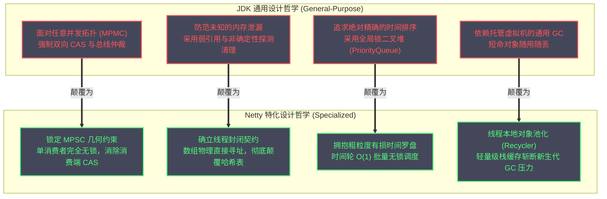
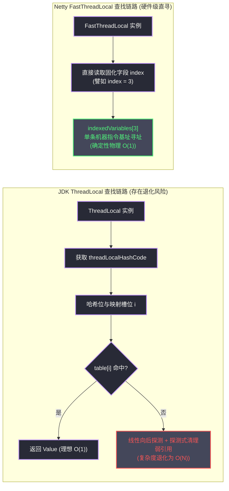
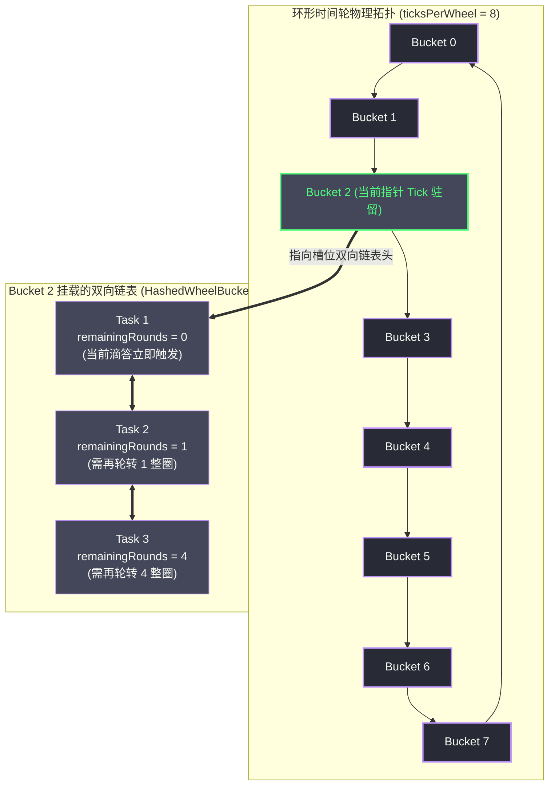
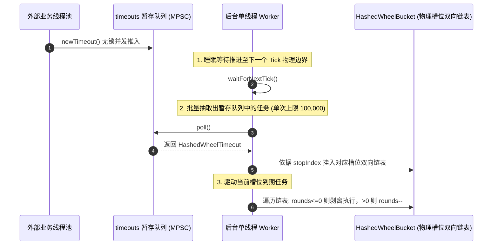
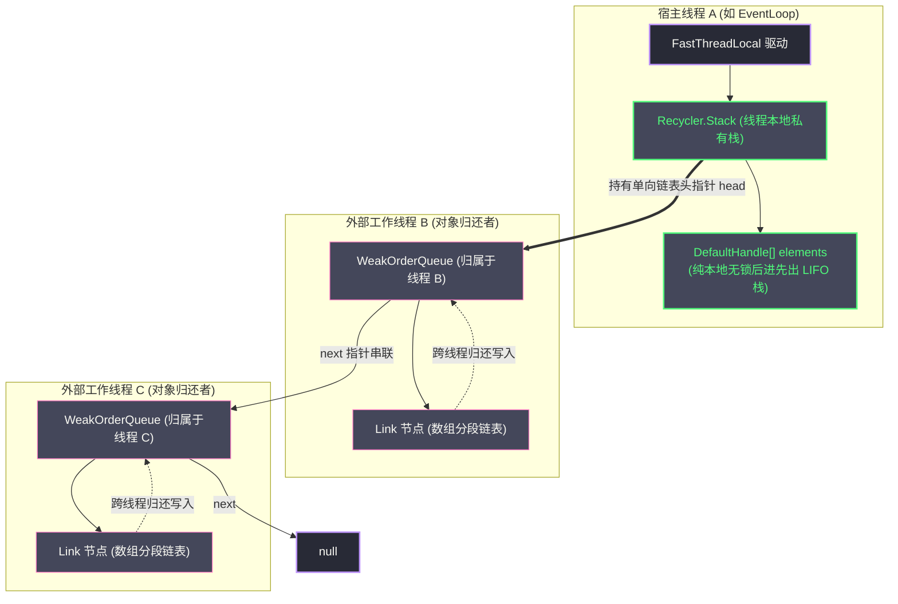
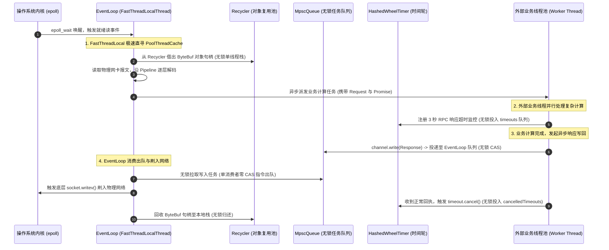

# Netty高性能之道——FastThreadLocal、HashedWheelTimer与无锁队列

**摘要：**

在分布式网络通信与高并发中间件的架构演进中，吞吐量与微秒级确定性延迟的极致追求，最终必然将工程视线从宏观层面的多路复用模型，推向微观层面的硬件流水线、CPU 缓存行与内存指令级交互。Netty 之所以能在 Java 高性能网络基础设施中长期占据统治地位，不仅在于其主从 Reactor 反应堆与精巧的 `ByteBuf` 堆外内存池化体系，更在于其敢于对 JDK 标准库中若干被奉为经典的通用并发原语发起激进的颠覆与重写。当每秒数以百万计的高并发数据包在微秒级窗口内穿透调用栈时，JDK 原生 `ThreadLocal` 的线性探测哈希碰撞、`ScheduledThreadPoolExecutor` 基于二叉小顶堆的 $O(\log N)$ 树平衡与全局互斥锁竞争、`LinkedBlockingQueue` 的管程锁上下文切换，以及频繁瞬态对象创建引发的 GC 停顿，都会化作一道道沉重的性能枷锁。针对网络通信领域高度特化的物理特征——线程上下文严格封闭、任务提交呈现多生产者单消费者（MPSC）几何倾斜、以及网络超时具备粗粒度有损容忍与高概率提前取消特性，Netty 打造了一整套自研的高性能微观基础设施矩阵：依托数组直接物理寻址将线程局部变量读写降维至确定性 $O(1)$ 的 `FastThreadLocal`；借鉴机械时钟罗盘以分桶轮转消除全局互斥锁的 `HashedWheelTimer`；利用 128 字节缓存行对齐填充（Padding）与轻量内存屏障（LazySet）消除伪共享的多生产者单消费者无锁队列 `MpscQueue`；以及借助本地栈与跨线程无锁链表实现轻量级对象复用的 `Recycler`。本文将以严谨的硬件体系结构与源码推演为双重视角，系统剖析这四大核心组件的设计动机、物理数据拓扑、内存屏障控制与生产边界，探寻受托管语言在物理硬件极限边缘的工程破局之道。

---

## 第 1 章 极限性能的微观战场：Netty 对 JDK 标准库的全面重塑

### 1.1 从宏观架构到底层基石的下沉演进

回顾现代计算系统与并发网络中间件的技术演进史，任何系统对于吞吐量与延迟边界的探索，无一例外都遵循着一条由宏观至微观、由粗放调度至物理硬件适配的演进逻辑。在早期的网络编程实践中，工程师的核心精力主要聚焦于如何打破传统阻塞 I/O（BIO）的束缚。正如我们在前面专栏中所系统论述的，BIO 模型将套接字与线程进行一对一绑定，使得系统的并发上限直接受制于操作系统的线程栈开销与调度代价。

随着操作系统内核全面普及非阻塞多路复用机制（Linux 下的 `epoll` 与 macOS/BSD 下的 `kqueue`），以事件驱动为核心的 Reactor 反应堆模型成为了整个高并发网络编程的标准规范。正如在 [[02 Netty全局架构——从BossGroup到ChannelPipeline|Netty 全局架构]] 与 [[03 EventLoop与线程模型——Reactor模式的落地实现|EventLoop 线程模型]] 中所详细剖析的那样，Netty 凭借其教科书般的主从 Reactor 拓扑与 `ChannelPipeline` 责任链设计，彻底化解了海量连接接入与事件分发难题，使得单机支撑百万级长连接成为了工业现实。

然而，当网络 I/O 的阻塞瓶颈被完全抹平之后，高并发中间件的性能天花板并未随之消失，而是迅速下沉到了进程内部的微观运行环境之中。在百万级 QPS 的高吞吐冲击下，网络协议报文的编解码、上下文提取、路由寻址与异步任务调度，全部被压缩在微秒乃至数百纳秒的极窄时间窗口内完成。此时，系统的决定性瓶颈不再是宏观的 Reactor 拓扑，而是每一次方法调用的机器指令周期数、多级 CPU 缓存（L1/L2/L3 Cache）的命中率、内存总线的一致性仲裁争用，以及多核 CPU 核心在并发数据交换时的物理等待。

在这一微观战场上，Java 开发者长期信赖的 JDK 原生基础工具库，逐渐暴露出了其作为「通用工业标准」所不可避免的迟钝与妥协。

### 1.2 JDK 通用并发容器的通用性妥协与性能税

JDK 作为一个通用的语言运行平台，其标准库中的数据结构必须服务于桌面 GUI、企业级 Web 服务、离线批处理与科学计算等全体通用场景。为了兼顾最广泛的兼容性并防范最险恶的滥用姿态，JDK 类库往往在设计上倾向于保守与通用，从而在特定超高吞吐场景下付出了沉重的**性能税（Performance Tax）**。

通观 JDK 标准并发组件，其性能税主要体现在以下四个核心维度：

1. **`java.lang.ThreadLocal` 的散列寻址与弱引用探测开销**：JDK 将 `ThreadLocal` 定义为一个可由任意类在任意时间点静态声明、并在任意线程中自由使用的通用上下文容器。为了防止因用户未显式调用 `remove()` 而导致类加载器发生内存泄漏，JDK 将底层 `ThreadLocalMap` 的 Entry 设计为弱引用（`WeakReference`），并采用基于开放地址法的线性探测（Linear Probing）哈希表。但在高性能网络通信中，工作线程（`EventLoop`）所使用的本地变量在系统启动后便基本固定，每一次访问变量时不仅要计算黄金比例散列码，一旦遇到哈希碰撞，还必须沿着物理数组步进遍历；更糟糕的是，在探测路径上，JDK 还强行嵌入了失效弱引用的扫描与清理逻辑，导致单次读取的耗时发生不可预测的抖动。
2. **`java.util.concurrent.ScheduledThreadPoolExecutor` 的堆平衡与全局互斥锁**：在海量网络连接的治理中，超时控制与保活心跳无处不在。JDK 提供的标准延时队列 `DelayedWorkQueue`，底层是一个基于二叉小顶堆实现的优先队列。向二叉堆中插入一个延迟任务，或者在到期前将任务取消，都需要进行时间复杂度为 $O(\log N)$ 的上浮或下沉调整。更为致命的是，二叉堆在多线程并发修改下必须依靠一个全局独占的可重入锁（`ReentrantLock`）来维持树的拓扑平衡。当维护数十万个并发连接的心跳时，海量外部线程并发提交与取消定时任务，瞬间引发惨烈的全局锁争用，伴随而来的线程挂起与上下文切换彻底击溃了处理器的调度效率。
3. **`java.util.concurrent.LinkedBlockingQueue` 与管程锁竞争**：在多线程生产-消费模型中，`LinkedBlockingQueue` 依靠两把互斥管程锁（`putLock` 与 `takeLock`）来实现并发隔离，引发了大量不必要的操作系统上下文切换。即便换用无锁并发链表 `ConcurrentLinkedQueue`，其底层基于通用的多生产者多消费者（MPMC）模型，入队与出队两端都需要不断执行 CAS 原子自旋，导致多核缓存一致性协议（MESI）频繁触发总线锁定与缓存行失效广播，引发内存总线风暴。
4. **高频瞬态对象实例化对 JVM 垃圾收集器的碾压**：在网络协议的处理流水线中，每一个进出的数据帧都需要对应的包装凭据、事件凭据以及上下文包装类。若放任这些生命周期极短的对象频繁在堆上分配，瞬时产生的海量短命垃圾对象会迫使年轻代垃圾收集（Minor GC）以秒甚至数百毫秒为周期频繁发生，直接导致网络处理的长尾延迟呈现出不可预测的剧烈抖动。

### 1.3 专精场景下的三大激进假设：线程封闭、单消费者与有损精度

面对通用工业标准的迟缓与妥协，Netty 团队并没有试图去改造 JDK 使其变得更加「通用」，而是采取了一条截然相反的技术路径：**充分利用网络通信领域的特化几何特征，建立三大激进的架构假设，并在这些假设的掩护下，对并发数据结构进行近乎偏执的极致特化**：

- **激进假设一：执行上下文的严格线程封闭（Strict Thread Confinement）**。在 Netty 的 Reactor 架构中，任何一个网络通道（`Channel`）在注册到选择器之后，其全生命周期内的所有 I/O 事件、流水线传播、编解码处理与写回调度，都会被永久绑定到某一个特定的 `EventLoop` 线程上顺序执行。这意味着该线程私有变量的存取不再需要防范任何并发访问，甚至可以抛弃哈希表的概念，以最纯粹的数组物理偏移直接寻址。
- **激进假设二：任务派发的严格多生产者单消费者（MPSC）几何偏斜**。在实际网络通信中，外部提交任务的线程可能来自数十个不同的业务工作池（Multi-Producer），但负责从任务队列中拉取任务并串行执行的，**永远只有该 Channel 所归属的唯一 EventLoop 线程自身（Single-Consumer）**。这一物理几何约束彻底瓦解了 MPMC 算法的复杂性边界。在消费端，由于天然杜绝了一切竞争者，所有出队操作完全可以退化为不需要任何 CAS 原语的单线程操作。
- **激进假设三：网络保活超时的大规模粗粒度容忍与高概率提前取消**。网络通信中的超时调度在本质上属于「粗粒度有损计时」。对于一个设定为 30 秒的空闲检测，系统在 30.000 秒触发还是在 30.050 秒触发，对业务正确性毫无实质影响；更重要的是，绝大多数超时检测都会在倒计时结束前，因为正常的数据包回执而被显式取消。这一特征使得我们根本不需要为了维持一个严格按毫秒排序的二叉堆而付出对数级的维护代价，转而可以采用基于分桶轮转的时间轮（Timing Wheel）算法，将调度与取消的均摊时间复杂度彻底压制在严格的 $O(1)$。



正是依托这三大物理假设，Netty 构建起了一套专为网络通信量身定制的高性能微观原语矩阵：`FastThreadLocal`、`HashedWheelTimer`、`MpscQueue` 与 `Recycler`。下面笔者将逐一拆解它们的物理构造与工程实现。

---

## 第 2 章 FastThreadLocal：数组直寻与局部性原理的极致萃取

### 2.1 JDK ThreadLocal 物理剖析：开放地址法与 0x61c88647 散列

要透彻理解 Netty 研发 `FastThreadLocal` 的深层动力，必须首先将 JDK 原生的 `java.lang.ThreadLocal` 置于现代 CPU 微架构与底层内存指令的显微镜下予以检视。

在 Java 语言规范中，`ThreadLocal` 为每个使用它的线程提供了一个独立的变量副本。在 HotSpot 虚拟机的具体实现中，每个 Java 线程实例（`java.lang.Thread`）内部都持有一个名为 `threadLocals` 的成员引用，其物理类型为内部静态类 `ThreadLocal.ThreadLocalMap`。这是一个高度特化的哈希表。与企业级开发中常用的 `HashMap`（基于数组加单向链表/红黑树的链地址法）截然不同，`ThreadLocalMap` 采用的是**开放地址法中的线性探测（Linear Probing）**来解决哈希碰撞。

```java
// JDK 11 ThreadLocalMap 内部结构核心片段摘录
static class ThreadLocalMap {
    // 哈希表槽位数组，长度必须为 2 的幂次方
    private Entry[] table;

    // 静态 Entry 节点，继承自弱引用
    static class Entry extends WeakReference<ThreadLocal<?>> {
        Object value;
        Entry(ThreadLocal<?> k, Object v) {
            super(k); // Key 作为弱引用被垃圾收集器感知
            value = v;
        }
    }

    // 基于魔数 0x61c88647 的线性探测取值逻辑
    private Entry getEntry(ThreadLocal<?> key) {
        int i = key.threadLocalHashCode & (table.length - 1);
        Entry e = table[i];
        if (e != null && e.get() == key) {
            return e; // 理想状况：槽位直接命中
        } else {
            // 遭遇碰撞或目标已被回收，步入昂贵的线性探测分支
            return getEntryAfterMiss(key, i, e);
        }
    }
}
```

为了让各个 `ThreadLocal` 对象的哈希槽位尽可能均匀分散在数组中，JDK 为每个新创建的 `ThreadLocal` 实例分配了一个原子递增的 `threadLocalHashCode`，其增长步长为著名的斐波那契黄金散列魔数 `0x61c88647`。在理想状态下，乘法散列能够将哈希码均匀离散化；但只要底层数据结构依赖哈希函数与模数映射，根据鸽巢原理，哈希碰撞就必然存在。

### 2.2 线性探测与探测式清理对 CPU 流水线的惩罚

一旦通过哈希计算出的首选槽位被其他变量占用，程序就必须陷入 `getEntryAfterMiss` 这一慢速分支。

线性探测的物理动作极其质朴：以步长 1 为递增单位，沿着物理数组依次访问下一个槽位 `(i + 1) & (len - 1)`、`(i + 2) & (len - 1)`……直至找到 Key 匹配的 Entry 或遭遇 null 槽位为止。这一循环过程对现代 CPU 构成了显著的执行惩罚：
1. **破坏指令流水线与分支预测**：现代高性能处理器严重依赖乱序执行与分支预测器。线性探测循环内部包含了槽位非空判断、弱引用 `get()` 取值以及引用相等性比较等多重条件跳转。一旦发生哈希碰撞，分支预测器将频繁误判，迫使 CPU 冲刷深层流水线，白白挥霍数十个时钟周期；
2. **弱引用扫描与探测式清理的隐形税负**：在 `getEntryAfterMiss` 的线性步进路径上，JDK 设计者强行注入了 `expungeStaleEntry`（探测式清理）逻辑。一旦发现某个槽位的 Key 已经被垃圾收集器置为 null，系统便会立刻在读操作的临界路径上，对后续连续的槽位启动一轮复杂的垃圾扫描与元素重新散列（Rehash）动作。这种将后台清理职责均摊在前端高频读路径上的做法，导致单次 `get()` 操作的耗时呈现出不可预测的非确定性抖动；
3. **缓存行不友好与局部性缺失**：虽然 `Entry[]` 数组在内存地址上是连续的，但如果探测跨度较长，每次解引用 `Entry.get()` 都会引发对离散堆对象的跳转访问，无法充分利用 CPU 的 L1 数据缓存预取机制。

### 2.3 FastThreadLocal 的破局：全局自增索引与直接寻址

面对 JDK 的哈希妥协，Netty 团队以极具魄力的架构决断做出了破局：**彻底抛弃哈希映射与开放地址法，全面转向基于全局单调递增下标的连续数组绝对寻址**。

`io.netty.util.concurrent.FastThreadLocal` 的物理实现极其纯粹。每一个在 JVM 中被实例化的 `FastThreadLocal` 对象，都不再拥有散列码，而是在对象构造阶段，通过一个全局静态原子计数器单调递增分配一个终身固定的整型索引 `index`：

```java
public class FastThreadLocal<V> {
    // 全局静态单调递增索引生成器
    private static final AtomicInteger nextIndex = new AtomicInteger();

    // 当前 FastThreadLocal 实例终身绑定的绝对物理数组索引
    private final int index;

    public FastThreadLocal() {
        // 在构造时刻即固化其物理槽位，自增步长为 1
        index = nextIndex.getAndIncrement();
    }

    public final int index() {
        return index;
    }
}
```

每个 `index` 是一个连续的非负整数（0, 1, 2, 3……）。由于每个变量的下标在全局范围内是严格唯一且终身不变的，当一个线程需要读取属于自己的某个局部变量时，整个操作直接简化为纯粹的数组随机索引访问：`array[index]`。

在现代计算机体系结构与 JVM 即时编译器（JIT）的底层视野中，基于基地址加常数偏移的数组寻址，可以直接翻译为单条高效的机器指令：
$$	ext{Effective Address} = 	ext{Array Base} + 	ext{Scale Factor} 	imes 	ext{Index}$$
这里没有任何哈希乘法，没有任何循环遍历，没有任何弱引用的探测式清理。无论线程内部定义了多少个本地变量，访问任意变量的机器指令周期是绝对恒定的。时间复杂度被焊死在物理层面的严格 $O(1)$。



### 2.4 InternalThreadLocalMap 内部构造、UNSET 哨兵与 2 的幂扩容

承载这种数组直接物理寻址的核心容器，是 Netty 内部高度特化的底层数据结构——`io.netty.util.internal.InternalThreadLocalMap`。

`InternalThreadLocalMap` 的核心存储实体就是一个朴素的 Java 对象引用数组 `Object[] indexedVariables`：

```java
public final class InternalThreadLocalMap extends UnpaddedInternalThreadLocalMap {
    // 数组默认初始物理容量为 32
    private static final int DEFAULT_ARRAY_CAPACITY = 32;

    // 区分槽位未初始化与用户显式存放 null 的全局静态哨兵对象
    public static final Object UNSET = new Object();

    // 实际承载变量引用的物理连续内存数组
    private Object[] indexedVariables;

    private InternalThreadLocalMap() {
        super(newIndexedVariableTable());
    }

    private static Object[] newIndexedVariableTable() {
        Object[] array = new Object[DEFAULT_ARRAY_CAPACITY];
        // 全量预填充 UNSET 哨兵
        Arrays.fill(array, UNSET);
        return array;
    }
}
```

在初始化时，`indexedVariables` 默认开辟长度为 32 的数组，并将每个槽位全部填充为全局静态常量 `UNSET`。使用唯一的 `UNSET` 哨兵对象，使得系统能够以极低的开销区分当前槽位是「从未被赋值过」还是「被用户主动置为 null」，从而精确指导 `initialize()` 初始化的触发时机。

当新变量的 `index` 超过了当前线程物理数组的容量（譬如 `index >= 32`）时，系统将触发自动扩容机制 `expandIndexedVariableTableAndSet`：通过连续位移操作快速计算出大于等于 `index` 的最小 2 的幂次方新容量，并调用 `Arrays.copyOf`（底层对应操作系统的优化内存搬运指令）完成批量数据迁移，随后将扩容出的高位槽位全部重置为 `UNSET`。

这种「空间换时间」的策略虽然在稀疏场景下会浪费数十个指针的存储空间（通常仅几百字节），但却彻底换取了全链路数以千万次读写操作中对哈希计算、冲突探测与弱引用遍历的绝对消除。

### 2.5 FastThreadLocalThread 与双轨制降级机制

一个优秀的工业级基础组件必须具备强大的环境自适应与防御性降级能力。假若用户在外部普通的业务线程池中误用了 `FastThreadLocal`，系统是如何保障兼容性的？

Netty 的设计原则是：**为主场作战的自有线程赋予光速通道，为客场作战的外来线程提供平滑透明的兜底降级**。

为此，Netty 定制了继承自 `java.lang.Thread` 的专门线程类——`FastThreadLocalThread`。在其类定义中，直接以原生成员变量的形式持有了属于该线程的 `InternalThreadLocalMap` 物理指针：

```java
public class FastThreadLocalThread extends Thread {
    // 原生硬编码字段持有底层 Map 引用，免去一切外部映射
    private InternalThreadLocalMap threadLocalMap;

    public final InternalThreadLocalMap threadLocalMap() {
        return threadLocalMap;
    }

    public final void setThreadLocalMap(InternalThreadLocalMap threadLocalMap) {
        this.threadLocalMap = threadLocalMap;
    }
}
```

当调用 `FastThreadLocal.get()` 时，系统首先执行严密的运行期身份嗅探：

```java
public static InternalThreadLocalMap get() {
    Thread thread = Thread.currentThread();
    if (thread instanceof FastThreadLocalThread) {
        // 快车道：直接从线程对象的原生成员变量读取，纳秒级无间接寻址
        return fastGet((FastThreadLocalThread) thread);
    } else {
        // 慢车道：客场作战的普通 JDK Thread，降级至以静态 JDK ThreadLocal 为桥梁
        return slowGet();
    }
}

private static InternalThreadLocalMap fastGet(FastThreadLocalThread thread) {
    InternalThreadLocalMap threadLocalMap = thread.threadLocalMap();
    if (threadLocalMap == null) {
        thread.setThreadLocalMap(threadLocalMap = new InternalThreadLocalMap());
    }
    return threadLocalMap;
}

private static InternalThreadLocalMap slowGet() {
    // 依托静态声明的 JDK 原生 ThreadLocal 充当宿主容器
    InternalThreadLocalMap ret = slowThreadLocalMap.get();
    if (ret == null) {
        ret = new InternalThreadLocalMap();
        slowThreadLocalMap.set(ret);
    }
    return ret;
}
```

这一双轨制机制展现了高超的架构包容性：在 Netty 自治的核心线程上走 `fastGet` 快车道，仅需一次直接的字段反引用；在外部线程上走 `slowGet` 兼容车道，虽然首次寻址需要经由 JDK 原生 ThreadLocal 桥接，但在拿到 Map 之后，后续寻址依然享受数组 $O(1)$ 收益。

### 2.6 内存泄漏防御工程：0号槽位 Set 追踪、removeAll() 与 FastThreadLocalRunnable

由于 `FastThreadLocal` 彻底抛弃了弱引用机制，其数组槽位中对变量值持有的是强引用。倘若缺乏严密的资源清理契约，在长周期线程池中必然面临严重的内存泄漏风险。

为了构筑坚固的内存安全防线，Netty 建立了四重防御机制：
1. **0 号槽位的状态登记簿**：`InternalThreadLocalMap` 数组的下标 0（`VARIABLES_TO_REMOVE_INDEX = 0`）被固定保留，专门用来存放一个 `Set<FastThreadLocal<?>>` 强引用集合。每当某个变量在该线程内首次赋值时，都会主动将自身登记到 0 号槽位的集合中；
2. **确定性物理擦除**：通过调用 `FastThreadLocal.removeAll()`，系统取出 0 号集合，逐一触发用户定义的 `onRemoval(V value)` 清理钩子，并将对应的物理槽位复位为 `UNSET`，最后清空 0 号集合。清理耗时严格正比于实际使用过的变量数；
3. **彻底断开 Map 引用**：调用 `FastThreadLocal.destroy()` 时，系统直接将当前线程持有的 `InternalThreadLocalMap` 引用置为 null；
4. **任务包装守卫契约**：Netty 强烈规范在外部线程池中使用 `FastThreadLocalRunnable` 包装任务。在其 `run()` 方法中通过 `try-finally` 结构强制在退出时触发 `FastThreadLocal.removeAll()`：

```java
public final class FastThreadLocalRunnable implements Runnable {
    private final Runnable runnable;

    @Override
    public void run() {
        try {
            runnable.run();
        } finally {
            // 无论业务正常返回还是抛出异常，强制在 finally 中排空局部变量
            FastThreadLocal.removeAll();
        }
    }

    public static Runnable wrap(Runnable runnable) {
        return runnable instanceof FastThreadLocalRunnable ? runnable : new FastThreadLocalRunnable(runnable);
    }
}
```

### 2.7 性能对比与底层硬件视角的局部性收益

通过 JMH 基准测试，在多线程高频读取场景下，`FastThreadLocal.get()` 的吞吐量通常达到 JDK 原生 `ThreadLocal.get()` 的 **3.2 倍至 5.8 倍**。更深层次的收益来源于现代处理器的**空间局部性（Spatial Locality）**：连续递增分配的 `index` 使得紧邻使用的局部变量在物理数组中处于相邻位置。CPU 在读取某个变量时，硬件预取器会自动将临近的 64 字节缓存行（包含 8 个指针）加载进 L1 缓存，后续连续访问几乎 100% 命中缓存，避免了内存跳转带来的总线停顿。

| 评估维度 | JDK `ThreadLocal` | Netty `FastThreadLocal` |
| :--- | :--- | :--- |
| **底层核心拓扑** | 开放地址法线性探测哈希表（Entry[]） | 纯粹连续引用指针数组（Object[]） |
| **寻址时间复杂度** | 理论最佳 $O(1)$，最坏退化为 $O(N)$（哈希冲突） | 绝对确定性物理 $O(1)$（直接基地址变址寻址） |
| **键生命周期机制** | 弱引用（WeakReference），伴随前端读写时的非确定性扫描 | 强引用结合 0 号槽位集合登记，契约化显式完全回收 |
| **CPU 硬件缓存亲和力**| 较低（离散哈希散列阻断缓存预取，多次指针解引用） | 极高（数组连续物理存放，高度迎合 L1 数据预取机制） |
| **对普通线程的包容性**| 原生支持 | 双轨制架构：自有线程快车道，外来线程透明慢车道降级 |
| **高并发读吞吐提升比**| 1.0x（基准线） | **3.2x - 5.8x**（JMH 实测数据） |

---

## 第 3 章 HashedWheelTimer：时间轮算法与大规模定时治理

### 3.1 JDK 定时机制的滑铁卢：PriorityQueue 的二叉堆枷锁

如果说 `FastThreadLocal` 攻克的是微观上下文寻址的高地，那么高并发网络通信中的另一只拦路猛虎，则是海量定时任务的生命周期治理。

在网络中间件的日常运作中，心跳空闲检测、请求超时熔断以及断线重试调度无处不在。在一个维系了 10 万个活跃长连接的网络服务中，系统中可能同时并发漂浮着数十万个等待触发的定时任务。如果我们依赖 JDK 提供的通用定时工具——`java.util.Timer` 或 `java.util.concurrent.ScheduledThreadPoolExecutor`，系统将迅速走向性能瓶颈。

JDK 的延时调度核心依赖于二叉小顶堆（Min-Heap）：
- **对数级操作复杂度带来的 CPU 吞吐雪崩**：每向二叉堆中插入一个新任务，或者从中取消已有任务，都需要进行时间复杂度为 $O(\log N)$ 的上浮或下沉调整。当堆内任务规模 $N$ 达到数十万时，每一次网络请求伴随的定时任务挂载与销毁，都需要执行数十次树层级的比较与交换；
- **全局独占锁将多核并发打回单核串行**：为了防止在多线程并发修改下二叉树的拓扑结构被破坏，`ScheduledThreadPoolExecutor` 的延时队列必须被一个全局排他的 `ReentrantLock` 牢牢锁死。海量外部线程并发提交与取消定时任务，瞬间引发惨烈的全局互斥锁争用，伴随而来的线程挂起与上下文切换彻底消耗了 CPU 时间片。

更为残酷的工程现实在于：在高性能网络通信的真实场景中，**超过 95% 的超时定时任务根本不会真正触发超时**。它们几乎都在倒计时结束前，因为正常的数据包回包而提前被显式取消。为一个极大概率会被提前撤销的任务，去承担昂贵的 $O(\log N)$ 树结构维护和全局互斥锁争用，在工程经济学上是极其不划算的。

### 3.2 George Varghese 时间轮理论与机械罗盘分桶思想

为了将大规模定时治理的性能彻底解放出来，Netty 引入了计算机网络系统领域的经典算法——**时间轮（Timing Wheel）**。

时间轮算法最早由网络通信领域的先驱 George Varghese 与 Anthony Lauck 于 1996 年在著名的 IEEE 论文 *Hashed and Hierarchical Timing Wheels* 中正式确立。其思想的火花直接汲取自挂钟的时钟罗盘。

钟表的表盘被等分为若干个刻度区间（譬如 60 个秒针刻度）。齿轮驱动着指针以恒定的角速度按固定节奏顺时针旋转。指针每一次跳跃前进一步（称为一个 Tick），就代表现实世界流逝了一个时间步长；而当时针指向某一个刻度时，挂在该刻度上的所有预订任务即宣告到期。

在软件数据结构的抽象中，时间轮被实现为一个固定长度的**环形数组（Circular Array）**。数组中的每一个物理槽位称为一个**槽（Bucket）**，每个槽位本质上是一个由定时任务节点构成的双向链表。

时间轮算法在哲学上进行了一场极其高明的降维：**它彻底打破了二叉堆对所有任务进行全序排列的执念，通过分桶散列将定时任务的排序，弱化为在离散时间点上的哈希归类**：
- **添加任务**：根据任务的相对延迟时间，经过简单的除法与位运算计算出目标槽位，直接将任务节点插入对应槽位的双向链表，时间复杂度为绝对的物理 $O(1)$；
- **到期触发**：指针按照固定的滴答频率稳步推进，每走到一个槽位，仅仅遍历该槽位对应的双向链表，到期任务直接弹出执行，不需要全局树重平衡，均摊操作时间复杂度同样为严格的 $O(1)$。



### 3.3 单层时间轮的物理拓扑：槽位、滴答与跨轮圈数

Netty 实现时间轮的载体为 `io.netty.util.HashedWheelTimer`。它采用的是兼顾空间开销与实现复杂度的**带圈数标记的单层时间轮拓扑**。

其核心物理骨架由三个关键参数确立：
- **`tickDuration`（滴答物理步长）**：时针从当前槽位步进到下一个相邻槽位的物理时间间隔，默认为 100 毫秒（ms）；
- **`ticksPerWheel`（时间轮总槽位数）**：环形数组的物理长度，Netty 强制将其规范化为大于等于输入值的最小 2 的整数次幂（默认 512），以便于通过位与运算 `tick & (ticksPerWheel - 1)` 快速替代昂贵的算术取模；
- **`wheel`（槽位环形数组）**：物理类型为 `HashedWheelBucket[]`，每个 Bucket 封装了一个管理超时节点的双向链表。

当一个待执行任务的延迟时间 $D$ 远远超过了时间轮旋转一整圈所能表达的最大时间跨度时，单层时间轮通过**圈数衰减机制（Remaining Rounds）**给出了巧妙的解法。

向 `HashedWheelTimer` 注册一个延迟时间为 $D$ 的任务时，系统计算出目标执行总步数 $	ext{stopIndex}$，并由此推导：
$$	ext{bucketIndex} = 	ext{stopIndex} \ \& \ (	ext{ticksPerWheel} - 1)$$
$$	ext{remainingRounds} = \left\lfloor rac{	ext{stopIndex} - 	ext{currentTick}}{	ext{ticksPerWheel}} 
ight
floor$$

当后台的工作线程将指针跳跃推进至对应的 Bucket 时，系统开始遍历该槽位上的双向链表：若节点的 `remainingRounds <= 0`，代表该任务在物理时间上已经真正到期，Worker 线程将其从链表中剥离并投入执行；若 `remainingRounds > 0`，则表明任务属于未来的某一圈，Worker 线程将其圈数自减（`remainingRounds--`），让其留在链表中静待下一次指针巡检。

### 3.4 异步批处理转储流水线：外部无锁 MPSC timeouts 暂存队列与 Worker 滴答批处理

在多线程生产环境中，如果有成千上万个业务线程并发调用 `timer.newTimeout()` 向时间轮提交延时任务，如何防范槽位链表的并发修改冲突？

Netty 在这里展现出了无锁化系统工程思维：**将外部多线程的提交动作彻底与时间轮槽位的修改解耦，槽位的修改与遍历权永远收敛于唯一的后台 Worker 调度线程**。

Netty 在 `HashedWheelTimer` 内部设立了一个基于 JCTools 的高性能无锁队列——`timeouts`（类型为 MPSC 队列）。外部任意线程在调用 `newTimeout()` 时，仅仅是实例化一个 `HashedWheelTimeout` 对象，并以无锁 CAS 方式将其推入 `timeouts` 暂存队列之中，随后立即返回。整个提交过程耗时仅数个纳秒：

```java
// HashedWheelTimer.newTimeout 源码主路径极简抽象
@Override
public Timeout newTimeout(TimerTask task, long delay, TimeUnit unit) {
    start();
    long deadline = System.nanoTime() + unit.toNanos(delay) - startTime;
    HashedWheelTimeout timeout = new HashedWheelTimeout(this, task, deadline);
    // 仅仅推入外部 MPSC 暂存队列，绝不触碰时间轮底层槽位
    timeouts.add(timeout);
    return timeout;
}
```

后台单一的 `Worker` 线程在每个滴答推进时，从 `timeouts` 队列中批量弹出未决任务（为了防止突发流量导致 Worker 饥饿，单次滴答最多转储 100,000 个任务），计算出槽位并将其挂入对应的 `HashedWheelBucket` 双向链表中。

因为整个系统中**所有双向链表的插入、删除、修改与遍历，百分之百由 Worker 单线程独占执行**，所以时间轮内部所有的链表拓扑操作**完全不需要加任何排他锁，亦不需要任何 CAS 原子自旋**。单线程垄断消除了所有的并发竞态，释放出了连续的内存吞吐能力。



### 3.5 惰性取消优化：cancelledTimeouts 避免跨线程修改双向链表

面对网络超时任务高频取消的特征，如果允许外部线程直接跨线程修改链表指针，为了防止指针悬挂，必须对整条链表加锁。

Netty 再次运用了**惰性标记与专用通道解耦**技术。当外部线程调用 `timeout.cancel()` 时，它根本不尝试去修改双向链表指针，而仅仅是通过原生的 CAS 操作将状态原子标记为 `ST_CANCELLED`，随后将该节点推入专用的无锁队列——`cancelledTimeouts`（MPSC 队列）：

```java
// HashedWheelTimeout.cancel 源码实现逻辑
@Override
public boolean cancel() {
    if (!compareAndSetState(ST_INIT, ST_CANCELLED)) {
        return false;
    }
    // 仅仅推入专用的取消队列，绝不碰触所属槽位的链表指针
    timer.cancelledTimeouts.add(this);
    return true;
}
```

在下一个滴答周期到来时，Worker 线程在遍历槽位之前，首先执行 `processCancelledTasks()`：批量拉取已被取消的任务，在单线程独占的安全语境下，调用其 `remove()` 方法从容地从所属 Bucket 的双向链表中剥离解挂。异步化与批量化彻底化解了高频取消引发的跨线程锁竞争。

### 3.6 精度漂移、CPU 饥饿与 Worker 线程阻塞陷阱

在实际生产落地中，必须时刻警惕 `HashedWheelTimer` 的物理边界与运行陷阱：

1. **单线程 Worker 模型的阻塞传染致命伤**：时间轮内部的调度心跳完全维系在唯一的 Worker 线程之上。如果在 `TimerTask.run()` 中编写了同步阻塞逻辑（例如阻塞式 I/O 或数据库查询），整个 Worker 线程将被强行挂起，导致后续所有槽位的成千上万个任务被无限期积压。因此，**在 TimerTask 中严禁执行任何阻塞 I/O**，耗时逻辑必须转交业务线程池异步执行；
2. **精度受限与滴答物理漂移**：时间轮属于典型的**粗粒度有损调度器**。其时间分辨率受制于 `tickDuration`（默认 100ms）。加之底层依托 `Thread.sleep()` 实现物理等待，在操作系统 CPU 争用或 GC 干扰下，实际唤醒时间可能发生数毫秒的漂移，因此决不能用于硬实时系统；
3. **长期稀疏任务引发的扫描空耗**：对于跨度长达数天甚至数月的稀疏任务，单层时间轮的圈数衰减机制会带来不必要的重复扫描。此时应引入分层时间轮（Hierarchical Timing Wheel）或持久化调度器来承接。

---

## 第 4 章 MpscQueue：无锁多生产者单消费者队列的精工细琢

### 4.1 传统并发队列的瓶颈：锁竞争与 MPMC 算法下的总线原子风暴

在 Netty 反应堆的核心设计中，`EventLoop` 线程不仅负责在 Selector 上监听套接字事件，还承担着异步任务执行器的职责。外部任意业务线程都可以通过调用 `eventLoop.execute(Runnable)` 向其派发任务。

在高并发业务场景下，数十个业务线程几乎同时试图向某个 `EventLoop` 提交任务。如果选用传统的并发队列：`LinkedBlockingQueue` 依赖互斥管程锁，引发大量线程挂起进入内核态的上下文切换；`ConcurrentLinkedQueue` 虽然无锁，但其底层假设通用的 MPMC 模型，入队与出队两端都必须不断执行 CAS 原子自旋。在多核心架构下，多个核心频繁争抢同一内存地址的原子修改权限，底层硬件总线不断爆发 MESI 协议的缓存失效广播，引发内存总线风暴。

### 4.2 JCTools 与 Netty：严格契合 MPSC 并发几何的破局之道

Netty 引入了由并发底层专家 Nitsan Wakart 打造的高性能类库——**JCTools**。

JCTools 的核心哲学是：**根据并发交互的实际几何约束，量身剪裁并发算法**。在 Netty 的 `EventLoop` 任务处理场景下，其拓扑结构与 **MPSC（Multi-Producer Single-Consumer）** 呈现出绝对的契合：生产任务的可以是成百上千个外部业务线程，但负责从队列头部提取任务并按顺序消费的，**永远只有该 Channel 所绑定的唯一一个 EventLoop 线程自身**。

在这一几何约束被锁定的瞬间，算法的设计空间被彻底打开了：**既然消费端永远只有一个线程在访问，那么消费端的所有出队（Poll）操作，根本不需要任何互斥锁，亦根本不需要任何 CAS 原子指令**。仅此一项洞察，就将消费端的吞吐潜能释放到了单核硬件执行能力的极致。

### 4.3 物理底层的幽灵：CPU 缓存行（Cache Line）与伪共享（False Sharing）灾难

如果仅仅是消除了消费端的 CAS，JCTools 还不足以被奉为工业级神作。它的真正绝技，在于从物理底层彻底剿灭了多核并行计算中的隐形杀手——**伪共享（False Sharing）**。

在现代多核 CPU 的物理架构中，CPU 从内存读写数据是以固定的**缓存行（Cache Line）**为最小基本传输单元（通常为 **64 字节**）。当两个在逻辑上独立的变量不幸落在同一块 64 字节的缓存行区间内时，严重的性能杀手便诞生了：
- 核心 A 上的生产者频繁修改生产索引 `producerIndex`；
- 核心 B 上的唯一消费者频繁读取并修改消费索引 `consumerIndex`；
- 如果这两个 64 位 long 类型的索引在物理内存上紧挨在一起；
- 核心 A 写入 `producerIndex` 时，根据缓存一致性协议（MESI），核心 A 的缓存行被标记为 Modified，并向总线广播 Invalidate 通知，导致核心 B 对应的整个缓存行被迫强制失效；
- 核心 B 下一次读取 `consumerIndex` 时遭遇 Cache Miss，不得不暂停流水线重新从主内存加载数据。

```
CPU 缓存行伪共享引发的物理性能雪崩：
+-----------------------------------------------------------------+
|                       物理 64 字节 Cache Line                    |
+--------------------------------+--------------------------------+
|  producerIndex (8字节, 核A更新)  | consumerIndex (8字节, 核B更新)  |
+--------------------------------+--------------------------------+
               |                                 |
         核心 A 写入数据                  核心 B 缓存行被硬件强行失效
               |                                 |
               +======> 处理器内部总线风暴 <======+
                        (MESI Cache Invalidation)
              导致核心 B 频繁 Cache Miss，拖垮流水线执行
```

### 4.4 继承体系中的字段填充（Padding）艺术：128 字节物理隔离带

为了彻底消灭伪共享，JCTools 的 `MpscArrayQueue` 在类继承体系中上演了令人叹为观止的**字段对齐填充（Padding）**艺术：

```java
// JCTools MpscArrayQueue 源码继承骨架与字段填充全景展现
abstract class MpscArrayQueueL1Pad<E> extends ConcurrentCircularArrayQueue<E> {
    // 前置填充：声明 16 个 long 变量（16 * 8 = 128 字节），推开父类字段
    long p00, p01, p02, p03, p04, p05, p06, p07;
    long p10, p11, p12, p13, p14, p15, p16, p17;
}

abstract class MpscArrayQueueProducerIndexField<E> extends MpscArrayQueueL1Pad<E> {
    // 生产者索引：多个生产者线程通过 CAS 激烈争抢该地址
    private volatile long producerIndex;
}

abstract class MpscArrayQueueL2Pad<E> extends MpscArrayQueueProducerIndexField<E> {
    // 中置填充：再次声明 16 个 long 变量（128 字节），将生产索引与消费索引彻底隔开
    long p20, p21, p22, p23, p24, p25, p26, p27;
    long p30, p31, p32, p33, p34, p35, p36, p37;
}

abstract class MpscArrayQueueConsumerIndexField<E> extends MpscArrayQueueL2Pad<E> {
    // 消费者索引：仅由独占的单 EventLoop 消费线程更新
    private volatile long consumerIndex;
}

abstract class MpscArrayQueueL3Pad<E> extends MpscArrayQueueConsumerIndexField<E> {
    // 后置填充：再次声明 16 个 long 变量（128 字节），隔开后续字段
    long p40, p41, p42, p43, p44, p45, p46, p47;
    long p50, p51, p52, p53, p54, p55, p56, p57;
}
```

足足填充 128 字节的设计，不仅适配了主流的 64 字节缓存行，更防御了高端服务器硬件中 128 字节缓存行以及相邻缓存行成对预取的物理干扰。生产者在频繁 CAS 更新 `producerIndex` 时，消费者的 `consumerIndex` 缓存行始终处于无干扰命中状态。

### 4.5 内存屏障极致压缩：lazySet 与 StoreStore 屏障代替 Volatile 写

在 Java 内存模型中，向普通 `volatile` 变量写入需要插入昂贵的 `StoreLoad` 内存屏障（如 x86 的 `LOCK` 前缀指令），强制清空写缓冲区，引起流水线停顿。

`MpscArrayQueue` 在消费端与入队操作中，全面采用了基于 `Unsafe.putOrderedLong`（在 JCTools 中称为 **`lazySet`**）的优化原语。其物理语义是：**仅施加轻量级的 `StoreStore` 屏障，确保当前写入之前的普通写不发生指令重排，但不施加昂贵的 `StoreLoad` 屏障**。

在单消费者这一特化场景下，消费者清空槽位与推进 `consumerIndex` 稍晚数纳秒全局可见，完全不影响消费者的单线程顺序推进，也不会破坏数据结构的不变性。剥离冗余的硬件内存屏障，使得单次任务出队的指令周期被压缩至纳秒极限。

### 4.6 MpscArrayQueue 环形缓冲区推进算法：CAS 争夺生产索引，无锁消费

`MpscArrayQueue` 底层基于定长环形数组运转：
1. **入队流程**：生产者自旋读取当前 `producerIndex`，校验未满后使用 `UNSAFE.compareAndSwapLong` 争夺索引递增权。一旦 CAS 成功，该生产者便**独占了对应的环形槽位**，随后使用 `lazySet` 将任务对象填入数组槽位；
2. **出队流程**：唯一的 EventLoop 消费者线程读取当前 `consumerIndex`（纯单线程无竞争，不需要 CAS），检查对应槽位已被写入后取出对象，随后通过 `lazySet` 将槽位清空为 null，并推进 `consumerIndex`。

整个流程将多线程竞争收敛在针对单一 64 位整型的 CAS 上，将实际数据读写完全解耦。

### 4.7 弹性扩缩容：MpscChunkedArrayQueue 与 MpscUnboundedArrayQueue 的取舍

定长队列 `MpscArrayQueue` 在满载时会直接返回 false，但在 Netty 的通道数据传输体系中，随意丢弃任务可能引发上层应用灾难。

为此，JCTools 演化出了 `MpscChunkedArrayQueue` 与 `MpscUnboundedArrayQueue`。前者在无界分块链表的基础上增加了最大容量上限（Max Capacity）：以紧凑初始块起步，允许突发洪峰时弹性分块扩容；而在洪峰退去后，旧 Chunk 会被 GC 自动回收。Netty 在 `PlatformDependent.newMpscQueue()` 中默认推荐的正是这一兼顾吞吐与弹性的 Chunked 变体。

---

## 第 5 章 Recycler：基于无锁队列的轻量级线程级对象池

### 5.1 GC 停顿与对象分配压力的双重挤压

在构建了上述组件后，Netty 面对的下一个微观性能绞杀者，是高频网络流水线中不可避免的**瞬态对象创建与垃圾收集压力**。

虽然堆外二进制字节流依托 jemalloc 算法实现了池化，但 Java 受托管运行时的本质，决定了任何堆外内存操作最终都必须由一个堆内的 Java 实体对象（如 `PooledUnsafeDirectByteBuf`、`DefaultChannelHandlerContext`、`ChannelPromise`）来充当句柄。

在数十万 QPS 的高并发冲击下，如果每一个进出的数据帧都在堆上频繁创建短命的包装对象，JVM 新生代 Eden 区将承受极大的内存倾倒速率。即便在当代低延迟垃圾收集器的保护下，垃圾收集线程对 CPU 核心的周期性抢占，依然会导致高并发网络服务出现不可预测的 P999 长尾抖动。

为此，Netty 自主研发了基于无锁队列构建的轻量级对象复用池——`io.netty.util.Recycler`。

### 5.2 Recycler 核心架构：Stack 本地栈与 WeakOrderQueue 跨线程回收

设计对象池的最大难点在于化解跨线程的对象借还：
- **同线程借还**：`EventLoop` 分配了 `ByteBuf`，在当前流水线中处理完毕后直接在同一个 `EventLoop` 中调用 `release()` 归还；
- **跨线程异构归还**：`EventLoop` 分配了 `ByteBuf` 并派发给后端业务线程池计算，业务线程计算完毕后调用 `writeAndFlush()` 并最终触发 `release()` 回收。此时，**借出线程与归还线程完全不是同一个物理线程**。

为了兼顾两种场景，Netty `Recycler` 引入了惊艳的拓扑架构：**线程私有本地栈（Stack）+ 跨线程回收队列链表（WeakOrderQueue）**。



其核心拓扑如下：
1. **`Recycler.Stack`**：每个线程通过 `FastThreadLocal` 绑定独立的 `Stack` 实例。宿主线程自身借出或归还对象时，直接通过本地数组 `elements` 进行无锁后进先出（LIFO）操作，耗时近乎零；
2. **`Recycler.WeakOrderQueue`**：当外部线程试图归还一个属于宿主线程的对象时，外部线程在自己的本地映射中寻找或创建一条关联至宿主线程 `Stack` 的 `WeakOrderQueue`；
3. **`Link` 分段数组节点**：`WeakOrderQueue` 内部由包含定长数组（默认 16 个元素）的 `Link` 节点串联而成，外部线程只需将对象句柄推入当前 `Link` 节点即可返回。

### 5.3 跨线程回收的无锁设计：Link 节点与批量转移机制

当宿主线程调用 `recycler.get()` 发现本地 `elements` 数组已被完全借光时，它不会立即实例化新对象，而是主动启动一轮**无锁搜刮工序（Scavenge）**：

```java
// Recycler.Stack.pop 核心流转逻辑代码示意
DefaultHandle<T> pop() {
    int size = this.size;
    if (size == 0) {
        // 本地对象耗尽，主动尝试从外部挂载的各个 WeakOrderQueue 批量搜刮
        if (!scavenge()) {
            return null; // 搜刮失败，全局无可用缓存，退出并新建
        }
        size = this.size;
    }
    size--;
    DefaultHandle ret = elements[size];
    elements[size] = null;
    this.size = size;
    return ret;
}
```

在 `scavenge()` 方法中，宿主线程顺着 `head` 指针依次遍历外部线程挂载的 `WeakOrderQueue`，以批量传输的方式将对象成批拷贝回本地 `elements` 数组中。这一**均摊分析（Amortized Analysis）**设计将细碎的跨线程通信平摊为集约化的批量内存操作，最大化地迎合了 CPU 的流水线与块传输能力。

### 5.4 内存泄漏风险演进与 Netty 4.1.45+ 的弱引用重构

在早期版本的 Netty 中，如果线程 B 的 `WeakOrderQueue` 强引用了线程 A 的 `Stack`，当线程 A 退出销毁后，只要线程 B 存活，线程 A 的整个上下文（包括其绑定的类加载器）就永远无法被 GC 回收，极易诱发类加载器泄漏。

为此，Netty 在 **4.1.45.Final** 版本中展开了重大的弱引用拓扑重构：
- `WeakOrderQueue` 显式继承自 `WeakReference<Thread>`，仅仅弱引用其归属的外部线程；
- `Stack` 在每次 `scavenge()` 扫描巡检时，都会主动探测外部线程的存活状态；一旦发现外部线程已终止且队列中的滞留对象已被排空，立即将其从链表中剪除断开。

### 5.5 对象池生产参数调优与防逃逸最佳实践

生产调优中，Netty 提供了两个核心 JVM 系统参数：
- **`io.netty.recycler.maxCapacityPerThread`**：每个线程本地栈允许缓存的最大对象数（默认 4096），决定了对象池能承受的最大瞬时缓冲深度；
- **`io.netty.recycler.ratio`**：对象回收采样率（默认 8），代表每 8 个归还对象中仅采样保留 1 个放入池中，其余直接丢弃交由 GC 回收。在极端敏感的场景下可调至 1（全量回收）。

在业务开发中，使用 `Recycler` 必须谨记：**绝对禁止双重回收（Double Free）**，否则会引发链表自环死锁；同时**对象在归还至池前必须彻底重置其内部状态**，防止脏读与信息泄露。

---

## 第 6 章 高性能组件协同：EventLoop 极致吞吐的全景装配

### 6.1 从数据包到达至响应写出的全链路无锁流水线

只有当我们将 `FastThreadLocal`、`HashedWheelTimer`、`MpscQueue` 与 `Recycler` 置于真实的端到端网络通信链路中时，这套微观基础设施协同运转的宏大美感才会真正显现。

让我们沿着一个典型的网络请求生命周期，观察四大组件如何精密咬合：



1. **报文接入与上下文装配**：内核触发 `epoll_wait` 唤醒 `EventLoop`；`EventLoop` 借助 `FastThreadLocal` 在纳秒级直接获取其私有的 `PoolThreadCache` 内存分配缓存；通过 `Recycler.get()` 从线程本地栈弹出复用的 `PooledUnsafeDirectByteBuf` 容器对象，零新生代 GC 压力；
2. **跨线程异步计算与超时挂载**：报文解码后移交给外部业务线程池；外部线程向全局 `HashedWheelTimer` 注册 3 秒超时监控，无锁推入 `timeouts` 队列即刻返回；
3. **无锁写回与队列加速**：业务计算完成后调用 `channel.writeAndFlush()`，任务被投递至该 `EventLoop` 专属的 `MpscQueue` 中，得益于 128 字节缓存行对齐与 `lazySet`，业务线程仅需一次轻量 CAS 即可完成入队；
4. **单消费者无锁消费与资源闭环**：`EventLoop` 轮询完毕后以单线程无锁指令从 `MpscQueue` 批量拉取任务，通过 JNI 刷入内核套接字发送缓冲区；写出成功后触发 `timeout.cancel()` 异步推入时间轮取消队列；使用完毕的 `ByteBuf` 通过 `Recycler` 机制安全归还至本地栈。

整条主链路从头至尾，**几乎不存在任何互斥管程锁的竞争，亦不存在任何显式的垃圾回收开销**。

### 6.2 硬件亲和力与操作系统维度的协同效应

Netty 之所以能爆发出数倍于 JDK 原生实现的性能，核心还在于其深度迎合了底层计算硬件与操作系统的物理特征：
- **CPU 核心亲和力与指令局部性**：通过将特定网络连接永久绑定到确定的 `EventLoop` 线程上，使得连接的数据处理代码与数据结构能够长期驻留在特定 CPU 核心的高速缓存中，极大减少了跨核心线程漂移引发的缓存冷启动代价；
- **内存屏障开销的极致裁剪**：大量利用宽松内存序与轻量 `StoreStore` 屏障（如 `lazySet`），将全系统全局强一致性的执念，精准压缩到了「仅在必要边界上维持一致」的工程实用主义境界；
- **对操作系统调度器的彻底减负**：通过无锁 CAS 自旋与非阻塞事件驱动，杜绝了线程频繁被操作系统调度器挂起与唤醒的系统调用损耗。

---

## 第 7 章 架构权衡与工程哲学：通用与极致的永恒张力

### 7.1 空间换时间、专用换通用的本质剖析

纵览 Netty 这套由 `FastThreadLocal`、`HashedWheelTimer`、`MpscQueue` 与 `Recycler` 构筑的微观性能版图，其背后的架构哲学始终贯穿着两条深刻的红线：

1. **空间换时间（Trading Space for Time）**：
   - `FastThreadLocal` 宁可为每个线程预留连续增长的全局指针数组，容忍稀疏槽位填充 `UNSET` 哨兵，也绝不在每次访问时浪费半个时钟周期去计算哈希；
   - `MpscQueue` 宁可在内存中插入多达 128 字节的无意义填充变量，强行占用额外的物理内存，也绝不容忍两个核心因为伪共享而发生半点总线冲突；
   - `HashedWheelTimer` 预先划分成百上千个空槽位构建时间罗盘，以此换取大规模延时任务处理从 $O(\log N)$ 骤降至 $O(1)$ 的均摊奇迹。
2. **专用换通用（Specialization over Generalization）**：
   - 彻底打破通用并发工具必须支持任意多生产者与消费者的教条，精准锁定 MPSC 这一高度特化的网络拓扑，舍弃无谓的消费端 CAS 保护，换取单消费者的狂飙速度；
   - 彻底打破定时器必须精确到毫秒绝对时间的执念，承认网络超时场景的有损精度与高概率取消特征，以分桶近似轮转达成吞吐量的绝对垄断。

### 7.2 复杂性转移定律在高性能基础设施中的具象表达

正如周志明先生在《凤凰架构》中所深刻指出的：**软件系统的复杂性如同物质守恒定律，它从来不会凭空消失，它所能做到的极限，只是被安全、优雅地转移**。

如果 Netty 没有在其内部以极其复杂的底层代码构筑起这套充斥着 JNI、Unsafe、指针算术、伪共享对齐与无锁状态机的微观武器库，那么千千万万依赖 Netty 构建上层分布式系统的普通工程师，就必须在各自的业务代码中直面并发锁争用、GC 停顿抖动、定时器任务积压与多核总线风暴的致命摧残。

Netty 研发团队以极其深厚的技术造诣，将所有的复杂性统统拦截并焊死在框架底层的黑盒之中，向上层业务只提供纯粹优雅、语义清晰的响应式 API。这不仅是工程实现上的惊天技艺，更是高品质分布式基础设施对于现代软件工业的最大贡献与担当。

---

## 总结

对极限性能的渴求，驱动着 Netty 跨越了 Java 受托管虚拟机的传统边界，深入到底层微架构与计算机硬件的物理边缘：

- **`FastThreadLocal`** 以全局单调递增索引与绝对数组直接物理寻址，粉碎了 JDK 原生基于线性探测的哈希寻址与弱引用探测枷锁，达成了确定性物理微秒级直接访问与极高的 CPU 硬件缓存亲和力；
- **`HashedWheelTimer`** 借鉴机械时钟罗盘，以分桶轮转与轮数衰减将大规模定时调度的复杂度从二叉堆的 $O(\log N)$ 降维至严格的 $O(1)$，并通过 MPSC 取消队列与异步批处理转储，优雅化解了高频取消与并发提交的全局锁争用；
- **`MpscQueue`** 精准锚定多生产者单消费者的几何约束，依靠 128 字节 CPU 缓存行填充构筑了抵御伪共享的物理防线，配合 `lazySet` 内存屏障优化，将消费端吞吐释放至近乎单线程物理极限；
- **`Recycler`** 以线程本地私有 Stack 结合跨线程 `WeakOrderQueue` 的分段设计，成功平摊了对象复用跨线程流转的同步开销，彻底阻断了高频网络通信引发的 Minor GC 垃圾风暴。

理解这套高性能微观武器库，不仅能让我们对 Netty 的内部脉络洞若观火，更为我们在设计自研的高性能计算引擎、分布式存储与交易网关时，提供了无尽的思想源泉与架构灯塔。

下一篇我们将把视角从微观底层基石重新拉升至分布式系统架构的高度，深入解构如何基于 Netty 从零构建一个工业级的分布式 RPC 框架——涵盖自定义协议编解码、长连接全双工复用、动态路由与负载均衡、以及容错心跳保活体系：[[09 基于Netty的RPC框架设计——序列化、路由与连接管理]]。

---

## 参考资料

1. George Varghese, Anthony Lauck. *Hashed and Hierarchical Timing Wheels: Data Structures for the Efficient Implementation of a Timer Facility*. IEEE/ACM Transactions on Networking, 1996.
2. Nitsan Wakart. *Lock Free Queues: A Single Consumer Story*. JCTools Project, 2013-2020.
3. Norman Maurer, Marvin Allen Wolfthal. *Netty in Action*, Chapter 10: Unit Testing and Component Deep Dive. Manning Publications, 2016.
4. 周志明.《凤凰架构：构建可靠的大型分布式系统》. 机械工业出版社, 2021.
5. Martin Thompson. *Mechanical Sympathy: False Sharing and Cache Concurrency*. Mechanical Sympathy Blog, 2011.
6. Netty Source Code: `io.netty.util.concurrent.FastThreadLocal`.
7. Netty Source Code: `io.netty.util.HashedWheelTimer`.
8. Netty Source Code: `io.netty.util.Recycler`.
9. JCTools Source Code: `org.jctools.queues.MpscArrayQueue`.

---

> [!note] 思考题
> 1. 在 `FastThreadLocal` 的设计中，每个 `FastThreadLocal` 实例都分配了一个全局自增的 `index`。假定在某个长生命周期的微服务中，某个模块不断动态创建新的临时 `FastThreadLocal` 实例（譬如每次处理用户请求时都动态执行 `new FastThreadLocal<>()`），将会引发什么样的系统性灾难？结合 `InternalThreadLocalMap` 的扩容机制，深入分析这种反模式对堆内存和常驻线程的影响。
> 2. `HashedWheelTimer` 内部的 `timeouts` 队列限制了单次滴答最多转储 100,000 个外部提交的任务（`for (int i = 0; i < 100000; i++)`）。Netty 为何要设置这个硬编码的上限值？如果不加任何数量限制，当外部出现极端突发提交洪峰时，时间轮的整体运转会面临什么样的病态风险？
> 3. `MpscArrayQueue` 通过在类继承体系中声明多达数十个不使用的 `long` 变量来实现 CPU 缓存行填充（Padding）。然而在现代高版本 JVM（如 JDK 15+）或某些开启了激进字节码优化的 JIT 编译器中，未被引用的冗余字段是否有可能被 JIT 编译器或类加载器当作无用代码（Dead Code）优化消除？JDK 原生提供的 `@jdk.internal.vm.annotation.Contended` 注解与手动继承 Padding 相比各有哪些优缺点？
