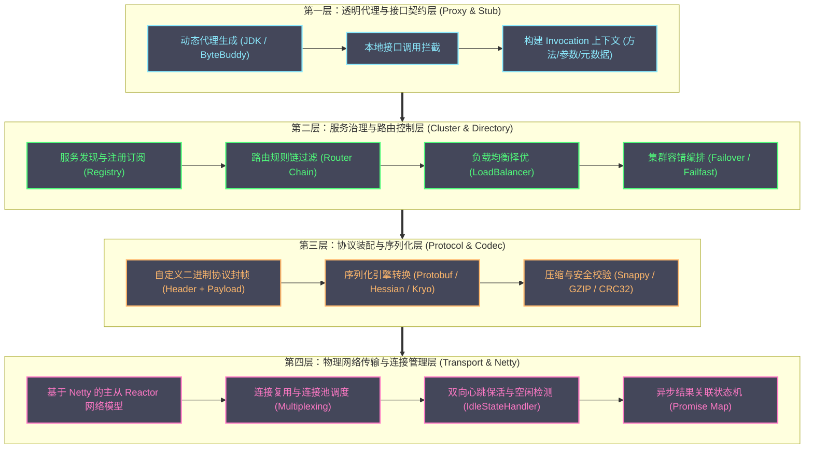
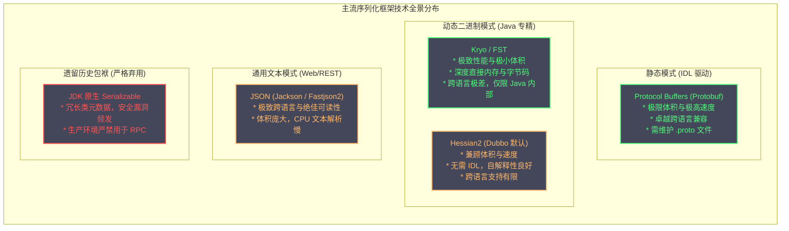
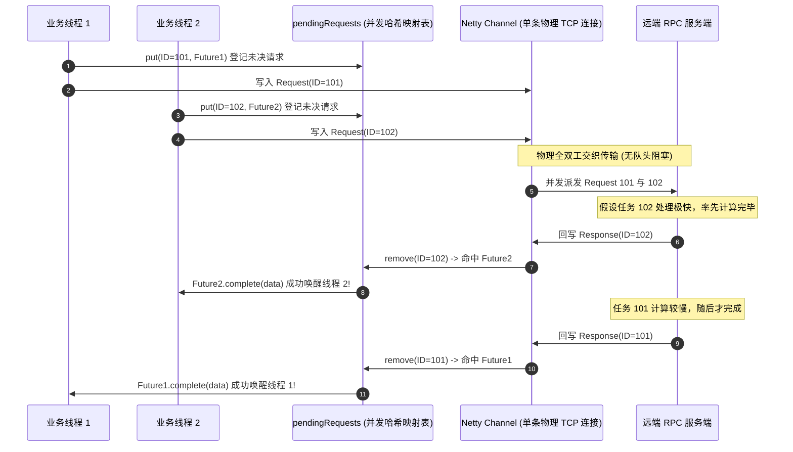
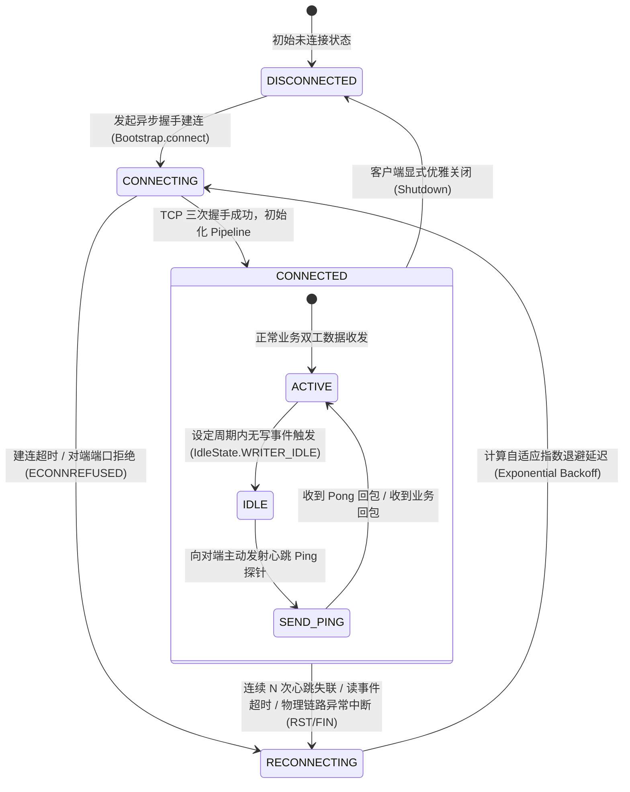
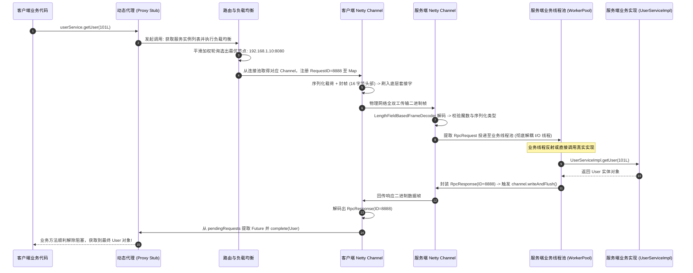

# 基于Netty的RPC框架设计——序列化、路由与连接管理

**摘要：**

远程过程调用（RPC，Remote Procedure Call）是支撑当代分布式微服务集群与云原生架构运转的核心神经中枢，而 Netty 则是现代 Java 生态中构建工业级高性能 RPC 框架的事实标准网络通信基石。构建一个生产级 RPC 框架的本质，是在充满不可靠物理扰动、网络抖动与多核并发争用的分布式网络之上，为上层业务代码编织出一幅「调用远端服务如同调用本地方法」的优雅抽象。然而，这一抽象在底层物理现实中必然遭遇严峻的「抽象泄漏」挑战。本文以从零构筑一套高吞吐、低延迟、高韧性的自研 RPC 框架为主线，系统拆解 RPC 领域的核心架构版图：解构基于自定义二进制协议包与 `LengthFieldBasedFrameDecoder` 的高效封帧体系；全面横评与剖析从 Protobuf、Hessian2、Kryo 到 JSON 的序列化引擎在吞吐、压缩比与 Schema 演进中的架构权衡；深入推演客户端依托全双工复用（Multiplexing）、动态代理与 `CompletableFuture` 异步应答映射表的无锁调用链路；系统阐明基于双向心跳检测、自适应指数退避断线重连与高低水位背压控制的连接生命周期管控机制；进而展开基于加权轮询与一致性哈希的服务路由与集群容错闭环；最后结合经典生产事故剖析业务线程池隔离、直接内存防爆与优雅停机的落地边界，阐明高性能基础设施如何在物理现实与逻辑透明之间建立起精密的系统秩序。

---

## 第 1 章 远端调用的幻象与分布式物理现实

### 1.1 从本地过程调用到远程过程调用的范式跃迁与抽象泄漏

在单体软件架构的黄金时代，软件组件之间的协作完全依托于**本地过程调用（Local Procedure Call，LPC）**。在单进程的受控内存空间中，一次函数调用本质上是一组微观且确定性的机器指令序列：调用方将实参按调用约定压入 CPU 寄存器或线程栈帧，执行 `call` 跳转指令将程序计数器（PC）指向目标函数的物理内存地址，被调函数在当前线程栈上分配局部变量并执行计算，最后将结果写入寄存器并通过 `ret` 指令恢复调用现场。整个过程的耗时通常在纳秒级别，且其执行语义具有绝对的确定性——调用要么成功并返回结果，要么因内部异常或进程崩溃而失败，绝不存在「调用发出后结果处于不可知薛定谔状态」的中间地带。

然而，当系统规模突破单机物理极限、迈向微服务与分布式集群时，计算任务被迫跨越物理主机的边界，**远程过程调用（RPC）**应运而生。1984 年，分布式计算先驱 Bruce Jay Nelson 与 Andrew D. Birrell 在发表的划时代论文 *Implementing Remote Procedure Calls* 中，正式奠定了现代 RPC 的理论范式。其核心愿景极其宏大：**构建一套透明的通信中间件，使得开发者在编写分布式代码时，能够像调用本地函数一样调用远端物理节点上的服务，而无需显式操心底层网络套接字、数据编码与物理传输细节**。

```
本地过程调用 (LPC) 与 远程过程调用 (RPC) 的底层边界对比：

[ 本地过程调用 (LPC) ]
调用方栈帧  ================ CPU 寄存器 / 纳秒级内存 ==============> 目标函数栈帧
(确定性语义：同一个线程上下文，纳秒级直接物理内存指针访问，无网络故障)

[ 远程过程调用 (RPC) ]
业务接口代理 ---> 序列化二进制 ---> TCP 套接字 ---> 网卡驱动 ---> 物理光缆/交换机
                                                                     |
业务代码返回 <--- 反序列化还原 <--- TCP 套接字 <--- 网卡驱动 <--- 远端物理主机
(不可靠语义：毫秒级网络跃点、数据包乱序丢包、网络分区断裂、抽象泄漏风险)
```

然而，软件工程界著名的**抽象泄漏法则（Law of Leaky Abstractions）**无情地揭示：任何试图将复杂物理现实隐藏在简单接口背后的软件抽象，最终都会因为物理层面的客观规律而发生泄漏。RPC 试图抹平本地调用与网络通信的界限，但物理网络所固有的物理延迟、不可靠介质与并发竞态，使得网络调用永远不可能在物理本质上等同于本地调用。一旦网络发生微秒级的丢包重传或交换机抖动，调用方就会面临漫长而不可预测的等待；倘若框架盲目伪造同步阻塞语义，瞬间积压的外部请求便会迅速耗尽线程池，诱发全系统级联雪崩。

### 1.2 分布式计算的八大物理谬误在 RPC 维度的具象投射

1991 年，分布式系统专家 Peter Deutsch 与 Sun Microsystems 的先驱们总结了著名的**分布式计算的八大物理谬误（Fallacies of Distributed Computing）**。这八大谬误在 RPC 框架的设计维度上，呈现出了极其深刻的具象投射：

1. **谬误一：网络是可靠的（The network is reliable）**。在真实数据中心中，物理网线被意外触碰、交换机瞬时丢包、操作系统 TCP 协议栈超时重传是常态。RPC 框架绝不能假设网络请求「发出去就一定会到达」，必须在每一个调用节点设计严格的超时判定、幂等重试契约与断线自动修复；
2. **谬误二：延迟为零（Latency is zero）**。本地指针访问是 1 纳秒，同机房网络往返（RTT）通常在 0.5 到 2 毫秒之间，跨可用区或跨机房网络延迟则可达数十毫秒。纳秒与毫秒之间横跨了六个数量级。若在业务循环体中像调用本地循环一样高频发起 RPC 调用（所谓的「Chatty RPC」反模式），累积的网络延迟将瞬间拖垮业务流水线；
3. **谬误三：带宽是无限的（Bandwidth is infinite）**。百兆、千兆乃至万兆网卡在面对超大规模流量涌入时，其物理带宽与交换机背板吞吐都会成为硬瓶颈。未加压缩的大对象、冗余字段的低效序列化，都会迅速填满网卡物理缓冲区，引发严重的网络队列溢出与拥塞丢包；
4. **谬误四：网络是安全的（The network is secure）**。跨节点的字节流暴露在内网广播域甚至公网之上，窃听、篡改与中间人伪造随时可能发生，框架层必须支持基于 TLS/mTLS 的链路加密与身份鉴权；
5. **谬误五：网络拓扑结构是永恒不变的（Topology doesn't change）**。在容器化与 Kubernetes 编排的云原生时代，Pod 实例以分钟级频率动态漂移、弹性扩缩容。RPC 框架必须建立动态服务发现（Service Discovery）与健康检测体系，实时感知端点变更；
6. **谬误六：只有一个管理员（There is one administrator）**。跨团队维护的微服务之间，各方配置的超时阈值、序列化版本以及接口兼容性策略千差万别，框架必须具备严密的防御性版本协商与契约兼容机制；
7. **谬误七：传输成本为零（Transport cost is zero）**。从 Java 堆对象到物理字节流的序列化计算、内存深拷贝、以及 JNI 穿透系统调用的 CPU 开销是实打实的算力消耗。低效的编解码会直接吞噬数个 CPU 核心；
8. **谬误八：网络是同质的（The network is homogeneous）**。异构硬件、异构操作系统甚至不同的云厂商底层网络虚拟化技术差异巨大，底层的 MTU 配置、TCP 拥塞控制算法（CUBIC 与 BBR）的不同，都会引起长尾延迟的非对称抖动。

一个工业级 RPC 框架的全部设计智慧，归根结底，就是用严谨的系统工程手段，去正面迎战并驯服这八大物理谬误。

### 1.3 现代微服务通信栈的四层架构拓扑

为了在复杂的分布式环境中建立清晰的权责边界，现代工业级 RPC 框架（如 Apache Dubbo、gRPC、SOFARPC）普遍采用了自顶向下的四层正交架构拓扑：



各层分工明晰而高度内聚：
- **透明代理层**：负责以无侵入的方式拦截本地接口调用，将强类型的方法调用抽象封装为包含目标服务名、方法签名与实参数组的泛化载荷 `Invocation`；
- **集群路由层**：负责从服务注册中心动态拉取可用实例列表，依据流量路由标签（灰度发布、同机房优先）进行节点过滤，并依托负载均衡策略选出一个最优的目标物理节点，同时根据容错契约组织重试；
- **协议编解码层**：负责将通用的 `Invocation` 按照框架的自定义协议规范打上帧头，并驱动高效的序列化引擎将内存对象转换为二进制字节流；
- **传输管理层**：由 Netty 统领底层 TCP 通道，以全双工异步复用方式将二进制报文刷入操作系统套接字，同时管理连接的保活心跳、状态流转与超时取消。

---

## 第 2 章 传输协议与编解码设计：二进制帧的工程几何学

### 2.1 为什么 HTTP/1.1 无法胜任高并发内部通信

在设计自研 RPC 框架之初，工程师首先面临的便是底层应用层通信协议的选型。许多初学者常常产生疑问：既然已经有了普及度极高的 HTTP/1.1 协议（基于 RESTful 架构风格），为何各大顶级互联网企业还要费尽心力自研私有的二进制 RPC 协议？

答案深植于 HTTP/1.1 面对内部高并发低延迟通信时的三大致命物理缺陷：

1. **文本协议的信息熵极低与解析开销沉重**：HTTP/1.1 是一种纯文本协议。每一个请求都需要携带冗长的 ASCII 字符串请求头（如 `Host`、`User-Agent`、`Accept`、`Content-Type`），其包头开销往往达到数百字节至上千字节。更为严重的是，文本协议的解析涉及大量的字符扫描、换行符匹配与字符串对象实例化，这极大地浪费了 CPU 算力与内存带宽；
2. **连接无法全双工交织并发导致严重的队头阻塞（Head-of-Line Blocking）**：HTTP/1.1 的单个 TCP 连接在逻辑上是严格半双工的「单请求-单响应」模型。虽然引入了 Keep-Alive 长连接复用，但在同一个连接上，客户端必须等待上一个请求的响应完全接收完毕后，才能发送下一个请求（Pipeline 机制由于服务端难以保序且代理兼容性极差而在生产中被普遍废弃）。如果某个请求在服务端遭遇慢查询，后续所有排队的请求都会被物理阻断在当前连接上；
3. **缺乏紧凑高效的双向心跳与二进制透传机制**：HTTP/1.1 的连接保活主要依赖 TCP 底层的 KeepAlive 探针（通常跨度长达 2 小时，难以快速感知死链），或依赖频繁的应用层 OPTIONS/GET 轮询，在数十万连接场景下引入了极高的无效传输损耗。

为了在高吞吐下将网络协议的开销压缩至物理极限，自研**专用的二进制协议帧（Binary Protocol Frame）**成为了必然选择。

### 2.2 自定义二进制协议设计：Titan-RPC 的物理布局

一个优秀的工业级二进制协议，必须在**紧凑性（Compactness）**、**自解释性（Self-Descriptiveness）**与**扩展性（Extensibility）**之间取得完美的平衡。

我们在前面 [[06 编解码器——LengthFieldBasedFrameDecoder与自定义协议|编解码器专栏]] 中曾经推演过工业级通信协议的基准形态。在此，我们正式确立自研 RPC 框架——**Titan-RPC** 的完整物理协议布局：

```
Titan-RPC 二进制通信协议物理帧拓扑规范（固定 16 字节头部）：
 0                   1                   2                   3
 0 1 2 3 4 5 6 7 8 9 0 1 2 3 4 5 6 7 8 9 0 1 2 3 4 5 6 7 8 9 0 1
+-+-+-+-+-+-+-+-+-+-+-+-+-+-+-+-+-+-+-+-+-+-+-+-+-+-+-+-+-+-+-+-+
|       Magic Number (0xCAFE)   | Version (1B)  |   Flags (1B)  |
+-+-+-+-+-+-+-+-+-+-+-+-+-+-+-+-+-+-+-+-+-+-+-+-+-+-+-+-+-+-+-+-+
|                                                               |
+                       Request ID (8 Bytes)                    +
|                                                               |
+-+-+-+-+-+-+-+-+-+-+-+-+-+-+-+-+-+-+-+-+-+-+-+-+-+-+-+-+-+-+-+-+
|                      Payload Length (4 Bytes)                 |
+-+-+-+-+-+-+-+-+-+-+-+-+-+-+-+-+-+-+-+-+-+-+-+-+-+-+-+-+-+-+-+-+
|                                                               |
|                        Payload Data (变长)                    |
|                                                               |
+-+-+-+-+-+-+-+-+-+-+-+-+-+-+-+-+-+-+-+-+-+-+-+-+-+-+-+-+-+-+-+-+
```

协议各个物理字段的工程考量如下：
- **Magic Number（魔数，2 字节，固定为 `0xCAFE`）**：用于在网络物理层快速校验数据包合法性，防止外部非授权客户端误连或垃圾端口扫描流量打垮解码器；
- **Version（协议版本号，1 字节）**：为协议未来的平滑演进预留通道，允许服务端针对不同版本的协议帧执行兼容性解码逻辑；
- **Flags（消息标志位，1 字节，8 个 Bit）**：包含极其精密的比特级元数据：
  - Bit 0：请求/响应标识（0 代表 Request，1 代表 Response）；
  - Bit 1：单向通信标识（0 代表双向 RPC，1 代表 Oneway 仅发送不等待响应）；
  - Bit 2：心跳事件标识（0 代表业务数据报文，1 代表 Heartbeat 心跳探针）；
  - Bit 3：压缩标识（0 代表裸数据未压缩，1 代表采用 Snappy/GZIP 压缩）；
  - Bit 4-7：序列化算法标识编号（例如 `0001` 代表 Protobuf，`0010` 代表 Kryo，`0011` 代表 Hessian2，`0100` 代表 JSON）；
- **Request ID（全局请求唯一序号，8 字节长整型）**：支撑 TCP 全双工复用的绝对核心，用于在客户端将乱序返回的 Response 精确锚定回最初挂起的请求上下文；
- **Payload Length（有效载荷长度，4 字节整型）**：记录后续序列化二进制数据体的精确字节长度，彻底根除 TCP 流式传输中的粘包与拆包难题。

### 2.3 Netty Pipeline 编解码器的无缝串联

在 Netty 体系中，将这种二进制帧规范落地为生产级代码，关键在于合理装配入站与出站处理器责任链。

依靠我们在 [[06 编解码器——LengthFieldBasedFrameDecoder与自定义协议|编解码器专栏]] 中深入推导的 `LengthFieldBasedFrameDecoder`，我们可以用零冗余代码消灭粘包拆包，并串联自定义的反序列化处理器：

```java
// Titan-RPC 核心 ChannelPipeline 编解码装配规范
public class TitanRpcChannelInitializer extends ChannelInitializer<SocketChannel> {
    @Override
    protected void initChannel(SocketChannel ch) {
        ChannelPipeline pipeline = ch.pipeline();

        // 1. 空闲状态检测 Handler（读超时 30 秒，写超时 10 秒，全部空闲 0 秒）
        pipeline.addLast("idleStateHandler", new IdleStateHandler(30, 10, 0, TimeUnit.SECONDS));

        // 2. 出站帧编码器：将 TitanMessage 编码为 ByteBuf
        pipeline.addLast("encoder", new TitanMessageEncoder());

        // 3. 入站粘包拆包解码器（严格基于 16 字节头部规范配置）
        // maxFrameLength = 16MB
        // lengthFieldOffset = 12 (跳过 Magic 2B + Version 1B + Flags 1B + RequestID 8B)
        // lengthFieldLength = 4 (Payload Length 占 4 字节)
        // lengthAdjustment = 0 (长度字段之后紧跟 Body)
        // initialBytesToStrip = 0 (保留完整头部以提取 RequestID 和 Flags)
        pipeline.addLast("frameDecoder", new LengthFieldBasedFrameDecoder(
                16 * 1024 * 1024, 12, 4, 0, 0));

        // 4. 二进制帧解码器：将物理 ByteBuf 反序列化为 TitanMessage 业务对象
        pipeline.addLast("frameParser", new TitanMessageDecoder());

        // 5. 心跳与业务消息派发处理器
        pipeline.addLast("dispatcher", new TitanRpcDispatcherHandler());
    }
}
```

在 `TitanMessageDecoder` 中，解码器首先通过 `in.readShort()` 验证魔数。一旦校验失败，立即调用 `ctx.close()` 强行关闭非法连接，防范恶意探针；接着提取 Flags 中的序列化算法编号，动态调用对应的反序列化引擎将 Payload 还原为具体的 `RpcRequest` 或 `RpcResponse`。

---

## 第 3 章 序列化引擎的权衡与演进：空间、时间与兼容性的平衡术

### 3.1 序列化的核心度量坐标系

序列化（Serialization）是指将内存中的对象状态转换为可存储或传输的二进制字节序列的过程；反序列化则是其逆操作。在 RPC 架构中，序列化直接矗立在 CPU 算力与网络 I/O 的咽喉要道之上。

评估一个序列化框架在工业级生产环境中的表现，不能仅仅停留在「快不快」的朴素认知上，必须从四个正交维度建立严格的**度量坐标系**：

1. **时间维度：序列化与反序列化速度（吞吐与 CPU 占用）**：单位时间内能处理的对象数量，以及每万次序列化消耗的 CPU 指令周期。它直接决定了在极端 QPS 压迫下，服务端的 CPU 算力是被纯粹的业务计算利用，还是被深陷在对象反射与字节拷贝中；
2. **空间维度：编码结果的压缩比（Byte Size）**：同一个复杂业务对象在被序列化后所生成的物理字节数。在跨机房调度、公网数据交换以及移动端弱网场景下，更小的体积意味着更短的网络传输时延和更低的带宽账单；
3. **架构维度：Schema 演进兼容性与向前向后兼容（Schema Evolution）**：随着业务迭代，微服务接口的请求参数必然面临字段的新增、废弃与重命名。新旧版本的客户端与服务端能否在混合部署时平稳共存？序列化框架能否支持缺失字段的默认补齐，而不是直接抛出 ClassNotFound 或空指针异常？
4. **生态维度：跨语言能力与开发体验（Polyglot & Developer Ergonomics）**：是否强制要求编写外部接口定义语言（IDL）文件？是否支持 Java、Go、C++、Python 等异构语言的无缝互通？是否依赖繁琐的代码编译生成插件？

### 3.2 主流序列化技术全景横评：JDK、JSON、Hessian2、Protobuf 与 Kryo

面对上述坐标系，开源业界演化出了多条截然不同的技术路线。理解它们的本质差异，才能在架构选型中做到因地制宜：



#### 1. JDK 原生序列化（Serializable）——生产红线与安全深渊
JDK 原生的 `java.io.Serializable` 是 Java 历史上最沉重的架构包袱之一。它为了支持完整的 Java 对象图（Object Graph）和循环引用，不仅序列化了对象的纯数据，还将完整的类全限定名、类签名、继承体系元数据甚至父类私有字段统统写入字节流。这导致其序列化体积极其庞大（往往是高效二进制格式的 5 到 10 倍）。更致命的是其**反序列化远程代码执行（RCE）安全黑洞**。当调用 `ObjectInputStream.readObject()` 时，攻击者可以通过精心构造的对象调用链（Gadget Chains，如经典的 Apache Commons Collections 漏洞），在无需任何登录鉴权的情况下直接在服务端远程执行任意操作系统命令。在生产级 RPC 框架中，**严禁使用 JDK 原生序列化**是一条不可逾越的技术红线。

#### 2. Protocol Buffers（Protobuf）——云原生时代的跨语言霸主
由 Google 研发的 Protobuf 采用了预先定义 `.proto` 接口定义文件的静态 Schema 模式。它彻底废弃了在报文中传输字段名称的低效做法，每个字段仅仅通过一个微小的整型标号（Tag）进行标识。Protobuf 在底层大量运用了**Varint（变长整型编码）**与**ZigZag 算法**，将数值范围较小的小整数压缩为 1 到 2 个字节，并将负整数平滑映射为正整数以避免高位全 1 的膨胀；对于浮点数和短字符串则采用了极致紧凑的 TLV（Tag-Length-Value）格式。其生成的二进制代码不含任何多余修饰符，体积小到了极致，反序列化速度极快，且天然具备极其坚固的向前向后兼容性。其代价则是需要维护额外的 `.proto` 文件并引入代码生成编译流水线。

#### 3. Hessian2——Dubbo 的经典工程妥协
Hessian2 是一种面向对象的自解释性二进制序列化协议。它不需要外部 IDL 文件，直接利用反射机制提取 Java 对象的属性。相比于 JSON，Hessian2 采用了二进制紧凑编码，将常见的基础类型和短字符串映射为单字节的 OpCode 操作码；相比于 Protobuf，它虽然体积稍大且跨语言支持主要集中在 Java 生态，但它完全免除了开发者的代码生成环节，开发体验极其丝滑，因此长期占据了 Apache Dubbo 的默认序列化席位。

#### 4. Kryo——面向 JVM 极致吞吐的性能怪兽
Kryo 专为 Java 生态量身定制，广泛应用于 Spark、Flink 等大数据计算引擎与对延迟极其苛刻的金融级内部 RPC 中。Kryo 彻底抛弃了跨语言幻想，直接利用底层的 `sun.misc.Unsafe` 进行物理内存指针直接映射与字段读写，规避了大量 Java 安全检查开销；同时结合基于 ASM 的运行时字节码动态编译生成定制化序列化类，将方法调用开销优化到纳秒级。在纯 Java 的内部微服务调用中，Kryo 的序列化速度与压缩比往往稳居第一梯队。但其缺陷在于对多语言完全免疫，且要求客户端与服务端必须持有完全一致的 Java Class 定义，类结构的微小变更极易引发序列化裂痕。

| 序列化方案 | 序列化体积 | CPU 计算速度 | 跨语言能力 | 是否需 IDL | Schema 兼容性 | 生产推荐场景 |
| :--- | :--- | :--- | :--- | :--- | :--- | :--- |
| **Protobuf** | **极小（最优）** | **极高** | **顶尖（10+ 语言）** | 是 | **极佳（Tag 驱动）** | 跨团队/跨语言、云原生微服务、核心外部网关 |
| **Kryo** | **极小** | **极高（Java 极限）**| 仅限 Java | 否 | 较弱（依赖结构强一致）| 纯内部超高并发 Java 微服务、大数据流式计算 |
| **Hessian2** | 较小 | 良好 | 较弱（偏向 Java） | 否 | 良好（宽容字段增删） | 传统 Java 企业级分布式系统、内部微服务集群 |
| **JSON** | 庞大 | 较慢（文本解析） | **顶尖** | 否 | 极佳 | 外部开放 API、对人类可读调试要求极高之场景 |
| **JDK 原生** | **极其臃肿** | **极慢** | 仅限 Java | 否 | 极差 | **生产环境绝对禁止使用** |

### 3.3 序列化扩展点与 SPI 机制

一个设计精良的 RPC 框架绝不能将自己死死绑定在某一种特定的序列化技术上。微服务集群中往往并存着不同特性需求的业务：订单结算追求极速因此倾向 Kryo，用户登录网关面临多语言调用因此倾向 Protobuf，而老旧遗留系统则依赖 Hessian2。

为此，框架必须抽象出顶层的序列化接口，并结合 Java 的**服务提供者接口（SPI，Service Provider Interface）**机制实现运行时的动态热插拔：

```java
// Titan-RPC 统一序列化 SPI 契约抽象
public interface Serializer {
    /** 获取该序列化器的全局唯一协议编号（对应协议头中的 Flags 字段） */
    byte getSerializerId();

    /** 将 Java 对象序列化为二进制字节数组 */
    <T> byte[] serialize(T obj) throws SerializationException;

    /** 将二进制字节数组还原为指定 Class 的 Java 实例 */
    <T> T deserialize(byte[] bytes, Class<T> clazz) throws SerializationException;
}
```

通过在客户端与服务端的配置文件中声明 SPI 实现，框架能够根据协议头 Flags 中携带的 4 位算法编号，在运行期毫秒级分流至对应的序列化驱动，达成架构解耦的最高境界。

---

## 第 4 章 客户端架构设计：动态代理、异步全双工复用与生命周期管控

### 4.1 透明调用的幻象编织：JDK 动态代理与字节码增强

客户端调用链路的第一道大门，是如何让业务开发者感知不到 RPC 的存在。当业务代码写下 `orderService.queryDetail(1001L)` 时，内存中的 `orderService` 变量表面上是一个普通的 Java 接口实例，其底层实际上是一个由 RPC 框架动态织入的代理对象（Proxy Stub）。

在实现透明代理时，业界主要存在两条技术路线：
- **JDK 原生动态代理（`java.lang.reflect.Proxy`）**：依托 JVM 原生支持，在运行时根据目标接口动态生成包含 `$Proxy` 前缀的字节码。其优点是轻量无外部依赖，兼容性好；但缺点是调用路径强制走 `InvocationHandler.invoke()`，伴随不可避免的方法反射与装箱拆箱开销；
- **字节码增强框架（ByteBuddy / Javassist / CGLIB）**：直接在运行时生成经过 JIT 极度优化的底层字节码，将代理拦截器直接内联为直接的方法跳转，完全绕开反射调用，单次代理拦截性能相比 JDK 动态代理可提升 20% 至 30% 以上。

```java
// Titan-RPC 客户端代理拦截器核心逻辑推演
public class TitanRpcInvocationHandler implements InvocationHandler {
    private final String serviceName;
    private final TitanClientTransport transport;

    public TitanRpcInvocationHandler(String serviceName, TitanClientTransport transport) {
        this.serviceName = serviceName;
        this.transport = transport;
    }

    @Override
    public Object invoke(Object proxy, Method method, Object[] args) throws Throwable {
        // 1. 过滤 Object 基类的通用方法（如 toString, equals, hashCode）
        if (Object.class.equals(method.getDeclaringClass())) {
            return method.invoke(this, args);
        }

        // 2. 装配标准 RpcRequest 载荷
        RpcRequest request = new RpcRequest();
        request.setRequestId(RequestIdGenerator.nextId()); // 全局自增或雪花算法 ID
        request.setInterfaceName(serviceName);
        request.setMethodName(method.getName());
        request.setParameterTypes(method.getParameterTypes());
        request.setArguments(args);

        // 3. 将同步调用语义转化为异步通信，并依据配置等待 Future 结果
        CompletableFuture<Object> future = transport.sendAsync(request);
        
        // 4. 阻塞等待或异步链式响应（受客户端配置的 Timeout 阈值约束）
        return future.get(transport.getTimeoutMillis(), TimeUnit.MILLISECONDS);
    }
}
```

### 4.2 TCP 连接的全双工复用之道：单连接承载万级并发调用的物理秘密

在早期基于短连接的网络通信中，每一个请求都需要经历 TCP 三次握手建连、传输数据、四次挥手断连的繁琐过程，这在每秒数万请求的场景下会导致操作系统的端口迅速耗尽（进入大量 `TIME_WAIT` 状态）。即便使用连接池，受限于 HTTP/1.1 的半双工约束，一个连接在同一时刻也只能处理一个请求。如果系统有 1000 个并发线程需要调用远端，就必须在连接池中维护 1000 条物理 TCP 链路，给操作系统内核带来沉重的套接字开销。

Netty 驱动的 RPC 框架彻底颠覆了这种低效模式，全面拥抱 **TCP 全双工连接复用（Connection Multiplexing）**：**客户端与同一个远端服务端实例之间，通常仅需维持极其微小数量的长连接（例如 1 条或几条），便足以支撑成千上万个并发调用在同一根物理网线上并发穿梭**。

其物理底层的实现奥秘，就在于我们在协议设计中所确立的 **`Request ID`**：
- 客户端的多个并发业务线程同时发起请求时，各个线程将请求打上互不相同的全局自增 `Request ID`，随后直接推入同一个 Netty Channel 的发送队列；
- Netty 的底层 I/O 线程将多个请求的二进制数据包毫无阻碍地连续刷入操作系统的 TCP 发送缓冲区，数据包在物理光纤中全速前行；
- 服务端接收到这些交织在一起的数据包后，解码出各个请求并派发至不同的业务工作线程并行计算。哪个请求计算得快，哪个请求就率先完成；
- 服务端将计算结果封装为响应报文，并在报文头部精确原样回填对应的 `Request ID`，立刻刷回 TCP 连接；
- 客户端收到响应报文后，解码器提取出 `Request ID`，从而在内存中瞬间找回最初发起该请求的那个调用方上下文。



### 4.3 异步请求-响应关联状态机：基于 RequestId 与 CompletableFuture

在客户端内部，维系这种全双工并发调用的核心数据结构，是一个名为 `pendingRequests` 的并发状态容器：

```java
// Titan-RPC 客户端异步响应管理器核心实现
public class TitanClientTransport {
    // 线程安全的全局挂起请求管理表
    private final ConcurrentMap<Long, CompletableFuture<Object>> pendingRequests = new ConcurrentHashMap<>();
    private final Channel channel;
    private final HashedWheelTimer timer;

    public CompletableFuture<Object> sendAsync(RpcRequest request) {
        CompletableFuture<Object> future = new CompletableFuture<>();
        final long requestId = request.getRequestId();

        // 1. 在映射表中登记当前 Request ID 对应的 Future
        pendingRequests.put(requestId, future);

        // 2. 借助时间轮挂载超时检测任务（超期未收到回包则强制移除并异常终结）
        Timeout timeout = timer.newTimeout(t -> {
            CompletableFuture<Object> removed = pendingRequests.remove(requestId);
            if (removed != null) {
                removed.completeExceptionally(
                    new TimeoutException("RPC request timed out on channel: " + channel));
            }
        }, 3000, TimeUnit.MILLISECONDS);

        // 3. 向 Netty Channel 异步写出报文
        channel.writeAndFlush(request).addListener((ChannelFutureListener) writeFuture -> {
            if (!writeFuture.isSuccess()) {
                // 写出失败（如网络物理断开），立即清理状态并通知调用方
                timeout.cancel();
                pendingRequests.remove(requestId);
                future.completeExceptionally(writeFuture.cause());
            }
        });

        return future;
    }

    // 当 Netty 入站 Handler 接收到服务端响应时触发的回调入口
    public void handleResponse(RpcResponse response) {
        long requestId = response.getRequestId();
        CompletableFuture<Object> future = pendingRequests.remove(requestId);
        if (future != null) {
            if (response.isSuccess()) {
                future.complete(response.getResult());
            } else {
                future.completeExceptionally(response.getError());
            }
        } else {
            // 常见于超时已被时间轮剔除后，对端的迟到响应，记录 DEBUG 日志后平稳丢弃
            logger.debug("Received late response for requestId: {}", requestId);
        }
    }
}
```

通过这种设计，客户端将底层的异步非阻塞网络 I/O，完美转换为上层业务可任意编排的 `CompletableFuture` 契约体系。调用方既可以调用 `.get()` 享受同步等待的直观，也可以通过 `.thenApply()` 或 `.thenCompose()` 展开极其复杂的反应式异步反应流编排。

---

## 第 5 章 连接管理与健康防护：从单一长连接到弹性连接池

### 5.1 单连接 vs 连接池：多核 CPU 吞吐瓶颈与 TCP 套接字发送缓冲区饱和

我们在前一章论述了全双工单连接复用的巨大优势，但在工业级高并发实践中，**「仅依赖单一长连接」同样存在物理局限**：
- **操作系统的套接字发送缓冲区锁瓶颈**：在 Linux 内核层面，每一个 TCP 套接字都拥有一块独立的发送缓冲区（`sk_write_queue`）。当多核 CPU 上的上百个线程同时向同一个 Netty Channel 发起并发写入时，虽然 Netty 内部借助 `MpscQueue` 实现了应用层队列的无锁化，但当任务被刷入底层的原生套接字时，操作系统内核依然需要对 `sk` 施加自旋锁（Spinlock）。这使得单连接的极限吞吐最终会卡在操作系统的单套接字内核锁上；
- **TCP 单连接滑动窗口（Sliding Window）瓶颈**：在超高带宽与长传输延迟（高 BDP，Bandwidth-Delay Product）的网络链路上，受限于 TCP 窗口大小和拥塞控制算法对丢包的敏感惩罚，单条 TCP 链路往往无法充分吃满万兆物理网卡带宽。

因此，现代成熟的 RPC 框架普遍采用**按目标地址分片的微型连接池（Multiplexed Connection Pool）**策略。针对某一个特定的服务端实例，客户端默认维持 2 到 4 条独立的物理 TCP 连接，并通过轮询（Round-Robin）分摊写操作，既消除了单套接字的内核锁竞争，又最大化地释放了网络并发带宽。

### 5.2 状态机视角的连接生命周期：从空闲探针到重连闭环

网络物理世界充满变数：机房施工挖断光缆、交换机固件崩溃、服务端进程发生 OOM 崩溃重启。RPC 客户端必须建立严密的状态机，对物理连接的生命周期展开全天候守护：



### 5.3 双向心跳检测与断线重连设计

在物理网络拓扑中，有一种最为隐蔽的故障被称为**半打开连接（Half-Open Connection）**：网线被拔掉或中间防火墙静默丢包，导致 TCP 双方未收到任何显式关闭信号（FIN/RST）。此时操作系统套接字依然处于 ESTABLISHED 状态，若无应用层的心跳机制，客户端将永远无法感知对端已经死亡。

Titan-RPC 借助 Netty 的 `IdleStateHandler` 实现了严密的双向保活心跳与指数退避重连机制：

```java
// Titan-RPC 心跳与空闲感知处理器
public class TitanHeartbeatClientHandler extends ChannelDuplexHandler {
    private int heartbeatRetryCount = 0;
    private static final int MAX_HEARTBEAT_RETRIES = 3;

    @Override
    public void userEventTriggered(ChannelHandlerContext ctx, Object evt) throws Exception {
        if (evt instanceof IdleStateEvent) {
            IdleStateEvent event = (IdleStateEvent) evt;
            // 触发了写空闲事件（例如 10 秒内未向对端发送任何业务数据）
            if (event.state() == IdleState.WRITER_IDLE) {
                if (heartbeatRetryCount < MAX_HEARTBEAT_RETRIES) {
                    heartbeatRetryCount++;
                    // 构造心跳探针报文，Flags 中的 Heartbeat 标志位置 1
                    TitanMessage ping = TitanMessage.buildHeartbeatPing();
                    ctx.writeAndFlush(ping);
                } else {
                    // 连续三次心跳探针未获响应，断定链路已事实瘫痪，主动关闭通道触发重连
                    logger.warn("Channel heartbeat lost for 3 times, closing: {}", ctx.channel());
                    ctx.close();
                }
            } else if (event.state() == IdleState.READER_IDLE) {
                // 读空闲超时（例如 30 秒未收到对端任何报文），同样触发强制切断
                ctx.close();
            }
        } else {
            super.userEventTriggered(ctx, evt);
        }
    }

    @Override
    public void channelRead(ChannelHandlerContext ctx, Object msg) throws Exception {
        if (msg instanceof TitanMessage) {
            TitanMessage message = (TitanMessage) msg;
            // 收到心跳报文，清空重试计数器并终止向下传播
            if (message.isHeartbeat()) {
                heartbeatRetryCount = 0;
                if (message.isPing()) {
                    // 服务端收到 Ping，回送 Pong
                    ctx.writeAndFlush(TitanMessage.buildHeartbeatPong());
                }
                return;
            }
        }
        heartbeatRetryCount = 0;
        super.channelRead(ctx, msg);
    }
}
```

当通道在 `channelInactive` 钩子中感知到关闭时，系统立即启动**自适应指数退避重连（Exponential Backoff with Jitter）**算法：
$$	ext{Delay} = \min\left(	ext{MaxDelay}, \ 	ext{InitialDelay} 	imes 2^{	ext{retryCount}}
ight) \pm 	ext{RandomJitter}$$
通过引入随机扰动因子（Jitter），防止当某个大型机房发生网络抖动恢复时，上万个客户端在同一个毫秒瞬间并发向服务端发起建连重试，引发所谓的「惊群风暴（Thundering Herd Problem）」。

### 5.4 服务端优雅停机与背压机制

在服务端架构中，必须防范两类毁灭性风险：
1. **突发网络洪峰引发直接内存溢出（OOM）**：当客户端发送速率远高于服务端业务线程的处理能力时，如果服务端任由 Channel 读取并不断在堆内堆外积压缓冲区，内存将被迅速撑爆。Netty 通过配置 `WriteBufferWaterMark`（高低水位线）建立了反向传递的背压（Backpressure）机制：一旦待发送字节数突破高水位，通道的可写状态 `isWritable()` 转为 false，服务端主动暂停从该 Channel 读取数据，促使 TCP 滑动窗口收缩，从而通过物理链路将背压反向压制给客户端；
2. **优雅停机（Graceful Shutdown）**：服务下线时，服务端首先向注册中心注销自身节点并向全部活跃客户端广播只读离线通知，随后拒绝新的接入请求，但承诺在超时保护期（如 15 秒）内继续将积压在 `pendingRequests` 中的在途任务全部处理并回写完毕，最后才从容释放线程池与堆外内存。

---

## 第 6 章 服务发现、动态路由与负载均衡：控制面的治理闭环

### 6.1 服务发现拓扑演进：从点对点到注册中心驱动

在复杂的微服务网格中，客户端不可能硬编码服务端的物理 IP 列表。现代 RPC 体系依托于分布式协同系统（如 Apache Zookeeper、Nacos、Consul 或 etcd）构建**服务注册与发现（Service Registry & Discovery）**控制面。

服务端的生命周期与注册中心紧密联动：服务实例在本地 Netty 服务完全拉起并完成预热校验后，才将自身的通信元数据（接口名、IP、端口、权重、分组、协议版本）以临时节点（Ephemeral Node）的形式写入注册中心。客户端在启动时，订阅特定接口的节点树变动事件。

当某个服务端实例由于宿主机崩溃或网络断开时，其与注册中心维系的长心跳断开，注册中心在超时后自动清除该临时节点，并向全量订阅该服务的客户端广播 `CHILD_REMOVED` 变更事件。客户端本地的路由目录缓存（Directory）在毫秒级自动剔除失效节点，确保流量不再被投递至已死端点。

```mermaid
%%{init: {'theme': 'dracula'}}%%
graph TD
    subgraph ControlPlane["注册中心控制面 (Nacos / Zookeeper / etcd)"]
        RegNode["/titan-rpc/services/com.foo.UserService"]
        SubNode1["Provider 1: 192.168.1.10:8080 (Weight=100)"]
        SubNode2["Provider 2: 192.168.1.11:8080 (Weight=200)"]
        RegNode --- SubNode1
        RegNode --- SubNode2
    end

    subgraph ServerSide["服务端集群 (Providers)"]
        S1["Server 实例 1"] -.->|1. 启动成功后注册临时节点| SubNode1
        S2["Server 实例 2"] -.->|1. 启动成功后注册临时节点| SubNode2
    end

    subgraph ClientSide["客户端集群 (Consumers)"]
        C["Client 客户端实例"]
        C -.->|2. 启动时订阅并拉取实例列表| RegNode
        RegNode -.->|3. 节点上下线实时推送到客户端| C
        C ==>|4. 负载均衡选优后直连通信 (RPC 调用)| S1
        C ==>|4. 负载均衡选优后直连通信 (RPC 调用)| S2
    end

    classDef default fill:#282a36,stroke:#bd93f9,stroke-width:2px,color:#f8f8f2;
    classDef control fill:#44475a,stroke:#ffb86c,stroke-width:2px,color:#ffb86c;
    classDef comp fill:#44475a,stroke:#50fa7b,stroke-width:2px,color:#50fa7b;
    class RegNode,SubNode1,SubNode2 control;
    class S1,S2,C comp;
```

### 6.2 客户端负载均衡算法与实现

当客户端路由目录（Directory）解析出可用的后端节点列表后，**负载均衡（Load Balancing）**决定了由哪一个节点来实际承载当前请求。

在生产实践中，最主流的负载均衡算法涵盖四种形态：

#### 1. 加权随机（Weighted Random）
根据每个后端节点配置的权重计算权重总和，在区间内生成一个随机数，判定落入哪一个节点的权重区间。实现极简且由于大数定律在海量请求下分布极佳；但缺点是在请求密度较低或突发流量时可能出现局部非预期倾斜。

#### 2. 平滑加权轮询（Smooth Weighted Round-Robin）
由 Nginx 开创的经典算法。普通轮询在面对权重比为 `5:1:1` 的场景时，会连续将 5 个请求打在第一台机器上，造成第一台机器遭遇瞬时微冲击。平滑加权轮询算法通过维护**当前权重（Current Weight）**与**有效权重（Effective Weight）**，让高权重节点交错穿插在低权重节点之间，实现极其平滑的流量离散分流：

```java
// Nginx 风格平滑加权轮询负载均衡算法核心实现
public class SmoothWeightedRoundRobinLoadBalancer {
    private static class Node {
        final String address;
        final int weight;
        int currentWeight;

        Node(String address, int weight) {
            this.address = address;
            this.weight = weight;
            this.currentWeight = 0;
        }
    }

    public synchronized String select(List<Node> nodes) {
        if (nodes == null || nodes.isEmpty()) return null;
        int totalWeight = 0;
        Node bestNode = null;

        // 1. 遍历全部节点，累加权重并将每个节点的 currentWeight 加上其静态配置的 weight
        for (Node node : nodes) {
            totalWeight += node.weight;
            node.currentWeight += node.weight;
            if (bestNode == null || node.currentWeight > bestNode.currentWeight) {
                bestNode = node;
            }
        }

        // 2. 将选出的最优节点的 currentWeight 减去全量总权重
        if (bestNode != null) {
            bestNode.currentWeight -= totalWeight;
            return bestNode.address;
        }

        return nodes.get(0).address;
    }
}
```

#### 3. 一致性哈希（Consistent Hashing）
针对具备明确业务亲和力（Affinity）的场景（譬如带有特定 `userId` 的读请求需要路由到缓存了该用户上下文的同一台机器）。一致性哈希通过构建一个虚拟哈希环（包含虚拟节点解决数据倾斜问题），在服务节点发生增删时，仅仅影响环上一小段相邻区间的请求映射，极大减少了缓存雪崩与状态漂移。

#### 4. 最小活跃调用数（Least Active）
通过追踪当前客户端正在向各个服务端实例并发执行且尚未返回的在途请求数（Active Count）。优先将请求派发给 Active 最小的节点。Active 最小意味着该节点的处理性能最高或当前负载最低，能够实现自适应的动态流量压抑。

### 6.3 容错与重试策略的边界

在不可靠的网络环境中，单次调用的失败并不可怕，可怕的是缺乏容错策略导致的业务雪崩。RPC 框架必须提供多样化的**集群容错（Cluster Fault-Tolerance）**能力：

- **Failover（故障转移，默认策略）**：当请求调用失败时，自动从可用列表中换用另一个节点进行重试（通常配置 `retries=2`）。**核心铁律：Failover 仅能应用于具备严格幂等性（Idempotent）的接口（如只读查询），严禁应用于包含账户扣款、订单创建等非幂等写操作**；
- **Failfast（快速失败）**：请求一旦失败（或超时），立即向业务抛出异常，绝不发起重试。适合非幂等写操作，防止重复扣款；
- **Failsafe（安全失败）**：当调用发生异常时，框架直接捕获并记录 WARN 日志，向业务代码返回 null 或空列表。适用于审计日志、非关键统计指标上报等旁路链路；
- **Forking（并行调用）**：同时向多个服务端节点并发发送相同的请求，只要有一个节点率先返回结果便宣告成功，并将其余在途任务取消。用于对长尾延迟极其敏感的核心竞价或风控场景，其代价是成倍消耗后端算力。

---

## 第 7 章 生产级 RPC 框架的全景装配与性能实战

### 7.1 端到端调用流转全景时序

通过将前面的所有设计组件精密焊接在一起，我们最终得到了一个具有高吞吐、微秒级延迟与强韧性容错的生产级 RPC 引擎。

让我们沿着一个真实的业务调用 `userService.getUser(101L)`，全景式观察数据流如何在这一精密体系中穿梭流转：



### 7.2 性能剖析与避坑指南：血泪经验提炼

在将自研 RPC 框架推向生产环境的深水区时，以下几处隐蔽的性能暗礁必须严防死守：

1. **绝对禁止在 Netty 的 I/O 线程（EventLoop）中执行业务逻辑**：这是几乎所有初学者都会踩入的致命泥潭。`EventLoop` 承担着成百上千个 Channel 的非阻塞事件轮询。如果开发者在 ChannelHandler 中直接调用了耗时的数据库操作或执行了复杂的加密计算，该 `EventLoop` 将被直接卡死，导致挂在该线程上的所有其他连接的读写全部被强行冻结。**所有的业务逻辑必须在解码后立即脱离 Pipeline，派发给独立的业务线程池执行**；
2. **直接内存泄漏排查三板斧**：网络高吞吐下，若自定义 Handler 中分配了 `ByteBuf` 却在异常分支遗漏了 `ReferenceCountUtil.release(msg)`，堆外内存将发生缓慢且持续的泄漏，最终诱发整个容器被操作系统的 OOM-Killer 强行击杀。必须在测试环境中开启 `-Dio.netty.leakDetection.level=PARANOID` 进行采样追踪；
3. **ChannelHandler 的共享陷阱**：标注了 `@ChannelHandler.Sharable` 的处理器会被多个并发 Channel 共享。此类 Handler 内部严禁持有任何与特定连接相关的可变状态成员变量，否则将引发灾难性的多线程并发数据踩踏与脏读。

---

## 第 8 章 架构哲学与演进启示：透明性与物理现实的永恒张力

### 8.1 抽象泄漏法则的深刻具象

纵览整个基于 Netty 的 RPC 框架设计史，其演进的核心推手始终是**软件抽象与物理现实之间的博弈**：
- 我们试图用动态代理编织出「本地调用」的优雅幻象，但物理网络所固有的延迟、抖动与故障，迫使我们在框架中引入超时控制、重试状态机、背压机制与注册中心发现；
- 我们试图享受操作系统 TCP 连接的全双工吞吐，但多核 CPU 的内核发送队列锁与滑动窗口，又迫使我们在单连接与连接池之间寻求精密的工程折中；
- 我们试图追求最极致的序列化压缩比，但在实际生产中又不得不为了向前向后兼容与多语言互通而向 Schema 演进和代码生成妥协。

这正应验了计算机系统设计的根本真理：**没有完美的银弹，唯有清晰的权衡与因地制宜**。

### 8.2 从硬编码微服务框架到 Service Mesh 云原生网格

随着微服务架构迈向云原生时代，以 Spring Cloud / Dubbo 为代表的将 RPC 治理逻辑（路由、熔断、负载均衡、鉴权）深度硬编码进业务进程的 SDK 模式，逐渐暴露出其沉重的**升级摩擦力（Upgrade Friction）**——每一次基础设施核心协议的升级，都需要推动全公司数百个业务工程重新打包并滚动部署，运维成本极其高昂。

这也正是为什么以 Envoy、Istio 为代表的 **服务网格（Service Mesh）** 架构在当代全面兴起。Service Mesh 将 RPC 框架中的网络传输、路由、熔断与可观测性等职责，从应用运行时的 SDK 中彻底剥离下沉至独立的 Sidecar 边车进程。然而，无论架构形态如何演进，边车进程之间的底层网络通信基石，依然离不开我们在本文中深入探讨的 Reactor 线程模型、二进制紧凑协议、全双工异步复用与连接健康状态机。

---

## 总结

构建一个现代工业级 RPC 框架，是一场贯通网络协议、数据序列化、操作系统并发原语与分布式控制面的全栈系统工程之旅：

- **传输协议与编解码**：基于紧凑的自定义二进制协议头部与 Netty 的 `LengthFieldBasedFrameDecoder`，消除了 HTTP/1.1 的文本冗余与粘包拆包困境，确立了全双工复用的物理载体；
- **序列化引擎**：在时间、空间、兼容性与生态四个正交维度建立度量体系，依托 SPI 插件化架构兼顾 Protobuf 的极致跨语言紧凑性与 Kryo 的极致 Java 内存映射能力；
- **客户端全双工复用**：借助全局 `Request ID` 与 `CompletableFuture` 状态映射表，单条物理长连接支撑起成千上万个并发调用的无锁交织传输；
- **连接治理与健康防线**：依托双向心跳检测、自适应指数退避断线重连与高低水位背压控制，赋予了通信底座在面临网络扰动时的强大韧性与自愈能力；
- **服务发现与路由容错**：通过注册中心动态事件驱动与平滑加权轮询等负载均衡算法，实现了集群控制面的无缝扩展与业务高可用。

深入理解这一整套设计体系，不仅能让我们对 Dubbo、gRPC 等开源巨作的源码脉络洞若观火，更为我们在面对大型分布式系统的架构演化与性能瓶颈攻坚时，提供了坚实的理论基石与从容的工程底气。

下一篇我们将把理论与框架进一步投射到工业级的顶级开源项目中，深入解构 Netty 在 Apache Dubbo、RocketMQ 与 Elasticsearch 三大核心分布式中间件中的深度实战与调优蜕变：[[10 Netty在开源项目中的应用——Dubbo、RocketMQ、Elasticsearch]]。

---

## 参考资料

1. Andrew D. Birrell, Bruce Jay Nelson. *Implementing Remote Procedure Calls*. ACM Transactions on Computer Systems (TOCS), 1984.
2. Peter Deutsch. *The Eight Fallacies of Distributed Computing*. Sun Microsystems, 1991.
3. Norman Maurer, Marvin Allen Wolfthal. *Netty in Action*, Chapter 8-11. Manning Publications, 2016.
4. 周志明.《凤凰架构：构建可靠的大型分布式系统》. 机械工业出版社, 2021.
5. Google. *Protocol Buffers Documentation: Encoding*. developers.google.com, 2024.
6. Apache Dubbo Source Code: `org.apache.dubbo.remoting.transport.netty4`.
7. Apache Dubbo Source Code: `org.apache.dubbo.rpc.protocol.dubbo`.

---

> [!note] 思考题
> 1. 在全双工连接复用设计中，客户端依赖 `pendingRequests` 映射表（`ConcurrentMap<Long, CompletableFuture>`）维系异步应答。假定服务端的业务处理极其缓慢，导致大量请求超时；客户端在超时后将 Future 从映射表中移除并抛出超时异常。然而数秒后，服务端最终处理完毕并将响应报文回传给客户端。客户端 Netty 入站处理器收到这些迟到的响应时，由于映射表中已无对应 Request ID，如果不做严密处理，会引发什么样的资源泄漏或系统异常？生产实践中应如何处理这种滞后应答？
> 2. 为什么在分布式集群中，针对写操作（如余额扣减、订单状态变更）的 RPC 接口必须强制配置快速失败（Failfast）策略，而严禁默认配置故障转移（Failover）自动重试？如果在网络分区抖动导致响应包丢失的场景下误用了 Failover 重试，会引发什么样的严重业务灾难？如何从业务幂等性（Idempotency）与全局 Token 机制的角度进行彻底防御？
> 3. Netty 的入站流水线中，如果直接在由 `EventLoop` 线程执行的 ChannelHandler 中调用耗时的业务逻辑（例如阻塞式读取数据库或调用第三方外部服务），会引发整个系统什么样的级联雪崩？为什么将任务交由外部业务线程池执行时，必须格外注意避免在业务线程中再次以阻塞同步的方式等待同一个 Channel 绑定的异步操作（防范死锁）？
