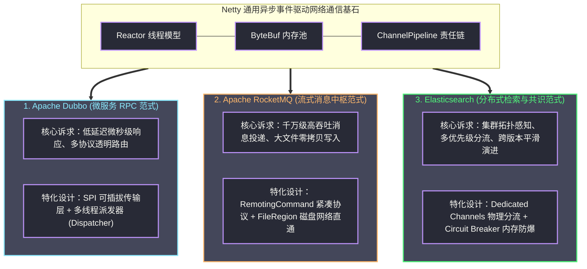
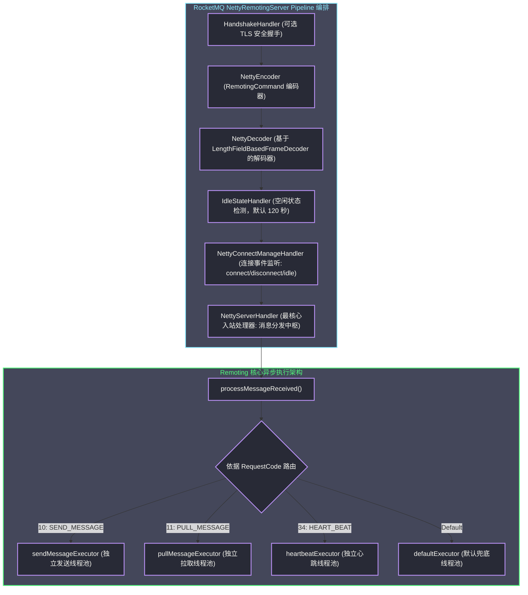

# Netty在开源项目中的应用——Dubbo、RocketMQ、Elasticsearch

**摘要：**

任何优秀的基础设施框架，其生命力最终必然要在严苛的工业级生产系统中接受极端流量与复杂物理环境的淬炼。在前九篇专栏中，我们从底层的 Java NIO、Reactor 线程拓扑、`ByteBuf` 堆外内存池化，一路推演至 `FastThreadLocal`、`HashedWheelTimer` 与工业级 RPC 框架的完整自研。本篇作为全专栏的技术集大成者，选取当今全球分布式计算领域最具代表性的三大开源巨作——微服务 RPC 通信基石 **Apache Dubbo**、分布式高吞吐消息中枢 **Apache RocketMQ**、以及分布式海量检索与分析引擎 **Elasticsearch**，从源码实现与系统架构的双重视角，深入剖析它们如何将 Netty 驯服为各自底层坚不可摧的网络通信引擎。这三大项目分别代表了三种截然不同的分布式通信范式：Dubbo 展示了高度抽象的可插拔 SPI 传输层架构、双向心跳状态机与精细化的五大多线程派发（Dispatcher）策略，以及从 Dubbo2 经典协议到 Dubbo3 Triple 云原生多路复用的演进；RocketMQ 展示了面向数以亿计消息流的四段式紧凑协议（RemotingCommand）、全双工异步长轮询挂起与基于 `FileRegion` 操作系统原生零拷贝的极限刷盘管道；Elasticsearch 则展现了大规模去中心化集群中通过多优先级通道（Dedicated Transport Channels）实施流量物理隔离、面向跨版本平滑滚动升级的流式序列化，以及与断路器（Circuit Breaker）联动的直接内存防爆机制。本文通过对这三大顶级开源项目网络层源码的深度解剖与横向对比，系统揭示高并发基础设施在面对协议封装、线程隔离、背压防御与生产容灾时的设计智慧与工程权衡。

---

## 第 1 章 工业级基础设施的网络通信图谱

### 1.1 从理论算法到生产工程的物理跨越

在计算机科学的理论探索中，算法与数据结构往往运行在抽象的理想模型之上——我们假设内存访问是均匀平坦的，假设网络连接是长期稳定的，假设线程调度是公正无偏的。然而，正如我们在 [[09 基于Netty的RPC框架设计——序列化、路由与连接管理|RPC 框架设计专栏]] 中所系统论述的，当软件系统迈入分布式物理现实时，操作系统的内存屏障抖动、网卡的物理队列拥塞、TCP 协议栈的滑动窗口收缩以及 JVM 垃圾收集器的周期性介入，都会对高并发通信发起无情的冲击。

Netty 作为一个通用的高性能异步事件驱动网络框架，为广大 Java 工程师提供了一套接近硬件极限的 I/O 多路复用基石。但在真实的开源基础软件工程中，没有任何一个顶级的分布式系统会简单地将 Netty 的原生 API 直接暴露给上层业务代码。相反，优秀的架构师们无一不在 Netty 之上建立起一套严密的**领域适配层（Domain Adaptation Layer）**：
- 他们需要将通用的 `ByteBuf` 二进制流裁剪为契合特定业务语义的自定义协议帧；
- 他们需要将单一的 I/O 事件循环（`EventLoop`）与庞大复杂的后端业务执行管线进行精密的线程隔离；
- 他们需要在多核服务器上对数十个甚至上百个并发连接建立优先级通道划分；
- 他们更需要在网络发生物理分区或突发流量洪峰时，建立起确定性的背压保护与自愈机制。

从单纯掌握 Netty 的 API 用法，到深入理解大型开源中间件如何驾驭 Netty，正是每一位资深系统架构师必须跨越的专业鸿沟。

### 1.2 三大典型应用范式的坐标定位

为了全面展现 Netty 在不同工业场景下的工程适应力，我们精心选取了三个在技术拓扑上呈现鲜明正交特征的顶级开源项目：



这三大项目在分布式体系中占据着截然不同的生态位：
1. **Apache Dubbo（微服务 RPC 范式）**：代表了最典型的面向业务接口的同步/异步远程过程调用。其核心挑战在于如何在极其严苛的微秒级延迟要求下，完成强类型接口的反射编组、透明路由、负载均衡，以及在复杂线程竞争下保障客户端全双工复用的高吞吐；
2. **Apache RocketMQ（分布式消息中枢范式）**：代表了面向流式数据管道的极限吞吐场景。Producer 高频推送消息、Consumer 批量拉取报文、Broker 进行高并发磁盘刷盘。其核心挑战在于如何将网卡物理吞吐与操作系统的 PageCache 紧密缝合，避免垃圾收集与上下文切换破坏消息队列的平直吞吐线；
3. **Elasticsearch（分布式搜索引擎与共识范式）**：代表了复杂的去中心化集群拓扑环境。节点之间不仅要传输体量庞大的分片检索数据（Query/Fetch），还必须以极高的时效性同步集群元数据状态（ClusterState）、主分片向副分片的数据物理搬迁（Recovery），以及微秒级的心跳故障检测。其核心挑战在于如何防止大数据量的批量索引请求阻塞了关键的集群选举与心跳通道，从而诱发毁灭性的集群脑裂。

### 1.3 大型开源项目网络层源码的解剖学方法论

面对动辄数十万行的大型开源项目源码，如果缺乏清晰的结构化思维，极易迷失在错综复杂的类继承与调用链中。阅读任何基于 Netty 构建的高性能网络层代码，推荐遵循以下四步解剖学方法论：

1. **寻找网络宿主启动入口（Bootstrap Anchor）**：在代码库中检索 `ServerBootstrap` 或 `Bootstrap` 的实例化位置。由此定位网络服务端与客户端的物理生命周期入口，探查其配置的线程数参数（BossGroup 与 WorkerGroup 线程配比）以及底层套接字参数（如 `SO_BACKLOG`、`TCP_NODELAY`、`SO_SNDBUF`、`SO_RCVBUF`）；
2. **分析流水线编排拓扑（Pipeline Inspection）**：深入 `ChannelInitializer.initChannel()` 方法。该方法是系统协议栈的完整解剖图，从中可以一览无余地看清系统如何配置粘包拆包处理器、编解码器、安全鉴权以及空闲保活机制；
3. **定位端点事件分发中枢（Dispatcher & Thread Confinement）**：寻找与业务领域逻辑真正接驳的最末端 `ChannelInboundHandler`。探查该 Handler 是在 Netty 的 I/O 线程中就地执行计算，还是将任务解包后重新打包投递至后端的独立业务线程池？若是后者，其线程池拒绝策略与背压是如何设计的？
4. **追踪写回通道与缓冲治理（Write Pipeline & Memory Safety）**：追踪 `channel.writeAndFlush()` 的调用路径。检查系统在面对高频写操作时，如何管理未决写缓冲队列？是否配置了高低水位线？对象在使用完毕后如何归还与释放？

---

## 第 2 章 Apache Dubbo：微服务通信栈的 Netty 优雅落地

### 2.1 传输层抽象与 SPI 可插拔架构

作为阿里巴巴开源并在全球微服务领域广泛应用的 RPC 框架，Apache Dubbo 的网络通信层（`dubbo-remoting` 模块）被誉为 Java 领域接口抽象设计的典范。

Dubbo 研发团队早在设计之初便确立了一个核心架构原则：**业务逻辑与底层具体的网络通信框架绝对解耦**。Dubbo 不能强依赖于某一个特定版本的 Netty，甚至允许在特定场景下将网络实现自由切换为 Apache Mina、Grizzly 甚至是 JDK 原生通信。

为了达成这一宏大的可插拔愿景，Dubbo 依托其微核加 **SPI（Service Provider Interface）** 的扩展机制，构筑了高度对称的传输层接口体系：

```
Dubbo 网络通信层 SPI 核心拓扑抽象：
Transporter (网络传输入口 SPI 接口)
  ├── NettyTransporter (Netty 4 适配实现)
  │     ├── NettyServer (服务端生命周期封装 -> ServerBootstrap)
  │     └── NettyClient (客户端生命周期封装 -> Bootstrap)
  └── MinaTransporter (历史兼容适配实现)

Channel (连接抽象)
  └── NettyChannel (对 io.netty.channel.Channel 的包装，持有 ChannelAttributes)

ChannelHandler (Dubbo 自身的领域处理器接口，非 Netty 原生接口!)
  └── 职责链装饰体系 (Handler Decorator Chain):
        HeartbeatHandler (底层心跳应答与检测)
          └── MultiMessageHandler (多消息复合批处理拆分)
                └── AllChannelHandler (按照派发策略将任务投递至业务线程池)
                      └── DecodeHandler (在业务线程池中执行耗时的反序列化)
                            └── HeaderExchangeHandler (处理请求/响应消息的协议头语义)
                                  └── DubboProtocol.requestHandler (最终映射到业务 Service 实现)
```

特别需要指出的是：**Dubbo 定义了自己专属的 `org.apache.dubbo.remoting.ChannelHandler` 接口**。在 Netty 的 `ChannelPipeline` 中，Dubbo 仅仅注册了一个唯一的适配器处理器——`NettyServerHandler`（继承自 Netty 的 `ChannelDuplexHandler`）。当 Netty 触发 `channelRead` 事件时，`NettyServerHandler` 将底层的 Netty Channel 包装为 Dubbo 的 `NettyChannel`，随后直接将事件委托给 Dubbo 自己的 ChannelHandler 装饰器链。这种设计使得 Dubbo 绝大部分网络治理逻辑（心跳、分发、统计）完全脱离了 Netty API 的束缚，展现了卓越的架构弹性。

### 2.2 Dubbo 自定义二进制协议与编解码实现

我们在 [[06 编解码器——LengthFieldBasedFrameDecoder与自定义协议|编解码器专栏]] 中曾经推导过，Dubbo 默认采用的 `dubbo://` 协议是工业界最经典的二进制 RPC 协议之一。

Dubbo 协议在物理结构上包含 **固定 16 字节的协议头（Header）** 和 **变长的载荷（Payload）**：

```
Dubbo 协议二进制物理帧布局（固定 16 字节头）：
 0                   1                   2                   3
 0 1 2 3 4 5 6 7 8 9 0 1 2 3 4 5 6 7 8 9 0 1 2 3 4 5 6 7 8 9 0 1
+-+-+-+-+-+-+-+-+-+-+-+-+-+-+-+-+-+-+-+-+-+-+-+-+-+-+-+-+-+-+-+-+
|          Magic (0xdabb)       | Flags (1 Byte)|  Status (1B)  |
+-+-+-+-+-+-+-+-+-+-+-+-+-+-+-+-+-+-+-+-+-+-+-+-+-+-+-+-+-+-+-+-+
|                                                               |
+                       Invoke ID (8 Bytes)                     +
|                                                               |
+-+-+-+-+-+-+-+-+-+-+-+-+-+-+-+-+-+-+-+-+-+-+-+-+-+-+-+-+-+-+-+-+
|                      Data Length (4 Bytes)                    |
+-+-+-+-+-+-+-+-+-+-+-+-+-+-+-+-+-+-+-+-+-+-+-+-+-+-+-+-+-+-+-+-+
|                        Payload (变长数据)                     |
+-+-+-+-+-+-+-+-+-+-+-+-+-+-+-+-+-+-+-+-+-+-+-+-+-+-+-+-+-+-+-+-+
```

在 Netty 层面，Dubbo 采用自研的 `InternalDecoder` 与 `NettyCodecAdapter` 协同工作。在解码处理中，Dubbo 首先校验前 2 个字节的魔数 `0xdabb`；接着提取第 3 字节的 Flags 标志位（包括请求/响应方向、双向双工标识、心跳事件标识以及低 5 位的序列化器 ID）；随后读取第 12 至 15 字节的 4 字节整数 `Data Length`。当底层可读字节数满足整帧长度时，提取完整的 Payload 并构建 `Request` 或 `Response` 实体。

```java
// Dubbo NettyCodecAdapter.InternalDecoder 核心解码骨架
private class InternalDecoder extends ByteToMessageDecoder {
    @Override
    protected void decode(ChannelHandlerContext ctx, ByteBuf input, List<Object> out) throws Exception {
        ChannelBuffer message = new NettyBackedChannelBuffer(input);
        NettyChannel channel = NettyChannel.getOrAddChannel(ctx.channel(), url, handler);
        do {
            int saveReaderIndex = message.readerIndex();
            // 委托给 Dubbo 核心的 Codec2 编解码器（如 DubboCountCodec）
            Object msg = codec.decode(channel, message);
            if (msg == Codec2.DecodeResult.NEED_MORE_INPUT) {
                // 尚未接收完整帧，回滚读指针并等待下一次网络包到达
                message.readerIndex(saveReaderIndex);
                break;
            } else {
                if (saveReaderIndex == message.readerIndex()) {
                    throw new IOException("Decode without read data.");
                }
                if (msg != null) {
                    out.add(msg);
                }
            }
        } while (message.readable());
    }
}
```

### 2.3 线程派发策略（Dispatcher）：吞吐与安全的多重天平

当一个合法的请求报文被 Netty 解码出来后，系统必须做出一个至关重要的架构决策：**这个请求应该在当前的 Netty I/O 线程（EventLoop）中继续执行，还是被派发到后端的业务线程池中执行？如果派发，哪些事件需要派发？**

这正是 Dubbo 举世闻名的 **Dispatcher（线程派发器）** 策略体系。Dubbo 针对不同的业务负载特征，提供了五种各具特色的派发策略：

```mermaid
%%{init: {'theme': 'dracula'}}%%
graph TD
    subgraph NettyThread["Netty I/O 线程 (EventLoop)"]
        IO_Event["接收到物理网络事件 (Connected / Disconnected / Read / Caught)"]
    end

    subgraph DispatcherStrategy["Dubbo Dispatcher 派发策略分流"]
        All["1. all (AllDispatcher, 默认)<br/>连接/断开/数据/异常全量投递业务池"]
        Direct["2. direct (DirectDispatcher)<br/>全量事件由 Netty I/O 线程就地同步执行"]
        MessageOnly["3. message (MessageOnlyDispatcher)<br/>仅数据读取投递业务池，连接/断开心跳留在 I/O 线程"]
        Execution["4. execution (ExecutionDispatcher)<br/>仅请求数据投递业务池，响应数据留在 I/O 线程"]
        Connection["5. connection (ConnectionOrderedDispatcher)<br/>连接/断开在专属独占队列中严格按序执行"]
    end

    subgraph BizPool["后端业务线程池 (ThreadPoolExecutor)"]
        Worker["业务工作线程执行 (反射执行 ServiceImpl)"]
    end

    IO_Event --> DispatcherStrategy
    All ==>|全部事件| BizPool
    Direct -.->|零线程切换 (极快但极险)| NettyThread
    MessageOnly ==>|仅数据包| BizPool
    Execution ==>|仅请求包| BizPool
    Connection ==>|有序排队| BizPool

    classDef default fill:#282a36,stroke:#bd93f9,stroke-width:2px,color:#f8f8f2;
    classDef ioStyle fill:#44475a,stroke:#8be9fd,stroke-width:8px,color:#8be9fd;
    classDef poolStyle fill:#44475a,stroke:#50fa7b,stroke-width:2px,color:#50fa7b;
    class NettyThread ioStyle;
    class BizPool poolStyle;
```

五大派发策略的工程权衡剖析如下：
1. **`all`（`AllDispatcher`，Dubbo 默认策略）**：将所有的事件——包括通道建立连接（`connected`）、物理断开（`disconnected`）、数据包读取（`received`）以及异常捕获（`caught`），全部封装为任务投递至后端的业务线程池。**核心优势**：对 Netty I/O 线程形成最大程度的物理防护，确保 Netty 线程绝不承担任何耗时开销；**潜在代价**：连接建立与断开事件需要经历线程池排队，若业务线程池被打满，甚至会导致连接关闭事件被严重阻塞；
2. **`direct`（`DirectDispatcher`）**：所有事件直接在当前的 Netty I/O 线程中就地同步执行，完全不经过任何后端业务线程池。**核心优势**：消除了线程上下文切换与任务排队的全部开销，延迟降至极限；**致命边界**：仅适用于极其轻量、纯内存计算且绝对不存在任何同步阻塞 I/O 的特化场景（如单纯的配置探测接口）。一旦业务方法发生了哪怕 10 毫秒的阻塞，对应的 Netty 线程就会被冻结，导致该线程负责的上千个 Channel 全部瘫痪；
3. **`message`（`MessageOnlyDispatcher`）**：仅将实际承载业务数据的读取事件（`received`）投递给业务线程池处理；而连接建立、物理断开、心跳检测与异常处理，全部留在 Netty I/O 线程中就地同步完成。**核心优势**：保证了连接状态生命周期的极高时效性，即便业务线程池被打满，底层的连接心跳与断线感知依然能够灵敏运转；
4. **`execution`（`ExecutionDispatcher`）**：仅将客户端发来的**请求**（Request）投递给业务线程池执行，而服务端返回给客户端的**响应**（Response）则留在 Netty I/O 线程中就地处理；
5. **`connection`（`ConnectionOrderedDispatcher`）**：在 `AllDispatcher` 的基础上，为连接建立与断开事件设立了一个独立的单线程执行队列，强制保证同一个客户端连接的 `connected` 与 `disconnected` 事件在时间维度上严格按顺序执行，杜绝因并发线程池乱序调度引发的「先收到了断开事件、后收到了建连事件」的幽灵状态机紊乱。

### 2.4 心跳保活与空闲状态机

Dubbo 依托 `HeaderExchangeClient` 与 `HeaderExchangeServer` 维系双向应用层心跳检测。Dubbo 默认将心跳检测周期配置为 60 秒。

在具体运作中，Dubbo 并未直接完全依赖 Netty 的 `IdleStateHandler`，而是在 `HeaderExchangeClient` 内部通过一个全局的定时任务调度线程池，周期性地（默认每 60 秒）向所有活跃通道发射一个双向 Ping 探针；而在服务端一侧，`HeartbeatHandler` 在收到 Ping 探针后，并不向下传递给业务线程，而是直接在当前的 I/O 线程中封装一个对应的 Pong 回包刷入网络，实现纳秒级的心跳响应。如果一个连接在连续 3 个心跳周期（即 180 秒）内未收到任何数据包亦未收到心跳回执，Dubbo 客户端将主动调用 `channel.close()` 物理切断死链并触发重连。

### 2.5 生产避坑：解码大报文与业务线程池打满的级联雪崩

在 Dubbo 长期的大规模生产实践中，有两大经典事故模式值得每一位架构师铭记：

1. **反序列化耗时引发 Netty I/O 线程饥饿（DecodeHandler 的诞生背景）**：在早期 Dubbo 版本中，数据包的反序列化是直接在 Netty I/O 线程中同步执行的。当业务传输包含超大数组或上千个字段的复杂实体时，反序列化单次耗时可达数毫秒，瞬间将单个 EventLoop 拖垮。Dubbo 由此在后续架构中引入了 `DecodeHandler`：Netty I/O 线程只负责协议头部的解析与粘包拆包，拿到原始二进制载荷后，立即将其打包为未解密任务抛入业务线程池；真正的对象反序列化动作被转移到了业务工作线程中并行执行，彻底解放了 Netty 线程；
2. **业务线程池打满后的假死与连接风暴**：当后端数据库或下游服务发生慢查询时，Dubbo 的固定容量业务线程池（默认 200 线程）会迅速被占满，新来的任务触发 `AbortPolicy` 抛出 `RejectedExecutionException`。在 `AllDispatcher` 模式下，由于客户端不断重试，海量拒绝异常的打印与线程池排队会导致系统 CPU 使用率飙升。正确的生产姿态是为 Dubbo 配置自适应的动态线程池，并结合合理的客户端超时与降级策略，及时止血。

### 2.6 Dubbo 3.x 的 Triple 协议演进：拥抱 HTTP/2 与 gRPC

随着云原生体系的发展，跨语言互调与网关穿透成为了现代微服务的新诉求。Dubbo 2.x 的二进制私有协议在跨语言与移动端支持上逐渐力不从心。Dubbo 3.x 研发团队做出了关键的代际升级：推出了基于 **HTTP/2 协议底座** 的 **Triple 协议**。

在底层，Triple 协议全面复用了 Netty 提供的 `Http2FrameCodec` 与 `Http2MultiplexHandler`。HTTP/2 原生支持的流多路复用（Stream Multiplexing）、二进制分帧、HPACK 头部压缩，使得 Dubbo 3 原生具备了兼容 gRPC 生态、单连接高并发流式传输（Streaming）与穿透标准 Envoy/Ingress 网关的能力，标志着 Dubbo 在网络层从私有专用走向了开放标准。

---


### 2.7 客户端优雅断线重连与双向冲刷机制

在 Dubbo 客户端（`NettyClient`）的生命周期管理中，物理连接的韧性治理同样展现了老牌开源框架的严密性。

当网络发生闪断或服务端遭遇重启时，`NettyClient` 并不会粗暴地销毁连接，而是借助底层的定时调度线程池启动**静默重连机制（Quiet Reconnection）**。在 `doConnect()` 的自旋重试循环中，Dubbo 会先检查当前 Client 的全局运行状态（`isClosed()`）。若服务未被显式关闭，系统会以递增的延迟间隔尝试重新发起 TCP 三次握手，并在重连成功后瞬间将挂起的请求自动迁移至新通道。

而在微服务下线的场景下，Dubbo 实现了严格的**优雅停机双向冲刷（Graceful Flushing）**：
1. 服务端收到 `SIGTERM` 停机信号时，首先向注册中心注销服务，并向所有已连接的客户端发送一个只读下线事件报文；
2. 服务端调用 `channel.close(int timeout)`，但并不立即关闭底层的 Netty 套接字，而是启动一个等待计数器，给予在途请求一个优雅缓冲期（默认 10 秒）；
3. 在此期间，服务端继续由业务线程池处理已经接收到的报文，并将结果全部通过 Netty 刷回物理网络；
4. 唯有当所有在途请求被清空、或超时保护期到达时，服务端才最终触发 `EventLoopGroup.shutdownGracefully()`，实现业务的零错误平滑切换。

## 第 3 章 Apache RocketMQ：Remoting 模块与极端高吞吐消息管道

### 3.1 RocketMQ Remoting 模块的核心架构演进

作为脱胎于阿里巴巴双十一海量交易洪峰的分布式消息中枢，Apache RocketMQ 承载着每天数万亿条消息的可靠投递。在 RocketMQ 体系内部，负责统领集群全部网络数据交换的，是一个高度独立的底层通用通信套件——**RocketMQ Remoting（`rocketmq-remoting` 模块）**。

RocketMQ 的 Remoting 架构完全基于 Netty 4 进行深度定制。其顶层抽象极其精炼，主要由两大入口类统领：
- **`NettyRemotingServer`**：运行在 NameServer 与 Broker 端的高性能通信服务端；
- **`NettyRemotingClient`**：运行在 Producer、Consumer 以及 Broker 相互同步端的通信客户端。

与 Dubbo 的多层 SPI 抽象不同，RocketMQ 的 Remoting 模块呈现出极其鲜明的**极简实用主义风格**：没有多余的装饰器，没有层层包裹的通用接口，代码直面 Netty 原生 API，以最直接、最纯粹的硬件级控制追求消息吞吐的绝对巅峰。



### 3.2 自定义传输协议 RemotingCommand：Header 与 Body 分离

在协议设计层面，RocketMQ 打造了高度定制化的协议载体——**`RemotingCommand`**。

RocketMQ 的协议帧在物理结构上呈现出独特的四段式拓扑：

```
RocketMQ RemotingCommand 二进制物理帧拓扑规范：
 0                   1                   2                   3
 0 1 2 3 4 5 6 7 8 9 0 1 2 3 4 5 6 7 8 9 0 1 2 3 4 5 6 7 8 9 0 1
+-+-+-+-+-+-+-+-+-+-+-+-+-+-+-+-+-+-+-+-+-+-+-+-+-+-+-+-+-+-+-+-+
|                      Total Length (4 Bytes)                   |
+-+-+-+-+-+-+-+-+-+-+-+-+-+-+-+-+-+-+-+-+-+-+-+-+-+-+-+-+-+-+-+-+
|   Serialize Type (1B) |         Header Length (3 Bytes)       |
+-+-+-+-+-+-+-+-+-+-+-+-+-+-+-+-+-+-+-+-+-+-+-+-+-+-+-+-+-+-+-+-+
|                                                               |
+                   Header Data (JSON 或 RocketMQ 特化编码)      +
|                                                               |
+-+-+-+-+-+-+-+-+-+-+-+-+-+-+-+-+-+-+-+-+-+-+-+-+-+-+-+-+-+-+-+-+
|                                                               |
+                      Body Data (原始消息二进制载荷)              +
|                                                               |
+-+-+-+-+-+-+-+-+-+-+-+-+-+-+-+-+-+-+-+-+-+-+-+-+-+-+-+-+-+-+-+-+
```

各段物理职责极其分明：
- **Total Length（总长度，4 字节整型）**：记录后续全部数据（Header 长度描述 + Header 数据 + Body 数据）的字节总和；
- **Serialize Type & Header Length（4 字节复合字段）**：最高 1 个字节存储序列化类型（`JSON` 或 RocketMQ 专属的高性能二进制特化格式 `ROCKETMQ`）；低 3 个字节精确存储 Header 数据的实际物理长度；
- **Header Data（协议头数据）**：存储结构化的路由元数据，包括当前请求的业务代码（`RequestCode`，如发送消息、拉取消息、查询元数据）、语言类型、版本号、请求序号（Opaque）、标志位以及业务扩展属性字典（`extFields`）；
- **Body Data（消息体物理二进制载荷）**：存储真正的业务消息载荷。

这种**「Header 与 Body 彻底分离」**的协议设计展现了极高的系统架构远见：在网络中继转发或 Broker 存储消息时，底层存储引擎（`DefaultMessageStore`）只需要读取 Header 便能完成路由决策；而体量庞大的 Body 二进制数据**完全无需经过任何 Java 反序列化**，可以直接以原始字节流的形态被刷入磁盘上的 CommitLog，极大地规避了堆内对象的分配开销。

### 3.3 异步双工通信与 ResponseFuture 机制

RocketMQ 的客户端与服务端通信完全是全双工异步的。在 `NettyRemotingAbstract` 核心抽象基类中，RocketMQ 维护了一个基于 `ConcurrentHashMap` 的未决请求容器：
```java
protected final ConcurrentMap<Integer /* opaque */, ResponseFuture> responseTable;
```

每一个发出的请求都会被赋予一个自增的全局唯一整数——**`opaque`**。当客户端发起异步请求时，系统实例化一个 `ResponseFuture` 登记到 `responseTable` 中，并利用信号量（`Semaphore`）实施严格的客户端在途请求并发限流（防范异步并发无节制膨胀导致客户端堆内存爆仓）。

当对端回包时，`NettyClientHandler` 提取出报文中的 `opaque`，从 `responseTable` 中将对应的 `ResponseFuture` 移出，并触发调用方注册的 `InvokeCallback` 异步回调函数。若超时未收到应答，后端的后台扫描线程 `scanResponseTable()` 会周期性地排查超期节点并执行超时清理。

```java
// RocketMQ 异步调用限流与状态管理核心源码逻辑
public void invokeAsyncImpl(final Channel channel, final RemotingCommand request, final long timeoutMillis,
                            final InvokeCallback invokeCallback) throws InterruptedException, RemotingTooMuchRequestException, RemotingTimeoutException, RemotingSendRequestException {
    final int opaque = request.getOpaque();
    // 1. 通过信号量获取并发许可，防范内存撑爆
    boolean acquired = this.semaphoreAsync.tryAcquire(timeoutMillis, TimeUnit.MILLISECONDS);
    if (acquired) {
        final SemaphoreReleaseOnlyOnce once = new SemaphoreReleaseOnlyOnce(this.semaphoreAsync);
        // 2. 构建 ResponseFuture 挂入全局映射表
        final ResponseFuture responseFuture = new ResponseFuture(channel, opaque, timeoutMillis, invokeCallback, once);
        this.responseTable.put(opaque, responseFuture);
        try {
            // 3. 异步刷入网络通道
            channel.writeAndFlush(request).addListener((ChannelFutureListener) f -> {
                if (f.isSuccess()) {
                    responseFuture.setSendRequestOK(true);
                    return;
                }
                requestFail(opaque);
                invokeCallback.operationComplete(responseFuture);
            });
        } catch (Exception e) {
            requestFail(opaque);
            throw new RemotingSendRequestException(channel.remoteAddress().toString(), e);
        }
    } else {
        throw new RemotingTooMuchRequestException("invokeAsyncImpl tryAcquire semaphore timeout");
    }
}
```

### 3.4 针对消息消费与刷盘的高性能 Netty 调优：FileRegion 零拷贝

作为消息中间件，RocketMQ 最惊世骇俗的性能绝技，在于其能够将消费者拉取消息时的网络传输延迟压制到硬件的物理极限。而这一神话的底层缔造者，正是 Netty 对操作系统零拷贝技术的绝妙支持——**`io.netty.channel.FileRegion`**。

在传统的网络消息发送模式下，Broker 从磁盘的 CommitLog 文件读取消息并发送至网卡，需要经历四次内存拷贝与四次上下文切换：
1. 操作系统调用 `read()`：数据从物理磁盘通过 DMA 拷贝到操作系统内核页缓存（PageCache）；
2. CPU 拷贝：数据从内核 PageCache 拷贝到 JVM 堆内缓冲区；
3. 操作系统调用 `write()`：数据从 JVM 堆内存拷贝到内核 Socket 发送缓冲区；
4. DMA 拷贝：数据从 Socket 缓冲区拷贝到网卡硬件缓冲区，由网卡发送。

而在 RocketMQ 的 Consumer 消息拉取路径中，当 Broker 检索到目标消息的物理起始偏移量（`offset`）与数据大小（`size`）后，RocketMQ 根本不尝试将消息读取进 Java 内存堆。

相反，RocketMQ 通过直接包装底层磁盘文件的 `FileChannel`，构建了一个原生的 Netty `DefaultFileRegion` 对象：

```java
// RocketMQ 在 Broker 端发送消息时的零拷贝核心代码抽象
public class ManyMessageTransfer extends DefaultFileRegion {
    private final ByteBuffer byteBufferHeader;

    public ManyMessageTransfer(ByteBuffer byteBufferHeader, FileChannel fileChannel, 
                               long position, long size) {
        super(fileChannel, position, size);
        this.byteBufferHeader = byteBufferHeader;
    }

    @Override
    public long transferTo(WritableByteChannel target, long position) throws IOException {
        // 1. 先将轻量级的协议头部写出
        if (this.byteBufferHeader.hasRemaining()) {
            target.write(this.byteBufferHeader);
        }
        // 2. 核心大招：直接调用底层 OS sendfile 系统调用，数据在内核层面由 PageCache 直通网卡
        return super.transferTo(target, position);
    }
}
```

当 Netty 的出站流水线处理到 `FileRegion` 时，JNI 会直接调用 Linux 操作系统的 **`sendfile64()` 系统调用**。数据在操作系统内核空间中，直接由 CommitLog 文件的 PageCache 通过 DMA 管道直通网卡物理队列。**整个传输过程完全绕开了 Java 用户态堆内存，CPU 拷贝次数由两次骤降至零次，操作系统上下文切换由四次缩减为两次**。正是依托这一极致的零拷贝架构，RocketMQ 在支撑每秒数十万条大消息广播时，Broker 的 CPU 使用率依然能够维持在令人惊叹的极低水位。

### 3.5 生产避坑：PageCache 脏页冲刷与 Broker 写入挂起的排障实战

在 RocketMQ 的极端高并发压测中，经常会遭遇一种隐秘的生产问题：**Producer 发送消息频繁超时，而 Broker 的 CPU 使用率却极低**。

深入分析其底层链路会发现：Linux 内核在将内存脏页刷入磁盘时，若配置不当（例如 `vm.dirty_background_ratio` 与 `vm.dirty_ratio` 阈值设置不合理），内核线程 `kworker` 会触发同步阻塞式的 PageCache 强制冲刷（PageCache Flushing），导致操作系统的写调用产生多达数十毫秒的停顿。此时，若 Netty 的写操作阻塞在内核锁上，`sendMessageExecutor` 线程池会被迅速塞满，进而导致整个网络入站处理发生级联停滞。

针对这一问题，RocketMQ 在新版本中引入了 **内存预分配（`warmMappedFile`）** 与 **异步堆外内存刷盘（TransientStorePool）** 机制：通过使用基于 JNI 的 `mlock()` 系统调用，将 CommitLog 文件锁死在物理内存中禁止换出，配合单独的写缓冲区平滑解耦 PageCache 压力，彻底粉碎了操作系统脏页冲刷对网络传输的干扰。

---


### 3.6 异步请求处理器 AsyncNettyRequestProcessor 与非阻塞刷盘

在高并发消息投递场景下，若 Broker 接收到 Producer 的消息后，必须等待消息被物理写入磁盘（甚至是同步双写到从节点 Slave）才返回响应，传统的同步阻塞模型将迅速导致 Broker 的 `sendMessageExecutor` 线程池枯竭。

RocketMQ 在 4.x 架构演进中全面升级了通信管道，引入了 **`AsyncNettyRequestProcessor`** 与全异步非阻塞刷盘模型：

```java
// RocketMQ 异步消息投递与写回核心链路代码展示
public class SendMessageProcessor extends AbstractSendMessageProcessor implements AsyncNettyRequestProcessor {
    @Override
    public void asyncProcessRequest(ChannelHandlerContext ctx, RemotingCommand request, 
                                    RemotingResponseCallback responseCallback) throws Exception {
        // 1. 在 Netty 线程中快速完成消息头校验与解析
        SendMessageContext mqtraceContext = buildMsgContext(ctx, request);
        // 2. 将消息投递至底层存储引擎 DefaultMessageStore，获取异步 CompletableFuture
        CompletableFuture<PutMessageResult> asyncPutResult = 
                this.brokerController.getMessageStore().asyncPutMessage(msgInner);

        // 3. 彻底解放业务线程！利用 Future 回调在刷盘或主从复制完成后异步写回网络
        asyncPutResult.thenAcceptAsync(putMessageResult -> {
            RemotingCommand response = buildResponse(request, putMessageResult);
            // 4. 触发异步回调，将响应结果刷入 Netty Channel
            responseCallback.callback(response);
        }, this.brokerController.getPutMessageFutureExecutor());
    }
}
```

通过这一架构革新，Broker 的消息接收线程在将消息交由底层存储引擎的内存映射缓冲区（MappedByteBuffer）后便立即返回，彻底杜绝了线程在等待操作系统磁盘 I/O 或网络主从 ACK 时的挂起睡眠。当底层的 CommitLog 异步完成刷盘并由操作系统通知时，系统在独立的回调线程池中触发 `responseCallback.callback(response)`，最终通过 Netty 的异步写操作将应答推回网卡。这一全链路非阻塞管道，使得 RocketMQ 单机支撑数万并发写入时，CPU 上下文切换次数被削减了整整一个数量级。

### 3.7 NettyConnectManageHandler 与全集群事件监听器

在大型消息集群中，Broker 与客户端（Producer / Consumer）之间的连接状态变动，直接关系到消息路由元数据的准确性。

RocketMQ 在 Netty Pipeline 中专门注册了 `NettyConnectManageHandler`，它对 Netty 原生的连接建立、物理断开、通道异常以及空闲超时事件进行了全量捕获，并统一将这些状态事件投递至后台的 `ChannelEventListener` 事件监听队列：
- 当 Consumer 客户端异常离线时，`NettyConnectManageHandler` 瞬间捕获 `channelInactive` 事件；
- 事件被异步分发至 Broker 的 `ConsumerManager`，Broker 立即触发消费组的**负载均衡重平衡（Rebalance）**，在毫秒级将该 Consumer 负责的消息队列（MessageQueue）平滑转派给组内其他健康的存活节点，杜绝了消息由于单点挂起而发生长时间积压。

## 第 4 章 Elasticsearch：Transport 模块与分布式集群通信

### 4.1 ES 内部通信中枢：TransportService 与 Netty4Transport

在分布式海量检索与实时分析引擎 Elasticsearch（ES）的宏大世界里，集群节点间的分布式协同复杂度远超常规的微服务架构。

在 ES 集群内部，除了承载客户端 RESTful 请求的 HTTP 端口（默认 9200）外，还存在着一个专门用于节点间内部通信的高性能网络层——**Transport 模块（默认 9300 端口）**。在当代 ES 版本中，负责驱动整个 Transport 通信的核心实现是 **`Netty4Transport`** 与 **`TransportService`**。

ES 节点间的通信场景极其复杂多变：从轻量级的毫秒级集群节点存活心跳（Ping）、集群元数据状态（ClusterState）的发布订阅与增量同步，到计算密集型的跨分片分布式检索（Search Phase 1 Query 与 Phase 2 Fetch），再到底层基于 Lucene 物理段文件（Segment Files）的大规模分片恢复与副本同步（Recovery/Replication）。

如果将所有这些性质迥异的流量混杂在同一根网络通道中，一旦集群遭遇超大规模的批量数据写入或复杂聚合检索，关键的心跳数据包就会被堵死在网络队列中，导致主节点误判从节点失联，从而在集群内部诱发灾难性的**惊群效应与集群脑裂（Split-Brain）**。

### 4.2 双通道分流机制：按优先级隔离网络连接

为了从物理层面彻底粉碎不同业务流量之间的相互干扰，Elasticsearch 在其 `Netty4Transport` 架构中设计了一套极其先进的**多优先级专属通道连接池（Dedicated Transport Channels）**。

当 ES 节点 A 与节点 B 之间建立连接时，它绝不是仅仅建立单条 TCP 链路，而是会在底层依据不同的业务优先级与流量特征，同时建立多组在物理上绝对隔离的独立 TCP 连接：

```mermaid
%%{init: {'theme': 'dracula'}}%%
graph LR
    subgraph NodeA["Elasticsearch 节点 A (Client / Master)"]
        TS["TransportService 路由调度中枢"]
    end

    subgraph DedicatedChannels["Netty4Transport 物理隔离多通道连接池"]
        C_Ping["1. PING 专用通道 (1 条)<br/>* 最高优先级<br/>* 专用于毫秒级节点存活心跳探针，绝不受阻"]
        C_State["2. STATE 专用通道 (1 条)<br/>* 极高优先级<br/>* 专用于集群元数据发布 (ClusterState) 与主节点选举"]
        C_Rec["3. RECOVERY 专用通道 (2 条)<br/>* 低优先级、高带宽<br/>* 专用于节点上线时大规模 Lucene 段物理文件搬迁"]
        C_Bulk["4. BULK 专用通道 (3 条)<br/>* 吞吐导向<br/>* 专用于海量 Document 批量写入与索引创建"]
        C_Reg["5. REGULAR 专用通道 (6 条)<br/>* 通用业务通道<br/>* 专用于常规分布式检索 (Query/Fetch) 与映射变更"]
    end

    subgraph NodeB["Elasticsearch 节点 B (Data Node)"]
        Handler["Netty4MessageChannelHandler 入站分流"]
    end

    TS ==>|依据请求类型派发至专属通道| DedicatedChannels
    DedicatedChannels ==>|独立的物理 Socket 缓冲| Handler

    classDef default fill:#282a36,stroke:#bd93f9,stroke-width:2px,color:#f8f8f2;
    classDef highPri fill:#44475a,stroke:#ff5555,stroke-width:2px,color:#ff5555;
    classDef midPri fill:#44475a,stroke:#50fa7b,stroke-width:2px,color:#50fa7b;
    classDef bulkPri fill:#44475a,stroke:#ffb86c,stroke-width:2px,color:#ffb86c;
    class C_Ping,C_State highPri;
    class C_Reg midPri;
    class C_Rec,C_Bulk bulkPri;
```



各物理专用通道的精密分工如下：
- **`PING` 专用连接（1 条）**：享有全系统最高的调度优先级。专用于底层的存活性探测与故障发现，即便其他通道被数据流挤爆，PING 连接的物理套接字依然处于绝对畅通状态，杜绝了网络误判；
- **`STATE` 专用连接（1 条）**：专用于主节点向全集群广播最新的集群元数据状态（ClusterState）。元数据同步的延迟直接决定了索引创建、Mapping 变更的生效速度；
- **`RECOVERY` 专用连接（默认 2 条）**：专门隔离大块文件的物理搬迁。在节点扩容或宕机自愈时，分片恢复会产生数十 GB 的连续网络流量，将其物理隔离，防止其挤压正常的搜索业务；
- **`BULK` 专用连接（默认 3 条）**：专门用于承载高并发的批量写入（Bulk Indexing）请求；
- **`REGULAR` 专用连接（默认 6 条）**：用于承载常规的分布式搜索、聚合计算等通用业务请求。

通过在物理连接层面将不同 QoS（服务质量）等级的流量硬性切开，Elasticsearch 在复杂的分布式网络环境下展现出了极高的系统稳定性。

### 4.3 跨版本协议兼容与流式序列化：StreamInput 与 StreamOutput

在超大规模数据中心中，一个拥有数百台节点的 Elasticsearch 集群很难在瞬时完成全量停机升级。在实际运维中，通常采用**滚动平滑升级（Rolling Upgrade）**策略——集群中会同时并存运行着 ES 7.x 与 ES 8.x 的节点，彼此之间依然需要无缝通信。

为了在 Netty 的二进制字节流之上实现跨版本的平滑兼容，Elasticsearch 彻底抛弃了通用的序列化框架，自研了基于版本感知的流式序列化体系——**`StreamInput` 与 `StreamOutput`**。

在每一个由 Netty 传输的二进制对象中，其核心序列化方法都被注入了当前的协议版本上下文 `Version`：

```java
// Elasticsearch 跨版本流式序列化核心机制示意
public class DiscoveryNode implements Writeable {
    private final String nodeName;
    private final Version version;
    private final String ephemeralId;

    @Override
    public void writeTo(StreamOutput out) throws IOException {
        out.writeString(nodeName);
        out.writeVInt(version.id);
        // 核心绝技：依据当前通信对端的协议版本，决定是否写出新增的字段
        if (out.getVersion().onOrAfter(Version.V_7_0_0)) {
            out.writeString(ephemeralId); // 7.0 之后引入的临时节点 ID
        }
    }

    public DiscoveryNode(StreamInput in) throws IOException {
        this.nodeName = in.readString();
        this.version = Version.fromId(in.readVInt());
        if (in.getVersion().onOrAfter(Version.V_7_0_0)) {
            this.ephemeralId = in.readString();
        } else {
            this.ephemeralId = null; // 低版本缺省兼容
        }
    }
}
```

通过在每个序列化字段前进行版本嗅探与分支判断，ES 实现了惊人的向下与向上双向兼容能力，使得大规模分布式集群能够经历跨越数月的大版本平滑迁移。

### 4.4 堆外内存防爆与断路器（Circuit Breaker）机制

作为内存使用大户，Elasticsearch 经常需要处理由不可预测的用户聚合请求所引发的突发内存激增。在 Netty 层面，如果大量并发搜索请求返回了超大规模的命中数据，堆外内存（Direct Memory）与入站队列很容易瞬间击穿 JVM 边界，诱发物理宿主机 OOM。

为此，Elasticsearch 建立了享誉业界的**断路器（Circuit Breaker）**防护网。在网络层，ES 专门设立了 **`Inflight Requests Breaker`（在途网络请求断路器）**。

在 `Netty4MessageChannelHandler` 接收到报文并解包出网络请求时，断路器首先根据报文长度与预计内存膨胀系数，通过原子计数器向断路器预申请内存额度。如果当前的在途网络请求总内存消耗超过了设定的阈值（默认限制为 JVM 堆内存的 100%），断路器会在第一时间主动熔断，直接抛出 `CircuitBreakingException`，拒绝继续分配内存，并向调用方返回友好的超载拒绝报文。这一机制在极端突发检索洪峰下，构成了捍卫集群不被物理撑爆的最后一道钢铁防线。

### 4.5 引用计数与 BytesReference 资产管理

Elasticsearch 处理的文档数据体量极其庞大。在 Netty 的入站流水线中，如果对每一个网络包都进行完整的字节深拷贝，垃圾收集器将不堪重负。

为此，ES 深度封装了 Netty 的 `ByteBuf`，打造了属于自己的内存抽象——**`BytesReference`** 及其衍生类 `ReleasableBytesReference`。

`ReleasableBytesReference` 实现了 Java 的 `Releasable` 接口，底层直接持有 Netty `ByteBuf` 的引用计数句柄。当数据帧在 ES 的分片路由、文档解析、聚合运算流转时，系统仅仅传递 `BytesReference` 切片，维持原生的引用计数；唯有当整个分布式搜索任务彻底执行完毕、响应已写回客户端时，底层的引用计数才最终被释放归还给 Netty 的内存池。这种将 Netty 引用计数生命周期贯穿于整个搜索引擎全业务链路的设计，使得 ES 在处理海量文本检索时展现出了无与伦比的内存效率。

---


### 4.6 节点物理连接握手协议与 NodeChannels 生命周期

在大规模 Elasticsearch 集群内部，任意两个节点之间的连接建立绝非单纯的 TCP 握手完成即可投入使用。在物理连接建立后，ES 在应用层设立了严格的**节点物理握手协议（SendHandshakeRequest）**。

当客户端节点向服务端节点发起底层 TCP 连接建立成功后，`Netty4Transport` 会立刻通过新通道向对端发送一个由固定 6 字节协议头包裹的 `HandshakeRequest` 报文。握手报文内严密携带了当前节点的物理名称、所属集群名称（`cluster.name`）以及自身的内部网络版本号：
- 服务端在收到握手请求后，首先比对集群名称。如果集群名称不匹配（例如同一机房内误配置了相同端口的不同测试集群），服务端立即抛出 `IllegalStateException` 并主动掐断连接，从物理源头杜绝了跨集群的节点串扰事故；
- 紧接着，双方互相交换版本号，并根据双方版本的较小值确定当前连接的通信兼容协议（Compatibility Version）；
- 握手成功后，该连接才被正式收录进当前节点持有的 **`NodeChannels`** 结构体中，分别填充至 PING、STATE、RECOVERY、BULK 与 REGULAR 这五大物理专属插槽之中。

### 4.7 MasterFaultDetection 与基于 Netty 的毫秒级故障感知

在去中心化的分布式共识治理中，最棘手的莫过于主节点（Master Node）的宕机感知。如果主节点宕机数秒而从节点未能察觉，全集群的元数据修改与分片分配将被强行冻结。

Elasticsearch 依托其专用的 PING 连接通道，构建了底层的 **`MasterFaultDetection`（主节点故障检测）** 与 **`NodesFaultDetection`（从节点故障检测）** 状态机：
- 全体从节点以固定的物理心跳频率（默认每秒一次），通过独立的 PING 通道向主节点发射微小的探测报文；
- 主节点收到探测后，直接在当前的 Netty I/O 线程中纳秒级回传 ACK；
- 由于 PING 通道在物理上完全独立于传输海量数据的 BULK 与 RECOVERY 通道，即便此时集群正在执行数十 GB 的跨节点分片大搬迁，PING 通道的物理套接字依然畅通无阻；
- 一旦主节点由于操作系统内核崩溃或网络彻底中断，导致从节点在连续多次探测（默认 3 次）未收到回执，或 Netty 触发了 `channelInactive` 物理断开事件，从节点立即判定主节点已经死亡，瞬间在集群内部触发新一轮基于 Raft-like 共识协议的主节点选举流程，将整个集群的故障自愈窗口压缩至秒级以内。

## 第 5 章 三大开源项目网络层设计的横向推演与权衡矩阵

### 5.1 协议设计的取舍对比

通过对 Dubbo、RocketMQ 与 Elasticsearch 三大经典开源项目的深度解剖，我们可以清晰地观察到不同业务场景对网络协议拓扑的巨大塑造力量：

| 对比维度 | Apache Dubbo | Apache RocketMQ | Elasticsearch |
| :--- | :--- | :--- | :--- |
| **主要应用场景** | 微服务跨进程 RPC 远程调用 | 分布式流式消息中枢与消息落盘 | 分布式全文检索与海量数据聚合 |
| **协议物理特征** | 固定 16 字节头部 + 变长载荷 | 四段式：总长度 + 复合头长 + Header + Body | 定长 Magic + 状态头 + 请求ID + 版本流式载荷 |
| **Payload 序列化**| 多算法动态协商（Hessian2 / Protobuf / Kryo） | Header 使用 JSON 或专有格式，Body 纯裸字节流 | 自研 StreamInput/StreamOutput，按版本自适应 |
| **零拷贝支持深度** | 依赖 Netty CompositeByteBuf 进行内存切片 | **极致深度**：依赖操作系统 `sendfile` 与 `FileRegion` | 借助分片物理传输与内存直接缓冲区流转 |
| **连接组织拓扑** | 客户端全双工单连接/微型连接池 | 单连接全双工，依赖 Semaphore 客户端限流 | **多通道物理隔离**（Ping/State/Bulk/Recovery/Regular） |
| **内存溢出防护** | 基于 ChannelWaterMark 背压与业务线程池拒绝 | 客户端超时扫描表与 Broker 刷盘水位限制 | **多级 Circuit Breaker（断路器）** 实时预扣算力 |

### 5.2 线程模型与任务分发的异曲同工

尤为令人深思的是，尽管这三个项目诞生的年代不同、解决的问题领域迥异，但它们在面对 Netty 的线程模型时，**不约而同地做出了完全一致的核心架构抉择：绝对禁止在 Netty 的 I/O 线程中执行核心业务逻辑**。

- **Dubbo** 通过其精细化的 `Dispatcher` 策略体系，将请求报文在解码后迅速投递给后端的共享或隔离业务线程池；
- **RocketMQ** 根据协议头部的 `RequestCode`，将发送消息、拉取消息、查询心跳精确分流至不同的专属线程池（`sendMessageExecutor`、`pullMessageExecutor`、`heartbeatExecutor`），防止耗时的物理磁盘 I/O 阻塞了网络信道；
- **Elasticsearch** 依托其庞大的 `ThreadPool` 治理矩阵，为每一种专用连接通道配备了独立的后置业务执行队列（`search`、`bulk`、`write`、`management`）。

这一高度收敛的架构一致性，雄辩地印证了分布式网络架构设计中的铁律：**I/O 密集型任务（事件多路复用与快速读写）与 CPU/磁盘密集型任务（复杂业务计算与持久化）在资源消耗模型上具有根本性的物理冲突，必须在线程与执行队列层面实施坚决的物理隔离**。

### 5.3 生产级 Netty 参数调优最佳实践表

综合三大开源项目的实战调优精髓，在构建生产级网络系统时，推荐以下标准参数配置模板：

| 配置项 | 推荐生产设定 | 物理设计依据与收益 |
| :--- | :--- | :--- |
| **`ChannelOption.SO_BACKLOG`** | 1024 或更高（默认通常仅 128） | 扩大操作系统 TCP 全连接队列容量，防范突发建连峰值丢包 |
| **`ChannelOption.TCP_NODELAY`** | 强制设置为 `true` | 禁用 Nagle 算法，消除小数据包的 40ms 延迟攒批，追求极速响应 |
| **`ChannelOption.SO_REUSEADDR`**| 强制设置为 `true` | 允许端口重用，加速服务端重启时的端口绑定速度 |
| **`ChannelOption.ALLOCATOR`** | `PooledByteBufAllocator.DEFAULT` | 启用 jemalloc 堆外内存池，杜绝堆外分配的频繁系统调用开销 |
| **`WriteBufferWaterMark`** | 依据带宽精调（如 32KB 低水位，64KB 高水位） | 精确感知写缓冲区积压，向上层业务精准传递背压信号 |
| **`EpollEventLoopGroup`** | Linux 环境强制启用（代替 NioEventLoopGroup） | 享受 Linux 原生 epoll 的边缘触发（ET）与更优的 JNI 系统调用性能 |

---

## 第 6 章 架构哲学与工程演进：从造轮子到驾驭基础设施

### 6.1 基础设施复用与领域专精的辩证统一

纵览整个 Java 高性能通信的工业进化史，Netty 与各大开源中间件的相互成就，深刻揭示了软件工业从「小农作坊式重复造轮子」向「高度成熟的基础设施平台化」的伟大跃迁：
- 在 2008 年以前，几乎每一个大型分布式软件（早期版本的 ActiveMQ、Hadoop、Cassandra）都在试图手写底层的 NIO Selector 循环，结果无一例外地陷入了 epoll 空轮询死锁、复杂断线重连状态机崩溃与堆外内存泄漏的泥潭；
- Netty 的成熟，将全人类顶尖工程师在网络通信底层的十余年踩坑血泪经验，凝结为一个标准化、工业级的反应堆黑盒；
- 然而，正如 Dubbo、RocketMQ 与 Elasticsearch 所向我们展示的，**使用通用基础设施并不等于放弃架构创新**。顶级的架构师从来不是简单地套用 API，而是在深刻洞悉 Netty 物理机理的前提下，将自身领域的特定几何特征（RPC 的透明代理、消息队列的内核零拷贝、分布式集群的流量优先级隔离）与 Netty 进行极其深度的化合反应。

### 6.2 软件工程成熟度模型的终极跃迁

正如周志明先生在《凤凰架构》中所总结的，衡量一个软件系统架构成熟度的终极标准，在于它**对不可靠运行环境的包容度与韧性**。

无论是 Dubbo 对业务线程池被打满时的平滑降级，还是 RocketMQ 在磁盘写入遭遇系统 PageCache 抖动时的流量限速，亦或是 Elasticsearch 在集群发生网络分区时的多优先级通道隔离与断路器熔断，它们无一不在向我们传递着同一个终极工程哲学：
**物理硬件与网络环境的脆弱与动荡是绝对的客观现实，而软件工程师的全部崇高使命，就是在充满不确定性的物理地基之上，依靠严密的协议契约、严格的边界隔离与精密的反馈状态机，建立起确定性、高可用、坚不可摧的分布式系统秩序**。

---

## 总结

作为本专栏的收官之作，本文深入解构了 Netty 在三大顶级开源项目中的深度实战与工程蜕变：

- **Apache Dubbo** 以其高度弹性的 SPI 扩展体系与五大 Dispatcher 线程派发策略，展示了如何用最优雅的架构分层，在保障微秒级低延迟的同时为上层业务构建坚固的保护伞；
- **Apache RocketMQ** 依托紧凑的四段式 `RemotingCommand` 协议与 Linux 原生 `sendfile` 零拷贝 `FileRegion`，展示了如何将网卡吞吐与操作系统的页缓存物理直连，释放出每秒数以亿计的极致消息洪峰；
- **Elasticsearch** 面对复杂的分布式集群拓扑，以多优先级专属物理通道（Dedicated Transport Channels）、跨版本自适应流式序列化与断路器（Circuit Breaker）内存熔断网络，完美化解了集群脑裂与直接内存溢出的世纪难题；
- **架构哲学的统一收敛**：三大项目共同昭示了网络层必须实施严格的 I/O 线程与业务线程物理隔离，必须在协议设计中深度挖掘零拷贝与紧凑编码红利，必须在系统运行中建立严密的背压与容灾状态机。

至此，我们完成了从 Java NIO 物理硬件基石、Netty Reactor 宏观架构、`ByteBuf` 堆外内存管理、微观无锁并发原语、RPC 框架自研、直至顶级开源工业级实战的完整知识图谱闭环。愿这套融汇了物理微架构视角与宏观系统哲学的专栏，能成为你在驾驭高性能分布式系统浪潮中，永不熄灭的思想灯塔。

---

## 参考资料

1. Norman Maurer, Marvin Allen Wolfthal. *Netty in Action*. Manning Publications, 2016.
2. 周志明.《凤凰架构：构建可靠的大型分布式系统》. 机械工业出版社, 2021.
3. Apache Dubbo Official Documentation & Source Code (`dubbo-remoting-netty4`), 2024.
4. Apache RocketMQ Official Documentation & Source Code (`rocketmq-remoting`), 2024.
5. Elasticsearch Official Documentation & Source Code (`elasticsearch-transport`), 2024.
6. Bruce Jay Nelson. *Remote Procedure Call*. Xerox PARC Technical Report, 1981.

---

> [!note] 思考题
> 1. 在 Apache Dubbo 的 `Dispatcher` 策略中，`all` 策略将连接断开（`disconnected`）事件也一同投递给后端的业务线程池处理。假定在一次线上事故中，后端的业务线程池被慢 SQL 完全打满并触发了拒绝策略，此时网络物理链路中断。为什么这种情况下客户端和服务端可能会在长达数分钟内无法感知到连接已经断开？对比 `message` 策略分析其根本根因与防御方案。
> 2. Apache RocketMQ 在发送消息时通过 `FileRegion` 实现了零拷贝，但零拷贝要求数据在内核 PageCache 中直接传输，绕过了用户态内存。如果 RocketMQ 需要在消息发送前对消息体执行应用层的对称加密（如 AES 加密），基于 `FileRegion` 的零拷贝方案是否还能继续生效？为什么？在加密或数据压缩场景下应如何重新平衡 CPU 拷贝开销与内存分配？
> 3. Elasticsearch 采用了按业务优先级隔离的多专用 TCP 通道设计（Ping、State、Bulk、Recovery、Regular）。为什么不直接在单一 TCP 长连接上依托 Netty 的全双工复用（类似 HTTP/2 的 Stream 优先级）来实现流量分级，而是要不惜消耗操作系统的套接字资源去维护多条独立的物理 TCP 连接？结合 TCP 协议栈底层的滑动窗口与队头阻塞（Head-of-Line Blocking）物理特性进行深度对比分析。
