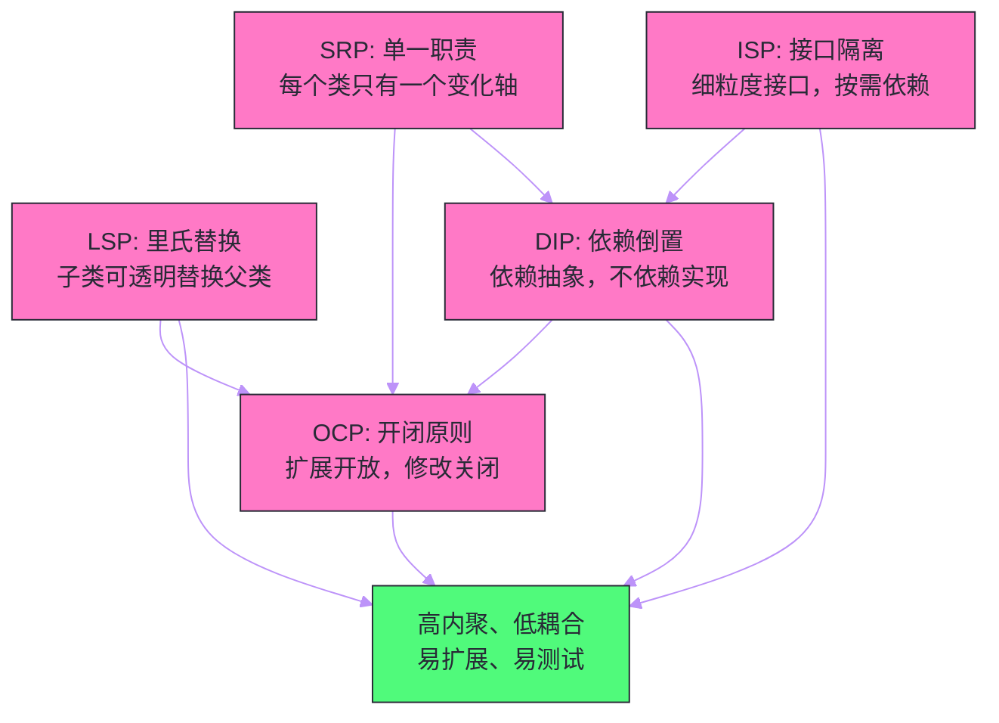

# SOLID原则——面向对象设计的五大基石

## 摘要

软件工程中有一个令无数开发者深感痛苦的现象：一个系统在刚开始时结构清晰、易于维护，但随着需求的不断叠加，它逐渐演变成一团难以修改、牵一发而动全身的"大泥球"（Big Ball of Mud）。每一次需求变更都让开发者如履薄冰，改动一处引发三处 Bug 的事情屡见不鲜。这个现象的根源不在于程序员能力不足，而在于缺乏指导系统设计的核心原则。SOLID 是由 Robert C. Martin（"Uncle Bob"）整理提炼的五条面向对象设计原则的首字母缩写：单一职责原则（SRP）、开闭原则（OCP）、里氏替换原则（LSP）、接口隔离原则（ISP）、依赖倒置原则（DIP）。这五条原则不是孤立的规则，而是相互支撑的设计哲学体系，共同指向同一个目标：构建**高内聚、低耦合**的系统，使得代码在面对变化时能够以最小的代价适应，而非被迫整体重写。本文将用真实的反例和演进案例，深度剖析每条原则的本质动机——不是"应该这样"，而是"不这样会痛在哪里"。

---

## 第 1 章 为什么需要设计原则

### 1.1 软件腐化的必然性

软件的腐化（Software Rot）是一个几乎必然发生的过程。这里有一个关键的洞察：**软件不像建筑物那样因物理老化而腐化，它腐化是因为需求在变化，而代码没有以优雅的方式响应变化**。

想象一个刚刚上线的订单系统，第一版需求简单而清晰：用户下单、系统计算价格、扣减库存、发送确认邮件。开发者用一个 `OrderService` 类搞定了一切，代码跑起来，测试通过，产品上线。

三个月后，运营提出：需要支持优惠券折扣。`OrderService` 里加了一段优惠券逻辑。

又过了两个月：不同用户等级（VIP、普通用户）有不同折扣。在优惠券代码旁边又加了一段。

再过三个月：双十一大促需要特殊折扣规则，同时还需要支持积分抵扣。`OrderService` 已经有 800 行代码了，没人敢轻易动它。

又过了半年：公司决定把邮件通知改为短信+微信双渠道。`OrderService` 里深度耦合了邮件发送逻辑，改动牵扯出 30 个测试用例。

这个故事几乎在每个中等规模以上的软件项目里都在上演。代码的问题不是一次造成的——每次改动看起来都是局部的、合理的"小修小补"，但日积月累，系统就变成了谁都不敢触碰的"地雷阵"。

### 1.2 软件设计的核心矛盾

软件设计面对一个根本矛盾：**需求是动态变化的，但代码一旦写好就具有惯性**。每一行代码都包含着关于当前需求的假设，而需求一旦变化，这些假设就可能成为束缚。

这个矛盾无法消除——没有一种架构能让代码"未卜先知"地应对所有未来变化。但优秀的设计可以做到：当变化发生时，**将变化的影响范围限制在尽可能小的代码区域内**，让不相关的代码不受影响。

这就是 SOLID 原则的核心目标：通过建立清晰的职责边界、正确的抽象层次、合理的依赖方向，让变化在系统中"传播"的路径变短，波及面变小。

### 1.3 SOLID 的历史背景

SOLID 原则并非凭空发明。它的五条规则是 Robert C. Martin 在 20 世纪 90 年代至 2000 年代初，通过大量企业项目实践和论文研究总结出来的，最初以独立文章形式发表，后来在 2003 年的《Agile Software Development: Principles, Patterns, and Practices》一书中系统整理。

这五条原则与[[GoF 设计模式]]（Gang of Four，1994 年发表的 23 种设计模式）密不可分——可以说，23 种设计模式是 SOLID 原则在具体场景下的"落地实现手册"。理解了 SOLID，就理解了设计模式的动机；理解了设计模式，就掌握了 SOLID 的工程化手段。

---

## 第 2 章 单一职责原则（SRP）

### 2.1 原则定义

**Single Responsibility Principle（SRP）**：一个类应该只有一个引起它变化的原因。

这句话的关键词是"引起变化的**原因**"，而不是"只做一件事"。两者看似相近，但内涵不同。"一件事"的边界难以界定，而"变化的原因"给了一个明确的检验标准：**如果你能找到两种不同的业务变化能分别影响这个类，那它就违反了 SRP**。

### 2.2 为什么需要单一职责

设想一个用户管理类：

```java
// 违反 SRP：一个类承担了多种职责
public class UserManager {
    // 职责一：用户数据的持久化（数据库操作）
    public User findById(Long id) {
        // SQL 查询逻辑 ... 
        return new User();
    }
    
    // 职责一：用户数据的持久化（数据库操作）
    public void save(User user) {
        // SQL 插入/更新逻辑 ...
    }
    
    // 职责二：业务规则校验
    public boolean isEligibleForPromotion(User user) {
        // 检查用户等级、消费记录、注册时长等复杂业务逻辑
        return user.getOrderCount() > 10 && user.getTotalAmount() > 5000;
    }
    
    // 职责三：通知发送（通信机制）
    public void sendWelcomeEmail(User user) {
        // 构建邮件模板、调用邮件服务 API ...
    }
    
    // 职责四：报表生成（展示格式）
    public String generateUserReport(User user) {
        // 格式化用户数据为 HTML 或 CSV ...
        return "<table>...</table>";
    }
}
```

这个类有四种不同的"变化原因"：
1. 数据库结构变了（如 User 表加字段）→ `findById()` / `save()` 需要修改；
2. 促销业务规则变了 → `isEligibleForPromotion()` 需要修改；
3. 邮件服务商从 SendGrid 换成 AWS SES → `sendWelcomeEmail()` 需要修改；
4. 报表格式从 HTML 改为 JSON → `generateUserReport()` 需要修改。

**不这样做会怎样？**

- **修改风险扩散**：改邮件发送逻辑时，测试用例必须覆盖整个 `UserManager`，包括数据库操作和报表生成。实际上你只改了一个方法，却要担心整个类受到影响；
- **并行开发冲突**：负责业务规则的工程师和负责邮件模块的工程师同时修改这个文件，Git 合并时必然产生冲突；
- **无法独立测试**：要测试 `sendWelcomeEmail()`，你必须 Mock 掉数据库连接，因为它们在同一个类里，测试代价高昂；
- **复用困难**：其他模块需要"发送邮件"功能，却不得不引入整个 `UserManager`，连带引入了数据库依赖。

### 2.3 如何落地 SRP

按职责拆分，让每个类只有一个变化轴：

```java
// 职责一：数据访问对象（Repository 模式）
// 变化原因：数据库结构或 ORM 框架变更
public class UserRepository {
    public User findById(Long id) { ... }
    public void save(User user) { ... }
}

// 职责二：业务规则（Domain 对象或 Domain Service）
// 变化原因：业务规则和促销政策变更
public class UserPromotionService {
    public boolean isEligibleForPromotion(User user) {
        return user.getOrderCount() > 10 && user.getTotalAmount() > 5000;
    }
}

// 职责三：通知服务（Infrastructure Service）
// 变化原因：通知渠道或模板变更
public class UserNotificationService {
    public void sendWelcomeEmail(User user) { ... }
}

// 职责四：报表生成（Presentation / Report 层）
// 变化原因：展示格式或报表需求变更
public class UserReportGenerator {
    public String generateReport(User user, ReportFormat format) { ... }
}
```

### 2.4 SRP 的边界与反例

SRP 最容易走向的极端是**过度拆分**：把每个方法都拆成一个类。这不是 SRP，这是"散弹枪手术"——一个简单的需求变更需要修改 20 个类，代码碎片化，理解成本反而更高。

判断是否过度拆分的标准：**如果两个方法永远因为同一个原因变化，它们就应该在同一个类里**。`findById()` 和 `save()` 同属数据访问职责，一起放在 Repository 里是合理的，不需要拆成 `UserFinder` 和 `UserSaver`。

---

## 第 3 章 开闭原则（OCP）

### 3.1 原则定义

**Open-Closed Principle（OCP）**：软件实体（类、模块、函数）应该对扩展开放，对修改关闭。

"对扩展开放"意味着当需求变化时，可以通过增加新代码来应对，而"对修改关闭"意味着已有的、已测试的代码不需要被修改。

这听起来像是矛盾的——不修改代码怎么改变行为？答案是**通过抽象与多态**：定义稳定的抽象接口，将变化封装在具体实现中，当需要新行为时新增实现类，而不是修改已有代码。

### 3.2 为什么需要 OCP

继续订单系统的例子，假设需要计算订单价格，不同类型的折扣规则频繁变化：

```java
// 违反 OCP：每次新增折扣类型，都需要修改这个方法
public class PriceCalculator {
    public double calculate(Order order, String discountType) {
        double price = order.getOriginalPrice();
        
        if ("COUPON".equals(discountType)) {
            price = price - order.getCouponAmount();
        } else if ("VIP".equals(discountType)) {
            price = price * 0.9;  // VIP 九折
        } else if ("DOUBLE_ELEVEN".equals(discountType)) {
            // 双十一满减：每满 200 减 30
            price = price - (int)(price / 200) * 30;
        }
        // 每次新增折扣类型都要在这里加 else if ...
        
        return Math.max(price, 0);
    }
}
```

每次新增一种折扣类型（如"新人优惠"、"生日折扣"），都要修改 `PriceCalculator.calculate()`。这意味着：

- 每次修改都需要重新测试整个 `PriceCalculator`；
- 不同折扣规则的代码混杂在一起，代码越来越难以阅读；
- 新增折扣时可能不小心破坏已有的折扣逻辑（if-else 分支之间的意外交互）。

**不这样做会怎样？**

举个真实场景：双十一前夜，运营临时提出新的满减规则。开发者不得不打开已经稳定运行了半年的 `PriceCalculator`，在满是 `if-else` 的方法里插入新逻辑。一不小心，原本正常的 VIP 折扣出现了 Bug，双十一零点下单的 VIP 用户折扣计算错误，引发投诉。这个事故的根本原因是：**已经稳定的代码被迫修改，引入了风险**。

### 3.3 如何落地 OCP

提取抽象，让新需求以新增类的方式落地：

```java
// 折扣策略的抽象（稳定，不再修改）
public interface DiscountStrategy {
    double apply(double originalPrice, Order order);
}

// 具体实现一：优惠券折扣（新增，不修改已有代码）
public class CouponDiscountStrategy implements DiscountStrategy {
    @Override
    public double apply(double originalPrice, Order order) {
        return originalPrice - order.getCouponAmount();
    }
}

// 具体实现二：VIP 折扣
public class VipDiscountStrategy implements DiscountStrategy {
    private final double discountRate;
    
    public VipDiscountStrategy(double discountRate) {
        this.discountRate = discountRate;
    }
    
    @Override
    public double apply(double originalPrice, Order order) {
        return originalPrice * discountRate;
    }
}

// 具体实现三：双十一满减（新增，不触碰已有类）
public class DoubleElevenDiscountStrategy implements DiscountStrategy {
    @Override
    public double apply(double originalPrice, Order order) {
        return originalPrice - (int)(originalPrice / 200) * 30;
    }
}

// 价格计算器本身对修改关闭
public class PriceCalculator {
    private final List<DiscountStrategy> strategies;
    
    public PriceCalculator(List<DiscountStrategy> strategies) {
        this.strategies = strategies;  // 通过构造器注入策略组合
    }
    
    public double calculate(Order order) {
        double price = order.getOriginalPrice();
        for (DiscountStrategy strategy : strategies) {
            price = strategy.apply(price, order);
        }
        return Math.max(price, 0);
    }
}
```

现在，增加"生日折扣"只需要新建一个 `BirthdayDiscountStrategy` 类，注入到 `PriceCalculator` 的策略列表中。`PriceCalculator` 的代码一行都不用动，它的已有测试用例依然 100% 通过。

### 3.4 OCP 的边界与反例

OCP 的实现依赖于"预见变化的方向"——只有在正确的地方定义了抽象，扩展才能不触碰已有代码。如果在错误的地方定义了抽象，当真正的变化来临时，抽象本身就要被修改，OCP 便失效了。

一个常见的误区是**过早抽象**：在还没有充分理解变化方向时，就急于提取接口。这样往往会创造出错误的抽象层，当真正的需求来临时，抽象本身需要被打破，引入更大的修改代价。

> [!note] 设计哲学
> OCP 的正确实践路径是：**先让代码工作，再让代码正确，最后让代码可扩展**。当同一类变化出现第二次时，才考虑为这个变化方向建立抽象，这被称为"规则三次法则"（Rule of Three）。

---

## 第 4 章 里氏替换原则（LSP）

### 4.1 原则定义

**Liskov Substitution Principle（LSP）**：使用基类的地方，必须能透明地使用其子类替换，而不影响程序的正确性。

这条原则由 MIT 计算机科学家 Barbara Liskov 于 1987 年提出，其严格的数学表述是：如果 S 是 T 的子类型，那么类型 T 的对象可以被类型 S 的对象替换，而程序的行为不发生变化。

LSP 的实质是对**继承关系的约束**——不是所有"is-a"关系都适合用继承实现，只有满足行为上可替换的"is-a"关系才适合。

### 4.2 为什么需要 LSP

最经典的 LSP 违反案例是**正方形继承矩形**的问题：

```java
// 矩形（父类）
public class Rectangle {
    protected int width;
    protected int height;
    
    public void setWidth(int width) { this.width = width; }
    public void setHeight(int height) { this.height = height; }
    public int getArea() { return width * height; }
}

// 正方形继承矩形（看起来是 is-a 关系：正方形"是一个"矩形）
public class Square extends Rectangle {
    @Override
    public void setWidth(int width) {
        this.width = width;
        this.height = width;  // 正方形必须保证长宽相等
    }
    
    @Override
    public void setHeight(int height) {
        this.width = height;
        this.height = height;  // 同上
    }
}

// 调用方代码：假设使用 Rectangle 基类编写
public void processRectangle(Rectangle rect) {
    rect.setWidth(5);
    rect.setHeight(4);
    // 调用方期望面积 = 5 * 4 = 20
    assert rect.getArea() == 20 : "Expected 20 but got " + rect.getArea();
    // 如果传入 Square，setHeight(4) 会把 width 也改为 4，面积 = 4 * 4 = 16
    // 断言失败！程序行为与预期不符
}
```

这里的问题在于：在数学意义上，"正方形是矩形"是正确的，但在**面向对象的行为语义**中，`Square` 作为 `Rectangle` 的子类破坏了 `Rectangle` 的一个隐含契约——**独立设置宽和高**。当调用方代码使用 `Rectangle` 接口编程时，它隐式地假设设置宽不会影响高，这个假设被 `Square` 破坏了。

**不这样做会怎样？**

LSP 违反的后果往往不是编译错误，而是运行时的诡异行为：程序在特定输入下产生错误结果，且错误很难定位（调用方的代码完全正确，问题出在它不知情的子类实现里）。这类 Bug 往往在大型系统中潜伏很久，只在特定的数据组合下触发。

### 4.3 LSP 与"契约式设计"

LSP 与 Bertrand Meyer 提出的**契约式设计（Design by Contract）**密切相关。每个方法都有三类契约：

- **前置条件（Preconditions）**：方法被调用前，调用方必须满足的条件；
- **后置条件（Postconditions）**：方法执行后，实现方必须保证的结果；
- **类不变量（Class Invariants）**：对象在任何可见状态下必须满足的约束。

LSP 要求子类实现必须：
- **不能加强前置条件**：父类接受的输入，子类也必须接受（不能要求更严格的输入）；
- **不能削弱后置条件**：父类保证的输出结果，子类也必须保证（不能输出更弱的结果）；
- **维持类不变量**：父类的约束，子类不能破坏。

`Square` 违反的正是后置条件：`Rectangle.setWidth(5)` 的后置条件是"width 变为 5，height 不变"，但 `Square` 的实现破坏了这个后置条件。

### 4.4 如何落地 LSP

正方形与矩形的正确处理方式是：**不要用继承，改用组合或独立抽象**。

```java
// 方案一：提取只读接口，去除相互干扰的方法
public interface Shape {
    int getArea();
}

public class Rectangle implements Shape {
    private final int width;
    private final int height;
    // 构造器设置，不提供独立的 setWidth/setHeight
    public Rectangle(int width, int height) { ... }
    @Override
    public int getArea() { return width * height; }
}

public class Square implements Shape {
    private final int side;
    public Square(int side) { this.side = side; }
    @Override
    public int getArea() { return side * side; }
}
```

通过让 `Rectangle` 和 `Square` 都实现 `Shape` 接口，而不是让 `Square` 继承 `Rectangle`，问题被根本解决。调用方针对 `Shape` 编程，两种形状都能正确替换。

### 4.5 LSP 在 Java 中的常见违反场景

**场景一：抛出父类不抛出的异常**

```java
public class FileReader {
    public String read(String path) throws IOException { ... }
}

// 违反 LSP：子类抛出了父类未声明的异常类型
public class NetworkFileReader extends FileReader {
    @Override
    public String read(String path) throws NetworkException {  // 编译错误：异常不兼容
        // ...
    }
}
```

在 Java 中，子类覆写方法抛出的受检异常不能比父类更宽泛，这是语言层面对 LSP 的强制保证（部分）。

**场景二：返回 null 代替父类保证的对象**

```java
public class BaseRepository {
    // 契约：findById 永远不返回 null，找不到抛出 EntityNotFoundException
    public User findById(Long id) {
        User user = db.query(id);
        if (user == null) throw new EntityNotFoundException("User not found: " + id);
        return user;
    }
}

// 违反 LSP：子类把 not-found 处理改为返回 null，调用方不知情
public class CachingUserRepository extends BaseRepository {
    @Override
    public User findById(Long id) {
        User cached = cache.get(id);
        return cached;  // 缓存未命中时返回 null，违反了父类"不返回 null"的契约
    }
}
```

---

## 第 5 章 接口隔离原则（ISP）

### 5.1 原则定义

**Interface Segregation Principle（ISP）**：客户端不应该被迫依赖它不需要的接口方法。

ISP 的关注点是接口的粒度：**不要设计"胖接口"（Fat Interface）**，将不同客户端需要的方法分散在不同的接口中，让每个客户端只依赖它真正需要的那个子集。

### 5.2 为什么需要 ISP

设想一个打印机管理系统，抽象出一个 `Machine` 接口来统一管理各种设备：

```java
// "胖接口"：把所有设备能力都塞进一个接口
public interface Machine {
    void print(Document doc);
    void scan(Document doc);
    void fax(Document doc);
    void staple(Document doc);  // 装订
    void copy(Document doc);
}

// 问题：普通桌面打印机只能打印，但被迫实现所有方法
public class SimplePrinter implements Machine {
    @Override
    public void print(Document doc) {
        // 真正的打印逻辑
    }
    
    @Override
    public void scan(Document doc) {
        throw new UnsupportedOperationException("SimplePrinter cannot scan");
    }
    
    @Override
    public void fax(Document doc) {
        throw new UnsupportedOperationException("SimplePrinter cannot fax");
    }
    
    @Override
    public void staple(Document doc) {
        throw new UnsupportedOperationException("SimplePrinter cannot staple");
    }
    
    @Override
    public void copy(Document doc) {
        throw new UnsupportedOperationException("SimplePrinter cannot copy");
    }
}
```

**不这样做会怎样？**

- **实现方被迫撒谎**：`SimplePrinter` 实现了 `fax()` 接口，但调用它会抛出 `UnsupportedOperationException`。这是一种隐性的 LSP 违反——接口说"我可以做 X"，但运行时却说"不，我不能"，调用方只能用 try-catch 来应对"应该成功"的调用；
- **编译依赖噪音**：一个只需要打印功能的模块，因为使用了 `Machine` 接口，被迫在编译时依赖 `fax`、`scan` 相关的类——即使它完全不用这些功能；
- **接口改动影响无辜方**：如果 `Machine` 接口新增了 `printColor()` 方法，所有实现了 `Machine` 的类（包括根本不需要彩色打印的 `SimplePrinter`、`FaxMachine`）都必须添加这个方法的实现。

### 5.3 如何落地 ISP

按客户端的实际需求拆分接口：

```java
// 细粒度接口，每个接口只包含相关方法
public interface Printable {
    void print(Document doc);
}

public interface Scannable {
    void scan(Document doc);
}

public interface Faxable {
    void fax(Document doc);
}

public interface Stapleable {
    void staple(Document doc);
}

// 只能打印的简单打印机：只实现 Printable
public class SimplePrinter implements Printable {
    @Override
    public void print(Document doc) { ... }
}

// 多功能一体机：实现多个接口（Java 支持多接口实现）
public class AllInOnePrinter implements Printable, Scannable, Faxable, Stapleable {
    @Override public void print(Document doc) { ... }
    @Override public void scan(Document doc) { ... }
    @Override public void fax(Document doc) { ... }
    @Override public void staple(Document doc) { ... }
}

// 调用方只依赖它真正需要的接口
public class DocumentProcessor {
    private final Printable printer;  // 只需要打印功能
    
    public DocumentProcessor(Printable printer) {
        this.printer = printer;  // 可以传入 SimplePrinter 或 AllInOnePrinter
    }
}
```

### 5.4 ISP 的现实案例：JDK 中的接口设计演进

JDK 的接口设计历史本身就是 ISP 思想演进的教科书。

早期的 `java.util.Collection` 接口的问题：一些集合实现（如 `Arrays.asList()` 返回的固定大小列表）无法实现 `add()` 和 `remove()` 方法，只能抛出 `UnsupportedOperationException`——这正是 ISP 违反的表现。

JDK 8 引入了 `default` 方法，为接口提供了默认实现，这在一定程度上缓解了"胖接口"导致的问题（新增方法可以有默认实现，不强迫所有实现类修改），但根本的接口隔离设计仍然是最优解。

---

## 第 6 章 依赖倒置原则（DIP）

### 6.1 原则定义

**Dependency Inversion Principle（DIP）**：
1. 高层模块不应该依赖低层模块，两者都应该依赖抽象；
2. 抽象不应该依赖细节，细节应该依赖抽象。

"依赖倒置"中的"倒置"指的是：传统的结构化编程中，高层模块自然地依赖低层模块（上层调用下层），而 DIP 要求颠覆这种自然依赖方向。

### 6.2 为什么需要 DIP

这是 SOLID 五条原则中对系统架构影响最深远的一条。来看一个典型的三层架构违反：

```java
// 底层模块：MySQL 实现的用户存储
public class MySQLUserRepository {
    public User findById(Long id) {
        // 直接用 JDBC 查 MySQL
        Connection conn = DriverManager.getConnection("jdbc:mysql://...");
        // ...
        return user;
    }
}

// 高层模块：用户服务，直接依赖 MySQL 实现
public class UserService {
    // 高层直接 new 了底层的具体实现——高层依赖低层
    private final MySQLUserRepository repository = new MySQLUserRepository();
    
    public User getUser(Long id) {
        return repository.findById(id);  // 强依赖 MySQL 实现
    }
}
```

这段代码的问题：

1. **测试困难**：测试 `UserService` 时，必须有真实的 MySQL 数据库可用，无法在没有数据库的 CI 环境中运行单元测试；
2. **难以切换**：如果要从 MySQL 迁移到 MongoDB，或者需要增加 Redis 缓存层，`UserService` 必须修改——高层模块为什么要因为底层实现的变化而修改？
3. **依赖传播**：`UserService` 的调用方（如 Controller）因为调用了 `UserService`，间接地依赖了 MySQL。MySQL 的 JAR 包变更会影响到所有层次。

### 6.3 如何落地 DIP

引入抽象接口，让高低层都依赖抽象：

```java
// 抽象层：Repository 接口（稳定）
// 高层（UserService）和低层（MySQLUserRepository）都依赖它
public interface UserRepository {
    User findById(Long id);
    void save(User user);
}

// 低层实现一：MySQL（细节依赖抽象）
public class MySQLUserRepository implements UserRepository {
    @Override
    public User findById(Long id) { /* MySQL 实现 */ }
    @Override
    public void save(User user) { /* MySQL 实现 */ }
}

// 低层实现二：MongoDB（新增实现，不改高层）
public class MongoUserRepository implements UserRepository {
    @Override
    public User findById(Long id) { /* MongoDB 实现 */ }
    @Override
    public void save(User user) { /* MongoDB 实现 */ }
}

// 高层模块：依赖抽象接口，不知道底层是 MySQL 还是 MongoDB
public class UserService {
    private final UserRepository repository;  // 依赖抽象
    
    // 通过构造器注入（依赖注入，DI）——具体实现由外部决定
    public UserService(UserRepository repository) {
        this.repository = repository;
    }
    
    public User getUser(Long id) {
        return repository.findById(id);
    }
}
```

### 6.4 DIP 与 IoC、DI 的关系

**依赖倒置原则（DIP）** 是设计思想层面的原则，**控制反转（IoC，Inversion of Control）** 是实现 DIP 的模式，**依赖注入（DI，Dependency Injection）** 是实现 IoC 最常见的具体手段，而 **Spring IoC 容器**是 DI 的工业级实现框架。

这四者的层次关系：

```
DIP（原则）
  └── IoC（设计模式）
        └── DI（实现手段）
              ├── 构造器注入（最推荐）
              ├── Setter 注入
              └── 字段注入（@Autowired，不推荐）
                    └── Spring IoC（工业级框架实现）
```

理解这个层次非常重要。很多开发者知道用 `@Autowired`，但不理解它背后的动机。当你明白 DIP 是为了**让高层模块不依赖低层实现**，就能理解为什么 Spring 要实现一个复杂的 IoC 容器——它帮你管理所有对象的创建和注入，让业务代码只看到抽象接口。

### 6.5 DIP 的边界：不是所有依赖都要倒置

一个常见误解是：DIP 要求消除所有具体类的依赖。这是错误的。

DIP 关注的是**不稳定的、可能变化的实现**。以下的直接依赖是完全合理的：
- 依赖 JDK 标准库的具体类（`String`、`ArrayList`）——这些极其稳定；
- 依赖业务核心领域的值对象（如 `Money`、`UserId`）——这些是领域模型的基础，不是"低层实现"；
- 工具类、数学计算类——没有替换需求的稳定细节。

DIP 主要适用于**系统边界**：IO 层（数据库、文件系统、网络）、外部服务（第三方 API）、通知机制（邮件、短信）——这些是最可能变化、最需要隔离的"细节"。

---

## 第 7 章 五条原则的协同与权衡

### 7.1 五条原则的相互关系

SOLID 五条原则不是孤立的，它们相互支撑、共同构成一个完整的设计哲学：



- **SRP** 是基础：只有把职责分清楚，才能做到每个类只有一个变化轴，为 OCP 和 DIP 的实施创造条件；
- **OCP** 是目标：通过抽象与多态让系统对变化免疫，SRP、LSP、ISP、DIP 都是实现 OCP 的手段；
- **LSP** 是 OCP 的保障：只有子类能正确替换父类，多态机制才能正常工作，OCP 的抽象才有意义；
- **ISP** 是 DIP 的细化：在依赖抽象的前提下，还要保证所依赖的抽象足够精炼，不引入不需要的依赖；
- **DIP** 是架构层面的 OCP：通过让高层依赖抽象而非实现，保证底层的变化不传染到高层。

### 7.2 SOLID 与设计模式的关系

理解了 SOLID，就能理解设计模式的"设计动机"栏为什么这样写：

| 设计模式 | 主要体现的 SOLID 原则 |
| --- | --- |
| **策略模式** | OCP：封装变化的算法，扩展不修改调用方 |
| **工厂方法/抽象工厂** | DIP：客户端依赖工厂抽象，不直接 new 具体类 |
| **装饰器模式** | OCP + SRP：扩展行为而不修改原类 |
| **代理模式** | DIP + SRP：将横切关注点（日志、事务）从业务逻辑分离 |
| **观察者模式** | OCP + DIP：事件发布者依赖观察者接口，不知道具体订阅者 |
| **模板方法模式** | OCP：父类定义算法骨架，子类扩展步骤 |
| **责任链模式** | OCP + SRP：每个处理器只处理自己的部分，链条可动态扩展 |

### 7.3 SOLID 的反例：过度设计的陷阱

SOLID 原则的一个误用是将它们当作宗教信条，不加判断地机械应用。以下是常见的过度设计场景：

**反例一：为 CRUD 接口盲目应用 DIP**

一个简单的后台管理系统，数据库永远不会换，对数据层做完整的 Repository 接口抽象是不必要的过度设计，它增加了代码量和理解成本，却几乎没有带来任何价值。

**反例二：为避免修改而创造超深的继承层次**

为了遵守 OCP，把所有变化都用继承来表达，最终形成 10 层的继承链。这比直接修改代码更难维护。

**反例三：把每个方法拆成接口来满足 ISP**

每个只有一个方法的接口不是 ISP，而是过度设计。接口应该代表一个有意义的能力集合，而不是单个方法的容器。

> [!warning] SOLID 的正确使用姿势
> SOLID 是指导原则，不是死板规则。它的价值在于帮助你在面对具体设计问题时，**意识到某种设计可能带来的长期代价**，从而做出更明智的选择。一个有经验的工程师会在"务实地违反"某条原则（因为过度设计的代价更高）和"严格遵守"某条原则之间做出权衡，而不是机械地执行。

---

## 总结

SOLID 五条原则共同描述了一个健康代码库应该具备的特征：

- **SRP** 要求每个类只承担一种变化的责任，让修改的影响范围最小；
- **OCP** 要求通过抽象让新需求以"新增代码"而非"修改代码"的方式落地；
- **LSP** 要求子类在行为上能透明替换父类，保证多态机制的正确性；
- **ISP** 要求接口足够精炼，让调用方只依赖它真正需要的能力；
- **DIP** 要求高层模块通过抽象与低层实现隔离，让底层变化不传染到高层。

五条原则的核心，是同一个工程直觉：**软件会变化，好的设计应该让变化的代价尽可能小**。SRP 缩小变化的影响范围，OCP 让变化以"新增"代替"修改"，LSP 保证抽象的可靠性，ISP 减少不必要的依赖边界，DIP 隔离不稳定的实现细节。

下一篇将把这些原则付诸实践，深入解析创建型设计模式中最常用的三个：单例、工厂方法与抽象工厂，看它们如何将 SOLID 原则凝固为可复用的设计方案：[[02 创建型模式（上）——单例、工厂方法与抽象工厂]]。

---

> [!note] 参考资料
> - Robert C. Martin,《Agile Software Development: Principles, Patterns, and Practices》, 2003
> - Barbara Liskov,《Data Abstraction and Hierarchy》, 1987
> - Martin Fowler,《Refactoring: Improving the Design of Existing Code》, 2nd ed.
> - Michael Feathers,《Working Effectively with Legacy Code》

---

> [!note] 思考题
> 1. SOLID 中的'开闭原则'（对扩展开放，对修改关闭）在实践中往往需要通过策略模式或模板方法模式来实现。但过度追求开闭原则会导致'过度抽象'——为一个目前只有一种实现的接口创建抽象层。你如何判断什么时候需要提前抽象，什么时候应该遵循 YAGNI（You Aren't Gonna Need It）原则？
> 2. 依赖倒置原则（DIP）要求高层模块不依赖低层模块，而是都依赖抽象。在 Spring 中通过 DI 容器实现 DIP 非常自然。但在非 Spring 的场景（如 SDK 开发、命令行工具）中，你如何实现 DIP 而不引入 DI 框架的复杂度？'穷人的依赖注入'（Pure DI）与框架 DI 相比有什么取舍？
> 3. 里氏替换原则（LSP）要求子类必须能替换父类而不改变程序的正确性。`java.sql.Timestamp` 继承自 `java.util.Date`，但 `Timestamp.equals(Date)` 违反了对称性（`date.equals(timestamp)` 为 true 但 `timestamp.equals(date)` 可能为 false）。这是 LSP 违反的经典案例——Java 标准库为什么会出现这种设计错误？
