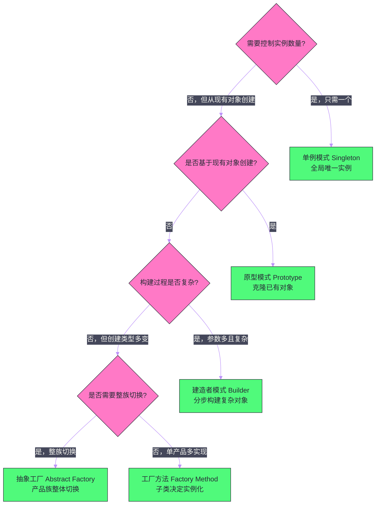

# 创建型模式（下）——建造者与原型模式

## 摘要

创建型模式的后半部分聚焦两个解决特定构建问题的模式。**建造者模式（Builder）** 针对的是"复杂对象的分步构建"问题：当一个对象有大量可选参数时，传统构造器会演变成有十几个参数的噩梦，而 Setter 链则会暴露出中间状态不一致的风险。Builder 模式通过引入一个专门的构建器对象，将"如何构建"与"对象本身"分离，既保证了对象不可变性，又提供了清晰的构建语义。本文深入剖析 Builder 的三种演进形态——传统 GoF 形式、现代 Fluent Interface 形式以及 Lombok `@Builder` 的原理；同时分析为什么 Java 没有像 Kotlin 的具名参数那样的语言支持，使得 Builder 成为 Java 中复杂对象构建的事实标准。**原型模式（Prototype）** 解决的是"基于现有对象创建新对象"的问题：当对象创建代价高昂（初始化复杂、网络请求），或需要保留某个对象的某个时间点快照时，复制比重建更高效。本文精确区分浅拷贝与深拷贝的边界，分析 Java 的 `Cloneable` 接口的设计缺陷，以及在实践中更可靠的深拷贝实现方案。

---

## 第 1 章 建造者模式（Builder）

### 1.1 动机：复杂对象构建的两个反模式

构建一个复杂对象时，有两种常见的反模式，它们各自解决了一个问题，却引入了另一个更大的问题。

**反模式一：伸缩式构造器（Telescoping Constructor）**

当一个类有多个参数（其中一些可选）时，最直觉的做法是提供多个重载构造器：

```java
// 伸缩式构造器：每次添加参数都要新增重载
public class HttpRequest {
    private final String url;
    private final String method;
    private final Map<String, String> headers;
    private final String body;
    private final int connectTimeout;
    private final int readTimeout;
    private final int maxRetries;
    private final boolean followRedirects;
    
    // 只有 url 和 method 是必选的，其他都是可选的
    public HttpRequest(String url, String method) {
        this(url, method, new HashMap<>(), null, 3000, 5000, 3, true);
    }
    
    public HttpRequest(String url, String method, Map<String, String> headers) {
        this(url, method, headers, null, 3000, 5000, 3, true);
    }
    
    public HttpRequest(String url, String method, String body) {
        this(url, method, new HashMap<>(), body, 3000, 5000, 3, true);
    }
    
    // ... 还需要更多组合 ...
    
    // 全参构造器（最终汇聚点）
    public HttpRequest(String url, String method, Map<String, String> headers,
                       String body, int connectTimeout, int readTimeout,
                       int maxRetries, boolean followRedirects) {
        this.url = url;
        this.method = method;
        // ...
    }
}
```

问题显而易见：有 8 个参数时，可选参数组合的数量是指数级的，不可能为每种组合都写构造器。而当使用者调用 `new HttpRequest("http://api.example.com", "POST", null, "{\"key\":\"value\"}", 5000, 10000, 0, false)` 时，这行代码的可读性极差——第 5 个参数是什么？第 6 个是什么？

**反模式二：JavaBean 模式（Setter 链）**

另一种方案是无参构造器 + Setter：

```java
HttpRequest request = new HttpRequest();
request.setUrl("http://api.example.com");
request.setMethod("POST");
request.setBody("{\"key\":\"value\"}");
request.setConnectTimeout(5000);
// 如果这里忘记调用 setUrl()，对象处于"半构建"状态
```

JavaBean 模式的问题是：对象在构建过程中处于**不一致的中间状态**。在第一个 `setUrl()` 调用完成、最后一个 `setFollowRedirects()` 调用完成之间，`request` 对象是不完整的。如果在多线程环境中，另一个线程在对象半构建完成时就使用了它，会产生难以排查的 Bug。

更根本的问题是：JavaBean 模式无法创建**不可变对象**（Immutable Object）。所有字段必须是可写的（有 Setter），这意味着对象在创建后还可以被修改，破坏了线程安全性。

### 1.2 Builder 模式的结构与动机

Builder 模式的核心思想是：**引入一个可变的 Builder 对象负责分步组装参数，最后调用 `build()` 一次性创建不可变的目标对象**。构建过程可变，目标对象不可变。

```java
// 不可变的目标对象
public final class HttpRequest {
    // 所有字段 final：对象一旦创建，状态不可改变（线程安全）
    private final String url;           // 必选
    private final String method;        // 必选
    private final Map<String, String> headers;
    private final String body;
    private final int connectTimeout;
    private final int readTimeout;
    private final int maxRetries;
    private final boolean followRedirects;
    
    // 私有构造器：只有 Builder 可以调用
    private HttpRequest(Builder builder) {
        this.url = builder.url;
        this.method = builder.method;
        this.headers = Collections.unmodifiableMap(new HashMap<>(builder.headers));
        this.body = builder.body;
        this.connectTimeout = builder.connectTimeout;
        this.readTimeout = builder.readTimeout;
        this.maxRetries = builder.maxRetries;
        this.followRedirects = builder.followRedirects;
    }
    
    // 只有 getter，没有 setter：不可变对象
    public String getUrl() { return url; }
    public String getMethod() { return method; }
    // ...
    
    // 静态内部类 Builder
    public static class Builder {
        // 必选参数（构造 Builder 时必须提供）
        private final String url;
        private final String method;
        
        // 可选参数（有合理默认值）
        private Map<String, String> headers = new HashMap<>();
        private String body = null;
        private int connectTimeout = 3000;
        private int readTimeout = 5000;
        private int maxRetries = 3;
        private boolean followRedirects = true;
        
        // Builder 的构造器只接受必选参数
        public Builder(String url, String method) {
            if (url == null || url.isEmpty()) {
                throw new IllegalArgumentException("URL cannot be null or empty");
            }
            this.url = url;
            this.method = method;
        }
        
        // 链式调用方法：每个方法返回 this，允许流式调用
        public Builder header(String name, String value) {
            this.headers.put(name, value);
            return this;
        }
        
        public Builder body(String body) {
            this.body = body;
            return this;
        }
        
        public Builder connectTimeout(int timeout) {
            if (timeout <= 0) throw new IllegalArgumentException("Timeout must be positive");
            this.connectTimeout = timeout;
            return this;
        }
        
        public Builder readTimeout(int timeout) {
            this.readTimeout = timeout;
            return this;
        }
        
        public Builder maxRetries(int retries) {
            this.maxRetries = retries;
            return this;
        }
        
        public Builder followRedirects(boolean follow) {
            this.followRedirects = follow;
            return this;
        }
        
        // 最终构建：在这里进行完整性校验
        public HttpRequest build() {
            // 可以在这里做跨字段的一致性校验
            if ("POST".equals(method) && body == null) {
                throw new IllegalStateException("POST request must have a body");
            }
            return new HttpRequest(this);
        }
    }
}

// 使用：链式调用，清晰可读
HttpRequest request = new HttpRequest.Builder("http://api.example.com/users", "POST")
    .header("Content-Type", "application/json")
    .header("Authorization", "Bearer token123")
    .body("{\"name\": \"Alice\"}")
    .connectTimeout(5000)
    .readTimeout(10000)
    .maxRetries(0)
    .build();
```

这段代码相比伸缩式构造器的优势：
- **可读性极强**：`header(...).body(...).connectTimeout(...)` 的语义一目了然；
- **对象不可变**：`HttpRequest` 的所有字段都是 `final`，线程安全，可以在多线程间安全共享；
- **参数校验集中**：所有校验逻辑放在 `build()` 或各 Setter 中，对象永远不会处于无效状态；
- **必选参数在编译期强制**：将 `url` 和 `method` 放在 Builder 的构造器中，编译器保证它们不被遗忘。

### 1.3 GoF 原始形式 vs 现代 Fluent Interface

GoF 书中的建造者模式更强调"构建不同表示"的能力——同一个构建过程，通过不同的 Builder 实现，可以产生不同的产品。这在现代 Java 开发中不常见。

**GoF 原始形式**的典型场景：

```java
// 导演类（Director）：知道构建步骤的顺序，但不知道具体实现
public class ReportDirector {
    public void construct(ReportBuilder builder) {
        builder.buildHeader();
        builder.buildBody();
        builder.buildFooter();
    }
}

// 抽象 Builder
public interface ReportBuilder {
    void buildHeader();
    void buildBody();
    void buildFooter();
    Report getResult();
}

// 具体 Builder 一：HTML 报表
public class HtmlReportBuilder implements ReportBuilder {
    private Report report = new HtmlReport();
    @Override public void buildHeader() { report.setHeader("<html><head>...</head>"); }
    @Override public void buildBody() { report.setBody("<body>...data...</body>"); }
    @Override public void buildFooter() { report.setFooter("</html>"); }
    @Override public Report getResult() { return report; }
}

// 具体 Builder 二：PDF 报表（相同步骤，不同产品）
public class PdfReportBuilder implements ReportBuilder { ... }
```

**现代 Fluent Interface 形式**（就是上面 `HttpRequest.Builder` 的形式）更常见于日常 Java 开发，它舍弃了 Director 概念，用链式调用直接在调用点表达构建意图。

两种形式的对比：

| 维度 | GoF 原始形式 | 现代 Fluent Interface |
| --- | --- | --- |
| **Director 类** | 有 | 无（调用方直接链式调用）|
| **构建步骤顺序** | 由 Director 控制 | 由调用方控制 |
| **复用构建流程** | Director 可以复用 | 调用方各自链式 |
| **适用场景** | 同一构建流程产生不同产品 | 配置复杂对象 |
| **现代使用频率** | 较少 | 极其普遍 |

### 1.4 Lombok @Builder 的原理与使用

在实际项目中，手工写 Builder 的样板代码既繁琐又容易出错。Lombok 的 `@Builder` 注解在编译期自动生成完整的 Builder 代码：

```java
// 只需这几行注解，Lombok 自动生成完整的 Builder 
@Builder
@Getter
public class HttpRequest {
    @NonNull private final String url;
    @NonNull private final String method;
    @Builder.Default private final Map<String, String> headers = new HashMap<>();
    private final String body;
    @Builder.Default private final int connectTimeout = 3000;
    @Builder.Default private final int readTimeout = 5000;
    @Builder.Default private final int maxRetries = 3;
    @Builder.Default private final boolean followRedirects = true;
}

// 使用：Lombok 生成的 builder() 方法
HttpRequest request = HttpRequest.builder()
    .url("http://api.example.com/users")
    .method("POST")
    .body("{\"name\": \"Alice\"}")
    .connectTimeout(5000)
    .build();
```

Lombok `@Builder` 的工作原理：在编译期，Lombok 的注解处理器（APT，Annotation Processing Tool）读取 `@Builder` 注解，生成一个静态内部类 `HttpRequestBuilder`，其中包含所有字段的 Setter 方法（返回 `this`）和最终的 `build()` 方法，并在目标类上生成静态工厂方法 `builder()`。

`@Builder.Default` 注解用于指定字段的默认值——如果不加这个注解，未在链式调用中设置的字段会是 `null`（对象类型）或 `0`/`false`（基本类型），而加了 `@Builder.Default` 后，Lombok 会使用注解指定的值作为默认值。

> [!warning] Lombok @Builder 与继承
> `@Builder` 在有继承关系的类中使用时有陷阱：子类的 Builder 默认不包含父类字段。可以使用 `@SuperBuilder` 注解解决，但它需要父类和子类都标注 `@SuperBuilder`。在使用前务必理解这个限制。

### 1.5 Builder 的边界与反例

Builder 模式适合的场景是参数数量多（通常 4 个以上）且有可选参数的情况。以下场景不适合用 Builder：

**反例：参数少的简单对象**

```java
// 只有两个必选参数：直接用构造器，Builder 是过度设计
public class Point {
    private final int x;
    private final int y;
    
    public Point(int x, int y) {
        this.x = x;
        this.y = y;
    }
}

// 以下是不必要的复杂化
Point p = Point.builder().x(3).y(4).build();  // 完全没有必要
// 直接写：
Point p = new Point(3, 4);  // 清晰简洁
```

**反例：参数语义清晰的构造器**

如果构造器参数少且语义清晰（参数位置一目了然），Builder 是纯粹的"仪式感"：

```java
new Duration(5, TimeUnit.SECONDS)  // 完全清晰，不需要 Builder
```

---

## 第 2 章 原型模式（Prototype）

### 2.1 动机：对象创建代价高昂时的克隆策略

原型模式（Prototype Pattern）的动机是：**当创建一个新对象的成本很高，而现有对象与所需对象在内容上非常接近时，通过复制现有对象来创建新对象比从零开始创建更高效**。

哪些场景中"创建代价高昂"？

**场景一：初始化时需要大量计算或 I/O**

假设有一个 `GameBoard` 对象，它在初始化时需要加载地图数据（从磁盘读取数十 MB 的地图文件）、生成随机地形（复杂的噪声算法）、预计算视野范围。这个初始化过程耗时 3 秒。如果游戏需要"新开一局"（重置棋盘），从零重新初始化需要再等 3 秒；但如果保存一个初始状态的原型，每次新开一局直接复制原型，时间可以缩短到毫秒级。

**场景二：需要保留对象的"历史快照"**

在撤销（Undo）功能中，系统需要保存操作前的对象状态。当用户执行撤销时，恢复到该快照。如果使用原型（克隆），不需要记录所有变更的增量——直接复制当时的完整对象状态即可。

**场景三：对象配置复杂，许多实例共享相同的基础配置**

一个 HTTP 客户端配置对象，定义了超时、重试、代理等 20 个配置项。大多数调用方需要相同的基础配置，只有少数参数不同。创建一个"模板"配置对象，每次使用时复制模板再修改少数参数，比每次从零配置更方便。

### 2.2 Java 的 Cloneable 接口：一个设计失误

Java 为原型模式提供了内置支持：`java.lang.Cloneable` 接口和 `Object.clone()` 方法。然而，这个机制是 Java 设计中为数不多的"公认失误"，Joshua Bloch 在《Effective Java》第 13 条专门讨论了为什么要"谨慎地覆盖 clone"。

`Cloneable` 的奇特之处：它是一个**标记接口**（Marker Interface），没有任何方法。它的作用是修改 `Object.clone()` 的行为——如果一个对象实现了 `Cloneable`，`Object.clone()` 返回该对象字段逐一复制的副本；如果没有实现，调用 `clone()` 会抛出 `CloneNotSupportedException`。

这个设计的问题：
1. **接口没有定义 `clone()` 方法**：实现 `Cloneable` 并不意味着 `clone()` 方法是 `public` 的。`Object.clone()` 是 `protected` 的，必须在子类中显式覆写并改为 `public` 才能被外部调用；
2. **浅拷贝的陷阱**：`Object.clone()` 默认执行浅拷贝——只复制字段值，对于引用类型字段，复制的是引用（地址），而非引用指向的对象本身。这意味着克隆对象与原对象共享同一个引用类型字段的实例；
3. **异常处理的繁琐**：覆写 `clone()` 必须处理 `CloneNotSupportedException`，而在已经实现了 `Cloneable` 的类中，这个异常永远不会被抛出，只是语法上必须处理。

### 2.3 浅拷贝与深拷贝的精确区别

理解浅拷贝与深拷贝的区别，需要清楚 Java 内存模型中的对象结构：

```
原对象（堆内存中）：
┌─────────────────────────────────────────────────┐
│ config                                            │
│   ├── url: "http://..." （String，不可变，共享安全）  │
│   ├── timeout: 3000 （int，基本类型，复制值）         │
│   ├── headers: → ──────────────────┐ （引用类型）   │
│   └── retryPolicy: → ──────────┐  │              │
└─────────────────────────────────│──│──────────────┘
                                  │  │
                     ┌────────────┘  └─────────────┐
                     ↓                              ↓
              RetryPolicy 对象               HashMap 对象
              { maxRetries: 3 }              { "key": "val" }
```

**浅拷贝（Shallow Copy）**：复制对象的所有字段，但引用类型字段只复制引用（地址），不复制引用的对象。结果是克隆对象与原对象的引用类型字段指向同一个子对象。

```java
// 浅拷贝后的内存结构：
原对象.headers ──────┐
                      ↓
克隆对象.headers ────→ 同一个 HashMap 对象（共享！修改互相影响）
```

**深拷贝（Deep Copy）**：递归复制对象的所有字段，包括引用类型字段指向的子对象，一直到所有层级的对象都是全新的副本，原对象与克隆对象完全独立。

```java
// 深拷贝后的内存结构：
原对象.headers ──────→ HashMap 对象 A
克隆对象.headers ────→ HashMap 对象 B（全新的副本，互相独立）
```

**浅拷贝的陷阱**：

```java
public class RequestConfig implements Cloneable {
    private String url;
    private int timeout;
    private Map<String, String> headers = new HashMap<>();  // 引用类型！
    
    @Override
    public RequestConfig clone() {
        try {
            return (RequestConfig) super.clone();  // 浅拷贝！
        } catch (CloneNotSupportedException e) {
            throw new AssertionError();  // 不会发生
        }
    }
}

// 危险的使用示例
RequestConfig base = new RequestConfig("http://api.com", 3000);
base.getHeaders().put("Authorization", "Bearer base-token");

RequestConfig userConfig = base.clone();  // 浅拷贝
userConfig.getHeaders().put("Authorization", "Bearer user-token");  // 修改 headers

// 意外！base 的 headers 也被修改了，因为两者共享同一个 HashMap
System.out.println(base.getHeaders().get("Authorization"));  // 输出 "Bearer user-token"，而非 "Bearer base-token"
```

### 2.4 正确实现深拷贝的方案

**方案一：手动深拷贝**

在 `clone()` 中手动对引用类型字段进行深拷贝：

```java
@Override
public RequestConfig clone() {
    try {
        RequestConfig clone = (RequestConfig) super.clone();  // 浅拷贝基础字段
        // 手动深拷贝引用类型字段
        clone.headers = new HashMap<>(this.headers);   // 创建新 Map，复制键值对
        clone.retryPolicy = this.retryPolicy.clone();  // RetryPolicy 也需要实现 clone()
        return clone;
    } catch (CloneNotSupportedException e) {
        throw new AssertionError();
    }
}
```

问题：如果对象图很深（`headers` 里的 value 又是一个复杂对象），手动深拷贝的代码非常繁琐，且容易遗漏某个层级。

**方案二：序列化/反序列化**

利用 Java 序列化机制实现深拷贝：将对象序列化为字节流，再反序列化为新对象。由于序列化/反序列化重建了完整的对象图，结果是完全独立的深拷贝。

```java
// 通用深拷贝工具方法（要求对象实现 Serializable）
@SuppressWarnings("unchecked")
public static <T extends Serializable> T deepCopy(T obj) {
    try {
        // 序列化：对象 → 字节流
        ByteArrayOutputStream bos = new ByteArrayOutputStream();
        ObjectOutputStream oos = new ObjectOutputStream(bos);
        oos.writeObject(obj);
        oos.close();
        
        // 反序列化：字节流 → 全新对象
        ByteArrayInputStream bis = new ByteArrayInputStream(bos.toByteArray());
        ObjectInputStream ois = new ObjectInputStream(bis);
        return (T) ois.readObject();
    } catch (IOException | ClassNotFoundException e) {
        throw new RuntimeException("Deep copy failed", e);
    }
}
```

缺点：性能较差（序列化/反序列化有较高开销），且要求对象图中所有对象都实现 `Serializable`。适合对性能要求不高的场景。

**方案三：基于 JSON 序列化的深拷贝**

使用 Jackson 等 JSON 库：

```java
// 基于 Jackson 的深拷贝（不要求 Serializable）
ObjectMapper mapper = new ObjectMapper();
RequestConfig copy = mapper.readValue(
    mapper.writeValueAsBytes(original), 
    RequestConfig.class
);
```

**方案四：复制构造器（Copy Constructor）**

Joshua Bloch 推荐的方案——提供一个接收同类型对象的构造器，手动复制所有字段：

```java
public class RequestConfig {
    private final String url;
    private final int timeout;
    private final Map<String, String> headers;
    
    // 普通构造器
    public RequestConfig(String url, int timeout) {
        this.url = url;
        this.timeout = timeout;
        this.headers = new HashMap<>();
    }
    
    // 复制构造器：接受同类型对象，创建深拷贝
    public RequestConfig(RequestConfig source) {
        this.url = source.url;              // String 不可变，共享安全
        this.timeout = source.timeout;      // int，基本类型，直接复制值
        this.headers = new HashMap<>(source.headers);  // 手动深拷贝 Map
    }
}

// 使用：语义清晰，不需要类型转换
RequestConfig userConfig = new RequestConfig(baseConfig);
```

复制构造器相比 `clone()` 的优势：语义清晰（就是一个普通构造器）、不依赖 `Cloneable` 的奇特机制、不需要处理 `CloneNotSupportedException`、可以精确控制哪些字段需要深拷贝。

> [!info] 不可变对象的克隆是安全的
> 不可变对象（Immutable Object，如 `String`、`Integer`、Guava 的 `ImmutableList`）永远是"深拷贝安全"的——浅拷贝和深拷贝对不可变对象的效果相同，因为不可变对象无法被修改，共享引用不会导致相互影响。设计对象时，尽量让字段不可变（`final` + 不可变类型），可以从根本上消除深拷贝的顾虑。

### 2.5 原型模式在 Java 框架中的应用

**Spring 的 `Scope("prototype")`**：

Spring Bean 的作用域有 `singleton`（全局单例）和 `prototype`（每次注入都创建新实例）两种。`prototype` 作用域的 Bean 的底层实现就是原型模式——容器保存一个 Bean 的"蓝图"（BeanDefinition），每次请求时基于这个蓝图创建新实例。

> [!note] Spring prototype 与经典原型模式的区别
> 经典原型模式通过克隆（`clone()`）创建新对象；Spring 的 `prototype` 通过重新调用工厂方法（反射创建新实例）创建。两者都是"基于模板产生新对象"的思想，但实现机制不同。

**MyBatis 的 `DefaultResultSetHandler`**：

MyBatis 在将数据库结果集映射为 Java 对象时，使用了原型模式的变体——`ObjectFactory`。默认的 `DefaultObjectFactory` 通过反射创建对象，但开发者可以自定义 `ObjectFactory`，通过维护一个原型池（Map<Class, Object>），每次创建新对象时克隆原型，用于性能优化。

---

## 第 3 章 五种创建型模式的选择指南

经过本篇和上篇的学习，五种创建型模式的完整图景已经清晰：



**快速决策指南**：

| 场景特征 | 推荐模式 |
| --- | --- |
| 全局只需一个实例（日志器、连接池、配置）| 单例（枚举实现）|
| 参数 4 个以上，有可选参数 | Builder（Lombok @Builder）|
| 创建新对象开销大，可从已有对象复制 | 原型（复制构造器）|
| 同一接口有多种实现，需要运行时切换 | 工厂方法 |
| 一组相关产品需要整体切换（如数据库实现层）| 抽象工厂 |

---

## 总结

建造者模式和原型模式各自解决了对象创建过程中截然不同的问题：

- **Builder 模式**针对复杂对象的构建问题。伸缩式构造器在参数增多时变得不可维护，JavaBean 模式引入了中间状态不一致和不可变性丧失的风险。Builder 通过专门的构建器对象分离"构建过程"和"产品对象"，既支持流式可读的调用方式，又保证产品对象的不可变性。现代 Java 项目中，Lombok `@Builder` 消除了样板代码，是最常用的选择；

- **原型模式**针对克隆已有对象的需求。Java 内置的 `Cloneable` + `Object.clone()` 机制设计存在缺陷（浅拷贝陷阱、protected 方法、异常处理繁琐），实践中更推荐使用**复制构造器**（精确控制深拷贝层次、语义清晰）或 JSON 序列化（通用但有性能代价）。浅拷贝与深拷贝的核心区别在于引用类型字段是否被递归复制。

下一篇进入结构型模式，解析三个最常用的结构型模式：代理模式（Java 动态代理与 CGLIB 的底层原理）、适配器模式（接口不兼容时的桥接手段）、装饰器模式（运行时动态扩展对象行为）：[[04 结构型模式（上）——代理、适配器与装饰器]]。

---

> [!note] 参考资料
> - GoF,《Design Patterns: Elements of Reusable Object-Oriented Software》, 1994
> - Joshua Bloch,《Effective Java》3rd ed., Item 13: Override clone judiciously, Item 2: Consider a builder when faced with many constructor parameters
> - Lombok 官方文档：https://projectlombok.org/features/Builder

---

> [!note] 思考题
> 1. Spring 的 Bean 默认作用域是 singleton，但 Spring 的 singleton 与 GoF 设计模式中的 Singleton 有本质区别——Spring singleton 是'每个 IoC 容器一个实例'而非'每个 JVM 一个实例'。在什么场景下，同一个 JVM 中会有多个 Spring IoC 容器？此时 Spring singleton Bean 还是真正的单例吗？
> 2. 原型模式（Prototype）通过 `clone()` 方法复制对象。Java 的 `Object.clone()` 默认执行浅拷贝——如果对象内部包含引用类型字段（如 `List`），clone 后的对象与原对象共享同一个 List。在什么场景下浅拷贝是安全的？深拷贝有哪些实现方式（序列化/手动复制/copy constructor）？各有什么性能代价？
> 3. 在微服务架构中，每个服务实例是独立的 JVM 进程。单例模式在单体应用中保证全局唯一性，但在分布式环境中完全失效。如果你需要一个'分布式单例'（如全局唯一的 ID 生成器），应该使用什么方案？这是否意味着传统的 GoF 单例模式在微服务时代已经过时？
