# 设计模式在Spring中的应用全景

## 摘要

Spring 框架是 Java 生态中规模最大、最具影响力的开源框架，它的设计是面向对象设计原则与设计模式的集大成者。理解 Spring 源码的最佳路径，不是记住每个类的名字，而是识别出每个核心机制背后采用了哪种设计模式、为什么这样设计、不这样设计会有什么问题。本文以设计模式为线索，系统梳理 Spring Core、Spring AOP、Spring MVC、Spring Data 等模块中的模式应用：**IoC 容器**的本质是工厂模式 + 注册表模式的组合，`BeanFactory` 与 `ApplicationContext` 的层次体现了工厂方法模式；**Bean 的生命周期管理**综合使用了模板方法（`AbstractBeanFactory.doGetBean()`）、观察者（`BeanPostProcessor` 机制）、策略（`InstantiationStrategy`）；**AOP 机制**是代理模式的工业级实现，JDK 动态代理与 CGLIB 的自动切换体现了策略模式；**Spring MVC** 的 `DispatcherServlet` 是中介者模式；**Spring Data** 的 `JdbcTemplate` 是模板方法模式；**Spring 事件机制**是观察者模式。通过这条主线，读者能够从设计模式的高度理解 Spring 的架构哲学，而非陷入源码细节的迷宫。

---

## 第 1 章 Spring 与设计模式的关系

### 1.1 为什么研究 Spring 中的设计模式

Spring 被称为"设计模式的最佳实践"并非夸张——Rod Johnson 在 2002 年发布 Spring 的初衷，就是为了纠正当时 EJB 框架过度复杂的设计，用更简洁的、符合 OOP 原则的方式来解决企业级开发问题。

研究 Spring 中的设计模式，有三层价值：

**第一层：理解框架**。Spring 的源码看似庞大（数十万行），但核心骨架不过十几个关键类，而这些关键类的设计都有迹可循——它们都是经典设计模式的落地实现。一旦识别出"这里是工厂方法"、"那里是模板方法"，源码的理解难度就会大幅降低。

**第二层：提升设计能力**。Spring 是工业级的设计参考——它在真实的高并发、高扩展性需求下，对每种模式做了深度定制。学习 Spring 如何运用这些模式，可以为自己的系统设计提供高质量的参考。

**第三层：面试与进阶**。理解"Spring IoC 是什么模式"、"Spring AOP 底层用了哪种代理"是 Java 面试的高频题，但更重要的是理解**为什么**——这才是区分"会用 Spring"和"理解 Spring"的分水岭。

### 1.2 模式全景图

在深入细节之前，先建立一张 Spring 模式全景图：

```mermaid
%%{init: {'theme': 'base', 'themeVariables': {'primaryColor': '#6272a4', 'primaryTextColor': '#f8f8f2', 'primaryBorderColor': '#44475a', 'lineColor': '#bd93f9', 'secondaryColor': '#44475a', 'background': '#282a36', 'mainBkg': '#282a36', 'titleColor': '#f8f8f2', 'fontFamily': 'monospace'}}}%%
graph TD
    classDef spring fill:#ff79c6,stroke:#282a36,color:#282a36
    classDef pattern fill:#50fa7b,stroke:#282a36,color:#282a36
    classDef note fill:#8be9fd,stroke:#282a36,color:#282a36

    IoC["IoC 容器</br>BeanFactory"]:::spring --> FM["工厂方法模式</br>Factory Method"]:::pattern
    IoC --> S["单例模式</br>Singleton"]:::pattern
    IoC --> R["注册表模式</br>Registry"]:::note

    Lifecycle["Bean 生命周期"]:::spring --> TM["模板方法模式</br>Template Method"]:::pattern
    Lifecycle --> OB["观察者模式</br>Observer"]:::pattern
    Lifecycle --> ST["策略模式</br>Strategy"]:::pattern

    AOP["Spring AOP</br>@Transactional"]:::spring --> PX["代理模式</br>Proxy"]:::pattern
    AOP --> ST2["策略模式</br>JDK vs CGLIB"]:::pattern

    MVC["Spring MVC</br>DispatcherServlet"]:::spring --> MD["中介者模式</br>Mediator"]:::pattern
    MVC --> CH["责任链模式</br>Interceptor Chain"]:::pattern
    MVC --> AM["适配器模式</br>HandlerAdapter"]:::pattern

    Data["Spring Data</br>JdbcTemplate"]:::spring --> TM2["模板方法模式</br>Template Method"]:::pattern

    Event["Spring 事件</br>ApplicationEvent"]:::spring --> OB2["观察者模式</br>Observer"]:::pattern
```



---

## 第 2 章 IoC 容器：工厂方法 + 单例 + 注册表

### 2.1 BeanFactory：工厂方法模式的核心接口

Spring IoC 容器的根接口是 `BeanFactory`，它定义了获取 Bean 的基本契约：

```java
// BeanFactory 接口（Spring 源码，已简化）
public interface BeanFactory {
    Object getBean(String name);
    <T> T getBean(String name, Class<T> requiredType);
    <T> T getBean(Class<T> requiredType);
    boolean containsBean(String name);
    boolean isSingleton(String name);
    boolean isPrototype(String name);
    Class<?> getType(String name);
}
```

`BeanFactory` 是工厂方法模式中的**工厂接口**——它定义了"获取对象"的契约，但具体返回什么对象、如何创建，由实现类决定。

Spring 提供了多个 `BeanFactory` 的实现，形成了一个层次化的继承体系：

```
BeanFactory（根接口）
├── HierarchicalBeanFactory（支持父子容器）
│   └── ConfigurableBeanFactory
│       └── AbstractBeanFactory（核心抽象实现，包含模板方法）
│           └── AbstractAutowireCapableBeanFactory（自动装配逻辑）
│               └── DefaultListableBeanFactory（完整实现，最常用）
└── ListableBeanFactory（支持按类型获取多个 Bean）
    └── ApplicationContext（企业级容器，组合了多个接口）
        ├── ClassPathXmlApplicationContext
        ├── AnnotationConfigApplicationContext
        └── WebApplicationContext
```

**为什么要有这么多层次？** 这是工厂方法模式的典型应用——每一层增加一组能力，但保持对上层接口的兼容。`BeanFactory` 是最基础的工厂，`ApplicationContext` 在此基础上增加了国际化（`MessageSource`）、事件发布（`ApplicationEventPublisher`）、资源加载（`ResourceLoader`）等能力。

### 2.2 DefaultListableBeanFactory：注册表模式

`DefaultListableBeanFactory` 不只是工厂，它还是一个**Bean 注册表**（Registry Pattern）——维护了从 Bean 名称到 `BeanDefinition`（Bean 的元数据描述）的映射：

```java
// DefaultListableBeanFactory 中的核心数据结构（简化）
public class DefaultListableBeanFactory extends AbstractAutowireCapableBeanFactory {
    
    // Bean 定义注册表：beanName → BeanDefinition
    private final Map<String, BeanDefinition> beanDefinitionMap = new ConcurrentHashMap<>(256);
    
    // Bean 定义名称列表（维护注册顺序）
    private volatile List<String> beanDefinitionNames = new ArrayList<>(256);
    
    // 类型 → Bean 名称列表（用于按类型查找）
    private final Map<Class<?>, String[]> allBeanNamesByType = new ConcurrentHashMap<>(64);
    
    // 单例 Bean 缓存（一级缓存：完全初始化的单例）
    private final Map<String, Object> singletonObjects = new ConcurrentHashMap<>(256);
}
```

这里有两个核心概念需要厘清：

**BeanDefinition**：Spring 不直接存储 Bean 实例的"蓝图"，而是存储 `BeanDefinition`——一个描述"如何创建 Bean"的元数据对象，包含：Bean 的类名、作用域（singleton/prototype）、构造器参数、属性值、初始化方法名、销毁方法名、是否懒加载等。这是典型的**元编程**思想——用数据描述行为。

**为什么注册表很重要？** 在 Spring 启动时，所有的 `@Component`、`@Bean`、`@Configuration` 类都被扫描解析为 `BeanDefinition` 注册到这个 Map 中。容器的"扩展点"（`BeanFactoryPostProcessor`）可以在此阶段修改 `BeanDefinition`——例如，`PropertyPlaceholderConfigurer` 会扫描所有 `BeanDefinition`，将 `${db.url}` 替换为真实的配置值。这是**开放/关闭原则**在容器层面的体现。

### 2.3 单例模式：三级缓存解决循环依赖

Spring Bean 的默认作用域是 `singleton`——在整个容器中只有一个实例。这是单例模式，但实现方式与经典单例不同：不是在 Bean 类本身实现，而是由 Spring 容器统一管理。

Spring 用**三级缓存**来管理单例 Bean 的创建过程：

```java
// Spring 的三级缓存（DefaultSingletonBeanRegistry，简化）
public class DefaultSingletonBeanRegistry {
    // 一级缓存：完全初始化的单例 Bean（可直接使用）
    private final Map<String, Object> singletonObjects = new ConcurrentHashMap<>(256);
    
    // 二级缓存：早期暴露的 Bean（已实例化但未完成属性注入，用于解决循环依赖）
    private final Map<String, Object> earlySingletonObjects = new ConcurrentHashMap<>(16);
    
    // 三级缓存：Bean 工厂对象（用于生成早期暴露的 Bean，支持 AOP 代理）
    private final Map<String, ObjectFactory<?>> singletonFactories = new HashMap<>(16);
}
```

**为什么需要三级缓存？** 解决 A 和 B 互相依赖时的循环依赖问题：

1. 创建 A：实例化 A（此时 A 的属性未注入），将 A 的 `ObjectFactory` 放入三级缓存；
2. 注入 A 的属性时，发现需要 B；
3. 创建 B：实例化 B，注入 B 的属性时，发现需要 A；
4. 从三级缓存中取出 A 的 `ObjectFactory`，调用它获取 A 的早期引用（可能是 AOP 代理），将早期引用放入二级缓存；
5. B 完成初始化，放入一级缓存；
6. A 注入 B 的引用，完成初始化，放入一级缓存，清除二三级缓存中 A 的条目。

**为什么二级缓存不够，还需要三级缓存？** 如果 A 需要被 AOP 代理，那么 B 中注入的 A 应该是代理对象，而非原始对象。三级缓存中的 `ObjectFactory` 在被调用时会触发 AOP 代理的创建，确保循环依赖场景下注入的也是代理对象。如果只有二级缓存（存原始对象），那么 B 注入的就是原始 A，而非 AOP 代理，AOP 增强失效。

---

## 第 3 章 Bean 生命周期：模板方法 + 观察者 + 策略

### 3.1 doGetBean：模板方法的核心骨架

Bean 的获取流程定义在 `AbstractBeanFactory.doGetBean()` 中，这是一个标准的模板方法——固定的流程骨架由父类定义，可变的步骤由子类覆写：

```java
// AbstractBeanFactory.doGetBean() 简化骨架（模板方法）
protected <T> T doGetBean(String name, Class<T> requiredType, Object[] args, boolean typeCheckOnly) {
    // 1. 转换 Bean 名称（别名解析、FactoryBean 前缀处理）
    String beanName = transformedBeanName(name);
    
    // 2. 尝试从缓存获取（一级缓存 → 二级缓存 → 三级缓存）
    Object sharedInstance = getSingleton(beanName);
    if (sharedInstance != null) {
        return getObjectForBeanInstance(sharedInstance, name, beanName, null);
    }
    
    // 3. 检查父容器（父子容器层次）
    BeanFactory parentBeanFactory = getParentBeanFactory();
    if (parentBeanFactory != null && !containsBeanDefinition(beanName)) {
        return parentBeanFactory.getBean(name, requiredType);
    }
    
    // 4. 获取 BeanDefinition 并解析依赖
    RootBeanDefinition mbd = getMergedLocalBeanDefinition(beanName);
    String[] dependsOn = mbd.getDependsOn();
    if (dependsOn != null) {
        for (String dep : dependsOn) {
            getBean(dep);  // 先初始化依赖的 Bean
        }
    }
    
    // 5. 根据作用域创建 Bean（变化点）
    if (mbd.isSingleton()) {
        sharedInstance = getSingleton(beanName, () -> createBean(beanName, mbd, args));  // ← 可变步骤
    } else if (mbd.isPrototype()) {
        instance = createBean(beanName, mbd, args);  // ← 可变步骤
    }
    
    // 6. 类型转换（如需要）
    return adaptBeanInstance(name, beanInstance, requiredType);
}
```

其中 `createBean()` 是抽象方法（或在 `AbstractAutowireCapableBeanFactory` 中实现的复杂步骤），包含实例化、属性注入、后置处理器调用等流程——这些是模板方法的"可变步骤"。

### 3.2 BeanPostProcessor：观察者模式的扩展点

`BeanPostProcessor` 是 Spring 最重要的扩展机制，它让开发者可以在 Bean 初始化的前后插入自定义逻辑——这是观察者模式的典型应用：

```java
// BeanPostProcessor 接口（Spring 核心扩展点）
public interface BeanPostProcessor {
    // Bean 初始化之前调用（如 @PostConstruct 方法执行前）
    @Nullable
    default Object postProcessBeforeInitialization(Object bean, String beanName) throws BeansException {
        return bean;
    }
    
    // Bean 初始化之后调用（如 @PostConstruct 方法执行后）
    @Nullable
    default Object postProcessAfterInitialization(Object bean, String beanName) throws BeansException {
        return bean;
    }
}
```

`BeanPostProcessor` 的实现类可以：
- **修改 Bean**（返回一个包装后的 Bean）；
- **替换 Bean**（返回一个完全不同的对象，如 AOP 代理对象）；
- **拒绝 Bean**（抛出异常）。

Spring 框架自身大量使用 `BeanPostProcessor`：

- **`AutowiredAnnotationBeanPostProcessor`**：处理 `@Autowired`、`@Value` 注解的属性注入；
- **`CommonAnnotationBeanPostProcessor`**：处理 `@PostConstruct`、`@PreDestroy`、`@Resource` 注解；
- **`AnnotationAwareAspectJAutoProxyCreator`**：创建 AOP 代理（将 Bean 替换为代理对象）——这是 Spring AOP 的核心。

> [!info] 核心概念
> `BeanPostProcessor` 是 Spring 扩展性的基础。当你在 Spring 中添加一个自定义注解并希望框架自动处理它，最常见的做法就是实现 `BeanPostProcessor`，在 `postProcessBeforeInitialization()` 或 `postProcessAfterInitialization()` 中扫描自定义注解并执行相应逻辑。

### 3.3 InstantiationStrategy：策略模式决定实例化方式

Bean 的实例化过程使用了策略模式——`InstantiationStrategy` 接口定义了"如何创建 Bean 实例"的契约，有两种实现：

- **`SimpleInstantiationStrategy`**：直接通过反射调用构造方法创建实例，适用于普通场景；
- **`CglibSubclassingInstantiationStrategy`**：继承自 `SimpleInstantiationStrategy`，在需要方法注入（`Lookup Method Injection`）时通过 CGLIB 生成子类来覆写方法。

`AbstractAutowireCapableBeanFactory` 持有 `InstantiationStrategy` 引用（默认是 `CglibSubclassingInstantiationStrategy`），在创建 Bean 时委托给策略执行——当需要切换实例化方式时，只需更换策略，无需修改 `AbstractAutowireCapableBeanFactory`。

---

## 第 4 章 Spring AOP：代理模式的工业级实现

### 4.1 从 @Transactional 看代理的必要性

`@Transactional` 是 Spring 中使用最广泛的 AOP 注解。当你在 Service 方法上加 `@Transactional` 时，Spring 会为这个 Service 创建一个代理对象，代理在调用真实方法前后管理事务的开启和提交/回滚：

```
调用方 → 代理对象（TransactionInterceptor） → 真实 Service 对象

// 代理的伪代码行为：
public Object invoke(Method method, Object[] args) {
    TransactionStatus status = txManager.getTransaction(txDef);  // 开启事务
    try {
        Object result = realMethod.invoke(realTarget, args);     // 调用真实方法
        txManager.commit(status);                                // 提交事务
        return result;
    } catch (Throwable ex) {
        txManager.rollback(status);                              // 回滚事务
        throw ex;
    }
}
```

调用方完全不感知代理的存在——它调用 `userService.saveUser(user)`，以为在直接调用 `UserServiceImpl`，实际上经过了事务代理，事务被透明管理。这正是代理模式"透明拦截"的精髓。

### 4.2 ProxyFactory：策略模式选择代理类型

Spring AOP 通过 `ProxyFactory` 来创建代理，内部自动选择使用 JDK 动态代理还是 CGLIB——这是策略模式的体现：

```java
// ProxyFactory 内部的代理策略选择逻辑（简化）
public class DefaultAopProxyFactory implements AopProxyFactory {
    @Override
    public AopProxy createAopProxy(AdvisedSupport config) throws AopConfigException {
        // 以下三种情况使用 CGLIB：
        // 1. proxyTargetClass = true（强制使用 CGLIB）
        // 2. 目标类没有实现任何接口
        // 3. 唯一的接口是 SpringProxy 等框架内部接口
        if (config.isProxyTargetClass() || !hasUserSuppliedProxyInterfaces(config)) {
            Class<?> targetClass = config.getTargetClass();
            if (targetClass.isInterface() || Proxy.isProxyClass(targetClass)) {
                return new JdkDynamicAopProxy(config);  // 接口或已是代理：JDK 代理
            }
            return new ObjenesisCglibAopProxy(config);  // 否则：CGLIB 代理
        } else {
            return new JdkDynamicAopProxy(config);      // 有用户自定义接口：JDK 代理
        }
    }
}
```

`JdkDynamicAopProxy` 和 `ObjenesisCglibAopProxy` 是两种代理策略，都实现了 `AopProxy` 接口（定义了 `getProxy()` 方法），`DefaultAopProxyFactory` 根据目标类的特性选择合适的策略——不需要调用方知道，也不需要修改任何业务代码。

### 4.3 MethodInterceptor 责任链：Advice 的执行顺序

当一个方法上同时有多个 AOP 通知（如 `@Transactional` + `@Cacheable` + 自定义日志通知），这些通知以**责任链**的形式执行：

```
调用方
  → LoggingInterceptor.invoke()       ← @Around 日志
      → CacheInterceptor.invoke()     ← @Cacheable 缓存
          → TransactionInterceptor.invoke()  ← @Transactional 事务
              → 真实方法执行
```

Spring 的 `ReflectiveMethodInvocation` 维护了一个 `List<Object> interceptorsAndDynamicMethodMatchers`，代表按顺序排列的拦截器链。每个拦截器调用 `invocation.proceed()` 来将控制权传递给链中的下一个拦截器——这与 Netty `ChannelPipeline` 的传播机制完全相同，都是责任链模式的变体形式。

通知的执行顺序由 `@Order` 注解或实现 `Ordered` 接口来控制（越小的值优先级越高，越先执行"外层"包裹）。

---

## 第 5 章 Spring MVC：中介者 + 责任链 + 适配器

### 5.1 DispatcherServlet：中介者模式的核心

`DispatcherServlet` 是 Spring MVC 的核心，它协调了多个组件的工作，自身不包含任何实际的请求处理逻辑——这是中介者模式的经典实现：

```java
// DispatcherServlet.doDispatch() 核心流程（简化）
protected void doDispatch(HttpServletRequest request, HttpServletResponse response) throws Exception {
    // 1. 通过 HandlerMapping 找到处理器（Handler + HandlerInterceptors）
    HandlerExecutionChain mappedHandler = getHandler(request);
    
    // 2. 通过 HandlerAdapter 适配执行（不同类型的 Handler 用不同的 Adapter）
    HandlerAdapter ha = getHandlerAdapter(mappedHandler.getHandler());
    
    // 3. 执行拦截器的 preHandle（责任链）
    if (!mappedHandler.applyPreHandle(request, response)) {
        return;  // 某个拦截器返回 false，终止处理
    }
    
    // 4. 执行实际的 Handler（Controller 方法）
    ModelAndView mv = ha.handle(request, response, mappedHandler.getHandler());
    
    // 5. 执行拦截器的 postHandle（责任链，逆序）
    mappedHandler.applyPostHandle(request, response, mv);
    
    // 6. 通过 ViewResolver 解析视图并渲染
    processDispatchResult(request, response, mappedHandler, mv, dispatchException);
    
    // 7. 执行拦截器的 afterCompletion（责任链，逆序）
    mappedHandler.triggerAfterCompletion(request, response, null);
}
```

`DispatcherServlet` 调用了 `HandlerMapping`、`HandlerAdapter`、`ViewResolver`、`HandlerExceptionResolver` 等多个组件，但这些组件之间不直接互相引用——它们都只与 `DispatcherServlet` 通信。

### 5.2 HandlerAdapter：适配器模式统一不同类型的 Handler

Spring MVC 支持多种类型的请求处理器：
- `@Controller` 中的 `@RequestMapping` 方法；
- 实现 `HttpRequestHandler` 接口的类；
- 实现 `Controller` 接口的旧式类（Spring MVC 早期 API）；
- `@RestController` 方法（与 `@Controller` 相同，但自动加了 `@ResponseBody`）。

如果 `DispatcherServlet` 直接调用这些不同类型的 Handler，就需要大量 `instanceof` 判断。`HandlerAdapter` 接口将这个问题优雅地解决：

```java
// HandlerAdapter 接口：将不同类型的 Handler 适配为统一的调用方式
public interface HandlerAdapter {
    boolean supports(Object handler);                          // 判断是否支持这种 Handler
    ModelAndView handle(HttpServletRequest request,            // 统一的执行接口
                        HttpServletResponse response,
                        Object handler) throws Exception;
}

// 具体适配器：处理 @RequestMapping 注解的方法
public class RequestMappingHandlerAdapter implements HandlerAdapter {
    @Override
    public boolean supports(Object handler) {
        return handler instanceof HandlerMethod;  // 只处理 HandlerMethod
    }
    
    @Override
    public ModelAndView handle(HttpServletRequest request, 
                               HttpServletResponse response, Object handler) {
        HandlerMethod hm = (HandlerMethod) handler;
        // 解析参数（@RequestParam、@PathVariable、@RequestBody 等）
        // 调用 Controller 方法
        // 处理返回值（@ResponseBody 转 JSON 等）
    }
}
```

`DispatcherServlet` 遍历所有注册的 `HandlerAdapter`，找到第一个 `supports()` 返回 `true` 的适配器来处理请求——对 `DispatcherServlet` 而言，所有 Handler 的调用接口都是统一的 `ha.handle()`。这是适配器模式在框架层面的完美应用。

### 5.3 HandlerInterceptor：责任链模式的请求过滤

Spring MVC 的 `HandlerInterceptor` 与 Servlet 的 `Filter` 类似，但粒度更细——`Filter` 在 Servlet 容器层面拦截，`HandlerInterceptor` 在 Spring MVC 层面拦截（可以访问 Spring 的上下文和 Handler 信息）：

```java
public interface HandlerInterceptor {
    // 在 Handler 执行前调用，返回 false 则中断责任链
    default boolean preHandle(HttpServletRequest request, HttpServletResponse response,
                               Object handler) throws Exception { return true; }
    
    // 在 Handler 执行后、视图渲染前调用
    default void postHandle(HttpServletRequest request, HttpServletResponse response,
                             Object handler, ModelAndView modelAndView) throws Exception {}
    
    // 在整个请求完成后调用（包括视图渲染）
    default void afterCompletion(HttpServletRequest request, HttpServletResponse response,
                                  Object handler, Exception ex) throws Exception {}
}
```

`preHandle` 返回 `false` 可以中断请求处理（类似责任链中不调用 `passToNext()`）；`postHandle` 和 `afterCompletion` 是"包裹式"的后置逻辑（类似责任链的变体形式）。多个 `HandlerInterceptor` 的 `preHandle` 按注册顺序正序执行，`postHandle` 和 `afterCompletion` 按注册顺序逆序执行——这保证了"先进后出"的嵌套语义（类似 try-catch-finally 的嵌套结构）。

---

## 第 6 章 Spring Data：模板方法的最佳实践

### 6.1 JdbcTemplate 的模板方法全景

`JdbcTemplate` 是 Spring 中最早、最成熟的模板方法实现。它将 JDBC 操作中不变的部分（获取连接、处理异常、关闭资源）固化在模板中，将变化的部分（SQL 语句、参数绑定、结果处理）通过回调接口由调用方提供。

Spring JDBC 的完整回调接口体系：

| 接口 | 职责 | 对应场景 |
| --- | --- | --- |
| `PreparedStatementCreator` | 创建 `PreparedStatement` | 自定义 SQL 和参数绑定 |
| `PreparedStatementSetter` | 为 `PreparedStatement` 设置参数 | 简单参数设置 |
| `ResultSetExtractor<T>` | 将 `ResultSet` 提取为对象 | 需要完全控制结果集遍历 |
| `RowMapper<T>` | 将 `ResultSet` 的一行映射为一个对象 | 最常用的结果映射方式 |
| `RowCallbackHandler` | 处理 `ResultSet` 的每一行（无返回值）| 流式处理大量结果 |
| `StatementCallback<T>` | 在 `Statement` 上执行任意操作 | 执行 DDL 或复杂语句 |

每种回调接口都是一个策略接口，定义了"变化步骤"的契约。`JdbcTemplate` 的各个方法是模板，调用方通过 Lambda 或实现类提供具体的策略：

```java
// 从底层到高层，JdbcTemplate 提供不同抽象层次的方法
// 低层（完全控制）：
jdbcTemplate.execute((StatementCallback<User>) stmt -> {
    ResultSet rs = stmt.executeQuery("SELECT * FROM users WHERE id = 1");
    return mapUser(rs);
});

// 中层（常用）：
User user = jdbcTemplate.queryForObject(
    "SELECT * FROM users WHERE id = ?",
    (rs, rowNum) -> new User(rs.getLong("id"), rs.getString("name")),  // RowMapper
    1L
);

// 高层（最简）：Spring 3.1+ 的 BeanPropertyRowMapper 自动映射属性
List<User> users = jdbcTemplate.query(
    "SELECT * FROM users",
    new BeanPropertyRowMapper<>(User.class)
);
```

---

## 第 7 章 Spring 事件：观察者模式的完整实现

### 7.1 ApplicationEvent 体系

Spring 的事件机制基于 `ApplicationEvent` + `ApplicationListener`（或 `@EventListener`），是标准观察者模式的 IoC 容器级实现：

```java
// 事件体系结构
ApplicationEvent（基类）
├── ContextRefreshedEvent    ← 容器刷新完成
├── ContextStartedEvent      ← 容器启动
├── ContextStoppedEvent      ← 容器停止
├── ContextClosedEvent       ← 容器关闭
└── 自定义业务事件（如 OrderCompletedEvent）
```

`ApplicationContext` 继承了 `ApplicationEventPublisher` 接口，通过 `publishEvent()` 方法发布事件；`ApplicationEventMulticaster`（默认实现 `SimpleApplicationEventMulticaster`）负责将事件路由到所有匹配的监听器。

### 7.2 @TransactionalEventListener：事务感知的观察者

前面章节已经介绍过 `@TransactionalEventListener`，这里从设计模式角度看它的设计：

```java
// TransactionalEventListenerFactory 会将标注了 @TransactionalEventListener 的方法
// 包装为 ApplicationListenerMethodTransactionalAdapter
// 这个适配器在内部会注册到 TransactionSynchronizationManager，
// 只在指定的事务阶段（默认 AFTER_COMMIT）才真正调用监听方法

@Component
public class OrderEventHandler {
    
    // AFTER_COMMIT：只有事务提交后才执行（避免事务回滚但通知已发送）
    @TransactionalEventListener(phase = TransactionPhase.AFTER_COMMIT)
    public void onOrderCompleted(OrderCompletedEvent event) {
        emailService.send(event.getOrder().getUserId(), "Your order is completed!");
    }
    
    // AFTER_ROLLBACK：事务回滚后执行（补偿逻辑）
    @TransactionalEventListener(phase = TransactionPhase.AFTER_ROLLBACK)
    public void onOrderFailed(OrderCompletedEvent event) {
        alertService.alertAdmin("Order " + event.getOrder().getId() + " failed!");
    }
}
```

这里同时体现了多种设计模式的组合：
- **观察者模式**：事件发布-订阅；
- **适配器模式**：`ApplicationListenerMethodTransactionalAdapter` 将 `@TransactionalEventListener` 方法适配为 Spring 事务同步回调；
- **策略模式**：`TransactionPhase` 枚举值决定何时触发监听（BEFORE_COMMIT / AFTER_COMMIT / AFTER_ROLLBACK / AFTER_COMPLETION）。

---

## 第 8 章 模式全景总结

### 8.1 Spring 中的 23 种 GoF 模式索引

| GoF 模式 | Spring 中的典型应用 | 涉及的 Spring 类/接口 |
| --- | --- | --- |
| **单例** | 默认 Bean 作用域 | `DefaultListableBeanFactory.singletonObjects` |
| **工厂方法** | Bean 的获取与创建 | `BeanFactory`、`FactoryBean`、`@Bean` |
| **抽象工厂** | `ApplicationContext` 创建各种 Bean | `AbstractApplicationContext` |
| **建造者** | Bean 定义构建 | `BeanDefinitionBuilder` |
| **原型** | `scope="prototype"` | `AbstractBeanFactory` |
| **代理** | AOP 代理、事务代理 | `JdkDynamicAopProxy`、`CglibAopProxy` |
| **装饰器** | `BeanWrapper`、各种 `*Decorator` | `BeanWrapperImpl` |
| **适配器** | HandlerAdapter | `RequestMappingHandlerAdapter` |
| **外观** | `JdbcTemplate`、`RedisTemplate` | 各种 Template 类 |
| **组合** | Bean 定义的父子关系 | `ChildBeanDefinition` |
| **享元** | Bean 实例的共享（singleton）| 一级缓存 `singletonObjects` |
| **桥接** | `ResourceLoader` 与具体资源类型 | `DefaultResourceLoader` |
| **模板方法** | `JdbcTemplate`、`AbstractBeanFactory` | 所有 `Abstract*` 类和 `*Template` 类 |
| **策略** | AOP 代理选择、实例化策略 | `AopProxyFactory`、`InstantiationStrategy` |
| **观察者** | `BeanPostProcessor`、事件机制 | `ApplicationListener`、`@EventListener` |
| **责任链** | MVC 拦截器、AOP 通知链 | `HandlerInterceptor`、`MethodInterceptor` |
| **命令** | Spring Batch 的 Job/Step | `Tasklet`、`ItemProcessor` |
| **迭代器** | 资源扫描、Bean 遍历 | `PathMatchingResourcePatternResolver` |
| **中介者** | DispatcherServlet | `DispatcherServlet` |
| **状态** | Bean 的生命周期状态 | `AbstractBeanDefinition` 的 scope 处理 |
| **访问者** | `BeanDefinitionVisitor` | `BeanDefinitionVisitor` |
| **备忘录** | `BeanDefinition` 的合并快照 | `RootBeanDefinition` |
| **解释器** | SpEL 表达式解析 | `ExpressionParser`、`Expression` |

---

## 总结

Spring 框架的设计是 GoF 23 种设计模式在工业级 Java 框架中最全面、最成熟的综合应用。通过本文的梳理，几个核心洞察值得铭记：

1. **IoC 容器的本质是"带注册表的工厂方法 + 单例管理"**：`BeanFactory` 定义工厂接口，`DefaultListableBeanFactory` 实现注册表，三级缓存管理单例创建的并发安全和循环依赖；

2. **AOP 的本质是"代理 + 责任链"的组合**：`AnnotationAwareAspectJAutoProxyCreator`（`BeanPostProcessor`）在 Bean 初始化后将其替换为代理，代理在方法调用时触发 `MethodInterceptor` 责任链依次执行各 Advice；

3. **Spring MVC 的设计是"中介者协调多个策略+适配器"**：`DispatcherServlet` 作为中介者，通过 `HandlerMapping`（策略：路由规则）、`HandlerAdapter`（适配器：统一执行接口）、`ViewResolver`（策略：视图解析）等组件协同处理请求，拦截器链是责任链；

4. **模板方法是 Spring 最广泛使用的框架扩展手段**：所有的 `Abstract*` 类和 `*Template` 类（`JdbcTemplate`、`RedisTemplate`、`RestTemplate`）都是模板方法的实例，固化不变的流程骨架，暴露变化的步骤为回调接口。

下一篇，也是本专栏的最后一篇，从 JDK 源码视角梳理设计模式的另一套完整应用全景：[[10 设计模式在JDK源码中的应用全景]]。

---

> [!note] 参考资料
> - Spring Framework 5.x 源码（GitHub: spring-projects/spring-framework）
> - Craig Walls,《Spring in Action》5th ed.
> - Juergen Hoeller,《Spring Framework Reference Documentation》
> - Rod Johnson,《Expert One-on-One J2EE Design and Development》, 2002（Spring 诞生的起点）
