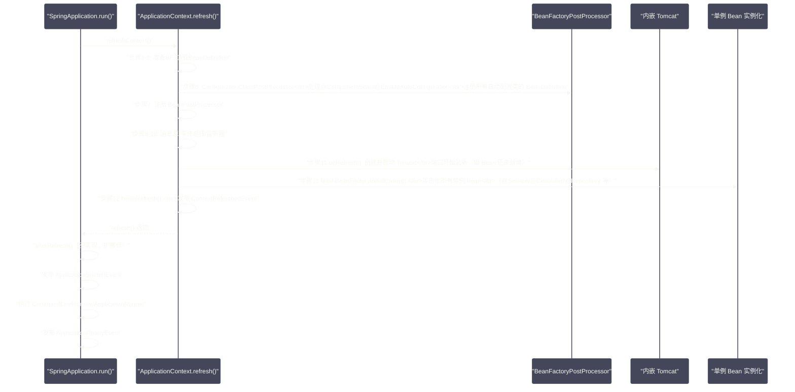

# 启动流程——从main方法到ApplicationContext就绪

## 摘要

`SpringApplication.run(App.class, args)` 这一行代码背后，隐藏着 Spring Boot 最精密的工程设计。从 `main` 方法被 JVM 调用，到 `ApplicationContext` 完全就绪、应用可以接收 HTTP 请求，整个过程涉及：应用类型推断、`SpringApplicationRunListener` 监听器链、`Environment` 准备与 Banner 打印、`ApplicationContext` 的创建与刷新、内嵌 Web 容器的启动，以及 `CommandLineRunner`/`ApplicationRunner` 的执行。本文以 `SpringApplication.run()` 的源码骨架为主线，逐步拆解每个关键阶段的核心逻辑，重点澄清两个常被混淆的时机：`ApplicationContext.refresh()` 与 Spring Boot 的 `ApplicationReadyEvent` 之间究竟发生了什么，以及内嵌 Tomcat 是在 `refresh()` 期间还是之后启动的。

---

## 第 1 章 SpringApplication 的初始化：run() 之前

### 1.1 一切从 @SpringBootApplication 开始

一个标准的 Spring Boot 应用入口类：

```java
@SpringBootApplication
public class OrderServiceApp {
    public static void main(String[] args) {
        SpringApplication.run(OrderServiceApp.class, args);
    }
}
```

`@SpringBootApplication` 是一个组合注解，等价于同时标注了三个注解：

```java
@SpringBootConfiguration      // 等同于 @Configuration
@EnableAutoConfiguration      // 开启自动装配（Spring Boot 的核心魔法）
@ComponentScan                // 扫描当前包及子包下的组件
public @interface SpringBootApplication { ... }
```

但这里有一个关键的时序问题：`@ComponentScan` 和 `@EnableAutoConfiguration` 的处理，发生在 `ApplicationContext.refresh()` 的 `invokeBeanFactoryPostProcessors()` 步骤中——这是容器刷新阶段的事情。在此之前，`SpringApplication.run()` 还有很多准备工作要做。

### 1.2 SpringApplication 构造器：应用类型推断

`SpringApplication.run(primarySources, args)` 的第一步是创建 `SpringApplication` 实例：

```java
public static ConfigurableApplicationContext run(Class<?>[] primarySources, String[] args) {
    return new SpringApplication(primarySources).run(args);
}
```

`SpringApplication` 构造器在 `run()` 调用前完成若干关键的初始化：

```java
public SpringApplication(ResourceLoader resourceLoader, Class<?>... primarySources) {
    this.resourceLoader = resourceLoader;
    this.primarySources = new LinkedHashSet<>(Arrays.asList(primarySources));
    
    // ===== 关键步骤 1：推断 Web 应用类型 =====
    // 扫描类路径，判断应用是 NONE / SERVLET / REACTIVE
    this.webApplicationType = WebApplicationType.deduceFromClasspath();
    
    // ===== 关键步骤 2：加载 BootstrapRegistryInitializer =====
    // 从 META-INF/spring.factories 加载 BootstrapRegistryInitializer 实现
    this.bootstrapRegistryInitializers = new ArrayList<>(
        getSpringFactoriesInstances(BootstrapRegistryInitializer.class));
    
    // ===== 关键步骤 3：加载 ApplicationContextInitializer =====
    // 这些 Initializer 在 ApplicationContext 创建后、refresh() 之前执行
    setInitializers((Collection) getSpringFactoriesInstances(ApplicationContextInitializer.class));
    
    // ===== 关键步骤 4：加载 ApplicationListener =====
    // 注册监听器（包括来自 META-INF/spring.factories 的自动配置监听器）
    setListeners((Collection) getSpringFactoriesInstances(ApplicationListener.class));
    
    // ===== 关键步骤 5：推断主类（main 方法所在类）=====
    this.mainApplicationClass = deduceMainApplicationClass();
}
```

**Web 应用类型推断**（`WebApplicationType.deduceFromClasspath()`）：

```java
static WebApplicationType deduceFromClasspath() {
    // 类路径上有 DispatcherHandler 且无 DispatcherServlet → 响应式 Web（WebFlux）
    if (ClassUtils.isPresent(WEBFLUX_INDICATOR_CLASS, null)
            && !ClassUtils.isPresent(WEBMVC_INDICATOR_CLASS, null)
            && !ClassUtils.isPresent(JERSEY_INDICATOR_CLASS, null)) {
        return WebApplicationType.REACTIVE;
    }
    // 类路径上无任何 Web 相关类 → 非 Web 应用（纯 Spring 应用）
    for (String className : SERVLET_INDICATOR_CLASSES) {
        if (!ClassUtils.isPresent(className, null)) {
            return WebApplicationType.NONE;
        }
    }
    // 默认：Servlet Web 应用（Spring MVC）
    return WebApplicationType.SERVLET;
}
```

这个推断决定了后续创建哪种 `ApplicationContext`：
- `NONE` → `AnnotationConfigApplicationContext`（标准 Spring 容器）；
- `SERVLET` → `AnnotationConfigServletWebServerApplicationContext`（支持内嵌 Servlet 容器）；
- `REACTIVE` → `AnnotationConfigReactiveWebServerApplicationContext`（支持内嵌响应式容器）。

### 1.3 SpringFactoriesLoader：Spring Boot 的服务发现机制

构造器中多次调用的 `getSpringFactoriesInstances()` 是理解 Spring Boot 的关键：

```java
private <T> Collection<T> getSpringFactoriesInstances(Class<T> type) {
    return getSpringFactoriesInstances(type, new Class<?>[] {});
}

private <T> Collection<T> getSpringFactoriesInstances(Class<T> type, Class<?>[] parameterTypes, 
        Object... args) {
    ClassLoader classLoader = getClassLoader();
    // 从所有 META-INF/spring.factories 文件中，找出 type 对应的实现类名列表
    Set<String> names = new LinkedHashSet<>(
        SpringFactoriesLoader.loadFactoryNames(type, classLoader));
    // 实例化这些类
    List<T> instances = createSpringFactoriesInstances(type, parameterTypes, classLoader, args, names);
    // 按 @Order/@Priority 排序
    AnnotationAwareOrderComparator.sort(instances);
    return instances;
}
```

`SpringFactoriesLoader.loadFactoryNames()` 扫描类路径上所有 jar 包中的 `META-INF/spring.factories` 文件，这是 Spring Boot 2.x 的核心服务发现机制。Spring Boot 3.x 将自动配置类的注册迁移到了 `META-INF/spring/org.springframework.boot.autoconfigure.AutoConfiguration.imports`，但 `spring.factories` 机制仍然保留用于其他组件的注册。

---

## 第 2 章 run() 方法：启动的十个阶段

`SpringApplication.run()` 是整个启动流程的核心骨架，可以分为十个明确的阶段：

```java
public ConfigurableApplicationContext run(String... args) {
    // ===== 阶段 0：启动计时 =====
    long startTime = System.nanoTime();
    DefaultBootstrapContext bootstrapContext = createBootstrapContext();
    ConfigurableApplicationContext context = null;
    
    configureHeadlessProperty(); // 设置 AWT headless 模式
    
    // ===== 阶段 1：加载并启动 SpringApplicationRunListeners =====
    SpringApplicationRunListeners listeners = getRunListeners(args);
    listeners.starting(bootstrapContext, this.mainApplicationClass);
    
    try {
        ApplicationArguments applicationArguments = new DefaultApplicationArguments(args);
        
        // ===== 阶段 2：准备 Environment =====
        ConfigurableEnvironment environment = prepareEnvironment(listeners, 
            bootstrapContext, applicationArguments);
        
        // ===== 阶段 3：打印 Banner =====
        Banner printedBanner = printBanner(environment);
        
        // ===== 阶段 4：创建 ApplicationContext =====
        context = createApplicationContext();
        context.setApplicationStartup(this.applicationStartup);
        
        // ===== 阶段 5：准备 ApplicationContext（刷新前） =====
        prepareContext(bootstrapContext, context, environment, listeners, 
            applicationArguments, printedBanner);
        
        // ===== 阶段 6：刷新 ApplicationContext（核心！）=====
        refreshContext(context);
        
        // ===== 阶段 7：刷新后处理（扩展点）=====
        afterRefresh(context, applicationArguments);
        
        // ===== 阶段 8：计算启动耗时，发布 Started 事件 =====
        Duration timeTakenToStartup = Duration.ofNanos(System.nanoTime() - startTime);
        if (this.logStartupInfo) {
            new StartupInfoLogger(this.mainApplicationClass).logStarted(
                getApplicationLog(), timeTakenToStartup);
        }
        listeners.started(context, timeTakenToStartup);
        
        // ===== 阶段 9：执行 CommandLineRunner 和 ApplicationRunner =====
        callRunners(context, applicationArguments);
        
    } catch (Throwable ex) {
        // 处理启动失败：发布 Failed 事件
        handleRunFailure(context, ex, listeners);
        throw new IllegalStateException(ex);
    }
    
    try {
        // ===== 阶段 10：发布 Ready 事件 =====
        Duration timeTakenToReady = Duration.ofNanos(System.nanoTime() - startTime);
        listeners.ready(context, timeTakenToReady);
    } catch (Throwable ex) {
        handleRunFailure(context, ex, null);
        throw new IllegalStateException(ex);
    }
    
    return context;
}
```

---

## 第 3 章 SpringApplicationRunListener：启动过程的观测者

### 3.1 什么是 SpringApplicationRunListener

`SpringApplicationRunListener` 是 Spring Boot 启动生命周期的监听器接口，它的方法对应 `run()` 的各个关键节点：

```java
public interface SpringApplicationRunListener {
    
    // run() 刚开始，Environment 和 ApplicationContext 都还未创建
    default void starting(ConfigurableBootstrapContext bootstrapContext) {}
    
    // Environment 准备好，ApplicationContext 还未创建
    default void environmentPrepared(ConfigurableBootstrapContext bootstrapContext,
            ConfigurableEnvironment environment) {}
    
    // ApplicationContext 已创建，refresh() 还未调用
    default void contextPrepared(ConfigurableApplicationContext context) {}
    
    // ApplicationContext 已加载（prepareContext 完成），refresh() 还未调用
    default void contextLoaded(ConfigurableApplicationContext context) {}
    
    // ApplicationContext 已 refresh()（包括内嵌 Web 容器已启动）
    // 但 CommandLineRunner/ApplicationRunner 还未执行
    default void started(ConfigurableApplicationContext context, Duration timeTaken) {}
    
    // 所有 Runner 都已执行，应用完全就绪
    default void ready(ConfigurableApplicationContext context, Duration timeTaken) {}
    
    // 启动失败
    default void failed(ConfigurableApplicationContext context, Throwable exception) {}
}
```

默认实现 `EventPublishingRunListener` 将每个监听器方法转化为对应的 Spring 应用事件：

| 监听器方法 | 发布的 Spring 事件 |
| --- | --- |
| `starting()` | `ApplicationStartingEvent` |
| `environmentPrepared()` | `ApplicationEnvironmentPreparedEvent` |
| `contextPrepared()` | `ApplicationContextInitializedEvent` |
| `contextLoaded()` | `ApplicationPreparedEvent` |
| `started()` | `ApplicationStartedEvent` |
| `ready()` | `ApplicationReadyEvent` |
| `failed()` | `ApplicationFailedEvent` |

这些事件的发布时机非常重要——很多 Spring Boot 内置的自动配置都通过监听这些事件来执行初始化逻辑。

> [!info] ApplicationStartingEvent 的特殊性
> `ApplicationStartingEvent` 在 `ApplicationContext` 甚至 `Environment` 创建之前就发布了，此时容器还没有任何 Bean。因此，监听 `ApplicationStartingEvent` 的监听器不能依赖任何 Spring 容器管理的 Bean，只能是在 `META-INF/spring.factories` 中注册的纯 Java 类。

---

## 第 4 章 Environment 的准备：prepareEnvironment()

### 4.1 Environment 的创建

```java
private ConfigurableEnvironment prepareEnvironment(SpringApplicationRunListeners listeners,
        DefaultBootstrapContext bootstrapContext, ApplicationArguments applicationArguments) {
    
    // 根据 webApplicationType 创建对应的 Environment 子类
    // SERVLET → StandardServletEnvironment（包含 ServletContext/ServletConfig 属性来源）
    // REACTIVE → StandardReactiveWebEnvironment
    // NONE → StandardEnvironment
    ConfigurableEnvironment environment = getOrCreateEnvironment();
    
    // 将命令行参数添加到 Environment 的 PropertySources（最高优先级）
    configureEnvironment(environment, applicationArguments.getSourceArgs());
    
    // 将 ConfigurationPropertySources 包装层加到 PropertySources 最前面
    // 这是 Relaxed Binding 的基础
    ConfigurationPropertySources.attach(environment);
    
    // 通知监听器：Environment 准备好了（发布 ApplicationEnvironmentPreparedEvent）
    // 这触发了 ConfigFileApplicationListener（Spring Boot 2.x）或
    // ConfigDataEnvironmentPostProcessor（Spring Boot 2.4+）加载 application.yml
    listeners.environmentPrepared(bootstrapContext, environment);
    
    // 将默认属性来源移到 PropertySources 末尾（最低优先级）
    DefaultPropertiesPropertySource.moveToEnd(environment);
    
    // 绑定 spring.main.* 属性到 SpringApplication 对象自身
    // （如 spring.main.allow-circular-references 等配置）
    bindToSpringApplication(environment);
    
    // 如果不是自定义 Environment，进行类型转换
    if (!this.isCustomEnvironment) {
        EnvironmentConverter environmentConverter = new EnvironmentConverter(getClassLoader());
        environment = environmentConverter.convertEnvironmentIfNecessary(
            environment, deduceEnvironmentClass());
    }
    
    ConfigurationPropertySources.attach(environment);
    return environment;
}
```

### 4.2 application.yml 的加载时机

`application.yml`（或 `.properties`）文件的加载是在 `listeners.environmentPrepared()` 中触发的——具体是由 `ApplicationEnvironmentPreparedEvent` 的监听器 `ConfigDataEnvironmentPostProcessor`（Spring Boot 2.4+）处理的。

这个加载时机很关键：**在 `ApplicationContext` 创建之前，`application.yml` 就已经加载到 `Environment` 中**。这意味着 `spring.main.*` 等影响容器创建行为的配置，在容器创建时就已经生效了。

`ConfigDataEnvironmentPostProcessor` 内部通过 `ConfigDataLoader`（SPI 机制）支持多种配置来源：
- 类路径上的 `application.yml`/`application.properties`；
- 文件系统上的配置文件；
- 通过 `spring.config.import` 引入的远程配置（如 Consul、Vault）。

### 4.3 Profile 激活时机

`spring.profiles.active` 属性（指定激活的 Profile）的读取，也发生在 `prepareEnvironment()` 阶段。一旦 Profile 确定，`application-{profile}.yml` 就会被加载并合并到 `Environment`，Profile 特定的配置会覆盖通用配置。

---

## 第 5 章 ApplicationContext 的创建与准备

### 5.1 createApplicationContext()：根据类型选择实现

```java
protected ConfigurableApplicationContext createApplicationContext() {
    return this.applicationContextFactory.create(this.webApplicationType);
}
```

`ApplicationContextFactory.DEFAULT` 的实现：

```java
ApplicationContextFactory DEFAULT = (webApplicationType) -> {
    try {
        return switch (webApplicationType) {
            case SERVLET -> new AnnotationConfigServletWebServerApplicationContext();
            case REACTIVE -> new AnnotationConfigReactiveWebServerApplicationContext();
            default -> new AnnotationConfigApplicationContext();
        };
    } catch (Exception ex) {
        throw new IllegalStateException("...", ex);
    }
};
```

`AnnotationConfigServletWebServerApplicationContext` 是 Servlet Web 应用的默认容器，它在标准 `AnnotationConfigApplicationContext` 的基础上，增加了对 `ServletWebServerFactory`（如 `TomcatServletWebServerFactory`）的支持，内嵌 Tomcat 就是在这里启动的。

### 5.2 prepareContext()：刷新前的最后准备

```java
private void prepareContext(DefaultBootstrapContext bootstrapContext,
        ConfigurableApplicationContext context,
        ConfigurableEnvironment environment,
        SpringApplicationRunListeners listeners,
        ApplicationArguments applicationArguments,
        Banner printedBanner) {
    
    // 1. 将 Environment 设置到 ApplicationContext
    context.setEnvironment(environment);
    
    // 2. 后处理 ApplicationContext（注册 BeanNameGenerator、ResourceLoader 等）
    postProcessApplicationContext(context);
    
    // 3. 执行所有 ApplicationContextInitializer
    // 这些 Initializer 在构造器中从 spring.factories 加载
    // 典型实现：ConfigurationWarningsApplicationContextInitializer（循环依赖警告）
    //           SharedMetadataReaderFactoryContextInitializer（共享元数据读取器）
    applyInitializers(context);
    
    // 4. 通知监听器：ApplicationContext 准备好了
    listeners.contextPrepared(context);
    
    // 5. 关闭 BootstrapContext（Bootstrap 阶段结束）
    bootstrapContext.close(context);
    
    // 6. 注册特殊的 Singleton Bean：springApplicationArguments, springBootBanner
    ConfigurableListableBeanFactory beanFactory = context.getBeanFactory();
    beanFactory.registerSingleton("springApplicationArguments", applicationArguments);
    if (printedBanner != null) {
        beanFactory.registerSingleton("springBootBanner", printedBanner);
    }
    
    // 7. 是否允许 BeanDefinition 覆盖（默认 false，防止意外覆盖）
    if (beanFactory instanceof AbstractAutowireCapableBeanFactory aacbf) {
        aacbf.setAllowCircularReferences(this.allowCircularReferences);
        if (beanFactory instanceof DefaultListableBeanFactory dlbf) {
            dlbf.setAllowBeanDefinitionOverriding(this.allowBeanDefinitionOverriding);
        }
    }
    
    // 8. 加载主配置源（primarySources，即 @SpringBootApplication 标注的类）
    // 此步骤将主类作为 BeanDefinition 注册到容器，但还未触发 @ComponentScan
    Set<Object> sources = getAllSources();
    load(context, sources.toArray(new Object[0]));
    
    // 9. 通知监听器：ApplicationContext 已加载（发布 ApplicationPreparedEvent）
    listeners.contextLoaded(context);
}
```

**`ApplicationContextInitializer` 的角色**：这些 Initializer 是 Spring Boot 可扩展性的重要入口之一。在 `applyInitializers()` 执行时，`ApplicationContext` 已经创建但尚未 `refresh()`，可以在这里做一些全局性的容器配置（如注册特殊的 `BeanFactoryPostProcessor`、设置 `BeanNameGenerator`）。Spring Cloud 大量使用了这个机制。

---

## 第 6 章 refreshContext()：最核心的十二步

`refreshContext(context)` 本质上就是调用 `AbstractApplicationContext.refresh()`——这是 Spring Framework 的核心，SpringCore 专栏已经深入分析过。但在 Spring Boot 的 Web 应用场景下，有几个关键的细节需要补充。

### 6.1 内嵌 Tomcat 是什么时候启动的？

这是面试高频问题，也是很多人理解模糊的地方。答案是：**内嵌 Tomcat 在 `refresh()` 的步骤 11（`onRefresh()`）中启动**，而非在 `refresh()` 完成后。

具体链路：

```
AbstractApplicationContext.refresh()
  └── onRefresh()
        └── ServletWebServerApplicationContext.onRefresh()
              └── createWebServer()
                    └── getWebServerFactory()
                    └── webServerFactory.getWebServer(...)  ← 创建 Tomcat 实例
                    └── webServer.start()  ← 启动 Tomcat（开始监听端口）
```

```java
// ServletWebServerApplicationContext#onRefresh()
@Override
protected void onRefresh() {
    super.onRefresh();
    try {
        createWebServer();
    } catch (Throwable ex) {
        throw new ApplicationContextException("Unable to start web server", ex);
    }
}

private void createWebServer() {
    WebServer webServer = this.webServer;
    ServletContext servletContext = getServletContext();
    
    if (webServer == null && servletContext == null) {
        StartupStep createWebServerStep = getApplicationStartup()
            .start("spring.boot.webserver.create");
        
        // 从容器中获取 WebServerFactory（如 TomcatServletWebServerFactory）
        // 这个 Factory Bean 是由自动配置（ServletWebServerFactoryAutoConfiguration）注册的
        ServletWebServerFactory factory = getWebServerFactory();
        
        // 创建并启动 Web Server
        // getSelfInitializer() 返回 DispatcherServlet 的注册逻辑
        this.webServer = factory.getWebServer(getSelfInitializer());
        
        // 注册关闭钩子
        createWebServerStep.end();
    } else if (servletContext != null) {
        // 外部 Servlet 容器（WAR 部署）场景
        try {
            getSelfInitializer().onStartup(servletContext);
        } catch (ServletException ex) { ... }
    }
    
    // 将 server.port 等 Web 服务器属性注册到 Environment
    initPropertySources();
}
```

**重要细节**：`onRefresh()` 在步骤 11，而 `preInstantiateSingletons()`（步骤 11 的一部分，实例化所有单例 Bean）发生在 `onRefresh()` 之后的 `finishBeanFactoryInitialization()` 步骤中。这意味着：**Tomcat 启动时，Spring 容器中的大多数 Bean（包括 `@Service`、`@Repository`、`@Controller`）还未被初始化！**

但 Tomcat 不立即接受请求——它只是启动了监听端口的监听器。真正开始处理请求，需要等到 `DispatcherServlet` 完成初始化。`DispatcherServlet` 是在 `getSelfInitializer()` 中注册到 Tomcat 的，而其初始化（包括 `HandlerMapping`、`HandlerAdapter` 的装配）是在第一次请求到来时（懒初始化）或 `refresh()` 完成后触发的。

> [!info] 为什么 onRefresh() 早于 preInstantiateSingletons()？
> 设计上，`onRefresh()` 是给 Web 容器早期启动基础设施（Tomcat）提供的钩子。Web 容器需要在 Bean 全部就绪之前就准备好端口监听，但此时接受的请求会被 Tomcat 的队列缓冲，等待 Spring 容器就绪后再处理。这个设计允许 Spring Boot 应用在启动期间有一定的"预热"时间，而不是等全部 Bean 就绪后才开放端口（那样会让服务发现以为服务不可用）。

### 6.2 refresh() 期间的完整时序



---

## 第 7 章 afterRefresh() 与 Runners：最后的启动逻辑

### 7.1 afterRefresh()：空的扩展点

```java
protected void afterRefresh(ConfigurableApplicationContext context, 
        ApplicationArguments args) {
    // 默认空实现，子类可以覆盖
}
```

这是 `SpringApplication` 提供的一个扩展点，但很少有人直接继承 `SpringApplication` 来覆盖它。更常见的方式是监听 `ApplicationStartedEvent` 或实现 `CommandLineRunner`。

### 7.2 callRunners()：应用启动完成后的最后动作

```java
private void callRunners(ApplicationContext context, ApplicationArguments args) {
    List<Object> runners = new ArrayList<>();
    
    // 从容器中获取所有 ApplicationRunner Bean
    runners.addAll(context.getBeansOfType(ApplicationRunner.class).values());
    
    // 从容器中获取所有 CommandLineRunner Bean
    runners.addAll(context.getBeansOfType(CommandLineRunner.class).values());
    
    // 按 @Order 排序后依次执行
    AnnotationAwareOrderComparator.sort(runners);
    for (Object runner : new LinkedHashSet<>(runners)) {
        if (runner instanceof ApplicationRunner ar) {
            callRunner(ar, args);
        }
        if (runner instanceof CommandLineRunner clr) {
            callRunner(clr, args);
        }
    }
}
```

`CommandLineRunner` 和 `ApplicationRunner` 的区别：

| 接口 | 方法签名 | args 类型 | 适用场景 |
| --- | --- | --- | --- |
| `CommandLineRunner` | `run(String... args)` | 原始命令行字符串数组 | 简单场景，直接处理字符串参数 |
| `ApplicationRunner` | `run(ApplicationArguments args)` | 解析后的 `ApplicationArguments` | 需要区分选项参数（`--key=value`）和非选项参数 |

`ApplicationArguments` 提供了更丰富的参数访问能力：

```java
@Component
public class MyRunner implements ApplicationRunner {
    
    @Override
    public void run(ApplicationArguments args) throws Exception {
        // 获取所有原始参数
        String[] sourceArgs = args.getSourceArgs();
        
        // 获取非选项参数（不以 -- 开头的参数）
        List<String> nonOptionArgs = args.getNonOptionArgs();
        
        // 获取选项参数（--key=value 形式）的所有 key
        Set<String> optionNames = args.getOptionNames();
        
        // 获取特定选项的值
        List<String> profiles = args.getOptionValues("spring.profiles.active");
        
        boolean hasDebug = args.containsOption("debug");
    }
}
```

**Runners 的典型使用场景**：
1. **数据预加载**：应用启动后，将频繁访问的参照数据从数据库加载到本地缓存；
2. **服务注册**：应用就绪后，向 Nacos/Consul 等服务注册中心注册服务实例（比 `@PostConstruct` 更晚，确保所有 Bean 都已初始化）；
3. **健康检查预热**：发起一次"空转"请求，触发 JIT 编译，减少第一个真实请求的延迟；
4. **消息消费者启动**：在所有依赖 Bean 就绪后，才启动 Kafka/RabbitMQ 消费者，避免消费到消息但依赖的处理器还未就绪。

---

## 第 8 章 启动事件的完整时间轴

理解 Spring Boot 启动过程中各个事件的精确时机，对于编写正确的启动逻辑至关重要：

```
JVM 启动 main 方法
  │
  ├── SpringApplication 构造器
  │     ├── 加载 ApplicationContextInitializer
  │     └── 加载 ApplicationListener（spring.factories）
  │
  ├── SpringApplication.run()
  │     │
  │     ├── 📢 ApplicationStartingEvent
  │     │     （此时无 Environment，无 ApplicationContext）
  │     │
  │     ├── prepareEnvironment()
  │     │     ├── 创建 Environment
  │     │     ├── 加载命令行参数
  │     │     └── 📢 ApplicationEnvironmentPreparedEvent
  │     │           └── ConfigDataEnvironmentPostProcessor 加载 application.yml
  │     │
  │     ├── createApplicationContext()
  │     │     └── new AnnotationConfigServletWebServerApplicationContext()
  │     │
  │     ├── prepareContext()
  │     │     ├── 执行 ApplicationContextInitializer
  │     │     ├── 📢 ApplicationContextInitializedEvent
  │     │     ├── 注册主配置类（@SpringBootApplication）
  │     │     └── 📢 ApplicationPreparedEvent
  │     │
  │     ├── refreshContext()  ←──── AbstractApplicationContext.refresh()
  │     │     ├── 步骤 6: ConfigurationClassPostProcessor 扫描组件、处理自动配置
  │     │     ├── 步骤 11a: onRefresh() → 内嵌 Tomcat 启动，端口开始监听
  │     │     ├── 步骤 11b: preInstantiateSingletons() → 所有单例 Bean 就绪
  │     │     └── 步骤 12: 📢 ContextRefreshedEvent
  │     │
  │     ├── afterRefresh()（空扩展点）
  │     │
  │     ├── 📢 ApplicationStartedEvent
  │     │     （refresh 已完成，Runners 还未执行）
  │     │
  │     ├── callRunners()
  │     │     ├── ApplicationRunner.run()
  │     │     └── CommandLineRunner.run()
  │     │
  │     └── 📢 ApplicationReadyEvent
  │           （应用完全就绪，可以接受流量）
  │
  └── main 方法返回（Spring Boot 应用持续运行，主线程阻塞在 Tomcat 的服务循环中）
```

---

## 第 9 章 启动性能优化

### 9.1 延迟初始化（Lazy Initialization）

Spring Boot 2.2 引入了全局懒加载配置：

```yaml
spring:
  main:
    lazy-initialization: true
```

启用后，所有单例 Bean 都变为懒加载——不在启动时初始化，而是在第一次被请求时才初始化。这可以**显著缩短启动时间**（典型场景下减少 30-50%），但代价是：
1. 第一次请求某个功能时，会有额外的初始化延迟；
2. 配置错误（如 `@Autowired` 找不到 Bean）在启动时不会暴露，而是在第一次使用时才报错；
3. 某些 Bean 必须在启动时初始化（如 `CommandLineRunner`），不适合懒加载。

可以通过 `@Lazy(false)` 对特定 Bean 强制提前初始化。

### 9.2 启动时间分析：Spring Boot Actuator

Spring Boot Actuator 提供了启动时间分析的可视化工具（`/actuator/startup` 端点），基于 `ApplicationStartup` 的步骤记录：

```java
@SpringBootApplication
public class App {
    public static void main(String[] args) {
        SpringApplication app = new SpringApplication(App.class);
        // 使用 BufferingApplicationStartup 记录所有启动步骤
        app.setApplicationStartup(new BufferingApplicationStartup(2048));
        app.run(args);
    }
}
```

通过 `/actuator/startup` 可以看到每个 Bean 的初始化耗时，定位启动缓慢的组件。

### 9.3 AOT 预处理（Spring Boot 3.x）

Spring Boot 3.x 引入了 AOT（Ahead-of-Time）处理机制：在编译时而非运行时执行 Bean 解析和代理生成，将大量运行时工作提前到编译期。这是 GraalVM Native Image 支持的基础，也能显著减少 JVM 模式下的启动时间（因为大量的反射解析和代理生成在编译时已完成，运行时直接使用预生成的结果）。AOT 与 Native Image 将在 SpringBoot 专栏第 10 篇详细讨论。

---

## 第 10 章 常见启动问题排查

### 10.1 启动卡死在 Tomcat 启动阶段

症状：日志停在 `Tomcat started on port(s): 8080 (http)` 后不再输出，但实际上容器还在运行。

通常这不是"卡死"，而是 `preInstantiateSingletons()` 正在执行，初始化某个耗时很长的 Bean（如建立了慢速的数据库连接、进行了大量 IO 操作）。

排查方法：
1. 启用 DEBUG 级别日志（`logging.level.org.springframework=DEBUG`），观察最后初始化的 Bean；
2. 使用 Java Flight Recorder 或 Async Profiler 捕获启动期间的线程堆栈；
3. 检查是否有 Bean 在 `@PostConstruct` 中进行了阻塞操作（网络请求、大量数据加载）。

### 10.2 端口已被占用

```
org.apache.catalina.LifecycleException: Failed to start component 
[Connector[HTTP/1.1-8080]]
Caused by: java.net.BindException: Address already in use
```

修改端口：`server.port=8081`，或设置 `server.port=0` 让 Spring Boot 随机选择可用端口（测试场景常用）。

### 10.3 Bean 初始化顺序问题

如果 `CommandLineRunner` 中访问某个 Bean 时，该 Bean 依赖的资源尚未就绪（如外部配置未加载），排查方向：
1. 确认 `CommandLineRunner` 自身的 `@Order` 值；
2. 考虑是否应该用 `@TransactionalEventListener(phase = AFTER_COMMIT)` 代替 `CommandLineRunner`；
3. 检查 `@PostConstruct` 和 `CommandLineRunner` 的使用边界——`@PostConstruct` 在 Bean 初始化时执行，不保证所有其他 Bean 都已就绪；`CommandLineRunner` 在 `refresh()` 完全完成后执行，所有 Bean 已就绪。

---

## 总结

本文完整追踪了 Spring Boot 应用从 `main()` 方法到 `ApplicationReadyEvent` 的全链路：

- **SpringApplication 构造**：推断 Web 类型（NONE/SERVLET/REACTIVE），从 `spring.factories` 加载监听器和 Initializer；
- **run() 十个阶段**：`SpringApplicationRunListeners` 发布生命周期事件 → `Environment` 准备（加载 `application.yml`）→ 打印 Banner → 创建 `ApplicationContext` → `prepareContext()`（执行 Initializer、注册主配置类）→ `refreshContext()`（核心）→ `afterRefresh()` → `ApplicationStartedEvent` → `callRunners()` → `ApplicationReadyEvent`；
- **内嵌 Tomcat 启动时机**：在 `refresh()` 的 `onRefresh()` 步骤（步骤 11 前半段）启动，早于单例 Bean 实例化，但 Bean 就绪前不处理真实请求；
- **启动事件语义**：`ContextRefreshedEvent`（容器刷新完成）→ `ApplicationStartedEvent`（Runners 执行前）→ `ApplicationReadyEvent`（Runners 执行后，应用完全就绪）；
- **性能优化**：懒加载减少启动时间，AOT 预处理将运行时工作提前到编译期，Actuator 的 `/actuator/startup` 提供逐步骤耗时分析。

下一篇，我们深入 Spring Boot 最核心的特性——自动装配机制：[[02 自动装配原理——@EnableAutoConfiguration与spring.factories]]。

---

> [!note] 参考资料
> - `org.springframework.boot.SpringApplication` 源码
> - `org.springframework.boot.web.servlet.context.ServletWebServerApplicationContext` 源码
> - `org.springframework.boot.context.event.EventPublishingRunListener` 源码
> - [Spring Boot 官方文档 - Application Events and Listeners](https://docs.spring.io/spring-boot/docs/current/reference/html/features.html#features.application-events-and-listeners)

---

> [!note] 思考题
> 1. Spring Boot 的自动装配通过 `@EnableAutoConfiguration` 触发，底层使用 `SpringFactoriesLoader` 加载 `META-INF/spring.factories` 中的配置类。Spring Boot 2.7+ 引入了 `META-INF/spring/org.springframework.boot.autoconfigure.AutoConfiguration.imports` 替代 `spring.factories`。这个变更的动机是什么？新机制在性能和可维护性方面有什么改进？
> 2. 自动装配的条件注解（如 `@ConditionalOnClass`、`@ConditionalOnMissingBean`）决定了配置类是否生效。如果你自定义了一个 `DataSource` Bean，Spring Boot 的 `DataSourceAutoConfiguration` 会自动退让（因为 `@ConditionalOnMissingBean(DataSource.class)`）。但如果你的自定义 Bean 的初始化依赖了自动装配的其他 Bean，初始化顺序会出问题吗？
> 3. `@AutoConfigureBefore` 和 `@AutoConfigureAfter` 控制自动装配类之间的顺序，但它们不能控制自动装配类与用户定义的 `@Configuration` 类之间的顺序。在什么场景下，用户配置和自动装配之间的顺序会导致问题？你如何调试 Spring Boot 的自动装配加载顺序？
