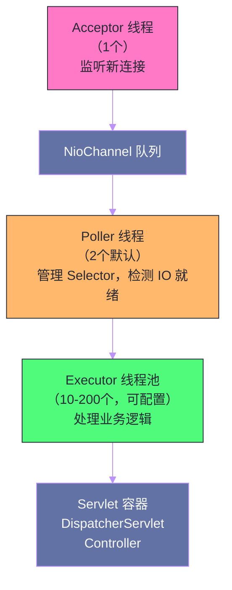
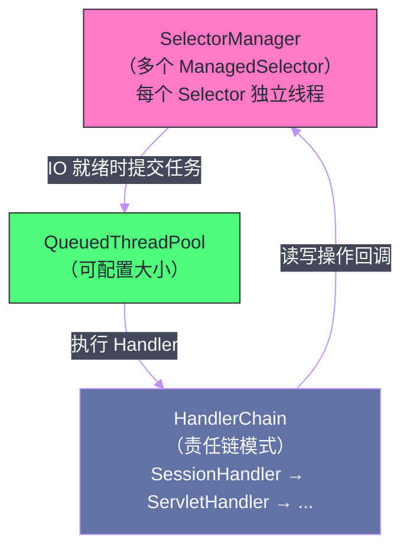

# 嵌入式Web容器——Tomcat、Jetty、Undertow的启动与配置

## 摘要

Spring Boot 将 Web 服务器从"部署目标"变成了"应用依赖"——内嵌的 Tomcat、Jetty 或 Undertow 直接打包进 Fat JAR，通过 `java -jar` 即可启动一个完整的 Web 应用，无需预先安装应用服务器。这个看似简单的"翻转"，背后是一套精心设计的抽象层：`WebServer` 接口、`ServletWebServerFactory` 工厂、`WebServerFactoryCustomizer` 定制器，以及与 Spring 容器生命周期紧密集成的启动时序。本文深入剖析内嵌 Web 容器从 `onRefresh()` 到第一个 HTTP 请求被处理的完整链路，重点对比 Tomcat、Jetty、Undertow 三者在架构设计、并发模型和适用场景上的本质差异，并系统梳理生产级别的性能调优配置。

---

## 第 1 章 从外置容器到内嵌容器：一次架构思维的翻转

### 1.1 传统部署模式的困境

在 Spring Boot 出现之前，Java Web 应用的部署流程是固定的：
1. 安装并配置 Tomcat/JBoss/WebLogic 等应用服务器；
2. 将应用打包成 WAR 文件（Web Application Archive）；
3. 将 WAR 部署到应用服务器的 `webapps` 目录；
4. 启动应用服务器，由服务器管理 Servlet 容器的生命周期；
5. 应用与服务器版本兼容性需要手动维护。

这种模式在大型企业项目（特别是多应用共享一台服务器的场景）中合理，但在微服务时代暴露了严重问题：
- **环境一致性差**：开发机、测试服务器、生产服务器上的 Tomcat 版本可能不同，导致"在我机器上能跑"的经典问题；
- **部署复杂**：CI/CD 流水线需要先准备好目标服务器，再推送 WAR 文件，步骤多且脆弱；
- **配置割裂**：应用配置（`application.properties`）与服务器配置（`server.xml`、`context.xml`）分属不同文件，分散在不同位置；
- **容器化困难**：Docker 镜像的理想形态是"一个进程一个容器"，但传统模式下容器中既有 Tomcat 进程又有 JVM 进程，概念上不够清晰。

### 1.2 内嵌容器的设计思想

Spring Boot 将 Web 服务器作为**应用的一个普通依赖**来对待，而非应用运行的"宿主环境"。`spring-boot-starter-web` 依赖中包含了 `spring-boot-starter-tomcat`，后者依赖了 `tomcat-embed-core`——Tomcat 的可嵌入版本，它是一个普通的 Java 库，可以像任何其他 JAR 一样被加载和初始化。

```
spring-boot-starter-web
  └── spring-boot-starter-tomcat
        ├── tomcat-embed-core      ← Tomcat 的核心引擎（嵌入式版本）
        ├── tomcat-embed-el        ← EL 表达式支持
        └── tomcat-embed-websocket ← WebSocket 支持
```

这种思维翻转带来的工程收益：
- **版本锁定**：Tomcat 版本通过 `pom.xml` 声明，由 Spring Boot BOM 统一管理，与应用代码一起进入版本控制；
- **环境一致性**：Fat JAR 包含了所有依赖（包括 Tomcat），在任何有 JDK 的机器上 `java -jar` 即可运行，行为完全一致；
- **配置统一**：所有配置（包括 Tomcat 的线程池、超时、SSL 等）都通过 `application.yml` 配置，没有外部配置文件；
- **Docker 友好**：`FROM openjdk:17 && COPY app.jar . && ENTRYPOINT ["java", "-jar", "app.jar"]`，三行 Dockerfile 搞定。

---

## 第 2 章 内嵌容器的抽象层设计

### 2.1 WebServer：容器的统一接口

Spring Boot 通过 `WebServer` 接口统一抽象所有 Web 服务器的行为：

```java
public interface WebServer {
    
    // 启动 Web 服务器（开始监听端口）
    void start() throws WebServerException;
    
    // 停止 Web 服务器
    void stop() throws WebServerException;
    
    // 获取实际监听的端口（对于 server.port=0 随机端口，启动后才能获取）
    int getPort();
    
    // 优雅停机：停止接受新请求，等待已有请求处理完毕后停止
    default void shutDownGracefully(GracefulShutdownCallback callback) {
        callback.shutdownComplete(GracefulShutdownResult.IMMEDIATE);
    }
    
    // 是否已关闭
    default boolean isShutdown() {
        return false;
    }
}
```

三个实现类：`TomcatWebServer`、`JettyWebServer`、`UndertowWebServer`，分别包装各自的原生对象（`org.apache.catalina.startup.Tomcat`、`org.eclipse.jetty.server.Server`、`io.undertow.Undertow`）。

### 2.2 ServletWebServerFactory：容器的工厂

`ServletWebServerFactory` 是创建 `WebServer` 实例的工厂：

```java
@FunctionalInterface
public interface ServletWebServerFactory {
    
    // 创建并返回一个新的 WebServer 实例
    // initializers：Servlet 初始化器，用于注册 DispatcherServlet 等
    WebServer getWebServer(ServletContextInitializer... initializers);
}
```

核心实现类：

| 工厂类 | 对应服务器 | 注册条件 |
| --- | --- | --- |
| `TomcatServletWebServerFactory` | Apache Tomcat | 类路径上有 `org.apache.catalina.startup.Tomcat` |
| `JettyServletWebServerFactory` | Eclipse Jetty | 类路径上有 `org.eclipse.jetty.server.Server` |
| `UndertowServletWebServerFactory` | JBoss Undertow | 类路径上有 `io.undertow.Undertow` |

这三个工厂类的注册由 `ServletWebServerFactoryAutoConfiguration` 自动配置：

```java
@AutoConfiguration
@AutoConfigureOrder(Ordered.HIGHEST_PRECEDENCE)
@ConditionalOnClass(ServletRequest.class)
@ConditionalOnWebApplication(type = Type.SERVLET)
@EnableConfigurationProperties(ServerProperties.class)
@Import({ ServletWebServerFactoryAutoConfiguration.BeanPostProcessorsRegistrar.class,
    ServletWebServerFactoryConfiguration.EmbeddedTomcat.class,
    ServletWebServerFactoryConfiguration.EmbeddedJetty.class,
    ServletWebServerFactoryConfiguration.EmbeddedUndertow.class })
public class ServletWebServerFactoryAutoConfiguration {
    ...
}

// 以 EmbeddedTomcat 为例
@Configuration(proxyBeanMethods = false)
@ConditionalOnClass({ Servlet.class, Tomcat.class, UpgradeProtocol.class })
@ConditionalOnMissingBean(value = ServletWebServerFactory.class, 
    search = SearchStrategy.CURRENT)
static class EmbeddedTomcat {
    
    @Bean
    TomcatServletWebServerFactory tomcatServletWebServerFactory(
            ObjectProvider<TomcatConnectorCustomizer> connectorCustomizers,
            ObjectProvider<TomcatContextCustomizer> contextCustomizers,
            ObjectProvider<TomcatProtocolHandlerCustomizer<?>> protocolHandlerCustomizers) {
        TomcatServletWebServerFactory factory = new TomcatServletWebServerFactory();
        factory.getTomcatConnectorCustomizers()
            .addAll(connectorCustomizers.orderedStream().collect(Collectors.toList()));
        factory.getTomcatContextCustomizers()
            .addAll(contextCustomizers.orderedStream().collect(Collectors.toList()));
        factory.getTomcatProtocolHandlerCustomizers()
            .addAll(protocolHandlerCustomizers.orderedStream().collect(Collectors.toList()));
        return factory;
    }
}
```

### 2.3 WebServerFactoryCustomizer：定制器模式

`WebServerFactoryCustomizer<T>` 是一个 SPI 接口，允许对工厂对象进行编程式定制：

```java
@FunctionalInterface
public interface WebServerFactoryCustomizer<T extends WebServerFactory> {
    void customize(T factory);
}
```

Spring Boot 内部大量使用这个接口将 `ServerProperties`（`server.*` 配置）应用到工厂：

```java
// 将 server.* 配置应用到所有 WebServerFactory
public class ServletWebServerFactoryCustomizer 
        implements WebServerFactoryCustomizer<ConfigurableServletWebServerFactory>, Ordered {
    
    private final ServerProperties serverProperties;
    
    @Override
    public void customize(ConfigurableServletWebServerFactory factory) {
        PropertyMapper map = PropertyMapper.get().alwaysApplyingWhenNonNull();
        map.from(this.serverProperties::getPort).to(factory::setPort);
        map.from(this.serverProperties::getAddress).to(factory::setAddress);
        map.from(this.serverProperties.getServlet()::getContextPath).to(factory::setContextPath);
        map.from(this.serverProperties.getServlet()::getApplicationDisplayName)
            .to(factory::setDisplayName);
        map.from(this.serverProperties.getServlet()::isRegisterDefaultServlet)
            .to(factory::setRegisterDefaultServlet);
        map.from(this.serverProperties.getServlet()::getSession).as(Session::getTimeout)
            .to(factory::setSessionTimeout);
        map.from(this.serverProperties::getSsl).to(factory::setSsl);
        map.from(this.serverProperties::getCompression).to(factory::setCompression);
        map.from(this.serverProperties::getHttp2).to(factory::setHttp2);
        ...
    }
}
```

用户也可以通过自定义 `WebServerFactoryCustomizer` Bean 来扩展服务器配置——这比直接修改工厂 Bean 更优雅，因为多个 Customizer 可以共存，不会相互覆盖：

```java
@Component
public class MyTomcatCustomizer 
        implements WebServerFactoryCustomizer<TomcatServletWebServerFactory> {
    
    @Override
    public void customize(TomcatServletWebServerFactory factory) {
        // 添加自定义 Valve（如访问日志、请求过滤等 Tomcat 特有机制）
        factory.addContextValves(new AccessLogValve());
        
        // 配置连接器
        factory.addConnectorCustomizers(connector -> {
            connector.setMaxPostSize(10 * 1024 * 1024); // 最大 POST 请求体 10MB
        });
    }
}
```

---

## 第 3 章 Tomcat：老牌稳定的选择

### 3.1 Tomcat 的架构：NIO 事件循环

Apache Tomcat 是 Spring Boot 的默认嵌入式 Web 容器。现代 Tomcat（8.5+）使用 NIO（Non-blocking I/O）模型处理 HTTP 连接：



**Acceptor 线程**：专门负责 `ServerSocket.accept()`，将新连接注册到 `NioChannel` 队列，不阻塞在业务逻辑上；

**Poller 线程**：维护 Java NIO 的 `Selector`，监控已建立连接上的 IO 事件（数据可读、可写）。当连接上有数据到达时，将其包装成 `SocketProcessor` 提交给 `Executor` 线程池；

**Executor 线程池（Worker 线程）**：执行实际的 HTTP 请求解析和 Servlet 业务逻辑。这是阻塞点——每个请求在 Worker 线程上同步执行，直到响应发送完毕才释放线程。

这种"NIO 接收 + BIO 处理"的混合模型，在连接数远大于并发处理请求数时非常高效（如 HTTP 长连接场景）——用少量 Poller 线程管理大量连接，Worker 线程只在真正有请求处理时才被使用。

### 3.2 Tomcat 核心参数配置

```yaml
server:
  tomcat:
    threads:
      max: 200          # Worker 线程池最大线程数（默认200）
      min-spare: 10     # 最小空闲线程数（默认10）
    accept-count: 100   # 当所有 Worker 线程都忙时，等待队列的最大长度（默认100）
    max-connections: 8192  # 最大连接数（NIO 模式默认8192，基于 Selector）
    connection-timeout: 20000  # 连接超时（毫秒，默认20s）
    keep-alive-timeout: 60000  # KeepAlive 连接超时（毫秒）
    max-keep-alive-requests: 100  # 单个 KeepAlive 连接上的最大请求数
    uri-encoding: UTF-8
    
    # 访问日志（生产环境重要）
    accesslog:
      enabled: true
      directory: logs
      pattern: "%h %l %u %t \"%r\" %s %b %D"  # %D 是请求处理时间（毫秒）
```

**关键参数的工程含义**：

`max-connections`（最大连接数）与 `threads.max`（最大线程数）的区别：
- `max-connections` 控制 Tomcat 愿意同时**持有**的连接数（包括空闲的 Keep-Alive 连接）；
- `threads.max` 控制同时**处理**请求的线程数。

在典型的 HTTP/1.1 长连接场景中，`max-connections >> threads.max`：可能有 8192 个打开的连接，但同一时刻只有 200 个线程在处理请求。NIO 的价值正在于此——空闲的连接由 Poller 通过 Selector 监控，几乎不消耗线程资源。

`accept-count` 是 TCP 层面的等待队列（`ServerSocket` 的 `backlog`）。当所有 Worker 线程都满且 `max-connections` 也达到上限时，新连接会在这个队列中等待。队列满了，新连接被 TCP 层直接拒绝（`Connection Refused`）。

**线程数调优的基本原则**：
- **CPU 密集型应用**（如复杂计算、视频处理）：线程数约等于 CPU 核心数，过多线程反而因上下文切换降低效率；
- **IO 密集型应用**（如数据库查询、网络调用）：线程数可以是 CPU 核心数的 5-20 倍，因为大部分时间线程在等待 IO，CPU 空闲；
- **实际调优**：使用压测工具（JMeter、Gatling、wrk）测量吞吐量和响应时间，结合 JVM 监控（JFR、Arthas）观察线程池利用率，寻找最优值。

### 3.3 Tomcat 的 HTTPS/SSL 配置

```yaml
server:
  port: 8443
  ssl:
    enabled: true
    key-store: classpath:keystore.p12     # JKS 或 PKCS12 格式
    key-store-password: changeit
    key-store-type: PKCS12
    key-alias: tomcat
    
    # 证书链（可选，当 key-store 中只有服务端证书时需要）
    trust-store: classpath:truststore.jks
    trust-store-password: changeit
    
    # 协议和密码套件（安全加固）
    enabled-protocols: TLSv1.2,TLSv1.3
    ciphers: TLS_AES_256_GCM_SHA384,TLS_CHACHA20_POLY1305_SHA256,...
    
    # 双向认证（mTLS，要求客户端提供证书）
    client-auth: need  # none / want / need
```

同时开启 HTTP 和 HTTPS（双端口）：

```java
@Configuration
public class HttpsConfig {
    
    @Bean
    public ServletWebServerFactory servletContainer() {
        TomcatServletWebServerFactory tomcat = new TomcatServletWebServerFactory();
        tomcat.addAdditionalTomcatConnectors(createHttpConnector());
        return tomcat;
    }
    
    private Connector createHttpConnector() {
        Connector connector = new Connector(TomcatServletWebServerFactory.DEFAULT_PROTOCOL);
        connector.setPort(8080);  // HTTP 端口
        connector.setScheme("http");
        connector.setSecure(false);
        // 将 HTTP 请求重定向到 HTTPS 端口
        connector.setRedirectPort(8443);
        return connector;
    }
}
```

---

## 第 4 章 Jetty：高并发长连接的利器

### 4.1 从 Tomcat 切换到 Jetty

```xml
<dependency>
    <groupId>org.springframework.boot</groupId>
    <artifactId>spring-boot-starter-web</artifactId>
    <exclusions>
        <!-- 排除默认的 Tomcat -->
        <exclusion>
            <groupId>org.springframework.boot</groupId>
            <artifactId>spring-boot-starter-tomcat</artifactId>
        </exclusion>
    </exclusions>
</dependency>
<!-- 引入 Jetty -->
<dependency>
    <groupId>org.springframework.boot</groupId>
    <artifactId>spring-boot-starter-jetty</artifactId>
</dependency>
```

由于 `EmbeddedTomcat` 的条件是 `@ConditionalOnClass(Tomcat.class)`，排除 Tomcat 依赖后这个条件不满足，`TomcatServletWebServerFactory` 不会注册；同时 `EmbeddedJetty` 的条件 `@ConditionalOnClass(Server.class)`（Jetty 的 Server 类）满足，`JettyServletWebServerFactory` 被注册。整个切换对业务代码完全透明。

### 4.2 Jetty 的架构特点

Jetty 在架构设计上比 Tomcat 更激进地拥抱 NIO：



**Jetty 的 `SelectorManager`** 是其核心——每个 `ManagedSelector` 都是一个独立线程，负责管理一组连接的 `Selector`。IO 操作（读取请求、发送响应）可以在 Selector 线程中部分完成，只有需要执行 Servlet 业务逻辑时才提交到 `QueuedThreadPool`。

**Jetty 的适用场景**：
- **WebSocket 和长轮询**：Jetty 对异步 HTTP（长连接、`DeferredResult`、WebSocket）的支持历来优于 Tomcat，因为其设计从一开始就考虑了异步场景；
- **大量并发连接**：在需要维持数万个并发连接（如 IoT 设备管理平台、推送服务）的场景，Jetty 的内存使用效率更高；
- **Eclipse 生态**：Jetty 是 Eclipse 基金会项目，与 Eclipse IDE 和其他 Eclipse 生态工具集成更好。

### 4.3 Jetty 的配置

```yaml
server:
  jetty:
    threads:
      max: 200         # 最大线程数
      min: 8           # 最小线程数
      max-queue-capacity: 500  # 任务队列容量
      idle-timeout: 60000      # 空闲线程超时（毫秒）
    connection-idle-timeout: 60000  # 连接空闲超时（毫秒）
    max-http-form-post-size: 200000B  # 最大 Form POST 大小
    accesslog:
      enabled: true
      format: extended_ncsa  # 或 ncsa（NCSA common log format）
```

---

## 第 5 章 Undertow：高性能的 IO 模型创新者

### 5.1 Undertow 的设计哲学

Undertow 是 JBoss/Red Hat 开发的高性能 Web 服务器，在架构上最接近 Nginx 的事件驱动模型：

```xml
<!-- 切换到 Undertow -->
<dependency>
    <groupId>org.springframework.boot</groupId>
    <artifactId>spring-boot-starter-web</artifactId>
    <exclusions>
        <exclusion>
            <groupId>org.springframework.boot</groupId>
            <artifactId>spring-boot-starter-tomcat</artifactId>
        </exclusion>
    </exclusions>
</dependency>
<dependency>
    <groupId>org.springframework.boot</groupId>
    <artifactId>spring-boot-starter-undertow</artifactId>
</dependency>
```

Undertow 基于 XNIO（Cross-platform NIO）框架，使用 **IO 线程 + Worker 线程**的双层架构：

- **IO 线程**（通常等于 CPU 核心数）：处理所有的网络 IO 事件（接受连接、读取数据、发送响应）。IO 线程不应该执行阻塞操作，否则会阻塞整个 IO 循环；
- **Worker 线程池**：当请求需要执行阻塞操作（如数据库查询）时，IO 线程将任务转交给 Worker 线程处理，自己继续处理 IO 事件。

这种架构使 Undertow 在纯 IO 操作（如反向代理、静态文件服务）场景下性能接近 C 语言实现的 Nginx，因为 IO 路径上几乎没有线程切换开销。

### 5.2 Undertow 的性能优势与适用场景

Undertow 在以下场景表现突出：
- **超高并发**：IO 线程数量少（等于 CPU 核心数），但能处理极大量的并发连接，内存开销极低；
- **响应式应用**：与 Spring WebFlux 配合使用时，Undertow 的非阻塞 IO 模型与响应式编程模型天然契合；
- **服务网格边缘**：作为 API Gateway 或 Sidecar Proxy 时，Undertow 的轻量级和高吞吐量是重要优势；
- **Spring Boot 3.x 的 Virtual Threads**：虚拟线程（Project Loom）使阻塞操作的成本大幅降低，Undertow 的 Worker 线程池与虚拟线程结合效果显著。

```yaml
server:
  undertow:
    threads:
      io: 4           # IO 线程数（默认 CPU核心数 * 2）
      worker: 32      # Worker 线程数（默认 IO线程数 * 8）
    buffer-size: 1024   # 每个缓冲区大小（字节）
    direct-buffers: true  # 使用堆外内存（减少 GC 压力，提升 IO 性能）
    max-http-post-size: -1   # 最大 POST 大小（-1 表示无限制）
    
    accesslog:
      enabled: true
      dir: logs
      pattern: common  # common 或 combined
```

---

## 第 6 章 三大容器的横向对比

### 6.1 架构与并发模型对比

| 维度 | Tomcat | Jetty | Undertow |
| --- | --- | --- | --- |
| **并发模型** | NIO Poller + Worker 线程池 | SelectorManager + QueuedThreadPool | XNIO IO 线程 + Worker 线程池 |
| **IO 线程数** | Poller 线程：默认 2 | ManagedSelector 数量：CPU核心数 | IO 线程：CPU核心数 * 2 |
| **Worker 线程** | 10-200（可配） | 8-200（可配） | IO线程数 * 8（可配） |
| **内存开销** | 中 | 中偏低 | 低（最轻量） |
| **HTTP/2 支持** | 支持（需 NIO2 或 OpenSSL） | 支持（Jetty 9+ 原生支持） | 支持（原生支持） |
| **WebSocket** | 支持 | 优秀（历史更早） | 支持 |
| **Servlet 规范符合度** | 完整（参考实现） | 完整 | 完整 |

### 6.2 性能基准对比

在典型的 CRUD API 场景（含数据库 IO）下，三者性能差异不大（±10% 以内），瓶颈通常在数据库而非 Web 容器。性能差异主要体现在：

- **高并发无 IO 场景**（如纯内存计算）：Undertow > Jetty > Tomcat，差距约 15-30%；
- **大量并发长连接**（WebSocket、SSE）：Jetty 和 Undertow 比 Tomcat 内存效率更高；
- **典型微服务 API**（含 DB 查询）：三者差异不超过 5%，选择时更应关注运维熟悉度和生态支持。

### 6.3 选择建议

**默认选 Tomcat**：
- 文档最丰富，社区最大，问题排查资料多；
- 与 Spring MVC 集成最成熟，坑最少；
- 大多数企业的运维团队对 Tomcat 最熟悉。

**选 Jetty 的场景**：
- 应用有大量 WebSocket 或服务端推送（SSE）连接；
- 需要更丰富的嵌入式 API 控制（Jetty 的编程式 API 比 Tomcat 更灵活）；
- 应用需要在同一 JVM 中运行多个 Jetty 实例（Jetty 的实例隔离做得更好）。

**选 Undertow 的场景**：
- 极致性能优先，愿意接受相对较少的文档和社区支持；
- 与 Spring WebFlux 配合（响应式应用的最佳搭档）；
- 应用已在使用 WildFly/JBoss 生态，保持技术栈一致。

---

## 第 7 章 内嵌容器的生产级配置

### 7.1 优雅停机

Spring Boot 2.3+ 支持内嵌 Web 容器的优雅停机（Graceful Shutdown）：

```yaml
server:
  shutdown: graceful     # 开启优雅停机（默认 immediate）

spring:
  lifecycle:
    timeout-per-shutdown-phase: 30s  # 等待进行中请求完成的最长时间
```

优雅停机的流程：
1. 应用收到关闭信号（SIGTERM 或 `actuator/shutdown`）；
2. Web 容器停止接受新的 HTTP 请求（拒绝新连接）；
3. 等待已接受但未完成的请求处理完毕（最多等待 `timeout-per-shutdown-phase`）；
4. 超时后强制关闭未完成的请求；
5. 关闭 Spring 容器（执行 `@PreDestroy`、`DisposableBean.destroy()` 等）。

在 Kubernetes 环境中，优雅停机与 `terminationGracePeriodSeconds` 配合使用：

```yaml
# Kubernetes Deployment 配置
spec:
  template:
    spec:
      terminationGracePeriodSeconds: 60  # Kubernetes 等待 Pod 优雅停机的总时间
      containers:
        - name: app
          lifecycle:
            preStop:
              exec:
                command: ["sh", "-c", "sleep 5"]  # 等待 5s，让 LB 摘除流量
```

> [!warning] Kubernetes 流量摘除与 Spring Boot 停机的时序
> Kubernetes 发送 SIGTERM 信号与从 Service Endpoints 中移除 Pod 是**并发**发生的，可能存在短暂的"Pod 已收到停机信号但 LB 还在发送流量"的窗口期。`preStop.exec.command: ["sh", "-c", "sleep 5"]` 是一个常见的解决方案——在收到信号后先等待 5 秒，让 LB 完成流量摘除，再开始优雅停机。

### 7.2 HTTP/2 配置

```yaml
server:
  http2:
    enabled: true
  ssl:
    enabled: true  # HTTP/2 通常需要 HTTPS（浏览器强制要求）
    key-store: classpath:keystore.p12
    key-store-password: changeit
    key-store-type: PKCS12
```

> [!info] HTTP/2 与 Cleartext（H2C）
> 标准的 HTTP/2 需要 TLS（HTTPS）支持，主流浏览器不支持明文 HTTP/2（h2c）。但在微服务间调用（如 gRPC）场景，h2c 是常见选择——两个服务之间的内网通信不需要加密，可以直接使用 h2c 获得 HTTP/2 的多路复用优势。gRPC 专门处理了 h2c 支持。

### 7.3 请求压缩

```yaml
server:
  compression:
    enabled: true
    mime-types: text/html,text/xml,text/plain,text/css,text/javascript,
                application/javascript,application/json,application/xml
    min-response-size: 1024  # 只压缩大于 1KB 的响应（避免小响应的压缩开销）
```

压缩级别和算法的权衡：
- GZIP：最广泛支持（所有现代浏览器和客户端），压缩率好，CPU 开销中等；
- Brotli（`br`）：比 GZIP 压缩率高 15-25%，CPU 开销略高，需要 TLS；
- 默认：Spring Boot 使用 GZIP，Brotli 需要额外配置（通过 `WebServerFactoryCustomizer`）。

### 7.4 静态资源服务

Spring Boot 默认将类路径下的 `static/`、`public/`、`resources/`、`META-INF/resources/` 目录中的文件作为静态资源提供：

```yaml
spring:
  web:
    resources:
      static-locations: classpath:/static/, classpath:/public/
      cache:
        period: 3600   # 静态资源缓存时间（秒）
        use-last-modified: true   # 使用 Last-Modified 头支持条件请求
```

生产环境建议：
- **把静态资源交给 CDN 或 Nginx**：Spring Boot 内嵌容器的静态文件服务效率远不如专业的静态文件服务器；
- **只保留 `/actuator` 和 API 端点**：减少 Web 容器需要处理的路径，降低攻击面；
- **启用资源版本化**（`spring.web.resources.chain.strategy.content.enabled=true`）：基于文件内容哈希的 URL，天然支持长期缓存。

---

## 第 8 章 从 WAR 到 JAR：部署模式的完整迁移

### 8.1 支持两种部署模式：JAR 和 WAR

某些组织有将应用部署到外部 Tomcat 的要求（合规、遗留基础设施等），Spring Boot 支持同时生成可独立运行的 JAR 和可部署到外部容器的 WAR：

```java
// 修改主类继承 SpringBootServletInitializer（WAR 部署的入口点）
@SpringBootApplication
public class App extends SpringBootServletInitializer {
    
    public static void main(String[] args) {
        // JAR 部署：正常启动
        SpringApplication.run(App.class, args);
    }
    
    @Override
    protected SpringApplicationBuilder configure(SpringApplicationBuilder builder) {
        // WAR 部署：外部 Tomcat 调用此方法初始化应用
        return builder.sources(App.class);
    }
}
```

```xml
<!-- pom.xml：打包类型改为 WAR -->
<packaging>war</packaging>

<dependencies>
    <dependency>
        <groupId>org.springframework.boot</groupId>
        <artifactId>spring-boot-starter-tomcat</artifactId>
        <scope>provided</scope>  <!-- WAR 部署时由外部 Tomcat 提供，不打进 WAR -->
    </dependency>
</dependencies>
```

`SpringBootServletInitializer` 实现了 Servlet 3.0 的 `WebApplicationInitializer`，外部 Tomcat 通过 SPI 机制（扫描 `META-INF/services/javax.servlet.ServletContainerInitializer`）自动发现并调用它，完成 Spring 容器的初始化。

---

## 总结

本文系统剖析了 Spring Boot 内嵌 Web 容器的设计层次与三大容器的核心差异：

- **抽象层**：`WebServer`（统一接口）+ `ServletWebServerFactory`（创建工厂）+ `WebServerFactoryCustomizer`（定制器）构成了容器无关的扩展体系；
- **启动时序**：容器在 `refresh()` 的 `onRefresh()` 步骤创建并启动（早于 Bean 实例化），`DispatcherServlet` 在 `getSelfInitializer()` 中注册；
- **Tomcat**：NIO Poller + Worker 线程池，默认选择，文档最丰富，适合绝大多数场景；
- **Jetty**：SelectorManager 多 Selector 架构，WebSocket 和长连接场景更优，API 更灵活；
- **Undertow**：XNIO IO 线程模型，最轻量，纯性能场景和 WebFlux 应用的最佳搭档；
- **生产配置要点**：优雅停机（`server.shutdown=graceful`）在 Kubernetes 环境必须配置；HTTP/2 通常需要 TLS；高并发场景需根据应用类型（CPU 密集 vs IO 密集）调整线程池大小。

下一篇，我们深入 Spring Boot 的配置体系，从 `application.yml` 的加载机制到 Profile 的激活逻辑，再到配置优先级的完整规则：[[05 配置体系——application.yml、Profile与配置优先级]]。

---

> [!note] 参考资料
> - `org.springframework.boot.web.embedded.tomcat.TomcatServletWebServerFactory` 源码
> - `org.springframework.boot.web.servlet.context.ServletWebServerApplicationContext` 源码
> - `org.springframework.boot.autoconfigure.web.servlet.ServletWebServerFactoryAutoConfiguration` 源码
> - [Spring Boot 官方文档 - Embedded Web Servers](https://docs.spring.io/spring-boot/docs/current/reference/html/howto.html#howto.webserver)

---

> [!note] 思考题
> 1. Spring Boot 内嵌 Tomcat，应用以 JAR 包形式运行而非部署到外部 Tomcat。内嵌 Tomcat 的线程池默认最大线程数是 200（`server.tomcat.threads.max`）。在一个 IO 密集型应用（大量数据库查询和 HTTP 调用）中，200 个线程是否足够？如何根据应用特征（CPU 密集 vs IO 密集）合理设置线程池大小？
> 2. `DispatcherServlet` 是 Spring MVC 的前端控制器，负责将 HTTP 请求分发到对应的 Controller 方法。请求匹配过程中，`HandlerMapping` 根据 URL 和 HTTP 方法查找 Handler，`HandlerAdapter` 调用 Handler 并处理返回值。如果两个 Controller 方法映射了相同的 URL 和 HTTP 方法，Spring 启动时会报错还是运行时随机选择？
> 3. Spring Boot 3.0 默认使用 Jakarta EE（`jakarta.servlet.*`）替代 Java EE（`javax.servlet.*`）。这个包名变更意味着所有使用 `javax.servlet` 的第三方库（如旧版 Filter、Listener）都不兼容。在升级到 Spring Boot 3.0 时，你如何评估和处理这种兼容性断裂？
