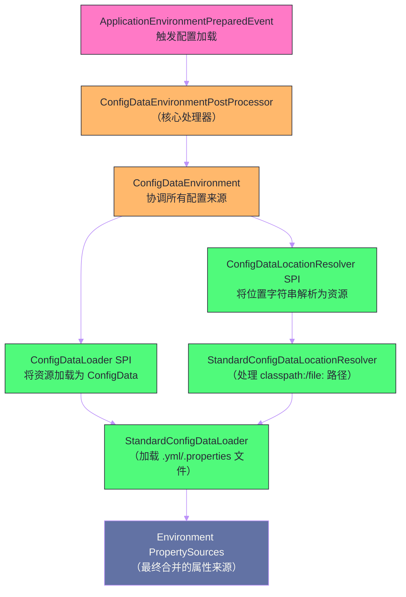

# 配置体系——application.yml、Profile与配置优先级

## 摘要

Spring Boot 的配置体系是整个框架中最容易被低估、最容易踩坑的部分。`application.yml` 只是冰山一角——完整的配置来源超过 17 种，包括命令行参数、环境变量、JVM 系统属性、各种格式的配置文件、远程配置中心等，它们之间有一套精确的优先级规则。更关键的是，Spring Boot 2.4 版本对配置加载机制进行了一次重大重构（从 `ConfigFileApplicationListener` 迁移到 `ConfigDataEnvironmentPostProcessor`），引入了新的 Profile 激活语义，打破了部分旧有行为。本文完整梳理配置加载的完整链路，深入剖析 `ConfigData` 抽象与 `ConfigDataLoader` SPI，系统讲解 Profile 的激活机制与多文档块（Multi-document files），并给出生产环境多套配置管理的最佳实践。

---

## 第 1 章 配置来源的完整图谱

### 1.1 为什么需要多配置来源

一个典型的 Spring Boot 应用在不同阶段面对不同的配置来源需求：

- **开发阶段**：开发者在本地 `application-dev.yml` 中写数据库连接、第三方 API Key，这些绝对不能提交到代码仓库；
- **CI/CD 阶段**：流水线通过环境变量注入 `DATABASE_URL`、`API_KEY` 等敏感配置，避免明文出现在配置文件；
- **生产阶段**：运维通过 Kubernetes ConfigMap/Secret 挂载配置，或通过 Nacos/Consul 配置中心动态下发；
- **紧急修复**：不发布新版本的情况下，通过命令行参数 `--server.port=9090` 临时覆盖某个配置。

这些场景对应了不同的配置来源。Spring Boot 的设计目标是：**让更"具体"（来自运行环境）的配置能覆盖更"通用"（来自代码打包）的配置**，同时保证行为的可预测性。

### 1.2 17 种配置来源的完整优先级列表

Spring Boot 官方文档定义了配置来源的优先级（从高到低，序号越小优先级越高）：

```
① 测试注解：@TestPropertySource、@SpringBootTest.properties（仅测试）
② 命令行参数：java -jar app.jar --server.port=9090
③ @SpringApplication.setDefaultProperties()（编程式默认值）
④ SPRING_APPLICATION_JSON 环境变量中的属性
⑤ ServletContext 初始化参数（WAR 部署）
⑥ JNDI 属性（java:comp/env）
⑦ JVM 系统属性：-Dserver.port=9090
⑧ 操作系统环境变量：SERVER_PORT=9090
⑨ RandomValuePropertySource：random.* 随机值
⑩ application-{profile}.properties/yml（Profile 特定配置文件，外部）
⑪ application.properties/yml（通用配置文件，外部）
⑫ application-{profile}.properties/yml（Profile 特定配置文件，打包在 jar 内）
⑬ application.properties/yml（通用配置文件，打包在 jar 内）
⑭ @PropertySource 注解导入的属性文件
⑮ SpringApplication.setDefaultProperties()（编程式默认值）
```

其中，"外部"配置文件指的是与 jar 包同目录或子目录的配置文件，比 jar 包内的配置文件优先级更高——这是 Docker/Kubernetes 部署时通过挂载文件覆盖配置的基础。

> [!info] 优先级的工程语义
> 优先级规则的核心哲学是：**越接近运行时环境的配置来源，越具有覆盖权**。命令行参数是最"实时"的，优先级最高；代码打包进 jar 的默认配置是最"静态"的，优先级最低。这保证了同一个 jar 包在开发、测试、生产环境都能正确运行，只需在各环境注入对应的配置来源。

---

## 第 2 章 ConfigData：Spring Boot 2.4 的配置加载重构

### 2.1 旧机制的局限：ConfigFileApplicationListener

Spring Boot 2.3 及以前，配置文件的加载由 `ConfigFileApplicationListener` 负责，它在 `ApplicationEnvironmentPreparedEvent` 事件中被触发，通过内置的逻辑加载 `application.properties`/`application.yml` 以及 Profile 特定文件。

这个机制有几个根本性的局限：
1. **配置来源固化**：只能加载本地文件，要接入 Nacos、Consul 等远程配置中心，只能通过 `EnvironmentPostProcessor` 打补丁，代码侵入性强；
2. **Profile 激活语义混乱**：`spring.profiles.include` 和 `spring.profiles.active` 在 Profile 特定文件中的行为不直观，容易产生意外的级联激活；
3. **配置树的拓扑不可预测**：多个配置文件互相激活 Profile，形成复杂的依赖图，难以推断最终的 Environment 状态。

### 2.2 新机制：ConfigDataEnvironmentPostProcessor + ConfigDataLoader SPI

Spring Boot 2.4 引入 `ConfigDataEnvironmentPostProcessor`，彻底重写了配置加载机制：



**`ConfigDataLocation`**：配置位置的抽象，通常是一个字符串，如 `classpath:/application.yml`、`file:./config/`、`nacos://config-center/app-config`；

**`ConfigDataLocationResolver`**：将 `ConfigDataLocation` 字符串解析为具体的 `ConfigDataResource`，是配置来源可扩展的第一个 SPI 点；

**`ConfigDataLoader<R extends ConfigDataResource>`**：将 `ConfigDataResource` 加载为 `ConfigData`（包含一个 `PropertySource` 列表），是可扩展的第二个 SPI 点；

**`ConfigData`**：对加载结果的抽象，不仅包含属性，还携带元信息（如：该配置只在特定 Profile 下生效、该配置可以被后续配置覆盖等）。

这套 SPI 机制使得 Spring Cloud Config、Nacos Spring Boot、Vault Spring Boot 等外部配置中心可以通过实现 `ConfigDataLoader` 无缝接入 Spring Boot 的配置体系，而无需再依赖 `EnvironmentPostProcessor` 这种更底层的扩展点。

### 2.3 spring.config.import：显式声明配置来源

新机制引入了 `spring.config.import`，允许显式声明要导入的配置来源：

```yaml
# application.yml
spring:
  config:
    import:
      - classpath:/extra-config.yml       # 导入类路径上的额外配置文件
      - file:./local-overrides.yml        # 导入文件系统上的本地覆盖文件（可选）
      - optional:file:./local.yml         # optional: 前缀表示文件不存在也不报错
      - nacos://localhost:8848/app-config  # 导入 Nacos 配置（需要 nacos-config 扩展）
```

`optional:` 前缀是一个重要的工程实践——在不同环境下可能存在也可能不存在的配置文件（如开发人员的本地 `local.yml`），应该用 `optional:` 修饰，避免在生产环境因文件不存在而启动失败。

---

## 第 3 章 application.yml 的加载位置

### 3.1 默认搜索路径

Spring Boot 按以下顺序搜索 `application.properties`/`application.yml`（后面的路径优先级更高，会覆盖前面的）：

```
① classpath:/                    ← jar 包内的根路径（最低优先级）
② classpath:/config/             ← jar 包内的 config 子目录
③ file:./                        ← jar 包同级目录
④ file:./config/                 ← jar 包同级目录的 config 子目录
⑤ file:./config/*/              ← jar 包同级目录的 config/任意子目录
```

这个设计对 Docker 部署非常友好：

```dockerfile
# Dockerfile
FROM openjdk:17
COPY target/app.jar /app/app.jar
# 通过 ConfigMap 挂载配置到 /app/config/ 目录
# 此目录的配置会自动覆盖 jar 包内的配置
ENTRYPOINT ["java", "-jar", "/app/app.jar"]
```

```yaml
# kubernetes/configmap.yaml
apiVersion: v1
kind: ConfigMap
metadata:
  name: app-config
data:
  application.yml: |
    spring:
      datasource:
        url: jdbc:mysql://prod-db:3306/prod
        username: prod_user
---
apiVersion: apps/v1
kind: Deployment
spec:
  template:
    spec:
      containers:
        - volumeMounts:
            - name: config
              mountPath: /app/config    # 挂载到 file:./config/，自动被 Spring Boot 识别
      volumes:
        - name: config
          configMap:
            name: app-config
```

### 3.2 自定义配置文件路径

可以通过系统属性或环境变量指定自定义配置位置：

```bash
# 指定额外的配置文件位置（追加，不替换默认位置）
java -jar app.jar --spring.config.additional-location=file:/etc/app/

# 指定配置文件位置（替换默认位置）
java -jar app.jar --spring.config.location=classpath:/default/,file:/etc/app/

# 指定配置文件名（不含扩展名）
java -jar app.jar --spring.config.name=myapp
# Spring Boot 会搜索 myapp.properties 和 myapp.yml
```

---

## 第 4 章 Profile 机制的深度解析

### 4.1 Profile 是什么，解决什么问题

`Profile` 是 Spring 提供的一种**环境标识**机制——通过激活不同的 Profile，让同一套代码在不同环境（开发、测试、生产）使用不同的配置和 Bean 定义。

Profile 的核心价值在于将"代码"与"环境配置"解耦：
- 代码和通用配置打包进 jar（不变的部分）；
- 环境特定配置通过 Profile 注入（变化的部分）；
- 通过激活特定 Profile 告诉应用"当前是什么环境"。

### 4.2 Profile 的激活方式

**方式一：命令行参数（最常用）**
```bash
java -jar app.jar --spring.profiles.active=prod
# 可以同时激活多个
java -jar app.jar --spring.profiles.active=prod,cloud
```

**方式二：环境变量（CI/CD 和 Kubernetes 推荐）**
```bash
export SPRING_PROFILES_ACTIVE=prod,cloud
java -jar app.jar
```

**方式三：JVM 系统属性**
```bash
java -Dspring.profiles.active=prod -jar app.jar
```

**方式四：`application.yml` 中声明（谨慎使用）**
```yaml
# 只有在绝对确定所有环境都需要这个 Profile 时才在代码中声明
spring:
  profiles:
    active: dev  # ⚠️ 这会被环境变量和命令行参数覆盖，但不应该在生产 jar 中存在
```

**方式五：编程式激活**
```java
SpringApplication app = new SpringApplication(App.class);
app.setAdditionalProfiles("local");
app.run(args);
```

### 4.3 Profile 特定配置文件

命名规则：`application-{profile}.yml`（或 `.properties`）。当 `prod` Profile 激活时，Spring Boot 会同时加载：
- `application.yml`（基础配置）
- `application-prod.yml`（prod 特定配置，覆盖基础配置中的同名属性）

```yaml
# application.yml（基础配置，所有环境共用）
spring:
  application:
    name: order-service
  datasource:
    hikari:
      maximum-pool-size: 10
      connection-timeout: 30000

server:
  port: 8080
```

```yaml
# application-dev.yml（开发环境，覆盖基础配置）
spring:
  datasource:
    url: jdbc:h2:mem:devdb  # 开发用内存数据库
    username: sa
    password:
  h2:
    console:
      enabled: true   # 开发环境开启 H2 控制台

logging:
  level:
    com.example: DEBUG  # 开发环境详细日志
```

```yaml
# application-prod.yml（生产环境）
spring:
  datasource:
    url: jdbc:mysql://${DB_HOST:prod-db}:3306/order_db
    username: ${DB_USERNAME}  # 从环境变量读取
    password: ${DB_PASSWORD}  # 从环境变量读取
    hikari:
      maximum-pool-size: 50   # 生产环境更大的连接池

logging:
  level:
    root: WARN
    com.example: INFO
```

### 4.4 多文档块（Multi-document Files）

YAML 文件支持多文档块（用 `---` 分隔），Spring Boot 允许在同一个 `application.yml` 中定义多个针对不同 Profile 的配置块：

```yaml
# application.yml（多文档块）
spring:
  application:
    name: order-service

---
# 第二个文档块：只在 dev Profile 下生效
spring:
  config:
    activate:
      on-profile: dev
  datasource:
    url: jdbc:h2:mem:devdb
  h2:
    console:
      enabled: true

---
# 第三个文档块：只在 prod Profile 下生效
spring:
  config:
    activate:
      on-profile: prod
  datasource:
    url: jdbc:mysql://${DB_HOST}:3306/prod_db
```

> [!warning] Spring Boot 2.4 的 Profile 语义变化
> Spring Boot 2.4 改变了 Profile 激活的语义。在旧版本中，`spring.profiles` 可以在 Profile 特定文件（如 `application-prod.yml`）中使用 `spring.profiles.active` 激活更多 Profile（级联激活）。新版本中：
> - `application-{profile}.yml` 中**不允许**使用 `spring.profiles.active` 激活其他 Profile（会抛出异常）；
> - 多文档块中使用 `spring.config.activate.on-profile` 代替旧的 `spring.profiles` 作为激活条件。
>
> 如果需要兼容旧行为（不推荐），可以设置：`spring.config.use-legacy-processing=true`。

### 4.5 Profile 分组：spring.profiles.group

Spring Boot 2.4 引入 Profile 分组，解决"多个相关 Profile 需要同时激活"的问题：

```yaml
spring:
  profiles:
    group:
      # 激活 "production" Profile 时，自动激活 "proddb" 和 "prodmq"
      production:
        - proddb
        - prodmq
      # 激活 "local" 时，自动激活 "localdb" 和 "mockservices"
      local:
        - localdb
        - mockservices
```

使用 `--spring.profiles.active=production` 启动时，`production`、`proddb`、`prodmq` 三个 Profile 都会被激活，对应的 `application-proddb.yml` 和 `application-prodmq.yml` 都会被加载。

这比旧版本的 `spring.profiles.include`（级联激活）语义更清晰：分组是显式声明的，不会出现"A 激活了 B，B 激活了 C"的隐式链式激活。

---

## 第 5 章 环境变量与属性名的宽松绑定

### 5.1 Relaxed Binding：大小写、下划线、中划线自动转换

Spring Boot 的 `@ConfigurationProperties` 支持宽松绑定（Relaxed Binding）——属性名的不同写法都能绑定到同一个字段：

| 配置文件中的写法 | 环境变量写法 | 绑定到的字段 |
| --- | --- | --- |
| `spring.datasource.url` | `SPRING_DATASOURCE_URL` | `dataSourceUrl` 或 `url` |
| `spring.jpa.show-sql` | `SPRING_JPA_SHOW_SQL` | `showSql` |
| `app.my-feature.max-count` | `APP_MY_FEATURE_MAX_COUNT` | `maxCount` |

宽松绑定规则：
- **kebab-case**（`my-property`）：推荐，配置文件的标准写法；
- **camelCase**（`myProperty`）：Java 字段名；
- **snake_case**（`my_property`）：数据库风格；
- **UPPER_CASE**（`MY_PROPERTY`）：环境变量风格。

这四种写法在绑定到 `@ConfigurationProperties` 字段时等价。Spring Boot 内部通过 `Binder` 的 `ConfigurationPropertyName` 标准化处理不同格式。

### 5.2 环境变量与配置属性的对应关系

环境变量无法包含 `.`（点号），Spring Boot 对环境变量采用特殊的处理规则：

```bash
# 以下环境变量等价于 spring.datasource.url
SPRING_DATASOURCE_URL=jdbc:mysql://localhost/db

# 对于包含数字索引的列表属性（application.yml 中的 list）
# spring.mail.to[0] / spring.mail.to[1]
SPRING_MAIL_TO_0=admin@example.com
SPRING_MAIL_TO_1=ops@example.com
```

> [!info] 环境变量优先于配置文件
> 根据 Spring Boot 的优先级规则，操作系统环境变量（优先级 8）高于打包在 jar 内的 `application.yml`（优先级 13）。这意味着在 Kubernetes 中通过 `env` 字段注入的环境变量，会自动覆盖 jar 包内的配置，无需特殊处理。

---

## 第 6 章 @ConfigurationProperties 与配置绑定

### 6.1 类型安全的配置绑定

`@ConfigurationProperties` 将配置属性绑定到一个 POJO，提供类型安全、IDE 自动补全和运行时验证：

```java
@ConfigurationProperties(prefix = "app.mail")
@Validated   // 启用 JSR-303 验证
public class MailProperties {
    
    @NotEmpty
    private String host;
    
    @Min(1) @Max(65535)
    private int port = 587;
    
    @NotEmpty
    private String username;
    
    private String password;
    
    private boolean ssl = false;
    
    @Valid  // 嵌套对象也需要验证
    private final Pool pool = new Pool();
    
    public static class Pool {
        @Min(1)
        private int maxSize = 5;
        
        @DurationUnit(ChronoUnit.SECONDS)
        private Duration timeout = Duration.ofSeconds(30);
        // getters, setters...
    }
    
    // getters, setters...
}
```

```yaml
app:
  mail:
    host: smtp.gmail.com
    port: 587
    username: noreply@example.com
    password: ${MAIL_PASSWORD}
    ssl: true
    pool:
      max-size: 10
      timeout: 60s   # Spring Boot 支持 Duration 的字符串格式：60s, 5m, 1h, 2d
```

### 6.2 配置元数据：IDE 自动补全的基础

在 `pom.xml` 中添加注解处理器，可以为 `@ConfigurationProperties` 类自动生成配置元数据文件（`META-INF/spring-configuration-metadata.json`），供 IDE 提供自动补全和文档提示：

```xml
<dependency>
    <groupId>org.springframework.boot</groupId>
    <artifactId>spring-boot-configuration-processor</artifactId>
    <optional>true</optional>
</dependency>
```

编译时会自动生成：

```json
// META-INF/spring-configuration-metadata.json（自动生成，无需手动编写）
{
  "groups": [
    {
      "name": "app.mail",
      "type": "com.example.MailProperties",
      "sourceType": "com.example.MailProperties"
    }
  ],
  "properties": [
    {
      "name": "app.mail.host",
      "type": "java.lang.String",
      "description": "SMTP host name.",
      "sourceType": "com.example.MailProperties"
    },
    {
      "name": "app.mail.port",
      "type": "java.lang.Integer",
      "description": "SMTP server port.",
      "defaultValue": 587,
      "sourceType": "com.example.MailProperties"
    }
  ]
}
```

有了这个元数据文件，在 IntelliJ IDEA 或 VS Code 中编辑 `application.yml` 时，`app.mail.*` 下的所有属性都会有自动补全、类型提示和文档说明。

### 6.3 @Value 与 @ConfigurationProperties 的选择

| 特性 | `@Value` | `@ConfigurationProperties` |
| --- | --- | --- |
| 类型 | 单个属性 | 一组相关属性 |
| 类型转换 | 基本类型，有限 | 丰富（Duration、DataSize 等） |
| Relaxed Binding | 不支持 | 支持 |
| JSR-303 验证 | 不支持 | 支持（配合 `@Validated`） |
| IDE 自动补全 | 有限 | 完整（配合 processor） |
| 适用场景 | 少量离散属性 | 组件的一组配置 |

**最佳实践**：优先使用 `@ConfigurationProperties`，仅在需要单个属性（尤其是 SpEL 表达式）时使用 `@Value`。

---

## 第 7 章 配置优先级的实战场景分析

### 7.1 场景一：本地开发覆盖

开发者在本地需要连接自己的本地 MySQL，而不是共享的开发数据库：

```yaml
# src/main/resources/application.yml（提交到代码仓库）
spring:
  datasource:
    url: jdbc:mysql://dev-shared-db:3306/dev

# 方案：在 jar 同级目录创建 application-local.yml（不提交到代码仓库）
# 启动时：java -jar app.jar --spring.profiles.active=local
```

```yaml
# application-local.yml（加入 .gitignore，不提交）
spring:
  datasource:
    url: jdbc:mysql://localhost:3306/local_dev
    username: root
    password: local_password
```

更简洁的方案（不需要 Profile）：

```bash
# 直接用命令行参数覆盖（一次性场景）
java -jar app.jar --spring.datasource.url=jdbc:mysql://localhost:3306/local_dev
```

### 7.2 场景二：Kubernetes 环境配置注入

生产 Kubernetes 集群中，敏感配置（密码、API Key）通过 Secret 注入，其余通过 ConfigMap：

```yaml
# kubernetes/deployment.yaml
spec:
  containers:
    - name: order-service
      env:
        # 从 Secret 注入数据库密码（最高安全实践）
        - name: SPRING_DATASOURCE_PASSWORD
          valueFrom:
            secretKeyRef:
              name: order-service-secrets
              key: db-password
        
        # Profile 激活通过环境变量
        - name: SPRING_PROFILES_ACTIVE
          value: "prod,k8s"
        
        # 运行环境信息
        - name: APP_POD_NAME
          valueFrom:
            fieldRef:
              fieldPath: metadata.name
      
      volumeMounts:
        # 通用配置通过 ConfigMap 文件挂载
        - name: app-config
          mountPath: /app/config
  
  volumes:
    - name: app-config
      configMap:
        name: order-service-config
```

### 7.3 场景三：多数据源的 Profile 管理

不同环境使用不同的数据库，通过 Profile 切换：

```yaml
# application.yml
spring:
  application:
    name: user-service

---
spring:
  config:
    activate:
      on-profile: "dev"
  datasource:
    primary:
      url: jdbc:h2:mem:primary
      driver-class-name: org.h2.Driver
    secondary:
      url: jdbc:h2:mem:secondary
      driver-class-name: org.h2.Driver

---
spring:
  config:
    activate:
      on-profile: "prod"
  datasource:
    primary:
      url: jdbc:mysql://${PRIMARY_DB_HOST}/users
      username: ${PRIMARY_DB_USER}
      password: ${PRIMARY_DB_PASS}
    secondary:
      url: jdbc:mysql://${SECONDARY_DB_HOST}/audit
      username: ${SECONDARY_DB_USER}
      password: ${SECONDARY_DB_PASS}
```

---

## 第 8 章 配置加密与安全

### 8.1 Jasypt：配置文件中的密文

在配置文件中存储明文密码是常见的安全风险。Jasypt（Java Simplified Encryption）是 Spring Boot 生态中最常用的配置加密方案：

```xml
<dependency>
    <groupId>com.github.ulisesbocchio</groupId>
    <artifactId>jasypt-spring-boot-starter</artifactId>
    <version>3.0.5</version>
</dependency>
```

```yaml
# application.yml：密码以 ENC() 包裹的密文形式存储
spring:
  datasource:
    password: ENC(XC+cTMUoBhDH2VJY7H2W0Q==)
```

```bash
# 启动时通过环境变量提供解密密钥（密钥本身不进入配置文件）
export JASYPT_ENCRYPTOR_PASSWORD=my-secret-key
java -jar app.jar
```

### 8.2 更安全的方案：外部 Secret 管理

在企业级生产环境，推荐使用专业的 Secret 管理工具而非配置文件加密：
- **HashiCorp Vault**：`spring-vault-core` + `spring-cloud-vault` 从 Vault 动态获取密码；
- **AWS Secrets Manager**：Spring Cloud AWS 提供原生集成；
- **Kubernetes Secrets + CSI Driver**：通过 Secrets Store CSI Driver 将 K8s Secret 挂载为环境变量或文件；
- **阿里云 KMS + Nacos**：Nacos 配置中心与 KMS 集成，配置值在 Nacos 中以密文存储，应用启动时自动解密。

---

## 第 9 章 配置体系的调试技巧

### 9.1 打印 Environment 中的所有属性来源

Spring Boot Actuator 的 `/actuator/env` 端点可以展示当前 Environment 中所有 PropertySources 及其包含的属性（默认敏感值会被遮蔽）：

```bash
curl http://localhost:8080/actuator/env | jq .
```

输出示例（简化）：

```json
{
  "activeProfiles": ["prod"],
  "propertySources": [
    {
      "name": "commandLineArgs",
      "properties": {
        "server.port": { "value": "9090" }
      }
    },
    {
      "name": "systemEnvironment",
      "properties": {
        "SPRING_DATASOURCE_PASSWORD": { "value": "******" }
      }
    },
    {
      "name": "Config resource 'class path resource [application-prod.yml]'",
      "properties": {
        "spring.datasource.url": { "value": "jdbc:mysql://prod-db/orders" }
      }
    },
    {
      "name": "Config resource 'class path resource [application.yml]'",
      "properties": {
        "spring.application.name": { "value": "order-service" },
        "server.port": { "value": "8080" }
      }
    }
  ]
}
```

通过这个端点，可以明确看到：某个属性来自哪个 PropertySource，当前有效值是什么（`commandLineArgs` 中的 `server.port=9090` 覆盖了 `application.yml` 中的 `8080`）。

### 9.2 查询某个具体属性的来源

```bash
# 查询 spring.datasource.url 的值和来源
curl http://localhost:8080/actuator/env/spring.datasource.url
```

输出：

```json
{
  "property": {
    "source": "Config resource 'class path resource [application-prod.yml]'",
    "value": "jdbc:mysql://prod-db/orders"
  },
  "activeProfiles": ["prod"],
  "propertySources": [
    { "name": "commandLineArgs" },
    { "name": "systemEnvironment" },
    {
      "name": "Config resource 'class path resource [application-prod.yml]'",
      "property": {
        "value": "jdbc:mysql://prod-db/orders",
        "origin": "class path resource [application-prod.yml] - 3:11"  // 精确到行号！
      }
    }
  ]
}
```

`origin` 字段精确到文件路径和行号，是快速定位"某个配置值从哪里来"的利器。

---

## 总结

Spring Boot 配置体系的核心设计思想是**分层与可替换**：

- **17 种配置来源**：命令行 > 环境变量 > JVM 属性 > 配置文件外部 > 配置文件内部，越"运行时"越具有覆盖权；
- **ConfigData 抽象**（Spring Boot 2.4+）：`ConfigDataLocationResolver` + `ConfigDataLoader` 构成可扩展的 SPI，使 Nacos/Vault 等外部配置中心能无缝接入；
- **Profile 机制**：通过 `spring.profiles.active` 激活，对应 `application-{profile}.yml` 文件；Spring Boot 2.4 引入 `spring.config.activate.on-profile` 替代多文档块中的旧 `spring.profiles` 语义，`spring.profiles.group` 解决多 Profile 联动激活；
- **配置文件搜索路径**：classpath 根 < classpath/config < 外部同级目录 < 外部 config 目录，外部文件优先级高于 jar 内文件，是 Docker/K8s 挂载配置的基础；
- **@ConfigurationProperties**：类型安全、支持 Relaxed Binding 和 JSR-303 验证，配合 `spring-boot-configuration-processor` 提供 IDE 自动补全；
- **调试工具**：Actuator 的 `/actuator/env` 端点可以精确定位每个属性的来源（包括行号）。

下一篇，我们基于配置体系和自动装配机制，探讨如何开发一个符合 Spring Boot 规范的自定义 Starter：[[06 Starter开发——自定义starter的最佳实践]]。

---

> [!note] 参考资料
> - `org.springframework.boot.context.config.ConfigDataEnvironmentPostProcessor` 源码
> - `org.springframework.boot.context.config.StandardConfigDataLocationResolver` 源码
> - [Spring Boot 官方文档 - Externalized Configuration](https://docs.spring.io/spring-boot/docs/current/reference/html/features.html#features.external-config)
> - [Spring Boot 2.4 配置文件处理变更说明](https://spring.io/blog/2020/08/14/config-file-processing-in-spring-boot-2-4)

---

> [!note] 思考题
> 1. Spring Boot 默认使用 SLF4J + Logback。项目中如果同时引入了使用 Log4j2、JUL（java.util.logging）、JCL（commons-logging）的第三方库，日志输出会混乱。Spring Boot 通过桥接器（如 `jcl-over-slf4j`、`jul-to-slf4j`）将所有日志框架统一到 SLF4J。但这种桥接是否有性能开销？在日志量极大的场景（每秒百万行）下是否值得关注？
> 2. Spring Boot Actuator 提供了 `/actuator/loggers` 端点，允许在运行时动态调整日志级别（如将某个包的级别从 INFO 改为 DEBUG）。这个功能在生产排查中非常有用。但动态调整后日志量激增——在没有日志采样的情况下，DEBUG 日志可能打满磁盘。你如何实现'临时开启 DEBUG 级别 5 分钟后自动恢复'的功能？
> 3. Logback 的异步 Appender（`AsyncAppender`）将日志写入操作卸载到独立线程，避免阻塞业务线程。但异步 Appender 有一个队列（默认 256）——当队列满时，默认行为是丢弃 TRACE/DEBUG/INFO 级别的日志。在什么场景下这种丢弃策略会导致排查困难？你如何调整丢弃策略？
