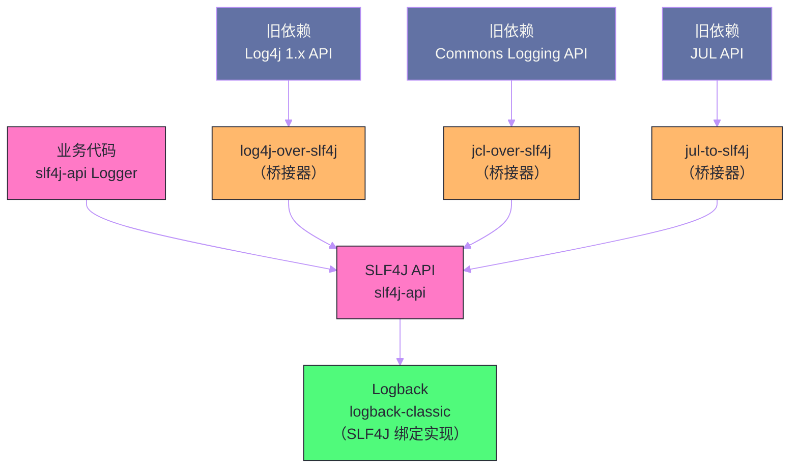

# 日志体系——SLF4J、Logback与日志桥接

## 摘要

日志是应用可观测性的第一道防线，却也是 Java 生态中历史包袱最重的领域之一。[[Log4j]] 1.x、[[JUL]]（java.util.logging）、[[JCL]]（Apache Commons Logging）、[[Log4j]] 2.x、[[Logback]]……各有一套 API，在同一个应用的依赖树中可能同时存在多套日志框架，导致日志输出混乱、配置互相干扰。[[SLF4J]] 通过"门面模式 + 桥接器"彻底解决了这个问题，Spring Boot 则在 SLF4J 之上构建了一套零配置可用、生产就绪的日志体系。本文深入剖析 SLF4J 的门面设计与绑定机制、Logback 的 Appender/Layout/Filter 体系、日志桥接的工作原理（`log4j-over-slf4j` 等），以及结构化日志（JSON 格式）、MDC 链路追踪标签、异步日志等生产级配置的实现原理与最佳实践。

---

## 第 1 章 Java 日志生态的历史混乱与 SLF4J 的诞生

### 1.1 混乱的起源：多套日志 API 共存

Java 的日志框架历史可以追溯到 1999 年。问题的根源在于：标准库的 `java.util.logging`（JUL）出现得太晚（Java 1.4，2002 年），功能也相对简陋，导致社区在 JUL 之前就自行发展出了多套日志框架：

- **1999 年**：`System.out.println` / `System.err.println`（原始时代）；
- **2001 年**：Apache **Log4j 1.x** 发布，成为事实标准，`Logger.getLogger(xxx).info(msg)` 是当时标准写法；
- **2002 年**：JDK 1.4 引入 **java.util.logging（JUL）**，但 API 繁琐（`Level.INFO` 而非 `logger.info()`），难以替代 Log4j；
- **2002 年**：Apache **Commons Logging（JCL）** 发布，试图提供一个统一门面，在运行时自动检测并适配底层日志实现——这个"运行时发现"机制依赖类加载器，在 OSGi、应用服务器等复杂类加载器环境下频繁出 Bug；
- **2006 年**：Ceki Gülcü（Log4j 原作者）不满 JCL 的设计，创建了 **SLF4J**（Simple Logging Facade for Java）和 **Logback**。SLF4J 在编译时绑定，彻底规避了 JCL 的类加载器问题；
- **2012 年**：**Log4j 2.x** 重写发布，修复了 Log4j 1.x 的诸多问题（性能、异步、插件化）；
- **2021 年**：Log4Shell（CVE-2021-44228）漏洞爆发，Log4j 2.x 的 JNDI lookup 特性被利用，成为史上最严重的 Java 安全漏洞之一。

这段历史造成的现状是：一个典型的 Spring Boot 应用的依赖树中，可能同时存在 `log4j-1.2.x`（某个旧版依赖带入）、`java.util.logging`（JDK 自带）、`commons-logging`（Spring Framework 早期版本使用）、`slf4j-api`（现代依赖使用），以及最终的 Logback 实现。这些日志框架各自独立工作，日志输出散落各处，难以统一管控。

### 1.2 SLF4J 的设计哲学：门面 + 编译时绑定

SLF4J 解决混乱的思路非常清晰：

1. **统一 API**：提供 `org.slf4j.Logger` 和 `org.slf4j.LoggerFactory`，这是**唯一**应该出现在业务代码中的日志 API；
2. **编译时绑定**：通过类路径上唯一的 `slf4j-api` + 一个 `binding` JAR（如 `logback-classic`），在编译时确定实际使用的日志实现，无运行时发现开销；
3. **桥接器**：对于仍在使用旧 API（Log4j 1.x、JCL、JUL）的第三方依赖，通过桥接 JAR（`log4j-over-slf4j`、`jcl-over-slf4j`、`jul-to-slf4j`）将其日志调用重定向到 SLF4J，最终统一输出。



---

## 第 2 章 SLF4J 的绑定机制

### 2.1 ServiceLoader 机制：SLF4J 1.8+ 的现代绑定

SLF4J 1.8 之前通过在类路径上放置特定类（`org/slf4j/impl/StaticLoggerBinder.class`）来绑定实现——这是一种约定，不是接口。

SLF4J 1.8+ 改为标准的 Java [[ServiceLoader]] 机制：`LoggerFactory.getILoggerFactory()` 通过 `ServiceLoader.load(SLF4JServiceProvider.class)` 发现绑定实现。每个 SLF4J 绑定（如 `logback-classic`）在其 JAR 的 `META-INF/services/org.slf4j.spi.SLF4JServiceProvider` 文件中声明自己的 `SLF4JServiceProvider` 实现类。

Logback 的 `logback-classic` 中包含：
```
# META-INF/services/org.slf4j.spi.SLF4JServiceProvider
ch.qos.logback.classic.spi.LogbackServiceProvider
```

当类路径上有多个 SLF4J 绑定时（比如同时有 `logback-classic` 和 `slf4j-log4j12`），SLF4J 会在启动时发出警告，并随机选择其中一个。这种情况通常是依赖冲突导致的，需要通过 Maven 的 `<exclusion>` 解决。

### 2.2 占位符机制：避免字符串拼接的性能开销

SLF4J 的日志调用使用 `{}` 占位符，而非字符串拼接：

```java
// ❌ 低效写法：即使日志级别未开启，字符串拼接也会执行
logger.debug("Processing order: " + orderId + " for user: " + userId);

// ✅ 推荐写法：只有当 DEBUG 级别开启时才格式化字符串
logger.debug("Processing order: {} for user: {}", orderId, userId);

// 对于 Throwable，将异常作为最后一个参数（SLF4J 会自动打印堆栈）
try {
    processOrder(orderId);
} catch (Exception e) {
    logger.error("Failed to process order: {}", orderId, e);
}
```

> [!info] 为什么占位符比字符串拼接更好
> `logger.debug("msg: " + value)` 这行代码无论日志级别是否开启，Java 编译器都会生成 `StringBuilder.append()` 调用来拼接字符串。如果 `value` 是一个复杂对象，其 `toString()` 方法也会被调用——即使这条日志最终被过滤掉，这些 CPU 开销和对象分配都实实在在发生了。
>
> `logger.debug("msg: {}", value)` 则不同——SLF4J 在方法入口处首先检查 DEBUG 级别是否开启（`isDebugEnabled()`），只有开启时才执行参数格式化。格式化操作（`String.format` 等价物）发生在日志框架内部，延迟到确认需要时才进行。

---

## 第 3 章 Spring Boot 的日志自动配置

### 3.1 默认配置：零配置可用

Spring Boot 通过 `spring-boot-starter-logging`（被所有 Starter 自动引入）完成日志基础设施的搭建，开箱即用的默认行为：

- **日志实现**：Logback；
- **默认级别**：`root = INFO`；
- **输出目标**：仅控制台（`System.out`），不写文件；
- **输出格式**：`时间 日志级别 进程ID --- [线程名] 类名 : 消息`；
- **颜色支持**：在支持 ANSI 的终端自动着色（日志级别用不同颜色区分）。

Spring Boot 携带的默认 Logback 配置位于 `spring-boot-x.x.x.jar` 内的 `org/springframework/boot/logging/logback/defaults.xml`，用户可以通过 `application.yml` 覆盖常用配置，无需修改 XML。

### 3.2 通过 application.yml 配置日志

```yaml
logging:
  # 配置各包/类的日志级别
  level:
    root: INFO                          # 根 Logger 级别
    com.example: DEBUG                  # 应用包 DEBUG
    com.example.repository: WARN        # 数据访问层 WARN（减少 SQL 日志）
    org.springframework.web: DEBUG      # Spring MVC DEBUG（诊断请求映射问题）
    org.hibernate.SQL: DEBUG            # 打印 SQL（等价于 show-sql: true）
    org.hibernate.orm.jdbc.bind: TRACE  # 打印 SQL 参数值
  
  # 日志文件配置
  file:
    name: logs/app.log              # 日志文件路径（相对于工作目录）
    # path: /var/log/app            # 日志目录（使用 spring.log 作为文件名）
  
  # 日志滚动策略（Spring Boot 2.2+ 支持直接在 yml 配置）
  logback:
    rollingpolicy:
      max-file-size: 100MB          # 单文件最大大小
      max-history: 30               # 保留最近 30 天的归档文件
      total-size-cap: 3GB           # 所有归档文件的总大小上限
      file-name-pattern: "${LOG_FILE}.%d{yyyy-MM-dd}.%i.gz"  # 归档文件名（按日期+序号）
  
  # 自定义输出格式
  pattern:
    console: "%clr(%d{yyyy-MM-dd HH:mm:ss.SSS}){faint} %clr(${LOG_LEVEL_PATTERN:-%5p}) %clr(${PID:- }){magenta} %clr(---){faint} %clr([%15.15t]){faint} %clr(%-40.40logger{39}){cyan} %clr(:){faint} %m%n${LOG_EXCEPTION_CONVERSION_WORD:-%wEx}"
    file: "%d{yyyy-MM-dd HH:mm:ss.SSS} ${LOG_LEVEL_PATTERN:-%5p} ${PID:- } --- [%t] %-40.40logger{39} : %m%n${LOG_EXCEPTION_CONVERSION_WORD:-%wEx}"
```

### 3.3 使用自定义 logback-spring.xml

当 `application.yml` 的配置能力不够用时（如需要多个 Appender、条件配置、自定义 Filter），需要提供完整的 `logback-spring.xml`（注意是 `logback-spring.xml` 而非 `logback.xml`）：

**命名差异的重要性**：
- `logback.xml`：由 Logback 框架直接加载，在 Spring `Environment` 初始化之前；
- `logback-spring.xml`：由 Spring Boot 加载，可以使用 `<springProperty>` 读取 `application.yml` 中的配置，以及 `<springProfile>` 做 Profile 差异化配置。

```xml
<?xml version="1.0" encoding="UTF-8"?>
<configuration>
    <!-- 引入 Spring Boot 的默认基础配置（颜色、默认 Pattern 等） -->
    <include resource="org/springframework/boot/logging/logback/defaults.xml"/>
    
    <!-- 从 Spring Environment 读取配置属性 -->
    <springProperty scope="context" name="appName" 
                    source="spring.application.name" defaultValue="app"/>
    <springProperty scope="context" name="logPath"
                    source="logging.file.path" defaultValue="logs"/>
    
    <!-- 控制台 Appender -->
    <appender name="CONSOLE" class="ch.qos.logback.core.ConsoleAppender">
        <encoder class="ch.qos.logback.classic.encoder.PatternLayoutEncoder">
            <pattern>${CONSOLE_LOG_PATTERN}</pattern>
            <charset>UTF-8</charset>
        </encoder>
    </appender>
    
    <!-- 文件 Appender（按日期+大小滚动） -->
    <appender name="FILE" class="ch.qos.logback.core.rolling.RollingFileAppender">
        <file>${logPath}/${appName}.log</file>
        <encoder class="ch.qos.logback.classic.encoder.PatternLayoutEncoder">
            <pattern>%d{yyyy-MM-dd HH:mm:ss.SSS} [%thread] %-5level %logger{36} [%X{traceId}] - %msg%n</pattern>
            <charset>UTF-8</charset>
        </encoder>
        <rollingPolicy class="ch.qos.logback.core.rolling.SizeAndTimeBasedRollingPolicy">
            <fileNamePattern>${logPath}/${appName}.%d{yyyy-MM-dd}.%i.log.gz</fileNamePattern>
            <maxFileSize>100MB</maxFileSize>
            <maxHistory>30</maxHistory>
            <totalSizeCap>3GB</totalSizeCap>
        </rollingPolicy>
    </appender>
    
    <!-- 异步 Appender（包装同步 Appender，提升写日志性能） -->
    <appender name="ASYNC_FILE" class="ch.qos.logback.classic.AsyncAppender">
        <queueSize>512</queueSize>           <!-- 异步队列大小 -->
        <discardingThreshold>0</discardingThreshold>  <!-- 0=不丢弃（默认80%满时丢弃低级别日志） -->
        <includeCallerData>false</includeCallerData>  <!-- false=不记录调用方信息（提升性能） -->
        <appender-ref ref="FILE"/>
    </appender>
    
    <!-- Profile 差异化配置 -->
    <springProfile name="dev">
        <root level="DEBUG">
            <appender-ref ref="CONSOLE"/>
        </root>
        <logger name="com.example" level="DEBUG" additivity="false">
            <appender-ref ref="CONSOLE"/>
        </logger>
    </springProfile>
    
    <springProfile name="prod">
        <root level="INFO">
            <appender-ref ref="ASYNC_FILE"/>
        </root>
        <logger name="com.example" level="INFO" additivity="false">
            <appender-ref ref="ASYNC_FILE"/>
        </logger>
    </springProfile>
    
    <!-- 默认（不匹配任何 Profile） -->
    <springProfile name="!(dev,prod)">
        <root level="INFO">
            <appender-ref ref="CONSOLE"/>
        </root>
    </springProfile>
    
</configuration>
```

---

## 第 4 章 Logback 的核心架构

### 4.1 三大核心组件：Logger、Appender、Layout

Logback 的架构可以用三个核心概念完整描述：

**Logger**：负责"接收日志事件"。每个 Logger 有一个名称（通常是类的全限定名），构成一棵树形结构（以 `.` 分隔的包名层次）。日志级别可以在任意层级设置，未设置则继承父节点的级别（最顶层是 `root` Logger）。

```
root（INFO）
├── com（继承 INFO）
│   └── example（DEBUG）← 显式设置
│       ├── service（继承 DEBUG）
│       └── repository（WARN）← 显式设置，覆盖父级
└── org
    └── springframework（WARN）← 显式设置
```

**Appender**：负责"输出日志事件到目标"。一个 Logger 可以关联多个 Appender，日志事件会被投递到所有关联的 Appender。内置 Appender：
- `ConsoleAppender`：输出到控制台；
- `FileAppender`：输出到文件；
- `RollingFileAppender`：输出到可滚动的文件（按大小、时间、混合策略）；
- `AsyncAppender`：异步包装器，将日志投递到内存队列，由后台线程异步写入；
- `SMTPAppender`：发邮件（ERROR 级别报警）；
- `DBAppender`：写数据库（一般不推荐）。

**Layout/Encoder**：负责"将日志事件格式化为字符串"。`PatternLayoutEncoder` 是最常用的实现，使用模式字符串（如 `%d %level %logger - %msg%n`）格式化输出。

### 4.2 additive（累加性）：避免重复输出

Logback 的 Logger 树有一个容易踩坑的特性——`additive`（累加性）。默认情况下，一个 Logger 的日志事件会被投递到它自己的 Appender，**同时也会向上传播到所有父 Logger 的 Appender**，一直到 root Logger。

```xml
<!-- 问题配置：com.example 和 root 都有 CONSOLE Appender -->
<appender name="CONSOLE" .../>

<root level="INFO">
    <appender-ref ref="CONSOLE"/>   ← 所有日志都会来到这里
</root>

<logger name="com.example" level="DEBUG">
    <appender-ref ref="CONSOLE"/>   ← com.example 的日志也来这里
    <!-- additivity 默认为 true，所以 com.example 的日志还会传播到 root -->
</logger>
```

这会导致 `com.example` 的日志被打印**两次**。解决方案是设置 `additivity="false"`：

```xml
<logger name="com.example" level="DEBUG" additivity="false">
    <!-- additivity=false：事件在这里被消费，不再向上传播 -->
    <appender-ref ref="CONSOLE"/>
</logger>
```

### 4.3 Filter：精细化控制哪些日志被输出

Logback 支持在 Appender 或 Logger 级别添加 Filter，实现比日志级别更精细的控制：

```xml
<!-- 场景：只输出特定 marker 的日志 -->
<appender name="AUDIT_FILE" class="ch.qos.logback.core.rolling.RollingFileAppender">
    <!-- MarkerFilter：只接受 AUDIT Marker 的日志 -->
    <filter class="ch.qos.logback.core.filter.EvaluatorFilter">
        <evaluator class="ch.qos.logback.classic.boolex.OnMarkerEvaluator">
            <marker>AUDIT</marker>
        </evaluator>
        <onMatch>ACCEPT</onMatch>
        <onMismatch>DENY</onMismatch>
    </filter>
    <encoder>
        <pattern>%d [%X{userId}] [%X{traceId}] AUDIT: %msg%n</pattern>
    </encoder>
    <!-- ... -->
</appender>
```

```java
// 在代码中使用 Marker 标记审计日志
private static final Marker AUDIT = MarkerFactory.getMarker("AUDIT");

public void deleteUser(Long userId) {
    userRepository.delete(userId);
    // 这条日志会被路由到 AUDIT_FILE Appender
    logger.info(AUDIT, "User deleted: {} by operator: {}", userId, getCurrentUser());
}
```

---

## 第 5 章 MDC：请求级别的日志上下文

### 5.1 MDC 是什么，解决什么问题

[[MDC]]（Mapped Diagnostic Context）是 SLF4J/Logback 提供的线程本地日志上下文。在一个高并发服务中，多个请求的日志交织在一起，很难从日志中还原单个请求的完整处理链路。

MDC 通过 `ThreadLocal` 存储一组键值对，日志 Pattern 中通过 `%X{key}` 引用这些值——这样，同一个线程处理的所有日志都会携带相同的上下文信息：

```java
// Spring MVC 拦截器中设置 MDC
@Component
public class LoggingInterceptor implements HandlerInterceptor {
    
    @Override
    public boolean preHandle(HttpServletRequest request, 
                              HttpServletResponse response, 
                              Object handler) {
        // 生成或传递 traceId（分布式链路追踪）
        String traceId = getOrGenerateTraceId(request);
        String userId = getCurrentUserId();
        String requestId = UUID.randomUUID().toString().substring(0, 8);
        
        // 放入 MDC，后续该线程的所有日志都会自动携带这些字段
        MDC.put("traceId", traceId);
        MDC.put("userId", userId != null ? userId : "anonymous");
        MDC.put("requestId", requestId);
        MDC.put("uri", request.getRequestURI());
        
        return true;
    }
    
    @Override
    public void afterCompletion(HttpServletRequest request,
                                 HttpServletResponse response,
                                 Object handler,
                                 Exception ex) {
        // 请求结束后清理 MDC，避免线程复用时旧数据残留
        MDC.clear();
    }
    
    private String getOrGenerateTraceId(HttpServletRequest request) {
        // 优先使用上游传入的 traceId（微服务链路追踪）
        String traceId = request.getHeader("X-Trace-Id");
        return traceId != null ? traceId : UUID.randomUUID().toString().replace("-", "");
    }
}
```

配置日志 Pattern 包含 MDC 字段：

```xml
<pattern>%d{yyyy-MM-dd HH:mm:ss.SSS} [%thread] %-5level [%X{traceId}] [%X{userId}] %logger{36} - %msg%n</pattern>
```

输出效果：

```
2026-03-04 14:30:15.123 [http-nio-8080-exec-1] INFO  [abc123def456] [user-1001] c.e.OrderService - Creating order for product: 999
2026-03-04 14:30:15.145 [http-nio-8080-exec-1] DEBUG [abc123def456] [user-1001] c.e.OrderRepository - Executing SQL: INSERT INTO orders...
2026-03-04 14:30:15.168 [http-nio-8080-exec-1] INFO  [abc123def456] [user-1001] c.e.OrderService - Order created: 88765
```

通过 `traceId=abc123def456` 可以在日志系统中精确过滤出这一次请求的所有日志。

### 5.2 MDC 与异步线程的坑

MDC 基于 `ThreadLocal`，当业务逻辑切换到新线程时（如 `@Async`、`CompletableFuture`、线程池），MDC 中的值**不会自动传递**：

```java
@Service
public class OrderService {
    
    @Async("orderProcessingExecutor")
    public CompletableFuture<Void> processOrderAsync(Long orderId) {
        // ❌ 这里 MDC 是空的！AsyncTaskExecutor 分配的是新线程
        logger.info("Processing order: {}", orderId);  // 日志中没有 traceId
        return CompletableFuture.completedFuture(null);
    }
}
```

解决方案：使用 MDC 感知的线程池包装器：

```java
@Configuration
public class AsyncConfig {
    
    @Bean("orderProcessingExecutor")
    public Executor orderProcessingExecutor() {
        ThreadPoolTaskExecutor executor = new ThreadPoolTaskExecutor();
        executor.setCorePoolSize(10);
        executor.setMaxPoolSize(50);
        executor.setQueueCapacity(100);
        executor.setThreadNamePrefix("order-processor-");
        
        // 包装 TaskDecorator：在子线程中恢复父线程的 MDC 上下文
        executor.setTaskDecorator(runnable -> {
            // 在父线程中捕获 MDC 快照
            Map<String, String> mdcContext = MDC.getCopyOfContextMap();
            return () -> {
                try {
                    // 在子线程中恢复 MDC
                    if (mdcContext != null) {
                        MDC.setContextMap(mdcContext);
                    }
                    runnable.run();
                } finally {
                    // 清理子线程的 MDC
                    MDC.clear();
                }
            };
        });
        
        executor.initialize();
        return executor;
    }
}
```

---

## 第 6 章 结构化日志：JSON 格式输出

### 6.1 为什么需要结构化日志

传统的文本格式日志（如 `2026-03-04 INFO OrderService - Order created: 88765`）对人类可读，但对日志分析系统（Elasticsearch、Splunk、Loki 等）不友好——它们需要通过正则表达式解析非结构化文本，这既慢又容易出错。

结构化日志将每条日志输出为 JSON 格式，每个字段都有明确的键名和类型：

```json
{
  "timestamp": "2026-03-04T14:30:15.123Z",
  "level": "INFO",
  "thread": "http-nio-8080-exec-1",
  "logger": "com.example.OrderService",
  "message": "Order created",
  "traceId": "abc123def456",
  "userId": "user-1001",
  "orderId": 88765,
  "duration": 45,
  "service": "order-service",
  "environment": "prod"
}
```

这种格式可以被日志系统直接索引，查询 `orderId=88765` 的所有日志、统计 ERROR 日志的 P99 响应时间等操作都能高效执行。

### 6.2 使用 Logstash Logback Encoder

`logstash-logback-encoder` 是将 Logback 输出转为 JSON 格式的标准库：

```xml
<dependency>
    <groupId>net.logstash.logback</groupId>
    <artifactId>logstash-logback-encoder</artifactId>
    <version>7.4</version>
</dependency>
```

```xml
<!-- logback-spring.xml -->
<appender name="JSON_CONSOLE" class="ch.qos.logback.core.ConsoleAppender">
    <encoder class="net.logstash.logback.encoder.LogstashEncoder">
        <!-- 自定义字段名 -->
        <fieldNames>
            <timestamp>timestamp</timestamp>
            <message>message</message>
            <logger>logger</logger>
            <thread>thread</thread>
            <level>level</level>
        </fieldNames>
        
        <!-- 添加应用级别的静态字段 -->
        <customFields>{"service":"order-service","env":"${ENV:-local}"}</customFields>
        
        <!-- MDC 中的字段自动包含在 JSON 中 -->
        <!-- 排除不需要的字段 -->
        <excludeMdcKeyName>requestId</excludeMdcKeyName>
        
        <!-- 异常堆栈格式化 -->
        <throwableConverter class="net.logstash.logback.stacktrace.ShortenedThrowableConverter">
            <maxDepthPerCause>20</maxDepthPerCause>
            <maxLength>4096</maxLength>
            <shortenedClassNameLength>20</shortenedClassNameLength>
            <rootCauseFirst>true</rootCauseFirst>
        </throwableConverter>
    </encoder>
</appender>
```

### 6.3 使用 StructuredArguments 增加结构化字段

```java
import static net.logstash.logback.argument.StructuredArguments.*;

public class OrderService {
    
    public void createOrder(OrderRequest request) {
        // kv()：添加键值对字段到 JSON 输出
        logger.info("Creating order",
            kv("userId", request.getUserId()),
            kv("productId", request.getProductId()),
            kv("quantity", request.getQuantity())
        );
        
        // 计时并记录
        long start = System.currentTimeMillis();
        Order order = processOrder(request);
        long duration = System.currentTimeMillis() - start;
        
        logger.info("Order created",
            kv("orderId", order.getId()),
            kv("duration", duration),
            kv("status", order.getStatus())
        );
    }
}
```

JSON 输出：

```json
{
  "timestamp": "2026-03-04T14:30:15.123Z",
  "level": "INFO",
  "message": "Order created",
  "traceId": "abc123def456",
  "orderId": 88765,
  "duration": 45,
  "status": "CONFIRMED",
  "service": "order-service"
}
```

---

## 第 7 章 异步日志与性能调优

### 7.1 同步日志的性能瓶颈

默认的 `FileAppender` 是同步的——每次 `logger.info(...)` 调用，当前业务线程会直接执行文件写入，等待磁盘 I/O 完成后才返回。磁盘 I/O 是阻塞操作，在高并发场景下，日志写入可能成为性能瓶颈：

- 业务线程被磁盘 I/O 阻塞，导致请求响应时间波动；
- 大量线程同时写同一个文件，`FileOutputStream` 的 `synchronized` 块成为竞争热点。

### 7.2 AsyncAppender：内存队列 + 后台线程

`AsyncAppender` 通过引入内存队列解耦业务线程和 I/O 线程：

```
业务线程 → 投递日志事件到 BlockingQueue → （立即返回）
                                              ↓
                            后台 Dispatcher 线程 → FileAppender → 磁盘
```

关键配置参数：

```xml
<appender name="ASYNC" class="ch.qos.logback.classic.AsyncAppender">
    <!-- 内存队列大小。队列满时，业务线程会阻塞（等待队列有空位） -->
    <queueSize>1024</queueSize>
    
    <!-- 当队列容量剩余低于此百分比时，丢弃 TRACE、DEBUG、INFO 级别的日志 -->
    <!-- 0 = 永不丢弃；默认 80（队列 80% 满时开始丢弃低级别日志） -->
    <discardingThreshold>0</discardingThreshold>
    
    <!-- 是否包含调用方信息（文件名、行号、方法名）。true 会有性能开销 -->
    <includeCallerData>false</includeCallerData>
    
    <!-- 应用关闭时，等待队列中的日志全部写完再退出 -->
    <neverBlock>false</neverBlock>
    
    <appender-ref ref="FILE"/>
</appender>
```

> [!warning] AsyncAppender 的 discardingThreshold
> 默认的 `discardingThreshold=80` 意味着：当 AsyncAppender 的队列使用率超过 80% 时，新的 TRACE、DEBUG、INFO 级别日志会被**直接丢弃**，不进入队列。这在高压场景下保护了 ERROR/WARN 日志不被淹没，但可能导致问题排查时缺少关键的低级别日志。
> 
> 是否设置为 0（不丢弃）取决于业务对日志完整性的要求。对于审计日志、关键业务日志，应该设置 `discardingThreshold=0` 并适当增大 `queueSize`。

### 7.3 Log4j 2.x 的 Disruptor 异步模式（性能最优）

如果需要追求极致的日志写入性能（百万级 TPS 的场景），可以切换到 Log4j 2.x 的 "All Asynchronous" 模式。Log4j 2.x 使用 LMAX [[Disruptor]] 环形缓冲区（无锁并发数据结构）替代 `AsyncAppender` 的 `BlockingQueue`，吞吐量可比同步日志提升 6-68 倍（官方 Benchmark 数据）。

切换到 Log4j 2.x：

```xml
<!-- pom.xml：排除 Logback，引入 Log4j 2.x -->
<dependency>
    <groupId>org.springframework.boot</groupId>
    <artifactId>spring-boot-starter</artifactId>
    <exclusions>
        <exclusion>
            <groupId>org.springframework.boot</groupId>
            <artifactId>spring-boot-starter-logging</artifactId>
        </exclusion>
    </exclusions>
</dependency>
<dependency>
    <groupId>org.springframework.boot</groupId>
    <artifactId>spring-boot-starter-log4j2</artifactId>
</dependency>
<!-- Log4j 2.x 全异步模式（需要 Disruptor） -->
<dependency>
    <groupId>com.lmax</groupId>
    <artifactId>disruptor</artifactId>
    <version>3.4.4</version>
</dependency>
```

```properties
# log4j2.component.properties
log4j2.contextSelector=org.apache.logging.log4j.core.async.AsyncLoggerContextSelector
```

---

## 第 8 章 日志桥接的工作原理

### 8.1 桥接器：将旧 API 调用重定向到 SLF4J

以 `log4j-over-slf4j` 为例，它的工作原理是提供一套与 Log4j 1.x 接口**完全相同**的 JAR，但实现是将所有调用委托给 SLF4J：

```
log4j-over-slf4j.jar 中的类：
  org.apache.log4j.Logger          ← 与真正的 log4j.jar 中的类名完全相同
  org.apache.log4j.LogManager
  ...

当依赖树中引入了 log4j-over-slf4j 时，classpath 上就有了这些类
任何调用 org.apache.log4j.Logger.info() 的旧代码
都会实际执行 log4j-over-slf4j 中的实现
后者将调用重定向到 SLF4J API
最终由 Logback 处理和输出
```

这是"类替换"模式——通过替换类路径上的 JAR 来改变运行时行为，无需修改任何调用方代码。

Spring Boot 的 `spring-boot-starter-logging` 已经包含了完整的桥接组合：
- `log4j-to-slf4j`：将 Log4j 2.x API 调用桥接到 SLF4J；
- `jul-to-slf4j`：将 JUL 调用桥接到 SLF4J；
- `logback-classic`：SLF4J 的实现绑定（包含 `jcl-over-slf4j`）。

> [!warning] 桥接器的循环依赖陷阱
> 如果同时引入了 `log4j-over-slf4j`（Log4j → SLF4J）和 `slf4j-log4j12`（SLF4J → Log4j），就会形成一个日志调用的无限循环，导致 StackOverflowError。同理，`jcl-over-slf4j` + `slf4j-jcl` 也会形成循环。
>
> Maven 的依赖排除是解决这个问题的手段：引入 `log4j-over-slf4j` 时，需要同时从依赖树中排除真正的 `log4j` JAR，以及任何 SLF4J → Log4j 的绑定。

---

## 总结

Spring Boot 的日志体系建立在 SLF4J 的统一门面之上，以 Logback 为默认实现：

- **SLF4J 门面**：业务代码只依赖 `slf4j-api`，通过 ServiceLoader 在运行时绑定具体实现；`{}` 占位符避免无效字符串拼接；
- **桥接器体系**：`log4j-over-slf4j`、`jcl-over-slf4j`、`jul-to-slf4j` 将历史遗留框架的调用统一重定向到 SLF4J，消除日志框架混用问题；
- **Spring Boot 默认配置**：`application.yml` 覆盖常用配置（级别、文件路径、滚动策略）；`logback-spring.xml` 实现高级定制（多 Appender、Profile 差异化、Filter）；
- **MDC**：`ThreadLocal` 存储请求级别上下文（traceId、userId），配合 `%X{key}` Pattern 实现请求追踪；异步场景需要 `TaskDecorator` 传递 MDC；
- **结构化日志**：`logstash-logback-encoder` 输出 JSON 格式，便于 ELK/Loki 等系统索引分析；
- **异步日志**：`AsyncAppender` + `BlockingQueue` 解耦 I/O；高性能场景考虑 Log4j 2.x 的 Disruptor 全异步模式。

下一篇，我们深入 Spring Boot 的测试体系，从 `@SpringBootTest` 到 Slice Tests（`@WebMvcTest`/`@DataJpaTest`），建立分层测试策略：[[09 测试——@SpringBootTest与分层测试策略]]。

---

> [!note] 参考资料
> - [SLF4J 官方文档](https://www.slf4j.org/manual.html)
> - [Logback 官方文档](https://logback.qos.ch/manual/)
> - [Spring Boot 官方文档 - Logging](https://docs.spring.io/spring-boot/docs/current/reference/html/features.html#features.logging)
> - [logstash-logback-encoder GitHub](https://github.com/logfellow/logstash-logback-encoder)
