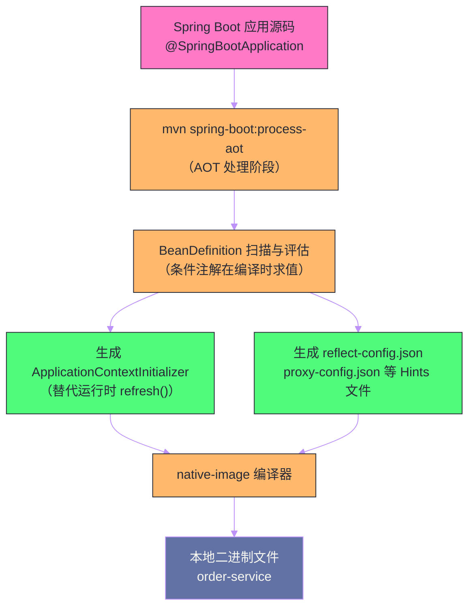

# 3.x新特性——GraalVM Native Image与虚拟线程

## 摘要

Spring Boot 3.x 是 Spring 生态系十年来最大规模的架构升级——最低要求 Java 17，并对两个颠覆性技术提供了原生支持：**GraalVM Native Image**（将 Spring Boot 应用编译为本地二进制文件，启动时间从秒级降至毫秒级，内存占用降低 80%）和 **Project Loom 虚拟线程**（用平台级别的轻量级线程彻底改写 Java 并发模型，使"一请求一线程"的简单编程模型在高并发场景下重新具备竞争力）。这两个技术方向分别代表了 Java 在云原生时代的两条进化路径：Native Image 追求极致的冷启动速度和最小内存占用，虚拟线程追求在传统 JVM 上突破 IO 密集型场景的吞吐量瓶颈。本文深入剖析这两项技术的底层原理、与 Spring Boot 的集成方式、使用限制与生产实践。

---

## 第 1 章 云原生时代的 Java 困境

### 1.1 Serverless 与微服务对启动速度的极端要求

传统的 Java 应用部署模式是"长时间运行"（Long-running）的——应用启动一次，运行数天数周，JVM 的 JIT 编译器有充足时间将热点代码优化到极致，启动时间（5-30 秒）和初始内存占用（200-500MB）在这种模式下不是问题。

但云原生时代改变了这一假设：

- **Serverless/FaaS**（AWS Lambda、Knative）：函数按请求按需启动，每次冷启动都必须完整初始化 JVM + Spring Context。5 秒的启动延迟在 Lambda 场景下直接影响用户体验（HTTP 请求超时）；
- **水平扩缩容**：Kubernetes HPA 在流量峰值时快速扩容，新 Pod 需要在 5-10 秒内就绪接收流量，慢启动的 Java 服务往往来不及响应突发流量；
- **Spot 实例**：云厂商的竞价实例随时可能被回收，应用必须能快速重启；
- **边缘计算**：IoT 设备、CDN 边缘节点内存极为受限，传统 JVM 的 200MB 起步内存占用不可接受。

与此同时，Go 语言在这些场景表现出色：编译为静态二进制文件，启动时间 < 10ms，内存占用 < 20MB。这让 Java 生态感受到了切实的竞争压力。

### 1.2 两条进化路径

Spring Boot 3.x 的应对策略分两条线：

**路径一：GraalVM Native Image**——放弃 JVM 动态特性，换取极致启动速度和最小内存占用。AOT（Ahead-of-Time）编译将整个应用（包括 Spring 框架代码）编译为本地机器码，运行时不需要 JVM，直接执行原生二进制文件；

**路径二：Project Loom 虚拟线程**——保留 JVM 和所有动态特性，通过 JDK 级别的轻量级线程突破 IO 密集型场景的吞吐量瓶颈，用更少的资源处理更高的并发。

这两条路径针对不同的场景和约束，不是非此即彼的关系：
- 需要**极致冷启动**（Serverless）→ Native Image；
- 需要**极致吞吐量**（高并发 IO 密集型服务）→ 虚拟线程；
- 长期运行的微服务且对启动时间不敏感 → 继续使用传统 JVM（JIT 热态性能最优）。

---

## 第 2 章 GraalVM Native Image：从 JVM 到原生二进制

### 2.1 GraalVM 与 Native Image 是什么

[[GraalVM]] 是 Oracle 开发的高性能多语言虚拟机，它可以运行 Java、JavaScript、Python、Ruby 等多种语言。其中最具革命性的功能是 **Native Image**：一个将 Java 字节码编译为**本地机器码**（x86/ARM 二进制文件）的工具。

编译产物是一个独立的可执行文件（在 Linux 上是 ELF 格式），**不依赖 JRE/JDK**，可以直接执行：

```bash
# 传统部署
java -jar order-service.jar  # 需要 JVM，启动 5-15s，内存 256MB+

# Native Image 部署
./order-service              # 直接执行，启动 < 100ms，内存 30-80MB
```

### 2.2 Native Image 的编译原理：封闭世界假设

Native Image 编译器的核心工作原理基于**封闭世界假设**（Closed World Assumption）：

> 编译时已知所有代码，没有任何代码会在运行时被动态加载或生成。

这个假设让 GraalVM 可以在编译时进行极为激进的优化：

1. **静态初始化**（Static Initialization）：将 Spring Context 的初始化工作（Bean 扫描、自动配置评估、`BeanDefinition` 注册等）从运行时前移到**编译时**。编译时处理完的 Bean 定义直接固化进二进制文件，运行时直接恢复状态，无需重新执行 `refresh()`；

2. **可达性分析**（Reachability Analysis）：从应用的 `main` 方法出发，递归分析所有可达的类、方法、字段。未被引用的代码**不会**打包进二进制文件（Dead Code Elimination），这是 Native Image 体积小的核心原因；

3. **内联与优化**：由于代码在编译时已完全已知，编译器可以做远比 JIT 更激进的内联和优化，某些场景下热态性能甚至优于 JIT；

4. **运行时不含 JIT 编译器**：Native Image 的运行时是 SubstrateVM——一个极简的 VM，只提供 GC、异常处理等基础设施，不包含 JIT 编译器（代码已经是机器码，不需要再编译）。

### 2.3 为什么 Java 反射是 Native Image 的最大挑战

封闭世界假设与 Java 的动态特性存在根本冲突。Java 中大量使用反射（`Class.forName()`、`Method.invoke()`）、JDK 动态代理、序列化等机制，这些特性在运行时才能确定实际操作的类——这恰恰违反了"编译时已知所有代码"的假设。

**Spring Framework 本身就是反射的重度用户**：
- `@Autowired` 通过反射注入依赖；
- `@Transactional` 通过 JDK 动态代理（`java.lang.reflect.Proxy`）或 CGLIB（运行时字节码生成）创建代理类；
- Jackson 通过反射序列化/反序列化 POJO；
- `@Configuration` 类通过 CGLIB 生成子类……

这些反射调用如果在编译时无法被静态分析追踪到，就不会被 GraalVM 纳入可达性分析，对应的类在 Native Image 中就不存在——运行时触发 `NoClassDefFoundError` 或 `ClassNotFoundException`。

### 2.4 Runtime Hints：告诉 GraalVM 反射需要什么

解决方案是向 GraalVM 提供"提示"（Hints），声明哪些类在运行时需要通过反射访问。GraalVM 的提示以 JSON 文件形式存在，放在 `META-INF/native-image/` 目录下：

```json
// META-INF/native-image/reflect-config.json
[
  {
    "name": "com.example.order.Order",
    "allDeclaredConstructors": true,
    "allDeclaredMethods": true,
    "allDeclaredFields": true
  },
  {
    "name": "com.example.order.OrderRequest",
    "allDeclaredConstructors": true,
    "allPublicMethods": true
  }
]
```

Spring Boot 3.x 提供了更优雅的 Java API——`RuntimeHintsRegistrar`：

```java
// 通过 Java 代码声明 Runtime Hints（比 JSON 更易维护、有 IDE 支持）
public class OrderRuntimeHints implements RuntimeHintsRegistrar {
    
    @Override
    public void registerHints(RuntimeHints hints, ClassLoader classLoader) {
        // 反射提示：声明需要反射访问的类
        hints.reflection()
            .registerType(Order.class, 
                MemberCategory.INVOKE_DECLARED_CONSTRUCTORS,
                MemberCategory.INVOKE_DECLARED_METHODS,
                MemberCategory.DECLARED_FIELDS)
            .registerType(OrderRequest.class,
                MemberCategory.INVOKE_PUBLIC_CONSTRUCTORS,
                MemberCategory.INVOKE_PUBLIC_METHODS);
        
        // 资源提示：声明需要在运行时加载的资源文件
        hints.resources()
            .registerPattern("templates/order-confirmation.html")
            .registerPattern("i18n/messages*.properties");
        
        // 代理提示：声明需要 JDK 动态代理的接口
        hints.proxies()
            .registerJdkProxy(OrderService.class)
            .registerJdkProxy(PaymentGateway.class);
        
        // 序列化提示：Jackson / Java 序列化
        hints.serialization()
            .registerType(Order.class)
            .registerType(OrderEvent.class);
    }
}

// 在配置类上引用 Hints 注册器
@Configuration
@ImportRuntimeHints(OrderRuntimeHints.class)
public class OrderConfiguration { ... }
```

### 2.5 Spring Boot AOT 处理器：自动化 Hints 生成

手动编写所有 Hints 是不现实的——Spring Framework 本身就使用了大量反射，如果每个应用都要手动为框架代码编写 Hints，工作量是天文数字。

Spring Boot 3.x 引入了 AOT 处理器（`spring-boot-maven-plugin` 的 `process-aot` goal），在构建时**自动分析** Spring 应用并生成所需的 Hints：



AOT 处理器会：
1. 模拟 Spring Context 的启动流程（评估所有 `@Conditional` 条件、扫描 Bean）；
2. 将结果固化为 `BeanDefinition` 的静态描述文件和 `ApplicationContextInitializer` 实现类；
3. 分析所有已注册 Bean 的类型，自动生成反射、代理、资源等 Hints。

自动生成的 Hints 覆盖了 Spring Framework 核心的大部分场景，但对于应用自身的动态逻辑（运行时 `Class.forName()`、动态代理等），仍需手动补充 `RuntimeHintsRegistrar`。

### 2.6 构建与运行 Native Image

```xml
<!-- pom.xml：Spring Boot Maven Plugin 支持 Native Image 构建 -->
<plugin>
    <groupId>org.springframework.boot</groupId>
    <artifactId>spring-boot-maven-plugin</artifactId>
    <configuration>
        <image>
            <!-- 使用 Buildpacks 构建 Native Image Docker 镜像 -->
            <builder>paketobuildpacks/builder-jammy-tiny</builder>
            <env>
                <BP_NATIVE_IMAGE>true</BP_NATIVE_IMAGE>
            </env>
        </image>
    </configuration>
    <executions>
        <execution>
            <id>process-aot</id>
            <goals>
                <goal>process-aot</goal>
            </goals>
        </execution>
    </executions>
</plugin>

<!-- GraalVM Native Build Tools Plugin -->
<plugin>
    <groupId>org.graalvm.buildtools</groupId>
    <artifactId>native-maven-plugin</artifactId>
    <executions>
        <execution>
            <id>build-native</id>
            <goals>
                <goal>compile-no-fork</goal>
            </goals>
            <phase>package</phase>
        </execution>
        <!-- 运行 Native Image 的测试 -->
        <execution>
            <id>test-native</id>
            <goals>
                <goal>test</goal>
            </goals>
            <phase>test</phase>
        </execution>
    </executions>
</plugin>
```

```bash
# 方式一：直接编译为本地二进制（需要本地安装 GraalVM）
mvn -Pnative native:compile

# 方式二：通过 Buildpacks 构建 Docker 镜像（不需要本地 GraalVM，推荐）
mvn spring-boot:build-image -Pnative

# 运行 Native Image
./target/order-service
# 或运行 Docker 镜像
docker run order-service:latest
```

### 2.7 Native Image 的限制与使用边界

Native Image 不是万能药，有明确的使用限制：

| 限制点 | 说明 | 影响 |
| --- | --- | --- |
| **反射** | 未声明的反射调用会失败 | 需要 Hints 或 AOT 代理 |
| **动态代理** | 仅支持编译时已知接口的 JDK 代理；CGLIB 运行时字节码生成不支持 | Spring AOP 改用 AOT 生成的代理类 |
| **类动态加载** | `ClassLoader.loadClass()` 加载编译时未知的类会失败 | 热插拔插件机制无法使用 |
| **Java Agent** | 大多数 Java Agent 使用字节码注入，与 Native Image 不兼容 | APM（Pinpoint、SkyWalking 的 Java Agent）可能不支持 |
| **编译时间长** | Native Image 编译通常需要 3-10 分钟 | CI/CD 流水线需要调整 |
| **无 JIT 优化** | 运行时没有 JIT 编译器，热态吞吐量低于 JVM 模式 | 长时间运行、CPU 密集型场景不如传统 JVM |
| **GC 限制** | SubstrateVM 的 GC 选项比 HotSpot 少（Serial GC 为主，G1 实验性支持） | 大堆内存场景 GC 性能不如 HotSpot |

> [!note] Native Image 的最适场景
> Native Image 最适合以下场景：
> 1. **Serverless/FaaS**：冷启动时间是 SLA 的核心指标；
> 2. **CLI 工具**：命令行工具用户期望即时响应，不能等 JVM 启动；
> 3. **边缘计算**：内存受限的设备；
> 4. **短生命周期任务**：批处理作业、定时任务，运行几分钟就退出。
>
> 对于需要长期运行、CPU 密集型、或大量使用反射的传统 Web 服务，传统 JVM（配合虚拟线程）通常是更好的选择。

---

## 第 3 章 Project Loom 虚拟线程：重新定义 Java 并发

### 3.1 传统线程模型的根本瓶颈

理解虚拟线程为什么重要，需要先理解传统线程模型（平台线程，Platform Thread）的瓶颈所在。

Java 的平台线程（`new Thread(runnable)`）是对操作系统线程的一对一封装：
- 每个平台线程对应一个 OS 线程；
- OS 线程需要预分配**固定大小的栈内存**（Linux 默认 512KB-8MB）；
- 线程上下文切换需要系统调用，涉及内核态/用户态切换，开销约 1-10 微秒；
- 一台 8GB 内存的服务器，最多能创建约 8000-16000 个平台线程（4MB 栈 × 2000 = 8GB）。

在 IO 密集型应用（如典型的微服务 API：接收请求 → 查询数据库 → 调用外部服务 → 返回响应）中，处理一个请求的大部分时间（90%+）都消耗在等待 IO 上，线程处于阻塞状态，宝贵的 CPU 资源被白白浪费：

```
请求处理时间线（100ms 总计）：
├── 接收解析 HTTP 请求：5ms    ← CPU 工作
├── 查询数据库等待：60ms       ← IO 阻塞，线程什么也不做
├── 调用外部服务等待：30ms     ← IO 阻塞，线程什么也不做
└── 序列化响应：5ms            ← CPU 工作
```

在这 100ms 中，线程真正做有效工作只有 10ms（10%），其余 90ms 在阻塞等待。但这个线程在整个等待期间都占用着操作系统线程资源，阻止了其他请求使用这个"线程槽位"。

**提升并发的传统方案**——响应式编程（[[Project Reactor]]、RxJava）：通过 `Mono`/`Flux` 的异步回调模型，让少量线程交替处理大量请求。这确实解决了线程资源浪费问题，但代价是**编程模型的彻底颠覆**——回调嵌套、错误处理复杂、调试困难、与传统阻塞 API 的集成需要大量适配工作。很多团队因为学习曲线太陡而放弃。

### 3.2 虚拟线程的设计思想：协程级轻量化 + 线程级编程模型

[[Project Loom]] 的核心洞察是：**不需要改变编程模型，只需要让"等待"变得廉价**。

虚拟线程（Virtual Thread）是 JDK 21 正式发布的特性，它与平台线程的根本区别在于：

- **虚拟线程不是 OS 线程**：虚拟线程由 JVM 管理，底层运行在少量**载体线程**（Carrier Thread，即平台线程）上；
- **挂起/恢复是 JVM 级别的**：当虚拟线程执行阻塞 IO 操作时，JVM 将其**挂起**（保存栈状态到堆内存），释放载体线程去执行其他虚拟线程；IO 完成后，JVM 将虚拟线程**恢复**（从堆内存恢复栈状态），再调度到某个载体线程继续执行；
- **栈内存按需分配**：虚拟线程的栈不是预分配的固定大小，而是在堆内存中动态增长的可伸缩栈（初始几百字节，最大可增长到几 MB）；
- **创建成本极低**：创建一个虚拟线程约 1-2 微秒，内存消耗约 1KB（vs 平台线程 ~100μs 创建、~1MB 内存）。

在 IO 密集型场景下，同样的硬件资源，虚拟线程可以处理的并发请求数是平台线程的 10-100 倍：

```
平台线程（200 个线程，90% 时间阻塞）：
└── 实际有效吞吐量 ≈ 200 * 10% = 20 个并发请求

虚拟线程（200万个虚拟线程，90% 时间挂起）：
└── 载体线程不阻塞，实际有效吞吐量 ≈ CPU核心数 * 请求/秒
```

### 3.3 编程模型的魅力：与传统代码完全兼容

虚拟线程最大的优势是**不改变编程模型**。传统的同步阻塞代码，在虚拟线程上运行时自动获得高并发能力：

```java
// 这是普通的同步阻塞代码，没有 CompletableFuture、没有 Mono/Flux
@RestController
public class OrderController {
    
    @GetMapping("/orders/{id}")
    public Order getOrder(@PathVariable Long orderId) {
        Order order = orderRepository.findById(orderId);    // 阻塞查询数据库
        List<Item> items = itemService.getItems(orderId);   // 阻塞调用外部服务
        order.setItems(items);
        return order;
    }
}
```

在传统平台线程上，这段代码每处理一个并发请求需要占用一个 OS 线程；在虚拟线程上，`findById()` 等待数据库 IO 时，载体线程被释放去处理其他请求，不浪费任何 OS 资源。

**最关键的一点**：这段代码**完全不需要修改**。

### 3.4 Spring Boot 3.2 的虚拟线程支持

Spring Boot 3.2（对应 Spring Framework 6.1）正式提供了虚拟线程的一键启用支持：

```yaml
# application.yml：一行配置启用虚拟线程
spring:
  threads:
    virtual:
      enabled: true
```

这一行配置背后，Spring Boot 做了什么？

```java
// VirtualThreadTaskExecutorAutoConfiguration（Spring Boot 3.2）
@AutoConfiguration
@ConditionalOnProperty(value = "spring.threads.virtual.enabled", havingValue = "true")
public class VirtualThreadTaskExecutorAutoConfiguration {
    
    // 替换 Tomcat 的线程池为虚拟线程执行器
    @Bean
    @ConditionalOnClass(Tomcat.class)
    public TomcatVirtualThreadsProtocolHandlerCustomizer<?> tomcatVirtualThreadsCustomizer() {
        return protocolHandler -> {
            if (protocolHandler instanceof AbstractProtocol<?> abstractProtocol) {
                // 将 Tomcat 的 Executor 替换为虚拟线程工厂
                abstractProtocol.setExecutor(Executors.newVirtualThreadPerTaskExecutor());
            }
        };
    }
    
    // Spring MVC 的异步任务执行器也替换为虚拟线程
    @Bean
    @ConditionalOnMissingBean(AsyncTaskExecutor.class)
    public SimpleAsyncTaskExecutor applicationTaskExecutor() {
        SimpleAsyncTaskExecutor executor = new SimpleAsyncTaskExecutor("virtual-");
        executor.setVirtualThreads(true);  // 使用虚拟线程
        return executor;
    }
}
```

启用后，**每个 HTTP 请求**都在一个独立的虚拟线程上处理（而非从线程池中借用平台线程）。可以放心地为每个请求创建一个虚拟线程——`Executors.newVirtualThreadPerTaskExecutor()` 会为每个任务创建一个新的虚拟线程，成本极低。

### 3.5 虚拟线程的性能实测对比

在 IO 密集型场景（每个请求包含 2 次数据库查询，每次查询延迟 50ms）的基准测试中：

| 配置 | 线程数 | QPS | P99 延迟 | 内存 |
| --- | --- | --- | --- | --- |
| 平台线程（默认 200） | 200 | ~2,000 | ~110ms | 256MB |
| 平台线程（扩到 2000） | 2,000 | ~12,000 | ~180ms | 2GB |
| 虚拟线程 | 按需（百万级） | ~18,000 | ~115ms | 512MB |
| Spring WebFlux（响应式） | 少量（2 × CPU） | ~20,000 | ~105ms | 256MB |

虚拟线程的吞吐量接近响应式编程，但使用的是传统同步代码，没有任何心智负担。

---

## 第 4 章 虚拟线程的使用陷阱

### 4.1 Pinning：载体线程被"钉住"

虚拟线程的性能收益依赖于"阻塞时释放载体线程"这一机制。但有些情况下，虚拟线程无法被挂起，会导致载体线程被"钉住"（Pinning）——阻塞整个 OS 线程：

**场景一：`synchronized` 块/方法内的阻塞 IO**

```java
// ❌ 这会钉住载体线程！虚拟线程在 synchronized 块内无法被挂起
public synchronized void processOrder(Order order) {
    order = orderRepository.save(order);    // 阻塞 IO，但载体线程被钉住
    notificationService.sendEmail(order);  // 同上
}

// ✅ 改用 ReentrantLock（支持虚拟线程挂起）
private final ReentrantLock lock = new ReentrantLock();

public void processOrder(Order order) {
    lock.lock();
    try {
        order = orderRepository.save(order);    // 阻塞时可以挂起
        notificationService.sendEmail(order);
    } finally {
        lock.unlock();
    }
}
```

**场景二：`native` 方法调用中的阻塞**

部分原生方法（通过 JNI 调用）在执行期间无法被 JVM 中断，也会导致 Pinning。

> [!warning] 检测 Pinning 的方法
> 通过 JVM 参数 `-Djdk.tracePinnedThreads=full` 启动应用，当发生 Pinning 时 JVM 会打印栈追踪信息：
> ```
> Thread[#xx,ForkJoinPool-1-worker-1,5,CarrierThreads]
>     com.example.OrderService.processOrder(OrderService.java:45) <== monitors:1
>     ...
> ```
> `monitors:1` 表示持有 1 个监视器锁（`synchronized`）。这是排查 Pinning 的标准方法。

### 4.2 ThreadLocal 与虚拟线程

`ThreadLocal` 在虚拟线程上能正常工作——每个虚拟线程都有自己独立的 `ThreadLocal` 存储。但有两个需要注意的地方：

**问题一：`ThreadLocal` 值在线程池中的残留**

平台线程通常来自线程池（被复用），使用后需要手动清理 `ThreadLocal`，否则下一个借用这个线程的请求会看到上一个请求残留的值。虚拟线程是"用后即弃"的——每个任务一个新虚拟线程，不存在这个问题（虚拟线程结束时 `ThreadLocal` 自动清理）。

**问题二：高内存占用（`ThreadLocal` 防御性拷贝）**

如果代码中每个 `ThreadLocal` 存储的对象很大，且虚拟线程数量极多（百万级），`ThreadLocal` 存储的总内存可能很可观。Java 21 引入了 **Scoped Values**（`ScopedValue`）作为 `ThreadLocal` 的更轻量替代，推荐在虚拟线程场景使用。

### 4.3 与连接池的兼容性

数据库连接池（HikariCP）、HTTP 客户端连接池等资源池在虚拟线程场景下需要特别关注：

```yaml
# HikariCP 的最大连接数需要与实际数据库连接限制匹配
# 虚拟线程可以创建百万级并发，但数据库通常只支持几百到几千个连接
spring:
  datasource:
    hikari:
      maximum-pool-size: 100  # 不能因为有虚拟线程就无限增大连接数
      connection-timeout: 3000
```

虚拟线程等待 HikariCP 连接时，会被挂起（HikariCP 内部使用 `ReentrantLock`，支持虚拟线程挂起），不会浪费载体线程。但**数据库侧的连接数**仍然是硬限制——100 个数据库连接，就只能有 100 个并发查询，超出的请求需要排队等待连接。

---

## 第 5 章 Native Image 与虚拟线程的结合

Spring Boot 3.x 支持同时使用 Native Image 和虚拟线程：

```yaml
# application.yml
spring:
  threads:
    virtual:
      enabled: true
```

在 Native Image 模式下：
- 虚拟线程由 SubstrateVM 支持（GraalVM 21+ 已支持虚拟线程）；
- 应用可以同时获得极快的冷启动（Native Image）和高 IO 吞吐量（虚拟线程）；
- 这是 Serverless 场景的终极组合：启动 < 100ms，且不受平台线程数量限制。

---

## 第 6 章 Spring Boot 3.x 的其他重要变化

### 6.1 Jakarta EE 10：javax → jakarta

Spring Boot 3.x 将 Java EE（javax）命名空间迁移到 Jakarta EE（jakarta），这是 Spring Boot 3.x 最具破坏性的变化：

```java
// Spring Boot 2.x（Java EE，javax 命名空间）
import javax.persistence.Entity;
import javax.validation.constraints.NotNull;
import javax.servlet.http.HttpServletRequest;

// Spring Boot 3.x（Jakarta EE，jakarta 命名空间）
import jakarta.persistence.Entity;          // ← 包名变了
import jakarta.validation.constraints.NotNull;
import jakarta.servlet.http.HttpServletRequest;
```

迁移步骤：
1. 升级 Spring Boot 版本到 3.x（同时升级 Java 到 17+）；
2. 使用 OpenRewrite 的 `UpgradeSpringBoot_3_0` recipe 自动批量替换 `javax` → `jakarta`；
3. 检查所有直接依赖 Java EE 的三方库是否有支持 Jakarta EE 的版本。

### 6.2 Observability：统一的可观测性 API

Spring Boot 3.x 将 Micrometer Tracing（链路追踪）与 Micrometer Metrics（指标）统一整合，形成完整的可观测性三支柱体系（Logs + Metrics + Traces）：

```java
// Spring Boot 3.x 的 @Observed：一个注解，同时创建 Span（链路追踪）和 Timer（指标）
@Service
@Observed(name = "order.service", contextualName = "creating-order")
public class OrderService {
    
    // @Observed 注解在方法调用时自动：
    // 1. 创建 Micrometer Span（链路追踪）
    // 2. 记录 Timer（方法耗时）
    // 3. 关联 MDC（日志 traceId）
    @Observed(name = "order.creation", lowCardinalityKeyValues = {"type", "standard"})
    public Order createOrder(OrderRequest request) {
        return orderRepository.save(new Order(request));
    }
}
```

---

## 总结

Spring Boot 3.x 代表了 Spring 生态迈向云原生时代的重要里程碑：

**GraalVM Native Image**：
- AOT 编译将应用变成本地二进制文件，冷启动 < 100ms，内存占用降低 80%；
- "封闭世界假设"与 Java 动态特性冲突，需要通过 `RuntimeHintsRegistrar` 声明反射/代理需求；
- Spring Boot AOT 处理器（`process-aot`）自动分析并生成大部分 Hints；
- 最适合 Serverless、CLI 工具、边缘计算等短生命周期或内存受限场景；
- 不适合重度依赖反射/动态代理、需要 Java Agent、或对热态吞吐量要求高的场景；

**Project Loom 虚拟线程**：
- JVM 管理的轻量级线程，阻塞 IO 时自动挂起释放载体线程，不占用 OS 线程资源；
- 创建成本极低（~1KB 内存），可轻松支持百万级并发；
- 编程模型与传统同步代码完全兼容，无需响应式编程的复杂心智模型；
- Spring Boot 3.2 一行配置启用（`spring.threads.virtual.enabled=true`）；
- 核心陷阱：`synchronized` 块内阻塞 IO 导致 Pinning（改用 `ReentrantLock`）；数据库连接池大小仍需与实际 DB 连接数匹配；
- 最适合高并发 IO 密集型服务（微服务 API、网关等）；

**二者结合**：GraalVM Native Image + 虚拟线程 = 极致冷启动 + 极致 IO 吞吐量，是 Serverless 场景的终极解决方案。

至此，Spring Boot 专栏全部 10 篇文章创作完毕，与 SpringCore 专栏共同构成了一套从 Spring 底层原理到生产实践的完整知识体系。

---

> [!note] 参考资料
> - [GraalVM Native Image 官方文档](https://www.graalvm.org/latest/reference-manual/native-image/)
> - [Spring Boot AOT 官方文档](https://docs.spring.io/spring-boot/docs/current/reference/html/native-image.html)
> - [JEP 444: Virtual Threads（JDK 21 正式版）](https://openjdk.org/jeps/444)
> - [Spring Boot 3.x 迁移指南](https://github.com/spring-projects/spring-boot/wiki/Spring-Boot-3.0-Migration-Guide)
> - [Project Loom 虚拟线程性能基准](https://spring.io/blog/2022/10/11/embracing-virtual-threads)

---

> [!note] 思考题
> 1. `@SpringBootTest` 启动完整的 ApplicationContext，适合集成测试但速度慢。`@WebMvcTest` 只加载 Web 层的 Bean（Controller、Filter、ControllerAdvice），速度快但需要 Mock Service 层。在一个有 200+ Bean 的大型应用中，`@SpringBootTest` 启动可能需要 30 秒以上。你如何优化测试启动速度？`@DirtiesContext` 和 Context 缓存机制是什么关系？
> 2. `@MockBean` 将 ApplicationContext 中的 Bean 替换为 Mockito Mock。但 `@MockBean` 会导致 ApplicationContext 被重新创建（因为 Bean 定义改变了），无法复用缓存的 Context。在一个测试类中使用 5 个 `@MockBean` 与在另一个测试类中使用 3 个不同的 `@MockBean`——这两个测试类能共享 ApplicationContext 吗？
> 3. Testcontainers 允许在测试中启动真实的 Docker 容器（如 MySQL、Redis）。`@ServiceConnection` 注解可以自动将容器的连接信息配置到 Spring Context 中。Testcontainers 的启动时间（约 5-10 秒）是否可以接受？在 CI 环境中频繁启动/销毁容器是否会成为瓶颈？有哪些优化策略？
