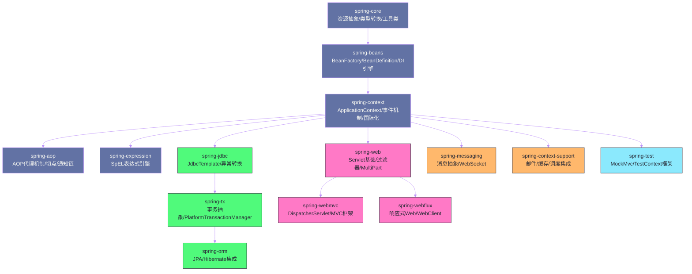
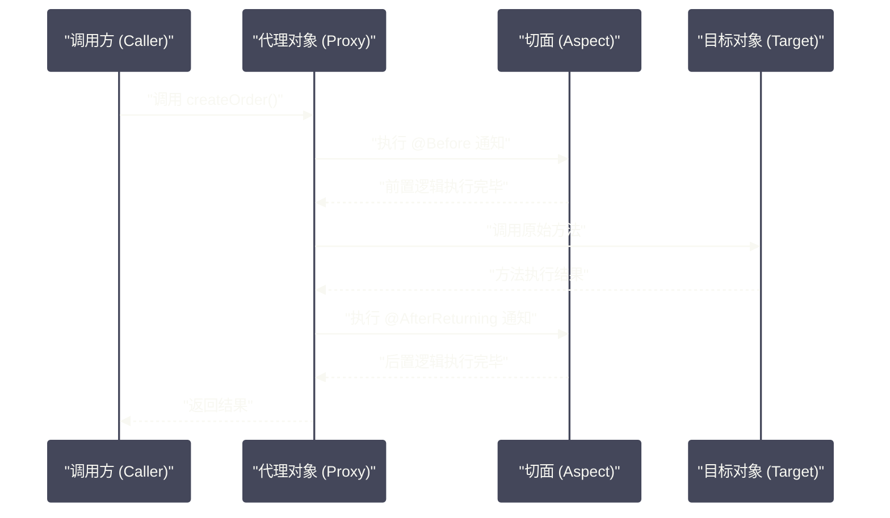
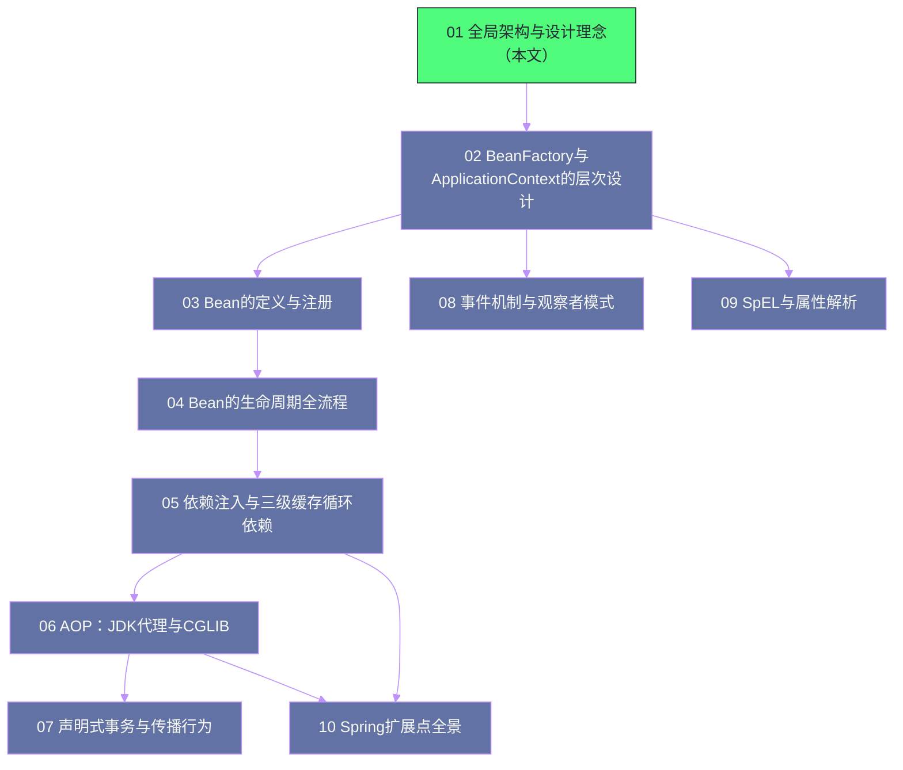

# Spring全局架构——模块划分与核心设计理念

## 摘要

本文是 Spring Core 原理专栏的开篇。在深入源码之前，我们需要先建立一个全局视角——Spring Framework 究竟是什么？它为什么能在 J2EE 时代杀出重围，成为 Java 企业开发的事实标准？它的模块是如何组织的，各模块之间的依赖关系是怎样的？控制反转（IoC）和依赖注入（DI）这两个词你一定听过，但它们在本质上是什么关系，Spring 为何选择以此为核心？本文将以"是什么 → 为什么 → 不这样会怎样"的逻辑，带你完整建立对 Spring 的宏观认知，为后续深入每一个机制奠定坚实基础。

---

## 第 1 章 Spring 的历史与诞生背景

### 1.1 J2EE 的困境：Spring 诞生的根本原因

要理解 Spring 的设计哲学，必须先理解它所要解决的问题。2003年，Rod Johnson 在他的著作《Expert One-on-One J2EE Design and Development》中，系统性地批判了当时主流的 J2EE 开发模式——EJB（Enterprise JavaBeans）。

J2EE 的 EJB 规范在设计之初出发点是好的：它试图为企业级应用提供一套标准化的、容器管理的、可分布式部署的组件模型。但在实践中，它走向了另一个极端——**过度复杂**。

一个典型的 EJB 2.x 应用，开发者要写一个简单的业务服务类，往往需要：

1. 编写一个 **Remote 接口**，声明所有可被远程调用的方法；
2. 编写一个 **Home 接口**，用于创建和查找 EJB 实例；
3. 编写 **实现类**，必须继承 `javax.ejb.SessionBean` 并实现一堆生命周期方法（`ejbCreate`、`ejbRemove`、`ejbActivate`、`ejbPassivate`），而这些方法在业务上通常是空实现；
4. 编写 **部署描述符**（一大坨 XML），描述 EJB 的事务策略、安全角色、JNDI 名称等等；
5. 将代码部署到专用的**重量级应用服务器**（WebLogic、JBoss、WebSphere）上，离开容器寸步难行。

最令人崩溃的是：**这样一个 EJB 组件几乎无法在容器外独立测试**。你必须启动整个应用服务器才能运行一次单元测试，每次测试的启动时间动辄几分钟。在当时，"单元测试"这个概念对于 EJB 开发者来说几乎是奢侈品。

> [!warning] J2EE 困境的本质
> EJB 的核心问题不是"功能不强大"，而是它用**侵入性**换取了功能。它强制业务代码继承特定基类、实现特定接口、依赖特定容器环境，导致业务逻辑与基础设施代码严重耦合，完全违背了"关注点分离"（Separation of Concerns）的基本原则。

Rod Johnson 提出的核心洞见是：**对于绝大多数企业应用，根本不需要 EJB 的那套重量级机制（分布式对象、XA 事务等），用普通的 Java 对象（POJO）配合轻量级框架完全可以做到**。这个观点在当时的 J2EE 社区是相当激进的，但历史证明他是对的。

### 1.2 Spring 的核心主张：用 POJO 构建企业应用

Spring 的出发点非常明确：**让普通的 Java 对象（Plain Old Java Object，POJO）成为一等公民**。

所谓 POJO，就是没有继承任何特定框架基类、没有实现任何特定框架接口的普通 Java 类。你可以在任何地方创建它的实例，可以在没有任何容器的情况下对它进行单元测试。这是 Spring 与 EJB 最根本的区别：

- **EJB 模型**：业务对象必须"委身"于容器，代码侵入，生命周期由容器完全托管；
- **Spring 模型**：业务对象保持 POJO 纯洁性，通过外部配置（XML 或注解）将它们"组装"在一起，容器负责协调，但不污染业务代码。

这个主张直接决定了 Spring 的两个核心能力：

1. **IoC 容器（控制反转）**：由容器来"管理"POJO 的创建、配置和生命周期，而不是由 POJO 自己去查找依赖；
2. **AOP（面向切面编程）**：将横切关注点（日志、事务、安全）从业务 POJO 中剥离，以声明式的方式叠加，不需要业务代码继承任何特定基类。

### 1.3 Spring Framework 的版本演进

理解版本演进有助于我们把握各个特性出现的历史背景，避免用旧的知识去解读新版本的行为。

| 版本里程碑 | 发布年份 | 核心变化 |
| --- | --- | --- |
| **Spring 1.0** | 2004 | 首个正式发布版，IoC 容器 + AOP 基础框架，XML 配置驱动 |
| **Spring 2.0** | 2006 | 简化 XML 配置，引入 `<context:component-scan>` 注解扫描 |
| **Spring 2.5** | 2007 | `@Component`/`@Service`/`@Repository`/`@Controller` 等基础注解正式引入 |
| **Spring 3.0** | 2009 | 全面拥抱 Java 5+，`@Configuration`/`@Bean` 注解驱动配置，`@Async`/`@Scheduled` |
| **Spring 3.1** | 2011 | `@Profile`、`@Enable*` 系列模块开关注解、环境抽象（`Environment`） |
| **Spring 4.0** | 2013 | 全面支持 Java 8，`@Conditional` 条件注解（SpringBoot 的基石） |
| **Spring 5.0** | 2017 | 响应式编程栈（WebFlux），要求 JDK 8+ |
| **Spring 5.3** | 2020 | 最后一个支持 JDK 8/11/17 的大版本 |
| **Spring 6.0** | 2022 | **迁移至 Jakarta EE 9**（`javax.*` → `jakarta.*`），要求 JDK 17+，AOT 编译支持 |
| **Spring 6.1** | 2023 | 虚拟线程（Project Loom）支持，JDK 21 适配 |

> [!info] 关于 Spring 6.x 的迁移意义
> Spring 6.0 是一个历史性的版本。它将整个框架从传统的 `javax.*` 命名空间迁移到了 Jakarta EE 9 的 `jakarta.*` 命名空间。这意味着依赖旧 `javax.*` 包的代码必须进行迁移。同时，JDK 17 的强制要求也是 Spring 向现代 Java 的一次明确表态，记录式类（Record）、密封类（Sealed Class）等 Java 新特性将在 Spring 生态中得到更好的支持。

---

## 第 2 章 Spring Framework 的模块层次

### 2.1 模块全景图

Spring Framework 并不是一个单体的巨石架构，而是一个**精心设计的、可按需组合的模块化框架**。官方将其核心模块划分为以下几个大类：



这张依赖图揭示了一个非常重要的信息：**`spring-core` 和 `spring-beans` 是整个框架的绝对基础**，所有其他模块都依赖于它们。理解这两个模块，就抓住了 Spring 的命脉。

### 2.2 Core Container 层：框架的地基

Core Container 由四个核心模块构成，它们是 Spring 一切能力的来源：

#### 2.2.1 spring-core：工具箱与资源抽象

`spring-core` 是最底层的模块，它提供的不是"业务功能"，而是整个框架赖以运行的**基础能力**：

- **`Resource` 抽象**：将不同来源的资源（classpath、file、URL、even InputStream）统一成一个接口。`ClassPathResource`、`FileSystemResource`、`UrlResource` 等实现类让框架内部的资源加载代码不必关心资源从哪里来。
- **类型转换体系（`ConversionService`）**：将字符串 `"true"` 转换成 `Boolean`，将 `"2024-01-01"` 转换成 `LocalDate`，这是注解驱动配置能够工作的基础。
- **`ReflectionUtils`、`ClassUtils`、`StringUtils`** 等大量工具类：封装了 Java 反射操作、类加载、字符串处理等底层 API，屏蔽了版本差异和异常处理的繁琐。

> [!note] 为什么需要 Resource 抽象？
> Java 标准库处理资源加载的 API 非常分散：classpath 下的文件要用 `ClassLoader.getResourceAsStream()`，文件系统上的文件要用 `File`，网络资源要用 `URL.openStream()`。Spring 用 `Resource` 接口将它们统一，使得框架内部所有读取配置文件的代码只依赖这一个接口，极大降低了耦合度——这本身就是面向接口编程的经典范例。

#### 2.2.2 spring-beans：IoC 引擎的核心

`spring-beans` 是 IoC 容器的核心实现模块，包含了两个最重要的概念：

**`BeanFactory`**：Spring IoC 容器的根接口，定义了"根据名称/类型获取 Bean"的基础能力。它是一个非常简洁的接口，核心方法只有几个：`getBean(String name)`、`getBean(Class<T> requiredType)`、`containsBean(String name)`、`isSingleton(String name)` 等。

**`BeanDefinition`**：一个 Bean 的"元数据描述符"。当 Spring 读取你的 XML 配置或扫描你的注解时，它不会立刻创建 Bean 实例，而是先将 Bean 的描述信息（类名、scope、是否懒加载、构造器参数、属性值、初始化/销毁方法名……）封装成一个 `BeanDefinition` 对象存入注册表。只有在真正需要时，才根据这份"配方"实例化 Bean。

这种"先注册元数据，再按需实例化"的设计是整个 Spring 容器能够支持懒加载、原型作用域、循环依赖处理等复杂特性的根本原因。

#### 2.2.3 spring-context：容器的"大脑升级版"

`spring-context` 在 `spring-beans` 的 `BeanFactory` 基础上，构建了 `ApplicationContext` 这个"增强版容器"。它增加了大量企业级特性：

- **国际化（i18n）**：通过 `MessageSource` 接口支持多语言消息解析；
- **事件发布/监听机制**：`ApplicationEventPublisher` 接口，支持观察者模式的应用内事件总线；
- **`ApplicationContext` 本身就是 `ResourceLoader`**：可以直接加载资源；
- **Bean 自动后处理机制**：自动探测并注册 `BeanPostProcessor`、`BeanFactoryPostProcessor`，这是 Spring 强大扩展性的来源。

`spring-context` 里有一个非常关键的实现类：**`DefaultListableBeanFactory`**，它同时实现了 `BeanFactory` 的所有接口，是整个 IoC 容器真正的"发动机"。我们后续会对它进行非常深入的分析。

#### 2.2.4 spring-aop 与 spring-expression

`spring-aop` 提供了 AOP 代理的创建机制，包括 JDK 动态代理和 CGLIB 两种方式的封装，以及切点（Pointcut）语言的 AspectJ 集成。

`spring-expression` 是 Spring Expression Language（SpEL）的实现，一个功能强大的表达式引擎，被 `@Value`、`@ConditionalOnExpression`、Spring Security 等众多场景大量使用。

### 2.3 Data Access 层：消灭重复代码

`spring-jdbc`、`spring-tx`、`spring-orm` 这一层解决的是另一类问题：**如何简化数据库访问代码**。

早期 Java 的 JDBC 编程极其繁琐：获取连接、创建 Statement、执行 SQL、遍历 ResultSet、处理异常、关闭资源——每一步都要手动处理，且必须嵌套在 `try-finally` 中防止资源泄漏。`JdbcTemplate` 用模板方法模式将这些重复步骤封装起来，开发者只需提供真正不同的部分——SQL 语句和结果映射逻辑。

`spring-tx` 更是 Spring 的另一个杀手锏：通过 `PlatformTransactionManager` 抽象屏蔽了 JDBC 事务、JPA 事务、JMS 事务的差异，再结合 AOP，实现了 `@Transactional` 注解式的声明式事务。

### 2.4 Web 层：MVC 与响应式双轨并行

从 Spring 5 开始，Web 层形成了两条并行的轨道：
- **spring-webmvc**：基于 Servlet API 的传统同步阻塞模型，`DispatcherServlet` 是核心；
- **spring-webflux**：基于 [[Reactor]] 响应式编程模型的非阻塞框架，适合 I/O 密集型高并发场景。

两套模型在注解层面高度相似（`@RestController`、`@GetMapping` 等注解在两套框架中通用），但底层的 I/O 模型、线程模型截然不同。

---

## 第 3 章 控制反转（IoC）的本质

这是本文最核心的章节。IoC 这个词被说了无数遍，但很多人说不清楚它的本质。

### 3.1 从"正转"到"反转"：一个生动的比喻

**什么是"正转"（正向控制）？**

考虑这样一段代码：

```java
// 传统写法：OrderService 自己负责创建依赖
public class OrderService {
    // 直接 new，OrderService 主动"控制"了 PaymentService 的创建
    private PaymentService paymentService = new PaymentService();
    private InventoryService inventoryService = new InventoryService();
    
    public void createOrder(Order order) {
        inventoryService.deduct(order.getItems());
        paymentService.pay(order.getAmount());
    }
}
```

在这段代码中，`OrderService` 自己 `new` 了 `PaymentService` 和 `InventoryService`。它**主动控制**了这两个依赖的创建。这就是"正转"。

**这样做有什么问题？**

问题不是"不能用"，而是**耦合度过高**：

1. `OrderService` 不仅依赖 `PaymentService` 的**接口**，还依赖它的**具体实现类**和**构造方式**。如果 `PaymentService` 的构造函数参数变了，`OrderService` 也得改；
2. 你无法在不修改 `OrderService` 代码的前提下，将 `PaymentService` 替换成 `MockPaymentService`，导致单元测试困难；
3. 如果 `PaymentService` 本身又依赖了其他服务，依赖树会无限扩展，最终演变成一张复杂的依赖网，整个系统牵一发而动全身。

**什么是"反转"（控制反转）？**

```java
// IoC 写法：OrderService 被动接受依赖注入
public class OrderService {
    private final PaymentService paymentService;    // 声明依赖接口，不关心实现
    private final InventoryService inventoryService;
    
    // 通过构造器接收依赖，不自己创建
    public OrderService(PaymentService paymentService, InventoryService inventoryService) {
        this.paymentService = paymentService;
        this.inventoryService = inventoryService;
    }
    
    public void createOrder(Order order) {
        inventoryService.deduct(order.getItems());
        paymentService.pay(order.getAmount());
    }
}
```

`OrderService` 不再自己 `new` 任何依赖，而是通过构造器"**被动地接受**"依赖对象的注入。它甚至不知道传进来的到底是 `AlipayPaymentService` 还是 `WechatPaymentService`，只知道它们实现了 `PaymentService` 接口——这就是**面向接口编程**。

"控制"被"反转"了：依赖对象的创建权，从 `OrderService` 内部，转移到了外部（容器或调用方）。

> [!info] IoC 是思想，DI 是手段
> 这里要厘清一个常见的概念混淆：**IoC（控制反转）是一种设计思想/原则，DI（依赖注入）是实现 IoC 的一种具体手段**。
> 
> Martin Fowler 在 2004 年的经典文章中专门澄清了这一点：IoC 的含义太宽泛了（很多框架都涉及"控制反转"），而"依赖注入"更准确地描述了 Spring 这类框架所做的事情：它主动将依赖"注入"到对象中，而不是让对象自己去"拉取"依赖。
>
> 因此，更精确的说法是：**Spring 是一个 DI 框架，DI 是实现 IoC 原则的主要手段**。

### 3.2 依赖倒置原则（DIP）：IoC 的哲学根基

IoC 思想并非凭空产生，它有坚实的面向对象设计原则基础——**依赖倒置原则（Dependency Inversion Principle，DIP）**，这是 Robert C. Martin 提出的 SOLID 原则之一。

DIP 的定义：
1. **高层模块不应该依赖低层模块，两者都应该依赖抽象（接口/抽象类）；**
2. **抽象不应该依赖细节，细节应该依赖抽象。**

用上面的例子来理解：

- `OrderService`（高层模块）不应该依赖 `AlipayPaymentService`（低层具体实现）；
- `OrderService` 应该依赖 `PaymentService` 接口（抽象）；
- `AlipayPaymentService` 应该实现 `PaymentService` 接口（细节依赖抽象）。

"**倒置**"这个词的意义在于：在传统的自顶向下依赖链中，高层模块依赖低层模块；而在 DIP 中，这个依赖方向被"倒置"了——两者都依赖居中的抽象层，运行时具体实现才被注入进来。

Spring IoC 容器，本质上就是**在运行时为整个应用程序维护依赖倒置原则的一个"配线中心"**：它持有所有 Bean 的实例，知道谁依赖谁，并在 Bean 初始化时将正确的实现类注入到对应的依赖声明中。

### 3.3 IoC 容器的核心职责

明确了 IoC 的本质之后，我们可以总结出 Spring IoC 容器承担的三大核心职责：

| 职责 | 说明 | 对应机制 |
| --- | --- | --- |
| **Bean 的创建与管理** | 按照 BeanDefinition 中的描述，在合适的时机通过反射创建 Bean 实例 | 实例化 → 属性填充 → 初始化 |
| **依赖关系的装配** | 分析 Bean 之间的依赖关系，按正确顺序注入依赖（构造器/Setter/字段） | `@Autowired`/`@Inject`/XML `<property>` |
| **Bean 生命周期的托管** | 管理 Bean 从创建到销毁的完整生命周期，触发各种扩展点回调 | `InitializingBean`/`@PostConstruct`/`DisposableBean` |

---

## 第 4 章 面向切面编程（AOP）的本质

### 4.1 横切关注点：OOP 的天然盲区

面向对象编程（OOP）解决了一类问题：通过封装、继承、多态对业务领域建模，将相关的数据和行为封装在类中。但 OOP 有一个天然的局限性——**它对"横切关注点"（Cross-Cutting Concerns）无能为力**。

什么是横切关注点？想象一个电商系统中的典型需求：

- 所有 Service 层方法执行前，需要**打日志**；
- 所有涉及金融操作的方法，需要加**事务**；
- 所有对外接口，需要做**权限校验**；
- 所有耗时超过阈值的方法调用，需要**上报监控指标**。

这四个需求有一个共同特点：它们**横向切割了所有业务类**，与具体的业务逻辑无关，却又必须无处不在。

如果用 OOP 的方式实现，只有两条路：

**方案一：在每个方法里手动添加**
```java
public void createOrder(Order order) {
    log.info("createOrder called, order={}", order);    // 日志
    authService.checkPermission("ORDER_CREATE");         // 权限
    long start = System.currentTimeMillis();
    
    // 实际业务逻辑
    inventoryService.deduct(order.getItems());
    paymentService.pay(order.getAmount());
    
    metrics.record("createOrder", System.currentTimeMillis() - start); // 监控
}
```
这种方式的问题是：日志、权限、监控的代码把真正的业务逻辑淹没了，每个方法都要重复这些模板代码，一旦需要修改（比如日志格式变了），要改几百个地方。

**方案二：抽出父类，利用继承或模板方法**

继承解决不了这个问题，因为一个类不能同时继承"日志基类"和"事务基类"（Java 不支持多继承），而且日志和事务本来就不是继承关系，强行用继承建模会造成语义混乱。

AOP 提供了第三条路：**在不修改业务代码的前提下，以声明式的方式将横切逻辑"织入"到指定的方法调用点**。

### 4.2 AOP 的核心抽象

Spring AOP 定义了一套标准的术语体系，理解这些术语是入门 AOP 的关键：

| 术语 | 英文 | 含义 |
| --- | --- | --- |
| **切面** | Aspect | 横切逻辑的模块化封装单元，将"关注什么"和"在哪里执行"组合在一起 |
| **连接点** | JoinPoint | 程序执行过程中的一个特定点，Spring AOP 中特指方法调用点 |
| **切点** | Pointcut | 定义"在哪些连接点上织入"的表达式，如"所有 Service 包下的所有 public 方法" |
| **通知** | Advice | 在连接点上实际执行的横切逻辑，分为 Before/After/Around/AfterReturning/AfterThrowing |
| **目标对象** | Target | 被代理的原始 Bean 对象 |
| **代理对象** | Proxy | Spring AOP 创建的代理对象，对外暴露与 Target 相同的接口，但在方法调用时会执行织入的 Advice |
| **织入** | Weaving | 将 Advice 应用到 Target 上创建 Proxy 的过程 |



### 4.3 Spring AOP 的局限性与 AspectJ 的对比

这里需要指出一个重要的边界：**Spring AOP 并不是完整的 AOP 实现，它是一个"够用"的 AOP 框架**。

Spring AOP 采用的是**运行时代理**的方式实现织入：在 ApplicationContext 初始化阶段，对满足切点条件的 Bean 创建代理对象，替换容器中的原始 Bean。这意味着：

1. **Spring AOP 只能拦截方法调用**（JoinPoint 只有方法执行一种），不能拦截字段访问、构造器调用等；
2. **同类内部方法调用无法被拦截**：`this.methodA()` 调用 `this.methodB()` 时，`methodB` 不会经过代理，因此加在 `methodB` 上的 `@Transactional` 会失效——这是生产中最常见的事务失效场景之一；
3. **只能代理 Spring 容器管理的 Bean**，`new` 出来的对象不在 AOP 的管辖范围内。

相比之下，AspectJ 是一个完整的 AOP 框架，通过**编译时织入**或**类加载时织入**实现，可以拦截任何 JoinPoint，但使用和配置复杂度更高。

Spring AOP 默认优先采用 AspectJ 的注解语法（`@Aspect`、`@Before`、`@Around` 等），但底层代理机制仍然是 JDK Proxy 或 CGLIB，而非 AspectJ 的字节码织入——这是一个常见的认知误区，需要特别注意。

> [!warning] @Transactional 失效的 AOP 根因
> `@Transactional` 是基于 AOP 代理实现的。当同一个类的方法 A 内部调用方法 B 时，这个调用走的是 `this` 引用，而不是通过 Spring 创建的代理对象。因此 AOP 拦截器链不会被执行，方法 B 的事务注解形同虚设。解决方案是将 B 提取到另一个 Bean 中，或通过 `AopContext.currentProxy()` 获取当前代理对象进行调用（需要配置 `exposeProxy=true`）。

---

## 第 5 章 Spring 的五大设计哲学

Spring 官方文档明确列出了五条指导框架设计的哲学原则，这不是口号，而是贯穿整个框架设计的真实决策依据。

### 5.1 在每一层提供选择（Provide Choice at Every Level）

Spring 在每一个层次都让你保留"选择权"，推迟决策时机。

最典型的例子：Spring 的持久层从来不绑定任何一种 ORM 框架。你可以用 `JdbcTemplate`（纯 JDBC），可以用 JPA + Hibernate，可以用 MyBatis，可以用 jOOQ——Spring 提供了统一的 `DataSource` 抽象和事务抽象，底层实现可以随时替换，业务代码零感知。

这种设计的背后是**策略模式**的大量使用：定义接口/抽象类（`PlatformTransactionManager`、`ResourceLoader`、`MessageSource`……），框架内部依赖这些抽象，具体实现可以自由插拔。

### 5.2 包容多元视角（Accommodate Diverse Perspectives）

Spring 没有强迫你选择某一种配置风格。XML 配置、注解配置、Java Config（`@Configuration`/`@Bean`）在现代 Spring 中可以**混用**，没有哪一种被标记为"官方正统"。

这种包容性在框架的早期发展中至关重要：让从 XML 时代迁移过来的老项目不需要一次性重写全部配置，只需要逐步迁移。

### 5.3 强力保持向后兼容（Maintain Strong Backward Compatibility）

Spring 6.0 是历史上少有的"有破坏性变更"的版本（`javax.*` → `jakarta.*`），但这是一次经过精心评估的、有充分理由的迁移（Jakarta EE 规范的强制要求）。在此之前，Spring 几乎保持了 20 年的向后兼容，Spring 2.x 的 XML 配置文件在 Spring 5.x 中仍然可以正常工作。

这种强兼容性是有代价的：框架内部大量"历史包袱"不得不保留，一些次优的 API 设计（比如 `BeanFactory` 某些设计略显臃肿）也不敢轻易修改。但对于企业用户而言，升级框架版本的风险被大大降低了，这才是企业级框架最重要的属性之一。

### 5.4 用心设计 API（Care About API Design）

Spring 的 API 设计质量是业界公认的高水准。以 `JdbcTemplate` 为例：

```java
// Spring 的 API 设计哲学：只暴露用户真正需要关心的部分
List<User> users = jdbcTemplate.query(
    "SELECT * FROM users WHERE status = ?",
    (rs, rowNum) -> new User(rs.getLong("id"), rs.getString("name")),  // 只需提供映射逻辑
    "active"
);
```

连接的获取、Statement 的创建、ResultSet 的关闭、异常的转换——这些"必须做但每次都一样"的操作全都被封装在 `JdbcTemplate` 内部。用户看到的 API 极度简洁，学习成本极低。

这背后是模板方法模式的精妙运用：**把变化的部分（SQL、参数、映射逻辑）暴露给用户，把不变的部分（JDBC 模板流程）封装在框架内**。

### 5.5 高标准的代码质量

Spring Framework 的源码是 Java 世界中代码质量最高的开源代码库之一，有几个特别值得关注的特性：

- **包之间没有循环依赖**：Spring 的包结构设计极为严谨，`spring-core` 不会反向依赖 `spring-beans`，`spring-beans` 不会依赖 `spring-context`，依赖方向严格单向——这使得按模块裁剪使用成为可能；
- **Javadoc 质量极高**：每一个接口的方法、每一个重要参数，都有详尽的文档说明，包括该方法的契约（前置条件、后置条件）、允许为 null 的情况、线程安全性；
- **大量使用设计模式**，且每次使用都有明确的意图，不是为了"显得高级"而过度设计。

---

## 第 6 章 Spring 与设计模式：框架的微观工艺

Spring 是学习设计模式落地应用的最佳案例库。以下是 Spring 中最核心的几个设计模式运用：

### 6.1 工厂方法模式：BeanFactory

`BeanFactory` 和 `ApplicationContext` 本质上就是一个"超级工厂"，`getBean()` 方法正是工厂方法的体现。容器封装了对象的创建细节（反射、参数解析、依赖注入），使用方只需要声明"我需要一个 `UserService`"，而不需要知道如何构造它。

### 6.2 代理模式：AOP 的实现基础

Spring AOP 的核心就是代理模式：在不修改目标对象的前提下，通过代理对象拦截方法调用，叠加横切逻辑。JDK 动态代理和 CGLIB 字节码增强是两种不同的代理实现技术，我们将在第 06 篇中深入分析。

### 6.3 模板方法模式：消灭重复代码

`JdbcTemplate`、`RestTemplate`、`TransactionTemplate`——Spring 中大量以 `*Template` 结尾的类都是模板方法模式的应用。它们将算法骨架固定下来，把可变的步骤通过回调接口（`RowMapper`、`RequestCallback`、`TransactionCallback`）留给调用者实现。

### 6.4 观察者模式：事件机制

`ApplicationContext` 继承了 `ApplicationEventPublisher` 接口，配合 `ApplicationListener` 接口，构建了完整的观察者模式。`ContextRefreshedEvent`、`ContextClosedEvent` 等 Spring 内置事件允许插件和扩展点感知容器状态变化而无需直接耦合。

### 6.5 策略模式：插件化扩展

`ResourceLoader`、`PlatformTransactionManager`、`BeanNameGenerator`、`MergedBeanDefinitionPostProcessor`……Spring 大量地使用策略模式，将可变行为抽象成接口，允许第三方库（Hibernate、MyBatis、Jedis 等）以策略插件的方式接入 Spring 生态，而无需 Spring 了解这些第三方实现的细节。

---

## 第 7 章 Spring Framework 6.x 的重要变化

### 7.1 Jakarta EE 命名空间迁移

这是 Spring 6 最显著的破坏性变更，也是不可回避的历史债务清偿。

Java EE 规范在 2019 年移交给 Eclipse Foundation 后更名为 Jakarta EE，同时 Eclipse Foundation 没有权利继续使用 `javax.*` 包名，所有 API 被迁移到 `jakarta.*` 命名空间。这意味着：

- `javax.servlet.HttpServletRequest` → `jakarta.servlet.HttpServletRequest`
- `javax.persistence.Entity` → `jakarta.persistence.Entity`
- `javax.transaction.Transactional` → `jakarta.transaction.Transactional`

Spring 6 强制要求 Jakarta EE 9（`jakarta.*`），这也是 **Spring Boot 3.x 要求 JDK 17+ 的根本原因**（不是因为 JDK 17 本身，而是因为 Jakarta EE 9 + Tomcat 10 + Hibernate 6 共同要求了 JDK 17 的最低版本）。

### 7.2 AOT（提前编译）支持与 GraalVM Native Image

Spring 6 是 Spring 生态支持 [[GraalVM]] Native Image 的关键里程碑。传统的 JVM 模式下，Spring 的大量机制依赖运行时反射（`Class.forName()`、`Method.invoke()`）——而 Native Image 在编译期就需要知道所有可能用到的反射调用，不支持动态反射。

Spring 6 引入了 AOT（Ahead-Of-Time）处理阶段：在构建期分析 Spring 应用，生成反射 Hint 配置文件，将原本运行时才能确定的反射信息提前固化。这使得 Spring 应用能够被 GraalVM 编译成本地可执行文件，启动时间从秒级降至毫秒级，内存占用大幅降低。

### 7.3 虚拟线程（Project Loom）支持

Spring 6.1（对应 Spring Boot 3.2）引入了对 JDK 21 [[虚拟线程]] 的正式支持。虚拟线程是 JDK 21 的重量级特性，它允许创建数百万个轻量级线程，彻底改变了传统的"每请求一线程"的 I/O 模型。

在 Spring Boot 3.2 中，只需一行配置即可启用：
```yaml
spring:
  threads:
    virtual:
      enabled: true
```

这会使 Tomcat、Spring MVC 的线程池都切换到虚拟线程模式，对于 I/O 密集型应用（数据库查询、HTTP 调用），吞吐量可以有数倍提升，且代码无需任何修改。

---

## 第 8 章 专栏学习路线图

### 8.1 本专栏的内容组织逻辑

理解了本文建立的宏观框架之后，后续各篇文章的组织逻辑就非常清晰了：



**核心主线**（02 → 03 → 04 → 05 → 06 → 07）是 Spring 最核心的机制，建议按顺序阅读。扩展模块（08、09、10）可以在主线完成后选择性阅读。

### 8.2 源码阅读建议

本专栏会涉及大量源码分析。建议你在阅读之前做好以下准备：

1. **配置本地 Spring Framework 源码环境**：从 GitHub 克隆 `spring-projects/spring-framework`，切换到 `6.1.x` 分支，在 IDE 中导入。Spring 使用 Gradle 构建，`gradlew eclipse` 或直接用 IntelliJ IDEA 导入即可；
2. **关注核心类**：`DefaultListableBeanFactory`、`AbstractApplicationContext`、`AbstractBeanFactory`、`AnnotationConfigApplicationContext` 这四个类是理解整个 IoC 容器的核心入口；
3. **善用 Debug 工具**：在 `AbstractBeanFactory#doGetBean` 方法打断点，以一个最小化 Spring 应用为起点，跟踪一个 Bean 从被请求到被返回的完整调用栈，往往比阅读文章更有收获。

---

## 总结

本文从 J2EE 时代的困境出发，建立了理解 Spring 所需要的完整背景知识：

- **历史背景**：Spring 是对 EJB 过度复杂的直接反叛，以"让 POJO 回归本位"为核心主张；
- **模块层次**：Spring Framework 是精心设计的多层模块体系，`spring-core` → `spring-beans` → `spring-context` 是不可动摇的核心依赖链；
- **IoC 的本质**：控制反转是"依赖创建权的转移"，依赖注入是其实现手段，两者共同体现了依赖倒置原则（DIP）；
- **AOP 的本质**：面向切面编程是对 OOP 处理横切关注点无能为力的补充，Spring AOP 通过运行时代理实现，有明确的使用边界；
- **五大设计哲学**：选择权、包容性、向后兼容、API 品质、代码质量——这五条原则解释了 Spring 为什么能存活并持续繁荣 20 年；
- **Spring 6.x 变化**：Jakarta EE 命名空间迁移、AOT 编译支持、虚拟线程集成是三个最重要的现代化升级。

下一篇，我们将深入 IoC 容器的第一个核心问题：[[02 IoC 容器——BeanFactory 与 ApplicationContext 的层次设计]]。

---

> [!note] 参考资料
> - [Spring Framework 官方文档 - Overview](https://docs.spring.io/spring-framework/reference/overview.html)
> - Rod Johnson, *Expert One-on-One J2EE Design and Development* (2002)
> - Martin Fowler, [Inversion of Control Containers and the Dependency Injection pattern](https://martinfowler.com/articles/injection.html) (2004)
> - Robert C. Martin, *Clean Architecture* - SOLID Principles Chapter
