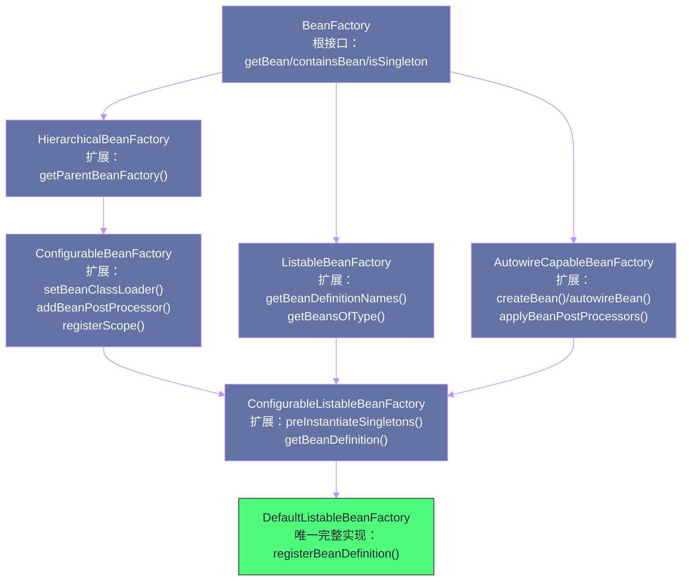
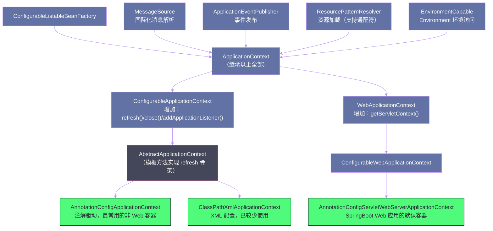
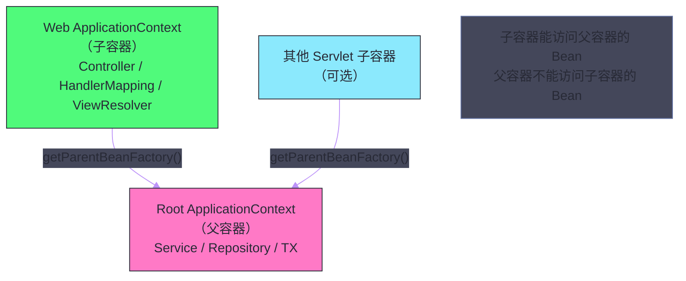

# IoC容器——BeanFactory与ApplicationContext的层次设计

## 摘要

Spring IoC 容器并非一个单一的类，而是由一组接口和抽象类构成的精密层次体系。本文深入剖析这一体系的架构设计：`BeanFactory` 作为容器的根接口，定义了最基础的 Bean 访问契约；`ApplicationContext` 在此基础上扩展了企业级能力；而真正承担所有工作的"发动机"是 `DefaultListableBeanFactory`。理解为什么要这样设计，是掌握 Spring 扩展点机制的前提。本文的另一个核心是 `AbstractApplicationContext#refresh()` 方法——这个包含 12 个步骤的方法是 Spring 容器启动的"总指挥"，读懂它，就读懂了 Spring 的启动过程。

---

## 第 1 章 为什么需要容器层次体系

### 1.1 一个直觉性的问题

初学 Spring 的人常常会有这样的困惑：为什么 Spring 需要那么多容器相关的接口？`BeanFactory`、`HierarchicalBeanFactory`、`ListableBeanFactory`、`AutowireCapableBeanFactory`、`ConfigurableBeanFactory`、`ConfigurableListableBeanFactory`……光是名字就让人目不暇接。直接定义一个 `SpringContainer` 类，把所有方法都放进去，不是更简单吗？

这个问题的答案，藏在接口设计的一个黄金法则里：**接口隔离原则（ISP，Interface Segregation Principle）**——不应该强迫客户端依赖它们不使用的方法。

考虑 Spring 容器的两种典型使用场景：

**场景一**：一个业务 Bean，需要从容器中获取另一个 Bean（虽然这不是推荐做法，但有时是必要的，比如实现了 `ApplicationContextAware` 的组件）。它只需要 `getBean(String name)` 这一个方法，不需要知道容器如何注册 Bean、如何管理 Bean 的生命周期、如何执行后处理器。

**场景二**：一个框架扩展开发者，需要在容器启动阶段向其中动态注册 `BeanDefinition`，然后触发一个局部刷新。他需要 `registerBeanDefinition()`、`preInstantiateSingletons()`、`addBeanPostProcessor()` 等更底层的方法。

如果把所有方法都放在一个接口里，场景一的使用方就被迫感知了大量与它无关的方法——这不仅增加了认知负担，还会破坏封装性，让使用方可以越权操作容器内部状态。

**接口隔离 + 接口组合**，是 Spring 容器层次体系的设计思想根基。

### 1.2 接口分层的另一个好处：契约的精确表达

接口不只是"方法的集合"，它更是一份**契约（Contract）**。每一个接口的存在，都在回答一个特定的问题：

- `BeanFactory`：这个对象**能提供 Bean 实例**吗？
- `HierarchicalBeanFactory`：这个容器**有父容器**吗？
- `ListableBeanFactory`：这个容器**支持枚举其中所有 Bean**吗？
- `AutowireCapableBeanFactory`：这个容器**能对任意对象进行自动装配**吗（即使这个对象不是由容器创建的）？

当一个类型只声明实现了 `BeanFactory`，你就知道它只保证能给你 Bean，不保证可枚举；当一个类型实现了 `ListableBeanFactory`，你就知道可以安全地调用 `getBeansOfType()` 枚举特定类型的所有 Bean。这种"接口即契约"的表达能力是单一大类无法提供的。

---

## 第 2 章 BeanFactory 接口层次全景

### 2.1 接口继承树

Spring 容器的接口层次，可以从两条线来理解：



这张图揭示了一个关键事实：**`DefaultListableBeanFactory` 是整个接口层次的唯一"完整实现"**，它同时实现了 `ConfigurableListableBeanFactory`（向下）和 `BeanDefinitionRegistry`（横向），几乎包含了 Spring IoC 容器所有能力。这就是为什么整个 Spring Framework 内部到处都用 `DefaultListableBeanFactory` 作为真正的容器实例——它就是那个"发动机"。

### 2.2 逐一解析核心接口

#### 2.2.1 BeanFactory：容器的最小可用接口

`BeanFactory` 是整个体系的根，它只定义了"使用容器"所需的最少方法：

```java
public interface BeanFactory {
    // 根据名称获取 Bean（最基础的方法）
    Object getBean(String name) throws BeansException;
    
    // 根据名称 + 类型获取 Bean（有类型检查，推荐使用）
    <T> T getBean(String name, Class<T> requiredType) throws BeansException;
    
    // 根据类型获取唯一 Bean（存在多个同类型 Bean 时会抛异常）
    <T> T getBean(Class<T> requiredType) throws BeansException;
    
    // 判断容器是否包含某个 Bean（含父容器）
    boolean containsBean(String name);
    
    // 判断是否为单例（singleton scope）
    boolean isSingleton(String name) throws NoSuchBeanDefinitionException;
    
    // 判断是否为原型（prototype scope）
    boolean isPrototype(String name) throws NoSuchBeanDefinitionException;
    
    // 获取 Bean 的类型（不触发实例化，仅根据 BeanDefinition 推断）
    @Nullable Class<?> getType(String name) throws NoSuchBeanDefinitionException;
    
    // 获取 Bean 的所有别名
    String[] getAliases(String name);
}
```

> [!info] BeanFactory 的延迟加载特性
> `BeanFactory` 的原始实现（直接使用 `DefaultListableBeanFactory` 而不包装成 `ApplicationContext`）默认采用**懒加载**策略：只有第一次调用 `getBean()` 时，对应的 Bean 才会被实例化。这在资源受限的嵌入式场景中很有用，但在 Web 应用中，如果一个关键 Bean 的配置有错，你会在第一次请求时才发现——而不是在启动阶段。这就是 `ApplicationContext` 预加载所有单例 Bean 的意义所在。

#### 2.2.2 HierarchicalBeanFactory：父子容器体系

`HierarchicalBeanFactory` 只增加了两个方法：

```java
public interface HierarchicalBeanFactory extends BeanFactory {
    // 返回父容器（可能为 null）
    @Nullable BeanFactory getParentBeanFactory();
    
    // 判断当前容器（不含父容器）是否包含某个 Bean
    boolean containsLocalBean(String name);
}
```

父子容器的场景在 Spring MVC 中经典地出现：**Root ApplicationContext**（包含 Service、Repository 等业务 Bean）是父容器，**Web ApplicationContext**（包含 Controller、HandlerMapping 等 MVC Bean）是子容器。子容器的 `getBean()` 如果在自身找不到，会委托给父容器——这实现了 MVC 层对 Service 层的访问；但父容器无法访问子容器的 Bean——这阻止了 Service 层意外依赖 Controller 层的循环耦合。

> [!warning] Spring Boot 的变化
> Spring Boot 应用默认**只有一个 `ApplicationContext`**，不再使用父子容器结构。历史上 Spring MVC 需要父子容器是因为 XML 配置时代需要分开管理两层的 Bean，而 Spring Boot 的自动装配机制使得这种分层不再必要。如果你在 Spring Boot 中手动创建了父子容器但没有处理好层次关系，很容易踩到 `@Transactional` 代理只在父容器生效、而子容器的 Controller 注入的是未被代理的 Service 等经典坑。

#### 2.2.3 ListableBeanFactory：支持枚举的容器

`ListableBeanFactory` 增加了枚举 Bean 的能力——这是 `BeanFactory` 刻意没有提供的。为什么要分开？因为并非所有 BeanFactory 实现都支持枚举（例如从远程服务获取 Bean 的场景），单独提取这个能力让不支持枚举的实现可以只实现 `BeanFactory` 即可。

几个关键方法：

```java
// 是否包含给定名称的 BeanDefinition（只查当前容器，不含父容器）
boolean containsBeanDefinition(String beanName);

// 获取所有 BeanDefinition 的数量
int getBeanDefinitionCount();

// 获取所有 BeanDefinition 的名称数组
String[] getBeanDefinitionNames();

// 根据类型获取所有匹配 Bean 的名称（核心方法，@Autowired 的底层）
String[] getBeanNamesForType(ResolvableType type);

// 根据类型获取所有匹配 Bean 的实例映射（<beanName, beanInstance>）
<T> Map<String, T> getBeansOfType(@Nullable Class<T> type) throws BeansException;

// 根据注解类型获取所有带有该注解的 Bean 实例映射
Map<String, Object> getBeansWithAnnotation(Class<? extends Annotation> annotationType);
```

`getBeansOfType()` 在 Spring 内部被大量使用：`BeanPostProcessor` 的自动探测、`HandlerMapping` 的注册、`Validator` 的组合——都是通过这个方法从容器中批量获取特定类型的所有 Bean，然后汇聚处理。

#### 2.2.4 AutowireCapableBeanFactory：Bean 的创建与外部对象装配

这个接口是专门为**框架集成商**设计的，普通应用代码几乎不会直接使用它。它的核心能力是：

1. **`createBean(Class<T> beanClass)`**：完全按照 Spring 的 Bean 创建流程（实例化 → 属性填充 → 各种后处理器 → 初始化）创建一个 Bean，但**不注册到容器**；
2. **`autowireBean(Object existingBean)`**：对一个**已存在的对象**（不是由 Spring 创建的）进行 `@Autowired` 依赖注入。

场景二在与第三方框架集成时非常有用。比如 Quartz 调度框架中的 `Job` 类是由 Quartz 框架 `new` 出来的，不在 Spring 容器中，但你希望这个 Job 里的 `@Autowired UserService userService` 能被注入。这时就需要通过 `AutowireCapableBeanFactory#autowireBean()` 来完成这项工作。

#### 2.2.5 ConfigurableBeanFactory：容器的"配置接口"

`ConfigurableBeanFactory` 是框架内部用于**配置容器行为**的接口，普通应用代码同样不应直接使用。关键方法：

```java
// 设置 Bean 的类加载器（影响 Class.forName() 的行为）
void setBeanClassLoader(@Nullable ClassLoader beanClassLoader);

// 注册 BeanPostProcessor（在容器初始化阶段批量注册）
void addBeanPostProcessor(BeanPostProcessor beanPostProcessor);

// 注册自定义 Scope（如 Request Scope、Session Scope 的注册就用这个方法）
void registerScope(String scopeName, Scope scope);

// 注册别名
void registerAlias(String beanName, String alias);

// 设置类型转换服务
void setConversionService(@Nullable ConversionService conversionService);

// 标记 Bean 已完成创建（用于循环依赖检测）
void setCurrentlyInCreation(String beanName, boolean inCreation);
```

#### 2.2.6 ConfigurableListableBeanFactory：容器的"最终配置接口"

这是 `ConfigurableBeanFactory` 和 `ListableBeanFactory` 的组合，增加了最关键的一个方法：

```java
// 预实例化所有非懒加载的单例 Bean
// 这是 ApplicationContext refresh() 的最后一步，也是"容器就绪"的标志
void preInstantiateSingletons() throws BeansException;

// 根据名称直接获取 BeanDefinition（不触发实例化）
BeanDefinition getBeanDefinition(String beanName) throws NoSuchBeanDefinitionException;

// 冻结所有 BeanDefinition（禁止后续修改，用于优化后续 getBean 的性能）
void freezeConfiguration();
```

`preInstantiateSingletons()` 是理解 `ApplicationContext` 预加载行为的关键。它会遍历所有 `BeanDefinition`，对每一个非懒加载的单例 Bean 调用 `getBean()`，从而触发实例化链。这就是为什么你的 `@PostConstruct` 方法会在应用启动时被调用，而不是在第一次使用时。

---

## 第 3 章 ApplicationContext：企业级容器

### 3.1 ApplicationContext 扩展了什么

`ApplicationContext` 继承了 `BeanFactory` 体系的所有接口，同时额外实现了四个扩展接口：



这四个额外能力的设计意图值得深入理解：

**`MessageSource`（国际化）**：为什么容器要承担国际化消息解析？因为 Spring 的哲学是"容器即应用的上下文（Context）"——应用运行所需的一切基础设施，都应该通过容器来访问。将国际化能力集成到容器中，使得任何 Bean 都可以通过注入 `MessageSource` 来实现多语言支持，而不需要引入额外的单例工具类。

**`ApplicationEventPublisher`（事件发布）**：观察者模式是解耦业务模块的利器。将事件总线内置到容器中，意味着任何 Bean 只需注入 `ApplicationEventPublisher`（或者直接注入 `ApplicationContext`，因为它实现了这个接口）就可以发布事件，任何实现了 `ApplicationListener` 的 Bean 会自动被容器注册为监听器。整个过程对业务代码完全透明。

**`ResourcePatternResolver`（资源加载）**：相比父接口 `ResourceLoader` 只能加载单个资源，`ResourcePatternResolver` 支持 Ant 风格的通配符路径，如 `classpath*:com/example/**/*.xml`，可以一次性扫描多个 Jar 包中的同路径资源。这对于 `@ComponentScan` 扫描 classpath 下所有 `@Component` 类至关重要。

**`EnvironmentCapable`（环境访问）**：通过 `getEnvironment()` 方法暴露 `Environment` 对象，而 `Environment` 包含了 `PropertySources`（应用的所有配置来源，如 JVM 参数、环境变量、application.properties）和 `Profiles`（激活的 Profile 列表）。这是 `@Value("${some.key}")` 和 `@Profile("production")` 能工作的基础。

### 3.2 BeanFactory vs ApplicationContext：选哪个？

在 Spring 的实际使用中，**绝大多数情况下你都应该使用 ApplicationContext 而非直接使用 BeanFactory**。

| 对比维度 | BeanFactory | ApplicationContext |
| --- | --- | --- |
| **Bean 实例化时机** | 懒加载（首次 `getBean` 时） | 预加载（`refresh()` 阶段） |
| **BeanPostProcessor 注册** | 需手动调用 `addBeanPostProcessor()` | 自动探测并注册 |
| **BeanFactoryPostProcessor 支持** | 需手动调用 | 自动探测并执行 |
| **国际化（MessageSource）** | 不支持 | 支持 |
| **事件发布/监听** | 不支持 | 支持 |
| **资源路径通配符** | 不支持 | 支持 |
| **Environment/Profile** | 不支持 | 支持 |
| **适用场景** | 资源极度受限的嵌入式设备、单元测试 | 几乎所有生产场景 |

> [!warning] 直接使用 BeanFactory 的陷阱
> 如果你直接使用 `DefaultListableBeanFactory` 而不包装成 `ApplicationContext`，`BeanPostProcessor`（包括负责处理 `@Autowired` 的 `AutowiredAnnotationBeanPostProcessor`）不会被自动注册，`@Autowired` 注解将完全失效！这是一个非常经典的初学者陷阱。

---

## 第 4 章 DefaultListableBeanFactory：容器的真正发动机

### 4.1 它的位置与职责

前面我们说过，`DefaultListableBeanFactory` 是整个接口层次的唯一完整实现。但在实际运行中，`ApplicationContext` 和 `DefaultListableBeanFactory` 是什么关系？

**它们不是继承关系，而是组合关系。**

`AbstractApplicationContext`（所有 `ApplicationContext` 的骨架实现）内部持有一个 `DefaultListableBeanFactory` 实例，通过 `getBeanFactory()` 方法暴露。当 `ApplicationContext` 的 `getBean()` 被调用时，它实际上是委托给内部的 `DefaultListableBeanFactory` 执行的。

```java
// AbstractApplicationContext 的核心字段（简化）
public abstract class AbstractApplicationContext extends DefaultResourceLoader
        implements ConfigurableApplicationContext {
    
    // ApplicationContext 的事件发布机制
    private ApplicationEventMulticaster applicationEventMulticaster;
    
    // 国际化消息源
    private MessageSource messageSource;
    
    // 真正的 Bean 工厂——发动机
    // 由子类（如 GenericApplicationContext）在构造时创建
    @Nullable
    private DefaultListableBeanFactory beanFactory; // 实际上由子类提供
    
    // getBean() 委托给内部 BeanFactory
    @Override
    public Object getBean(String name) throws BeansException {
        assertBeanFactoryActive();
        return getBeanFactory().getBean(name);
    }
    
    // 子类必须提供具体的 BeanFactory 实现
    @Override
    public abstract ConfigurableListableBeanFactory getBeanFactory();
}
```

这种"**门面（Facade）模式**"的设计让 `ApplicationContext` 对外呈现统一的接口，而将复杂的 Bean 管理逻辑委托给专业的 `DefaultListableBeanFactory`。

### 4.2 DefaultListableBeanFactory 的核心数据结构

理解一个类，先看它的核心字段。`DefaultListableBeanFactory` 维护了以下几个关键的数据结构：

```java
public class DefaultListableBeanFactory extends AbstractAutowireCapableBeanFactory
        implements ConfigurableListableBeanFactory, BeanDefinitionRegistry {
    
    // ===== BeanDefinition 注册表 =====
    
    // 核心注册表：beanName → BeanDefinition 的映射
    // 注意：这是一个 LinkedHashMap，保持注册顺序
    private final Map<String, BeanDefinition> beanDefinitionMap = 
        new ConcurrentHashMap<>(256);
    
    // 保存所有 BeanDefinition 名称的有序列表（保持注册顺序）
    private volatile List<String> beanDefinitionNames = new ArrayList<>(256);
    
    // ===== 单例 Bean 注册表（在父类 DefaultSingletonBeanRegistry 中）=====
    
    // 一级缓存：完整的单例 Bean 实例，beanName → singletonObject
    // 对外暴露的"成品"
    private final Map<String, Object> singletonObjects = new ConcurrentHashMap<>(256);
    
    // 二级缓存：提前暴露的"半成品" Bean（已实例化但未填充属性）
    // 用于打破循环依赖
    private final Map<String, Object> earlySingletonObjects = new ConcurrentHashMap<>(16);
    
    // 三级缓存：Bean 的 ObjectFactory，用于生成提前暴露的对象（可能是 AOP 代理）
    // key: beanName, value: ObjectFactory（一个 Lambda，调用时返回代理或原始对象）
    private final Map<String, ObjectFactory<?>> singletonFactories = new HashMap<>(16);
    
    // ===== 类型映射缓存（性能优化）=====
    
    // 类型 → 该类型所有 BeanName 的映射，避免每次 getBeansOfType() 都全量扫描
    private final Map<Class<?>, String[]> allBeanNamesByType = new ConcurrentHashMap<>(64);
    
    // 与 allBeanNamesByType 类似，但只包含单例 Bean
    private final Map<Class<?>, String[]> singletonBeanNamesByType = new ConcurrentHashMap<>(64);
}
```

这几个数据结构的设计值得仔细品味：

1. **`beanDefinitionMap` 使用 `ConcurrentHashMap`**，是因为在容器刷新阶段（`refresh()`）会有并发的 `BeanDefinition` 注册操作（尽管实际上大多数场景是单线程的，但设计上需要保证安全）；

2. **`beanDefinitionNames` 使用 `volatile List`**，保持注册顺序（`LinkedHashMap` 的等价物），是因为 Bean 的实例化顺序可能影响业务逻辑（后注册的 `BeanDefinition` 可能覆盖先注册的同名 Bean）；

3. **三级缓存**是解决循环依赖的精华，我们在第 05 篇会做深度分析，这里先建立印象；

4. **类型映射缓存**是一个重要的性能优化——如果没有这个缓存，每次调用 `getBeansOfType(UserService.class)` 都需要遍历所有 `BeanDefinition`，判断其是否匹配类型，对于拥有数百个 Bean 的大型应用，这个开销不可忽视。

---

## 第 5 章 refresh()：容器启动的总指挥

### 5.1 为什么 refresh() 如此重要

`AbstractApplicationContext#refresh()` 是整个 Spring 容器最核心的方法，没有之一。它就是 Spring 容器的"启动仪式"——所有的 Bean 定义加载、Bean 实例化、后处理器注册、事件机制初始化……全部发生在这个方法的 12 个步骤中。

理解了 `refresh()`，你就能准确回答以下问题：
- `@Component` 注解的类是什么时候被扫描到的？
- `@Configuration` 类是什么时候被 CGLIB 增强的？
- `BeanFactoryPostProcessor` 是在 Bean 实例化之前还是之后执行的？
- `@PostConstruct` 方法是在什么时机被调用的？
- Spring 的内置事件 `ContextRefreshedEvent` 是在整个刷新过程的哪一步发布的？

### 5.2 refresh() 的 12 个步骤

```java
// AbstractApplicationContext#refresh() 源码结构（Spring 6.x，有简化）
@Override
public void refresh() throws BeansException, IllegalStateException {
    this.startupShutdownLock.lock();
    try {
        this.startupShutdownThread = Thread.currentThread();
        
        // ====== 步骤 1：准备刷新（Prepare this context for refreshing）======
        prepareRefresh();
        
        // ====== 步骤 2：获取已刷新的 BeanFactory ======
        // 子类实现：创建 DefaultListableBeanFactory，加载 BeanDefinition
        ConfigurableListableBeanFactory beanFactory = obtainFreshBeanFactory();
        
        // ====== 步骤 3：准备 BeanFactory（配置 BeanFactory 的基础设施）======
        prepareBeanFactory(beanFactory);
        
        try {
            // ====== 步骤 4：允许子类修改 BeanFactory（钩子方法）======
            postProcessBeanFactory(beanFactory);
            
            // ====== 步骤 5：调用所有 BeanFactoryPostProcessor ======
            invokeBeanFactoryPostProcessors(beanFactory);
            
            // ====== 步骤 6：注册所有 BeanPostProcessor ======
            registerBeanPostProcessors(beanFactory);
            
            // ====== 步骤 7：初始化 MessageSource（国际化）======
            initMessageSource();
            
            // ====== 步骤 8：初始化事件广播器 ApplicationEventMulticaster ======
            initApplicationEventMulticaster();
            
            // ====== 步骤 9：子类扩展钩子（如 Web 容器在此启动嵌入式 Tomcat）======
            onRefresh();
            
            // ====== 步骤 10：注册 ApplicationListener ======
            registerListeners();
            
            // ====== 步骤 11：实例化所有非懒加载的单例 Bean ======
            finishBeanFactoryInitialization(beanFactory);
            
            // ====== 步骤 12：完成刷新，发布 ContextRefreshedEvent ======
            finishRefresh();
            
        } catch (RuntimeException | Error ex) {
            // 刷新失败：销毁已创建的 Bean，重置容器状态
            destroyBeans();
            cancelRefresh(ex);
            throw ex;
        } finally {
            contextRefresh.end();
        }
    } finally {
        this.startupShutdownThread = null;
        this.startupShutdownLock.unlock();
    }
}
```

现在逐步深入每个关键步骤：

### 5.3 步骤 1：prepareRefresh() —— 刷新前的准备工作

```java
protected void prepareRefresh() {
    // 记录启动时间
    this.startupDate = System.currentTimeMillis();
    // 重置关闭标志位
    this.closed.set(false);
    // 标记容器为"活跃"状态
    this.active.set(true);
    
    // 钩子方法：子类可以在此初始化 PropertySource
    // 例如 Web 应用会在此将 ServletContext 参数注册为 PropertySource
    initPropertySources();
    
    // 验证必须存在的属性（通过 setRequiredProperties 注册的属性）
    // 如果某个必需属性在 Environment 中找不到，会在此早期失败
    getEnvironment().validateRequiredProperties();
    
    // 保存预注册的 ApplicationListener（在 refresh() 之前通过 addApplicationListener 添加的）
    if (this.earlyApplicationListeners == null) {
        this.earlyApplicationListeners = new LinkedHashSet<>(this.applicationListeners);
    }
    // 初始化早期事件集合，这些事件会在事件广播器就绪后立即发布
    this.earlyApplicationEvents = new LinkedHashSet<>();
}
```

这一步的"必须存在的属性验证"是一个低调但非常实用的特性。如果你的应用有某些配置项是**绝对不能缺少**的（比如数据库密码），可以在 `ApplicationContext` 创建后、`refresh()` 前调用：

```java
ConfigurableApplicationContext ctx = new AnnotationConfigApplicationContext();
ctx.getEnvironment().setRequiredProperties("DB_PASSWORD", "REDIS_HOST");
ctx.register(AppConfig.class);
ctx.refresh(); // 如果 DB_PASSWORD 或 REDIS_HOST 不存在，在此处立即抛异常
```

这比等到 Bean 初始化时才发现配置缺失，能更早、更清晰地暴露问题。

### 5.4 步骤 2：obtainFreshBeanFactory() —— BeanDefinition 的加载

```java
protected ConfigurableListableBeanFactory obtainFreshBeanFactory() {
    refreshBeanFactory(); // 钩子方法，子类实现
    return getBeanFactory();
}
```

这是一个钩子方法，不同子类的行为差异很大：

- **`AbstractRefreshableApplicationContext`**（用于 XML 配置的 `ClassPathXmlApplicationContext`）：每次 `refresh()` 时**销毁旧的 BeanFactory，创建全新的**。这是"可刷新"容器的由来——这类容器支持多次调用 `refresh()` 来重新加载配置（在早期动态配置更新场景中使用）。
- **`GenericApplicationContext`**（`AnnotationConfigApplicationContext` 的父类）：在**构造时就创建好** `DefaultListableBeanFactory`，`refreshBeanFactory()` 只是做一个"是否已刷新"的检查，不允许重复刷新。

对于 XML 配置的场景，`refreshBeanFactory()` 内部会调用 `loadBeanDefinitions()`，最终通过 `XmlBeanDefinitionReader` 解析 XML 文件，将所有 `<bean>` 标签转化为 `BeanDefinition` 对象注册到 `DefaultListableBeanFactory`。

对于注解配置的场景（`AnnotationConfigApplicationContext`），`BeanDefinition` 的加载发生在 `register(AppConfig.class)` 和随后的 `refresh()` 中，由 `ConfigurationClassPostProcessor`（一个 `BeanFactoryPostProcessor`）在步骤 5 中完成注解扫描。

### 5.5 步骤 3：prepareBeanFactory() —— 配置 BeanFactory 的基础设施

```java
protected void prepareBeanFactory(ConfigurableListableBeanFactory beanFactory) {
    // 设置 Bean 类加载器为当前 ApplicationContext 的类加载器
    beanFactory.setBeanClassLoader(getClassLoader());
    
    // 设置 SpEL 表达式解析器（处理 @Value("#{...}") 中的 SpEL 表达式）
    beanFactory.setBeanExpressionResolver(
        new StandardBeanExpressionResolver(beanFactory.getBeanClassLoader()));
    
    // 注册 ResourceEditor（将字符串路径转换为 Resource 对象）
    beanFactory.addPropertyEditorRegistrar(
        new ResourceEditorRegistrar(this, getEnvironment()));
    
    // ===== 关键：注册 ApplicationContextAwareProcessor =====
    // 这个 BeanPostProcessor 负责处理所有 Aware 接口回调
    // （ApplicationContextAware, EnvironmentAware, ResourceLoaderAware 等）
    beanFactory.addBeanPostProcessor(
        new ApplicationContextAwareProcessor(this));
    
    // 让容器在自动装配时忽略这些接口类型（因为它们通过 Aware 注入，而非 @Autowired）
    beanFactory.ignoreDependencyInterface(EnvironmentAware.class);
    beanFactory.ignoreDependencyInterface(ResourceLoaderAware.class);
    beanFactory.ignoreDependencyInterface(ApplicationContextAware.class);
    // ...（其他 Aware 接口）
    
    // ===== 注册几个"特殊 Bean"：这些对象可以直接被 @Autowired 注入 =====
    beanFactory.registerResolvableDependency(BeanFactory.class, beanFactory);
    beanFactory.registerResolvableDependency(ResourceLoader.class, this);
    beanFactory.registerResolvableDependency(ApplicationEventPublisher.class, this);
    beanFactory.registerResolvableDependency(ApplicationContext.class, this);
    
    // 注册 ApplicationListenerDetector（在 Bean 初始化后检测是否实现了 ApplicationListener）
    beanFactory.addBeanPostProcessor(
        new ApplicationListenerDetector(this));
    
    // 注册环境相关的内置 Bean：environment, systemProperties, systemEnvironment
    if (!beanFactory.containsLocalBean(ENVIRONMENT_BEAN_NAME)) {
        beanFactory.registerSingleton(ENVIRONMENT_BEAN_NAME, getEnvironment());
    }
    // ...
}
```

这一步非常关键，它揭示了几个"魔法"的来源：

- **为什么实现了 `ApplicationContextAware` 的 Bean 能自动获得 `ApplicationContext`？** 因为这里注册了 `ApplicationContextAwareProcessor`，它在每个 Bean 初始化后检查其是否实现了各种 `Aware` 接口，并调用相应的 `setXxx()` 方法；
- **为什么可以直接 `@Autowired ApplicationContext ctx`？** 因为 `registerResolvableDependency(ApplicationContext.class, this)` 将当前 `ApplicationContext` 注册为类型 `ApplicationContext` 的"固定依赖"；
- **为什么可以直接 `@Autowired Environment env`？** 同上，`environment` Bean 被以单例形式注册了。

### 5.6 步骤 5：invokeBeanFactoryPostProcessors() —— 修改 BeanDefinition 的最后机会

这一步是整个 `refresh()` 流程中**逻辑最复杂**的一步。`BeanFactoryPostProcessor` 允许在所有 `BeanDefinition` 加载完毕、但 Bean 实例化之前，对 `BeanDefinition` 进行修改。

最重要的 `BeanFactoryPostProcessor` 是 **`ConfigurationClassPostProcessor`**，它是注解驱动的 Spring 应用的核心，负责：

1. 处理 `@Configuration` 类，对其进行 CGLIB 增强（Full 模式 vs Lite 模式的区别）；
2. 处理 `@ComponentScan` 注解，扫描指定包下的所有 `@Component`（含 `@Service`、`@Repository`、`@Controller`）类，将其注册为 `BeanDefinition`；
3. 处理 `@Import` 注解，触发 `ImportSelector` 和 `ImportBeanDefinitionRegistrar` 的执行；
4. 处理 `@Bean` 方法，为每个 `@Bean` 方法创建对应的 `BeanDefinition`；
5. 处理 `@PropertySource` 注解，将属性文件加载到 `Environment` 中。

> [!info] 为什么叫"Post" Processor？
> "Post"是"在……之后"的意思，但这里的语义是"在 BeanDefinition 加载之后、Bean 实例化之前"。`BeanFactoryPostProcessor` 是对 **BeanFactory（注册表状态）** 的后处理；而下一步的 `BeanPostProcessor` 是对 **Bean 实例**的后处理。两者的区别在于操作时机和操作对象。

`BeanFactoryPostProcessor` 的执行顺序是有讲究的：

1. 首先执行通过 `ConfigurableApplicationContext#addBeanFactoryPostProcessor()` 手动注册的（优先级最高，不参与排序）；
2. 然后按 `PriorityOrdered` → `Ordered` → 无排序接口，执行从容器中自动探测到的 `BeanDefinitionRegistryPostProcessor`（`ConfigurationClassPostProcessor` 就是这类）；
3. 最后执行普通的 `BeanFactoryPostProcessor`。

### 5.7 步骤 6：registerBeanPostProcessors() —— 注册 Bean 实例化的"拦截器"

与步骤 5 不同，这一步**只注册** `BeanPostProcessor`，不执行。`BeanPostProcessor` 的执行发生在步骤 11 中每个 Bean 实例化的过程中。

Spring 内部有很多重要的 `BeanPostProcessor`：

| BeanPostProcessor | 职责 |
| --- | --- |
| `AutowiredAnnotationBeanPostProcessor` | 处理 `@Autowired`、`@Value`、`@Inject` 注解 |
| `CommonAnnotationBeanPostProcessor` | 处理 JSR-250 注解：`@PostConstruct`、`@PreDestroy`、`@Resource` |
| `PersistenceAnnotationBeanPostProcessor` | 处理 JPA 的 `@PersistenceContext`、`@PersistenceUnit` |
| `AnnotationAwareAspectJAutoProxyCreator` | 创建 AOP 代理（检测 `@Aspect` 切面，为满足切点的 Bean 生成代理） |
| `ApplicationContextAwareProcessor` | 处理各种 `Aware` 接口回调（步骤 3 注册） |
| `ApplicationListenerDetector` | 将实现了 `ApplicationListener` 的 Bean 注册到事件广播器 |

注册顺序同样是 `PriorityOrdered` → `Ordered` → 无排序，确保 `AutowiredAnnotationBeanPostProcessor`（它实现了 `PriorityOrdered`）最先注册、最先执行，保证依赖注入在其他后处理器之前完成。

### 5.8 步骤 9：onRefresh() —— Spring Boot 嵌入式容器的启动点

`onRefresh()` 是一个模板方法，默认空实现。但 Spring Boot 的 `ServletWebServerApplicationContext` 在这里覆盖了它，用于**启动嵌入式 Web 服务器（Tomcat/Jetty/Undertow）**：

```java
// SpringBoot 中 ServletWebServerApplicationContext 的 onRefresh()（简化）
@Override
protected void onRefresh() {
    super.onRefresh();
    try {
        // 在这里创建并启动嵌入式 Tomcat！
        createWebServer();
    } catch (Throwable ex) {
        throw new ApplicationContextException("Unable to start web server", ex);
    }
}
```

这就是为什么嵌入式 Tomcat 在所有单例 Bean 实例化（步骤 11）之前就启动了——容器先把"服务器骨架"搭好，然后才往里面装 Controller、Service 等组件。

### 5.9 步骤 11：finishBeanFactoryInitialization() —— 实例化所有单例 Bean

这是耗时最长的一步，也是 Spring 容器"真正工作"的核心步骤。

```java
protected void finishBeanFactoryInitialization(ConfigurableListableBeanFactory beanFactory) {
    // 初始化 ConversionService（类型转换服务）
    if (beanFactory.containsBean(CONVERSION_SERVICE_BEAN_NAME) &&
            beanFactory.isTypeMatch(CONVERSION_SERVICE_BEAN_NAME, ConversionService.class)) {
        beanFactory.setConversionService(
            beanFactory.getBean(CONVERSION_SERVICE_BEAN_NAME, ConversionService.class));
    }
    
    // 如果没有注册过 EmbeddedValueResolver，则注册一个默认的
    // （用于解析 @Value 中的占位符 ${...}）
    if (!beanFactory.hasEmbeddedValueResolver()) {
        beanFactory.addEmbeddedValueResolver(
            strVal -> getEnvironment().resolvePlaceholders(strVal));
    }
    
    // 提前初始化 LoadTimeWeaverAware Bean（AspectJ 类加载时织入的支持）
    String[] weaverAwareNames = beanFactory.getBeanNamesForType(
        LoadTimeWeaverAware.class, false, false);
    for (String weaverAwareName : weaverAwareNames) {
        getBean(weaverAwareName);
    }
    
    // 冻结 BeanDefinition（禁止后续修改），为后续 getBean() 性能优化做准备
    beanFactory.freezeConfiguration();
    
    // ===== 核心：实例化所有非懒加载的单例 Bean =====
    beanFactory.preInstantiateSingletons();
}
```

`preInstantiateSingletons()` 的内部逻辑：

```java
// DefaultListableBeanFactory#preInstantiateSingletons()（简化）
@Override
public void preInstantiateSingletons() throws BeansException {
    // 获取所有 BeanDefinition 名称的快照（避免迭代中被修改）
    List<String> beanNames = new ArrayList<>(this.beanDefinitionNames);
    
    // 遍历所有 BeanDefinition
    for (String beanName : beanNames) {
        RootBeanDefinition bd = getMergedLocalBeanDefinition(beanName);
        // 只实例化：非抽象 && 单例 && 非懒加载
        if (!bd.isAbstract() && bd.isSingleton() && !bd.isLazyInit()) {
            if (isFactoryBean(beanName)) {
                // FactoryBean：先实例化 FactoryBean 本身
                // 以 & 前缀获取 FactoryBean 实例
                Object bean = getBean(FACTORY_BEAN_PREFIX + beanName);
                if (bean instanceof SmartFactoryBean<?> smartFactoryBean
                        && smartFactoryBean.isEagerInit()) {
                    // 如果 FactoryBean 标记了 eagerInit，也立即实例化其产品 Bean
                    getBean(beanName);
                }
            } else {
                // 普通 Bean：直接实例化
                getBean(beanName);
            }
        }
    }
    
    // 所有单例 Bean 初始化完毕后，触发 SmartInitializingSingleton 回调
    // （@EventListener 的处理就在这里——EventListenerMethodProcessor 实现了这个接口）
    for (String beanName : beanNames) {
        Object singletonInstance = getSingleton(beanName);
        if (singletonInstance instanceof SmartInitializingSingleton smartSingleton) {
            smartSingleton.afterSingletonsInstantiated();
        }
    }
}
```

这里有一个细节：**`SmartInitializingSingleton#afterSingletonsInstantiated()`** 在所有单例 Bean 都完成实例化之后才被调用。这与 `@PostConstruct` 不同——`@PostConstruct` 在单个 Bean 初始化时调用，此时其他 Bean 可能还没实例化；而 `afterSingletonsInstantiated()` 在全量初始化完成后调用，此时可以安全地调用任何其他 Bean。

`@EventListener` 注解（将普通方法变成事件监听器）就是在 `afterSingletonsInstantiated()` 阶段被处理的——这确保了事件监听器注册时，它所依赖的所有 Bean 都已经就绪。

### 5.10 步骤 12：finishRefresh() —— 宣告容器就绪

```java
protected void finishRefresh() {
    // 清理 classpath 扫描相关的缓存（减少内存占用）
    clearResourceCaches();
    
    // 初始化 Lifecycle 处理器
    initLifecycleProcessor();
    
    // 触发实现了 Lifecycle 接口的 Bean 的 start() 方法
    getLifecycleProcessor().onRefresh();
    
    // ===== 发布 ContextRefreshedEvent =====
    // 这是 Spring 内置的事件，标志容器已完全就绪
    publishEvent(new ContextRefreshedEvent(this));
}
```

`ContextRefreshedEvent` 是 Spring 生命周期中的一个重要事件。监听这个事件，是在"所有单例 Bean 都就绪后"执行初始化逻辑的标准方式（另一种方式是 `SmartInitializingSingleton`）。

---

## 第 6 章 各 ApplicationContext 实现类的选型

### 6.1 主要实现类及其使用场景

| 实现类 | 配置方式 | 适用场景 |
| --- | --- | --- |
| `AnnotationConfigApplicationContext` | Java Config（`@Configuration`/`@ComponentScan`） | 独立 Java 应用、单元/集成测试 |
| `ClassPathXmlApplicationContext` | XML 配置文件，从 classpath 加载 | 遗留 XML 项目 |
| `FileSystemXmlApplicationContext` | XML 配置文件，从文件系统路径加载 | 特殊部署场景 |
| `AnnotationConfigServletWebServerApplicationContext` | Java Config + 嵌入式 Servlet 容器 | Spring Boot Web 应用（默认） |
| `AnnotationConfigReactiveWebServerApplicationContext` | Java Config + 响应式 Web 服务器 | Spring Boot WebFlux 应用 |
| `GenericApplicationContext` | 编程式注册 BeanDefinition | 框架开发、测试 |

### 6.2 AnnotationConfigApplicationContext 的启动流程

这是我们日常开发中最常接触的非 Web 容器，理解它的启动过程能串联所有前置知识：

```java
// 最常见的用法
ApplicationContext ctx = new AnnotationConfigApplicationContext(AppConfig.class);
UserService userService = ctx.getBean(UserService.class);
```

这一行代码背后发生了什么？

```java
public class AnnotationConfigApplicationContext extends GenericApplicationContext {
    
    // 注解读取器（处理 @Configuration 类）
    private final AnnotatedBeanDefinitionReader reader;
    // 类路径扫描器（处理 @ComponentScan）
    private final ClassPathBeanDefinitionScanner scanner;
    
    public AnnotationConfigApplicationContext(Class<?>... componentClasses) {
        // 1. 调用父类 GenericApplicationContext 构造器
        //    → 创建 DefaultListableBeanFactory
        // 2. 创建 AnnotatedBeanDefinitionReader
        //    → 内部注册了核心 BeanFactoryPostProcessor：
        //      - ConfigurationClassPostProcessor（处理 @Configuration/@ComponentScan/@Import）
        //      - AutowiredAnnotationBeanPostProcessor
        //      - CommonAnnotationBeanPostProcessor
        //    注意：这些是作为 BeanDefinition 注册的，而非直接注册实例
        this();
        
        // 3. 将 AppConfig.class 注册为 BeanDefinition
        register(componentClasses);
        
        // 4. 触发容器刷新（执行上文描述的 12 步）
        refresh();
    }
}
```

> [!note] 注册的顺序很重要
> 步骤 2 中，`ConfigurationClassPostProcessor` 等核心组件是作为 **BeanDefinition** 注册进来的，而非直接注册为实例。这意味着它们自身也会走 Spring 的 Bean 创建流程，也可以有 `@Autowired` 依赖。它们在 `refresh()` 的步骤 5（`invokeBeanFactoryPostProcessors`）和步骤 6（`registerBeanPostProcessors`）中被实例化和调用，时机恰好在所有业务 Bean 实例化之前。

---

## 第 7 章 父子容器：Spring MVC 的经典架构

### 7.1 为什么 Spring MVC 需要父子容器

在 Spring Boot 普及之前，传统的 Spring MVC 项目部署在外置 Tomcat 中，通常使用两个 `ApplicationContext`：

- **Root WebApplicationContext**（根容器）：由 `ContextLoaderListener` 创建，加载 Service、Repository、事务配置等业务层 Bean；
- **Servlet WebApplicationContext**（Web 容器）：由 `DispatcherServlet` 创建，加载 Controller、HandlerMapping、ViewResolver 等 MVC 相关 Bean；Web 容器以 Root 容器为父容器。

这种设计的目的是**职责分离**：

1. 如果有多个 `DispatcherServlet`（例如一个处理 API，一个处理管理后台），它们共享同一个 Root 容器（Service 层不需要重复创建），但各自有独立的 Web 容器（MVC 配置互不干扰）；
2. 防止 Controller 被注册到 Root 容器——如果 Controller 被扫描进 Root 容器，而 Root 容器不会应用 MVC 相关的 `BeanPostProcessor`，`@RequestMapping` 等注解就无法被正确处理。



### 7.2 Spring Boot 为什么不需要父子容器

Spring Boot 通过**自动配置**消除了这种分层的必要性：

1. 只有一个 `AnnotationConfigServletWebServerApplicationContext`，同时承担了"根容器"和"MVC 容器"的职责；
2. MVC 相关的 `BeanPostProcessor`（如 `RequestMappingHandlerMapping`）被自动配置为一个普通 Bean，在单一容器中注册；
3. 嵌入式 Tomcat 的生命周期与 `ApplicationContext` 绑定，由容器管理，不需要外置 Servlet 容器的 `ContextLoaderListener` 介入。

这是架构简化的典型案例——功能等价，但通过约定代替配置，消除了父子容器带来的复杂性。

---

## 总结

本文从接口设计哲学出发，系统地梳理了 Spring IoC 容器的层次体系：

- **接口层次的设计原则**：接口隔离原则 + 接口即契约，让不同的使用方只感知与自己相关的能力；
- **BeanFactory 体系**：从 `BeanFactory` 根接口，到各个扩展接口（`HierarchicalBeanFactory`、`ListableBeanFactory`、`AutowireCapableBeanFactory`、`ConfigurableBeanFactory`），最终汇聚于 `DefaultListableBeanFactory` 这个唯一完整实现；
- **ApplicationContext 的扩展价值**：在 BeanFactory 基础上增加了国际化、事件机制、资源加载、环境访问，以及最重要的——自动探测并执行 `BeanPostProcessor`/`BeanFactoryPostProcessor`；
- **DefaultListableBeanFactory 的核心数据结构**：`beanDefinitionMap`、三级缓存等关键字段，是后续深入理解 Bean 生命周期和循环依赖的基础；
- **refresh() 的 12 步**：这是 Spring 容器启动的完整路线图，每一步都有明确的职责，理解它们是读懂 Spring 启动日志、排查启动失败问题的关键。

下一篇，我们将深入容器内部，分析 `BeanDefinition` 的核心属性设计，以及从 XML 到注解驱动的注册机制演进：[[03 Bean的定义与注册——从XML到注解驱动]]。

---

> [!note] 参考资料
> - [Spring Framework 官方文档 - Core Container](https://docs.spring.io/spring-framework/reference/core/beans.html)
> - `org.springframework.context.support.AbstractApplicationContext` 源码（Spring 6.1.x）
> - `org.springframework.beans.factory.support.DefaultListableBeanFactory` 源码
> - `org.springframework.beans.factory.support.DefaultSingletonBeanRegistry` 源码（三级缓存所在）

---

> [!note] 思考题
> 1. Bean 的完整生命周期包括：实例化 → 属性注入 → Aware 接口回调 → BeanPostProcessor.postProcessBeforeInitialization → @PostConstruct → InitializingBean.afterPropertiesSet → init-method → BeanPostProcessor.postProcessAfterInitialization → 使用 → @PreDestroy → DisposableBean.destroy → destroy-method。如果 `@PostConstruct` 和 `afterPropertiesSet()` 中都有初始化逻辑且存在冲突，哪个优先执行？
> 2. `BeanPostProcessor` 在每个 Bean 初始化前后执行。Spring AOP 的 `AbstractAutoProxyCreator` 就是一个 BeanPostProcessor——它在 `postProcessAfterInitialization` 中为需要代理的 Bean 创建代理对象。如果有多个 BeanPostProcessor 且它们都修改了同一个 Bean，执行顺序如何控制？
> 3. prototype 作用域的 Bean 不由 Spring 管理销毁——Spring 在创建后就'忘记'了它。这意味着 prototype Bean 的 `@PreDestroy` 不会被调用。在什么场景下这会导致资源泄漏？如果 prototype Bean 持有数据库连接或文件句柄，你如何确保它们被正确关闭？
