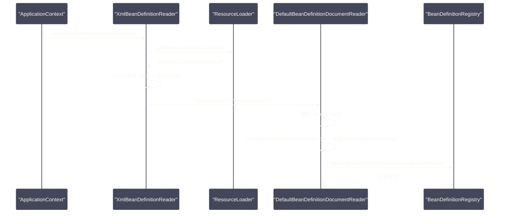
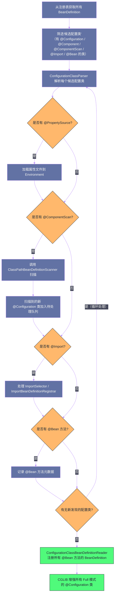

# Bean的定义与注册——从XML到注解驱动

## 摘要

Spring 容器在创建任何 Bean 实例之前，必须先知道"这个 Bean 是什么"——它的类名、作用域、是否懒加载、依赖关系、初始化方法……这些元数据被封装在 `BeanDefinition` 对象中。本文深入剖析 `BeanDefinition` 的核心属性及其设计意图，然后追溯 Spring 的配置方式演进：从早期的 XML `<bean>` 标签，到 `@Component` 注解扫描，再到 `@Configuration`/`@Bean` Java 配置，直至 `@Import` 与 `ImportSelector` 构成的高级注册机制。最后重点剖析 `@Configuration` 的 Full 模式与 Lite 模式背后的 CGLIB 增强原理——这是理解 Spring Boot 自动配置能工作的理论基础。

---

## 第 1 章 BeanDefinition：Bean 的"基因图谱"

### 1.1 为什么需要 BeanDefinition

在理解 `BeanDefinition` 之前，先想一个问题：Spring 容器为什么不在扫描到 `@Component` 注解时，立刻创建 Bean 实例？

答案是：**创建时机与描述信息需要分离**。

容器的职责之一是支持**懒加载**（`@Lazy`）：有些 Bean 只在第一次被请求时才实例化，如果扫描即创建，懒加载就无从实现。更重要的是，Spring 需要在所有 Bean 的描述信息都收集完毕之后，才能分析依赖关系、决定实例化顺序、检测循环依赖——如果一边扫描一边实例化，依赖分析就变成了"盲人摸象"。

因此，Spring 引入了**两阶段模型**：

1. **注册阶段**：扫描所有配置来源（XML、注解、Java Config），将每个 Bean 的描述信息转化为 `BeanDefinition` 对象，存入 `DefaultListableBeanFactory` 的注册表；
2. **实例化阶段**：根据注册表中的 `BeanDefinition`，按需创建 Bean 实例。

`BeanDefinition` 就是这两个阶段之间的"中间表示"——它是一份"菜谱"，容器是"厨师"，菜谱写好了之后，厨师才开始按单做菜。

### 1.2 BeanDefinition 的核心属性

`BeanDefinition` 是一个接口，它的完整实现类有几个（`RootBeanDefinition`、`ChildBeanDefinition`、`GenericBeanDefinition` 等），但核心属性是共通的：

```java
public interface BeanDefinition extends AttributeAccessor, BeanMetadataElement {
    
    // ===== 类型信息 =====
    
    // Bean 的全限定类名（可能是接口名，实际类型由 FactoryBean 决定）
    @Nullable String getBeanClassName();
    void setBeanClassName(@Nullable String beanClassName);
    
    // ===== 作用域（Scope）=====
    
    String SCOPE_SINGLETON = ConfigurableBeanFactory.SCOPE_SINGLETON; // "singleton"
    String SCOPE_PROTOTYPE = ConfigurableBeanFactory.SCOPE_PROTOTYPE; // "prototype"
    
    @Nullable String getScope();
    void setScope(@Nullable String scope);
    
    // ===== 懒加载 =====
    
    boolean isLazyInit();
    void setLazyInit(boolean lazyInit);
    
    // ===== 依赖关系 =====
    
    // 显式声明的依赖（对应 XML 的 depends-on 属性）
    // 确保被依赖的 Bean 先于当前 Bean 实例化（即使没有直接引用关系）
    @Nullable String[] getDependsOn();
    void setDependsOn(@Nullable String... dependsOn);
    
    // ===== 自动装配候选 =====
    
    // 是否作为 @Autowired 的候选（设为 false 则不参与类型匹配）
    boolean isAutowireCandidate();
    void setAutowireCandidate(boolean autowireCandidate);
    
    // 当同类型有多个候选时，是否为"首选"（对应 @Primary）
    boolean isPrimary();
    void setPrimary(boolean primary);
    
    // ===== 构造器参数与属性值 =====
    
    // 构造器参数列表（XML 的 <constructor-arg>）
    ConstructorArgumentValues getConstructorArgumentValues();
    
    // 属性值列表（XML 的 <property>，或 @Bean 方法中的属性设置）
    MutablePropertyValues getPropertyValues();
    
    // ===== 生命周期回调 =====
    
    // 初始化方法名（对应 XML 的 init-method 属性，或 @Bean 的 initMethod）
    @Nullable String getInitMethodName();
    void setInitMethodName(@Nullable String initMethodName);
    
    // 销毁方法名（对应 XML 的 destroy-method 属性）
    @Nullable String getDestroyMethodName();
    void setDestroyMethodName(@Nullable String destroyMethodName);
    
    // ===== 来源与角色 =====
    
    // Bean 的角色：用户定义的 Bean vs 框架内部使用的基础设施 Bean
    int ROLE_APPLICATION = 0;    // 用户定义的业务 Bean
    int ROLE_SUPPORT = 1;        // 对用户配置的支撑 Bean
    int ROLE_INFRASTRUCTURE = 2; // 框架内部的基础设施 Bean（如各种 PostProcessor）
    
    int getRole();
    void setRole(int role);
    
    // Bean 的描述（可选，用于文档和调试）
    @Nullable String getDescription();
    void setDescription(@Nullable String description);
}
```

这些属性的设计，每一个都有明确的工程意图：

**`scope`**：单例（`singleton`）是默认值，整个容器生命周期内只有一个实例，适合无状态的 Service、Repository；原型（`prototype`）每次 `getBean()` 都创建新实例，适合有状态的对象（但要注意，原型 Bean 的销毁不由容器管理）。此外 Spring MVC 还提供了 `request`、`session`、`application` 等 Web 相关作用域。

**`lazyInit`**：懒加载的价值不仅是"延迟启动时间"。在某些场景下，Bean 的初始化依赖外部系统（如数据库连接、远程配置中心），在应用启动阶段这些系统可能还未就绪；懒加载允许这些 Bean 在系统就绪后的第一次请求时才初始化。

**`dependsOn`**：这是一个容易被忽视但非常重要的属性。考虑这样的场景：`DatabaseMigrationBean` 负责执行数据库脚本迁移，`UserService` 依赖已迁移完成的数据库表。`UserService` 并不直接引用 `DatabaseMigrationBean`（依赖注入机制感知不到这种隐式依赖），但必须确保它先初始化。这时就需要在 `UserService` 的 `BeanDefinition` 上设置 `dependsOn = "databaseMigrationBean"`。

**`autowireCandidate`**：当一个接口有多个实现时，如果你不想用 `@Primary` 或 `@Qualifier` 来解决歧义，可以将某个实现的 `BeanDefinition` 的 `autowireCandidate` 设为 `false`，使其退出自动装配候选——这个 Bean 仍然存在于容器中，可以通过名称显式获取，但不参与类型匹配。

**`role`**：`ROLE_INFRASTRUCTURE` 这个角色标记有实际意义——当 Spring Boot Actuator 的 `/beans` 端点列出所有 Bean 时，`ROLE_INFRASTRUCTURE` 的 Bean 通常被过滤掉，只展示 `ROLE_APPLICATION` 的 Bean，避免干扰用户对业务 Bean 的观察。

### 1.3 RootBeanDefinition 与合并

实际运行中，Spring 内部大量使用的不是 `GenericBeanDefinition`，而是 **`RootBeanDefinition`**。这是因为 Spring 支持"子 BeanDefinition 继承父 BeanDefinition"的机制（XML 时代的 `parent` 属性），而在使用一个 Bean 之前，Spring 会将其 `BeanDefinition` 及其所有父定义合并成一个完整的 `RootBeanDefinition`。

即使你的 Bean 没有父定义，Spring 也会在 `getBean()` 流程开始时，将 `GenericBeanDefinition` 转换为 `RootBeanDefinition`，因为后者是 Bean 创建流程中实际使用的、功能最完整的描述对象。

> [!note] 为什么要合并？
> 合并是将"分散的、可能有继承关系的 BeanDefinition"转化为"单一的、完整的 BeanDefinition"。这避免了在 Bean 创建流程的每一步都需要递归查找父定义，是一种典型的"以空间换时间"的缓存策略。合并后的 `RootBeanDefinition` 被缓存在 `AbstractBeanFactory#mergedBeanDefinitions` 中，后续重复访问直接读取缓存。

---

## 第 2 章 XML 配置：BeanDefinition 注册的起点

### 2.1 XML 配置的历史地位

2004年 Spring 1.0 发布时，XML 是唯一的配置方式。一个典型的 Spring XML 配置文件如下：

```xml
<?xml version="1.0" encoding="UTF-8"?>
<beans xmlns="http://www.springframework.org/schema/beans"
       xmlns:xsi="http://www.w3.org/2001/XMLSchema-instance"
       xsi:schemaLocation="http://www.springframework.org/schema/beans
           http://www.springframework.org/schema/beans/spring-beans.xsd">

    <!-- 注册一个 UserService Bean，id 为 beanName，class 为全限定类名 -->
    <bean id="userService" class="com.example.UserServiceImpl"
          scope="singleton"
          lazy-init="false"
          init-method="init"
          destroy-method="cleanup">
        <!-- 属性注入 -->
        <property name="userRepository" ref="userRepository"/>
        <property name="maxRetries" value="3"/>
    </bean>
    
    <!-- 构造器注入 -->
    <bean id="userRepository" class="com.example.UserRepositoryImpl">
        <constructor-arg index="0" ref="dataSource"/>
    </bean>
    
    <!-- depends-on 示例：确保 databaseMigration 先于 userService 初始化 -->
    <bean id="userService2" class="com.example.UserServiceImpl"
          depends-on="databaseMigration">
        ...
    </bean>
</beans>
```

这种配置方式的优点是**可读性强**（所有 Bean 的定义集中在一处，一目了然），缺点是**冗长繁琐**（即使是很简单的 Bean 也需要写大量 XML），以及**类型不安全**（Bean 的类名是字符串，重构时 IDE 无法自动更新）。

### 2.2 XmlBeanDefinitionReader 的解析流程

理解 XML 配置的加载过程，有助于理解 Spring 的 Resource 体系和 BeanDefinition 注册机制。



几个值得关注的细节：

1. **`<import>` 标签**：允许将配置分散到多个 XML 文件，`XmlBeanDefinitionReader` 递归处理每个导入的文件——这是 Spring XML 时代实现"模块化配置"的手段；
2. **命名空间处理器（`NamespaceHandler`）**：`<context:component-scan>`、`<tx:annotation-driven>`、`<aop:aspectj-autoproxy>` 等带有命名空间前缀的标签，由对应的 `NamespaceHandler` 解析，每个命名空间 handler 将这些标签转化为标准的 `BeanDefinition` 注册。这是 Spring 的一个精妙设计：**用户看到的是简洁的 XML 标签，背后是 NamespaceHandler 注册了一系列复杂的 BeanDefinition**。

---

## 第 3 章 注解扫描：@Component 与 ClassPathBeanDefinitionScanner

### 3.1 @Component 系列注解的演进动机

2006年 Spring 2.5 引入 `@Component` 注解，这是 Spring 配置方式的一次革命性转变。动机很直接：**让 Bean 的声明紧贴代码本身**，而不是分散在外部的 XML 文件中。

```java
// Spring 2.5 之前：UserServiceImpl 是一个普通类，Bean 声明在 XML 中
public class UserServiceImpl implements UserService { ... }

// Spring 2.5 之后：Bean 声明就在类上，自文档化
@Service  // 等同于 @Component，但语义更明确
public class UserServiceImpl implements UserService { ... }
```

`@Component` 的几个语义化子注解：

| 注解 | 语义 | 额外功能 |
| --- | --- | --- |
| `@Component` | 通用组件 | 无 |
| `@Service` | 业务服务层 | 无（仅语义区分） |
| `@Repository` | 数据访问层 | 触发 Spring 的数据访问异常转换（`PersistenceExceptionTranslationPostProcessor`） |
| `@Controller` | Spring MVC 控制器 | 使 `RequestMappingHandlerMapping` 能够扫描到该类的 `@RequestMapping` 方法 |
| `@RestController` | REST 控制器 | `@Controller` + `@ResponseBody` 的组合 |
| `@Configuration` | Java 配置类 | CGLIB 增强（Full 模式），详见第 4 章 |

> [!info] 注解的"继承"是如何实现的？
> Java 注解不支持继承（`@interface` 不能 `extends`），但 Spring 实现了一套"注解元模型"——`AnnotationMetadata`。当 Spring 检测到某个类上有 `@Service` 时，它会递归检查 `@Service` 注解本身是否被其他注解标注，发现 `@Service` 上有 `@Component`，就认为这个类也"带有"了 `@Component` 语义。这种"注解的注解"被称为**元注解（Meta-Annotation）**，`@SpringBootApplication`、`@EnableAutoConfiguration`、`@ConditionalOnClass` 等 Spring Boot 核心注解都大量运用了这种机制。

### 3.2 ClassPathBeanDefinitionScanner 的工作原理

`@ComponentScan(basePackages = "com.example")` 背后是 `ClassPathBeanDefinitionScanner`，它的扫描过程分为四步：

**第一步：枚举候选类文件**

Scanner 使用 `PathMatchingResourcePatternResolver`（支持 `classpath*:` 通配符的资源加载器）在指定包路径下扫描所有 `.class` 文件，对应的 Resource 模式为：
```
classpath*:com/example/**/*.class
```

这里有一个关键细节：`classpath*:` 前缀意味着扫描**所有**类加载器路径下的匹配文件，包括 Jar 包内部的类。这就是为什么 Spring 可以扫描到第三方 Jar 包中标注了 `@Component` 的类（虽然这种情况不常见，但 Spring Boot 的自动配置正是利用了类似机制）。

**第二步：ASM 字节码读取（不加载类）**

这是一个非常重要的性能优化。扫描阶段不会用 `ClassLoader.loadClass()` 加载每一个找到的 `.class` 文件——类加载是有代价的（触发静态初始化块、占用 PermGen/Metaspace 内存），对于一个有数千个类的项目，全量加载不可接受。

Spring 使用 **ASM 字节码库**直接读取 `.class` 文件的字节码，从中提取注解信息（类上有没有 `@Component` 及其元注解）。这个过程不触发类加载，仅仅是字节码级别的文件解析。只有当一个类确认是需要注册的 Bean 时，才会真正加载它。

**第三步：过滤——哪些类是候选 Bean？**

`ClassPathBeanDefinitionScanner` 维护了两组过滤器：
- **`includeFilters`**：满足任意一个则纳入候选。默认包含 `@Component` 元注解的类型过滤器；
- **`excludeFilters`**：满足任意一个则排除。

`@ComponentScan` 允许自定义这两组过滤器：

```java
@ComponentScan(
    basePackages = "com.example",
    // 自定义包含规则：扫描带有 @MyComponent 注解的类
    includeFilters = @ComponentScan.Filter(
        type = FilterType.ANNOTATION, classes = MyComponent.class),
    // 排除规则：不扫描测试类
    excludeFilters = @ComponentScan.Filter(
        type = FilterType.REGEX, pattern = ".*Test")
)
```

`FilterType` 支持五种匹配模式：`ANNOTATION`（注解）、`ASSIGNABLE_TYPE`（可赋值类型）、`ASPECTJ`（AspectJ 表达式）、`REGEX`（正则表达式）、`CUSTOM`（自定义 `TypeFilter` 实现）。

**第四步：为每个候选类创建 BeanDefinition 并注册**

```java
// ClassPathBeanDefinitionScanner#doScan()（简化）
protected Set<BeanDefinitionHolder> doScan(String... basePackages) {
    Set<BeanDefinitionHolder> beanDefinitions = new LinkedHashSet<>();
    for (String basePackage : basePackages) {
        // 找到所有候选类（用 ASM 读取字节码，过滤器筛选）
        Set<BeanDefinition> candidates = findCandidateComponents(basePackage);
        for (BeanDefinition candidate : candidates) {
            // 解析 scope（读取 @Scope 注解，默认 singleton）
            ScopeMetadata scopeMetadata = this.scopeMetadataResolver.resolveScopeMetadata(candidate);
            candidate.setScope(scopeMetadata.getScopeName());
            
            // 生成 beanName（默认策略：类名首字母小写）
            String beanName = this.beanNameGenerator.generateBeanName(candidate, this.registry);
            
            // 应用默认值：lazy-init、autowire-mode 等
            if (candidate instanceof AbstractBeanDefinition abd) {
                postProcessBeanDefinition(abd, beanName);
            }
            // 处理 @Lazy/@Primary/@DependsOn/@Role/@Description 等注解
            if (candidate instanceof AnnotatedBeanDefinition annotatedBd) {
                AnnotationConfigUtils.processCommonDefinitionAnnotations(annotatedBd);
            }
            
            // 注册到 BeanDefinitionRegistry
            if (checkCandidate(beanName, candidate)) {
                BeanDefinitionHolder definitionHolder = new BeanDefinitionHolder(candidate, beanName);
                beanDefinitions.add(definitionHolder);
                registerBeanDefinition(definitionHolder, this.registry);
            }
        }
    }
    return beanDefinitions;
}
```

### 3.3 Bean 命名策略

默认的 Bean 命名策略（`AnnotationBeanNameGenerator`）是：**类名首字母小写**。

```
UserServiceImpl → userServiceImpl
OrderService → orderService
```

但有几个特殊情况：
- 如果类名的前两个字母都是大写（如 `URLParser`），则保持原样（`URLParser`）——这遵循 Java 的 JavaBeans 命名规范；
- 如果 `@Component` 注解指定了名称（`@Component("myBean")`），使用指定名称；
- 如果 `@Bean` 方法有名称（`@Bean("dataSource")`），使用指定名称，否则使用方法名。

> [!warning] Bean 命名冲突的行为
> 当两个 `BeanDefinition` 注册了相同的 beanName 时，`DefaultListableBeanFactory` 的行为取决于 `allowBeanDefinitionOverriding` 标志：
> - 默认情况下（`true`），后注册的 `BeanDefinition` 会覆盖先注册的，并打印一条 DEBUG 日志；
> - Spring Boot 2.1+ 将此标志默认改为 `false`，同名 Bean 会抛出 `BeanDefinitionOverrideException`，以防止无意识的覆盖造成隐患。
> 
> 如果你确实需要覆盖，可以在 `application.properties` 中显式配置 `spring.main.allow-bean-definition-overriding=true`。

---

## 第 4 章 Java 配置：@Configuration 与 @Bean

### 4.1 Java Config 的出现动机

`@Component` + 注解扫描解决了"声明自己的 Bean"的问题，但有一个场景它处理不了：**第三方类的 Bean 注册**。

如果你想把 `DataSource`（一个第三方类，你无法在其源码上添加 `@Component`）注册为 Spring Bean，注解扫描完全无能为力。在 XML 时代，你会写：

```xml
<bean id="dataSource" class="com.zaxxer.hikari.HikariDataSource">
    <property name="jdbcUrl" value="${db.url}"/>
    <property name="username" value="${db.username}"/>
</bean>
```

Spring 3.0 引入的 Java Config（`@Configuration` + `@Bean`）提供了等价的、类型安全的方式：

```java
@Configuration
public class DataSourceConfig {
    
    @Value("${db.url}")
    private String jdbcUrl;
    
    @Value("${db.username}")
    private String username;
    
    @Bean  // 方法名 dataSource 即为 beanName
    public DataSource dataSource() {
        HikariDataSource ds = new HikariDataSource();
        ds.setJdbcUrl(jdbcUrl);
        ds.setUsername(username);
        return ds;
    }
}
```

这种方式有两个显著优势：
1. **类型安全**：重构类名时 IDE 会自动更新，编译期就能发现拼写错误；
2. **可编程**：`@Bean` 方法内部是 Java 代码，可以使用条件逻辑、循环、工厂方法等，XML 无法表达的复杂构造逻辑都可以实现。

### 4.2 Full 模式 vs Lite 模式：最容易被忽视的关键差异

这是 `@Configuration` 中最重要、也最容易被忽视的概念。

**什么是 Full 模式？**

当一个类被 `@Configuration` 标注时，Spring 会对这个类进行 **CGLIB 字节码增强**，创建一个代理子类。这就是 Full 模式。

**什么是 Lite 模式？**

当一个类只被 `@Component`（或 `@Service`、`@ComponentScan` 等）标注，但其中有 `@Bean` 方法时，这些 `@Bean` 方法工作在 Lite 模式——没有 CGLIB 增强。

**Full 模式和 Lite 模式有什么区别？**

这个问题用一个例子来说明：

```java
@Configuration  // Full 模式
public class AppConfig {
    
    @Bean
    public ServiceA serviceA() {
        return new ServiceA(repository()); // ← 调用了另一个 @Bean 方法
    }
    
    @Bean
    public ServiceB serviceB() {
        return new ServiceB(repository()); // ← 也调用了 repository() 方法
    }
    
    @Bean
    public Repository repository() {
        return new RepositoryImpl(); // 假设这个构造很昂贵
    }
}
```

问：`repository()` 方法会被调用几次？

如果是 Lite 模式（没有 CGLIB），答案是**2次**：`serviceA()` 调一次，`serviceB()` 调一次，得到两个不同的 `RepositoryImpl` 实例！这违背了 `@Bean` 默认单例的语义。

如果是 Full 模式（有 CGLIB 增强），答案是**1次**。CGLIB 代理拦截了 `repository()` 的调用，第一次真实调用后将结果注册到容器；第二次调用 `repository()` 时，CGLIB 代理直接从容器中取出已注册的单例实例返回，不再 `new` 新对象。

这就是为什么 `@Configuration` 类必须使用 CGLIB 增强——**保证 `@Bean` 方法之间互相调用时，单例语义得到维护**。

### 4.3 CGLIB 增强的具体实现

Spring 在 `ConfigurationClassPostProcessor` 的 `enhanceConfigurationClasses()` 方法中，对所有 Full 模式的 `@Configuration` 类进行 CGLIB 字节码增强。增强的核心是两个 `MethodInterceptor`：

1. **`BeanMethodInterceptor`**：拦截所有 `@Bean` 方法。当一个 `@Bean` 方法被调用时：
   - 检查当前调用是否来自 Spring 容器的 `getBean()` 流程（通过检测调用栈中是否有 `BeanFactory` 的相关帧）；
   - 如果是容器调用：正常执行，创建新实例，注册到容器；
   - 如果是来自另一个 `@Bean` 方法的调用：从容器中获取已注册的单例实例并返回，不执行方法体。

2. **`BeanFactoryAwareMethodInterceptor`**：使 CGLIB 代理类能够访问 `BeanFactory`，这是 `BeanMethodInterceptor` 能查询容器的前提。

> [!warning] @Configuration 类不能是 final 的
> 因为 CGLIB 是通过创建子类来代理的，如果 `@Configuration` 类是 `final` 的，子类无法被创建，Spring 会在启动时抛出异常。同样，`@Bean` 方法也不能是 `final` 的（CGLIB 需要覆盖这些方法）。这是 Full 模式使用的一个重要限制，Lite 模式则没有这个约束。

> [!info] Spring 6 的变化：proxyBeanMethods 属性
> `@Configuration(proxyBeanMethods = false)` 可以显式关闭 CGLIB 增强，强制使用 Lite 模式。这在 Spring Boot 3.x 的自动配置类中被大量使用——因为自动配置类的 `@Bean` 方法之间通常不会互相调用，关闭代理可以减少启动时间和内存占用（不需要生成 CGLIB 子类）。

### 4.4 @Bean 方法的工作细节

`@Bean` 注解本身有几个值得关注的属性：

```java
@Bean(
    name = {"primaryDataSource", "dataSource"}, // 可以指定多个名称（第一个是主名称，其余是别名）
    initMethod = "init",          // 等同于 XML 的 init-method
    destroyMethod = "close",      // 等同于 XML 的 destroy-method（"(inferred)" 是默认值，会自动检测）
    autowireCandidate = true      // 是否作为 @Autowired 的候选
)
public DataSource dataSource() { ... }
```

`destroyMethod` 有一个特殊的默认值 `"(inferred)"`：Spring 会自动检测 Bean 类型是否有名为 `close` 或 `shutdown` 的公开无参方法，如果有，自动将其设为销毁方法。这就是为什么 `HikariDataSource`（有 `close()` 方法）等连接池 Bean 在应用关闭时会自动清理连接——你无需显式声明。

---

## 第 5 章 @Import 与 ImportSelector：注册机制的最高级形态

### 5.1 @Import：显式导入 BeanDefinition

`@Import` 注解允许在 `@Configuration` 类中导入其他配置类、普通组件类，甚至 `ImportSelector` 和 `ImportBeanDefinitionRegistrar`。

```java
// 场景 1：导入另一个 @Configuration 类
@Configuration
@Import(DatabaseConfig.class)  // 将 DatabaseConfig 的所有 @Bean 方法纳入当前配置
public class AppConfig { ... }

// 场景 2：导入普通组件类（即使没有 @Component 注解）
@Configuration
@Import(SomeUtilityClass.class)  // SomeUtilityClass 会被注册为 Bean
public class AppConfig { ... }
```

`@Import` 是 Spring 模块化的关键工具，也是 `@Enable*` 系列注解的实现基础。`@EnableTransactionManagement`、`@EnableAspectJAutoProxy`、`@EnableScheduling`——这些注解的背后都是一个 `@Import`，用于导入对应功能的核心基础设施 Bean。

### 5.2 ImportSelector：动态决定导入哪些配置

`ImportSelector` 将导入决策从"静态声明"变成了"动态计算"：

```java
public interface ImportSelector {
    // 返回需要导入的配置类的全限定类名数组
    // AnnotationMetadata 包含了触发 @Import 的那个类的所有注解信息
    String[] selectImports(AnnotationMetadata importingClassMetadata);
    
    // 可选：返回一个用于过滤候选类的 Predicate
    @Nullable
    default Predicate<String> getExclusionFilter() {
        return null;
    }
}
```

一个典型的应用：根据类路径上是否存在某个类，来决定导入哪种实现：

```java
public class CacheSelector implements ImportSelector {
    @Override
    public String[] selectImports(AnnotationMetadata metadata) {
        ClassLoader classLoader = getClass().getClassLoader();
        // 如果类路径上有 Redis 客户端，使用 Redis 缓存配置
        if (ClassUtils.isPresent("io.lettuce.core.RedisClient", classLoader)) {
            return new String[]{RedisCacheConfig.class.getName()};
        }
        // 否则退化到内存缓存
        return new String[]{InMemoryCacheConfig.class.getName()};
    }
}
```

**`DeferredImportSelector`** 是 `ImportSelector` 的子接口，它推迟了导入的处理时机——在所有 `@Configuration` 类都处理完之后，才执行 `selectImports()`。Spring Boot 的 **`AutoConfigurationImportSelector`**（自动配置的核心）就实现了 `DeferredImportSelector`，这确保了用户自己写的 `@Configuration` 先被处理，自动配置类在后面作为"兜底"出现，用户的配置可以覆盖自动配置。

### 5.3 ImportBeanDefinitionRegistrar：最底层的注册能力

`ImportBeanDefinitionRegistrar` 比 `ImportSelector` 更底层，它直接操作 `BeanDefinitionRegistry`：

```java
public interface ImportBeanDefinitionRegistrar {
    default void registerBeanDefinitions(
            AnnotationMetadata importingClassMetadata,
            BeanDefinitionRegistry registry,
            BeanNameGenerator importBeanNameGenerator) {
        registerBeanDefinitions(importingClassMetadata, registry);
    }
    
    default void registerBeanDefinitions(
            AnnotationMetadata importingClassMetadata,
            BeanDefinitionRegistry registry) {}
}
```

这个接口赋予了框架开发者"编程式注册任意 BeanDefinition"的能力，是许多 Spring 生态组件的底层实现机制：

- **MyBatis-Spring** 的 `@MapperScan`：通过 `MapperScannerRegistrar`（实现 `ImportBeanDefinitionRegistrar`）为每个 Mapper 接口动态生成并注册 `BeanDefinition`，这些 `BeanDefinition` 的 Bean 类型是 `MapperFactoryBean`（一个 `FactoryBean`，在 `getObject()` 中通过动态代理生成 Mapper 接口的实现）；
- **Spring Data JPA** 的 `@EnableJpaRepositories`：类似机制，为每个 Repository 接口生成代理 Bean；
- **Spring Security** 的 `@EnableMethodSecurity`：注册处理 `@PreAuthorize` 等注解的 `Advisor`（AOP 切面）。

```java
// 一个简化的 ImportBeanDefinitionRegistrar 示例：
// 扫描所有带有 @MyClient 注解的接口，为每个接口注册一个代理 Bean
public class MyClientRegistrar implements ImportBeanDefinitionRegistrar {
    @Override
    public void registerBeanDefinitions(
            AnnotationMetadata metadata, BeanDefinitionRegistry registry) {
        
        // 从触发 @Import 的注解中获取扫描路径
        AnnotationAttributes attrs = AnnotationAttributes.fromMap(
            metadata.getAnnotationAttributes(EnableMyClients.class.getName()));
        String[] basePackages = attrs.getStringArray("basePackages");
        
        // 扫描指定包下带有 @MyClient 注解的接口
        ClassPathScanningCandidateComponentProvider scanner = 
            new ClassPathScanningCandidateComponentProvider(false);
        scanner.addIncludeFilter(new AnnotationTypeFilter(MyClient.class));
        
        for (String basePackage : basePackages) {
            for (BeanDefinition candidate : scanner.findCandidateComponents(basePackage)) {
                // 为每个 @MyClient 接口构建一个 FactoryBean 的 BeanDefinition
                GenericBeanDefinition proxyDefinition = new GenericBeanDefinition();
                proxyDefinition.setBeanClass(MyClientFactoryBean.class);
                proxyDefinition.getConstructorArgumentValues()
                    .addGenericArgumentValue(candidate.getBeanClassName()); // 传入接口类型
                
                String beanName = /* 生成 beanName */;
                registry.registerBeanDefinition(beanName, proxyDefinition);
            }
        }
    }
}
```

---

## 第 6 章 ConfigurationClassPostProcessor：注解注册的总调度

### 6.1 ConfigurationClassPostProcessor 的核心地位

前面介绍的所有注解驱动机制（`@ComponentScan`、`@Import`、`@Bean`、`@ImportSelector`、`@ImportBeanDefinitionRegistrar`），它们的处理都发生在一个 `BeanFactoryPostProcessor` 中：**`ConfigurationClassPostProcessor`**。

这个类是 Spring 注解驱动配置的"总调度"，在 `refresh()` 的步骤 5（`invokeBeanFactoryPostProcessors`）中执行，处理完成后所有业务 Bean 的 `BeanDefinition` 才全部就绪。

### 6.2 处理流程

`ConfigurationClassPostProcessor` 的工作流程如下：



整个过程是一个**递归/迭代**的处理循环：`@ComponentScan` 可能扫描到新的 `@Configuration` 类，这些新类又可能有新的 `@Import`，`@Import` 的 `ImportSelector` 又可能返回新的配置类……直到所有配置类都处理完毕，才进行最终的 `BeanDefinition` 注册和 CGLIB 增强。

### 6.3 @Configuration 类的处理顺序问题

多个 `@Configuration` 类的处理顺序可能影响 Bean 覆盖行为。Spring 提供了 `@Order` 和 `Ordered` 接口来控制 `@Configuration` 类的排序，但要注意：**这里的排序只影响多个 `@Configuration` 类之间 `@Bean` 方法的注册顺序，不影响 Bean 的实例化顺序**（实例化顺序由依赖关系决定）。

---

## 第 7 章 FactoryBean：Bean 创建的特殊形态

### 7.1 什么是 FactoryBean？

`FactoryBean<T>` 是 Spring 中一个特殊的 Bean 接口，它本身是一个 Bean，但它的"产品"是另一个 Bean：

```java
public interface FactoryBean<T> {
    // 返回工厂生产的对象（真正要使用的 Bean）
    @Nullable T getObject() throws Exception;
    
    // 返回工厂产品的类型
    @Nullable Class<?> getObjectType();
    
    // 工厂产品是否为单例（默认 true）
    default boolean isSingleton() { return true; }
}
```

当容器中注册了一个 `MyFactoryBean`（实现 `FactoryBean<UserService>`），`getBean("myFactoryBean")` 返回的是 `UserService` 实例（`getObject()` 的返回值），而不是 `MyFactoryBean` 自身。要获取 `MyFactoryBean` 本身，需要加 `&` 前缀：`getBean("&myFactoryBean")`。

### 7.2 FactoryBean 的使用场景

`FactoryBean` 的典型使用场景是：**当 Bean 的创建过程非常复杂，无法用简单的构造器或属性注入完成时**。

- **Spring 与 JPA 的集成**：`LocalContainerEntityManagerFactoryBean` 负责创建 `EntityManagerFactory`，其创建过程涉及 JPA Provider 的 SPI 加载、持久化单元配置的解析、数据库方言的选择……整个过程几百行代码，远不是一个 `@Bean` 方法能简洁表达的；
- **Feign 客户端代理**（Spring Cloud OpenFeign）：`FeignClientFactoryBean` 为每个 `@FeignClient` 接口在 `getObject()` 中动态生成代理实现；
- **Spring AOP 的早期用法**：`ProxyFactoryBean` 允许通过 XML 配置声明式地为指定 Bean 创建 AOP 代理（现在基本被 `@Aspect` 替代，但在理解 AOP 底层时仍有参考价值）。

> [!note] FactoryBean vs @Bean 方法
> 现代 Spring 项目中，大多数"复杂对象的创建"都可以通过 `@Bean` 方法中的 Java 代码实现，`FactoryBean` 的使用场景日益减少。但在框架和第三方库的集成点上，`FactoryBean` 仍然是最干净的封装方式——它将复杂的创建逻辑封装在一个独立的类中，而不是让 `@Bean` 方法膨胀成数十行。

---

## 总结

本文完整追踪了 `BeanDefinition` 的"一生"——从被创建到被使用前的完整旅程：

- **BeanDefinition 的设计**：它是 Bean 的"基因图谱"，包含了创建一个 Bean 所需的所有元数据，是 Spring 两阶段模型（注册阶段 + 实例化阶段）的中间表示；
- **XML 注册**：通过 `XmlBeanDefinitionReader` + DOM 解析 + `NamespaceHandler`，将 `<bean>` 标签转化为 `BeanDefinition`；
- **注解扫描**：`ClassPathBeanDefinitionScanner` 利用 ASM 字节码读取（不触发类加载）扫描 `@Component` 类，效率是保证大型项目可接受启动时间的关键；
- **Java Config**：`@Configuration` + `@Bean` 提供类型安全的配置方式，Full 模式通过 CGLIB 增强保证 `@Bean` 方法间调用的单例语义；
- **高级注册机制**：`@Import` + `ImportSelector` + `ImportBeanDefinitionRegistrar` 构成了 Spring 扩展点体系的基石，Spring Boot 自动配置、MyBatis Mapper 代理等众多特性都建立在这三者之上；
- **ConfigurationClassPostProcessor**：一切注解驱动配置的"总调度"，在容器 `refresh()` 第 5 步中完成所有 `BeanDefinition` 的收集与注册。

下一篇，我们将深入 Bean 实例化的完整流程，探究一个 `BeanDefinition` 是如何被"活化"成一个可用 Bean 的：[[04 Bean的生命周期——从定义到销毁的完整流程]]。

---

> [!note] 参考资料
> - `org.springframework.context.annotation.ConfigurationClassPostProcessor` 源码
> - `org.springframework.context.annotation.ClassPathBeanDefinitionScanner` 源码
> - `org.springframework.context.annotation.ConfigurationClassParser` 源码
> - [Spring Framework 官方文档 - Annotation-based Container Configuration](https://docs.spring.io/spring-framework/reference/core/beans/annotation-config.html)
