# Bean的生命周期——从定义到销毁的完整流程

## 摘要

一个 Spring Bean 从 `BeanDefinition` 到可用实例，再到最终销毁，经历了一条精密的"流水线"。这条流水线上有十余个扩展点，是 Spring 强大扩展性的根基，也是面试中高频考点的密集区。本文将以 `AbstractAutowireCapableBeanFactory#doCreateBean()` 为核心，逐步拆解 Bean 创建的完整链路：实例化（`createBeanInstance`）→ 属性填充（`populateBean`）→ 初始化（`initializeBean`）→ 销毁（`destroyBean`）。重点厘清三类初始化回调（`@PostConstruct`、`InitializingBean#afterPropertiesSet()`、`init-method`）的执行顺序，以及各种 `Aware` 接口的精确触发时机——这些细节直接决定你在扩展 Spring 时能否写出正确的代码。

---

## 第 1 章 生命周期全景图

### 1.1 为什么要深入生命周期

理解 Bean 生命周期的价值，不仅仅是"背八股"。在实际工程中，至少有以下场景需要你精确掌握这条流水线：

1. **自定义初始化逻辑**：你的 Bean 在使用前需要建立数据库连接池、加载本地缓存、订阅消息队列——这些操作应该放在 `@PostConstruct` 里还是实现 `InitializingBean`？它们的执行时机一样吗？
2. **资源清理**：JVM 关闭时，连接池要优雅关闭，消息消费者要 ack 完最后一批消息——`@PreDestroy` 和 `DisposableBean` 的触发时机是同一时刻还是有先后？
3. **编写 BeanPostProcessor**：你要在某个 Bean 初始化完成后，对其做一些自定义处理（比如注入 Mock 对象、打印诊断信息）——后处理器的 `postProcessBeforeInitialization` 和 `postProcessAfterInitialization` 分别在什么节点之间执行？
4. **排查启动问题**：为什么 `@Autowired` 字段在 `@PostConstruct` 中能访问，在构造器中却是 `null`？因为属性填充发生在构造器之后、初始化之前。

### 1.2 生命周期全景：一图总览

```mermaid
%%{init: {'theme': 'base', 'themeVariables': {'primaryColor': '#6272a4', 'primaryTextColor': '#f8f8f2', 'primaryBorderColor': '#44475a', 'lineColor': '#bd93f9', 'secondaryColor': '#44475a', 'tertiaryColor': '#282a36', 'background': '#282a36', 'mainBkg': '#44475a', 'nodeBorder': '#6272a4', 'clusterBkg': '#282a36', 'titleColor': '#f8f8f2', 'edgeLabelBackground': '#44475a', 'fontFamily': 'monospace'}}}%%
graph TD
    classDef phase fill:#6272a4,stroke:#bd93f9,color:#f8f8f2
    classDef hook fill:#ffb86c,stroke:#282a36,color:#282a36
    classDef aware fill:#ff79c6,stroke:#282a36,color:#282a36
    classDef init fill:#50fa7b,stroke:#282a36,color:#282a36
    classDef destroy fill:#ff5555,stroke:#282a36,color:#f8f8f2

    A["1. BeanDefinition 已注册</br>（元数据阶段）"]:::phase
    B["2. InstantiationAwareBPP</br>postProcessBeforeInstantiation()"]:::hook
    C["3. 实例化</br>createBeanInstance()"]:::phase
    D["4. MergedBeanDefinitionPostProcessor</br>postProcessMergedBeanDefinition()"]:::hook
    E["5. InstantiationAwareBPP</br>postProcessAfterInstantiation()"]:::hook
    F["6. 属性填充</br>populateBean()"]:::phase
    G["7. InstantiationAwareBPP</br>postProcessProperties()"]:::hook
    H["8. Aware 接口回调</br>BeanNameAware / BeanClassLoaderAware / BeanFactoryAware"]:::aware
    I["9. BeanPostProcessor</br>postProcessBeforeInitialization()"]:::hook
    J["10. @PostConstruct</br>（由 CommonAnnotationBPP 在步骤9中处理）"]:::init
    K["11. InitializingBean</br>afterPropertiesSet()"]:::init
    L["12. init-method</br>（XML/＠Bean 的 initMethod 属性）"]:::init
    M["13. BeanPostProcessor</br>postProcessAfterInitialization()"]:::hook
    N["14. Bean 就绪，进入使用阶段"]:::phase
    O["15. @PreDestroy</br>（由 CommonAnnotationBPP 注册为 DestructionAwareBPP）"]:::destroy
    P["16. DisposableBean</br>destroy()"]:::destroy
    Q["17. destroy-method"]:::destroy

    A --> B
    B -- "返回非null则短路，跳过实例化" --> M
    B -- "返回null则正常流程" --> C
    C --> D --> E --> F --> G --> H --> I --> J --> K --> L --> M --> N
    N --> O --> P --> Q
```



这张图中有几个关键的"不对称"需要特别注意：

1. **`@PostConstruct` 属于步骤 9 的一部分**：它不是独立的步骤，而是 `CommonAnnotationBeanPostProcessor`（实现了 `BeanPostProcessor`）在 `postProcessBeforeInitialization()` 中执行的。所以实际的执行顺序是：`BPP.before()` → `@PostConstruct` → `afterPropertiesSet()` → `init-method` → `BPP.after()`；

2. **`InstantiationAwareBeanPostProcessor#postProcessBeforeInstantiation()` 可以短路整个流程**：如果返回非 `null` 对象，该对象将直接作为 Bean 使用，跳过实例化、属性填充、初始化，只执行最后的 `postProcessAfterInitialization()`；

3. **销毁阶段与初始化阶段对称**：`@PreDestroy` 对应 `@PostConstruct`，`DisposableBean#destroy()` 对应 `InitializingBean#afterPropertiesSet()`，`destroy-method` 对应 `init-method`。

---

## 第 2 章 实例化阶段：Bean 对象的诞生

### 2.1 getBean() 的入口：doGetBean()

一切从 `getBean()` 开始。`AbstractBeanFactory#doGetBean()` 是 Bean 获取的核心逻辑，它处理了多种场景：

```java
// AbstractBeanFactory#doGetBean()（大幅简化，保留核心骨架）
protected <T> T doGetBean(String name, ...) {
    // 1. 规范化 beanName（处理 & 前缀的 FactoryBean、别名解析）
    final String beanName = transformedBeanName(name);
    
    // 2. 尝试从单例缓存中获取（三级缓存，处理循环依赖）
    Object sharedInstance = getSingleton(beanName);
    if (sharedInstance != null && args == null) {
        // 如果是 FactoryBean，调用 getObject()；否则直接返回
        return getObjectForBeanInstance(sharedInstance, name, beanName, null);
    }
    
    // 3. 检查父容器（当前容器不包含时，委托给父容器）
    BeanFactory parentBeanFactory = getParentBeanFactory();
    if (parentBeanFactory != null && !containsBeanDefinition(beanName)) {
        return parentBeanFactory.getBean(originalBeanName(name), requiredType);
    }
    
    // 4. 获取合并后的 RootBeanDefinition
    final RootBeanDefinition mbd = getMergedLocalBeanDefinition(beanName);
    
    // 5. 处理 dependsOn：确保依赖的 Bean 先于当前 Bean 创建
    String[] dependsOn = mbd.getDependsOn();
    if (dependsOn != null) {
        for (String dep : dependsOn) {
            getBean(dep); // 递归创建依赖
        }
    }
    
    // 6. 根据 scope 选择不同的创建策略
    if (mbd.isSingleton()) {
        sharedInstance = getSingleton(beanName, () -> createBean(beanName, mbd, args));
        return getObjectForBeanInstance(sharedInstance, name, beanName, mbd);
    } else if (mbd.isPrototype()) {
        Object prototypeInstance = createBean(beanName, mbd, args);
        return getObjectForBeanInstance(prototypeInstance, name, beanName, mbd);
    } else {
        // 自定义 Scope（如 RequestScope）
        String scopeName = mbd.getScope();
        Scope scope = this.scopes.get(scopeName);
        Object scopedInstance = scope.get(beanName, () -> createBean(beanName, mbd, args));
        return getObjectForBeanInstance(scopedInstance, name, beanName, mbd);
    }
}
```

单例 Bean 的创建通过 `getSingleton(beanName, ObjectFactory)` 这个重载方法完成，它的内部逻辑是：
- 先检查 `singletonObjects`（一级缓存），有则直接返回；
- 若无，执行传入的 `ObjectFactory`（即 `createBean()`），创建完成后放入一级缓存。

这里有一个关键的**并发保护**：`getSingleton` 内部在创建期间会持有 `singletonObjects` 的 `synchronized` 锁，并通过 `singletonsCurrentlyInCreation` 集合标记"正在创建中"——这是三级缓存解决循环依赖的基础，我们在第 05 篇详细分析。

### 2.2 createBean()：实例化前的最后防线

`AbstractAutowireCapableBeanFactory#createBean()` 是真正的 Bean 创建入口，它在调用 `doCreateBean()` 之前，给了 `InstantiationAwareBeanPostProcessor` 一次"短路"的机会：

```java
@Override
protected Object createBean(String beanName, RootBeanDefinition mbd, ...) {
    // 解析 Bean 的 Class（处理类名字符串到 Class 对象的转换）
    Class<?> resolvedClass = resolveBeanClass(mbd, beanName);
    
    // ===== 关键：InstantiationAwareBeanPostProcessor 的短路点 =====
    // 给 BPP 一个机会返回代理对象，完全跳过 Spring 的标准实例化流程
    Object bean = resolveBeforeInstantiation(beanName, mbdToUse);
    if (bean != null) {
        // 如果 BPP 返回了对象，直接使用，不走 doCreateBean()
        return bean;
    }
    
    // 正常走标准 Bean 创建流程
    return doCreateBean(beanName, mbdToUse, args);
}

protected Object resolveBeforeInstantiation(String beanName, RootBeanDefinition mbd) {
    Object bean = null;
    // 只有标注了 beforeInstantiationResolved 的 BeanDefinition 才处理
    if (!Boolean.FALSE.equals(mbd.beforeInstantiationResolved)) {
        if (!mbd.isSynthetic() && hasInstantiationAwareBeanPostProcessors()) {
            // 调用所有 InstantiationAwareBeanPostProcessor.postProcessBeforeInstantiation()
            bean = applyBeanPostProcessorsBeforeInstantiation(targetType, beanName);
            if (bean != null) {
                // 短路：只执行 after 初始化
                bean = applyBeanPostProcessorsAfterInitialization(bean, beanName);
            }
        }
    }
    return bean;
}
```

> [!info] AOP 代理是在这里创建的吗？
> **不是**。虽然 AOP 的 `AnnotationAwareAspectJAutoProxyCreator` 实现了 `InstantiationAwareBeanPostProcessor`，但它的 `postProcessBeforeInstantiation()` 在正常情况下返回 `null`（不短路）——它只在目标 Bean 被 `TargetSource` 包装的特殊场景下才短路。**绝大多数情况下，AOP 代理是在步骤 13（`postProcessAfterInitialization()`）中创建的**，此时 Bean 已经完整初始化，代理只是在其外层包装一个拦截器链。

### 2.3 doCreateBean()：核心流水线

`doCreateBean()` 是整个生命周期的骨架方法：

```java
protected Object doCreateBean(String beanName, RootBeanDefinition mbd, ...) {
    
    // ===== 阶段一：实例化 =====
    BeanWrapper instanceWrapper = null;
    if (mbd.isSingleton()) {
        // 尝试从"未完成的 FactoryBean 缓存"中取（特殊场景）
        instanceWrapper = this.factoryBeanInstanceCache.remove(beanName);
    }
    if (instanceWrapper == null) {
        // 核心：根据 BeanDefinition 的信息选择合适的实例化策略
        instanceWrapper = createBeanInstance(beanName, mbd, args);
    }
    Object bean = instanceWrapper.getWrappedInstance(); // 获取原始对象
    
    // ===== 步骤 4：MergedBeanDefinitionPostProcessor 回调 =====
    // 用于缓存注解元数据（@Autowired、@PostConstruct 等注解的元数据在此收集）
    applyMergedBeanDefinitionPostProcessors(mbd, beanType, beanName);
    
    // ===== 关键：提前暴露引用（解决循环依赖的核心机制）=====
    boolean earlySingletonExposure = (mbd.isSingleton() 
        && this.allowCircularReferences
        && isSingletonCurrentlyInCreation(beanName));
    if (earlySingletonExposure) {
        // 将当前 Bean 的 ObjectFactory 放入三级缓存
        // 注意：此时 Bean 还未填充属性和初始化！
        addSingletonFactory(beanName, () -> getEarlyBeanReference(beanName, mbd, bean));
    }
    
    // ===== 阶段二：属性填充 =====
    Object exposedObject = bean;
    try {
        populateBean(beanName, mbd, instanceWrapper);
        
        // ===== 阶段三：初始化 =====
        exposedObject = initializeBean(beanName, exposedObject, mbd);
    } catch (Throwable ex) {
        // ...
    }
    
    // ===== 循环依赖后处理 =====
    if (earlySingletonExposure) {
        Object earlySingletonReference = getSingleton(beanName, false);
        if (earlySingletonReference != null) {
            if (exposedObject == bean) {
                // Bean 初始化后没有被替换（没有 AOP 代理），使用提前暴露的引用
                exposedObject = earlySingletonReference;
            } else if (/* 依赖了提前暴露的引用，但初始化后被替换 */) {
                // 循环依赖 + AOP 代理的复杂场景，抛出异常
                throw new BeanCurrentlyInCreationException(...);
            }
        }
    }
    
    // ===== 注册销毁回调 =====
    registerDisposableBeanIfNecessary(beanName, bean, mbd);
    
    return exposedObject;
}
```

### 2.4 createBeanInstance()：选择实例化策略

Spring 的实例化不是简单的 `new ClassName()`，它支持多种实例化策略：

```
策略 1：工厂方法（factory-method 或 @Bean 方法）
  ↓ 不是工厂方法
策略 2：已缓存的构造器解析结果（多次创建原型 Bean 时的性能优化）
  ↓ 无缓存
策略 3：SmartInstantiationAwareBeanPostProcessor 推断构造器
  ↓ 无特殊推断
策略 4：构造器自动注入（autowireConstructor）
  ↓ 不需要构造器注入
策略 5：默认无参构造器实例化（instantiateBean）
```

**工厂方法实例化**：当 `BeanDefinition` 中指定了 `factoryMethodName`（对应 XML 的 `factory-method` 或 `@Bean` 方法），Spring 调用指定的工厂方法创建实例。`@Bean` 方法就是通过这个路径执行的——Spring 通过反射调用 `@Configuration` 类上的 `@Bean` 方法，方法的返回值就是 Bean 实例。

**推断构造器**：这是 `AutowiredAnnotationBeanPostProcessor`（实现了 `SmartInstantiationAwareBeanPostProcessor`）的职责之一。如果一个类有多个构造器，Spring 需要决定用哪一个：
- 如果只有一个构造器，直接用它；
- 如果有多个构造器，但只有一个标注了 `@Autowired`，用这个；
- 如果有多个 `@Autowired` 构造器（其中一个 `required=false`），Spring 会选择参数最多的、且所有参数都能在容器中找到的那个；
- 如果以上都不满足，使用无参构造器（若无参构造器不存在，抛出 `NoSuchMethodException`）。

> [!warning] 构造器注入与单例循环依赖不兼容
> 如果 Bean A 的构造器需要 Bean B，而 Bean B 的构造器需要 Bean A，Spring 无法解决这种循环依赖——因为要创建 A 的实例，必须先有 B 的实例；要创建 B 的实例，又必须先有 A 的实例。这是一个无解的先有鸡还是先有蛋的问题，Spring 会抛出 `BeanCurrentlyInCreationException`。
>
> 相比之下，Setter 注入和字段注入可以通过三级缓存解决循环依赖，因为对象可以先"空壳"实例化，再填充属性。

---

## 第 3 章 属性填充阶段：populateBean()

### 3.1 populateBean() 的工作内容

实例化完成后，Bean 的字段都是默认值（`null`/`0`/`false`），需要将依赖注入进来。`populateBean()` 负责这一步：

```java
protected void populateBean(String beanName, RootBeanDefinition mbd, BeanWrapper bw) {
    // ===== 步骤 5：InstantiationAwareBPP.postProcessAfterInstantiation() =====
    // 最后一次机会阻止属性填充（返回 false 则跳过整个属性填充阶段）
    if (!mbd.isSynthetic() && hasInstantiationAwareBeanPostProcessors()) {
        for (InstantiationAwareBeanPostProcessor ibp : getBeanPostProcessorCache().instantiationAware) {
            if (!ibp.postProcessAfterInstantiation(bw.getWrappedInstance(), beanName)) {
                return; // 跳过属性填充
            }
        }
    }
    
    // ===== 处理 XML 中声明的属性值（<property> 标签）=====
    PropertyValues pvs = (mbd.hasPropertyValues() ? mbd.getPropertyValues() : null);
    
    // ===== 处理自动装配模式（XML 中 autowire="byType" 或 "byName"）=====
    int resolvedAutowireMode = mbd.getResolvedAutowireMode();
    if (resolvedAutowireMode == AUTOWIRE_BY_NAME) {
        autowireByName(beanName, mbd, bw, newPvs);
    } else if (resolvedAutowireMode == AUTOWIRE_BY_TYPE) {
        autowireByType(beanName, mbd, bw, newPvs);
    }
    
    // ===== 步骤 7：InstantiationAwareBPP.postProcessProperties() =====
    // @Autowired 注解的处理就在这里！
    // AutowiredAnnotationBeanPostProcessor.postProcessProperties() 解析 @Autowired 字段/方法
    // CommonAnnotationBeanPostProcessor.postProcessProperties() 解析 @Resource 字段/方法
    if (hasInstantiationAwareBeanPostProcessors()) {
        for (InstantiationAwareBeanPostProcessor ibp : getBeanPostProcessorCache().instantiationAware) {
            PropertyValues pvsToUse = ibp.postProcessProperties(pvs, bw.getWrappedInstance(), beanName);
            pvs = pvsToUse;
        }
    }
    
    // 将最终的属性值应用到 Bean（通过 BeanWrapper 的属性访问器）
    if (pvs != null) {
        applyPropertyValues(beanName, mbd, bw, pvs);
    }
}
```

这里有一个重要的认知：**`@Autowired` 的属性填充是通过 `BeanPostProcessor` 实现的，而不是 Spring 核心容器直接处理的**。`AutowiredAnnotationBeanPostProcessor` 在 `postProcessProperties()` 中，通过反射找到所有标注了 `@Autowired` 的字段和方法，然后从容器中解析对应的依赖，再通过反射注入。

这个设计的好处是**核心容器与注解处理解耦**——如果你不注册 `AutowiredAnnotationBeanPostProcessor`，`@Autowired` 就不会生效，但容器仍然可以通过其他方式（XML `<property>` 或构造器参数）工作。

### 3.2 @Autowired 的匹配逻辑

`AutowiredAnnotationBeanPostProcessor` 在注入时，依赖解析遵循以下优先级：

```
1. 类型匹配（Type Matching）：在容器中查找所有与声明类型兼容的 Bean
   ↓ 找到 0 个
2a. 如果 required=true（默认），抛出 NoSuchBeanDefinitionException
2b. 如果 required=false，跳过注入（字段保持 null）
   ↓ 找到 1 个
3. 直接注入该 Bean
   ↓ 找到 2+ 个
4. @Primary 筛选：选择标注了 @Primary 的 Bean
   ↓ 没有 @Primary（或有多个 @Primary）
5. @Qualifier 筛选：按 @Qualifier 指定的名称匹配
   ↓ 没有 @Qualifier
6. 字段名/参数名匹配：用字段名（或构造器参数名）作为 beanName 查找
   ↓ 仍然有歧义
7. 抛出 NoUniqueBeanDefinitionException
```

---

## 第 4 章 初始化阶段：initializeBean()

初始化是生命周期中最丰富的阶段，回调最多，扩展点最密集。

### 4.1 initializeBean() 的完整流程

```java
protected Object initializeBean(String beanName, Object bean, @Nullable RootBeanDefinition mbd) {
    
    // ===== 步骤 8：Aware 接口回调 =====
    invokeAwareMethods(beanName, bean);
    
    // ===== 步骤 9：BeanPostProcessor.postProcessBeforeInitialization() =====
    // 注意：@PostConstruct 在此步骤中被 CommonAnnotationBeanPostProcessor 执行
    Object wrappedBean = bean;
    if (mbd == null || !mbd.isSynthetic()) {
        wrappedBean = applyBeanPostProcessorsBeforeInitialization(wrappedBean, beanName);
    }
    
    // ===== 步骤 11+12：afterPropertiesSet() + init-method =====
    try {
        invokeInitMethods(beanName, wrappedBean, mbd);
    } catch (Throwable ex) {
        throw new BeanCreationException(...);
    }
    
    // ===== 步骤 13：BeanPostProcessor.postProcessAfterInitialization() =====
    // AOP 代理在此创建！
    if (mbd == null || !mbd.isSynthetic()) {
        wrappedBean = applyBeanPostProcessorsAfterInitialization(wrappedBean, beanName);
    }
    
    return wrappedBean; // 返回的可能是 AOP 代理对象，而非原始 Bean
}
```

### 4.2 步骤 8：Aware 接口回调的精确时机

`invokeAwareMethods()` 处理三个最基础的 `Aware` 接口，它们在 `BeanPostProcessor` 执行之前就被回调：

```java
private void invokeAwareMethods(String beanName, Object bean) {
    if (bean instanceof Aware) {
        if (bean instanceof BeanNameAware bna) {
            // 注入当前 Bean 在容器中的名称
            bna.setBeanName(beanName);
        }
        if (bean instanceof BeanClassLoaderAware bcla) {
            // 注入加载该 Bean 的 ClassLoader
            ClassLoader bcl = getBeanClassLoader();
            if (bcl != null) {
                bcla.setBeanClassLoader(bcl);
            }
        }
        if (bean instanceof BeanFactoryAware bfa) {
            // 注入 BeanFactory（注意：是 BeanFactory，不是 ApplicationContext）
            bfa.setBeanFactory(AbstractAutowireCapableBeanFactory.this);
        }
    }
}
```

但 `ApplicationContextAware`、`EnvironmentAware`、`ResourceLoaderAware` 等更丰富的 `Aware` 接口的回调，是在步骤 9 的 `postProcessBeforeInitialization()` 中由 `ApplicationContextAwareProcessor` 处理的：

```java
// ApplicationContextAwareProcessor（注册在 prepareBeanFactory() 中）
@Override
@Nullable
public Object postProcessBeforeInitialization(Object bean, String beanName) throws BeansException {
    // 检查是否实现了各种 Aware 接口，然后注入对应的资源
    if (bean instanceof EnvironmentAware ea) {
        ea.setEnvironment(this.applicationContext.getEnvironment());
    }
    if (bean instanceof ResourceLoaderAware rla) {
        rla.setResourceLoader(this.applicationContext);
    }
    if (bean instanceof ApplicationEventPublisherAware aepa) {
        aepa.setApplicationEventPublisher(this.applicationContext);
    }
    if (bean instanceof MessageSourceAware msa) {
        msa.setMessageSource(this.applicationContext);
    }
    if (bean instanceof ApplicationStartupAware asa) {
        asa.setApplicationStartup(this.applicationContext.getApplicationStartup());
    }
    if (bean instanceof ApplicationContextAware aca) {
        // 注入 ApplicationContext（包含所有能力的完整容器）
        aca.setApplicationContext(this.applicationContext);
    }
    return bean;
}
```

**两类 Aware 接口的执行时机对比：**

| Aware 接口 | 处理者 | 执行时机 |
| --- | --- | --- |
| `BeanNameAware` | `invokeAwareMethods()` | `postProcessBeforeInitialization()` 之前 |
| `BeanClassLoaderAware` | `invokeAwareMethods()` | `postProcessBeforeInitialization()` 之前 |
| `BeanFactoryAware` | `invokeAwareMethods()` | `postProcessBeforeInitialization()` 之前 |
| `EnvironmentAware` | `ApplicationContextAwareProcessor` | `postProcessBeforeInitialization()` 期间 |
| `ResourceLoaderAware` | `ApplicationContextAwareProcessor` | `postProcessBeforeInitialization()` 期间 |
| `ApplicationContextAware` | `ApplicationContextAwareProcessor` | `postProcessBeforeInitialization()` 期间 |

这个差异背后有一个设计考量：前三个 `Aware` 接口是 `spring-beans` 模块定义的，`AbstractAutowireCapableBeanFactory`（也在 `spring-beans`）直接处理，不依赖 `spring-context`；后几个 `Aware` 接口是 `spring-context` 定义的，由 `spring-context` 中的 `ApplicationContextAwareProcessor` 处理。这种分层避免了 `spring-beans` 对 `spring-context` 的依赖，维护了模块边界的清晰性。

### 4.3 步骤 9+10：@PostConstruct 的执行原理

`@PostConstruct` 本质上不是 Spring 框架的机制，它是 Jakarta EE（原 JSR-250）定义的注解。Spring 通过 `CommonAnnotationBeanPostProcessor` 支持这个注解。

`CommonAnnotationBeanPostProcessor` 在 `postProcessBeforeInitialization()` 中，查找 Bean 上所有标注了 `@PostConstruct` 的方法，并通过反射调用它们：

```java
// CommonAnnotationBeanPostProcessor 的工作原理（简化）
@Override
public Object postProcessBeforeInitialization(Object bean, String beanName) {
    // 从缓存中获取（或首次构建）该 Bean 类型的生命周期元数据
    // 元数据在步骤 4（applyMergedBeanDefinitionPostProcessors）中已收集并缓存
    LifecycleMetadata metadata = findLifecycleMetadata(bean.getClass());
    // 调用所有 @PostConstruct 标注的方法
    metadata.invokeInitMethods(bean, beanName);
    return bean;
}
```

`@PostConstruct` 方法的几个约束：
- 方法必须是**无参数**的；
- 方法的**返回值会被忽略**（通常声明为 `void`）；
- 方法**不能是 static 的**；
- 一个类中可以有**多个** `@PostConstruct` 方法，但执行顺序与声明顺序相关，不建议依赖；
- `@PostConstruct` 方法如果抛出受检异常（checked exception），需要在方法签名上声明 `throws Exception`（但 Spring 会将其包装成 `BeanCreationException`）。

### 4.4 步骤 11：InitializingBean#afterPropertiesSet()

`InitializingBean` 是 Spring 自定义的初始化接口：

```java
public interface InitializingBean {
    void afterPropertiesSet() throws Exception;
}
```

当一个 Bean 实现了 `InitializingBean`，Spring 在 `invokeInitMethods()` 中会在 `@PostConstruct` 执行之后、`init-method` 执行之前，调用 `afterPropertiesSet()`。

**`@PostConstruct` vs `InitializingBean.afterPropertiesSet()` 的取舍：**

| 维度 | `@PostConstruct` | `InitializingBean` |
| --- | --- | --- |
| **侵入性** | 低（JSR 标准注解，不依赖 Spring） | 高（实现 Spring 接口，与框架耦合） |
| **覆盖支持** | 子类重写方法时需要再次标注 `@PostConstruct` | 子类重写 `afterPropertiesSet()` 自动生效 |
| **执行顺序** | 先于 `afterPropertiesSet()` | 后于 `@PostConstruct` |
| **推荐场景** | 业务 Bean 的初始化逻辑 | 框架级组件、需要被子类覆盖的初始化逻辑 |

现代 Spring 项目中，**推荐优先使用 `@PostConstruct`**，因为它不引入 Spring 的接口依赖，使业务代码保持 POJO 纯洁性。`InitializingBean` 更多出现在 Spring 框架自身的内部组件中（如 `FactoryBean` 的实现类）。

### 4.5 步骤 12：init-method

`init-method` 是 XML 时代的遗留特性，等同于 `@Bean(initMethod = "init")`。它在 `afterPropertiesSet()` 之后执行。

```java
// invokeInitMethods() 的最后一步
String initMethodName = mbd.getInitMethodName();
if (StringUtils.hasLength(initMethodName)) {
    // 判断该方法是否已经通过 InitializingBean 调用过了（避免重复调用 afterPropertiesSet）
    boolean isInitializingBean = (wrappedBean instanceof InitializingBean);
    if (isInitializingBean && "afterPropertiesSet".equals(initMethodName)) {
        // 如果 init-method 名称恰好也是 afterPropertiesSet，跳过（已经调用过）
        return;
    }
    // 通过反射调用 init-method
    invokeCustomInitMethod(beanName, wrappedBean, mbd);
}
```

### 4.6 步骤 13：postProcessAfterInitialization() —— AOP 代理的创建时机

`postProcessAfterInitialization()` 是 Bean 完全初始化后的最后一个扩展点，也是 **AOP 代理创建的真正时机**。

`AnnotationAwareAspectJAutoProxyCreator`（Spring AOP 的核心后处理器）在 `postProcessAfterInitialization()` 中检查每一个 Bean：

1. 查找所有已注册的 Advisor（切面）；
2. 判断当前 Bean 是否匹配任何 Advisor 的切点（Pointcut）；
3. 如果匹配，创建代理对象（JDK 动态代理或 CGLIB，取决于配置和目标类是否实现接口）；
4. 返回代理对象替代原始 Bean。

这意味着：**从容器中 `getBean()` 拿到的，可能不是你注册的那个 `UserServiceImpl` 实例，而是一个包装了它的代理对象**。这个代理对象持有对原始实例的引用，方法调用时先执行拦截器链（日志、事务等），再委托给原始实例执行业务逻辑。

> [!warning] 拿到的是代理，不是原始对象
> 这个事实导致了一个常见的陷阱：如果你在 Bean 内部通过 `this.someMethod()` 调用另一个方法，这个调用**不经过代理**（`this` 是原始对象），因此 `@Transactional`、`@Cacheable` 等基于 AOP 的注解在同类内部调用时会失效。这是 Spring 中最常见的坑，根源就在这里。

---

## 第 5 章 三类初始化回调的完整执行顺序

### 5.1 执行顺序验证

```java
@Component
public class MyBean implements InitializingBean, BeanNameAware, ApplicationContextAware {
    
    // 构造器：最先执行，此时 @Autowired 字段还是 null
    public MyBean() {
        System.out.println("1. 构造器执行");
    }
    
    // Aware 回调（步骤 8，在 postProcessBeforeInitialization 之前）
    @Override
    public void setBeanName(String name) {
        System.out.println("2. BeanNameAware.setBeanName(): " + name);
    }
    
    // Aware 回调（步骤 9 期间，由 ApplicationContextAwareProcessor 处理）
    @Override
    public void setApplicationContext(ApplicationContext ctx) {
        System.out.println("3. ApplicationContextAware.setApplicationContext()");
    }
    
    // 步骤 9-10：由 CommonAnnotationBPP 在 postProcessBeforeInitialization 中调用
    @PostConstruct
    public void postConstruct() {
        System.out.println("4. @PostConstruct");
    }
    
    // 步骤 11：afterPropertiesSet
    @Override
    public void afterPropertiesSet() {
        System.out.println("5. InitializingBean.afterPropertiesSet()");
    }
    
    // 步骤 12：init-method（需要在 @Bean 注解中声明 initMethod = "customInit"）
    public void customInit() {
        System.out.println("6. init-method (customInit)");
    }
}
```

实际执行输出：
```
1. 构造器执行
（属性填充：@Autowired 字段被注入）
2. BeanNameAware.setBeanName(): myBean
3. ApplicationContextAware.setApplicationContext()
4. @PostConstruct
5. InitializingBean.afterPropertiesSet()
6. init-method (customInit)
（AOP 代理在 postProcessAfterInitialization 中创建，如果有的话）
```

### 5.2 同一类上多种初始化方式共存时的处理

Spring 允许同一个 Bean 同时使用多种初始化方式——它们会按上述顺序全部执行，不会互相覆盖（除非 `init-method` 名恰好是 `afterPropertiesSet`，Spring 会自动跳过重复调用）。但在实践中，**同一个 Bean 上不建议混用多种初始化方式**，容易造成初始化逻辑分散，维护困难。

---

## 第 6 章 Bean 的作用域与生命周期的关系

### 6.1 单例（Singleton）：完整生命周期

单例 Bean 的生命周期与 `ApplicationContext` 绑定：
- **创建**：`refresh()` 的 `preInstantiateSingletons()` 阶段（或第一次 `getBean()` 时，如果是懒加载）；
- **销毁**：`ApplicationContext.close()` 或 JVM 关闭钩子触发时，调用所有单例 Bean 的销毁回调。

Spring 通过 `DisposableBeanAdapter` 统一管理销毁逻辑——`registerDisposableBeanIfNecessary()` 会检查 Bean 是否有销毁需求（实现 `DisposableBean`、有 `@PreDestroy` 方法、有 `destroy-method` 声明），如果有，将其包装成 `DisposableBeanAdapter` 注册到 `DefaultSingletonBeanRegistry#disposableBeans`。

### 6.2 原型（Prototype）：容器不管销毁

原型 Bean 每次 `getBean()` 创建新实例，**但容器不管理原型 Bean 的销毁**。这是一个非常重要的限制：

- Spring 不会为原型 Bean 调用 `@PreDestroy` 方法；
- Spring 不会为原型 Bean 调用 `DisposableBean#destroy()`；
- 原型 Bean 的生命周期完全由调用方负责。

原因也很直观：容器如果要管理原型 Bean 的销毁，就必须持有所有曾经创建过的原型 Bean 的引用——这将导致严重的内存泄漏（已经不再使用的原型 Bean 无法被 GC 回收）。

> [!warning] 原型 Bean 的资源泄漏风险
> 如果你的原型 Bean 持有需要显式关闭的资源（如数据库连接、文件句柄），必须自己管理其销毁。一种推荐的做法是让原型 Bean 实现 `Closeable` 接口，在使用完后由调用方显式调用 `close()`，或者结合 try-with-resources 使用。

### 6.3 Web 作用域：Request 与 Session

Spring MVC 提供了 `request`、`session`、`application` 三种 Web 作用域，由 `WebApplicationContextUtils` 注册的 `RequestScope`、`SessionScope` 等 `Scope` 实现管理。

`request` 作用域的 Bean，每个 HTTP 请求创建一个新实例，请求结束时销毁（回调 `@PreDestroy` 和 `DisposableBean`）。`session` 作用域的 Bean，每个 HTTP Session 创建一个实例，Session 失效时销毁。

一个常见的问题：单例 Bean（如 Controller）中如何注入 request 作用域的 Bean？直接注入会有问题——单例 Bean 只创建一次，`@Autowired` 时只会拿到一个实例。解决方案是注入一个 **Scoped Proxy**：

```java
@Component
@Scope(value = "request", proxyMode = ScopedProxyMode.TARGET_CLASS)
public class RequestContext {
    // 这个 Bean 会被 CGLIB 代理
    // 每次调用代理的方法时，代理都从当前请求的 Scope 中获取实际实例
}
```

---

## 第 7 章 销毁阶段：优雅关闭的实现

### 7.1 销毁回调的触发时机

Spring Bean 的销毁回调，只在**容器正常关闭**时触发，有两种方式：

1. **显式调用 `ConfigurableApplicationContext.close()`**；
2. **注册 JVM 关闭钩子**：`context.registerShutdownHook()` 会通过 `Runtime.getRuntime().addShutdownHook()` 注册一个线程，JVM 正常退出时（`System.exit()` 或 Ctrl+C）触发 `context.close()`。

Spring Boot 应用默认注册了关闭钩子，所以 Spring Boot 应用在正常关闭时，Bean 的销毁回调会被自动触发。但**如果 JVM 被强制杀死（`kill -9`）或因 OOM 崩溃，关闭钩子不会执行**，销毁回调也就失效了。

### 7.2 销毁回调的执行顺序

与初始化对称，销毁回调的顺序：

```
1. @PreDestroy（由 DestructionAwareBeanPostProcessor 处理，具体是 CommonAnnotationBPP）
2. DisposableBean#destroy()
3. destroy-method（XML/＠Bean 的 destroyMethod 属性）
```

单例 Bean 的销毁顺序是**注册顺序的逆序**（类似于栈的 LIFO），即后创建的 Bean 先销毁。这保证了依赖关系的安全性：如果 Bean A 依赖 Bean B，A 先于 B 创建，那么销毁时 B 会先于 A 销毁——但 B 销毁时，A 可能还在使用 B，这实际上是一个潜在风险，需要在设计销毁逻辑时注意。

### 7.3 优雅关闭的实践建议

在生产环境中，正确使用销毁回调是实现**优雅关闭**（Graceful Shutdown）的基础：

```java
@Service
public class MessageConsumer implements DisposableBean {
    
    private final KafkaConsumer<String, String> consumer;
    private volatile boolean running = true;
    
    @PostConstruct
    public void start() {
        // 在独立线程中启动消费循环
        Thread thread = new Thread(this::consumeLoop, "kafka-consumer");
        thread.setDaemon(false);
        thread.start();
    }
    
    private void consumeLoop() {
        while (running) {
            ConsumerRecords<String, String> records = consumer.poll(Duration.ofMillis(100));
            // 处理消息...
            consumer.commitSync(); // 同步提交 offset
        }
    }
    
    @Override
    public void destroy() throws Exception {
        // 1. 设置停止标志，让消费循环退出
        running = false;
        // 2. 唤醒阻塞中的 poll()
        consumer.wakeup();
        // 3. 关闭消费者，提交最后的 offset
        consumer.close(Duration.ofSeconds(10));
    }
}
```

这里有一个关键点：`destroy()` 方法应该是**幂等的**（多次调用不产生副作用），并且应该处理超时——在云原生环境中，关闭钩子通常有时间限制（Kubernetes 默认 30 秒），超时后 Pod 会被强制终止。

---

## 总结

Bean 的生命周期是 Spring 框架最核心的机制之一，本文完整覆盖了从实例化到销毁的全链路：

- **实例化阶段**：`createBeanInstance()` 根据 `BeanDefinition` 选择工厂方法、推断构造器或无参构造器三种策略；构造器注入与单例循环依赖不兼容；
- **属性填充阶段**：`@Autowired` 的处理是通过 `AutowiredAnnotationBeanPostProcessor.postProcessProperties()` 完成的，依赖解析遵循类型→`@Primary`→`@Qualifier`→字段名的优先级；
- **初始化阶段**：Aware 接口（BNAware、BCLAware、BFAware 先于 BPP 执行；ACContextAware 等在 BPP.before 期间执行）→ `@PostConstruct` → `afterPropertiesSet()` → `init-method` → BPP.after（AOP 代理在此创建）；
- **作用域差异**：单例 Bean 由容器管理完整生命周期；原型 Bean 容器不管销毁，调用方负责；
- **销毁阶段**：`@PreDestroy` → `DisposableBean#destroy()` → `destroy-method`，只在容器正常关闭时触发，优雅关闭需要注册关闭钩子。

掌握这条流水线，你就能在正确的扩展点上写出正确的代码，而不是凭直觉猜测。

下一篇，我们将深入依赖注入的三种方式，以及三级缓存解决循环依赖的完整原理：[[05 依赖注入的三种方式与循环依赖的三级缓存解决方案]]。

---

> [!note] 参考资料
> - `org.springframework.beans.factory.support.AbstractAutowireCapableBeanFactory` 源码
> - `org.springframework.beans.factory.support.DefaultSingletonBeanRegistry` 源码
> - `org.springframework.context.annotation.CommonAnnotationBeanPostProcessor` 源码
> - [Spring Framework 官方文档 - Bean Lifecycle](https://docs.spring.io/spring-framework/reference/core/beans/factory-nature.html)

---

> [!note] 思考题
> 1. Spring AOP 的 `@Around` 通知中，`ProceedingJoinPoint.proceed()` 调用了目标方法。如果 `proceed()` 被调用了两次——目标方法会执行两次吗？在什么场景下你可能需要'调用两次'（如重试机制）？如果 `proceed()` 没有被调用（即 Around 通知直接返回了值），会发生什么？
> 2. Spring AOP 默认使用运行时代理（JDK 动态代理或 CGLIB），AspectJ 支持编译时织入（CTW）和加载时织入（LTW）。编译时织入可以拦截 private 方法和字段访问，而运行时代理不能。在什么场景下你必须使用 AspectJ 而非 Spring AOP？
> 3. Spring AOP 中多个切面的执行顺序由 `@Order` 或 `Ordered` 接口控制。如果 Aspect A（Order=1）和 Aspect B（Order=2）都有 `@Around` 通知，执行顺序是 A.before → B.before → target → B.after → A.after（洋葱模型）。如果 A 的 around 通知抛出异常，B 的 around 通知还会执行吗？
