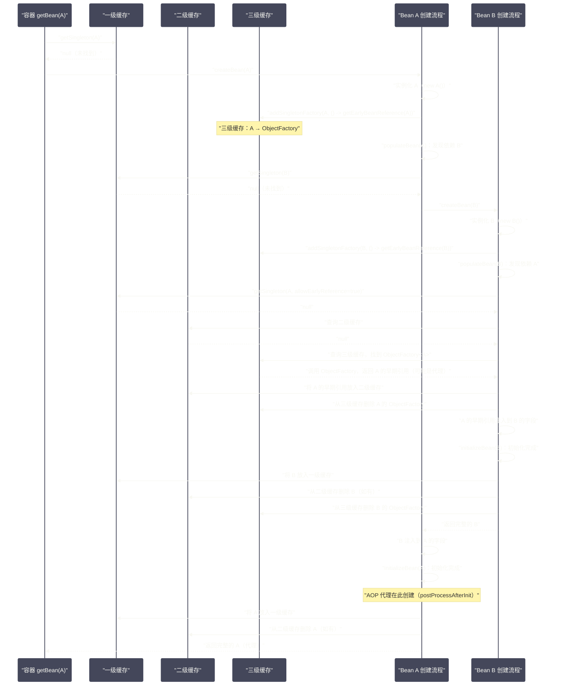

# 依赖注入的三种方式与循环依赖的三级缓存解决方案

## 摘要

依赖注入是 Spring 的核心机制，但"会用"与"理解原理"之间有相当大的鸿沟。本文首先对比构造器注入、Setter 注入、字段注入三种方式的本质差异与工程取舍，然后深入 Spring 最经典的技术难题——**循环依赖**的三级缓存解决方案。三级缓存不是简单的"缓存三层"，每一级缓存存在的意义都有其精确的工程推理：一级缓存保存完整单例；二级缓存打破循环；三级缓存（`ObjectFactory`）的存在是为了在循环依赖场景下正确生成 AOP 代理。理解了这三级缓存的设计动机，你才能真正掌握 Spring 容器最精妙的部分，也才能准确判断哪些循环依赖 Spring 能解决、哪些不能。

---

## 第 1 章 依赖注入的三种方式

### 1.1 构造器注入

构造器注入是通过构造函数的参数来传递依赖的：

```java
@Service
public class OrderService {
    
    private final PaymentService paymentService;
    private final InventoryService inventoryService;
    
    // Spring 推断这个构造器用于注入（只有一个构造器时可省略 @Autowired）
    @Autowired
    public OrderService(PaymentService paymentService, InventoryService inventoryService) {
        this.paymentService = paymentService;
        this.inventoryService = inventoryService;
    }
}
```

构造器注入的核心优势在于，它强制了几个重要的工程约束：

**1. 依赖不可变（`final` 字段）**：声明为 `final` 的字段只能在构造阶段赋值。使用构造器注入，可以将所有依赖声明为 `final`，确保 Bean 创建后这些依赖不会被意外修改。这在多线程环境中尤为重要——`final` 字段有 [[JMM]] 的"初始化安全保证"，即使在没有同步的情况下，其他线程也能安全地读取已完成初始化的对象的 `final` 字段。

**2. 依赖完整性保证**：如果一个必要的依赖无法被满足（容器中找不到对应的 Bean），在构造器调用时就会立即失败，而不是等到某个方法被调用时才暴露 `NullPointerException`。这是"快速失败"原则的体现。

**3. 测试友好性**：使用构造器注入的类，可以不依赖 Spring 容器进行单元测试——直接 `new OrderService(mockPaymentService, mockInventoryService)` 即可：

```java
// 单元测试无需 Spring 容器
@Test
void testCreateOrder() {
    PaymentService mockPayment = mock(PaymentService.class);
    InventoryService mockInventory = mock(InventoryService.class);
    
    // 直接 new，不依赖容器
    OrderService orderService = new OrderService(mockPayment, mockInventory);
    // ...
}
```

**4. 依赖过多时的天然预警**：如果一个类的构造器参数超过 5 个，这是一个明显的信号——这个类承担了过多的职责，应该考虑拆分（单一职责原则）。字段注入和 Setter 注入则会掩盖这个问题，因为新增一个 `@Autowired` 字段几乎没有任何视觉上的"阻力"。

**构造器注入的局限**：无法解决单例 Bean 之间的循环依赖（见第 2 章）。

### 1.2 Setter 注入

Setter 注入通过 `set*` 方法传递依赖：

```java
@Service
public class OrderService {
    
    private PaymentService paymentService;
    
    @Autowired
    public void setPaymentService(PaymentService paymentService) {
        this.paymentService = paymentService;
    }
}
```

Setter 注入在 Spring 早期（XML 配置时代）是主要的注入方式，对应 XML 的 `<property name="paymentService" ref="paymentService"/>` 标签。

Setter 注入的核心特点是**可选性**：依赖可以不注入（字段保持 `null`），方法可以在对象创建后的任意时刻被调用（虽然通常是容器在属性填充阶段调用）。这使得 Setter 注入适合**可选依赖**的场景——在 `@Autowired(required = false)` 的配合下，如果容器中没有对应的 Bean，字段保持默认值，应用可以在降级模式下运行。

Setter 注入的问题是：它破坏了对象的不可变性（字段不能是 `final`），且使得对象在构造完成后处于"半初始化"状态——在 `set*` 方法被调用前，这些依赖字段是 `null`，如果在这个时间窗口内被调用，会出现 `NullPointerException`。

### 1.3 字段注入

字段注入直接在字段上标注 `@Autowired`：

```java
@Service
public class OrderService {
    
    @Autowired
    private PaymentService paymentService;  // Spring 通过反射直接注入
    
    @Autowired
    private InventoryService inventoryService;
}
```

字段注入是最简洁的写法，也是**使用最广泛但最受争议**的注入方式。

**字段注入的问题**：

1. **破坏封装性**：字段是 `private` 的，正常情况下外部无法访问；但 Spring 通过 `Field.setAccessible(true)` 强制突破访问限制，这在语义上违背了 `private` 的封装意图；

2. **不利于单元测试**：字段注入的类无法通过构造器传入 Mock 对象，单元测试必须依赖 Spring 测试框架（`@SpringBootTest` 或 `@ExtendWith(SpringExtension.class)`），启动成本高；或者使用反射/`@InjectMocks` 等 Mockito 特性手动注入——但这本身就是为了应对字段注入带来的测试困境而产生的 workaround；

3. **掩盖设计问题**：如前所述，字段注入让"随手加一个依赖"几乎没有阻力，很容易积累出依赖关系复杂的"上帝类"；

4. **不兼容 `final`**：Spring 无法通过反射为 `final` 字段赋值（`final` 字段在对象创建后不可修改），因此字段注入天然不支持 `final` 修饰符。

> [!note] Spring 官方推荐
> Spring 团队在官方文档中明确推荐**构造器注入**作为首选方式，原因是它提供了更强的不变性保证和更好的可测试性。对于可选依赖，推荐 Setter 注入配合 `@Autowired(required = false)`。字段注入虽然便捷，但在大型项目中长期维护代价较高。

### 1.4 三种注入方式的全面对比

| 维度 | 构造器注入 | Setter 注入 | 字段注入 |
| --- | --- | --- | --- |
| **`final` 支持** | ✅ 支持 | ❌ 不支持 | ❌ 不支持 |
| **不可变性** | 强 | 弱 | 弱 |
| **单元测试** | 无需容器，直接 `new` | 需要手动调用 `set*` | 需要反射或 Spring 支持 |
| **必填依赖保证** | 构造器调用时强制检查 | 运行时才暴露 | 运行时才暴露 |
| **可选依赖支持** | 不优雅（需要重载构造器） | ✅ 天然适合 | 可通过 `required=false` |
| **循环依赖** | ❌ 不能解决 | ✅ 能解决 | ✅ 能解决 |
| **代码简洁度** | 中（需要写构造器） | 低（需要写 set 方法） | 高（最简洁） |
| **Spring 推荐度** | ⭐⭐⭐ 首选 | ⭐⭐ 可选依赖 | ⭐ 不推荐 |

### 1.5 @Autowired vs @Resource vs @Inject

这三个注解都能实现依赖注入，但来源和匹配策略不同：

| 注解 | 来源 | 默认匹配策略 | 指定 Bean 名称 |
| --- | --- | --- | --- |
| `@Autowired` | Spring | 按类型（byType），歧义时按字段名 | 配合 `@Qualifier("beanName")` |
| `@Resource` | Jakarta EE（JSR-250） | 按名称（byName），名称不匹配时按类型 | `@Resource(name = "beanName")` |
| `@Inject` | Jakarta EE（JSR-330） | 按类型（与 `@Autowired` 类似） | 配合 `@Named("beanName")` |

`@Resource` 的按名称匹配策略使其在存在多个同类型 Bean 时更直接：`@Resource(name = "primaryDataSource")` 明确指定了要注入名为 `primaryDataSource` 的 Bean，不需要额外的 `@Qualifier`。

在实践中，`@Autowired` 是 Spring 应用的事实标准；`@Resource` 在需要按名称精确匹配时是个好选择；`@Inject` 几乎只在追求框架无关性时使用。

---

## 第 2 章 循环依赖：Spring 最精妙的技术挑战

### 2.1 什么是循环依赖

循环依赖是指 Bean 之间形成了**依赖环**：

```
Bean A 依赖 Bean B
Bean B 依赖 Bean A
（形成 A → B → A 的循环）
```

更复杂的情形是三角循环：A → B → C → A。

这在实际业务代码中并不罕见——`OrderService` 依赖 `UserService` 获取用户信息，而 `UserService` 又依赖 `OrderService` 统计用户订单数。从设计角度看，循环依赖通常意味着职责划分不清晰，应该通过引入第三个类来打破循环；但在遗留系统的迁移或快速开发阶段，循环依赖又是无法完全避免的现实问题。

### 2.2 循环依赖的直觉性分析

先不考虑 Spring 的解决方案，直觉上分析为什么循环依赖是个问题：

**创建 Bean A 的过程**：
1. 实例化 A（`new A()`）；
2. 填充 A 的依赖，发现 A 依赖 B，于是去获取 B；
3. 创建 Bean B 的过程：实例化 B（`new B()`）；
4. 填充 B 的依赖，发现 B 依赖 A，于是去获取 A；
5. 回到第 1 步，陷入无限循环！

这就是为什么单纯的 `new` 调用无法处理循环依赖——你必须在创建完成之前就能"拿到"这个对象。

这里有一个关键的洞察：**对象的"实例化"和"初始化"是两个阶段**。实例化（`new`）之后，对象虽然还未完成属性填充，但它已经**在堆上占有了一块内存，拥有了一个有效的引用**。能不能在属性填充完成之前，就把这个"半成品"引用暴露出去，让其他 Bean 先持有它，等最终初始化完成后再使用？

这就是 Spring 三级缓存的核心思想。

---

## 第 3 章 三级缓存：精确的工程设计

### 3.1 三级缓存的数据结构

三级缓存位于 `DefaultSingletonBeanRegistry` 中（`DefaultListableBeanFactory` 的祖先类）：

```java
public class DefaultSingletonBeanRegistry extends SimpleAliasRegistry implements SingletonBeanRegistry {
    
    // ===== 一级缓存（Singleton Objects）=====
    // 存储完全初始化好的单例 Bean
    // key: beanName, value: Bean 实例（可能是 AOP 代理）
    private final Map<String, Object> singletonObjects = new ConcurrentHashMap<>(256);
    
    // ===== 二级缓存（Early Singleton Objects）=====
    // 存储"提前暴露"的单例 Bean——已实例化但尚未完成属性填充和初始化
    // key: beanName, value: 提前暴露的 Bean 实例（原始对象或提前生成的代理）
    private final Map<String, Object> earlySingletonObjects = new ConcurrentHashMap<>(16);
    
    // ===== 三级缓存（Singleton Factories）=====
    // 存储 Bean 的 ObjectFactory——一个可以生成提前暴露对象的工厂 Lambda
    // key: beanName, value: ObjectFactory<?>（通常是 () -> getEarlyBeanReference(beanName, mbd, bean)）
    private final Map<String, ObjectFactory<?>> singletonFactories = new HashMap<>(16);
    
    // 正在创建中的 Bean 名称集合（用于循环依赖检测）
    private final Set<String> singletonsCurrentlyInCreation = 
        Collections.newSetFromMap(new ConcurrentHashMap<>(16));
}
```

在进一步分析之前，先建立直觉：为什么需要三级，而不是两级？

**如果只有一级缓存**（只有 `singletonObjects`）：Bean 初始化完成后才放入缓存，循环依赖时永远找不到对方，无限递归。

**如果只有两级缓存**（`singletonObjects` + `earlySingletonObjects`）：实例化后立即将原始对象放入二级缓存，其他 Bean 可以拿到这个"半成品"引用。这在**没有 AOP 代理**的情况下完全可行。

**为什么需要三级缓存（`singletonFactories`）？** 因为 AOP 代理。

考虑以下场景：Bean A 需要被 AOP 代理（比如加了 `@Transactional`），同时 Bean A 和 Bean B 存在循环依赖。

- 正常情况下，AOP 代理在 Bean 完全初始化后，由 `AnnotationAwareAspectJAutoProxyCreator` 在 `postProcessAfterInitialization()` 中创建；
- 但如果 B 依赖 A，B 在属性填充阶段就需要拿到 A——此时 A 还未完成初始化，代理还未创建；
- 如果我们直接将原始 A 放入二级缓存给 B，B 拿到的将是没有事务增强的原始 A，与最终放入一级缓存的代理 A 是两个不同的对象——这违反了单例语义！

三级缓存中的 `ObjectFactory` 正是为了解决这个问题。它是一个延迟计算的工厂，当有人从三级缓存请求 A 时，工厂会执行 `getEarlyBeanReference(beanName, mbd, bean)`——这个方法会检查是否有 AOP 代理需要提前生成，如果有，就在此处提前创建代理并返回，同时将代理放入二级缓存；如果没有，就直接返回原始对象。

这样，无论 B 拿到的是代理还是原始对象，都与最终放入一级缓存的对象是同一个实例（或至少是同一个代理对象）——单例语义得以保证。

### 3.2 三级缓存的工作流程：完整推演

以 Bean A 和 Bean B 互相依赖为例，逐步推演：



### 3.3 getSingleton() 的三级缓存查找逻辑

```java
// DefaultSingletonBeanRegistry#getSingleton(String, boolean)
@Nullable
protected Object getSingleton(String beanName, boolean allowEarlyReference) {
    // 快速路径：先查一级缓存（不加锁，ConcurrentHashMap 的 get 是线程安全的）
    Object singletonObject = this.singletonObjects.get(beanName);
    
    if (singletonObject == null && isSingletonCurrentlyInCreation(beanName)) {
        // Bean 正在创建中（有循环依赖的可能），查二级缓存
        singletonObject = this.earlySingletonObjects.get(beanName);
        
        if (singletonObject == null && allowEarlyReference) {
            // 二级缓存也没有，加锁查三级缓存
            synchronized (this.singletonObjects) {
                // DCL（双重检查锁）：加锁后再次检查一二级缓存
                singletonObject = this.singletonObjects.get(beanName);
                if (singletonObject == null) {
                    singletonObject = this.earlySingletonObjects.get(beanName);
                    if (singletonObject == null) {
                        // 三级缓存查找
                        ObjectFactory<?> singletonFactory = this.singletonFactories.get(beanName);
                        if (singletonFactory != null) {
                            // 调用 ObjectFactory，生成提前暴露的引用
                            singletonObject = singletonFactory.getObject();
                            // 从三级缓存升级到二级缓存
                            this.earlySingletonObjects.put(beanName, singletonObject);
                            this.singletonFactories.remove(beanName);
                        }
                    }
                }
            }
        }
    }
    return singletonObject;
}
```

这里有一个细节：**`allowEarlyReference` 参数**。在 `doGetBean()` 中第一次尝试获取单例时，传入的是 `getSingleton(beanName)` 的单参数重载，等价于 `allowEarlyReference = false`——此时不会触发三级缓存的 `ObjectFactory`。只有在检测到"当前 Bean 正在创建中"的情况下（`isSingletonCurrentlyInCreation()` 返回 `true`），才会允许提前暴露（`allowEarlyReference = true`）。

这个设计防止了一个边缘情况：如果外部代码在 Bean 创建过程中通过 `getBean()` 获取同一个 Bean，不应该提前暴露半成品。

### 3.4 getEarlyBeanReference()：三级缓存的核心 Lambda

三级缓存中存储的 `ObjectFactory` 本质上是一个 Lambda：

```java
// AbstractAutowireCapableBeanFactory#doCreateBean() 中放入三级缓存的代码
addSingletonFactory(beanName, () -> getEarlyBeanReference(beanName, mbd, bean));
```

```java
// getEarlyBeanReference()：AOP 代理提前创建的关键
protected Object getEarlyBeanReference(String beanName, RootBeanDefinition mbd, Object bean) {
    Object exposedObject = bean;
    if (!mbd.isSynthetic() && hasInstantiationAwareBeanPostProcessors()) {
        for (SmartInstantiationAwareBeanPostProcessor bp : getBeanPostProcessorCache().smartInstantiationAware) {
            // AOP 的 AnnotationAwareAspectJAutoProxyCreator 实现了这个接口
            // 在循环依赖场景下，这里会提前创建 AOP 代理
            exposedObject = bp.getEarlyBeanReference(exposedObject, beanName);
        }
    }
    return exposedObject;
}
```

`AnnotationAwareAspectJAutoProxyCreator#getEarlyBeanReference()` 的逻辑：
1. 检查当前 Bean 是否需要被代理（是否匹配任何 Advisor 的切点）；
2. 如果需要，**提前创建 AOP 代理**，并将 beanName 记录到 `earlyProxyReferences` 集合中；
3. 在后续 `postProcessAfterInitialization()` 中，发现 beanName 在 `earlyProxyReferences` 中，就跳过代理创建（因为已经在第 2 步创建过了）。

这保证了：**即使在循环依赖场景下，Bean 的 AOP 代理也只被创建一次，且所有持有该 Bean 引用的地方都拿到的是同一个代理实例**。

---

## 第 4 章 循环依赖的边界：哪些能解决，哪些不能

### 4.1 能解决的场景

Spring 的三级缓存**只能解决单例 Bean 的 Setter 注入或字段注入形成的循环依赖**。

具体条件：
1. 两个 Bean 都是**单例**（`scope = singleton`）；
2. 循环依赖通过**Setter 注入**或**字段注入**（`@Autowired`）形成；
3. 没有通过 `spring.main.allow-circular-references=false`（Spring Boot 2.6+ 默认禁用循环依赖）禁用。

### 4.2 不能解决的场景

**场景 1：构造器注入形成的循环依赖**

```java
@Service
public class ServiceA {
    public ServiceA(ServiceB b) { ... } // 构造器依赖 B
}

@Service
public class ServiceB {
    public ServiceB(ServiceA a) { ... } // 构造器依赖 A
}
```

**原因**：三级缓存的核心是"先实例化，后填充"——实例化之后才能将对象放入三级缓存。构造器注入要求**在实例化时**就必须提供所有依赖，但此时对象还没有被 `new` 出来，无法放入缓存，形成死锁。

Spring 遇到构造器循环依赖会直接抛出 `BeanCurrentlyInCreationException`。

**场景 2：原型 Bean（prototype）的循环依赖**

```java
@Component
@Scope("prototype")
public class ServiceA {
    @Autowired ServiceB b;
}

@Component
@Scope("prototype")
public class ServiceB {
    @Autowired ServiceA a;
}
```

**原因**：三级缓存只对单例生效。原型 Bean 每次 `getBean()` 都创建新实例，Spring 不会把原型 Bean 放入任何缓存，也不会维护"正在创建中"的状态，因此无法检测和打破循环。Spring 遇到原型循环依赖同样抛出 `BeanCurrentlyInCreationException`。

**场景 3：Spring Boot 2.6+ 的默认配置**

从 Spring Boot 2.6 开始，`spring.main.allow-circular-references` 默认为 `false`，循环依赖被主动禁止。这是因为循环依赖本身就是设计问题的信号，Spring 官方希望开发者在编译期/启动期就暴露并修复它，而不是依赖框架的运行时补救。

如果你的项目升级到 Spring Boot 2.6+ 后出现循环依赖启动报错，有三种处理方式：

1. **推荐**：重构代码，消除循环依赖（引入第三个类，或用事件机制解耦）；
2. **临时方案**：`@Lazy` 注解打破循环（将一个依赖声明为懒加载，Spring 注入的是代理占位符）；
3. **不推荐**：在 `application.properties` 中设置 `spring.main.allow-circular-references=true` 恢复旧行为。

### 4.3 @Lazy 如何打破循环依赖

`@Lazy` 是一个优雅的循环依赖打破方式，包括构造器注入也能处理：

```java
@Service
public class ServiceA {
    
    private final ServiceB serviceB;
    
    // 使用 @Lazy：Spring 注入的不是真实的 ServiceB，而是一个 CGLIB 代理
    // 只有当真正调用 serviceB 的方法时，代理才会从容器中获取真实的 ServiceB 实例
    public ServiceA(@Lazy ServiceB serviceB) {
        this.serviceB = serviceB;
    }
}
```

`@Lazy` 在构造器参数上的工作机制：Spring 不会立即创建 `ServiceB`，而是注入一个轻量级的 CGLIB 代理对象（`ObjectProvider` 或 `TargetSource` 包装）。这个代理对象在被访问（方法调用）时，才真正触发 `ServiceB` 的获取。

这打破了循环：`ServiceA` 的构造器获得了一个代理（不需要 `ServiceB` 真正存在），`ServiceA` 创建完成后，`ServiceB` 可以开始创建，此时 `ServiceA` 已经在一级缓存中，`ServiceB` 可以正常注入 `ServiceA`。

---

## 第 5 章 深入 @Autowired 的候选 Bean 解析

### 5.1 DefaultListableBeanFactory#findAutowireCandidates()

当 Spring 为一个 `@Autowired` 字段查找候选 Bean 时，`DefaultListableBeanFactory#findAutowireCandidates()` 是核心方法。理解它的逻辑，能帮助你排查 `NoUniqueBeanDefinitionException`（歧义 Bean）和 `NoSuchBeanDefinitionException`（找不到 Bean）问题：

```java
// 简化版逻辑
protected Map<String, Object> findAutowireCandidates(
        String beanName, Class<?> requiredType, DependencyDescriptor descriptor) {
    
    // 步骤 1：从容器中找所有类型兼容的 Bean 名称
    // 包括：精确类型匹配、父类匹配、接口匹配
    String[] candidateNames = BeanFactoryUtils.beanNamesForTypeIncludingAncestors(
        this, requiredType, true, descriptor.isEager());
    
    Map<String, Object> result = new LinkedHashMap<>(candidateNames.length);
    
    // 步骤 2：处理"可解析的依赖"（通过 registerResolvableDependency 注册的特殊对象）
    // 例如：ApplicationContext、BeanFactory、Environment 等
    for (Map.Entry<Class<?>, Object> classObjectEntry : this.resolvableDependencies.entrySet()) {
        Class<?> autowiringType = classObjectEntry.getKey();
        if (autowiringType.isAssignableFrom(requiredType)) {
            Object value = classObjectEntry.getValue();
            result.put(ObjectUtils.identityToString(value), value);
        }
    }
    
    // 步骤 3：遍历所有候选 Bean 名称
    for (String candidate : candidateNames) {
        if (!isSelfReference(beanName, candidate) // 排除自我引用
                && isAutowireCandidate(candidate, descriptor)) { // 检查 autowireCandidate=true
            addCandidateEntry(result, candidate, descriptor, requiredType);
        }
    }
    
    return result;
}
```

`isAutowireCandidate()` 的检查不只是看 `BeanDefinition` 的 `autowireCandidate` 属性，还会检查：
- 如果依赖描述符有 `@Qualifier` 注解，还需要 Bean 的 qualifier 信息匹配；
- 如果 Bean 是泛型类型（如 `Repository<User>` vs `Repository<Order>`），会做泛型参数的精确匹配——这是 Spring 4.0 引入的重要特性，使得泛型类型可以被精确注入而不产生歧义。

### 5.2 @Primary 与 @Qualifier 的工作机制

**`@Primary`** 标记一个 Bean 在多个同类型候选中优先被选择：

```java
@Bean
@Primary  // 当有多个 DataSource 时，这个被优先选择
public DataSource primaryDataSource() { ... }

@Bean
public DataSource secondaryDataSource() { ... }
```

`@Primary` 的实现方式是在 `BeanDefinition` 上设置 `primary = true`。`findAutowireCandidates()` 返回多个候选时，Spring 会从中筛选 `primary` 为 `true` 的 Bean。如果有且只有一个 `@Primary` Bean，注入成功；如果有多个 `@Primary` Bean，仍然抛出歧义异常。

**`@Qualifier`** 提供更精确的 Bean 选择：

```java
@Autowired
@Qualifier("secondaryDataSource")  // 明确指定 beanName
private DataSource dataSource;
```

`@Qualifier` 的 `value` 值默认对应 beanName。但 `@Qualifier` 的更强大用法是自定义限定词——可以不依赖 beanName，而是通过语义标签进行匹配：

```java
// 定义自定义 Qualifier
@Target({ElementType.FIELD, ElementType.PARAMETER, ElementType.METHOD})
@Retention(RetentionPolicy.RUNTIME)
@Qualifier  // 元注解标注这是一个 Qualifier
public @interface DatabaseType {
    String value();  // "mysql", "redis", "mongodb"
}

// 在 Bean 定义上标注
@Bean
@DatabaseType("mysql")
public DataSource mysqlDataSource() { ... }

// 在注入点使用
@Autowired
@DatabaseType("mysql")
private DataSource dataSource;
```

这种自定义 `@Qualifier` 比单纯用 beanName 更具语义性，也更重构友好。

### 5.3 ObjectProvider：Spring 4 的延迟注入利器

`ObjectProvider<T>` 是 Spring 4 引入的注入方式，它相当于一个"智能的、懒加载的、安全的 Bean 引用"：

```java
@Service
public class OrderService {
    
    // 不直接注入 OptionalPlugin，而是注入其 ObjectProvider
    // 这样即使容器中没有 OptionalPlugin Bean，OrderService 也能创建成功
    private final ObjectProvider<OptionalPlugin> pluginProvider;
    
    public OrderService(ObjectProvider<OptionalPlugin> pluginProvider) {
        this.pluginProvider = pluginProvider;
    }
    
    public void processOrder(Order order) {
        // 按需获取，如果 Bean 不存在则使用默认行为
        pluginProvider.ifAvailable(plugin -> plugin.preProcess(order));
        // ...
    }
}
```

`ObjectProvider` 的核心方法：
- `getObject()`：获取 Bean，不存在则抛异常（等同于直接 `@Autowired`）；
- `getIfAvailable()`：获取 Bean，不存在则返回 `null`（不抛异常）；
- `getIfUnique()`：获取 Bean，不存在或有多个则返回 `null`；
- `ifAvailable(Consumer<T>)`：如果 Bean 存在则执行 Consumer；
- `stream()`：将所有匹配类型的 Bean 作为流返回（Spring 5 新增）。

`ObjectProvider` 的内部实现是懒解析——它持有一个对 `BeanFactory` 的引用和要注入的类型，只有在调用 `getObject()` 等方法时才真正查找容器。这使得 `ObjectProvider` 也能在一定程度上打破循环依赖（与 `@Lazy` 类似）。

---

## 第 6 章 依赖注入的工程实践建议

### 6.1 如何彻底消除循环依赖

循环依赖是代码异味，消除循环依赖通常比处理循环依赖更重要。几种常见的重构模式：

**模式 1：提取公共依赖**

```
原始结构：A → B → A（循环）
             ↕
重构后：A → C ← B（A 和 B 都依赖新的 C，C 不依赖任何一方）
```

适用场景：A 和 B 互相依赖是因为它们共用了某些逻辑，这些共用逻辑可以提取到 C 中。

**模式 2：使用 Spring 事件解耦**

```java
// OrderService 不再直接依赖 UserService
@Service
public class OrderService {
    
    @Autowired
    private ApplicationEventPublisher eventPublisher;
    
    public void createOrder(Order order) {
        // 发布事件，而不是直接调用 UserService 的方法
        eventPublisher.publishEvent(new OrderCreatedEvent(this, order));
    }
}

@Service
public class UserService {
    
    @EventListener
    public void onOrderCreated(OrderCreatedEvent event) {
        // 处理订单创建事件，更新用户积分等
        updateUserPoints(event.getOrder().getUserId());
    }
}
```

事件机制将"调用关系"变成"订阅/发布关系"，彻底打破了编译期的循环依赖，同时也提高了模块间的解耦程度。

**模式 3：接口分离**

如果 A 调用 B 的方法 m1()，B 调用 A 的方法 m2()——可以将 m2() 提取到一个单独的接口 `IAForB` 中，B 只依赖 `IAForB` 接口（而不是 A 的全部实现），打破循环的同时也遵循了依赖倒置原则。

### 6.2 依赖注入方式的选型原则

在实际项目中，一个合理的注入方式选型原则：

**优先构造器注入**：
- 所有必填的依赖（`required = true`，默认值）使用构造器注入；
- 保持字段 `final`；
- 允许更轻量的单元测试。

**Setter 注入用于可选依赖**：
- 对于确实可以缺少的依赖（有默认行为可以兜底），用 Setter 注入配合 `@Autowired(required = false)`；
- 或使用 `ObjectProvider` 的 `getIfAvailable(defaultValue)` 模式。

**在框架集成代码中谨慎使用字段注入**：
- 基础设施代码（切面、过滤器等）中字段注入是可接受的，因为这些代码本身就与框架深度绑定；
- 业务逻辑代码中应避免字段注入。

### 6.3 理解 Spring Boot 2.6+ 的立场

Spring Boot 2.6 默认禁用循环依赖的决策背后，是 Spring 团队在积累了大量社区反馈后做出的一个工程判断：**循环依赖在绝大多数情况下都是可以避免的设计问题，允许循环依赖只是给了开发者逃避重构的理由**。

这个默认值的改变影响了大量升级到 Spring Boot 2.6+ 的项目，许多项目在升级后第一次启动就遇到了 `BeanCurrentlyInCreationException`。但从长远来看，这推动了代码质量的改善——那些被三级缓存默默"容忍"多年的循环依赖，现在被迫暴露出来并得到了修复。

---

## 总结

本文从依赖注入的三种方式出发，深入剖析了循环依赖的本质与三级缓存的精妙设计：

- **三种注入方式的本质差异**：构造器注入提供不可变性和快速失败保证，是首选；Setter 注入适合可选依赖；字段注入便捷但有诸多工程代价；
- **循环依赖的本质**：实例化和初始化的两阶段分离，使得"先暴露半成品引用"成为可能；
- **三级缓存的设计动机**：一级缓存存完整单例；二级缓存存提前暴露的早期引用（打破循环）；三级缓存存 `ObjectFactory`（解决循环依赖 + AOP 代理共存时的一致性问题）；
- **循环依赖的边界**：只有单例 Bean 的非构造器注入循环依赖才能被解决；构造器注入循环依赖和原型 Bean 循环依赖均无法解决；
- **工程建议**：消除循环依赖优于处理循环依赖；事件机制和接口分离是常用的重构模式。

下一篇，我们将深入 Spring AOP 的实现原理，剖析 JDK 动态代理与 CGLIB 的底层机制与选择逻辑：[[06 AOP实现原理——JDK动态代理与CGLIB]]。

---

> [!note] 参考资料
> - `org.springframework.beans.factory.support.DefaultSingletonBeanRegistry` 源码（三级缓存所在）
> - `org.springframework.beans.factory.support.AbstractAutowireCapableBeanFactory` 源码
> - `org.springframework.beans.factory.annotation.AutowiredAnnotationBeanPostProcessor` 源码
> - [Spring Framework 官方文档 - Dependencies](https://docs.spring.io/spring-framework/reference/core/beans/dependencies.html)

---

> [!note] 思考题
> 1. Spring 4.2+ 支持 `@EventListener` 注解替代实现 `ApplicationListener` 接口。`@EventListener` 方法可以有返回值——返回值会作为新事件被发布。这种'事件链'机制在什么场景下有用？如果事件链形成了循环（A 事件触发 B 事件，B 事件触发 A 事件），Spring 如何处理？会无限循环吗？
> 2. `@TransactionalEventListener(phase = TransactionPhase.AFTER_COMMIT)` 在事务提交后才执行监听器。这对于'订单创建后发送通知'的场景非常有用——避免了事务回滚但通知已发出的问题。但如果监听器中的逻辑失败了（如发送邮件失败），事务不会回滚（因为已经提交了）。你如何保证'通知一定发出'？
> 3. Spring 的事件机制是同步的（默认在发布线程中执行所有监听器）。通过配置 `ApplicationEventMulticaster` 的 `TaskExecutor` 可以实现异步事件。但异步事件丢失了调用栈上下文——`SecurityContextHolder` 和 `TransactionSynchronizationManager` 中的信息在异步线程中不可用。你如何在异步事件中传播安全上下文和事务上下文？
