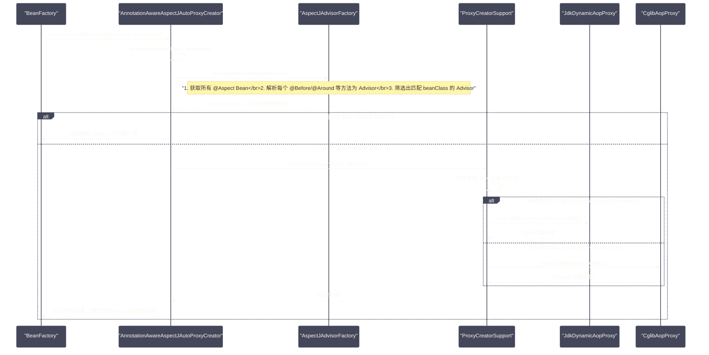
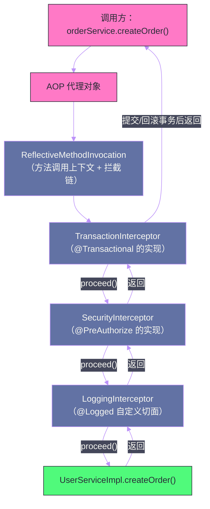

# AOP实现原理——JDK动态代理与CGLIB

## 摘要

面向切面编程（AOP）是 Spring 的第二根支柱，`@Transactional`、`@Cacheable`、`@Async`、自定义权限控制——这些功能无一不建立在 AOP 之上。但"会用 `@Aspect`"与"理解 Spring AOP 的工作原理"之间有相当大的认知差距。本文从代理模式的本质出发，深入剖析 JDK 动态代理和 CGLIB 字节码增强的底层机制与性能差异，然后完整追踪 Spring AOP 的实现链路：从 `@Aspect` 注解被 `AnnotationAwareAspectJAutoProxyCreator` 解析，到 `Advisor`/`Pointcut`/`Advice` 三者的关系，再到代理对象在方法调用时的拦截链执行模型。最后重点分析 Spring AOP 的使用边界与失效场景——理解"为什么内部调用会导致 AOP 失效"，是写好 Spring 代码的必修课。

---

## 第 1 章 代理模式：AOP 的基石

### 1.1 为什么需要代理

在软件工程中，有一类横切关注点（Cross-Cutting Concern）——日志记录、性能监控、事务管理、安全检查——它们本身不是业务逻辑的一部分，但几乎每个业务方法都需要它们。如果将这些逻辑直接写在业务方法中，会导致代码高度重复、职责混乱：

```java
// 没有 AOP 时的代码：业务逻辑被横切关注点污染
public class OrderService {
    
    public void createOrder(Order order) {
        // 1. 权限检查（横切）
        SecurityContext.checkPermission("ORDER_WRITE");
        
        // 2. 开启事务（横切）
        Transaction tx = TransactionManager.beginTransaction();
        try {
            // 3. 打印日志（横切）
            log.info("Creating order: {}", order);
            
            // 4. 实际业务逻辑（这才是这个方法应该关注的）
            validateOrder(order);
            orderRepository.save(order);
            
            // 5. 提交事务（横切）
            tx.commit();
        } catch (Exception e) {
            tx.rollback();
            throw e;
        } finally {
            // 6. 记录性能（横切）
            metrics.record("createOrder", System.currentTimeMillis() - startTime);
        }
    }
}
```

代理模式的解决思路是：**在目标对象和调用方之间插入一个代理对象**，代理对象拦截所有方法调用，在调用前后执行横切逻辑，最终将调用委托给原始对象。这样业务方法本身保持纯粹，横切关注点被集中在代理层统一处理。

```java
// 使用 Spring AOP 后：业务逻辑保持纯粹
@Service
@Transactional  // AOP 代理处理事务，业务代码感知不到
public class OrderService {
    
    @PreAuthorize("hasPermission('ORDER_WRITE')")  // AOP 代理处理权限
    @Logged  // 自定义日志切面
    public void createOrder(Order order) {
        // 只有业务逻辑
        validateOrder(order);
        orderRepository.save(order);
    }
}
```

### 1.2 代理的两种核心实现方案

Java 生态中有两种主流的运行时代理方案，它们的实现思路截然不同：

**JDK 动态代理**（`java.lang.reflect.Proxy`）：利用 Java 反射机制，在运行时动态生成一个实现了目标接口的代理类字节码，并加载到 JVM。代理类的方法实现统一转发到 `InvocationHandler#invoke()`，在这里注入横切逻辑。

**CGLIB**（Code Generation Library）：通过 ASM 字节码操作框架，在运行时动态生成目标类的子类字节码，覆盖父类（目标类）的所有非 `final` 方法，将方法调用通过 `MethodInterceptor#intercept()` 拦截。

两种方案的核心差异：

| 对比维度 | JDK 动态代理 | CGLIB |
| --- | --- | --- |
| **代理方式** | 实现目标接口，生成接口的新实现 | 继承目标类，生成子类 |
| **目标类约束** | 目标类**必须实现至少一个接口** | 目标类**不能是 `final`**，被代理方法**不能是 `final`** |
| **生成速度** | 较快（反射 API 开销较小） | 较慢（ASM 字节码生成开销较大） |
| **执行速度（早期）** | 较慢（反射调用） | 较快（直接方法调用，接近原生） |
| **执行速度（JDK 8+）** | 差距缩小（JIT 对反射调用优化） | 仍略快 |
| **内存占用** | 较小 | 较大（生成的子类额外占用 Metaspace） |
| **`final` 方法支持** | 不适用（接口默认无 final） | 不支持（子类无法覆盖 final 方法） |

---

## 第 2 章 JDK 动态代理的底层机制

### 2.1 Proxy.newProxyInstance() 做了什么

JDK 动态代理的入口是 `java.lang.reflect.Proxy.newProxyInstance()`：

```java
// 创建 JDK 动态代理的标准用法
UserService userService = new UserServiceImpl();
UserService proxy = (UserService) Proxy.newProxyInstance(
    userService.getClass().getClassLoader(),   // 类加载器
    new Class[]{UserService.class},             // 代理需要实现的接口列表
    new MyInvocationHandler(userService)        // 调用处理器
);
```

`Proxy.newProxyInstance()` 内部的核心步骤：

1. **生成代理类字节码**：调用 `ProxyGenerator.generateProxyClass()`（JDK 内部类）生成实现了所有指定接口的代理类字节码；
2. **加载代理类**：将字节码通过 `ClassLoader.defineClass()` 加载到 JVM；
3. **实例化代理对象**：调用代理类的构造器（接受一个 `InvocationHandler` 参数），创建代理实例。

生成的代理类结构大致如下（伪代码）：

```java
// JDK 生成的代理类（以 $Proxy0 为例，实际包名为 com.sun.proxy）
final class $Proxy0 extends Proxy implements UserService {
    
    // 构造器：接受 InvocationHandler
    $Proxy0(InvocationHandler h) {
        super(h); // Proxy 基类保存 h 到 this.h 字段
    }
    
    // 为接口中的每个方法生成对应的代理方法
    @Override
    public User findById(Long id) {
        try {
            // 通过反射调用：将方法调用转发给 InvocationHandler.invoke()
            return (User) this.h.invoke(
                this,                                        // 代理对象自身
                UserService.class.getMethod("findById", Long.class), // Method 对象
                new Object[]{id}                             // 方法参数
            );
        } catch (RuntimeException | Error e) {
            throw e;
        } catch (Throwable t) {
            throw new UndeclaredThrowableException(t);
        }
    }
    
    // ... 其他接口方法类似
}
```

### 2.2 InvocationHandler：横切逻辑的注入点

```java
public interface InvocationHandler {
    /**
     * @param proxy  代理对象（通常不需要使用，避免递归调用死循环）
     * @param method 被调用的方法的 Method 对象
     * @param args   方法参数
     * @return 方法的返回值
     */
    Object invoke(Object proxy, Method method, Object[] args) throws Throwable;
}
```

一个典型的 `InvocationHandler` 实现（手动实现日志切面）：

```java
public class LoggingHandler implements InvocationHandler {
    
    private final Object target; // 原始目标对象
    
    public LoggingHandler(Object target) {
        this.target = target;
    }
    
    @Override
    public Object invoke(Object proxy, Method method, Object[] args) throws Throwable {
        long start = System.currentTimeMillis();
        log.info("Calling {}.{}()", target.getClass().getSimpleName(), method.getName());
        try {
            // 通过反射调用原始对象的方法
            Object result = method.invoke(target, args);
            log.info("Completed in {}ms", System.currentTimeMillis() - start);
            return result;
        } catch (InvocationTargetException e) {
            // method.invoke() 将被调用方法的异常包装成 InvocationTargetException
            // 需要解包后重新抛出
            throw e.getCause();
        }
    }
}
```

### 2.3 JDK 动态代理的性能特点

JDK 动态代理的性能瓶颈在于 `method.invoke(target, args)`——这是一次反射调用。反射调用的开销主要来自：

1. **方法查找**：`Method` 对象包含了方法的所有元信息，虽然动态代理提前缓存了 `Method` 对象（在代理类初始化时通过静态块缓存），但每次调用仍需通过 `Method` 对象的访问检查；
2. **参数自动装箱**：`invoke()` 接受的是 `Object[]`，如果方法参数是基本类型（`int`、`long` 等），需要自动装箱为 `Integer`、`Long`，这有额外的内存分配开销；
3. **JIT 优化的障碍**：早期 JVM 的 JIT 编译器难以内联反射调用链，导致方法分派无法被优化。JDK 8 之后这一点有所改善，通过 `MethodHandle` 路径的反射调用可以被 JIT 内联。

在实际性能测试中，JDK 动态代理的方法调用开销通常在几十到几百纳秒级别，对于 I/O 密集型的数据库查询、RPC 调用来说，这个开销几乎可以忽略不计；但对于计算密集型的方法（执行时间在微秒级），代理开销就变得显著了。

---

## 第 3 章 CGLIB 字节码增强的底层机制

### 3.1 CGLIB 的工作原理

CGLIB（Code Generation Library）集成在 Spring 内部（`spring-core` 包含了 CGLIB 的重新打包版本 `org.springframework.cglib`），不需要额外引入依赖。

CGLIB 通过 ASM 字节码框架动态生成目标类的**子类**：

```java
// CGLIB 创建代理的典型用法（Spring 内部使用 CglibAopProxy，此处示例原理）
Enhancer enhancer = new Enhancer();
enhancer.setSuperclass(UserServiceImpl.class); // 设置父类（目标类）
enhancer.setCallback(new MyMethodInterceptor()); // 设置方法拦截器
UserServiceImpl proxy = (UserServiceImpl) enhancer.create();
```

CGLIB 生成的代理类结构大致如下（伪代码）：

```java
// CGLIB 生成的代理类（以 UserServiceImpl$$EnhancerByCGLIB$$xxx 为例）
class UserServiceImpl$$EnhancerByCGLIB$$abc123 extends UserServiceImpl {
    
    private MethodInterceptor CGLIB$CALLBACK_0; // 方法拦截器
    
    // 为每个被代理的方法生成两个成员：
    // 1. 原方法的 Method 对象（用于 MethodProxy 的反射路径）
    private static final Method CGLIB$findById$0$Method;
    // 2. MethodProxy（FastClass 路径，比反射更快）
    private static final MethodProxy CGLIB$findById$0$Proxy;
    
    @Override
    public User findById(Long id) {
        MethodInterceptor interceptor = this.CGLIB$CALLBACK_0;
        if (interceptor == null) {
            // 如果没有拦截器，直接调用父类方法（退化为普通调用）
            return super.findById(id);
        }
        // 调用拦截器的 intercept() 方法
        return (User) interceptor.intercept(
            this,                           // 代理对象
            CGLIB$findById$0$Method,        // Method 对象
            new Object[]{id},               // 参数
            CGLIB$findById$0$Proxy          // MethodProxy（用于调用父类原始方法）
        );
    }
    
    // CGLIB$findById$0：对父类方法的直接调用包装
    // 供 MethodProxy.invokeSuper() 使用，避免反射
    final User CGLIB$findById$0(Long id) {
        return super.findById(id); // 直接调用父类方法
    }
}
```

### 3.2 MethodInterceptor：CGLIB 的拦截接口

```java
public interface MethodInterceptor extends Callback {
    /**
     * @param obj    代理对象（CGLIB 生成的子类实例）
     * @param method 被调用的方法的 Method 对象
     * @param args   方法参数
     * @param proxy  MethodProxy，用于调用父类（原始）方法，比反射快
     */
    Object intercept(Object obj, Method method, Object[] args, MethodProxy proxy) throws Throwable;
}
```

关键在于 `MethodProxy#invokeSuper(obj, args)` 与普通反射 `method.invoke(target, args)` 的区别：

- `method.invoke(target, args)` 是标准 Java 反射，涉及方法查找、访问检查、参数装箱；
- `proxy.invokeSuper(obj, args)` 通过 CGLIB 的 **`FastClass`** 机制，直接调用父类方法，避免反射开销。

**FastClass 机制**：CGLIB 为代理类生成一个 `FastClass` 辅助类，它通过方法签名哈希（`index`）实现 O(1) 的方法分派，本质上是一个 `switch` 语句：

```java
// FastClass 生成的 invoke 方法（概念示例）
public Object invoke(int index, Object target, Object[] args) {
    UserServiceImpl t = (UserServiceImpl) target;
    switch (index) {
        case 0: return t.findById((Long) args[0]);
        case 1: t.createUser((User) args[0]); return null;
        // ...
    }
    throw new InvocationTargetException(new NoSuchMethodException());
}
```

这个 `switch` 分派可以被 JIT 编译成高效的跳转表，执行效率接近直接方法调用。这就是 CGLIB 在早期 JVM 上比 JDK 动态代理性能更好的根本原因。

### 3.3 CGLIB 的限制

CGLIB 基于继承的代理方式有几个硬性限制：

1. **不能代理 `final` 类**：`final` 类无法被继承，CGLIB 无法生成子类，会抛出 `IllegalArgumentException`；
2. **不能代理 `final` 方法**：`final` 方法无法被子类覆盖，CGLIB 无法拦截，这些方法会直接调用父类实现，绕过代理逻辑；
3. **不能代理无法访问的构造器**：如果目标类的构造器是 `private` 的，CGLIB 无法创建子类实例（虽然 CGLIB 可以通过 `Objenesis` 绕过构造器来实例化，Spring 使用了这个特性）；
4. **生成类占用 Metaspace**：每个被代理的类都会生成对应的代理类字节码，在应用中有大量类被代理时，可能导致 Metaspace 压力增大（Spring Boot 的启动优化之一就是减少不必要的代理生成）。

---

## 第 4 章 Spring AOP 的核心概念体系

### 4.1 五个核心概念的精确定义

在深入 Spring AOP 的实现之前，需要厘清五个核心概念的精确语义——这些概念在日常使用中容易混淆：

**1. Join Point（连接点）**

连接点是程序执行过程中可以插入切面的"候选位置"。在 Spring AOP 中，**连接点固定是方法执行时**（method execution）。这是 Spring AOP 与 AspectJ 完整版的一个重要区别——完整的 AspectJ 支持字段访问、构造器调用、异常抛出等多种连接点类型，而 Spring AOP 为了简单性，只支持方法级别的连接点。

**2. Pointcut（切点）**

切点是一个**谓词（Predicate）**，用来筛选哪些连接点（哪些方法）应该被切面拦截。Spring AOP 使用 **AspectJ 切点表达式语言**来描述切点：

```
execution(* com.example.service.*.*(..))
  ↑         ↑                   ↑  ↑ ↑
  execution: 方法执行连接点
  第一个 *: 任意返回类型
  com.example.service: 包名
  第二个 *: 任意类名
  第三个 *: 任意方法名
  (..): 任意参数列表
```

常用的切点指示符：
- `execution`：匹配方法执行的连接点（最常用）；
- `within`：匹配特定类型或包内的所有方法；
- `@annotation`：匹配带有特定注解的方法；
- `@within`：匹配带有特定注解的类的所有方法；
- `args`：匹配参数类型；
- `bean`：Spring AOP 特有，按 Bean 名称匹配。

**3. Advice（通知）**

Advice 是切面在切点处执行的**动作**，定义了"做什么"和"在方法的什么位置做"：

| Advice 类型 | 注解 | 执行时机 |
| --- | --- | --- |
| Before | `@Before` | 方法执行前 |
| AfterReturning | `@AfterReturning` | 方法正常返回后（有异常则不执行） |
| AfterThrowing | `@AfterThrowing` | 方法抛出异常后 |
| After（Finally）| `@After` | 方法结束后（无论正常还是异常，类似 finally） |
| Around | `@Around` | 包裹整个方法调用，可以控制是否执行目标方法 |

`@Around` 是功能最强大的 Advice，它完全控制方法的执行流程：

```java
@Around("execution(* com.example.service.*.*(..))")
public Object logAndTime(ProceedingJoinPoint pjp) throws Throwable {
    long start = System.currentTimeMillis();
    log.info("Before: {}", pjp.getSignature());
    try {
        // proceed() 调用目标方法（或调用链中的下一个 Advice）
        Object result = pjp.proceed();
        log.info("After: {}ms", System.currentTimeMillis() - start);
        return result;
    } catch (Throwable t) {
        log.error("Exception in {}: {}", pjp.getSignature(), t.getMessage());
        throw t;
    }
}
```

**4. Aspect（切面）**

Aspect 是 Pointcut 和 Advice 的组合，用 `@Aspect` 注解的类就是一个切面。切面定义了"在哪里（Pointcut）做什么（Advice）"：

```java
@Aspect
@Component  // 切面本身也需要是 Spring Bean
public class PerformanceAspect {
    
    @Pointcut("execution(* com.example.service.*.*(..))")
    public void serviceMethods() {}  // 切点定义（方法体为空，只是定义切点）
    
    @Around("serviceMethods()")
    public Object measureTime(ProceedingJoinPoint pjp) throws Throwable {
        // ...
    }
}
```

**5. Target Object（目标对象）**

目标对象是被代理的原始对象——即你自己写的业务类实例（`UserServiceImpl`）。代理对象在方法调用时，最终会将调用委托给目标对象。

> [!info] Spring AOP vs AspectJ
> Spring AOP 使用的是 AspectJ 的**注解语法**和**切点表达式语言**，但底层实现是 JDK 动态代理或 CGLIB，而非 AspectJ 的字节码织入器（Weaver）。这意味着 Spring AOP 是一种"代理-based AOP"，只能拦截 Spring 容器管理的 Bean 的方法调用，而 AspectJ 的完整实现（Load-Time Weaving 或 Compile-Time Weaving）可以拦截任何代码，包括 `new` 出来的对象和静态方法。

### 4.2 Advisor：Spring AOP 内部的核心抽象

在 Spring AOP 的内部实现中，`Advisor` 是比 `Aspect` 更低层的核心抽象。一个 `Advisor` 包含了一个 `Pointcut` 和一个 `Advice`：

```java
public interface Advisor {
    Advice getAdvice();
}

public interface PointcutAdvisor extends Advisor {
    Pointcut getPointcut();
}
```

`@Aspect` 类中的每个 `@Before`/`@Around` 等注解方法，都会被 `ReflectiveAspectJAdvisorFactory` 转化为一个 `PointcutAdvisor`：

- Pointcut：由 AspectJ 切点表达式构建的 `AspectJExpressionPointcut`；
- Advice：由 `@Before` 等注解方法包装成的 `AspectJMethodBeforeAdvice`、`AspectJAroundAdvice` 等。

这个转化发生在 `AnnotationAwareAspectJAutoProxyCreator` 的初始化阶段，所有 `@Aspect` Bean 被扫描后，其中的每个 Advice 方法都被封装成 `Advisor` 对象，注册到 `advisorsCache` 中，供后续的代理创建使用。

---

## 第 5 章 Spring AOP 的代理创建流程

### 5.1 AnnotationAwareAspectJAutoProxyCreator：AOP 的总指挥

`AnnotationAwareAspectJAutoProxyCreator` 是 Spring AOP 的核心 `BeanPostProcessor`，其继承链：

```
BeanPostProcessor
  └── InstantiationAwareBeanPostProcessor
        └── SmartInstantiationAwareBeanPostProcessor
              └── AbstractAutoProxyCreator
                    └── AbstractAdvisorAutoProxyCreator
                          └── AspectJAwareAdvisorAutoProxyCreator
                                └── AnnotationAwareAspectJAutoProxyCreator
```

它通过 `@EnableAspectJAutoProxy` 注解（Spring Boot 自动配置默认开启）注册到容器中，在每个 Bean 完成初始化后（`postProcessAfterInitialization()`），检查是否需要为其创建代理。

### 5.2 代理创建的完整流程



### 5.3 JDK 还是 CGLIB：Spring 的选择逻辑

Spring AOP 的代理类型选择，由两个因素共同决定：

```java
// AbstractAutoProxyCreator#createProxy() 内部的判断逻辑（简化）
private AopProxy createAopProxy(AdvisedSupport config) {
    if (config.isOptimize()           // 显式开启优化（Spring 通常不用）
            || config.isProxyTargetClass()  // 显式指定使用 CGLIB（@EnableAspectJAutoProxy(proxyTargetClass=true)）
            || hasNoUserSuppliedProxyInterfaces(config)) { // 目标类没有实现用户定义的接口
        
        Class<?> targetClass = config.getTargetClass();
        
        if (targetClass.isInterface() || Proxy.isProxyClass(targetClass)) {
            // 目标类本身就是接口，或者目标类已经是 JDK 代理类，使用 JDK
            return new JdkDynamicAopProxy(config);
        }
        // 否则使用 CGLIB
        return new ObjenesisCglibAopProxy(config);
    } else {
        // 目标类有接口，使用 JDK
        return new JdkDynamicAopProxy(config);
    }
}
```

**关键决策点**：
1. `@EnableAspectJAutoProxy(proxyTargetClass = true)` 或 `@EnableTransactionManagement(proxyTargetClass = true)`：强制使用 CGLIB，不管目标类有没有接口；
2. Spring Boot 自动配置（`spring-boot-autoconfigure`）默认设置了 `proxyTargetClass = true`——**Spring Boot 应用默认使用 CGLIB**！这是 Spring Boot 与 Spring Framework 默认行为的一个重要区别；
3. 目标类没有实现任何用户定义的接口：必须使用 CGLIB（JDK 动态代理需要接口）；
4. 其他情况（有接口且 `proxyTargetClass = false`）：使用 JDK 动态代理。

> [!info] Spring Boot 默认 CGLIB 的原因
> Spring Boot 将默认代理改为 CGLIB，是为了解决一个历史痛点：当使用 JDK 动态代理时，注入点必须声明为接口类型（`@Autowired UserService userService`），而不能是实现类类型（`@Autowired UserServiceImpl userService`），否则会因为类型不匹配而失败（容器里存的是 `$Proxy0` 类型，不是 `UserServiceImpl`）。CGLIB 代理是目标类的子类，可以安全地强转为任意父类型，包括实现类本身。

---

## 第 6 章 代理对象的方法调用链

### 6.1 拦截链的构建

当一个 Bean 上有多个 Advice 匹配同一个方法时，Spring AOP 会构建一个**拦截链（Interceptor Chain）**，每个 Advice 被包装成 `MethodInterceptor`，按顺序执行：



这个调用链的设计使用了**责任链模式**：每个拦截器持有链的引用，调用 `proceed()` 将控制权传递给下一个拦截器；当最后一个拦截器调用 `proceed()` 时，才真正执行目标方法。

### 6.2 ReflectiveMethodInvocation：调用链的执行引擎

`ReflectiveMethodInvocation` 是 JDK 动态代理场景下拦截链的执行引擎（CGLIB 场景使用 `CglibMethodInvocation`，但核心逻辑相同）：

```java
// ReflectiveMethodInvocation#proceed()（简化）
@Override
@Nullable
public Object proceed() throws Throwable {
    // 已经执行完所有拦截器，到达调用链末端，执行目标方法
    if (this.currentInterceptorIndex == this.interceptorsAndDynamicMethodMatchers.size() - 1) {
        return invokeJoinpoint(); // 通过反射调用目标方法
    }
    
    // 获取下一个拦截器
    Object interceptorOrInterceptionAdvice =
        this.interceptorsAndDynamicMethodMatchers.get(++this.currentInterceptorIndex);
    
    if (interceptorOrInterceptionAdvice instanceof InterceptorAndDynamicMethodMatcher dm) {
        // 动态切点匹配（运行时匹配，比静态匹配开销更大）
        if (dm.methodMatcher().matches(this.method, targetClass, this.arguments)) {
            return dm.interceptor().invoke(this); // 匹配成功，执行拦截器
        } else {
            return proceed(); // 跳过当前拦截器，继续下一个
        }
    } else {
        // 静态匹配（在代理创建时已匹配，运行时直接执行）
        return ((MethodInterceptor) interceptorOrInterceptionAdvice).invoke(this);
    }
}
```

**静态匹配 vs 动态匹配**：
- **静态匹配**：切点只依赖方法签名和目标类，在代理创建时（`BeanPostProcessor#postProcessAfterInitialization`）就能确定是否匹配，无需运行时判断，性能最佳；
- **动态匹配**：切点依赖运行时参数（如 `args(userId)` 需要匹配参数值），每次调用都需要重新评估，有额外的运行时开销。大多数 `execution` 切点是静态匹配。

### 6.3 Advice 执行顺序

同一个方法上有多个 Advice 时，执行顺序由 `@Order` 注解控制（数值越小优先级越高）：

```
高优先级切面（小 @Order 值）：
  before() 先执行
  after() 后执行
低优先级切面（大 @Order 值）：
  before() 后执行
  after() 先执行
```

这类似于一个洋葱模型：高优先级切面在最外层，先进后出。

---

## 第 7 章 Spring AOP 的边界与失效场景

### 7.1 最经典的失效场景：同类内部调用

这是 Spring AOP 最广为人知的限制，也是生产中最常见的 Bug 来源：

```java
@Service
public class OrderService {
    
    @Transactional  // 期望这个方法在事务中执行
    public void createOrder(Order order) {
        validateOrder(order);
        orderRepository.save(order);
        // 内部调用！这里的 this 是原始对象，不是代理
        this.sendNotification(order);
    }
    
    @Async  // 期望这个方法异步执行
    public void sendNotification(Order order) {
        // 实际上是同步调用，因为 this 绕过了代理
        notificationService.send(order);
    }
}
```

**根本原因**：AOP 代理是容器中的"外壳"，`this.sendNotification()` 中的 `this` 是原始 `OrderService` 实例，不是代理对象。调用经过的是原始对象的方法，不经过任何代理拦截器，所有基于 AOP 的功能（`@Async`、`@Transactional`、自定义切面）统统失效。

**解决方案有几种**：

方案 1：通过 `ApplicationContext` 获取自身的代理：

```java
@Service
public class OrderService implements ApplicationContextAware {
    
    private ApplicationContext applicationContext;
    
    @Override
    public void setApplicationContext(ApplicationContext ctx) {
        this.applicationContext = ctx;
    }
    
    public void createOrder(Order order) {
        // 从容器中获取代理对象，而不是用 this
        OrderService self = applicationContext.getBean(OrderService.class);
        self.sendNotification(order); // 经过代理，@Async 生效
    }
}
```

方案 2：使用 `AopContext.currentProxy()`（需要 `@EnableAspectJAutoProxy(exposeProxy = true)`）：

```java
@EnableAspectJAutoProxy(exposeProxy = true)
@SpringBootApplication
public class App { ... }

@Service
public class OrderService {
    
    public void createOrder(Order order) {
        // AopContext.currentProxy() 从线程本地变量中获取当前代理对象
        ((OrderService) AopContext.currentProxy()).sendNotification(order);
    }
}
```

方案 3（推荐）：**重新设计，将 `sendNotification` 移到单独的 Service Bean 中**，通过注入而不是内部调用来触发。这是最干净的解决方案，也是 AOP 失效倒逼你改进设计的典型场景。

### 7.2 其他失效场景

**场景 2：`@Transactional` 注解在 `private` 方法上**

Spring AOP（基于代理）无法拦截 `private` 方法——无论是 JDK 动态代理（接口方法都是 `public`）还是 CGLIB（`private` 方法无法被子类覆盖），都无法拦截非公开方法。

```java
@Service
public class OrderService {
    
    @Transactional  // ❌ 失效！private 方法上的 @Transactional 不起作用
    private void saveOrder(Order order) {
        orderRepository.save(order);
    }
}
```

**场景 3：`static` 方法上的 AOP 注解**

`static` 方法不属于任何对象实例，代理的拦截是基于"对象方法调用"的，`static` 方法调用不经过代理，所有 AOP 注解失效。

**场景 4：Spring 容器外创建的对象**

通过 `new` 直接创建的对象（而不是从容器中 `getBean()` 获取的）不是代理对象，AOP 不生效：

```java
// ❌ 直接 new，不经过容器，无 AOP
OrderService orderService = new OrderService();
orderService.createOrder(order); // @Transactional 失效
```

**场景 5：`@Transactional` 的异常类型不匹配**

这不是 AOP 的失效，而是事务切面的配置问题。`@Transactional` 默认只回滚 `RuntimeException` 和 `Error`，受检异常（checked exception）不触发回滚：

```java
@Transactional
public void process() throws IOException {
    // 如果这里抛出 IOException，事务不会回滚！
    // 因为 IOException 是受检异常，不在默认回滚规则内
    riskyOperation();
}

// 需要显式声明
@Transactional(rollbackFor = IOException.class)
public void process() throws IOException {
    riskyOperation();
}
```

### 7.3 Spring AOP vs AspectJ 编织：何时选择 AspectJ

Spring AOP 的代理-based 实现有一个根本的约束：**只能拦截 Spring 管理的 Bean 的方法调用**。以下场景 Spring AOP 无能为力，需要 AspectJ 的完整编织支持：

- 拦截 `new` 出来的对象（如领域对象的创建）；
- 拦截静态方法调用；
- 拦截 `private` 或 `protected` 方法；
- 在 Spring 容器启动之前就需要拦截的场景；
- 对性能要求极高的场景（Spring AOP 每次方法调用有额外的代理开销，而 AspectJ 编织是编译期完成的，运行时几乎没有额外开销）。

Spring 原生支持 AspectJ 的 Load-Time Weaving（LTW），通过 `@EnableLoadTimeWeaving` 启用，但配置复杂度较高，通常只在确实有需求时才引入。

---

## 总结

本文从代理模式出发，完整剖析了 Spring AOP 的底层机制：

- **JDK 动态代理**：基于接口，运行时生成实现接口的代理类，通过 `InvocationHandler.invoke()` 拦截；反射调用是主要性能开销，JDK 8+ 有 JIT 优化；
- **CGLIB**：基于继承，运行时生成目标类的子类，通过 `MethodInterceptor.intercept()` 拦截；FastClass 机制避免了反射，执行效率更高；Spring Boot 默认使用 CGLIB；
- **Spring AOP 的核心概念**：`Advisor = Pointcut + Advice`，`@Aspect` 类中每个 Advice 方法被解析为一个 `Advisor`，注册到 `AnnotationAwareAspectJAutoProxyCreator` 的缓存中；
- **代理创建流程**：在 `postProcessAfterInitialization()` 中，为每个 Bean 查找匹配的 Advisor，有匹配则创建代理替代原始 Bean；
- **拦截链执行**：`ReflectiveMethodInvocation.proceed()` 实现责任链，多个 Advice 按 `@Order` 值组成洋葱式执行链；
- **失效场景**：同类内部调用、`private` 方法、`static` 方法是最常见的失效场景，根本原因都是调用绕过了代理对象。

理解了这些原理，`@Transactional` 为什么会失效不再是谜，AOP 的使用边界也变得清晰可控。

下一篇，我们将深入 Spring 事务管理，从 AOP 的基础出发，剖析声明式事务的传播行为与所有已知的失效场景：[[07 Spring事务管理——声明式事务的传播行为与失效场景]]。

---

> [!note] 参考资料
> - `org.springframework.aop.framework.JdkDynamicAopProxy` 源码
> - `org.springframework.aop.framework.CglibAopProxy` 源码
> - `org.springframework.aop.aspectj.annotation.AnnotationAwareAspectJAutoProxyCreator` 源码
> - `org.springframework.aop.framework.ReflectiveMethodInvocation` 源码
> - [Spring Framework 官方文档 - Aspect Oriented Programming](https://docs.spring.io/spring-framework/reference/core/aop.html)

---

> [!note] 思考题
> 1. Spring 的 `@Transactional(propagation = REQUIRED)` 是默认传播行为——如果当前有事务就加入，没有就创建新事务。但 `REQUIRES_NEW` 会挂起当前事务并创建新事务。在什么场景下你需要 `REQUIRES_NEW`（如审计日志记录、独立的异常处理）？如果内层 `REQUIRES_NEW` 事务提交后，外层事务回滚——内层的数据会回滚吗？
> 2. Spring 事务的隔离级别（`@Transactional(isolation = Isolation.REPEATABLE_READ)`）实际上由底层数据库实现。MySQL 的 REPEATABLE READ 通过 MVCC 实现快照读，避免了不可重复读，但 MySQL 的 RR 级别能否防止幻读？InnoDB 的 Gap Lock 在这里起什么作用？
> 3. 编程式事务（`TransactionTemplate` 或 `PlatformTransactionManager`）比声明式事务（`@Transactional`）更灵活但代码更啰嗦。在什么场景下你必须使用编程式事务（如在循环中对每次迭代独立提交、根据运行时条件决定是否回滚）？编程式和声明式可以混合使用吗？
