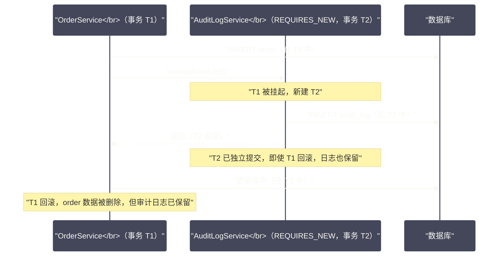

# Spring事务管理——声明式事务的传播行为与失效场景

## 摘要

`@Transactional` 是 Spring 最高频使用的注解之一，也是生产环境事故的重灾区。标注一个注解就能获得事务保障，背后隐藏的是一套精密的 AOP 拦截 + 事务同步管理器机制。本文从"为什么需要声明式事务"出发，深入剖析 `TransactionInterceptor` 的拦截链路、`PlatformTransactionManager` 的抽象层设计，以及最关键的七种传播行为（Propagation）的精确语义——每种传播行为在"有无已存在事务"两种情况下的行为差异，是理解 Spring 事务最重要的一块拼图。文章的后半部分系统整理了 `@Transactional` 在生产中的所有已知失效场景，每个场景都从根本原因出发进行分析，给出明确的诊断和修复思路。

---

## 第 1 章 从编程式事务到声明式事务

### 1.1 编程式事务的痛点

在声明式事务出现之前，Java 代码需要手动管理事务边界。以 JDBC 为例：

```java
// 原始 JDBC 编程式事务
public void createOrder(Order order) {
    Connection conn = null;
    try {
        conn = dataSource.getConnection();
        conn.setAutoCommit(false); // 关闭自动提交，开启事务
        
        // 业务逻辑
        PreparedStatement stmt1 = conn.prepareStatement("INSERT INTO orders ...");
        stmt1.executeUpdate();
        
        PreparedStatement stmt2 = conn.prepareStatement("UPDATE inventory ...");
        stmt2.executeUpdate();
        
        conn.commit(); // 提交
    } catch (SQLException e) {
        try {
            if (conn != null) conn.rollback(); // 回滚
        } catch (SQLException re) { /* 忽略 */ }
        throw new RuntimeException(e);
    } finally {
        try {
            if (conn != null) conn.close();
        } catch (SQLException e) { /* 忽略 */ }
    }
}
```

这段代码的问题显而易见：
1. **事务管理代码与业务逻辑严重混杂**，真正的业务只有两行 `executeUpdate()`，其余都是样板代码；
2. **连接获取与关闭是手动的**，在多层调用中（Service 调 Service），每层都独立获取连接，无法共享同一个事务；
3. **不同事务资源的协调**：如果一个业务操作同时涉及数据库和消息队列，手动编程式事务几乎无法优雅地处理两个资源的协调提交/回滚；
4. **可测试性差**：充斥着 `Connection`、`PreparedStatement` 等底层对象，单元测试需要 Mock 大量低层依赖。

Spring 的 `JdbcTemplate` 部分解决了第 1、4 条，但第 2、3 条（跨方法的事务传播）才是 Spring 声明式事务真正解决的核心问题。

### 1.2 声明式事务的核心思想

Spring 的声明式事务建立在两个核心机制之上：

**1. AOP 代理拦截**：`@Transactional` 注解由 `TransactionInterceptor`（一个 `MethodInterceptor`）处理，它在方法执行前开启事务、方法正常返回后提交、方法抛出特定异常时回滚。整个过程对业务代码完全透明。

**2. `TransactionSynchronizationManager` 线程本地绑定**：事务资源（数据库连接 `Connection`、Hibernate Session 等）通过 `ThreadLocal` 绑定到当前线程。同一个线程内的所有数据库操作共享同一个 `Connection`，确保它们在同一个事务中执行。这是跨方法事务传播的技术基础。

```java
// TransactionSynchronizationManager 的核心数据结构（简化）
public abstract class TransactionSynchronizationManager {
    
    // 绑定到当前线程的资源（如 DataSource → Connection 的映射）
    private static final ThreadLocal<Map<Object, Object>> resources =
        new NamedThreadLocal<>("Transactional resources");
    
    // 绑定到当前线程的事务同步器（用于在事务提交/回滚时触发回调）
    private static final ThreadLocal<Set<TransactionSynchronization>> synchronizations =
        new NamedThreadLocal<>("Transaction synchronizations");
    
    // 当前事务的名称（用于日志和监控）
    private static final ThreadLocal<String> currentTransactionName =
        new NamedThreadLocal<>("Current transaction name");
    
    // 当前事务是否为只读
    private static final ThreadLocal<Boolean> currentTransactionReadOnly =
        new NamedThreadLocal<>("Current transaction read-only status");
    
    // 当前事务是否处于活跃状态
    private static final ThreadLocal<Boolean> actualTransactionActive =
        new NamedThreadLocal<>("Actual transaction active");
}
```

当 `TransactionInterceptor` 开启一个事务时：
1. 从 `DataSource` 获取 `Connection`，调用 `conn.setAutoCommit(false)`；
2. 将 `DataSource → ConnectionHolder（包含 Connection）` 的映射绑定到 `TransactionSynchronizationManager` 的 `resources` ThreadLocal；
3. 当 `JdbcTemplate` 执行 SQL 时，它调用 `DataSourceUtils.getConnection(dataSource)` 获取连接——这个方法不是直接从 `DataSource` 获取新连接，而是先检查 `TransactionSynchronizationManager` 中是否有当前线程绑定的连接，有则复用，没有才获取新连接；
4. 事务提交或回滚后，从 ThreadLocal 中解绑连接，归还到连接池。

整个链路的关键是：**同一线程内，所有参与同一事务的方法，都通过 `ThreadLocal` 共享同一个 `Connection`**。

---

## 第 2 章 事务抽象层：PlatformTransactionManager

### 2.1 为什么需要事务抽象

Spring 支持多种数据访问技术：JDBC、Hibernate、JPA、MyBatis……每种技术有自己的事务 API。Spring 通过 `PlatformTransactionManager` 接口对事务操作进行统一抽象：

```java
public interface PlatformTransactionManager extends TransactionManager {
    
    // 获取事务（可能复用已有事务，取决于传播行为）
    TransactionStatus getTransaction(@Nullable TransactionDefinition definition)
        throws TransactionException;
    
    // 提交事务
    void commit(TransactionStatus status) throws TransactionException;
    
    // 回滚事务
    void rollback(TransactionStatus status) throws TransactionException;
}
```

核心实现类：

| 实现类 | 适用场景 |
| --- | --- |
| `DataSourceTransactionManager` | 纯 JDBC、MyBatis、JdbcTemplate |
| `JpaTransactionManager` | JPA（Hibernate、EclipseLink 等） |
| `HibernateTransactionManager` | 直接使用 Hibernate Session API |
| `JtaTransactionManager` | 分布式事务（XA 协议，跨多个数据源） |
| `ReactiveTransactionManager` | 响应式编程（WebFlux + R2DBC） |

Spring Boot 自动配置会根据类路径上的依赖，自动注册对应的 `PlatformTransactionManager` Bean——有 `spring-jdbc` 但无 JPA，注册 `DataSourceTransactionManager`；有 JPA，注册 `JpaTransactionManager`。

### 2.2 TransactionDefinition：事务的元数据

每个 `@Transactional` 注解最终被转化为一个 `TransactionDefinition`，描述"这个事务应该怎么运作"：

```java
public interface TransactionDefinition {
    
    // ===== 传播行为（最重要的属性）=====
    int PROPAGATION_REQUIRED = 0;      // 默认值
    int PROPAGATION_SUPPORTS = 1;
    int PROPAGATION_MANDATORY = 2;
    int PROPAGATION_REQUIRES_NEW = 3;
    int PROPAGATION_NOT_SUPPORTED = 4;
    int PROPAGATION_NEVER = 5;
    int PROPAGATION_NESTED = 6;
    
    int getPropagationBehavior();
    
    // ===== 隔离级别 =====
    int ISOLATION_DEFAULT = -1;         // 使用数据库默认（通常是 READ_COMMITTED）
    int ISOLATION_READ_UNCOMMITTED = 1; // 读未提交（最低，允许脏读）
    int ISOLATION_READ_COMMITTED = 2;   // 读已提交（防止脏读）
    int ISOLATION_REPEATABLE_READ = 4;  // 可重复读（防止不可重复读，MySQL 默认）
    int ISOLATION_SERIALIZABLE = 8;     // 串行化（最高，防止幻读，性能最差）
    
    int getIsolationLevel();
    
    // ===== 超时 =====
    int TIMEOUT_DEFAULT = -1; // 使用底层事务系统的默认超时
    int getTimeout();         // 单位：秒
    
    // ===== 只读标志 =====
    boolean isReadOnly();
    
    // ===== 事务名称（用于日志/监控）=====
    @Nullable String getName();
}
```

---

## 第 3 章 七种传播行为的精确语义

传播行为（Propagation）是 Spring 事务中最复杂、最容易误解的部分。它定义了：**当一个 `@Transactional` 方法被调用时，如果调用者已经处于一个事务中，被调用的方法应该如何处理？**

理解传播行为需要区分两种调用场景：
- **场景 A**：调用方**有**一个活跃事务（`TransactionSynchronizationManager.isActualTransactionActive() == true`）；
- **场景 B**：调用方**没有**活跃事务。

### 3.1 REQUIRED（默认值）

**语义**："我需要在一个事务中执行，如果已有事务就加入，没有就新建。"

| 调用场景 | 行为 |
| --- | --- |
| 场景 A（有事务） | **加入**当前事务，与调用方共享同一个事务 |
| 场景 B（无事务） | **新建**一个事务 |

这是最常用的传播行为，适合绝大多数业务操作。

**关键细节**：当被调用方"加入"了调用方的事务时，它们实际上共用**同一个** `Connection`，提交和回滚是统一的。如果被调用方抛出异常导致事务被标记为"rollback-only"，调用方即使在 catch 块中吞掉了这个异常，事务也会在最外层提交时因为 rollback-only 标记而强制回滚，并抛出 `UnexpectedRollbackException`。

```java
@Service
public class OrderService {
    
    @Autowired
    private PaymentService paymentService;
    
    @Transactional // 新建事务 T1
    public void createOrder(Order order) {
        orderRepository.save(order);
        try {
            paymentService.charge(order); // REQUIRED，加入 T1
        } catch (PaymentException e) {
            // ⚠️ 危险！PaymentService.charge() 抛出异常时，
            // 事务已被标记为 rollback-only
            // 这里 catch 住了异常，但 T1 在 createOrder() 返回后提交时
            // 会抛出 UnexpectedRollbackException！
            log.warn("Payment failed, order saved but unpaid");
        }
    }
}
```

这是生产中的一个经典坑：开发者以为 catch 住了异常就一切正常，实际上事务的 rollback-only 标记已经设置，最终提交必然失败。

### 3.2 REQUIRES_NEW

**语义**："我必须在全新的独立事务中执行，与调用方的事务完全隔离。"

| 调用场景 | 行为 |
| --- | --- |
| 场景 A（有事务） | **挂起**当前事务，**新建**一个完全独立的新事务 |
| 场景 B（无事务） | **新建**一个事务 |



`REQUIRES_NEW` 的典型使用场景：**审计日志、操作记录**。业务操作失败时，操作记录应该独立保存（即使业务事务回滚，审计日志也必须留下），这时就需要 `REQUIRES_NEW` 让日志写入操作有自己独立的事务。

> [!warning] REQUIRES_NEW 的连接池风险
> 当 T1 被挂起，T2 开始时，需要从连接池**获取一个新的连接**——因为 T1 和 T2 要在不同的 `Connection` 上执行才能真正独立。如果你的业务调用链很深，且都使用 `REQUIRES_NEW`，可能同时持有多个数据库连接。如果连接池的 `maximumPoolSize` 设置过小，在高并发下可能导致连接耗尽（死锁：所有线程都持有一个 T1 的连接，等待 T2 的连接，而连接池已空）。

### 3.3 NESTED

**语义**："如果有外部事务，在外部事务内建立一个嵌套事务（保存点），嵌套事务可以独立回滚而不影响外部事务。"

| 调用场景 | 行为 |
| --- | --- |
| 场景 A（有事务） | 在当前事务中创建**保存点（Savepoint）**，形成嵌套事务 |
| 场景 B（无事务） | 行为等同于 `REQUIRED`，新建一个事务 |

`NESTED` 与 `REQUIRES_NEW` 的关键区别：

| 维度 | REQUIRES_NEW | NESTED |
| --- | --- | --- |
| **连接数** | 需要新连接，外部事务被挂起 | 共用同一个连接（同一个事务内的保存点） |
| **外部事务影响** | 完全独立，互不影响 | 嵌套事务回滚→外部事务不受影响</br>外部事务回滚→嵌套事务也回滚 |
| **数据可见性** | 两个独立事务，隔离级别决定可见性 | 同一事务内，嵌套事务的修改对外部事务可见 |
| **适用场景** | 必须独立持久化（审计日志） | 局部回滚（批量处理中某条记录失败，回滚该条，继续处理下一条） |

```java
@Service
public class BatchService {
    
    @Transactional // 外部事务 T1
    public void processBatch(List<Order> orders) {
        for (Order order : orders) {
            try {
                orderService.processOne(order); // NESTED：嵌套保存点
            } catch (Exception e) {
                // 某条订单处理失败，回滚到保存点，但 T1 整体继续
                log.warn("Failed to process order {}, skipping", order.getId());
            }
        }
        // T1 在所有订单处理完后提交，成功的记录都被持久化
    }
}
```

> [!info] NESTED 的数据库支持要求
> `NESTED` 依赖数据库的**保存点（Savepoint）**特性（SQL 标准 `SAVEPOINT` 语句）。MySQL InnoDB 和 PostgreSQL 都支持保存点；但某些数据库（如部分 NoSQL）不支持，此时 `NESTED` 行为退化为 `REQUIRED`。`DataSourceTransactionManager` 支持 NESTED；`JpaTransactionManager` 默认不支持，需要特殊配置。

### 3.4 SUPPORTS

**语义**："有事务我就参与，没事务我也照常运行（不保证在事务中）。"

| 调用场景 | 行为 |
| --- | --- |
| 场景 A（有事务） | 加入当前事务 |
| 场景 B（无事务） | 以非事务方式运行（不开启新事务） |

`SUPPORTS` 适合**只读查询**方法——这些方法在有事务时参与事务（确保读一致性），在没有事务时也能独立运行（不需要事务开销）。

### 3.5 MANDATORY

**语义**："我必须在已有事务中执行，如果没有事务，直接报错。"

| 调用场景 | 行为 |
| --- | --- |
| 场景 A（有事务） | 加入当前事务 |
| 场景 B（无事务） | 抛出 `IllegalTransactionStateException` |

`MANDATORY` 是一种防御性编程工具——用于强制要求调用方必须先开启事务。比如底层的 Repository 方法，设计上要求只能在事务中被调用，通过 `MANDATORY` 可以在开发阶段就发现"忘记开启事务"的 Bug。

### 3.6 NOT_SUPPORTED

**语义**："我不应该在事务中执行，如果有事务，把它挂起。"

| 调用场景 | 行为 |
| --- | --- |
| 场景 A（有事务） | **挂起**当前事务，以非事务方式运行 |
| 场景 B（无事务） | 以非事务方式运行 |

`NOT_SUPPORTED` 适合**不需要事务的耗时操作**（如发送邮件、调用外部 API）——如果这些操作在事务中执行，会长时间占用数据库连接，可能导致连接池耗尽。将它们标注为 `NOT_SUPPORTED`，可以提前释放事务连接，减少连接持有时长。

### 3.7 NEVER

**语义**："我不能在事务中执行，如果有事务，直接报错。"

| 调用场景 | 行为 |
| --- | --- |
| 场景 A（有事务） | 抛出 `IllegalTransactionStateException` |
| 场景 B（无事务） | 以非事务方式运行 |

`NEVER` 与 `MANDATORY` 相对，用于强制要求调用方不能有事务。

### 3.8 七种传播行为汇总

```mermaid
%%{init: {'theme': 'base', 'themeVariables': {'primaryColor': '#6272a4', 'primaryTextColor': '#f8f8f2', 'primaryBorderColor': '#44475a', 'lineColor': '#bd93f9', 'secondaryColor': '#44475a', 'tertiaryColor': '#282a36', 'background': '#282a36', 'mainBkg': '#44475a', 'nodeBorder': '#6272a4', 'clusterBkg': '#282a36', 'titleColor': '#f8f8f2', 'edgeLabelBackground': '#44475a', 'fontFamily': 'monospace'}}}%%
graph TD
    classDef join fill:#50fa7b,stroke:#282a36,color:#282a36
    classDef new fill:#ffb86c,stroke:#282a36,color:#282a36
    classDef non fill:#6272a4,stroke:#bd93f9,color:#f8f8f2
    classDef err fill:#ff5555,stroke:#282a36,color:#f8f8f2

    Q{"调用方有活跃事务?"}
    REQUIRED_Y["REQUIRED: 加入"]:::join
    REQUIRED_N["REQUIRED: 新建"]:::new
    REQUIRES_NEW_Y["REQUIRES_NEW: 挂起外部，新建"]:::new
    REQUIRES_NEW_N["REQUIRES_NEW: 新建"]:::new
    NESTED_Y["NESTED: 建立保存点"]:::join
    NESTED_N["NESTED: 新建（等同 REQUIRED）"]:::new
    SUPPORTS_Y["SUPPORTS: 加入"]:::join
    SUPPORTS_N["SUPPORTS: 非事务运行"]:::non
    MANDATORY_Y["MANDATORY: 加入"]:::join
    MANDATORY_N["MANDATORY: 抛出异常"]:::err
    NOT_SUPPORTED_Y["NOT_SUPPORTED: 挂起外部，非事务运行"]:::non
    NOT_SUPPORTED_N["NOT_SUPPORTED: 非事务运行"]:::non
    NEVER_Y["NEVER: 抛出异常"]:::err
    NEVER_N["NEVER: 非事务运行"]:::non

    Q -- "有" --> REQUIRED_Y
    Q -- "无" --> REQUIRED_N
    Q -- "有" --> REQUIRES_NEW_Y
    Q -- "无" --> REQUIRES_NEW_N
    Q -- "有" --> NESTED_Y
    Q -- "无" --> NESTED_N
    Q -- "有" --> SUPPORTS_Y
    Q -- "无" --> SUPPORTS_N
    Q -- "有" --> MANDATORY_Y
    Q -- "无" --> MANDATORY_N
    Q -- "有" --> NOT_SUPPORTED_Y
    Q -- "无" --> NOT_SUPPORTED_N
    Q -- "有" --> NEVER_Y
    Q -- "无" --> NEVER_N
```



---

## 第 4 章 TransactionInterceptor 的执行链路

### 4.1 从 @Transactional 到事务开启的完整路径

```java
// TransactionInterceptor#invoke()（简化）
@Override
@Nullable
public Object invoke(MethodInvocation invocation) throws Throwable {
    Class<?> targetClass = invocation.getThis().getClass();
    return invokeWithinTransaction(invocation.getMethod(), targetClass, 
        new CoroutinesInvocationCallback() {
            @Override
            public Object proceedWithInvocation() throws Throwable {
                return invocation.proceed(); // 调用实际的目标方法
            }
        });
}

// TransactionAspectSupport#invokeWithinTransaction()（核心骨架）
protected Object invokeWithinTransaction(Method method, Class<?> targetClass, 
        InvocationCallback invocation) throws Throwable {
    
    // 1. 获取事务属性（@Transactional 注解解析结果）
    TransactionAttributeSource tas = getTransactionAttributeSource();
    TransactionAttribute txAttr = tas.getTransactionAttribute(method, targetClass);
    
    // 2. 确定使用哪个 PlatformTransactionManager
    TransactionManager tm = determineTransactionManager(txAttr);
    
    // 3. 根据传播行为获取或创建事务
    TransactionInfo txInfo = createTransactionIfNecessary(ptm, txAttr, joinpointIdentification);
    
    Object retVal;
    try {
        // 4. 调用实际的业务方法
        retVal = invocation.proceedWithInvocation();
    } catch (Throwable ex) {
        // 5. 异常处理：判断是否回滚
        completeTransactionAfterThrowing(txInfo, ex);
        throw ex;
    } finally {
        // 6. 清理事务信息（无论成功失败都执行）
        cleanupTransactionInfo(txInfo);
    }
    
    // 7. 正常提交
    commitTransactionAfterReturning(txInfo);
    return retVal;
}
```

### 4.2 回滚规则的决策逻辑

`completeTransactionAfterThrowing()` 中的回滚判断：

```java
protected void completeTransactionAfterThrowing(@Nullable TransactionInfo txInfo, Throwable ex) {
    if (txInfo != null && txInfo.getTransactionStatus() != null) {
        if (txInfo.transactionAttribute != null 
                && txInfo.transactionAttribute.rollbackOn(ex)) {
            // 满足回滚条件，标记事务为 rollback-only（或直接回滚）
            txInfo.getTransactionManager().rollback(txInfo.getTransactionStatus());
        } else {
            // 不满足回滚条件，提交事务
            txInfo.getTransactionManager().commit(txInfo.getTransactionStatus());
        }
    }
}
```

`rollbackOn(Throwable ex)` 的默认逻辑（`DefaultTransactionAttribute` 的实现）：

```java
@Override
public boolean rollbackOn(Throwable ex) {
    // 默认只对 RuntimeException 和 Error 回滚
    // 受检异常（checked exception）不触发回滚！
    return (ex instanceof RuntimeException || ex instanceof Error);
}
```

可以通过 `@Transactional` 的 `rollbackFor` 和 `noRollbackFor` 属性覆盖默认规则：

```java
@Transactional(
    rollbackFor = {SQLException.class, BusinessException.class}, // 这些受检异常也回滚
    noRollbackFor = OptimisticLockException.class  // 这个 RuntimeException 不回滚
)
public void complexOperation() { ... }
```

### 4.3 隔离级别与数据库默认值

`@Transactional(isolation = Isolation.DEFAULT)` 是默认设置，意味着使用数据库连接的默认隔离级别。不同数据库的默认隔离级别：

| 数据库 | 默认隔离级别 | 说明 |
| --- | --- | --- |
| MySQL InnoDB | `REPEATABLE_READ` | 通过 MVCC 实现，性能较好，但有幻读风险（在某些场景） |
| PostgreSQL | `READ_COMMITTED` | 大多数 OLTP 场景的务实选择 |
| Oracle | `READ_COMMITTED` | 通过撤销段（Undo Segment）实现多版本 |
| SQL Server | `READ_COMMITTED` | 默认，可开启快照隔离（RCSI）提升并发 |
| H2（测试） | `READ_COMMITTED` | 适合开发测试 |

> [!warning] 隔离级别与连接池的交互
> 当使用连接池（如 HikariCP）时，连接是复用的。如果某个操作修改了连接的隔离级别（通过 `@Transactional(isolation = ...)` 设置），Spring 的 `DataSourceTransactionManager` 会在**每次获取连接时**设置隔离级别，并在**归还连接时恢复原始隔离级别**。这个"每次设置"操作会有一定的额外开销（需要发送 SQL 命令给数据库），所以频繁变更隔离级别的场景需要注意性能影响。

---

## 第 5 章 @Transactional 的所有已知失效场景

### 5.1 场景一：内部调用（最常见）

如第 6 章 AOP 文章中所述，同类方法互相调用绕过了代理，AOP 拦截不生效。

```java
@Service
public class OrderService {
    
    @Transactional
    public void createOrder(Order order) {
        // ❌ this.validate() 不经过代理，@Transactional 和 @Async 均失效
        this.validate(order);
        orderRepository.save(order);
    }
    
    @Transactional(propagation = Propagation.REQUIRES_NEW)
    public void validate(Order order) { ... }
}
```

**根本原因**：`this` 是原始对象，绕过了 Spring 的 AOP 代理。

**修复**：将 `validate()` 移到单独的 Bean 中（`OrderValidator`），通过 `@Autowired` 注入后调用。

### 5.2 场景二：方法非 public

Spring AOP（基于代理）无法拦截 `private`、`protected`、包级访问的方法。

```java
@Service
public class OrderService {
    
    @Transactional  // ❌ 失效，private 方法无法被代理拦截
    private void doCreate(Order order) {
        orderRepository.save(order);
    }
}
```

**修复**：将需要事务保护的方法改为 `public`，或通过 `@EnableTransactionManagement(mode = AdviceMode.ASPECTJ)` 切换到 AspectJ 编织模式（能拦截任何访问修饰符）。

### 5.3 场景三：异常被吞掉

事务只会在异常传播到 `TransactionInterceptor` 时才触发回滚判断。如果业务代码捕获了异常并没有重新抛出，`TransactionInterceptor` 不会感知到异常，只会正常提交：

```java
@Transactional
public void createOrder(Order order) {
    try {
        // orderRepository.save() 抛出了 DataAccessException
        orderRepository.save(order);
    } catch (DataAccessException e) {
        // ❌ 异常被吞掉，事务正常提交，但数据实际上没有保存成功！
        log.error("Save failed: {}", e.getMessage());
        // 应该：throw e; 或 throw new BusinessException("Save failed", e);
    }
}
```

**修复**：catch 后必须重新抛出，或者在 catch 中显式调用 `TransactionAspectSupport.currentTransactionStatus().setRollbackOnly()`（但这会让调用链外层提交时抛出 `UnexpectedRollbackException`，需要谨慎处理）。

### 5.4 场景四：受检异常未配置 rollbackFor

```java
@Transactional  // ❌ IOException 是受检异常，默认不回滚
public void processFile(File file) throws IOException {
    String content = FileUtils.readFileToString(file);
    orderRepository.save(parseOrder(content));
    // 如果这里抛出 IOException，事务会提交（已保存的 order 不会回滚）！
    externalService.sendFile(file); // 可能抛 IOException
}

// 正确写法：
@Transactional(rollbackFor = IOException.class)
public void processFile(File file) throws IOException { ... }
```

### 5.5 场景五：Spring Bean 未被容器管理

非 Spring 管理的对象（通过 `new` 创建）上的 `@Transactional` 没有任何效果——因为 AOP 代理只作用于容器管理的 Bean：

```java
// ❌ 通过 new 创建，不是 Spring Bean，@Transactional 失效
OrderService orderService = new OrderService();
orderService.createOrder(order);

// ✅ 通过容器获取，是代理对象，@Transactional 生效
OrderService orderService = applicationContext.getBean(OrderService.class);
orderService.createOrder(order);
```

### 5.6 场景六：@Transactional 在接口上但实现类使用 CGLIB

当使用 CGLIB 代理时，代理是目标类的子类，Spring 默认会继承父类（目标类）上的 `@Transactional` 注解。但如果 `@Transactional` 只标注在接口上，而目标类没有标注，CGLIB 代理**无法感知接口上的注解**——因为 CGLIB 代理继承的是具体类，不是接口。

```java
public interface OrderService {
    @Transactional  // ❌ 在 Spring Boot（CGLIB 默认）中，这个可能不生效
    void createOrder(Order order);
}

@Service
public class OrderServiceImpl implements OrderService {
    // 没有 @Transactional 注解
    @Override
    public void createOrder(Order order) { ... }
}
```

Spring Framework 文档明确建议：`@Transactional` 注解应该**标注在具体类或具体方法上，而不是接口上**。

### 5.7 场景七：多数据源时 TransactionManager 配置错误

当应用有多个数据源时，必须为每个 `@Transactional` 操作指定正确的 `TransactionManager`：

```java
@Configuration
public class DataSourceConfig {
    
    @Bean
    @Primary
    public DataSource primaryDataSource() { ... }
    
    @Bean
    public DataSource secondaryDataSource() { ... }
    
    @Bean
    @Primary
    public PlatformTransactionManager primaryTxManager(
            @Qualifier("primaryDataSource") DataSource ds) {
        return new DataSourceTransactionManager(ds);
    }
    
    @Bean
    public PlatformTransactionManager secondaryTxManager(
            @Qualifier("secondaryDataSource") DataSource ds) {
        return new DataSourceTransactionManager(ds);
    }
}
```

```java
@Service
public class OrderService {
    
    @Autowired
    @Qualifier("secondaryDataSource")
    private JdbcTemplate secondaryJdbc; // 使用 secondary 数据源的 JdbcTemplate
    
    // ❌ 使用了默认的 primaryTxManager 开启的事务
    // 而实际的 SQL 发到了 secondaryDataSource，两者不在同一个事务中！
    @Transactional
    public void querySecondary() {
        secondaryJdbc.query("SELECT ...", ...);
    }
    
    // ✅ 显式指定与数据源匹配的 TransactionManager
    @Transactional("secondaryTxManager")
    public void querySecondaryCorrectly() {
        secondaryJdbc.query("SELECT ...", ...);
    }
}
```

### 5.8 场景八：事务在新线程中失效

由于事务通过 `ThreadLocal` 绑定到当前线程，在新线程中开始的操作无法感知原线程的事务：

```java
@Transactional
public void batchProcess(List<Order> orders) {
    orders.parallelStream().forEach(order -> {
        // ❌ parallelStream 在 ForkJoinPool 的不同线程中执行
        // 这些线程没有绑定到当前事务的 Connection
        // orderRepository.save(order) 实际上在各自独立的自动提交模式下运行！
        orderRepository.save(order);
    });
}
```

**修复**：使用普通的 `for` 循环或 `stream().forEach()`（单线程），或者在每个新线程中独立开启自己的事务（`@Async` + `@Transactional`，但要注意 `@Async` 方法的事务与调用方事务是独立的）。

### 5.9 失效场景汇总

| 场景 | 根本原因 | 修复方向 |
| --- | --- | --- |
| 内部调用 | `this` 绕过代理 | 拆分到独立 Bean |
| private 方法 | 代理无法拦截 | 改为 public，或用 AspectJ |
| 异常被吞掉 | 异常未传播到拦截器 | catch 后重抛或手动标记 rollbackOnly |
| 受检异常未配置 | 默认只回滚 RuntimeException | `rollbackFor = XxxException.class` |
| 非 Spring Bean | 无代理对象 | 通过容器注入获取 |
| 接口注解 + CGLIB | CGLIB 不感知接口注解 | 注解标在实现类上 |
| 多数据源配置错误 | TxManager 与 DataSource 不匹配 | 显式指定 `@Transactional("txManagerBean")` |
| 跨线程 | ThreadLocal 不跨线程 | 单线程事务，或独立事务 |

---

## 第 6 章 只读事务与性能优化

### 6.1 @Transactional(readOnly = true) 的实际效果

只读事务（`readOnly = true`）的效果在不同的数据库和框架层次上有所不同：

**在 Spring 框架层面**：
- `TransactionSynchronizationManager.isCurrentTransactionReadOnly()` 返回 `true`；
- 部分 ORM 框架（如 Hibernate）会在只读事务中跳过脏检查（Dirty Checking）——Hibernate 默认在事务提交前检查所有已加载实体是否有修改，只读模式下跳过这一步可以显著提升性能；
- `JpaTransactionManager` 在只读事务中会刷新策略（`FlushMode`）设置为 `MANUAL` 或 `NEVER`，避免任何写操作。

**在数据库连接层面**：
- Spring 调用 `connection.setReadOnly(true)` 通知数据库驱动；
- 是否真的启用数据库级别的只读优化取决于驱动和数据库实现。MySQL 驱动在 `readOnly = true` 时可以将查询路由到从库（配合读写分离中间件时）。

**对 ORM 的优化**：

```java
// Hibernate 在只读事务中的行为差异（简化）
@Transactional(readOnly = true)
public List<Order> findAll() {
    List<Order> orders = entityManager.createQuery("FROM Order", Order.class).getResultList();
    // 在只读事务中：
    // 1. Hibernate Session 的 FlushMode 被设为 MANUAL
    // 2. 实体不被加入到一级缓存（或者虽然加入，但不执行脏检查）
    // 3. 事务提交时不执行 flush（不扫描实体状态变化）
    // 对于大量实体的只读查询，这能节省大量 CPU 时间
    return orders;
}
```

### 6.2 事务超时的工作原理

`@Transactional(timeout = 30)` 设置 30 秒超时。但超时的触发机制需要理解：

- Spring 在事务开始时记录开始时间；
- 在执行 SQL 之前（通过 `DataSourceUtils.applyTimeout()` 或类似机制），将剩余时间设置为 `Statement.setQueryTimeout()`；
- 如果 SQL 执行时间超过剩余超时时间，数据库驱动抛出超时异常，Spring 捕获后回滚事务。

注意：**事务超时只在执行数据库操作时被检测**，如果超时发生在非数据库代码中（如调用外部 API），Spring 无法自动感知并中断，需要额外的超时机制（如 `Future.get(timeout)` 或 Resilience4j 的超时）。

---

## 第 7 章 事务同步器：在事务完成后执行操作

### 7.1 TransactionSynchronization 的应用场景

有时候，我们需要在事务提交成功后执行一些操作（如发送 Kafka 消息、清理缓存）。但这些操作不能放在事务内部——如果事务最终回滚，这些操作已经执行，造成数据不一致（"订单已回滚但消息已发出"）。

`TransactionSynchronizationManager` 提供了一个事务生命周期回调机制：

```java
@Service
public class OrderService {
    
    @Autowired
    private KafkaTemplate<String, OrderEvent> kafkaTemplate;
    
    @Transactional
    public void createOrder(Order order) {
        orderRepository.save(order);
        
        // 注册事务同步器：在事务提交后才发送消息
        TransactionSynchronizationManager.registerSynchronization(
            new TransactionSynchronizationAdapter() {
                @Override
                public void afterCommit() {
                    // 只有事务成功提交后，这里才会被调用
                    kafkaTemplate.send("order-topic", new OrderEvent(order));
                }
                
                @Override
                public void afterCompletion(int status) {
                    if (status == STATUS_ROLLED_BACK) {
                        // 事务回滚，清理本地缓存中可能已经写入的脏数据
                        cache.evict(order.getId());
                    }
                }
            }
        );
    }
}
```

Spring 4.2+ 提供了 `@TransactionalEventListener` 注解，它是 `TransactionSynchronization` 机制的高层封装：

```java
@Component
public class OrderEventHandler {
    
    // 只在事务提交后处理事件（不是事件发布时立即处理）
    @TransactionalEventListener(phase = TransactionPhase.AFTER_COMMIT)
    public void onOrderCreated(OrderCreatedEvent event) {
        kafkaTemplate.send("order-topic", event);
    }
    
    @TransactionalEventListener(phase = TransactionPhase.AFTER_ROLLBACK)
    public void onOrderCreateFailed(OrderCreatedEvent event) {
        alertService.notify("Order creation failed: " + event.getOrderId());
    }
}
```

`TransactionPhase` 的可选值：
- `BEFORE_COMMIT`：事务提交前
- `AFTER_COMMIT`：事务成功提交后（最常用）
- `AFTER_ROLLBACK`：事务回滚后
- `AFTER_COMPLETION`：事务完成后（无论提交还是回滚）

> [!warning] @TransactionalEventListener 的嵌套事务问题
> `@TransactionalEventListener` 默认在当前事务中监听（`TransactionPhase.AFTER_COMMIT` 的回调在提交后异步执行，但默认不在新事务中）。如果监听方法本身也需要数据库操作，需要标注 `@Transactional(propagation = Propagation.REQUIRES_NEW)` 新建独立事务，否则在没有活跃事务的情况下执行数据库操作，可能因为"无事务"导致问题。

---

## 总结

本文从编程式事务的痛点出发，系统剖析了 Spring 声明式事务的完整实现：

- **核心机制**：AOP 代理拦截（`TransactionInterceptor`）+ ThreadLocal 资源绑定（`TransactionSynchronizationManager`），共同构建了透明的事务边界；
- **事务抽象层**：`PlatformTransactionManager` 统一了 JDBC、JPA、JTA 等不同数据访问技术的事务 API；
- **七种传播行为**：`REQUIRED`（默认，加入或新建）、`REQUIRES_NEW`（独立事务，挂起外部）、`NESTED`（保存点嵌套，共用连接）、`SUPPORTS`（有则参与）、`MANDATORY`（强制必须有）、`NOT_SUPPORTED`（挂起外部，非事务执行）、`NEVER`（强制不能有）；
- **失效场景全集**：内部调用、非 public 方法、异常吞掉、受检异常未配置、非 Spring Bean、接口注解 + CGLIB、多数据源错配、跨线程；
- **高级特性**：`@TransactionalEventListener` 实现事务提交后的安全回调，解决"事务提交后发消息"的经典分布式一致性问题。

理解了这些，`@Transactional` 从一个"魔法黑盒"变成了一个可以精确控制的工具。

下一篇，我们将探讨 Spring 的事件驱动机制：[[08 Spring事件机制与观察者模式]]。

---

> [!note] 参考资料
> - `org.springframework.transaction.interceptor.TransactionInterceptor` 源码
> - `org.springframework.transaction.support.AbstractPlatformTransactionManager` 源码
> - `org.springframework.transaction.support.TransactionSynchronizationManager` 源码
> - [Spring Framework 官方文档 - Transaction Management](https://docs.spring.io/spring-framework/reference/data-access/transaction.html)

---

> [!note] 思考题
> 1. Spring 的 `Resource` 接口统一了 classpath 资源、文件系统资源、URL 资源和 ServletContext 资源的访问方式。`ResourceLoader.getResource("classpath:config.xml")` 和 `getResource("file:/etc/config.xml")` 返回不同实现。在 Spring Boot Fat JAR 中，classpath 资源实际上在 JAR 包内——此时 `Resource.getFile()` 会抛异常。你如何正确读取 Fat JAR 中的 classpath 资源？
> 2. Spring 的 `Environment` 接口封装了 PropertySource 和 Profile。`@Value("${server.port:8080}")` 使用 SpEL 注入配置值。如果配置值包含特殊字符（如 `$` 或 `{}`），注入时会报错。你如何在配置文件中转义这些特殊字符？`@Value` 和 `@ConfigurationProperties` 在处理特殊字符方面有什么区别？
> 3. Spring 的 `PropertySource` 可以自定义实现——从数据库、Consul、Vault 等外部系统加载配置。如果你实现了一个 `DatabasePropertySource` 从数据库读取配置，但数据库还没有初始化（DataSource Bean 尚未创建），会出现鸡生蛋的问题。你如何解决'配置来源依赖于容器中的 Bean，但 Bean 的创建又依赖于配置'这个循环依赖？
