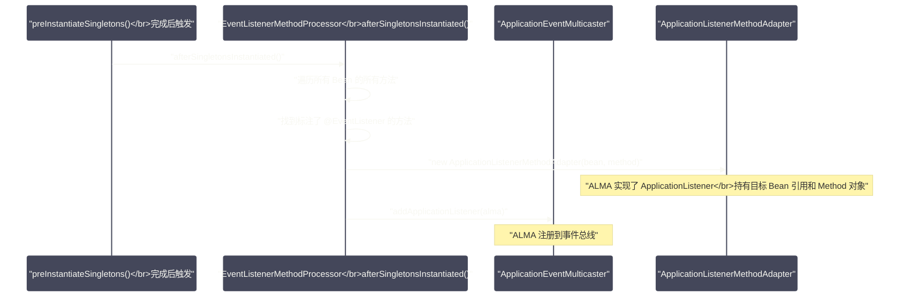

# Spring事件机制与观察者模式

## 摘要

Spring 的事件机制是观察者模式（Observer Pattern）在企业级框架中的精良实现。它解决了一个极其常见的工程问题：当一个操作完成后，需要触发若干下游动作，但这些动作与核心业务逻辑应当解耦——比如用户注册后发送欢迎邮件、记录审计日志、初始化用户偏好。本文深入剖析 `ApplicationEvent`/`ApplicationListener`/`ApplicationEventPublisher` 三角关系，追踪 `SimpleApplicationEventMulticaster` 的事件分发机制，重点分析同步事件与异步事件的适用场景，以及 Spring 4.2 引入的 `@EventListener` 注解如何通过 `EventListenerMethodProcessor` 在幕后完成监听器注册。最后讨论事件机制的边界：它不是万能药，在什么场景下应该用，什么场景下不该用。

---

## 第 1 章 观察者模式与 Spring 事件的设计动机

### 1.1 没有事件机制时的代码耦合

考虑一个常见的业务场景：用户注册成功后，系统需要：
1. 发送欢迎邮件；
2. 记录审计日志；
3. 初始化用户积分账户；
4. 向 CRM 系统同步用户数据。

最直接的实现方式：

```java
@Service
public class UserService {
    
    @Autowired private EmailService emailService;
    @Autowired private AuditLogService auditLogService;
    @Autowired private PointsService pointsService;
    @Autowired private CrmSyncService crmSyncService;
    
    @Transactional
    public void register(User user) {
        userRepository.save(user);
        
        // 这四行与核心业务逻辑无关，却紧紧耦合在 UserService 中
        emailService.sendWelcomeEmail(user);
        auditLogService.log("USER_REGISTER", user.getId());
        pointsService.initializeAccount(user.getId());
        crmSyncService.sync(user);
    }
}
```

这种实现的问题：

1. **职责膨胀**：`UserService` 不仅负责用户注册，还直接编排了邮件发送、日志记录、积分初始化、CRM 同步，承担了过多职责；
2. **双向耦合**：`UserService` 知道所有下游系统的存在，一旦需要添加或删除某个下游动作（比如新增"初始化消息未读数"），就必须修改 `UserService`；
3. **测试困难**：单元测试 `UserService.register()` 时，需要 Mock 四个下游服务；
4. **启动顺序依赖**：如果 `CrmSyncService` 需要较重的初始化资源，`UserService` 的创建也被间接拖慢。

### 1.2 观察者模式的解法

观察者模式将这种"一对多通知"的关系倒转：不是"发布者主动调用所有订阅者"，而是"发布者只发布事件，订阅者各自订阅感兴趣的事件"。

发布者（`UserService`）只知道一件事：我完成了用户注册，我发布一个 `UserRegisteredEvent`。至于谁订阅了这个事件、有多少订阅者、订阅者做什么——发布者完全不感知，也不需要感知。

```java
// 重构后：UserService 只关注核心业务
@Service
public class UserService {
    
    @Autowired private ApplicationEventPublisher eventPublisher;
    
    @Transactional
    public void register(User user) {
        userRepository.save(user);
        // 只发布事件，无需知道谁在监听
        eventPublisher.publishEvent(new UserRegisteredEvent(this, user));
    }
}

// 各个下游系统独立订阅，互不干扰
@Component
public class WelcomeEmailListener implements ApplicationListener<UserRegisteredEvent> {
    @Override
    public void onApplicationEvent(UserRegisteredEvent event) {
        emailService.sendWelcomeEmail(event.getUser());
    }
}
```

增加新的下游动作时，只需新增一个 `ApplicationListener` 的实现类，不需要触碰 `UserService` 的代码——这是开闭原则（对扩展开放，对修改关闭）在 Spring 中的经典体现。

---

## 第 2 章 Spring 事件机制的核心组件

### 2.1 ApplicationEvent：事件的载体

`ApplicationEvent` 是所有 Spring 事件的基类：

```java
public abstract class ApplicationEvent extends EventObject {
    
    // 事件发生的时间戳
    private final long timestamp;
    
    // source 参数：事件的发布者（通常是发布事件的 Bean 实例）
    // EventObject（java.util 标准类）的构造器要求必须提供 source
    public ApplicationEvent(Object source) {
        super(source);
        this.timestamp = System.currentTimeMillis();
    }
    
    public long getTimestamp() {
        return this.timestamp;
    }
}
```

自定义事件类非常简单——继承 `ApplicationEvent`，添加你需要传递的业务数据：

```java
// 用户注册事件：携带注册成功的用户对象
public class UserRegisteredEvent extends ApplicationEvent {
    
    private final User user;
    
    public UserRegisteredEvent(Object source, User user) {
        super(source);
        this.user = user;
    }
    
    public User getUser() {
        return user;
    }
}
```

从 Spring 4.2 开始，事件对象不再强制要求继承 `ApplicationEvent`——任意 POJO 都可以作为事件发布：

```java
// Spring 4.2+：POJO 事件，无需继承 ApplicationEvent
public class OrderCreatedEvent {
    private final Long orderId;
    private final String userId;
    // getter, constructor...
}

// 发布 POJO 事件
eventPublisher.publishEvent(new OrderCreatedEvent(orderId, userId));
```

Spring 会将 POJO 事件自动包装成 `PayloadApplicationEvent<T>`，对监听器透明。

> [!info] 为什么 ApplicationEvent 要继承 java.util.EventObject？
> 这是 Java 事件模型的规范——`EventObject` 要求每个事件有一个 `source` 引用，指向"产生事件的对象"。这个设计来自 Java AWT/Swing 事件模型（1990年代末），Spring 沿用了这个设计，保持与 Java 标准事件规范的兼容性。但从工程角度看，POJO 事件（Spring 4.2+）更简洁，新项目推荐使用 POJO 事件。

### 2.2 ApplicationListener：事件的消费者

`ApplicationListener<E extends ApplicationEvent>` 是监听器接口：

```java
@FunctionalInterface
public interface ApplicationListener<E extends ApplicationEvent> extends EventListener {
    
    // 当监听的事件类型发布时，Spring 自动调用此方法
    void onApplicationEvent(E event);
    
    // Spring 5.3.5+ 新增：是否支持子类事件
    // 默认 true（监听 UserRegisteredEvent 时，也会接收 UserRegisteredEvent 的子类事件）
    default boolean supportsAsyncExecution() {
        return true;
    }
}
```

监听器的注册方式有两种：

**方式一：实现接口，Spring 自动注册**

任何实现了 `ApplicationListener` 的 Spring Bean，在容器刷新（`refresh()`）的步骤 10（`registerListeners()`）中，会被自动注册到 `ApplicationEventMulticaster`。

**方式二：编程式注册（在 `refresh()` 之前）**

```java
ConfigurableApplicationContext ctx = new AnnotationConfigApplicationContext();
// 在 refresh() 之前注册的监听器，能接收到容器刷新过程中的早期事件
ctx.addApplicationListener(new WelcomeEmailListener());
ctx.register(AppConfig.class);
ctx.refresh();
```

### 2.3 ApplicationEventPublisher：事件的发布接口

`ApplicationEventPublisher` 是事件发布的顶层接口，`ApplicationContext` 实现了它：

```java
@FunctionalInterface
public interface ApplicationEventPublisher {
    
    // 发布任意对象作为事件（Spring 4.2+，支持 POJO 事件）
    default void publishEvent(Object event) {
        publishEvent(event instanceof ApplicationEvent ae ? ae : new PayloadApplicationEvent<>(this, event));
    }
    
    // 发布 ApplicationEvent 子类事件
    void publishEvent(ApplicationEvent event);
}
```

在 Bean 中获取 `ApplicationEventPublisher` 有三种方式：

```java
// 方式 1：直接注入 ApplicationEventPublisher（推荐，最轻量）
@Autowired
private ApplicationEventPublisher eventPublisher;

// 方式 2：注入完整的 ApplicationContext（功能最全，但耦合更重）
@Autowired
private ApplicationContext applicationContext;

// 方式 3：实现 ApplicationEventPublisherAware 接口（无需 @Autowired）
@Component
public class MyBean implements ApplicationEventPublisherAware {
    private ApplicationEventPublisher eventPublisher;
    
    @Override
    public void setApplicationEventPublisher(ApplicationEventPublisher eventPublisher) {
        this.eventPublisher = eventPublisher;
    }
}
```

---

## 第 3 章 ApplicationEventMulticaster：事件分发的核心

### 3.1 什么是 EventMulticaster

`ApplicationEventMulticaster` 是 Spring 事件总线的核心——它负责维护监听器注册表，并在事件发布时将事件分发给所有匹配的监听器：

```java
public interface ApplicationEventMulticaster {
    
    // 监听器注册管理
    void addApplicationListener(ApplicationListener<?> listener);
    void addApplicationListenerBean(String listenerBeanName);
    void removeApplicationListener(ApplicationListener<?> listener);
    void removeAllListeners();
    
    // 事件分发（核心方法）
    void multicastEvent(ApplicationEvent event);
    void multicastEvent(ApplicationEvent event, @Nullable ResolvableType eventType);
}
```

Spring 内置的唯一实现类是 `SimpleApplicationEventMulticaster`，在 `refresh()` 的步骤 8（`initApplicationEventMulticaster()`）中被初始化：

```java
protected void initApplicationEventMulticaster() {
    ConfigurableListableBeanFactory beanFactory = getBeanFactory();
    if (beanFactory.containsLocalBean(APPLICATION_EVENT_MULTICASTER_BEAN_NAME)) {
        // 如果用户自定义了一个名为 "applicationEventMulticaster" 的 Bean，使用它
        this.applicationEventMulticaster = beanFactory.getBean(
            APPLICATION_EVENT_MULTICASTER_BEAN_NAME, ApplicationEventMulticaster.class);
    } else {
        // 否则使用默认实现 SimpleApplicationEventMulticaster
        this.applicationEventMulticaster = new SimpleApplicationEventMulticaster(beanFactory);
        beanFactory.registerSingleton(APPLICATION_EVENT_MULTICASTER_BEAN_NAME, 
            this.applicationEventMulticaster);
    }
}
```

### 3.2 SimpleApplicationEventMulticaster 的分发逻辑

```java
// SimpleApplicationEventMulticaster#multicastEvent()（简化）
@Override
public void multicastEvent(ApplicationEvent event, @Nullable ResolvableType eventType) {
    ResolvableType type = (eventType != null ? eventType : resolveDefaultEventType(event));
    Executor executor = getTaskExecutor();
    
    // 获取所有匹配当前事件类型的监听器
    for (ApplicationListener<?> listener : getApplicationListeners(event, type)) {
        if (executor != null && listener.supportsAsyncExecution()) {
            // 如果配置了 Executor（线程池），异步分发
            executor.execute(() -> invokeListener(listener, event));
        } else {
            // 默认：同步分发（在发布者线程中直接调用）
            invokeListener(listener, event);
        }
    }
}
```

**关键细节：默认是同步的**。`SimpleApplicationEventMulticaster` 默认没有配置 `Executor`，所有事件分发都在发布者线程中同步执行。这意味着：

1. `eventPublisher.publishEvent(event)` 调用返回后，所有同步监听器都已执行完毕；
2. 如果某个监听器抛出异常，异常会传播到发布者，可能中断后续监听器的执行；
3. 监听器的执行时间直接影响发布者线程的响应时间——如果监听器有耗时操作，发布者会被阻塞。

### 3.3 监听器的匹配机制

`getApplicationListeners(event, type)` 是事件匹配的核心，它支持**泛型类型匹配**：

```java
// ApplicationListener<UserRegisteredEvent> 只匹配 UserRegisteredEvent 及其子类
ApplicationListener<UserRegisteredEvent> specificListener = event -> { ... };

// ApplicationListener<ApplicationEvent> 匹配所有事件
ApplicationListener<ApplicationEvent> globalListener = event -> { ... };
```

匹配逻辑基于 `ResolvableType`（Spring 的泛型类型解析工具），它能正确处理：
- 直接类型匹配（`UserRegisteredEvent`）；
- 子类型匹配（`AdminRegisteredEvent extends UserRegisteredEvent`）；
- 泛型类型匹配（`PayloadApplicationEvent<OrderCreatedEvent>` 能被 `ApplicationListener<OrderCreatedEvent>` 接收到）。

匹配结果会被缓存到 `retrieverCache`（一个 `ConcurrentHashMap`），避免每次事件发布都进行昂贵的类型解析。

---

## 第 4 章 @EventListener：注解驱动的监听器

### 4.1 为什么引入 @EventListener

在 Spring 4.2 之前，每个事件监听器都需要实现 `ApplicationListener` 接口，这意味着：
- 一个类只能监听一种事件类型（除非写多个 `if-else` 分支判断）；
- 监听器方法名被固定为 `onApplicationEvent`，不能自定义；
- 要监听多种事件，需要创建多个实现类，代码分散。

Spring 4.2 引入 `@EventListener` 注解，允许将普通方法声明为事件监听器：

```java
@Component
public class UserEventHandlers {
    
    // 只需标注 @EventListener，方法名自由定义
    @EventListener
    public void onUserRegistered(UserRegisteredEvent event) {
        emailService.sendWelcomeEmail(event.getUser());
    }
    
    // 同一个类中可以有多个 @EventListener 方法，监听不同事件
    @EventListener
    public void onUserDeleted(UserDeletedEvent event) {
        auditLogService.log("USER_DELETED", event.getUserId());
    }
    
    // 支持 SpEL 条件过滤：只处理满足条件的事件
    @EventListener(condition = "#event.user.role == 'VIP'")
    public void onVipUserRegistered(UserRegisteredEvent event) {
        vipService.initializeVipBenefits(event.getUser());
    }
}
```

### 4.2 EventListenerMethodProcessor 的幕后工作

`@EventListener` 注解的处理机制并非简单的 AOP——它是通过一个 `SmartInitializingSingleton`（`EventListenerMethodProcessor`）在所有 Bean 初始化完成后，为每个 `@EventListener` 方法动态创建一个 `ApplicationListenerMethodAdapter`（`ApplicationListener` 的适配器），然后注册到 `ApplicationEventMulticaster`。



这个处理时机（`afterSingletonsInstantiated()`）非常关键：它发生在**所有单例 Bean 都初始化完成之后**。这保证了当 `@EventListener` 方法被注册时，它依赖的所有 Bean（如 `emailService`）都已经初始化完毕，不会出现"监听器注册了但依赖还未就绪"的问题。

### 4.3 @EventListener 的条件过滤（SpEL 表达式）

`@EventListener` 的 `condition` 属性支持 SpEL 表达式，实现细粒度的事件过滤：

```java
@EventListener(condition = "#event.user.vip && #event.user.age >= 18")
public void handleAdultVipRegistration(UserRegisteredEvent event) {
    // 只处理成年 VIP 用户的注册事件
}
```

SpEL 表达式的上下文：
- `#event`：事件对象本身（或 `#root.event`）；
- `#root.args[0]`：第一个参数（等同于 `#event`）；
- `#root.targetClass`：监听器方法所在的类；
- `@beanName`：通过 `@` 前缀引用容器中的 Bean（如 `@featureToggleService.isEnabled('VIP_EMAIL')`）。

条件求值发生在**每次事件到达监听器之前**，若条件为 `false`，该监听器被跳过，事件继续分发给其他匹配的监听器。

---

## 第 5 章 同步事件与异步事件

### 5.1 默认同步执行的局限

前面提到，Spring 事件默认是同步的。这在以下场景中会造成问题：

```java
@Service
public class OrderService {
    
    @Transactional
    public void createOrder(Order order) {
        orderRepository.save(order);
        // 发布事件：发送确认邮件（可能耗时几百毫秒）
        eventPublisher.publishEvent(new OrderCreatedEvent(this, order));
        // ↑ 在默认同步模式下，这行代码在邮件发送完成后才返回！
        // 用户需要等待邮件发送完毕才能收到"下单成功"的响应
    }
}
```

此外，在 `@Transactional` 方法内发布事件时，如果监听器也操作数据库，它会加入当前事务（因为在同一线程，`TransactionSynchronizationManager` 检测到有活跃事务）。这可能是期望的行为（监听器的操作需要与主业务原子性），也可能是意外的行为（监听器本意是在业务成功后执行，但实际上在事务提交之前执行，若主业务后续失败，监听器的修改也会被一起回滚）。

### 5.2 异步事件：@Async + @EventListener

将监听器方法标注为 `@Async`，可以使事件处理在独立线程中异步执行：

```java
@Component
public class OrderEventHandler {
    
    @Async  // 异步执行，不阻塞发布者线程
    @EventListener
    public void onOrderCreated(OrderCreatedEvent event) {
        // 在独立线程中执行，不阻塞主业务流程
        emailService.sendOrderConfirmation(event.getOrder());
    }
}
```

`@Async` 需要在 `@Configuration` 类上添加 `@EnableAsync` 注解来激活：

```java
@SpringBootApplication
@EnableAsync
public class App { ... }
```

**`@Async` 的底层**：Spring 为标注了 `@Async` 的方法创建 AOP 代理，代理在方法被调用时，将实际执行提交给配置的线程池（`TaskExecutor`），立即返回，不等待实际方法执行完毕。

> [!warning] @Async 的线程池配置
> `@Async` 默认使用 `SimpleAsyncTaskExecutor`——这是一个**每次调用都创建新线程**的执行器，完全没有线程复用，在高并发场景下会造成严重的线程爆炸问题。生产环境必须自定义一个有界线程池：
>
> ```java
> @Configuration
> @EnableAsync
> public class AsyncConfig implements AsyncConfigurer {
>     
>     @Override
>     public Executor getAsyncExecutor() {
>         ThreadPoolTaskExecutor executor = new ThreadPoolTaskExecutor();
>         executor.setCorePoolSize(4);
>         executor.setMaxPoolSize(16);
>         executor.setQueueCapacity(100);
>         executor.setThreadNamePrefix("event-async-");
>         executor.setRejectedExecutionHandler(new ThreadPoolExecutor.CallerRunsPolicy());
>         executor.initialize();
>         return executor;
>     }
> }
> ```

### 5.3 全局异步：配置 SimpleApplicationEventMulticaster 的 Executor

另一种方式是为 `SimpleApplicationEventMulticaster` 配置全局线程池，所有事件都异步分发：

```java
@Configuration
public class EventConfig {
    
    @Bean(name = "applicationEventMulticaster")
    public ApplicationEventMulticaster applicationEventMulticaster(
            @Qualifier("eventExecutor") Executor eventExecutor) {
        SimpleApplicationEventMulticaster multicaster = new SimpleApplicationEventMulticaster();
        multicaster.setTaskExecutor(eventExecutor);
        // 配置错误处理器：防止某个监听器异常影响其他监听器
        multicaster.setErrorHandler(t -> log.error("Event handling error", t));
        return multicaster;
    }
    
    @Bean("eventExecutor")
    public Executor eventExecutor() {
        return new ThreadPoolTaskExecutor(); // 配置线程池参数...
    }
}
```

**全局异步 vs 单个方法 `@Async` 的选择**：

| 维度 | 全局异步（Multicaster Executor） | 单方法 @Async |
| --- | --- | --- |
| **粒度** | 所有监听器都异步 | 精确控制哪些监听器异步 |
| **事务感知** | 失去事务上下文（新线程无事务） | 同样失去事务上下文 |
| **错误处理** | 通过 `ErrorHandler` 统一处理 | 需要在每个方法中处理 |
| **适用场景** | 事件系统全面异步化 | 混合同步+异步场景 |

### 5.4 @TransactionalEventListener 再探：异步的最佳实践

在第 07 篇（Spring 事务）中已提到 `@TransactionalEventListener`，这里补充其与异步事件结合的最佳实践：

```java
@Component
public class OrderEventHandler {
    
    // 最佳实践：事务提交后异步执行监听逻辑
    @Async
    @TransactionalEventListener(phase = TransactionPhase.AFTER_COMMIT)
    public void onOrderCreated(OrderCreatedEvent event) {
        // 1. 在事务提交后触发（避免在事务未提交时读到脏数据）
        // 2. 在独立线程中异步执行（不阻塞事务线程）
        kafkaTemplate.send("order-created", event);
    }
}
```

这个组合解决了两个常见问题：
1. "**先提交，后发消息**"：`AFTER_COMMIT` 保证只有事务提交后才发消息，消息消费者能读到已提交的订单数据；
2. "**不阻塞主线程**"：`@Async` 保证 Kafka 发送不会延迟事务的提交和 HTTP 响应。

---

## 第 6 章 Spring 内置事件：容器生命周期的观察窗口

### 6.1 容器级别的内置事件

Spring 框架在容器生命周期的关键节点会发布内置事件，提供一个观察容器状态的窗口：

| 事件类型 | 发布时机 | 典型用途 |
| --- | --- | --- |
| `ContextRefreshedEvent` | `refresh()` 完成（所有单例 Bean 就绪后） | 应用启动完成的信号，执行启动初始化逻辑 |
| `ContextStartedEvent` | `ApplicationContext.start()` 调用后 | 触发 `Lifecycle.start()` 回调 |
| `ContextStoppedEvent` | `ApplicationContext.stop()` 调用后 | 触发 `Lifecycle.stop()` 回调 |
| `ContextClosedEvent` | `ApplicationContext.close()` 或关闭钩子触发 | 应用关闭前的最后清理机会 |
| `ApplicationStartedEvent` | Spring Boot 应用启动完毕（比 `ContextRefreshedEvent` 晚） | Spring Boot 特有，`CommandLineRunner` 执行之前 |
| `ApplicationReadyEvent` | `CommandLineRunner`/`ApplicationRunner` 都执行完成 | 应用完全就绪，可以接收流量的信号 |
| `ApplicationFailedEvent` | 应用启动失败 | 启动失败报警 |

```java
@Component
public class AppLifecycleListener {
    
    // 监听容器刷新完成事件，执行启动后初始化
    @EventListener
    public void onContextRefreshed(ContextRefreshedEvent event) {
        // 注意：ContextRefreshedEvent 在父子容器场景中可能发布多次
        // 需要判断来源是否是根容器
        if (event.getApplicationContext().getParent() == null) {
            log.info("Root ApplicationContext refreshed, starting background jobs...");
            backgroundJobScheduler.start();
        }
    }
    
    // Spring Boot 特有：应用完全就绪后，注册到服务发现
    @EventListener
    public void onApplicationReady(ApplicationReadyEvent event) {
        serviceDiscovery.register(serviceInfo);
        log.info("Service registered to discovery center");
    }
    
    // 应用关闭前，从服务发现注销
    @EventListener
    public void onContextClosed(ContextClosedEvent event) {
        serviceDiscovery.deregister(serviceInfo);
        log.info("Service deregistered from discovery center");
    }
}
```

> [!warning] ContextRefreshedEvent 重复发布
> 在有父子容器的场景（如传统 Spring MVC），`ContextRefreshedEvent` 会发布两次——父容器刷新时一次，子容器刷新时一次。如果你的监听逻辑只应执行一次，需要在监听器中检查 `event.getApplicationContext() == myExpectedContext` 或通过 `event.getApplicationContext().getParent() == null` 判断是否为根容器。Spring Boot 单容器场景不存在这个问题。

### 6.2 Web 请求相关的内置事件

Spring Web 在 HTTP 请求处理阶段也会发布事件（`AbstractApplicationContext` 的 Web 子类支持）：

- `ServletRequestHandledEvent`（Spring MVC）：每次 HTTP 请求处理完成后发布，包含请求 URL、处理时间、是否发生异常等信息，是一个轻量级的请求日志来源。

---

## 第 7 章 事件机制的边界与反模式

### 7.1 事件机制不是万能的

事件机制极大地提升了代码解耦程度，但它不是所有场景的最佳解法。以下情况应该**谨慎使用**或**不使用**事件：

**场景 1：发布者需要监听器的返回值**

事件机制本质上是单向的——发布者发出事件，不接收返回值。如果业务逻辑需要根据监听器的处理结果做不同分支，事件机制就不适合：

```java
// ❌ 反模式：通过事件实现"请求-响应"
@EventListener
public void validateOrder(OrderValidationRequestEvent event) {
    boolean valid = validate(event.getOrder());
    event.setValid(valid); // 通过修改事件对象传递结果（侵入性强，线程安全问题）
}

// ✅ 更好的方式：直接调用服务
boolean valid = orderValidator.validate(order);
```

**场景 2：监听器执行有严格顺序依赖**

如果监听器 A 必须在监听器 B 之后执行（因为 A 依赖 B 的处理结果），这种强顺序依赖意味着 A 和 B 之间有逻辑耦合，应该合并为一个监听器或通过直接调用来表达这种顺序。

事件机制支持 `@Order` 注解控制监听器顺序，但过度依赖顺序是一个设计坏味道——如果监听器的执行顺序至关重要，说明它们之间有隐式依赖，应该显式化这种依赖。

**场景 3：高频事件的性能影响**

每次 `publishEvent()` 都需要遍历所有注册的监听器，用 `ResolvableType` 做类型匹配，虽然有缓存，但仍有一定开销。如果一个事件每秒发布数万次（如每个数据库行变更都发布事件），这个开销会累积。高频事件场景可以考虑批处理（积攒一批事件后一次性发布）或消息队列（Kafka/RabbitMQ）。

### 7.2 @Order 控制监听器执行顺序

当同一事件有多个监听器时，可以通过 `@Order` 控制执行顺序（数值越小越先执行）：

```java
@Component
public class OrderEventHandlers {
    
    @EventListener
    @Order(1) // 最先执行：验证
    public void validateFirst(OrderCreatedEvent event) {
        validator.validate(event.getOrder());
    }
    
    @EventListener
    @Order(2) // 其次：保存
    public void saveThenNotify(OrderCreatedEvent event) {
        orderRepository.save(event.getOrder());
    }
    
    @EventListener
    @Order(3) // 最后：通知
    public void notifyLast(OrderCreatedEvent event) {
        notificationService.notify(event.getOrder().getUserId());
    }
}
```

> [!note] 同步 vs 异步的顺序差异
> `@Order` 只在**同步**事件分发中有效——监听器按顺序在同一线程中执行。如果配置了全局异步 Executor，监听器在不同线程中并发执行，`@Order` 不再保证顺序。

### 7.3 事件链：监听器再发布事件

监听器在处理事件时，可以发布新的事件，形成事件链：

```java
@Component
public class UserRegistrationListener {
    
    @Autowired
    private ApplicationEventPublisher eventPublisher;
    
    @EventListener
    public void onUserRegistered(UserRegisteredEvent event) {
        // 处理用户注册...
        pointsService.createAccount(event.getUser().getId());
        
        // 发布新事件：积分账户创建成功
        eventPublisher.publishEvent(new PointsAccountCreatedEvent(this, event.getUser()));
    }
}

@Component
public class PointsAccountListener {
    
    @EventListener
    public void onPointsAccountCreated(PointsAccountCreatedEvent event) {
        // 给新账户赠送注册积分
        pointsService.grantWelcomePoints(event.getUser().getId(), 100);
    }
}
```

> [!warning] 事件链的循环风险
> 事件链如果不谨慎设计，可能形成死循环：EventA 发布 EventB，EventB 的监听器发布 EventA，无限循环。Spring 默认**不检测**事件链的循环，会导致 StackOverflowError。设计事件链时需要人工确保无循环依赖。

---

## 第 8 章 与消息队列的对比

### 8.1 Spring 事件 vs Kafka/RabbitMQ

Spring 事件机制经常与消息队列做对比，它们都实现了发布-订阅模式，但应用场景有明显区分：

| 维度 | Spring 事件 | 消息队列（Kafka/RabbitMQ） |
| --- | --- | --- |
| **跨进程** | ❌ 仅限同一 JVM 进程 | ✅ 跨进程、跨服务 |
| **持久化** | ❌ 内存中，应用重启丢失 | ✅ 持久化到磁盘 |
| **消费保证** | 没有 at-least-once 保证 | 支持 at-least-once/exactly-once |
| **延迟** | 极低（微秒级，同进程调用） | 低-中（毫秒级，网络开销） |
| **回放** | ❌ 不支持 | ✅ 支持（Kafka 支持 offset 回放） |
| **监控** | 依赖日志 | 有完善的监控 Dashboard |
| **适用场景** | 同一服务内的模块解耦 | 跨服务异步通信、可靠消息传递 |

**经验法则**：
- 同一微服务内部的业务流程解耦，用 Spring 事件；
- 跨微服务的通知或数据同步，用消息队列；
- 需要可靠消息保证（不丢失、不重复）的场景，用消息队列 + 幂等消费者。

---

## 总结

本文全面剖析了 Spring 事件机制的设计思想与实现细节：

- **设计动机**：观察者模式将"发布者主动调用订阅者"变为"发布者发布事件，订阅者自主监听"，实现了发布者与订阅者的双向解耦；
- **核心组件**：`ApplicationEvent`（事件载体，Spring 4.2+ 支持 POJO 事件）、`ApplicationListener`（监听器接口）、`ApplicationEventPublisher`（发布接口，`ApplicationContext` 实现它）、`SimpleApplicationEventMulticaster`（事件总线，默认同步分发）；
- **@EventListener**：Spring 4.2+ 的注解驱动监听器，由 `EventListenerMethodProcessor` 在所有单例 Bean 初始化完成后自动将标注方法包装成 `ApplicationListenerMethodAdapter` 注册到事件总线；
- **同步 vs 异步**：默认同步执行；`@Async` + `@EventListener` 实现单个监听器异步；配置 `Multicaster` 的 `Executor` 实现全局异步；`@TransactionalEventListener` 在事务提交后触发是避免"消息比事务先到"的最佳实践；
- **Spring 内置事件**：`ContextRefreshedEvent`（容器就绪）、`ApplicationReadyEvent`（Spring Boot 就绪）等是观察容器生命周期的标准方式；
- **使用边界**：事件机制适合同进程内的模块解耦，跨进程、需要可靠性保证的场景应使用消息队列。

下一篇，我们将探讨 SpEL 表达式——Spring 框架中唯一的动态语言引擎，它是 `@Value`、`@Cacheable`、`@EventListener(condition)` 等注解的底层求值引擎：[[09 SpEL表达式与属性解析]]。

---

> [!note] 参考资料
> - `org.springframework.context.event.SimpleApplicationEventMulticaster` 源码
> - `org.springframework.context.event.EventListenerMethodProcessor` 源码
> - `org.springframework.context.event.ApplicationListenerMethodAdapter` 源码
> - [Spring Framework 官方文档 - Application Events and Listeners](https://docs.spring.io/spring-framework/reference/core/beans/context-introduction.html#context-functionality-events)

---

> [!note] 思考题
> 1. SpEL 支持在运行时求值（如 `@Value("#{T(java.lang.Math).random()}")`）。与简单的 `${}` 属性占位符不同，SpEL 可以调用方法、访问属性、进行算术运算。但 SpEL 的动态求值能力也带来了安全风险——如果用户输入被直接用作 SpEL 表达式（如 `@Value("#{userInput}")`），可能导致什么安全漏洞？SpEL 注入攻击在实际中发生过吗？
> 2. SpEL 在 Spring Security 中广泛使用——`@PreAuthorize("hasRole('ADMIN') and #user.id == authentication.principal.id")` 可以实现方法级别的细粒度权限控制。SpEL 表达式在每次方法调用时求值——在高频调用路径上，SpEL 的求值性能是否会成为瓶颈？Spring 是否缓存了 SpEL 的解析结果？
> 3. SpEL 的 `#root` 和 `#this` 在集合选择（Selection）和投影（Projection）中有特殊含义。`names.?[#this.length() > 5]` 选择长度大于 5 的字符串。在 `@Cacheable(key = "#root.method.name + #args[0]")` 中，`#root` 指向什么对象？SpEL 在缓存注解中的典型用法有哪些？
