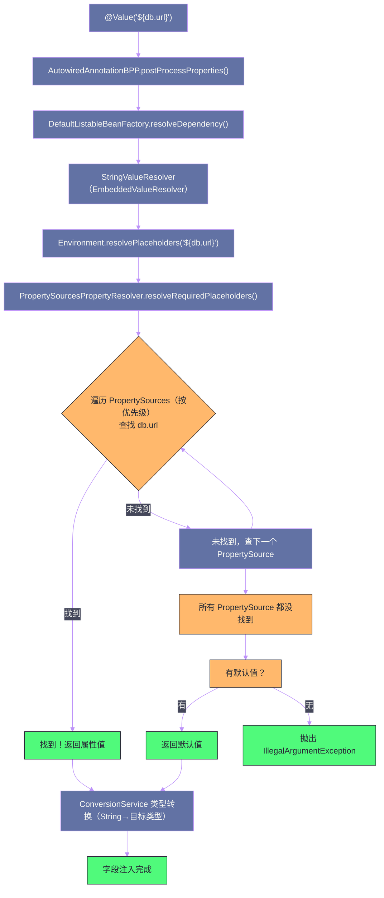

# SpEL表达式与属性解析

## 摘要

Spring Expression Language（SpEL）是 Spring 框架内置的动态表达式语言，也是整个 Spring 生态中唯一的表达式引擎。从 `@Value("#{systemProperties['user.home']}")` 的属性访问，到 `@Cacheable(key = "#userId + '_' + #type")` 的缓存键生成，再到 `@PreAuthorize("hasRole('ADMIN')")` 的权限校验，SpEL 渗透在 Spring 的方方面面，却常常被当成"黑盒"使用。本文深入剖析 SpEL 的三阶段求值模型（解析→编译→执行），完整梳理表达式语法体系，重点分析 SpEL 与占位符（`${...}`）两种语法的本质区别，以及 `Environment`/`PropertySource` 属性解析链路的完整工作机制。

---

## 第 1 章 为什么 Spring 需要一个表达式语言

### 1.1 静态配置的局限

在 Spring 的声明式编程模型中，很多行为需要通过注解参数来配置。最简单的情形，`@Value("${db.url}")` 直接注入一个配置值——这是纯静态的，配置文件里写什么就注入什么。

但实际工程中，很多场景需要**基于运行时状态的动态配置**：

- **缓存键**：`@Cacheable` 的键不应该是固定字符串，而应该根据方法参数动态生成。`@Cacheable(key = "'" + METHOD + "_" + PARAM + "'")` 这种Java 字符串拼接无法在注解中使用；
- **权限条件**：`@PreAuthorize` 需要检查当前用户是否有特定权限，且这个检查可能依赖方法参数（如"只有资源的创建者才能修改"）；
- **事件过滤**：`@EventListener(condition = "#event.priority > 3")` 需要根据事件属性决定是否处理；
- **@ConditionalOnExpression**：Spring Boot 的条件注解，根据复杂条件决定是否注册 Bean。

这些场景的共同特点是：**注解参数需要是一个表达式，在运行时求值**，而不是编译期确定的字符串字面量。

### 1.2 SpEL 的定位

SpEL 是一个**解释执行的表达式语言**（类似 JavaScript 中的 `eval`），它将一段字符串表达式解析为语法树，然后在指定的上下文中求值。设计目标：

1. **轻量**：不引入完整脚本语言（Groovy、Lua）的重量级依赖，Spring 框架自带；
2. **深度集成**：与 Spring 的 Bean 模型、类型转换、资源加载无缝集成；
3. **可扩展**：允许自定义函数、变量、类型解析器；
4. **可编译**：Spring 4.1 引入 SpEL 编译器，将常用表达式编译为 JVM 字节码，接近原生性能。

---

## 第 2 章 SpEL 的三阶段执行模型

### 2.1 第一阶段：解析（Parse）

`ExpressionParser` 将字符串表达式解析为 `Expression` 对象（抽象语法树 AST）：

```java
ExpressionParser parser = new SpelExpressionParser();

// 解析：将字符串转化为 AST（Expression 对象）
Expression expr = parser.parseExpression("user.name.toUpperCase()");
// 此时 expr 内部已经是结构化的 AST，但尚未执行
```

解析是**一次性成本**——如果同一个表达式需要反复求值（如 `@Cacheable` 的 key 表达式每次方法调用都求值），应该缓存 `Expression` 对象，避免重复解析。Spring 框架内部正是这样做的：`CacheAspectSupport`、`ExpressionEvaluator` 等类都维护了 `Expression` 对象的缓存（通常以方法签名为键）。

### 2.2 第二阶段：编译（可选）

Spring 4.1 引入了 SpEL 编译器（`SpelCompiler`），它使用 ASM 字节码框架将 `Expression` 的 AST 直接编译为 JVM 字节码，存储在动态生成的类中。编译后的表达式执行速度接近原生 Java 代码，比解释执行快 2-10 倍。

编译有三种模式（通过 `SpelParserConfiguration` 配置）：

```java
SpelParserConfiguration config = new SpelParserConfiguration(
    SpelCompilerMode.IMMEDIATE, // 编译模式
    getClass().getClassLoader()
);
ExpressionParser parser = new SpelExpressionParser(config);
```

| 编译模式 | 行为 |
| --- | --- |
| `OFF`（默认） | 不编译，始终解释执行 |
| `IMMEDIATE` | 第一次执行后立即编译 |
| `MIXED` | 先解释执行，收集类型信息后再编译（更智能，处理类型不确定的情况） |

**编译的适用场景与限制**：
- 适合：高频调用的固定结构表达式（如 `@Cacheable` 的键）；
- 不适合：表达式依赖多态（同一表达式在不同调用中目标类型不同），编译模式假设类型固定，多态场景下会退回解释执行；
- 限制：含有 Lambda、Stream API 的复杂表达式目前不支持编译。

### 2.3 第三阶段：求值（Evaluate）

求值需要提供一个 `EvaluationContext`（求值上下文），它定义了：
- **根对象（Root Object）**：表达式的默认操作目标（如 `user.name` 中的 `user` 如果没有显式指定，就是根对象）；
- **变量（Variables）**：通过 `#variableName` 访问的命名变量；
- **函数（Functions）**：通过 `#functionName(args)` 调用的自定义函数；
- **Bean 解析器（BeanResolver）**：通过 `@beanName` 访问 Spring 容器中的 Bean；
- **类型转换器（TypeConverter）**：自动将表达式结果转换为目标类型；
- **属性访问器（PropertyAccessors）**：定义如何访问对象的属性（默认通过反射）。

```java
// 标准求值上下文
StandardEvaluationContext context = new StandardEvaluationContext();

// 设置根对象
User user = new User("张三", 28, "ADMIN");
context.setRootObject(user);

// 注册变量
context.setVariable("threshold", 25);

// 注册自定义函数（静态方法）
context.registerFunction("formatName", 
    StringUtils.class.getDeclaredMethod("capitalize", String.class));

// 注册 Bean 解析器（访问 Spring 容器中的 Bean）
context.setBeanResolver(new BeanFactoryResolver(applicationContext));

ExpressionParser parser = new SpelExpressionParser();

// 求值示例
System.out.println(parser.parseExpression("name").getValue(context)); // 张三
System.out.println(parser.parseExpression("age > #threshold").getValue(context, Boolean.class)); // true
System.out.println(parser.parseExpression("@userService.findByName(name)").getValue(context)); // 调用 Bean 方法
```

> [!warning] StandardEvaluationContext 的安全风险
> `StandardEvaluationContext` 拥有完整的反射能力，包括访问任意 Java 类（通过 `T(java.lang.Runtime).getRuntime().exec('...')`）。如果你在 Web 应用中允许用户输入 SpEL 表达式，必须使用 `SimpleEvaluationContext`（限制了可访问的类型和操作）而非 `StandardEvaluationContext`，否则面临严重的 RCE（远程代码执行）风险。这是 Spring 安全通告中出现过的真实漏洞类型（CVE-2022-22963 等）。

---

## 第 3 章 SpEL 语法完全手册

### 3.1 基础字面量

```java
// 字符串字面量（单引号）
parser.parseExpression("'Hello World'").getValue(String.class); // "Hello World"

// 整数、浮点数、布尔
parser.parseExpression("42").getValue(Integer.class);         // 42
parser.parseExpression("3.14").getValue(Double.class);        // 3.14
parser.parseExpression("true").getValue(Boolean.class);       // true

// null 字面量
parser.parseExpression("null").getValue();                    // null

// 十六进制（0x 前缀）
parser.parseExpression("0xFF").getValue(Integer.class);       // 255
```

### 3.2 属性访问与方法调用

```java
// 属性访问（自动调用 getter）
// user.getName() 和 user.name 等价
parser.parseExpression("name").getValue(context);              // 调用 getName()

// 链式属性访问
parser.parseExpression("address.city").getValue(context);     // user.getAddress().getCity()

// 安全导航运算符 ?.（防止 NullPointerException）
parser.parseExpression("address?.city").getValue(context);    // 若 address 为 null，返回 null 而非抛异常

// 方法调用
parser.parseExpression("name.toUpperCase()").getValue(context);  // "张三".toUpperCase()

// 带参数的方法调用
parser.parseExpression("name.substring(0, 1)").getValue(context); // "张"
```

### 3.3 运算符

```java
// 算术运算符
"1 + 2"     // 3
"10 - 3"    // 7
"2 * 4"     // 8
"10 / 3"    // 3（整数除法）
"10 % 3"    // 1（取模）
"2 ^ 10"    // 1024（幂运算，SpEL 特有）

// 比较运算符
"1 == 1"    // true
"1 != 2"    // true
"3 > 2"     // true
"3 >= 3"    // true
// 也可以用文字形式（避免 XML 中的转义问题）
"3 gt 2"    // true（等同 >）
"3 ge 3"    // true（等同 >=）
"2 lt 3"    // true（等同 <）
"2 le 2"    // true（等同 <=）

// 逻辑运算符
"true && false"  // false（or: and）
"true || false"  // true（or: or）
"!true"          // false（or: not）

// 三元运算符
"age > 18 ? 'adult' : 'minor'"

// Elvis 运算符（空值安全的三元简写）
"name ?: 'anonymous'"  // 若 name 为 null 或空字符串，返回 'anonymous'
```

### 3.4 集合与数组操作

```java
// 内联 List
"{1, 2, 3, 4, 5}"                              // 创建 List<Integer>

// 内联 Map
"{name: 'Tom', age: 25}"                       // 创建 Map

// 集合索引访问
"list[0]"                                       // 访问 List 的第 0 个元素
"map['key']"                                    // 访问 Map 的 key

// 投影（Projection）：从集合中提取每个元素的某个属性
"users.![name]"                                 // 从 users 集合中提取所有 name，返回 List<String>
"orders.![price * quantity]"                    // 计算每个订单的金额

// 选择（Selection）：过滤集合
"users.?[age > 18]"                            // 筛选所有年龄大于 18 的用户，返回 List<User>
"users.^[age > 18]"                            // 返回第一个满足条件的元素
"users.$[age > 18]"                            // 返回最后一个满足条件的元素
```

### 3.5 类型操作

```java
// T() 运算符：访问 Java 类的静态方法和常量
"T(java.lang.Math).PI"                         // 3.141592...
"T(java.lang.Math).sqrt(4)"                    // 2.0
"T(java.lang.Integer).MAX_VALUE"               // 2147483647

// instanceof 运算符
"user instanceof T(com.example.User)"          // true/false

// 类型转换（强制类型）
"(T(java.lang.Double)) 42"                     // 42.0
```

### 3.6 变量与自定义函数

```java
// 变量访问（通过 # 前缀）
context.setVariable("maxAge", 100);
"#maxAge"                                       // 100
"age < #maxAge"                                 // true/false

// this 变量：当前求值的根对象
"#this.name"                                    // 等同于直接访问 name

// root 变量：明确引用根对象
"#root.name"                                    // 等同于 name

// 自定义函数（注册到 context 中的静态方法）
context.registerFunction("double", MyMath.class.getDeclaredMethod("doubleValue", int.class));
"#double(21)"                                   // 42
```

### 3.7 Bean 引用

```java
// 通过 @ 前缀引用 Spring Bean（需要配置 BeanResolver）
"@userService.findById(1L)"                    // 调用 userService.findById(1L)
"@featureToggle.isEnabled('NEW_UI')"           // 调用 featureToggle Bean 的方法

// 通过 & 前缀引用 FactoryBean 本身（而非其产品）
"&dataSourceFactoryBean"                        // 获取 FactoryBean 实例
```

---

## 第 4 章 SpEL 在 Spring 注解中的集成

### 4.1 @Value：属性注入的两种语法

这是最容易混淆的地方，必须彻底厘清：

```java
@Component
public class MyBean {
    
    // ===== 语法 1：占位符 ${...} =====
    // 从 Environment（PropertySources）中解析属性值
    // 静态替换：在 Bean 创建时，将占位符替换为配置文件中的对应值
    @Value("${server.port}")
    private int serverPort;  // 注入 application.properties 中 server.port 的值
    
    @Value("${db.url:jdbc:h2:mem:testdb}")  // 冒号后面是默认值
    private String dbUrl;
    
    // ===== 语法 2：SpEL 表达式 #{...} =====
    // 在求值上下文中动态计算
    @Value("#{systemProperties['user.home']}")         // 访问 JVM 系统属性
    private String userHome;
    
    @Value("#{T(java.lang.Runtime).getRuntime().availableProcessors()}")  // 调用静态方法
    private int cpuCount;
    
    @Value("#{@configProperties.getMaxRetries() * 2}") // 调用 Spring Bean 的方法
    private int maxRetries;
    
    // ===== 混合使用 =====
    @Value("#{'${app.name}'.toUpperCase()}")  // 先替换占位符，再 SpEL 求值
    private String appNameUpper;
}
```

**两种语法的本质区别**：

| 维度 | `${...}` 占位符 | `#{...}` SpEL 表达式 |
| --- | --- | --- |
| **处理阶段** | 属性解析阶段（BeanDefinition 后处理） | Bean 初始化阶段（属性填充时） |
| **数据来源** | `Environment` 中的 `PropertySources` | 整个 SpEL 求值上下文（Bean、系统属性、变量等） |
| **动态计算** | 不支持（纯字符串替换） | 支持（可以调用方法、访问 Bean、计算表达式） |
| **类型转换** | 通过 `ConversionService` 将字符串转换为目标类型 | 表达式直接返回目标类型，或通过 `ConversionService` 转换 |
| **空值处理** | 找不到属性时抛 `IllegalArgumentException`（除非有默认值） | 支持 `?.` 安全导航、`?:` Elvis 运算符 |

### 4.2 @Cacheable：动态缓存键生成

`@Cacheable`（以及 `@CachePut`、`@CacheEvict`）的 `key` 属性是 SpEL 表达式，求值上下文包含方法参数：

```java
@Service
public class UserService {
    
    // 简单参数作为键
    @Cacheable(value = "users", key = "#id")
    public User findById(Long id) { ... }
    
    // 复合键
    @Cacheable(value = "users", key = "#type + ':' + #userId")
    public User findByTypeAndId(String type, Long userId) { ... }
    
    // 访问参数对象的属性
    @Cacheable(value = "orders", key = "#order.userId + '_' + #order.status")
    public List<Order> findOrders(Order order) { ... }
    
    // 条件缓存：只缓存满足条件的结果
    @Cacheable(value = "users", key = "#id", condition = "#id > 0")
    public User findById(Long id) { ... }
    
    // unless：如果表达式为 true，不放入缓存
    @Cacheable(value = "users", key = "#id", unless = "#result == null")
    public User findById(Long id) { ... }
    
    // 访问方法名（#root.methodName）和目标类（#root.targetClass）
    @Cacheable(value = "users", key = "#root.methodName + ':' + #id")
    public User findById(Long id) { ... }
}
```

`@Cacheable` 的 SpEL 上下文预定义变量：

| 变量 | 描述 | 示例 |
| --- | --- | --- |
| `#root.method` | 当前方法的 `Method` 对象 | `#root.method.name` |
| `#root.methodName` | 当前方法名（简写） | `"findById"` |
| `#root.targetClass` | 目标类 | `#root.targetClass.name` |
| `#root.target` | 目标对象实例 | `#root.target` |
| `#root.args[n]` | 第 n 个参数（0-based） | `#root.args[0]` |
| `#result` | 方法返回值（仅 `unless`/`@CachePut` 可用） | `#result.id` |
| `#paramName` | 通过参数名访问（需 `-parameters` 编译选项） | `#id` |

### 4.3 @PreAuthorize：基于权限的访问控制

Spring Security 的 `@PreAuthorize` 和 `@PostAuthorize` 使用 SpEL 表达式：

```java
@Service
public class OrderService {
    
    // 检查是否有指定角色
    @PreAuthorize("hasRole('ADMIN')")
    public void deleteAll() { ... }
    
    // 检查是否有指定权限
    @PreAuthorize("hasPermission('ORDER', 'DELETE')")
    public void deleteOrder(Long orderId) { ... }
    
    // 基于方法参数的细粒度权限：只有订单的创建者才能修改
    @PreAuthorize("#order.creatorId == authentication.principal.id or hasRole('ADMIN')")
    public void updateOrder(Order order) { ... }
    
    // @PostAuthorize：方法执行后校验返回值
    @PostAuthorize("returnObject.userId == authentication.principal.id")
    public Order findOrder(Long orderId) { ... }
}
```

Spring Security 的 SpEL 上下文中预置了几个特殊变量：
- `authentication`：当前 `Authentication` 对象（包含 `principal`、`credentials`、`authorities`）；
- `principal`：`authentication.principal` 的简写；
- `hasRole(role)`、`hasPermission(target, permission)` 等是预置的内置函数。

---

## 第 5 章 属性解析：Environment 与 PropertySource

### 5.1 Environment 抽象：应用的配置上下文

`Environment` 是 Spring 对"应用运行环境"的抽象，它包含两个核心能力：

1. **Profile 管理**：决定哪些 Bean 应该被激活（`@Profile("production")`）；
2. **PropertySource 访问**：统一访问来自各种来源的配置属性。

```java
// Environment 接口（简化）
public interface Environment extends PropertyResolver {
    
    // ===== Profile 管理 =====
    String[] getActiveProfiles();
    String[] getDefaultProfiles();
    boolean acceptsProfiles(Profiles profiles);
    
    // ===== 继承自 PropertyResolver =====
    boolean containsProperty(String key);
    
    @Nullable String getProperty(String key);
    String getProperty(String key, String defaultValue);
    <T> T getProperty(String key, Class<T> targetType);
    
    // 获取属性，不存在时抛出异常（而非返回 null）
    String getRequiredProperty(String key) throws IllegalStateException;
    
    // 解析占位符（处理 ${key} 语法）
    String resolvePlaceholders(String text);
}
```

### 5.2 PropertySource：分层的属性来源

`PropertySource<T>` 是对单个属性来源的抽象，`T` 是底层数据结构的类型：

```java
public abstract class PropertySource<T> {
    protected final String name;   // 属性来源的名称（用于日志/调试）
    protected final T source;      // 底层数据（Properties 对象、Map、Servlet 上下文等）
    
    public abstract Object getProperty(String name); // 获取属性值的抽象方法
}
```

Spring 应用启动时，`Environment` 中会包含若干个 `PropertySource`，它们按优先级排列成一个有序链。查询属性时，从优先级最高的 `PropertySource` 开始依次查询，找到就返回（类似责任链模式）。

**Spring Boot 应用中 PropertySource 的默认优先级（由高到低）**：

1. **Devtools 全局设置**（`~/.spring-boot-devtools.properties`，仅开发时）
2. **`@TestPropertySource`**（测试专用）
3. **命令行参数**（`--spring.profiles.active=prod`，优先级极高）
4. **SPRING_APPLICATION_JSON**（环境变量或 JVM 属性中内联的 JSON）
5. **`ServletConfig` 初始化参数**
6. **`ServletContext` 初始化参数**
7. **JNDI 属性**（`java:comp/env/`）
8. **JVM 系统属性**（`-Dspring.datasource.url=...`）
9. **操作系统环境变量**（`SPRING_DATASOURCE_URL`）
10. **随机属性源**（`random.*`）
11. **Profile 特定的配置文件**（`application-{profile}.properties`）
12. **`application.properties`/`application.yml`**（类路径根目录）
13. **`@PropertySource` 注解声明的文件**
14. **`SpringApplication.setDefaultProperties()`** 声明的默认属性

这个优先级链意味着：**命令行参数 > JVM 系统属性 > 环境变量 > 配置文件**。生产部署中通过 Kubernetes 的 `env` 注入数据库密码，就是利用了环境变量覆盖配置文件的这个优先级。

### 5.3 @PropertySource：自定义属性文件加载

```java
@Configuration
@PropertySource("classpath:database.properties")  // 加载类路径下的属性文件
@PropertySource("file:/etc/app/secrets.properties") // 加载文件系统中的属性文件
public class DatabaseConfig {
    
    @Value("${db.host}")
    private String dbHost;
    
    @Bean
    public DataSource dataSource() { ... }
}
```

`@PropertySource` 可以叠加使用（Java 8+ 的 `@PropertySources` 或重复注解），加载的属性被注册到 `Environment` 中。

> [!info] @PropertySource 的加载时机
> `@PropertySource` 在 `ConfigurationClassPostProcessor` 处理 `@Configuration` 类时（`refresh()` 步骤 5）被处理，此时属性文件被加载并注册到 `Environment`。因此，`@PropertySource` 加载的属性在后续的 Bean 初始化中可以正常使用，但**无法在 `@Conditional` 条件中使用**（`@Conditional` 的评估早于 `@PropertySource` 的处理）。如果需要在条件中使用外部属性，应该使用 `spring.config.import` 或 `spring.config.location`。

### 5.4 占位符解析的完整链路

`${db.url}` 这样的占位符是如何被解析为实际值的？追踪完整链路：



关键节点解析：

**`EmbeddedValueResolver`**：在 `prepareBeanFactory()`（`refresh()` 步骤 3）中注册，它将 `Environment.resolvePlaceholders()` 包装成 `StringValueResolver`，专门处理 `${...}` 占位符的字符串替换。

**`PropertySourcesPropertyResolver`**：`Environment` 内部使用的属性解析器，它持有 `PropertySources`（有序的属性来源列表），按优先级遍历查找属性值。

**嵌套占位符处理**：`${outer.${inner}}` 这样的嵌套占位符也能被正确解析——先解析内层 `${inner}` 得到实际键名，再用这个键名解析外层。

---

## 第 6 章 自定义 PropertySource：扩展配置来源

### 6.1 实现自定义 PropertySource

在某些场景下，应用的配置可能来自非标准来源（数据库、配置中心 Nacos/Apollo/Consul、Vault 密钥管理等）。Spring 的 `PropertySource` 是可扩展的：

```java
// 从 Redis 读取配置的自定义 PropertySource（示例）
public class RedisPropertySource extends PropertySource<RedisTemplate<String, String>> {
    
    private static final String PROPERTY_PREFIX = "config:";
    
    public RedisPropertySource(String name, RedisTemplate<String, String> redisTemplate) {
        super(name, redisTemplate);
    }
    
    @Override
    @Nullable
    public Object getProperty(String name) {
        // 从 Redis 中获取 key 为 "config:{name}" 的值
        return getSource().opsForValue().get(PROPERTY_PREFIX + name);
    }
}

// 注册到 Environment
@Configuration
public class RedisPropertySourceConfig implements EnvironmentAware {
    
    @Autowired
    private RedisTemplate<String, String> redisTemplate;
    
    private ConfigurableEnvironment environment;
    
    @Override
    public void setEnvironment(Environment environment) {
        this.environment = (ConfigurableEnvironment) environment;
    }
    
    @PostConstruct
    public void addRedisPropertySource() {
        // 将 Redis 属性来源添加到最高优先级
        environment.getPropertySources().addFirst(
            new RedisPropertySource("redis-config", redisTemplate));
    }
}
```

### 6.2 EnvironmentPostProcessor：在容器启动前注册属性源

对于需要在 Spring 容器**启动之前**就注册属性源的场景（如配置中心的初始化），可以使用 `EnvironmentPostProcessor`：

```java
// 实现 EnvironmentPostProcessor，在 Environment 准备好后、ApplicationContext 刷新前执行
public class VaultPropertySourceEnvironmentPostProcessor implements EnvironmentPostProcessor {
    
    @Override
    public void postProcessEnvironment(
            ConfigurableEnvironment environment, SpringApplication application) {
        
        // 从 Vault 加载密钥
        VaultTemplate vaultTemplate = createVaultTemplate(environment);
        Map<String, Object> secrets = vaultTemplate.read("secret/myapp").getData();
        
        // 注册为高优先级属性源
        environment.getPropertySources().addFirst(
            new MapPropertySource("vault-secrets", secrets));
    }
}
```

`EnvironmentPostProcessor` 需要在 `META-INF/spring.factories`（Spring Boot 2.x）或 `META-INF/spring/org.springframework.boot.env.EnvironmentPostProcessor`（Spring Boot 3.x）中注册：

```properties
# META-INF/spring.factories（Spring Boot 2.x）
org.springframework.boot.env.EnvironmentPostProcessor=\
  com.example.VaultPropertySourceEnvironmentPostProcessor
```

---

## 第 7 章 @ConfigurationProperties：类型安全的配置绑定

### 7.1 @ConfigurationProperties vs @Value

`@Value` 是**细粒度**的属性注入，每个字段单独声明注入的属性名。当一个功能模块有大量配置属性时，`@Value` 的方式非常冗长：

```java
// @Value 方式：每个属性单独声明，冗长且难以重构
@Component
public class DatabaseConfig {
    @Value("${db.host}") private String host;
    @Value("${db.port}") private int port;
    @Value("${db.name}") private String name;
    @Value("${db.username}") private String username;
    @Value("${db.password}") private String password;
    @Value("${db.pool.max-size:10}") private int poolMaxSize;
    @Value("${db.pool.min-idle:2}") private int poolMinIdle;
    @Value("${db.pool.connection-timeout:30000}") private long connectionTimeout;
    // ...更多属性
}
```

`@ConfigurationProperties` 提供**批量绑定**，通过前缀匹配将所有配置属性绑定到一个 POJO：

```java
// @ConfigurationProperties 方式：简洁、类型安全
@ConfigurationProperties(prefix = "db")
@Component  // 或者在 @Configuration 类上用 @EnableConfigurationProperties(DatabaseProperties.class)
public class DatabaseProperties {
    private String host;
    private int port;
    private String name;
    private String username;
    private String password;
    private Pool pool = new Pool(); // 嵌套属性组
    
    // getter/setter 必须有（Relaxed Binding 通过 setter 注入）
    
    public static class Pool {
        private int maxSize = 10;
        private int minIdle = 2;
        private long connectionTimeout = 30000;
        // getter/setter...
    }
}
```

```yaml
# application.yml 中的对应配置
db:
  host: localhost
  port: 5432
  name: mydb
  username: admin
  password: secret
  pool:
    max-size: 20
    min-idle: 5
    connection-timeout: 5000
```

### 7.2 Relaxed Binding：宽松绑定

`@ConfigurationProperties` 的一个重要特性是 **Relaxed Binding**（宽松绑定）——它能自动将多种命名风格的属性键映射到 Java 字段名：

| 属性键格式 | 示例 | 绑定到 `maxSize` 字段 |
| --- | --- | --- |
| Kebab-case | `db.pool.max-size` | ✅ 推荐，Spring Boot 官方风格 |
| camelCase | `db.pool.maxSize` | ✅ 支持 |
| UPPER_SNAKE_CASE | `DB_POOL_MAX_SIZE` | ✅ 支持（适合环境变量） |
| 点分割 | `db.pool.max.size` | ✅ 支持 |

这使得 `@ConfigurationProperties` 能优雅处理来自不同来源的配置——`application.yml` 中的 `max-size`、Kubernetes 环境变量中的 `DB_POOL_MAX_SIZE`，都能绑定到同一个 Java 字段。

### 7.3 配置元数据与 IDE 智能提示

`@ConfigurationProperties` 配合 `spring-boot-configuration-processor` 依赖，可以在编译时生成 `META-INF/spring-configuration-metadata.json` 元数据文件，为 IDE（IntelliJ IDEA、VS Code）提供配置键的自动补全和文档提示：

```xml
<!-- Maven 依赖 -->
<dependency>
    <groupId>org.springframework.boot</groupId>
    <artifactId>spring-boot-configuration-processor</artifactId>
    <optional>true</optional>  <!-- optional：不传递给下游依赖 -->
</dependency>
```

配置处理器会扫描所有 `@ConfigurationProperties` 类，提取字段名、类型、默认值和 Javadoc，生成结构化元数据。这是 Spring Boot Starter 能在 `application.yml` 中提供丰富智能提示的技术基础。

---

## 第 8 章 SpEL 性能优化实践

### 8.1 表达式缓存

Spring 框架内部对 SpEL 表达式都有缓存，但如果你在自己的代码中使用 SpEL，必须手动实现缓存：

```java
// ❌ 反模式：每次调用都重新解析表达式
public Object evaluate(String expressionStr, Object rootObject) {
    ExpressionParser parser = new SpelExpressionParser(); // 每次都新建解析器
    Expression expr = parser.parseExpression(expressionStr); // 每次都重新解析
    return expr.getValue(rootObject);
}

// ✅ 正确做法：缓存 Expression 对象
public class ExpressionEvaluator {
    
    private static final ExpressionParser PARSER = new SpelExpressionParser();
    
    // 使用 ConcurrentHashMap 缓存已解析的 Expression
    private final Map<String, Expression> expressionCache = new ConcurrentHashMap<>();
    
    public Object evaluate(String expressionStr, EvaluationContext context) {
        Expression expr = expressionCache.computeIfAbsent(
            expressionStr, PARSER::parseExpression);
        return expr.getValue(context);
    }
}
```

### 8.2 启用 SpEL 编译模式

对于高频调用的 SpEL 表达式（如 `@Cacheable` 的 key），可以通过配置启用编译模式：

```java
@Configuration
public class SpelConfig {
    
    @Bean
    public CachingConfigurer cachingConfigurer() {
        return new CachingConfigurerSupport() {
            @Override
            public CacheResolver cacheResolver() {
                // 自定义缓存解析器，使用编译模式的 SpEL 解析器
                SpelParserConfiguration config = new SpelParserConfiguration(
                    SpelCompilerMode.IMMEDIATE, null);
                return new SpelCacheResolver(new SpelExpressionParser(config));
            }
        };
    }
}
```

在 Spring Boot 中，可以通过 `spring.expression.compiler.mode` 属性全局配置：

```yaml
spring:
  expression:
    compiler:
      mode: IMMEDIATE  # OFF（默认）/ IMMEDIATE / MIXED
```

---

## 总结

本文从 SpEL 的设计动机出发，系统梳理了 SpEL 的核心机制与 Spring 属性解析体系：

- **SpEL 三阶段模型**：解析（字符串→AST）→ 编译（AST→字节码，可选）→ 求值（在 `EvaluationContext` 中执行）；表达式对象应缓存复用，编译模式可提升高频表达式的执行性能；
- **SpEL 语法体系**：属性访问（支持安全导航 `?.`）、方法调用、算术/逻辑/比较运算符、集合操作（投影 `![]`、选择 `?[]`）、类型操作（`T()`）、变量（`#var`）、Bean 引用（`@beanName`）；
- **`${...}` vs `#{...}`**：占位符从 `Environment/PropertySources` 做静态字符串替换；SpEL 表达式在求值上下文中动态计算，可以调用方法、访问 Bean、做条件判断；
- **PropertySource 优先级链**：命令行 > JVM 系统属性 > 环境变量 > 配置文件，越靠前优先级越高；
- **`@ConfigurationProperties`**：比 `@Value` 更适合批量属性绑定，支持 Relaxed Binding，配合 `spring-boot-configuration-processor` 提供 IDE 智能提示；
- **安全边界**：`StandardEvaluationContext` 有 RCE 风险，用户输入的表达式必须使用 `SimpleEvaluationContext`。

下一篇，SpringCore 专栏的收官之作，将把整个 Spring 的扩展点体系做一次全景梳理：[[10 Spring扩展点全景——BeanPostProcessor、BeanFactoryPostProcessor与Aware接口]]。

---

> [!note] 参考资料
> - `org.springframework.expression.spel.standard.SpelExpressionParser` 源码
> - `org.springframework.core.env.PropertySourcesPropertyResolver` 源码
> - `org.springframework.boot.context.properties.ConfigurationPropertiesBindingPostProcessor` 源码
> - [Spring Framework 官方文档 - Spring Expression Language](https://docs.spring.io/spring-framework/reference/core/expressions.html)
