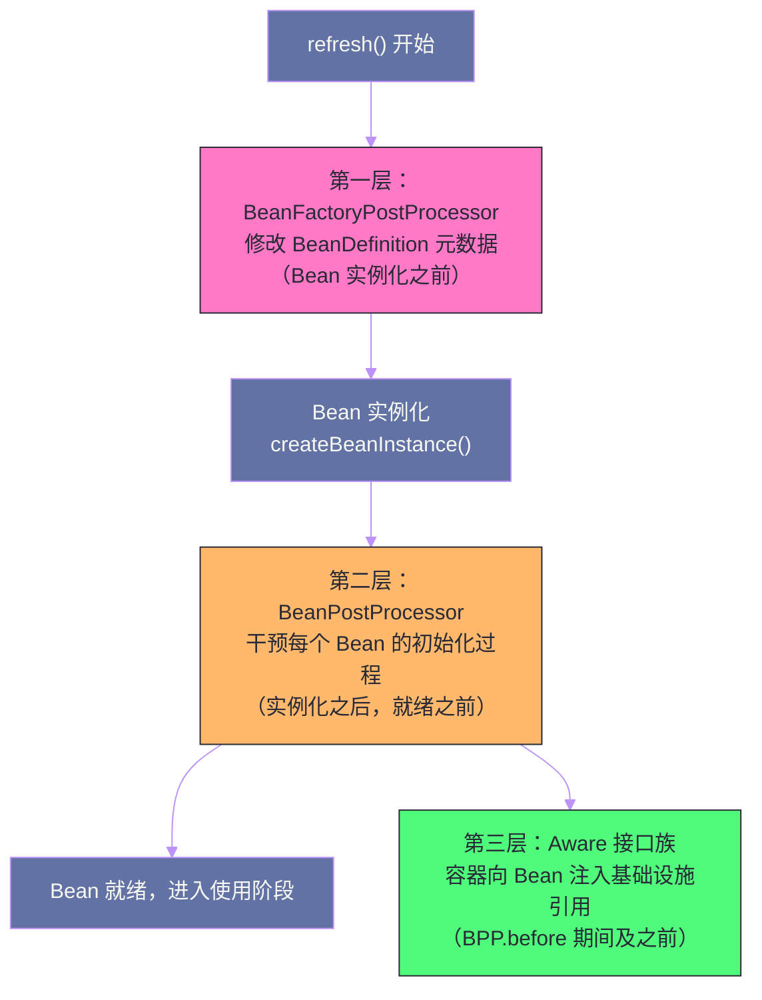
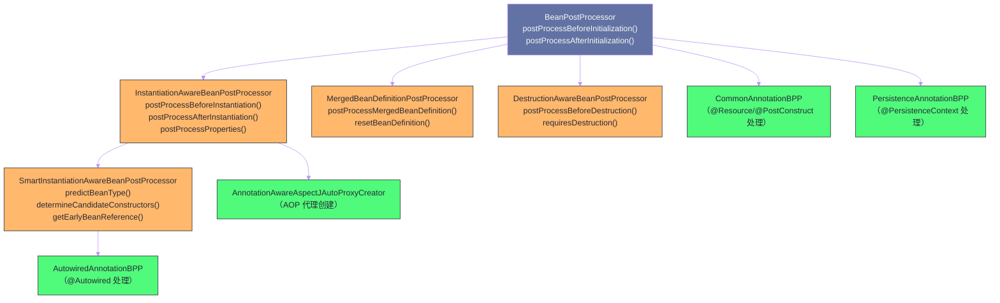
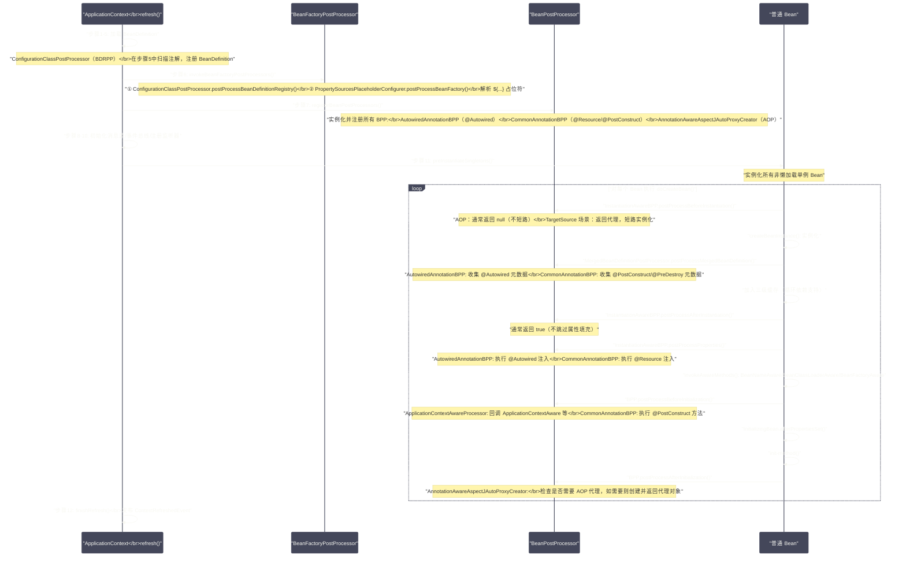

# Spring扩展点全景——BeanPostProcessor、BeanFactoryPostProcessor与Aware接口

## 摘要

Spring 的可扩展性是其生命力的根基。`@Transactional`、`@Autowired`、`@Async`、`@Cacheable`、AOP 代理——这些 Spring 提供的"魔法"，无一不是通过扩展点机制实现的，而非被硬编码进容器核心。Spring 的扩展点体系分为三个层次：**`BeanFactoryPostProcessor`** 在容器级别（`BeanDefinition` 阶段）干预，让你在 Bean 实例化之前修改元数据；**`BeanPostProcessor`** 在 Bean 级别干预，在每个 Bean 初始化前后执行逻辑；**`Aware` 接口族**则是容器向 Bean 主动注入自身引用的回调机制。本文作为 SpringCore 专栏的收官篇，将把前九篇涉及的各类扩展点——`AutowiredAnnotationBeanPostProcessor`、`ConfigurationClassPostProcessor`、`AnnotationAwareAspectJAutoProxyCreator`——全部回归到一个统一的扩展点视角下，建立一张完整的知识地图。

---

## 第 1 章 Spring 扩展点的设计哲学

### 1.1 开闭原则的框架级实践

Spring 框架本身的代码相当稳定——`AbstractApplicationContext.refresh()` 的十二步骤从 Spring 1.x 到 Spring 6.x 几乎没有结构性变化。但 Spring 的功能却在每个大版本中都有显著增强：注解驱动从无到有，AOP 从 XML 到 `@Aspect`，自动装配从按名称到按类型……这些增强都没有修改容器核心，而是通过**注册新的 `BeanPostProcessor` 和 `BeanFactoryPostProcessor`** 实现的。

这是开闭原则（OCP）在框架设计层面的极致实践——**对修改关闭，对扩展开放**。Spring 的核心容器对修改关闭，但通过扩展点接口，允许任何人在不修改容器源码的前提下，注入新的行为。

理解这个设计哲学，你就会明白：为什么说"理解 Spring 扩展点，就相当于掌握了 Spring 生态的二次开发能力"。

### 1.2 扩展点的三个层次



**第一层（容器级）`BeanFactoryPostProcessor`**：在所有 Bean **实例化之前**介入，操作的对象是 `BeanDefinition`——Bean 的"蓝图"。可以修改属性值、修改类名、添加新的 `BeanDefinition`。典型实现：`ConfigurationClassPostProcessor`（处理 `@Configuration`/`@ComponentScan`/`@Import`）、`PropertySourcesPlaceholderConfigurer`（解析 `${...}` 占位符）。

**第二层（Bean 级）`BeanPostProcessor`**：在每个 Bean **实例化之后、完全就绪之前**，对 Bean 实例进行干预。可以修改 Bean 的状态、包装 Bean（创建代理），甚至完全替换 Bean。典型实现：`AutowiredAnnotationBeanPostProcessor`（处理 `@Autowired`）、`AnnotationAwareAspectJAutoProxyCreator`（创建 AOP 代理）。

**第三层（回调）Aware 接口族**：`BeanPostProcessor` 的一种特殊形式，让 Bean 能够感知并获取容器的特定基础设施组件（`BeanFactory`、`ApplicationContext`、`Environment` 等）。

---

## 第 2 章 BeanFactoryPostProcessor：元数据阶段的干预

### 2.1 BeanFactoryPostProcessor 接口

```java
@FunctionalInterface
public interface BeanFactoryPostProcessor {
    /**
     * 在标准初始化之后（所有 BeanDefinition 都已加载，但尚未实例化任何 Bean），
     * 修改应用上下文内部的 BeanFactory。
     *
     * @param beanFactory 应用上下文使用的 BeanFactory（可强转为 ConfigurableListableBeanFactory）
     */
    void postProcessBeanFactory(ConfigurableListableBeanFactory beanFactory) throws BeansException;
}
```

`BeanFactoryPostProcessor` 在 `refresh()` 的步骤 6（`invokeBeanFactoryPostProcessors()`）被调用，此时所有 `BeanDefinition` 都已注册（步骤 3-5 完成），但没有任何普通 Bean 被实例化。

一个简单的自定义实现——将所有字符串属性值都转为大写（仅供理解概念）：

```java
@Component
public class UpperCaseBeanFactoryPostProcessor implements BeanFactoryPostProcessor {
    
    @Override
    public void postProcessBeanFactory(ConfigurableListableBeanFactory beanFactory) {
        // 遍历所有 BeanDefinition
        for (String beanName : beanFactory.getBeanDefinitionNames()) {
            BeanDefinition bd = beanFactory.getBeanDefinition(beanName);
            MutablePropertyValues pvs = bd.getPropertyValues();
            
            // 将每个字符串属性值转为大写
            for (PropertyValue pv : pvs.getPropertyValueList()) {
                if (pv.getValue() instanceof String value) {
                    pvs.addPropertyValue(pv.getName(), value.toUpperCase());
                }
            }
        }
    }
}
```

### 2.2 BeanDefinitionRegistryPostProcessor：注册新的 BeanDefinition

`BeanDefinitionRegistryPostProcessor` 是 `BeanFactoryPostProcessor` 的子接口，提供更强的能力——在 `postProcessBeanFactory()` 执行之前，先执行 `postProcessBeanDefinitionRegistry()`，此时可以**注册新的 `BeanDefinition`**：

```java
public interface BeanDefinitionRegistryPostProcessor extends BeanFactoryPostProcessor {
    
    // 先于 postProcessBeanFactory() 执行
    // 可以在这里向容器注册新的 BeanDefinition
    void postProcessBeanDefinitionRegistry(BeanDefinitionRegistry registry) throws BeansException;
}
```

`ConfigurationClassPostProcessor` 就是 `BeanDefinitionRegistryPostProcessor` 的最重要实现——它在 `postProcessBeanDefinitionRegistry()` 中解析 `@Configuration` 类，通过 `@ComponentScan` 扫描组件、通过 `@Import` 引入新类，将所有发现的 Bean 注册到容器。这也是整个注解驱动配置体系的核心入口。

### 2.3 PropertySourcesPlaceholderConfigurer：占位符解析

在第 09 篇（SpEL 与属性解析）中，我们追踪了 `${...}` 占位符的解析链路。`PropertySourcesPlaceholderConfigurer` 是这个链路的起点：

```java
// PropertySourcesPlaceholderConfigurer 是 BeanFactoryPostProcessor
// 在步骤 6 被调用时，它将所有 BeanDefinition 中的 ${...} 占位符替换为实际值
public class PropertySourcesPlaceholderConfigurer 
        extends PlaceholderConfigurerSupport 
        implements EnvironmentAware {
    
    @Override
    public void postProcessBeanFactory(ConfigurableListableBeanFactory beanFactory) {
        // 构建属性来源（合并 Environment 中的 PropertySources 和本地 Properties 文件）
        MutablePropertySources propertySourcesForResolution = ...;
        
        // 创建值解析器，用于替换 BeanDefinition 中的 ${...} 占位符
        StringValueResolver valueResolver = new PropertySourcesPropertyResolver(
            propertySourcesForResolution);
        
        // 应用到所有 BeanDefinition
        doProcessProperties(beanFactory, valueResolver);
    }
}
```

> [!info] Spring Boot 中的占位符解析
> Spring Boot 应用通常不需要显式配置 `PropertySourcesPlaceholderConfigurer`，因为 `PropertyPlaceholderAutoConfiguration`（自动配置类）在需要时会自动注册它。Spring Boot 通过 `@EnableAutoConfiguration` 引入了大量此类自动配置，这是 SpringBoot 专栏将深入讨论的内容。

### 2.4 BFPP 的执行顺序

当有多个 `BeanFactoryPostProcessor` 时，执行顺序由以下规则决定（在 `invokeBeanFactoryPostProcessors()` 中实现）：

1. **`BeanDefinitionRegistryPostProcessor`** 先于普通 `BeanFactoryPostProcessor` 执行；
2. 在同类中，实现了 `PriorityOrdered` 的先执行（按 `getOrder()` 升序）；
3. 然后是实现了 `Ordered` 的（按 `getOrder()` 升序）；
4. 最后是没有实现任何排序接口的，以不确定的顺序执行。

`ConfigurationClassPostProcessor` 实现了 `PriorityOrdered` 并返回 `Ordered.LOWEST_PRECEDENCE - 1`（接近最低优先级但不是最低），确保它在大多数 BFPP 之前执行——因为它注册了其他 BFPP Bean，必须先把这些 Bean 的 `BeanDefinition` 注册好，后续才能被调用。

---

## 第 3 章 BeanPostProcessor：Bean 级别的拦截

### 3.1 BeanPostProcessor 接口家族全景

`BeanPostProcessor` 是 Spring 扩展点体系中最丰富的层次，有一系列子接口形成了完整的拦截体系：



### 3.2 核心接口详解

**`BeanPostProcessor`（基础接口）**：

```java
public interface BeanPostProcessor {
    
    // 在 Bean 初始化之前调用（Aware 回调之后，@PostConstruct 之前）
    // 返回值：可以返回修改后的 Bean 或代理，返回 null 表示不干预（使用原始 Bean）
    @Nullable
    default Object postProcessBeforeInitialization(Object bean, String beanName) 
            throws BeansException {
        return bean;
    }
    
    // 在 Bean 初始化之后调用（init-method 之后）
    // AOP 代理在此处创建
    @Nullable
    default Object postProcessAfterInitialization(Object bean, String beanName) 
            throws BeansException {
        return bean;
    }
}
```

**`InstantiationAwareBeanPostProcessor`**：

```java
public interface InstantiationAwareBeanPostProcessor extends BeanPostProcessor {
    
    // 在 Bean 实例化之前调用（createBean 入口处）
    // 若返回非 null，则跳过 Spring 的标准实例化流程（短路）
    // AOP 的 TargetSource 机制就利用了这个短路点
    @Nullable
    default Object postProcessBeforeInstantiation(Class<?> beanClass, String beanName) 
            throws BeansException {
        return null;
    }
    
    // 在 Bean 实例化之后、属性填充之前调用
    // 返回 false 则跳过整个属性填充阶段
    default boolean postProcessAfterInstantiation(Object bean, String beanName) 
            throws BeansException {
        return true;
    }
    
    // 在属性填充阶段调用（替代或补充 XML/自动装配逻辑）
    // @Autowired 和 @Resource 的注入在这里发生
    @Nullable
    default PropertyValues postProcessProperties(PropertyValues pvs, Object bean, 
            String beanName) throws BeansException {
        return pvs;
    }
}
```

**`SmartInstantiationAwareBeanPostProcessor`**：

```java
public interface SmartInstantiationAwareBeanPostProcessor 
        extends InstantiationAwareBeanPostProcessor {
    
    // 预测 Bean 的最终类型（AOP 代理场景下，返回代理类型）
    // 用于 BeanFactory.getType(beanName) 能返回正确的代理类型
    @Nullable
    default Class<?> predictBeanType(Class<?> beanClass, String beanName) 
            throws BeansException {
        return null;
    }
    
    // 推断候选构造器（@Autowired 构造器的选择逻辑在这里）
    @Nullable
    default Constructor<?>[] determineCandidateConstructors(Class<?> beanClass, 
            String beanName) throws BeansException {
        return null;
    }
    
    // 获取提前暴露的 Bean 引用（三级缓存，解决循环依赖）
    // AOP 代理在循环依赖场景下通过此方法提前创建
    default Object getEarlyBeanReference(Object bean, String beanName) 
            throws BeansException {
        return bean;
    }
}
```

**`MergedBeanDefinitionPostProcessor`**：

```java
public interface MergedBeanDefinitionPostProcessor extends BeanPostProcessor {
    
    // 在 Bean 实例化之后、属性填充之前，对合并后的 BeanDefinition 进行后处理
    // AutowiredAnnotationBPP 在此收集 @Autowired 元数据并缓存
    // CommonAnnotationBPP 在此收集 @PostConstruct/@PreDestroy 元数据并缓存
    void postProcessMergedBeanDefinition(RootBeanDefinition beanDefinition, 
            Class<?> beanType, String beanName);
    
    // 当 BeanDefinition 被重置时（如 refresh 重新扫描），清除缓存的元数据
    default void resetBeanDefinition(String beanName) {}
}
```

**`DestructionAwareBeanPostProcessor`**：

```java
public interface DestructionAwareBeanPostProcessor extends BeanPostProcessor {
    
    // 在 Bean 销毁之前调用
    // CommonAnnotationBPP 在此调用 @PreDestroy 方法
    void postProcessBeforeDestruction(Object bean, String beanName) throws BeansException;
    
    // 判断此 BPP 是否需要处理该 Bean 的销毁逻辑
    // 优化：如果返回 false，则不将此 Bean 注册为"需要销毁处理"
    default boolean requiresDestruction(Object bean) {
        return true;
    }
}
```

### 3.3 Spring 内置的核心 BeanPostProcessor

**`AutowiredAnnotationBeanPostProcessor`（注解注入的核心）**

这是 `@Autowired`、`@Value`、`@Inject` 注解的处理器，实现了 `SmartInstantiationAwareBeanPostProcessor` 和 `MergedBeanDefinitionPostProcessor`：

- `postProcessMergedBeanDefinition()`：收集 Bean 类上所有 `@Autowired`/`@Value` 注解的字段和方法，构建 `InjectionMetadata` 对象缓存；
- `determineCandidateConstructors()`：推断 `@Autowired` 注解的构造器；
- `postProcessProperties()`：执行实际的注入操作——通过反射为字段赋值，调用 setter 方法传参；每个注入点从 `BeanFactory` 解析对应的依赖 Bean。

**`CommonAnnotationBeanPostProcessor`（JSR-250 注解处理器）**

处理 `@Resource`、`@PostConstruct`、`@PreDestroy` 等 JSR-250 标准注解：

- `postProcessMergedBeanDefinition()`：收集 `@PostConstruct`/`@PreDestroy` 方法的元数据；
- `postProcessBeforeInitialization()`：调用 `@PostConstruct` 标注的方法；
- `postProcessBeforeDestruction()`（来自 `DestructionAwareBeanPostProcessor`）：调用 `@PreDestroy` 标注的方法；
- `postProcessProperties()`：处理 `@Resource` 注解的字段/方法注入（按名称匹配）。

**`AnnotationAwareAspectJAutoProxyCreator`（AOP 代理的创建者）**

Spring AOP 的总指挥，实现了 `SmartInstantiationAwareBeanPostProcessor`：

- `postProcessAfterInitialization()`：在 Bean 完成初始化后，检查是否有匹配的 `Advisor`，有则创建 JDK 动态代理或 CGLIB 代理，返回代理对象替代原始 Bean；
- `getEarlyBeanReference()`：在循环依赖场景下，提前为半初始化的 Bean 创建代理（防止循环引用拿到的是原始对象而非代理）；
- `predictBeanType()`：返回代理类的实际类型，使 `beanFactory.getType(beanName)` 在 AOP 场景下能返回正确结果。

**`ApplicationContextAwareProcessor`（Aware 接口的桥梁）**

在 `prepareBeanFactory()`（步骤 3）中注册，负责处理 `ApplicationContextAware`、`EnvironmentAware`、`ResourceLoaderAware` 等接口的回调：

```java
// 此 BPP 直接作为内部 BPP 注册（非 Bean），优先级最高
class ApplicationContextAwareProcessor implements BeanPostProcessor {
    
    @Override
    @Nullable
    public Object postProcessBeforeInitialization(Object bean, String beanName) {
        if (bean instanceof Aware) {
            invokeAwareInterfaces(bean);
        }
        return bean;
    }
    
    private void invokeAwareInterfaces(Object bean) {
        if (bean instanceof EnvironmentAware ea) {
            ea.setEnvironment(this.applicationContext.getEnvironment());
        }
        if (bean instanceof ApplicationContextAware aca) {
            aca.setApplicationContext(this.applicationContext);
        }
        // ... 其他 Aware 接口
    }
}
```

### 3.4 BPP 的注册时机与特殊处理

`BeanPostProcessor` 自身也是 Bean（注册在 `BeanDefinitionRegistry` 中），但它比普通 Bean 更早被实例化——在 `refresh()` 的步骤 7（`registerBeanPostProcessors()`）中：

```java
// AbstractApplicationContext#registerBeanPostProcessors()（简化）
protected void registerBeanPostProcessors(ConfigurableListableBeanFactory beanFactory) {
    // 从容器中找出所有 BPP 类型的 BeanDefinition
    String[] postProcessorNames = beanFactory.getBeanNamesForType(
        BeanPostProcessor.class, true, false);
    
    // 按 PriorityOrdered > Ordered > 普通 的顺序依次实例化并注册
    List<BeanPostProcessor> priorityOrderedPostProcessors = new ArrayList<>();
    for (String ppName : postProcessorNames) {
        if (beanFactory.isTypeMatch(ppName, PriorityOrdered.class)) {
            BeanPostProcessor pp = beanFactory.getBean(ppName, BeanPostProcessor.class);
            priorityOrderedPostProcessors.add(pp);
        }
    }
    sortPostProcessors(priorityOrderedPostProcessors, beanFactory);
    registerBeanPostProcessors(beanFactory, priorityOrderedPostProcessors);
    
    // ... 类似处理 Ordered 和普通 BPP
}
```

**BPP 实例化早于普通 Bean 的必要性**：BPP 需要在每个普通 Bean 实例化时介入。如果 BPP 本身和普通 Bean 同时实例化（都在步骤 11），就无法保证 BPP 在普通 Bean 之前就绪，会导致早期创建的普通 Bean 没有被 BPP 处理到。

**BPP 不会被自身处理**：在步骤 7 实例化 BPP 时，容器中的其他 BPP 可能还未全部注册，因此 BPP 的实例化过程可能不完整——比如 BPP A 在实例化时，`AutowiredAnnotationBPP` 可能还未注册，导致 BPP A 的 `@Autowired` 字段无法被注入。这是"BPP 不能通过 `@Autowired` 注入另一个 BPP"的根本原因。

> [!warning] BPP 中不要依赖 @Autowired 注入其他 Bean
> 由于 BPP 在步骤 7 就被提前实例化，此时 `AutowiredAnnotationBPP` 可能还未完全注册（或者正在注册中），导致 BPP 自身的 `@Autowired` 字段无法被正常注入。Spring 会打印一条警告日志："Bean X of type Y is not eligible for getting processed by all BeanPostProcessors"。正确的做法是在 BPP 中通过构造器注入，或实现 `ApplicationContextAware` 获取 `ApplicationContext` 后再通过 `getBean()` 获取依赖。

---

## 第 4 章 Aware 接口族：容器向 Bean 注入基础设施

### 4.1 Aware 接口的设计意图

`Aware` 是一个标记接口，所有实现了 `Aware` 子接口的 Bean，在创建过程中都会被容器主动"通知"，注入对应的基础设施组件。这个机制的名字"Aware"——"感知/意识到"——准确地描述了其语义：Bean 通过实现这些接口，向容器表达"我需要感知某个基础设施组件"，容器在合适的时机将其注入。

```java
// Aware 是一个标记接口，本身无任何方法
public interface Aware {}

// 所有 Aware 子接口都提供一个 setter 方法，用于接收注入
public interface BeanNameAware extends Aware {
    void setBeanName(String name);
}

public interface ApplicationContextAware extends Aware {
    void setApplicationContext(ApplicationContext applicationContext) throws BeansException;
}
```

### 4.2 完整的 Aware 接口清单

Spring 框架中定义了以下 Aware 接口，按执行时机分组：

**在 `invokeAwareMethods()`（BPP.before 之前）执行的**（`spring-beans` 层）：

| 接口 | 注入内容 | 典型用途 |
| --- | --- | --- |
| `BeanNameAware` | 当前 Bean 在容器中的名称（`beanName`） | 打日志、监控中使用自身名称 |
| `BeanClassLoaderAware` | 加载当前 Bean 的 `ClassLoader` | 动态加载类、访问类路径资源 |
| `BeanFactoryAware` | 当前 `BeanFactory`（不是 `ApplicationContext`） | 延迟获取 Bean，程序化访问容器 |

**在 `ApplicationContextAwareProcessor#postProcessBeforeInitialization()`（BPP.before 期间）执行的**（`spring-context` 层）：

| 接口 | 注入内容 | 典型用途 |
| --- | --- | --- |
| `EnvironmentAware` | `Environment` 对象 | 访问属性、Profile 信息 |
| `EmbeddedValueResolverAware` | `StringValueResolver`（占位符解析器） | 手动解析 `${...}` 占位符 |
| `ResourceLoaderAware` | `ResourceLoader` | 加载类路径/文件系统资源 |
| `ApplicationEventPublisherAware` | `ApplicationEventPublisher` | 发布事件（等同于注入 `ApplicationContext`） |
| `MessageSourceAware` | `MessageSource` | 国际化消息访问 |
| `ApplicationStartupAware` | `ApplicationStartup` | 记录应用启动步骤耗时 |
| `ApplicationContextAware` | 完整的 `ApplicationContext` | 最完整的容器访问能力 |

**Spring Web 层额外的 Aware 接口**：

| 接口 | 注入内容 | 所在模块 |
| --- | --- | --- |
| `ServletContextAware` | `ServletContext` | `spring-web` |
| `ServletConfigAware` | `ServletConfig` | `spring-web` |

### 4.3 Aware 接口的工程价值与滥用边界

**工程价值**：Aware 接口是"依赖注入无法满足需求时"的补充手段。常见的合理使用场景：

1. **动态 Bean 获取**：某些 Bean 需要在运行时动态获取指定类型的 Bean（如插件系统），实现 `BeanFactoryAware` 后调用 `beanFactory.getBean(type)`；
2. **属性解析**：需要在运行时动态解析 `${...}` 占位符，实现 `EmbeddedValueResolverAware` 获取解析器；
3. **发布事件**：实现 `ApplicationEventPublisherAware` 获取事件发布器（当然，直接 `@Autowired ApplicationEventPublisher` 更简洁）；
4. **框架级组件**：Spring 自身的很多基础组件（如 `AbstractApplicationContext` 的内部类）使用 Aware 接口获取必要的容器引用，不能使用 `@Autowired`（因为自身就是容器的一部分）。

**滥用边界**：

> [!warning] ApplicationContextAware 的滥用问题
> 在业务代码中大量实现 `ApplicationContextAware`，将 `ApplicationContext` 作为"全局服务定位器"（Service Locator）使用，是一个常见的反模式：
>
> ```java
> // ❌ 反模式：用 ApplicationContext 作为服务定位器
> @Service
> public class OrderService implements ApplicationContextAware {
>     private ApplicationContext ctx;
>     
>     @Override
>     public void setApplicationContext(ApplicationContext ctx) {
>         this.ctx = ctx;
>     }
>     
>     public void process() {
>         // 用 ctx.getBean() 替代 @Autowired——这破坏了 IoC 的核心价值
>         UserService userService = ctx.getBean(UserService.class);
>         userService.findUser(...);
>     }
> }
> ```
>
> `@Autowired` 声明式注入才是 Spring 的正确使用姿势，它使依赖关系清晰可见，易于测试和重构。`getBean()` 的程序化调用应该只用在**确实无法提前知道要获取哪个 Bean**的动态场景（如插件类型不固定），而不是用来绕过声明式注入。

---

## 第 5 章 自定义扩展点的实战模式

### 5.1 模式一：使用 BeanFactoryPostProcessor 统一修改配置

场景：应用在生产环境下，需要自动将所有 `DataSource` Bean 的密码从明文替换为从 KMS 解密后的密文。

```java
@Component
public class KmsDecryptBeanFactoryPostProcessor implements BeanFactoryPostProcessor {
    
    @Autowired
    private KmsService kmsService;
    
    @Override
    public void postProcessBeanFactory(ConfigurableListableBeanFactory beanFactory) {
        // 找到所有 DataSource 类型的 BeanDefinition
        String[] dataSourceBeans = beanFactory.getBeanNamesForType(DataSource.class, 
            true, false);
        
        for (String beanName : dataSourceBeans) {
            BeanDefinition bd = beanFactory.getBeanDefinition(beanName);
            MutablePropertyValues pvs = bd.getPropertyValues();
            
            PropertyValue passwordPv = pvs.getPropertyValue("password");
            if (passwordPv != null && passwordPv.getValue() instanceof String encryptedPwd) {
                // 如果密码以 "enc:" 开头，说明是加密值
                if (encryptedPwd.startsWith("enc:")) {
                    String decrypted = kmsService.decrypt(encryptedPwd.substring(4));
                    pvs.addPropertyValue("password", decrypted);
                }
            }
        }
    }
}
```

> [!warning] BFPP 中注入 Bean 的陷阱
> 上面的代码有一个严重问题：`@Autowired KmsService kmsService` 注入依赖。但 `BeanFactoryPostProcessor` 在步骤 6 执行，此时 `KmsService` 可能还未实例化。Spring 会为了满足 BFPP 的依赖，提前实例化 `KmsService`——这会导致 `KmsService` 跳过部分 BPP 的处理（BPP 在步骤 7 才注册）。正确做法是在 `postProcessBeanFactory()` 方法内通过参数 `beanFactory.getBean(KmsService.class)` 显式获取，不使用字段注入。

### 5.2 模式二：使用 BeanPostProcessor 为所有 Service Bean 添加监控

场景：为所有 `@Service` Bean 的所有方法添加耗时监控，但不使用 AOP（假设要轻量级实现）。

```java
@Component
public class PerformanceMonitorBeanPostProcessor implements BeanPostProcessor {
    
    @Override
    public Object postProcessAfterInitialization(Object bean, String beanName) 
            throws BeansException {
        
        Class<?> beanClass = AopUtils.getTargetClass(bean); // 获取目标类（穿透 AOP 代理）
        
        if (!beanClass.isAnnotationPresent(Service.class)) {
            return bean; // 非 @Service Bean，不处理
        }
        
        // 获取所有接口（用于 JDK 动态代理）
        Class<?>[] interfaces = ClassUtils.getAllInterfaces(bean);
        if (interfaces.length == 0) {
            return bean; // 无接口，跳过（实际项目中可改用 CGLIB）
        }
        
        // 创建 JDK 动态代理
        return Proxy.newProxyInstance(
            beanClass.getClassLoader(),
            interfaces,
            (proxy, method, args) -> {
                long start = System.nanoTime();
                try {
                    return method.invoke(bean, args);
                } finally {
                    long elapsed = System.nanoTime() - start;
                    Metrics.timer(beanName + "." + method.getName())
                           .record(elapsed, TimeUnit.NANOSECONDS);
                }
            }
        );
    }
}
```

### 5.3 模式三：使用 Aware + BPP 实现自定义注解注入

场景：实现一个 `@ConfigValue` 注解，支持从外部配置中心动态获取配置值并注入，且支持实时刷新（配置变更时自动更新字段值）。

```java
// 自定义注解
@Target(ElementType.FIELD)
@Retention(RetentionPolicy.RUNTIME)
public @interface ConfigValue {
    String key();          // 配置键
    String defaultValue() default ""; // 默认值
    boolean refresh() default false;  // 是否支持实时刷新
}

// 自定义 BPP 处理 @ConfigValue 注解
@Component
public class ConfigValueBeanPostProcessor 
        implements BeanPostProcessor, MergedBeanDefinitionPostProcessor, 
                   BeanFactoryAware {
    
    private BeanFactory beanFactory;
    
    // 缓存每个 Bean 类型的 @ConfigValue 字段元数据
    private final Map<Class<?>, List<Field>> configValueFieldsCache = new ConcurrentHashMap<>();
    
    @Override
    public void setBeanFactory(BeanFactory beanFactory) {
        this.beanFactory = beanFactory;
    }
    
    @Override
    public void postProcessMergedBeanDefinition(RootBeanDefinition beanDefinition, 
            Class<?> beanType, String beanName) {
        // 收集并缓存 @ConfigValue 字段
        List<Field> configValueFields = Arrays.stream(beanType.getDeclaredFields())
            .filter(f -> f.isAnnotationPresent(ConfigValue.class))
            .collect(Collectors.toList());
        
        if (!configValueFields.isEmpty()) {
            configValueFieldsCache.put(beanType, configValueFields);
        }
    }
    
    @Override
    public Object postProcessBeforeInitialization(Object bean, String beanName) {
        List<Field> fields = configValueFieldsCache.get(bean.getClass());
        if (fields == null) return bean;
        
        ConfigCenter configCenter = beanFactory.getBean(ConfigCenter.class);
        
        for (Field field : fields) {
            ConfigValue annotation = field.getAnnotation(ConfigValue.class);
            String value = configCenter.get(annotation.key(), annotation.defaultValue());
            
            try {
                field.setAccessible(true);
                field.set(bean, convertValue(value, field.getType()));
            } catch (IllegalAccessException e) {
                throw new BeanCreationException(beanName, "Failed to inject @ConfigValue", e);
            }
            
            // 如果需要实时刷新，注册刷新监听器
            if (annotation.refresh()) {
                configCenter.watch(annotation.key(), newValue -> {
                    try {
                        field.set(bean, convertValue(newValue, field.getType()));
                    } catch (IllegalAccessException ignored) {}
                });
            }
        }
        
        return bean;
    }
    
    private Object convertValue(String value, Class<?> targetType) {
        // 类型转换逻辑...
        return value; // 简化
    }
}
```

---

## 第 6 章 扩展点执行顺序全景时序图

将前九篇涉及的所有扩展点，整合到一张完整的时序图中：



---

## 第 7 章 如何选择扩展点

在实际开发中，面对不同的需求，应该选择哪个扩展点？

### 7.1 决策树

```
需求类型：
├── 需要在 Bean 实例化之前修改 Bean 的元数据（类名、属性值、作用域等）
│   └── 使用 BeanFactoryPostProcessor
│       ├── 需要注册新的 BeanDefinition → BeanDefinitionRegistryPostProcessor
│       └── 只需修改已有 BeanDefinition → BeanFactoryPostProcessor
│
├── 需要在 Bean 创建过程中干预
│   └── 使用 BeanPostProcessor 系列
│       ├── 在实例化之前（可短路）→ InstantiationAwareBPP.postProcessBeforeInstantiation()
│       ├── 在属性填充阶段注入依赖 → InstantiationAwareBPP.postProcessProperties()
│       ├── 在初始化前/后执行逻辑（或创建代理）→ BPP.postProcessBefore/AfterInitialization()
│       ├── 在销毁前执行逻辑 → DestructionAwareBPP.postProcessBeforeDestruction()
│       └── 缓存注解元数据 → MergedBeanDefinitionPostProcessor.postProcessMergedBeanDefinition()
│
├── Bean 需要获取容器的基础设施引用
│   └── 实现对应的 Aware 接口
│       ├── 需要 beanName → BeanNameAware
│       ├── 需要 BeanFactory（轻量访问）→ BeanFactoryAware
│       ├── 需要 ApplicationContext（完整功能）→ ApplicationContextAware
│       ├── 需要 Environment（属性/Profile）→ EnvironmentAware
│       └── 需要发布事件 → ApplicationEventPublisherAware（或直接 @Autowired）
│
└── 需要在初始化完成后执行某些操作
    ├── Bean 的初始化逻辑（不需要框架感知）→ @PostConstruct 或 InitializingBean
    └── 框架启动完成后的操作 → CommandLineRunner/ApplicationRunner
        或监听 ContextRefreshedEvent/ApplicationReadyEvent
```

### 7.2 各扩展点的黄金法则

**BeanFactoryPostProcessor 黄金法则**：
- 不要在 BFPP 中通过字段注入依赖（用 `beanFactory.getBean()` 替代）；
- `postProcessBeanFactory()` 中不要触发 Bean 的提前实例化（调用 `beanFactory.getBean()` 会实例化 Bean，这些 Bean 可能未被所有 BPP 处理）；
- 只做元数据修改，不做业务逻辑。

**BeanPostProcessor 黄金法则**：
- 尽量快速返回——BPP 对每个 Bean 都会调用，性能影响按 Bean 数量放大；
- `postProcessAfterInitialization()` 返回代理对象时，代理必须兼容原始 Bean 的类型（否则依赖该 Bean 的地方会因类型不匹配失败）；
- BPP 自身不能依赖其他晚注册的 BPP 处理的功能（如不能依赖 `@Async`）。

**Aware 接口黄金法则**：
- 优先使用 `@Autowired` 注入，只有 `@Autowired` 无法满足时才使用 Aware；
- `ApplicationContextAware` 获取的 `ApplicationContext` 不要存储在静态字段中（违反 IoC 原则，给测试带来困难）；
- 如果只需要发布事件，注入 `ApplicationEventPublisher` 而非整个 `ApplicationContext`（最小依赖原则）。

---

## 总结：SpringCore 专栏知识地图

作为 SpringCore 专栏的收官篇，本文将 Spring 框架的扩展点体系做了完整的归纳，同时也为前九篇的核心机制提供了一个统一的视角：

- **扩展点三层次**：`BeanFactoryPostProcessor`（元数据阶段）→ `BeanPostProcessor`（Bean 实例阶段）→ `Aware` 接口（基础设施注入）；
- **所有"魔法"的来源**：`@Autowired` = `AutowiredAnnotationBPP`；`@PostConstruct` = `CommonAnnotationBPP`；`@Transactional`/`@Cacheable` = `AnnotationAwareAspectJAutoProxyCreator`；`@ComponentScan` = `ConfigurationClassPostProcessor`；`${...}` 解析 = `PropertySourcesPlaceholderConfigurer`；
- **使用边界**：BPP 中避免字段注入；Aware 接口是 `@Autowired` 的补充而非替代；服务定位器模式（大量使用 `getBean()`）是 IoC 的反模式；
- **扩展点的选择**：按需求类型选择正确的扩展点层次，避免在错误的层次做操作（如用 BPP 修改 BeanDefinition、在 BFPP 中触发 Bean 实例化）。

掌握了这张知识地图，你不仅能读懂 Spring 源码，更能在此基础上为自己的项目构建符合 Spring 惯用模式的框架扩展。

SpringCore 专栏至此完结。SpringBoot 专栏将以此为基础，继续探索 Spring Boot 如何通过自动装配、条件注解、内嵌容器等机制，在 Spring Framework 之上构建"开箱即用"的现代应用开发体验：[[SpringBoot/00 专栏导览]]。

---

> [!note] 参考资料
> - `org.springframework.beans.factory.config.BeanFactoryPostProcessor` 源码
> - `org.springframework.beans.factory.config.BeanPostProcessor` 源码
> - `org.springframework.context.support.PostProcessorRegistrationDelegate` 源码（BFPP/BPP 注册与调用的核心）
> - `org.springframework.beans.factory.annotation.AutowiredAnnotationBeanPostProcessor` 源码
> - [Spring Framework 官方文档 - Container Extension Points](https://docs.spring.io/spring-framework/reference/core/beans/factory-extension.html)

---

> [!note] 思考题
> 1. Spring 框架的核心设计哲学是'约定优于配置'和'非侵入式'。但随着 Spring 生态的膨胀（Spring Boot、Spring Cloud、Spring Data、Spring Security...），学习曲线越来越陡。相比之下，Go 生态倾向于'标准库优先，第三方库极简'。你认为 Spring 的'全家桶'模式和 Go 的'最小化'模式各适合什么类型的团队和项目？
> 2. Spring 5 引入了 WebFlux 响应式编程模型，与传统的 Spring MVC（Servlet 阻塞模型）并存。WebFlux 使用 Netty 作为非阻塞 HTTP 服务器，适合 IO 密集型场景。但 Spring 生态中大量库（如 Spring Data JPA、MyBatis）是阻塞的。在一个混合了阻塞 JDBC 和非阻塞 HTTP 调用的应用中，WebFlux 的优势是否会被阻塞 JDBC 抵消？
> 3. Spring 的 IoC 容器通过反射创建 Bean——这与 GraalVM Native Image（要求在编译时确定所有类和方法）存在根本矛盾。Spring 6 / Spring Boot 3 引入了 AOT（Ahead-of-Time）编译支持。AOT 如何在编译时生成 Bean 的工厂代码以替代运行时反射？这对 Spring 的'约定优于配置'理念有什么影响？
