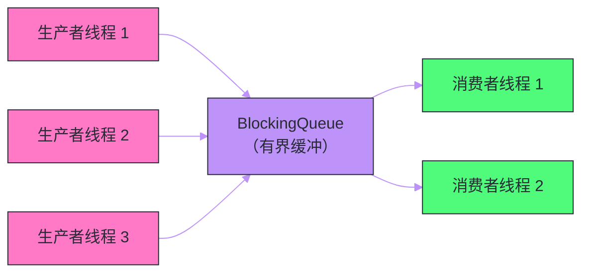

# 10 并发容器（下）——CopyOnWriteArrayList、BlockingQueue 家族

**摘要：**

上篇聚焦于 `ConcurrentHashMap` 的哈希表并发设计，本篇转向另外两类截然不同的并发容器：**`CopyOnWriteArrayList`（写时复制）** 和 **`BlockingQueue` 家族（阻塞队列）**。`CopyOnWriteArrayList` 将"读不加锁"的思路推向极致——通过每次写操作创建整个数组的副本，让读操作完全无锁，为"读极多写极少"场景提供了零锁读的并发安全列表。`BlockingQueue` 则是经典**生产者-消费者**模式的标准基础设施，用队列将生产速率与消费速率解耦。本文重点剖析 `ArrayBlockingQueue`（单锁两 Condition）、`LinkedBlockingQueue`（双锁分离）、`SynchronousQueue`（零容量握手）、`PriorityBlockingQueue`（堆操作并发安全）、`DelayQueue`（延迟任务）的内部机制差异，以及它们各自的适用边界。理解这些容器，不仅是选型的需要，更能加深对"分离读写路径"和"条件等待"这两大并发设计模式的理解。

---

## 第 1 章 CopyOnWriteArrayList——写时复制的极致读并发

### 1.1 设计动机：让读操作永远无锁

在 [[JUC工具/08 读写锁与 StampedLock——从 ReentrantReadWriteLock 到乐观读]] 中，我们看到读写锁如何让读-读并发，`StampedLock` 如何通过乐观读进一步降低读的代价。这两种方案的共同点是：读操作仍然需要与写操作协调（要么通过 volatile 读，要么通过版本号验证）。

`CopyOnWriteArrayList` 走了另一条路：**让读操作完全不关心写操作的存在**——读线程访问的是一个不会被修改的快照，写线程在修改时创建新快照替换旧快照。读写路径完全分离，读操作真正做到了零锁、零屏障（在 JDK 9+ 中，读甚至是 Plain Load，没有任何内存屏障）。

这个设计来自于一个关键观察：如果一个数组是**不可变的（immutable）**，多少线程同时读都不会有问题。写时复制（Copy-On-Write, COW）的思路是：每次修改（写）操作都创建一个新数组，在新数组上完成修改，然后原子地将引用切换到新数组。切换之前，老数组是不可变的；切换之后，老读者仍然持有老数组的引用，不受影响；新读者看到新数组，得到最新数据。

### 1.2 CopyOnWriteArrayList 的核心实现

```java
public class CopyOnWriteArrayList<E>
    implements List<E>, RandomAccess, Cloneable, java.io.Serializable {
    
    final transient ReentrantLock lock = new ReentrantLock();  // 写锁
    
    // 数组引用：volatile 保证每次读拿到最新数组
    private transient volatile Object[] array;
    
    // 读操作：直接拿到当前数组快照，无锁，无 CAS
    final Object[] getArray() {
        return array;
    }
    
    // 写操作：加锁，复制，修改，替换
    final void setArray(Object[] a) {
        array = a;  // volatile 写，让新数组对所有线程可见
    }
}
```

**`get()` 实现**：

```java
public E get(int index) {
    return elementAt(getArray(), index);  // 读 volatile array，然后直接访问
}
// 无 synchronized，无 CAS，无屏障（仅 volatile 读 array 引用本身）
```

**`add()` 实现**：

```java
public boolean add(E e) {
    synchronized (lock) {  // 写操作加锁，互斥
        Object[] es = getArray();
        int len = es.length;
        es = Arrays.copyOf(es, len + 1);  // 创建长度加 1 的新数组
        es[len] = e;                       // 在新数组的末尾写入新元素
        setArray(es);                      // 原子替换（volatile 写）
        return true;
    }
}
```

**`remove(int index)` 实现**：

```java
public E remove(int index) {
    synchronized (lock) {
        Object[] es = getArray();
        int len = es.length;
        E oldValue = elementAt(es, index);
        int numMoved = len - index - 1;
        Object[] newEs;
        if (numMoved == 0)
            newEs = Arrays.copyOf(es, len - 1);
        else {
            newEs = new Object[len - 1];
            System.arraycopy(es, 0, newEs, 0, index);           // 复制 index 之前的元素
            System.arraycopy(es, index + 1, newEs, index, numMoved); // 复制 index 之后的元素
        }
        setArray(newEs);  // 替换为新数组
        return oldValue;
    }
}
```

### 1.3 CopyOnWriteArrayList 的迭代器设计

这是 COW 列表最精妙的地方之一：迭代器在创建时**拍下数组快照**，迭代过程中使用这个快照，**永远不会抛出 `ConcurrentModificationException`**：

```java
public Iterator<E> iterator() {
    return new COWIterator<E>(getArray(), 0);  // 拿到当前数组快照
}

static final class COWIterator<E> implements ListIterator<E> {
    private final Object[] snapshot;  // 迭代时使用的快照
    private int cursor;

    COWIterator(Object[] es, int initialCursor) {
        cursor = initialCursor;
        snapshot = es;  // 此后 snapshot 不变，即使外部进行了 add/remove
    }

    public E next() {
        if (!hasNext()) throw new NoSuchElementException();
        return elementAt(snapshot, cursor++);
    }
    
    // 不支持 remove/set/add（因为操作的是快照而非实际列表）
    public void remove() {
        throw new UnsupportedOperationException();
    }
}
```

迭代器的快照语义有时候是需要的特性（如遍历事件监听器列表时，列表可能在遍历中被修改），有时候是陷阱（迭代器看不到遍历期间的新增/删除）。

### 1.4 CopyOnWriteArrayList 的性能代价与适用边界

**写操作的代价**：每次写操作需要复制整个数组，代价是 O(n)——数组越大，写操作越慢，内存分配（GC 压力）越高。

**内存使用**：每次写操作期间，新旧两个数组同时存在，内存占用翻倍（短暂）。

**适用场景（写极少）**：
- 事件监听器（Listener）列表：注册/注销监听器很少发生，触发事件时遍历监听器很频繁
- 白名单/黑名单：配置数据，偶尔更新，频繁查询
- 小型且几乎不变的集合：如 JVM 启动后固定的配置项

**不适用场景（写频繁）**：如果写操作频繁，每次写都 O(n) 复制，既慢又浪费内存。此时应该考虑 `ConcurrentHashMap`（如果需要按 key 查找）或 `Collections.synchronizedList()`（锁保护的 ArrayList）。

> [!warning] 生产避坑
> 不要对大型 `CopyOnWriteArrayList` 频繁写。一个包含 10 万元素的 `CopyOnWriteArrayList`，每次 `add` 都需要分配一个 10 万零 1 元素的新数组并复制——约 800KB 的内存分配，对 GC 造成巨大压力。频繁写的场景应该使用 `ConcurrentLinkedQueue` 或加锁的 `ArrayList`。

---

## 第 2 章 BlockingQueue——生产者消费者模式的基础设施

### 2.1 BlockingQueue 接口设计

`BlockingQueue` 是 JUC 并发包中实现生产者-消费者模式的标准接口。它在普通队列的基础上增加了**阻塞语义**：

```java
public interface BlockingQueue<E> extends Queue<E> {
    // 插入操作（4 种变体）
    boolean add(E e);           // 满则抛 IllegalStateException
    boolean offer(E e);         // 满则立即返回 false（非阻塞）
    void put(E e)               // 满则阻塞等待，响应中断
        throws InterruptedException;
    boolean offer(E e,          // 带超时的阻塞
        long timeout, TimeUnit unit)
        throws InterruptedException;
    
    // 移除操作（4 种变体）
    E remove();                 // 空则抛 NoSuchElementException
    E poll();                   // 空则立即返回 null（非阻塞）
    E take()                    // 空则阻塞等待，响应中断
        throws InterruptedException;
    E poll(long timeout,        // 带超时的阻塞
        TimeUnit unit)
        throws InterruptedException;
    
    // 其他
    int remainingCapacity();    // 剩余可用空间
    boolean contains(Object o);
    int drainTo(Collection<? super E> c);  // 批量转移（减少加锁次数）
}
```

最常用的是 `put()`/`take()` 这对阻塞方法：当队列满时 `put()` 阻塞生产者，当队列空时 `take()` 阻塞消费者。这个机制自动实现了**背压（Backpressure）**——当消费端处理不过来时，生产端自动降速。

### 2.2 生产者-消费者模式的价值



使用 `BlockingQueue` 的生产者-消费者模式具有以下优势：

**解耦速率**：生产者和消费者的速率可以不匹配，队列作为缓冲。

**解耦逻辑**：生产者只负责生产并放入队列，消费者只负责从队列取出并消费，两者完全独立，可以分别扩展和修改。

**自动背压**：有界队列满时自动阻塞生产者，防止内存溢出。这是相对于无界队列的重要优势——无界队列在消费者过慢时会无限堆积，最终 OOM。

**线程复用**：结合线程池，可以高效地复用消费者线程，避免频繁创建销毁线程的开销。

---

## 第 3 章 ArrayBlockingQueue——单锁双 Condition 的有界队列

### 3.1 数据结构

`ArrayBlockingQueue` 是基于**循环数组**实现的有界阻塞队列。循环数组（Ring Buffer）是比链表更高效的队列实现——没有节点对象的分配/回收开销，内存局部性好（数组是连续内存），GC 友好。

```java
public class ArrayBlockingQueue<E> extends AbstractQueue<E>
    implements BlockingQueue<E>, java.io.Serializable {
    
    final Object[] items;      // 循环数组
    int takeIndex;             // 下一次 take 的位置
    int putIndex;              // 下一次 put 的位置
    int count;                 // 当前元素数量
    
    final ReentrantLock lock;  // 单把锁（生产和消费共用）
    private final Condition notEmpty;  // 消费者等待条件：队列非空
    private final Condition notFull;   // 生产者等待条件：队列未满
    
    public ArrayBlockingQueue(int capacity, boolean fair) {
        if (capacity <= 0) throw new IllegalArgumentException();
        this.items = new Object[capacity];
        lock = new ReentrantLock(fair);
        notEmpty = lock.newCondition();
        notFull =  lock.newCondition();
    }
}
```

### 3.2 put 和 take 的实现

```java
// put：队列满时阻塞
public void put(E e) throws InterruptedException {
    Objects.requireNonNull(e);
    final ReentrantLock lock = this.lock;
    lock.lockInterruptibly();  // 可中断的获取锁
    try {
        while (count == items.length)      // 队列满
            notFull.await();               // 在 notFull 条件上等待
        enqueue(e);                        // 入队
    } finally {
        lock.unlock();
    }
}

private void enqueue(E e) {
    final Object[] items = this.items;
    items[putIndex] = e;
    if (++putIndex == items.length) putIndex = 0;  // 循环
    count++;
    notEmpty.signal();  // 通知消费者：队列非空了
}

// take：队列空时阻塞
public E take() throws InterruptedException {
    final ReentrantLock lock = this.lock;
    lock.lockInterruptibly();
    try {
        while (count == 0)                 // 队列空
            notEmpty.await();              // 在 notEmpty 条件上等待
        return dequeue();                  // 出队
    } finally {
        lock.unlock();
    }
}

private E dequeue() {
    final Object[] items = this.items;
    @SuppressWarnings("unchecked")
    E e = (E) items[takeIndex];
    items[takeIndex] = null;  // 帮助 GC
    if (++takeIndex == items.length) takeIndex = 0;
    count--;
    notFull.signal();  // 通知生产者：队列未满了
    return e;
}
```

### 3.3 单锁的设计取舍

`ArrayBlockingQueue` 使用**一把锁**，生产者和消费者共用同一个 `ReentrantLock`。这意味着 `put` 和 `take` 不能真正并发——同一时刻只有一个操作（`put` 或 `take`）能持有锁。

为什么不用两把锁（一把给生产者，一把给消费者）？

循环数组的问题在于：`putIndex` 和 `takeIndex` 都需要读写 `count` 字段来判断队列空满。如果生产者持有一把锁在修改 `count` 的同时，消费者用另一把锁读 `count`，需要额外的同步机制保证 `count` 的可见性，逻辑复杂得多。

`LinkedBlockingQueue` 的实现展示了如何用双锁——因为链表的入队只操作尾指针，出队只操作头指针，两者不共享修改（`count` 用 `AtomicInteger` 处理），所以可以分离。

---

## 第 4 章 LinkedBlockingQueue——双锁分离的高吞吐队列

### 4.1 双锁设计

`LinkedBlockingQueue` 是基于**单向链表**的有界（或无界）阻塞队列，采用了精妙的**双锁（Dual Lock）** 设计：

```java
public class LinkedBlockingQueue<E> extends AbstractQueue<E>
    implements BlockingQueue<E>, java.io.Serializable {
    
    private final int capacity;               // 容量上限（可以是 Integer.MAX_VALUE）
    private final AtomicInteger count = new AtomicInteger();  // 元素数量（原子）
    
    // 链表结构
    transient Node<K,V> head;  // 哑头节点（head.item == null）
    private transient Node<K,V> last;  // 尾节点
    
    // 两把独立的锁！
    private final ReentrantLock takeLock = new ReentrantLock();   // 消费者锁
    private final Condition notEmpty = takeLock.newCondition();   // 消费者等待
    
    private final ReentrantLock putLock = new ReentrantLock();    // 生产者锁
    private final Condition notFull = putLock.newCondition();     // 生产者等待
}
```

**为什么链表可以用双锁？**

链表的入队操作只需要修改 `last` 和 `last.next`（尾部），出队操作只需要修改 `head.next`（头部）。头部和尾部是完全独立的，只要中间链表足够长（有足够元素），入队和出队操作可以完全并发。

唯一需要协调的是 `count`——入队 `count++`，出队 `count--`，判断空满也需要读 `count`。`LinkedBlockingQueue` 用 `AtomicInteger` 的 `getAndIncrement`/`getAndDecrement` 来原子地更新 `count`，而不需要锁。

### 4.2 put 和 take 的实现

```java
public void put(E e) throws InterruptedException {
    if (e == null) throw new NullPointerException();
    final int c;
    final Node<E> node = new Node<E>(e);
    final ReentrantLock putLock = this.putLock;
    final AtomicInteger count = this.count;
    putLock.lockInterruptibly();  // 只获取 putLock
    try {
        while (count.get() == capacity)  // 队列满
            notFull.await();
        enqueue(node);            // 修改 last 指针
        c = count.getAndIncrement();  // 原子更新 count
        if (c + 1 < capacity)
            notFull.signal();     // 如果还有空间，唤醒其他等待的生产者
    } finally {
        putLock.unlock();
    }
    if (c == 0)                   // c==0 说明 count 从 0 变成了 1
        signalNotEmpty();         // 可能有消费者在等待，唤醒它
}

private void signalNotEmpty() {
    final ReentrantLock takeLock = this.takeLock;
    takeLock.lock();
    try {
        notEmpty.signal();        // 在 takeLock 下 signal notEmpty
    } finally {
        takeLock.unlock();
    }
}
```

注意这里的细节：生产者需要在**向消费者发信号**（`signalNotEmpty`）时，临时获取 `takeLock`，然后 `signal(notEmpty)`。这是因为 `notEmpty` 是与 `takeLock` 绑定的 `Condition`，必须在持有 `takeLock` 时才能调用 `signal`。同样，消费者完成出队后，如果队列从满到不满，也要通过临时获取 `putLock` 来 `signal(notFull)`。

### 4.3 ArrayBlockingQueue vs LinkedBlockingQueue 对比

| 维度 | `ArrayBlockingQueue` | `LinkedBlockingQueue` |
| :--- | :--- | :--- |
| **底层结构** | 循环数组 | 单向链表 |
| **锁的数量** | 1（put/take 共用） | 2（putLock + takeLock） |
| **put/take 并发** | 不能并发（共用锁） | 可以并发（独立锁） |
| **内存分配** | 预分配固定大小，GC 友好 | 每次入队分配 Node 对象 |
| **内存局部性** | 好（连续数组） | 差（链表节点散布在堆中） |
| **容量限制** | 必须指定（有界） | 可以不指定（默认 Integer.MAX_VALUE = 无界） |
| **公平性** | 支持（构造器参数 `fair`） | 不支持公平模式 |
| **吞吐量** | 中等 | 高（双锁 put/take 可并发） |

**选型建议**：
- 需要公平性，或容量小且写多读少：`ArrayBlockingQueue`（更省内存，无节点分配）
- 高吞吐量场景，生产消费速率相近：`LinkedBlockingQueue`（双锁并发）
- **注意**：无界的 `LinkedBlockingQueue`（不指定容量）可能导致 OOM，生产环境务必指定合理容量

---

## 第 5 章 SynchronousQueue——零容量的握手队列

### 5.1 设计理念：直接交接

`SynchronousQueue` 是一个没有内部缓冲区的队列——容量为 0。每个 `put` 操作必须等待一个 `take` 操作与之配对，反之亦然。就像两个人面对面直接交接一个物品，不经过任何中转。

```
SynchronousQueue 的工作方式：

生产者线程 P：put(data) ─────────┐
                                  │ 直接交接（没有队列缓冲）
消费者线程 C：take()   ──────────┘
```

这种"直接交接"语义使得 `SynchronousQueue` 天然适合用于需要**同步握手**的场景——生产者需要确认消费者已经接收了数据才能继续，消费者需要等到有生产者提供数据才能继续。

### 5.2 两种实现模式

`SynchronousQueue` 有两种内部实现策略，通过构造器的 `fair` 参数选择：

**非公平模式（默认）**：使用 `TransferStack`（LIFO）——后入的等待线程先被匹配。这与 Dijkstra 的"非公平信号量"思想类似，吞吐量更高（新来的线程更容易找到配对）。

**公平模式**：使用 `TransferQueue`（FIFO）——先进先出匹配，等待最久的线程优先被配对。

核心方法是 `transfer(E e, boolean timed, long nanos)`，通过 `e == null` 来区分"这是一个 take（等待接收）"还是"这是一个 put（等待发送）"。

### 5.3 典型使用场景

`SynchronousQueue` 是 `Executors.newCachedThreadPool()` 的核心：

```java
public static ExecutorService newCachedThreadPool() {
    return new ThreadPoolExecutor(
        0,                         // corePoolSize = 0（没有空闲时不保留线程）
        Integer.MAX_VALUE,         // maximumPoolSize = 无限
        60L, TimeUnit.SECONDS,     // 线程空闲 60 秒后回收
        new SynchronousQueue<Runnable>()  // 队列！
    );
}
```

`SynchronousQueue` 作为工作队列，使得每个提交的任务都需要立即找到一个空闲线程来执行：
- 如果有空闲线程（`take` 等待者），任务直接交给它（`put` 成功）
- 如果没有空闲线程，`put` 无法立即完成，线程池会创建新线程来消费这个任务

这种行为使 `CachedThreadPool` 能够动态伸缩线程数：有任务时创建线程，无任务时回收线程。`SynchronousQueue` 是这个机制的关键——如果用 `LinkedBlockingQueue`，任务会被缓冲而不是立即触发新线程的创建。

---

## 第 6 章 PriorityBlockingQueue——堆结构的有序队列

### 6.1 堆结构与线程安全

`PriorityBlockingQueue` 是线程安全的优先队列，内部用**最小堆（Min-Heap）** 实现，每次 `take` 返回的是当前优先级最高（值最小，按自然顺序或 `Comparator`）的元素。

与 `PriorityQueue` 相同，内部用数组实现堆，父节点 `i` 的子节点是 `2i+1` 和 `2i+2`：

```java
public class PriorityBlockingQueue<E> extends AbstractQueue<E>
    implements BlockingQueue<E>, java.io.Serializable {
    
    private transient Object[] queue;     // 堆数组
    private transient int size;           // 当前元素数量
    private transient Comparator<? super E> comparator;
    
    private final ReentrantLock lock = new ReentrantLock();
    private final Condition notEmpty = lock.newCondition();
    
    // 注意：没有 notFull！PriorityBlockingQueue 是无界的
    private transient volatile int allocationSpinLock;  // 扩容时的自旋锁
}
```

**关键特性**：`PriorityBlockingQueue` 是**无界**的（只受内存限制），`put` 永远不会阻塞（但可能触发扩容）；`take` 在队列空时阻塞。

### 6.2 扩容的特殊处理

堆数组满时需要扩容，扩容涉及数组的分配和复制。`PriorityBlockingQueue` 在扩容期间使用了一个轻量的**自旋锁** `allocationSpinLock`，只在分配新数组和数组复制期间短暂释放主锁，减少了扩容对 `put`/`take` 并发的影响：

```java
private void tryGrow(Object[] array, int oldCap) {
    lock.unlock();  // 释放主锁，允许 put/take 继续
    Object[] newArray = null;
    // 用自旋 CAS 抢占扩容权（allocationSpinLock: 0 → 1）
    if (allocationSpinLock == 0 &&
        ALLOCATIONSPINLOCK.compareAndSet(this, 0, 1)) {
        try {
            int newCap = oldCap + ((oldCap < 64) ? (oldCap + 2) : (oldCap >> 1));
            newArray = new Object[newCap];  // 分配新数组（在主锁外完成）
        } finally {
            allocationSpinLock = 0;  // 释放自旋锁
        }
    }
    if (newArray == null)  // 没抢到扩容权，让出 CPU 等待
        Thread.yield();
    lock.lock();  // 重新获取主锁
    if (newArray != null && queue == array) {
        queue = newArray;
        System.arraycopy(array, 0, newArray, 0, oldCap);  // 在主锁内复制元素
    }
}
```

---

## 第 7 章 DelayQueue——延迟任务调度的基础设施

### 7.1 Delayed 接口与延迟语义

`DelayQueue` 是一个无界的阻塞队列，元素必须实现 `Delayed` 接口：

```java
public interface Delayed extends Comparable<Delayed> {
    long getDelay(TimeUnit unit);  // 返回剩余延迟时间，负值表示已过期
}
```

`take()` 只会返回已经过期（`getDelay() <= 0`）的元素；如果没有元素过期，`take()` 会阻塞直到最早过期的元素到期。

### 7.2 DelayQueue 的实现机制

```java
public class DelayQueue<E extends Delayed> extends AbstractQueue<E>
    implements BlockingQueue<E> {
    
    private final transient ReentrantLock lock = new ReentrantLock();
    private final PriorityQueue<E> q = new PriorityQueue<E>();  // 内部用 PriorityQueue 管理顺序
    private Thread leader;   // 领导者线程（等待最近到期元素的线程）
    private final Condition available = lock.newCondition();
}
```

`take()` 使用了 **Leader-Follower 模式** 来减少不必要的线程唤醒：

```java
public E take() throws InterruptedException {
    final ReentrantLock lock = this.lock;
    lock.lockInterruptibly();
    try {
        for (;;) {
            E first = q.peek();   // 查看堆顶（最早到期的元素）
            if (first == null)
                available.await();  // 队列空，等待
            else {
                long delay = first.getDelay(NANOSECONDS);
                if (delay <= 0L)
                    return q.poll();  // 已过期，直接取出
                first = null;
                if (leader != null)
                    available.await();  // 已有 leader 在等待，自己也等待
                else {
                    Thread thisThread = Thread.currentThread();
                    leader = thisThread;
                    try {
                        available.awaitNanos(delay);  // leader：精确等待到 delay 纳秒后
                    } finally {
                        if (leader == thisThread)
                            leader = null;
                    }
                }
            }
        }
    } finally {
        if (leader == null && q.peek() != null)
            available.signal();  // 如果还有元素，唤醒下一个等待线程成为 leader
        lock.unlock();
    }
}
```

**Leader-Follower 模式的价值**：

如果多个线程都在 `take()`，朴素实现是让所有线程都 `awaitNanos(delay)`——等 `delay` 时间后全部唤醒，争抢同一个元素。Leader-Follower 模式改为：只有一个"领导者"线程精确等待到期时间，其他线程无条件等待（`await()`，不设超时）。到期后领导者取走元素，唤醒下一个线程成为新领导者。这减少了大量无效的定时唤醒。

### 7.3 DelayQueue 的典型应用

**`ScheduledThreadPoolExecutor` 的工作队列**：JDK 的 `ScheduledThreadPoolExecutor` 内部使用了一个类似 `DelayQueue` 的 `DelayedWorkQueue` 来管理延迟任务和周期任务。

**本地缓存过期**：用 `DelayQueue` 管理缓存条目，每个条目包含过期时间，后台线程循环 `take()`，取到过期条目就从缓存中删除。

**连接池中的超时连接回收**：连接入池时设置有效期，超时未使用的连接通过 `DelayQueue` 被回收线程检测并关闭。

---

## 第 8 章 并发容器选型总结

### 8.1 List 的选型

| 需求 | 推荐 |
| :--- | :--- |
| 多线程读，偶尔写 | `CopyOnWriteArrayList` |
| 读写频率相近 | `Collections.synchronizedList(new ArrayList<>())` |
| 高并发读写，无需列表语义 | 改用 `ConcurrentHashMap`（按 key 查找更高效） |

### 8.2 Queue 的选型

| 需求 | 推荐 |
| :--- | :--- |
| 有界生产者-消费者，低延迟 | `ArrayBlockingQueue`（循环数组，公平可选） |
| 有界生产者-消费者，高吞吐 | `LinkedBlockingQueue`（双锁，put/take 并发） |
| 任务直接交接（无缓冲） | `SynchronousQueue`（CachedThreadPool 内部使用） |
| 优先级排序 | `PriorityBlockingQueue`（无界，按优先级出队） |
| 延迟/定时任务 | `DelayQueue`（按到期时间出队）|
| 无界、高吞吐、允许弱一致性 | `ConcurrentLinkedQueue`（无锁，CAS 实现） |

> [!note] 设计哲学
> `BlockingQueue` 家族的设计体现了一个重要原则：**没有万能的队列，只有适合特定场景的队列**。`ArrayBlockingQueue` 用数组换内存局部性，`LinkedBlockingQueue` 用链表换双锁并发，`SynchronousQueue` 用零缓冲换同步握手，`PriorityBlockingQueue` 用堆换优先级排序，`DelayQueue` 用堆换延迟到期。每种实现都是在内存、吞吐量、延迟、有序性之间的精确权衡。

下一篇 [[线程池/11 线程池（上）——ThreadPoolExecutor 的七大参数与执行流程]] 将展示 `BlockingQueue` 在线程池中的核心作用——线程池正是依靠 `BlockingQueue` 来缓冲和分发任务的。

---

## 参考文献

1. Doug Lea, "CopyOnWrite Collections", 1997, gee.cs.oswego.edu
2. Michael & Scott, "Simple, Fast, and Practical Non-Blocking and Blocking Concurrent Queue Algorithms", PODC 1996
3. JDK 源码：`java.util.concurrent` 包
4. Goetz et al., "Java Concurrency in Practice", Ch.5: Building Blocks, Ch.6: Task Execution
5. 美团技术博客, "Java 中的阻塞队列", 2016
