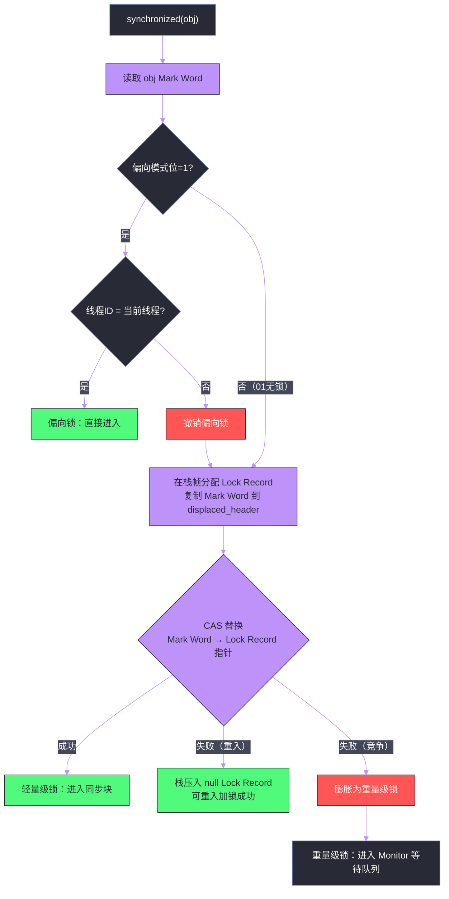

# 04 synchronized 的锁升级——偏向锁、轻量级锁与重量级锁

**摘要：**

`synchronized` 是 Java 最基础的同步原语，诞生之初就背负着"慢"的骂名——因为早期实现直接使用操作系统的互斥量（Mutex），每次加锁解锁都涉及用户态到内核态的切换，代价极高。JDK 6 引入了一套精妙的**锁升级（Lock Escalation）** 机制：从无锁状态出发，经过偏向锁、轻量级锁，最终升级到重量级锁——每个阶段都针对不同的竞争程度进行了专门优化，让 `synchronized` 在低竞争场景下的性能接近无锁代码。本文从 Java 对象头（Object Header）的 **Mark Word** 位布局出发，深入剖析每种锁状态的数据结构、加锁/解锁流程、状态转换条件，以及 JDK 15 废弃偏向锁的深层原因。

---

## 第 1 章 synchronized 的历史与优化动机

### 1.1 早期 synchronized 的性能问题

`synchronized` 最初的实现非常直接：每个 Java 对象关联一个操作系统互斥量（OS Mutex，在 Linux 上是 `pthread_mutex`），加锁就是调用 `pthread_mutex_lock()`，解锁就是调用 `pthread_mutex_unlock()`。

操作系统互斥量的问题在于：它的实现需要陷入内核——当线程尝试获取一个被其他线程持有的锁时，OS 会将当前线程挂起（从用户态切换到内核态，把线程从运行队列移到等待队列），锁释放后再唤醒（从内核态切回用户态）。这个用户态/内核态切换的代价在 x86 上大约需要 1000-3000 个 CPU 周期。

但现实中，很多 `synchronized` 块的执行时间本身可能只有几十个周期。为了保护一个"执行 5 个周期的临界区"而付出 2000 个周期的锁开销——这显然是严重的过度设计。

更深刻的洞察是：在绝大多数实际程序中，**大多数锁根本不存在竞争**。研究表明，超过 90% 的 `synchronized` 操作在运行时从未被多个线程同时争抢；其中很大比例的锁在整个生命周期中只被**同一个线程**反复获取。针对"无竞争"这一主流场景进行优化，是锁升级机制设计的核心出发点。

### 1.2 Hotspot 的三阶段锁优化策略

JDK 6 在 HotSpot JVM 中引入了三阶段锁优化策略，应对不同竞争强度的场景：

| 锁状态 | 适用场景 | 实现机制 | 加锁代价 |
| :--- | :--- | :--- | :--- |
| **偏向锁** | 只有一个线程访问 | Mark Word 存线程 ID + CAS | ~几个 CPU 周期 |
| **轻量级锁** | 多线程交替访问（无实际竞争） | CAS 将 Mark Word 指向栈帧 | ~几十个 CPU 周期 |
| **重量级锁** | 多线程真实竞争 | OS Mutex + Monitor 对象 | ~数千个 CPU 周期 |

锁只能从低级别升级到高级别（**锁升级是单向的**），不能降级（有一个例外：JDK 有一个实验性的偏向锁撤销批量降级机制，但这不是通用路径）。

---

## 第 2 章 Java 对象头与 Mark Word

### 2.1 对象在内存中的布局

理解锁升级，必须先理解 Java 对象的内存布局。每个 Java 对象在堆内存中由三部分组成：

```
┌─────────────────────────────────────────────┐
│               Object Header（对象头）          │
│  ┌────────────────────────────────────────┐  │
│  │  Mark Word（64 位 JVM 上占 8 字节）     │  │  ← 存储锁信息
│  │  Klass Pointer（4 或 8 字节）           │  │  ← 指向类元数据
│  └────────────────────────────────────────┘  │
├─────────────────────────────────────────────┤
│           Instance Data（实例数据）            │  ← 字段值
├─────────────────────────────────────────────┤
│            Padding（对齐填充）                 │  ← 保证对象大小是 8 字节的倍数
└─────────────────────────────────────────────┘
```

其中，**Mark Word** 是锁升级机制的核心数据结构。在 64 位 JVM 中，Mark Word 占 8 字节（64 位），它的内容根据对象的当前锁状态动态变化，存储了 HashCode、GC 年龄、锁标志位等信息。

### 2.2 Mark Word 的位布局

64 位 HotSpot JVM 中，Mark Word 在不同锁状态下的位布局如下：

```
无锁状态（biasable 状态，即"可偏向但尚未偏向"）：
┌───────────────────────────────────────────────┬──────┬──┬──┐
│              unused（25 位）                   │ age  │1 │01│
└───────────────────────────────────────────────┴──────┴──┴──┘
  [63:39]                                        [8:4] [3] [1:0]
  注：age = GC 分代年龄（4 bit），最低两位 01 = 可偏向/偏向锁

偏向锁状态（已偏向某线程）：
┌────────────────────────────────────┬──────┬──┬──┐
│          ThreadID（54 位）+ epoch   │ age  │1 │01│
└────────────────────────────────────┴──────┴──┴──┘
  [63:10]: 54 位线程 ID + 2 位 epoch（偏向纪元，防止批量重偏向后混淆）

轻量级锁状态：
┌───────────────────────────────────────────────┬──┐
│       指向线程栈帧中 Lock Record 的指针（62 位）  │00│
└───────────────────────────────────────────────┴──┘

重量级锁状态：
┌───────────────────────────────────────────────┬──┐
│       指向 Monitor 对象的指针（62 位）            │10│
└───────────────────────────────────────────────┴──┘

GC 标记状态（被 GC 标记）：
┌───────────────────────────────────────────────┬──┐
│                   空（62 位）                   │11│
└───────────────────────────────────────────────┴──┘
```

最低两位（第 0-1 位）是**锁标志位（lock bits）**，第 2 位是**偏向模式位（biased_lock bit）**，它们的组合决定了当前的锁状态：

| 锁标志位 [1:0] | 偏向模式位 [2] | 锁状态 |
| :--- | :--- | :--- |
| `01` | `0` | 无锁（不可偏向） |
| `01` | `1` | 偏向锁（或可偏向未锁定） |
| `00` | - | 轻量级锁 |
| `10` | - | 重量级锁 |
| `11` | - | GC 标记 |

---

## 第 3 章 偏向锁——为"从不竞争"场景优化

### 3.1 偏向锁的设计动机

偏向锁（Biased Locking）的核心洞察是：在许多程序中，同步块在其整个生命周期中只被同一个线程访问。例如，一个在单线程方法中使用的 `ArrayList`（它的内部操作是 `synchronized` 的），或者一个创建后只在一个线程中使用的对象。

对于这类场景，每次加锁/解锁都需要 CAS 操作也是多余的——能不能让"重复获取同一把锁"完全不付出任何原子操作的代价？偏向锁的答案是：把线程 ID 直接写入对象头，再次加锁时只需比较线程 ID，不需要 CAS。

### 3.2 偏向锁的加锁流程

**初始状态**：对象刚分配时，如果 JVM 开启了偏向锁（JDK 6-14 默认开启，JDK 15 废弃），Mark Word 的偏向模式位为 `1`，线程 ID 字段为 0（表示"可偏向但尚未偏向任何线程"）。

**第一次加锁（建立偏向）**：

线程 A 执行 `synchronized(obj)` 时：

1. 读取 `obj` 的 Mark Word
2. 检查偏向模式位：是 `1`（可偏向）
3. 检查线程 ID 字段：是 `0`（未偏向任何线程）
4. 执行 CAS：尝试将 Mark Word 中的线程 ID 字段从 `0` 替换为当前线程 ID
5. CAS 成功：偏向锁建立，Mark Word 中的线程 ID 现在指向线程 A

**重复加锁（偏向状态下的快速路径）**：

线程 A 再次执行 `synchronized(obj)` 时：

1. 读取 `obj` 的 Mark Word
2. 检查偏向模式位：是 `1`
3. 检查线程 ID：是当前线程 A 的 ID ✓
4. **直接进入同步块，无需任何 CAS 或内存屏障**

这就是偏向锁的魔法：第一次加锁只需一次 CAS，后续无论多少次重复加锁，都是纯粹的读操作（比较线程 ID），代价极小。

### 3.3 偏向锁的解锁

偏向锁的解锁极为廉价——**什么都不做**。线程 A 退出同步块时，Mark Word 中的线程 ID 仍然保留着线程 A 的 ID。下次线程 A 再加锁时，直接检查 ID 匹配就可以了。

这种"解锁不清除 ID"的设计是有意为之的——目的就是让同一线程的重复加锁完全无开销。

### 3.4 偏向锁的撤销（Revocation）

当另一个线程尝试获取一个已被偏向的锁时，偏向锁必须被**撤销（Revoke）**。撤销过程是偏向锁最昂贵的操作：

1. 等待全局**安全点（SafePoint）**——这是 JVM 中所有 Java 线程都暂停执行的时刻（Stop-The-World 的子集）
2. 暂停持有偏向锁的线程（线程 A）
3. 检查线程 A 是否还在同步块中（遍历线程 A 的栈帧）
4. 如果线程 A 已经不在同步块中：将锁状态升级为**轻量级锁**或恢复为**无锁**（取决于是否还有其他线程在竞争）
5. 如果线程 A 还在同步块中：将锁升级为**轻量级锁**，恢复线程 A 继续执行

撤销需要在 SafePoint 进行，是因为需要遍历线程的栈帧来检查锁状态，这个操作在线程正在运行时不安全（栈帧可能随时变化）。

### 3.5 批量重偏向与批量撤销

如果一个类的对象频繁发生偏向锁撤销（比如，一个对象先在线程 A 中使用，之后被传给线程 B 使用），JVM 会进行**批量操作**来减少 SafePoint 的次数：

**批量重偏向（Bulk Rebiasing）**：当同一个类的对象撤销偏向锁的次数超过 **BiasedLockingBulkRebiasThreshold**（默认 20）时，JVM 认为"这个类的对象更倾向于被多个线程使用，但大概率是交替而非竞争"，于是将该类的所有实例的偏向锁批量重偏向到当前线程。

**批量撤销（Bulk Revocation）**：当同一个类的撤销次数超过 **BiasedLockingBulkRevokeThreshold**（默认 40）时，JVM 认为"这个类的对象存在真实竞争，偏向锁对它没有意义"，于是将这个类的偏向锁机制彻底关闭，后续该类的所有对象直接以轻量级锁或重量级锁运行，不再尝试偏向。

### 3.6 为什么 JDK 15 废弃了偏向锁

JDK 15（JEP 374）将偏向锁标记为废弃（Deprecated），JDK 18 正式移除。原因是多方面的：

**第一，偏向锁的维护成本越来越高**。HotSpot JVM 中偏向锁相关的代码非常复杂，涉及 SafePoint 的交互、批量操作、多种特殊情况处理，这部分代码是历史上 JVM Bug 的高发区。

**第二，现代硬件上 CAS 的代价大幅降低**。偏向锁被设计出来的年代（2006 年左右），x86 的 `CMPXCHG` 指令代价相对较高。现代 CPU 上，CAS 在无竞争情况下的代价只有约 5-10 个周期，与偏向锁的简单线程 ID 比较相差无几。

**第三，JDK 的标准库已大量"去 synchronized 化"**。JDK 9 及之后，`ArrayList`、`HashMap` 等核心集合类的内部操作不再使用 `synchronized`（而是用更轻量的 CAS 或根本不同步）。以前偏向锁最大的"受益者"（那些在单线程中使用同步集合的场景）已经大幅减少。

**第四，偏向锁在高竞争场景下反而有害**。每次偏向锁撤销都需要 SafePoint，而大量并发撤销会导致频繁的 Stop-The-World 停顿，对低延迟系统造成严重影响。

---

## 第 4 章 轻量级锁——为"交替访问"场景优化

### 4.1 轻量级锁的设计动机

轻量级锁（Lightweight Locking）针对的场景是：多个线程交替访问同一个同步块，但**不会真正同时竞争**。例如，两个线程轮流执行一个任务，每次只有一个线程在运行，但不是同一个线程始终持有锁。

对于这类"有竞争但不同时"的场景，偏向锁不合适（因为锁会在线程间频繁转让），重量级锁过重（没有真正的等待，不需要阻塞）。轻量级锁的方案是：用 CAS 操作来加锁/解锁，如果 CAS 成功（没有竞争），则操作成功；如果 CAS 失败（有竞争），则升级为重量级锁。

### 4.2 Lock Record：轻量级锁的核心数据结构

轻量级锁的实现依赖于线程栈帧中的 **Lock Record**（锁记录）数据结构。

当线程尝试获取轻量级锁时，JVM 在**当前线程的栈帧**中分配一个 Lock Record：

```
线程 A 的栈：
┌────────────────────────────────────────────────┐
│  synchronized(obj) 方法的栈帧                   │
│  ┌──────────────────────────────────────────┐  │
│  │  Lock Record                             │  │
│  │  displaced_header: [obj 的原始 Mark Word]│  │  ← 保存 obj 的无锁 Mark Word
│  │  obj_ptr:         [指向 obj 的指针]       │  │
│  └──────────────────────────────────────────┘  │
│  ... 其他局部变量 ...                           │
└────────────────────────────────────────────────┘
```

### 4.3 轻量级锁的加锁流程

1. **检查锁状态**：读取 `obj` 的 Mark Word，检查最低两位是否为 `01`（无锁状态）
2. **在栈帧中分配 Lock Record**：将 `obj` 的当前 Mark Word（无锁状态的 Mark Word，包含 HashCode、GC 年龄等信息）复制到 Lock Record 的 `displaced_header` 字段中
3. **CAS 替换 Mark Word**：用 CAS 尝试将 `obj` 的 Mark Word 替换为"指向当前线程 Lock Record 的指针"（最低两位变为 `00`，表示轻量级锁状态）
4. **CAS 成功**：加锁成功，`obj` 的 Mark Word 现在指向当前线程栈帧中的 Lock Record
5. **CAS 失败**：
   - 如果失败原因是 `obj` 的 Mark Word 已经指向当前线程的栈区（说明是可重入锁，当前线程再次加锁）：在栈帧中再压入一个 Lock Record，`displaced_header` 设为 `null`（表示可重入），成功
   - 如果失败原因是其他线程已经持有轻量级锁（真实竞争）：升级为重量级锁



### 4.4 轻量级锁的解锁流程

1. **检查可重入**：如果当前线程的栈帧顶部的 Lock Record 的 `displaced_header` 为 `null`，说明是可重入加锁，直接弹出这个 Lock Record，退出
2. **CAS 恢复 Mark Word**：用 CAS 将 `obj` 的 Mark Word 从"指向 Lock Record 的指针"替换回 Lock Record 中保存的 `displaced_header`（无锁状态的 Mark Word）
3. **CAS 成功**：解锁成功，`obj` 恢复为无锁状态
4. **CAS 失败**：说明在持有轻量级锁期间，有其他线程尝试加锁，锁已经被膨胀为重量级锁，需要走重量级锁的解锁路径（唤醒等待线程）

---

## 第 5 章 重量级锁与 Monitor 机制

### 5.1 Monitor 的数据结构

重量级锁（Heavyweight Lock）是 `synchronized` 的最终形态，基于操作系统的互斥量实现，通过 JVM 中的 **Monitor 对象**（也叫 ObjectMonitor）来管理。

每个 Java 对象在升级为重量级锁时，JVM 会创建一个与之关联的 `ObjectMonitor` 对象，Mark Word 中的指针指向这个 Monitor：

```java
// ObjectMonitor 的核心结构（简化版）
class ObjectMonitor {
    volatile void* _owner;          // 当前持有锁的线程
    volatile jlong _count;          // 锁的重入计数
    volatile jlong _waiters;        // 等待（wait）的线程数
    volatile jint  _recursions;     // 可重入次数
    
    ObjectWaiter* _EntryList;       // 等待获取锁的线程队列（阻塞队列）
    ObjectWaiter* _cxq;             // 竞争队列（新来的线程先进 cxq，再转移到 EntryList）
    ObjectWaiter* _WaitSet;         // 调用了 Object.wait() 的线程等待集合
}
```

**关键区分**：`_EntryList` 和 `_WaitSet` 是两个完全不同的队列：

- **`_EntryList`（竞争队列）**：线程调用 `synchronized` 但锁被其他线程持有，线程被放入 EntryList 阻塞等待
- **`_WaitSet`（等待集合）**：线程已经持有锁，但调用了 `Object.wait()` 主动释放锁，等待被 `notify()`/`notifyAll()` 唤醒

### 5.2 Monitor 的加锁/解锁流程

**加锁（monitorenter 字节码）**：

1. 如果 `_owner` 为 null，用 CAS 将 `_owner` 设为当前线程，加锁成功
2. 如果 `_owner` 已经是当前线程（可重入），`_recursions` 加 1，加锁成功
3. 否则（其他线程持有锁），当前线程进入 `_cxq` 队列（竞争队列），然后调用 `park()`（类 Unix 系统上是 `pthread_cond_wait`）阻塞自己

**解锁（monitorexit 字节码）**：

1. 如果 `_recursions > 0`（可重入），`_recursions` 减 1，不真正释放锁
2. 否则，将 `_owner` 设为 null，然后根据策略从 `_EntryList` 或 `_cxq` 中选择一个等待线程，调用 `unpark()` 唤醒它

**Object.wait() 的流程**：

1. 当前线程持有锁，调用 `wait()`
2. 将当前线程的节点从 `_EntryList` 移到 `_WaitSet`
3. 释放锁（`_owner = null`，`_recursions = 0`）
4. 阻塞等待 `notify()`

**Object.notify() 的流程**：

1. 从 `_WaitSet` 中取出一个线程（FIFO 或其他策略）
2. 将该线程转移到 `_EntryList`（不是直接唤醒，而是让它重新竞争锁）
3. 该线程被 `unpark()` 唤醒后，重新尝试获取锁

### 5.3 Monitor 的内存可见性保证

`synchronized` 不只是互斥，它还提供了 [[线程安全问题/02 Java 内存模型（JMM）——happens-before 与可见性保证]] 中的监视器锁规则：**解锁 happens-before 后续的加锁**。

在 HotSpot 的实现中：

- **`monitorexit`（解锁）时**：相当于执行了 `StoreStore` + `StoreLoad` 屏障，将工作内存中的所有修改刷新到主内存
- **`monitorenter`（加锁）时**：相当于执行了 `LoadLoad` + `LoadStore` 屏障，清空本线程的缓存，强制后续读操作从主内存读取最新值

这就是为什么在 `synchronized` 块中修改了变量，退出 `synchronized` 块后，其他线程在获取同一个锁之后一定能看到这些修改——不需要把变量声明为 `volatile`。

---

## 第 6 章 自旋锁与自适应自旋

### 6.1 为什么需要自旋

从轻量级锁升级到重量级锁后，获取锁失败的线程必须挂起（`park()`）。线程挂起和唤醒需要 OS 介入，代价极高（涉及上下文切换，约 1000-5000 ns）。

但在很多情况下，锁的持有时间非常短——持有锁的线程可能在几十个纳秒内就会释放锁。如果在阻塞之前，先**自旋**（在 CPU 上循环等待）一段时间，可能在极短的时间内等到锁释放，完全避免了线程挂起和唤醒的代价。

### 6.2 自适应自旋（Adaptive Spinning）

JDK 6 引入了**自适应自旋**：JVM 会根据历史经验动态调整自旋等待的时间。

- 如果某个锁上一次自旋成功（没有超时就等到了锁），JVM 认为这次也很可能成功，会允许更长的自旋时间
- 如果某个锁上一次自旋失败（超时后还是没等到），JVM 认为持有时间长，自旋意义不大，会减少自旋时间甚至直接阻塞

这样，自旋时间根据锁的实际竞争情况动态调整，既避免了短暂竞争时不必要的线程挂起，又避免了长时间竞争时 CPU 被白白浪费在自旋上。

---

## 第 7 章 锁消除与锁粗化——JIT 的编译优化

### 7.1 锁消除（Lock Elimination）

JIT 编译器在逃逸分析的基础上，可以发现某些 `synchronized` 块保护的对象根本不会被其他线程访问——这时候锁就是多余的，JIT 会直接**消除这个锁**。

```java
public String concat(String a, String b) {
    StringBuffer sb = new StringBuffer();  // sb 是局部变量
    sb.append(a);   // StringBuffer.append 是 synchronized 的
    sb.append(b);
    return sb.toString();
}
```

`sb` 是方法内的局部变量，不会逃逸到方法外，其他线程不可能访问它。JIT 的逃逸分析会识别这一点，消除 `sb.append()` 上的 `synchronized`，让它们像普通方法一样执行。

### 7.2 锁粗化（Lock Coarsening）

如果 JIT 发现一系列连续的操作对同一个对象反复加锁和解锁，它会将这些锁合并为一次：

```java
// 源码：连续的多次加锁解锁
sb.append("a");    // 加锁 → 追加 → 解锁
sb.append("b");    // 加锁 → 追加 → 解锁
sb.append("c");    // 加锁 → 追加 → 解锁

// JIT 优化后：粗化为一次加锁解锁
// 加锁
sb.append("a");
sb.append("b");
sb.append("c");
// 解锁
```

这减少了加锁解锁的次数，尤其对于重量级锁场景有显著提升。

---

## 第 8 章 总结

`synchronized` 的锁升级机制是 JVM 工程中的杰作——它通过一套精巧的状态机，让同一个关键字在不同场景下自动选择最优实现：

| 场景 | 使用的锁 | 加锁代价 | 关键技术 |
| :--- | :--- | :--- | :--- |
| 同一线程反复访问 | 偏向锁 | ~几个周期（线程 ID 比较） | Mark Word 存线程 ID |
| 多线程交替访问 | 轻量级锁 | ~几十个周期（CAS） | 栈帧 Lock Record + CAS |
| 真实竞争 + 短临界区 | 自旋等待 | ~几百个周期（自旋 CPU） | 自适应自旋 |
| 真实竞争 + 长临界区 | 重量级锁 | ~几千个周期（OS 挂起） | Monitor + OS Mutex |

JDK 15 废弃偏向锁，是锁优化机制随着硬件发展和 JDK 自身演进做出的自我调整——现代 CPU 上 CAS 代价已经足够小，偏向锁带来的收益已不足以覆盖其维护复杂度和偶发的 SafePoint 开销。

下一篇 [[JUC工具/05 CAS 与原子类——Unsafe、AtomicInteger 到 LongAdder 的演进]] 将深入探讨 CAS 本身的实现原理，以及 JDK 在 CAS 基础上构建的原子类家族——这是轻量级锁的基础原语，也是无锁编程的核心工具。

---

## 参考文献

1. Kawachiya, Kiyokuni et al., "Lock Reservation: Java Locks Can Mostly Do Without Atomic Operations", OOPSLA 2002
2. Dice, Dave et al., "Thin Locks: Featherweight Synchronization for Java", PLDI 1998
3. HotSpot JVM Source Code: `src/hotspot/share/runtime/objectMonitor.cpp`
4. JEP 374: Disable and Deprecate Biased Locking, JDK 15
5. Goetz et al., "Java Concurrency in Practice", Ch.11: Performance and Scalability
6. Shipilev, Aleksey, "JVM Anatomy Quarks: Biased Locking", shipilev.net

---

> [!note] 思考题
> 1. 偏向锁的设计假设是'大多数锁只被一个线程持有'。当偏向锁被另一个线程竞争时，需要撤销偏向——这涉及到暂停持有偏向锁的线程（安全点操作）。JDK 15 默认禁用了偏向锁（`-XX:-UseBiasedLocking`），JDK 18 彻底移除。移除偏向锁的原因是什么？在 JDK 15+ 中，没有竞争的 `synchronized` 块使用什么级别的锁？
> 2. 轻量级锁通过 CAS 操作将 Mark Word 替换为指向栈帧中 Lock Record 的指针。如果 CAS 失败（说明有竞争），锁膨胀为重量级锁。重量级锁使用操作系统的 Mutex——线程阻塞和唤醒需要用户态/内核态切换。在一个'锁竞争短暂但频繁'的场景中（如计数器），轻量级锁不断膨胀为重量级锁再降级——这种'锁升降级震荡'是否存在？实际上锁能降级吗？
> 3. `synchronized` 的锁消除（Lock Elimination）是 JIT 编译器的优化——如果逃逸分析判断锁对象不会被其他线程访问，就消除锁操作。例如在方法内部创建的 `StringBuffer`（其方法是 `synchronized` 的）的锁可以被消除。锁消除在什么条件下不生效？如果锁对象通过方法参数传入（但实际上只有一个调用者），JIT 能做锁消除吗？
