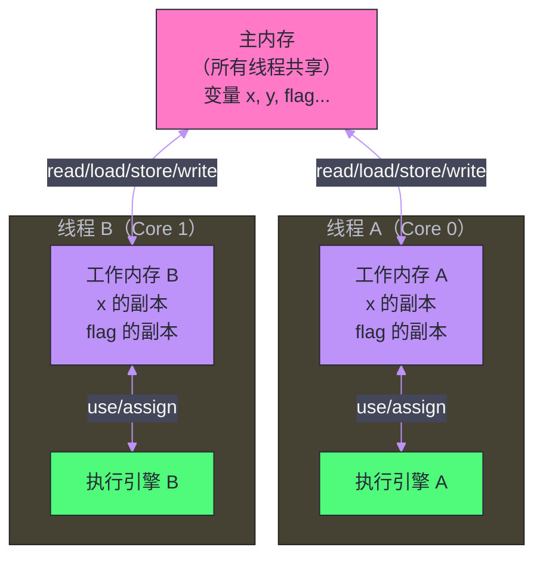

# 02 Java 内存模型（JMM）——happens-before 与可见性保证

**摘要：**

上一篇从硬件角度揭示了并发问题的根源：Store Buffer 和 Invalidate Queue 的异步化打破了写-读的顺序性保证。但 Java 工程师面对的不是汇编指令，而是高级语言——Java 需要一套与平台无关的规范，来精确描述"什么情况下，线程 A 的写操作对线程 B 可见"。这套规范就是 **Java 内存模型（JMM，Java Memory Model）**，由 JSR-133 在 JDK 5 中正式确立。本文深入剖析 JMM 的三个核心问题：**原子性、可见性、有序性**；精确定义 **happens-before** 的 8 条规则；解析 JMM 如何通过内存屏障与具体 CPU 架构对接；以及 JMM 与我们直觉之间的几个关键"陷阱"——正确理解 JMM 是理解后续所有并发工具（`volatile`、`synchronized`、`Lock`）的基础。

---

## 第 1 章 为什么需要 JMM

### 1.1 JMM 之前的混乱

在 JSR-133（JDK 5）之前，Java 1.0-1.4 有一个 JMM，但它有严重的缺陷。Doug Lea、Bill Pugh 等人花了多年时间研究发现：旧的 JMM 中，`final` 字段没有初始化安全保证、`volatile` 的语义不够强（不禁止所有类型的重排序）、双重检查锁定（DCL）在任何 JVM 上都不能安全使用。

更深层的问题是：Java 是"一次编写，到处运行"的语言，但"到处运行"的不同 CPU 架构有着截然不同的内存模型——x86 是强序（TSO），ARM 是弱序（允许大多数重排序），PowerPC 比 ARM 还要宽松。如果 JMM 不明确定义规则，JVM 实现者不知道该如何插入内存屏障；Java 程序员也无法推断自己写的并发代码在不同机器上是否正确。

这就是 JSR-133 要解决的问题：**制定一套精确的形式化规范，明确在 Java 程序中，线程间的共享内存操作应该遵循什么规则**。

### 1.2 JMM 的抽象模型

JMM 定义了一个抽象的内存模型，用于屏蔽各种硬件和操作系统的内存访问差异，实现 Java 程序在各种平台下都能达到一致的并发语义。

JMM 的核心抽象是**主内存（Main Memory）** 和**工作内存（Working Memory）**：

- **主内存**：所有线程共享的内存区域，存储所有 Java 变量（包括实例变量、静态变量、数组元素，但不包括局部变量和方法参数，后者是线程私有的）
- **工作内存**：每个线程私有的内存区域，保存线程用到的主内存变量的副本



**这个模型与硬件的对应关系**：JMM 的"主内存"大致对应物理上的主内存（DRAM）加上 L3 缓存；JMM 的"工作内存"大致对应 CPU 核心的 L1/L2 缓存和寄存器，以及 [[线程安全问题/01 并发编程的硬件基础——CPU 缓存、MESI 与内存屏障]] 中讨论的 Store Buffer。

> [!warning] 关键澄清
> JMM 是一套**规范（Specification）**，不是 JVM 的具体实现。它规定了"什么必须保证"，但不规定 JVM 具体如何实现。JVM 实现者可以在满足 JMM 规范的前提下，选择任何高效的实现方式。这是 JMM 相对于具体 CPU 架构的价值所在——它提供了一个统一的编程契约。

### 1.3 JMM 要解决的三个核心问题

理解 JMM，首先要明确它要解决的三个维度的问题：

**原子性（Atomicity）**：一个操作是否是不可分割的？`i++` 在 Java 中不是原子操作，它包含读取 `i`、加 1、写回三步，任何步骤之间都可能被线程切换打断。JMM 规定：对 `int`、`long` 等基本类型的单个读写操作是原子的（但 `long` 和 `double` 在 32 位 JVM 上可能是两次 32 位操作，存在撕裂风险，JMM 允许这种情况，但现代 64 位 JVM 都保证了原子性）。

**可见性（Visibility）**：当线程 A 修改了变量 `x`，线程 B 什么时候能看到这个修改？没有任何保证的情况下，答案是"不确定"——可能立刻看到，也可能永远看不到（`x` 一直待在 Core 0 的 L1 缓存中，从未刷新到主内存）。

**有序性（Ordering）**：编译器和处理器为了提高执行效率，可以对指令进行重排序，只要不改变**单线程程序**的执行结果（这是重排序的根本约束：**as-if-serial**）。但在多线程环境中，重排序可能导致对另一个线程产生意外的行为。

---

## 第 2 章 重排序的三个来源

在深入 JMM 规则之前，需要理解"重排序"的三个来源，因为 JMM 需要对抗的正是这三类重排序：

### 2.1 编译器优化重排序

Java 编译器（javac 和 JIT 编译器）可以在**不改变单线程程序语义**的前提下，改变语句的执行顺序。

```java
int a = 1;   // 语句 1
int b = 2;   // 语句 2
int c = a + b; // 语句 3
```

编译器可能将语句 1 和语句 2 重排序（都是独立的赋值，顺序不影响结果）。在单线程中完全正确，但如果另一个线程依赖 `a` 和 `b` 都被赋值后的状态，就可能出问题。

### 2.2 指令级并行重排序

现代 CPU 使用**流水线（Pipeline）** 和**乱序执行（Out-of-Order Execution）** 技术。CPU 不会严格按程序顺序执行指令，而是动态地调度指令执行顺序，以最大化各执行单元的利用率。

例如，当指令 A 等待内存操作完成时，CPU 可以先执行后面的独立指令 B、C、D，等 A 的结果回来后再继续。从单线程角度看，结果是正确的（硬件保证了 as-if-serial）。但从另一个线程的视角看，B、C、D 的结果先于 A "可见"了。

### 2.3 内存系统重排序

这是最微妙的一类，也是上一篇重点讨论的。Store Buffer 和 Invalidate Queue 的存在，使得即使 CPU 按程序顺序执行了写操作，对其他核心的**可见顺序**也可能与写操作的发生顺序不同。

这三类重排序的共同特点是：对单线程透明（单线程看到的结果永远正确），但对多线程有潜在危害。JMM 通过 **happens-before** 规则，精确定义了哪些情况下这三类重排序必须被禁止。

---

## 第 3 章 happens-before——JMM 的核心规则

### 3.1 happens-before 的精确定义

**happens-before** 是 JMM 中定义线程间操作可见性的核心工具。它的精确定义是：

> 如果操作 A happens-before 操作 B，那么操作 A 的结果对操作 B 可见，且操作 A 的执行顺序排在操作 B 之前。

注意几个关键点：

**第一，happens-before 是一种"可见性保证"，不是时间顺序**。happens-before 说的是"A 的写结果，B 能看到"，而不一定是"A 在时间上先于 B 完成"。当然，在通常情况下两者是一致的，但 happens-before 的严格定义只关心可见性，不关心物理时间顺序。

**第二，happens-before 是可传递的**。如果 A happens-before B，B happens-before C，那么 A happens-before C。这使得 happens-before 链可以跨越多个操作延伸。

**第三，happens-before 不要求操作一定按这个顺序执行**。JMM 允许在不破坏 happens-before 关系的前提下，对操作进行重排序——只要最终的执行结果与 happens-before 所要求的可见性一致即可。这给了 JVM 和编译器足够的优化空间。

### 3.2 happens-before 的 8 条规则

JSR-133 定义了以下 8 条 happens-before 规则，它们是所有 Java 并发保证的基础：

---

**规则 1：程序顺序规则（Program Order Rule）**

> 在一个线程内，按照代码顺序，书写在前面的操作 happens-before 书写在后面的操作。

```java
int a = 1;        // 操作 A
int b = a + 1;    // 操作 B
```

操作 A happens-before 操作 B，因此操作 B 一定能看到操作 A 写入的 `a=1`。

这条规则保证了**单线程内的程序语义**，即 as-if-serial 在 happens-before 框架中的体现。注意：这条规则只对**同一线程内**有效，两个不同线程的操作没有默认的 happens-before 关系。

---

**规则 2：监视器锁规则（Monitor Lock Rule）**

> 对一个锁的解锁（unlock）happens-before 随后对这个锁的加锁（lock）。

```java
synchronized (lock) {
    x = 1;      // A：在锁内写入 x
}               // B：解锁

// 另一个线程
synchronized (lock) {  // C：加锁（在 B 之后）
    int r = x;  // D：读取 x，保证看到 A 写入的 x=1
}
```

B happens-before C（锁规则），A happens-before B（程序顺序规则），C happens-before D（程序顺序规则），由传递性：A happens-before D。因此 D 一定能看到 A 写入的 `x=1`。

这就是 `synchronized` 保证可见性的根本原因：解锁操作会把工作内存中的写入刷新到主内存（对应 StoreStore + StoreLoad 屏障），而加锁操作会使本线程的工作内存失效，强制从主内存重新加载（对应 LoadLoad + LoadStore 屏障）。

---

**规则 3：volatile 变量规则（Volatile Variable Rule）**

> 对一个 `volatile` 变量的写操作 happens-before 后续对这个变量的读操作。

```java
volatile boolean flag = false;
volatile int data = 0;

// 线程 A
data = 42;      // A：普通写
flag = true;    // B：volatile 写

// 线程 B
while (!flag) {}  // C：volatile 读，看到 flag=true
int r = data;     // D：读取 data
```

B happens-before C（volatile 规则），A happens-before B（程序顺序规则），C happens-before D（程序顺序规则），由传递性：A happens-before D。

所以线程 B 读到 `flag=true` 之后，**一定**能读到 `data=42`，即使 `data` 不是 `volatile` 的。

这是 `volatile` 在实践中非常重要的一个用法：`volatile` 变量作为"哨兵"，通过 happens-before 的传递性，间接保证了其他普通变量的可见性。

---

**规则 4：线程启动规则（Thread Start Rule）**

> Thread 对象的 `start()` 方法 happens-before 此线程的每一个动作。

```java
int x = 1;               // A：主线程写 x
Thread t = new Thread(() -> {
    int r = x;           // B：子线程读 x
});
t.start();               // C：启动子线程（C happens-before B）
// A happens-before C（程序顺序），C happens-before B（线程启动规则）
// 所以 A happens-before B，子线程一定能看到 x=1
```

这条规则保证了：在 `start()` 之前，主线程对共享变量的所有修改，在子线程启动后都对子线程可见，无需任何额外的同步。

---

**规则 5：线程终止规则（Thread Termination Rule）**

> 线程中的每个动作都 happens-before 对此线程的 `join()` 返回。

```java
Thread t = new Thread(() -> {
    x = 42;             // A：子线程写 x
});
t.start();
t.join();               // B：等待子线程结束（A happens-before join()返回）
int r = x;              // C：主线程读 x，一定能看到 x=42
```

没有 `join()` 的情况下，主线程读取 `x` 时子线程可能还没写完，或写完但没有刷新到主内存。`join()` 通过 happens-before 保证了子线程所有操作对主线程可见。

---

**规则 6：线程中断规则（Thread Interruption Rule）**

> 对线程 `interrupt()` 方法的调用 happens-before 被中断线程的代码检测到中断事件。

线程调用 `Thread.interrupt()` 的操作，happens-before 被中断线程通过 `Thread.interrupted()` 或 `isInterrupted()` 检测到中断信号。这保证了中断信号的可见性。

---

**规则 7：对象终结规则（Finalizer Rule）**

> 一个对象的初始化完成（构造函数执行结束）happens-before 它的 `finalize()` 方法的开始。

对象的构造函数中的操作，保证在 `finalize()` 执行之前对 `finalize()` 可见。这是 `final` 字段安全性保证的基础之一。

---

**规则 8：传递性规则（Transitivity）**

> 如果 A happens-before B，且 B happens-before C，那么 A happens-before C。

这条规则是最重要的"粘合剂"——它允许我们通过 happens-before 链将多个操作连接起来，推导出复杂场景下的可见性保证。前面的很多例子已经用到了传递性。

---

### 3.3 happens-before 规则汇总

| 规则 | 触发条件 | 保证内容 |
| :--- | :--- | :--- |
| **程序顺序规则** | 同一线程内 | 前面的操作 happens-before 后面的操作 |
| **监视器锁规则** | `synchronized` | unlock happens-before 后续的 lock |
| **volatile 规则** | `volatile` 变量 | volatile 写 happens-before 后续的 volatile 读 |
| **线程启动规则** | `Thread.start()` | start() happens-before 子线程的所有动作 |
| **线程终止规则** | `Thread.join()` | 子线程所有动作 happens-before join() 返回 |
| **线程中断规则** | `Thread.interrupt()` | interrupt() happens-before 被中断线程检测到中断 |
| **对象终结规则** | 对象构造/GC | 构造完成 happens-before finalize() |
| **传递性** | 链式推导 | A hb B, B hb C → A hb C |

---

## 第 4 章 as-if-serial 与 JMM 的辩证关系

### 4.1 as-if-serial：重排序的边界

**as-if-serial** 是单线程程序的语义保证：无论编译器和 CPU 如何重排序，**对于单线程程序**，执行结果必须与按程序顺序串行执行的结果相同。

as-if-serial 给了编译器和 CPU 在单线程内自由重排序的权力，只要不影响可观测的结果（对内存的读写顺序，从当前线程的视角）。

```java
int a = 1;     // 语句 1
int b = 2;     // 语句 2
int c = a + b; // 语句 3（依赖 a 和 b）
```

语句 1 和 2 可以重排序（对语句 3 的结果没影响），但语句 3 不能移到语句 1 或 2 之前（会影响结果）。

### 4.2 JMM 与 as-if-serial 的关系

JMM 是 as-if-serial 在多线程场景下的扩展：

- **as-if-serial**：保证单线程内的有序性，允许单线程内的重排序（不影响单线程结果）
- **JMM（happens-before）**：保证多线程间的可见性和有序性，允许在不破坏 happens-before 的前提下进行重排序

两者的核心共同点是：**允许重排序，但有边界**。JMM 的 happens-before 规则就是多线程场景下的边界——只要不违反 happens-before，JVM 可以自由优化。

这个设计的精妙之处在于：它不要求 JVM 对所有内存操作都保守地不重排序（那会极大影响性能），而是精确定义了哪些操作之间**必须**有顺序，让 JVM 在安全的范围内最大化优化。

### 4.3 JMM 的实现：内存屏障

JMM 的保证最终落地在 JVM 生成的机器码中，具体体现为在关键位置插入内存屏障。不同操作对应的屏障策略（以 HotSpot JVM 的 x86 实现为参考）：

**对于 `volatile` 写（v = 42）**：

```
StoreStore 屏障     <- 禁止前面的普通写与本次 volatile 写重排序
volatile 写操作
StoreLoad 屏障      <- 禁止本次 volatile 写与后续的读操作重排序（最昂贵的屏障）
```

**对于 `volatile` 读（int r = v）**：

```
volatile 读操作
LoadLoad 屏障       <- 禁止本次 volatile 读与后续的普通读重排序
LoadStore 屏障      <- 禁止本次 volatile 读与后续的普通写重排序
```

**为什么 `volatile` 写后要插 StoreLoad 屏障（而不是读前）？**

这是一个关键的设计选择。StoreLoad 屏障是最贵的屏障（需要排空 Store Buffer 并等待确认），在写后插还是读前插决定了"谁付出性能代价"。

JMM 的选择是在写后插——每次 `volatile` 写都付出 StoreLoad 的代价，而不是每次 `volatile` 读都付出。这个选择基于一个判断：通常情况下，一个 `volatile` 变量被写的次数远少于被读的次数（比如一个 `volatile boolean` 的 flag，只在程序初始化时写一次，但可能被多个线程频繁读取）。把代价放在更少发生的操作上，整体性能更优。

---

## 第 5 章 JMM 中的几个重要陷阱

### 5.1 陷阱一：happens-before 不等于"A 一定先于 B 执行"

一个常见的误解是把 happens-before 理解为时间上的先后顺序。实际上，happens-before 只保证可见性——A happens-before B，意味着"如果 B 能看到 A 写的值"，但不意味着"A 一定在 B 之前在 CPU 上执行"。

在某些实现中，A 和 B 可能真的并发执行，但 JMM 保证 B 一定能读到 A 写入的值（通过内存屏障的刷新机制）。两者可以在时间上重叠，关键是可见性得到了保证。

### 5.2 陷阱二：volatile 不保证复合操作的原子性

`volatile` 保证单次读写的可见性，但不保证复合操作（如 `i++`）的原子性。

```java
volatile int i = 0;

// 线程 A 和线程 B 同时执行：
i++;  // 等价于 int tmp = i; tmp++; i = tmp;
      // volatile 保证每次读到最新值，写操作对其他线程立即可见
      // 但读-加-写三步之间没有原子性保证！
```

线程 A 读到 `i=0`，线程 B 也读到 `i=0`，两者都加 1 写回 `1`——结果是 `1` 而不是 `2`。

需要原子的复合操作，应该使用 `AtomicInteger` 或 `synchronized`。

### 5.3 陷阱三：正确理解 volatile 的 happens-before 传递链

`volatile` 规则是：**volatile 写 happens-before 后续的 volatile 读**。注意"后续"是什么意思——是在 happens-before 关系上，读操作在写操作之后，而不是简单的时间先后。

```java
volatile boolean flag = false;
int data = 0;

// 线程 A
data = 42;     // 1
flag = true;   // 2（volatile 写）

// 线程 B
if (flag) {    // 3（volatile 读，假设读到 true）
    use(data); // 4
}
```

正确推导：
- 1 happens-before 2（程序顺序规则）
- 2 happens-before 3（volatile 规则，前提：3 读到了 2 写入的 `true`）
- 3 happens-before 4（程序顺序规则）
- 传递性：1 happens-before 4

所以 4 能看到 `data=42`。

**关键前提**：volatile 规则生效的前提是"后续的 volatile 读实际上读到了 volatile 写写入的值"。如果线程 B 读 `flag` 时读到的是初始值 `false`（即线程 B 的读在线程 A 的写之前发生），那么这条 happens-before 链就不成立，线程 B 也不会执行 `use(data)`。

这完全合理——线程 B 没有进入 `if` 块，自然也不需要看到 `data=42`。

### 5.4 陷阱四：DCL 单例模式必须使用 volatile

双重检查锁定（Double-Checked Locking, DCL）是最著名的 JMM 陷阱之一。

```java
// 错误版本（JDK 5 之前完全不安全，JDK 5+ 在某些架构上仍有问题）
class Singleton {
    private static Singleton instance;
    
    public static Singleton getInstance() {
        if (instance == null) {           // 第一次检查（无锁）
            synchronized (Singleton.class) {
                if (instance == null) {   // 第二次检查（加锁）
                    instance = new Singleton();  // 问题所在！
                }
            }
        }
        return instance;
    }
}
```

`instance = new Singleton()` 在字节码层面分三步：
1. 分配内存空间
2. 初始化对象（调用构造函数，设置字段值）
3. 将 `instance` 引用指向分配的内存空间

JVM 可以将步骤 2 和 3 重排序（步骤 1 和 3 的重排序在某些架构上也是允许的）。重排序后变为：1 → 3 → 2，即先让 `instance` 指向内存，再初始化对象。

当线程 A 完成步骤 3 但尚未完成步骤 2 时，线程 B 进入第一次检查，看到 `instance != null`（已经指向内存，但对象尚未初始化），直接返回——线程 B 拿到了一个**半初始化的对象**！

**正确版本（使用 volatile）**：

```java
class Singleton {
    private static volatile Singleton instance;  // 加 volatile
    
    public static Singleton getInstance() {
        if (instance == null) {
            synchronized (Singleton.class) {
                if (instance == null) {
                    instance = new Singleton();
                }
            }
        }
        return instance;
    }
}
```

`volatile` 在这里的作用：volatile 写会插入 StoreStore 屏障（禁止步骤 2 和 3 的重排序）和 StoreLoad 屏障（让 volatile 读后的操作看到最新值）。这样，当线程 B 读到 `instance != null` 时，对象一定已经完全初始化。

> [!warning] 生产避坑
> DCL 模式只在 JDK 5+（JSR-133 重新定义 volatile 语义之后）的配合 `volatile` 使用才是安全的。在 JDK 5 之前，即使加了 volatile，也无法完全保证安全（因为旧版 JMM 的 volatile 语义较弱）。现代 Java 代码中，更推荐使用 **静态内部类（Holder）** 模式或**枚举单例**，完全不需要手动处理同步：
> ```java
> class Singleton {
>     private static class Holder {
>         static final Singleton INSTANCE = new Singleton();
>     }
>     public static Singleton getInstance() {
>         return Holder.INSTANCE;
>     }
> }
> ```
> 类加载机制保证了 `Holder.INSTANCE` 的初始化是线程安全的，且只初始化一次。

### 5.5 陷阱五：final 字段的安全发布

`final` 字段有特殊的 JMM 保证：

> 一个对象的 `final` 字段，如果在构造函数中完成了初始化，那么在构造函数返回后，不需要任何额外同步，其他线程就能看到正确初始化的 `final` 字段值——前提是构造函数中不能有"this 引用逃逸"。

```java
class ImmutablePoint {
    final int x;
    final int y;
    
    ImmutablePoint(int x, int y) {
        this.x = x;
        this.y = y;
        // 不能在这里将 this 发布出去！
    }
}
```

JMM 在 `final` 字段的写操作后插入 StoreStore 屏障（禁止 `final` 字段的写操作与构造函数返回的操作重排序），保证了当其他线程看到这个对象的引用时，`final` 字段一定已经完全写入。

这就是为什么不可变对象（`final` 字段 + 无 this 逃逸）天然是线程安全的，不需要任何同步。

---

## 第 6 章 JMM 与 CPU 内存模型的映射

### 6.1 从 JMM 到具体 CPU 的屏障映射

JMM 定义了需要在哪里保证有序性，具体的内存屏障指令由 JVM 根据运行的 CPU 架构决定：

| JMM 操作 | x86 屏障 | ARM 屏障 | 说明 |
| :--- | :--- | :--- | :--- |
| `volatile` 写 | `MFENCE`（或 `LOCK ADD`） | `dmb ish` | 排空 Store Buffer |
| `volatile` 读 | （无需额外屏障，TSO 已保证） | `dmb ishld` | 处理 Invalidate Queue |
| `synchronized` 退出 | `MFENCE` | `stlr`（Store-Release） | 写回 + 排空 |
| `synchronized` 进入 | （无需额外屏障） | `ldar`（Load-Acquire） | 确保读到最新值 |

x86 上的 `volatile` 读不需要额外屏障，原因是 x86 的 TSO 模型本身就禁止了 Load-Load 和 Load-Store 重排序，`volatile` 读的语义在 x86 上是免费的。这也解释了为什么 `volatile` 在 x86 上的性能开销主要来自 `volatile` 写（需要 `MFENCE`），而 `volatile` 读几乎没有额外开销。

### 6.2 JMM 设计的工程权衡

JMM 的设计反映了一个核心工程权衡：**正确性 vs 性能**。

如果 JMM 要求所有内存操作都强制顺序（完全禁止重排序），Java 程序将失去大量编译器和 CPU 优化，性能可能下降数倍。

如果 JMM 什么都不保证（完全允许重排序），Java 程序员将无法写出正确的并发程序，即使写出来也只能在特定架构上正确。

JMM 选择的是"精确指定可见性保证的最小集合"：只在必要的地方（`volatile`、`synchronized`、线程创建/销毁等显式同步点）插入内存屏障，其他地方允许 JVM 和 CPU 自由优化。这个设计让 Java 在大多数情况下能接近 C++ 的性能，同时保持了跨平台的语义一致性。

---

## 第 7 章 总结

JMM 是 Java 并发体系的理论基石。核心要点：

**JMM 解决的三个问题**：原子性（基本类型读写是原子的，复合操作需要额外保证）、可见性（通过 happens-before 规则）、有序性（通过内存屏障禁止特定重排序）。

**happens-before 的 8 条规则**：程序顺序规则（单线程）、监视器锁规则（`synchronized`）、volatile 规则（`volatile`）、线程启动规则（`start()`）、线程终止规则（`join()`）、中断规则、终结规则、传递性——这 8 条规则构成了 Java 并发保证的完整基础。

**关键陷阱**：happens-before 不是时间顺序；`volatile` 不保证复合操作原子性；DCL 模式需要 `volatile`；`final` 字段有特殊的安全发布语义。

理解了 JMM，接下来的 [[volatile与内置锁/03 volatile 的实现原理——内存屏障与禁止重排序]] 将展示 `volatile` 如何在 JMM 框架下，通过具体的内存屏障插入策略实现可见性和有序性保证。

---

## 参考文献

1. JSR-133: Java Memory Model and Thread Specification Revision, 2004
2. Manson, Pugh, Adve, "The Java Memory Model", POPL 2005
3. Doug Lea, "The JSR-133 Cookbook for Compiler Writers", gee.cs.oswego.edu
4. Goetz et al., "Java Concurrency in Practice", Addison-Wesley, 2006
5. Shipilev, Aleksey, "Safe Publication and Safe Initialization in Java", shipilev.net, 2014
6. Preshing, Paul, "The Happens-Before Relation", preshing.com, 2013
