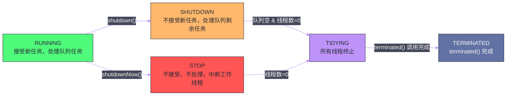

# 11 线程池（上）——ThreadPoolExecutor 的七大参数与执行流程

**摘要：**

线程的创建和销毁代价高昂——涉及操作系统内核调用、内存分配（默认栈 512KB~1MB）以及 JVM 内部数据结构的维护。在高并发场景下，如果每个任务都新建一个线程，系统会迅速被线程创建/销毁的开销淹没，甚至因线程数过多导致 OOM。**线程池（Thread Pool）** 通过预先创建并复用一组线程来解决这个问题。`ThreadPoolExecutor` 是 JDK 中最核心的线程池实现，理解它的七大构造参数、内部 `Worker` 的生命周期、`execute` 的三段式决策流程、以及 `ctl` 字段的高低位编码，是正确配置和使用线程池的必要前提。本文深入剖析这些细节，并通过对 `Executors` 工厂方法缺陷的分析，阐明为什么生产环境必须手动配置 `ThreadPoolExecutor`。

---

## 第 1 章 为什么需要线程池

### 1.1 直接创建线程的代价

```java
// 反面教材：每个请求创建新线程
public void handleRequest(Runnable task) {
    new Thread(task).start();  // 每次请求都创建新线程
}
```

这段代码在低并发场景下运行正常，但在高并发下会暴露以下问题：

**线程创建代价**：`new Thread()` 涉及操作系统层面的资源分配——为新线程分配线程栈（Linux 默认 8MB，JVM 通常通过 `-Xss` 限制到 512KB），注册到调度器，初始化 JVM 内部的 `java.lang.Thread` 对象。这个操作通常需要数百微秒，在高 QPS 场景下成为瓶颈。

**线程销毁代价**：线程执行完毕后的回收同样涉及内核调用，代价与创建相当。

**线程数量失控**：如果请求涌入速度远超处理速度，会持续创建新线程，直到 OOM（`java.lang.OutOfMemoryError: unable to create new native thread`）。Linux 系统单进程默认线程数限制约为 `ulimit -u` 所设值（通常数千），超过后无法继续创建。

**上下文切换代价**：线程数远超 CPU 核心数时，大量时间花在上下文切换上而非实际计算。一次上下文切换的代价约 1~10 微秒，但伴随的缓存失效可能让实际代价高 10 倍以上。

### 1.2 线程池的核心价值

线程池解决了上述问题，其核心思想是**资源复用**：

- **线程复用**：线程执行完一个任务后不销毁，而是回到池中等待下一个任务，避免反复创建/销毁的开销。
- **流量控制**：通过有界队列和拒绝策略，限制积压的任务数，防止无限创建线程导致 OOM。
- **线程管理**：统一管理线程的生命周期、监控线程数量和任务执行状态。

线程池的本质是一个**生产者-消费者模型**：提交任务的代码是生产者，池中的工作线程是消费者，`BlockingQueue` 是中间的缓冲队列（详见上篇 [[JUC工具/10 并发容器（下）——CopyOnWriteArrayList、BlockingQueue 家族]]）。

---

## 第 2 章 ThreadPoolExecutor 的七大参数

`ThreadPoolExecutor` 最完整的构造器接受 7 个参数：

```java
public ThreadPoolExecutor(
    int corePoolSize,                  // 核心线程数
    int maximumPoolSize,               // 最大线程数
    long keepAliveTime,                // 非核心线程空闲存活时间
    TimeUnit unit,                     // keepAliveTime 的时间单位
    BlockingQueue<Runnable> workQueue, // 工作队列
    ThreadFactory threadFactory,       // 线程工厂
    RejectedExecutionHandler handler   // 拒绝策略
)
```

这 7 个参数共同决定了线程池的行为，理解每个参数的语义和相互作用至关重要。

### 2.1 corePoolSize——核心线程数

**是什么**：线程池维持的"常驻线程"数量。即使这些线程处于空闲状态，也不会被回收（除非设置了 `allowCoreThreadTimeOut(true)`）。

**为什么需要它**：核心线程相当于线程池的"底线资源"，保证在任务到来时能立即开始处理，不需要等待新线程的创建。在没有任务时，核心线程可以休眠在 `workQueue.take()`（阻塞等待）上，不占用 CPU。

**配置原则**：
- **CPU 密集型任务**（大量计算，少量 IO）：`corePoolSize ≈ CPU 核心数 + 1`。加 1 是为了在偶发的缺页中断时有备用线程。
- **IO 密集型任务**（数据库查询、网络请求）：`corePoolSize ≈ CPU 核心数 × (1 + IO等待时间/CPU计算时间)`。如果 IO 等待时间是计算时间的 10 倍，可以设置 `corePoolSize ≈ CPU核心数 × 11`。
- **实际上**，这些公式只是起点，生产环境应通过压测和监控（队列长度、线程活跃数、任务延迟）来动态调整。

### 2.2 maximumPoolSize——最大线程数

**是什么**：线程池中允许创建的最大线程数（包括核心线程）。

**为什么需要它**：当任务突发涌入时，核心线程处理不过来，且队列也满了，此时需要临时增加线程来应对峰值。`maximumPoolSize` 是这个弹性扩容的上限。

**`maximumPoolSize - corePoolSize` = 可临时创建的非核心线程数**。这些非核心线程在空闲超过 `keepAliveTime` 后会被回收。

**配置原则**：
- `maximumPoolSize` 不应该设置为 `Integer.MAX_VALUE`——这意味着无限创建线程，等于放弃了流量控制（`Executors.newCachedThreadPool()` 就是这样配置的，这正是它的危险所在）。
- 合理的 `maximumPoolSize` 应该基于系统资源（CPU 核心数、可用内存）和业务 SLA 来设定。

### 2.3 keepAliveTime & unit——非核心线程存活时间

**是什么**：当线程池中的线程数超过 `corePoolSize` 时，多余的线程（非核心线程）在空闲超过 `keepAliveTime` 后会被终止。

**为什么需要它**：临时扩容的非核心线程在峰值过后应该被回收，避免长期占用系统资源。`keepAliveTime` 控制这个回收的时间窗口。

**注意**：默认情况下，`keepAliveTime` 仅针对非核心线程生效。调用 `allowCoreThreadTimeOut(true)` 后，核心线程在空闲超过 `keepAliveTime` 时也会被回收（适合任务稀少但对内存敏感的场景）。

### 2.4 workQueue——工作队列

工作队列是线程池的"缓冲区"，提交的任务在被工作线程处理前暂存于此。不同类型的队列对线程池行为影响巨大：

| 队列类型 | 特点 | 适用场景 |
| :--- | :--- | :--- |
| `ArrayBlockingQueue` | 有界，FIFO，数组实现 | 需要限制队列长度，防止 OOM |
| `LinkedBlockingQueue` | 可有界可无界，FIFO，链表实现 | 无界时任务永远不会被拒绝（有 OOM 风险！） |
| `SynchronousQueue` | 容量为 0，直接交接 | `CachedThreadPool`，任务直接交给工作线程 |
| `PriorityBlockingQueue` | 无界，按优先级出队 | 需要优先级调度的任务 |

> [!warning] 生产避坑
> `Executors.newFixedThreadPool(n)` 使用的是无界的 `LinkedBlockingQueue`——任务提交速率超过处理速率时，队列无限增长，最终 OOM。生产环境必须使用有界队列，并配合合理的拒绝策略。

### 2.5 threadFactory——线程工厂

**是什么**：用于创建新线程的工厂接口，允许自定义线程的属性（名称、优先级、是否守护线程等）。

**为什么需要它**：默认的 `Executors.defaultThreadFactory()` 创建的线程名是 `pool-N-thread-M`，在排查生产问题时（如线程 dump 分析）毫无意义。自定义 `ThreadFactory` 给线程起有意义的名字，是生产环境的基本要求。

**实际使用**：

```java
// Guava 的 ThreadFactoryBuilder（推荐）
ThreadFactory factory = new ThreadFactoryBuilder()
    .setNameFormat("order-handler-%d")  // 线程名：order-handler-0, order-handler-1, ...
    .setDaemon(false)                   // 非守护线程（JVM 不会因这类线程而延迟退出）
    .setUncaughtExceptionHandler((t, e) -> log.error("线程 {} 发生未捕获异常", t.getName(), e))
    .build();

// 手动实现
ThreadFactory factory = r -> {
    Thread t = new Thread(r, "order-handler-" + threadCount.getAndIncrement());
    t.setDaemon(false);
    return t;
};
```

### 2.6 handler——拒绝策略

当线程池无法接受新任务时（工作队列已满 **且** 线程数已达 `maximumPoolSize`），触发拒绝策略。JDK 提供了 4 种内置策略：

| 策略类 | 行为 | 适用场景 |
| :--- | :--- | :--- |
| `AbortPolicy`（默认） | 抛出 `RejectedExecutionException` | 需要调用方知道任务被拒绝 |
| `CallerRunsPolicy` | 由提交任务的线程直接执行该任务 | 流量回压（让调用方降速） |
| `DiscardPolicy` | 静默丢弃新任务 | 允许丢弃，且无需通知 |
| `DiscardOldestPolicy` | 丢弃队列中最老的任务，重新提交新任务 | 新任务比老任务优先级高 |

**`CallerRunsPolicy` 的背压机制**：当线程池和队列都满时，`CallerRunsPolicy` 让提交任务的调用方线程直接执行任务。这会占用调用方线程一段时间，使其无法继续提交新任务——天然地降低了提交速率，形成背压。这是最常用的拒绝策略，也是最符合流量控制需求的。

**自定义拒绝策略**：生产中通常需要自定义，如记录拒绝日志、将任务写入持久化队列（数据库/MQ）以便后续重试：

```java
RejectedExecutionHandler handler = (task, executor) -> {
    // 记录告警
    metrics.increment("thread_pool.rejected");
    log.warn("线程池任务被拒绝，队列大小: {}", executor.getQueue().size());
    // 尝试持久化任务
    persistTaskForRetry(task);
};
```

---

## 第 3 章 ThreadPoolExecutor 的内部状态：ctl 字段

### 3.1 ctl 的高低位编码

`ThreadPoolExecutor` 用一个 `AtomicInteger ctl` 字段同时编码两个信息：**线程池状态（runState）** 和 **工作线程数（workerCount）**：

```java
private final AtomicInteger ctl = new AtomicInteger(ctlOf(RUNNING, 0));
// ctl 的位布局（32位）：
// 高 3 位：runState（线程池状态）
// 低 29 位：workerCount（当前工作线程数，最大 2^29 - 1 ≈ 5 亿）

private static final int COUNT_BITS = Integer.SIZE - 3;  // 29
private static final int COUNT_MASK = (1 << COUNT_BITS) - 1;  // 0x1FFFFFFF

// 线程池的 5 种状态（高 3 位）
private static final int RUNNING    = -1 << COUNT_BITS;  // 111 00000...（接受新任务）
private static final int SHUTDOWN   =  0 << COUNT_BITS;  // 000 00000...（不接受新任务，处理队列剩余任务）
private static final int STOP       =  1 << COUNT_BITS;  // 001 00000...（不接受，不处理，中断工作线程）
private static final int TIDYING    =  2 << COUNT_BITS;  // 010 00000...（所有线程终止，准备调用 terminated()）
private static final int TERMINATED =  3 << COUNT_BITS;  // 011 00000...（terminated() 已调用）

// 提取 runState 和 workerCount
static int runStateOf(int c)     { return c & ~COUNT_MASK; }   // 高3位
static int workerCountOf(int c)  { return c & COUNT_MASK; }    // 低29位
static int ctlOf(int rs, int wc) { return rs | wc; }           // 合并
```

**为什么用一个字段编码两个信息？**

这与 [[JUC工具/08 读写锁与 StampedLock——从 ReentrantReadWriteLock 到乐观读]] 中 `ReentrantReadWriteLock` 的 `state` 高低位分割、[[JUC工具/09 并发容器（上）——ConcurrentHashMap 从 JDK7 到 JDK8 的重构]] 中 `sizeCtl` 的多语义复用是同一种设计思路：将两个相关的状态压缩到一个原子变量中，用一次 CAS 就能原子地同时更新两者，避免两个独立原子变量的更新出现中间不一致状态。

### 3.2 线程池的生命周期



**5 个状态的语义**：

- **RUNNING**：正常运行状态。接受新任务（`execute`/`submit`），同时处理队列中的积压任务。
- **SHUTDOWN**：调用 `shutdown()` 后进入。不再接受新任务（新任务直接触发拒绝策略），但会继续处理队列中已有的任务，直到队列清空。
- **STOP**：调用 `shutdownNow()` 后进入。不接受新任务，不处理队列中的任务，并向所有工作线程发送中断信号（`interrupt()`）。
- **TIDYING**：所有工作线程终止，`workerCount` 归零后，线程池自动过渡到此状态，准备调用 `terminated()` 钩子方法。
- **TERMINATED**：`terminated()` 调用完成，线程池彻底关闭。`awaitTermination()` 的等待线程被唤醒。

**`shutdown()` vs `shutdownNow()`**：

`shutdown()` 是"优雅停机"——等待队列中的所有任务执行完毕再关闭。适合大多数场景，确保任务不丢失。

`shutdownNow()` 是"强制停机"——立即中断所有线程，返回队列中未执行的任务列表。适合需要立即停止的场景（如应用关闭），但正在执行中的任务可能被中断（如果任务不响应中断信号，`shutdownNow()` 也无法真正终止它）。

---

## 第 4 章 execute() 的三段式决策流程

`execute(Runnable command)` 是线程池的核心入口，其逻辑分为三段：

```java
public void execute(Runnable command) {
    if (command == null) throw new NullPointerException();
    int c = ctl.get();
    
    // ====== 第一段：workerCount < corePoolSize，创建新核心线程 ======
    if (workerCountOf(c) < corePoolSize) {
        if (addWorker(command, true))   // true = 核心线程
            return;
        c = ctl.get();  // addWorker 失败（并发竞争），重读 ctl
    }
    
    // ====== 第二段：队列未满，加入工作队列 ======
    if (isRunning(c) && workQueue.offer(command)) {
        int recheck = ctl.get();
        // 双重检查：入队成功后，线程池可能已经 shutdown
        if (!isRunning(recheck) && remove(command))
            reject(command);   // 线程池已停，从队列移除并拒绝
        else if (workerCountOf(recheck) == 0)
            addWorker(null, false);  // 没有活跃线程，确保有线程来处理队列任务
    }
    
    // ====== 第三段：队列满了，尝试创建非核心线程 ======
    else if (!addWorker(command, false))  // false = 非核心线程
        reject(command);  // 创建失败（已达 maximumPoolSize），执行拒绝策略
}
```

**三段式决策的完整逻辑**：

```
提交新任务
    │
    ├─ workerCount < corePoolSize?
    │   ├─ YES → 创建新核心线程，直接执行任务 → 返回
    │   └─ NO ↓
    │
    ├─ 线程池 RUNNING 且 workQueue 未满?
    │   ├─ YES → 任务入队（offer）
    │   │         双重检查：线程池是否仍在运行？workerCount 是否 > 0？
    │   │         → 返回
    │   └─ NO ↓
    │
    └─ 创建非核心线程（workerCount < maximumPoolSize）?
        ├─ YES → 创建非核心线程，直接执行任务 → 返回
        └─ NO → 执行拒绝策略
```

**为什么优先入队而不是优先创建非核心线程？**

这是一个重要的设计选择：当核心线程都忙时，优先将任务放入队列等待，而不是立即扩容到非核心线程。原因是：扩容意味着更多并发线程，更多的上下文切换开销；队列中的任务在等待一小段时间后，核心线程就可以取走处理，往往不需要扩容。非核心线程的创建是"最后手段"——只有当连队列都满了时，才说明任务速率真的超过了核心线程的处理能力，需要临时扩容。

---

## 第 5 章 Worker 的生命周期

### 5.1 Worker 的数据结构

`Worker` 是 `ThreadPoolExecutor` 的内部类，它同时继承 `AbstractQueuedSynchronizer`（作为不可重入锁）和实现 `Runnable`：

```java
private final class Worker extends AbstractQueuedSynchronizer implements Runnable {
    final Thread thread;       // 与此 Worker 绑定的线程
    Runnable firstTask;        // Worker 的初始任务（可以为 null）
    volatile long completedTasks;  // 已完成的任务数
    
    Worker(Runnable firstTask) {
        setState(-1);  // 初始状态 -1，禁止在 runWorker 开始前被中断
        this.firstTask = firstTask;
        this.thread = getThreadFactory().newThread(this);  // 通过 ThreadFactory 创建线程
    }
    
    // Worker 作为 Runnable，当绑定的线程启动后，执行 runWorker(this)
    public void run() {
        runWorker(this);
    }
    
    // 不可重入锁语义（与 ReentrantLock 相比）：
    // tryAcquire 不检查当前线程是否是持有者，只要 state=0 就允许 CAS 获取
    // 这使得同一线程重复调用 lock() 时，第二次会返回 false
    // 目的：通过 tryLock() 判断 Worker 是否正在执行任务（而非空闲等待）
}
```

**Worker 继承 AQS 的深层含义**：

`Worker` 用 AQS 实现了一个**不可重入的独占锁**。`state = 0` 表示 Worker 空闲（等待任务），`state = 1` 表示 Worker 正在执行任务。

这个设计用于 `shutdown()` 的中断处理：`shutdown()` 只中断空闲线程（`tryLock()` 成功 = Worker 空闲），不中断正在执行任务的线程（`tryLock()` 失败 = Worker 忙碌）。这避免了中断正在执行任务的线程，保证了"优雅停机"。

### 5.2 runWorker——工作线程的核心循环

```java
final void runWorker(Worker w) {
    Thread wt = Thread.currentThread();
    Runnable task = w.firstTask;
    w.firstTask = null;
    w.unlock();  // state 从 -1 变为 0，允许中断（Worker 初始化完成）
    boolean completedAbruptly = true;  // Worker 是否因为异常而非正常退出
    
    try {
        // 核心循环：处理 firstTask，然后不断从队列取任务
        while (task != null || (task = getTask()) != null) {
            w.lock();  // state 变为 1（标记 Worker 正在执行任务，不可被 shutdown 中断）
            // 检查是否需要中断（STOP 状态需要强制中断）
            if ((runStateAtLeast(ctl.get(), STOP) ||
                 (Thread.interrupted() && runStateAtLeast(ctl.get(), STOP))) &&
                !wt.isInterrupted())
                wt.interrupt();
            
            try {
                beforeExecute(wt, task);  // 钩子方法（子类可重写）
                try {
                    task.run();           // 执行任务
                    afterExecute(task, null);  // 钩子方法
                } catch (Throwable ex) {
                    afterExecute(task, ex);
                    throw ex;  // 重新抛出，触发 completedAbruptly = true
                }
            } finally {
                task = null;
                w.completedTasks++;
                w.unlock();  // state 变为 0（Worker 又变为空闲）
            }
        }
        completedAbruptly = false;  // 正常退出循环（getTask 返回 null）
    } finally {
        processWorkerExit(w, completedAbruptly);  // Worker 退出处理
    }
}
```

### 5.3 getTask——从队列取任务

`getTask()` 是工作线程从队列取任务的方法，它同时实现了线程的回收逻辑：

```java
private Runnable getTask() {
    boolean timedOut = false;  // 上次 poll 是否超时
    
    for (;;) {
        int c = ctl.get();
        
        // 如果 SHUTDOWN 且队列为空，或者 STOP，则返回 null（触发线程退出）
        if (runStateAtLeast(c, SHUTDOWN)
            && (runStateAtLeast(c, STOP) || workQueue.isEmpty())) {
            decrementWorkerCount();
            return null;
        }
        
        int wc = workerCountOf(c);
        
        // 是否需要超时回收：超过 corePoolSize 的线程，或允许核心线程超时
        boolean timed = allowCoreThreadTimeOut || wc > corePoolSize;
        
        // 需要回收（超时 or 超过最大值），且（有多于1个工作线程 or 队列为空）
        if ((wc > maximumPoolSize || (timed && timedOut))
            && (wc > 1 || workQueue.isEmpty())) {
            if (compareAndDecrementWorkerCount(c))
                return null;  // 回收此线程（runWorker 的 while 循环退出）
            continue;
        }
        
        try {
            // 根据是否需要超时回收，选择 poll（有超时）或 take（无限等待）
            Runnable r = timed ?
                workQueue.poll(keepAliveTime, TimeUnit.NANOSECONDS) :  // 非核心线程：超时等待
                workQueue.take();  // 核心线程：无限阻塞等待
            if (r != null)
                return r;
            timedOut = true;  // poll 超时了，下次循环可能触发线程回收
        } catch (InterruptedException retry) {
            timedOut = false;
        }
    }
}
```

核心线程调用 `workQueue.take()`（无限期阻塞），非核心线程调用 `workQueue.poll(keepAliveTime, ...)`（有超时）。超时后 `timedOut = true`，下一次循环触发线程计数递减并返回 `null`，`runWorker` 的 `while` 循环退出，线程结束。这就是非核心线程超时回收的机制。

---

## 第 6 章 Executors 工厂方法的缺陷

JDK 提供了 `Executors` 工厂类来快速创建常用配置的线程池。这些方法使用方便，但在生产环境中隐藏着严重风险，阿里巴巴 Java 开发手册明确禁止直接使用这些工厂方法。

### 6.1 newFixedThreadPool 的 OOM 风险

```java
// Executors.newFixedThreadPool(n) 的内部实现：
return new ThreadPoolExecutor(n, n,
    0L, TimeUnit.MILLISECONDS,
    new LinkedBlockingQueue<Runnable>());  // 无界队列！
```

`LinkedBlockingQueue` 不指定容量时默认 `capacity = Integer.MAX_VALUE`（约 21 亿）。当处理速率低于提交速率时，队列无限增长，最终 OOM。这是最常见的线程池相关生产事故。

### 6.2 newCachedThreadPool 的线程数爆炸

```java
// Executors.newCachedThreadPool() 的内部实现：
return new ThreadPoolExecutor(0, Integer.MAX_VALUE,  // 最大线程数无限！
    60L, TimeUnit.SECONDS,
    new SynchronousQueue<Runnable>());
```

`SynchronousQueue` 没有缓冲，每个新任务都需要立即找到空闲线程（或创建新线程）。最大线程数为 `Integer.MAX_VALUE`，在任务涌入时会不断创建新线程，直到系统资源耗尽（OOM 或创建线程失败）。

### 6.3 生产环境的正确姿势

```java
// 生产环境推荐：手动配置 ThreadPoolExecutor
ThreadPoolExecutor executor = new ThreadPoolExecutor(
    8,                                      // corePoolSize：根据业务调整
    16,                                     // maximumPoolSize：峰值弹性
    60L, TimeUnit.SECONDS,                  // 非核心线程 60 秒空闲回收
    new ArrayBlockingQueue<>(1000),         // 有界队列，防止 OOM
    new ThreadFactoryBuilder()
        .setNameFormat("biz-handler-%d")    // 有意义的线程名
        .build(),
    new ThreadPoolExecutor.CallerRunsPolicy()  // 满了让调用方降速（背压）
);

// 注册优雅停机钩子
Runtime.getRuntime().addShutdownHook(new Thread(() -> {
    executor.shutdown();
    try {
        if (!executor.awaitTermination(30, TimeUnit.SECONDS)) {
            executor.shutdownNow();
        }
    } catch (InterruptedException e) {
        executor.shutdownNow();
    }
}));
```

---

## 第 7 章 线程池监控与动态调整

### 7.1 关键监控指标

`ThreadPoolExecutor` 暴露了丰富的监控方法：

```java
executor.getPoolSize();          // 当前线程总数
executor.getActiveCount();       // 正在执行任务的线程数
executor.getCorePoolSize();      // 核心线程数
executor.getMaximumPoolSize();   // 最大线程数
executor.getQueue().size();      // 当前队列积压数
executor.getQueue().remainingCapacity();  // 队列剩余容量
executor.getCompletedTaskCount(); // 已完成任务总数
executor.getTaskCount();          // 提交的任务总数（含排队中）
```

**报警阈值参考**：
- 队列使用率超过 80%：说明处理速率跟不上提交速率，需要扩容或优化
- `activeCount / poolSize > 0.9`：线程利用率过高，接近饱和
- 拒绝策略触发次数 > 0：已经开始丢弃任务，必须立即处理

### 7.2 动态调整参数

`ThreadPoolExecutor` 支持运行时动态调整参数：

```java
executor.setCorePoolSize(newCoreSize);       // 动态调整核心线程数
executor.setMaximumPoolSize(newMaxSize);     // 动态调整最大线程数
executor.setKeepAliveTime(60, TimeUnit.SECONDS); // 动态调整存活时间
```

这为**动态线程池**（根据实时流量自动调整线程数）提供了基础能力。美团开源的 DynamicTp、携程开源的 Hippo4j 等框架都基于此实现了线程池参数的动态配置和热更新，是大型互联网公司的常见基础设施组件。

---

## 第 8 章 总结

`ThreadPoolExecutor` 的设计是 Java 并发包中工程智慧的集中体现：

**七大参数的协作**：`corePoolSize`/`maximumPoolSize`/`keepAliveTime` 控制线程的弹性伸缩；`workQueue` 决定任务的缓冲和排队方式；`threadFactory` 管理线程的创建属性；`handler` 定义超载时的行为。这 7 个参数共同决定了线程池的全部行为，需要根据业务场景精心调整。

**ctl 的高低位编码**：一个 `AtomicInteger` 同时表达线程池状态和工作线程数，一次 CAS 原子更新两者，避免中间不一致状态——这是 JUC 中多次出现的"状态压缩"设计模式。

**execute 的三段式决策**：优先用核心线程 → 入队等待 → 创建非核心线程 → 拒绝。这个顺序体现了"尽量复用核心线程（稳定）、积压到队列（缓冲）、实在不行才扩容（弹性）、最后才拒绝（保护）"的工程哲学。

**Worker 继承 AQS**：用不可重入锁区分 Worker 的"空闲"和"执行中"状态，让 `shutdown()` 只中断空闲线程，实现了真正的优雅停机。

下一篇 [[线程池/12 线程池（下）——ForkJoinPool 与工作窃取算法]] 将介绍另一种截然不同的线程池设计——`ForkJoinPool` 的工作窃取算法（Work-Stealing），它是 `CompletableFuture` 和并行流（`parallelStream`）的底层引擎。

---

## 参考文献

1. Doug Lea, "java.util.concurrent.ThreadPoolExecutor" 源码注释
2. Goetz et al., "Java Concurrency in Practice", Ch.6: Task Execution, Ch.8: Applying Thread Pools
3. 阿里巴巴 Java 开发手册，并发处理章节
4. 美团技术博客, "Java 线程池实现原理及其在美团业务中的实践", 2020
5. OpenJDK 源码：`java.util.concurrent.ThreadPoolExecutor`

---

> [!note] 思考题
> 1. ThreadPoolExecutor 的拒绝策略有四种：AbortPolicy（抛异常）、CallerRunsPolicy（调用者线程执行）、DiscardPolicy（静默丢弃）和 DiscardOldestPolicy（丢弃队列头部任务）。`CallerRunsPolicy` 在任务积压时让提交者线程自己执行——这实现了一种隐式的反压（back-pressure）。但如果提交者是 Tomcat 的 HTTP 线程，CallerRunsPolicy 会导致 HTTP 线程被阻塞——影响其他请求的处理。在 Web 应用中，哪种拒绝策略最安全？
> 2. 阿里《Java开发手册》建议'不要使用 Executors 创建线程池，而是通过 ThreadPoolExecutor 构造函数'。核心原因是 `newFixedThreadPool` 使用无界队列可能导致 OOM，`newCachedThreadPool` 不限制线程数可能导致线程爆炸。但直接使用 ThreadPoolExecutor 构造函数时，`corePoolSize`、`maximumPoolSize` 和队列容量的最佳配置如何确定？有通用的计算公式吗？
> 3. `ThreadPoolExecutor.prestartAllCoreThreads()` 在启动时就创建所有核心线程。在什么场景下预启动核心线程是有必要的？如果不预启动，前几个任务的响应时间会受到影响吗？`allowCoreThreadTimeOut(true)` 允许核心线程超时销毁——在什么场景下你需要这个特性？
