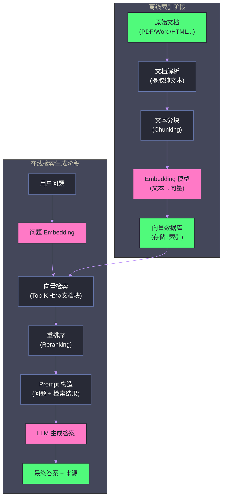
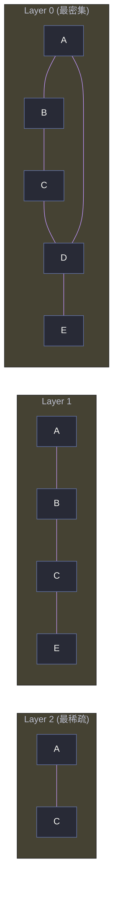

# 02 RAG 架构——核心原理与工程实践

**摘要：**

大语言模型有两个根本性的局限：知识截止日期（无法了解训练数据之后的新信息）和幻觉（在不确定时可能编造答案）。**检索增强生成（Retrieval-Augmented Generation, RAG）** 是解决这两个问题最成熟的工程方案。本文深入剖析 RAG 的完整技术栈：从**为什么 RAG 比微调更适合知识注入**的根本性问题出发，逐层解析文档解析与预处理、文本分块策略（Chunking）、Embedding 模型的选择与原理、向量数据库的索引机制（HNSW/IVF）、检索策略（语义搜索/关键词搜索/混合搜索）、重排序（Reranking），以及生成阶段的 Prompt 构造。这是构建生产级企业知识库和 AI 问答系统的核心技术图谱。

---

## 第 1 章 为什么需要 RAG

### 1.1 LLM 的两大根本局限

经过预训练和对齐的 LLM 是一个强大的通用语言能力系统，但它有两个根本性的局限，不能通过简单地"让模型更大"来解决：

**局限一：知识截止日期（Knowledge Cutoff）**

LLM 的知识来源于训练数据，而训练数据有一个截止日期。GPT-4 的知识截止于 2023 年 4 月，这意味着它不知道 2023 年 4 月之后发生的任何事情。对于企业应用来说，这个问题更加严峻——LLM 完全不了解公司内部的私有文档（产品手册、会议记录、内部 Wiki、客户合同），这些数据从未出现在训练语料中。

**局限二：幻觉（Hallucination）**

LLM 是概率生成模型——它的目标是生成"看起来合理的"next token，而非"保证准确的"next token。当模型不确定某个事实时，它倾向于生成一个听起来合理但实际错误的答案，而非承认不知道。这就是幻觉——模型自信地"编造"了不存在的引用、错误的数据、失真的历史事件。

### 1.2 为什么不用微调来注入知识

面对"模型不知道私有文档里的内容"这个问题，直觉上的解决方案是微调——在私有数据上对模型进行 SFT（监督微调）。但实践证明，**微调并不适合知识注入**，原因深刻：

**微调会遗忘（Catastrophic Forgetting）**：在新数据上微调往往会损害模型在旧数据上的性能。要让模型记住 10 万页文档的内容，需要大量的微调数据和精心的训练策略，代价极高。

**知识更新昂贵**：当文档内容发生变化（如政策更新、产品迭代），需要重新微调——而每次微调都需要数小时的 GPU 时间和相应成本。

**微调不能精确控制信息来源**：微调后的模型会将新知识与原有参数知识"混合"，无法保证对特定问题调用特定文档的内容，也无法追溯答案的来源。

**知识密度问题**：模型参数的信息存储效率远低于文本本身。一个 70B 模型（140 GB）能存储的"专有知识"远不如直接在推理时给模型看原始文档来得多和准确。

相比之下，RAG 的思路更直接：**与其教模型记住知识，不如在需要时把相关知识找出来塞进 prompt**。

> [!info] 核心概念
> RAG 本质上是一个"开卷考试"方案——LLM 是考生，私有知识库是可以查阅的参考书，每次提问都先从参考书中检索相关内容，再结合问题让 LLM 作答。闭卷考试（纯参数知识）考验的是记忆，开卷考试（RAG）考验的是理解和应用。对于需要频繁更新、追求准确性的企业知识库场景，开卷考试远优于闭卷。

### 1.3 RAG 的适用场景

| 场景 | RAG 适合度 | 理由 |
| :--- | :--- | :--- |
| **企业内部知识问答** | 极高 | 私有文档，实时更新，需要来源可追溯 |
| **客服机器人** | 高 | 产品手册、FAQ 需要精确引用 |
| **法律/医疗文档分析** | 高 | 需要基于原始文本精确回答，容忍度低 |
| **最新资讯问答** | 高 | 需要训练截止日期后的信息 |
| **代码风格检查** | 低 | 无需外部知识，纯能力任务 |
| **数学推理** | 低 | 计算能力，非知识检索 |

---

## 第 2 章 RAG 的整体架构

### 2.1 完整流程概览

RAG 分为两个阶段：**离线索引阶段**（准备知识库）和**在线检索生成阶段**（响应查询）。



---

## 第 3 章 文档解析——从原始文件到可处理文本

### 3.1 解析的挑战

知识库的原始文档通常不是干净的纯文本，而是各种格式的复杂文件：PDF（可能是扫描件）、Word、PowerPoint、HTML、Excel、Markdown 等。每种格式都有其解析挑战。

**PDF 的复杂性**是最大的挑战。PDF 本质上不是一个"文档格式"，而是一个"页面描述格式"——它描述每个字符在页面上的精确位置，但并不保留段落、标题、表格等语义结构。一个技术文档的 PDF 可能包含：多栏排版（列的顺序需要正确识别）、图表（需要 OCR 或多模态模型处理）、页眉页脚（通常需要过滤掉）、公式（很难正确解析为文本）。

| 文档类型 | 解析难度 | 主要工具 | 常见问题 |
| :--- | :--- | :--- | :--- |
| **Markdown/纯文本** | 低 | 直接读取 | 几乎无 |
| **HTML** | 低-中 | BeautifulSoup, trafilatura | 噪音（导航栏/广告/脚本） |
| **Word (.docx)** | 中 | python-docx, mammoth | 样式丢失，嵌入图片 |
| **PDF（可搜索）** | 中-高 | PyMuPDF, pdfminer, pypdf | 多栏、表格、公式 |
| **PDF（扫描件）** | 高 | OCR: Tesseract, PaddleOCR | 识别精度、布局分析 |
| **PowerPoint** | 中 | python-pptx | 文本框顺序，图表 |
| **Excel/CSV** | 中 | pandas | 表格结构化处理 |

### 3.2 结构化与非结构化内容的处理

**表格处理**：表格中的信息是高度结构化的——每一行/列的含义依赖于表头。如果直接将表格序列化为线性文本（"张三, 25, 工程师, 北京, 李四, 30, 产品经理, 上海..."），模型难以理解其结构。

更好的做法是将表格转换为 Markdown 表格格式，或者为每一行生成一句自然语言描述（"张三，25岁，职业是工程师，所在城市北京"），再分别索引。

**图像与图表**：纯文本 Embedding 无法处理图像。解决方案有两种：
- **多模态 Embedding**：用多模态 Embedding 模型（如 CLIP）将图像编码为向量，存储在向量库中
- **图像描述生成**：用多模态 LLM（如 GPT-4V）自动生成图像的文字描述，再作为文本索引

### 3.3 文档解析工具推荐

对于生产级的 RAG 系统，推荐以下工具组合：

- **[Docling](https://github.com/DS4SD/docling)**（IBM 开源）：支持 PDF、DOCX、XLSX、HTML 等多种格式，能保留文档结构（标题层级、表格、列表），是当前最成熟的文档解析工具之一
- **[Unstructured.io](https://unstructured.io/)**：企业级文档解析服务，支持 30+ 文档格式，提供结构化元素（Title/NarrativeText/Table）的识别
- **[LlamaParse](https://llamaindex.ai/llamaparse)**：LlamaIndex 出品，专注于复杂 PDF 解析，特别是含有复杂表格和图表的技术文档

---

## 第 4 章 文本分块——Chunking 策略

### 4.1 为什么需要分块

为什么不直接将整个文档作为一个索引单元？主要有两个原因：

**Embedding 精度问题**：Embedding 模型将一段文本压缩为一个固定维度的向量。文本越长，信息损失越多——一篇 10 页的文档压缩成一个 1536 维向量，其中的具体细节无法被精确表达。短小精悍的文本块的 Embedding 质量远高于长文本的 Embedding。

**检索精度与上下文长度的矛盾**：如果索引单元是整个文档（10 页），检索时返回整个文档，然后将 10 页内容全部塞进 prompt——这会快速填满上下文窗口，而且其中大部分内容与用户问题无关，"稀释"了相关信息。分块后可以精确定位到相关的段落，而非返回整个文档。

### 4.2 固定大小分块

最简单的分块策略：按固定字符数或 token 数切分，相邻块之间有一定的**重叠（Overlap）**。

```
块大小（Chunk Size）：512 token
重叠（Overlap）：50 token

块 1: [token 1-512]
块 2: [token 463-974]  (从 463 开始，与块1重叠50个token)
块 3: [token 925-1436]
...
```

重叠的作用：避免一个完整的语义单元（如一个句子）被硬切断，分裂到两个块的末尾和开头，导致两个块中的该信息都不完整。50-100 token 的重叠通常是合理的。

**局限**：固定大小分块不考虑文本的语义边界——可能在句子中间切断，或者将一个段落的开头和结尾分配到不同的块中。

### 4.3 语义分块

更智能的分块策略是按照文本的**语义边界**切分——按段落、按章节、按标题层级。

**按段落分块**：以空行或 `\n\n` 为边界，每个段落为一个块。适合有清晰段落结构的文档。问题是段落长度差异巨大——有的段落 10 个词，有的 500 个词。

**递归字符分块**（LangChain 的 `RecursiveCharacterTextSplitter`）：按优先级顺序尝试不同的分隔符（`\n\n` → `\n` → `. ` → ` `），先按段落分，段落太长则按句子分，句子太长则按空格分。这是最实用的分块策略，兼顾了语义完整性和块大小的可控性。

**基于 Markdown/HTML 结构分块**：如果文档有明确的标题结构（`# ## ###`），按标题层级切分，每个标题下的内容为一个块，同时在块的 metadata 中记录标题路径（如"第2章 > 2.3节 > 安装配置"）。

### 4.4 块大小的选择

块大小没有统一的最优解，需要根据文档类型和检索模式来调整：

| 场景 | 推荐块大小 | 理由 |
| :--- | :--- | :--- |
| **精确问答**（如"XX 产品的价格是多少"） | 128-256 token | 短块语义更精确，检索相关性高 |
| **摘要/综述类问答** | 512-1024 token | 需要更多上下文来理解主题 |
| **代码文档** | 函数级（整个函数） | 代码语义单元是函数，不应硬切断 |
| **法律/合同文档** | 条款级（一个条款） | 法律条款是语义单元 |

> [!warning] 生产避坑
> 块大小是 RAG 系统中最被低估的超参数。许多团队直接使用默认的 512 token，但这对于不同类型的文档和问题来说可能远非最优。建议对代表性问题集做系统的块大小消融实验（128/256/512/1024 token），用检索的 Recall@K 指标来选择最优的块大小。

### 4.5 小到大检索（Small-to-Big Retrieval）

一种平衡精确检索和完整上下文的策略：

- **小块**用于检索（如 128 token）——小块 Embedding 精度高，检索准确
- **大块**用于生成（如 512 token）——检索到小块后，取其所属的父块（更大的上下文）输入 LLM

这样既保证了检索的精度（用精确的小块匹配），又给 LLM 提供了足够的上下文（用大块生成答案）。LlamaIndex 的 `NodeWithScore` 机制支持这种父子块结构。

---

## 第 5 章 Embedding 模型——语义向量化

### 5.1 什么是 Embedding

Embedding 模型将一段文本映射为一个固定维度的浮点数向量（如 1536 维）。**语义相似的文本，其 Embedding 向量在高维空间中的距离也近**。

这个性质使向量搜索成为可能：用户的问题被编码为一个向量，知识库中的所有文档块也被编码为向量，通过计算查询向量与所有文档向量的相似度（余弦相似度或欧氏距离），可以找到语义上最接近的文档块——即使它们之间没有词语上的完全匹配。

例如，查询"如何申请年假"可以匹配到文档"员工请假流程——年休假申请方式"，即使两段文本的关键词不重叠，但语义是相同的。

### 5.2 主流 Embedding 模型

| 模型 | 维度 | 最大输入长度 | 语言 | 特点 |
| :--- | :--- | :--- | :--- | :--- |
| **text-embedding-3-small** (OpenAI) | 1536 | 8191 token | 多语言 | 便宜，质量好 |
| **text-embedding-3-large** (OpenAI) | 3072 | 8191 token | 多语言 | 最高质量，成本高 |
| **bge-m3** (BAAI) | 1024 | 8192 token | 多语言 | 开源，支持中文，多功能（稠密/稀疏/多向量） |
| **bge-large-zh** (BAAI) | 1024 | 512 token | 中文 | 中文效果好，上下文较短 |
| **e5-mistral-7b** (Microsoft) | 4096 | 32768 token | 多语言 | 超长上下文，质量极高 |
| **jina-embeddings-v3** (Jina) | 1024 | 8192 token | 多语言 | 支持查询/文档不同指令 |

### 5.3 非对称检索与指令 Embedding

标准 Embedding 模型使用同一个向量空间编码"查询"和"文档"。但查询和文档在语言风格上往往不同——查询通常是短句疑问句（"苹果的营养价值是什么"），文档通常是陈述性长文（"苹果富含维生素C和膳食纤维，研究表明......"）。

**非对称 Embedding**（Asymmetric Search）使用不同的编码方式处理查询和文档：

- **E5 系列**：在输入前加 `query: ` 或 `passage: ` 前缀，用不同的前缀引导模型产生适合查询或文档的向量表示
- **BGE 系列**：类似机制，加 `为这个句子生成表示以用于检索相关文章：` 等指令

在实际部署中，务必在查询和文档上使用正确的指令前缀——忽略这一点可能导致检索质量显著下降。

### 5.4 Embedding 模型的评估：MTEB

**MTEB（Massive Text Embedding Benchmark）** 是 Embedding 模型的标准评测榜单，覆盖检索（Retrieval）、语义相似度（STS）、分类（Classification）等多个任务和 50+ 数据集。

选择 Embedding 模型时，建议：
1. 先在 MTEB 上筛选综合评分高的模型
2. 再在自己的领域数据上进行专项评测（通用榜单不一定反映特定领域的表现）
3. 对于中文场景，重点关注 MTEB 中文子榜

---

## 第 6 章 向量数据库——高效的近似最近邻搜索

### 6.1 为什么需要专用向量数据库

一个企业的知识库可能包含数百万个文档块，每个块对应一个 1536 维的浮点向量。当用户查询到来时，需要在毫秒级内找到与查询向量最相似的 Top-K 个向量——这是一个**近似最近邻搜索（Approximate Nearest Neighbor, ANN）** 问题。

暴力搜索（逐一计算查询向量与所有向量的距离）在向量数量达到百万级时延迟无法接受。向量数据库通过构建高效的索引结构来加速搜索。

### 6.2 HNSW 索引——向量数据库的主流选择

**HNSW（Hierarchical Navigable Small World）** 是当前最主流的 ANN 索引算法，被 [[Chroma]]、[[Milvus]]、[[Qdrant]]、[[Weaviate]]、[[pgvector]] 等几乎所有向量数据库采用。

HNSW 的核心思想借鉴了**六度分隔理论**（Small World Graph）和**跳表**（Skip List）：

1. **多层图结构**：底层（Layer 0）是完整的向量图，每个节点连接到距离最近的 $M$ 个邻居。越高层的图越稀疏（节点越少），但每个节点的连接跨度越大
2. **贪心搜索**：从顶层的入口点开始，在每一层贪心地向查询向量移动（每次移动到邻居中最近的那个），到达底层后得到精确的近似最近邻



HNSW 的搜索复杂度为 $O(\log N)$（$N$ 为向量数量），在百万级向量上延迟通常在毫秒级。关键超参数：
- **M**：每个节点的最大连接数，越大召回率越高但内存占用越大（通常 16-64）
- **ef_construction**：构建时搜索宽度，越大索引质量越好但构建越慢（通常 100-200）
- **ef_search**：搜索时的宽度，越大召回率越高但延迟越大，可在运行时调整

### 6.3 IVF 索引——大规模场景

**IVF（Inverted File Index）** 是另一种常用索引，适合数据量极大（亿级+）的场景。

核心思想：先用 K-means 对所有向量聚类为 $K$ 个簇，每个向量被分配到最近的簇。搜索时，只在与查询向量最近的 $nprobe$ 个簇中搜索，而非全局搜索。

IVF 的内存占用比 HNSW 低（不需要存储全图），但召回率通常略低，适合显存/内存受限的场景。

### 6.4 主流向量数据库对比

| 数据库 | 部署方式 | 索引类型 | 特色 | 适用规模 |
| :--- | :--- | :--- | :--- | :--- |
| **Chroma** | 本地/云 | HNSW | 轻量，Python 原生，快速原型 | 小-中 |
| **Qdrant** | 本地/云 | HNSW | Rust 实现，高性能，过滤功能强 | 中-大 |
| **Milvus** | 本地/云 | HNSW/IVF/DiskANN | 企业级，高可用，多索引支持 | 大型企业 |
| **Weaviate** | 本地/云 | HNSW | 内置混合搜索，GraphQL API | 中-大 |
| **pgvector** | PostgreSQL 扩展 | HNSW/IVF | 与 PostgreSQL 生态无缝集成 | 小-中 |
| **Pinecone** | 纯云服务 | 私有 | 全托管，零运维 | 任意 |
| **Faiss** | 库（非数据库） | HNSW/IVF/PQ | Facebook 出品，底层研究标准 | 本地实验 |

对于初创团队或快速原型：**Chroma** 或 **pgvector**（如果已有 PostgreSQL）是最简单的选择。

对于生产级企业应用：**Qdrant** 或 **Milvus** 提供了更好的性能、可用性和管理能力。

---

## 第 7 章 检索策略——语义、关键词与混合

### 7.1 纯语义搜索的局限

向量相似度搜索擅长**语义匹配**——能找到语义相似但措辞不同的内容。但它有一个重要的局限：对于**精确词汇匹配**（如产品型号、人名、专有名词、ISBN 号），向量搜索的表现往往不如关键词搜索。

例如，查询"iPhone 15 Pro Max 的电池容量"——用户明确知道要找的是"iPhone 15 Pro Max"这个精确的型号。向量搜索可能会返回关于"iPhone 14 Pro Max"或"iPhone 15 性能"的内容（语义相似），而非"iPhone 15 Pro Max 规格"（精确匹配）。

### 7.2 BM25——经典的关键词搜索

**BM25**（Best Match 25）是信息检索领域经典的关键词打分算法，是 Google 等搜索引擎使用的核心算法之一。

BM25 的核心思想是 **TF-IDF 的改进版**：给定查询词 $q_i$ 和文档 $D$：

$$\text{BM25}(D, Q) = \sum_{i=1}^{n} \text{IDF}(q_i) \cdot \frac{f(q_i, D) \cdot (k_1 + 1)}{f(q_i, D) + k_1 \cdot (1 - b + b \cdot \frac{|D|}{\text{avgdl}})}$$

其中 $f(q_i, D)$ 是词 $q_i$ 在文档 $D$ 中的频率，$|D|$ 是文档长度，$\text{avgdl}$ 是平均文档长度，$k_1$ 和 $b$ 是超参数（通常 $k_1 = 1.5$，$b = 0.75$）。

BM25 的两个关键特性：
- **TF 饱和**：词频的贡献随频率增加而饱和（不是线性的），避免了一个词重复出现就无限增大分数的问题
- **文档长度归一化**：在较长的文档中出现相同次数的词，贡献应该打折扣（因为长文档天然包含更多词）

### 7.3 混合搜索（Hybrid Search）

**混合搜索**将向量语义搜索和 BM25 关键词搜索的结果融合，取长补短：

1. 对查询分别执行向量搜索（返回 Top-K1 个结果）和 BM25 搜索（返回 Top-K2 个结果）
2. 用 **RRF（Reciprocal Rank Fusion）** 等融合算法合并两个排序列表

$$\text{RRF}(d) = \sum_{r \in \text{rankers}} \frac{1}{k + r(d)}$$

其中 $r(d)$ 是文档 $d$ 在排序 $r$ 中的名次，$k$ 通常取 60。直觉上，在多个排序中都排名靠前的文档会获得更高的综合分数。

实践中，混合搜索在大多数场景下优于纯向量搜索或纯关键词搜索，是生产级 RAG 系统的首选检索策略。[[Weaviate]]、[[Qdrant]]、[[Elasticsearch]] 等都内置了混合搜索支持。

### 7.4 元数据过滤

向量搜索可以结合**元数据过滤**——在执行相似度搜索的同时，过滤满足特定条件的文档块：

```python
results = collection.query(
    query_embeddings=[query_embedding],
    n_results=10,
    where={"source": "产品手册-v2.pdf", "department": "研发部"},
    where_document={"$contains": "iPhone 15"}
)
```

元数据过滤对于权限控制（只检索当前用户有权访问的文档）和范围限制（只在特定文档集中搜索）非常重要。

---

## 第 8 章 重排序——精排提升准确度

### 8.1 检索的两阶段架构

向量搜索是一个**粗排**过程——它能快速从百万文档中筛选出 Top-50 个候选，但由于 Embedding 的有损压缩，排序并不总是最优的。

**重排序（Reranking）** 是一个**精排**过程：对初检结果中的每个文档块，用一个更精确但更慢的模型重新计算与查询的相关性分数，重新排序后取 Top-K（通常 3-5 个）输入 LLM。

这种两阶段架构在信息检索中是标准做法——粗排用快速的算法从大规模候选集中召回，精排用精确的算法对小规模候选集进行重排。

### 8.2 Cross-Encoder Reranker

最常用的 Reranker 是 **Cross-Encoder**——将查询和文档**拼接**后一起输入模型，模型输出一个 0-1 的相关性分数。

```
输入: [CLS] 查询文本 [SEP] 文档块文本 [SEP]
输出: 相关性分数 ∈ [0, 1]
```

Cross-Encoder 与 Bi-Encoder（标准 Embedding 模型）的区别：

| 维度 | Bi-Encoder（Embedding） | Cross-Encoder（Reranker） |
| :--- | :--- | :--- |
| 编码方式 | 查询和文档分别编码 | 查询和文档联合编码 |
| 交互深度 | 通过向量点积（浅层） | 通过 Self-Attention 充分交互（深层） |
| 质量 | 中（受压缩损失限制） | 高（充分理解语义关联） |
| 速度 | 快（文档可离线编码） | 慢（每对查询-文档都要计算） |
| 适用阶段 | 粗排（大规模候选） | 精排（小规模候选） |

Cross-Encoder 因为能让查询和文档在 Self-Attention 中充分"互看"，相关性判断更准确，但无法对文档离线编码，每次查询都需要对所有候选文档重新计算——因此只适用于候选集较小（20-100 个）的精排阶段。

主流 Reranker 模型：**bge-reranker-v2-m3**（BAAI，多语言）、**ms-marco-MiniLM-L-12-v2**（微软，英文）、**Cohere Rerank API**（付费云服务）。

---

## 第 9 章 生成阶段——Prompt 构造与答案生成

### 9.1 RAG Prompt 模板

将检索到的文档块（经过重排序后的 Top-K）和用户问题组合成 prompt：

```
[System]
你是一个专业的知识库助手。根据以下提供的参考文档回答用户的问题。
- 只根据参考文档中的信息作答，不要使用你自己的背景知识
- 如果参考文档中没有足够的信息回答问题，请明确说明"文档中没有相关信息"
- 在答案末尾注明信息来源（文档名称和章节）

[参考文档]
文档1（来源：产品手册第3章）:
{chunk_1}

文档2（来源：FAQ-2024.pdf 第15页）:
{chunk_2}

文档3（来源：内部Wiki-发布流程）:
{chunk_3}

[用户问题]
{user_question}

[回答]
```

### 9.2 答案生成的关键设计决策

**是否限制模型只使用检索结果**：

- **严格 RAG**：System Prompt 明确要求"只根据提供的参考文档作答"。适合对准确性要求极高的场景（法律/医疗/金融）
- **知识增强 RAG**：允许模型在检索结果的基础上调用自身知识进行推理补充。适合对全面性要求更高的场景

**如何处理检索失败**：当检索结果与问题无关时（所有相似度分数都很低），应该让模型据实回复"文档中没有相关信息"，而非强行生成一个可能是幻觉的答案。可以在代码层面检测这种情况：如果最高相似度分数低于阈值（如 0.5），直接返回"未找到相关文档"，不调用 LLM。

**来源引用（Citation）**：生产级 RAG 系统应该在答案中注明信息来源，允许用户验证答案。实现方式：在每个文档块的元数据中存储来源（文件名、页码、章节），检索后将来源信息附在对应的内容上，生成时引导模型以"[来源: XX 文档第 XX 页]"的格式标注。

---

## 第 10 章 RAG 的评估

### 10.1 RAG 评估的三个维度

评估 RAG 系统的质量需要从三个维度入手：

| 维度 | 度量指标 | 含义 |
| :--- | :--- | :--- |
| **检索质量** | Recall@K, Precision@K, MRR | 检索到的文档块中有多少是真正相关的 |
| **答案质量（含 Context）** | Faithfulness（忠实度） | 答案是否完全基于检索结果，有没有幻觉 |
| **答案质量（不含 Context）** | Answer Relevance（相关性） | 答案是否回应了用户的问题 |

### 10.2 RAGAS 评估框架

**RAGAS**（RAG Assessment）是评估 RAG 系统最流行的开源框架，提供了一套自动化指标：

- **Faithfulness**：生成答案的每个陈述是否都能从检索文档中找到依据（用 LLM 自动判断）
- **Answer Relevance**：答案是否回应了问题（用 Embedding 相似度衡量：将答案还原为问题，与原始问题的相似度）
- **Context Recall**：在有标准答案的测试集上，检索结果是否覆盖了生成正确答案所需的所有信息
- **Context Precision**：检索结果中有多少比例是真正相关的（而非噪音）

这些指标可以在没有人工标注的情况下自动计算，大幅降低了 RAG 系统评估的成本。

---

## 第 11 章 生产级 RAG 的工程挑战

### 11.1 知识库的增量更新

文档会持续更新——旧文档修改、新文档添加、过时文档删除。处理方式：

- 为每个文档块存储一个内容哈希值，更新文档时重新解析并对比哈希，只对变更的块重新 Embedding
- 删除文档时，从向量数据库中删除对应的所有块（需要存储文档ID到块ID的映射关系）

### 11.2 多租户数据隔离

企业 RAG 系统通常需要为不同的部门或用户提供数据隔离——研发部门只能检索研发文档，销售部门只能检索销售文档。

实现方式：
- **Namespace 隔离**：为每个租户创建独立的向量集合（Collection）
- **元数据过滤**：所有文档块存储 `tenant_id` 或 `department` 字段，检索时强制过滤

### 11.3 延迟优化

端到端 RAG 的延迟 = 查询 Embedding 时间 + 向量检索时间 + Rerank 时间 + LLM 生成时间。在实际系统中：

- **查询 Embedding**：通常 10-50ms（本地模型）或 50-200ms（API 调用）
- **向量检索**：通常 5-50ms（取决于数据量和索引类型）
- **Rerank**：100-500ms（取决于候选数量和模型大小）
- **LLM 生成**：500ms-10s（取决于模型和输出长度）

LLM 生成通常是最大的延迟来源。优化策略：对 Embedding 和 Rerank 使用本地部署的小型模型（而非 API 调用），节省网络往返时间。

---

## 第 12 章 总结

RAG 是当前 LLM 应用中最成熟、最广泛部署的架构模式，其价值在于用工程手段弥补了 LLM 的两大先天局限——知识截止和幻觉。一个生产级 RAG 系统的核心环节：

| 环节 | 关键决策点 | 推荐方案 |
| :--- | :--- | :--- |
| **文档解析** | 格式支持、结构保留 | Docling / Unstructured |
| **分块策略** | 块大小、分块方式 | 递归字符分块（256-512 token） |
| **Embedding** | 模型选择、指令前缀 | bge-m3（开源） / text-embedding-3-small（API） |
| **向量数据库** | 规模、运维复杂度 | Qdrant（中大型）/ pgvector（小型） |
| **检索策略** | 召回率、精确度 | 混合搜索（向量 + BM25） |
| **重排序** | 精排准确度 | bge-reranker-v2-m3 |
| **生成** | 幻觉控制、来源引用 | 严格 RAG Prompt + Citation |
| **评估** | 自动化评估 | RAGAS |

下一篇 [[03 高级 RAG——查询改写、图谱检索与多跳推理]] 将深入探讨当标准 RAG 遇到复杂问题时的局限，以及 Query Rewriting、HyDE、GraphRAG、Self-RAG 等高级技术如何突破这些局限。

---

## 参考文献

1. Lewis et al., "Retrieval-Augmented Generation for Knowledge-Intensive NLP Tasks", NeurIPS 2020
2. Gao et al., "Retrieval-Augmented Generation for Large Language Models: A Survey", arXiv 2023
3. Es et al., "RAGAS: Automated Evaluation of Retrieval Augmented Generation", EACL 2024
4. Robertson & Zaragoza, "The Probabilistic Relevance Framework: BM25 and Beyond", 2009
5. Malkov & Yashunin, "Efficient and Robust Approximate Nearest Neighbor Search Using HNSW", IEEE TPAMI 2020
6. Reranking with Cross-Encoders, sentence-transformers documentation
7. Douze et al., "The Faiss Library", arXiv 2024
8. Günther et al., "JINA EMBEDDINGS: A Novel Set of High-Performance Sentence Embedding Models", arXiv 2023
