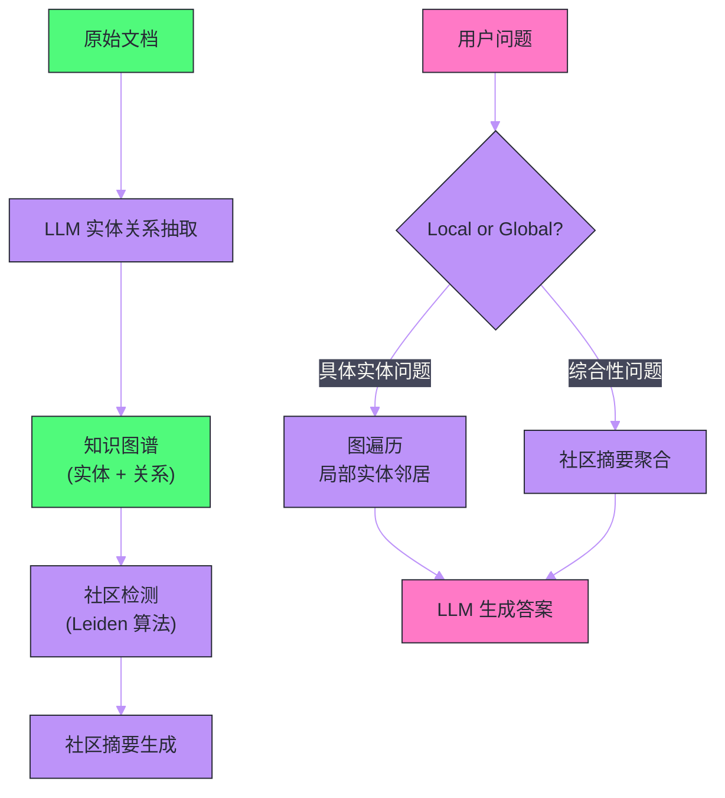
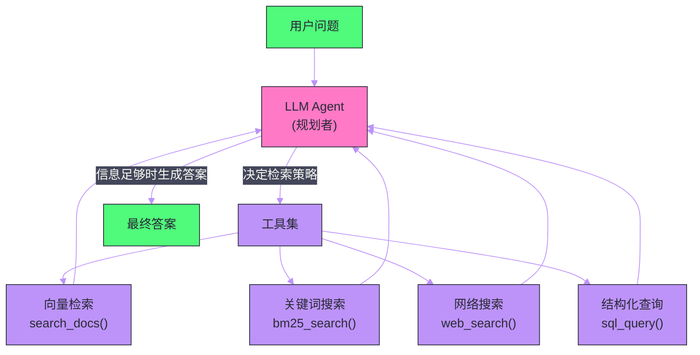
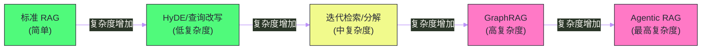

# 03 高级 RAG——查询改写、图谱检索与多跳推理

**摘要：**

标准 RAG（[[02 RAG 架构——核心原理与工程实践]]）已经足够处理大多数"单跳"问题——用户问题与文档内容存在直接的语义对应关系。但现实中的复杂问题往往需要跨文档、多步推理才能回答：比较性问题（"A 和 B 哪个更好"）、聚合性问题（"总结所有关于 X 的信息"）、多跳推理（"Y 的创始人曾就读于哪所大学"，需要先找到 Y 的创始人，再查他的教育背景）。本文深入剖析高级 RAG 的核心技术：**查询改写与分解**、**假设性文档嵌入（HyDE）**、**多向量检索**、**Self-RAG 的自我反思**、**GraphRAG 的知识图谱检索**，以及将 RAG 与 Agent 结合的 **Agentic RAG** 架构，系统回答：当用户的问题变得复杂时，如何构建一个能自主规划检索策略、迭代补充信息的智能问答系统。

---

## 第 1 章 标准 RAG 的局限

### 1.1 单跳检索的边界

标准 RAG 的检索模式是"一次检索"——将用户问题编码为向量，一次性从知识库中取回相关文档块，然后生成答案。这个模式对单跳问题效果很好，但在以下几类问题上会系统性失败：

**类型一：多跳推理问题**

问题："DeepMind 的创始人 Demis Hassabis 本科学的是什么专业？"

这需要两跳：第一跳找到"Demis Hassabis 是 DeepMind 创始人"，第二跳用 Demis Hassabis 的名字查他的教育背景。一次向量检索无法同时完成这两跳——如果直接用原问题检索，可能匹配到 DeepMind 公司介绍，其中并不包含 Hassabis 的本科专业。

**类型二：比较性问题**

问题："LLaMA 3 和 Mistral 7B 相比，哪个在代码生成任务上性能更好？"

这需要分别检索 LLaMA 3 和 Mistral 7B 的性能数据，再做比较。单次检索往往只能召回其中一个的信息，或者召回一个泛泛讨论两者的综述，而非精确的性能对比数据。

**类型三：聚合性问题**

问题："我们公司在 2024 年签署了哪些重要合同？"

答案分散在大量文档中，每个合同可能在不同的文件里。单次检索只能找到几个合同，无法保证覆盖所有相关文档。

**类型四：查询与文档语言风格差距大**

用户问题："这个系统崩了怎么办"，文档里写的是"系统故障恢复操作流程"——语义相近但用词差距大。标准的向量检索相似度可能不够高，导致漏检。

### 1.2 高级 RAG 的解法分类

针对上述局限，高级 RAG 技术从三个方向突破：

| 方向 | 代表技术 | 解决的问题 |
| :--- | :--- | :--- |
| **查询优化** | HyDE, 查询改写, 查询分解 | 提升查询向量与文档的匹配度 |
| **检索优化** | 多向量检索, 迭代检索, GraphRAG | 多跳、聚合、关系型问题 |
| **生成优化** | Self-RAG, CRAG | 自我评估检索质量，减少幻觉 |
| **架构优化** | Agentic RAG | 动态规划检索策略 |

---

## 第 2 章 查询优化——让检索找得更准

### 2.1 HyDE——假设性文档嵌入

**HyDE（Hypothetical Document Embedding）**（Gao et al., 2022）基于一个深刻的观察：**用户的问题（短句疑问）和文档内容（陈述段落）之间存在语言风格鸿沟**，这导致两者的 Embedding 向量在空间中不够接近，即使语义相关。

HyDE 的解法非常优雅：

1. 用 LLM 根据用户问题**生成一个假设性的答案**（即使这个答案可能不准确）
2. 对这个假设答案做 Embedding，用它来检索知识库
3. 用检索到的真实文档生成最终答案

核心逻辑是：假设答案和真实文档都是"陈述性文本"，语言风格一致，它们的 Embedding 向量比"问句"和"陈述"更接近。

```
用户问题: "苹果公司的 Vision Pro 头显的分辨率是多少？"

假设答案 (LLM生成): 
"Apple Vision Pro 采用了 micro-OLED 显示技术，每只眼睛的分辨率
高达 3840×2160 像素（即 4K），总像素数超过 2300 万..."

→ 用假设答案的 Embedding 检索 → 找到包含精确分辨率数据的文档块
→ 用真实文档生成最终答案
```

HyDE 的一个关键优势是：即使假设答案是错误的（如给出了不准确的分辨率数字），只要它在风格和关键词上与真实文档相近，检索质量就会显著提升。

> [!warning] 生产避坑
> HyDE 需要额外一次 LLM 调用来生成假设答案，会增加约 300-500ms 的额外延迟和相应成本。在对延迟敏感的场景，需要权衡检索质量提升与延迟代价。建议仅对初始检索相似度较低的查询启用 HyDE，高置信度的查询直接用原始问题检索。

### 2.2 查询改写（Query Rewriting）

查询改写通过 LLM 对用户的原始问题进行**语言层面的优化**，使其更适合向量检索。

常见的改写策略：

**去除歧义**：用户问"怎么连这个"，改写为"如何连接数据库（根据上下文判断）"。

**扩展同义词**：用户问"这玩意儿的价格"，改写为"产品定价/售价/费用"，提升召回率。

**规范化术语**：用户用口语或缩写提问，改写为知识库中使用的标准术语（"CI/CD 流水线"→"持续集成/持续部署流程"）。

实现上，可以用一个简单的 prompt 让 LLM 完成改写：

```
你是一个搜索查询优化专家。将以下用户问题改写为更适合文档检索的形式，
使用更规范的技术术语，避免代词和模糊表达。只输出改写后的查询，不要解释。

用户问题: {user_question}
改写后的查询:
```

### 2.3 查询分解（Query Decomposition）

对于复杂的多跳或比较性问题，先将原始问题**分解为多个简单的子问题**，分别检索，最后综合答案。

```
原始问题: "LLaMA 3 和 GPT-4 相比，在多语言推理能力上有何异同？"

分解后:
子问题1: "LLaMA 3 的多语言能力如何？支持哪些语言？"
子问题2: "GPT-4 的多语言推理能力如何？"
子问题3: "LLaMA 3 和 GPT-4 的多语言基准测试对比结果"
```

三个子问题分别检索，各自获取相关文档块，最后合并所有检索结果，用一次 LLM 调用综合生成对比答案。

**LLM Decomposer Prompt**：

```
将以下复杂问题分解为 2-4 个独立的、可以通过文档检索直接回答的简单子问题。
子问题应该覆盖原问题的所有方面，且每个子问题都可以独立检索。
以JSON数组格式输出: ["子问题1", "子问题2", ...]

原始问题: {question}
```

### 2.4 Step-Back Prompting——抽象上移

**Step-Back Prompting**（Zheng et al., 2023）针对的是一类"过于具体"的问题——用户问的是一个非常具体的实例，而知识库中的文档更多描述的是通用原理。

例如，用户问"当 AWS Lambda 函数内存设置为 256MB 时，Python 的 GC（垃圾回收）是否会显著影响执行时间"——这个问题非常具体，直接检索可能找不到完全对应的文档。

Step-Back 先让 LLM 将这个具体问题"抽象上移"一步："Python 垃圾回收机制对函数执行时间的影响"——这个更通用的问题更容易在文档中找到匹配内容。

检索步骤：
1. 用 Step-Back 问题检索（获取通用原理文档）
2. 同时用原始问题检索（获取具体场景文档，如果有的话）
3. 将两种检索结果合并，让 LLM 综合回答原始具体问题

---

## 第 3 章 迭代检索——多轮信息补充

### 3.1 为什么需要迭代检索

单次检索假设用户问题能一次性获取所有需要的信息。但在多跳推理场景中，第二次检索的查询往往依赖于第一次检索的结果——在获取中间信息之前，你甚至不知道第二步需要检索什么。

**迭代检索**（也叫 Iterative RAG 或 Multi-hop RAG）通过多轮"检索→推理→再检索"的循环，逐步补充解题所需的信息。

### 3.2 IRCoT——交错推理与检索

**IRCoT（Interleaving Retrieval with Chain-of-Thought Reasoning）**（Trivedi et al., 2022）是迭代检索的代表性方法。

流程：

1. 用 LLM 开始推理过程（生成 CoT 的第一步）
2. 将当前推理步骤作为新的检索查询，检索补充信息
3. 将检索结果加入上下文，继续推理下一步
4. 重复 2-3，直到推理完成得出最终答案

```
问题: "Demis Hassabis 本科就读于哪所大学？"

第1步推理: "要回答这个问题，我需要先知道 Demis Hassabis 是谁。"
检索: ["Demis Hassabis"] → 得到: "Demis Hassabis 是 DeepMind 联合创始人和 CEO..."

第2步推理: "知道了 Hassabis 是 DeepMind 创始人，现在查他的教育背景。"
检索: ["Demis Hassabis 教育背景 大学"] → 得到: "Hassabis 毕业于剑桥大学国王学院..."

第3步推理: "根据检索结果，Demis Hassabis 本科就读于剑桥大学国王学院。"
最终答案: "剑桥大学国王学院"
```

IRCoT 的关键设计是：**每一步的推理文本就是下一步的检索查询**——CoT 推理过程自然地引导了检索方向，不需要额外的查询规划模块。

---

## 第 4 章 GraphRAG——知识图谱增强检索

### 4.1 标准 RAG 对关系型信息的盲点

向量检索擅长找语义相似的"段落"，但它对**实体间的关系和图结构信息**是盲的。

考虑这样一个问题："找出所有与张三有过合作关系的公司的 CEO"——这是一个典型的图查询：从张三出发，沿着"合作关系"边找到公司，再从公司沿着"CEO"边找到人。向量数据库只能存储文本块，无法直接表达和查询这种结构化的实体关系网络。

**GraphRAG** 通过构建**知识图谱（Knowledge Graph）** 来弥补这个缺陷。

### 4.2 Microsoft GraphRAG

Microsoft Research 在 2024 年发布的 **GraphRAG**（Edge et al., 2024）是当前最有影响力的图增强 RAG 框架。

**离线索引阶段**：

1. **实体和关系抽取**：用 LLM 对每个文档块进行信息抽取，提取实体（人名/组织/地点/概念）和实体间的关系（"张三 —— 就职于 ——> 阿里巴巴"）
2. **图构建**：将所有文档中抽取的实体和关系合并，构建一个大型知识图谱
3. **社区检测**：用图算法（如 Leiden 算法）对知识图谱中的实体进行聚类，找到关联紧密的"社区"（如一个研究领域、一个公司生态）
4. **社区摘要**：用 LLM 为每个社区生成一段摘要描述

**在线检索阶段**：

- **Local Search**（局部搜索）：用于具体实体的问题。先在图中找到相关实体，获取其直接邻居和关系，再结合原始文本块回答
- **Global Search**（全局搜索）：用于跨文档的综合性问题（如"这个语料库主要讲什么主题"）。扫描所有社区的摘要，聚合生成宏观答案



### 4.3 GraphRAG 的工程代价

GraphRAG 的能力强大，但工程代价也很高：

- **索引成本高**：实体抽取需要对每个文档块调用 LLM，一个大型知识库（10 万块）的索引可能需要数百到数千次 LLM 调用和相应费用
- **图的维护复杂**：文档更新时，需要重新抽取变更文档的实体和关系，并更新图结构
- **查询延迟高**：Global Search 需要聚合大量社区摘要，可能需要多次 LLM 调用

适用场景：知识库规模适中（数百到数千个文档）、关系型信息丰富（如医学/法律/企业组织知识库）、对综合性问题的回答质量要求高。

### 4.4 轻量级知识图谱方案

对于不需要完整 GraphRAG 的场景，可以用更轻量级的方案：

**属性图 + 向量混合查询**：将知识库文档的结构化元数据（作者、日期、部门、标签、文档间的引用关系）建模为图，用图查询过滤候选集，再用向量检索精排。

**LlamaIndex Property Graph**：LlamaIndex 提供了 Property Graph Index，支持在图上进行向量+关键词+图路径的混合检索，是 GraphRAG 的工程化实现。

---

## 第 5 章 Self-RAG——自我反思的检索生成

### 5.1 标准 RAG 的"不加鉴别"问题

标准 RAG 不管检索质量如何，都会将检索到的文档块塞进 prompt 让 LLM 生成答案——即使检索结果与问题无关，或者检索结果互相矛盾。更糟糕的是，有些问题根本不需要检索（如"1+1=?"），强制检索只会引入噪音。

**Self-RAG**（Asai et al., 2023）通过引入**反思 token（Reflection Token）** 让模型学会自主决定：是否需要检索？检索结果有没有用？生成的答案是否基于了检索内容？

### 5.2 Self-RAG 的反思机制

Self-RAG 训练模型在生成过程中输出四类特殊的"反思 token"：

| 反思 Token | 含义 | 可能值 |
| :--- | :--- | :--- |
| **Retrieve** | 是否需要检索 | `[Retrieve]` / `[No Retrieve]` |
| **ISREL** | 检索结果是否相关 | `[Relevant]` / `[Irrelevant]` |
| **ISSUP** | 生成内容是否有文档支持 | `[Fully supported]` / `[Partially supported]` / `[No support]` |
| **ISUSE** | 生成内容是否有用 | 评分 1-5 |

生成流程：

1. 模型生成 `[Retrieve]` → 触发检索，获取文档块
2. 模型生成 `[Relevant]` → 继续生成，利用文档块
3. 模型生成每个句子后，输出 `[Fully supported]` → 该句子有可信的文档支持
4. 最后输出 `[ISUSE: 5]` → 整体答案质量高

如果模型判断检索结果 `[Irrelevant]`，则重新检索或直接基于自身知识回答。

Self-RAG 的训练需要专门构建包含反思 token 的训练数据（通过 GPT-4 标注），工程实现相对复杂，但其"按需检索、自我评估"的思路对工程实践有重要的指导意义——即使不用完整的 Self-RAG，也可以在 RAG pipeline 中加入类似的检索质量评估步骤。

### 5.3 CRAG——纠正性 RAG

**CRAG（Corrective RAG）**（Yan et al., 2024）是 Self-RAG 的工程化简化版。它引入一个轻量级的**检索评估器**（Retrieval Evaluator）对检索结果进行质量评分，根据评分触发不同的策略：

- **High confidence（高置信）**：检索结果相关，直接使用
- **Low confidence（低置信）**：检索结果不可信，触发网络搜索作为补充（如调用 Tavily/Bing Search API）
- **Ambiguous（中等）**：部分相关，对检索结果进行精炼（Knowledge Refinement），过滤掉不相关的句子

CRAG 的核心价值是引入了"退化检索"机制——当本地知识库检索不到足够相关的信息时，自动扩展到网络搜索，确保每次查询都能获取高质量的参考信息。

---

## 第 6 章 Agentic RAG——让 RAG 拥有自主规划能力

### 6.1 从流水线到 Agent

标准 RAG 是一个固定流水线：解析→分块→Embedding→检索→生成。无论问题多复杂，流程都是一样的。而高级 RAG 的各种技术（HyDE、查询分解、迭代检索）试图通过预设的规则来处理不同类型的问题。

**Agentic RAG** 走向了不同的路径：**将 LLM 本身作为规划者，让它自主决定如何检索、检索什么、是否需要多轮检索**。



### 6.2 RAG 作为工具的 Agent 架构

在 Agentic RAG 中，知识库检索只是 Agent 的工具之一。Agent（使用 [[05 Agent 核心能力——推理、规划与工具调用]] 中的 ReAct 架构）会：

1. **分析问题**：判断问题类型（单跳/多跳/比较/聚合）
2. **选择工具**：是用向量检索还是关键词搜索？是查本地知识库还是联网搜索？
3. **执行检索**：调用选定的检索工具
4. **评估结果**：判断检索结果是否足够回答问题
5. **迭代**：如果信息不足，规划下一步检索（改写查询、选择不同工具）
6. **综合回答**：信息足够时生成最终答案

这种架构的灵活性远超固定流水线，能处理任意复杂的问题——但也带来了不确定性（Agent 的规划路径不可完全预测）和成本（多轮 LLM 调用）。

### 6.3 ReAct + RAG：完整示例

以下展示 Agentic RAG 在处理复杂问题时的推理链：

```
用户: "比较一下 2024 年我们公司在上海和北京两个城市的销售额，
       并分析主要差异原因"

Thought: 这是一个比较性+聚合性问题，需要分别查询上海和北京的销售数据，
         还需要分析差异原因，可能涉及多个文档。

Action: search_docs(query="2024年上海销售额", filters={"year": 2024, "city": "上海"})
Observation: [文档块1: 上海Q1销售额1.2亿, Q2 1.5亿...] [文档块2: 上海年度报告...]

Action: search_docs(query="2024年北京销售额", filters={"year": 2024, "city": "北京"})
Observation: [文档块3: 北京Q1销售额0.9亿, Q2 1.1亿...] [文档块4: 北京年度报告...]

Thought: 有了两城市的数量数据。上海全年约5.8亿，北京约4.3亿，上海高出35%。
         需要查差异原因分析。

Action: search_docs(query="上海北京销售差异 原因 2024")
Observation: [文档块5: 分析报告——上海区域拥有更多旗舰门店和大客户资源...]

Thought: 现在有足够的信息来综合回答了。

Final Answer: 2024年上海销售额约5.8亿，北京约4.3亿，上海高出约35%。
主要差异原因：1. 上海门店数量更多（18家 vs 北京12家）；
2. 上海大客户占比更高（52% vs 北京38%）；3. 华东区市场容量更大...
```

---

## 第 7 章 RAG 的进阶工程实践

### 7.1 多向量检索（Multi-Vector Retrieval）

**多向量检索**为每个文档块生成多个 Embedding，从不同角度捕捉文档的语义。

**ColBERT**：不同于单向量 Embedding（整个文档块→一个向量），ColBERT 为文档中的每个 token 生成一个向量。检索时，计算查询 token 向量集与文档 token 向量集之间的最大相似度之和（MaxSim），精度远高于单向量。代价是存储量和检索复杂度大幅增加。

**Summary + Chunk**：为每个文档块同时存储两个 Embedding：一个是原始块的 Embedding，另一个是 LLM 生成的该块摘要的 Embedding。检索时两个 Embedding 都参与相似度计算，取更高分。这能同时捕捉"词汇层面的精确匹配"和"语义层面的主题匹配"。

**Parent + Child**：在 [[02 RAG 架构——核心原理与工程实践]] 的小到大检索基础上，为父块（大）和子块（小）分别建立 Embedding 索引。检索时对子块精确定位，返回父块的完整上下文。

### 7.2 Contextual Retrieval（Anthropic, 2024）

Anthropic 在 2024 年提出了 **Contextual Retrieval** 技术——在分块和 Embedding 之前，先用 LLM 为每个文档块生成一段**上下文说明**，解释该块在整个文档中的位置和作用，然后将上下文说明拼接在文档块前面再做 Embedding。

```
原始块:
"该功能需要管理员权限才能使用。配置方法见第3章。"

上下文说明 (LLM生成):
"这段文字来自《用户权限管理手册》第5章，讨论的是超级管理员功能的访问控制..."

拼接后索引:
"这段文字来自《用户权限管理手册》第5章，讨论的是超级管理员功能的访问控制...
该功能需要管理员权限才能使用。配置方法见第3章。"
```

Anthropic 报告称，Contextual Retrieval 将检索失败率降低了 49%。核心原因是：孤立的文档块往往缺少上下文（代词、省略的主语），加入上下文说明后，Embedding 携带了更完整的语义信息。

### 7.3 Fusion RAG——多查询结果融合

**RAG Fusion**（Rackauckas, 2023）的思路：
1. 用 LLM 对原始问题生成 4-5 个**多角度的变体查询**
2. 对每个变体查询分别检索（返回 Top-10）
3. 用 RRF 融合所有查询的检索结果
4. 取融合后的 Top-5 输入 LLM 生成答案

多角度查询通过覆盖不同的表达方式和关注点，显著提升了召回率——即使原始查询某个角度检索不到，其他角度的变体查询可能成功检索。

---

## 第 8 章 选择合适的高级 RAG 技术

### 8.1 问题类型 × 技术匹配

| 问题类型 | 推荐技术 | 理由 |
| :--- | :--- | :--- |
| 查询-文档语言风格差异大 | HyDE、查询改写 | 弥合语言鸿沟 |
| 复杂多部分问题 | 查询分解、RAG Fusion | 分而治之 |
| 多跳推理 | IRCoT、Agentic RAG | 迭代获取中间信息 |
| 比较性问题 | 查询分解 + 并行检索 | 分别检索再比较 |
| 聚合性问题 | GraphRAG Global Search | 跨文档全局视角 |
| 实体关系问题 | GraphRAG Local Search | 利用图结构 |
| 检索质量不稳定 | CRAG、Self-RAG | 自我评估和纠正 |
| 任意复杂问题 | Agentic RAG | 动态规划，最灵活 |

### 8.2 工程复杂度权衡



**工程建议**：从标准 RAG 起步，在生产数据上评估检索质量（用 RAGAS 或人工评估），根据失败案例的类型逐步引入针对性的高级技术，而非一开始就上最复杂的方案。

---

## 第 9 章 总结

高级 RAG 不是用一套技术替换另一套，而是**在标准 RAG 的基础上，针对不同类型的失败模式，精准引入相应的增强手段**：

- **检索精度不足** → HyDE / 查询改写 / 上下文增强分块
- **复杂问题处理能力不足** → 查询分解 / 迭代检索 / Agentic RAG  
- **关系型信息处理能力不足** → GraphRAG
- **检索质量不稳定** → Self-RAG / CRAG
- **召回率不足** → RAG Fusion / 混合搜索 / 多向量检索

下一篇 [[04 MCP 协议深度解析——Agent 与工具的标准化连接]] 将离开知识检索的范畴，进入 Agent 与外部世界交互的更广阔领域——MCP 协议如何成为 LLM 连接一切工具和服务的标准接口。

---

## 参考文献

1. Gao et al., "Precise Zero-Shot Dense Retrieval without Relevance Labels", ACL 2022 (HyDE)
2. Trivedi et al., "Interleaving Retrieval with Chain-of-Thought Reasoning for Knowledge-Intensive Multi-Step Questions", ACL 2022 (IRCoT)
3. Asai et al., "Self-RAG: Learning to Retrieve, Generate, and Critique through Self-Reflection", ICLR 2024
4. Edge et al., "From Local to Global: A Graph RAG Approach to Query-Focused Summarization", arXiv 2024 (GraphRAG)
5. Yan et al., "CRAG: Comprehensive RAG Benchmark", arXiv 2024
6. Rackauckas, "RAG-Fusion: A New Take on Retrieval-Augmented Generation", arXiv 2024
7. Khattab et al., "ColBERT: Efficient and Effective Passage Search via Contextualized Late Interaction over BERT", SIGIR 2020
8. Anthropic, "Contextual Retrieval", 2024
9. Zheng et al., "Take a Step Back: Evoking Reasoning via Abstraction in Large Language Models", ICLR 2024
