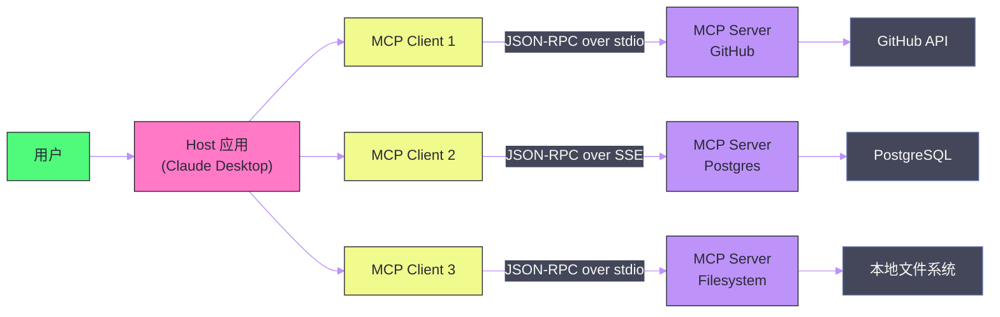

# 04 MCP 协议深度解析——Agent 与工具的标准化连接

**摘要：**

在 LLM Agent 的工程实践中，有一个长期困扰开发者的问题：每接入一个新工具（数据库、API、文件系统、SaaS 服务），就需要为这个工具写一套定制的集成代码——不同框架之间无法复用，维护成本随工具数量线性增长。**MCP（Model Context Protocol）** 是 Anthropic 于 2024 年 11 月开源的标准化协议，它定义了 LLM Host（如 Claude Desktop）与外部工具提供者（MCP Server）之间的通信标准，被誉为 AI 领域的"USB-C 接口"。本文从 MCP 出现的历史背景和设计动机出发，深度解析其三大核心原语（Tools/Resources/Prompts）、通信机制（JSON-RPC over stdio/SSE）、安全模型，以及如何从零开发一个 MCP Server，最后展望 MCP 在多 Agent 架构中的角色演进。

---

## 第 1 章 MCP 之前：碎片化的工具集成困境

### 1.1 Function Calling 的局限

在 MCP 出现之前，LLM 与外部工具的连接主要依赖 **Function Calling**（工具调用）机制——模型在推理时输出一个 JSON 格式的函数调用请求（函数名+参数），Host 应用拦截这个请求，执行实际的函数，将结果返回给模型继续推理。

Function Calling 解决了"模型如何表达调用意图"的问题，但遗留了一个更本质的工程问题：**工具的实现和工具的定义是绑定在 Host 应用代码里的**。

以一个典型的场景为例：你在构建一个基于 Claude 的代码助手，需要给它接入 GitHub 代码查询、Jira 问题追踪、Confluence 文档检索三个工具。每个工具都需要：

- 在应用代码中写认证逻辑（OAuth/Token）
- 将工具的能力翻译为 LLM 能理解的 JSON Schema 描述
- 处理 API 调用、错误重试、结果格式化
- 维护工具版本和接口变更

如果你还在用 LangChain，这套代码在 LangChain 里；如果你换用 LlamaIndex，这套代码要重写一遍；如果你同时维护 Claude 版本和 OpenAI 版本，这套代码还要再来一次。

这就是 LLM 工具集成的碎片化困境：**工具的实现是中心化的（藏在每个应用里），而不是可复用的标准服务**。

### 1.2 MCP 的定位：AI 领域的 USB-C

Anthropic 在 MCP 的设计文档中用一个比喻来描述它的价值：**MCP 之于 AI 应用，就像 USB-C 之于电子设备**。

USB-C 之前，每家厂商有自己的充电接口——苹果 Lightning、安卓 Micro-USB、各种专有接口。每个设备需要专属的充电线，互不兼容。USB-C 统一了接口标准，一条线可以为任何支持该标准的设备充电。

MCP 的雄心与此相同：**定义一套标准协议，让任何 MCP Server（工具提供者）都能被任何 MCP Client（LLM Host）调用，无需定制集成代码**。

一旦有人写了 GitHub 的 MCP Server，它就可以被 Claude Desktop、任何 IDE 插件、任何自定义 Agent 框架直接使用——工具的实现与 AI 应用解耦，实现真正的复用。

> [!info] 核心概念
> MCP 的本质是一套**标准化的进程间通信协议（IPC）**，定义了 AI 应用（Host/Client）如何发现、描述和调用外部工具（Server）提供的能力。它建立在成熟的 JSON-RPC 2.0 基础上，不发明新的通信机制，而是为 AI 场景定义了具体的消息格式和语义约定。

---

## 第 2 章 MCP 的架构设计

### 2.1 三个角色

MCP 生态由三个角色组成：

**Host**：用户直接交互的 LLM 应用，如 Claude Desktop、Cursor、Windsurf IDE、自定义 Agent。Host 负责管理用户会话、LLM 推理调用，以及作为 MCP Client 与多个 MCP Server 建立连接。

**Client**：嵌入在 Host 内部的 MCP 客户端实现，负责与具体的 MCP Server 通信。每个 Client 维护与一个 Server 的一对一连接。

**Server**：独立的进程（通常是一个轻量级的本地服务或远程服务），暴露特定的工具能力。一个 Server 专注于一类能力——GitHub Server 专注于 GitHub 操作，Postgres Server 专注于数据库查询，Filesystem Server 专注于本地文件读写。



### 2.2 通信机制：JSON-RPC 2.0

MCP 使用 **JSON-RPC 2.0** 作为消息格式——这是一个成熟、轻量的远程过程调用协议，广泛用于 VS Code 的 Language Server Protocol（LSP）等场景。

每条消息都是一个 JSON 对象，分为三种类型：

**请求（Request）**：Client 发往 Server，要求执行某个操作：

```json
{
  "jsonrpc": "2.0",
  "id": 1,
  "method": "tools/call",
  "params": {
    "name": "search_github",
    "arguments": {
      "query": "transformer attention mechanism",
      "repo": "huggingface/transformers"
    }
  }
}
```

**响应（Response）**：Server 返回操作结果：

```json
{
  "jsonrpc": "2.0",
  "id": 1,
  "result": {
    "content": [
      {
        "type": "text",
        "text": "找到 42 个匹配结果：\n1. src/transformers/models/bert/modeling_bert.py..."
      }
    ]
  }
}
```

**通知（Notification）**：无需响应的单向消息，用于事件通知（如进度更新）。

### 2.3 传输层：stdio vs SSE

MCP 支持两种传输层，适用于不同的部署场景：

**stdio（标准输入/输出）**：Host 以子进程的方式启动 Server 进程，通过标准输入/输出管道通信。这是最简单的部署方式——Server 就是一个普通的命令行程序（Python 脚本、Node.js 脚本等），无需网络端口。适合**本地运行的工具**（文件系统访问、本地数据库、本地代码执行）。

**SSE（Server-Sent Events）**：Server 是一个 HTTP 服务，Client 通过 HTTP POST 发送请求，Server 通过 SSE（EventStream）推送响应和通知。适合**远程服务**（云端 API、团队共享的工具服务器）。未来版本的 MCP 计划引入更高效的 WebSocket 传输。

| 传输层 | 适用场景 | 优势 | 劣势 |
| :--- | :--- | :--- | :--- |
| **stdio** | 本地工具 | 无需网络配置，启动简单 | 只能在同一台机器上运行 |
| **SSE** | 远程服务 | 支持多 Client 共享同一 Server | 需要 HTTP 服务，引入网络复杂度 |

---

## 第 3 章 三大核心原语

MCP 通过三个核心原语描述 Server 能提供的能力：**Tools**、**Resources**、**Prompts**。

### 3.1 Tools——可执行的工具函数

**Tools** 是 MCP 中最核心的原语，等价于 Function Calling 中的"函数"——LLM 可以请求调用的具体操作。

每个 Tool 由以下部分组成：
- **name**：工具名称（如 `create_issue`）
- **description**：自然语言描述，LLM 根据这个描述判断何时调用这个工具（**这是最重要的字段，直接影响 LLM 的工具选择准确率**）
- **inputSchema**：JSON Schema，定义工具的输入参数及其类型约束

一个 GitHub Issue 创建工具的完整定义：

```json
{
  "name": "create_github_issue",
  "description": "在指定的 GitHub 仓库中创建一个新的 Issue。当用户需要提交 Bug 报告、功能请求或任何需要追踪的任务时使用此工具。",
  "inputSchema": {
    "type": "object",
    "properties": {
      "repo": {
        "type": "string",
        "description": "仓库全名，格式为 owner/repo，如 openai/openai-python"
      },
      "title": {
        "type": "string",
        "description": "Issue 标题，应简洁描述问题"
      },
      "body": {
        "type": "string",
        "description": "Issue 正文，使用 Markdown 格式描述详细信息"
      },
      "labels": {
        "type": "array",
        "items": {"type": "string"},
        "description": "标签列表，如 ['bug', 'enhancement']"
      }
    },
    "required": ["repo", "title"]
  }
}
```

工具调用的完整流程：

1. LLM Host 在会话开始时调用 `tools/list`，获取 Server 提供的所有工具列表
2. 将工具列表注入到 LLM 的系统提示中（以 JSON Schema 的形式描述工具）
3. 用户提问，LLM 判断需要调用某工具，生成工具调用请求（包含工具名和参数）
4. Host 拦截工具调用请求，通过 MCP Client 发送 `tools/call` 请求给 Server
5. Server 执行实际操作，返回结果（文本/图像/错误信息）
6. Host 将结果作为 Tool Message 插入对话上下文，LLM 继续推理

### 3.2 Resources——可读取的数据资源

**Resources** 代表 Server 能暴露给 LLM 直接读取的数据资源，类似于文件系统中的"文件"或数据库中的"表"。

与 Tools 的区别：Tools 是"做某件事"（有副作用），Resources 是"读取某个数据"（只读）。

每个 Resource 由以下部分组成：
- **uri**：资源的唯一标识符（类似 URL），如 `file:///home/user/project/README.md` 或 `postgres://localhost/mydb/table/users`
- **name**：人类可读的名称
- **description**：描述资源内容
- **mimeType**：资源的媒体类型（`text/plain`, `application/json`, `image/png` 等）

Resources 的使用场景：
- 文件系统 Server 将本地文件作为 Resource 暴露（LLM 可以"查看"项目文件）
- 数据库 Server 将表结构和数据作为 Resource 暴露
- 代码仓库 Server 将 Git 历史、PR 列表作为 Resource 暴露

**动态 Resources**：Server 还可以实现 `resources/list_changed` 通知，当资源发生变化时主动通知 Client——如文件被修改、数据库记录更新。

### 3.3 Prompts——可复用的提示模板

**Prompts** 是 MCP 中相对独特的原语——它允许 Server 向 LLM 提供**预定义的提示模板**，帮助用户以最佳方式使用工具。

一个 Prompts 的例子：GitHub Server 可以提供一个名为 `code_review` 的 Prompt 模板，当用户在 Host 应用中选择"代码审查"时，这个模板会自动生成包含最佳实践的审查提示（"请按照 Google 代码审查规范检查以下代码，重点关注安全漏洞和性能问题..."）。

Prompts 使工具提供者能够将领域最佳实践"打包"进 Server，而不需要用户自己写提示词。

---

## 第 4 章 MCP 的能力发现与生命周期

### 4.1 连接生命周期

MCP 连接从 Host 启动 Server 进程（stdio 模式）或连接到 Server HTTP 端点（SSE 模式）开始，经历以下阶段：

**初始化（Initialization）**：

Client 发送 `initialize` 请求，声明自己的协议版本和能力；Server 响应，声明自己支持的功能集（Tools/Resources/Prompts）；双方完成握手，连接建立。

**能力发现（Capability Discovery）**：

Client 调用 `tools/list`、`resources/list`、`prompts/list`，获取 Server 提供的所有能力，并将这些能力注入到 LLM 上下文中。

**工作阶段（Operation）**：

用户与 LLM 交互，LLM 按需调用工具（`tools/call`）、读取资源（`resources/read`）、使用提示模板（`prompts/get`）。

**断开（Shutdown）**：

Host 应用退出时，Client 发送断开通知，Server 清理资源并退出（stdio 模式下 Server 进程自动终止）。

### 4.2 采样（Sampling）——Server 也能调用 LLM

MCP 中有一个非常有趣但容易被忽视的能力：**Sampling**——Server 可以向 Client 请求调用 LLM。

这意味着：一个 MCP Server 在处理 Client 的工具调用请求时，可以反过来请求 Host 对当前数据做 LLM 推理。例如，一个代码分析 Server 收到"分析这个函数的性能问题"的工具调用，它可以先解析代码 AST（程序代码操作），然后通过 Sampling 请求 LLM 对解析结果进行自然语言解释，最后将 LLM 的解释作为工具的返回结果。

这让 MCP Server 不再只是被动的工具执行者，而可以是具备一定智能的"微型 Agent"——它可以在服务端编排多步骤的混合工作流（程序代码 + LLM 推理），再将最终结果返回给 Host。

---

## 第 5 章 MCP 的安全模型

### 5.1 信任边界

MCP 的安全模型建立在明确的信任边界上：

**Host 信任 Client**：Host 直接控制 Client，完全信任。

**Client 有限信任 Server**：Server 是外部进程，Client 不应该无条件信任 Server 的行为。Server 只能在明确声明的能力范围内操作，不能越权。

**用户信任 Host**：用户最终信任 Host 应用对其系统的访问。Host 有责任在用户界面明确展示 Server 请求的权限，并获得用户授权。

### 5.2 权限控制原则

MCP 规范要求 Host 在以下情况下必须获得用户的明确确认：

- Server 请求访问本地文件系统
- Server 发起网络请求
- Server 尝试执行系统命令
- Server 通过 Sampling 请求 LLM 调用（因为这会产生费用）

这与 [[01 Prompt 工程——从零样本到思维链]] 中讨论的 Prompt 注入防御思路一致——用户应该始终是安全决策的最终裁决者，而不是被 Server 绕过。

### 5.3 工具描述的安全性

工具的 `description` 字段是 LLM 决策的核心依据——如果一个恶意的 MCP Server 在工具描述中植入误导性的内容（Prompt 注入），可能引导 LLM 做出不安全的操作。

防御措施：
- **只安装可信的 MCP Server**（官方认证或知名开源项目）
- Host 在将工具描述注入 LLM 上下文前，应该对描述内容进行安全审查
- 对涉及写操作（创建/删除/修改）的工具调用，Host 应向用户确认

---

## 第 6 章 从零开发一个 MCP Server

### 6.1 开发基础

Anthropic 提供了官方的 MCP SDK（Python 和 TypeScript），大幅降低了开发门槛。以 Python SDK 为例，一个最简单的 MCP Server 只需几十行代码：

```python
# 安装: pip install mcp

from mcp.server import Server
from mcp.server.stdio import stdio_server
from mcp.types import Tool, TextContent
import asyncio

# 创建 MCP Server 实例
app = Server("my-weather-server")

# 声明工具列表
@app.list_tools()
async def list_tools() -> list[Tool]:
    return [
        Tool(
            name="get_weather",
            description="获取指定城市的当前天气信息。当用户询问天气状况时使用此工具。",
            inputSchema={
                "type": "object",
                "properties": {
                    "city": {
                        "type": "string",
                        "description": "城市名称，如'北京'、'上海'、'New York'"
                    }
                },
                "required": ["city"]
            }
        )
    ]

# 实现工具调用逻辑
@app.call_tool()
async def call_tool(name: str, arguments: dict) -> list[TextContent]:
    if name == "get_weather":
        city = arguments["city"]
        # 实际应用中这里调用真实的天气 API
        weather_data = f"{city}：晴天，气温 25°C，湿度 60%，风速 3级"
        return [TextContent(type="text", text=weather_data)]
    raise ValueError(f"未知工具: {name}")

# 启动 stdio 传输
async def main():
    async with stdio_server() as streams:
        await app.run(streams[0], streams[1], app.create_initialization_options())

if __name__ == "__main__":
    asyncio.run(main())
```

### 6.2 注册到 Claude Desktop

将 Server 注册到 Claude Desktop 只需编辑其配置文件（`~/Library/Application Support/Claude/claude_desktop_config.json`）：

```json
{
  "mcpServers": {
    "weather": {
      "command": "python",
      "args": ["/path/to/weather_server.py"],
      "env": {
        "WEATHER_API_KEY": "your_api_key"
      }
    }
  }
}
```

重启 Claude Desktop 后，它会自动启动 `weather_server.py` 进程，并通过 stdio 与之通信。用户现在可以直接问 Claude "北京今天天气怎么样"，Claude 会自动调用 `get_weather` 工具。

### 6.3 一个生产级 MCP Server 的设计要点

**工具描述要精确**：description 是 LLM 选择工具的依据。模糊的描述会导致工具被误用或不被使用。好的描述应该包含：工具的功能（是什么）、触发场景（何时用）、输入输出的预期（输入什么、得到什么）。

**错误处理要完善**：工具调用可能失败（网络超时、权限不足、参数无效）。应返回清晰的错误消息，让 LLM 能理解错误原因并可能采取补救措施（如让用户提供正确的参数）。

**结果格式要 LLM 友好**：工具返回的内容会直接被 LLM 读取。避免返回过长的原始 JSON（很难提炼关键信息），而是提炼成自然语言描述或结构化的 Markdown 表格。

**幂等性**：尽量让工具操作具有幂等性（多次调用结果相同），因为 LLM 可能因为超时或误判而重试工具调用。

---

## 第 7 章 MCP 生态现状

### 7.1 官方与社区 Server

MCP 开源后，生态发展极为迅速。Anthropic 官方维护了一批高质量的参考 Server：

| Server | 功能 | 传输方式 |
| :--- | :--- | :--- |
| **filesystem** | 本地文件读写、目录遍历 | stdio |
| **github** | 仓库操作、Issue/PR 管理、代码搜索 | stdio |
| **postgres** | PostgreSQL 查询、Schema 探索 | stdio |
| **sqlite** | SQLite 数据库操作 | stdio |
| **brave-search** | Brave 搜索引擎联网查询 | stdio |
| **fetch** | HTTP 请求（网页抓取） | stdio |
| **memory** | 基于知识图谱的持久化记忆 | stdio |
| **puppeteer** | 浏览器自动化（截图、交互） | stdio |

社区维护了数百个第三方 Server，覆盖 AWS、Slack、Linear、Notion、Jira、Salesforce 等主流 SaaS 平台，以及各类数据库和开发工具。

### 7.2 支持 MCP 的 Host 应用

| Host 应用 | 类型 | 支持状态 |
| :--- | :--- | :--- |
| **Claude Desktop** | 桌面 AI 助手 | 原生支持（协议发起者） |
| **Cursor** | AI 代码编辑器 | 原生支持 |
| **Windsurf** | AI 代码编辑器 | 原生支持 |
| **Cline/Continue** | VS Code 插件 | 原生支持 |
| **LangChain** | Agent 框架 | 通过 MCP 适配器支持 |
| **LlamaIndex** | RAG/Agent 框架 | 原生支持 |
| **CrewAI** | 多 Agent 框架 | 通过适配器支持 |

### 7.3 MCP 与 Function Calling 的关系

MCP 不是要替代 Function Calling——Function Calling 是 LLM API 层面的机制（如何让模型输出结构化的工具调用请求），而 MCP 是工具集成层面的标准（如何让工具实现与 LLM Host 解耦）。

两者可以协同工作：Host 使用 MCP 与 Server 通信（获取工具列表、执行工具调用），同时使用 OpenAI/Anthropic API 的 Function Calling 机制让 LLM 生成结构化的工具调用请求。MCP 负责"工具从哪里来"，Function Calling 负责"模型如何表达调用意图"。

---

## 第 8 章 MCP 在多 Agent 架构中的演进

### 8.1 Agent 调用 Agent

随着多 Agent 系统的普及（详见 [[08 多 Agent 系统与 A2A 协议]]），MCP 正在从"工具协议"演进为"Agent 互操作协议"。

一个 Agent（作为 MCP Client）可以通过 MCP 调用另一个 Agent（作为 MCP Server）提供的能力——这与调用普通工具完全相同的接口，但背后运行的是一个具有自主推理能力的 Sub-Agent。

例如，一个"项目管理 Agent"可以通过 MCP 调用：
- "代码审查 Agent"的 `review_code` 工具
- "文档生成 Agent"的 `generate_docs` 工具
- "测试执行 Agent"的 `run_tests` 工具

这种架构使得 Agent 的组合与复用变得极为简洁——任何 Agent 只要实现了 MCP Server 接口，就可以被其他 Agent 或 Host 应用直接调用。

### 8.2 MCP 与 A2A 的互补

Google 在 2025 年提出的 **A2A（Agent-to-Agent）协议** 与 MCP 在设计目标上有互补关系：

- **MCP**：聚焦于 Agent 与**工具和数据资源**的连接（垂直方向）——让 Agent 能调用各种工具
- **A2A**：聚焦于 **Agent 与 Agent** 之间的协调和任务委派（水平方向）——让 Agent 能互相合作

在 [[08 多 Agent 系统与 A2A 协议]] 中，我们会详细讨论这两个协议如何在多 Agent 系统中协同使用。

---

## 第 9 章 总结

MCP 解决了 LLM 工具集成领域最根本的工程问题——碎片化与不可复用。它的核心价值主张是：

1. **工具实现与 Host 应用解耦**：工具 Server 独立开发、独立部署，可被任何 MCP 兼容的 Host 直接使用
2. **三大原语覆盖工具集成的完整需求**：Tools（执行操作）+ Resources（读取数据）+ Prompts（最佳实践模板）
3. **基于成熟标准**：JSON-RPC 2.0 保证了协议的稳定性和各语言的实现便利性
4. **安全优先**：明确的信任边界和用户授权机制，将安全控制权保持在用户手中

在 Agent 开发实践中，MCP 将成为连接 LLM 与外部世界的基础设施层——就像网络协议之于互联网，你不需要每天关注它的细节，但它是一切上层能力的基石。

---

## 参考文献

1. Anthropic, "Introducing the Model Context Protocol", 2024
2. Anthropic, "MCP Specification", modelcontextprotocol.io, 2024
3. JSON-RPC 2.0 Specification, jsonrpc.org
4. MCP Python SDK, github.com/modelcontextprotocol/python-sdk
5. MCP TypeScript SDK, github.com/modelcontextprotocol/typescript-sdk
6. Anthropic, "MCP Server Repository", github.com/modelcontextprotocol/servers
