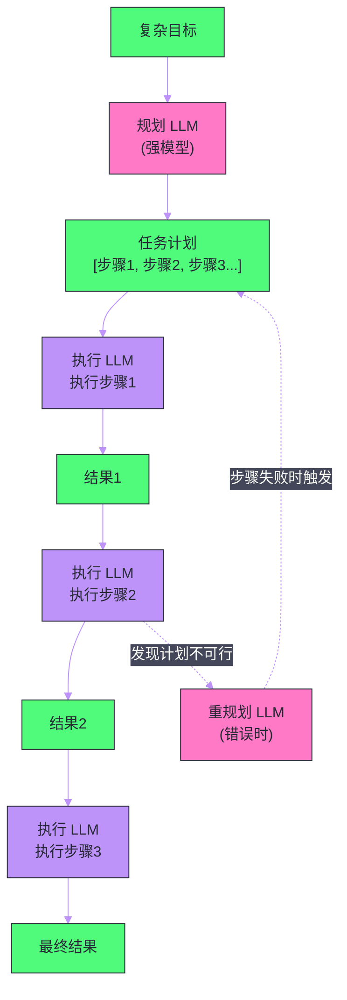

# 05 Agent 核心能力——推理、规划与工具调用

**摘要：**

一个 LLM 应用和一个 LLM Agent 的根本区别在于：应用是"一问一答"的，而 Agent 能够**自主分解目标、循环推理、调用工具、根据结果调整行为**，直到完成复杂的多步骤任务。本文从 Agent 的三大核心能力出发：**推理**（Reasoning，如何从目标到行动决策）、**规划**（Planning，如何将复杂目标分解为可执行步骤）和**工具调用**（Tool Use，如何与外部世界交互）。深入剖析最重要的 Agent 推理框架 **ReAct**（交错推理与行动）、面向长任务的 **Plan-and-Execute** 架构、能从错误中学习的 **Reflexion** 机制，以及 Function Calling 的底层工作原理。理解这三大核心能力，是从"会用 LLM"到"会构建 Agent"的关键跨越。

---

## 第 1 章 什么是 Agent：超越一问一答

### 1.1 定义与边界

"Agent"这个词在 AI 领域被过度使用，导致边界模糊。我们需要一个精确的定义：

**LLM Agent** 是一个由 LLM 驱动的系统，它能够：
1. **感知**（Perception）：接收来自环境的输入（用户指令、工具执行结果、外部状态）
2. **推理**（Reasoning）：基于目标和当前状态，决定下一步行动
3. **行动**（Action）：执行具体操作（调用工具、生成文本、与其他 Agent 通信）
4. **循环**（Loop）：将行动结果作为新的输入，进入下一轮推理，直到目标达成

这个"感知-推理-行动"的循环（Agent Loop）是 Agent 与普通 LLM 应用的本质区别。普通应用的 LLM 调用是单次的——用户输入→模型输出→结束。Agent 的 LLM 调用是迭代的——每一轮行动的结果都会触发新一轮的推理。

### 1.2 Agent 能力的三个层次

| 层次 | 代表能力 | 技术实现 |
| :--- | :--- | :--- |
| **推理** | 多步逻辑推导、因果分析、不确定性处理 | Chain-of-Thought, ReAct |
| **规划** | 任务分解、步骤排序、资源调度、错误恢复 | Plan-and-Execute, DAG 规划 |
| **工具调用** | 代码执行、API 调用、文件操作、数据库查询 | Function Calling, MCP |

这三层能力相互支撑：推理能力决定 Agent 能做多复杂的决策，规划能力决定 Agent 能处理多长的任务链，工具调用能力决定 Agent 能影响多广的外部世界。

### 1.3 Agent 与 Workflow 的边界

在工程实践中，Agent 和 Workflow（工作流）经常被混淆：

**Workflow（工作流）**：执行路径是**预先确定**的——流程图里每一步做什么、按什么顺序做，在设计时就固定了。LLM 可以参与其中的某些步骤（如文本生成），但整体流程是硬编码的。

**Agent**：执行路径是**运行时动态决定**的——LLM 根据当前状态和目标，自主决定下一步做什么、调用哪个工具、是否需要重试。流程是涌现的（Emergent），而非预先编排的。

这个区别决定了适用场景：已知流程、高可靠性要求 → Workflow；未知流程、需要灵活应对 → Agent。Anthropic 在其 Agent 构建指南中明确建议：**在任务能被 Workflow 完成时，优先用 Workflow；只有当需要动态适应性时，才引入 Agent**。

> [!note] 设计哲学
> Agent 的灵活性是有代价的：不确定性增加、调试困难、成本难以预测（循环次数不固定）。真正的工程智慧是**判断什么时候需要 Agent 的灵活性，什么时候 Workflow 的确定性更有价值**。盲目地将所有东西都做成 Agent，是当前业界的一个常见误区。

---

## 第 2 章 ReAct——推理与行动的交织

### 2.1 ReAct 的诞生动机

在 ReAct（Yao et al., 2022）提出之前，让 LLM 完成工具调用任务有两种主要方式：

**纯推理**（如 Chain-of-Thought）：让 LLM 在不调用任何工具的情况下，通过推理链一步步得出答案。优点是简单，缺点是推理只能依赖模型的参数知识，面对需要实时信息或精确计算的任务会失败（如"今天 AAPL 的股价是多少"）。

**纯行动**（如简单的 Function Calling）：让 LLM 根据任务直接输出工具调用序列，顺序执行。优点是能访问外部世界，缺点是没有推理过程——面对复杂任务，LLM 不知道为什么要调用某个工具，调用失败后也无法推理出修复策略。

ReAct 的洞见是：**推理和行动应该交替进行，互相增强**——推理指导行动（决定调用哪个工具），行动更新推理（工具结果成为新的推理依据）。

### 2.2 ReAct 的核心循环

ReAct 引入了三类输出：

- **Thought（思考）**：LLM 当前的推理过程，对工具不可见，只是 LLM 的"内心独白"
- **Action（行动）**：LLM 决定执行的具体操作（调用哪个工具、传入什么参数）
- **Observation（观察）**：工具执行结果，被注入回上下文作为下一轮推理的输入

完整的 ReAct 推理链示例（任务：查询 DeepMind CEO 的母校）：

```
Thought: 要回答这个问题，我需要先找出 DeepMind 的 CEO 是谁。
Action: search("DeepMind CEO")
Observation: DeepMind 的 CEO 是 Demis Hassabis，他也是联合创始人。

Thought: 找到了 CEO 是 Demis Hassabis。现在需要查找他的教育背景。
Action: search("Demis Hassabis 教育背景 大学")
Observation: Demis Hassabis 在剑桥大学国王学院读计算机科学本科，
             后在伦敦大学学院获得认知神经科学博士学位。

Thought: 已经获得了完整的教育信息。Hassabis 本科在剑桥大学，博士在伦敦大学学院。
Final Answer: DeepMind CEO Demis Hassabis 本科就读于剑桥大学国王学院（计算机科学），
              博士就读于伦敦大学学院（认知神经科学）。
```

### 2.3 ReAct 的 Prompt 设计

实现 ReAct 的关键是 System Prompt 的设计——需要告诉 LLM ReAct 的输出格式规范，以及可用的工具列表：

```
你是一个能够使用工具回答问题的 AI 助手。

可用工具:
- search(query: str): 在互联网上搜索信息，返回搜索结果摘要
- calculator(expression: str): 计算数学表达式，返回结果
- get_weather(city: str): 获取城市天气信息

回答问题时，请按以下格式交替输出推理和行动，直到得出最终答案：

Thought: [你的推理过程，分析当前情况和下一步计划]
Action: tool_name(参数)
Observation: [工具返回的结果，由系统填入]
... (可以重复多轮 Thought/Action/Observation)
Thought: [最终推理，整合所有信息]
Final Answer: [最终答案]

如果你已经知道答案，不需要使用工具，直接输出：
Thought: [推理]
Final Answer: [答案]
```

### 2.4 ReAct 的实现细节

在实际工程实现中，ReAct 循环的终止条件至关重要：

**正常终止**：LLM 输出 `Final Answer:` 标志，循环结束。

**最大步骤限制**：设置 `max_iterations`（通常 5-15 步），超过后强制终止并返回当前最佳答案，防止无限循环。

**工具调用错误处理**：工具执行失败时，将错误信息作为 Observation 返回给 LLM，让它决策是否重试、换一种方式调用，还是放弃这条路线。

**停止词（Stop Words）**：用 `Observation:` 作为停止词，让 LLM 在输出 Action 后停止生成，等待工具执行结果注入后再继续。这是 ReAct 的关键实现细节——LLM 本身不执行工具，它只"预言" Observation 的格式，实际上由外部代码截断并填入真实结果。

---

## 第 3 章 Function Calling 的底层机制

### 3.1 Function Calling 如何工作

[[Function Calling]]（工具调用）是现代 LLM API 的标准特性，是 ReAct 中 Action 环节的技术实现。它让 LLM 以结构化的 JSON 格式表达工具调用意图，而非在自由文本中夹杂工具调用（后者需要正则解析，不可靠）。

在 API 层面，工具调用通过以下步骤工作：

**步骤 1：工具注册**。调用 API 时，在 `tools` 参数中传入工具的 JSON Schema 描述：

```python
tools = [
    {
        "type": "function",
        "function": {
            "name": "get_weather",
            "description": "获取指定城市的当前天气",
            "parameters": {
                "type": "object",
                "properties": {
                    "city": {"type": "string", "description": "城市名称"}
                },
                "required": ["city"]
            }
        }
    }
]
```

**步骤 2：模型决策**。LLM 推理后判断需要调用工具，返回一个特殊的 `finish_reason: tool_calls` 响应：

```json
{
  "finish_reason": "tool_calls",
  "message": {
    "role": "assistant",
    "tool_calls": [
      {
        "id": "call_abc123",
        "type": "function",
        "function": {
          "name": "get_weather",
          "arguments": "{\"city\": \"北京\"}"
        }
      }
    ]
  }
}
```

**步骤 3：工具执行**。Host 应用解析 `tool_calls`，执行实际的函数，获取结果。

**步骤 4：结果注入**。将工具结果以 `role: tool` 消息的形式追加到对话历史中，再次调用 LLM：

```python
messages.append({
    "role": "tool",
    "tool_call_id": "call_abc123",
    "content": "北京：晴天，气温 25°C，湿度 60%"
})
```

**步骤 5：最终生成**。LLM 基于工具结果生成最终的自然语言回答。

### 3.2 并行工具调用

现代 LLM API（OpenAI GPT-4、Anthropic Claude）支持在单次回复中调用**多个工具**。当任务中的多个工具调用互相独立时（没有数据依赖），LLM 会在一次 `tool_calls` 响应中返回多个调用请求，Host 可以并行执行这些调用，显著减少总延迟。

例如，任务"比较北京和上海的天气"，LLM 会同时请求调用 `get_weather("北京")` 和 `get_weather("上海")`，Host 并行执行两个 API 调用，将两个结果都注入后，LLM 一次性生成对比答案。

这与 [[01 Prompt 工程——从零样本到思维链]] 中的查询分解思路呼应——将任务并行化是提升 Agent 效率的重要手段。

### 3.3 工具 Schema 的设计艺术

工具的 `description` 和 `parameters.description` 字段直接影响 LLM 的工具选择准确率。设计原则：

**description 要说清楚"何时用"**，而不只是"是什么"：

❌ 差的描述：`"查询数据库"`
✅ 好的描述：`"在用户订单数据库中按条件查询订单。当用户询问自己的历史订单、订单状态、某个时间段的订单时使用。不用于查询产品信息。"`

**parameters 要说清楚格式约束**：

```json
"date_range": {
  "type": "string",
  "description": "查询的日期范围，格式为 'YYYY-MM-DD,YYYY-MM-DD'，
                  如 '2024-01-01,2024-03-31' 表示查询 2024 年第一季度"
}
```

**必填 vs 可选要合理设计**：只将真正必须的参数放在 `required` 中，其余设为可选（带默认值）。过多的必填参数会让 LLM 在无法确定参数值时犹豫是否调用工具。

---

## 第 4 章 规划——处理长任务的能力

### 4.1 ReAct 的规模局限

ReAct 是一个"贪心"的规划者——每一步只看当前状态，决定下一步行动，不提前规划整个任务路径。这对于短任务（3-5 步以内）效果很好，但面对复杂的长任务（10+ 步，涉及多个阶段），ReAct 会遇到瓶颈：

**上下文累积**：每一步的 Thought/Action/Observation 都追加到上下文中，长任务的上下文会快速膨胀，导致性能下降和成本增加（[[06 推理优化——KV Cache、量化与投机解码]] 中讨论的 KV Cache 问题）。

**全局视野缺失**：ReAct 没有全局计划，容易在局部做出次优决策——比如为了解决眼前的小问题，走了一条绕远的路，而忽略了更直接的捷径。

**错误传播**：早期步骤的错误如果没有被发现，会被后续步骤继承和放大，最终导致整个任务失败。

### 4.2 Plan-and-Execute 架构

**Plan-and-Execute**（也叫 Task Decomposition + Execution）将 Agent 的工作分为明确的两个阶段：

**规划阶段**：用一个专门的"规划 LLM"（通常是更强大的模型）将复杂任务分解为有序的子任务列表（Plan）。这个 Plan 是全局性的，考虑了所有步骤的依赖关系和顺序。

**执行阶段**：用一个"执行 LLM"（可以是较小的模型，因为每步任务更简单）按 Plan 逐步执行，每步只关注当前子任务，不被全局的复杂性干扰。



Plan-and-Execute 的核心优势是**关注点分离**——规划和执行各自专注于不同层次的问题，互不干扰。

### 4.3 任务图（DAG）规划

对于存在并行关系的复杂任务，可以将 Plan 表示为一个**有向无环图（DAG）**，而非简单的线性序列：

```
任务: "研究竞品公司A、B、C，生成对比报告"

任务 DAG:
         ┌─── 研究公司A ───┐
起点 ────┤─── 研究公司B ───├── 生成对比报告 ── 终点
         └─── 研究公司C ───┘
```

研究三家公司是互相独立的，可以并行执行；只有三个研究任务都完成后，才能执行"生成对比报告"。DAG 规划允许调度器并行执行没有依赖关系的任务，显著减少总耗时。

### 4.4 动态重规划

计划不可能完美预测执行中的所有意外。当某个子任务失败或执行结果与预期不符时，需要**动态重规划**：

1. 将失败原因和当前已完成步骤的结果告知规划 LLM
2. 规划 LLM 基于新信息修订剩余步骤的计划
3. 继续执行修订后的计划

动态重规划使 Plan-and-Execute 架构具备了 ReAct 的灵活性——在保持全局视野的同时，也能适应执行中的意外。

---

## 第 5 章 Reflexion——从错误中学习

### 5.1 Agent 为什么需要自我反思

ReAct 和 Plan-and-Execute 都是"一次性"的推理框架——它们在当前 episode 内推理，但不会从当前 episode 的失败中学习，以便在**同一个任务的重试**中做得更好。

**Reflexion**（Shinn et al., 2023）通过引入**语言化的自我反思**（Verbal Reinforcement）解决这个问题：当 Agent 完成一个 episode 后（无论成功还是失败），它会生成一段关于"这次哪里做对了、哪里做错了、下次应该如何改进"的反思文本，并将这段反思存储在工作记忆中。在下一次尝试同一任务时，反思内容会被注入到上下文中，指导 Agent 避免重蹈覆辙。

### 5.2 Reflexion 的三个组件

**行动者（Actor）**：执行任务的 Agent，使用 ReAct 或其他框架。

**评估者（Evaluator）**：对 Actor 的输出进行评分，判断任务是否成功以及质量如何。评估者可以是：
- 确定性规则（代码测试通过/失败）
- 另一个 LLM（对结果质量的主观评判）
- 外部信号（用户反馈、程序运行结果）

**自我反思者（Self-Reflector）**：在 episode 结束后，接收 Actor 的轨迹（Thought/Action/Observation 序列）和 Evaluator 的评分，生成反思文本：

```
[反思示例]
在这次任务中，我犯了以下错误：
1. 第3步我搜索了"Python sort list"，但任务要求的是对字典列表按特定键排序，
   应该搜索"Python sort list of dicts by key"
2. 我在没有验证结果正确性的情况下就提交了答案，
   应该先运行代码验证输出

下次遇到类似任务时，我应该：
- 在搜索时包含更具体的技术细节
- 对生成的代码进行测试验证再提交
```

在下一次尝试时，这段反思会被加入到 System Prompt 的末尾，让 Actor 能避免同样的错误。

### 5.3 Reflexion 的工程应用

Reflexion 的完整实现在工程上有一定复杂度，但其核心思想（**让 Agent 在每次任务后总结经验，下次做得更好**）可以轻量级地应用于很多场景：

- 代码生成 Agent：代码执行失败后，LLM 分析错误信息并生成"下次避免这个错误的注意事项"，重试时注入这些注意事项
- 测试驱动开发 Agent：每次代码提交后运行测试，测试失败的信息和 LLM 的自我分析都保存为反思，指导后续修改
- 对话式 Agent：在多轮对话中，发现用户对某个回答不满意时，分析原因并在后续回复中改进

---

## 第 6 章 代码执行——最强大的工具

### 6.1 代码执行器的特殊地位

在 Agent 的所有工具中，**代码执行器**（Code Interpreter）具有特殊地位——它不是一个针对特定功能的工具，而是一个**能力乘数**：Agent 可以编写代码来完成任何可以被编程完成的任务，从数学计算到数据分析、从文件处理到 API 调用。

OpenAI 的 Code Interpreter（现更名为 Advanced Data Analysis）让 ChatGPT 能处理 CSV 文件、绘制图表、执行复杂计算——这一功能极大地扩展了 LLM 的实用能力，因为代码执行赋予了模型**精确计算**的能力（弥补了 LLM 数学计算不可靠的缺陷）。

### 6.2 安全沙箱

代码执行是一把双刃剑——赋予了 Agent 强大能力的同时，也引入了安全风险。未经限制的代码执行环境中，恶意或意外的代码可能删除文件、发起网络攻击、耗尽系统资源。

**沙箱技术**是代码执行器的安全保障：

- **容器隔离**（Docker）：在独立容器中执行代码，与宿主系统隔离
- **网络限制**：禁止沙箱内的代码访问外部网络（或只允许访问白名单 URL）
- **文件系统限制**：只允许访问特定的临时目录
- **资源限制**：CPU/内存/时间的硬限制，防止死循环和资源耗尽
- **系统调用过滤**（seccomp）：限制可以执行的系统调用集合

商业化的代码执行沙箱服务：**E2B**（专为 AI 设计的代码沙箱）、**Modal**（云端函数执行）、**Daytona**。对于自建，Docker + resource limit 是最实用的方案。

---

## 第 7 章 Agent 的失效模式与防范

### 7.1 常见失效模式

理解 Agent 的失效模式与理解它的能力同样重要：

**无限循环**：Agent 陷入"调用工具→得到结果→判断需要再调用→..."的循环，无法收敛到最终答案。防范：设置严格的 `max_iterations` 限制，超过后强制返回当前最佳结果或错误信息。

**工具误用**：Agent 调用了不适合当前情境的工具，或者以错误的方式使用工具（参数错误、误解工具功能）。防范：精心设计工具描述，在工具 Schema 中加入用法示例和反例。

**幻觉式工具调用**：Agent 编造了不存在的工具名，或者编造了工具的参数（如填入不存在的文件路径）。防范：在 Host 层严格验证工具名和参数格式，对无效调用返回明确的错误信息。

**上下文溢出**：长任务中 Thought/Action/Observation 的累积导致上下文超过模型限制。防范：实现上下文压缩（将早期步骤摘要化）、设置步骤数限制、使用支持更长上下文的模型。

**目标漂移**：Agent 在执行过程中"忘记"了原始目标，被中间步骤的细节所吸引，最终输出的答案与原始任务偏离。防范：在每一轮推理的系统提示中重申原始目标，让 Agent 始终"看到"自己要完成什么。

> [!warning] 生产避坑
> 在生产环境中，任何涉及写操作（创建/修改/删除文件、发送邮件、提交代码、执行支付）的工具调用，都应该在执行前呈现给用户确认。这个"人在回路"（Human-in-the-Loop）机制是当前 Agent 系统安全性的最后防线——模型的推理不够可靠，特别是在高风险操作上，人工确认是不可或缺的。

---

## 第 8 章 Agent 框架：ReAct 的工程实现

### 8.1 标准 Agent 循环的伪代码

一个标准 ReAct Agent 的核心循环实现逻辑如下：

```python
def run_agent(goal: str, tools: list[Tool], max_iterations: int = 10) -> str:
    """
    标准 ReAct Agent 循环
    
    Args:
        goal: 用户的目标/问题
        tools: 可用工具列表
        max_iterations: 最大迭代次数，防止无限循环
    """
    # 初始化对话历史，注入目标和工具描述
    messages = [
        {"role": "system", "content": build_system_prompt(tools)},
        {"role": "user", "content": goal}
    ]
    
    for i in range(max_iterations):
        # 调用 LLM，让它决定下一步行动
        response = llm.chat(messages, tools=get_tool_schemas(tools))
        
        # 如果 LLM 认为任务完成，直接返回最终答案
        if response.finish_reason == "stop":
            return response.content
        
        # LLM 决定调用工具
        if response.finish_reason == "tool_calls":
            # 将 LLM 的工具调用请求追加到历史
            messages.append(response.message)
            
            # 执行工具调用（可能是并行的多个调用）
            tool_results = []
            for tool_call in response.tool_calls:
                result = execute_tool(tool_call.name, tool_call.arguments)
                tool_results.append({
                    "role": "tool",
                    "tool_call_id": tool_call.id,
                    "content": result
                })
            
            # 将所有工具结果注入对话历史
            messages.extend(tool_results)
            # 继续下一轮循环
            continue
    
    # 超过最大迭代次数，返回当前状态
    return "任务未能在规定步骤内完成，请尝试分解为更简单的子任务。"
```

### 8.2 主流 Agent 框架对比

| 框架 | 核心特性 | Agent 支持 | 适用场景 |
| :--- | :--- | :--- | :--- |
| **LangChain** | 丰富的组件生态、LCEL（链式表达式） | ReAct, Plan-and-Execute | 通用 Agent 开发，最成熟 |
| **LlamaIndex** | RAG 专精、数据连接器丰富 | ReAct, Sub-Question | 以 RAG 为核心的 Agent |
| **CrewAI** | 多 Agent 协作、角色定义 | Multi-Agent | 多 Agent 任务分工 |
| **AutoGen (Microsoft)** | 多 Agent 对话框架 | Multi-Agent | 复杂多 Agent 工作流 |
| **LangGraph** | 状态图（State Graph）架构 | ReAct, 自定义循环 | 需要精确控制流的 Agent |

---

## 第 9 章 总结

Agent 的三大核心能力构成了完整的能力闭环：

| 能力 | 核心框架 | 解决的问题 |
| :--- | :--- | :--- |
| **推理** | ReAct | 交替推理与行动，逐步逼近目标 |
| **规划** | Plan-and-Execute, DAG | 全局视野，处理长任务，支持并行 |
| **工具调用** | Function Calling, MCP | 访问外部世界，突破参数知识限制 |
| **自我改进** | Reflexion | 从错误中学习，提升重试成功率 |

三大能力不是孤立的，而是相互支撑：工具调用让推理有了与现实世界交互的手段，规划让工具调用更有序，Reflexion 让整个系统能从经验中持续改进。

下一篇 [[06 Agent 记忆体系——从短期缓冲到长期知识]] 将深入探讨 Agent 的"记忆"——如何让 Agent 在单次任务中维持上下文（短期记忆），以及如何让 Agent 在任务之间积累知识（长期记忆）。

---

## 参考文献

1. Yao et al., "ReAct: Synergizing Reasoning and Acting in Language Models", ICLR 2023
2. Shinn et al., "Reflexion: Language Agents with Verbal Reinforcement Learning", NeurIPS 2023
3. Wang et al., "Plan-and-Solve Prompting: Improving Zero-Shot Chain-of-Thought Reasoning by Large Language Models", ACL 2023
4. Significant Gravitas, "AutoGPT: An Autonomous GPT-4 Experiment", GitHub 2023
5. Chase, "LangChain: Building applications with LLMs through composability", GitHub 2022
6. OpenAI, "Function Calling Documentation", 2023
7. Anthropic, "Building Effective Agents", 2024
8. Sumers et al., "Cognitive Architectures for Language Agents", TMLR 2024
