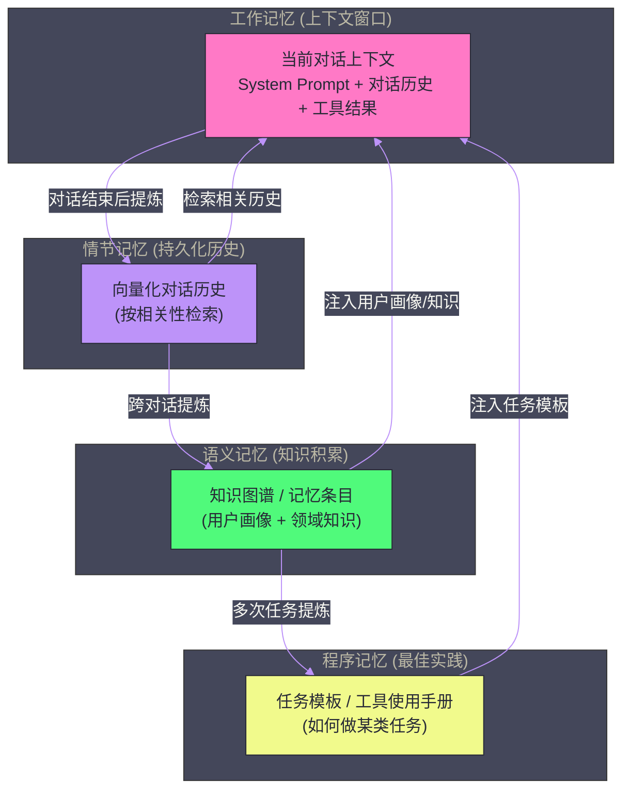

# 06 Agent 记忆体系——从短期缓冲到长期知识

**摘要：**

一个没有记忆的 Agent 是"失忆症患者"——每次对话都从零开始，无法积累用户偏好，无法记住过去的任务结果，无法在多次交互中形成连贯的知识体系。**记忆**是 Agent 从"工具"演进为"伙伴"的关键能力跨越。本文系统剖析 Agent 记忆的完整四层体系：**In-Context Memory（短期缓冲）** 如何在单次任务中维持工作状态；**Episodic Memory（情节记忆）** 如何跨会话保存交互历史；**Semantic Memory（语义记忆）** 如何积累结构化知识；**Procedural Memory（程序记忆）** 如何沉淀最佳实践。每一层的技术实现、工程挑战与适用边界，构成了 Agent 记忆工程的完整图谱。

---

## 第 1 章 为什么 Agent 需要记忆

### 1.1 无状态 LLM 的根本局限

标准 LLM API 是**无状态的（Stateless）**——每次 API 调用完全独立，模型不保留任何之前调用的信息。这在单轮问答场景下不是问题，但在需要持续交互的 Agent 场景中，无状态造成了严重的能力局限：

**用户体验割裂**：用户在今天的对话中告诉 Agent "我不喜欢代码注释用英文，请用中文"，第二天重新打开对话，Agent 完全不记得这个偏好，又用英文注释了——用户需要不断重复说明自己的偏好和背景，体验极差。

**任务不可持续**：一个需要多天完成的复杂研究任务，Agent 每次都要从头开始理解上下文，无法在前一天的工作基础上继续——每次都重新"热身"，效率极低。

**知识无法积累**：Agent 在执行任务中发现了一个有用的技巧（比如"这个 API 需要先调用认证接口获取 token"），但这个知识随着会话结束而消失，下次遇到同样情况又要重新探索。

**无法个性化**：不知道用户是初级还是资深工程师，不知道用户偏好简洁回答还是详细解释，不知道用户的技术栈和项目背景——Agent 只能提供千人一面的通用回答。

### 1.2 人类记忆的启发

理解 Agent 记忆体系，先从人类记忆的分类说起——这不是类比的噱头，而是因为现代认知科学对记忆的分类确实为 Agent 记忆架构提供了有效的框架。

**工作记忆（Working Memory）**：当前"意识舞台"上的内容——你现在正在思考的事情，阅读一个句子时脑中保持的前几个词。容量极小（约 7±2 个组块），但访问速度极快。对应 Agent 的**上下文窗口（In-Context Memory）**。

**情节记忆（Episodic Memory）**：对具体事件和个人经历的记忆——"上周三我在星巴克和老王谈了那个项目"。可以回忆具体时间、地点、情境。对应 Agent 的**会话历史（Episodic Memory Store）**。

**语义记忆（Semantic Memory）**：对概念、事实、知识的抽象记忆——"巴黎是法国首都"、"Python 的列表推导式语法是 `[x for x in iterable]`"。不依赖具体经历，是去情境化的知识。对应 Agent 的**知识库（Semantic Memory Store）**。

**程序记忆（Procedural Memory）**：如何做某件事的记忆——骑自行车、打字、驾车。高度自动化，不需要有意识地回忆步骤。对应 Agent 的**最佳实践库（Procedural Memory Store）**：已验证的工具使用方式、任务执行模板。

---

## 第 2 章 In-Context Memory——上下文窗口

### 2.1 上下文即记忆

LLM 的上下文窗口（Context Window）就是它的"工作记忆"——所有当前会话中的信息：System Prompt、对话历史、工具调用记录、检索到的文档……都存放在这个"工作台"上。模型在生成每个 token 时，可以通过 Self-Attention 机制自由访问上下文中的任何位置。

这是 Agent 最基础的记忆层，也是唯一"天然存在"的记忆形式。但它有几个不可回避的限制：

**容量上限（Context Length Limit）**：即使是 Claude 3.5 的 200K token 上下文，在密集的多轮对话加上大量工具调用结果后，也可能在几十轮内被填满。填满后，最早的对话内容要么被截断（丢失），要么超出计费范围（成本剧增）。

**注意力稀释（Lost in the Middle）**：[[08 长上下文与多模态——技术前沿]] 中提到的实验结论——即使模型声称支持 128K 上下文，对中间位置的内容的"注意力"也显著低于开头和结尾。超长上下文并不等于超强的信息利用能力。

**成本正比增长**：LLM API 按 token 计费，上下文越长，每次请求的成本越高。一个对话进行到第 100 轮时，每次回复都需要处理前 100 轮的所有内容——成本是第 1 轮的 100 倍。

### 2.2 上下文管理策略

针对上下文的局限，工程上有几种成熟的管理策略：

**策略一：滑动窗口（Sliding Window）**

只保留最近的 $K$ 轮对话，超出的历史直接丢弃。实现最简单，但会硬切断对话历史，可能丢失重要的上下文（如用户在第 5 轮设定的偏好，在第 50 轮时被遗忘）。适合上下文依赖不强的场景（如简单问答）。

**策略二：摘要压缩（Summary Compression）**

当对话历史接近上下文上限时，用一个小型 LLM（或同一个模型）将较早的对话历史压缩为一段摘要，用摘要替换原始的多轮对话。

```
原始历史（20轮，10000 token）：
[用户: 我在做一个 FastAPI 项目...]
[助手: 好的，FastAPI 是...]
[用户: 我想连接 PostgreSQL...]
... (大量中间过程)

压缩后（1段摘要，300 token）：
"用户正在开发一个基于 FastAPI 和 PostgreSQL 的后端服务。
当前进度：已完成用户认证模块（JWT），正在开发订单管理 API。
用户偏好：代码注释用中文，函数名用小驼峰命名。
技术栈：Python 3.11, FastAPI, SQLAlchemy 2.0, PostgreSQL 15。"
```

摘要保留了任务进度、用户偏好、技术栈等关键信息，而丢弃了详细的问答过程。通常需要精心设计摘要 Prompt，确保摘要包含 Agent 后续工作所需的关键信息。

**策略三：关键信息提取（Key-Value Store）**

在对话过程中，让 Agent 主动识别和提取关键信息（用户偏好、任务状态、已完成步骤、待办事项），以结构化的键值对存储。这些信息总是注入 System Prompt，不受对话历史长度的影响。

```json
{
  "user_profile": {
    "tech_level": "senior",
    "preferred_language": "zh-CN",
    "tech_stack": ["Python", "FastAPI", "PostgreSQL"],
    "naming_convention": "snake_case"
  },
  "current_task": {
    "project": "订单管理系统",
    "current_module": "订单状态流转 API",
    "completed": ["用户认证", "商品查询", "购物车"],
    "pending": ["支付集成", "消息通知"]
  }
}
```

这种方案对结构化信息效果好，但对非结构化的对话细节（如"用户提过一个特殊的业务规则"）不易捕捉。

**策略四：RAG 增强上下文**

将历史对话存储到向量数据库中，每次新对话时检索与当前话题最相关的历史片段，动态注入上下文。这样上下文始终保持在合理长度，同时能按需取回任意历史信息。详见本章第 3 节（Episodic Memory）。

> [!info] 核心概念
> 上下文管理的核心矛盾是：**保留更多历史 → 成本增加 + 注意力稀释**，**删减历史 → 可能丢失关键上下文**。没有完美的解决方案，只有针对具体使用场景的最优权衡。高频短对话优先滑动窗口；长任务优先摘要压缩；需要长期个性化的场景优先 RAG 增强。

---

## 第 3 章 Episodic Memory——情节记忆

### 3.1 跨会话的对话历史

情节记忆存储的是 Agent 与用户/环境交互的具体事件序列——"什么时间、在什么上下文中发生了什么"。在 Agent 工程中，情节记忆的主要载体是**持久化的对话历史**。

标准聊天 API 的对话历史只存在于单次会话中，会话结束即消失。要实现跨会话的情节记忆，需要：

1. 在每次对话结束后，将对话历史持久化到外部存储（数据库、文件系统）
2. 在新会话开始时，从存储中加载历史（全量加载或检索式加载）
3. 将历史注入到新会话的上下文中，让 Agent"记得"之前的交互

### 3.2 向量化的情节记忆

全量加载所有历史对话不现实——用户可能有几年的对话历史，无法全部放入上下文。更实用的方案是将历史对话向量化存储，按需检索：

```python
class EpisodicMemory:
    def __init__(self, vector_store, embedding_model):
        self.vector_store = vector_store      # 如 Chroma/Qdrant
        self.embedding_model = embedding_model

    def save_episode(self, episode: dict):
        """保存一个对话片段到情节记忆"""
        text = f"[{episode['timestamp']}] 用户: {episode['user_msg']}\n助手: {episode['agent_msg']}"
        embedding = self.embedding_model.encode(text)
        self.vector_store.add(
            ids=[episode['id']],
            embeddings=[embedding],
            documents=[text],
            metadatas=[{
                "timestamp": episode['timestamp'],
                "user_id": episode['user_id'],
                "topic": episode.get('topic', ''),
                "importance": episode.get('importance', 0.5)
            }]
        )

    def retrieve_relevant(self, current_context: str, top_k: int = 5) -> list[str]:
        """检索与当前上下文最相关的历史片段"""
        query_embedding = self.embedding_model.encode(current_context)
        results = self.vector_store.query(
            query_embeddings=[query_embedding],
            n_results=top_k
        )
        return results['documents'][0]
```

在每次新对话开始时，用当前的 System Prompt 或用户首条消息检索最相关的历史片段，将其注入上下文：

```
[注入到 System Prompt 的历史记忆]
相关历史记忆（供参考）：
- [2024-12-15] 用户曾询问过 FastAPI 的认证实现，我提供了 JWT 方案。
  用户确认采用了这个方案。
- [2024-12-20] 用户遇到了 PostgreSQL 连接池耗尽的问题，
  我建议使用 asyncpg + SQLAlchemy async，用户表示已解决。
- [2025-01-03] 用户提到他们的团队代码规范要求所有公共 API 都要有 docstring。
```

### 3.3 情节记忆的重要性评分

并非所有对话片段都值得长期保存。一个成熟的情节记忆系统需要对片段的"重要性"进行评分，优先保存高价值内容：

**高重要性**（应长期保存）：
- 用户明确声明的偏好（"我不喜欢..."、"我的团队规范是..."）
- 任务的重大决策节点（"我们决定用 microservice 架构"）
- 已解决的技术难题（问题描述 + 解决方案）
- 错误和教训（"之前用这个方案失败了，因为..."）

**低重要性**（可以压缩或丢弃）：
- 简单的一问一答（"Python 列表用什么方法排序？" "sort()"）
- 重复性的打招呼和寒暄
- 中间过程的探索步骤（最终被放弃的路线）

可以用一个简单的 LLM 分类来自动评分："给这段对话的重要性打分 1-5，并说明理由"。

---

## 第 4 章 Semantic Memory——语义记忆

### 4.1 情节记忆的局限

情节记忆保存的是"发生过什么"——具体的时间、事件、对话。但知识的积累需要从大量具体事件中提炼出**通用、去情境化的事实和规律**。

例如，用户在不同时间段说过：
- "我们用 Kubernetes 部署服务"（第 5 次对话）
- "我们的 k8s 集群用 Helm 管理"（第 23 次对话）
- "我们的 pod 内存限制通常是 512Mi"（第 41 次对话）

这三条情节记忆可以提炼成一条**语义记忆**："用户使用 Kubernetes + Helm 部署服务，典型 Pod 内存限制 512Mi"。这条语义记忆比三条原始情节更紧凑、更易检索、更通用。

### 4.2 知识图谱式语义记忆

最结构化的语义记忆形式是**知识图谱**——将知识表示为实体（Entity）和关系（Relation）的三元组：

```
(用户, 使用, Kubernetes)
(用户项目, 采用, 微服务架构)
(用户团队, 规模, 5人)
(用户, 擅长, Python)
(用户, 不熟悉, Rust)
```

OpenAI 官方的 [[memory]] MCP Server 就是基于知识图谱实现的——它维护一个本地的知识图谱，随着对话积累自动提炼实体和关系，在后续对话中自动检索相关节点注入上下文。

### 4.3 语义记忆的提炼与更新

从情节记忆提炼语义记忆需要一个**知识提炼（Knowledge Distillation）** 过程。可以在每次对话结束后，用 LLM 分析本次对话，提炼出新的知识点：

```python
KNOWLEDGE_EXTRACTION_PROMPT = """
分析以下对话，提炼出关于用户、用户项目、用户偏好的结构化知识点。
每条知识点格式：(主体, 属性/关系, 值)
只提炼明确、可验证的信息，不要推测。

对话：
{conversation}

提炼出的知识点（JSON数组格式）：
[
  {"subject": "...", "predicate": "...", "object": "..."},
  ...
]
"""
```

语义记忆还需要处理**知识更新**——用户的技术栈、项目状态会随时间变化。需要检测与现有知识的冲突（"用户之前用 Python，现在说改用 Go 了"），并更新对应的知识节点，而非简单追加。

### 4.4 自然语言语义记忆（Mem0 方案）

对于不需要严格图结构的场景，**Mem0**（一个开源的 Agent 记忆库）提供了更工程化的语义记忆方案：

1. 每次对话后，用 LLM 从对话中提炼出"记忆条目"（自然语言句子，如"用户偏好简洁的代码，不喜欢过度注释"）
2. 将记忆条目向量化存储
3. 查询时，将新问题与现有记忆条目做相似度匹配，检索相关记忆注入上下文
4. 添加新记忆时，自动检测与现有记忆的冲突，更新矛盾的记忆而非重复添加

Mem0 的优势是实现简单（不需要维护图数据库），同时通过向量检索实现了灵活的记忆查询。

---

## 第 5 章 Procedural Memory——程序记忆

### 5.1 从经验到最佳实践

程序记忆是最高层次的记忆抽象——它不记录"发生了什么"（情节），也不记录"知道什么"（语义），而是记录**"如何做某件事"**：完成特定类型任务的步骤、工具的最佳使用方式、已验证的模板和脚手架。

一个具体的例子：Agent 在处理第 20 个"分析 CSV 数据文件并生成报告"的任务时，已经形成了一套高效的工作流：

1. 先用 `read_file` 读取 CSV 文件的前 5 行，了解列名和数据格式
2. 检查数据类型（用 pandas `dtypes`）
3. 检查缺失值（`isnull().sum()`）
4. 生成基础统计描述（`describe()`）
5. 根据数据特点选择可视化类型（数值型→直方图，分类型→柱状图）
6. 按照用户偏好的报告模板生成 Markdown 报告

这套工作流是从大量类似任务的执行经验中提炼出来的"最佳实践"。如果 Agent 能记住这套流程，下次遇到类似任务时直接复用，而不是从头推导，效率会大幅提升。

### 5.2 程序记忆的技术实现

程序记忆的存储形式通常比情节记忆更结构化：

**工具使用模板**：特定工具（如 GitHub API、Jira API）的标准调用序列，以及每种场景下应该传递的参数模板。

**任务执行模板**：对特定类型任务（代码审查、数据分析、文档生成）的标准执行步骤，以 Prompt 模板或伪代码的形式存储。

**错误处理手册**：常见错误的识别特征和对应的修复策略。例如"如果 SQL 查询返回空结果，先检查日期范围，再检查表名拼写"。

在工程实践中，程序记忆通常以**System Prompt 片段**的形式存储——当 Agent 开始一个特定类型的任务时，自动将对应的程序记忆片段注入 System Prompt，给 Agent 提供"肌肉记忆"。

---

## 第 6 章 记忆体系的整体架构

### 6.1 四层记忆的分工与协作



这四层记忆形成一个**由下到上的抽象层次**，以及一个**由上到下的注入路径**：

- **抽象方向（下→上）**：具体事件→经验积累→知识提炼→最佳实践
- **注入方向（上→下）**：程序记忆/语义记忆/情节记忆按需检索，都注入到上下文窗口（工作记忆）

### 6.2 记忆与遗忘的平衡

人类记忆有遗忘机制——不重要的信息会逐渐淡化，重要的信息会强化。Agent 的记忆系统同样需要处理"遗忘"：

**时间衰减（Temporal Decay）**：老旧的记忆随时间降低权重。用户三年前用的是 Python 2.7，现在肯定已经升级了，这条记忆的相关性应该降低。实现：为记忆条目记录创建时间，检索时对老记忆的相似度分数乘以一个时间衰减因子。

**显式更新与删除**：当用户明确声明某个信息已经变化（"我换工作了"、"我们不用 Vue 了，改用 React"），旧的相关记忆应该被更新或标记为过期。

**重要性阈值**：只有重要性评分超过阈值的信息才进入长期记忆，低价值的信息不保存，控制记忆库的规模。

---

## 第 7 章 工程实践：构建 Agent 记忆系统

### 7.1 最小可行记忆系统

对于大多数生产 Agent，一个实用的"最小可行记忆系统"由两部分组成：

**持久化的用户画像（User Profile）**：以结构化 JSON 存储用户的关键属性，每次新会话时全量注入 System Prompt。内容通常包括：技术水平、偏好语言、技术栈、项目背景、沟通风格偏好。总大小控制在 300-500 token 以内，不影响上下文预算。

**向量化的对话历史**：对话历史存入向量数据库，每次新会话开始时检索 Top-5 最相关的历史片段注入上下文。这两部分就能覆盖 80% 的记忆需求场景。

### 7.2 记忆的隐私与安全

Agent 记忆系统需要认真对待隐私问题：

**数据隔离**：多用户系统中，每个用户的记忆必须严格隔离，不能被其他用户的 Agent 访问。向量数据库中需要为每条记忆记录 `user_id`，所有查询都必须带上 `user_id` 过滤条件。

**敏感信息保护**：对话中可能包含密码、API Key、个人隐私信息。记忆系统在存储前应过滤或脱敏这类信息，避免将敏感数据持久化到记忆库。

**用户控制权**：用户应该能查看 Agent 存储了哪些关于自己的记忆，并能删除不想保留的记忆。这是 GDPR 等隐私法规的基本要求，也是用户信任的基础。

### 7.3 记忆系统的评估

如何判断记忆系统运作良好？关键指标：

| 指标 | 衡量方式 | 目标 |
| :--- | :--- | :--- |
| **记忆召回率** | 相关历史是否被检索到 | > 80% |
| **记忆精度** | 检索到的历史中有多少真正相关 | > 70% |
| **知识一致性** | 语义记忆中是否存在互相矛盾的条目 | < 5% |
| **上下文注入量** | 注入的记忆占上下文的比例 | < 20% |
| **用户感知** | 用户是否感觉 Agent"记住"了重要信息 | 主观评分 |

---

## 第 8 章 总结

Agent 记忆体系是从"工具"到"伙伴"的关键跨越。四层记忆各司其职：

| 记忆层 | 存储内容 | 持久化时间 | 技术实现 |
| :--- | :--- | :--- | :--- |
| **In-Context** | 当前会话工作状态 | 会话内 | LLM 上下文窗口 |
| **Episodic** | 历史对话事件 | 跨会话，长期 | 向量数据库 |
| **Semantic** | 提炼的用户/领域知识 | 长期，可更新 | KV 存储 / 知识图谱 |
| **Procedural** | 任务模板 / 最佳实践 | 长期，版本化 | 结构化文档 / Prompt 库 |

下一篇 [[07 Agent 框架选型——LangChain、LlamaIndex 与 LangGraph]] 将从记忆的能力抽象，回归到工程框架的具体选型——不同框架在记忆管理、工具集成、多 Agent 协作上各有侧重，如何根据项目需求做出正确的选择？

---

## 参考文献

1. Park et al., "Generative Agents: Interactive Simulacra of Human Behavior", UIST 2023
2. Sumers et al., "Cognitive Architectures for Language Agents", TMLR 2024
3. Packer et al., "MemGPT: Towards LLMs as Operating Systems", arXiv 2023
4. Mem0, "The Memory Layer for AI Apps", github.com/mem0ai/mem0, 2024
5. Zhong et al., "MemoryBank: Enhancing Large Language Models with Long-Term Memory", AAAI 2024
6. OpenAI, "Memory and New Controls for ChatGPT", 2024
7. Anthropic, "Memory MCP Server", github.com/modelcontextprotocol/servers, 2024

---

> [!note] 思考题
> 1. Agent 的短期记忆（对话历史）受限于 LLM 的上下文窗口。即使模型支持 128K token，将所有对话历史塞入 Prompt 也会导致'注意力稀释'（信息太多模型反而找不到关键内容）。滑动窗口（保留最近 N 轮）和摘要压缩（用 LLM 总结历史对话）各有什么取舍？在什么场景下摘要压缩会丢失关键信息？
> 2. Agent 的长期记忆（跨会话的知识）通常存储在向量数据库中。但记忆的'遗忘'和'更新'同样重要——如果用户修正了之前的偏好，旧记忆不应继续影响 Agent 行为。你如何设计记忆的版本管理和过期机制？直接覆盖旧记忆与保留历史版本各有什么优劣？
> 3. 反思（Reflection）机制让 Agent 在任务完成后回顾执行过程，总结经验教训并存储为长期记忆。但反思的质量取决于 LLM 的自我评估能力——如果 LLM 无法准确判断'哪一步做得不好'，反思可能产生错误的经验。你如何验证反思结果的正确性？外部评估（如人工反馈）与自动评估（如结果验证）如何配合？
