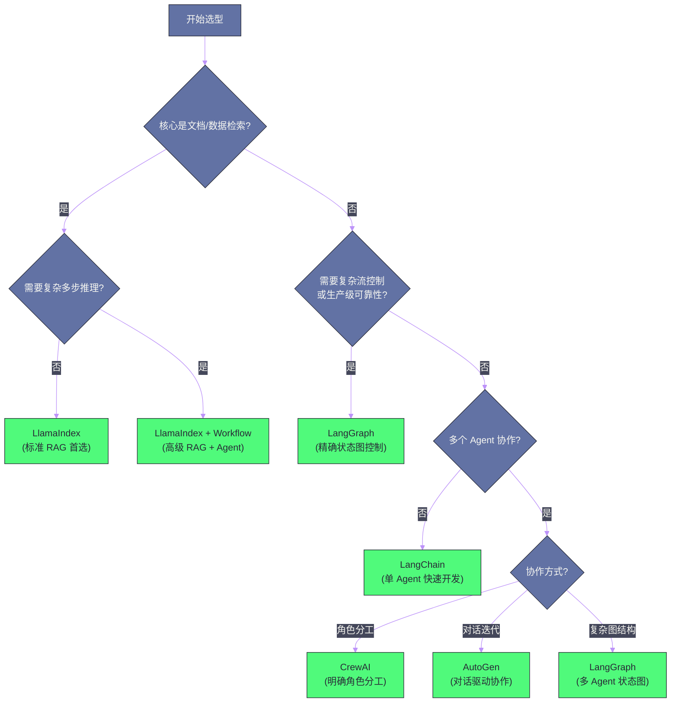

# 07 Agent 框架选型——LangChain、LlamaIndex 与 LangGraph

**摘要：**

当你决定构建一个 LLM Agent 时，面临的第一个工程决策是：用什么框架？LangChain、LlamaIndex、LangGraph、CrewAI、AutoGen——每个框架都有自己的设计哲学、擅长的场景和不可回避的缺陷。盲目选择主流框架（通常是 LangChain），往往在项目后期才发现它不适合自己的场景，此时重构代价极高。本文从**设计哲学**出发，深入剖析主流框架的核心抽象和适用边界：LangChain 的"组件生态"思路、LlamaIndex 的"数据中心"定位、LangGraph 的"状态机"架构、CrewAI 的"角色协作"模型、AutoGen 的"对话驱动"范式。最终给出一个基于项目需求的**框架选型决策树**，帮助你在项目初期做出正确的选择。

---

## 第 1 章 为什么框架选型如此重要

### 1.1 框架的本质：设计决策的集合

一个 Agent 框架不仅仅是"封装了一些 LLM 调用的库"——它是一套**关于 Agent 应该如何组织和运行的观点（Opinionated Design）**。不同框架对以下问题有不同的答案：

- Agent 的状态应该如何表示和传递？
- 工具调用应该如何声明和执行？
- 多步骤任务应该如何调度和编排？
- 错误处理和重试应该在哪一层处理？
- 如何在灵活性和约束性之间取得平衡？

这些设计决策深度渗透到框架的每一个 API 中。选错框架意味着不断和框架的设计哲学"对抗"——你想做的事情，框架不支持或者绕路很大；框架强迫你做的事情，对你的场景又没有意义。

### 1.2 框架的生命周期风险

LLM 框架是一个快速演化的领域：

- **LangChain** 在 2023-2024 年经历了剧烈的 API 重构（从 `Chain` 到 LCEL），大量早期教程代码已过时，升级旧项目代价高
- **AutoGen** 在 0.2 到 0.4 版本之间有重大架构变更，从单一框架拆分为多个包
- **新框架不断涌现**：每隔几个月就有新的 Agent 框架出现，宣称解决了现有框架的所有问题

在框架选型时，不仅要看当前的功能，还要评估框架的社区活跃度、背后的维护团队（是个人项目还是有公司支持）、和主流 LLM 提供商的关系。

---

## 第 2 章 LangChain——组件生态的领导者

### 2.1 设计哲学

LangChain 的核心设计思路是**组件化**——将 LLM 应用的各个部分（模型调用、Prompt 模板、输出解析、记忆、工具、检索器）抽象为可独立替换的标准组件，通过"链"（Chain）将它们连接起来。

这个思路的优势是**灵活性和可替换性**：你可以用 OpenAI 的模型，也可以换成 Anthropic 或本地的 Ollama，接口不变；你可以用 Chroma 向量库，也可以换成 Qdrant，接口不变。LangChain 提供了统一的抽象层。

### 2.2 LCEL——LangChain 表达式语言

2024 年，LangChain 推出了 **LCEL（LangChain Expression Language）** 作为构建应用的核心方式。LCEL 使用管道运算符（`|`）将组件串联，形成声明式的处理链：

```python
from langchain_core.prompts import ChatPromptTemplate
from langchain_openai import ChatOpenAI
from langchain_core.output_parsers import StrOutputParser

# LCEL: prompt | model | output_parser
chain = (
    ChatPromptTemplate.from_messages([
        ("system", "你是一个代码助手"),
        ("human", "{question}")
    ])
    | ChatOpenAI(model="gpt-4o")
    | StrOutputParser()
)

# 同步调用
result = chain.invoke({"question": "解释一下什么是 Python 装饰器"})

# 流式输出
for chunk in chain.stream({"question": "写一个快速排序的实现"}):
    print(chunk, end="", flush=True)
```

LCEL 的优势是：所有 LCEL 链天然支持 `.invoke()`、`.stream()`、`.batch()`、`.ainvoke()` 等调用方式——你用同样的代码可以同步调用、流式输出、批量处理或异步并发，无需额外修改。

### 2.3 LangChain Agent

LangChain 的 Agent 实现基于 `create_react_agent`（[[05 Agent 核心能力——推理、规划与工具调用]] 中的 ReAct 框架）。工具通过 `@tool` 装饰器声明：

```python
from langchain.tools import tool
from langchain.agents import create_react_agent, AgentExecutor

@tool
def search_knowledge_base(query: str) -> str:
    """在公司知识库中搜索相关信息。当需要查询产品文档、FAQ 或内部规范时使用。"""
    # 实际实现：调用向量数据库检索
    return retriever.get_relevant_documents(query)

@tool
def create_jira_ticket(title: str, description: str, priority: str = "Medium") -> str:
    """在 Jira 中创建一个新的工单。当需要记录 Bug 或功能需求时使用。"""
    # 实际实现：调用 Jira API
    return jira_client.create_issue(title, description, priority)

tools = [search_knowledge_base, create_jira_ticket]
agent = create_react_agent(llm=ChatOpenAI(model="gpt-4o"), tools=tools, prompt=react_prompt)
executor = AgentExecutor(agent=agent, tools=tools, max_iterations=10, verbose=True)
result = executor.invoke({"input": "查一下我们的退款政策，然后为这个客户投诉创建 Jira 工单"})
```

### 2.4 LangChain 的优势与短板

**优势**：
- **生态最丰富**：集成了 200+ LLM 提供商、100+ 向量数据库、50+ 工具——找任何第三方服务的集成，LangChain 几乎都有现成的
- **文档最完善**：大量教程、Cookbook、最佳实践
- **社区最活跃**：GitHub 100k+ star，Stack Overflow 有大量问答
- **LangSmith 追踪**：配套的调试/可观测性平台，可以追踪每一次 LLM 调用的输入输出

**短板**：
- **抽象层过多**：为了通用性引入了大量抽象，调试时很难理解"实际发生了什么"
- **文档滞后**：框架更新快，很多文档对应的是旧版 API
- **过度设计风险**：新手容易被丰富的功能诱惑，构建出过度复杂的应用，而本质上几十行原生代码就能实现
- **对复杂 Agent 流控制力弱**：ReAct Agent 的执行路径不可预测，复杂业务逻辑难以嵌入

**适用场景**：快速原型、标准 RAG 应用、需要集成大量第三方服务的应用。

---

## 第 3 章 LlamaIndex——数据中心的 RAG 专家

### 3.1 设计哲学

LlamaIndex 的出发点与 LangChain 不同：它不是"构建任意 LLM 应用的框架"，而是专注于**将 LLM 与各种数据源连接**——文档、数据库、API、代码仓库。它的核心抽象围绕"数据"展开：`Document`（文档）、`Node`（节点/文本块）、`Index`（索引）、`QueryEngine`（查询引擎）。

### 3.2 核心组件

**Data Connectors（数据连接器）**：LlamaIndex 提供了大量数据加载器，能从 PDF、Word、CSV、数据库、GitHub、Notion、Slack 等 100+ 数据源加载文档。

**Index 类型**：LlamaIndex 提供了多种索引类型，适合不同的查询场景：

| 索引类型 | 适用场景 | 底层机制 |
| :--- | :--- | :--- |
| `VectorStoreIndex` | 语义相似度检索 | 向量 Embedding + ANN 搜索 |
| `SummaryIndex` | 对整个文档集做摘要 | 顺序读取所有节点 |
| `KnowledgeGraphIndex` | 实体关系查询 | 三元组提炼 + 图查询 |
| `PropertyGraphIndex` | 复杂图结构查询 | 属性图 + 混合检索 |

**SubQuestion Query Engine**：自动将复杂问题分解为子问题，分别在不同数据源上检索，再综合答案——这是 [[03 高级 RAG——查询改写、图谱检索与多跳推理]] 中查询分解技术的工程化实现。

```python
from llama_index.core import VectorStoreIndex, SimpleDirectoryReader
from llama_index.core.query_engine import SubQuestionQueryEngine
from llama_index.core.tools import QueryEngineTool

# 加载两个不同的文档集
product_docs = VectorStoreIndex.from_documents(
    SimpleDirectoryReader("product_manual/").load_data()
)
sales_docs = VectorStoreIndex.from_documents(
    SimpleDirectoryReader("sales_data/").load_data()
)

# 创建工具
tools = [
    QueryEngineTool.from_defaults(product_docs.as_query_engine(), name="product_manual",
                                   description="产品手册，回答产品功能和使用方法"),
    QueryEngineTool.from_defaults(sales_docs.as_query_engine(), name="sales_data",
                                   description="销售数据，回答销量、收入等指标"),
]

# Sub-Question 引擎自动分解复杂问题
query_engine = SubQuestionQueryEngine.from_defaults(query_engine_tools=tools)
response = query_engine.query(
    "我们的旗舰产品 A 的销量如何，它的主要卖点是什么？"
)
```

### 3.3 LlamaIndex Agent

LlamaIndex 的 Agent 实现（`ReActAgent`）与 LangChain 类似，但工具系统与其数据框架深度集成——`QueryEngine` 可以直接作为工具使用，这使得 RAG + Agent 的组合更为自然：

```python
from llama_index.core.agent import ReActAgent
from llama_index.core.tools import QueryEngineTool, FunctionTool

# 将 RAG 查询引擎直接作为工具
kb_tool = QueryEngineTool.from_defaults(
    query_engine=knowledge_base_index.as_query_engine(),
    name="company_knowledge_base",
    description="查询公司内部知识库，包括产品文档、操作规范、FAQ"
)

# 自定义函数工具
def send_notification(user_id: str, message: str) -> str:
    """向用户发送系统通知"""
    return notification_service.send(user_id, message)

notify_tool = FunctionTool.from_defaults(fn=send_notification)

agent = ReActAgent.from_tools([kb_tool, notify_tool], llm=llm, verbose=True)
response = agent.chat("查一下退款政策，然后通知用户 12345 他的退款已经处理")
```

### 3.4 LlamaIndex 的优势与短板

**优势**：
- **RAG 能力最强**：分块、索引、检索、重排序的每个环节都有深度优化，是企业知识库的首选
- **数据连接器丰富**：100+ 数据源，企业常用的数据格式基本全覆盖
- **高级 RAG 开箱即用**：SubQuestion、HyDE、Recursive Retrieval 等高级技术都有官方实现
- **Workflow 框架**：2024 年推出的 `Workflow` 抽象，对复杂多步骤应用的编排支持更好

**短板**：
- **工具生态不如 LangChain**：第三方工具集成数量少于 LangChain
- **学习曲线陡**：概念较多（Document/Node/Index/Retriever/QueryEngine/...），新手上手成本高
- **通用 Agent 支持弱于 LangGraph**：对于复杂的 Agent 状态管理，不如 LangGraph 精确

**适用场景**：以 RAG 为核心的应用（企业知识库、文档问答、数据分析 Agent）。

---

## 第 4 章 LangGraph——状态机驱动的精确控制

### 4.1 设计哲学

LangGraph 是 LangChain 团队针对"复杂 Agent 流控制"痛点推出的框架。它的核心洞察是：**复杂的 Agent 应用本质上是一个有状态的计算图（Stateful Computational Graph）**——每个节点是一个处理步骤，边是控制流，整个 Agent 的运行状态在节点间传递。

LangGraph 将 Agent 建模为**图（Graph）**，其中：
- **节点（Node）**：执行具体操作的函数（调用 LLM、执行工具、做判断）
- **边（Edge）**：节点间的连接，可以是无条件的（总是执行 B 在 A 之后）或条件的（根据 A 的输出决定走 B 还是 C）
- **状态（State）**：在图中所有节点间共享和传递的数据结构

### 4.2 LangGraph 的核心概念

```python
from typing import TypedDict, Annotated
from langgraph.graph import StateGraph, END
import operator

# 定义 Agent 的状态结构
class AgentState(TypedDict):
    messages: Annotated[list, operator.add]   # 对话历史（追加模式）
    tool_calls: list                           # 待执行的工具调用
    final_answer: str                          # 最终答案

# 定义节点函数
def call_llm(state: AgentState) -> AgentState:
    """调用 LLM，决定下一步行动"""
    response = llm.invoke(state["messages"])
    return {"messages": [response]}

def execute_tools(state: AgentState) -> AgentState:
    """执行 LLM 请求的工具调用"""
    results = []
    for tool_call in state["messages"][-1].tool_calls:
        result = tool_map[tool_call["name"]].invoke(tool_call["args"])
        results.append(ToolMessage(content=result, tool_call_id=tool_call["id"]))
    return {"messages": results}

def should_continue(state: AgentState) -> str:
    """条件路由：判断是继续工具调用还是结束"""
    last_message = state["messages"][-1]
    if hasattr(last_message, "tool_calls") and last_message.tool_calls:
        return "use_tools"   # 跳转到工具执行节点
    return "end"             # 结束

# 构建图
workflow = StateGraph(AgentState)
workflow.add_node("llm", call_llm)
workflow.add_node("tools", execute_tools)

# 设置入口
workflow.set_entry_point("llm")

# 添加条件边（路由）
workflow.add_conditional_edges(
    "llm",
    should_continue,
    {"use_tools": "tools", "end": END}
)
# 工具执行完后总是回到 LLM 节点
workflow.add_edge("tools", "llm")

# 编译为可运行的 Agent
agent = workflow.compile()
result = agent.invoke({"messages": [HumanMessage(content="帮我查一下明天北京的天气")]})
```

### 4.3 LangGraph 的核心优势

**精确的流控制**：条件边使得复杂的业务逻辑（"如果检索到的文档相关性低，触发网络搜索；如果工具调用失败超过 3 次，进入人工处理流程"）可以精确编码——这是 LangChain 的 AgentExecutor 无法做到的。

**持久化检查点（Checkpointing）**：LangGraph 内置了对话状态的持久化——每次节点执行后，状态可以自动保存到数据库（SQLite/PostgreSQL/Redis）。这使得：
- **中断恢复**：长任务中途断开后，可以从最后的检查点继续，而不是从头开始
- **人工介入（Human-in-the-Loop）**：在执行到敏感操作前（如发送邮件、提交代码），暂停等待人工确认，确认后继续

**时间旅行（Time Travel）**：可以回溯到历史的任意检查点，修改状态后重新执行——这对于调试复杂 Agent 行为极其有用。

**流式输出**：支持对 Agent 内部状态的流式观测——不仅是最终答案，还包括中间的推理步骤、工具调用和结果，都可以通过流式接口实时获取。

### 4.4 LangGraph 的适用场景

LangGraph 最适合以下场景：

- **需要复杂条件分支的 Agent**：根据中间结果动态选择不同的执行路径
- **需要 Human-in-the-Loop 的 Agent**：在执行敏感操作前等待人工确认
- **长时间运行的任务**：需要中断恢复能力，不能因为单点失败重头来过
- **多 Agent 编排**：LangGraph 天然支持将多个 Agent 组合为更大的工作流图
- **生产级可靠性要求高的 Agent**：需要可预测的执行路径、完善的错误处理、可审计的执行记录

---

## 第 5 章 CrewAI——角色与协作

### 5.1 设计哲学

CrewAI 的设计比喻来自"团队"——每个 Agent 是一个有明确**角色（Role）**、**目标（Goal）** 和**背景故事（Backstory）** 的"成员"，多个 Agent 组成一个"团队（Crew）"协作完成任务。

这个设计哲学的优势是**直观性**——对于很多业务场景，用角色来描述 Agent 的职责非常自然：研究员、分析师、写作者、审核员……每个角色做自己擅长的事，通过任务分发和结果传递协作完成复杂工作。

```python
from crewai import Agent, Task, Crew, Process

# 定义角色
researcher = Agent(
    role="资深市场研究员",
    goal="深入调研目标市场，提供准确的竞品分析数据",
    backstory="你有 10 年市场研究经验，擅长从公开数据中提炼竞争洞察",
    tools=[web_search_tool, data_analysis_tool],
    llm=ChatOpenAI(model="gpt-4o")
)

writer = Agent(
    role="商业分析师",
    goal="将研究数据转化为清晰、有说服力的商业报告",
    backstory="你擅长将复杂数据转化为管理层能快速理解的商业建议",
    llm=ChatOpenAI(model="gpt-4o")
)

# 定义任务（注意：任务有明确的期望输出）
research_task = Task(
    description="调研 AI 代码助手市场，分析 GitHub Copilot、Cursor、Windsurf 的定价策略、用户评价和市场份额",
    expected_output="包含三家竞品的定价表格、核心功能对比和用户评价摘要的 Markdown 报告",
    agent=researcher
)

writing_task = Task(
    description="基于研究员的数据，撰写一份针对管理层的市场进入建议报告",
    expected_output="500 字以内的执行摘要 + SWOT 分析 + 3 条战略建议",
    agent=writer,
    context=[research_task]   # writing_task 依赖 research_task 的输出
)

# 组建团队，顺序执行
crew = Crew(
    agents=[researcher, writer],
    tasks=[research_task, writing_task],
    process=Process.sequential   # 也可以是 Process.hierarchical（层级管理）
)

result = crew.kickoff()
```

### 5.2 CrewAI 的优势与短板

**优势**：
- **直观的角色抽象**：适合业务人员也能理解的场景描述
- **任务依赖管理**：自动处理任务间的数据传递和执行顺序
- **层级管理模式**：支持"管理者 Agent"分配任务给"执行者 Agent"的层级结构

**短板**：
- **流控制能力弱**：任务执行路径相对固定，不如 LangGraph 灵活
- **Agent 间通信原语有限**：Agent 主要通过"任务输出"传递信息，不支持复杂的状态共享
- **生产级特性缺乏**：持久化、检查点、流式观测等生产关键特性不如 LangGraph 完善

**适用场景**：明确角色分工的内容生产工作流（报告生成、代码审查流水线、多角色分析任务）。

---

## 第 6 章 AutoGen——对话驱动的多 Agent

### 6.1 设计哲学

AutoGen（Microsoft Research）的核心抽象是**可对话的 Agent（Conversable Agent）**——每个 Agent 都可以与其他 Agent 进行多轮对话来协作完成任务。Agent 之间通过"消息"通信，不需要预先定义数据传递的格式和接口。

这种设计的哲学依据是：对话本身就是一种灵活的信息传递和协作机制——就像人类团队通过讨论来协调工作，Agent 也可以通过对话来澄清需求、分工、反馈和迭代。

### 6.2 AutoGen v0.4 的核心设计

AutoGen v0.4 引入了全新的架构，核心是异步消息传递：

```python
import asyncio
from autogen_agentchat.agents import AssistantAgent, UserProxyAgent
from autogen_agentchat.teams import RoundRobinGroupChat
from autogen_ext.models.openai import OpenAIChatCompletionClient

# 定义模型客户端
model_client = OpenAIChatCompletionClient(model="gpt-4o")

# 代码编写 Agent
coder = AssistantAgent(
    name="Coder",
    model_client=model_client,
    system_message="你是一名优秀的 Python 工程师。编写清晰、有注释的代码。"
)

# 代码审查 Agent
reviewer = AssistantAgent(
    name="Reviewer",
    model_client=model_client,
    system_message="你是一名资深代码审查员。重点检查安全漏洞、性能问题和代码规范。"
)

# 用户代理（执行代码，收集人工反馈）
user_proxy = UserProxyAgent(name="User", code_execution_config={"use_docker": True})

# 组建轮询对话组
team = RoundRobinGroupChat([coder, reviewer, user_proxy], max_turns=10)

async def main():
    result = await team.run(task="实现一个线程安全的 LRU 缓存，包含单元测试")
    print(result.messages[-1].content)

asyncio.run(main())
```

### 6.3 AutoGen 的适用场景

AutoGen 最适合：
- **需要代码执行的 Agent**：UserProxyAgent 内置了代码执行和结果反馈机制
- **多角色对话式协作**：多个 Agent 通过讨论迭代改进输出（如写作→审查→修改的循环）
- **研究原型**：AutoGen 是 Microsoft Research 的产品，对新型多 Agent 交互模式的探索支持好

---

## 第 7 章 框架选型决策树

### 7.1 核心决策维度

| 决策维度 | 关键问题 |
| :--- | :--- |
| **任务复杂度** | 是单步任务还是多步骤长任务？ |
| **流控制需求** | 是否需要复杂的条件分支和状态管理？ |
| **数据中心程度** | 是否以文档检索/RAG 为核心能力？ |
| **多 Agent 需求** | 是否需要多个 Agent 协作？协作方式是分工还是对话？ |
| **生产可靠性** | 是否需要持久化、中断恢复、人工介入？ |
| **开发速度** | 是快速验证原型还是生产级产品？ |

### 7.2 决策树



### 7.3 综合对比矩阵

| 维度 | LangChain | LlamaIndex | LangGraph | CrewAI | AutoGen |
| :--- | :--- | :--- | :--- | :--- | :--- |
| **RAG 能力** | 中 | **最强** | 中 | 弱 | 弱 |
| **Agent 流控** | 中 | 中 | **最强** | 中 | 中 |
| **多 Agent** | 弱 | 弱 | 强 | **角色分工好** | **对话协作好** |
| **生态丰富度** | **最丰富** | 丰富 | 中 | 中 | 中 |
| **学习曲线** | 中 | 陡 | 陡 | **平缓** | 中 |
| **生产就绪** | 中 | 中 | **高** | 低 | 中 |
| **调试便利性** | 中（LangSmith） | 中 | **高（可视化图）** | 低 | 中 |

---

## 第 8 章 无框架方案：什么时候直接调用 API

### 8.1 框架的隐性成本

使用框架意味着接受它的所有设计决策——包括你不需要的部分。对于简单的应用，框架带来的抽象层往往比直接调用 API 更复杂：

- **调试困难**：出了问题，不知道是自己的代码、框架逻辑还是 LLM 的问题
- **版本依赖**：框架频繁更新，可能引入 breaking change
- **性能开销**：框架的多层抽象引入了额外的函数调用开销（虽然通常可忽略不计）
- **过度依赖**：团队对框架产生依赖，失去了对底层原理的理解

### 8.2 什么时候选择直接调用 API

以下场景建议**直接使用 OpenAI/Anthropic SDK**，不引入框架：

- **简单的单 Agent 应用**（< 3 个工具，< 5 步执行）：几十行原生代码就能实现
- **性能极度敏感**：每一毫秒都重要，不能接受框架的额外开销
- **高度定制化的流**：与任何现有框架的设计哲学都格格不入
- **学习和理解 LLM 底层机制**：用框架会屏蔽重要的学习机会

一条工程经验法则：**先用原生 API 实现，当代码开始有大量重复模式时，再引入框架来解决**。不要因为"大家都用框架"就无脑套用。

---

## 第 9 章 总结

框架选型没有普遍正确的答案，只有最适合当前需求的选择。以下是核心决策指南：

| 如果你的场景是... | 推荐框架 |
| :--- | :--- |
| 企业知识库/文档问答 | **LlamaIndex** |
| 快速构建原型/集成第三方服务 | **LangChain** |
| 生产级单 Agent，需要精确流控 | **LangGraph** |
| 多角色分工的内容生产工作流 | **CrewAI** |
| 多 Agent 对话迭代协作 | **AutoGen** |
| 简单 Agent（< 3 工具）| **原生 SDK（无框架）** |

下一篇 [[08 多 Agent 系统与 A2A 协议]] 将深入探讨当单个 Agent 能力不够时，如何设计多 Agent 协作系统，以及 Google 提出的 A2A 协议如何为 Agent 间通信提供标准化方案。

---

## 参考文献

1. LangChain, "LangChain Documentation", docs.langchain.com, 2024
2. LlamaIndex, "LlamaIndex Documentation", docs.llamaindex.ai, 2024
3. LangGraph, "LangGraph Documentation", langchain-ai.github.io/langgraph, 2024
4. Wu et al., "AutoGen: Enabling Next-Gen LLM Applications via Multi-Agent Conversation", ICLR 2024
5. Joao et al., "CrewAI: Framework for Orchestrating Role-Playing AI Agents", GitHub 2024
6. Anthropic, "Building Effective Agents: Prefer Simple, Composable Patterns", 2024
7. Chase, "The Problem with LangChain", 2023 (批评性分析)
