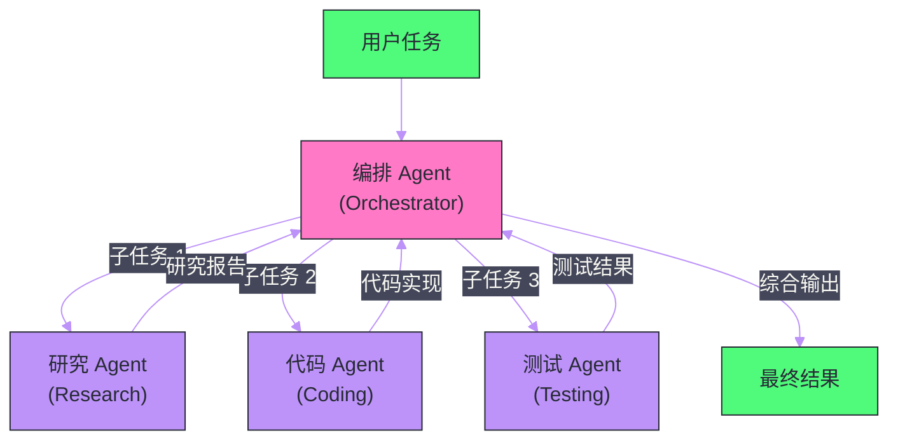
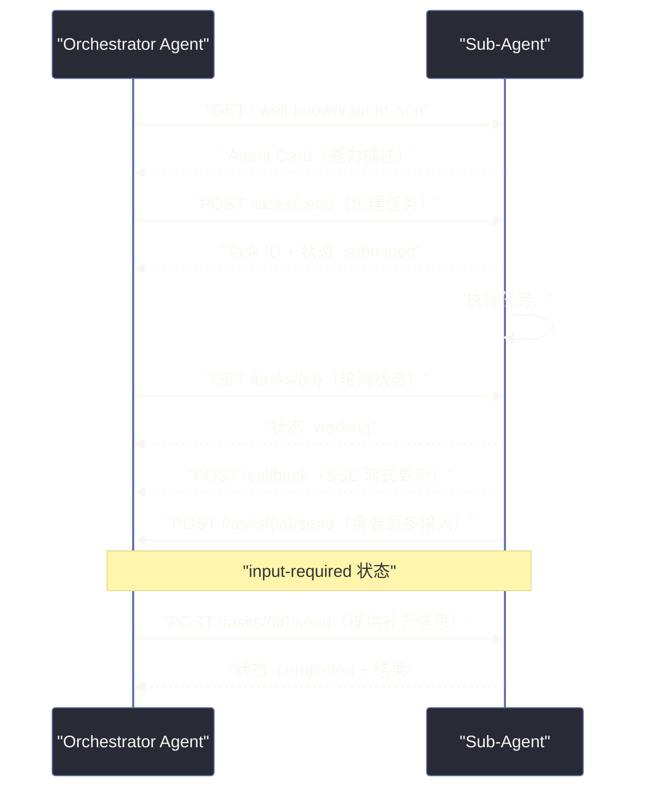

# 08 多 Agent 系统与 A2A 协议——协作、通信与特化

**摘要：**

单个 Agent 能做的事情是有上限的——上下文窗口是有限的，工具集是有限的，专注于一个任务的深度也是有限的。**多 Agent 系统**通过让多个专化 Agent 分工协作，突破单 Agent 的能力天花板。本文从"为什么需要多 Agent"的根本动机出发，深入剖析多 Agent 架构的三种主要模式（层级式、扁平式、混合式）、Agent 间通信的核心问题、Google 于 2025 年提出的 **A2A（Agent-to-Agent）协议**的设计理念和技术规范，以及 MCP（[[04 MCP 协议深度解析——Agent 与工具的标准化连接]]）与 A2A 的互补关系。最后结合工程实践，讨论多 Agent 系统的调试、可观测性和失效处理策略。

---

## 第 1 章 为什么需要多 Agent

### 1.1 单 Agent 的四大天花板

在 [[05 Agent 核心能力——推理、规划与工具调用]] 中我们构建了单 Agent 的能力模型。单 Agent 是优雅的——一个大脑，感知-推理-行动的循环。但现实中的复杂任务往往超出了单 Agent 的能力边界，具体体现在四个天花板上：

**天花板一：上下文长度**

一个 Agent 在执行复杂的长期任务时，其 Thought/Action/Observation 的累积会快速填满上下文窗口。更根本的问题是：即使有 128K 甚至 1M 的上下文窗口，把所有中间过程都塞在一个上下文里，LLM 的"注意力"会被大量无关内容稀释，推理质量下降（[[08 长上下文与多模态——技术前沿]] 中讨论的 Lost in the Middle 问题）。

**天花板二：专注度与深度**

一个通用 Agent 同时扮演研究员、分析师、代码工程师、报告撰写者……它能完成每件事，但每件事都是"够用"而非"专精"。就像一个人不可能同时是世界顶尖的外科医生和世界顶尖的钢琴家——深度专精要求专注，而通用 Agent 的注意力是分散的。

**天花板三：并行能力**

单 Agent 是串行的——完成任务 A 后才能开始任务 B。对于可以并行处理的任务（如同时调研五个不同的技术方案），单 Agent 只能顺序执行，效率低下。

**天花板四：任务隔离与可靠性**

一个负责所有事情的单 Agent，一旦在某个子任务上发生错误（如调用 API 失败、模型幻觉），可能影响整个任务链。而多 Agent 系统可以将不同子任务隔离在不同 Agent 中，一个 Agent 的失败不会直接导致整个系统崩溃。

### 1.2 多 Agent 的核心收益

| 收益 | 机制 | 典型场景 |
| :--- | :--- | :--- |
| **突破上下文限制** | 每个 Sub-Agent 维护自己的上下文，不相互污染 | 长期研究任务、复杂软件开发 |
| **能力专化** | 每个 Agent 只做一件事并做到最好 | 代码生成 + 代码审查 + 测试用三个专化 Agent |
| **并行加速** | 独立的子任务同时执行 | 并行调研多个竞品，并行处理多个用户请求 |
| **故障隔离** | 子 Agent 失败不级联到整体 | 一个检索 Agent 超时，不影响其他已完成的子任务 |
| **模型异构** | 不同子任务用最适合的模型 | 简单任务用小模型，复杂推理用大模型 |

---

## 第 2 章 多 Agent 的三种架构模式

### 2.1 层级式（Hierarchical）——指挥与执行分离

层级式架构是最常见的多 Agent 组织形式：一个**编排 Agent（Orchestrator）** 负责任务分解和全局协调，多个**执行 Agent（Sub-Agent）** 负责执行具体的子任务。



**Orchestrator 的职责**：
- 理解顶层目标，制定全局计划
- 将任务分解为子任务，并分配给合适的 Sub-Agent
- 接收子任务结果，判断是否完成或需要重试
- 综合所有子任务的输出，生成最终答案

**Sub-Agent 的职责**：
- 专注执行分配到的单一子任务
- 维护自己的工具集，与其他 Sub-Agent 解耦
- 完成后将结果返回给 Orchestrator

层级式的关键优势是**清晰的责任边界**——每个 Agent 都知道自己的角色和任务范围。适合任务可以被清晰分解、子任务间依赖关系明确的场景。

### 2.2 扁平式（Peer-to-Peer）——平等协作

扁平式架构中没有中央指挥者，所有 Agent 地位平等，通过消息传递协商和协作。任何 Agent 都可以向其他 Agent 发起请求，也可以接收请求。

这种架构在实践中比理论上更难控制——没有全局协调者意味着容易出现循环依赖、消息风暴等问题。但在某些场景下非常自然：

- **辩论与校验**：一个 Agent 提出方案，另一个 Agent 批评，第三个 Agent 综合——三方平等参与，不存在天然的主从关系
- **共识机制**：多个 Agent 对同一个问题独立分析，通过投票或讨论达成共识（类似 Self-Consistency 的多路径投票）
- **竞争与选优**：多个 Agent 并行提出不同方案，由"评审 Agent"选出最优

### 2.3 混合式——最实用的架构

实际生产系统通常是层级式和扁平式的混合：顶层有一个 Orchestrator 协调全局，但某些子任务由一个"小团队"的 Sub-Agent 通过平等协作完成。

```
顶层 Orchestrator
├── 研究小组（扁平式协作）
│   ├── 文献检索 Agent
│   ├── 数据分析 Agent
│   └── 报告撰写 Agent
└── 工程实现小组（层级式）
    ├── 架构设计 Agent
    └── 代码实现 Agent（由架构设计 Agent 的输出驱动）
```

---

## 第 3 章 Agent 间通信的核心问题

### 3.1 通信的三个维度

多 Agent 系统中，Agent 间的通信需要解决三个维度的问题：

**信息内容（What）**：传递什么信息？是结构化的任务指令（JSON），还是自然语言的对话消息，还是二进制数据（图像、文件）？

**交互模式（How）**：以什么方式交互？同步请求-响应（Agent A 发出请求，等待 Agent B 返回结果再继续），还是异步消息（Agent A 发出消息后继续运行，B 在某个时刻处理并可能在未来某时回复）？

**发现机制（Where）**：Agent A 如何知道 Agent B 的存在、能力和地址？是静态配置（在代码里写死），还是动态发现（通过注册中心查找）？

### 3.2 任务委派的语义

当一个 Orchestrator 把子任务"委派"给 Sub-Agent 时，这个委派包含哪些信息？一个完整的任务委派应包含：

- **目标（Goal）**：Sub-Agent 需要完成什么
- **输入（Input）**：完成任务所需的输入数据
- **输出格式（Output Schema）**：期望的结果格式（关系到 Orchestrator 如何解析结果）
- **约束（Constraints）**：时间限制、资源限制、不能做什么
- **上下文（Context）**：帮助 Sub-Agent 理解背景的附加信息

在当前的工程实践中，这些信息通常以**自然语言 + JSON Schema** 的形式编码在传递给 Sub-Agent 的第一条消息中，缺乏标准化。这正是 A2A 协议试图解决的问题。

### 3.3 结果传递的可靠性

Sub-Agent 执行完任务后，如何可靠地将结果传回 Orchestrator？几种常见模式：

**直接返回（同步）**：Sub-Agent 函数执行完毕，返回值就是结果。最简单，但受制于调用栈深度和超时限制。

**共享状态（State Store）**：Sub-Agent 将结果写入共享的状态存储（如 Redis、数据库），Orchestrator 从中读取。适合长时间运行的子任务。

**回调（Callback/Webhook）**：Sub-Agent 完成后通过 HTTP 回调通知 Orchestrator。适合异步、跨进程的场景。

**消息队列**：结果发布到消息队列（如 Kafka、RabbitMQ），Orchestrator 订阅并消费。适合高吞吐量、需要缓冲的场景。

---

## 第 4 章 A2A 协议——Agent 间通信的标准化

### 4.1 A2A 的背景

2025 年 4 月，Google 联合 50+ 家合作伙伴（包括 Salesforce、SAP、ServiceNow、Atlassian 等）正式发布了 **A2A（Agent-to-Agent）协议**的开放标准。

A2A 的出现背景与 [[04 MCP 协议深度解析——Agent 与工具的标准化连接]] 中 MCP 出现的背景高度相似：**当每个 Agent 框架都有自己的 Agent 间通信方式，跨框架的 Agent 协作就变成了一场噩梦**。

- LangGraph 的 Agent 怎么调用 CrewAI 的 Agent？
- 公司 A 的专有 Agent 怎么与公司 B 的 Agent 安全交互？
- 企业内部不同团队分别用不同框架开发的 Agent，如何组成更大的系统？

A2A 试图提供一套与框架无关的标准，让任何 A2A 兼容的 Agent 都能互相发现和调用。

### 4.2 A2A 的核心概念

**Agent Card（Agent 名片）**

每个 A2A 兼容的 Agent 都暴露一个 `/.well-known/agent.json` 端点，描述自己的能力、输入输出格式、认证方式等——类似于 OpenAPI Spec，但专门为 Agent 设计：

```json
{
  "name": "DataAnalysisAgent",
  "description": "专业的数据分析 Agent，擅长统计分析、可视化和趋势预测",
  "url": "https://agents.company.com/data-analysis",
  "version": "1.0.0",
  "capabilities": {
    "streaming": true,
    "pushNotifications": true,
    "stateTransitionHistory": false
  },
  "skills": [
    {
      "id": "analyze_csv",
      "name": "CSV 数据分析",
      "description": "分析 CSV 格式的数据文件，生成统计摘要和可视化图表",
      "inputModes": ["text", "file"],
      "outputModes": ["text", "file", "data"]
    },
    {
      "id": "trend_forecast",
      "name": "趋势预测",
      "description": "基于历史时序数据预测未来趋势",
      "inputModes": ["text", "data"],
      "outputModes": ["text", "data"]
    }
  ],
  "authentication": {
    "schemes": ["bearer"]
  }
}
```

Agent Card 是多 Agent 系统中**动态能力发现**的基础——Orchestrator 可以通过网络发现附近的 Agent，读取它们的 Agent Card，动态决定把哪些子任务委派给哪个 Agent，而不需要在代码里硬编码每个 Agent 的位置和能力。

**Task（任务）**

A2A 中 Agent 间的基本交互单位是 **Task**，而非简单的 HTTP 请求。Task 是有生命周期的：

```
submitted（已提交）→ working（执行中）→ completed（已完成）
                   ↓                 ↓
              input-required       failed（失败）
             （需要补充输入）
```

Task 的状态可以被查询，允许 Orchestrator 追踪子任务的进度，而不是盲目等待。

**Message 与 Part**

Task 中的通信通过 **Message** 进行，每条 Message 可以包含多个 **Part**（部分），每个 Part 有自己的内容类型：

```json
{
  "role": "user",
  "parts": [
    {
      "type": "text",
      "text": "请分析这份销售数据文件，重点关注 Q4 的增长趋势"
    },
    {
      "type": "file",
      "file": {
        "name": "sales_2024.csv",
        "mimeType": "text/csv",
        "bytes": "base64_encoded_content..."
      }
    }
  ]
}
```

这种 Part 设计使 A2A 天然支持多模态内容传递——文本、文件、图像、结构化数据都可以在同一条 Message 中传递。

### 4.3 A2A 的通信流程

一次完整的 A2A 交互流程：



A2A 支持两种响应模式：
- **同步响应**：Sub-Agent 在 HTTP 响应中直接返回结果（适合快速任务）
- **异步 + SSE 流式更新**：Sub-Agent 先返回 Task ID，通过 Server-Sent Events 推送进度和中间结果（适合长时间任务）

### 4.4 A2A vs MCP：互补而非竞争

A2A 发布后，一个常见的问题是：A2A 和 MCP 是竞争关系吗？

答案是**互补**，两者解决的是不同层面的问题：

| 维度 | MCP | A2A |
| :--- | :--- | :--- |
| **连接对象** | Agent ↔ 工具/数据资源 | Agent ↔ Agent |
| **交互粒度** | 单次工具调用（同步，短时） | 任务（异步，可长时间运行） |
| **能力描述** | Tools/Resources/Prompts | Skills（技能） |
| **状态管理** | 无状态（每次调用独立） | 有状态（Task 有生命周期） |
| **适用关系** | 垂直：LLM 使用工具 | 水平：Agent 委托 Agent |

在完整的多 Agent 系统中，两者通常同时存在：

- 每个 Agent 通过 **MCP** 连接它所需的工具（文件系统、数据库、API）
- Agent 与 Agent 之间通过 **A2A** 进行任务委派和协作

> [!note] 设计哲学
> MCP 和 A2A 的分工体现了一个重要的系统设计原则：**不同层次的交互需要不同的协议**。工具调用是轻量、快速、无状态的（适合 JSON-RPC）；Agent 任务是重量级、异步、有状态的（需要 Task 生命周期管理）。用同一个协议试图覆盖两种完全不同的交互模式，要么太复杂，要么有取舍。MCP 和 A2A 的共存体现了关注点分离的设计哲学。

---

## 第 5 章 多 Agent 系统的工程挑战

### 5.1 可观测性：看清黑箱

单 Agent 系统中，一次推理失败，追踪路径是线性的：输入→LLM 调用→工具执行→输出。多 Agent 系统中，一次任务失败可能涉及 5 个 Agent、20 次 LLM 调用、10 次工具调用——在哪里出了问题？

多 Agent 系统的可观测性需要：

**分布式追踪（Distributed Tracing）**：给每个任务一个唯一的 Trace ID，所有子任务的 LLM 调用和工具执行都携带这个 ID，通过 Trace ID 可以在 LangSmith 或 OpenTelemetry 仪表板中重建完整的执行路径。

**结构化日志**：每个 Agent 的每次行动记录包含：Agent 名称、输入、输出、执行时间、调用的子 Agent 或工具、是否发生错误。

**状态快照**：在关键节点保存 Agent 状态的快照，便于事后分析和调试。LangGraph 的 Checkpointing 机制天然支持这一点。

### 5.2 错误处理与容错

多 Agent 系统中的错误处理比单 Agent 复杂得多，需要在多个层次进行：

**Sub-Agent 级别**：Sub-Agent 内部的工具调用失败，应该在 Sub-Agent 内部处理——重试、换一种方式、或返回明确的错误状态。不应该让内部错误直接暴露给 Orchestrator（除非是不可恢复的致命错误）。

**Orchestrator 级别**：当 Sub-Agent 返回失败状态时，Orchestrator 需要决策：是重新委派给同一个 Agent（重试）、委派给备用 Agent（降级）、还是终止整个任务（放弃）。

**任务级别**：整个多 Agent 任务是否需要原子性保证（要么全部完成，要么全部回滚）？如果是，需要实现类似分布式事务的补偿机制。

### 5.3 并发与竞态条件

当多个 Sub-Agent 并行运行时，需要注意竞态条件：

- 两个 Agent 同时修改同一个共享文件
- 两个 Agent 同时调用需要幂等性的外部 API
- Sub-Agent A 的结果还没写入共享状态，Sub-Agent B 就开始读取

工程上的处理策略：
- **不可变消息传递**：Agent 间通过不可变消息传递数据，而非共享可变状态
- **乐观锁**：对共享资源用版本号做乐观并发控制
- **任务依赖声明**：在任务图中明确声明任务间的依赖关系，调度器确保依赖满足后才执行后续任务

### 5.4 成本控制

多 Agent 系统的成本爆炸是一个真实的工程风险——每增加一层 Agent 分解，LLM 调用次数可能成倍增加。

成本控制策略：

**模型分级**：Orchestrator 使用最强大的模型（如 GPT-4o/Claude 3.5 Sonnet），Sub-Agent 使用轻量模型（如 GPT-4o-mini/Claude 3 Haiku）。Orchestrator 负责高层次推理和决策，Sub-Agent 执行具体、限定范围的任务，不需要最强的模型。

**任务缓存**：相同的子任务（如对同一文档的 RAG 查询）结果应该缓存，避免重复执行。尤其是在多 Agent 并行时，可能有多个 Agent 执行相同的检索。

**早期终止**：Orchestrator 实时监控成本，当总 token 消耗超过预算时主动终止任务并返回当前最佳结果，而非无限制地继续。

---

## 第 6 章 多 Agent 系统的设计模式

### 6.1 Orchestrator-Workers（最常用）

最经典的多 Agent 模式，第 2 章已详细描述。核心是明确的 Orchestrator 与 Workers 的分工。

适用场景：任务可以被清晰分解为独立子任务，子任务间依赖关系可以事先确定。

### 6.2 Pipeline（流水线）

一系列 Agent 串联，前一个 Agent 的输出是后一个 Agent 的输入。类似于 [[03 预训练——数据、算力与 Scaling Law]] 中的数据处理流水线概念。

```
原始文档 → 提取 Agent → 分析 Agent → 写作 Agent → 审核 Agent → 最终报告
```

适用场景：内容生产、数据处理、代码生成-审查-测试流程。优势是每个 Agent 只关注一个步骤，易于替换和优化。

### 6.3 Evaluator-Optimizer（评估-优化循环）

一个"生成 Agent"产出内容，一个"评估 Agent"对内容打分并提出改进建议，生成 Agent 根据反馈迭代改进，直到评估 Agent 满意。

```
生成 Agent ─────────────────────────────────────────> 结果
    ↑                                                   │
    │                  不满意                            │
    └──── 评估 Agent ← 评分 + 改进建议 ← 检查内容 ←────┘
```

适用场景：高质量内容生成（报告、代码、设计方案），需要通过迭代提升质量，且质量标准可以被明确编码给评估 Agent。

### 6.4 Specialized Team（专化团队）

多个高度专化的 Agent 组成"专家团队"，每个成员有独特的知识和工具集。Orchestrator 根据任务性质，灵活调动不同专家参与。

一个软件开发 Agent 团队的示例：

| Agent | 专长 | 工具集 |
| :--- | :--- | :--- |
| **架构师 Agent** | 系统设计、技术选型 | 无（纯推理） |
| **前端 Agent** | React/Vue 代码生成 | 代码执行、npm 工具 |
| **后端 Agent** | API 设计、Python/Go 代码 | 代码执行、数据库工具 |
| **数据库 Agent** | SQL、索引优化、Schema 设计 | SQL 执行、数据库连接 |
| **测试 Agent** | 测试用例生成、覆盖率分析 | 代码执行、测试框架 |
| **安全审计 Agent** | 漏洞扫描、代码安全审查 | SAST 工具、CVE 数据库 |

---

## 第 7 章 实战：构建一个多 Agent 研究系统

### 7.1 系统设计

以一个"竞品研究多 Agent 系统"为例，展示多 Agent 架构的完整设计思路：

**目标**：给定一个产品领域，自动完成竞品调研并生成分析报告。

**Agent 设计**：

```
ResearchOrchestrator（协调者）
├── WebSearchAgent（网络搜索，调用 Brave/Bing API）
├── DataExtractAgent（从搜索结果提取结构化数据）
├── ComparisonAgent（多维度对比分析）
└── ReportWriterAgent（撰写 Markdown 报告）
```

**执行流程**：

1. `ResearchOrchestrator` 接收用户的研究主题
2. 生成一个竞品列表（先问 LLM：这个领域主要有哪些竞品？）
3. **并行**：对每个竞品，分配一个 `WebSearchAgent` 实例搜索信息
4. **并行**：每个 `DataExtractAgent` 处理对应竞品的搜索结果，提取结构化数据
5. `ComparisonAgent` 接收所有竞品的结构化数据，生成多维对比分析
6. `ReportWriterAgent` 将对比分析转化为完整的 Markdown 报告
7. `ResearchOrchestrator` 返回最终报告

**并行化效果**：如果有 5 个竞品，步骤 3 和 4 并行执行，总时间约等于单个竞品的研究时间，而非 5 倍。

### 7.2 Orchestrator 的任务分配逻辑

Orchestrator 的核心能力是**动态任务分配**——它需要判断哪些子任务可以并行（无依赖关系），哪些必须串行（有数据依赖）：

```python
async def run_research(topic: str) -> str:
    # 步骤1: 生成竞品列表（串行，后续并行的基础）
    competitors = await orchestrator_llm.generate_competitor_list(topic)
    
    # 步骤2-3: 并行搜索和提取（无依赖，最大化并发）
    search_tasks = [web_search_agent.search(c) for c in competitors]
    search_results = await asyncio.gather(*search_tasks)
    
    extract_tasks = [data_extract_agent.extract(r) for r in search_results]
    structured_data = await asyncio.gather(*extract_tasks)
    
    # 步骤4: 对比分析（依赖所有提取结果）
    comparison = await comparison_agent.analyze(structured_data)
    
    # 步骤5: 报告撰写（依赖对比分析）
    report = await report_writer_agent.write(topic, comparison)
    
    return report
```

---

## 第 8 章 总结

多 Agent 系统是 LLM 应用从"智能助手"向"自主系统"演进的关键一步。核心要点：

**架构选择**：层级式（Orchestrator-Workers）是最通用的起点；对于内容生产流水线选 Pipeline；对于高质量输出选 Evaluator-Optimizer。

**A2A 的价值**：提供了跨框架、跨企业的 Agent 互操作标准——Agent Card 实现能力发现，Task 生命周期管理实现可靠的任务委派，与 MCP 形成垂直+水平的完整互操作体系。

**工程基本面**：可观测性（分布式追踪）、错误处理（多层次容错）、成本控制（模型分级 + 缓存）是多 Agent 系统走向生产的三道必答题。

**最重要的原则**：多 Agent 增加了系统复杂度——只在单 Agent 真的不够用时才引入多 Agent，而不是为了"架构先进"而过度设计。

---

## 参考文献

1. Google et al., "Agent2Agent (A2A) Protocol Specification", github.com/google/A2A, 2025
2. Wu et al., "AutoGen: Enabling Next-Gen LLM Applications via Multi-Agent Conversation", ICLR 2024
3. Hong et al., "MetaGPT: Meta Programming for A Multi-Agent Collaborative Framework", ICLR 2024
4. Park et al., "Generative Agents: Interactive Simulacra of Human Behavior", UIST 2023
5. Anthropic, "Building Effective Agents", anthropic.com, 2024
6. LangGraph, "Multi-Agent Networks Documentation", 2024
7. Qian et al., "Communicative Agents for Software Development", ACL 2024 (ChatDev)

---

> [!note] 思考题
> 1. 多 Agent 系统中，不同 Agent 负责不同子任务（如'研究 Agent'负责信息收集，'编码 Agent'负责代码生成）。Agent 之间的通信方式有'共享黑板'（所有 Agent 读写同一个状态）和'消息传递'（点对点通信）。在一个 5 个 Agent 协作的系统中，哪种通信方式更适合？共享状态如何避免并发冲突？
> 2. A2A（Agent-to-Agent）协议定义了 Agent 之间的发现、协商和任务委托标准。在一个开放的 Agent 生态中，Agent A 需要委托 Agent B 执行子任务——但 Agent A 如何信任 Agent B 的能力声明？如果 Agent B 声称能'精确分析财务数据'但实际能力不足，Agent A 如何在运行时检测并降级？
> 3. 多 Agent 系统中的'群体思维'（Groupthink）风险——如果所有 Agent 使用相同的底层 LLM，它们可能产生类似的偏见和错误。使用不同的 LLM（如 GPT-4 + Claude + Gemini）作为不同 Agent 的基座能否有效降低这种风险？多样性带来的额外成本和延迟如何评估？
