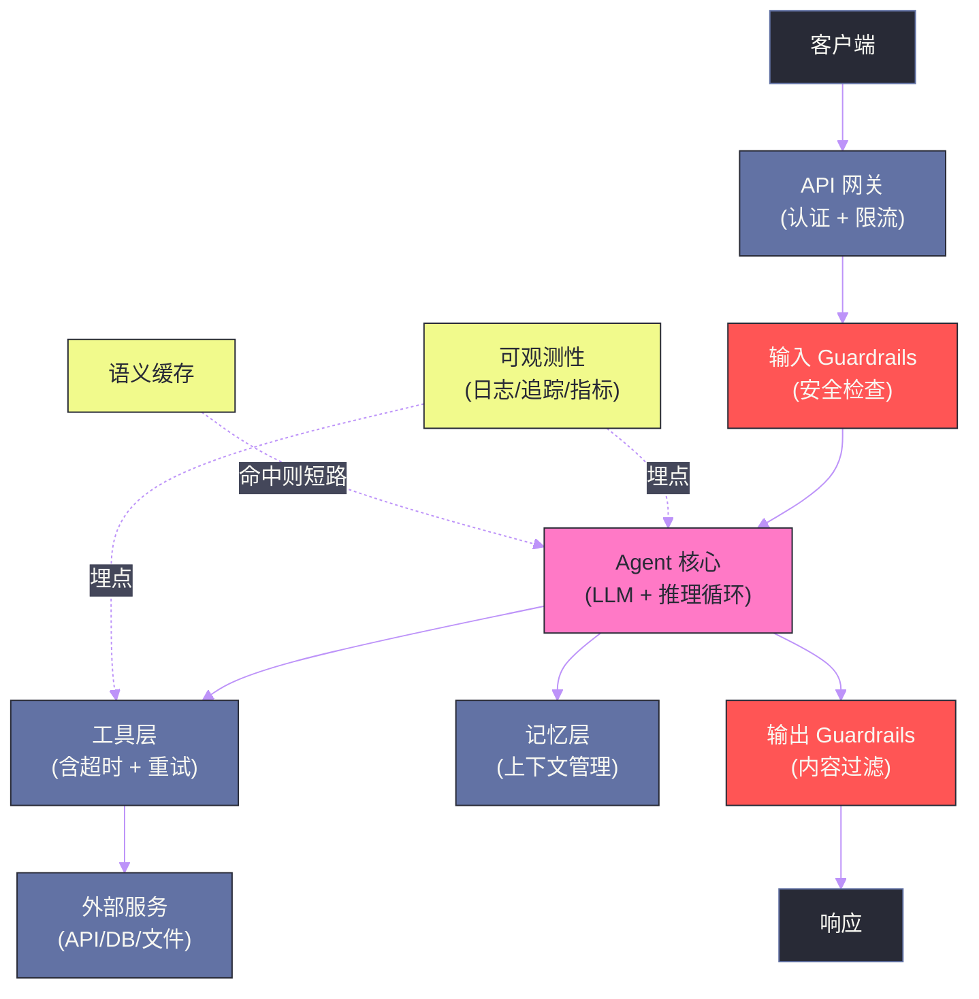
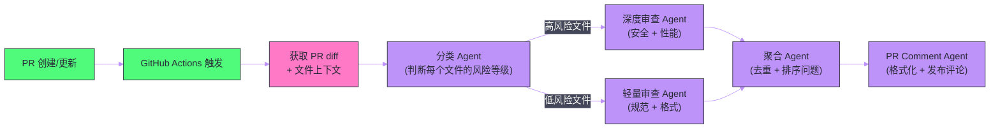

# 09 Agent 应用实战——从零构建生产级 Agent

**摘要：**

前八篇文章建立了 Agent 开发的完整理论体系——Prompt 工程、RAG、MCP、推理规划、记忆、框架选型、多 Agent 协作。本文将这些知识落地为三个典型的工程场景：**企业知识库问答 Agent**、**代码审查 Agent** 和**数据分析 Agent**。对每个场景，从需求分析、架构设计、关键实现决策、生产级考量（延迟/成本/可靠性）到上线后的迭代优化，提供完整的工程视角。本文不是"Hello World"教程，而是从工程师视角审视：当你把 Agent 真正部署到生产环境中，你会遇到哪些挑战、如何做决策、踩过哪些坑。

---

## 第 1 章 从实验到生产的鸿沟

### 1.1 实验室里的 Agent 和生产中的 Agent

很多工程师在 Jupyter Notebook 里用 20 行代码跑通了 LangChain ReAct Agent Demo，激动地把它部署到生产——然后在接下来的一个月里持续处理各种意外：

- 用户输入了一个奇怪的问题，Agent 陷入循环，10 分钟后才超时
- 高峰期并发 100 个请求，OpenAI API 限速，大量请求失败
- 某个工具调用偶发 500 错误，Agent 直接崩溃而非优雅降级
- 第一个月 API 费用比预期高出 5 倍，原因是某些 case 触发了大量工具调用循环
- 没有任何监控，出了问题只能靠用户反馈才能发现

这些问题不是 Agent 框架的 Bug，而是**从实验到生产的必经之路**。生产级 Agent 不仅仅要"能运行"，还要在以下维度达标：

| 维度 | 实验要求 | 生产要求 |
| :--- | :--- | :--- |
| **延迟** | 能返回结果即可 | P95 < 10s，P99 < 30s |
| **成本** | 无所谓 | 可预测、可控、ROI 正向 |
| **可靠性** | 偶发失败可接受 | 99.9% 可用，优雅降级 |
| **可观测性** | print 调试 | 结构化日志、追踪、告警 |
| **安全性** | 信任所有输入 | 输入验证、权限控制、防注入 |
| **可扩展性** | 单线程即可 | 水平扩展、并发处理 |

### 1.2 生产级 Agent 的通用架构

在进入具体场景之前，先建立一个通用的生产级 Agent 架构心智模型：



---

## 第 2 章 场景一：企业知识库问答 Agent

### 2.1 需求与挑战

**场景**：一家 500 人的科技公司，内部有 5000+ 页的产品文档、操作手册、政策规范。希望构建一个内部知识问答 Agent，让员工能用自然语言查询任何内部信息，替代人工客服和手动搜索文档。

**核心需求**：
- 回答必须基于内部文档，不允许模型"发挥"（高准确率要求）
- 每个回答必须标注来源（文件名 + 页码），方便员工核实
- 支持追问（多轮对话）
- 不同员工只能访问有权限的文档（权限隔离）
- 响应时间 < 5 秒（员工使用容忍度低）

**核心挑战**：
- 文档更新频繁（每周有新政策发布），知识库需要增量更新
- 部分员工会用缩写或口语提问（"报销流程咋走"），与正式文档措辞差距大
- 同一个问题可能需要结合多个文档才能完整回答

### 2.2 架构决策

**检索策略**：标准 RAG 作为基础，叠加以下增强：
- **查询改写**：用小模型（GPT-4o-mini）将口语化查询改写为正式术语，改写后再检索
- **混合搜索**：向量搜索（bge-m3）+ BM25（重要性权重 4:1），用 RRF 融合，解决精确词汇匹配问题
- **Rerank**：用 bge-reranker-v2-m3 对 Top-20 初检结果精排，取 Top-5 进入 LLM

**权限隔离**：每个文档块存储 `department_ids` 元数据字段（如 `["HR", "Finance"]`），检索时强制过滤——查询参数中附加 `where={"department_ids": {"$contains": user_department}}`。

**多轮对话**：维护每个用户会话的对话历史（滑动窗口，保留最近 5 轮），在检索时将最近 2 轮对话拼接为扩展查询，提升追问的检索相关性（解决代词指代问题："它的价格是多少" → 结合上下文改写为"iPhone 15 Pro Max 的价格是多少"）。

**来源引用**：每个文档块的元数据包含 `source_file`、`page_number`、`section_title`，检索后将来源注入 Prompt，要求模型以 `[来源: {source_file} 第{page_number}页]` 的格式引用。

### 2.3 生产关键决策

**回答有无知识时的处理**：

当最高相似度分数低于阈值（经验值 0.45）时，直接返回固定文案"抱歉，我在当前文档库中没有找到相关信息。您可以尝试换一种提问方式，或联系 HR 部门获取帮助。"——不调用 LLM，节省成本，同时避免模型在信息不足时"强行"给出可能错误的答案。

**延迟优化**：

改写 + 检索 + Rerank + LLM 的串行流程总延迟约 4-6 秒，优化策略：

1. 改写和检索异步并行（改写完成后立刻检索，不等）
2. 查询改写使用 GPT-4o-mini（100ms）而非 GPT-4o（500ms）
3. Rerank 使用本地部署的 bge-reranker（200ms）而非 Cohere API（500ms+）
4. LLM 响应开启 Streaming，用户看到第一个 token 的时间缩短到 1-2 秒

**增量更新**：

文档更新时，只重新处理变更的文档（对比文件 hash）。每个文档的所有 chunk 在 metadata 中存储 `doc_id`，更新时先删除该 `doc_id` 的所有 chunk，再添加新的 chunk。通过 GitLab CI/CD Pipeline 触发，每次文档仓库有 commit 时自动执行。

### 2.4 上线后的迭代

**发现的问题 1**：用户问跨部门协作的问题（如"研发和产品如何协作"），需要同时搜索"研发规范"和"产品流程"两个权限域的文档，但当前权限过滤只允许访问单一部门。

**解决方案**：在用户配置中增加 `accessible_departments` 字段（一个员工可能有权访问多个部门的文档），过滤条件改为 `department_ids` 与 `accessible_departments` 有交集。

**发现的问题 2**：某些员工会截图后问"图片里的内容是什么规定"——纯文本 RAG 无法处理图片。

**解决方案**：引入多模态处理——上传图片时，先用 GPT-4o 提取图片中的文字内容，再用提取出的文字内容进行 RAG 检索。

---

## 第 3 章 场景二：代码审查 Agent

### 3.1 需求与挑战

**场景**：一个 50 人的工程团队，每天有 30-50 个 PR 需要审查。人工审查耗时，希望构建一个代码审查 Agent，自动对每个 PR 进行安全、性能、代码规范的初步审查，减轻人工审查负担。

**核心需求**：
- 覆盖安全漏洞（SQL 注入、XSS、不安全反序列化等）、性能问题（N+1 查询、全表扫描）、代码规范（命名、注释、测试覆盖率）
- 审查结果以 GitHub PR Comment 的形式输出，定位到具体行
- 误报率要低（高误报会让工程师忽略所有 Agent 建议）
- 必须在 PR 创建后 3 分钟内完成审查（否则工程师可能已经在别的事上了）

**核心挑战**：
- PR 的 diff 可能很大（几百个文件，上万行），无法全部放入上下文
- 不同文件间的问题可能有关联（A 文件引入了一个 class，B 文件使用时有安全问题）
- 审查规则需要随团队规范演进更新，不能每次都改代码

### 3.2 架构设计

**整体架构**：Pipeline 式多 Agent，利用 GitHub Actions 触发：



**分类 Agent 的设计**：

分类 Agent 是整个系统的效率关键——它决定哪些文件需要深度审查（消耗昂贵的 GPT-4o），哪些可以用轻量审查（便宜的 GPT-4o-mini）。

分类规则（在 System Prompt 中以 JSON 格式维护，便于非工程师更新）：

```json
{
  "high_risk_patterns": [
    {"pattern": "*.sql", "reason": "直接 SQL 操作，SQL 注入风险"},
    {"pattern": "auth/", "reason": "认证模块，安全敏感"},
    {"pattern": "*serializ*", "reason": "序列化/反序列化，反序列化漏洞风险"},
    {"keyword": "execute(", "reason": "可能的命令注入"},
    {"keyword": "pickle.", "reason": "Python pickle 反序列化风险"}
  ],
  "low_risk_patterns": [
    {"pattern": "*.md", "reason": "文档变更"},
    {"pattern": "test_*", "reason": "测试代码"},
    {"pattern": "*.json", "reason": "配置文件"}
  ]
}
```

### 3.3 大 diff 的处理策略

当 PR 改动了 200 个文件时，不可能把所有 diff 都放进 LLM 上下文。处理策略：

**策略一：按文件独立审查**。每个文件的 diff 独立发送给 Agent 审查，结果最后聚合。优点：每次上下文小而精，审查更专注。缺点：丢失跨文件的关联信息。

**策略二：提供文件的跨引用上下文**。审查文件 A 时，检测它的 import 和类型引用，从代码库中提取被引用的代码片段，一起放入上下文（类似 RAG 的思路）。这样在审查 `user_service.py` 时，`UserModel`、`UserRepository` 的实现也在上下文中，能发现跨文件的安全问题。

**策略三：对超大 diff 进行优先级截断**。当单个文件的 diff > 500 行时，只审查"风险最高"的部分——新增代码（而非修改代码）、涉及外部输入处理的部分（request、input 附近的代码）。

### 3.4 误报控制

误报是代码审查 Agent 落地的最大敌人——工程师只要看到 3 次没有意义的 AI 评论，就会直接选择忽略所有 AI 评论。

控制误报的策略：

**置信度过滤**：Agent 在输出每条问题时，给出 1-5 的置信度评分，只有评分 ≥ 4 的问题才作为 PR Comment 发出，评分 3 的降级为内部日志记录（供后续分析），评分 ≤ 2 的直接丢弃。

**上下文感知**：让 Agent 在提出问题前，先检查同一代码块是否有相关注释（如 `# nosec`、`# type: ignore`），有则降低置信度或跳过。

**规则持续调优**：收集工程师对 Agent 评论的 Resolved/Dismissed 反馈，定期分析哪类问题被频繁 Dismiss（误报），更新分类规则或添加过滤条件。

---

## 第 4 章 场景三：数据分析 Agent

### 4.1 需求与挑战

**场景**：一个数据驱动的电商团队，业务人员经常需要临时的数据查询（"昨天各品类的转化率是多少"、"本月 GMV 同比增长了多少"），当前需要提工单给数据团队写 SQL，周期 1-3 天。希望构建一个数据分析 Agent，让业务人员自己用自然语言提问，直接获取数据和图表。

**核心需求**：
- 理解业务语言（"GMV"、"转化率"、"新客"等术语），生成正确的 SQL
- 能生成基础图表（柱状图、折线图、饼图）
- 对于可能导致大量数据返回的查询，自动加限制（LIMIT）和聚合
- 查询结果要有业务解读（不只是数字，还要说"同比增长了 15%，主要由于..."）

**核心挑战**：
- 业务术语与数据库字段名不一致（"GMV" 对应 `orders.amount_paid`，"新客"对应 `customers.is_first_order = true`）
- 复杂查询涉及多表 JOIN，模型容易生成语法错误或逻辑错误的 SQL
- 防止恶意或意外的高成本查询（全表扫描生产数据库）

### 4.2 Text-to-SQL 的关键技术

**Schema 注入**：LLM 需要了解数据库结构才能生成正确的 SQL。注入策略：

1. 将所有表的 DDL（`CREATE TABLE` 语句）预存为文本
2. 用户提问时，用向量检索找出最相关的表（如查"GMV"，检索到 `orders` 表）
3. 只将相关表的 DDL 注入上下文，而非所有表（节省 token，减少干扰）

**业务字典（Semantic Layer）**：建立一个业务术语到 SQL 映射的字典，以 YAML 格式维护：

```yaml
business_glossary:
  GMV:
    definition: "成交总额，所有已支付订单的金额之和"
    sql_expression: "SUM(orders.amount_paid)"
    filters: "WHERE orders.status = 'paid'"
  
  新客:
    definition: "首次下单的用户"
    sql_expression: "customers.is_first_order = true"
  
  转化率:
    definition: "下单用户数 / 访问用户数"
    sql_expression: "COUNT(DISTINCT orders.user_id) / COUNT(DISTINCT sessions.user_id)"
    requires_tables: ["orders", "sessions"]
```

这个字典在 SQL 生成前注入到系统提示中，让模型知道"GMV"对应的精确 SQL 表达。

**SQL 验证与沙箱执行**：

LLM 生成的 SQL 在执行前必须经过验证：

1. **语法检查**：用 `sqlparse` 或数据库的 `EXPLAIN` 语句检查语法
2. **危险操作过滤**：拒绝包含 `DROP`、`DELETE`、`UPDATE`、`INSERT` 的 SQL（只允许 `SELECT`）
3. **成本估算**：用 `EXPLAIN ANALYZE`（PostgreSQL）或 `EXPLAIN`（MySQL）评估查询成本，对于全表扫描或预计返回行数 > 100 万的查询，强制要求模型添加 `LIMIT` 或修改查询逻辑
4. **沙箱数据库**：连接只读副本（Read Replica），而非主库，避免任何意外写入

**多步骤复杂查询**：

对于复杂的多表关联查询，使用 ReAct 式的迭代策略：
1. 先生成简单的子查询验证中间结果（"先查一下 `orders` 表的前 5 行，确认字段名"）
2. 根据中间结果调整最终 SQL

这种"探索式" SQL 生成比"一次性生成完整 SQL"的成功率高得多。

### 4.3 从 SQL 结果到业务洞察

返回原始数据还不够，业务人员需要的是**洞察**，不是数字。在返回查询结果后，再调用一次 LLM 生成自然语言解读：

```
[System Prompt]
你是一名资深业务分析师。根据以下数据查询结果，提供简洁的业务解读：
- 指出关键数字（最高、最低、异常值）
- 与历史数据对比（如果有）
- 提出可能的原因假设（如果数据支持）
- 建议下一步可以深入分析的方向
回答限制在 3-5 句话，面向非技术的业务人员。

[查询结果]
{sql_result_json}

[业务解读]
```

---

## 第 5 章 生产级的横切关注点

### 5.1 语义缓存——最被低估的优化

**语义缓存**（Semantic Cache）是降低 LLM 应用成本和延迟的最有效手段之一，但却被很多团队忽视。

原理：当用户的问题与历史问题在语义上高度相似时，直接返回缓存的历史答案，跳过 LLM 调用。与传统的 Key-Value 缓存不同，语义缓存用 Embedding 相似度来判断"相同"，而非精确字符串匹配。

```
用户 A 问: "如何申请年假？"
用户 B 问: "年假怎么申请？"

→ 两个问题语义相似度 > 0.95
→ 直接返回用户 A 问题的缓存答案
→ 节省了一次 RAG 检索 + 一次 LLM 调用（节省约 2-5 秒和相应 API 费用）
```

**实现**：用向量数据库存储历史问题的 Embedding 和对应答案。每次新问题到来时，先检索是否有相似度 > 阈值（如 0.95）的历史问题，有则直接返回缓存。GPTCache 是一个现成的语义缓存库。

实际效果：对于企业知识库这类重复性高的场景，缓存命中率通常可以达到 30-50%，成本和延迟相应降低 30-50%。

### 5.2 流式响应的工程实现

用户感知的延迟 = 第一个 token 出现的时间（TTFT，Time to First Token），而非完整响应生成完毕的时间。LLM 的流式输出（Streaming）可以将 TTFT 从 5 秒降低到 1 秒以内。

在 FastAPI 中实现 SSE 流式响应：

```python
from fastapi import FastAPI
from fastapi.responses import StreamingResponse
import asyncio

app = FastAPI()

@app.post("/chat")
async def chat_stream(request: ChatRequest):
    async def generate():
        async for chunk in agent_stream(request.message):
            # SSE 格式: "data: {chunk}\n\n"
            yield f"data: {chunk}\n\n"
        yield "data: [DONE]\n\n"
    
    return StreamingResponse(
        generate(),
        media_type="text/event-stream",
        headers={
            "Cache-Control": "no-cache",
            "X-Accel-Buffering": "no"   # 禁用 Nginx 缓冲
        }
    )
```

前端用 `EventSource` API 消费 SSE 流，实现打字机效果。

### 5.3 限流与成本保护

LLM API 有两种限制：
- **TPM（Tokens Per Minute）**：每分钟 token 消耗上限
- **RPM（Requests Per Minute）**：每分钟请求数上限

生产中的保护策略：

**用户级别限流**：每个用户每天的 token 消耗有上限，超限后降级到更小的模型或返回限流提示。

**请求队列**：高峰期请求不直接发给 LLM API，而是进入队列，按速率控制发出。使用 `asyncio.Semaphore` 或 Celery 等任务队列实现。

**成本告警**：当日消耗达到预算的 70% 时发告警，达到 100% 时自动停服并通知管理员。通过 OpenAI Usage API 或 Anthropic Usage API 定时拉取消耗数据监控。

### 5.4 可观测性工程

生产级 Agent 的可观测性至少需要三层：

**日志（Logging）**：

每次 LLM 调用记录：
- 请求 ID（用于追踪）
- 用户 ID + 会话 ID
- 输入 token 数 + 输出 token 数 + 费用
- 调用的模型和参数
- 延迟（TTFT + 总时间）
- 是否发生错误（错误类型）
- 工具调用记录（调用了哪些工具、参数、返回）

**指标（Metrics）**：

用 Prometheus 收集，Grafana 展示：
- `agent_request_total`：总请求数（按状态 success/error 分）
- `agent_latency_seconds`：响应延迟分布（P50/P95/P99）
- `agent_token_usage_total`：token 消耗（按模型、用户分）
- `agent_tool_calls_total`：工具调用次数（按工具类型）
- `agent_cache_hit_rate`：语义缓存命中率

**追踪（Tracing）**：

使用 LangSmith（LangChain 生态）或 OpenTelemetry + Jaeger，对每次 Agent 运行生成完整的调用树——可以看到每次 LLM 调用的输入输出、工具调用详情、总耗时分布。这是调试 Agent 行为异常的最重要工具。

---

## 第 6 章 Agent 的灰度发布与 A/B 测试

### 6.1 为什么 Agent 的发布比普通服务更难

普通 Web 服务的 A/B 测试很直观——把 10% 的流量路由到新版本，对比指标。但 Agent 的评估更复杂：

- **没有确定性输出**：同样的输入，Agent 每次输出可能不同（LLM 的随机性）
- **评估指标不直观**：什么叫"更好的回答"？很难自动量化
- **副作用难以回滚**：如果 Agent 执行了写操作（发送邮件、修改文件），发现问题后无法撤销

### 6.2 Shadow Mode（影子模式）发布

**Shadow Mode** 是 Agent 灰度的推荐策略：新版本 Agent 与旧版本并行运行，都对真实请求进行推理，但只有旧版本的输出返回给用户，新版本的输出只记录到日志中。

这样可以：
- 收集新版本在真实数据上的输出，人工或自动评估质量
- 不影响用户体验的情况下观察新版本的延迟和成本
- 发现新版本的边缘 case（在测试集中未发现的输入模式）

当新版本的 Shadow 评估结果满意后，再逐步将流量切换过去（1% → 5% → 20% → 100%）。

---

## 第 7 章 常见的工程陷阱与反模式

### 7.1 反模式一：过度依赖 LLM 处理所有逻辑

一个常见的错误是把所有业务逻辑都让 LLM 处理——日期计算、数字格式化、简单的条件判断……这些事情用代码处理既快又准，用 LLM 处理既慢又可能出错。

**正确做法**：LLM 只处理它擅长的——自然语言理解、语义推理、文本生成。能用代码确定性解决的逻辑，坚决用代码。

### 7.2 反模式二：System Prompt 无限膨胀

随着项目迭代，System Prompt 越来越长——每次发现一个新的 edge case 就加一条"你不应该做 XX"。最后 System Prompt 长达 3000 token，充满了相互矛盾的指令。

**正确做法**：System Prompt 应该是原则性的，而非穷举性的。边缘 case 处理应该通过代码层的验证（输入/输出 Guardrails）来实现，而非无限扩充 System Prompt。

### 7.3 反模式三：忽略工具失败的处理

工具调用会失败——网络超时、API 限速、参数错误……如果 Agent 对工具失败没有处理策略，要么卡在错误循环里，要么直接崩溃。

**正确做法**：每个工具调用都有超时（通常 5-30 秒）、重试次数（通常 2-3 次）、以及明确的失败返回格式（让 LLM 知道失败原因和下一步选项）。

### 7.4 反模式四：在 Agent 中保存用户隐私数据

对话历史、用户偏好、业务数据……Agent 记忆系统里可能积累大量用户隐私数据。如果没有数据生命周期管理，这些数据永久保存，存在隐私泄露风险和法律合规风险。

**正确做法**：明确数据保留策略（如 6 个月后自动删除），给用户提供查看和删除自己数据的接口，敏感信息（密码、信用卡号）在进入记忆系统前脱敏。

---

## 第 8 章 总结

生产级 Agent 的构建是工程能力和 AI 理解的综合体现。三个场景的核心经验：

| 场景 | 关键技术决策 | 最大挑战 | 核心指标 |
| :--- | :--- | :--- | :--- |
| **知识库 Agent** | 混合检索 + 权限过滤 | 增量更新 + 低相关性处理 | 回答准确率、来源引用率 |
| **代码审查 Agent** | 文件分级 + 跨文件上下文 | 误报控制 | 误报率、漏报率 |
| **数据分析 Agent** | 业务字典 + SQL 沙箱 | Text-to-SQL 正确率 | SQL 成功率、业务洞察质量 |

横切所有场景的生产关注点：**语义缓存**（成本最优化）、**流式输出**（体验最优化）、**可观测性**（运维最优化）、**限流与成本保护**（可持续运营）。

下一篇也是本专栏的最终篇——[[10 Agent 评估与可靠性工程]]，将系统回答：如何科学地评估 Agent 的质量，如何在不确定的 LLM 基础上构建可靠的 Agent 系统。

---

## 参考文献

1. Anthropic, "Building Effective Agents", anthropic.com, 2024
2. OpenAI, "A Practical Guide to Building Agents", openai.com, 2025
3. Bang et al., "GPTCache: An Open-Source Semantic Cache for LLM Applications", CIDR 2024
4. Poesia et al., "Synchromesh: Reliable Code Generation from Pre-trained Language Models", ICLR 2022
5. Rajkumar et al., "Evaluating the Text-to-SQL Capabilities of Large Language Models", arXiv 2022
6. LangSmith, "LLM Application Observability Documentation", smith.langchain.com, 2024
7. Peng et al., "Is Your Code Generated by ChatGPT Really Correct? Rigorous Evaluation of Large Language Models for Code Generation", NeurIPS 2023

---

> [!note] 思考题
> 1. 生产级 Agent 需要处理 LLM 的不确定性——相同的输入可能产生不同的输出。在一个'自动化运维 Agent'中，如果 LLM 生成了一条危险的 Shell 命令（如 `rm -rf /`），如何在执行前拦截？纯粹依赖 Prompt 约束（'不要执行危险命令'）是否可靠？你需要什么样的沙箱和审批机制？
> 2. Agent 的延迟和成本是生产化的关键挑战。一次复杂任务可能涉及 5-10 次 LLM 调用 + 多次工具调用，总延迟可能达到 30 秒以上。在什么场景下用户可以接受这种延迟？在需要低延迟的场景（如客服 Agent），你如何通过缓存、预计算和流式输出来优化体验？
> 3. Agent 的错误恢复是生产环境中的必要能力。如果 Agent 在第 5 步调用 API 失败，它应该从第 1 步重新开始还是从第 5 步重试？如果重试 3 次仍然失败，是否应该切换到备选方案？你如何设计 Agent 的'检查点'和'回退'机制？
