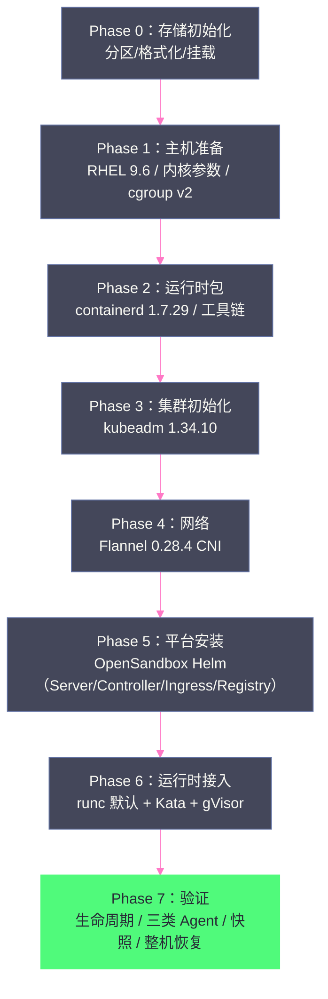

# 10 Agent 沙箱部署实战——从单机 PoC 到测试集群

**摘要：**

前 9 篇建立了完整的理论框架（隔离技术 + 平台架构），本文开始"动手"：完整还原 OpenSandbox 沙箱平台从单机 PoC 到测试集群的真实部署过程。文章以素材的 47 步部署记录为骨架，分三层展开：**基础设施层**（物理机评估、RHEL 9.6 基线、存储分区、containerd、kubeadm、Flannel 的完整安装链）；**平台层**（OpenSandbox Helm 安装：Server/Controller/Ingress Gateway/Snapshot Registry 四组件、runc/gVisor/Kata 三运行时接入、Console）；**验收层**（单机 PoC 的验证清单、测试集群的 Gate 0-9 分阶段验收体系——发布物冻结、Namespace 边界、Bootstrap、公共能力、载荷联调、容量治理）。文章同时完整收录了部署过程的真实踩坑清单（Issue-021 Helm 配置不生效、CLI 假成功、180 秒创建超时、Runtime 切换需 rollout restart、Registry HTTP 单点等）与"API/CR/Pod 三层对照"排障法。核心认知：**沙箱平台的部署不是"一次 Helm install"，而是"基础设施→平台→运行时→验收"的四段式工程——单机 PoC 验证功能、测试集群验证治理、Gate 验收把"以为能用"变成"验证过能用"**。

---

## 第 1 章 部署前的决策：形态与基线

### 1.1 三种部署形态

部署 OpenSandbox 类沙箱平台，先明确形态——三种形态的目标、投入与产出完全不同：

| 形态 | 目标 | 投入 | 产出 |
| :--- | :--- | :--- | :--- |
| **单机 PoC** | 验证"平台能用"（生命周期/三类 Agent/运行时切换） | 1 台物理机/高配 VM | 功能证据链 + 性能基准数据 |
| **测试集群** | 验证"治理能用"（HA/配额/发布流程/多 Agent） | 1 控制面 + ≥3 Worker | 生产化差距清单 |
| **生产集群** | 承载真实流量 | 双控制面 + 隔离节点池 | 稳定服务 |

**素材的形态决策**（Phase3-08/Phase4-00）：PoC 用单物理机（10.2.177.37，Dell R740），测试集群复用已有 DomeOS 集群控制面（ID 153）+ 新建独占资源包。**"复用控制面、隔离数据面"是资源受限时的标准打法**——控制面共享（省成本），Worker 独占（保隔离）。

### 1.2 硬件与 OS 基线

素材 Phase1-08/09 的评估结论：

| 维度 | 推荐基线 | 理由 |
| :--- | :--- | :--- |
| **OS** | RHEL 9.x 优先 | cgroup v2、内核 ≥4.18、gVisor 兼容性好 |
| **兼容闸门** | RHEL 8.7（最低） | 老集群迁移的兼容底线 |
| **硬件** | 物理机优先（KVM/EPT 可用） | Kata/MicroVM 需要 VT-x；CVM 嵌套需过门禁（[[隔离原语/04 KVM 与硬件虚拟化——MicroVM 隔离的硬件基石|第 04 篇]]） |
| **内存** | ≥64GB（PoC）/ 按容量模型 | 三运行时基准显示 Kata 空闲 397MiB/槽 |
| **存储** | imagefs 与 kubelet 分开（SSD） | 镜像拉取与容器写层互不干扰 |

**素材 PoC 机的完整画像**：Dell R740、32C/64T/251GiB、8×600GB SAS、1Gbps 活动接口、RHEL 9.6（内核 5.14.0-570）、SELinux 当时 Disabled、cgroup v1→v2（部署时确认）。**"先评估后部署"的纪律**：这台机器在投入部署前完成了一整轮能力评估（KVM 可用性、存储布局、网络带宽）——**评估文档是部署的第一份交付物**。

### 1.3 网络与存储的专项准备

部署前还有两个容易被低估的专项准备——网络与存储：

**网络专项**：

| 检查项 | 内容 | 不做的后果 |
| :--- | :--- | :--- |
| **节点互通** | 控制面与 Worker 的端口互通（kubeadm 需要 6443/10250 等） | 集群初始化失败 |
| **镜像拉取路径** | 内网 Registry 可达性（**内网仓库是离线部署的前提**，素材脚本 03 的第一步） | 镜像拉取超时 |
| **带宽预算** | 大镜像（2.6GB code-interpreter）× 并发拉取 | 拉取风暴拖垮网络 |
| **DNS** | 集群 DNS 与外部 DNS 的解析边界 | 沙箱内域名解析异常 |

**存储专项**：除了 2.2 节的 containerd/kubelet 分区，还要规划**快照 Registry 的存储**（每个快照是完整 rootfs 镜像，素材 PoC 中 Registry 用 HostPath——**快照容量 = 沙箱 rootfs 大小 × 快照数量**，这是容量模型最容易漏算的一项）。

**素材的教训**：PoC 机评估时专门验证了"1Gbps 活动接口"——**网络是部署中最难事后补救的维度**（机器到位后发现带宽不足，只能换机器）。

### 1.4 最小资源模型

| 形态 | 控制面 | Worker | 说明 |
| :--- | :--- | :--- | :--- |
| 最小 PoC | 1 ×（4C/8G） | 2 ×（8C/16G） | 控制面与 Worker 分离（不共置） |
| 单机 PoC（素材） | 共置（32C/251GiB） | 同机 | 资源充足时单机即可 |
| 推荐生产（素材） | Server 2 + Ingress 2 + Controller 2 | ≥3 节点 | 双副本 + 故障域 |

**注意"推荐生产"的深意**：Server 2 副本（1C/4G request）+ Controller 2 副本 + Worker ≥3——**控制面组件按"副本数"规划，Worker 按"故障域"规划**（≥3 节点保证单节点故障不丢多数派）。**资源模型的产出是"部署前就要算清的账"**，不是部署中现算。

---

## 第 2 章 单机 PoC：47 步完整部署

### 2.1 部署全景

素材 Phase3-00 的 47 步记录，按阶段组织（本文给出阶段骨架，完整命令以官方文档 + 素材手册为准）：



### 2.2 基础设施层（Phase 0-4）

**存储初始化**（素材的磁盘布局）：

```
/dev/sdd6 → /data/containerd-disk（containerd 数据，ext4，514G 可用）
/dev/sdg6 → /data/kubelet-disk（kubelet 数据，ext4，514G 可用）
```

**为什么分开**：containerd 的镜像层与 kubelet 的容器写层分开——**任一爆满不互相拖累**（镜像拉取风暴不阻塞容器写层）。这是单机部署中最容易被跳过的"小事"，但生产事故的常见根因。

**containerd 配置要点**（1.7.29，CRI v1）：
- `SystemdCgroup = true`（与 kubelet 的 cgroup driver 一致——**不一致会导致节点 NotReady**）；
- 后续接入 Kata/gVisor 时在 config.toml 注册 runtime 插件（[[隔离原语/02 Linux 隔离原语——namespace、cgroups、seccomp 与 capabilities 的安全地基|第 02 篇]] 的七跳链路第 5 跳）。

**kubeadm 初始化**（1.34.10）：
- Pod CIDR 172.29.0.0/16、Service CIDR 172.28.0.0/16（与 Flannel 配置一致）；
- 单节点部署需移除控制面污点（taint）让 Worker 负载可调度。

**Flannel 0.28.4**：overlay 网络（VXLAN 后端）——**注意 Flannel 不执行 NetworkPolicy**（[[平台与协议/08 OpenSandbox 数据面——execd 与 egress 的盒内世界|第 08 篇]] 的策略真伪问题）：PoC 阶段可接受，生产必须换 Calico/Cilium 或先做真伪实验。

### 2.3 平台层（Phase 5-6）

**OpenSandbox 组件清单**（素材 PoC 版本）：

| 组件 | 版本 | 端口 | 说明 |
| :--- | :--- | :--- | :--- |
| **Server** | 0.2.2 | 30080 (NodePort) | Lifecycle API；Snapshot 元数据 pod-local SQLite |
| **Controller** | 0.2.0 | - | BatchSandbox CRD 调谐 |
| **Ingress Gateway** | 1.0.10 | 30081 | 动态路由，签名 Header |
| **Snapshot Registry** | registry:2.8.3 | 30500 | HTTP，NodePort，HostPath（POC-004 妥协） |
| **Console** | 0.2.3-rc.3 | 30082 | React + BFF（pause/resume 显式开启） |
| **execd** | v1.0.21 | 动态 | 沙箱内守护进程（随沙箱注入） |
| **egress** | v1.1.5 | - | 网络策略 sidecar |

**Helm 安装的关键参数**（素材 PoC）：
- `secure_runtime` 配置决定默认运行时（runc 默认；切 Kata/gVisor 走此处）；
- Registry 地址（镜像拉取源）；
- API Key（平台凭据——PoC 用共享 Key，POC-005 妥协）。

**运行时接入（Phase 6）**：
- **runc**：默认，零配置；
- **Kata 3.31.0**：Helm chart 安装 + containerd 注册 `kata-qemu-runtime-rs` handler + RuntimeClass 创建 + 节点标签（[[隔离原语/02 Linux 隔离原语|七跳链路]] 的四层一致性）；
- **gVisor**：runsc release-20260810.0 + containerd 注册 + RuntimeClass——**注意 platform 选择**（裸金属 kvm、VM 里 systrap，[[隔离原语/03 隔离边界的光谱——从共享内核到 MicroVM 的四档技术路线|第 03 篇]] 的门禁二）。

### 2.4 部署的脚本化：素材的 24 个脚本

素材 PoC 的部署不是"手敲命令"，而是沉淀为 24 个可复现脚本（`poc/scripts/01-24`）——**脚本化是部署工程化的第一标志**：

| 脚本段 | 内容 | 教训 |
| :--- | :--- | :--- |
| 01-02 | 存储初始化 + 主机准备 | 环境前置可一键复现 |
| 03-04 | 仓库配置 + runtime/k8s 包安装 | 内网仓库（yum 源）是离线部署的前提 |
| 05-07 | kubeadm 初始化 + Flannel + K8s 冒烟 | **每步都有冒烟验证**（k8s-smoke） |
| 08-10 | Helm 准备 + OpenSandbox 安装 + 生命周期冒烟 | 09a 是 auth-fix（**认证修复补丁**——真实部署必然有补丁） |
| 11 | TTL 过期验证 | 生命周期治理的实测 |
| 12-16 | Kata 安装/冒烟/切换/生命周期 | 13a 是 postcheck（**安装后的自查脚本**） |
| 17-18 | 重启前后检查 + 重启后负载冒烟 | **整机恢复验证**（2.4 节） |
| 19-24 | Snapshot 注册/API/Console 部署 | 能力补全的后期阶段 |

**脚本化带来的三个好处**：**可复现**（换台机器能重放）、**可审计**（部署即证据）、**可演进**（新环境部署 = 改参数重放）。**素材的"auth-fix"与"postcheck"脚本说明一个现实：真实部署必然有补丁与自查——脚本化让补丁成为版本的一部分，而不是口头经验**。

### 2.5 快照注册与 Console 部署（Phase 7-8）

素材脚本 19-24 覆盖了平台能力的后期补全阶段：

**快照注册（19-20）**：
- Snapshot Registry 注册到平台（Registry 地址/凭据配置）；
- 快照 API 冒烟：创建快照 → 查询记录 → 从快照恢复；
- **注意 GAP-003/004 的影响**：元数据在 pod-local SQLite（单副本 Server 才可查）、删除不回收 blob——**Lab 级能力，文档注明边界**。

**Console 部署（21-23）**：Console 经历 rc2→rc3 两次部署迭代（素材脚本 21/22 是不同版本的部署，23 是 pause/resume 显式开启的验证）——**版本迭代是 Console 的常态，部署脚本要参数化版本号**。

**API 参考沉淀（24）**：API 完整列表与调用参考归档（素材 Phase3-07 的 65 个操作）——**"API 参考文档"是平台交接的第一份资产**（CLI 缺 Snapshot/Pool 命令组时，API 参考是唯一的操作依据）。

### 2.6 平台升级路径

部署完成不等于一劳永逸——OpenSandbox 迭代快（素材 PoC 期 Console 就有 rc2→rc3），升级路径要提前设计：

| 升级对象 | 方式 | 注意事项 |
| :--- | :--- | :--- |
| **Server/Controller** | Helm upgrade | **发布物冻结**（digest 锁定）；升级后验证 CRD 兼容（DEF-005 的教训） |
| **execd** | 注入版本变化 | 新沙箱生效（旧沙箱保持旧版本）——**execd 升级不破坏运行中沙箱** |
| **Runtime（Kata/gVisor）** | containerd 注册 + RuntimeClass | 四层一致性重验（[[隔离原语/02 Linux 隔离原语|第 02 篇]]） |
| **镜像** | Registry 推送 | **镜像更新 → 新池预热 → 切流**（[[平台与协议/09 OpenSandbox 编排面|第 09 篇]] 的池运维经验三） |

**升级的三个原则**：**先验证后切换**（测试集群先升级验证再动 PoC/生产）、**可回滚**（Helm 历史版本 + 发布物冻结保证回退路径）、**验证即归档**（升级后的冒烟结果归档——"升级成功"要有证据，不是感觉）。

### 2.7 验证清单（Phase 7）

素材 Phase3-01 的 PoC 验收入口清单：

| 验证域 | 通过标准 |
| :--- | :--- |
| **生命周期 API** | 创建/查询/续期/删除全链路，残留 0 |
| **Snapshot** | 快照创建/恢复闭环（Lab 级） |
| **Kata 运行时** | 隔离证据链（guest 内核/QEMU 进程/RuntimeClass 注入） |
| **Console** | 登录 + 沙箱操作（pause/resume 显式开启） |
| **三类 Agent** | OpenCode/Hermes/LangChain 创建→任务→回收 |
| **整机恢复** | 重启后平台自恢复（数据面/控制面状态） |

**"整机恢复"是最容易漏的验证**——平台部署完成不等于可运维，**重启即崩溃的部署是最常见的"假成功"**。

---

## 第 3 章 踩坑清单：素材实测的 12 个坑

### 3.1 配置类

**坑 1：Helm 配置不生效（Issue-021）**。通过 Helm 修改 `secure_runtime` 配置后，**必须手动 `rollout restart deployment/opensandbox-server`** 才生效——Helm upgrade 不自动触发滚动重启。**教训：配置变更的生效路径要验证，不能假设**。

**坑 2：containerd 与 kubelet 的 cgroup driver 不一致**。SystemdCgroup 必须显式配置——不一致导致节点 NotReady，症状隐蔽（kubelet 报错日志在最后）。

**坑 3：Flannel 与 kubeadm 的 CIDR 不一致**。Pod CIDR 声明不一致导致 Pod 网络不通——**CIDR 是"一处声明、三处一致"**（kubeadm init、Flannel manifest、Service CIDR 不冲突）。

### 3.2 API 语义类

**坑 4：CLI 假成功（DEF-001）**。`osb sandbox pause` 返回 ok 不等于最终成功——**必须轮询到 Paused 终态**（[[平台与协议/07 OpenSandbox 架构深度解析——协议优先与六责任面|第 07 篇]] 的 202 语义）。

**坑 5：创建 180 秒超时 504**。创建坏镜像时 API 挂起约 180 秒返回 504，**sandbox_id 只在错误 message 中**（正则提取）。客户端超时设置必须大于 180 秒，否则"平台还在等，客户端已放弃"。

**坑 6：202 的"同步完成"语义**。202 返回时 Pod 已 Running——**重复调用 create 会创建重复沙箱**（把 202 当异步受理的后果）。

### 3.3 运行时类

**坑 7：Runtime 切换的生效路径**。`secure_runtime` 是 Server 级配置——**切换后不仅 rollout restart，还要验证新创建的沙箱确实用了新运行时**（隔离证据链，[[隔离原语/02 Linux 隔离原语|第 02 篇]] 5.3 节）。

**坑 8：Kata 的四层一致性**。RuntimeClass handler 与 containerd 插件名不一致 → Pod 创建失败；节点标签缺失 → Pod 一直 Pending——**四层任何一层断，症状都是"创建失败"，排查顺序固定**（Server 配置→CR→RuntimeClass→containerd）。

**坑 9：gVisor 的 platform 选择**。默认 platform 在 VM 环境可能错误——**显式设置 systrap**（CVM 场景），裸金属用 kvm（[[隔离原语/03 隔离边界的光谱——从共享内核到 MicroVM 的四档技术路线|第 03 篇]] 门禁二）。

### 3.4 安全与运维类

**坑 10：Registry 单点 HTTP**。Snapshot Registry 单副本 + HTTP + NodePort（POC-004）——**快照功能依赖 Registry，Registry 挂了快照全挂**。生产必须企业 TLS Registry + 多副本。

**坑 11：共享平台 Key**。PoC 用共享 Key——**MCP 打穿后父 Agent 能枚举全部沙箱**（[[生产化/14 沙箱安全体系——三层防护、短期凭据与多租户|第 14 篇]] 的凭据治理）。

**坑 12：NodePort 直露**。直接暴露 HTTP NodePort（POC-007）——**生产入口必须 Gateway + SSO**。

> [!warning] 生产避坑
> 12 个坑的共同规律：**"配置声明"与"运行事实"的脱节**——Helm 配置了但没重启、CLI 返回了但没完成、RuntimeClass 声明了但 containerd 没注册。**对抗脱节的唯一方法是"证据链验证"**：每个配置变更都要用"实际行为"验证（新沙箱的运行时、Paused 状态、Pod 的 runtimeClassName）——**素材把这条纪律贯彻到了每个验收项**。

### 3.5 环境问题台账（素材 4 项）

素材差距台账中的 4 个环境问题（区别于平台缺陷——环境问题源于基础设施）：

| 问题 | 本质 | 处理 |
| :--- | :--- | :--- |
| **SELinux 当时 Disabled** | 基线未达生产要求（生产要求 Enforcing） | 生产环境启用 SELinux 并重跑验证 |
| **cgroup v1 → v2** | 部署前基线确认不充分 | 部署时确认并固化基线 |
| **Registry HTTP 单点** | 快照链路的单点依赖 | 企业 TLS Registry（生产） |
| **CNI 策略未证实** | Flannel 不执行 NetworkPolicy | 真伪实验（[[平台与协议/08 OpenSandbox 数据面|第 08 篇]] 4.4 节） |

**环境问题与平台缺陷的区分价值**：处理路径不同——平台缺陷等上游/绕行，环境问题**必须自己修**（基础设施是自己的责任）。**台账分类的准确性直接决定问题能否被消除**。

### 3.6 排障的日志路径

素材排障实践的日志分层（按"从外到内"的顺序）：

```
第 1 层：客户端日志（SDK/CLI 报错原文）
第 2 层：Server 日志（kubectl logs deployment/opensandbox-server）
第 3 层：Controller 日志（kubectl logs deployment/opensandbox-controller）
第 4 层：Pod 事件与状态（kubectl describe pod <sandbox-pod>）
第 5 层：CRI 层（crictl ps/日志、containerd 日志）
第 6 层：运行时层（runc/runsc/kata shim 日志、QEMU 进程）
```

**日志路径的规则**：**先看"离问题最近的证据"，再向外扩展**——创建失败先看 Server（创建路径归它），运行异常先看 Pod 事件，再下探 CRI/运行时。**不要一开始就翻运行时日志**——那是最后一层，信息密度最低、噪音最大。

**素材的三个日志纪律**：
1. **时间对齐**：跨层排查时用同一时间窗口（`--since`），避免"不同时间的日志拼出错误结论"；
2. **request_id 贯穿**：Server 的请求 ID 是跨层关联的锚点（GAP-001 未实现时，request_id 手工关联）；
3. **证据归档**：每次事故的日志片段归档到排障记录——**"同一坑不踩第二次"靠的是证据库，不是记忆力**。

---

## 第 4 章 测试集群：Gate 0-9 分阶段验收

### 4.1 为什么分 Gate

测试集群（Phase4）不是"把 PoC 换个地方再装一遍"——它的目标是**验证"治理能用"**（HA、发布流程、配额、多租户边界）。素材设计了 Gate 0-9 的分阶段验收：**每个 Gate 有明确的通过标准、排障入口与回退方法**，任何 Gate 不过就停在该阶段，不前进。

**分 Gate 的三个理由**：
1. **故障域隔离**：每个 Gate 只引入一类风险（网络问题在 Gate 0 暴露，不会污染 Gate 4 的验证）；
2. **证据链完整**：每步通过都有记录（"发布物冻结"是 Gate 1 的核心——**部署用的 Chart/镜像/digest/Secret 先冻结再安装**，事后可复现）；
3. **回退可控**：每个 Gate 定义了回退方法（失败时回到哪个状态、怎么回）。

### 4.2 Gate 0-9 详解

| Gate | 内容 | 通过标准（示例） | 回退方法 |
| :--- | :--- | :--- | :--- |
| **0：集群准入** | 节点、权限、磁盘、CNI、Registry、观测 | 节点 Ready、磁盘容量达标、观测链路通 | 修环境，不前进 |
| **1：发布物冻结** | Chart、镜像、digest、Secret 锁定 | 发布物清单齐全且可复现 | 修正清单 |
| **2：Namespace 与调度边界** | 命名空间、节点选择器、污点 | 沙箱只能调度到指定节点池 | 修调度配置 |
| **3：Bootstrap + Runtime** | CRD/ClusterRole + Deployment/Service | 组件全部 Ready | Helm 回滚 |
| **4：公共能力** | 生命周期、execd、Gateway、SSO、策略、观测 | 全能力验证通过 | 逐项回退 |
| **5：载荷联调** | 三类 Agent/MCP | 创建→任务→回收闭环 | 修镜像/适配 |
| **6：容量与治理** | 配额、并发、N-1 | 配额生效、并发达标、N-1 通过 | 调整配额 |
| **7-9：稳定性/安全/交接** | 持续运行、安全基线、文档交接 | 24-72h 稳定、审计可用、文档齐全 | 补充验证 |

**Gate 的哲学**：**每个 Gate 的通过标准都是"可验证的事实"，不是"看起来正常"**——"观测链路通"要有具体指标可查，"配额生效"要有超限拒绝的证据。**素材的 Gate 设计是"验收驱动部署"的典范**。

### 4.3 部署实录：2026-08-12

素材 Phase4-05 记录了测试集群的首次实际部署：

| 项 | 结果 |
| :--- | :--- |
| **集群** | DomeOS panther-dev（ID 153），Kubernetes 1.28.2 |
| **节点** | 3×8C/15.5GiB（agent-manager）+ 3×4C/7.64GiB（test-lqh）+ 新建独占资源包 |
| **Profile** | Core HA（双副本，Snapshot/Pause 关闭） |
| **运行时** | 仅 runc（不装 Kata/gVisor——"runc Profile 先行"决策，[[隔离原语/03 隔离边界的光谱|第 03 篇]] 7.4 节） |
| **结果** | Server/Controller 双副本 Ready；三类 Agent 验收通过；**残留 0** |

**"仅 runc"的决策值得细品**：测试集群的目标是验证"治理"（HA/发布/配额），不是"隔离"（那是 PoC 已验证的）——**每个环境只验证它的目标，是资源效率与故障隔离的统一**。

### 4.4 Gate 验收的证据归档

Gate 验收的产出不只是"通过/不通过"——**每一关的通过证据要归档**（素材 Phase4-05 的"执行与审计记录"就是模板）：

| 证据类型 | 内容 | 归档形式 |
| :--- | :--- | :--- |
| **发布物清单** | Chart/镜像/digest/Secret 的锁定版本 | 冻结清单文件 |
| **部署日志** | 安装命令与输出 | 脚本输出归档 |
| **验证结果** | 每个 Gate 的通过标准证据 | 检查表 + 截图/输出 |
| **异常记录** | 遇到的问题与解法 | 踩坑台账（3 章的来源） |
| **回滚记录** | 回退动作与结果 | 回滚脚本/命令 |

**证据归档的三个用途**：**审计**（部署合规可查）、**复现**（新环境部署的输入）、**复盘**（生产事故时追溯"这个配置是哪来的"）。**"部署即证据"与"配置即代码"是同一纪律的两面**——没有归档的部署，等于没有部署记录。

### 4.5 测试集群的日常运维节奏

测试集群不是"部署完就完事"——素材 Phase4-01/03 隐含的日常运维节奏：

| 节奏 | 内容 | 目的 |
| :--- | :--- | :--- |
| **每日** | 集群健康巡检（节点/组件/残留沙箱） | 及早发现漂移（"残留 0"纪律的日常化） |
| **每周** | 容量审计（池利用率/镜像缓存/Registry 增长） | 防容量事故（碎片与 blob 增长） |
| **每变更** | 重跑 Gate 4/5（公共能力 + 载荷联调） | 变更回归（镜像/配置/版本升级后） |
| **每迭代** | 差距台账更新（GAP/DEF 状态） | 生产化路线图的活数据 |

**"残留 0"的日常化**：测试集群每天检查"API/CR/Pod 三层是否残留"——**残留不是"偶尔发生"而是"每天要查"**（TTL 调度、finalizer 缺陷、脚本中断都会制造残留）。**运维节奏的本质：把验收纪律变成日常习惯**。

### 4.6 API/CR/Pod 三层对照排障法

素材 Phase3-10 的"七课教学"（API→CR→Pod→CRI→Agent→MCP→子沙箱）沉淀的排障法：**任何沙箱异常，按三层对照定位**：

```
第 1 层：API 层 —— 请求返回什么？（202/504/4xx）
第 2 层：CR 层 —— CR 状态是什么？（phase/ready/conditions）
第 3 层：Pod 层 —— Pod 细节是什么？（Running/Pending/CrashLoop/ImagePullBackOff）

对照规则：
  API 成功 + CR Ready + Pod Running  → 问题在数据面（execd 等）
  API 成功 + CR Pending              → 问题在调度（资源/污点/选择器）
  API 失败 + CR 不存在               → 问题在 Server（校验/回滚）
  Pod Running + 服务不可达           → 问题在网络（CNI/egress/Endpoint）
```

**三层对照的价值**：把"平台黑盒"拆成"三个可查的事实层"——**每层都有独立的证据来源（API 响应/CR 状态/Pod 事件），交叉对照即可定位**。这是本专栏推荐的沙箱排障第一方法。

---

## 第 5 章 从 PoC 到集群的差异

### 5.1 架构差异

| 维度 | 单机 PoC | 测试集群 |
| :--- | :--- | :--- |
| 控制面 | 单副本 | 双副本（HA） |
| 存储 | 本地磁盘 | 集群存储（PVC） |
| 网络 | NodePort 直露 | Gateway + 策略 |
| 发布 | 手工/脚本 | 发布物冻结 + Gate 验收 |
| 观测 | 无/弱 | 接入统一观测 |
| 凭据 | 共享 Key | 收敛中（POC-005 消除） |

**差异的本质**：PoC 回答"能不能用"，集群回答"能不能持续用"——**HA、可复现、可观测、可治理是"持续"的四个支柱**，每一个都需要独立投入。

**一个容易被忽视的差异：故障模拟**。PoC 阶段几乎不做故障模拟（环境太宝贵），测试集群开始引入——节点重启（素材脚本 17-18 的重启前后检查）、组件 Kill（Server 单副本停掉看行为）、Registry 不可达（快照链路降级表现）。**故障模拟是"治理能用"的试金石：没有模拟过故障的 HA，是纸面 HA**。测试集群的 Gate 7-9（稳定性/安全）应该包含固定的故障演练清单，且每次演练都要产出"故障后行为记录"——**"集群在故障下的行为"是比"集群在正常时的表现"更重要的运维资产**。

### 5.2 从测试集群到生产的转化清单

素材 Phase5-10 的"从测试集群到生产"给出了转化清单的骨架（T 级与 P 级，[[生产化/15 生产化深水区——十个盲区与行业共识|第 15 篇]] 展开），本文先给摘要版：

| 转化项 | 测试集群状态 | 生产要求 |
| :--- | :--- | :--- |
| **节点** | 共享集群的资源包 | 独立节点池（物理故障域 ≥3） |
| **运行时** | 仅 runc | 三 Profile（runc/gVisor/Kata）独立域名 |
| **网络** | Flannel（不执行策略） | 先做策略真伪实验，再写租户隔离 |
| **Registry** | HTTP 单副本 | 企业 TLS Registry + 快照 blob GC |
| **凭据** | 共享平台 Key | 短期凭据 + 租户绑定（[[生产化/14 沙箱安全体系|第 14 篇]]） |
| **入口** | NodePort | Gateway + SSO |
| **观测** | 基础接入 | SLO + 告警 + 审计链路 |
| **发布** | Gate 验收 | 版本化发布 + 升级回滚演练 |

**转化的三个原则**：其一，**每项转化都要有"触发条件"**（如 gVisor 灰度以兼容性验证通过为条件，Kata 以嵌套门禁为条件）；其二，**转化顺序按风险排序**（凭据/入口类安全项优先，性能类优化殿后）；其三，**转化即验证**（每项转化完成后重跑 Gate 4/5 验证）。

### 5.3 生产 Worker 的资源需求清单（素材交付物）

素材的集群资源需求文档给出了生产 Worker 的完整清单（比 PoC 的"8C/16G"细一个数量级）：

| 项 | 要求 | 理由 |
| :--- | :--- | :--- |
| **imagefs** | 每 Worker 400GiB+ SSD | 镜像缓存（2.6GB 级镜像 × 多版本）+ 快照临时空间 |
| **OS** | RHEL 9.6、cgroup v2、SELinux Enforcing、swap off、chrony | 生产基线（SELinux 从 Disabled 转 Enforcing 是必须项） |
| **网络** | 25G 网络 | 大镜像拉取 + 批量交付的带宽需求 |
| **虚拟化** | KVM 透传（Kata 节点） | [[隔离原语/04 KVM 与硬件虚拟化|第 04 篇]] 的嵌套门禁 |
| **故障域** | ≥3 个物理故障域 | 单故障域不丢多数派 |
| **身份** | 独立资源包/租户隔离 | 多租户边界（[[生产化/14 沙箱安全体系|第 14 篇]]） |

**清单的使用**：生产资源申请直接引用此清单——**"按清单申请"比"按感觉申请"更容易获批**（每一行都有理由，每一行都可审计）。

### 5.4 妥协项清单与生产化差距

素材 Phase3-11 的台账（11 PoC 妥协 + 7 DEF + 16 GAP + 4 环境问题）是"从集群到生产"的路线图原料：

| 类别 | 数量 | 处理原则 |
| :--- | :--- | :--- |
| PoC 妥协 | 11 | 生产化逐项消除（单副本→双副本、HTTP→TLS、共享 Key→短期凭据） |
| 产品缺陷 | 7 | 等上游/绕行/打补丁（轮询终态绕行 DEF-001 等） |
| 能力缺口 | 16 | 排入自研路线图（WarmPool SLI、快照 HA、凭据治理） |
| 环境问题 | 4 | 基础设施补齐（Registry TLS、CNI 升级、观测接入） |

**台账的使用**：**每一项都要有"归属"（上游/自研/绕行）与"截止"（哪个阶段消除）**——无归属的项会在生产事故中现身（[[生产化/15 生产化深水区——十个盲区与行业共识|第 15 篇]] 的 T/P 路线）。

---

## 第 6 章 总结与下一篇导读

### 6.1 本文核心要点

1. **四段式工程**：基础设施→平台→运行时→验收——部署不是"一次 Helm install"
2. **形态决策先行**：单机 PoC 验证功能、测试集群验证治理、生产验证稳定——每个环境只验证它的目标
3. **基线纪律**：RHEL 9.x 优先、存储分区（containerd/kubelet 分离）、评估文档是部署的第一份交付物
4. **12 个真实踩坑**：配置声明与运行事实的脱节是最大敌人——证据链验证是唯一解药
5. **Gate 0-9 验收体系**：发布物冻结、可复现、可回退——"验收驱动部署"
6. **三层对照排障法**：API/CR/Pod 三层交叉定位——沙箱排障的第一方法
7. **妥协项台账**：11 POC + 7 DEF + 16 GAP——每项有归属与截止才是路线图

### 6.2 从零到可用的时间线参考

综合素材各阶段记录，给出"从零到可用"的参考时间线（人力 1-2 人）：

| 阶段 | 时长（参考） | 里程碑 |
| :--- | :--- | :--- |
| **环境评估** | 1-2 天 | 机器画像 + OS 基线 + 资源模型文档 |
| **基础设施部署** | 1-2 天 | 存储/containerd/kubeadm/Flannel 冒烟 |
| **平台安装** | 1 天 | OpenSandbox 四组件 + 生命周期冒烟 |
| **运行时接入** | 1-2 天 | Kata/gVisor 安装 + 隔离证据链 |
| **Agent 适配** | 2-3 天 | 三类 Agent 镜像化（[[工程实践/11 三类 Agent 沙箱落地|第 11 篇]]） |
| **性能基准** | 1-2 天 | 三运行时基准 + WarmPool 验证（[[工程实践/12 沙箱性能工程|第 12 篇]]） |
| **差距台账** | 1 天 | POC/DEF/GAP/环境四类清单 |
| **测试集群** | 3-5 天 | Gate 0-9 分阶段验收 |

**总计约 2 周**——这是"从零到测试集群可用"的现实量级（素材的实际节奏）。**时间线的两个缓冲点**：运行时接入（坑最多）与 Agent 适配（无标准）——排期时这两个阶段各加 50% 余量。

### 6.3 术语速查

| 术语 | 口径 |
| :--- | :--- |
| **四段式** | 基础设施→平台→运行时→验收的部署顺序 |
| **发布物冻结** | 部署前锁定 Chart/镜像/digest/Secret（可复现性） |
| **Gate 0-9** | 测试集群的分阶段验收关卡 |
| **三层对照** | API/CR/Pod 三层证据交叉定位排障法 |
| **runc Profile 先行** | 测试集群只装 runc 的决策（先验证治理，后加隔离） |
| **POC 妥协** | PoC 阶段可接受的简化（单副本/HTTP/共享 Key） |

### 6.3 思考题

1. **单机 PoC 的边界**：素材的单机 PoC 在 32C/251GiB 物理机上完成。如果只有一台 8C/16G 的 VM，PoC 应该砍掉哪些验证项？提示：考虑"三类 Agent 全跑"与"三运行时全装"的内存成本（Kata 空闲 397MiB/槽），以及"整机恢复"验证在 VM 上的意义。

2. **Gate 的粒度**：素材用 Gate 0-9 分阶段验收。对于一个 3 人团队的小项目，9 个 Gate 是否过重？你会合并哪些 Gate？提示：Gate 的粒度应该与"变更频率 × 故障成本"匹配——小团队低频率可以合并，大团队高频率需要细化。

3. **脚本化的程度**：素材把部署沉淀为 24 个脚本。脚本化的边界在哪里——哪些步骤应该脚本化，哪些应该保留为"人工判断"？提示：考虑"幂等性"（重放安全）与"判断点"（需要人决策的步骤，如 Gate 通过与否）。

### 6.4 下一篇导读

平台部署完成、验收通过之后，下一个问题：**沙箱里跑什么？** [[工程实践/11 三类 Agent 沙箱落地——OpenCode、Hermes 与 LangChain 镜像化实战|11 三类 Agent 沙箱落地]] 将完整还原三类真实 Agent 的镜像化与跑通路径——父沙箱保活、execd 配置注入、原生 Server 接口 vs PTY、MCP 创建子沙箱的完整链路（创建→执行→回收），以及"4950"这个验证数字背后的完整证据链。

> [!info] 专栏导航
> 本文是 [[../00 专栏导览|Agent 沙箱技术专栏]] 的第 10 篇，工程实践开篇。07-09 篇建立 OpenSandbox 架构认知；本文完成部署；11 篇 Agent 落地；12 篇性能工程。13-15 篇进入生产化。

---

## 参考文献

1. 素材调研. Phase3-00 实施总记录（47 步）、Phase3-01 PoC 验收手册、Phase3-04 runc 切换、Phase3-10 七课教学、Phase3-11 差距台账、Phase4-02/03 Gate 验收手册、Phase4-05 部署实录
2. 素材调研. Phase1-08 PoC 资源与 OS 基线、Phase1-09 单机节点评估、Phase1-11 生产化形态与资源模型
3. Kubernetes 官方文档. kubeadm/containerd 配置
4. OpenSandbox 官方文档. 部署章节
5. 素材调研. Phase5-10 从测试集群到生产、交付物-集群资源需求
6. 素材脚本. poc/scripts/01-24（部署脚本化参考）

---

## 修改记录

- 2026-08-15：专栏创建，本文基于素材部署记录与验收手册整合创作

## 附录：部署检查单速查

```
□ 机器评估（KVM/存储/带宽）     □ 发布物冻结（Chart/镜像/digest/Secret）
□ OS 基线（RHEL 9.6/cgroup v2）  □ Namespace 与调度边界
□ 存储分区（containerd/kubelet） □ Bootstrap + Runtime（双副本）
□ containerd（SystemdCgroup）    □ 公共能力（生命周期/execd/Gateway/SSO）
□ kubeadm + Flannel（CIDR 一致） □ 载荷联调（三类 Agent/MCP）
□ OpenSandbox Helm 安装          □ 容量与治理（配额/并发/N-1）
□ 运行时接入（Kata/gVisor）      □ 残留 0 检查（三层）
□ 证据链验证（隔离证据）         □ 证据归档（部署即证据）
```
