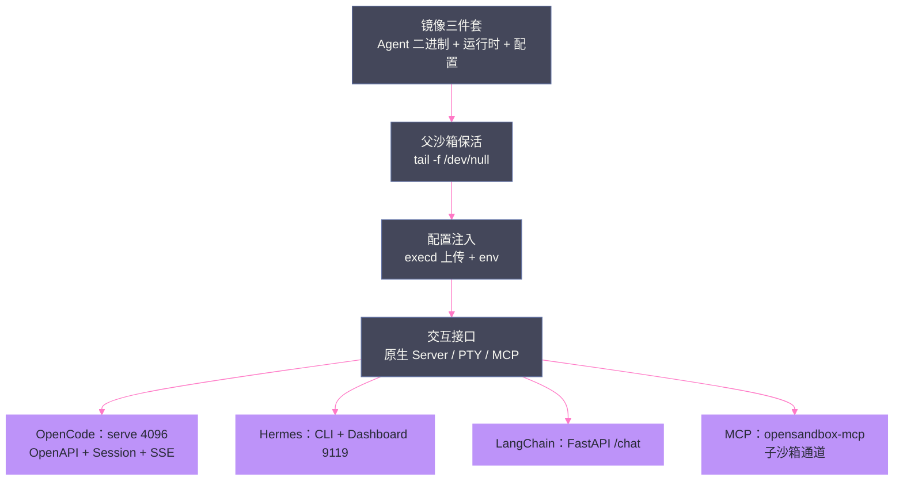
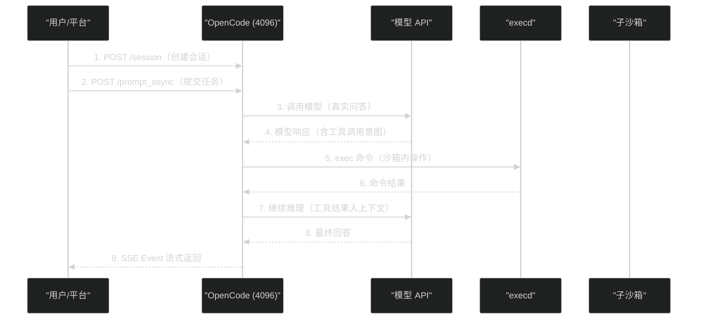
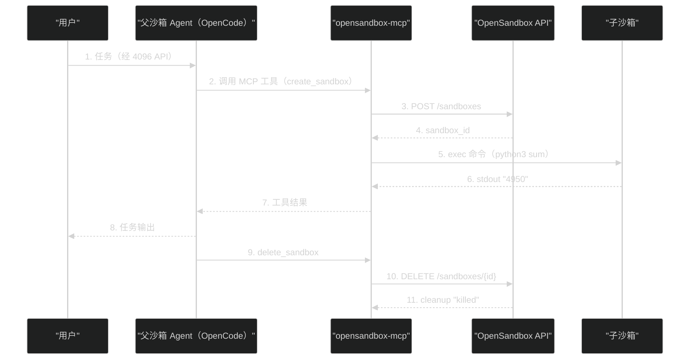

# 11 三类 Agent 沙箱落地——OpenCode、Hermes 与 LangChain 镜像化实战

**摘要：**

[[平台与协议/06 Agent 沙箱平台分层——六层模型与三条产品路线|第 06 篇]] 指出第 5 层（Agent 适配）是开源生态最大缺口——本文用三类真实 Agent（OpenCode 1.18.15、Hermes 0.19.0、LangChain 1.3.14 定制服务）的镜像化实战，完整填上这个缺口。文章首先给出 Agent 沙箱化的通用模式：**镜像设计**（Agent 二进制 + 运行时 + 配置三件套）、**父沙箱保活**（`tail -f /dev/null` 让容器活到 Agent 接管）、**配置注入**（execd 上传而非镜像内置）、**交互接口选择**（原生 Server API 优先、PTY 仅作兼容通道）；然后逐类拆解三个 Agent 的落地差异——OpenCode 的 `serve` 模式（4096 端口，OpenAPI 3.1 + Session/Message/SSE Event API）如何把"终端型 Agent"变成"可编程服务"；Hermes 的三面交互（CLI/Dashboard/serve）与 MCP 凭据显式传递的坑；LangChain 定制服务的 FastAPI + MCP runner 双通道；再深入"父 Agent → MCP → 子沙箱"的完整链路（七课教学：API→CR→Pod→CRI→Agent→MCP→子沙箱），以及 `python3 -c 'print(sum(range(1,100)))'` 返回 4950 这条验证链背后的证据纪律（stdout 正确 + cleanup killed + 残留 0）；最后给出共享平台凭据被 MCP 打穿的真实教训与适配层可复用资产清单。核心认知：**Agent 适配层没有标准，但有模式——"保活 + 注入 + 原生接口 + 结构化验证"四件套可以覆盖绝大多数 Agent；适配的质量决定平台的可观测性与可恢复性，而凭据粒度的错误会在一夜之间把适配层变成攻击面**。

---

## 第 1 章 Agent 沙箱化的本质

### 1.1 三个问题

把一个 Agent 放进沙箱，本质上要回答三个问题：

| 问题 | 内容 | 对应工程动作 |
| :--- | :--- | :--- |
| **怎么进去** | Agent 二进制、运行时依赖、配置如何进入沙箱 | 镜像化（第 2 章） |
| **怎么活着** | 沙箱容器启动后，Agent 进程如何接管 | 父沙箱保活（第 2 章） |
| **怎么交互** | 外部如何调用 Agent 的能力（对话/任务/会话） | 接口选择（第 3-5 章） |

**三个问题的答案没有标准**——每个 Agent 的启动方式、配置格式、交互协议都不同（[[平台与协议/06 Agent 沙箱平台分层——六层模型与三条产品路线|第 06 篇]] 2.5 节的"为什么是最大缺口"）。但素材用三类 Agent 的实践证明了：**没有标准，但有模式**。

### 1.2 适配层的验收标准：三个"能"

第 5 层适配"算不算完成"，用三个"能"验收（素材三类 Agent 的共同标准）：

| 标准 | 内容 | 反例 |
| :--- | :--- | :--- |
| **能跑** | Agent 在沙箱内启动、真实模型问答通过 | 只验证了"进程起来了"没验证"模型能答" |
| **能控** | 外部能创建/停止/回收沙箱，生命周期完整 | Agent 跑了但删不掉（进程残留） |
| **能观** | 交互是结构化的（会话/消息/事件可查） | 只有 PTY 字节流，无从审计 |

**"能观"最容易漏**——很多适配"能跑能控"但接口是 PTY（什么都查不到）。**验收顺序：先能跑（功能），再能控（生命周期），最后能观（结构化）**——能观是最高标准，也是平台价值的体现。

### 1.3 第 5 层适配的工程分解

素材的实践把第 5 层分解为四个可复用组件：



**四个组件与六层模型的关系**：镜像三件套与保活属于"把 Agent 放进容器"（第 4/5 层交界），配置注入走 execd 通道（第 3 层），交互接口是"Agent 业务 API 的暴露"（第 5 层的核心）。**适配层不是"一个组件"，而是"一条流水线"**——每个 Agent 的适配工作 = 走完这条流水线。

---

## 第 2 章 通用适配模式：四件套

### 2.1 镜像设计：三件套

素材三类 Agent 镜像的共性结构：

```
镜像内容（以 OpenCode 为例）：
├── Agent 二进制：opencode 1.18.15
├── 运行时：Node.js 运行时 + 系统依赖（git/curl 等）
├── 配置：模型端点/Key 占位（实际值运行时注入）
└── 附加：opensandbox-mcp（MCP Server 二进制）
```

**三个设计决策**：

**决策一：配置不在镜像里**。模型 API Key、平台 API Key 等敏感配置**不进镜像**（镜像会被复制/审计/泄露）——运行时通过 execd 上传配置或 env 注入。**"配置与镜像分离"是镜像供应链安全的底线**。

**决策二：Agent 版本锁定**。镜像 tag 带版本（`opencode:1.18.15-osb1.1.0`——Agent 版本 + 适配版本双标记）——**镜像的可复现性 = 版本的双重锁定**（Agent 升级与适配层升级互不干扰）。

**决策三：MCP 预置**。镜像内预置 opensandbox-mcp——**Agent 的子沙箱能力开箱即用**（不需要运行时再装）。

### 2.2 父沙箱保活：`tail -f /dev/null`

Agent 沙箱的一个微妙问题：**沙箱容器的主进程是什么？**

- 如果主进程是 Agent 本体：Agent 退出（任务结束/崩溃）→ 容器退出 → 沙箱消亡——**无法在 Agent 退出后做清理/审计/恢复**；
- 素材的方案：**主进程是 `tail -f /dev/null`（保活进程），Agent 由 execd/配置注入启动**——沙箱的"生死"与 Agent 的"生死"解耦。

**保活的价值**：
1. **Agent 可重启**：Agent 崩溃后，沙箱还在，可以重启 Agent（故障恢复路径）；
2. **清理可执行**：Agent 退出后，沙箱内的残留（进程/文件）可以审计与清理；
3. **多进程共存**：保活进程 + execd + Agent 服务可以同时存在（Agent 的 Web 服务与 CLI 进程共存）。

**保活的代价**：容器"假活"（主进程活着但业务已死）——**平台必须用"业务探活"（Agent API 健康检查）而非"进程探活"**。

### 2.3 配置注入：execd 上传

配置进入沙箱的路径（素材实践）：

```
1. 沙箱创建时（或创建后），平台把配置写入沙箱文件系统
   —— 经 execd 的 File API 上传（[[平台与协议/08 OpenSandbox 数据面|第 08 篇]]）
2. 配置落盘到 Agent 约定位置（如 ~/.config/opencode/）
3. Agent 启动时读取

或经 env 注入：
   创建请求的 env 字段 → 沙箱环境变量 → Agent 进程可见
```

**为什么经 execd 上传而非镜像内置**：配置含敏感信息（模型 Key）且随会话变化（不同用户不同 Key）——**运行时注入让"一个镜像服务所有会话"**。**注意 env 注入的可见性**：env 在 `/proc/<pid>/environ` 可见（沙箱内其他进程可读）——高安全场景优先文件注入 + 权限收紧。

### 2.4 适配的失败模式：素材实践中的反面清单

素材在适配过程中遇到（或预见）的失败模式，按"四件套"归类：

| 失败模式 | 表现 | 对策 |
| :--- | :--- | :--- |
| **镜像配置写死** | Key 打进镜像 → 镜像泄露即凭据泄露 | 配置运行时注入（2.3 节） |
| **无保活** | Agent 崩溃 → 沙箱消亡 → 无法排查 | 保活 + 业务探活分离 |
| **配置注入失败** | Agent 启动读不到配置 → 行为异常 | 注入后验证（Agent 健康检查） |
| **PTY 万能主义** | 全部走 PTY → 可观测性归零 | 原生接口优先（2.5 节） |
| **凭据隐式继承** | MCP 子进程拿不到 Key → 链路断 | 显式传递（4.3 节） |
| **版本漂移** | Agent 升级后适配失效（API 变化） | 镜像版本双锁定 + 回归脚本 |
| **残留沙箱** | 子沙箱删除失败 → 僵尸堆积 | 残留 0 断言（6.2 节） |

**失败模式的共同规律**：**大部分适配失败不是"Agent 的问题"，而是"适配层假设的错误"**——假设配置在镜像里、假设 env 会继承、假设 PTY 够用——**适配工作的本质是"把假设变成验证"**。

### 2.5 交互接口选择：原生 Server 优先，PTY 兜底

素材 Phase1-13 的核心结论：**Agent 交互优先原生 Server 接口，不应默认通过 PTY 模拟键盘**。理由：

| 维度 | 原生 Server API | PTY 终端 |
| :--- | :--- | :--- |
| **语义** | 结构化（Session/Message/Event） | 字节流（终端输出） |
| **可观测** | 会话状态/工具调用可查 | 只有"屏幕上的字" |
| **可恢复** | 会话可续接 | 无法重建屏幕状态 |
| **审计** | 消息/动作可记录 | 只能记录原始字节 |
| **适配成本** | 需要对接 API | 零对接（万能） |

**"PTY 是万能但愚蠢的接口"**——它适配一切 Agent（任何 CLI 都有终端），但把一切语义都抹平了。**素材的接口策略：优先原生（能结构化就结构化），PTY 仅作兼容通道**（如 Agent 只有 TUI 没有 Server 模式时）。

---

## 第 3 章 OpenCode 落地：终端型 Agent 的服务化

### 3.1 镜像与启动

```
镜像：10.2.177.37:30500/agent-poc/opencode:1.18.15-osb1.1.0

启动编排（父沙箱内）：
1. 主进程：tail -f /dev/null（保活）
2. execd 上传配置（模型端点/Key）
3. 启动：opencode web --port 4096（Server 模式）
```

### 3.2 opencode serve：4096 端口的可编程面

OpenCode 的 `serve`/`web` 模式把它从"终端 TUI"变成"HTTP 服务"：

| 能力 | 内容 |
| :--- | :--- |
| **端口** | 4096（默认） |
| **API 形态** | OpenAPI 3.1 规范 |
| **会话** | `/session`（创建/查询会话） |
| **消息** | `/prompt_async`（异步提交提示） |
| **事件** | SSE Event API（流式输出/工具调用事件） |

**为什么这是"终端型 Agent 服务化"的关键**：模型交互从"终端字节流"变成"结构化 API"——**平台可以拿到会话状态、消息记录、流式输出**，[[生产化/13 Agent 状态与存储——六类状态的正确拆分|第 13 篇]] 的"Agent Session"状态有了可靠来源。

### 3.3 完整交互时序：从用户到 Agent 到模型

OpenCode 在沙箱中的一次真实任务交互（素材验证路径）：



**时序的三个要点**：

1. **第 3/7 步是"真实模型问答"**——素材验收标准明确要求"真实模型问答通过"（不是 mock），因为模型行为（工具调用格式、流式输出）是适配的隐性依赖；
2. **第 5/6 步是"沙箱内执行"**——命令走 execd（[[平台与协议/08 OpenSandbox 数据面|第 08 篇]] 的控制通道），**Agent 的"手"与沙箱的"边界"在此交汇**；
3. **第 9 步 SSE 流式**——用户感知的"打字机效果"来自 SSE——**流式是 Agent 产品的体验基线**（[[平台与协议/08 OpenSandbox 数据面|execd 的 SSE 通道]] 与此同源）。

### 3.4 验证链：4950 与残留 0

素材的完整验证（OpenCode 父沙箱 → MCP 子沙箱）：

```
1. 创建父沙箱（opencode 镜像）
2. 通过 opencode 4096 API 发起任务
3. Agent 经 MCP 创建子沙箱
4. 子沙箱执行：python3 -c 'print(sum(range(1,100)))'
5. 验证：stdout == "4950" ✅
6. 删除子沙箱
7. 验证：cleanup 输出 "killed"，残留 0（API/CR/Pod）✅
```

**"4950"不是随便选的数字**——`sum(range(1,100))` 的确定性输出让验证可精确断言；**"cleanup killed + 残留 0"验证的是回收链路**（子沙箱删除后无僵尸）。**验证链的三个断言（输出正确/回收完成/残留为零）对应 Agent 链路的三个环节（执行正确/生命周期完整/治理干净）**。

---

## 第 4 章 Hermes 落地：内部 Agent 平台的三面交互

### 4.1 镜像与启动

```
镜像：10.2.177.37:30500/agent-poc/hermes:0.19.0-osb1.1.0

启动编排：
1. 主进程：tail -f /dev/null（保活）
2. execd 上传配置
3. 启动 Dashboard：端口 9119（WebSocket/PTY 交互）
```

### 4.2 三面交互

素材 Phase1-12 的调研（Hermes 0.19.0）揭示了三面交互形态：

| 交互面 | 端口/形态 | 用途 |
| :--- | :--- | :--- |
| **Dashboard** | 9119（WebSocket/PTY） | 人工交互（浏览器界面） |
| **CLI** | 命令行 | 脚本化/无头场景 |
| **serve** | 面向无头集成 | 平台对接（**Hermes 不能简单描述为 OpenAI-compatible API**——素材原话） |
| **gateway** | 连接消息平台 | 消息平台接入（IM 场景） |

**"不能简单描述为 OpenAI-compatible API"**的工程含义：对接 Hermes 不能假设"OpenAI 兼容就能直接用"——**每个 Agent 的 API 形态都要实测**（素材的 MCP/API 验证正是为此）。

### 4.3 MCP 配置的坑：凭据显式传递

素材 Phase3-05 记录的 Hermes MCP 配置问题：**MCP 配置需显式传递 `OPEN_SANDBOX_API_KEY`**——stdio MCP 子进程不会"继承"父进程的环境变量语义，必须显式 env 传入：

```bash
# 错误：MCP 子进程拿不到 Key（隐式继承不可靠）
# 正确：显式传递
OPEN_SANDBOX_API_KEY=xxx opensandbox-mcp --transport stdio
```

**这个坑的普遍性**：任何"子进程 + 环境变量"的模式都有此类问题——**凭据传递的显式化是适配层的通用纪律**（[[生产化/14 沙箱安全体系——三层防护、短期凭据与多租户|第 14 篇]] 的凭据治理与此呼应）。

### 4.4 与 OpenSandbox 的边界

素材 Phase1-12 的边界结论：**"OpenSandbox 不负责理解用户问答"**——Hermes 负责对话/任务（业务语义），OpenSandbox 负责沙箱生命周期（Endpoint/生命周期）——**这正是 [[平台与协议/08 OpenSandbox 数据面——execd 与 egress 的盒内世界|第 08 篇]] "execd 只提供控制通道"边界在 Agent 层的延伸**。集成时：Hermes 通过 OpenSandbox API 创建/操作沙箱，OpenSandbox 不介入 Hermes 的对话逻辑。

---

## 第 5 章 LangChain 落地：自定义服务的双通道

### 5.1 镜像与启动

```
镜像：10.2.177.37:30500/agent-poc/langchain-custom:1.3.14-osb1.1.0-mcp1

启动编排：
1. entrypoint 直接启动 Uvicorn（无需保活——服务本身就是主进程）
   agent_server:APP --host 0.0.0.0 --port 8080
2. MCP runner 预置在 /opt/opensandbox-mcp/bin/python mcp_runner.py
```

**与 OpenCode/Hermes 的差异**：LangChain 定制服务是"服务型 Agent"——**entrypoint 直接是服务，不需要保活**（服务进程就是主进程，服务退出 = 沙箱退出，语义正确）。**"保活"只在"主进程不是业务"时需要**——适配模式要按 Agent 形态裁剪，不是照搬。

### 5.2 自定义 /chat API

LangChain 定制的 HTTP `/chat` API 是"最小 Agent 服务"的参考实现：

```
POST /chat {"message": "..."} → {"response": "..."}
```

**对平台的意义**：这类"薄服务"是第 5 层适配的"最简形态"——**验证平台"能不能托管任意 HTTP 服务"的探针**（如果连最简服务都托管不了，适配层就没有讨论基础）。

### 5.3 三类 Agent 的适配差异对照

把三类 Agent 的适配决策并排对比，可以看到"模式相同、参数不同"的完整图景：

| 维度 | OpenCode | Hermes | LangChain 定制 |
| :--- | :--- | :--- | :--- |
| **形态** | 终端型（TUI）→ 服务化 | 平台型（多面交互） | 服务型（天生 HTTP） |
| **保活** | 需要（tail -f） | 需要（tail -f） | **不需要**（entrypoint 即服务） |
| **主接口** | serve 4096（OpenAPI/SSE） | Dashboard 9119 + CLI | 自定义 /chat |
| **MCP** | stdio 预置 | stdio + **Key 显式传递** | mcp_runner.py 子进程 |
| **适配难点** | 接口服务化 | 多面交互的语义边界 | 无（最简形态） |
| **验证** | 4950 链路 | 4950 链路 | 4950 链路 |

**"4950 链路"三类共用**——**验证的通用性是适配模式的通用性的证明**：虽然接口各不相同，但"创建→执行→回收"的验证骨架完全一致。

### 5.4 MCP 子进程

LangChain 镜像的 MCP 是独立的 `mcp_runner.py` 子进程（stdio 通道）——**与 OpenCode/Hermes 的 MCP 形态一致**：镜像预置 opensandbox-mcp，Agent 代码调用 MCP 工具 → 创建/操作子沙箱。**三类 Agent 的 MCP 链路共用同一套子沙箱能力**——MCP 是适配层里"最标准化"的部分（协议由 MCP 定义，Agent 只需要调用）。

---

## 第 6 章 MCP 子沙箱链路：七课教学

### 6.1 七课的教学路径

素材 Phase3-10 的"从 OpenCode 父沙箱到 MCP 子沙箱"七课教学，本质是从上到下的"分层穿透"：

```
第 1 课：API 层 —— 创建父沙箱的 API 调用
第 2 课：CR 层 —— 请求变成了什么 CR（BatchSandbox）
第 3 课：Pod 层 —— CR 变成了什么 Pod
第 4 课：CRI 层 —— Pod 里的容器如何被运行时创建
第 5 课：Agent 层 —— 容器里的 Agent 如何启动/保活/注入配置
第 6 课：MCP 层 —— Agent 如何通过 MCP 调用平台能力
第 7 课：子沙箱层 —— 父 Agent 创建子沙箱执行命令并回收
```

**七课的设计意图**：**每一课都回答"上一层的东西在下一层长什么样"**——API 请求 → CR → Pod → 容器 → 进程 → 工具调用 → 新沙箱。**学完七课，Agent 链路的每一跳都有证据可查**（这就是"三层对照"排障法（[[工程实践/10 Agent 沙箱部署实战——从单机 PoC 到测试集群|第 10 篇]]）的完整版）。

### 6.2 父→子沙箱的完整时序



**链路的三层验证**（素材的断言纪律）：
1. **执行正确**：stdout == 4950；
2. **生命周期完整**：删除请求返回、cleanup 输出 killed；
3. **治理干净**：残留 0（API/CR/Pod 三层查询为空）。

### 6.3 子沙箱的安全语义：为什么"子"是安全的

父 Agent 创建子沙箱，安全上要回答"子沙箱与父沙箱的关系"：

| 维度 | 子沙箱的设计 | 安全含义 |
| :--- | :--- | :--- |
| **隔离** | 子沙箱是独立 Pod（独立 namespace/运行时） | 子沙箱失控不波及父沙箱 |
| **凭据** | 子沙箱不继承父沙箱凭据（除非显式注入） | 父被攻破 ≠ 子被攻破（最小化） |
| **生命周期** | 子沙箱独立 TTL/回收 | 子沙箱僵尸不影响父 |
| **网络** | 子沙箱独立网络策略 | 父子网络默认隔离 |

**"父 Agent 创建子沙箱"的架构价值**（素材 Phase7 会议的产品决策——"脑手分离"）：**Agent 作为"脑"，危险命令和代码优先在临时子 Sandbox 执行**——父沙箱只跑 Agent 本体（轻量），子沙箱跑不可信执行（隔离）——**"脑"与"手"的分离把"Agent 被注入后能造成的破坏"限制在"一次子沙箱执行"的量级**。

**反例**：如果 Agent 直接在父沙箱执行所有命令（不建子沙箱），父沙箱被注入 = 全部上下文（模型 Key、会话、配置）暴露——**子沙箱是"执行隔离"的产品化表达**。

### 6.4 共享凭据的隐患：平台总 Key 被打穿

素材 Phase5-09 记录了这条链路的反面教训：**平台总 Key 经 MCP 传给父 Agent 后，父 OpenCode 能枚举全部沙箱**——凭据粒度错误让"父 Agent"变成"平台管理员"。

**攻击路径**：
```
平台总 Key → 父沙箱 env → MCP Server → create/list/delete 任意沙箱
```

**教训**：**MCP 是"Agent 的工具通道"，也是"凭据的放大器"**——传给 Agent 的凭据能力 = Agent 可滥用的能力上限。**凭据必须按租户/用户/任务签发（短期凭据），平台总 Key 只留 Bootstrap**（[[生产化/14 沙箱安全体系——三层防护、短期凭据与多租户|第 14 篇]] 的三张身份票）。

---

## 第 7 章 适配层的可复用资产

### 7.1 镜像模板与回归脚本

素材沉淀的可复用资产（Phase3-09/Phase4-06）：

| 资产 | 内容 | 复用方式 |
| :--- | :--- | :--- |
| **镜像模板** | opencode/hermes/langchain-custom 三镜像 | 新 Agent 适配时复制改参数 |
| **自动化回归** | 三类 Agent 的创建→任务→回收脚本 | 每次平台/镜像升级后重跑 |
| **验证断言** | 4950 输出 + cleanup killed + 残留 0 | 任何 Agent 适配的通用断言 |
| **MCP 配置参考** | opensandbox-mcp 的 stdio 启动方式 | 新 Agent 的 MCP 接入参考 |

**"适配一次、回归永远"**：Agent 适配的产出不只是"能跑"，而是"能反复验证能跑"——**回归脚本是适配层的交付物之一**。

### 7.2 新 Agent 适配的检查清单

综合全文，新 Agent 适配的完整检查清单（供平台团队复用）：

```
□ 镜像三件套：Agent 二进制 + 运行时 + 配置（版本双锁定）
□ 敏感配置：不进镜像（运行时注入）
□ 启动形态决策：保活（服务型不需要）或直启（entrypoint 即服务）
□ 交互接口：原生 Server 优先（结构化），PTY 兜底（兼容）
□ 健康检查：业务探活（非进程探活）
□ 凭据注入：显式传递（env 或文件），粒度按租户/任务
□ MCP 接入：opensandbox-mcp stdio 启动 + Key 显式传递
□ 子沙箱链路：创建→执行→回收闭环验证
□ 断言三件套：输出正确 + cleanup killed + 残留 0
□ 回归脚本：平台/镜像升级后一键重跑
□ 测试集群验收：治理环境下重跑（HA/配额/发布流程）
```

**清单的使用**：新 Agent 适配立项时逐项打勾——**每一项都是素材踩过的坑的总结**，打勾过程就是避坑过程。

### 7.3 测试集群验收：三类 Agent 的最终确认

素材 Phase4-06 在测试集群（DomeOS，runc Profile）完成了三类 Agent 的验收——**同样的验证在"治理环境"重跑一遍**：

| 验收项 | 结果 |
| :--- | :--- |
| OpenCode 1.18.15 | ✅ 创建→任务→回收闭环 |
| Hermes 0.19.0 | ✅ 同上 |
| LangChain custom | ✅ 同上 |
| 残留 | 0（API/CR/Pod 全清） |

**"在测试集群重跑"的意义**：PoC 验证"能不能跑"，集群验证"**在治理环境下能不能跑**"（HA 双副本、配额、发布流程下的行为一致）——**环境变了，验证必须重来**。

**回归的自动化**：三类 Agent 的回归脚本建议纳入 CI 触发——平台/镜像/运行时任何变更都自动重跑"创建→任务→回收"闭环——**回归不是"有空跑一次"，而是"变更即触发"**（素材的回归脚本是手工触发，生产化建议接 CI）。

---

## 第 8 章 总结与下一篇导读

### 8.1 本文核心要点

1. **三个问题**：怎么进去（镜像）、怎么活着（保活）、怎么交互（接口）——第 5 层适配的工程分解
2. **四件套模式**：镜像三件套 + 保活 + 配置注入 + 原生接口优先——没有标准但有模式
3. **OpenCode 服务化**：`serve` 4096 端口把终端型 Agent 变成可编程服务（Session/Message/SSE）——结构化接口是可观测性的前提
4. **Hermes 三面交互**：Dashboard/CLI/serve/gateway——"不能简单描述为 OpenAI-compatible API"，接口形态要实测
5. **MCP 凭据显式传递**：stdio 子进程不继承 env 语义——显式化是凭据传递的通用纪律
6. **父→子沙箱链路**：七课教学 + 4950/cleanup/残留 0 三层断言——执行正确、生命周期完整、治理干净
7. **平台总 Key 打穿的教训**：MCP 是凭据放大器——凭据粒度按租户/用户/任务签发

### 8.2 术语速查

| 术语 | 口径 |
| :--- | :--- |
| **保活** | `tail -f /dev/null` 让沙箱主进程与 Agent 进程解耦 |
| **serve 模式** | Agent 以 HTTP 服务形态运行（如 opencode 4096） |
| **MCP 子沙箱** | Agent 经 MCP 创建/操作子沙箱的链路 |
| **4950 验证** | 确定性输出断言（sum(range(1,100))） |
| **残留 0** | 删除后 API/CR/Pod 三层无残留的验收纪律 |
| **平台总 Key** | 共享平台级凭据（生产必须替换为短期凭据） |

### 8.3 思考题

1. **保活的边界**：`tail -f /dev/null` 保活让"沙箱生死"与"Agent 生死"解耦。如果平台需要"Agent 退出即沙箱回收"（任务型场景），怎么在保活模式下实现？提示：考虑业务探活（Agent API 健康检查）驱动的自动回收，与"保活 + TTL"组合的两种路径。

2. **原生接口的成本**：OpenCode 的 serve 4096 是"终端型 Agent 服务化"的范例，但并非所有 Agent 都有 Server 模式。对只有 TUI 的 Agent（无 headless API），适配的取舍是什么？提示：考虑"PTY + 屏幕解析"（脆弱）vs "给 Agent 打补丁暴露 API"（侵入）vs "弃用该 Agent"（务实）。

3. **凭据粒度的设计**：平台总 Key 被打穿后（6.4 节），你会怎么设计 MCP 的凭据传递？提示：参考"三张身份票"（[[生产化/14 沙箱安全体系|第 14 篇]]）——人/控制面/工作负载三分离，MCP 工具的沙箱范围按任务签发。

### 8.4 下一篇导读

Agent 跑通了，下一个问题：**跑得怎么样、能扛多大流量？** [[工程实践/12 沙箱性能工程——Runtime 基准与 WarmPool 容量管理|12 沙箱性能工程]] 将给出三运行时同机基准的完整方法论与数据（启动/内存/负载三维）、WarmPool 命中与耗尽模型、Pod Overhead 调度记账缺口（GAP-011）与容量规划公式——**把"能跑"升级为"扛得住"**。

> [!info] 专栏导航
> 本文是 [[../00 专栏导览|Agent 沙箱技术专栏]] 的第 11 篇。10 篇部署、本文 Agent 落地、12 篇性能——工程实践三部曲。13-15 篇进入生产化（状态/安全/盲区）。

---

## 参考文献

1. 素材调研. Phase3-09 三类 Agent 自动化回归、Phase3-10 七课教学、Phase3-05 Agent MCP 子沙箱、Phase4-06 测试集群验收
2. 素材调研. Phase1-12 OpenSandbox 与 Hermes 交互链路、Phase1-13 OpenCode 在 Sandbox 中的交互接入、Phase5-09 短期凭据多租户
3. OpenCode 官方文档. Server 模式（4096 端口）
4. Hermes 官方文档. Dashboard/serve/gateway 三面交互
5. MCP 规范. https://modelcontextprotocol.io
6. 素材交付物. Phase7 周末接续-上午会议结论（脑手分离产品决策）

---

## 修改记录

- 2026-08-15：专栏创建，本文基于素材三类 Agent 实战记录整合创作
