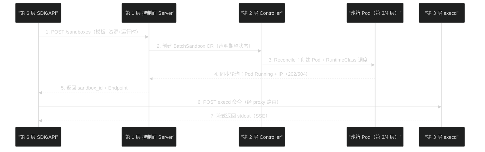

# 06 Agent 沙箱平台分层——六层模型与三条产品路线

**摘要：**

前 5 篇完成了"隔离技术"主线——从威胁模型到隔离原语、四档光谱、KVM 硬件底座与 VMM 家族。本文切换视角：**从"边界画在哪"到"平台怎么建"**。首先逐层深挖六层模型（产品控制面、K8s 编排层、执行层、隔离运行时、Agent 适配层、API 协议层）——每层的职责边界、代表实现与关键设计问题，并解释"控制面与数据面切开"这一贯穿所有层级的架构原则；其次对比三条产品路线——云托管派（E2B，Firecracker + 托管控制面）、编排标准派（kubernetes-sigs/agent-sandbox，Sandbox/SandboxTemplate/SandboxClaim/SandboxWarmPool 四 CRD）、企业产品派（OpenSandbox，协议优先 + 双 runtime 可插拔）——包括 2026 年实测性能数据（E2B 创建 717ms/Daytona 742ms/Modal 2437ms）；再次总结行业共识（六层共识 + 目的建设派/企业共生派两派路线 + 建设顺序八步）；最后给出分层覆盖矩阵选型方法论与素材选型过程的完整复盘。核心认知：**Agent 沙箱平台的本质是"把隔离技术变成产品接口"——六层模型的每一层都回答一个独立问题，选型是分层覆盖矩阵问题而非单选问题；第 5 层（Agent 适配）是开源生态最大缺口，任何企业选型都必须为它预留自研预算**。

---

## 第 1 章 从"隔离技术"到"平台"：视角切换

### 1.1 为什么需要平台层

前 5 篇的技术（namespace、gVisor、Kata、Firecracker、VMM）解决的是同一个问题：**隔离边界画在哪**。但对一个生产级 Agent 系统，隔离技术只是起点——还有三个绕不开的问题：

**问题一：生命周期管理**。沙箱创建后谁负责它的生老病死？没有 TTL 的沙箱会变成僵尸；没有配额的系统会被一个租户吃光；没有模板的平台让每次创建都要从头配置。**这些问题与隔离技术无关，属于"控制面"**。

**问题二：交互协议**。Agent/用户/平台三方如何与沙箱交互？创建沙箱用什么 API？沙箱内执行命令走什么通道？沙箱里启动的服务如何被外部访问？**这些问题需要"协议层"来回答**——没有统一协议，每个客户端都自造轮子，平台无法演进。

**问题三：多租户与治理**。谁有权限创建沙箱？一个租户的沙箱能访问另一个租户的沙箱吗？配额怎么分配？审计日志怎么留存？**这些问题属于"编排与治理"**。

把隔离技术 + 三个问题的答案打包成产品，就是"沙箱平台"——**平台的本质是"把隔离技术变成产品接口"**。素材交付物-01 的表述更精炼：**"Agent Sandbox 不是某一种容器运行时、MicroVM 或 Kubernetes CRD 的同义词，而是一套系统能力"**——平台层就是这套系统能力的载体。

### 1.2 平台的成本结构：为什么平台层比隔离层"贵"

一个常被低估的事实：**平台层的工程成本远高于隔离层**。隔离层（第 4 层）可以选择现成运行时（runc/gVisor/Kata 都是开源组件），而平台层（控制面/编排/执行/适配/协议）的大部分能力需要自建或深度集成。素材生产化差距台账的 16 个能力缺口全部落在平台层：

| 平台能力 | 自建成本量级 | 说明 |
| :--- | :--- | :--- |
| 生命周期控制面 | 高 | 状态存储、TTL、配额、并发控制 |
| 编排层 | 中 | 有 SIG/OpenSandbox 可复用，但深度集成仍需投入 |
| 执行层 | 中高 | execd 类守护进程 + 安全边界 + 流式通道 |
| Agent 适配层 | 高（每个 Agent 一次） | 无标准，逐个定制（2.5 节） |
| 协议层 | 中 | 参考 E2B 语义可降低难度 |
| 安全治理 | 高 | 凭据、多租户、审计（[[生产化/14 沙箱安全体系——三层防护、短期凭据与多租户|第 14 篇]]） |

**决策含义**：选择平台（OpenSandbox 类）的本质是"用平台层的成熟度换取自建成本"——评估时把"平台能力缺口 × 自建单价"计入总成本，而不是只看平台免费与否。**素材选型"OpenSandbox 主候选"的完整理由是"覆盖 1/2/3/6 层 + 协议优先 + K8s 原生"，对应自建成本的节省是决定性的**。

### 1.3 平台层与隔离层的分工

| 层 | 回答的问题 | 代表组件 | 本专栏对应篇 |
| :--- | :--- | :--- | :--- |
| **隔离层（第 4 层）** | 边界画在哪 | runc/gVisor/Kata/Firecracker | 01-05 篇 |
| **平台层（其余 5 层）** | 平台怎么建 | 控制面/CRD/execd/Agent 适配/协议 | 06-09 篇 |

**一个关键推论**：平台层与隔离层的解耦程度，决定了平台的"运行时可替换性"。OpenSandbox 能在"统一 API 下把运行时从 runc 换成 Kata"（素材 PoC 的实际操作），正是因为平台层（协议/控制面）与隔离层（RuntimeClass）通过清晰契约隔离——**这是平台架构的第一设计原则：控制面与数据面切开**（详见 2.7）。

---

## 第 2 章 六层模型逐层深挖

### 2.1 第 1 层：产品控制面（Lifecycle Control Plane）

**职责**：沙箱的"业务管理层"——谁有权创建、活多久、资源额度归谁、模板从哪来。

| 能力 | 说明 | 代表实现 |
| :--- | :--- | :--- |
| **生命周期 API** | 创建/查询/暂停/恢复/续期/删除/快照 | OpenSandbox Lifecycle API、E2B Orchestrator |
| **配额与租户** | 每租户/用户/任务的资源额度与并发上限 | 平台自有实现 |
| **TTL 管理** | 到期自动回收，防僵尸沙箱 | K8s TTL Controller / 平台定时器 |
| **模板管理** | 预置环境模板（镜像+配置+挂载） | E2B templates、OpenSandbox image 请求 |
| **凭据签发** | 沙箱启动时注入短期凭据（[[生产化/14 沙箱安全体系——三层防护、短期凭据与多租户|第 14 篇]]） | 平台自有实现 |

**关键设计问题**：控制面的状态存在哪？素材实测发现 OpenSandbox 0.2.x 的 Snapshot 元数据存在 Server pod-local SQLite——**双副本 Server 下查询会 404**（"共享状态≠副本数"盲区，[[生产化/15 生产化深水区——十个盲区与行业共识|第 15 篇]]）。控制面状态的可共享性，是评估控制面架构的第一个问题。

### 2.2 第 2 层：Kubernetes 编排层（Orchestration）

**职责**：把沙箱表达为集群中的声明式对象，由 Controller 对账到期望状态。

| 能力 | 说明 | 代表实现 |
| :--- | :--- | :--- |
| **CRD 定义** | Sandbox/BatchSandbox 的声明式规格 | sigs agent-sandbox、OpenSandbox |
| **Controller/Reconciler** | 期望状态→实际状态的持续对账 | 各 Controller Manager |
| **WarmPool** | 预热的沙箱池（[[平台与协议/09 OpenSandbox 编排面——BatchSandbox、WarmPool 与快照|第 09 篇]]） | SandboxWarmPool、OpenSandbox Pool |
| **RuntimeClass 调度** | 按隔离档位选择节点与运行时 | K8s 原生 |

**编排层的价值**：声明式（写 YAML 而非调 API）、自愈（Controller 持续对账）、可审计（CR 是事实层）。**编排层的代价**：Reconcile 有延迟（素材记录"CR reconcile 传播"是冷启动延迟的组成部分）、CRD 的 schema 版本演进复杂（素材发现 Pool CRD schema 落后于 Controller 的已知缺陷 DEF-005）。

### 2.3 第 3 层：执行层（Execution / Data Plane）

**职责**：沙箱内部的能力面——"沙箱里能干什么"。

| 能力 | 说明 | 代表实现 |
| :--- | :--- | :--- |
| **命令执行** | 沙箱内运行命令并流式返回 | OpenSandbox execd、E2B envd |
| **文件操作** | 上传/下载/读写沙箱内文件 | execd File API |
| **代码解释器** | Python/JS 等代码执行环境 | code-interpreter 镜像 |
| **PTY 终端** | 交互式终端会话 | execd bash session |
| **端口暴露** | 沙箱内服务对外可达 | Endpoint API + server proxy |
| **浏览器自动化** | 沙箱内运行浏览器（GUI Agent） | 平台扩展 |

**执行层的设计原则**（素材源码走读反复强调）：**执行层提供"控制通道"，不提供"业务语义"**——execd 负责命令/文件/PTY，但"对话、任务、会话"是 Agent 自己的事（第 5 层）。这个边界一旦模糊，执行层就会变成"什么都管、什么都管不好"的怪兽。

### 2.4 第 4 层：隔离运行时（Isolation Runtime）

前 5 篇的完整主题，此处只做衔接：**运行时的选择通过 RuntimeClass 表达，与平台层解耦**。关键点是"四层必须一致"（Server 配置→CR 声明→RuntimeClass→containerd 注册，[[隔离原语/02 Linux 隔离原语——namespace、cgroups、seccomp 与 capabilities 的安全地基|第 02 篇]] 的七跳链路）——**运行时替换的难点不在运行时本身，而在四层一致性的维护**。

### 2.5 第 5 层：Agent 适配层（Agent Adaptation）——开源最大缺口

**职责**：把"容器/VM"变成"Agent 可用环境"——镜像内注入 Agent 本体、配置模型凭据、暴露 Agent 原生 API、接入 MCP。

**为什么这是最大缺口**：每个 Agent 的启动方式、会话模型、配置格式、交互协议都不同——Claude Code 是 CLI + headless 模式，OpenCode 是 Server API（4096 端口，OpenAPI 3.1 + Session/Message/SSE），Hermes 是 Dashboard（9119）+ CLI，LangChain 是自定义 HTTP 服务。**没有统一标准，适配层只能逐个 Agent 定制**。

| 适配任务 | 内容 | 素材实践 |
| :--- | :--- | :--- |
| **镜像化** | Agent 二进制 + 运行时 + 配置打进镜像 | opencode 1.18.15-osb1.1.0、hermes 0.19.0-osb1.1.0 |
| **启动编排** | 父沙箱保活 + execd 注入配置 + 启动 Agent 服务 | `tail -f /dev/null` 保活 + execd 上传配置 |
| **交互协议** | 暴露 Agent 原生 API（Server 接口优先，PTY 兜底） | OpenCode 走原生 4096 API 而非 PTY |
| **凭据注入** | 模型 API Key 等敏感配置的安全注入 | env 显式传递 OPEN_SANDBOX_API_KEY |
| **MCP 接入** | 让 Agent 能通过 MCP 调用平台能力（子沙箱） | opensandbox-mcp stdio 启动 |

**为什么"原生 Server 接口优先于 PTY"**（素材 Phase1-13 的重要结论）：PTY 传输的是"终端字节流"——非结构化的，Agent 的消息/会话/工具调用语义在 PTY 中丢失；原生 Server API（如 OpenCode 的 `/session` + `/prompt_async` + SSE Event）是结构化的——平台可以拿到会话状态、流式输出、工具调用记录。**适配层做得好不好，直接决定平台的可观测性与可恢复性**（[[生产化/13 Agent 状态与存储——六类状态的正确拆分|第 13 篇]] 的 Session 状态依赖这层提供结构化接口）。

### 2.6 第 6 层：API 与协议层（API / Protocol）

**职责**：对外暴露的统一接口——客户端（SDK/CLI/MCP）与平台交互的全部通道。

| 协议面 | 用途 | 代表 |
| :--- | :--- | :--- |
| **REST（Lifecycle）** | 沙箱生命周期管理 | OpenSandbox Lifecycle API（33 个操作实测） |
| **REST（Execd）** | 沙箱内执行能力 | OpenSandbox Execd API（27 个操作实测） |
| **WebSocket/SSE** | 流式输出与事件 | execd SSE、OpenCode SSE Event |
| **MCP** | Agent 工具接入 | opensandbox-mcp |
| **SDK** | 多语言绑定 | Python/JS/Go/Java 等（OpenSandbox 五语言） |

**协议层的两个关键问题**：

**问题一：E2B 兼容正在成为事实标准**。素材 Phase0 明确记录"E2B 兼容是第 6 层事实标准"——新平台以兼容 E2B API 作为降低迁移成本的手段。对企业自建，这意味着：**协议设计先参考 E2B 语义，再扩展自己的特色能力**。

**问题二：协议的"权威状态"语义**。素材 Phase5-08 的调用铁律："**HTTP 码只表示'话送到了没有'，权威是 Lifecycle state + conditions**"——202 不是最终态、504 不代表资源存在（[[生产化/15 生产化深水区——十个盲区与行业共识|第 15 篇]] 的十个盲区之首）。协议层必须把"状态语义"定义清楚，否则客户端与平台会在"成功/失败"的判断上产生系统性分歧。

### 2.7 层的组合规律：控制面与数据面切开

六层模型背后有一条贯穿性架构原则：**控制面与数据面切开**（行业共识之首，素材 Phase5-11）。它的含义是：

```
控制面（管理路径）：谁创建 → 怎么声明 → 状态在哪 → 谁回收
数据面（执行路径）：命令怎么跑 → 文件怎么流 → 输出怎么回 → 服务怎么访问
```

**切开的理由**（素材中三个真实教训）：

1. **性能隔离**：控制面的故障（Server 重启、DB 慢查询）不能阻塞数据面（沙箱内 Agent 继续干活）——Firecracker 的三线程架构（API 线程/VMM 线程/vCPU 线程）就是线程序度的控制/数据面分离；
2. **故障域分离**：控制面崩了，运行中的沙箱应该继续运行（素材的"运行中 BatchSandbox 可以 phase=Succeed 且 Ready=True"现象与此相关）；
3. **扩展性解耦**：控制面按管理请求量扩缩，数据面按沙箱负载扩缩——两者独立扩缩，互不拖累。

**反例**：OpenSandbox 0.2.x 的"创建请求在 HTTP 请求内同步轮询 Pod Running"（[[平台与协议/07 OpenSandbox 架构深度解析——协议优先与六责任面|第 07 篇]]）——创建路径上控制面与数据面强耦合（等到 Pod 就绪才返回），导致创建失败时 API 要等 180 秒才返回 504。**这是"切得不彻底"的典型代价**：同步等待把控制面的延迟风险暴露给了数据面创建路径。

### 2.8 一次请求的六层旅程：从用户到沙箱内命令

把六层模型串成一个完整场景：**用户通过 SDK 请求"创建沙箱并执行 `python3 script.py`"**——一次请求穿过全部六层：



**旅程中的三个关键点**：

1. **第 2 步与第 3 步是"声明式"的**——控制面不直接创建 Pod，而是写 CR 让 Controller 对账——**这是"控制面与编排层"的契约边界**；
2. **第 4 步是同步轮询**——OpenSandbox 0.2.x 在 HTTP 请求内等到 Pod 就绪才返回（素材源码走读 Lesson 1 的结论），这是"切分不彻底"的典型（2.7 节反例）；
3. **第 6 步经过 proxy 路由**——外部流量经 Ingress Gateway 进入沙箱网络，再到达 execd——**"沙箱内服务如何被访问"是第 6 层协议 + 网关共同回答的问题**（[[平台与协议/08 OpenSandbox 数据面——execd 与 egress 的盒内世界|第 08 篇]] 的 Endpoint 机制）。

**理解六层旅程的价值**：排查任何沙箱故障时，先定位故障发生在旅程的第几步——"SDK 报错"可能是协议层问题，"CR 不 Ready"是编排层问题，"Pod 起来了但命令超时"是数据面问题——**按层定位，是沙箱排障的第一原则**。

### 2.9 六层评估清单：给每个候选方案打分

把六层模型转成评估清单——评估任何沙箱平台时逐层提问，每层 2-3 个问题，答案存疑的层就是风险层：

| 层 | 评估问题 |
| :--- | :--- |
| **控制面** | 状态存储在哪？多副本下状态一致吗？TTL/配额/模板是否开箱即用？ |
| **编排** | CRD 是否稳定（版本演进历史）？Controller 的对账延迟可接受吗？WarmPool 是否支持？ |
| **执行层** | 命令/文件/PTY/流式输出是否完整？安全边界如何（execd 自身的权限）？ |
| **隔离运行时** | 支持哪些运行时？RuntimeClass 四层一致性如何维护？ |
| **Agent 适配** | 平台提供适配框架吗？还是纯自研？参考实现有哪些？ |
| **协议** | API 是否 OpenAPI 契约化？状态语义是否清晰（202 vs 终态）？E2B 兼容吗？ |

**打分规则**：每层"✅ 有证据 / 🔶 文档存疑 / ❌ 缺失"——**文档存疑与缺失同样危险**（文档存疑意味着你要踩坑验证，[[生产化/15 生产化深水区——十个盲区与行业共识|十个盲区]] 里的"202≠最终态""共享状态≠副本数"都是文档存疑的实例）。打分结果直接进入 5.1 的覆盖矩阵。

---

## 第 3 章 三条产品路线深对比

### 3.1 云托管派：E2B

E2B（2023 年成立）把 Agent 执行环境做成托管云服务。架构要点：

| 组件 | 职责 |
| :--- | :--- |
| **Sandbox API / SDK** | `Sandbox.create()` 秒级环境创建（Python/TS 优先） |
| **Orchestrator** | 生命周期管理、模板解析、资源调度 |
| **Client Proxy** | 沙箱内服务的统一访问入口 |
| **Template Manager** | 预置环境模板 |
| **envd** | 沙箱内守护进程（命令/文件/代码执行） |
| **运行时** | Firecracker MicroVM（自建数据面） |

**2026 年实测数据**（LogRocket benchmark）：创建 717ms、恢复 662ms——当时对比组中最快。**价格模型**：按秒计费，$150/月 起步——适合小规模验证与原型。

**E2B 的定位与边界**：托管服务（无自建选项）、数据在第三方云、深度定制受限。**它的行业意义是"定义了第 6 层的事实标准 API 语义"**——即使不用 E2B，参考它的 API 设计能显著降低生态接入成本。

### 3.2 编排标准派：kubernetes-sigs/agent-sandbox

K8s SIG Apps 的 agent-sandbox 项目定义了沙箱的声明式 API 标准。四 CRD 体系：

| CRD | 职责 |
| :--- | :--- |
| **Sandbox** | 核心抽象：长运行、有状态、单容器、稳定身份（hostname/网络身份稳定、持久存储、生命周期：创建/定时删除/暂停恢复） |
| **SandboxTemplate** | 可复用模板（配置共享，排除运行时字段） |
| **SandboxClaim** | 从 WarmPool 认领沙箱（抽象底层配置） |
| **SandboxWarmPool** | 预热池管理（GKE 集成后每集群每秒领取 300 个，90% ≤ 200ms） |

**设计要点**：Sandbox 是"轻量单容器 VM 体验"的 K8s 表达——**稳定身份 + 持久存储 + 生命周期管理**是它区别于 Deployment/StatefulSet 的三个特征。安全细节：**经 SandboxTemplate 提供时，AutomountServiceAccountToken 默认 false**——安全默认原则进入 CRD 设计。

**边界**：它只覆盖第 2 层（编排标准）——执行层、协议层、控制面都需要使用者自建。**它的行业意义是"编排层的事实标准锚点"**——OpenSandbox 实现了 agent-sandbox provider 以兼容它，GKE Agent Sandbox 内嵌它的 WarmPool。

### 3.3 企业产品派：OpenSandbox

OpenSandbox（蚂蚁开源，opensandbox-group 维护，CNCF Landscape 收录）的定位是"协议优先的通用沙箱平台"（第 07 篇完整展开）。此处只给出它在三条路线中的坐标：

| 维度 | OpenSandbox 的位置 |
| :--- | :--- |
| **部署模型** | 自托管（Docker/K8s），无平台费 |
| **协议** | 自研 Sandbox Protocol（specs/ OpenAPI 契约） |
| **运行时** | 可插拔（runc/gVisor/Kata，通过 RuntimeClass） |
| **覆盖层** | 第 1/2/3/6 层（控制面/编排/执行/协议） |
| **第 5 层** | 缺失——Agent 适配需自研 |
| **性能** | 批量交付比 sigs agent-sandbox 高一个数量级（InfoQ 数据） |

### 3.4 三维对比总表

| 维度 | E2B | SIG agent-sandbox | OpenSandbox |
| :--- | :--- | :--- | :--- |
| **形态** | 托管服务 | 编排标准 | 自托管平台 |
| **覆盖层** | 1/3/4/6（托管） | 2（标准） | 1/2/3/6（运行时插拔） |
| **隔离技术** | Firecracker | 委托 RuntimeClass | runc/gVisor/Kata 可插拔 |
| **K8s 依赖** | 无（自建数据面） | 强（K8s 原生） | 强（K8s 原生） |
| **数据位置** | 第三方云 | 你的集群 | 你的集群 |
| **定制深度** | 低 | 高（自建其余层） | 中高（协议可扩展） |
| **运维成本** | 最低 | 高（其余层自建） | 中 |
| **适用** | 原型/小规模 | 标准先行者 | 企业生产 |

### 3.5 其他值得关注的玩家：Daytona、Modal、GKE 与 Cloudflare

素材 Phase5-11 的行业调研还覆盖了四家"非典型"玩家，它们从不同起点切入沙箱领域，值得单独标注：

| 平台 | 起点 | 沙箱形态 | 独特设计 |
| :--- | :--- | :--- | :--- |
| **Daytona** | Dev Environment 工具 | 容器默认（Kata/Sysbox 可选） | 控制面 API + runner 拉活；暂停/恢复/fork/热快照是 VM 档专属；2026 实测创建 742ms |
| **Modal** | Serverless 函数平台 | gVisor 默认 | 函数平台"长出来"的沙箱：gVisor 快照走 runsc C/R、池子 + Directory Snapshot；2026 实测创建 2437ms（冷）/快照启动 2347ms |
| **GKE Agent Sandbox** | 云厂商托管 K8s | gVisor（GKE 原生） | 内嵌 SIG WarmPool；Stateful TTL ≤14 天；2026-07 起计费 |
| **Cloudflare** | 边缘网络平台 | Durable Object + Containers | 把"脑"（Durable Object 状态）与"手"（容器执行）拆开——状态与执行的强分离设计 |

**这四家的共性启示**：

1. **起点决定形态**——函数平台长出来的（Modal）与 Dev Environment 长出来的（Daytona）沙箱语义完全不同（短任务 vs 长会话）；
2. **"暂停/恢复"能力不是默认项**——Daytona 的热快照只在 VM 档提供——**状态能力的档位化是普遍现象**（[[生产化/13 Agent 状态与存储——六类状态的正确拆分|第 13 篇]]）；
3. **Cloudflare 的脑手分离**是"控制面与数据面切开"的极端形态——状态（脑）与执行（手）可以不在同一节点甚至同一区域。

### 3.6 路线选择决策树

三条路线 + 自研组合的选择，用决策树表达最直接：

```
第一步：数据边界允许第三方云托管吗？
  ├─ 允许 → 第二步
  └─ 不允许（合规/主权）→ 跳到第三步

第二步：规模与定制需求？
  ├─ 小规模原型、快速验证 → E2B（托管，按秒计费）
  └─ 生产规模、需要定制 → 跳到第三步

第三步：有现成 K8s 集群吗？
  ├─ 没有 → 自建集群 + OpenSandbox（或 SIG 标准 + 自建其余层）
  └─ 有 → 第四步

第四步：编排层选型
  ├─ 标准优先 → SIG agent-sandbox CRD（OpenSandbox 也兼容它）
  └─ 平台优先 → OpenSandbox（协议 + 控制面 + 执行层开箱）

第五步：第 5 层（Agent 适配）自研预算确认
  ├─ 已确认 → 立项
  └─ 未确认 → 先做 PoC 验证缺口大小，再立项
```

**决策树的关键节点只有两个**：数据边界（托管 vs 自建）与第 5 层预算（认不认缺口）。其他选择都是这两者的下游。

**决策树的输出**：每条路径的输出不是"选哪个产品"，而是"**覆盖矩阵 + 自研清单 + 验证计划**"三件套——产品是矩阵的填充项，不是决策的终点（5.1 节的三段式：覆盖矩阵 + 契约审查 + PoC 验证）。

### 3.7 兼容与生态：三个"兼容"事实

2026 年的沙箱生态有三个值得注意的兼容事实：

1. **E2B API 兼容成为第 6 层事实标准**——新平台以兼容 E2B 语义为卖点；
2. **OpenSandbox 兼容 sigs agent-sandbox**——K8s runtime 支持两种 workload provider（batchsandbox 默认 + agent-sandbox）；
3. **GKE Agent Sandbox 内嵌 sigs WarmPool**——云厂商直接采用社区标准。

**生态判断**：编排层正在标准化（SIG 锚点）、协议层正在事实标准化（E2B 锚点）、隔离层保持多元化（四档光谱）。**选型时的生态策略：协议层参考 E2B、编排层贴近 SIG、隔离层按威胁等级自由选择**——三条路线不必绑定，可以组合。

---

## 第 4 章 行业共识：六层共识与两派建设思路

### 4.1 六层共识

素材 Phase5-11 调研了 E2B、SIG、GKE、Daytona、Modal、Cloudflare、OpenKruise 等多家方案后，归纳出行业"默认同意"的六条共识——**这些共识是 2026 年沙箱设计的基本公理**：

| 共识 | 内容 | 体现 |
| :--- | :--- | :--- |
| **1. 先定义工作负载** | 沙箱为谁服务（Coding Agent/GUI Agent/评测/训练），决定一切设计 | 各家产品形态差异的根源 |
| **2. 控制面与数据面切开** | 管理路径与执行路径分离（2.7 节） | 所有成熟平台 |
| **3. 盒内守护进程** | 沙箱内必须有执行守护进程（execd/envd），平台能力经它落地 | OpenSandbox execd、E2B envd |
| **4. 快靠预热物认领** | 秒级交付靠预热池 + 认领机制，而非更快地冷创建 | WarmPool、SandboxClaim |
| **5. 隔离按档提供** | 不追求单一最强隔离，按威胁等级提供多档 | 四档光谱、三 Profile 方案 |
| **6. 状态按寿命拆库** | 不同寿命的状态存不同地方（[[生产化/13 Agent 状态与存储——六类状态的正确拆分|第 13 篇]]） | 四本账模型 |

### 4.2 目的建设派 vs 企业共生派

在"怎么建数据面"上，行业分成两派：

| 维度 | 目的建设派（Purpose-built） | 企业共生派（Enterprise-symbiotic） |
| :--- | :--- | :--- |
| **代表** | E2B、Modal | SIG agent-sandbox、GKE Agent Sandbox、OpenSandbox |
| **数据面** | 自建（Firecracker 池、自研控制面） | 复用 K8s（CRD/Controller/RuntimeClass） |
| **优势** | 极致性能与密度、不受 K8s 约束 | 生态复用、运维体系现成、可审计 |
| **代价** | 数据面工程量大、闭源 | 受 K8s 架构约束（Reconcile 延迟等） |
| **适合** | 平台公司、极致性能场景 | 企业自建、K8s 原生场景 |

**判断**：企业自建沙箱几乎必然走"共生派"——因为 K8s 已经在你手里（素材的 DomeOS 集群），复用控制面的边际成本最低。**"目的建设派"是平台公司的路线，不是企业的路线**——选型时不要被"E2B 性能好"带偏，先确认自己是哪一派。

**两派之外的第三形态**：混合派——**数据面部分自建（WarmPool/执行层）、控制面复用 K8s**（OpenSandbox 的形态）——它同时获得"复用控制面"的低成本与"自建数据面"的性能优化空间，代价是"接缝处"（平台与 K8s 的边界）需要自研维护（[[生产化/15 生产化深水区——十个盲区与行业共识|第 15 篇]] 的"共生派的生产化 = 填接缝"）。**素材选型实际上落在混合派**——"OpenSandbox 覆盖 1/2/3/6 层 + 第 5 层自研"正是混合派的典型组合。

### 4.3 尚未共识的领域：三个开放战场

共识之外，还有三个领域行业尚未收敛——**它们既是风险点，也是创新机会**：

**开放战场一：Agent 适配层（第 5 层）没有标准**。每家 Agent 的启动/会话/配置格式不同，没有任何组织在推动统一（MCP 标准化了"工具接入"，但没有标准化"Agent 如何被平台托管"）。素材结论"第 5 层需自研、NemoClaw 为唯一参考"正是这个战场的写照——**谁先定义出事实标准，谁就占据下一轮生态位**。

**开放战场二：状态的标准化语义**。"暂停/恢复/快照"在不同平台指不同东西（[[平台与协议/09 OpenSandbox 编排面——BatchSandbox、WarmPool 与快照|第 09 篇]] 的"同一个状态名下面是不同机器"）——Daytona 的热快照是 VM 档、Modal 的 Directory Snapshot 是文件级、GKE 的 Pod Snapshot 是 rootfs 级。**跨平台的状态互操作目前不可能**。

**开放战场三：checkpoint/内存级快照成为竞争点**。素材事实卡记录"休眠/checkpoint 成为竞争点"——谁能做到"内存级暂停/恢复"（而非 rootfs 级），谁就能提供"会话秒续"体验。gVisor 的 runsc C/R、CRIU、GKE Pod Snapshot 都在向这个方向推进，但都未成为通用标准。

**对选型的影响**：三个开放战场意味着**任何平台选型都包含"赌注"成分**——选择某个平台的协议与状态语义，就是押注它的方向。缓解策略：协议层参考 E2B（事实标准方向）、状态层做好"状态外置"（不把状态锁死在平台内部，[[生产化/13 Agent 状态与存储——六类状态的正确拆分|第 13 篇]]）——**把赌注压在"可迁移性"上，而不是押在"某个平台的未来"上**。

### 4.4 建设顺序八步

素材 Phase5-11 还给出了一个可操作的"建设顺序"——从零到生产的路标：

1. **产品原语**：定义工作负载与最小生命周期（创建/销毁/查询/重启）；
2. **一条能 exec 的数据面**：先打通"创建沙箱→执行命令→拿输出"的最小闭环；
3. **切开流量**：控制面与数据面分离，管理路径与执行路径独立；
4. **模板与构建专职化**：镜像供应链与模板管理独立成组件；
5. **预热与 Ready**：WarmPool 与就绪语义（什么算"可用沙箱"）；
6. **档位与硬隔离**：多运行时接入与 RuntimeClass 治理；
7. **状态外置与身份短命**：状态按寿命拆库、凭据短期化（[[生产化/14 沙箱安全体系——三层防护、短期凭据与多租户|第 14 篇]]）；
8. **为规模拆中心**：多集群、多区域、配额治理。

**这个顺序的价值**：每一步都是前一步的增量——不会出现"平台没跑通就开始做多租户"的倒置。素材的测试集群路线（T0-T7）与生产路线（P0-P6）正是这个顺序的落地（[[生产化/15 生产化深水区——十个盲区与行业共识|第 15 篇]]）。

---

## 第 5 章 选型方法论：分层覆盖矩阵

### 5.1 矩阵法操作步骤

**第一步：画覆盖矩阵**。候选方案 × 六层，标记"原生覆盖/部分覆盖/缺失/可插拔"：

| 方案 | 控制面 | K8s 编排 | 执行层 | 隔离运行时 | Agent 适配 | API/协议 |
| :--- | :---: | :---: | :---: | :---: | :---: | :---: |
| **OpenSandbox** | ✅ | ✅ | ✅ | 🔌 | ❌ | ✅ |
| **SIG agent-sandbox** | 🔶 | ✅ | ❌ | 🔌 | ❌ | ❌ |
| **E2B** | ✅ | 🔶 | ✅ | ✅ | ❌ | ✅ |
| **CubeSandbox** | 🔶 | 🔶 | 🔶 | ✅ | ❌ | ✅ |
| **OpenKruise Agents** | 🔶 | ✅ | ❌ | 🔌 | 🔶 | ❌ |
| **自研组合** | 自建 | SIG/OpenSandbox | 自建 | 按档选 | 自建 | 参考 E2B |

**第二步：标缺口**。✅ 越多越好？不——**先标 ❌ 与 🔶，缺口决定自研预算**。素材选型的核心逻辑："OpenSandbox 覆盖 1/2/3/6 层，CubeSandbox 覆盖 4/6 层，第 5 层需自研"——缺口的数量与类型直接决定工程投入。

**第三步：验证契约**。缺口的相邻层契约是否清晰？（协议是否 OpenAPI？CRD 是否稳定？）**契约清晰的缺口可以自研，契约模糊的缺口是坑**——第 5 层适配之所以难，正是因为它没有契约标准。

**第四步：矩阵的演进维护**。覆盖矩阵不是选型时画一次——**候选方案的版本升级、社区进展、自研进度都会改变矩阵**（如 OpenSandbox 后续版本若补上逐沙箱运行时，第 4 列的 🔌 就变 ✅）——**建议每季度更新覆盖矩阵**（与 [[工程实践/12 沙箱性能工程——Runtime 基准与 WarmPool 容量管理|第 12 篇]] 的性能基准季度回归同节奏），矩阵变化是"再评估候选"的触发信号（[[生产化/15 生产化深水区——十个盲区与行业共识|第 15 篇]] 5.4 节）。

### 5.2 案例复盘：素材选型过程

素材的选型（候选项目事实卡 + 周会汇报）完整复现了矩阵法：

1. **候选池**：OpenSandbox、CubeSandbox、NVIDIA OpenShell + NemoClaw（对标项目）、自研组合；
2. **覆盖矩阵**：OpenSandbox 覆盖 1/2/3/6（运行时插拔）；CubeSandbox 覆盖 4/6（K8s preview）；NemoClaw 只覆盖第 5 层（Agent 适配参考）；
3. **缺口分析**：任何组合都缺第 5 层——**结论：第 5 层必须自研，NemoClaw 作为唯一参考**；
4. **决策**：OpenSandbox 为主候选（协议优先、K8s 原生、运行时插拔），CubeSandbox 为隔离运行时条件式候选；
5. **验证**：PoC 单机跑通 → 测试集群 runc Profile → 生产三 Profile 规划（[[隔离原语/03 隔离边界的光谱——从共享内核到 MicroVM 的四档技术路线|第 03 篇]] 的档位决策实录）。

**复盘要点**：选型结论不是"谁最好"，而是"谁覆盖最广 + 缺口最小 + 契约最清晰"——**覆盖矩阵 + 契约审查 + PoC 验证三段式**，缺一不可。

### 5.3 从选型到立项：验收清单

选型结论出来后，立项前建议过一遍验收清单（素材 PoC 实验手册的 A-H 组案例集是其雏形）：

| 验收域 | 清单项 | 通过标准 |
| :--- | :--- | :--- |
| **A. 生命周期** | 创建/查询/续期/删除全链路 | 残留 0（API/CR/Pod 全清） |
| **B. 数据面** | 命令/文件/PTY/流式输出 | 命令 stdout 正确、文件上传下载一致 |
| **C. 隔离证据链** | 运行时档位与声明一致 | 五层证据（guest 内核/进程/namespace 等）齐全 |
| **D. 状态** | 快照/暂停/恢复 | 明确"能恢复什么、不能恢复什么" |
| **E. 预热** | WarmPool 命中/耗尽 | 命中延迟达标、耗尽模型有数据 |
| **F. 真实负载** | 至少一个真实 Agent 跑通 | 创建→任务→回收闭环 |
| **G. 安全** | 凭据/网络策略/审计 | 凭据不出沙箱、egress 生效、审计可查 |
| **H. 量化汇总** | 全部指标汇总成表 | 覆盖矩阵 + 性能表 + 缺陷清单 |

**清单的用法**：不是"全部通过才立项"，而是"**把未通过项变成立项后的 P0 任务**"——素材的"11 个 PoC 妥协、7 个产品缺陷、16 个能力缺口"台账正是这样转化的（[[工程实践/10 Agent 沙箱部署实战——从单机 PoC 到测试集群|第 10 篇]]）。

### 5.4 常见选型错误

| 错误 | 表现 | 正确做法 |
| :--- | :--- | :--- |
| **单点崇拜** | "X 是唯一正确答案" | 覆盖矩阵对比后再下结论 |
| **跨路线比较** | "E2B vs OpenSandbox 谁强" | 先确认托管 vs 自建的数据边界前提 |
| **忽略第 5 层** | 只比较平台层，忘了 Agent 适配 | 第 5 层自研预算计入总成本 |
| **忽视契约** | 只看功能清单，不看 API/CRD 稳定性 | 契约审查（OpenAPI/版本演进） |
| **跳过 PoC** | 纸面选型直接上生产 | 至少跑通"创建→执行→回收"闭环 |

---

## 第 6 章 总结与下一篇导读

### 6.1 本文核心要点

1. **平台的本质**：把隔离技术变成产品接口——生命周期、交互协议、多租户治理是平台的三个核心问题
2. **六层模型的每一层回答一个独立问题**：控制面（谁管理）、编排（怎么声明）、执行（能干什么）、隔离（边界在哪）、适配（Agent 怎么住进来）、协议（怎么交互）
3. **第 5 层是开源最大缺口**：Agent 的启动/会话/配置格式没有标准——任何企业选型都必须为它预留自研预算
4. **控制面与数据面切开**是贯穿性架构原则——性能隔离、故障域分离、扩展性解耦三个理由
5. **三条产品路线**：E2B（托管）、SIG（标准）、OpenSandbox（企业产品）——不是竞争关系，是互补关系，可以组合
6. **行业六层共识 + 两派建设思路 + 建设顺序八步**——2026 年沙箱设计的基本公理
7. **选型方法论**：覆盖矩阵 + 契约审查 + PoC 验证三段式

### 6.2 术语速查

| 术语 | 口径 |
| :--- | :--- |
| **控制面** | 管理沙箱生命周期的组件（创建/配额/TTL/凭据） |
| **数据面** | 沙箱内执行能力的通道（命令/文件/PTY/端口） |
| **声明式编排** | 通过 CRD 表达期望状态、Controller 持续对账 |
| **第 5 层（Agent 适配）** | 把容器/VM 变成 Agent 可用环境的一层（镜像/启动/协议/凭据） |
| **E2B 兼容** | 以 E2B API 语义为事实标准的协议兼容策略 |
| **SandboxClaim** | 从预热池认领沙箱的 CRD 抽象 |
| **目的建设派 / 企业共生派** | 自建数据面 vs 复用 K8s 的两派建设路线 |

### 6.3 思考题

1. **控制面与数据面切开的反例**：OpenSandbox 0.2.x 的创建请求在 HTTP 请求内同步轮询 Pod 就绪（2.7 节）。如果你是架构师，会如何重新设计创建路径？提示：考虑"异步受理 + 状态回调"与"同步等待 + 超时回滚"两条路线的权衡——素材源码走读记录了"等待 180 秒返回 504 且主动删除 CR 回滚"的真实行为，你会保留还是推翻它？

2. **第 5 层的自研边界**：假设你的平台需要托管三种 Agent（Claude Code/OpenCode/自定义 LangChain 服务），适配层的最小可交付是什么？提示：参考素材的实践——镜像化、父沙箱保活、原生 Server 接口优先、MCP 接入——哪些可以复用，哪些必须每个 Agent 定制？

3. **E2B 兼容的取舍**："E2B 兼容是第 6 层事实标准"——但兼容意味着被 E2B 的 API 语义约束。什么情况下你应该选择"不兼容"？提示：考虑状态语义差异（E2B 的秒级恢复 vs 你的 rootfs 快照）与能力扩展（浏览器自动化等 E2B 没有的语义）。

### 6.4 下一篇导读

本文给出了平台分层的全景，接下来三篇聚焦"企业产品派"的代表——OpenSandbox：**第 07 篇**解剖它的协议优先架构与六责任面；**第 08 篇**深入数据面（execd/egress）；**第 09 篇**解剖编排面（BatchSandbox/WarmPool/快照）。**07 → 08 → 09 构成 OpenSandbox 的完整三部曲**，也是后续工程实践篇（10-12）的直接基础。

> [!info] 专栏导航
> 本文是 [[../00 专栏导览|Agent 沙箱技术专栏]] 的第 06 篇，平台层开篇。前 5 篇（01-05）完成隔离技术主线；本文建立平台分层与产品路线全景；07-09 深入 OpenSandbox 三部曲；10-12 工程实践；13-15 生产化。

---

## 参考文献

1. agent-sandbox 调研素材. Phase0 学习路线图、Phase1-13/14 交互接入、Phase5-01 行业坐标、Phase5-11 行业共识、交付物-00/01
2. E2B 官方文档与 2026 benchmark. https://e2b.dev
3. Agent Sandbox（SIG Apps）. https://agent-sandbox.sigs.k8s.io/docs/getting_started/overview/
4. OpenSandbox 官方架构文档. https://open-sandbox.ai/overview/architecture
5. LogRocket Blog. "Comparing AI agent sandbox platforms: E2B, Modal, Daytona, and more." 2026.
6. InfoQ. "OpenSandbox：重新思考 Agent 时代的 Runtime."
7. 素材交付物. 候选项目事实卡、周会汇报-2026-08-07、OpenSandbox-PoC实验手册
8. Daytona 官方文档. https://www.daytona.io
9. Modal 官方文档. https://modal.com
10. GKE Agent Sandbox 文档. https://cloud.google.com/kubernetes-engine/docs/concepts/agent-sandbox

---

## 修改记录

- 2026-08-15：专栏创建，本文基于 agent-sandbox 调研素材（六层模型、行业坐标、行业共识）与 2026 年公开资料整合创作
