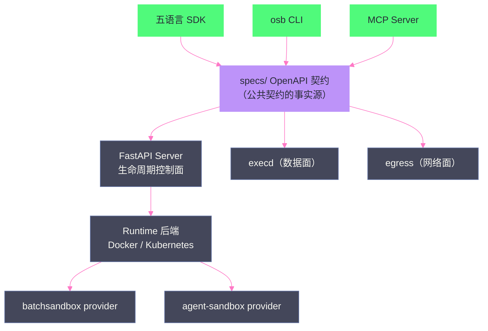

# 07 OpenSandbox 架构深度解析——协议优先与六责任面

**摘要：**

[[平台与协议/06 Agent 沙箱平台分层——六层模型与三条产品路线|第 06 篇]] 把 OpenSandbox 定位为"企业产品派"的代表——覆盖六层模型中的第 1/2/3/6 层。本文深入它的架构内核：**协议优先（Protocol-First）设计哲学**与**六责任面（Six Surfaces）架构**。文章首先解释"为什么契约先于实现"——specs/ 目录下的 OpenAPI 契约是公共契约的事实源，SDK、CLI、Server 都依赖契约而非彼此；然后逐面拆解六责任面：Client 面（五语言 SDK/osb CLI/MCP Server）、Protocol 面（Lifecycle/Diagnostics/Execd/Egress 四契约）、生命周期控制面（FastAPI Server：鉴权、配置校验、状态持久化、委托运行时）、Runtime 后端（Docker 与 Kubernetes 双引擎，batchsandbox/agent-sandbox 双 workload provider）、数据面（execd + 用户负载 + volumes + egress sidecar）、网络与安全面（endpoint 解析、ingress gateway 路由、egress 策略）；随后深入控制面实现细节——创建请求的同步轮询语义（202/504 的真实含义）、状态所有权边界（CR 就绪前归 API Server、就绪后归 Controller）；最后给出基于素材实测的评估（65 个 API 操作实测、44 个 CLI 命令实测、7 个产品缺陷、16 个能力缺口）与适用场景判断。核心认知：**OpenSandbox 的架构价值不在"某个功能多强"，而在"契约分层让运行时替换、客户端扩展、平台演进成为可能"——协议优先是它对 Agent 沙箱行业的最大贡献**。

---

## 第 1 章 OpenSandbox 的定位与设计哲学

### 1.1 项目背景

OpenSandbox 是蚂蚁集团开源的 AI 应用通用沙箱平台——2024 年 12 月底开源，后迁移至 opensandbox-group 组织维护，已列入 CNCF Landscape 的调度与编排分类。官方定位：**"A general-purpose sandbox platform for AI applications"**——通用、面向 AI 应用、平台化。

它的能力矩阵（截至 2026 年中）：

| 能力域 | 内容 |
| :--- | :--- |
| **客户端** | 五语言 SDK（Python/JS/Go/Java 等）、osb CLI、MCP Server |
| **协议** | Sandbox Protocol（specs/ OpenAPI 契约） |
| **控制面** | FastAPI Server（鉴权/校验/状态/委托） |
| **运行时** | Docker（本地/单机）、Kubernetes（生产） |
| **数据面** | execd 守护进程、code-interpreter、volumes、egress sidecar |
| **安全面** | endpoint 解析、ingress gateway、egress 策略、资源限制、安全运行时 |

**素材 PoC 实测版本**：Server 0.2.2、Controller 0.2.0、Ingress Gateway 1.0.10、execd v1.0.21、egress v1.1.5、Console 0.2.3-rc.3——本文的架构描述基于这个版本基线（OpenSandbox 迭代较快，读者以官方 docs 为准）。

### 1.2 协议优先：为什么"契约先于实现"

OpenSandbox 最核心的设计决策是**协议优先**——先定义协议（specs/），再实现 Server，再实现 SDK/CLI。InfoQ 分享中陶宇田的阐述给出了完整逻辑链：

**第一环：模型能力提升后，runtime 成为系统瓶颈**。当 Agent 可以自主规划、调用工具、持续工作时，执行环境的交付效率（创建慢、并发低、无法回收）反过来限制模型能力的发挥——**runtime 的问题本质是"交互语义"的问题：不同客户端、不同运行时之间缺乏统一契约**。

**第二环：契约统一交互语义**。OpenSandbox 在 specs/ 下用 OpenAPI 定义"沙箱交互语义"：怎么创建沙箱、怎么执行命令、怎么管理文件、怎么暴露端口、怎么控制出站。**SDK 与 Server 都依赖契约而非彼此**——任何一端的变化不波及其他端。

**第三环：契约让运行时可替换**。下层 runtime（Docker/K8s）被契约抽象——"今天可以用 Docker，也可以换成 K8s，甚至未来自定义更强的 runtime"（InfoQ 原话）。**契约是"运行时替换"能成立的架构前提**：素材 PoC 在统一 API 下把运行时从 runc 换成 Kata，正是这个设计的验证。



**"契约即代码"的工程表达**：所有公共契约定义在 specs/ 目录下，SDK 从契约生成绑定代码，Server 按契约实现端点——**契约的变更流程就是一次 PR**，任何违反契约的实现都会被代码生成与测试拦截。这个工程闭环让"协议优先"不只是口号。

### 1.3 协议优先的代价与反例

协议优先不是免费的——它的三个代价需要清醒认识：

**代价一：契约演进成本**。契约一旦发布并被多端依赖，修改就是破坏性变更——OSEP 提案流程（类似 Kubernetes 的 KEP）因此成为必要。素材记录"5 个已合并 main 未发版"的社区现状，正是契约演进节奏与发布节奏错位的实例：**用 main 分支的契约做集成，可能遇到 release 未包含的行为**。

**代价二：实现滞后风险**。契约定义了能力，实现可能没跟上——素材实测发现 Diagnostics API 未实现（GAP-001）、CLI 缺 Snapshot/Pool 命令组、OSEP-0006 停留在 implementable。**契约面 ≠ 实现面**——评估时必须以实测（调用 API/跑命令）为准，不能以文档为准。

**代价三：过度抽象风险**。契约抽象了运行时差异，但"抽象泄漏"不可避免——Docker runtime 与 K8s runtime 的行为差异（如 pause/resume 语义、网络模型）会在边界处透出。素材 PoC 的"暂停/恢复与快照：同一个状态名下面是不同机器"（[[平台与协议/09 OpenSandbox 编排面——BatchSandbox、WarmPool 与快照|第 09 篇]]）正是抽象泄漏的实例。

**反例（协议优先不适用的情况）**：单一固定运行时、无多客户端需求、纯内部工具的沙箱——协议层是负担而非资产。**协议优先的价值随"端数 × 运行时数"增长**——端越多、运行时越多样，契约的杠杆越大。

### 1.4 与 E2B/SIG 的坐标（衔接第 06 篇）

| 维度 | E2B | SIG agent-sandbox | OpenSandbox |
| :--- | :--- | :--- | :--- |
| **契约形态** | 闭源 API | CRD（K8s 声明式） | OpenAPI（specs/ 开源） |
| **控制面** | 托管 Orchestrator | 无（自建） | FastAPI Server |
| **执行层** | envd | 无 | execd |
| **协议开放度** | 不可自建 | 标准开放 | 开放 + 可扩展 |

**OpenSandbox 的独特位置**：它是三条路线中唯一"**协议开源 + 控制面可自托管 + 执行层内置**"的组合——SIG 有标准但缺控制面/执行层，E2B 有完整产品但闭源托管。这个位置解释了它为什么成为企业自建的主候选（[[平台与协议/06 Agent 沙箱平台分层——六层模型与三条产品路线|第 06 篇]] 的选型复盘）。

---

## 第 2 章 六责任面架构

### 2.1 总览

官方架构文档把 OpenSandbox 组织为六个责任面（Six Surfaces），每个面只做一件事，通过明确定义的契约连接：

| 责任面 | 内容 | 依赖 |
| :--- | :--- | :--- |
| **1. Client Surface** | SDK、osb CLI、MCP Server | 依赖公共契约 |
| **2. Protocol Surface** | specs/ 下的 OpenAPI 契约 | 无依赖（事实源） |
| **3. Lifecycle Control Plane** | FastAPI Server：鉴权/校验/持久化/委托 | 依赖契约 + 运行时 |
| **4. Runtime Backends** | Docker、Kubernetes（workload provider） | 依赖控制面委托 |
| **5. Sandbox Data Plane** | 用户负载容器 + execd + volumes + egress sidecar | 依赖运行时创建 |
| **6. Network & Security Plane** | endpoint 解析、ingress 路由、egress 策略、资源限制 | 依赖数据面 |

**拆分意图**（官方文档原意）：SDK 和工具依赖公共契约；Server 拥有生命周期编排；Runtime provider 拥有平台特定的资源创建；execd/egress 拥有沙箱网络与文件系统命名空间内的操作。**任何一层的实现变更都不会波及其他层**——这是六责任面与六层模型（[[平台与协议/06 Agent 沙箱平台分层——六层模型与三条产品路线|第 06 篇]]）的关系：六层模型是"需求维度"的划分，六责任面是"实现模块"的划分。

### 2.2 Client 面：三种客户端形态

**SDK**：五语言绑定（Python/JavaScript/Go/Java 等），全部由 specs/ 契约生成——不同语言的语法糖不同，但沙箱语义一致。对 Agent 应用开发者，SDK 是首选接入方式（`from opensandbox import Sandbox` 级别的体验）。

**osb CLI**：运维与调试的主工具。素材 Phase3-06 对 CLI 做了 44 个命令的完整实测：覆盖 Sandbox 生命周期（create/list/get/pause/resume/delete/update）、execd 能力（exec/upload/download/fs）、Endpoint、Snapshot、Pool 等命令组。**实测发现：Snapshot/Pool 命令组缺失**——CLI 的覆盖落后于 API（GAP 类问题），这意味着 CLI 不能作为全部能力的操作入口，部分能力只能走 API。

**MCP Server**：opensandbox-mcp 把 Sandbox API 封装为 MCP 工具——Agent 通过 MCP 协议直接创建/操作子沙箱（[[工程实践/11 三类 Agent 沙箱落地——OpenCode、Hermes 与 LangChain 镜像化实战|第 11 篇]] 的"父 Agent → MCP → 子沙箱"链路）。**注意 MCP Server 的定位**：它是"Sandbox SDK/API 的工具适配层"，不是"用户与所有 Agent 对话的统一协议"（素材源码走读的边界结论）。

### 2.3 六责任面与六层模型的映射

两个"六"容易混淆，给出明确映射：

| 六层模型（需求维度，第 06 篇） | 六责任面（实现模块，本文） |
| :--- | :--- |
| 第 1 层：产品控制面 | 3. Lifecycle Control Plane |
| 第 2 层：K8s 编排层 | 4. Runtime Backends（K8s provider） |
| 第 3 层：执行层 | 5. Sandbox Data Plane（execd） |
| 第 4 层：隔离运行时 | 4. Runtime Backends（RuntimeClass 接入） |
| 第 5 层：Agent 适配层 | **无对应面（缺口）** |
| 第 6 层：API 与协议层 | 1. Client + 2. Protocol |

**两个关键观察**：其一，**第 5 层在六责任面中无对应**——OpenSandbox 明确把 Agent 适配留给外部（镜像/entrypoint 由用户提供，execd 只提供控制通道），这是"边界清晰"而非"遗漏"；其二，**第 2/4 层共用一个责任面**（Runtime Backends）——编排与隔离在实现上耦合于"runtime service"，这正是"Runtime 是 Server 实例级配置"（GAP-010）的实现根源。

### 2.4 Protocol 面：四契约

specs/ 下的四个 OpenAPI 契约（素材实测操作数）：

| 契约 | 文件 | 操作数（实测） | 职责 |
| :--- | :--- | :--- | :--- |
| **Lifecycle API** | sandbox-lifecycle.yml | 33 | 沙箱 CRUD、快照、端点解析、续期 |
| **Diagnostics API** | diagnostic-api.yml | — | 日志、事件、运维诊断（**GAP-001：stable 版本未实现**） |
| **Execd API** | execd-api.yaml | 27 | 沙箱内命令执行、文件管理、代码执行 |
| **Egress API** | egress-api.yaml | 3 | 出站策略的动态管理 |

**契约总数 65 个操作**——这是"沙箱平台"的完整 API 面。对比：只覆盖编排的 SIG 方案 API 面几乎为零（全靠 CRD），只覆盖执行层的方案只有 execd 类 API——**OpenSandbox 的 65 个操作是其"完整平台"定位的直接体现**。

### 2.4 生命周期控制面：FastAPI Server

Server 是控制面的实现——FastAPI 应用，职责四件：

1. **鉴权**：API Key 认证（素材 PoC 使用共享平台级 Key，生产化需短期凭据，[[生产化/14 沙箱安全体系——三层防护、短期凭据与多租户|第 14 篇]]）；
2. **配置校验**：请求的模板/镜像/资源/运行时声明校验；
3. **状态持久化**：Server 管理的记录（沙箱元数据、快照记录——**pod-local SQLite，双副本 404 问题**）；
4. **委托运行时**：把生命周期工作委托给配置的 runtime service（Docker/K8s）。

**Server 与 Kubernetes 的集成路径**（官方文档）：K8s client 初始化、informer 支持、镜像请求→工作负载创建、snapshotId 启动解析、模板合并（BatchSandbox/agent-sandbox manifests）、imagePullSecret 传递、资源限制与 GPU 翻译为扩展资源、RuntimeClass 集成、volumes/egress sidecar/安全端点注解、endpoint 解析、pause/resume 委托、诊断文本——**Server 是"K8s 能力的产品化包装层"**。

把集成路径拆成 Server 侧的处理清单（便于排障时对照）：

| 处理项 | Server 动作 | 排障入口 |
| :--- | :--- | :--- |
| 镜像请求 | 校验镜像名/摘要 → 生成 Pod 模板 | 镜像不存在 → 504 回滚（180s 等待） |
| snapshotId 启动 | 解析快照记录 → 可恢复镜像 | Snapshot 记录在 pod-local SQLite |
| 模板合并 | 合并用户请求与模板默认值 | 合并冲突 → 4xx 校验错误 |
| imagePullSecret | 按请求传递拉镜像凭据 | 拉取失败 → Pod ImagePullBackOff |
| GPU 翻译 | 资源请求 → 扩展资源（nvidia.com/gpu） | 节点无 GPU 扩展资源 → 调度失败 |
| RuntimeClass | 声明安全运行时 | 四层不一致 → 静默降级（[[隔离原语/02 Linux 隔离原语|第 02 篇]]） |
| volumes/egress | 注入卷声明与 sidecar | sidecar 异常 → 沙箱网络策略失效 |
| endpoint 解析 | 直接读 workload 数据或网关配置 | DEF-003 路由 Header 无效 |
| pause/resume | 委托给 provider | 202 ≠ 完成，需轮询终态 |

**这张表的使用方法**：沙箱创建/运行异常时，按处理项逐个对照——"哪个环节的 Server 动作与你观察到的现象对应"，快速定位故障面。

### 2.5 Runtime 后端：Docker 与 Kubernetes 双引擎

**Docker runtime**：本地与单机部署——`opensandbox server --runtime docker` 级别的体验，用于开发调试与轻量使用。

**Kubernetes runtime**：生产部署。workload provider 机制让 K8s 后端支持两种 CRD 体系：

| provider | 说明 |
| :--- | :--- |
| **batchsandbox**（默认） | OpenSandbox 自研 Controller 与 BatchSandbox/Pool/SandboxSnapshot CRD——高吞吐、池化（[[平台与协议/09 OpenSandbox 编排面——BatchSandbox、WarmPool 与快照|第 09 篇]]） |
| **agent-sandbox** | 兼容 kubernetes-sigs/agent-sandbox 的 Sandbox CRD——生态标准对接 |

**双 provider 的战略意义**：OpenSandbox 不做"独占标准"，而是**同时拥抱自研高性能 CRD 与社区标准 CRD**——素材 PoC 默认走 batchsandbox，但保留 agent-sandbox provider 作为标准兼容路径。这是"协议优先"哲学的延伸：**契约层以上不绑定任何编排实现**。

### 2.6 数据面：execd + 用户负载 + volumes + egress sidecar

数据面（第 08 篇完整展开）——此处只给责任面定位：

- **用户负载容器**：镜像定义的 Agent/应用本体；
- **execd**：注入的 Go 守护进程（命令/文件/PTY/指标/SSE）——**"沙箱内操作"的执行者**；
- **volumes**：持久卷（工作目录、Workspace）；
- **egress sidecar**：出站策略的执行者。

### 2.7 网络与安全面

| 能力 | 机制 | 素材验证 |
| :--- | :--- | :--- |
| **endpoint 解析** | 沙箱内服务的地址解析（如何找到沙箱端口） | Endpoint API 实测 |
| **server proxy** | Server 侧代理流量到沙箱内服务 | DEF-003：返回无效路由 Header（缺陷） |
| **ingress gateway** | K8s 网关动态路由（签名 Header） | Gateway 1.0.10 实测 |
| **egress 策略** | 出站白名单/拒绝规则 | Egress API 3 操作实测 |
| **资源限制** | Pod limits + RuntimeClass | 配额实测 |
| **安全运行时** | RuntimeClass 接入 gVisor/Kata | 三运行时切换实验 |

**网络面的设计要点**：流量进沙箱走"统一入口抽象"——Agent 在沙箱内启动服务后，通过统一的 ingress 层触达（InfoQ 的"统一入口访问抽象"）；流量出沙箱走 egress 管控——**进与出是两条独立路径**，分别由 gateway 与 egress sidecar 负责（[[平台与协议/08 OpenSandbox 数据面——execd 与 egress 的盒内世界|第 08 篇]]）。

---

## 第 3 章 控制面源码级走读：创建请求的一生

### 3.1 请求路径：从 HTTP 到 Pod

素材 Phase6 源码走读（Lesson 1）的结论，完整还原一次创建请求的路径：

```
1. HTTP POST /sandboxes（FastAPI 路由）
2. KubernetesSandboxService 校验请求（镜像/资源/运行时）
3. 创建 BatchSandbox CR（声明期望状态）
4. 在 HTTP 请求内同步轮询：CR 就绪 + Pod Running + IP
5a. 等到 → 返回 202 + sandbox_id + endpoint
5b. 等不到（约 180 秒）→ 返回 504，并主动删除 CR 回滚
```

**三个关键发现**：

**发现一：202 表示"同步完成"，不是"异步受理"**。OpenSandbox 的 202 语义是"provisioning completed synchronously"——请求返回时 Pod 已经 Running。这与直觉（202 = Accepted 异步）相反——**调用方必须按"202 = 已完成"理解，否则会重复创建**。

**发现二：失败路径会自动回滚**。镜像不存在时，等待约 180 秒后返回 504，**且 API 主动删除已创建的 CR**——"创建失败不留垃圾"是设计意图，但 sandbox_id 只出现在错误 message 里（客户端难以关联）。素材的调用铁律由此而来："HTTP 码只表示'话送到了没有'，权威是 Lifecycle state + conditions"。

**发现三：状态所有权有明确边界**。**CR 就绪前，成败归 API Server**（它等、它放弃、它回滚）；**CR 就绪后，phase 归 Controller**（生命周期由 Controller 对账）。这个边界是排障的第一依据：创建失败查 Server 日志，运行中异常查 Controller/CR 状态。

### 3.2 源码路径：路由 → Service → CR → 轮询

素材源码走读（Phase6-02，Lesson 1）给出了具体的代码路径，这里用伪代码还原骨架（帮助读者建立"代码→行为"的对应，非逐行引用）：

```python
# 伪代码：创建沙箱的 Server 侧路径（基于源码走读还原）
@app.post("/sandboxes")
async def create_sandbox(req: CreateRequest, ...):
    # 1. 鉴权与请求校验（API Key、模板/镜像/资源合法性）
    validate(req)

    # 2. 委托 KubernetesSandboxService
    result = await k8s_sandbox_service.create(req)
    if result.error:
        # 3a. 失败：等待超时（约 180s）→ 504 + 主动删除 CR 回滚
        rollback_cr(result.cr_name)
        return 504, {"error": result.error}   # sandbox_id 只在 message 里
    # 3b. 成功：Pod Running + IP 已获取 → 202（同步完成）
    return 202, {"sandbox_id": result.id, "endpoint": result.endpoint}
```

**三个值得注意的实现细节**：

1. **轮询发生在 HTTP 请求内**（`await` 等待 Pod Ready）——所以"202 返回时 Pod 已 Running"；也所以失败时请求挂起约 180 秒（客户端超时设置必须大于此值）；
2. **回滚是 Server 主动行为**——失败不留 CR 残留，但**回滚动作本身没有通知机制**（客户端只能从 504 推断）；
3. **sandbox_id 出现在错误 message 而非结构化字段**——自动化脚本解析错误时需要正则提取（素材实测记录）。

**对集成方的操作建议**：创建请求的客户端必须处理三种结局——202（成功，含 id）、504（超时回滚，可重试）、4xx（校验失败，修正请求）——**不要假设"非 2xx 就是失败可重试"**，504 的重试与 4xx 的重试语义完全不同。

### 3.3 状态语义的工程后果

| 现象 | 语义 | 工程后果 |
| :--- | :--- | :--- |
| 创建 API 返回 202 | 同步完成，Pod 已 Running | 客户端无需轮询（但要准备 504 分支） |
| 创建失败返回 504 | 超时回滚，资源已清理 | 客户端应重试而非排查残留 |
| CLI 显示 pause ok | 请求被接受，非完成 | **必须轮询到 Paused 状态**（DEF-001） |
| 运行中 CR phase=Succeed | 稳态命名，非 Job 成功 | 不能据此判断"任务完成" |

**"202 语义"与"状态所有权"是本专栏 [[生产化/15 生产化深水区——十个盲区与行业共识|第 15 篇]]"十个盲区"之首的直接素材**——控制面契约的语义歧义是生产事故的温床。

---

## 第 4 章 客户端生态与交互面

### 4.1 osb CLI：44 个命令的实测地图

素材 Phase3-06 对 osb CLI 的实测覆盖（按命令组）：

| 命令组 | 覆盖 | 实测发现 |
| :--- | :--- | :--- |
| **sandbox**（生命周期） | create/list/get/pause/resume/delete/update/... | 完整 |
| **exec**（执行） | exec/upload/download/fs 等 | 完整 |
| **endpoint** | 端口与访问 | 完整 |
| **snapshot** | 快照 | **命令组缺失**（GAP） |
| **pool** | 预热池 | **命令组缺失**（GAP） |
| **misc** | 配置/健康/版本 | 完整 |

**CLI 与 API 的覆盖差**是重要信号：**平台能力的"操作面"分裂**（CLI 缺能力 → 运维只能写脚本调 API）——评估平台时要把"CLI 覆盖度"列入检查项。

### 4.2 Console：Web UI 的现状与设计边界

素材 Phase1-14/Phase3-05 对 Developer Console 做了完整调研：

**现状**：官方 WebUI 未成熟——OSEP-0006（控制台设计提案）状态为 implementable 而非 implemented；社区 PR #835 是 React MVP，但 npm audit 报告 8 个漏洞；**结论：没有可随 Helm chart 直接部署的成熟官方 WebUI**。

**作者的设计结论**（Phase3-05）：
- 信息架构参考 CubeSandbox（平台管理视角）；
- 单 Sandbox 工作台参考 E2B（沙箱操作视角）；
- **安全边界在 BFF（Backend for Frontend）**——浏览器不直接碰 OpenSandbox API，BFF 层做鉴权/转发/审计；
- Console 作为**独立无状态管理面**部署（2 副本 + ClusterIP + HTTPS/SSO），**不打进 Server 镜像**。

**"Console 是独立组件"的设计原则**与六责任面一致：控制面的管理界面与运行时控制面解耦——**Console 挂了不影响沙箱运行**。

### 4.3 交互面最佳实践：来自素材的七条经验

素材 Phase1-13/14、Phase3-05/06/07 的交互面调研，沉淀为七条可复用的最佳实践：

1. **Agent 接入优先原生 Server 接口，PTY 作为兼容通道**——PTY 传终端字节流（非结构化），原生 API 传会话/消息/事件（结构化）——可观测性与可恢复性由结构化接口决定；
2. **CLI 与 API 的覆盖差要提前摸清**——osb CLI 缺 Snapshot/Pool 命令组，运维脚本不要假设 CLI 全覆盖；
3. **Console 必须独立部署**（2 副本 + ClusterIP + HTTPS/SSO），安全边界在 BFF——浏览器永不直连 OpenSandbox API；
4. **交互面的"能力分级"要文档化**——哪些能力 CLI 有、哪些只有 API、哪些只有 CRD——避免运维踩空；
5. **MCP 配置的凭据显式传递**——Hermes 类 Agent 需要 env 显式传 `OPEN_SANDBOX_API_KEY` 给 stdio MCP 子进程，隐式继承不可靠；
6. **Endpoint 语义要讲清楚**——Endpoint API 返回"访问地址与路由头"，解决"如何找到沙箱端口"，**不替代端口内应用自己的登录/Session/WebSocket 协议**；
7. **交互面版本化**——契约变更走 OSEP 提案流程，客户端升级要跟契约版本对齐（素材记录 19 个候选 Issue/PR 中 5 个已合并 main 未发版——**main 领先于 release 的常见陷阱**）。

### 4.4 Console 信息架构的完整结论

素材 Phase3-05 的 Console 产品调研产出了可复用的信息架构结论（即使不部署 OpenSandbox，设计自研 Console 时同样适用）：

**两级信息架构**：

| 层级 | 参考对象 | 内容 |
| :--- | :--- | :--- |
| **平台管理级** | CubeSandbox | 集群总览、沙箱列表、资源统计、运行时状态、配额管理 |
| **单沙箱工作台** | E2B | 沙箱详情、终端（PTY）、文件浏览器、命令历史、端点访问 |

**三个设计决策**：
1. **安全边界在 BFF**：浏览器 → BFF（鉴权/审计/转发）→ OpenSandbox API——浏览器永不持有平台 Key；
2. **管理面与运行面分离**：Console 是"无状态管理面"，沙箱运行不依赖它（Console 挂了，Agent 继续跑）；
3. **不做"全能面板"**：Snapshot/Pool 等运维能力放 CLI/API，Console 只承载高频操作——**控制界面也遵循最小能力原则**。

**技术选型参考**：React + BFF（素材 PR #835 是 React MVP，但 npm audit 8 漏洞——**前端供应链安全是 Console 自建时的必查项**）；部署为独立 Deployment（2 副本 + ClusterIP），接入 SSO 后经 Gateway 暴露。

### 4.5 SDK 使用示例：一个最小闭环

结合素材 PoC 的调用记录，给出 Python SDK 的最小闭环示例（展示"创建→执行→回收"的契约语义）：

```python
from opensandbox import SandboxClient

client = SandboxClient(api_key="...", base_url="https://osb.internal:30080")

# 1. 创建沙箱（同步语义：202 返回时 Pod 已 Running）
sb = client.sandboxes.create(
    image="10.2.177.37:30500/agent-poc/code-interpreter:v1.1.0",
    resources={"cpu": 1, "memory": "2Gi"},
)

# 2. 执行命令并读取输出（execd 通道）
result = sb.exec.run("python3 -c 'print(sum(range(1,100)))'")
assert result.stdout.strip() == "4950"   # 素材验证的输出

# 3. 文件上传/下载（execd 文件通道）
sb.files.upload("/tmp/input.txt", "workspace/input.txt")
content = sb.files.download("workspace/output.txt")

# 4. 删除并确认残留为 0（回收纪律）
sb.delete()
assert sb.list().count == 0   # API/CR/Pod 全清
```

**注意示例中的两个纪律**：其一，创建后直接执行——因为 202 是同步完成语义；其二，删除后验证残留——"残留 0"是素材 PoC 的验收硬指标（防僵尸沙箱）。**SDK 的体验质量 = 契约语义的清晰度**——如果 202 语义模糊，这段示例代码的每一步都会踩坑。

### 4.6 SDK 与 MCP 的边界

素材源码走读强调的边界结论：**"MCP Server 是 Sandbox SDK/API 的工具适配层，不是用户与所有 Agent 对话的统一协议"**——MCP 只负责"把沙箱能力变成 Agent 可调用的工具"，Agent 之间的对话、会话、编排是 Agent 平台（第 5 层）的事。这个边界与 [[平台与协议/06 Agent 沙箱平台分层——六层模型与三条产品路线|第 06 篇]] 的"执行层不提供业务语义"是同一原则的两处表达。

---

## 第 5 章 评估：优势、不足与适用场景

### 5.1 优势（基于素材验证）

1. **协议优先与运行时可替换**——适合"先验证产品，再验证运行时"的实验顺序（runc→gVisor→Kata 切换实测通过）；
2. **完整平台面**——65 个 API 操作覆盖生命周期/执行/网络，五语言 SDK + CLI + MCP 齐备；
3. **K8s 原生**——BatchSandbox CRD + Controller + WarmPool，与 K8s 运维体系无缝；
4. **真实证据链**——素材完成了"父 Agent + 真实模型 + 外部交互入口 + MCP/API 子沙箱 + 命令执行 + 资源回收"的完整链路验证（[[工程实践/10 Agent 沙箱部署实战——从单机 PoC 到测试集群|第 10/11 篇]]）；
5. **生态开放**——CNCF Landscape 收录、双 provider（batchsandbox + sigs）、社区贡献通道存在（素材记录 19 个候选 Issue/PR，5 个已合并 main）。

### 5.2 不足（素材生产化差距台账摘要）

| 类别 | 数量 | 代表性项 |
| :--- | :--- | :--- |
| **产品缺陷（DEF）** | 7 | pause 假成功（DEF-001）、Proxy 无效路由 Header（DEF-003）、Pool CRD 与 Controller 不一致（DEF-005） |
| **能力缺口（GAP）** | 16 | Diagnostics 未实现（GAP-001）、Snapshot 元数据 pod-local SQLite（GAP-003）、删除不回收 Registry blob（GAP-004）、Runtime 是 Server 级全局配置（GAP-010）、WarmPool 无 SLI（GAP-013） |
| **PoC 妥协（POC）** | 11 | 单物理机、单副本、HTTP NodePort、共享凭据 |

**三个最影响生产化的结构性问题**：

**问题一：Runtime 是 Server 实例级配置**（GAP-010）——0.2.x 不能逐沙箱选择运行时，生产方案只能"三 Profile 三域名"（[[隔离原语/03 隔离边界的光谱——从共享内核到 MicroVM 的四档技术路线|第 03 篇]] 的档位决策实录）。

**问题二：Snapshot 元数据的单点性**（GAP-003）——pod-local SQLite 让双副本 Server 的快照查询 404，"共享状态≠副本数"盲区的直接实例。

**问题三：平台总 Key 的放大面**（Phase5-09）——共享平台级 Key 经 MCP 打穿后，父 Agent 能枚举全部沙箱（[[生产化/14 沙箱安全体系——三层防护、短期凭据与多租户|第 14 篇]] 的凭据治理）。

### 5.3 差距台账的使用方法：从评估到立项

34 项差距（7 DEF + 16 GAP + 11 POC）不是"劝退清单"，而是"立项清单"——素材的生产化路线（[[生产化/15 生产化深水区——十个盲区与行业共识|第 15 篇]] 的 T0-T7/P0-P6）展示了台账的标准用法：

| 差距类型 | 处理策略 | 示例 |
| :--- | :--- | :--- |
| **DEF（产品缺陷）** | 等上游修复 / 绕行 / 打补丁 | DEF-001 轮询终态绕行；DEF-005 冻结 Pool 版本 |
| **GAP（能力缺口）** | 排入自研路线图 | GAP-010 三 Profile 方案；GAP-013 WarmPool SLI 自建 |
| **POC（PoC 妥协）** | 生产化时逐项消除 | POC-005 共享凭据 → 短期凭据；POC-007 NodePort → Gateway+SSO |
| **社区贡献点** | 反馈上游（素材记录 19 个候选 Issue/PR） | 5 个已合并 main——**贡献是降低 fork 维护成本的正路** |

**关键判断**：差距台账的价值不在"多"，而在"分类与归属"——**每一项都要有明确的处理策略与归属（上游/自研/绕行）**。没有归属的差距会在生产事故中突然现身。

### 5.4 与同类开源方案的横向对比

素材 Phase3-08 的候选方案能力矩阵（PoC 阶段产出）给出了 OpenSandbox 在开源沙箱生态中的横向坐标：

| 维度 | OpenSandbox | CubeSandbox | sigs agent-sandbox | OpenKruise Agents |
| :--- | :--- | :--- | :--- | :--- |
| **协议面** | ✅ 65 API 操作 | ✅ 部分 | ❌ CRD 即接口 | ❌ |
| **控制面** | ✅ FastAPI | 🔶 CubeMaster | ❌ 自建 | 🔶 部分 |
| **K8s 编排** | ✅ BatchSandbox | 🔶 preview | ✅ Sandbox CRD | ✅ |
| **执行层** | ✅ execd | 🔶 部分 | ❌ | ❌ |
| **隔离运行时** | 🔌 可插拔 | ✅ KVM MicroVM | 🔌 可插拔 | 🔌 |
| **Agent 适配** | ❌ | ❌ | ❌ | 🔶 checkpoint |
| **开源状态** | ✅ CNCF Landscape | 🔶 部分开源 | ✅ SIG 标准 | ✅ CNCF |

**矩阵读出的三个结论**：

1. **OpenSandbox 是唯一"协议+控制面+执行层"三件套齐全的开源方案**——这正是它成为企业主候选的结构性原因；
2. **OpenKruise Agents 在第 5 层有独特位置**（checkpoint 特长）——它的"checkpoint 工作负载管理"能力与 OpenSandbox 的"执行沙箱"能力互补，素材调研将其列为"第 5 层适配的参考方向"之一；
3. **没有任何开源方案覆盖第 5 层**——再次验证"第 5 层自研"是所有路线的共同结论（[[平台与协议/06 Agent 沙箱平台分层——六层模型与三条产品路线|第 06 篇]]）。

### 5.5 适用场景判断

**适合**：企业自建 Agent 沙箱平台（K8s 原生环境）、需要运行时渐进升级（先 runc 后 gVisor/Kata）、需要完整协议面（SDK/CLI/MCP）的 Agent 平台建设。

**不适合**：无 K8s 的小规模场景（Docker runtime 可用但功能受限）、需要"开箱即用的生产级多租户/SSO/审计"（这些需自建）、需要内存级 checkpoint（OpenSandbox 快照是 rootfs 级）。

**素材结论**（周会汇报-2026-08-07）："把 OpenSandbox 确定为**第一阶段试点基线**，不是宣布它为最终生产标准"——状态：黄（技术闭环通过，身份/多租户/密钥治理/HA/容量未达生产标准）。**这个"黄灯"定位是评估任何开源沙箱平台的正确姿势：技术可行性已验证，生产化差距要自己填**。

---

## 第 6 章 总结与下一篇导读

### 6.1 本文核心要点

1. **协议优先**：specs/ 契约是事实源——SDK/CLI/Server 都依赖契约而非彼此，运行时替换由此成立
2. **六责任面**：Client/Protocol/Lifecycle/Backend/Data plane/Network & Security——每面只做一件事
3. **四契约 65 操作**：Lifecycle 33 + Execd 27 + Egress 3 + Diagnostics（未实现）——"完整平台"的 API 面
4. **控制面源码级语义**：202 = 同步完成、504 = 超时回滚、状态所有权在 CR 就绪时切换——调用铁律"HTTP 码 ≠ 终态"
5. **双 runtime + 双 provider**：Docker/K8s 后端、batchsandbox/agent-sandbox provider——不绑定编排实现
6. **评估定位**：技术闭环通过、生产化差距 34 项（7 DEF + 16 GAP + 11 POC）——"试点基线，非生产标准"

### 6.2 术语速查

| 术语 | 口径 |
| :--- | :--- |
| **specs/** | OpenSandbox 公共契约目录（OpenAPI 事实源） |
| **六责任面** | Client/Protocol/Lifecycle/Runtime/Data plane/Network 的实现模块划分 |
| **BatchSandbox** | OpenSandbox 自研 CRD（沙箱批量声明） |
| **workload provider** | K8s 后端的 CRD 体系选择（batchsandbox / agent-sandbox） |
| **pod-local SQLite** | Server 本地状态存储（双副本不可共享，GAP-003） |
| **状态所有权** | CR 就绪前归 API Server、就绪后归 Controller 的排障边界 |
| **OSEP** | OpenSandbox Enhancement Proposal（类似 KEP 的提案机制） |

### 6.3 思考题

1. **202 语义的设计权衡**：OpenSandbox 选择"同步等待 Pod 就绪再返回 202"，代价是失败时请求挂起 180 秒。如果改为"立即返回 202 + 客户端轮询终态"，会引入什么问题？提示：考虑"创建失败的回滚归属"——同步模式下 Server 负责回滚，异步模式下谁负责？

2. **协议优先的适用范围**：一个团队要自建沙箱平台，但只有单一运行时（Kata）和单一客户端（自研 Python 平台）。协议优先对他们是资产还是负担？提示：参考 1.3 的"协议价值随端数×运行时数增长"。

3. **六责任面与第 5 层**：OpenSandbox 明确把 Agent 适配留给外部（2.3 节）。如果 OpenSandbox 官方开始做"官方 Agent 镜像模板"，你认为这是补全缺口还是越界？提示：考虑"镜像模板"与"Agent 托管运行时"的边界——模板只是配置，托管则是把第 5 层吸进平台。

### 6.4 本专栏的素材证据清单

本文大量引用素材实测数据，为便于读者溯源，把证据集中列出（全部来自 agent-sandbox 项目 PoC 实证，非理论推演）：

| 证据 | 来源记录 | 本文引用位置 |
| :--- | :--- | :--- |
| 65 个 API 操作实测（Lifecycle 33/Execd 27/Egress 3） | Phase3-07 | 2.4 节 |
| 44 个 CLI 命令实测，Snapshot/Pool 缺失 | Phase3-06 | 4.1 节 |
| 创建 180s 超时 504 + 主动回滚 CR | Phase6-02 源码走读 | 3.1-3.2 节 |
| pause CLI 假成功（DEF-001） | Phase3-11 缺陷台账 | 3.3 节 |
| Proxy 无效路由 Header（DEF-003） | Phase3-11 | 2.7 节 |
| Snapshot 元数据 pod-local SQLite（GAP-003） | Phase5-01 | 5.2 节 |
| Runtime 是 Server 实例级配置（GAP-010） | Phase5-01 | 5.2 节 |
| 平台总 Key 被 MCP 打穿 | Phase5-09 | 5.2 节 |
| 19 个候选 Issue/PR，5 个合并 main | Phase3-12 | 5.1/1.3 节 |
| OSEP-0006 implementable、PR #835 8 漏洞 | Phase1-14 | 4.2 节 |
| 周会"黄灯"评估（试点基线非生产标准） | 交付物-周会汇报 | 5.4 节 |

**证据使用纪律**：素材数据基于 0.2.x 版本基线，OpenSandbox 迭代较快——**引用任何数据前先确认版本**（本专栏所有"实测"均指 0.2.x 基线）。

### 6.5 下一篇导读

本文覆盖了控制面与协议面，但数据面还有一层"盒内世界"没有展开：**execd 如何注入沙箱？命令/文件/PTY 如何实现？egress sidecar 如何管控出站？Endpoint 如何让沙箱内服务被访问？** 下一篇 [[平台与协议/08 OpenSandbox 数据面——execd 与 egress 的盒内世界|08 OpenSandbox 数据面]] 深入"沙箱里面"的机制与安全边界。

> [!info] 专栏导航
> 本文是 [[../00 专栏导览|Agent 沙箱技术专栏]] 的第 07 篇，OpenSandbox 三部曲之一。06 篇给出平台全景；本文解剖架构与控制面；08 篇数据面；09 篇编排面。三部曲完成后，10-12 篇进入部署与实战。

---

## 参考文献

1. OpenSandbox 官方架构文档. https://open-sandbox.ai/zh/overview/architecture
2. InfoQ. "OpenSandbox：重新思考 Agent 时代的 Runtime." https://www.infoq.cn/article/ZTpvXKGjyzpNUaS9Gp3b
3. 素材调研. Phase1-07 OpenSandbox 总体架构、Phase1-14 交互面、Phase3-06 CLI 实测、Phase3-07 API 实测、Phase5-08 控制面契约、Phase6 源码走读
4. 素材交付物. 周会汇报-2026-08-07、PoC 妥协项与生产化差距台账
5. GitHub. opensandbox-group/OpenSandbox. https://github.com/opensandbox-group/OpenSandbox
6. 素材调研. Phase3-08 候选方案能力矩阵、Phase3-11 差距台账、Phase3-12 社区反馈台账
7. "OpenSandbox 深度拆解：阿里开源的通用沙箱基础设施." https://chenxutan.com/d/5584.html

---

## 修改记录

- 2026-08-15：专栏创建，本文基于素材源码走读（Phase6）、控制面契约调研（Phase5-08）与官方架构文档整合创作
