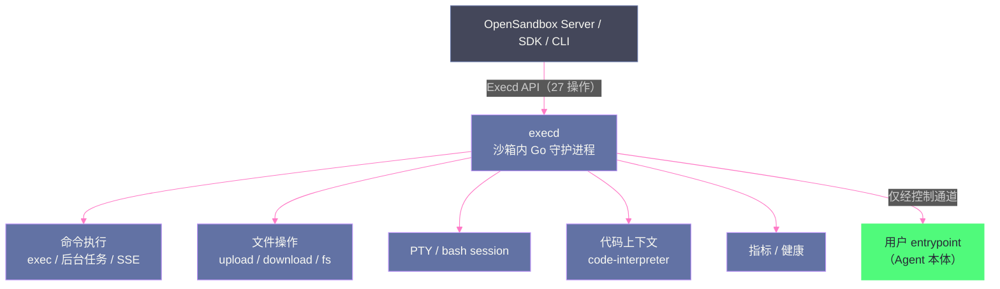
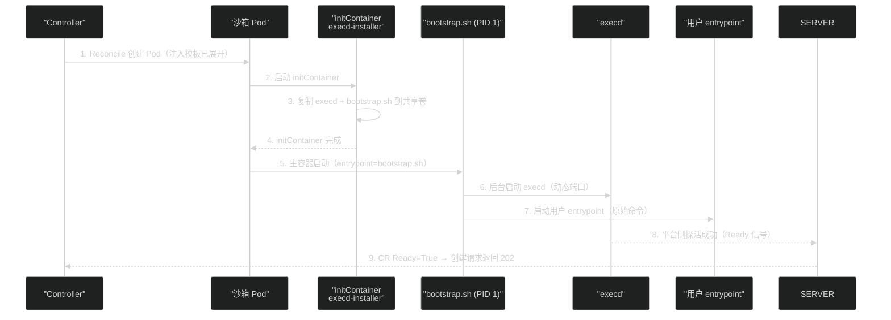

# 08 OpenSandbox 数据面——execd 与 egress 的盒内世界

**摘要：**

[[平台与协议/07 OpenSandbox 架构深度解析——协议优先与六责任面|第 07 篇]] 解剖了 OpenSandbox 的控制面与协议面，本文深入剩下的"盒内世界"——数据面（Sandbox Data Plane）与网络面（Network & Security Plane）。文章首先解释"为什么沙箱内必须有守护进程"（行业共识第三条：盒内守护进程是平台能力落地的基础），以及 execd 的职责边界（提供控制通道，不提供业务语义）；然后基于源码走读拆解 execd 的注入机制——**execd-installer initContainer 复制二进制到共享目录，主容器经 bootstrap.sh 启动 execd 与用户 entrypoint，bootstrap 以 PID 1 身份保证沙箱退出时完整回收**；随后逐项展开 execd 的 27 个 API 操作（命令执行/文件操作/PTY/代码上下文/指标），egress sidecar 的出站管控机制与"策略真伪"问题（CNI 不执行 NetworkPolicy 的教训与对照实验方法论），Endpoint/server proxy/ingress gateway 三条"沙箱内服务对外可达"的路径；最后明确 execd 的三个"不做"（不替代 Agent 业务 API、不负责状态持久化、不负责凭据）。核心认知：**数据面是"沙箱内操作"的执行者，它的设计质量决定平台的可用性下限——但它的边界纪律（只做控制通道）决定平台的架构上限**。

---

## 第 1 章 数据面的定位：沙箱的"手"

### 1.1 为什么沙箱内必须有守护进程

行业共识第三条（[[平台与协议/06 Agent 沙箱平台分层——六层模型与三条产品路线|第 06 篇]] 的六层共识）说：**盒内守护进程是平台能力落地的基础**。为什么不能由平台在宿主机侧直接操作沙箱内的命令/文件？

**原因一：沙箱的隔离语义**。沙箱内的进程视图、文件系统、网络栈都是独立的 namespace（[[隔离原语/02 Linux 隔离原语——namespace、cgroups、seccomp 与 capabilities 的安全地基|第 02 篇]]）——宿主机侧进程要操作沙箱内资源，要么 setns 进入沙箱 namespace（侵入性强、权限要求高），要么让沙箱内自己有一个"代言人"。

**原因二：平台的通用性**。平台不知道沙箱里跑的是什么（Python 解释器？Node？Agent 本体？）——需要一个"平台自己的进程"在沙箱内提供标准接口。**execd 就是这个代言人**：平台侧通过 execd 的 API 与沙箱内世界交互，不依赖沙箱内应用的类型。

**原因三：安全边界**。如果平台从宿主机直接操作沙箱（如通过 docker exec 类通道），平台的权限模型会与沙箱的隔离模型纠缠不清；**通过盒内守护进程，平台对沙箱的操作全部收敛到"守护进程的 API"**——审计点单一、权限模型清晰。

### 1.2 execd 的职责边界：控制通道 vs 业务语义

这是本专栏反复强调的边界，在 execd 处给出最终定义：

| 维度 | execd 做（控制通道） | execd 不做（业务语义） |
| :--- | :--- | :--- |
| 命令 | 执行命令、返回 stdout/stderr | 不解释命令的业务含义 |
| 文件 | 上传/下载/读写 | 不理解文件是代码还是数据 |
| 终端 | 提供 PTY 会话 | 不理解会话的语义 |
| 进程 | 管理后台任务 | 不理解任务的目标 |
| Agent | — | **不替代 Agent 的对话/任务/会话 API** |

**为什么这个边界如此重要**（素材源码走读的原话结论）：**"Agent 程序来自镜像、entrypoint 和配置，execd 只提供控制通道"**——如果 execd 试图理解 Agent 语义，平台就会变成"什么都管、什么都管不好"的怪兽：每个 Agent 的语义都要适配（第 5 层的活）、Agent 升级导致 execd 也要升级（耦合爆炸）。**边界纪律是平台可演进的前提**。

### 1.3 数据面的性能特征：延迟预算

数据面的性能直接决定 Agent 的"操作手感"——素材 PoC 的 WarmPool 数据给出了延迟预算的分解（[[平台与协议/09 OpenSandbox 编排面——BatchSandbox、WarmPool 与快照|第 09 篇]] 详述）：

| 环节 | 热池命中 p50 | 说明 |
| :--- | :--- | :--- |
| API 创建（热池命中） | ~1.0s | 控制面开销 |
| **到首命令可用** | ~2.2s | 控制面 + 数据面（execd 就绪） |
| 单条命令执行 | 百毫秒级 | 数据面开销（网络往返 + execd 处理） |

**"到首命令"与"API 创建"的差值（~1.2s）就是数据面就绪的延迟预算**——execd 启动、探活、路由就绪都在这 1.2 秒内。数据面优化的方向（execd 启动加速、探活前置、路由预热）都服务于压缩这个差值。

**性能设计的两个原则**：其一，**execd 的启动路径必须短**（Go 单二进制 + 无外部依赖的意义）；其二，**数据面与控制面并行就绪**（execd 不等待 Server 的确认——反向依赖会串行化启动路径）。

### 1.4 数据面与控制面的关系

数据面（execd/egress）与控制面（Server/Controller）的关系可以总结为三点：

1. **生命周期上**：控制面创建沙箱 Pod，数据面随 Pod 启动（execd 注入）——**控制面管"生"，数据面管"活"**；
2. **路径上**：控制面走管理路径（Server API/CR），数据面走执行路径（execd API/egress 策略）——**两条路径独立，控制面故障不阻塞数据面**；
3. **状态上**：控制面持有元数据（沙箱记录），数据面持有运行态（进程/文件/网络）——**"状态四本账"（[[生产化/13 Agent 状态与存储——六类状态的正确拆分|第 13 篇]]）从这里开始分家**。

---

## 第 2 章 execd 架构与注入机制

### 2.1 execd 是什么

execd 是运行在沙箱内的 Go 守护进程（基于 Gin 框架的 HTTP 服务），版本基线 v1.0.21（素材 PoC）。它是"沙箱内操作"的统一入口：



**为什么用 Go**：与 [[隔离原语/03 隔离边界的光谱——从共享内核到 MicroVM 的四档技术路线|gVisor 选 Go]] 的动机一致——内存安全 + 单二进制部署（沙箱内注入一个静态二进制，无运行时依赖）。**单二进制是注入机制能成立的前提**：initContainer 只需要复制一个文件。

### 2.2 注入机制：initContainer + 共享目录 + bootstrap

execd 如何进入沙箱？（素材 Phase6 源码走读的机制还原）：

```
镜像构建时（用户侧）：
  用户镜像中预置 execd-installer（或平台构建时注入）

Pod 启动时（平台侧）：
  1. execd-installer（initContainer）运行
     → 把 execd 二进制 + bootstrap.sh 复制到共享 emptyDir 卷
  2. 主容器启动，entrypoint 被替换为 bootstrap.sh
  3. bootstrap.sh：
     a. 启动 execd（后台守护）
     b. 启动用户原始 entrypoint（Agent 本体）
```

**三个设计要点**：

**要点一：共享卷是唯一的注入通道**。initContainer 与主容器通过 emptyDir 共享卷传递二进制——不需要镜像重建，平台可以在运行时决定注入版本（**execd 版本与镜像解耦**）。

**要点二：entrypoint 被替换**。主容器的 entrypoint 不是用户定义的，而是 bootstrap.sh——**用户"原始 entrypoint"被保存并作为参数传给 bootstrap**。这是平台"劫持"容器启动的机制，也是"PID 1 拓扑"的来源。

**要点三：execd 不在镜像里**。用户镜像只预置 installer（或由平台注入），execd 本体由平台在创建时注入——**沙箱的执行能力由平台控制，不由镜像决定**。

### 2.3 PID 1 进程拓扑：bootstrap → execd + 用户进程

注入后的进程树：

```
PID 1: bootstrap.sh
├── execd（守护进程，监听动态端口）
└── 用户 entrypoint（Agent 本体）
    └── 用户进程的子进程（任务/子命令）
```

**为什么 bootstrap 必须是 PID 1**（[[隔离原语/02 Linux 隔离原语——namespace、cgroups、seccomp 与 capabilities 的安全地基|第 02 篇]] 的 PID 1 职责）：PID 1 承担两个特殊职责——**回收僵尸进程**与**信号分发**。bootstrap 做 PID 1 保证：

1. **完整回收**：沙箱删除时，K8s 向 PID 1 发 SIGTERM/SIGKILL，bootstrap 的退出会带走整个进程树（execd + 用户进程 + 子进程）——"残留 0"验收的底层机制；
2. **信号正确性**：Agent 进程收到 SIGTERM 时能优雅退出（bootstrap 转发信号）——如果 Agent 直接做 PID 1 而不处理信号，会出现"沙箱删了、进程还活着"的僵尸。

**反例**（不这样会怎样）：如果用户 entrypoint 直接做 PID 1（常见于"图省事"的镜像），Agent 进程不回收子进程、不处理信号——长期运行后僵尸堆积、沙箱删除后进程残留。**这是"Agent 镜像必须走平台注入"的硬理由**。

### 2.4 完整启动时序

把注入机制放回 Pod 生命周期的完整时序中（素材 PoC 部署与源码走读的合成）：



**时序中的两个关键点**：

1. **第 3 步是"注入"的唯一时机**——initContainer 完成前，主容器不会启动（K8s 语义保证）；共享卷是二者的桥梁；
2. **第 6/7 步的父子关系决定回收**——bootstrap 同时是 execd 与用户进程的父进程——**沙箱删除时 SIGKILL bootstrap，整棵树被带走**。

**故障定位**：沙箱创建后 execd 不可用，按时序排查——initContainer 是否完成（Pod 事件）→ bootstrap 是否启动（日志）→ execd 是否监听（探活）→ 用户 entrypoint 是否冲突（端口/资源）——**时序即排障清单**。

### 2.5 注入机制的边界：平台能改什么、不能改什么

| 能改（平台控制） | 不能改（镜像/用户控制） |
| :--- | :--- |
| execd 版本（注入时决定） | Agent 二进制与版本 |
| 启动编排（bootstrap 逻辑） | Agent 的配置与凭据（由用户注入） |
| 控制通道（命令/文件 API） | Agent 的业务逻辑与行为 |

**这个边界的意义**：平台可以升级 execd（控制通道能力），但不能"替 Agent 决定怎么工作"——**平台升级不会破坏 Agent 行为，Agent 升级不需要平台配合**。这是第 1.2 节边界纪律的工程化表达。

---

## 第 3 章 execd 能力面：27 个操作

### 3.1 能力总表

素材 Phase3-07 实测的 Execd API 操作（27 个），按能力域分组：

| 能力域 | 操作（实测） | 典型场景 |
| :--- | :--- | :--- |
| **命令执行** | exec 同步执行、后台命令、命令日志、SSE 流式输出 | Agent 执行 python/shell、长任务跟踪 |
| **文件操作** | 上传、下载、目录列表、读写、删除 | 输入文件注入、产物提取 |
| **终端** | bash session 创建/输入/输出、PTY 控制 | 交互式调试、终端型 Agent |
| **代码上下文** | 代码解释器相关操作 | code-interpreter 镜像场景 |
| **指标与健康** | 健康检查、指标查询 | 平台探活、监控 |

### 3.2 命令执行：exec 与 SSE 流式

**同步 exec**：`POST /exec` 执行命令并等待完成，返回 stdout/stderr/exit code——素材验证的典型用法是子沙箱执行 `python3 -c 'print(sum(range(1,100)))'` 返回 4950。

**流式输出（SSE）**：长命令的输出通过 Server-Sent Events 流式返回——Agent 场景的"实时观察任务进度"依赖此通道。素材 PoC Case 3 验证了 execd 命令 + SSE + 文件的完整链路。

**后台任务**：长任务以后台方式启动，通过任务 ID 查询日志/状态——**"命令的异步化"是 Agent 长任务的基础能力**（模型思考数分钟、命令跑数小时的场景）。

### 3.3 文件操作：Agent 的"输入输出管道"

文件能力是 Agent 工作流的关键闭环：

| 方向 | 操作 | 场景 |
| :--- | :--- | :--- |
| **进沙箱** | upload | 用户上传输入文件、配置注入 |
| **出沙箱** | download | 任务产物、生成的代码/文档 |
| **沙箱内** | ls/read/write/rm | Agent 读写工作目录 |

**文件通道的安全注意**：上传/下载经过 execd 的 API——**路径校验是安全关键**（防止 `../` 逃逸出沙箱工作目录）。素材未披露具体校验实现，但"文件 API 的路径规范化"应列入自研/集成时的安全检查项。

### 3.4 能力设计的三条原则

从 27 个操作反推 execd 的能力设计原则，对自研数据面同样适用：

**原则一：能力正交**。命令、文件、终端、代码、指标五类能力互不依赖——客户端可以只用命令能力（简单任务），也可以全用（完整 Agent）。**正交能力 = 可组合能力**。

**原则二：同步异步双通道**。同一能力提供同步（exec 等待完成）与异步（后台任务 + 日志查询）两种语义——**短命令同步、长任务异步**是 Agent 场景的基本节奏（模型思考期间命令在跑）。

**原则三：流式优先**。输出走 SSE 流式而非一次性返回——长输出的"首字节延迟"与"内存占用"都依赖流式。**"流式优先"在 execd 的每个能力域都成立**（命令输出、文件传输、终端回显）。

**反例**（破坏原则的后果）：如果能力间强耦合（如"执行命令必须先建终端"），客户端逻辑会复杂化；如果只有同步语义，长任务会挂死 API；如果输出一次性返回，大输出会撑爆内存——**三条原则是数据面可用性的底线**。

### 3.5 PTY 与 bash session

PTY（伪终端）提供交互式终端会话——`bash session` 创建后，客户端可以持续输入/读取输出（WebSocket 类通道）。**PTY 的定位**：交互式调试与"终端型 Agent"（如 OpenCode 的 TUI 模式）的兼容通道；但对"结构化 Agent 交互"，**原生 Server API 优于 PTY**（[[工程实践/11 三类 Agent 沙箱落地——OpenCode、Hermes 与 LangChain 镜像化实战|第 11 篇]] 的接口选择原则：PTY 传终端字节流，语义丢失）。

---

## 第 4 章 egress：出站管控

### 4.1 为什么出站管控是硬需求

回到 [[../01 Agent 沙箱全景——威胁模型、六层技术栈与逻辑演进|第 01 篇]] 的攻击链：第 4 步"网络外传"是数据窃取的出口——**没有出站管控的沙箱，等于给窃取的数据开了免签通道**。出站管控的目标不是"禁止所有网络"（Agent 需要访问模型 API、拉取依赖），而是"**只允许白名单内的出站**"：

| 出站目标 | 默认策略 | 理由 |
| :--- | :--- | :--- |
| 模型 API（LLM 端点） | 白名单允许 | Agent 工作的必要通道 |
| 包管理仓库（pypi/npm） | 白名单允许 | 依赖安装的必要通道 |
| 企业内部服务 | 按需白名单 | 业务需要 |
| 内网非白名单地址 | **默认拒绝** | 防止横向渗透（攻击链第 3 步） |
| 云元数据地址（169.254.169.254） | **默认拒绝** | 防凭据窃取（经典攻击路径） |
| 公网任意地址 | **默认拒绝** | 防数据外传（攻击链第 4 步） |

### 4.2 egress sidecar 架构

OpenSandbox 的 egress 以 sidecar 形态注入沙箱 Pod：

```
沙箱 Pod
├── 主容器（用户负载 + execd）
└── egress sidecar（网络管控）
     └── 拦截/放行出站流量（按策略）
```

**sidecar 的工作方式**：利用沙箱的独立网络 namespace（[[隔离原语/02 Linux 隔离原语——namespace、cgroups、seccomp 与 capabilities 的安全地基|第 02 篇]] 的"Egress 控制前提"），sidecar 在 namespace 内实施策略——通过 iptables/eBPF 类机制把出站流量引到 sidecar 裁决，白名单放行、其余拒绝。

**Egress API（3 个操作）**：素材实测 Egress 契约只有 3 个操作——策略的查看与设置。**注意"策略是 Server 级还是沙箱级"**：素材 PoC 发现 poolRef + networkPolicy 组合当前互斥（[[平台与协议/09 OpenSandbox 编排面——BatchSandbox、WarmPool 与快照|第 09 篇]]），首期采用"逐沙箱创建换取独立 Egress Policy"。

### 4.3 出站管控的实现手段对比

egress 的实现有四个层级的选择（从内核到用户态），各自的粒度与代价不同：

| 手段 | 粒度 | 优点 | 缺点 | 典型场景 |
| :--- | :--- | :--- | :--- | :--- |
| **iptables/nftables** | IP/端口 | 内核原生、成熟 | 无域名语义、规则复杂 | 简单 IP 白名单 |
| **eBPF（Cilium 类）** | IP/端口/协议（可扩展） | 高性能、可编程 | 内核版本要求、运维复杂度 | 生产级策略引擎 |
| **DNS 代理（FQDN 白名单）** | 域名 | 业务语义清晰（allow api.openai.com） | 需要 DNS 可见性（**Cilium FQDN 需同时允许 Pod 访问集群 DNS，用 rules.dns 让 DNS proxy 看见应答**） | 白名单域名场景 |
| **应用层代理** | HTTP/协议 | 最细粒度（路径/方法） | 性能开销、非透明 | 高安全场景 |

**素材的实践结论**：网络策略的"真伪"要先验证（4.4 节），实现手段按威胁等级选择——低风险用 IP 白名单（iptables），中高风险用 FQDN 白名单（Cilium 类）——**"默认拒绝内网、元数据地址和非白名单出口"是素材生产方案的出站基线**。

### 4.4 策略真伪问题：写了 NetworkPolicy 不等于有隔离

素材 Phase5-05 的调研提出了一个尖锐问题：**"写了 NetworkPolicy 不等于有隔离——Flannel 默认不执行"**。这是 K8s 生态的经典陷阱：

| CNI | 是否执行 NetworkPolicy |
| :--- | :--- |
| Calico | ✅ 完整执行 |
| Cilium | ✅ 完整执行（含 FQDN 策略） |
| Flannel | ❌ **不执行**（纯 overlay，无策略引擎） |
| Weave | 🔶 部分 |

**素材的教训**：测试集群的 CNI 类型、是否执行 NetworkPolicy 仍列为未决项——**在确认 CNI 执行策略之前，任何"我们配置了网络隔离"的声明都是无效的**。

**验收方法：最小对照实验**（素材 Phase5-05 的完整方案）：

```
第 1 步：基线放行 —— 不写任何策略，确认沙箱间可互通（验证环境正常）
第 2 步：default-deny —— 写全拒绝策略，确认沙箱间不可互通（验证策略生效）
第 3 步：精确允许 —— 只允许白名单，确认白名单通、非白名单不通
第 4 步：删除恢复 —— 删策略，确认回到基线（验证策略可回滚）
第 5 步：换 Runtime 重放 —— 换 gVisor/Kata 后重放 1-4（验证隔离档位不影响策略）
```

**这五步的价值**：把"我们以为的隔离"变成"验证过的隔离"——素材把该实验列为生产化的 T 级任务（[[生产化/15 生产化深水区——十个盲区与行业共识|第 15 篇]]）。

### 4.5 egress 策略的粒度与 WarmPool 的互斥问题

素材 PoC（Phase1-11/Phase3-15）发现了一个影响生产设计的事实：**poolRef（预热池认领）与 networkPolicy（独立网络策略）当前互斥**——使用预热池的沙箱不能获得独立 egress 策略，独立策略要求逐沙箱创建。

**为什么互斥**：池化沙箱是"批量交付的通用实例"（策略由池模板统一声明），逐沙箱创建才有"按请求定制策略"的机会——**池的"通用性"与策略的"个性化"在设计上冲突**。

**素材的取舍**：首期采用"逐沙箱创建换取独立 Egress Policy"——**安全优先于性能**（池化的性能收益（命中 1s）可以用其他手段补偿，egress 策略的缺失则无法补偿）。这个取舍的普适性：**当池化与策略冲突时，先保策略——因为 egress 是攻击链第 4 步的唯一防线，而池化只是性能优化**。

**对选型的启示**：评估沙箱平台时，"池化与策略是否可共存"是一个关键问题——不能共存意味着"高吞吐"与"细粒度管控"不可兼得，容量模型与安全模型必须分开设计（[[工程实践/12 沙箱性能工程——Runtime 基准与 WarmPool 容量管理|第 12 篇]]）。

---

## 第 5 章 Endpoint 与 server proxy：沙箱内服务的对外通道

### 5.1 Endpoint：回答"沙箱的端口在哪里"

沙箱内启动服务后（如 Agent 的 WebUI、模型服务），外部如何访问？Endpoint API 回答这个问题：**返回访问地址与路由头**（endpoint 解析机制）。

**与端口内应用的关系**（素材源码走读的边界结论）：**"Endpoint API 返回访问地址和路由头，解决'如何找到沙箱端口'，不替代端口内应用自己的登录、Session 或 WebSocket 协议"**——Endpoint 是"路由层"能力，应用层协议（认证/会话）是应用自己的事。

### 5.2 server proxy 与 ingress gateway 两条路径

| 路径 | 机制 | 适用 | 已知问题 |
| :--- | :--- | :--- | :--- |
| **server proxy** | Server 侧代理流量到沙箱内端口 | 简单场景 | DEF-003：返回无效路由 Header（素材实测） |
| **ingress gateway** | K8s 网关动态路由（签名 Header 鉴权） | 生产场景 | 需要 Gateway 组件（1.0.10） |

**素材 PoC 的实践**：PoC 期直接暴露 HTTP NodePort（POC-007 妥协），生产化要求 Gateway + SSO（[[生产化/14 沙箱安全体系——三层防护、短期凭据与多租户|第 14 篇]] 的入口治理）。

### 5.3 端口暴露的完整路径：从沙箱内服务到外部客户端

把 Endpoint、server proxy、ingress gateway 串成完整路径：

```
外部客户端（用户/Agent 平台）
  → ① 请求 Endpoint API（向 Server 查询"沙箱 X 的端口 4096 怎么访问"）
  → ② 获得访问地址 + 路由头（endpoint 解析结果）
  → ③ 按地址访问（经 ingress gateway 或 server proxy）
  → ④ 网关路由到沙箱 Pod 的指定端口
  → ⑤ 到达沙箱内服务（如 OpenCode 的 4096 Server）
```

**路径上的三个安全边界**：

1. **① 的鉴权**：Endpoint 查询需要平台凭据——**不知道沙箱 id 的客户端无法查到端口**（沙箱级保密）；
2. **③ 的网关鉴权**：ingress gateway 用签名 Header 验证请求来源——**不是任何外部流量都能进沙箱**；
3. **⑤ 的应用鉴权**：到达沙箱内服务后，服务自己的登录/Session 生效——**平台管路由，应用管身份**。

**三层边界的叠加**构成了"沙箱内服务对外可达"的安全模型：路由层（平台控制）+ 身份层（应用控制）。**任何一层的缺失都会导致暴露**——素材 PoC 的 NodePort 直接暴露（POC-007）就是"跳过网关层"的反例。

### 5.4 安全注意：Endpoint 的暴露面

Endpoint 暴露是双刃剑：能力上它让"沙箱内服务可被访问"（Agent WebUI 场景必需），风险上它是**沙箱的入站面**——未鉴权的 Endpoint 等于给攻击者留门。生产化要求：

1. 入站只允许 Gateway（禁止直连 Pod/NodePort）；
2. 签名 Header 鉴权（Gateway 与 Server 共享密钥）；
3. Endpoint 级审计（谁访问了哪个沙箱的哪个端口）。

---

## 第 6 章 产品边界：execd 的三个"不做"

### 6.1 不替代 Agent 业务 API

最核心的边界：execd 提供命令/文件/PTY，**不提供对话/任务/会话 API**——Agent 的业务能力由 Agent 自己的服务暴露（OpenCode 的 4096 Server、Hermes 的 9119 Dashboard）。平台侧要拿到 Agent 的会话状态，必须走"第 5 层适配"（Agent 原生 API 对接），不是 execd。

### 6.2 不负责状态持久化

execd 不保存任何跨沙箱状态——沙箱删除，execd 随之销毁（它的"状态"只有运行中的进程/文件）。**持久状态（Workspace/Session/快照）归平台层**（[[生产化/13 Agent 状态与存储——六类状态的正确拆分|第 13 篇]] 的"四本账"）。这个"不负责"是刻意的：execd 无状态，平台才能任意替换沙箱实例。

### 6.3 边界违反的代价：两个真实反例

"三个不做"不是教条——素材中的两个反例说明了违反边界的代价：

**反例一：平台总 Key 被 MCP 打穿**（Phase5-09）。平台把"平台级 Key"传给沙箱内的 MCP Server（Agent 用它创建子沙箱）——结果是**父 Agent 能枚举全部沙箱**（凭据越过了"沙箱级保密"边界）。教训：**凭据的注入粒度必须与沙箱绑定**（短期凭据，[[生产化/14 沙箱安全体系——三层防护、短期凭据与多租户|第 14 篇]]），共享凭据就是共享边界。

**反例二：PTY 当结构化接口用**（Phase1-13）。把 Agent 的交互全部走 PTY（终端字节流），平台拿不到会话/消息/事件结构——可观测性、会话恢复、审计全部失效。教训：**数据面只提供"通道"，结构化语义必须走 Agent 原生 API**（第 5 层适配）。

**两个反例的共同点**：都是"让数据面/凭据层承担了不属于自己的职责"——**边界纪律的违反，通常以"图省事"开始，以"安全事故/架构返工"结束**。

### 6.4 不负责凭据

execd 不持有凭据——模型 API Key、平台 Key 由用户/平台在启动时注入（env/Secret），execd 只传递命令。**凭据的生命周期与沙箱绑定**（沙箱删除即销毁）还是与用户绑定（跨沙箱复用），是平台策略问题（[[生产化/14 沙箱安全体系——三层防护、短期凭据与多租户|第 14 篇]] 的短期凭据），不是 execd 的职责。

---

## 第 7 章 数据面的安全、审计与已知坑

### 7.1 execd 自身的权限

execd 运行在沙箱内（与用户负载同 namespace）——**它的权限模型是"沙箱内的高权限，沙箱外的零权限"**：

- 沙箱内：能执行命令、读写文件（与用户进程同级或略高）；
- 沙箱外：无任何宿主机权限（随 Pod 销毁）。

**安全推论**：execd 被攻破 = 攻击者获得"沙箱内高权限"——但逃逸沙箱仍需第 2 步（提权/逃逸），execd 的攻破不改变逃逸难度。**真正的风险是"execd 的 API 被未授权调用"**：如果沙箱内其他进程能调用 execd 的 API（未鉴权），攻击者可以借 execd 做平台级操作——**execd API 的沙箱内鉴权（只允许平台侧流量到达）是安全关键**（素材未披露细节，自研/集成时必查）。

### 7.2 审计：命令记录的完整性

数据面的审计价值：**每条命令、每次文件操作都应可追溯**——这是"行为审计"层（三层防护的第三层，[[生产化/14 沙箱安全体系——三层防护、短期凭据与多租户|第 14 篇]]）的数据来源。素材记录的差距：**Diagnostics API（日志/事件）stable 版本未实现（GAP-001）**——审计链路不完整是 0.2.x 的生产化短板，需要自建"外部日志证据链"（删除前把 Event/request_id/sandbox_id 打到外部日志）。

### 7.3 数据面的可观测性：命令即数据

数据面的审计与可观测有一体两面：**每一条命令、每一次文件操作，既是审计证据，也是运行数据**。生产化建议把 execd 的操作日志接入统一观测体系：

| 观测对象 | 指标 | 告警建议 |
| :--- | :--- | :--- |
| 命令执行 | 执行频率、成功率、耗时分布 | 异常高频命令、失败率突增 |
| 文件操作 | 上传/下载大小、路径分布 | 大文件外传（下载突增） |
| egress 策略 | 拒绝次数、命中白名单次数 | 拒绝突增（疑似外传尝试） |
| execd 健康 | 探活失败率、重启次数 | 探活失败（沙箱失联） |

**"命令即数据"的工程含义**：数据面日志不能只存不分析——**拒绝次数与失败率是攻击链第 3/4 步的最早信号**（[[生产化/14 沙箱安全体系——三层防护、短期凭据与多租户|第 14 篇]] 的行为审计层）。素材 GAP-001（Diagnostics 未实现）的绕行方案正是"外部日志证据链"——**在平台补齐前，把 execd 日志外发到 Loki 类系统是必做项**。

### 7.4 数据面验收清单

把本章内容转成可执行的验收清单（素材 PoC Case 3 与验收手册的扩展版）：

| 验收项 | 方法 | 通过标准 |
| :--- | :--- | :--- |
| **execd 注入** | 创建沙箱后查进程树 | bootstrap 为 PID 1，execd 与用户进程为其子进程 |
| **命令执行** | exec 同步命令 | stdout/stderr/exit code 正确 |
| **流式输出** | 长命令 SSE | 输出分块到达，非一次性 |
| **后台任务** | 启动长任务 + 查日志 | 任务可独立查询状态 |
| **文件闭环** | upload → 沙箱内读 → download | 内容一致 |
| **PTY 会话** | 创建 bash session | 输入输出往返正常 |
| **egress 白名单** | 允许域名可通、非白名单被拒 | 对照实验五步通过 |
| **Endpoint** | 查询 + 访问沙箱内服务 | 路由正确（注意 DEF-003 绕行） |
| **回收** | 删除沙箱后检查 | 进程树全清、API/CR/Pod 残留 0 |

**清单的使用**：接入新镜像/新运行时/新版本平台时全部重跑——**数据面是"每次变更都要回归"的层**，因为它的行为直接暴露给 Agent 工作负载。

**回归的自动化建议**：数据面验收清单适合脚本化（素材的 Case 3 已给出雏形）——**"一键重跑数据面验收"应成为平台 CI 的一环**：命令/文件/PTY/egress/Endpoint/回收六个域各一个断言脚本，任何发布（平台/运行时/镜像）触发全量重跑——**数据面回归的"变更即触发"与 [[工程实践/11 三类 Agent 沙箱落地|第 11 篇]] 的 Agent 回归是同一纪律**。

### 7.5 已知缺陷与坑（素材实测）

| 缺陷 | 现象 | 绕行 |
| :--- | :--- | :--- |
| DEF-003 | Server Proxy endpoint 返回无效路由 Header | 用 ingress gateway 路径 |
| pause 假成功 | CLI 显示 ok 早于真实完成 | 轮询到 Paused 终态 |
| 命令超时语义 | 长命令的 SSE 断连处理 | 用后台任务 + 日志查询 |
| PTY 与结构化接口混用 | 终端字节流丢失会话语义 | 优先原生 Server API |

---

## 第 8 章 总结与下一篇导读

### 8.1 本文核心要点

1. **盒内守护进程是平台能力落地的基础**（行业共识第三条）——execd 是"沙箱内操作"的统一代言人
2. **注入机制三件套**：initContainer 复制 + 共享卷传递 + bootstrap 启动——execd 版本与镜像解耦，平台控制执行能力
3. **PID 1 拓扑**：bootstrap 做 PID 1 保证完整回收与信号正确——"残留 0"验收的底层机制
4. **execd 能力面**：27 个操作覆盖命令/文件/PTY/代码/指标——数据面的完整工具箱
5. **egress 的硬需求**：出站白名单是攻击链第 4 步的唯一防线——"默认拒绝内网/元数据/公网"
6. **策略真伪问题**：Flannel 不执行 NetworkPolicy——"写了策略"不等于"有隔离"，五步对照实验是验收方法
7. **三个"不做"**：不替代 Agent API、不负责持久化、不负责凭据——边界纪律决定平台可演进性
8. **数据面验收清单**：命令/文件/PTY/egress/Endpoint/回收六域断言——"变更即触发"的回归纪律（7.4 节）

### 8.2 术语速查

| 术语 | 口径 |
| :--- | :--- |
| **execd** | 沙箱内 Go 守护进程（Gin HTTP），命令/文件/PTY 的统一入口 |
| **bootstrap.sh** | 注入的启动脚本，做 PID 1，启动 execd + 用户 entrypoint |
| **execd-installer** | initContainer，把 execd 复制进共享卷 |
| **egress sidecar** | 沙箱 Pod 内的出站管控组件（策略裁决） |
| **Endpoint** | 沙箱内服务的地址解析（找到端口 + 路由头） |
| **SSE** | Server-Sent Events，命令流式输出的通道 |
| **策略真伪实验** | 验证 CNI 是否真实执行 NetworkPolicy 的五步对照实验 |

### 8.3 思考题

1. **注入机制的设计权衡**：execd 通过"initContainer + 共享卷 + bootstrap 替换 entrypoint"注入。如果改为"镜像构建时直接打进 execd"，会失去什么？提示：考虑 execd 版本升级的节奏（镜像重建 vs 运行时注入）与"平台控制执行能力"的原则。

2. **PID 1 的替代方案**：bootstrap 做 PID 1 是"完整回收"的保证。如果用户镜像坚持自己的 entrypoint 做 PID 1（不配合平台），平台有哪些兜底手段？提示：考虑 K8s 的 preStop 钩子、进程组的 SIGKILL、以及"平台拒绝该镜像"的准入策略。

3. **egress 与池化的取舍**：素材选择"逐沙箱创建换取独立 Egress Policy"。如果未来平台支持"池模板声明策略"，你认为这个能力应该怎么设计？提示：考虑"池的维度"（按策略分池？按租户分池？）与"策略继承"（认领时覆盖还是合并？）。

### 8.4 下一篇导读

数据面讲完，OpenSandbox 三部曲只剩最后一篇：**编排面**。[[平台与协议/09 OpenSandbox 编排面——BatchSandbox、WarmPool 与快照|09 OpenSandbox 编排面]] 将深入 BatchSandbox/Pool/SandboxSnapshot 三 CRD、WarmPool 预热池的机制与性能（命中 1s/耗尽 17-27s）、pause/resume 与快照的真实语义（rootfs OCI 镜像而非内存）——**"沙箱怎么被声明、怎么被批量交付、状态怎么被保存"是三部曲的收官问题**。

> [!info] 专栏导航
> 本文是 [[../00 专栏导览|Agent 沙箱技术专栏]] 的第 08 篇，OpenSandbox 三部曲之二。07 篇架构与控制面；本文数据面；09 篇编排面收官。此后 10-12 篇进入部署与实战，13-15 篇生产化。

---

## 参考文献

1. 素材调研. Phase6 源码走读（execd bootstrap/注入机制/PID 1 拓扑）、Phase3-01 PoC 验收手册（Case 3 execd 链路）、Phase3-07 Execd API 实测、Phase5-05 网络策略真伪
2. OpenSandbox 官方架构文档. https://open-sandbox.ai/zh/overview/architecture
3. 素材调研. Phase5-07 状态四本账、Phase1-13 OpenCode 原生 Server 接口
4. GitHub. opensandbox-group/OpenSandbox（execd 目录）. https://github.com/opensandbox-group/OpenSandbox

---

## 修改记录

- 2026-08-15：专栏创建，本文基于素材源码走读与数据面实测整合创作
