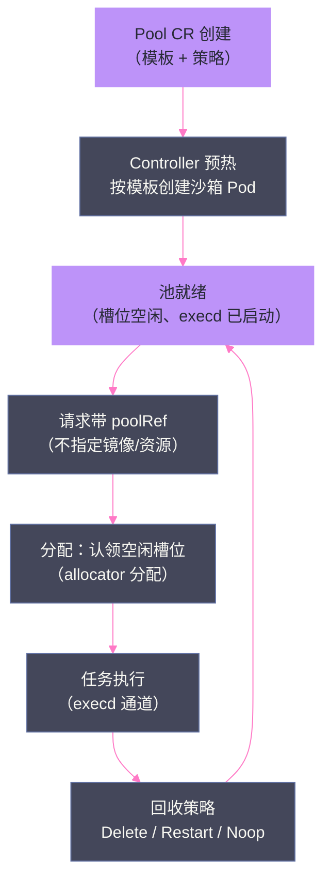

# 09 OpenSandbox 编排面——BatchSandbox、WarmPool 与快照

**摘要：**

[[平台与协议/08 OpenSandbox 数据面——execd 与 egress 的盒内世界|第 08 篇]] 讲完了"沙箱里面"，本文收官 OpenSandbox 三部曲：**编排面**——沙箱"怎么被声明、怎么被批量交付、状态怎么被保存"。文章首先解释声明式编排的意义（CRD 即事实层、Controller 持续对账）与编排面三件套（BatchSandbox/Pool/SandboxSnapshot 三 CRD）；然后深入 BatchSandbox 的设计（replicas 批量语义、podTemplate、task 编排、与 sigs Sandbox CRD 的差异）；随后用素材实测数据完整拆解 WarmPool——命中 p50 1.0s/首命令 2.2s、并发 50 交付 p99 5.6s、耗尽 5→50 时 p99 回到 17.5-27.5s 冷启动量级——并给出"池化换到的是命中尾延迟，不是无限容量"的容量模型结论、scale/update/recycle 三策略的实测行为与"Pool 当不可变版本"的生产纪律；再解剖快照的真实语义（**pause 保存的是容器 rootfs 的 OCI 镜像，不是内存、不是对话、不是用户网盘**——OSEP-0008 的 Non-Goals 边界）与已知缺陷（pod-local SQLite 元数据、删除不回收 Registry blob）；最后给出编排面的生产化决策：Core HA Profile 与 Snapshot Lab Profile 的分治、双副本的真相（共享状态≠副本数）、与 sigs agent-sandbox 的 provider 关系。核心认知：**编排面是沙箱平台的"交付引擎"——它的性能决定用户体验（秒级交付），它的状态语义决定产品边界（快照能恢复什么），它的策略成熟度决定生产可行性（池与策略的冲突）**。

---

## 第 1 章 编排面定位：沙箱的"声明与交付"

### 1.1 为什么需要声明式编排

对比命令式与声明式两种沙箱管理方式：

| 维度 | 命令式（调 API 创建） | 声明式（写 CR + Controller 对账） |
| :--- | :--- | :--- |
| **事实层** | API 返回值 | CR 对象（可审计、可回放） |
| **自愈** | 无（失败即失败） | 有（Controller 持续对账） |
| **批量** | 循环调 API | replicas 声明 |
| **一致性** | 依赖调用方逻辑 | 依赖 Controller 逻辑（统一） |
| **代价** | 实现简单 | Reconcile 延迟、CRD 演进成本 |

**声明式的三个核心价值**：**事实可审计**（CR 是"期望状态"的持久记录——出问题时先看 CR 再看日志）；**行为可自愈**（Pod 意外删除后 Controller 重建）；**批量可表达**（replicas=50 胜过 50 次 API 调用）。素材 PoC 的"API/CR/Pod 三层对照"排障法（[[工程实践/10 Agent 沙箱部署实战——从单机 PoC 到测试集群|第 10 篇]]）正是依赖"CR 是事实层"这个前提。

**声明式的代价**：Reconcile 延迟（从 CR 变更到 Pod 就绪有时间差，素材记录这是冷启动延迟的组成部分之一）；CRD schema 演进复杂（DEF-005：Helm 里的 Pool CRD 与 Controller 类型不一致——**声明式的 schema 版本管理是持续的工程负担**）。

### 1.2 编排面的范式：Operator 模式的完整应用

编排面是 Kubernetes Operator 模式（CRD + Controller）在沙箱场景的完整应用。**Operator 模式的三要素**在编排面各有着落：

| 要素 | 编排面的实现 | 沙箱场景的特殊性 |
| :--- | :--- | :--- |
| **CRD（期望状态声明）** | BatchSandbox/Pool/SandboxSnapshot | 沙箱的期望状态是"模板化"的（Pod 模板表达），比普通工作负载更抽象 |
| **Controller（对账循环）** | reconciler（scale/alloc/evict/update） | 对账对象是"一批沙箱"，需要分配器（allocator）与策略（strategy） |
| **Finalizer（清理钩子）** | 删除前的资源回收 | **沙箱删除的"残留 0"保证依赖 finalizer**（未清理完不删 CR） |

**沙箱场景的特殊性**：普通工作负载（Deployment）的对账是"Pod 数量对齐"，沙箱编排的对账是"**分配语义**"（哪个请求认领哪个槽位）+ "**生命周期语义**"（TTL/回收/快照）——**分配器（allocator）与策略（strategy）是沙箱 Controller 区别于普通 Controller 的核心**（素材源码走读中 allocator 与 strategy 是独立模块）。

**对自研的启示**：如果自研编排面，Controller 的模块划分参考 OpenSandbox——reconciler（对账）/allocator（分配）/strategy（策略）/eviction（驱逐）四模块分离，**分配与策略不写死在对账循环里，是"可插拔策略"的工程前提**（PoolStrategy/TaskSchedulingStrategy 接口）。

### 1.3 编排面三件套

OpenSandbox 的 K8s runtime 通过三个自研 CRD 承载编排能力：

| CRD | 职责 | 关键字段/语义 |
| :--- | :--- | :--- |
| **BatchSandbox** | 沙箱的批量声明 | replicas（副本数）、podTemplate、extensions.poolRef（认领池）、task 编排 |
| **Pool** | 预热池 | 模板 + scaleStrategy + updateStrategy + recycleStrategy |
| **SandboxSnapshot** | 快照记录 | rootfs 可恢复镜像的元数据（pause/resume 的基础） |

**三件套的分工**：BatchSandbox 管"交付"（声明多少个沙箱）、Pool 管"预热"（提前备好资源）、SandboxSnapshot 管"保存"（状态如何留档）。**交付、预热、保存三个问题的解耦，是编排面设计的骨架**。

---

## 第 2 章 BatchSandbox：批量声明

### 2.1 CRD 设计

BatchSandbox 的核心设计（基于官方 CRD 类型与素材源码走读）：

| 设计点 | 语义 | 工程意义 |
| :--- | :--- | :--- |
| **replicas** | 一次声明多个沙箱副本 | 批量评测/RL 训练/并发任务的表达 |
| **podTemplate** | 沙箱 Pod 的完整模板（镜像/资源/RuntimeClass） | 与 K8s 生态一致的模板语言 |
| **extensions.poolRef** | 从 Pool 认领预热的沙箱 | 快交付的声明式入口 |
| **task 编排** | 任务调度（task-scheduler + task-executor） | 批量任务的执行语义（内部 scheduler 把任务分配给沙箱 Pod） |
| **status** | phase/ready/conditions | 对账结果的事实层 |

**task 编排的特殊性**：OpenSandbox 的 Controller 内置了一个 task scheduler——批量任务（如评测）可以声明式地分发给多个沙箱执行（task-executor 运行在沙箱 Pod 内）。**这是"沙箱平台"向"批量计算平台"延伸的能力**——素材 PoC 未深度验证此能力（列为后续方向），但它是 OpenSandbox 与纯"会话沙箱"平台的差异化点。

### 2.2 与 sigs agent-sandbox Sandbox CRD 的差异

| 维度 | BatchSandbox（OpenSandbox） | Sandbox（SIG） |
| :--- | :--- | :--- |
| **核心语义** | 批量（replicas）+ 池化（poolRef） | 单体（单容器、稳定身份） |
| **稳定身份** | 无强保证（按副本管理） | **核心特性**（稳定 hostname/网络身份） |
| **持久存储** | volumeClaimTemplates（声明式） | volumeClaimTemplates（核心特性） |
| **任务编排** | 内置 scheduler + task-executor | 无 |
| **WarmPool** | Pool CRD（自研） | SandboxWarmPool（标准） |
| **快照** | SandboxSnapshot（rootfs 级） | Pod Snapshot（GKE 实现） |

**差异的本质**：SIG 的 Sandbox 是"有状态单体的声明"，BatchSandbox 是"批量沙箱的交付"——**前者为"一个稳定的工作环境"设计，后者为"一批执行单元"设计**。OpenSandbox 同时提供 agent-sandbox provider（用 SIG 的 CRD 跑单体场景），两套语义按需选择。

### 2.3 创建路径回顾：声明式与同步语义的并存

[[平台与协议/07 OpenSandbox 架构深度解析——协议优先与六责任面|第 07 篇]] 讲过创建请求的同步语义（202/504）——这里补上编排面的视角：**API 同步等待的是"CR 就绪 + Pod Running"，不是"Controller 完成全部对账"**。两者的边界：

```
API 返回 202 时：
  ✅ CR 已创建、Pod 已 Running、IP 已获取
  ⏳ Controller 的后续对账（配额记账、事件上报、TTL 调度）可能仍在进行
```

**工程后果**：202 返回后的"立即删除"是安全的（资源已就绪）；但"立即依赖 Controller 的记账结果"是不安全的（对账有延迟）——**调用方对"创建完成"的理解要精确到"Pod 就绪"，而非"全部对账完成"**。

### 2.4 批量交付 benchmark：与 sigs 的对比

InfoQ 分享中给出了编排面最引人注目的数据：**双方都启用池化时，拉起 100 个 sandbox，OpenSandbox 的整体交付效率比 sigs agent-sandbox（调节过并发度后的最好成绩）高一个数量级**。

**为什么快一个数量级**（结合架构推断与分享内容的合成）：

| 因素 | OpenSandbox | sigs agent-sandbox |
| :--- | :--- | :--- |
| **CRD 语义** | replicas 批量声明（一次对账管 N 个） | Sandbox 单体声明（N 个沙箱 = N 次对账） |
| **池化路径** | Pool 认领（allocator 内存分配） | SandboxClaim 认领（CR 对账路径） |
| **控制路径** | 内存态 allocator（快） | 全声明式（稳但慢） |
| **交付思维** | "批量交付"（一批环境一起思考） | "单环境交付"（逐个创建） |

**"整个系统开始以批量交付的方式来思考，而不是不停地创建很多个单体环境——这个转变至关重要"**（InfoQ 分享原话）。**批量语义不是"循环的优化"，而是"思维模式的转变"**——replicas 声明让 Controller 可以批量分配、批量预热、批量对账，而循环调用只能串行或半并行。

**对选型的含义**：如果你的 Agent 平台有"批量评测/批量训练/并发任务"场景，编排面的批量语义是决定性差异——**"单会话沙箱"场景（用户逐个创建）感受不到这个差异，但"批量交付"场景（评测系统、RL 训练）会放大它**。

### 2.5 状态所有权（回顾与深化）

素材源码走读的状态所有权结论（[[平台与协议/07 OpenSandbox 架构深度解析——协议优先与六责任面|第 07 篇]] 3.1 节）：**CR 就绪前成败归 API Server，就绪后 phase 归 Controller**。编排面的深化理解：

- **就绪前**：API Server 是"临时所有者"——它等、它放弃、它回滚（504 时主动删 CR）；
- **就绪后**：Controller 是"持续所有者"——Pod 崩溃它重建、TTL 到期它删除、策略变更它滚动；
- **所有权切换点**：Pod Running + IP 获取——**这个切换点是排障的分水岭**：创建失败查 Server，运行异常查 Controller/CR。

---

## 第 3 章 WarmPool：预热池

### 3.1 行业参考：GKE Agent Sandbox 的 WarmPool 数据

OpenSandbox 的 Pool 不是孤例——GKE Agent Sandbox 的 SandboxWarmPool（[[平台与协议/06 Agent 沙箱平台分层——六层模型与三条产品路线|第 06 篇]] 的 SIG 生态）提供了行业对照数据：

| 指标 | GKE Agent Sandbox（SIG 路线） | OpenSandbox Pool（素材实测） |
| :--- | :--- | :--- |
| **领取速率** | 每集群每秒 300 个 | 未公布（批量 benchmark 高一个数量级） |
| **分配延迟** | 90% ≤ 200ms | 热池命中 API p50 ~1.0s |
| **实现** | SandboxWarmPool CRD + GKE 托管 | Pool CRD + 自研 allocator |

**口径差异提醒**：GKE 的"200ms"是**分配延迟**（认领动作），OpenSandbox 的"1.0s"是 **API 全链路**（含路由/鉴权/execd 探活）——两者不可直接比较（[[隔离原语/03 隔离边界的光谱——从共享内核到 MicroVM 的四档技术路线|第 03 篇]] 6.5 节的"基准边界"纪律）。**可比的结论是"预热池路线在两家都验证了亚秒到秒级的交付"**——行业共识第四条（快靠预热物认领）的实证。

### 3.2 为什么需要预热：冷启动延迟的分解

冷启动延迟（素材 PoC：API p50 4-5s）由四段构成：

| 段 | 内容 | 占比（量级） |
| :--- | :--- | :--- |
| **镜像拉取** | 镜像下载到节点 | 大镜像（2.6GB code-interpreter）占大头 |
| **沙箱创建** | Pod 调度 + 容器启动 | 秒级 |
| **execd 自启** | 数据面就绪（[[平台与协议/08 OpenSandbox 数据面——execd 与 egress 的盒内世界|第 08 篇]]） | 亚秒级 |
| **CR reconcile 传播** | 声明式对账延迟 | 亚秒级 |

**预热的思路**：把"镜像拉取 + 沙箱创建 + execd 自启"提前到空闲时完成——用户请求到达时，只需要"认领"一个已就绪的沙箱。**行业共识第四条"快靠预热物认领"**（[[平台与协议/06 Agent 沙箱平台分层——六层模型与三条产品路线|第 06 篇]]）：秒级交付的答案不是"更快地冷创建"，而是"提前创建好"。

### 3.2 工作流程

Pool 的完整生命周期（素材 Phase3-14/15 实测）：



**认领语义**：请求通过 `extensions.poolRef` 引用池，**而不是指定 image/resourceLimits**——池的模板（镜像/资源/RuntimeClass）由 Pool CR 统一声明。**"按规格认领"而非"按请求创建"是池化的语义核心**。

### 3.3 三策略：scale / update / recycle

素材 Phase3-15 实测了 Pool 的三个策略维度：

| 策略 | 控制什么 | 实测发现 | 生产建议 |
| :--- | :--- | :--- | :--- |
| **scaleStrategy** | 扩缩容行为（maxUnavailable 等） | 可用性预算需要限制扩缩步幅 | **maxUnavailable 建议 1**（避免缩容风暴） |
| **updateStrategy** | 模板更新时的滚动行为 | **实测未满足预期**（DEF-006：maxUnavailable 不能可靠保障可用容量） | 更新时人工盯池容量 |
| **recycleStrategy** | 任务结束后的槽位回收 | Delete（销毁重建）/Restart（同租户灰度）/Noop（禁用） | **跨租户唯一默认是 Delete**（防数据残留） |

**recycleStrategy 的深意**：任务结束后槽位如何处理，直接决定**跨租户数据隔离**——Restart 只适合"同租户灰度"（槽位内可能有上一任务的残留数据），**跨租户必须 Delete**（重建干净槽位）。DEF-007 记录：recycleStrategy=Restart 缺少 pods/exec RBAC（实现缺陷）——**策略的成熟度差异在生产中会直接暴露**。

### 3.4 性能数据：命中、并发与耗尽

素材 Phase3-14 的 WarmPool 实测（runc/gVisor/Kata 三运行时）：

| 场景 | runc | gVisor | Kata |
| :--- | :--- | :--- | :--- |
| **冷启动 API p50** | 4.013s | 4.013s | 5.015s |
| **热池命中 API p50** | 1.012s | 1.012s | 1.012s |
| **热池命中到首命令 p50** | 2.224s | 2.246s | 2.270s |
| **并发 50 全部命中 p99** | 5.728s | 5.603s | 5.651s |
| **耗尽（5→50 突发）p99** | 17.490s | 18.614s | 27.494s |

**三个关键读数**：

1. **命中即收敛**：热池命中时三运行时 API 延迟完全相同（1.012s）——**池化抹平了隔离档位的启动差异**（[[隔离原语/03 隔离边界的光谱——从共享内核到 MicroVM 的四档技术路线|第 03 篇]] 的 6.4 节）；
2. **并发 50 不劣化**：池容量充足时，50 并发交付 p99 仅 ~5.6s——**池的并发吞吐是线性扩展的**（前提是槽位够）；
3. **耗尽即打回原形**：5 个热槽吃 50 突发时，p99 回到冷启动量级（runc 17.5s / Kata 27.5s）——**池化换到的是命中时的尾延迟，不是无限容量**。

### 3.5 耗尽模型与容量管理

**核心结论**（素材 Phase5-06 的原话）：**"WarmPool 换到的是命中时的尾延迟，不是无限容量"**。容量管理由此而来：

```
池容量规划公式（经验）：
  池槽位数 ≥ 峰值并发 × 目标命中率
  池耗尽时延 = 冷启动时延（无捷径）

SLI 建议（GAP-013 的补全）：
  命中率（命中请求/总请求）
  耗尽排队时延（请求等待槽位的 p99）
  补池时延（槽位不足到补满的时间）
  碎片率（不可互借的槽位占比）
```

**碎片问题**（素材 Phase3-14）：**不同 Runtime/镜像/规格的槽位不能互借**——runc 池的空闲槽位不能给 Kata 请求用。池的"按规格分组"导致容量碎片：**池数量越多，碎片越严重**——容量规划要在"粒度细（按需分池）"与"碎片少（合并分池）"之间取平衡。

### 3.6 生产纪律：Pool 当不可变版本

素材 Phase5-06 给出的生产纪律：**把 Pool 当作不可变版本**——新模板 = 新 Pool 名 → 预热 → 切规格映射 → 抽干旧池 → 删除：

```
v1 模板变更时：
  1. 创建 Pool-v2（新模板）
  2. 预热 Pool-v2 到目标槽位
  3. 请求映射切到 poolRef=pool-v2
  4. 停止 Pool-v1 的补池（排干存量）
  5. 存量清空后删除 Pool-v1
```

**为什么不能原地更新**：DEF-005（CRD schema 落后于 Controller）与 DEF-006（updateStrategy 不可靠）意味着**原地更新可能产生"声明与实现不一致"的池**——不可变版本把风险从"运行时"移到"发布流程"（发布流程可控，运行时不可控）。

### 3.7 池的运维实践：素材的五条经验

素材 Phase3-14/15 与 Phase5-06 的池运维实践，沉淀为五条可执行经验：

**经验一：预热节奏与业务周期对齐**。池的预热不是"一直满"——空闲池是纯成本（每个槽位持有内存/CPU）。按业务周期（工作日的 Agent 高峰、批处理的定时任务）设计"低水位/高水位"调度。

**经验二：耗尽演练必须做**。素材的 5→50 耗尽实验是"在出事之前知道出事是什么样"——**耗尽后的 p99 数据（17.5-27.5s）要写进容量文档**，让业务方对"池打空"有预期，而不是事发时惊讶。

**经验三：池与镜像供应链联动**。镜像更新 → 新池预热 → 切流——**镜像 digest 变化会静默失效旧池的模板引用**（池模板锁定 digest），发布流程必须包含"池重建"步骤。

**经验四：碎片监控**。池的数量与规格维度越多，碎片越严重——定期审计"池的规格分布 vs 请求的规格分布"，合并低利用率池。

**经验五：池的故障域**。池槽位要跨节点分布（反亲和）——**单个节点故障不能打空整个池**（素材生产方案的"Worker≥3 节点"与此相关）。

---

## 第 4 章 快照与 pause/resume

### 4.1 快照的真实语义：rootfs 的 OCI 镜像

**最重要的概念澄清**（素材 Phase5-07 的核心结论）：**OpenSandbox 的 pause 保存的是容器 rootfs 的 OCI 镜像，不是内存、不是对话、不是用户网盘**。

| 能力 | pause/resume 覆盖？ | 说明 |
| :--- | :--- | :--- |
| 文件系统状态 | ✅ | rootfs 提交为 OCI 镜像 |
| 进程内存 | ❌ | 不保存内存（OSEP-0008 Non-Goals） |
| 打开的套接字/连接 | ❌ | 不保存 |
| CPU 寄存器 | ❌ | 不保存 |
| Agent 会话/对话 | ❌ | 那是 Agent Session 的事（四本账） |
| 用户网盘/Workspace | ❌ | 那是 Workspace 服务的事（四本账） |

**"同一个状态名下面是不同机器"**（素材交付物-01 的原话）：用户以为 pause/resume 是"虚拟机休眠/唤醒"（内存级），实际是"rootfs 提交/重建"（文件级）——**语义落差是快照功能最大的产品化风险**（用户会在"resume 后会话没了"时骂平台）。

### 4.2 OSEP-0008 的边界（Non-Goals）

OSEP-0008 明确定义了快照的 Non-Goals（不做的事）：

| Non-Goal | 说明 |
| :--- | :--- |
| 不保留内存 | 无内存级 checkpoint（非 CRIU） |
| 不保留打开的套接字 | 网络连接不随快照保存 |
| 不保留 CPU 寄存器 | 无指令级恢复 |
| v1 每 sandbox 只留一份 snapshot | 无多版本快照 |
| 不支持 replicas>1 | 批量沙箱不做快照 |

**"每沙箱一份快照"与"不支持 replicas>1"**是容量约束的表达——快照是"贵"操作（rootfs 提交 + Registry 存储），批量场景的成本不可控。**理解 Non-Goals 的价值**：快照能力的定位是"环境状态的恢复"（代码/文件在），不是"运行状态的恢复"（进程/会话在）——**设计依赖快照的产品功能时，按文件级语义设计**。

### 4.3 快照流程

素材与官方文档还原的快照（pause）流程：


**四个实现要点**：

1. **commit Job 与源 Pod 同节点**——rootfs 提交需要访问 Pod 的本地存储，跨节点不可行（调度约束）；
2. **凭证走 Secret**——Registry 推拉凭据经 K8s Secret 注入 Job，不进 CR 明文；
3. **公开 ID 保持不变**——resume 后的沙箱对客户端保持同一身份（会话连续性的最小保证）；
4. **元数据在 pod-local SQLite**（GAP-003）——双副本 Server 的快照查询会 404。

### 4.4 已知问题

| 缺陷 | 现象 | 影响 |
| :--- | :--- | :--- |
| **GAP-003** | Snapshot 元数据 pod-local SQLite | 双副本 Server 下快照查询 404（"共享状态≠副本数"） |
| **GAP-004** | 删除 Snapshot 不回收 OCI Registry blob | Registry 存储持续增长（孤儿 blob） |
| **DEF-001** | pause CLI 显示成功早于真实完成 | 必须轮询到 Paused 终态 |
| **无内存 checkpoint** | resume 后进程/会话不恢复 | 产品语义必须按文件级设计 |

**生产化对策**：Core HA Profile 默认关 Snapshot（双副本 Server 在"无状态 API"意义上成立）；Snapshot Lab Profile 用受控窗口（必要时单 Server）；Registry blob 回收自建 GC 任务（[[生产化/15 生产化深水区——十个盲区与行业共识|第 15 篇]] 的 T/P 路线）。

### 4.5 快照的使用场景与反例

按"rootfs 级"语义，快照的适用与不适用场景：

**适用**：
1. **环境模板沉淀**：Agent 任务完成后，把"装好了依赖的环境"沉淀为可复用快照——后续任务从快照启动，跳过依赖安装；
2. **故障恢复的"环境层"**：沙箱崩溃后从快照重建——**代码/文件在，会话重建**（配合 Session 外置可接受）；
3. **审计留档**：任务的"执行环境快照"留档（跑过什么代码的环境是可追溯的）。

**不适用（反例）**：
1. **会话续接**：用户以为"暂停后继续对话"——rootfs 快照做不到（对话在 Agent Session，不在 rootfs）——**这是语义落差最大的反例**（4.1 节）；
2. **长任务断点恢复**：模型跑了 2 小时的任务，pause 后 resume——**内存/进程状态丢失，任务白跑**；
3. **高频快照**：每任务一快照——Registry 存储爆炸 + commit Job 开销（OSEP-0008 的"每沙箱一份"约束）。

**判断口诀**：**快照适合"环境"不适合"运行"**——凡是"环境级恢复"的需求（依赖/文件/配置在即可），rootfs 快照足够；凡是"运行级恢复"的需求（进程/会话/连接在），rootfs 快照不够，需要 CRIU 类方案或状态外置（[[生产化/13 Agent 状态与存储——六类状态的正确拆分|第 13 篇]] 的"四本账"：会话状态归 Session 服务，快照只承担"环境"账）。

### 4.6 与 CRIU/内存级 checkpoint 的差异

| 维度 | OpenSandbox 快照（rootfs） | CRIU 类（内存级） | gVisor C/R（runsc） |
| :--- | :--- | :--- | :--- |
| 保存内容 | 文件系统 | 内存+寄存器+FD | 内存+寄存器（gVisor 支持） |
| 恢复速度 | 秒级（重建 Pod） | 毫秒级（原地恢复） | 快照启动（Modal 实测 2347ms） |
| 兼容性 | 全兼容（OCI 标准） | CRIU 依赖应用配合 | gVisor 生态内 |
| 适用 | 环境恢复（代码/文件） | 进程级恢复（长任务） | 函数级恢复 |

**判断**：rootfs 快照是"工程上最稳"的方案（OCI 标准、全兼容），但产品语义最弱；CRIU 类最强但约束最多（[[隔离原语/03 隔离边界的光谱——从共享内核到 MicroVM 的四档技术路线|gVisor 不支持 CRIU]]）。**素材的行业判断："休眠/checkpoint 成为竞争点"**——谁能把内存级恢复的代价降到可接受，谁就拿到"会话秒续"的体验优势。截至 2026 年中，rootfs 级仍是主流，内存级是竞争前沿。

---

## 第 5 章 编排面的生产化

### 5.1 双 Profile 分治

素材 Phase4 的测试集群设计把编排面拆成两个 Profile——**用"分治"消化"能力不成熟"**：

| Profile | 配置 | 目的 |
| :--- | :--- | :--- |
| **Core HA Profile** | Server/Controller 双副本、**Snapshot/Pause 关闭** | 在"无状态 API"意义上验证高可用 |
| **Snapshot Lab Profile** | 快照开启、企业 TLS Registry、必要时单 Server | 在"受控窗口"内验证快照能力 |

**分治的逻辑**：快照的 pod-local SQLite 元数据（GAP-003）使"双副本 + 快照"不可兼得——**与其追求"全能力 HA"，不如明确"哪些能力可以 HA、哪些只能 Lab"**。这个"能力 × 可用性矩阵"是编排面生产化的核心决策框架：

| 能力 | Core HA | Lab | 理由 |
| :--- | :---: | :---: | :--- |
| 生命周期 API | ✅ | ✅ | 无状态（元数据可重建） |
| WarmPool | ✅ | ✅ | 池状态可由 Controller 重建 |
| Snapshot | ❌ | ✅ | pod-local SQLite 不可共享 |
| Pause/Resume | ❌ | ✅ | 依赖快照 |

### 5.2 双副本的真相：共享状态≠副本数

素材 Phase5-01 的"十个盲区"之二：**"共享状态≠副本数"**——Server 双副本只解决"无状态 API"的可用性；任何 pod-local 状态（SQLite、本地文件）在双副本下都是"裂脑候选"。**HA 的正确度量是"状态的可共享性"，不是副本数量**：

```
错误的 HA 判断：Server 2/2 Running = 高可用 ✅
正确的 HA 判断：
  - 无状态 API（创建/查询/删除）→ 双副本 ✅
  - 有状态能力（快照查询）→ 单点 ❌（404 或裂脑）
```

**工程推论**：编排面生产化的第一步不是"加副本"，而是"**盘点哪些能力有本地状态**"——本地状态能力的 HA 只有两条路：状态外置（SQLite→外部 DB）或能力降级（Lab 单点）。

### 5.3 与 sigs agent-sandbox 的 provider 关系

回顾 [[平台与协议/07 OpenSandbox 架构深度解析——协议优先与六责任面|第 07 篇]] 的双 provider：batchsandbox（默认）与 agent-sandbox。编排面的视角补两个事实：

1. **两套 CRD 的并存是"策略"而非"妥协"**——OpenSandbox 不赌单一路线：自研 CRD 追求性能（批量交付高一个数量级），SIG 兼容追求生态（标准锚点）；
2. **迁移成本**：从 batchsandbox 切 agent-sandbox provider 意味着 CRD 语义变化（稳定身份 vs 批量交付）——**provider 切换是"应用语义变更"，不是"配置变更"**（集成方要重新设计工作负载声明）。

### 5.4 容量与治理

编排面的生产化还涉及容量与治理（素材 Gate 6 验收项）：

| 治理项 | 内容 | 素材实践 |
| :--- | :--- | :--- |
| **配额** | 租户/用户的沙箱数量与资源上限 | Namespace 配额 + 平台层配额 |
| **并发** | 单池/单租户的并发交付上限 | 池容量规划（3.5 节） |
| **N-1 兼容** | 升级时新旧版本并存 | 发布物冻结（Chart/镜像/digest/Secret） |
| **TTL** | 沙箱到期回收 | TTL 调度（防僵尸） |
| **删除证据链** | 删除操作的审计留痕 | 删除前把 Event/request_id/sandbox_id 打外部日志（GAP-001 绕行） |

**治理的实现层次**：配额与并发在"平台层 + K8s 层"双轨实施（平台层管业务语义，K8s 层管资源强制）；TTL 与删除证据链在"Controller 层"实施（对账循环的一部分）。**治理能力的分层原则**：业务语义（谁能用多少）靠近控制面，资源强制（超限即拒绝）靠近 K8s——**两层都配才是治理，只配一层是半治理**。

### 5.5 编排面排障速查

编排面故障按"层"定位（与 [[平台与协议/07 OpenSandbox 架构深度解析——协议优先与六责任面|第 07 篇]] 的状态所有权衔接）：

| 症状 | 排查层 | 检查点 |
| :--- | :--- | :--- |
| 创建请求超时 504 | API Server | Server 日志（等待/放弃/回滚路径）、CR 是否残留 |
| CR 创建了但 Pod 不出现 | Controller | Controller 日志、RBAC（CRD 权限）、Webhook |
| Pod Pending | 调度器 | 资源不足、RuntimeClass 节点选择器、污点 |
| Pod 出现但 execd 不可用 | 数据面 | initContainer 是否完成、bootstrap 日志 |
| 池请求一直不分配 | Pool allocator | 池容量、碎片（无匹配槽位）、poolRef 引用错误 |
| pause 显示 ok 但状态不变 | 快照链路 | commit Job 状态（**同节点约束**）、Registry 可达性 |
| resume 404 | 快照元数据 | **pod-local SQLite**（GAP-003：查到了另一个 Server 副本） |
| 删除后残留 | 回收链路 | TTL 调度、recycleStrategy 配置、finalizer |

**排障总原则**：**先看 CR 状态（事实层），再看 Controller 日志（行为层），最后看 Pod 细节（资源层）**——三层顺序不能反（素材"API/CR/Pod 三层对照"排障法）。

---

## 第 6 章 总结与下一篇导读

### 6.1 本文核心要点

1. **编排面三件套**：BatchSandbox（交付）、Pool（预热）、SandboxSnapshot（保存）——交付/预热/保存的解耦
2. **声明式编排的价值**：CR 是事实层、Controller 自愈、replicas 批量表达——代价是 Reconcile 延迟与 CRD 演进成本
3. **WarmPool 的真相**：命中即收敛（三运行时同为 1.0s API/2.2s 首命令）、并发线性扩展、**耗尽打回冷启动原形**——"换到的是命中尾延迟，不是无限容量"
4. **池的生产纪律**：不可变版本（新模板=新池→预热→切流→抽干→删除）、跨租户 recycle 唯一默认 Delete
5. **快照的真实语义**：rootfs OCI 镜像，不是内存/会话/网盘——OSEP-0008 Non-Goals 定义边界，产品功能按文件级语义设计
6. **双 Profile 分治**：Core HA（关快照）与 Snapshot Lab（开快照）——"能力×可用性矩阵"是编排面生产化的决策框架
7. **共享状态≠副本数**：HA 的正确度量是状态可共享性，不是副本数量

### 6.2 术语速查

| 术语 | 口径 |
| :--- | :--- |
| **BatchSandbox** | OpenSandbox 自研 CRD：批量沙箱声明（replicas/podTemplate/poolRef） |
| **Pool** | 预热池 CRD：模板 + scale/update/recycle 三策略 |
| **SandboxSnapshot** | 快照记录 CRD：rootfs 可恢复镜像元数据 |
| **poolRef** | 请求认领池的引用（不指定镜像/资源） |
| **recycleStrategy** | 任务结束后槽位回收策略（Delete/Restart/Noop） |
| **OSEP** | OpenSandbox Enhancement Proposal（能力提案） |
| **Core HA / Snapshot Lab** | 编排面的两个生产 Profile（关/开快照） |
| **碎片率** | 不同规格池槽位不可互借导致的容量浪费占比 |

### 6.3 思考题

1. **批量语义 vs 单体语义**：OpenSandbox 的 BatchSandbox（批量）与 SIG 的 Sandbox（单体稳定身份）是两套语义。如果你的平台需要"每个用户一个长期稳定的开发环境"，选哪套？提示：考虑"稳定身份"（hostname/网络身份不变）对用户感知的影响，以及批量语义在"单用户单环境"场景下的浪费。

2. **池的容量公式**：假设峰值并发 200 个 Agent 会话、目标命中率 95%、Kata 运行时（空闲 397MiB/槽）。池的槽位数与内存预算怎么算？提示：公式"槽位数 ≥ 峰值并发 × 目标命中率" + 耗尽时延 = 冷启动时延的预期管理。

3. **快照语义的产品化**：如果你的平台向用户提供"暂停/恢复"功能（底层是 rootfs 快照），产品文档应该怎么写才能避免"resume 后会话没了"的投诉？提示：参考 4.1 的语义落差——"环境恢复"与"会话恢复"的措辞边界。

### 6.4 三部曲回顾：OpenSandbox 的完整心智模型

07/08/09 三篇构成 OpenSandbox 的完整心智模型，用一句话概括每篇：

- **第 07 篇（架构）**：协议优先——契约分层让运行时替换、客户端扩展、平台演进成为可能；
- **第 08 篇（数据面）**：边界纪律——execd 只做控制通道，不替代 Agent 业务语义；
- **第 09 篇（编排面）**：交付引擎——声明式交付 + 预热池 + 快照，性能与状态语义的双重战场。

**三篇的联动**：架构篇的"契约"是数据面与编排面的接口语言；数据面篇的"execd 就绪"是编排面"到首命令"延迟的组成部分；编排面篇的"池化"是数据面性能差异的抹平器。**三者互为前提，缺一则 OpenSandbox 的心智模型不完整**。

### 6.5 下一篇导读

OpenSandbox 三部曲（07 架构/08 数据面/09 编排面）收官。**从下一篇开始进入工程实践**：[[工程实践/10 Agent 沙箱部署实战——从单机 PoC 到测试集群|10 Agent 沙箱部署实战]] 将完整还原"47 步部署、Gate 0-9 验收、真实踩坑清单"——把三部曲的架构知识变成"能复现的部署手册"。

> [!info] 专栏导航
> 本文是 [[../00 专栏导览|Agent 沙箱技术专栏]] 的第 09 篇，OpenSandbox 三部曲收官。07 架构与控制面、08 数据面、09 编排面。10-12 篇工程实践（部署/Agent 落地/性能），13-15 篇生产化（状态/安全/盲区）。

---

## 参考文献

1. 素材调研. Phase3-14 WarmPool 使用与性能验证、Phase3-15 WarmPool 策略、Phase5-06 WarmPool 耗尽、Phase5-07 状态四本账、Phase4 测试集群设计
2. OpenSandbox 官方文档. https://open-sandbox.ai/zh/overview/architecture（Kubernetes Runtime 与 BatchSandbox Controller 章节）
3. OSEP-0008（快照 Non-Goals）. opensandbox-group/OpenSandbox
4. 素材调研. Phase6 源码走读（BatchSandbox reconciler/pool allocator/task scheduler）
5. InfoQ. "OpenSandbox：重新思考 Agent 时代的 Runtime."（批量交付 benchmark）
6. GKE Agent Sandbox 文档. https://cloud.google.com/kubernetes-engine/docs/concepts/agent-sandbox
7. Agent Sandbox（SIG Apps）API 文档. https://agent-sandbox.sigs.k8s.io/docs/api/

---

## 修改记录

- 2026-08-15：专栏创建，本文基于素材 WarmPool 实测、状态四本账调研与官方 CRD 文档整合创作

## 术语补充（与第 06/07 篇术语表的衔接）

| 术语 | 口径 | 关联篇 |
| :--- | :--- | :--- |
| **四本账** | 运行时对象/用户 Workspace/Agent Session/暂停镜像——四类状态必须分开管理 | 第 13 篇 |
| **GAP-003** | Snapshot 元数据 pod-local SQLite（双副本 404） | 第 15 篇 |
| **GAP-004** | 删除 Snapshot 不回收 Registry blob | 第 15 篇 |
| **共享状态≠副本数** | 十个盲区之二：HA 的度量是状态可共享性 | 第 15 篇 |
