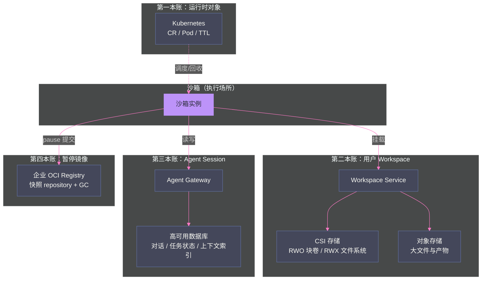

# 13 Agent 状态与存储——六类状态的正确拆分

**摘要：**

沙箱平台跑通之后，最容易被低估的生产化问题是**状态**：Agent 运行过程中产生的大量"数据"（进程内存、可写层、工作目录、Agent 自家库、会话、大制品）应该由谁存储、活多久、放哪里？素材 Phase5-07/12 与 Phase7-01 的调研给出了本专栏最重要的一个架构结论：**Agent 状态必须按"寿命与权威"拆分，任何"一把梭"的存储方案都会在规模化时崩塌**。文章首先给出六类状态的全景（进程内存/沙箱可写层/工作目录/Agent 自家库/会话权威/大制品——寿命从毫秒到永久）；然后深入"四本账"模型（运行时对象归 Kubernetes+TTL、用户 Workspace 归平台 Workspace Service+CSI、Agent Session 归 Agent Gateway/DB、暂停镜像归企业 Registry）——并解释为什么"pause/resume 与快照：同一个状态名下面是不同机器"（rootfs 快照 ≠ 内存 checkpoint ≠ 会话恢复）；随后给出每类状态的存储选型（RWO 块卷适合单实例工作目录、RWX 文件系统适合同一 Agent 多实例共享、对象存储适合大文件与产物——Ceph 三件套的完整对照）；再划清沙箱集群的职责边界（必须承担/可以承担/绝不该承担）；最后给出素材的下一阶段验证清单（P0 五项：Pod 删除后状态保留、Pod 不存在时 Workspace 可访问、多实例共享、会话跨实例路由、子沙箱回收）。核心认知：**状态设计的本质是"给每类数据找到正确的寿命与权威归属"——把状态放错地方（如把会话存进沙箱可写层），等于把"架构决策"推迟成"事故决策"**。

---

## 第 1 章 状态的本质：六类状态与寿命

### 1.1 六类状态全景

素材 Phase5-12 把 Agent 运行中涉及的状态归为六类，每类的"寿命"与"权威"完全不同：

| # | 状态 | 内容 | 典型寿命 | 权威归属 |
| :--- | :--- | :--- | :--- | :--- |
| **1** | 进程内存 | 模型上下文、运行中变量 | 毫秒-分钟（随进程） | 无（不持久化） |
| **2** | 沙箱可写层 | 容器写层（临时文件/安装的包） | 分钟-小时（随沙箱） | 沙箱（随删随走） |
| **3** | 工作目录 | 用户代码、任务中间产物 | 小时-天（随任务） | Workspace 服务 |
| **4** | Agent 自家库 | Agent 配置、长期记忆、插件索引 | 天-月（跨会话） | Agent 平台 |
| **5** | 会话权威 | 对话记录、任务状态、上下文索引 | 天-月（跨沙箱） | Agent Gateway/DB |
| **6** | 大制品 | 数据集、模型文件、输出产物 | 月-永久 | 对象存储 |

**六类状态的三个特征**：

**特征一：寿命跨度巨大**（毫秒到永久）——**"统一存储"在寿命维度上不可能**（永久数据放沙箱可写层 = 沙箱删除即丢失；临时数据放对象存储 = 存储成本爆炸）。

**特征二：权威各不相同**——每类状态有一个"权威所有者"（谁负责它的读写与一致），**权威与物理位置分离是常态**（会话权威在 DB，但会话的"临时视图"在沙箱内）。

**特征三：最容易混淆的是 3/4/5**——工作目录（任务产物）、Agent 库（Agent 自己的）、会话（对话与任务状态）——**三者的寿命与权威都不同，混在一起是状态事故的头号根源**。

### 1.2 状态的访问模式：读写频率与一致性需求

除"寿命 × 权威"外，第三个分组维度是**访问模式**——六类状态的读写特征差异巨大：

| 状态 | 读写频率 | 一致性需求 | 访问路径 |
| :--- | :--- | :--- | :--- |
| 进程内存 | 极高（每 token 推理） | 严格（进程内） | 进程本地 |
| 沙箱可写层 | 高（包安装/临时文件） | 宽松（丢了无所谓） | 沙箱本地 |
| 工作目录 | 中（任务读写） | 中（任务内一致） | CSI 挂载 |
| Agent 自家库 | 低（启动/记忆加载） | 高（跨会话一致） | PVC/DB |
| 会话权威 | 中高（每次对话读写） | 严格（对话不丢不乱） | DB 事务 |
| 大制品 | 极低（写入一次、读 N 次） | 宽松（不可变为主） | 对象存储 |

**访问模式对选型的影响**：**"高频 + 严格一致"的状态必须靠近计算**（进程内存/会话 DB），**"低频 + 宽松"的状态可以远离**（大制品归档）——**把高频状态放远端存储（如会话走对象存储）是性能事故的根源；把低频状态放本地（如大制品进可写层）是容量事故的根源**。

### 1.3 状态的演进：从单体到四本账的必然

状态拆分不是"理论洁癖"——它是平台演进的必然（素材的实践轨迹）：

```
阶段一（PoC）：状态全在沙箱里
  - 会话/文件/产物都在沙箱可写层
  - 沙箱一删，一切归零 → "能跑"但"什么也留不下"

阶段二（测试集群）：状态开始外置
  - Workspace 独立（挂载卷）
  - 会话进 Agent 平台（Gateway/DB）
  - 快照进 Registry → "四本账"的雏形

阶段三（生产）：状态治理
  - TTL/配额/GC/审计覆盖所有账本
  - 一致性需求显式化 → 四本账的完整形态
```

**演进动因**：**每个阶段都是上一个阶段的"丢数据事故"推动的**——PoC 丢一次会话、集群丢一次产物，就催生了外置与治理。**"先跑通再拆分"是合理的工程顺序，但"拆分"是必然终点——不要在 PoC 的"全在沙箱"里待太久**。

### 1.4 为什么必须拆分：单一存储的失败模式

"把所有状态放一个地方"的失败模式（素材推演 + 业界教训）：

| 单一存储方案 | 失败模式 |
| :--- | :--- |
| **全放沙箱可写层** | 沙箱删除 → 会话/产物全丢；沙箱重建 → 状态不可恢复 |
| **全放工作目录** | 会话状态（对话）不是文件——强行文件化导致语义丢失 |
| **全放对象存储** | 每次读写走网络——性能灾难；临时数据永久化——成本灾难 |
| **全放数据库** | 大制品（GB 级）进 DB——DB 爆炸；沙箱内高频小写——DB 成为瓶颈 |

**拆分的判断标准**：**"寿命 × 权威 × 访问模式"三维分组**——寿命相近、权威相同、访问模式相似的数据放一起，否则拆开。**素材的"四本账"（第 2 章）就是按这个标准对六类状态做的第一层归并**。

---

## 第 2 章 四本账模型

### 2.1 四本账详解

素材 Phase5-07 的"状态四本账"——六类状态归并为四本账（各自的账本、存储、寿命）：

| 账本 | 包含状态 | 存储 | 寿命 | 权威 |
| :--- | :--- | :--- | :--- | :--- |
| **一：运行时对象** | 沙箱 CR/Pod/容器/IP/TTL/RuntimeClass | Kubernetes + TTL 调度 | 分钟-小时 | 沙箱平台（Controller） |
| **二：用户 Workspace** | 工作目录、输入文件、产物 | 平台 Workspace Service + CSI（RWO/RWX） | 小时-天 | Workspace 服务 |
| **三：Agent Session** | 对话、任务状态、上下文索引 | Agent Gateway + 高可用 DB | 天-月 | Agent 平台 |
| **四：暂停镜像** | rootfs 快照（pause/resume 的产物） | 企业 OCI Registry | 天-月 | 平台（快照服务） |

**四本账的划分逻辑**：**"谁拥有、活多久、什么形态"三个维度各归一本**——K8s 对象归 K8s（平台管）、文件类归 Workspace（服务管）、对话类归 Session（Agent 平台管）、镜像类归 Registry（镜像供应链管）。

### 2.2 pause 到底保存了什么：rootfs 语义的权威澄清

四本账中"暂停镜像"最容易误解——素材的原话结论：**"OpenSandbox pause 保存的是容器 rootfs 的 OCI 镜像，不是内存、不是对话、不是用户网盘"**。

| 用户以为的 pause | 实际的 pause |
| :--- | :--- |
| 虚拟机休眠（内存冻结） | rootfs 提交为 OCI 镜像 |
| resume 后会话继续 | resume 后**新 Pod + 新 execd**，进程/会话不恢复 |
| 网盘文件跟着走 | 网盘是 Workspace 的账（第二本），**不在快照里** |
| 打开的连接保持 | 连接全部断开 |

**"同一个状态名下面是不同机器"**（素材交付物-01 原话）——**产品语义与实现语义的落差是快照功能最大的产品化风险**：用户按"休眠/唤醒"理解 pause/resume，实现是"环境重建"——**文档与 UI 必须按"环境恢复"措辞，否则投诉与信任危机是必然的**（[[平台与协议/09 OpenSandbox 编排面——BatchSandbox、WarmPool 与快照|第 09 篇]] 4.1 节）。

### 2.3 快照与 Workspace 的关系：第四本账与第二本账的边界

快照（第四本账）与 Workspace（第二本账）都包含"文件"，边界容易混淆：

| 维度 | 快照（rootfs 镜像） | Workspace（工作目录） |
| :--- | :--- | :--- |
| **内容** | 整个 rootfs（系统+依赖+已装包） | 用户文件/代码/产物（不含系统） |
| **恢复** | 重建整个环境 | 挂载即用 |
| **成本** | 贵（完整镜像） | 便宜（按数据量） |
| **生命周期** | 显式快照操作 | 随任务（TTL/归档） |
| **典型用途** | 环境模板沉淀 | 日常任务工作区 |

**边界判断**：**"环境"归快照，"数据"归 Workspace**——装好的依赖、系统的状态是"环境"（快照）；用户代码、任务产物是"数据"（Workspace）。**实践中两者互补**：快照提供"环境重建"（省去重新装依赖），Workspace 提供"数据连续"（任务跨环境不丢文件）——**"快照 + Workspace"组合是环境与数据双恢复的完整方案**。

### 2.4 四本账的实施架构

把四本账落成架构图（素材 Phase7-01 会议结论 + 交付物-周会的综合）：



**架构的三个要点**：
1. **沙箱只挂三根线**：Workspace（文件）、Gateway（会话）、Registry（快照）——**沙箱是"消费方"，不是"持有方"**；
2. **四本账各自独立演进**：K8s 升级不影响 Workspace、DB 扩容不影响 Registry——**账本间无硬耦合**；
3. **沙箱可任意替换**：四本账外置后，"换一个沙箱实例"（重建/迁移/故障恢复）不丢任何数据——**状态外置是沙箱可替换性的前提**。

### 2.5 为什么"会话续接"必须靠第三本账

一个关键推论：**用户要的"会话续接"不能靠快照（第四本账），只能靠 Session（第三本账）+ Workspace（第二本账）的组合**：

```
会话续接的正确路径：
1. 沙箱 A 崩溃/删除
2. Session 账本：对话/任务状态/上下文索引完好（在 Agent Gateway/DB）
3. Workspace 账本：工作目录/产物完好（在 Workspace Service）
4. 创建沙箱 B（或从快照恢复环境）
5. Agent 在沙箱 B 中重新加载 Session + 挂载 Workspace
6. 用户感知：会话连续（对话在、文件在、环境重建）

错误路径（只靠快照）：
1. 沙箱 A pause → rootfs 镜像
2. resume → 新环境，但对话/任务状态不在（rootfs 没有对话）
3. 用户：会话没了 → 投诉
```

**"状态外置"（Session/Workspace 独立于沙箱）是会话连续性的唯一可靠实现**——**快照负责"环境"、Session 负责"对话"、Workspace 负责"文件"——三本账各司其职，缺一不可**。

---

## 第 3 章 各状态的存储选型

### 3.1 六类状态的存储映射

素材 Phase5-12 与交付物-周会（Phase7-01）的存储需求与候选实现：

| 状态 | 候选存储 | 推荐 |
| :--- | :--- | :--- |
| 进程内存 | 无（不持久化） | — |
| 沙箱可写层 | 沙箱本地（Pod ephemeral） | 随沙箱，不治理 |
| 工作目录 | CSI RWO 块卷（单实例）/ RWX（多实例） | **Workspace Service 管理** |
| Agent 自家库 | 独立 PVC / 对象 / 数据库 | 按 Agent 适配 |
| 会话权威 | 高可用数据库 / Memory 服务 | **Session 服务独立部署** |
| 大制品 | S3 兼容对象存储 / 文件服务 | 对象存储 |

### 3.2 工作目录：RWO vs RWX

工作目录是"文件类状态"的核心，RWO/RWX 的选择取决于访问模式：

| 维度 | RWO（块卷） | RWX（文件系统） |
| :--- | :--- | :--- |
| **挂载方式** | 单节点独占 | 多节点共享 |
| **适用** | 单实例 Agent 的工作目录 | 同一 Agent 多实例共享目录 |
| **性能** | 块设备直通（最佳） | 网络文件系统（有损耗） |
| **一致性** | 天然一致（单挂载） | 需要锁/协调（应用问题） |
| **Ceph 实现** | Ceph RBD | CephFS |

**"单实例用 RWO、多实例共享用 RWX"是基本盘**——但素材给出重要提醒：**"多实例共享 Workspace 用 RWX 或对象存储都可以，但 Session 粘滞和文件锁是应用问题"**——存储解决了"共享"的物理层，**"两个实例同时写一个文件"的应用层协调（锁/合并/冲突）是 Agent 平台自己的问题**（[[生产化/14 沙箱安全体系|第 14 篇]] 的多租户与此同理：存储管隔离，应用管协作）。

### 3.3 大制品：对象存储的定位

大制品（数据集、模型文件、输出产物）的选型原则：

| 特征 | 对象存储（S3 兼容） | 文件系统（RWX） |
| :--- | :--- | :--- |
| 规模 | 无限扩展（EB 级） | 受集群存储限制 |
| 访问 | HTTP API（无 POSIX 语义） | POSIX（可直接读写） |
| 适用 | 大文件、产物、打包后的 Profile | 需要"目录即工作区"的场景 |
| 不适用 | **不天然等同 POSIX 工作目录**（素材原话） | 超大文件、冷数据 |

**"对象存储不天然等同 POSIX 工作目录"**是关键认知——很多团队把对象存储当"无限磁盘"用，结果应用到处是"下载→改→上传"的别扭代码。**正确定位：工作目录用文件系统（CSI），产物归档用对象存储——"工作"与"归档"分开**。

### 3.4 Browser Profile 的特殊存储

GUI Agent（浏览器自动化）的 Profile 存储是状态设计的"特例"（素材交付物-周会的 Browser Profile 方案）：

| 方案 | 内容 | 优劣 |
| :--- | :--- | :--- |
| **加密对象包** | Profile（cookie/登录态/扩展）打包加密存对象存储 | 容量友好、可归档；**任务结束销毁**（安全） |
| **CSI 目录** | Profile 作为目录挂载 | 访问直接；容量随沙箱（不隔离） |

**素材的推荐**：加密对象包 + 任务结束销毁——**因为 Profile 含登录态（高敏感），"随任务销毁"比"持久保留"更安全**（登录态是凭据的一种，[[生产化/14 沙箱安全体系|第 14 篇]] 的凭据治理同源）。**"特殊状态"的启示：状态设计的边界条件是安全敏感度——敏感状态宁可销毁不可久留**。

### 3.5 Ceph 三件套的完整对照

素材的 Ceph 选型（RWO 块卷 / RWX 文件系统 / 对象存储三件套）：

| 能力 | Ceph 组件 | 用途 | 素材判断 |
| :--- | :--- | :--- | :--- |
| **RWO 块卷** | RBD | 单实例工作目录 | ✅ 适合单实例挂载 |
| **RWX 文件系统** | CephFS | 多实例共享目录 | ✅ 适合多实例共享 |
| **对象存储** | RGW（S3 兼容） | 大文件、产物、Profile 打包 | ✅ 适合大文件与归档 |

**"一套 Ceph 三个语义"的价值**：存储层统一（一套集群），语义层分层（块/文件/对象各归其位）——**容量与运维统一，访问模式分离**。**选型提醒**：如果已有对象存储（如自建 MinIO/云 OSS），不必强上 Ceph RGW——**"对象存储已有就用已有的，块/文件按需补"比"全家桶"更务实**。

---

## 第 4 章 沙箱集群的职责边界

### 4.1 必须承担

沙箱集群**必须**承担的状态（它天然是最佳归属）：

| 状态 | 理由 |
| :--- | :--- |
| **运行时对象**（CR/Pod/容器） | 沙箱平台就是 K8s 的封装——CR/Pod 是平台的事实层 |
| **沙箱可写层** | 随沙箱创建/销毁的临时写层——生命周期与沙箱绑定 |
| **短期工作目录**（可选） | 任务级产物——RWO 挂载即可（不必须外置） |

### 4.2 可以承担

沙箱集群**可以**承担但**要设计**的状态：

| 状态 | 承担方式 | 边界 |
| :--- | :--- | :--- |
| **工作目录（长期）** | Workspace Service + CSI | **Pod 不存在时也要可访问**（P0 验证项） |
| **Agent 自家库** | 独立 PVC（按 Agent 挂载） | 换沙箱实例时重新挂载 |

**"可以承担"的判别标准**：**状态能否在"沙箱实例消失"后存活**——能（存储独立于 Pod）就可以承担，不能（绑在 Pod 上）就必须外置。

### 4.3 多实例共享的难点：存储之外的应用问题

素材明确提醒：**"多实例共享 Workspace 用 RWX 或对象存储都可以，但 Session 粘滞和文件锁是应用问题"**——存储解决了"物理共享"，应用层还有三个难点：

| 难点 | 内容 | 解法方向 |
| :--- | :--- | :--- |
| **Session 粘滞** | 同一会话的路由必须连续（第 5 个 P0 验证项） | 会话级路由表（Gateway 维护） |
| **文件锁** | 两实例同时写同一文件 | 应用层锁/版本合并（Agent 适配） |
| **并发冲突** | 多实例的中间状态互相覆盖 | 工作区版本化（Git 类语义） |

**"存储管物理、应用管协作"的边界**：平台提供"共享的能力"（RWX/对象），**"共享的正确性"（锁/粘滞/冲突）是 Agent 平台与 Agent 适配的责任**——**把并发正确性推给存储层（幻想"存储自动解决"）是状态设计的常见误判**。

### 4.4 状态职责矩阵总表

把第 4 章的三个"承担"整合为一张职责矩阵（可直接用于架构评审）：

| 状态 | 沙箱集群职责 | 外部系统职责 | 决策依据 |
| :--- | :--- | :--- | :--- |
| 运行时对象 | **必须承担**（事实层） | — | 平台即 K8s 封装 |
| 可写层 | **必须承担**（随沙箱） | — | 生命周期绑定 |
| 短期工作目录 | 可以承担（RWO 挂载） | — | 任务级即可 |
| 长期工作目录 | 提供挂载能力 | **Workspace Service 管生命周期** | 独立于 Pod（P0-2） |
| Agent 自家库 | 提供 PVC | Agent 平台管数据 | 跨实例（P0-1） |
| 会话权威 | **绝不该承担** | Agent Gateway/DB | 非文件、跨沙箱（P0-4） |
| 大制品 | **绝不该承担** | 对象存储 | 容量与寿命（EB 级） |
| Browser Profile | 提供运行载体 | 加密对象包 + 任务销毁 | 敏感度（3.4 节） |

**矩阵的使用**：任何"把状态放沙箱"的架构提议，先查矩阵——**"绝不该承担"栏的状态进沙箱 = 架构评审直接打回**。

### 4.5 绝不该承担

沙箱集群**绝不该**承担的状态（素材的明确结论）：

| 状态 | 不该承担的理由 | 正确归属 |
| :--- | :--- | :--- |
| **会话权威** | 会话是"对话+任务状态"——不是文件，沙箱管不了语义；且会话必须跨沙箱（沙箱只是执行载体） | Agent Gateway/DB |
| **大制品归档** | 沙箱存储容量有限（imagefs 400GiB 量级）——数据集/模型是 EB 级问题 | 对象存储 |
| **用户主存储** | "用户网盘"是产品级资产——不能随沙箱生命周期起伏 | Workspace 服务 |

**边界判断的一句话**：**"沙箱是执行场所，不是数据家园"**——所有"用户会在意它消失"的数据，都不该只存在于沙箱里。

**边界判断的最终检验**：问自己一个问题——"**如果这个沙箱下一秒被删除，用户会损失什么？**"——损失为"环境与临时文件"是正常的（可重建）；损失为"对话/产物/配置"就是状态设计错了（本应外置）。**这个问题的答案，就是状态设计的验收标准**。

---

## 第 5 章 状态的生命周期管理

### 5.1 TTL 与回收：第一本账的治理

运行时对象（第一本账）的生命周期治理：

| 机制 | 内容 | 素材实践 |
| :--- | :--- | :--- |
| **TTL** | 沙箱到期自动回收 | TTL 过期验证（脚本 11） |
| **配额** | 租户/用户的沙箱上限 | Gate 6 验收 |
| **回收验证** | 删除后残留检查 | "残留 0"纪律（三层查询） |
| **僵尸防护** | 保活进程的 TTL 兜底 | 业务探活 + TTL 双保险 |

**"残留 0"与 TTL 的关系**：TTL 防"忘记删"，残留检查防"删不干净"——**一个是预防，一个是检测，两者都需要**（[[工程实践/10 Agent 沙箱部署实战|第 10 篇]] 的运维节奏）。

### 5.2 快照的容量治理：第四本账的账单

暂停镜像（第四本账）的容量问题（GAP-004 的完整影响）：

| 问题 | 表现 | 治理 |
| :--- | :--- | :--- |
| **blob 不回收** | 删除 Snapshot 不回收 Registry blob | 自建 GC 任务（对比 Snapshot 记录与 Registry blob） |
| **每快照一份 rootfs** | 快照 = 完整镜像（2.6GB 级） | 快照数量配额 + 寿命限制 |
| **多版本膨胀** | 反复 pause 产生多版本 | 每沙箱一份（OSEP-0008 约束）+ 覆盖策略 |

**快照容量公式**（第 12 篇的延伸）：**快照存储 = 快照数 × rootfs 大小**——2.6GB 镜像 × 100 快照 = 260GB——**"快照是贵操作"必须在配额与寿命上显式表达**。

### 5.3 状态一致性的边界：最终一致还是强一致

四本账分属不同系统，跨账本的一致性需求必须明确定义：

| 跨账本场景 | 一致性需求 | 实现 |
| :--- | :--- | :--- |
| 沙箱删除 + Workspace 保留 | **最终一致**（删除异步，Workspace 不随删） | 解耦生命周期（P0 验证项 2） |
| Session 更新 + 沙箱执行 | **最终一致**（执行结果异步回写 Session） | 事件流（Agent 适配） |
| 快照创建 + Registry 推送 | **强一致**（快照记录必须对应真实镜像） | 事务（先推送后记录） |
| 配额扣减 + 沙箱创建 | 强一致（超配额不能创建） | 平台控制面事务 |

**"不是所有状态都要强一致"**是状态设计的成熟标志——**运行态可以最终一致（沙箱删了 Workspace 慢慢归档），账务态必须强一致（配额/快照记录）**——**把一致性需求写进设计（而非默认最强），是避免过度工程与事故的双重保障**。

### 5.4 删除证据链：所有账本的审计底线

状态删除的审计（素材 Phase5-10 的"对象删除证据链"盲区）：

| 证据 | 内容 | 缺失的后果 |
| :--- | :--- | :--- |
| **删除前** | Event/request_id/sandbox_id 打到外部日志 | 删错了无法追溯 |
| **删除中** | 删除请求的完整记录 | 无法回答"谁删的、为什么删" |
| **删除后** | 残留检查结果归档 | 无法证明"删干净了" |

**"删除证据链"与 [[平台与协议/07 OpenSandbox 架构深度解析|第 07 篇]] 的 202 语义是同一纪律的两面**：**HTTP 码不代表终态，删除完成要有证据**——**所有账本的删除都要有"证据链"意识**（Diagnostics API 未实现（GAP-001）时，外部日志是唯一路径）。

---

## 第 6 章 下一阶段验证清单

### 6.1 P0 五项

素材 Phase7-01 会议结论的下一阶段验证清单（P0 五项）——**状态设计是否正确，用这五项实验验证**：

| P0 验证项 | 内容 | 验证的状态设计 |
| :--- | :--- | :--- |
| **1. Pod 删除/重建后内部状态保留** | Agent 进程消失后，其配置/记忆/索引是否还在 | Agent 自家库（第四类）的外置性 |
| **2. Pod 不存在时 Workspace 可访问** | 沙箱删了，工作目录还能 list/upload/download | Workspace（第二本账）的独立性 |
| **3. 同一 Agent 两个实例共享 Workspace** | 双实例并发挂载同一目录的行为 | RWX 选型 + 文件锁的应用问题 |
| **4. 同一会话跨实例路由连续** | 会话在沙箱 A 开始、沙箱 B 继续 | Session（第三本账）的路由粘滞 |
| **5. 主 Agent 经 MCP 创建子沙箱并回收** | 子沙箱链路的完整闭环 | 子沙箱的生命周期（第 11 篇） |

**五项验证的共性**：**全部验证"状态是否独立于沙箱实例"**——这是四本账模型的实验检验。**任何一项不过，对应的状态设计就要回炉**。

### 6.2 验证的工程安排

五项 P0 验证的实施安排（素材 Phase7 的后续计划推演）：

| 验证项 | 前置条件 | 验证方法 |
| :--- | :--- | :--- |
| P0-1（状态保留） | Agent 库外置完成 | 建 Agent → 删 Pod → 重建 → 查状态 |
| P0-2（Workspace 独立） | Workspace Service 就绪 | 删沙箱 → list/upload/download Workspace |
| P0-3（多实例共享） | RWX 存储就绪 | 双实例同时挂载 → 并发读写观察 |
| P0-4（会话路由） | Gateway 会话表就绪 | 会话 A 沙箱 → 切 B 沙箱 → 验证连续 |
| P0-5（子沙箱回收） | MCP 链路就绪 | 父 Agent 建子沙箱 → 执行 → 回收 → 残留 0 |

**验证的编排原则**：**五项有依赖序**（1/2 是基础，3/4 依赖 1/2，5 相对独立）——**按依赖序分批验证，每批完成后更新状态设计文档**（验证结论回写四本账模型——"验证不是确认设计，而是修正设计"）。

### 6.3 P1 项

| P1 验证项 | 内容 |
| :--- | :--- |
| Agent 异常退出后的恢复语义 | 崩溃后状态的一致性 |
| Snapshot 能恢复什么、不能恢复什么 | 快照边界的用户可见化 |
| DomeOS 可观测注入方式 | 观测体系的接入 |
| Agent 协议适配 | 第 5 层的扩展 |

**P0/P1 的排序逻辑**：P0 是"状态设计正确性"（不过则架构回炉），P1 是"体验与运维完善"（过则锦上添花）——**先正确，再完善**。

---

## 第 7 章 总结与下一篇导读

### 7.1 本文核心要点

1. **六类状态**：进程内存/可写层/工作目录/Agent 库/会话权威/大制品——寿命从毫秒到永久
2. **四本账**：运行时对象（K8s+TTL）/Workspace（CSI）/Session（Gateway+DB）/暂停镜像（Registry）——"谁拥有、活多久、什么形态"三维归并
3. **pause 的真相**：rootfs OCI 镜像，不是内存/对话/网盘——"同一个状态名下面是不同机器"
4. **会话续接的正确路径**：Session + Workspace 外置 + 环境重建——不靠快照
5. **存储选型**：RWO（单实例）/RWX（多实例）/对象存储（大制品）——"对象存储不天然等同 POSIX 工作目录"
6. **职责边界**：必须承担（运行时对象）/可以承担（外置工作目录）/绝不该承担（会话权威/大制品）——"沙箱是执行场所，不是数据家园"
7. **验证清单**：P0 五项验证"状态独立于沙箱实例"——四本账模型的实验检验
8. **一致性需求显式化**：运行态最终一致、账务态强一致——"不是所有状态都要强一致"是成熟标志

### 7.2 术语速查

| 术语 | 口径 |
| :--- | :--- |
| **四本账** | 运行时对象/Workspace/Session/暂停镜像四类状态账本 |
| **Workspace Service** | 管理用户工作目录的服务（独立于沙箱） |
| **会话权威** | 对话与任务状态的权威存储（Agent Gateway/DB） |
| **RWO / RWX** | 块卷单节点挂载 / 文件系统多节点共享 |
| **GAP-004** | 删除 Snapshot 不回收 Registry blob（快照容量治理） |
| **状态外置** | 状态存储独立于沙箱实例（可跨沙箱存活） |

### 7.3 思考题

1. **四本账的边界案例**：一个 Agent 任务生成了 50GB 的中间数据，任务完成后要保留 30 天供后续分析。这属于哪本账？提示：考虑"数据量（大制品）"与"访问方式（后续任务要用 = 工作目录）"的冲突——50GB 挂 RWO 卷占容量，放对象存储丢 POSIX——你的取舍？

2. **快照与 Workspace 的组合**：如果平台提供"暂停"（rootfs 快照）与"会话续接"（Session+Workspace）两个功能，产品上怎么向用户解释区别？提示：参考 2.3 节的"环境 vs 数据"框架——"暂停恢复环境"与"续接对话"是两种不同的用户心智。

3. **一致性需求的判断**：素材建议"运行态最终一致、账务态强一致"。如果快照记录与 Registry blob 出现不一致（记录在、blob 被 GC 误删），你的恢复策略是什么？提示：考虑"记录为准回滚 blob"与"blob 为准修正记录"两条路径的成本差异。

### 7.4 下一篇导读

状态管好了，下一个生产化主题是**安全**：[[生产化/14 沙箱安全体系——三层防护、短期凭据与多租户|14 沙箱安全体系]] 将给出安全的总框架——隔离/资源约束/行为审计三层防护、平台总 Key 被打穿的教训与短期凭据三张身份票（SSO/控制面票/拉镜像票）、网络策略真伪实验、多租户三道门禁——**状态篇回答"数据归谁管"，安全篇回答"谁有权碰数据"**。

> [!info] 专栏导航
> 本文是 [[../00 专栏导览|Agent 沙箱技术专栏]] 的第 13 篇，生产化开篇。14 篇安全、15 篇盲区与共识。专栏收官三篇。

---

## 参考文献

1. 素材调研. Phase5-07 状态四本账、Phase5-12 Agent 状态与存储、Phase7-01 上午会议结论（五类状态）
2. 素材交付物. 周会汇报-2026-08-07（存储需求与候选实现）
3. Ceph 文档. RBD/CephFS/RGW. https://docs.ceph.com
4. 素材调研. Phase5-10 从测试集群到生产（删除证据链）
5. Kubernetes 文档. PersistentVolume Access Modes
6. 素材调研. Phase5-06 WarmPool 耗尽（容量与状态的关联）

---

## 修改记录

- 2026-08-15：专栏创建，本文基于素材状态四本账与存储调研整合创作

## 附录：状态设计自查清单

```
□ 六类状态都有明确归属（四本账内或账本外）
□ 无"绝不该承担"状态进入沙箱（职责矩阵）
□ pause/resume 的产品文档按"环境恢复"措辞（非休眠/唤醒）
□ 会话续接路径 = Session + Workspace + 环境重建（不依赖快照）
□ 工作目录选型与访问模式匹配（单实例 RWO / 多实例 RWX）
□ 大制品走对象存储（不塞工作目录/可写层）
□ Browser Profile 加密 + 任务销毁
□ 一致性需求显式化（运行态最终一致 / 账务态强一致）
□ 快照容量公式进入容量模型（快照数 × rootfs 大小）
□ 删除证据链覆盖所有账本
□ P0 五项验证已排期
```
