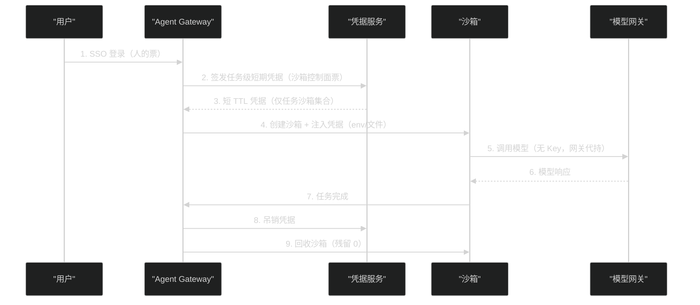

# 14 沙箱安全体系——三层防护、短期凭据与多租户

**摘要：**

[[../01 Agent 沙箱全景——威胁模型、六层技术栈与逻辑演进|第 01 篇]] 建立了攻击链模型（代码执行→提权逃逸→数据窃取→网络外传），[[生产化/13 Agent 状态与存储——六类状态的正确拆分|第 13 篇]] 解决了数据归属。本文给出安全的总框架——**三层防护**（隔离/资源约束/行为审计，OpenSandbox 官方安全模型）与两个生产化核心战场：**凭据治理**与**多租户**。文章首先把三层防护映射到攻击链的每一步（隔离防逃逸、约束防资源滥用、审计防"事后无痕"），并给出逃逸路径清单（内核漏洞、CAP_SYS_ADMIN、共享 namespace、挂载泄漏、VMM 漏洞）与纵深防御原则；然后完整复盘素材中最典型的凭据事故——**平台总 Key 被 MCP 打穿**（父 Agent 枚举全部沙箱）——并给出短期凭据的设计（按租户/用户/任务签发、TTL 短、自动轮换）与"三张身份票"模型（人的 SSO 票、沙箱控制面票、工作负载拉镜像票），以及模型供应商 Key 走模型网关（Agent 无感知）的治理方案；随后展开网络策略真伪实验与多租户三道门禁（控制面授权/数据面网络/调度与配额存储）；最后给出安全验收清单。核心认知：**Agent 沙箱安全的第一原则是"凭据的粒度就是攻击面的粒度"——共享凭据等于共享边界；第二原则是"审计不是事后补救，而是攻击链第 3/4 步的最早信号"**。

---

## 第 1 章 安全体系的总框架

### 1.1 三层防护

OpenSandbox 官方安全模型（InfoQ 分享）把沙箱安全分为三层，素材的生产化调研在此基础上补全了落地细节：

| 层 | 内容 | 防什么 | 素材落地 |
| :--- | :--- | :--- | :--- |
| **第一层：隔离** | 不可信负载与宿主机的信任边界 | 攻击链第 2 步（提权/逃逸） | 四档光谱（[[隔离原语/03 隔离边界的光谱|第 03 篇]]）+ 隔离证据链 |
| **第二层：资源约束** | 沙箱的资源爆炸半径 | 资源耗尽攻击、炸弹负载 | cgroups/Pod limits/配额/egress 限流 |
| **第三层：行为审计** | 沙箱内行为的可追溯 | 攻击链第 3/4 步（"事后无痕"） | execd 日志、命令记录、外部证据链 |

**三层的关系**：**隔离决定"能不能逃"，约束决定"逃了能拿多少"，审计决定"拿了能不能不被发现"**——三层是"叠加防御"（任何一层被突破，其他层仍提供保护），也是"信号链"（审计层最先发现可疑行为，隔离层最后兜底）。

### 1.2 与攻击链的映射

```
攻击链四步 × 三层防护：

第 1 步 代码执行 —— 不可防（Agent 的职能）→ 靠"执行后果控制"（约束+审计）
第 2 步 提权/逃逸 —— 第一层（隔离）主防 + 第二层（约束）辅助
第 3 步 数据窃取 —— 凭据治理（短期凭据）+ 网络策略（内网白名单）
第 4 步 网络外传 —— egress 管控（第三层审计辅助发现）
```

**"不可防的第一步"的应对**：既然代码执行必然发生，安全设计的目标从"防止执行"转为"**控制执行的后果**"——**这是 Agent 沙箱与传统 WAF 类安全（防输入）的本质区别：沙箱安全是"后果控制"型安全**。

### 1.3 安全评审的输入清单

安全体系不是"写出来"的，是"评审出来"的——每次安全评审需要以下输入（素材实践）：

| 输入 | 内容 | 缺失的后果 |
| :--- | :--- | :--- |
| **威胁模型** | 攻击链四步 + 注入杀伤链（[[../01 Agent 沙箱全景|第 01 篇]]） | 防御无的放矢 |
| **隔离档位声明** | 每类负载的档位与逃逸后果 | 档位错配无人发现 |
| **凭据清单** | 所有凭据的类型/粒度/TTL/存储位置 | 凭据失控无人知道 |
| **网络策略** | 入站/出站规则与真伪验证结果 | 策略失效无人察觉 |
| **审计覆盖** | 审计粒度/数据源/告警规则 | "事后无痕"成为默认 |
| **历史事故** | 平台与生态的事故台账 | 重复踩坑 |

**"安全评审不是一次，而是每次变更"**——镜像/运行时/凭据/网络任何变更都触发评审更新——**安全文档的生命周期与平台的生命周期同步**。

### 1.4 纵深防御的两个原则

**原则一：每层独立失效**。任何一层的失效不波及其他层——**隔离档位降级（误配 runc）时，凭据治理与审计仍然有效**（素材"四层一致性"（[[隔离原语/02 Linux 隔离原语|第 02 篇]]）之外的兜底逻辑）。

**原则二：信任最小化**。任何组件默认"不可信"——execd 不信任沙箱内进程（API 鉴权）、沙箱不信任凭据（短期）、平台不信任镜像（供应链验证）——**"默认不可信"是纵深防御的默认值**。

---

## 第 2 章 第一层：隔离

### 2.1 隔离档位与威胁等级的匹配

[[隔离原语/03 隔离边界的光谱——从共享内核到 MicroVM 的四档技术路线|第 03 篇]] 的四档光谱是"第一层"的选择框架，此处给出安全视角的补充：**档位选择的风险决策**——

| 档位 | 逃逸后果 | 适用威胁等级 | 素材实践 |
| :--- | :--- | :--- | :--- |
| runc | 宿主机（原语组合） | L0-L1（可信/半可信） | 测试集群 runc Profile |
| gVisor | Sentry 上下文（55 syscall 白名单） | L2（不可信代码） | gVisor Profile 灰度 |
| Kata/Firecracker | 需 hypervisor 漏洞 | L3（高对抗） | Kata Profile 门禁 |

**风险决策的关键**：**"逃逸后果"必须写进容量与运维文档**——每个档位的逃逸半径是安全评审的输入，不是技术细节。

### 2.2 逃逸路径清单与防御

素材与业界案例的逃逸路径汇总（防御手段标注）：

| 逃逸路径 | 机制 | 防御 |
| :--- | :--- | :--- |
| **内核漏洞** | 容器进程利用宿主内核漏洞 | gVisor/Kata（syscall 不落内核/独立内核） |
| **CAP_SYS_ADMIN 滥用** | 容器内特权能力操作宿主机资源 | capabilities 最小化 + user namespace |
| **共享 namespace** | hostNetwork/hostPID 等共享配置 | 拒绝共享 namespace（准入控制） |
| **挂载泄漏** | 挂载宿主机目录（docker.sock 等） | 挂载白名单 + 只读 |
| **特权容器** | `--privileged` 全能力 | 禁止特权容器（准入控制） |
| **VMM 漏洞** | QEMU/设备模拟漏洞 | 极简设备模型（[[隔离原语/05 VMM 解剖|第 05 篇]]） |
| **seccomp 逃逸** | 白名单内 syscall 的漏洞利用 | 持续跟踪内核安全公告 |

**防御的层次**：**配置防御**（caps/seccomp/挂载——靠正确配置）、**架构防御**（gVisor/Kata——靠边界位置）、**准入防御**（禁止特权配置——靠策略强制执行）。**三层防御都要有**：只靠配置防御的集群，一次误配就是一次逃逸。

### 2.3 参考案例：2024-2026 年的典型逃逸/隔离事故

把逃逸路径清单与真实案例对应（案例细节以公开披露为准，本专栏只取教训）：

| 案例 | 类型 | 教训 |
| :--- | :--- | :--- |
| **CVE-2024-1086（nf_tables UAF）** | 内核漏洞 + user namespace 放大 | user namespace 是"双刃剑"（[[隔离原语/02 Linux 隔离原语|第 02 篇]] 4.2 节）——无特权用户可达特权代码路径 |
| **Dirty Pipe（CVE-2022-0847）** | 内核漏洞（共享内核逃逸） | 共享内核的逃逸半径——runc 档位下内核漏洞即逃逸 |
| **runc CVE-2025 系列** | 容器运行时逃逸 | 官方推荐 user namespace 防御（[[隔离原语/02 Linux 隔离原语|第 02 篇]] 3.3 节） |
| **OpenAI/Anthropic/Meta 2026 测试逃逸** | 隔离环境配置错误 | "misconfiguration"是头号根因（[[../01 Agent 沙箱全景|第 01 篇]] 1.2 节）——**配置验证比漏洞修补更紧迫** |
| **QEMU virtio 系列 CVE** | VMM 设备模拟漏洞 | 极简设备模型的必要性（[[隔离原语/05 VMM 解剖|第 05 篇]]） |

**案例的共同教训**：**逃逸事故的三类根因——内核漏洞（架构问题，靠档位解决）、配置错误（流程问题，靠验证解决）、设备模拟漏洞（代码问题，靠减法解决）**——三类根因对应三类防御（架构/流程/代码），**只盯一类根因的安全体系是偏科的安全体系**。

### 2.4 档位的运行时选择策略

隔离档位不只是"部署时选一次"——运行时如何选择（素材"三 Profile"方案的延伸思考）：

| 策略 | 机制 | 适用 |
| :--- | :--- | :--- |
| **静态分档**（素材采用） | 三 Profile 独立域名/节点池 | 平台 0.2.x 的现状（Runtime 是 Server 级配置） |
| **按镜像分档** | 镜像标签声明档位（trusted/standard/high） | 平台支持逐沙箱选择后 |
| **按租户分档** | 租户等级决定档位（VIP 高隔离） | 多租户 SLA 分化 |
| **按任务分档** | 任务类型决定档位（评测高隔离/调试低隔离） | 成本优化 |

**"按内容动态选档"的理想形态**（按威胁等级动态评估镜像/任务来源）依赖平台能力（GAP-010 修复后），**现阶段"静态分档 + 准入控制"是务实路线**——**档位策略的演进方向是"从静态到动态"，但每一跳都要以"档位与负载的匹配验证"为前提**。

### 2.5 隔离证据链：安全声明的验证

[[隔离原语/02 Linux 隔离原语|第 02 篇]] 5.3 节的证据链方法论在安全体系的定位：**隔离的"配置声明"与"运行事实"必须持续验证**——不是部署时验一次，而是：

| 验证节奏 | 内容 |
| :--- | :--- |
| **部署时** | 五层证据（guest 内核/进程/namespace/RuntimeClass/CRI） |
| **变更时** | 运行时/镜像/节点变更后重验 |
| **周期巡检** | 抽检运行中沙箱的隔离档位（防"静默降级"） |

**"静默降级"是隔离层最大的威胁**——四层一致性断裂（[[隔离原语/02 Linux 隔离原语|第 02 篇]] 5.2 节）后沙箱悄悄跑在 runc 上，安全声明与实际隔离脱节——**周期巡检是"防静默"的唯一手段**。

---

## 第 3 章 第二层：资源约束

### 3.1 资源限制的四个层次

| 层次 | 机制 | 防什么 |
| :--- | :--- | :--- |
| **cgroup** | CPU/内存/IO/PID 限制（[[隔离原语/02 Linux 隔离原语|第 02 篇]]） | 单沙箱资源爆炸 |
| **Pod limits** | K8s requests/limits + overhead | 调度账本与运行时真实开销对齐（[[工程实践/12 沙箱性能工程|第 12 篇]] GAP-011） |
| **配额** | 租户/用户沙箱数量与资源上限 | 租户间资源挤占 |
| **网络限流** | egress rate limit / 设备层限流（Firecracker） | 带宽滥用与数据外传速率 |

**资源约束的 Agent 特殊性**：**模型生成的代码不受"常识"约束**——死循环、无限递归、大对象分配是常态而非意外（[[隔离原语/02 Linux 隔离原语|第 02 篇]] 6.1 节）——**资源约束不是"防恶意"，是"防失控"**，两者都要覆盖。

### 3.2 资源约束的验证：限制真的生效吗

资源约束与隔离一样存在"配置声明 vs 运行事实"的脱节（第 12 篇 GAP-011 的教训）——验证方法：

```bash
# 1. cgroup 层验证：沙箱进程的 cgroup 限制
cat /sys/fs/cgroup/kubepods/.../memory.max   # 期望 = Pod limits
cat /sys/fs/cgroup/kubepods/.../cpu.max      # 期望 = CPU 配额

# 2. 行为层验证：超限行为
#    内存炸弹 → 沙箱内 OOM（不拖垮节点）
#    CPU 炸弹 → CPU 占用被削顶（不占满核）
#    磁盘炸弹 → 写满被拒（不撑爆 imagefs）

# 3. 配额层验证：租户超配额 → 创建被拒
```

**"限制的验证"与"隔离的证据链"是同一纪律**——**配置了限制但没有验证过限制的集群，等于没有限制**。素材的负载基准（[[工程实践/12 沙箱性能工程|第 12 篇]]）顺带验证了资源限制（512MiB 触页、200 进程并发的行为），这是基准的"安全附加价值"。

### 3.3 资源耗尽攻击的形态

| 攻击形态 | 表现 | 防御 |
| :--- | :--- | :--- |
| **CPU 炸弹** | 死循环占满核 | CPU 限制 + 时间配额 |
| **内存炸弹** | 无限分配 | 内存限制 + OOM 策略 |
| **磁盘炸弹** | 写满可写层/挂载卷 | 磁盘配额（imagefs 预留） |
| **PID 炸弹** | fork 风暴 | pids.max |
| **带宽滥用** | 大流量外传 | egress 限流 + 白名单 |

**"配额即审计"**：资源限制的另一个价值是**行为信号**——超配额本身就是异常行为的证据（谁在疯狂 fork？谁在疯狂写盘？）——**配额日志接入审计（第三层）是"约束"与"审计"的联动点**。

---

## 第 4 章 第三层：行为审计

### 4.1 审计的粒度

行为审计的粒度选择（素材 Phase1 的 L1 授课 + 旧专栏 12 的调研）：

| 粒度 | 内容 | 成本 | 适用 |
| :--- | :--- | :--- | :--- |
| **命令级** | execd 的每条命令/文件操作 | 低（已有日志） | **必做**（Agent 场景核心） |
| **进程级** | 进程创建/退出/信号 | 中（eBPF） | 高安全场景 |
| **网络级** | 连接目标/流量方向 | 中（egress 日志） | 必做（攻击链第 4 步信号） |
| **syscall 级** | 全部系统调用 | 高（性能损耗） | 极敏感场景（配合 eBPF） |

**"命令级必做"的理由**：Agent 的行为载体是"命令"（工具调用）——**命令记录 = Agent 行为的完整日志**（做了什么、操作了什么文件、访问了什么网络）——**execd 的日志是第三层的主数据源**（[[平台与协议/08 OpenSandbox 数据面|第 08 篇]] 7.3 节）。

### 4.2 审计与性能的平衡

审计不是"全量全粒度"——平衡框架：

```
审计预算分配：
  命令级 + 网络级 → 100% 覆盖（成本可控，价值最高）
  进程级 → 按威胁等级（L2+ 开启）
  syscall 级 → 按需（采样或白名单场景）

"采样审计"的陷阱：攻击链的异常行为可能藏在样本外
  → 采样只用于"性能分析"，不用于"安全审计"
```

**"安全审计不采样"是底线**——审计是"事后取证"的依据，采样的审计等于"可能没记录"的审计（[[平台与协议/08 OpenSandbox 数据面|第 08 篇]] 的 GAP-001：Diagnostics 未实现时，外部日志证据链是兜底）。

### 4.3 审计链路的数据流

把审计从"日志"升级为"链路"（素材 GAP-001 绕行方案 + 观测体系）：

```
数据流：沙箱（execd/egress 日志）
  → 采集（Alloy 类代理，沙箱外）
  → 存储（Loki 类日志系统，多租户）
  → 分析（告警规则：拒绝突增/敏感文件访问）
  → 取证（检索：sandbox_id + request_id 关联）
```

**审计链路的三个设计点**：

| 设计点 | 内容 | 反例 |
| :--- | :--- | :--- |
| **采集在沙箱外** | 日志外发（沙箱内进程不可篡改） | 日志存在沙箱内（被攻破即被清洗） |
| **多租户隔离** | 日志按租户分权（租户只能查自己的） | 全局日志（租户 A 查租户 B 的痕迹） |
| **关联键** | sandbox_id/request_id 贯穿（[[工程实践/10 Agent 沙箱部署实战|第 10 篇]] 3.5 节） | 无关联键（取证靠猜） |

**"采集在沙箱外"是审计可信的前提**——**审计数据如果可被攻击者清洗，审计就没有意义**——**沙箱内的日志只能作为"参考"，沙箱外的采集才是"证据"**。

### 4.4 命令即数据：审计与可观测的一体两面

[[平台与协议/08 OpenSandbox 数据面|第 08 篇]] 7.3 节的"命令即数据"在安全体系的完整表达：

| 观测对象 | 安全信号 | 告警 |
| :--- | :--- | :--- |
| egress 拒绝次数 | 疑似外传尝试（攻击链第 4 步） | 突增告警 |
| 命令执行频率 | 异常高频（枚举/扫描） | 异常模式告警 |
| 文件操作 | 大文件下载（窃取信号） | 下载突增告警 |
| 凭据访问 | 读取 .env/密钥文件的命令 | **最高优先级告警** |

**"审计数据是攻击链第 3/4 步的最早信号"**——窃取与外传必然留下命令/网络痕迹——**审计的价值不是"出了事能查"，而是"正在出事时能发现"**。

---

## 第 5 章 凭据治理

### 5.1 事故复盘：平台总 Key 被 MCP 打穿

素材 Phase5-09 的完整事故链：

```
1. 平台使用"共享平台级 Key"（一个 Key 管所有沙箱）
2. Key 经 env 注入父沙箱（Agent 需要它创建子沙箱）
3. Agent 的 MCP Server 拿到 Key（opensandbox-mcp 使用）
4. 父 OpenCode 被注入/被诱导 → 调用 MCP 的 list 工具
5. 结果：父 Agent 能枚举全部沙箱（跨租户可见）

根因：凭据的粒度（平台级）与沙箱的边界（沙箱级）不匹配
```

**事故的启示**：**"MCP 是凭据放大器"**（[[工程实践/11 三类 Agent 沙箱落地|第 11 篇]] 6.3 节）——**传给 Agent 的凭据能力 = Agent 可滥用的能力上限**——共享凭据就是共享边界，凭据的粒度必须等于沙箱的粒度。

### 5.2 短期凭据设计

素材的短期凭据方案：

| 维度 | 设计 | 理由 |
| :--- | :--- | :--- |
| **签发粒度** | 按租户/用户/任务 | 凭据能力 = 任务需要的能力 |
| **TTL** | 短（分钟-小时级） | 泄露窗口最小化 |
| **轮换** | 自动轮换 | 长任务的安全续期 |
| **范围** | 只能看到自己的 sandboxId 集合 | **Agent 只能操作自己的沙箱** |
| **吊销** | 任务结束即吊销 | 防"事后滥用" |

**"Agent 只能看到自己的 sandboxId 集合"**是短期凭据的核心能力——**沙箱级可见性 = 沙箱级攻击面**——即使 Agent 被完全攻破，攻击者的操作范围被限制在"这一个任务"的沙箱集合内。

### 5.3 三张身份票

素材的"三张身份票"模型（人/控制面/工作负载三分离）：

| 身份票 | 持有者 | 用途 | 生命周期 |
| :--- | :--- | :--- | :--- |
| **人的 SSO 票** | 用户 | 登录平台/Console/Gateway | 会话级 |
| **沙箱控制面票** | 平台组件（Server/Controller） | 操作沙箱生命周期 | 服务级（最小权限） |
| **工作负载拉镜像票** | 沙箱 Pod | 从 Registry 拉镜像 | 拉取时（imagePullSecret） |

**三分离的价值**：**任何一张票被攻破，不波及其他两张**——用户被钓鱼（SSO 票泄露）不影响控制面；沙箱被攻破（控制面票不可达沙箱内）不影响 Registry；**"创建请求里不出现 Registry 密码"**（素材的明确要求：镜像拉取走 Pod imagePullSecret）是第三张票的工程化表达。

### 5.4 模型 Key 的治理：模型网关

Agent 需要调用模型 API（LLM），模型 Key 如何治理？素材的答案：**模型供应商 Key 走模型网关，Agent 无感知**：

```
沙箱内 Agent → 模型网关（统一入口）→ 模型供应商 API

治理点：
  - Agent 不持有模型 Key（Key 在网关侧）
  - 网关做配额/审计/限流（谁用了多少模型 token）
  - 网关支持多供应商切换（Key 轮换不影响沙箱）
  - 沙箱内只配置"网关地址"，不配置"供应商 Key"
```

**"模型 Key 不进沙箱"**是凭据治理的延伸——**Agent 需要的是"调用能力"，不是"Key 本身"**——能力与凭据的分离是 Agent 场景凭据治理的通用模式（[[生产化/13 Agent 状态与存储|第 13 篇]] 的"能力与凭据"同源）。

### 5.5 凭据生命周期时序

把 5.2-5.4 的机制串成完整时序：



**时序的三个安全要点**：**签发即限域**（第 3 步：凭据能力 = 任务需要）、**调用不持钥**（第 5 步：模型 Key 在网关）、**结束即销毁**（第 8/9 步：凭据与沙箱同生命周期）——**凭据的"生"与沙箱绑定，"死"与任务绑定**。

### 5.6 凭据的注入与销毁

| 环节 | 实践 | 理由 |
| :--- | :--- | :--- |
| **注入** | env 显式传递 / Secret 文件 | 显式化纪律（[[工程实践/11 三类 Agent 沙箱落地|第 11 篇]] 4.3 节） |
| **存储** | 密封 Secret（Bootstrap 专用） | 平台总 Key 只留紧急通道 |
| **使用** | 最小权限（沙箱级可见性） | 攻击面 = 凭据能力 |
| **销毁** | 任务结束吊销 + 沙箱删除清理 | 防事后滥用 |

**"平台总 Key 只留 Bootstrap/紧急"**（素材原话）——**日常流量禁止使用总 Key**——总 Key 的存在本身是风险，它的使用频率应该趋近于零。

---

## 第 6 章 网络策略与多租户

### 6.1 网络策略真伪：多租户的前提

[[平台与协议/08 OpenSandbox 数据面|第 08 篇]] 4.4 节的策略真伪实验是"多租户隔离"的前提——**在确认 CNI 执行策略之前，任何租户隔离声明都无效**（Flannel 不执行 NetworkPolicy 的教训）。多租户场景的实验升级版：

```
多租户验证实验（在五步对照实验基础上）：
  第 6 步：租户 A 沙箱 → 租户 B 沙箱（同节点）—— 默认拒绝？
  第 7 步：租户 A 沙箱 → 租户 B 的 Pod IP —— 默认拒绝？
  第 8 步：租户 A 沙箱 → 元数据地址（169.254.169.254）—— 拒绝？
  第 9 步：租户 A 沙箱 → 公网 —— 白名单外拒绝？
```

**"租户间默认拒绝"是网络多租户的底线**——**跨租户的可达性 = 跨租户的数据面攻击面**。

### 6.2 多租户三道门禁

素材 Phase5-10 的多租户方案（三道门禁）：

| 门禁 | 内容 | 实现 |
| :--- | :--- | :--- |
| **门禁一：控制面授权** | 谁能创建/操作沙箱 | 短期凭据 + RBAC（5.2/5.3 节） |
| **门禁二：数据面网络** | 沙箱间流量边界 | NetworkPolicy（真伪验证后）+ egress 白名单 |
| **门禁三：调度与配额 + 存储** | 资源隔离与数据隔离 | 节点池/配额 + 独立 PVC/对象桶 |

**三道门禁的顺序**：**先验证（网络真伪）再实施（写策略）**——素材的"不要在 CNI 未证实前写租户隔离"（Phase5-10 原话）是顺序纪律。

### 6.3 安全基线配置清单

综合全文，沙箱平台的安全基线配置（可执行清单）：

```
□ 隔离档位：按威胁等级匹配（四档光谱），逃逸后果写入文档
□ 准入控制：禁止特权容器/共享 namespace/宿主机挂载
□ user namespace：不映射宿主 root（runc 档位必配）
□ seccomp：默认配置 + 高危 syscall 封禁
□ capabilities：最小化（默认 drop）
□ Pod limits + RuntimeClass overhead（调度账本对齐）
□ 租户配额（沙箱数/资源上限）
□ egress 白名单：默认拒绝内网/元数据/公网
□ 网络策略：真伪验证后实施（租户间默认拒绝）
□ 凭据：短期签发 + 沙箱级可见性 + 任务结束吊销
□ 模型 Key：走网关，不进沙箱
□ 审计：命令级 + 网络级 100% 覆盖，告警接入
□ 隔离证据链：部署时 + 变更时 + 周期巡检
□ 平台总 Key：密封存储，仅 Bootstrap/紧急
```

**基线的使用**：**逐项配置 + 逐项验证**——"配置了"不等于"生效了"（四层一致性的教训）——**每项基线都有验证方法（证据链/实验/告警），这是清单与"愿望清单"的区别**。

### 6.4 租户隔离的验收

| 验收项 | 方法 | 通过标准 |
| :--- | :--- | :--- |
| **控制面隔离** | 租户 A 凭据操作租户 B 沙箱 | 拒绝 |
| **网络隔离** | 租户 A 沙箱访问租户 B 沙箱 | 拒绝（对照实验） |
| **资源隔离** | 租户 A 打满配额 | 租户 B 不受影响 |
| **数据隔离** | 租户 A 读租户 B 的 PVC/对象桶 | 拒绝 |
| **凭据隔离** | 租户 A 的 Key 列租户 B 沙箱 | 只看到自己的集合 |

**"租户隔离的验收 = 攻击链的演练"**——每一项验收都在模拟"租户 A 被攻破后能碰到什么"——**验收的通过标准是"攻破 A 的后果被限制在 A"**。

---

## 第 7 章 总结与下一篇导读

### 7.1 本文核心要点

1. **三层防护**：隔离（防逃逸）/资源约束（防失控）/行为审计（防无痕）——"后果控制"型安全
2. **逃逸路径清单**：内核漏洞/CAP_SYS_ADMIN/共享 namespace/挂载/特权容器/VMM——配置+架构+准入三层防御
3. **审计不采样**：命令级+网络级 100% 覆盖——审计数据是攻击链第 3/4 步的最早信号
4. **凭据粒度 = 攻击面粒度**：平台总 Key 被打穿的教训——短期凭据按租户/用户/任务签发
5. **三张身份票**：SSO 票/控制面票/拉镜像票三分离——一张被攻破不波及其他
6. **模型 Key 走网关**：Agent 需要"调用能力"不是"Key 本身"——能力与凭据分离
7. **多租户三道门禁**：控制面授权/数据面网络/调度配额存储——先验证再实施
8. **安全验收靠演练**：红蓝对照演练产出"攻击路径 vs 防御响应"记录——没有演练过的安全体系是纸面安全

### 7.2 术语速查

| 术语 | 口径 |
| :--- | :--- |
| **三层防护** | 隔离/资源约束/行为审计（OpenSandbox 安全模型） |
| **短期凭据** | 按租户/用户/任务签发的短 TTL 凭据 |
| **三张身份票** | SSO 票/控制面票/拉镜像票（人/平台/负载三分离） |
| **模型网关** | 统一模型调用入口（Key 不进沙箱） |
| **多租户三道门禁** | 控制面授权/数据面网络/调度配额存储 |
| **静默降级** | 隔离配置声明与运行事实脱节（周期巡检防） |

### 7.3 思考题

1. **凭据粒度的边界**：短期凭据"按任务签发"意味着每个任务一次签发。如果 Agent 任务是"多轮对话 + 长时间推理"（小时级），短 TTL 与长任务冲突怎么办？提示：考虑"自动轮换"（任务内续期）与"按会话签发"（TTL = 会话活跃窗口）两种方案的取舍。

2. **审计的告警设计**：egress 拒绝突增是"疑似外传"信号——但正常场景下（新域名未加白名单）也会拒绝突增。如何区分"攻击信号"与"配置噪音"？提示：考虑"拒绝目标的特征"（内网 IP vs 公网 IP vs 元数据地址）与"拒绝后的行为"（是否继续尝试）。

3. **三层防护的薄弱环节**：素材的三层防护中，哪一层最薄弱（实现最不完整）？提示：回顾 GAP-001（Diagnostics 未实现）——审计层的数据源不完整——如果让你补全，第一优先补什么？

### 7.4 安全验收演练：红蓝对照

安全体系的最终验收不是"检查清单"，而是"演练"——素材的"最小对照实验"方法论（[[平台与协议/08 OpenSandbox 数据面|第 08 篇]] 4.4 节）扩展到全体系：

| 演练项 | 红方动作 | 蓝方预期 |
| :--- | :--- | :--- |
| **凭据滥用** | 用租户 A 凭据枚举全部沙箱 | 只看到自己的集合（拒绝） |
| **网络横跳** | 租户 A 沙箱扫描租户 B 网段 | 拒绝 + 审计告警 |
| **元数据攻击** | 访问 169.254.169.254 | 拒绝 + 告警 |
| **外传尝试** | curl 到白名单外地址 | 拒绝 + egress 告警 |
| **敏感文件** | cat .env/密钥文件 | 记录 + 最高级告警 |
| **资源炸弹** | 内存/CPU 炸弹 | 限制生效，节点不垮 |
| **逃逸尝试** | 内核漏洞利用（无真实漏洞时用模拟） | 隔离档位拦截（证据链可查） |

**演练的产出**：每次演练输出"攻击路径 vs 防御响应"的对照记录——**记录是安全体系的活文档**（防御盲区在演练中暴露，记录驱动修补）。**"没有演练过的安全体系是纸面安全"**——与 [[工程实践/10 Agent 沙箱部署实战|第 10 篇]] 的"没有模拟过故障的 HA 是纸面 HA"是同一纪律。

### 7.5 下一篇导读

安全体系建立后，专栏迎来收官篇：[[生产化/15 生产化深水区——十个盲区与行业共识|15 生产化深水区]] 将汇总十个生产化盲区（202≠最终态、共享状态≠副本数、Runtime 调度记账、CNI 策略真伪……）、测试集群 T0-T7 与生产 P0-P6 的完整路线图、行业六层共识与两派建设路线，以及 OpenSandbox 的总体评估——**把本专栏的全部内容收束为"从 PoC 到生产"的完整路径**。

> [!info] 专栏导航
> 本文是 [[../00 专栏导览|Agent 沙箱技术专栏]] 的第 14 篇。13 篇状态、本文安全、15 篇盲区与共识——生产化三部曲，专栏收官在即。

---

## 参考文献

1. InfoQ. "OpenSandbox：重新思考 Agent 时代的 Runtime."（三层安全防护）
2. 素材调研. Phase5-09 短期凭据多租户、Phase5-05 网络策略真伪、Phase5-10 从测试集群到生产
3. 素材交付物. 周会汇报-2026-08-07（模型网关/密封 Secret/浏览器 Profile）
4. 素材调研. Phase1 L1 授课记录（攻击链与隔离强度光谱）
5. Kubernetes 文档. RBAC/NetworkPolicy/PodSecurity
6. 素材调研. Phase1 L1 授课记录（隔离强度光谱与攻击链）
7. 素材调研. Phase5-11 行业共识（隔离按档提供）

---

## 修改记录

- 2026-08-15：专栏创建，本文基于素材凭据治理、网络策略与多租户调研整合创作

## 附录：安全评审问题速查

```
□ 威胁模型是否覆盖注入杀伤链（不只是漏洞利用）？
□ 每类负载的隔离档位与逃逸后果是否文档化？
□ 凭据清单是否完整（类型/粒度/TTL/位置）？
□ 平台总 Key 的使用频率是否趋近于零？
□ 模型 Key 是否全部走网关（沙箱内无 Key）？
□ 网络策略是否经过真伪验证（非仅配置）？
□ 租户间默认拒绝是否经过对照实验？
□ 审计是否命令级+网络级 100% 覆盖（不采样）？
□ 审计数据是否采集在沙箱外（不可篡改）？
□ 安全基线是否逐项配置+逐项验证？
□ 红蓝演练是否定期执行并产出对照记录？
```
