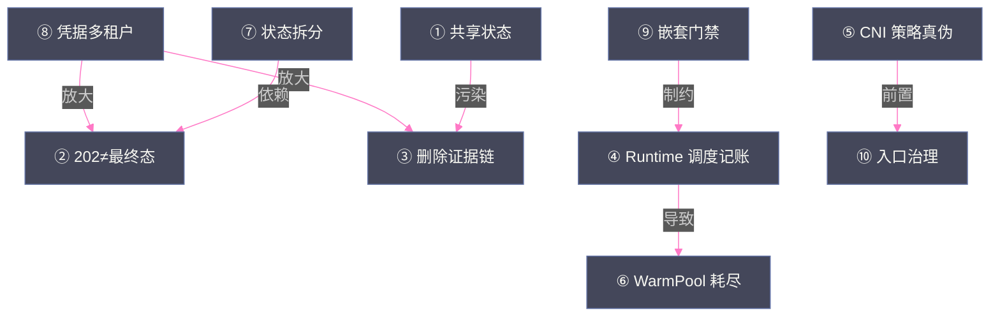

# 15 生产化深水区——十个盲区与行业共识

**摘要：**

本专栏的收官篇回答最后一个问题：**从"能用的测试集群"到"可靠的生产平台"，中间横着哪些坑？** 素材 Phase5-01 的调研给出了答案——**十个生产化盲区**：共享状态≠副本数、202≠最终态、对象删除证据链、Runtime 调度记账、CNI 策略真伪、状态拆分、WarmPool 耗尽、凭据多租户、嵌套虚拟化门禁、短期凭据与入口——每个盲区都是"文档不写、踩坑才知道"的隐性陷阱。文章逐一拆解十个盲区的现象、本质与对策（每个都关联本专栏对应篇的技术细节）；随后给出素材的完整生产路线图——测试集群 T0-T7（冻结事实、调度卫生、证据链、网络策略真伪、Gateway+Console、凭据收敛、观测 SLO、升级回滚）与生产并行 P0-P6（资源落地、软件基线、三 Profile 骨架、gVisor 窗口、Kata 门禁、状态与容量、身份审计）；再汇总行业共识（六层共识、目的建设派 vs 企业共生派、建设顺序八步——[[平台与协议/06 Agent 沙箱平台分层|第 06 篇]] 的深化）；最后给出 OpenSandbox 的总体评估（优势/不足/落地建议与"黄灯"定位）。核心认知：**生产化不是"补丁的集合"，而是"盲区的显式化"——把十个盲区变成十个验收门禁，生产化的进度就是盲区关闭的进度；而行业共识的意义在于：你踩的坑，别人已经踩过并写成了共识**。

---

## 第 1 章 生产化的本质：从 PoC 到生产的鸿沟

### 1.1 为什么 PoC 通过不等于生产可行

素材的周会汇报给出了一句精准的定位：**"技术闭环已在单节点 PoC 通过，但身份、多租户、密钥治理、高可用与容量模型尚未达到生产上线标准"——状态：黄**。

"黄灯"的构成——PoC 证明的与未证明的：

| PoC 已证明 | 生产未证明 |
| :--- | :--- |
| 平台能用（生命周期/三类 Agent/运行时切换） | 身份与多租户（凭据粒度/租户隔离） |
| 隔离可用（三运行时证据链） | 密钥治理（短期凭据/模型网关） |
| 性能有数据（基准/WarmPool） | 高可用（双副本的真实语义） |
| 链路完整（父 Agent→MCP→子沙箱） | 容量模型（耗尽/碎片/Registry） |

**"能用的系统"与"可靠的系统"的差距，就是十个盲区的总和**——生产化不是"再调调参数"，而是"把盲区变成显式设计"。

### 1.2 生产化的三个常见误区

在展开盲区之前，先破除三个导致"PoC 通过即盲目上线"的思维误区：

| 误区 | 表现 | 真相 |
| :--- | :--- | :--- |
| **"功能即生产"** | "三类 Agent 都跑通了，可以上线" | 功能闭环 ≠ 生产可靠——十个盲区一个没关 |
| **"副本即 HA"** | "Server 双副本了，高可用达成" | 共享状态≠副本数（盲区一）——本地状态是裂脑候选 |
| **"配置即安全"** | "NetworkPolicy 写了、Key 管起来了" | 配置声明 ≠ 运行事实——CNI 可能不执行、Key 可能被打穿（盲区五/八） |

**三个误区的共同根源**：**把"文档/配置/声明"当成了"事实"**——本专栏反复强调的"证据链"方法论（[[工程实践/10 Agent 沙箱部署实战|第 10 篇]]）正是对抗这三个误区的工具：**每个"我以为"都要有一个"我验证过"**。

### 1.3 十个盲区的全景

素材 Phase5-01 的十个盲区，按"层"分组：

| 层 | 盲区 |
| :--- | :--- |
| **控制面** | ① 共享状态≠副本数、② 202≠最终态、③ 对象删除证据链 |
| **调度与容量** | ④ Runtime 调度记账、⑤ CNI 策略真伪、⑥ WarmPool 耗尽 |
| **状态与数据** | ⑦ 状态拆分、⑧ 凭据多租户 |
| **隔离与入口** | ⑨ 嵌套虚拟化门禁、⑩ 短期凭据与入口 |

**盲区的共性**：**全部是"配置声明与运行事实的脱节"或"能力语义的误解"**——不是代码 bug，而是认知盲区——**盲区的可怕之处在于：你不知道自己不知道**。

---

## 第 2 章 十个盲区逐条拆解

### 2.1 盲区一：共享状态≠副本数

**现象**：Server 双副本 Running，但快照查询随机 404（查到了没有该记录的副本）。

**本质**：HA 的正确度量是"状态的可共享性"，不是副本数量——pod-local SQLite（GAP-003）让"双副本"只对无状态 API 成立（[[平台与协议/09 OpenSandbox 编排面|第 09 篇]] 5.2 节）。

**对策**：Core Profile 关闭快照（双副本只承载无状态 API）；快照类能力放 Lab Profile（单 Server）；长期方案是状态外置（SQLite→外部 DB）。

**检查问题**：**"你的平台有哪些组件持有本地状态？它们的高可用语义是什么？"**——答不上来的状态就是裂脑候选。

### 2.2 盲区二：202≠最终态

**现象**：创建请求返回 202 后立即查询，状态不符；pause 返回 ok 但沙箱还在跑。

**本质**：202 表示"同步完成"（Pod 已 Running），不是"异步受理"；CLI 的 ok 是"请求被接受"不是"操作完成"（[[平台与协议/07 OpenSandbox 架构深度解析|第 07 篇]] 3.1-3.3 节）。

**对策**：调用铁律——**"HTTP 码只表示'话送到了没有'，权威是 Lifecycle state + conditions"**；客户端轮询终态；超时设置大于 180 秒。

**检查问题**：**"你的客户端代码里，有多少地方把'请求成功'当成了'操作成功'？"**

### 2.3 盲区三：对象删除证据链

**现象**：Diagnostics 501（GAP-001），删除失败的沙箱被秒删——**"谁删的、为什么删、删了什么"无从追溯**。

**本质**：平台内部无审计面，删除路径没有"证据链"意识（[[生产化/13 Agent 状态与存储|第 13 篇]] 5.3 节）。

**对策**：外部日志证据链——删除前把 Event/request_id/sandbox_id 打到外部日志；删除后残留检查归档；平台补齐 Diagnostics 前，外部链路是唯一路径。

**检查问题**：**"删除一个沙箱，你能拿出几行日志证明'删对了、删干净了'？"**

### 2.4 盲区四：Runtime 调度记账

**现象**：节点按 runc 口径算容量，实际跑着 gVisor/Kata——**内存账本系统性低估，OOM 风险潜伏**。

**本质**：GAP-011——gVisor 空闲 PSS 127.2MiB、Kata 392.7MiB，调度器完全没计入（[[工程实践/12 沙箱性能工程|第 12 篇]] 5.1 节）。

**对策**：overhead 按"镜像族×运行时×机型"实测（占位 overhead 比不配更危险）；配置后验证"调度账本≈实测 PSS 总和"。

**检查问题**：**"你的节点容量模型里，沙箱的真实内存开销是多少？你测过吗？"**

### 2.5 盲区五：CNI 策略真伪

**现象**：写了 NetworkPolicy，但 Flannel 不执行——**"我们配置了隔离"是假的**。

**本质**：CNI 类型决定策略执行能力（Calico/Cilium 执行、Flannel 不执行）（[[平台与协议/08 OpenSandbox 数据面|第 08 篇]] 4.4 节）。

**对策**：五步对照实验（基线放行→default-deny→精确允许→删除恢复→换 Runtime 重放）；生产换 Calico/Cilium 或先验证再写策略。

**检查问题**：**"你的 CNI 是什么？你做过一次'策略生效'的对照实验吗？"**

### 2.6 盲区六：状态拆分

**现象**：把 Workspace/Session/Snapshot 三套状态混在一起验收——**"暂停恢复"的语义混乱（rootfs vs 会话）**。

**本质**：状态按"寿命×权威×访问模式"拆分（[[生产化/13 Agent 状态与存储|第 13 篇]] 的四本账）——不拆分则"同一个状态名下面是不同机器"。

**对策**：四本账分开验收（K8s 对象/Workspace/Session/暂停镜像）；P0 五项验证"状态独立于沙箱实例"。

**检查问题**：**"沙箱被删，用户会损失什么？"**——损失"对话/产物"就是拆分失败。

### 2.7 盲区七：WarmPool 耗尽

**现象**：5 个热槽吃 50 突发，交付 p99 回到冷启动量级（runc 17.5s / Kata 27.5s）——**"池化换到的是命中尾延迟，不是无限容量"**。

**本质**：池的容量是"提前创建的槽位"，耗尽即回到冷启动（[[平台与协议/09 OpenSandbox 编排面|第 09 篇]] 3.5 节）。

**对策**：容量公式（槽位 ≥ 峰值并发 × 目标命中率）+ 四 SLI（命中率/耗尽排队/补池时延/碎片率）+ 耗尽演练（把 17-27s 写进业务预期）。

**检查问题**：**"池打空时用户体验是什么？这个数字写进文档了吗？"**

### 2.8 盲区八：凭据多租户

**现象**：平台总 Key 被 MCP 打穿，父 Agent 能枚举全部沙箱——**共享凭据等于共享边界**。

**本质**：凭据的粒度（平台级）与沙箱的边界（沙箱级）不匹配（[[生产化/14 沙箱安全体系|第 14 篇]] 5.1 节）。

**对策**：短期凭据按租户/用户/任务签发，TTL 短、自动轮换；Agent 只能看到自己的 sandboxId 集合；平台总 Key 密封仅 Bootstrap。

**检查问题**：**"传给 Agent 的凭据，能做什么？这个能力与任务匹配吗？"**

### 2.9 盲区九：嵌套虚拟化门禁

**现象**：裸金属 Kata 验证通过，就以为 CVM 嵌套也能用——**"177.37 裸金属 Kata 证据不能搬到 CVM 嵌套场景"**。

**本质**：嵌套虚拟化多出来的 L1 是门禁（厂商书面确认/性能对照/运维事件/24-72h 稳定性）（[[隔离原语/04 KVM 与硬件虚拟化|第 04 篇]] 5.4 节）。

**对策**：四道门禁全过才切高隔离流量；未过门禁前只做灰度；兜底 RHEL 9 裸金属 Worker。

**检查问题**：**"你的 Kata 节点是裸金属还是 VM？嵌套门禁过到哪一关了？"**

### 2.10 盲区十：短期凭据与入口

**现象**：PoC 直接暴露 HTTP NodePort（POC-007）、浏览器访问无 SSO——**入口即攻击面**。

**本质**：入口治理（Gateway+SSO）是生产化的底线配置，不是可选项（[[生产化/14 沙箱安全体系|第 14 篇]] 6.2 节）。

**对策**：生产入口必须 Gateway+SSO，禁止 NodePort；浏览器凭据 Vault 注入短时凭证。

**检查问题**：**"沙箱平台的入口有几个？每个入口的鉴权是什么？"**

> [!warning] 生产避坑
> 十个盲区的共同对策可以浓缩为一句话：**"把每个盲区变成验收门禁"**——生产化的进度不是"功能清单的完成度"，而是"盲区清单的关闭度"。素材的 T/P 路线图（第 3 章）正是这个逻辑的落地。

### 2.11 盲区之间的关联：不是十个独立问题

十个盲区不是孤立的——它们之间存在因果与放大关系，识别关联才能避免"修一个冒一个"：



**三类关联**：

1. **放大关系**：凭据失控（⑧）让其他盲区的后果放大——**凭据是"放大器"，修凭据等于给所有盲区降险**；
2. **前置关系**：CNI 真伪（⑤）是入口治理（⑩）与租户隔离的前置——**先验证再实施是顺序纪律**；
3. **因果关系**：调度记账（④）导致耗尽误判（⑥）——**账本错了，容量决策全错**。

**"盲区关联图"的使用**：排生产化优先级时，先修"放大者"（⑧）与"前置者"（⑤）——**优先级不是按盲区编号，而是按关联位置**。

### 2.12 盲区的发现方法论：如何找到"你自己的盲区"

素材的十个盲区是"踩坑 + 调研"的产物——对任何新平台，盲区发现有三条系统路径：

| 路径 | 方法 | 产出 |
| :--- | :--- | :--- |
| **故障注入** | 主动制造故障（删 Pod/停组件/断网络）观察平台行为 | "平台在故障下的真实行为"清单 |
| **文档对照** | 把文档承诺逐条实测（"202 语义""双副本 HA"） | "文档 vs 事实"差异表 |
| **同行评审** | 让未参与建设的人审架构（盲区是"内行看不见的"） | 外部视角的盲区候选 |

**三条路径的次序**：**先文档对照**（成本最低，素材的盲区一/二/三都是文档对照发现的——"文档说 HA，实测 404"）、**再故障注入**（盲区四/五/七需要故障才能暴露）、**最后同行评审**（盲区八/九/十的"组织盲区"只能靠外人）。

**"盲区台账"的形态**：每个盲区记录"现象/本质/对策/关闭标准"四要素——**与素材的 POC/DEF/GAP 台账同构**（[[平台与协议/07 OpenSandbox 架构深度解析|第 07 篇]] 5.3 节）——**盲区台账是生产化的"作战地图"**。

---

## 第 3 章 路线图：T0-T7 与 P0-P6

### 3.1 测试集群 T0-T7

素材 Phase5-10 的测试集群路线（T 级——测试集群要完成的验证）：

| 阶段 | 内容 | 关闭的盲区 |
| :--- | :--- | :--- |
| **T0：冻结事实** | 发布物冻结、环境事实记录 | 可复现性（[[工程实践/10 Agent 沙箱部署实战|第 10 篇]] Gate 1） |
| **T1：调度卫生** | 节点标签/污点/ResourceClass 对齐 | 盲区四（调度记账） |
| **T2：证据链** | 日志/事件外发、request_id 贯穿 | 盲区三（删除证据链） |
| **T3：网络策略真伪** | 五步对照实验 + CNI 确认 | 盲区五（CNI 真伪） |
| **T4：Gateway + Console** | 入口收敛、SSO 接入 | 盲区十（入口） |
| **T5：凭据收敛** | 短期凭据、Key 分级 | 盲区八（凭据多租户） |
| **T6：观测 SLO** | 指标/告警/审计链路 | 盲区二/六（状态与语义） |
| **T7：升级回滚** | 版本化发布、回滚演练 | 盲区一（HA 语义） |

### 3.2 生产并行 P0-P6

| 阶段 | 内容 | 关闭的盲区 |
| :--- | :--- | :--- |
| **P0：资源落地** | 独立节点池、故障域、存储 | 容量基础（[[工程实践/12 沙箱性能工程|第 12 篇]]） |
| **P1：软件基线** | RHEL 9.6/cgroup v2/SELinux Enforcing | 环境基线（[[工程实践/10 Agent 沙箱部署实战|第 10 篇]]） |
| **P2：三 Profile 骨架** | runc/gVisor/Kata 三域名 | 盲区四（档位记账） |
| **P3：gVisor 窗口** | 兼容性验证 → 灰度中风险负载 | 档位与负载匹配 |
| **P4：Kata 门禁** | 嵌套门禁全过 → 高安全负载 | 盲区九（嵌套门禁） |
| **P5：状态与容量** | Workspace/Session 服务、容量模型 | 盲区六/七（状态/耗尽） |
| **P6：身份审计** | 三张身份票、审计链路 | 盲区八/十（凭据/入口） |

**T 与 P 的并行关系**：**T 级在测试集群验证"机制可用"，P 级在生产落地"机制生效"**——T 不过不 P（测试集群的验证是生产的门禁）。

### 3.3 路线图的资源投入估算

T/P 路线的资源投入（素材的人力节奏推演，1-2 人团队）：

| 阶段组 | 人力（人周） | 主要工作 |
| :--- | :--- | :--- |
| T0-T2（事实/卫生/证据） | 1-2 | 发布物清单、调度配置、日志链路 |
| T3-T4（网络/入口） | 1-2 | 对照实验、Gateway+SSO |
| T5-T6（凭据/观测） | 1-2 | 短期凭据服务、SLO 与告警 |
| T7 + P0-P1（升级/资源/基线） | 1-2 | 发布演练、节点池、OS 基线 |
| P2-P4（三 Profile/门禁） | 2-3 | 三套部署、gVisor 验证、Kata 门禁 |
| P5-P6（状态/身份） | 2-3 | Workspace/Session 服务、身份审计 |

**总计约 10-14 人周**（1-2 人 × 2-3 个月）——这是"从测试集群到生产可用"的现实量级。**资源估算的两个原则**：其一，**凭据与身份（T5/P6）的投入不要省**（放大器盲区，2.11 节）；其二，**每阶段预留 30% 缓冲**（盲区的"不知道自己不知道"特性决定了计划必然低估）。

### 3.4 里程碑与验收

素材的路线图验收逻辑：

```
每个阶段的三件套：
  1. 通过标准（可验证的事实）
  2. 证据归档（验证结果落盘）
  3. 回退路径（失败回到哪）

阶段验收的产出：
  盲区清单更新（关闭的/残留的）
  差距台账更新（GAP/DEF 状态）
  下一阶段的前置条件确认
```

**"路线图是活文档"**：每阶段验收都更新盲区与台账——**路线图的价值不在"计划得好"，而在"状态跟踪得准"**。

---

## 第 4 章 行业共识与两派路线

### 4.1 六层共识（第 06 篇的深化）

素材 Phase5-11 的行业共识在本专栏多处引用，收官篇给出完整定位——**共识 = 行业用真金白银验证过的公理**：

| 共识 | 验证者 | 本专栏对应 |
| :--- | :--- | :--- |
| 先定义工作负载 | 所有平台（形态由负载决定） | 第 06 篇 1.1 节 |
| 控制面与数据面切开 | Firecracker 三线程/OpenSandbox 六责任面 | 第 06 篇 2.7 节 |
| 盒内守护进程 | execd/envd/runner | 第 08 篇 1.1 节 |
| 快靠预热物认领 | GKE 300/s、OpenSandbox Pool | 第 09 篇 3.1 节 |
| 隔离按档提供 | 四档光谱/三 Profile | 第 03 篇、第 14 篇 2.4 节 |
| 状态按寿命拆库 | 四本账 | 第 13 篇 |

**共识的使用**：**设计评审时对照共识清单**——违反共识的设计要能说清"为什么这次例外"——**共识是默认值，例外要有论证**。

### 4.2 目的建设派 vs 企业共生派（深化）

[[平台与协议/06 Agent 沙箱平台分层|第 06 篇]] 4.2 节的两派路线，生产化视角的补充：

| 维度 | 目的建设派（E2B/Modal） | 企业共生派（SIG/GKE/OpenSandbox） |
| :--- | :--- | :--- |
| **数据面建设** | 自建（Firecracker 池/自研控制面） | 复用 K8s（CRD/Controller） |
| **生产化路径** | 平台公司内部迭代 | 企业自己填缺口 |
| **适合** | 对外提供沙箱服务的平台 | 内部 Agent 平台建设 |
| **素材判断** | 参考其性能/API 设计 | **落地选择**（复用 DomeOS） |

**"企业共生派"的生产化成本结构**：复用 K8s 省了数据面，但**十盲区大部分落在"共生"的接缝处**（RuntimeClass 记账、CNI 真伪、双副本语义）——**共生派的生产化 = 填接缝**。

### 4.3 行业调研的样本与局限

素材的行业共识调研（Phase5-11）覆盖 E2B、SIG、GKE、Daytona、Modal、Cloudflare、OpenKruise 等方案——对"共识"的置信度评估：

| 维度 | 评估 |
| :--- | :--- |
| **样本覆盖** | 云托管（E2B/Modal/Daytona）、标准（SIG/GKE）、K8s 产品（OpenSandbox）、边缘（Cloudflare）、CNCF（OpenKruise）——**覆盖主流形态，无显著空缺** |
| **时间窗口** | 2025-2026 年的状态——沙箱技术演进快，**共识的"保质期"约 1-2 年** |
| **未覆盖** | 国内 CubeSandbox 类产品的公开细节有限、自研方案无公开资料——**共识的"暗样本"可能修正结论** |

**共识的引用纪律**：**共识是"行业当前默认"，不是"永恒真理"**——引用共识时标注时间窗口与样本范围（本专栏所有共识引用均标注"2026 年调研"）——**共识过期比共识错误更常见**。

### 4.4 建设顺序八步（回顾）

[[平台与协议/06 Agent 沙箱平台分层|第 06 篇]] 4.3 节的八步建设顺序，与 T/P 路线图的映射：

```
建设顺序八步                    路线图映射
1. 产品原语                    → T0（冻结事实）
2. 一条能 exec 的数据面         → PoC（已验证）
3. 切开流量                    → T4（Gateway）
4. 模板与构建专职化             → P1（软件基线）
5. 预热与 Ready                → T1/T3（调度/网络）
6. 档位与硬隔离                → P2/P3/P4（三 Profile）
7. 状态外置与身份短命           → P5/P6（状态/身份）
8. 为规模拆中心                → 生产二期
```

**映射的意义**：**两条路线（行业共识 vs 素材实践）指向同一顺序**——行业共识的抽象顺序被素材的 concrete 路线图验证——**"共识 → 路线图"的转化是生产化规划的标准动作**。

**路线的两条主线**：T 线（测试集群）与 P 线（生产）的并行不是"两条线各干各的"——**T 线的验证结果直接决定 P 线的放行**（T3 网络真伪不过，P2 三 Profile 的租户隔离不写）；P 线暴露的生产问题回流 T 线复现（生产偶发 → 测试集群构造复现 → 修复验证）——**"T 验证、P 落地、回流复现"是路线图的闭环节律**。

---

## 第 5 章 OpenSandbox 总体评估

### 5.1 优势（素材验证的六项）

1. **协议优先**——specs/ 契约让运行时替换、客户端扩展、平台演进成为可能（[[平台与协议/07 OpenSandbox 架构深度解析|第 07 篇]]）；
2. **覆盖完整**——65 API 操作 + 五语言 SDK + CLI + MCP（第 07 篇）；
3. **K8s 原生**——BatchSandbox CRD + WarmPool + 双 provider（第 09 篇）；
4. **性能领先**——批量交付比 SIG 高一个数量级（InfoQ 数据，第 09 篇 2.4 节）；
5. **实证充分**——素材完成"父 Agent+真实模型+MCP 子沙箱+回收"完整链路（第 11 篇）；
6. **生态开放**——CNCF Landscape、社区贡献通道（19 个候选 Issue/PR，第 07 篇 5.1 节）。

### 5.2 不足（差距台账的七项结构性问题）

| 问题 | 影响 | 处理 |
| :--- | :--- | :--- |
| Runtime 是 Server 级配置（GAP-010） | 不能逐沙箱选档 | 三 Profile 方案 |
| Snapshot 元数据 pod-local（GAP-003） | 双副本 404 | Core/Lab 分治 |
| Diagnostics 未实现（GAP-001） | 审计链路缺平台侧 | 外部日志证据链 |
| 删除不回收 blob（GAP-004） | Registry 膨胀 | 自建 GC |
| 202/CLI 语义模糊（DEF-001/004） | 客户端误判 | 轮询终态纪律 |
| Pool CRD 落后（DEF-005） | 配置与实现脱节 | Pool 不可变版本 |
| 平台总 Key（POC-005） | 凭据放大 | 短期凭据 |

### 5.3 落地建议（素材的八条）

1. **Core Profile 默认关 Snapshot**——双副本先在"无状态 API"意义上成立；
2. **Snapshot Lab 受控窗口**——必要时单 Server；
3. **三 Profile 三域名**——不自研路由器（盲区四的对策）；
4. **overhead 按镜像族×Runtime×机型实测**——占位 overhead 是假精确；
5. **先做策略真伪实验，再申请企业域名**（盲区五）；
6. **短期凭据按租户/用户/任务签发**，TTL 短、自动轮换（盲区八）；
7. **嵌套 Kata 未过门禁前只做灰度**，兜底裸金属 Worker（盲区九）；
8. **WarmPool 当不可变版本**——新模板=新池→预热→切流→抽干→删除（盲区七）。

### 5.4 替代方案的再评估：不是一次选型定终身

素材选型（[[平台与协议/06 Agent 沙箱平台分层|第 06 篇]] 5.2 节）不是终点——**生产化过程中要周期性再评估**：

| 再评估触发点 | 重新考察的候选 | 原因 |
| :--- | :--- | :--- |
| 平台版本大升级 | OpenSandbox 新版本（GAP-010 修复？） | 逐沙箱运行时可能是革命性变化 |
| 治理投入超预算 | 托管方案（E2B 企业版） | 自建成本 > 托管费用的可能性 |
| 第 5 层需求爆发 | 专业 Agent 托管平台 | 适配层自研成本失控时 |
| 行业标准落地 | SIG/新协议标准 | 标准成熟后迁移成本下降 |

**再评估的方法论**：**用"盲区关闭度"做对比基准**——候选 A 关了 8 个盲区、候选 B 关了 3 个——**盲区关闭度是比"功能清单"更可靠的选型指标**（盲区是真实成本的代理变量）。

### 5.5 "黄灯"定位：试点基线的正确姿势

素材周会汇报的最终结论：**"把 OpenSandbox 确定为第一阶段试点基线，不是宣布它为最终生产标准"——状态：黄**。

"黄灯"的工程含义：

| 维度 | 含义 |
| :--- | :--- |
| **技术** | 闭环已验证（绿）——平台能力真实可用 |
| **治理** | 生产标准未达（红）——身份/多租户/密钥/HA/容量 |
| **行动** | 继续试点推进 + 并行补治理（黄）——不原地等待也不盲目放量 |

**"黄灯"是生产化的常态**——**不是所有系统都要"全绿才上"，而是"明确知道哪里黄、黄的项有没有关闭计划"**——**"黄灯 + 关闭计划"比"假装绿灯"可靠得多**。

---

## 第 6 章 专栏收官

### 6.1 全专栏的逻辑链回顾

15 篇的逻辑链（本专栏的完整心智模型）：

```
为什么（01）：威胁模型 → 攻击链 → 六层技术栈
边界在哪（02-05）：隔离原语 → 四档光谱 → KVM → VMM
平台怎么建（06-09）：六层模型 → OpenSandbox 三部曲
怎么落地（10-12）：部署 → Agent 适配 → 性能工程
怎么生产（13-15）：状态 → 安全 → 盲区与共识
```

**一条主线贯穿**：**"隔离是手段，平台是载体，生产是目的"**——任何一篇单独读都是技术细节，连起来读才是 Agent 沙箱的完整图景。

### 6.2 方法论总结：本专栏的五条方法论

| 方法论 | 内容 | 出处 |
| :--- | :--- | :--- |
| **证据链** | 配置声明必须用运行事实验证 | 第 02/10 篇 |
| **对照实验** | 性能/网络/隔离的验证靠"对照" | 第 03/08/12 篇 |
| **分层模型** | 六层模型/四本账/三层防护——先分层再设计 | 第 06/13/14 篇 |
| **台账管理** | 缺陷/缺口/妥协——每项有归属与截止 | 第 07/10 篇 |
| **阶段验收** | Gate/T/P 路线——验收驱动部署 | 第 10/15 篇 |

**方法论的复用性**：五条方法论不限于沙箱——**任何"新技术平台从零到生产"的项目都可以套用**（本专栏的素材就是一套完整的示范）。

### 6.3 全专栏的术语总表

收官篇提供全专栏术语总表（15 篇的统一口径，供速查）：

| 术语 | 口径 | 出处 |
| :--- | :--- | :--- |
| **攻击链四步** | 代码执行→提权逃逸→数据窃取→网络外传 | 第 01 篇 |
| **六层模型** | 控制面/K8s 编排/执行层/隔离运行时/Agent 适配/API 协议 | 第 06 篇 |
| **四档光谱** | runc/bubblewrap-Landlock/gVisor/Kata-Firecracker | 第 03 篇 |
| **六责任面** | Client/Protocol/Lifecycle/Backend/Data/Network | 第 07 篇 |
| **四本账** | 运行时对象/Workspace/Session/暂停镜像 | 第 13 篇 |
| **三层防护** | 隔离/资源约束/行为审计 | 第 14 篇 |
| **三张身份票** | SSO 票/控制面票/拉镜像票 | 第 14 篇 |
| **三态模型** | 冷启动/热池命中/耗尽 | 第 09/12 篇 |
| **十个盲区** | 生产化隐性陷阱清单 | 本文 |
| **T/P 路线** | 测试集群 T0-T7 / 生产 P0-P6 | 本文 |
| **证据链** | 配置声明用运行事实验证的纪律 | 贯穿全专栏 |
| **残留 0** | 删除后 API/CR/Pod 三层无残留 | 第 10/11 篇 |

### 6.4 展望：三个开放方向

1. **checkpoint 竞争**（[[平台与协议/09 OpenSandbox 编排面|第 09 篇]] 4.6 节）：内存级暂停/恢复的代价降到可接受，谁赢谁拿"会话秒续"体验——**rootfs 快照是今天，内存 checkpoint 是明天**；
2. **第 5 层标准化**：Agent 适配层的协议标准化（谁先定义事实标准谁占生态位）——**MCP 标准化了工具，还没标准化"Agent 如何被托管"**；
3. **沙箱标准化演进**：E2B 兼容（协议层）、SIG CRD（编排层）的事实标准地位巩固——**"协议层参考 E2B、编排层贴近 SIG、隔离层按威胁等级自由选择"的组合策略**（[[平台与协议/06 Agent 沙箱平台分层|第 06 篇]] 3.6 节）。

### 6.4 思考题

1. **盲区的发现机制**：十个盲区是素材"踩坑+调研"发现的。对一个新平台，如何系统性地发现"自己的盲区清单"？提示：考虑"故障注入演练"（主动制造故障观察行为）、"文档对照"（把文档承诺逐条实测）、"同行评审"（让没参与建设的人审设计）。

2. **黄灯的管理**：素材的"黄灯"定位（试点推进 + 并行补治理）。如果业务方要求"下月上线"，而你的盲区关闭度只有 30%，你会怎么谈判？提示：考虑"范围切割"（先上低风险负载）、"明确保留项"（哪些功能上线时不承诺）、"回退预案"（上线失败怎么退）。

3. **共识的例外**：六层共识说"隔离按档提供"。如果你们平台决定"全部用 Kata"（单一高档位），这个例外要满足什么条件才成立？提示：考虑威胁等级（全 L3？）、成本承受力（容量模型重算过？）、以及"按档提供"的运维复杂度是否真的省了。

### 6.5 结语

Agent 沙箱技术站在两条演进线的交汇点：隔离技术四十年的演进（chroot→容器→MicroVM→平台）与 Agent 应用三年的爆发（对话→工具→自主执行）。本专栏从威胁模型出发，走完隔离原语、虚拟化技术、平台架构、工程实践、生产化的完整路径——**回到第 01 篇的起点：沙箱不是"某种运行时"，而是"一套系统能力"**——希望这套能力，现在已经在你的心智里成形。

> [!info] 专栏导航
> 本文是 [[../00 专栏导览|Agent 沙箱技术专栏]] 的第 15 篇，专栏收官。完整阅读路径：01 → 02-05（隔离技术）→ 06-09（平台架构）→ 10-12（工程实践）→ 13-15（生产化）。

---

## 参考文献

1. 素材调研. Phase5-01 行业坐标与十个盲区、Phase5-02 RuntimeClass 与 Pod Overhead、Phase5-03 Kata 与嵌套虚拟化、Phase5-05 网络策略真伪、Phase5-06 WarmPool 耗尽、Phase5-07 状态四本账、Phase5-09 短期凭据多租户、Phase5-10 从测试集群到生产、Phase5-11 行业共识
2. 素材调研. Phase7-00 周末接续总览（生产方向）、Phase1-11 生产化形态与资源模型
3. 素材交付物. 周会汇报-2026-08-07（黄灯评估）、候选项目事实卡
4. InfoQ. "OpenSandbox：重新思考 Agent 时代的 Runtime."
5. 素材调研. Phase6 源码走读（202 语义与状态所有权）

---

## 修改记录

- 2026-08-15：专栏创建，本文基于素材生产化调研整合创作，作为 Agent 沙箱技术专栏收官篇

## 附录：生产上线检查单（T/P 路线速查）

```
□ 十个盲区全部有"关闭标准"（盲区台账）
□ 凭据（放大器盲区）优先级最高
□ CNI 真伪实验已完成（前置盲区）
□ T0-T7 全部通过并有证据归档
□ P0-P6 阶段里程碑与回退路径明确
□ 三 Profile（runc/gVisor/Kata）骨架就绪
□ overhead 实测（镜像族×运行时×机型）
□ 快照 Core/Lab 分治决策已定
□ WarmPool 四 SLI 上线（命中率/排队/补池/碎片）
□ 短期凭据 + 三张身份票 + 模型网关
□ 入口 Gateway + SSO（无 NodePort）
□ 红蓝演练已执行（安全验收）
□ "黄灯"项清单与关闭计划公开
```
