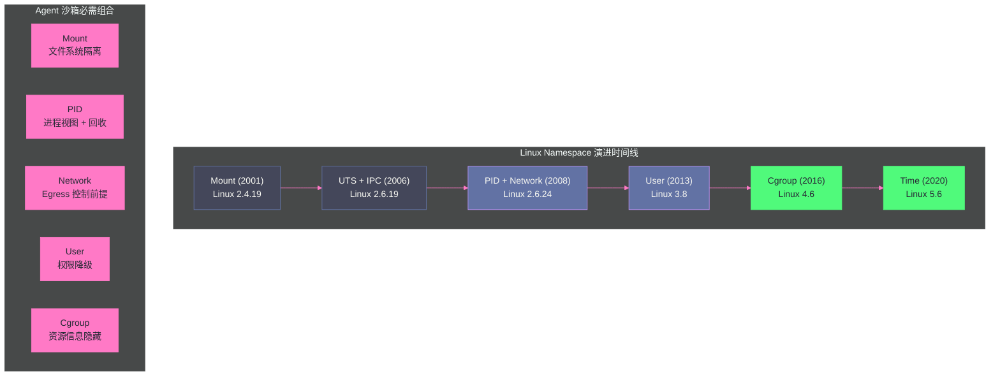
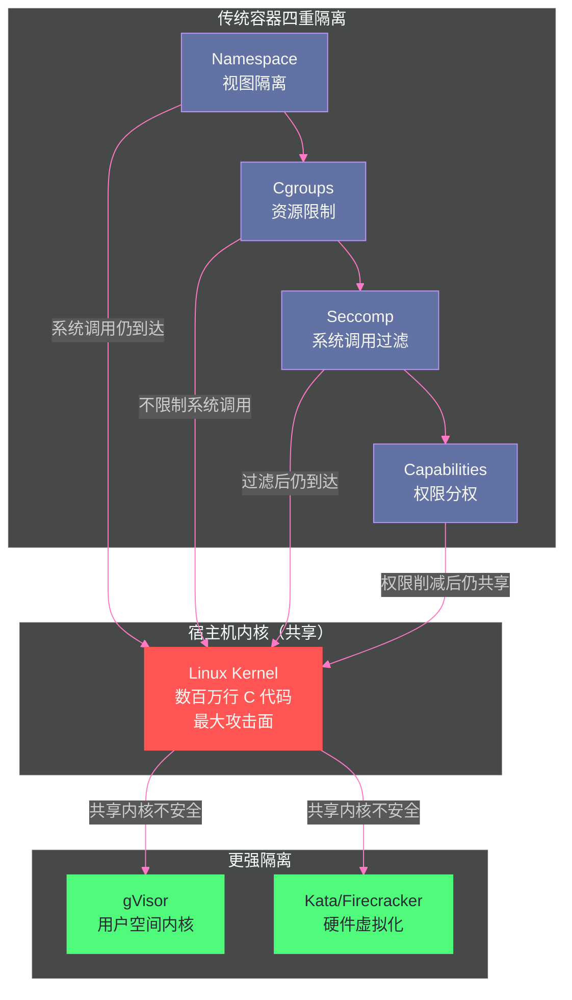

# 02 Linux 隔离原语——namespace、cgroups、seccomp 与 capabilities 的安全地基

**摘要：**

[[../01 Agent 沙箱全景——威胁模型、六层技术栈与逻辑演进|第 01 篇]] 建立了威胁模型与六层技术栈，指出"隔离运行时"是沙箱的第四层、也是爆炸半径控制的关键。本文深入这一层的地基：Linux 内核从 2002 年到 2020 年逐步引入的四类隔离原语——**namespaces**（视图隔离）、**cgroups**（资源限制）、**seccomp**（系统调用过滤）、**capabilities**（权限分权）。文章逐一拆解 8 种 namespace 的隔离资源、引入版本与反例场景；剖析 clone/unshare/setns 三个系统调用的正交设计；深入 user namespace"无特权创建"带来的安全争议（CVE-2024-1086 与 Ubuntu 24.04 的三次绕过）；说明容器标准 namespace 组合与 Agent 沙箱的额外需求（网络 namespace 是 Egress 控制的前提、user namespace 是不可信代码的关键防御）；打通"namespace 到运行时"的完整 CRI 链路（RuntimeClass→kubelet→CRI→containerd→shim→agent 七跳）；最后论证为什么这四类原语叠加仍不足以构成对抗性沙箱——共享内核是它们共同的天花板。核心认知：**隔离原语解决"视图、账本、入口、权限"四个维度，但都不解决"内核攻击面"——这正是 gVisor/Kata/Firecracker 存在的理由，也是[[隔离原语/03 隔离边界的光谱——从共享内核到 MicroVM 的四档技术路线|第 03 篇]]的起点**。

---

## 第 1 章 namespace 的本质——"视图隔离"

### 1.1 什么是 namespace

Linux namespace 的核心思想极其简洁：**把一个全局内核资源包装起来，让一个进程以为它拥有自己私有的副本**。

考虑一个最简单的例子——PID namespace。在没有 PID namespace 的系统中，所有进程共享同一个 PID 空间，进程的 PID 全局唯一。但当把一个进程放入新的 PID namespace 时，这个进程看到的 PID 空间是全新的：它自己是 PID 1，它的子进程是 PID 2、3、4……它看不到外部世界的进程（PID 100、200、300 对它不可见）。

这不是"隐藏"——从内核视角看，外部进程仍然存在，仍然在同一个内核上运行。但从**这个进程的视角**看，它"以为"整个系统只有它和它的子进程。这就是"视图隔离"——改变进程对资源的视图，而非改变资源本身。

> [!info] 核心概念：namespace 只是 inode 数字
> 在内核实现层面，namespace 极其朴素——它只是一个 inode 数字。每个进程在 `/proc/[pid]/ns/` 目录下有一组符号链接，每条链接指向一个 namespace 对象，链接名后面的方括号中是 inode 数字。两个进程的 `/proc/[pid]/ns/net` 如果指向相同的 inode，它们就共享同一个网络 namespace；如果 inode 不同，它们就在不同的网络 namespace 中。内核通过比较 inode 数字来判断"这两个进程是否在同一个 namespace 中"——没有更复杂的机制，就是数字比较。
>
> 这种极简实现是 namespace 轻量的根本原因——创建一个新 namespace 几乎没有内存开销（只是分配一个新的 inode），这也是容器启动速度达到毫秒级的基础。对比 VM：创建一个 VM 需要加载完整的内核镜像、初始化设备模型、启动用户态系统，开销在数百 MB 内存和秒级启动时间；创建一个 namespace 只需要一个 inode。这个数量级的差异，是"容器化隔离"与"虚拟化隔离"在 Agent 沙箱场景中性能分化的根源。

**实操证据**：在任意 Linux 机器上运行下面的命令，可以看到当前进程所属的全部 namespace：

```bash
# 查看当前 shell 进程的 namespace 身份
ls -l /proc/self/ns/

# 输出示例（inode 数字即 namespace 身份）
# lrwxrwxrwx 1 root root 0 Aug 15 10:00 cgroup -> 'cgroup:[4026531835]'
# lrwxrwxrwx 1 root root 0 Aug 15 10:00 ipc -> 'ipc:[4026531839]'
# lrwxrwxrwx 1 root root 0 Aug 15 10:00 mnt -> 'mnt:[4026531841]'
# lrwxrwxrwx 1 root root 0 Aug 15 10:00 net -> 'net:[4026531993]'
# lrwxrwxrwx 1 root root 0 Aug 15 10:00 pid -> 'pid:[4026531836]'
# lrwxrwxrwx 1 root root 0 Aug 15 10:00 user -> 'user:[4026531837]'
# lrwxrwxrwx 1 root root 0 Aug 15 10:00 uts -> 'uts:[4026531838]'
```

再运行 `unshare --pid --fork --mount-proc bash` 进入一个新的 PID namespace，`ls -l /proc/self/ns/pid` 会看到不同的 inode 数字——这就是"进入新 namespace"的可见证据。在 agent-sandbox 的 PoC 验证中，作者正是用这类命令在 OpenSandbox 创建的沙箱内采集隔离证据链（guest 内核版本、PID 1 身份、namespace inode 差异），证明沙箱确实运行在独立 namespace 中。

### 1.2 三个系统调用：clone / unshare / setns

namespace 的操纵通过三个系统调用完成，它们覆盖了 namespace 操纵的全部三个维度：

**clone(flags)**：创建新进程，同时可选地创建新 namespace。`flags` 参数中可以指定 `CLONE_NEW*` 标志来创建对应类型的新 namespace。这是 Docker `run` 底层使用的——Docker 调用 `clone()` 并传入 `CLONE_NEWPID | CLONE_NEWNET | CLONE_NEWNS | ...` 一次性创建所有需要的 namespace。

**unshare(flags)**：不创建新进程，但把**当前进程**移入新的 namespace。这在"已有进程想进入隔离环境"的场景中使用——如 `unshare --net /bin/bash` 让当前 shell 进入新的网络 namespace。

**setns(fd, nstype)**：把当前进程加入一个**已存在的** namespace。`fd` 是指向目标 namespace 的文件描述符（通过打开 `/proc/[pid]/ns/xxx` 获得）。这是 Docker `exec` 底层使用的——Docker 调用 `setns()` 让新进程加入容器的已有 namespace。

```c
// 三个系统调用的关系
clone(CLONE_NEWNET | CLONE_NEWPID, ...)  // 创建新进程 + 新网络namespace + 新PID namespace
unshare(CLONE_NEWNET)                    // 当前进程进入新网络namespace（不创建新进程）
setns(fd_net, CLONE_NEWNET)              // 当前进程加入fd指向的网络namespace
```

> [!note] 设计哲学：clone/unshare/setns 的"正交设计"
> 三个系统调用覆盖了 namespace 操纵的三个维度：clone 是"创建新进程 + 新空间"，unshare 是"已有进程 + 新空间"，setns 是"已有进程 + 已有空间"。这种正交设计让 namespace 可以灵活组合——你可以创建新进程进新空间（容器启动）、让已有进程进新空间（运行时隔离）、或让已有进程加入已有空间（docker exec 进入运行中的容器）。这种灵活性是容器运行时能够实现"启动→执行→进入"完整工作流的基础。
>
> 对 Agent 沙箱而言，这个设计还有一个更深的意义：**沙箱内的"注入"机制依赖 setns**。OpenSandbox 的 execd 要进入沙箱进程的 namespace 执行命令、查看文件，本质上就是打开目标进程的 `/proc/[pid]/ns/*` fd 再 setns——理解这三个调用，才能理解 [[平台与协议/08 OpenSandbox 数据面——execd 与 egress 的盒内世界|execd 数据面]] 的实现原理。

### 1.3 创建 namespace 需要什么权限

大多数 namespace 的创建需要 `CAP_SYS_ADMIN` 能力——因为在新 namespace 中，创建者将拥有改变全局资源的权力（挂载文件系统、配置网络栈、管理进程），这些改变可能影响后续加入该 namespace 的进程。

**例外：user namespace**。自 Linux 3.8（2013 年）起，创建 user namespace **不需要任何特权**——无特权用户也可以创建。这个"无特权创建"特性是 rootless 容器（无根容器）的基础，但也引发了持续至今的安全争议（第 4 章深入讨论）。

权限要求差异造成了一个有趣的现状：**普通用户能做的"沙箱"，与管理员能做的"沙箱"，在 namespace 维度上能力不同**——这也是为什么大多数 Agent 沙箱平台（包括 OpenSandbox）以 rootless 或半特权模式运行沙箱进程，却在宿主侧保留完整的管理能力。

---

## 第 2 章 8 种 namespace 逐一拆解

### 2.1 Mount Namespace（CLONE_NEWNS，Linux 2.4.19，2001）

**隔离资源**：挂载点视图——每个 mount namespace 有自己的挂载表。进程在一个 mount namespace 中 mount/umount 文件系统，不影响其他 mount namespace 中的进程看到的挂载视图。

**引入背景**：Mount namespace 是 Linux 的**第一个** namespace——2001 年在 Linux 2.4.19 中引入。它是最自然的隔离维度——"让进程看到不同的文件系统视图"。有趣的是它的 flag 名字 `CLONE_NEWNS`（New Namespace 的缩写）——因为引入时开发者没预料到后面还会有一系列 namespace，所以第一个 namespace 的 flag 命名留了个"历史包袱"。

**容器中的角色**：Docker 用 mount namespace 让容器看到自己的文件系统层次——容器的根文件系统（image layer 通过 OverlayFS 合并）只对容器内的进程可见，宿主机上其他进程看不到这个挂载视图。

**不这样会怎样**：如果没有 mount namespace，所有进程共享同一个挂载表——你给容器 mount 一个 overlay 文件系统，宿主机上所有进程都能看到这个挂载。这意味着容器的文件系统隔离完全不存在——任何进程都能访问容器的文件。

> [!warning] 生产避坑：mount namespace 的"传播性"陷阱
> mount namespace 有一个容易踩的坑——挂载传播性（mount propagation）。默认情况下，一个 mount namespace 中的挂载**可能**传播到其他 namespace（取决于挂载点的传播类型：MS_PRIVATE / MS_SHARED / MS_SLAVE / MS_UNBINDABLE）。如果容器的根挂载点没有正确设置为 MS_PRIVATE，容器内的 mount 操作可能"泄漏"到宿主机的挂载表中。Docker/Podman 在创建容器时会显式设置传播类型为 MS_PRIVATE 来防止这种泄漏，但如果你自己用 unshare/clone 做 namespace 隔离，必须手动设置传播类型——否则可能出现"容器 mount 了东西，宿主机也看到了"的诡异现象。
>
> 对 Agent 沙箱来说，这个陷阱还有一个放大效应：Agent 可能被诱导执行 `mount` 类命令（如果沙箱给了 CAP_SYS_ADMIN 且未限制 mount syscall），挂载传播配置错误时，沙箱内的挂载操作会直接污染宿主机文件系统视图——这是攻击链第 2 步（提权/逃逸）的一条现实路径。

### 2.2 UTS Namespace（CLONE_NEWUTS，Linux 2.6.19，2006）

**隔离资源**：主机名（hostname）和 NIS 域名——两个 `uname` 系统调用返回的字符串。

**名字来源**：UTS = UNIX Timesharing System，来自 `struct utsname`——这是一个历史悠久的 Unix 数据结构，存储系统标识信息。

**容器中的角色**：让每个容器有自己的 hostname——如 `hostname` 命令在容器中返回容器名而非宿主机名。这对需要 hostname 做服务发现的应用很重要。

**不这样会怎样**：如果没有 UTS namespace，所有进程共享同一个 hostname——容器中的 `hostname` 命令返回宿主机的 hostname。这可能导致依赖 hostname 的应用行为异常（如某些中间件用 hostname 做节点标识）。

**为什么是最简单的 namespace**：UTS namespace 只隔离两个字符串——hostname 和 domainname。没有复杂的数据结构，没有资源管理，只是"让进程看到不同的系统名"。它是理解 namespace 概念的最好起点——如果 UTS namespace 的概念理解了（"让进程看到不同的 hostname"），其他 namespace 只是"让进程看到不同的 X"的变体。

**Agent 沙箱视角**：多个 Agent 沙箱运行在同一节点时，每个沙箱内的 hostname 必须独立——否则 Agent 在沙箱内启动的服务（如 OpenCode 的 4096 端口服务、Hermes 的 9119 Dashboard）无法用 hostname 区分，服务发现会错乱。

### 2.3 IPC Namespace（CLONE_NEWIPC，Linux 2.6.19，2006）

**隔离资源**：System V IPC 和 POSIX 消息队列——包括共享内存段（`shmget`）、信号量集（`semget`）、消息队列（`msgget`）。

**容器中的角色**：让容器有自己的 IPC 资源空间——容器 A 创建的共享内存段不会被容器 B 看到。

**不这样会怎样**：如果没有 IPC namespace，所有进程共享同一个 IPC 资源空间——容器 A 和容器 B 可能因为使用了相同的 IPC key 而产生冲突（一个容器创建的共享内存段被另一个容器意外访问）。

**实际影响较小**：在现代应用中，System V IPC 的使用频率远低于 POSIX IPC 和其他消息传递机制（如 Redis、RabbitMQ）。很多容器化应用甚至不使用 System V IPC，因此 IPC namespace 的实际影响较小——但它仍然是容器隔离的一个维度。IPC namespace 与 [[隔离原语/04 KVM 与硬件虚拟化——MicroVM 隔离的硬件基石|硬件虚拟化]] 的对比最能说明"视图隔离 vs 真实隔离"的差异：VM 之间连 CPU 寄存器都不共享，IPC namespace 只是让共享内存段"看起来"是私有的。

### 2.4 PID Namespace（CLONE_NEWPID，Linux 2.6.24，2008）

**隔离资源**：进程 ID 空间——每个 PID namespace 有自己的 PID 编号空间。在新 PID namespace 中创建的第一个进程是 PID 1。

**容器中的角色**：让容器中的进程看到自己的 PID 树——容器的入口进程是 PID 1，其子进程是 PID 2、3、4……容器内进程看不到宿主机上的其他进程。

**PID 1 的特殊职责**：在 PID namespace 中，PID 1 有特殊职责——它是"init 进程"，负责回收孤儿进程（reaping zombies）和处理信号。如果 PID 1 退出，该 namespace 中的所有进程都会被 SIGKILL。这就是为什么 Docker 容器需要"init 进程"（如 `tini`）——如果你的应用不是为做 PID 1 设计的（不回收僵尸进程），可能导致进程泄漏。

**Agent 沙箱视角——PID 1 与 execd 的进程拓扑**：在 OpenSandbox 的沙箱中，进程拓扑是"bootstrap 启动 execd + 用户 entrypoint"——bootstrap 成为 PID 1，execd 与用户进程是它的子进程（[[平台与协议/08 OpenSandbox 数据面——execd 与 egress 的盒内世界|第 08 篇]] 详细展开）。这个设计不是随意的：**bootstrap 做 PID 1 保证了沙箱退出时所有进程（包括 execd 和 Agent 进程）能被完整回收**，避免了"沙箱已删、进程残留"的僵尸问题——这正是素材中 PoC 验收"残留 0"的底层机制。

**不这样会怎样**：如果没有 PID namespace，容器中的进程可以看到宿主机上的所有进程——`ps aux` 在容器中会列出宿主机的所有进程。这不仅泄露了宿主机的进程信息（安全风险），还可能导致依赖 PID 的应用行为异常。

> [!warning] 生产避坑：PID namespace 的 `/proc` 陷阱
> PID namespace 有一个容易踩的坑——创建了新的 PID namespace 后，`ps` 命令仍然可能显示宿主机的进程！原因是 `ps` 从 `/proc` 文件系统读取进程信息，而 `/proc` 是 mount namespace 管辖的。如果你只创建了 PID namespace 但没有同时创建 mount namespace 并重新挂载 `/proc`，`ps` 读取的仍然是宿主机的 `/proc`——显示的是宿主机的进程列表。Docker 在创建容器时同时创建 PID namespace 和 mount namespace，并在新 mount namespace 中重新挂载 `/proc`——这样 `ps` 才能正确显示容器内的进程。这个"陷阱"说明 namespace 之间需要组合使用——单一 namespace 往往不够。

### 2.5 Network Namespace（CLONE_NEWNET，Linux 2.6.24，2008）

**隔离资源**：网络栈——包括网络设备（网卡）、IP 地址、路由表、端口号、防火墙规则、`/proc/net`、`/sys/class/net`。

**容器中的角色**：让容器有独立的网络栈——容器可以有自己 IP 地址、自己的端口绑定（两个容器都可以绑定 80 端口而不冲突）、自己的路由表。

**不这样会怎样**：如果没有 network namespace，所有进程共享同一个网络栈——两个容器不能同时绑定 80 端口；容器可以看到宿主机的路由表和防火墙规则；容器的网络流量直接走宿主机的网络设备。

**网络 namespace 的连接**：独立的 network namespace 是隔离的——默认无法与外部通信。容器网络（如 Docker bridge、Kubernetes CNI）通过虚拟以太网对（veth pair）连接不同的 network namespace——一端在容器 namespace 中，另一端在宿主机 namespace 中，数据在两端之间传递。

**对 Agent 沙箱的特殊意义——Egress 控制的前提**：Network namespace 是 Agent 沙箱 Egress 过滤的基础——通过把 Agent 放入独立的 network namespace，可以对其网络流量做独立控制（iptables/eBPF 规则只作用于该 namespace）。如果 Agent 与宿主机共享网络栈，任何出站过滤都无法"只针对这个沙箱"生效。OpenSandbox 的 egress sidecar 正是利用 network namespace 边界，在沙箱网络命名空间内注入策略（[[平台与协议/08 OpenSandbox 数据面——execd 与 egress 的盒内世界|第 08 篇]]）。**这是"为什么沙箱必须有独立网络 namespace"的硬性理由：不是可选的隔离增强，而是数据外泄控制（攻击链第 4 步）的结构性前提**。

### 2.6 User Namespace（CLONE_NEWUSER，Linux 3.8，2013）

**隔离资源**：用户 ID 和组 ID——在 user namespace 内，uid/gid 可以与外部不同。一个在宿主机上是 uid 1000 的用户，在某个 user namespace 内可以是 uid 0（root）。

**UID/GID 映射**：user namespace 通过 `/proc/[pid]/uid_map` 和 `/proc/[pid]/gid_map` 文件定义映射关系。如 `0 1000 65536` 表示"namespace 内的 uid 0-65535 映射到宿主机的 uid 1000-65535"。

**无特权创建**：user namespace 是唯一一个不需要 `CAP_SYS_ADMIN` 就能创建的 namespace。这意味着非 root 用户可以创建 user namespace，在其中"成为 root"——但这个"root"只在 namespace 内有效，映射到宿主机上是一个非特权用户。

**rootless 容器的基础**：Podman 和 Docker 的 rootless 模式依赖 user namespace——不需要宿主机 root 权限就能运行容器。容器内的 root（uid 0）在宿主机上映射为一个非特权用户——即使容器内的进程"逃逸"到宿主机，它也只有非特权用户的权限。

**对 Agent 沙箱的决定性意义**：Agent 沙箱运行的代码是模型生成的、不可信的。如果沙箱容器内的 root 就是宿主机的 root，那么"代码在容器内提权到 root"几乎等于"获得宿主机 root"——逃逸半径无限大。user namespace 把容器内的 root 映射为宿主机非特权用户后，**即使沙箱内代码提权成功，逃逸后也只是普通用户权限**——这是 Agent 沙箱中"权限降级"的核心机制，也是 OpenSandbox 的 egress/execd 设计能成立的前提之一。

**安全争议**：user namespace 的"无特权创建"特性是一把双刃剑——它让 rootless 容器成为可能，但也让无特权用户可以进入"有 CAP_SYS_ADMIN 的环境"，从而触及内核中需要 CAP_SYS_ADMIN 的代码路径——这些路径中可能存在未被充分审计的漏洞。CVE-2024-1086（nf_tables use-after-free）就是典型案例——无特权用户通过 user namespace 获得了访问 `nf_tables` 子系统的能力，进而利用漏洞获得 root 权限（第 4 章详细讨论）。

### 2.7 Cgroup Namespace（CLONE_NEWCGROUP，Linux 4.6，2016）

**隔离资源**：cgroup 根目录视图——在 cgroup namespace 内，进程看到的 cgroup 层次结构以它所在的 cgroup 为根，而非宿主机的完整 cgroup 层次。

**容器中的角色**：让容器内的进程看到"自己的 cgroup 是根"——而非看到宿主机的完整 cgroup 层次。这防止容器内的进程通过读取 `/proc/self/cgroup` 获知宿主机的 cgroup 结构信息。

**不这样会怎样**：如果没有 cgroup namespace，容器内的进程可以通过 `/proc/self/cgroup` 看到它在宿主机 cgroup 层次中的完整路径——如 `/docker/<container_id>`——这泄露了宿主机的 cgroup 组织信息。

**Agent 沙箱视角**：cgroup namespace 泄露的信息看似无害（只是一条路径），但在多租户沙箱平台上，路径中可能包含其他租户的资源池信息，为横向探测提供线索。隔离的哲学是"信息面越小越好"——cgroup namespace 是这条哲学的一个小注脚。

### 2.8 Time Namespace（CLONE_NEWTIME，Linux 5.6，2020）

**隔离资源**：单调时钟（monotonic clock）和启动时间（boot time）——在 time namespace 内，可以偏移单调时钟的起点和启动时间。

**容器中的角色**：让容器可以有自己的"时间起点"——如一个容器 checkpoint/restore 后，它的单调时钟可以从 checkpoint 时刻继续，而非从宿主机启动时刻开始。

**不这样会怎样**：如果没有 time namespace，所有进程共享同一个时钟——容器 checkpoint/restore 后，单调时钟会跳跃（从 checkpoint 时的值跳到 restore 时的值），可能导致依赖时间间隔的应用行为异常。

**Agent 沙箱的价值**：对于需要 checkpoint/restore 的 Agent 沙箱（如 GKE Agent Sandbox 的 Pod Snapshots、OpenSandbox 的 pause/resume），time namespace 让恢复后的 Agent 看到连续的时间流逝而非时间跳跃——这对测量执行时间、设置超时等场景很重要。不过截至 2026 年，主流 Agent 沙箱的 pause/resume 都以"容器 rootfs 保存/恢复"为主（[[平台与协议/09 OpenSandbox 编排面——BatchSandbox、WarmPool 与快照|第 09 篇]]），time namespace 主要服务于 CRIU 类内存级 checkpoint 方案。

### 2.9 8 种 namespace 全景表

| Namespace | Flag | 内核版本 | 隔离资源 | 创建需特权 | Agent 沙箱价值 |
| :--- | :--- | :--- | :--- | :--- | :--- |
| **Mount** | CLONE_NEWNS | 2.4.19 (2001) | 挂载点视图 | CAP_SYS_ADMIN | 文件系统隔离 |
| **UTS** | CLONE_NEWUTS | 2.6.19 (2006) | 主机名/域名 | CAP_SYS_ADMIN | 标识隔离 |
| **IPC** | CLONE_NEWIPC | 2.6.19 (2006) | System V IPC | CAP_SYS_ADMIN | IPC 资源隔离 |
| **PID** | CLONE_NEWPID | 2.6.24 (2008) | 进程 ID | CAP_SYS_ADMIN | 进程视图隔离 + 完整回收 |
| **Network** | CLONE_NEWNET | 2.6.24 (2008) | 网络栈 | CAP_SYS_ADMIN | **网络隔离 + Egress 控制前提** |
| **User** | CLONE_NEWUSER | 3.8 (2013) | 用户/组 ID | **不需要** | **rootless + 权限降级** |
| **Cgroup** | CLONE_NEWCGROUP | 4.6 (2016) | cgroup 视图 | CAP_SYS_ADMIN | cgroup 信息隐藏 |
| **Time** | CLONE_NEWTIME | 5.6 (2020) | 单调时钟 | CAP_SYS_ADMIN | checkpoint/restore 时间连续性 |



---

## 第 3 章 namespace 的组合使用

### 3.1 单一 namespace 不够

从第 2 章的逐个分析中可以清楚看到——单一 namespace 几乎都不足以构成有意义的隔离：

- 只有 mount namespace？进程还能看到外部进程（PID 共享）、使用宿主机网络（网络共享）
- 只有 PID namespace？`ps` 还是显示宿主机进程（因为 `/proc` 还是宿主机的）
- 只有 network namespace？文件系统、进程、用户都还共享

有意义的隔离需要**组合使用多种 namespace**——这正是容器运行时（Docker/runc）做的事。可以把 namespace 组合理解为"给进程套上多层滤镜"：每层滤镜遮蔽一个维度的视图，全部套上之后，进程眼中的世界才是一个"独立系统"。

### 3.2 容器的标准 namespace 组合

Docker 创建一个容器时，默认创建以下 namespace 组合：

| Namespace | 为什么需要 |
| :--- | :--- |
| **Mount** | 隔离文件系统视图——容器看到自己的 overlayfs 根 |
| **PID** | 隔离进程视图——容器只看到自己的进程 |
| **Network** | 隔离网络栈——容器有自己的 IP 和端口 |
| **IPC** | 隔离 IPC 资源——容器的共享内存不被其他容器看到 |
| **UTS** | 隔离 hostname——容器有自己的主机名 |
| **Cgroup** | 隔离 cgroup 视图——容器不知道宿主机的 cgroup 结构 |

**User namespace 默认不启用**——传统 Docker 容器内的 root 就是宿主机的 root（这是容器逃逸风险高的核心原因）。rootless 模式（Podman / Docker rootless）才启用 user namespace，把容器内的 root 映射为宿主机的非特权用户。

**Time namespace 默认不启用**——只在 checkpoint/restore 场景（如 CRIU）中使用。

### 3.3 Agent 沙箱的 namespace 需求

Agent 沙箱对 namespace 的需求与容器类似，但有两个额外强调：

**Network namespace 是必须的**——Agent 沙箱必须做 Egress 网络过滤（防止数据外泄，攻击链第 4 步），而 Egress 过滤的前提是 Agent 在独立的 network namespace 中——这样才能对该 namespace 的网络流量做独立控制。**没有独立网络 namespace 的"沙箱"，在网络维度上不构成沙箱**。

**User namespace 强烈推荐**——Agent 代码是不可信的，如果它在容器内获得了 root 权限并通过内核漏洞逃逸到宿主机，后果严重。User namespace 把容器内的 root 映射为宿主机的非特权用户——即使逃逸，也只有非特权权限。**user namespace 是"把逃逸的爆炸半径从 root 降为普通用户"的关键机制**。

> [!info] 核心概念：runc 官方推荐 user namespace 作为容器逃逸防御
> 2025 年 11 月的 runc CVE 披露中，官方明确推荐："Use containers with user namespaces (with the host root user not mapped into the container's user namespace). This will block most of the most serious aspects of these attacks."——使用 user namespace（且不把宿主机 root 映射进容器的 user namespace），可以阻止这些攻击中最严重的部分。原因是这些攻击利用的 `/proc` 文件受 Unix DAC 权限保护——user namespace 内的用户没有权限访问相关文件。这说明 user namespace 不只是"让 rootless 容器成为可能"的便利特性，而是"对抗容器逃逸"的关键防御层。
>
> 对 Agent 沙箱平台的工程含义：**在镜像构建与运行时配置中显式声明 user namespace 策略**（如 OpenSandbox 部署时要求沙箱 Pod 以非 root 或 user namespace 映射运行），是安全基线的一部分，而不是可选项。

---

## 第 4 章 User Namespace 的安全争议

### 4.1 矛盾的核心

User namespace 的核心矛盾：

**正面**：让非特权用户可以创建隔离环境——rootless 容器、沙箱、应用沙箱化（如 Chrome 的渲染进程用 user namespace 隔离）。这降低了容器使用的门槛，也让更多应用可以用 namespace 做隔离。

**负面**：让非特权用户可以进入"有 CAP_SYS_ADMIN/CAP_NET_ADMIN 等特权的环境"——虽然这些特权只在 namespace 内有效，但它们让进程可以触及内核中需要这些特权的代码路径。这些代码路径中可能存在未被充分审计的漏洞——因为历史上只有 root 才能到达这些路径，审计强度不如"任何人都能到达"的路径。

### 4.2 CVE-2024-1086——user namespace 成为漏洞的"门"

CVE-2024-1086 是 netfilter `nf_tables` 子系统的一个 use-after-free 漏洞（CVSS 7.8）。正常情况下，配置防火墙（`nf_tables`）需要 root 权限——无特权用户无法触及这个代码路径。但通过 user namespace，无特权用户可以创建一个自己在其中是 root 的 namespace，获得 `CAP_NET_ADMIN`，从而可以配置 `nf_tables`——把漏洞的代码路径置于无特权用户的触达范围内。

研究者 Notselwyn 在 2024 年 3 月发布了高度可靠的漏洞利用代码，覆盖内核 5.14 到 6.6——一个"可靠的无特权本地提权漏洞"是极其危险的武器。

**争论**：这个漏洞应该归咎于 `nf_tables` 子系统（代码有 bug）还是 user namespace（让无特权用户能到达有 bug 的代码）？两种观点都有支持者——内核开发者倾向于"nf_tables 应该更安全"，安全研究者倾向于"user namespace 不应该让无特权用户到达这里"。

**Agent 沙箱的启示**：CVE-2024-1086 展示了"隔离机制本身成为攻击面"的悖论。对 Agent 沙箱平台，这意味着：**安全基线不能只依赖"我们用了 user namespace"，还要持续跟踪内核安全公告、规划内核升级节奏**——素材中生产化调研把"内核版本门禁"列为 gVisor/Kata 等强隔离运行时的前置条件，正是这个逻辑。

### 4.3 Ubuntu 24.04 的限制与三次绕过

Ubuntu 24.04 默认启用了 `kernel.apparmor_restrict_unprivileged_userns`——试图限制无特权 user namespace 的创建。策略是"允许创建但拒绝在 namespace 内获得额外能力"——让 rootless 容器仍能工作（只需要基本隔离），但阻止利用 user namespace 触达特权代码路径。

但 Qualys 发现了三种绕过方式：
1. **aa-exec 绕过**：使用 `aa-exec` 切换到预配置的允许完整 user namespace 的 AppArmor profile（如 Chrome、Flatpak 的 profile）
2. **busybox 绕过**：通过 busybox shell 绕过限制
3. **第三种绕过**：详见 Qualys 报告

这证明"在操作系统层面限制 user namespace 的能力"在实践中很难做到无缝——系统中总有预配置的 profile 留有"合法使用 user namespace"的通道，攻击者可以利用这些通道。

> [!note] 设计哲学：user namespace 的"民主化隔离"悖论
> User namespace 的设计初衷是"民主化隔离"——让非特权用户也能创建隔离环境，不依赖 root。这个初衷是好的——它让 rootless 容器、应用沙箱化成为可能。但"民主化"也意味着"更多人能触达更多内核代码路径"——包括那些有漏洞的路径。这是一个经典的"安全民主化悖论"——降低使用门槛让更多人受益于安全特性，但同时也扩大了攻击面。Ubuntu 的限制尝试和三次绕过证明，这个悖论没有简单的解决方案——你很难在"让合法用户用"和"阻止攻击者用"之间做出完美区分。

---

## 第 5 章 从 namespace 到运行时：CRI 链路的七跳

### 5.1 namespace 在沙箱平台中的"最后一公里"

前面几章讨论的 namespace 都是"内核机制"，但在一个 Kubernetes 化的 Agent 沙箱平台（如 OpenSandbox）中，namespace 的创建不是由平台直接调用 `clone()` 完成的，而是通过一条完整的 CRI（Container Runtime Interface）链路间接完成的。理解这条链路，才能回答"沙箱里的 namespace 到底是谁、在哪个环节创建的"。

素材调研（Phase1-03）给出了这条链路的完整形态——**七跳**：


**第 1 跳：Sandbox CR 声明**。用户在 BatchSandbox/Sandbox CR 的 podTemplate 中声明 `runtimeClassName`——例如 `gvisor` 或 `kata-qemu-runtime-rs`。这只是一个字符串声明，没有任何执行语义。

**第 2 跳：RuntimeClass 解析**。kubelet 读取 RuntimeClass 对象，取出其中的 `handler` 字段（如 `runsc`、`kata-qemu-runtime-rs`）。RuntimeClass 还携带 `overhead`（Pod 额外开销）与 `scheduling`（节点选择器）字段——后者决定这类运行时 Pod 只能调度到特定节点。

**第 3 跳：kubelet 决策**。kubelet 是 K8s 侧唯一真正"看见"运行时差异的组件——它根据 handler 决定把容器创建请求发给哪个运行时插件。

**第 4 跳：CRI 接口**。kubelet 通过 CRI（gRPC 协议）调用 containerd 的 `runtimeHandler` 参数——一个字符串，用于选择 containerd 内注册的运行时插件。

**第 5 跳：containerd 插件注册**。containerd 的配置文件（`/etc/containerd/config.toml`）中注册了多个运行时插件：默认的 `runc`，以及可选的 `runsc`（gVisor）、`kata-qemu-runtime-rs`（Kata）。每个插件对应一个 handler 名。**如果 containerd 里没有注册对应插件，前面所有声明都会在运行时失败**——这是"四层必须一致"的第一个断裂点。

**第 6 跳：shim 进程**。containerd 为每个容器拉起一个 shim 进程（containerd-shim-runc-v2 / containerd-shim-runsc-v1 / containerd-shim-kata-v2），shim 是容器进程的"直接父进程"，负责 stdin/stdout 转发、信号传递、退出状态上报。

**第 7 跳：运行时 agent**。shim 调用运行时组件（runc 直接操作 OCI bundle；runsc 创建用户态内核沙箱；kata-runtime 启动 QEMU/Cloud Hypervisor VM）——**namespace 的 `clone()` 调用发生在这里**。

### 5.2 四层必须一致：一个断裂点的教训

素材调研（Phase5-02）把这条链路总结为"四层必须一致"：

| 层 | 配置位置 | 断裂表现 |
| :--- | :--- | :--- |
| Server 配置 | OpenSandbox server 的 `secure_runtime` 配置 | 平台以为在用强隔离，实际 Sandbox 没带 runtimeClassName |
| CR/Pod 声明 | BatchSandbox podTemplate 的 `runtimeClassName` | 请求没指定 handler，走到默认 runc |
| RuntimeClass 定义 | 集群中的 RuntimeClass 对象 | handler 与 containerd 插件名不一致 |
| containerd 注册 | `/etc/containerd/config.toml` | 插件未安装/未注册，容器创建失败 |

这四层任何一层不一致，都会产生"**你以为在隔离，实际没有**"的静默失效——比"创建失败"更危险，因为创建失败会立即暴露，而静默降级不会。PoC 中作者就遇到了"通过 Helm 修改 secure_runtime 配置后，必须手动 rollout restart server 才生效"的坑（Issue-021）——配置声明与实际运行时之间的传播不是即时的。

### 5.3 隔离证据链：如何验证"沙箱真的隔离了"

七跳链路带来一个工程问题：**配置声明与运行事实可能脱节，如何证明沙箱确实运行在预期的隔离级别？** 素材中 Kata 运行时全流程手册给出了一套"隔离证据链"方法论——不依赖平台自报，而是从多个独立层面交叉取证：

| 证据层 | 验证命令/手段 | 证明什么 |
| :--- | :--- | :--- |
| **guest 内核** | 沙箱内执行 `uname -r` | 与宿主机内核版本不同 → 运行在独立内核（Kata/gVisor） |
| **QEMU/VM 进程** | 宿主机 `ps aux \| grep qemu` | 存在 VM 进程 → 硬件虚拟化生效 |
| **namespace inode** | 对比沙箱内与宿主机 `/proc/self/ns/*` inode | inode 不同 → namespace 隔离生效 |
| **RuntimeClass 注入** | `kubectl get pod -o yaml` 查 runtimeClassName | 声明与事实一致 |
| **CRI 层** | `crictl info` / containerd 日志 | 确认实际使用的 runtime handler |

作者在 PoC 中的实操流程是：创建沙箱 → 手敲 CLI 采集上述五层证据 → 形成一份"隔离证据链"记录。这套方法论的价值在于：**任何一层证据缺失，都意味着"你以为的隔离"与"实际的隔离"出现了偏差**——例如 runtimeClassName 声明了 Kata 但 Pod 实际跑在 runc 上（四层不一致的典型场景），只有通过证据链交叉验证才能发现。

### 5.4 RuntimeClass 与 Pod Overhead：调度器的盲区

七跳链路之外还有一个被素材标记为 GAP-011 的调度问题：**RuntimeClass 的 `overhead` 字段没有被 OpenSandbox 的调度正确使用**。gVisor 空闲时 PSS 约 127.2MiB，Kata 约 392.7MiB（[[工程实践/12 沙箱性能工程——Runtime 基准与 WarmPool 容量管理|第 12 篇]] 的实测数据），但调度器按普通容器（几十 MiB）计算节点容量——强隔离运行时的真实内存开销被"漏记"了。结果：节点上调度了大量 Kata 沙箱后，实际内存占用远超调度器的账本，OOM 风险被系统性低估。这是"隔离运行时引入 K8s"时特有的记账问题，也是 [[隔离原语/03 隔离边界的光谱——从共享内核到 MicroVM 的四档技术路线|第 03 篇]] 与生产化章节反复强调"overhead 必须按镜像族×运行时×节点机型实测"的原因。

---

## 第 6 章 为什么隔离原语单独不足以构成沙箱

### 6.1 三个根本不足

尽管 8 种 namespace、cgroups、seccomp、capabilities 组合使用提供了相当全面的隔离，但隔离原语单独仍然不足以构成对抗性沙箱——有三个根本性的不足：

**不足一：共享宿主内核**

这是最致命的不足。无论创建了多全面的 namespace 组合，容器进程的系统调用仍然由**宿主机内核**处理。namespace 改变的是进程对资源的"视图"，而非资源本身的"处理者"。

```
容器进程 → syscall → 宿主机内核（同一个内核！）→ 处理 → 返回
```

一个内核漏洞（如 Dirty Pipe CVE-2022-0847）可以让容器进程绕过所有 namespace 隔离——因为漏洞在内核层面，namespace 也在内核层面，绕过 namespace 的内核漏洞直接访问真实资源。

这就是为什么 [[../01 Agent 沙箱全景——威胁模型、六层技术栈与逻辑演进|第 01 篇]] 讨论的 gVisor 和 Kata/Firecracker 要把信任边界从"共享内核"移开——它们不依赖 namespace 的视图隔离，而是用用户空间内核或硬件虚拟化提供真正的"独立内核"。隔离原语是沙箱的"第一层"，但不是"唯一层"。

**不足二：缺少资源限制**

Namespace 不限制进程能使用多少资源——一个进程在新 namespace 中仍然可以耗尽宿主机的 CPU、内存、磁盘 I/O。资源限制是 cgroups 的职责——namespace 管"能看到什么"，cgroups 管"能用多少"。

一个 Agent 沙箱必须同时做视图隔离（namespace）和资源限制（cgroups）——只做 namespace 不做 cgroups，Agent 执行的代码可能通过 `while(true){}` 循环耗尽宿主机 CPU，或通过 `malloc` 无限分配耗尽宿主机内存。**对 Agent 场景尤其重要：模型生成的代码不受"常识"约束，一个死循环或无限递归是常态而非意外**。

**不足三：缺少系统调用过滤**

Namespace 不限制进程能调用哪些系统调用——一个进程在新 namespace 中仍然可以调用所有系统调用（如 `ptrace`、`mount`、`reboot`）。系统调用过滤是 seccomp 的职责。

一个 Agent 沙箱应该用 seccomp 限制容器进程能调用的系统调用——如禁止 `ptrace`（防止调试其他进程）、禁止 `mount`（防止修改挂载表）、禁止 `reboot`（防止重启系统）。同时 capabilities 把 root 的超级权限拆分：容器默认 drop 大部分，只保留基础项——**"容器内是 root"不等于"容器内有 root 的全部能力"**。

### 6.2 namespace + cgroups + seccomp + capabilities 的四重组合

真正的容器隔离是四种机制的叠加：

| 机制 | 解决什么 | 维度 |
| :--- | :--- | :--- |
| **namespaces** | 视图隔离——进程能看到什么 | 空间 |
| **cgroups** | 资源限制——进程能用多少 | 资源 |
| **seccomp** | 系统调用过滤——进程能做什么 | 行为 |
| **capabilities** | 权限分权——进程的 root 有多大 | 权限 |

四者的关系是"叠加防御"——namespace 是第一层（视图隔离），cgroups 是第二层（资源限制），seccomp 是第三层（系统调用过滤），capabilities 是第四层（权限削减）。任何一层被突破，其他层仍然提供保护。但如果四层都被突破（如一个内核漏洞同时绕过 namespace 和 seccomp），进程就逃逸了——这就是为什么对"不可信代码"还需要 gVisor/Kata/Firecracker 的更强隔离。



> [!info] 核心概念：隔离原语是"必要但不充分"的隔离
> 隔离原语是容器隔离的"必要"组件——没有 namespace，容器进程和宿主机进程共享所有资源视图，谈不上隔离；没有 cgroups，一个沙箱就能耗尽宿主机；没有 seccomp/capabilities，容器内 root 几乎等于宿主机 root。但四重组合仍然不是"充分"的——因为它们都共享宿主内核，一个内核漏洞就能突破所有层。对于运行可信代码的传统容器，四重组合通常够用；但对于运行 AI 生成的不可信代码的 Agent 沙箱，还需要把信任边界进一步移开——到用户空间内核（gVisor）或硬件虚拟化（Kata/Firecracker）。

### 6.3 Agent 沙箱的隔离档位选择

把 6.2 的结论落到 Agent 沙箱选型上，形成"按威胁等级选档位"的决策框架：

| 档位 | 技术组合 | 适合场景 | 代价 |
| :--- | :--- | :--- | :--- |
| **基础档** | 四重隔离原语（runc） | 低风险、内部可信代码、高密度 | 内核共享，逃逸半径大 |
| **中档** | 四重原语 + gVisor | 中风险（代码解释器）、需要容器速度 | syscall 兼容性子集、性能损耗 |
| **高档** | 四重原语 + Kata/Firecracker | 高风险（多租户不可信代码） | 启动慢、内存开销大 |

注意三个档位都"包含"四重隔离原语——**档位差异在于信任边界是否移出宿主内核**，而不是要不要 namespace。这个框架正是 [[隔离原语/03 隔离边界的光谱——从共享内核到 MicroVM 的四档技术路线|第 03 篇]] 的完整展开。

---

## 第 7 章 总结与下一篇导读

### 7.1 本文核心要点

1. **namespace 的本质是"视图隔离"**：让进程"以为"自己有独占的资源副本，但不改变资源本身——进程的系统调用仍然到达共享的宿主内核
2. **8 种 namespace 逐步引入**：Mount(2001) → UTS+IPC(2006) → PID+Network(2008) → User(2013) → Cgroup(2016) → Time(2020)，每种隔离一个维度
3. **三个系统调用操纵 namespace**：clone（创建新进程+新空间）、unshare（已有进程+新空间）、setns（已有进程+已有空间）——正交设计覆盖所有操纵维度
4. **namespace 是 inode 数字**：内核通过比较 `/proc/[pid]/ns/` 下的 inode 数字判断进程是否在同一 namespace——极简实现，几乎零内存开销
5. **单一 namespace 不足**：PID namespace 需要 mount namespace 配合才能让 `ps` 正确工作——namespace 之间需要组合
6. **user namespace 的双刃剑**：无特权创建让 rootless 容器成为可能，但也让无特权用户能触达特权代码路径——CVE-2024-1086 证明了这条路径的危险
7. **namespace 到运行时是七跳链路**：CR 声明→RuntimeClass→kubelet→CRI→containerd→shim→agent，四层配置必须一致，否则"你以为在隔离，实际没有"
8. **四重隔离原语仍不构成对抗性沙箱**：共享宿主内核是共同天花板——需要 gVisor/Kata/Firecracker 把信任边界移出内核

### 7.2 下一篇导读

本文深入了隔离原语——容器隔离的"地基"层。下一篇 [[隔离原语/03 隔离边界的光谱——从共享内核到 MicroVM 的四档技术路线|03 隔离边界的光谱]] 将回答一个关键问题：**当四重隔离原语不够时，信任边界应该画在哪里？** 系统调用过滤（seccomp 的极致化）？用户态内核（gVisor 的 Sentry 拦截）？还是硬件虚拟化（Kata/Firecracker 的完整 VM）？三档方案在启动时间、内存开销、兼容性上的实测数据对比，以及"按威胁等级选档位"的决策框架，将在下一篇展开。

> [!info] 专栏导航
> 本文是 [[../00 专栏导览|Agent 沙箱技术专栏]] 的第 02 篇。上一篇 [[../01 Agent 沙箱全景——威胁模型、六层技术栈与逻辑演进|01 Agent 沙箱全景]] 建立了威胁模型与六层技术栈；本文深入了隔离原语层；接下来第 03-05 篇将完成隔离边界光谱、KVM 硬件虚拟化与 VMM 家族的讨论，构成"隔离运行时"层的完整图景。

---

## 参考文献

1. Linux man pages. "namespaces(7)." https://www.man7.org/linux/man-pages/man7/namespaces.7.html
2. Linux man pages. "clone(2)." https://man7.org/linux/man-pages/man2/clone.2.html
3. Linux man pages. "setns(2)." https://man7.org/linux/man-pages/man2/setns.2.html
4. "Linux Namespaces Explained: All 7 Types with /proc Evidence." https://rootcause.hashnode.dev/what-is-a-linux-namespace-really-all-7-explained
5. "Linux Namespaces and Cgroups — The Foundation of Containerization." https://systeminternals.dev/linux/namespaces/
6. Qualys. "Three bypasses of Ubuntu's unprivileged user namespace restrictions." 2025. https://www.qualys.com/2025/three-bypasses-of-Ubuntu-unprivileged-user-namespace-restrictions.txt
7. "The Linux firewall bug your users can reach because you gave them a private root." https://patchdayalert.com/blog/linux-cve-2024-1086-nf-tables-user-namespaces/
8. runc CVE-2025-31133 Advisory. https://github.com/advisories/GHSA-9493-h29p-rfm2
9. Kubernetes 文档. "RuntimeClass." https://kubernetes.io/zh-cn/docs/concepts/containers/runtime-class/
10. agent-sandbox 调研素材. Phase1-03 隔离边界对比、Phase5-02 RuntimeClass 与 Pod Overhead
