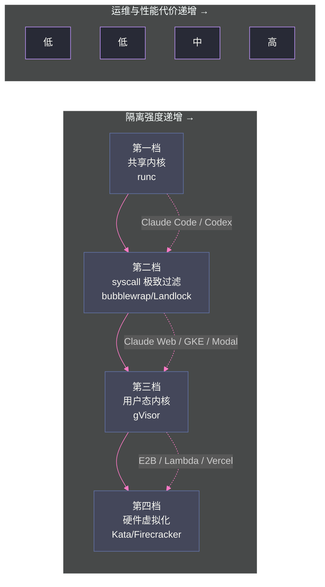
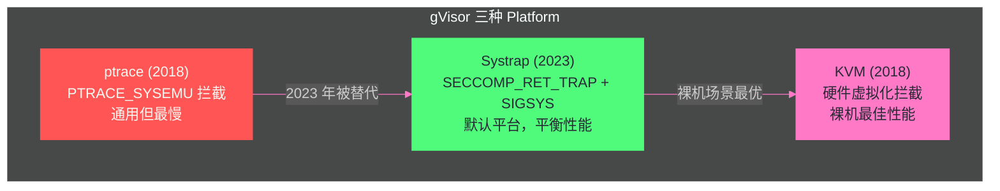

# 03 隔离边界的光谱——从共享内核到 MicroVM 的四档技术路线

**摘要：**

[[隔离原语/02 Linux 隔离原语——namespace、cgroups、seccomp 与 capabilities 的安全地基|第 02 篇]] 论证了隔离原语是"必要但不充分"的——四重隔离原语共享宿主内核，一个内核漏洞即可全线突破。本文回答随之而来的核心问题：**当四重原语不够时，信任边界应该画在哪里？** 答案不是一个点，而是一条光谱——从共享内核（runc）到系统调用过滤的极致（seccomp 加严 / bubblewrap / Landlock），到用户态内核（gVisor 的 Sentry 拦截），再到硬件虚拟化（Kata Containers 的轻量 VM 与 Firecracker 的 MicroVM）。本文给出四档路线的完整对照：每种方案的信任边界位置、工作机制、兼容性代价与性能特征，并以作者在真实物理机上的同机基准（runc/gVisor/Kata：启动 p50 2.5s/3.0s/4.0s，空闲 PSS 28.8/127.2/392.7 MiB）量化"性能换隔离"的代价；同时梳理 2026 年主流产品的隔离选择（Claude Code 用 bubblewrap、Codex 用 Landlock、Claude Web 与 GKE 用 gVisor、E2B 与 Lambda 用 Firecracker），说明"最强隔离"不是正确答案、"足够隔离"才是。核心认知：**隔离选型的本质是在威胁等级、性能预算、兼容性约束三者之间取平衡点，而判断平衡点的前提是理解每档方案的边界位置与失效模式**。

---

## 第 1 章 问题的本质：隔离边界画在哪

### 1.1 一个核心问题

第 02 篇结束时留下了一个问题：四重隔离原语（namespace/cgroups/seccomp/capabilities）共享宿主内核，无法防御内核漏洞利用。那么，把信任边界往外移，应该移到哪里？

这个问题可以形式化为一个选择：**"不可信工作负载"与"可信基础设施"之间，那根线画在什么位置**。画线的位置决定了三件事：

1. **逃逸的爆炸半径**：边界被突破后，攻击者能拿到什么（宿主机普通用户权限？宿主机 root？其他租户？）；
2. **兼容性代价**：边界越强，工作负载能"正常使用"的系统能力往往越少；
3. **性能代价**：边界越强，启动时间、内存开销、I/O 延迟往往越高。

这三者构成了隔离选型的"不可能三角"——没有任何一档方案能同时做到最强隔离、完全兼容、零开销。所有沙箱平台的隔离设计，本质上都是在三角中选一个可接受的点。

### 1.2 四档光谱总览

把 2026 年主流方案按信任边界的位置排列，可以得到一条清晰的四档光谱：

| 档位 | 信任边界 | 代表方案 | 典型用户 |
| :--- | :--- | :--- | :--- |
| **第一档：共享内核** | 宿主内核（原语组合防御） | runc（OCI 容器默认） | 绝大多数容器化应用、CI 任务 |
| **第二档：系统调用过滤的极致** | 宿主内核（白名单收窄） | seccomp 加严、bubblewrap、Landlock | Claude Code（bubblewrap）、OpenAI Codex（Landlock） |
| **第三档：用户态内核** | Sentry 进程（syscall 不落内核） | gVisor | Claude Web、Google Cloud Run、Modal、GKE Agent Sandbox |
| **第四档：硬件虚拟化** | hypervisor（独立 Guest 内核） | Kata Containers、Firecracker | E2B、AWS Lambda、Vercel Sandbox、Kata 强隔离场景 |

> [!info] 核心概念：不要用"安全排名"理解光谱
> 2026 年的行业共识（素材 Phase5-11 与多篇英文分析文章都指向同一结论）是：**"哪个最安全"是错误的问题框架**。四档方案都把信任边界从"完全信任工作负载"移开，差异在边界的位置、代价与失效模式。选型的正确问题是："我的威胁等级需要边界画在哪？"以及"这个位置的性能与兼容性代价我付得起吗？"——正如 Dreaming.press 的分析所说："The right choice is a triangle of compatibility, cold-start speed, and operational weight, not a security ranking"（正确的选择是兼容性、冷启动速度与运维重量的三角，而不是安全排名）。

### 1.3 为什么"最强隔离"不是正确答案

一个常见误区是"沙箱越强越好，直接上 MicroVM"。反例俯拾皆是：

- **Anthropic Claude Code（桌面版）** 用 bubblewrap（第一档/第二档之间的用户态 namespace 方案）而非 Firecracker——因为它的威胁模型是"单用户本机运行、防误操作"，且需要与宿主开发环境深度交互（访问用户目录、Git、编辑器）；
- **Modal** 默认用 gVisor 而非 Firecracker——因为它的工作负载是"函数级短任务"，需要密度与秒级启动；
- **GKE Agent Sandbox** 用 gVisor 而非 Kata——因为 Google 官方数据表明 gVisor 的密度优势让同样硬件多跑 40%+ Agent、成本降低 30%+。

"最强隔离"只适用于一种场景：**多租户、不可信代码、攻击者存在明确动机**（如公网代码执行服务、第三方插件执行平台）。在 Agent 场景中，大多数部署的威胁模型是"buggy 代码 + 偶尔的 Prompt Injection 诱导"，第二档到第三档的隔离通常足够，而第四档的代价（启动慢、内存贵、运维重）会直接拖垮产品体验。



---

## 第 2 章 第一档：共享内核（runc）

### 2.1 机制与信任边界

runc 是 OCI 容器的事实标准运行时，也是所有容器化平台的默认选择。它的隔离完全依赖第 02 篇讨论的四重原语：namespace 隔离视图、cgroups 限制资源、seccomp 过滤 syscall、capabilities 削减权限。

**信任边界**：宿主内核。工作负载的所有系统调用直接由宿主内核处理——原语组合只是在"谁能到达内核的哪些路径"上做限制。内核攻击面是"数百万行 C 代码"的量级，任何一个可利用的内核漏洞都可能让原语组合形同虚设。

**失效模式**：内核漏洞利用（Dirty Pipe CVE-2022-0847 是近年最著名的例子）、错误的配置（`--privileged`、挂载 Docker socket、`--cap-add=ALL` 把原语防御亲手拆除）、共享 namespace 配置（`hostNetwork`、`hostPID`）。

### 2.2 实测数据（同机基准）

素材 Phase3-13 在真实物理机（RHEL 9.6，Kubernetes 1.34.10）上对三种运行时做了同机对照基准，runc 作为基线档：

| 指标 | runc |
| :--- | :--- |
| 启动到可用 p50 | 2.515s |
| 空闲宿主 PSS | 28.8 MiB |
| 512MiB 内存触页 | 0.150s |
| 5000 小文件创建 | 0.599s |
| 200 进程并发 | 0.128s |

runc 在所有维度都是最优的——这正是它成为默认的原因：**零兼容性税、最低内存、最快启动**。它的代价不在性能表里，而在安全模型的边界里：共享内核。

### 2.3 适用场景与反例

**适用**：可信代码（自有服务、CI 构建）、威胁等级低（内部工具）、需要极致密度与性能的场景。

**反例（不该用 runc 的场景）**：多租户公网代码执行、执行第三方/模型生成的不可信代码且无其他纵深防御、安全合规要求"工作负载不得接触宿主内核"的场景。素材中测试集群的决策是"runc Profile 先行"——不是因为 runc 足够安全，而是因为"先跑通功能、后加隔离"的工程顺序：**功能验证用 runc（最便宜），安全上线换 gVisor/Kata（最可控）**。这也是 OpenSandbox 支持"同一平台切换运行时"的根本价值——[[平台与协议/07 OpenSandbox 架构深度解析——协议优先与六责任面|平台协议层]] 保证了运行时替换不影响上层 API。

### 2.4 runc 在 Agent 沙箱平台中的真实角色

综合素材中 PoC 与测试集群的决策记录，runc 在 Agent 沙箱平台中实际承担三个角色：

**角色一：功能验证档**。平台建设初期（PoC 阶段），用 runc 验证"生命周期 API、三类 Agent 跑通、MCP 子沙箱、资源回收"等功能链路——因为 runc 零兼容性税，任何失败都可以归因于平台而非运行时。素材测试集群"runc Profile 先行"的决策就是这个角色的制度化。

**角色二：默认密度档**。对低风险负载（内部可信 Agent、开发调试环境），runc 的 28.8MiB 空闲 PSS 意味着单位节点能承载的沙箱数量是 Kata 的 13 倍——密度即成本。在预算有限的生产初期，用 runc 承载大部分流量、把强隔离留给高价值场景，是常见的资源策略。

**角色三：对照基线**。runc 是性能基准的"零点"——没有 runc 的基线数据，gVisor/Kata 的开销无从量化（第 6 章的全部对比都以 runc 为参照）。素材中每次基准测试都包含 runc 对照组，这不是形式主义——**"比 runc 慢多少"是衡量隔离代价的唯一客观口径**。

**反例（runc 不该承担的角色）**：runc 不能作为"多租户不可信代码"的最终防线——如果平台的威胁等级达到 L2/L3 却只有 runc 档，那么平台的安全声明与实际隔离强度之间就存在系统性偏差（素材 Phase5-01 的"十个盲区"中，Runtime 调度记账与隔离档位错配正是这一类问题的具体表现）。

---

## 第 3 章 第二档：系统调用过滤的极致（bubblewrap 与 Landlock）

### 3.1 这一档的定位：不换内核，收窄入口

第二档不改变"共享宿主内核"的事实，但把工作负载能触达的内核路径收窄到极小——它的哲学是"既然内核共享不可避免，就把白名单收紧到业务所需的最小集"。这一档的两个代表恰好是 2026 年两大 Coding Agent 的默认选择，值得单独成章。

### 3.2 bubblewrap：Claude Code 的用户态 namespace 沙箱

bubblewrap（bwrap）是 Flatpak 项目开发的非特权沙箱工具，用 user namespace + mount namespace 在用户态构造隔离文件系统视图。Anthropic 的 Claude Code 桌面版用它作为默认沙箱机制。

**机制**：bwrap 不依赖 root——通过 user namespace 无特权创建隔离环境；用 bind mount 把宿主目录"映射"进沙箱（只读或读写）；沙箱内进程看不到未映射的目录。

**为什么 Claude Code 选它**：Claude Code 的威胁模型是"用户在自己机器上运行，防的是 Agent 误操作/被注入指令后破坏用户环境"——不是"防恶意攻击者"。bwrap 的优势是零特权依赖（用户态即可运行）、与宿主文件系统深度兼容（映射式访问而非复制式）、秒级启动。代价是隔离强度有限——**它不防内核漏洞、不隔离网络、不限制进程**。

**边界**：bwrap 沙箱内仍可访问网络（默认）、仍可 fork 进程、文件系统是"映射"而非"复制"（沙箱内对映射目录的写操作直接落盘）。它防的是"看到不该看的文件"，不是"做不该做的事"。

### 3.3 Landlock：OpenAI Codex 的 LSM 沙箱

Landlock 是 Linux 5.13（2021）合入的 LSM（Linux Security Module），允许无特权进程对自己施加文件系统访问限制——"进程自我约束"式沙箱。OpenAI Codex 的默认沙箱方案（2026 年）基于 Landlock。

**机制**：进程通过 `landlock_create_ruleset`/`landlock_restrict_self` 系统调用，声明"我允许自己访问哪些路径、哪些权限"——此后进程自身被内核强制约束，即使被攻破或被骗，也无法访问规则之外的文件。

**为什么 Codex 选它**：Codex 的威胁模型与 Claude Code 类似（本机单用户、防误操作），但 Landlock 相比 bubblewrap 有两个优势：**内核级强制**（LSM 在内核路径上拦截，无法被进程自身绕过）与**零额外进程**（不需要 supervisor 进程，直接约束自身）。代价是 Landlock 只覆盖文件系统访问——**网络、进程、syscall 不在其管辖范围**。

**边界与反例**：Landlock 管不了"沙箱内代码把文件内容通过 HTTP 发出去"——它没有网络语义。对需要网络控制（攻击链第 4 步）的 Agent 场景，Landlock 必须配合网络层控制使用。这也是为什么 Codex 的沙箱是"Landlock + 网络策略"的组合而非 Landlock 单点。

### 3.4 第二档的共性结论

bubblewrap 与 Landlock 代表了一种务实路线：**对"本机单用户 Agent"场景，用零运维成本的用户态机制挡住"误操作与诱导"级别的事故，把强隔离留给真正需要它的多租户场景**。它们的共同弱点（不防内核漏洞、不控制网络）决定了它们进不了企业级沙箱平台的核心隔离层——但在桌面 Agent 产品中是性价比极高的选择。

两个方案的对比如下：

| 维度 | bubblewrap | Landlock |
| :--- | :--- | :--- |
| **内核机制** | user namespace + mount namespace | LSM（内核 5.13+） |
| **强制方式** | 外部 supervisor 进程构造环境 | 进程自我约束（restrict_self） |
| **管辖范围** | 文件系统视图（映射式） | 文件系统访问（规则式） |
| **网络控制** | 无 | 无 |
| **内核漏洞防御** | 无 | 无 |
| **代表用户** | Claude Code（桌面版） | OpenAI Codex（默认沙箱） |
| **核心优势** | 零特权依赖、与宿主 FS 深度兼容 | 内核级强制、无法被自身绕过 |

**一个值得注意的细节**：两者都不依赖"沙箱守护进程长期存在"——bwrap 的 supervisor 在环境构造完成后可以退出（隔离由 namespace 持续生效），Landlock 的规则在进程内永久生效。这意味着**它们的运行时开销几乎为零**——对桌面产品"秒级启动、常驻内存小"的要求来说，这是决定性优势。作为对照，gVisor 的 Sentry 常驻内存 127MiB、Kata 的 VM 常驻 393MiB——桌面 Agent 不可能为"防误操作"付出这个代价，这正是第二档存在的结构性理由。

---

## 第 4 章 第三档：用户态内核（gVisor）

### 4.1 从"过滤系统调用"到"重新实现系统调用"

第二档的 seccomp 是"过滤"系统调用——决定哪些调用能到达宿主内核。但 seccomp 有一个根本限制：**被允许通过的系统调用仍然由宿主内核处理**——如果允许了 `open`，而 `open` 的内核实现中有漏洞，容器进程仍然可以利用。

gVisor 走了一条更激进的路——**不让任何容器进程的系统调用到达宿主内核**。gVisor 在用户空间实现了一个完整的 Linux 系统调用接口——容器进程的每个系统调用都被拦截，由 gVisor 的用户空间实现处理，宿主内核根本不看到容器进程的原始系统调用。

```
传统容器：
容器进程 → syscall → 宿主内核 → 处理 → 返回

gVisor：
容器进程 → syscall → gVisor Sentry（用户空间内核）→ 处理 → 返回
                                    ↓ （仅当需要文件I/O时）
                                Gofer → 宿主文件系统
```

这种设计的核心安全价值是：**宿主内核的攻击面被大幅缩小**。gVisor 的 Sentry 自身只使用约 55 个系统调用与宿主内核交互（且用 seccomp-bpf 白名单严格限制）——即使 Sentry 本身被攻破，攻击者也只能使用这 55 个系统调用，而非容器的全部系统调用。

### 4.2 为什么用 Go 实现

gVisor 的 Sentry 用 Go 语言编写——这个选择不是偶然的：

**内存安全**：Sentry 是一个用户空间内核——它处理来自不可信容器进程的系统调用请求，这些请求可能包含恶意构造的参数。如果 Sentry 用 C/C++ 编写，一个内存安全 bug（如缓冲区溢出）可能让容器进程逃逸出 Sentry 到达宿主。Go 的内存安全（无指针运算、自动边界检查、垃圾回收）大幅减少了这类 bug 的可能性。

**代价——性能**：Go 的垃圾回收和运行时检查有性能开销——gVisor 文档承认"Sentry 使用的语言在安全域提供了优势，但可能不提供其他语言的原始性能"。这是"安全 vs 性能"的典型取舍——gVisor 选择了安全。

> [!info] 核心概念：gVisor 是"用安全语言写的用户空间内核"
> gVisor 的设计哲学可以概括为"用安全语言写的用户空间内核"——Go 的内存安全消除了 Sentry 中大部分内存安全漏洞的可能性，用户空间实现消除了容器进程直接接触宿主内核的可能性。这两层安全保证叠加，让 gVisor 的信任边界远强于传统容器。代价是性能——Go 的 GC 开销、系统调用在 Sentry 中的用户空间处理延迟、Gofer 的 I/O 间接层——这些构成了 gVisor 的"结构性成本"。

### 4.3 三组件架构：Sentry、Gofer 与 Platform

**Sentry——用户空间内核**：gVisor 的核心组件，用 Go 实现的"大部分 Linux 系统调用接口"。职责：接收并处理容器进程的系统调用、实现进程管理/内存管理/信号处理/网络栈、通过 Gofer 代理文件系统操作、自身用 seccomp-bpf 严格限制与宿主内核的交互（约 55 个系统调用白名单）。**它不是完整的 Linux 内核**——351 个 amd64 系统调用中约 277 个有完整或部分实现（按 2026 年官方参考数据，略低于旧版记录的 287 个口径），不支持的系统调用包括 `userfaultfd`、`modify_ldt`、内核模块相关、eBPF 相关等。

**Gofer——文件系统代理**：Sentry 不直接访问宿主文件系统——所有文件 I/O 通过 Gofer 进程代理。Gofer 是独立进程，运行在宿主机上（不在沙箱内）。当容器进程需要打开文件时，Sentry 通过 9P 协议向 Gofer 发送请求，Gofer 在宿主文件系统上执行实际的 open/read/write 操作。**为什么需要 Gofer**：如果 Sentry 直接访问文件系统，Sentry 需要宿主机的文件系统权限——这扩大了 Sentry 的特权面。通过 Gofer 代理，Sentry 不需要任何文件系统权限——Gofer 可以被限制为只能访问特定目录，提供额外的隔离层。**代价**：文件 I/O 需要经过 Sentry → 9P 协议 → Gofer → 宿主文件系统的多层间接——2019 USENIX 研究测量了 gVisor 的文件 open 操作延迟远高于原生。

**Platform——系统调用拦截机制**：Sentry 需要一种机制来**拦截**容器进程的系统调用——让系统调用不到达宿主内核，而是交给 Sentry 处理。gVisor 有三种 Platform 实现：



**ptrace Platform（2018，已废弃为非默认）**：使用 `PTRACE_SYSEMU` 在每次系统调用时暂停容器进程，把控制权交给 Sentry。优势是通用性——不需要硬件虚拟化支持。致命缺陷是性能——每次系统调用两次上下文切换，2019 USENIX 研究测量系统调用密集型工作负载延迟高达原生 2-11 倍。ptrace 是 gVisor"性能差"口碑的主要来源。

**Systrap Platform（2023，当前默认）**：利用 `SECCOMP_RET_TRAP`——容器线程尝试系统调用时，seccomp 过滤器返回 TRAP，内核发送 `SIGSYS` 信号；gVisor 的 stub 信号处理器捕获信号，通过共享内存与 Sentry 通信。相比 ptrace：不需要逐次系统调用跟踪、信号帧存储在共享内存中、避免额外上下文切换。限制：需要 ptrace 相关能力初始化 stub 线程（`kernel.yama.ptrace_scope=3` 的系统无法工作）、嵌套虚拟化场景优于 KVM 但裸机不如 KVM。

**KVM Platform**：Sentry 同时充当 Guest OS 和 VMM——容器进程在 KVM 的 guest 模式中运行，系统调用被虚拟化层拦截。裸机场景最佳性能。限制：需要硬件虚拟化（Intel VT-x / AMD-V）、嵌套虚拟化场景性能差、不支持 ARM CPU。

> [!note] 设计哲学：Platform 演进的"通用性 vs 性能"取舍
> gVisor 三种 Platform 的演进清晰地展示了"通用性 vs 性能"的取舍：ptrace 最通用（任何 Linux 都能跑）但最慢；KVM 最快但需要硬件虚拟化支持；Systrap 是折中。默认选择 Systrap 而非 KVM，是因为 gVisor 的典型部署场景（GKE 节点）往往在云 VM 中——嵌套虚拟化开销让 KVM 不如 Systrap。

### 4.4 兼容性税：netstack 与不支持场景

gVisor 的兼容性以系统调用覆盖率为度量：amd64 平台 351 个系统调用中约 277 个有完整或部分实现（约 79%）。一个系统调用"不支持"不等于"使用它的应用不工作"——大部分语言运行时和库在调用不支持的系统调用时有 fallback 代码。但以下场景仍然有问题：

| 场景 | 问题 | Agent 沙箱影响 |
| :--- | :--- | :--- |
| **CRIU（检查点/恢复）** | 依赖 `userfaultfd`、`process_vm_readv` 等低级 syscall，多数不支持 | gVisor 沙箱不能做 CRIU 级内存检查点（GKE 用 Pod Snapshots 规避） |
| **依赖 `userfaultfd` 的数据库** | 内存管理行为异常 | 沙箱内跑这类数据库会失败 |
| **容器内 ptrace** | 语义与原生 Linux 不完全一致 | 调试器类工具行为异常 |
| **容器内 eBPF** | `bpf` syscall 不支持 | 沙箱内 eBPF 监控/性能分析不可用 |
| **netstack 网络栈** | Sentry 内嵌 Go 网络栈，非宿主内核栈 | 高吞吐网络传输低于原生；短连接场景有额外延迟 |

**netstack 的实质**：gVisor 没有使用宿主机的 Linux 网络栈——Sentry 内部实现了一个完整的 Go 网络栈（TCP/IP、路由、ARP、socket 层）。当容器进程调用 `socket()`/`connect()`/`send()`/`recv()` 时，这些调用由 Sentry 的网络栈处理，而非宿主机内核。性能特征：TCP 吞吐量低于内核栈（缺少高级拥塞控制算法、TFO/TCP Fast Open、零拷贝接收等优化）、连接建立有用户空间处理开销、短连接场景（HTTP/1.0 微服务调用）受影响更大。**对 Agent 沙箱的实际影响**：Agent 的网络使用模式通常是"少量 HTTP 请求到外部 API"——如调用 LLM API、查询数据库、访问 Web 页面。这种"低频、短连接"模式受 netstack 影响较小——10-30% 的网络延迟增加对"等待 LLM 生成响应需要数秒"的场景几乎无感。但如果 Agent 需要做大量网络传输（如下载大模型文件、流式处理大量数据），netstack 可能成为瓶颈。

**netstack 的优化方向与缓解策略**：gVisor 团队持续优化网络栈——添加更多 TCP 选项支持、改进拥塞控制、优化数据包处理路径。但进度受限于"用 Go 重新实现一个完整网络栈"的工程量——Linux 内核网络栈经过数十年优化，Go 网络栈需要追赶这个差距。对 Agent 沙箱部署者，一个实用的缓解策略是：**对网络密集型 Agent 任务，考虑 gVisor 的 host network 模式**（如果安全策略允许）——让网络流量绕过 Sentry 的网络栈直接走宿主机网络栈，牺牲一些网络隔离换取网络性能。但需要评估安全影响——host network 模式下容器与宿主机共享网络 namespace，**减弱了网络隔离强度，且与"独立 network namespace 是 Egress 控制前提"的原则冲突**（[[隔离原语/02 Linux 隔离原语——namespace、cgroups、seccomp 与 capabilities 的安全地基|第 02 篇]]），因此在多租户沙箱平台上通常不可接受——网络性能与网络隔离在这里是不可兼得的二选一。

### 4.5 性能模型：结构性成本与实现成本

gVisor 的性能开销分为两类：

| 工作负载类型 | 性能开销 | 原因 |
| :--- | :--- | :--- |
| CPU 密集型 | 几乎无感（<5%） | 不涉及系统调用，Sentry 不参与 |
| 系统调用密集型 | 2-11x 延迟（ptrace 口径）；Systrap 显著改善 | 每次系统调用经过 Sentry |
| I/O 密集型 | 10-30% 吞吐下降 | Sentry → Gofer → 宿主 FS 多层间接 |
| 网络密集型 | 视场景而定 | Sentry 网络栈不如 Linux 优化 |
| 内存密集型 | 中等（GC 开销） | Sentry 的 Go 运行时 GC |

**结构性成本**（由设计决策决定，难以消除）：Sentry 存在、Go 语言、Gofer 间接层。**实现成本**（由不成熟度决定，持续改善）：网络栈优化、部分 syscall 实现。**Agent 场景结论**：代码执行（CPU 密集）几乎不受影响；文件读写有 10-30% 开销；网络请求取决于 netstack 优化程度。总体是"可感知但不致命"。

### 4.6 生产化门禁：素材里的三个硬约束

素材 Phase5-04 的调研把 gVisor 的生产化约束总结为三个门禁，这些是书本上不会写、踩过坑才知道的：

**门禁一：内核版本下限**。gVisor 的 runsc 对宿主内核有版本要求（GSO 等特性需要内核 ≥ 4.14.77）。素材中 panther-dev 测试集群的三台 RHEL 7.9/3.10 节点**不能当 gVisor Worker**——内核太老。**教训：引入 gVisor 前先审计所有候选节点的内核版本**，否则调度器会把 gVisor 工作负载调度到跑不起来的节点上。

**门禁二：platform 显式选择**。在 CVM（云 VM）中部署 gVisor 必须显式设置 `platform=systrap`——默认配置可能选择错误平台。**平台选择规则**：裸金属用 `kvm` platform（性能最佳）；VM 里用 `systrap` platform（嵌套 kvm 开销大）；**禁止在 VM 里用 kvm platform**（嵌套虚拟化性能灾难）。

**门禁三：Pod Overhead 记账**。gVisor 空闲 PSS 约 127MiB（实测），但 K8s 调度器按普通容器口径计算节点容量——**调度账本与真实开销脱节**（素材 GAP-011）。生产环境必须按"镜像族×运行时×节点机型"实测 overhead 并配置 RuntimeClass.overhead，否则节点内存超卖、OOM 风险系统性低估。

### 4.7 生产应用与定位

gVisor 的典型生产部署：Google Cloud Run（无服务器容器）、Claude Web 的多租户 Agent 执行、Modal 的默认沙箱、GKE Agent Sandbox 的默认后端。GKE 的官方数据最能说明它的定位：**预热线池 300 个沙箱/秒/集群、90% 分配 ≤200ms；同样硬件比 MicroVM 多部署 40%+ Agent、成本降低 30%+**——"密度与成本"是选择 gVisor 而非 MicroVM 的核心原因。

### 4.8 gVisor 的安全模型边界

尽管 gVisor 的隔离远强于传统容器，它并非无懈可击——理解其安全模型的边界对于正确部署至关重要。

**Sentry 自身的攻击面**：Sentry 是一个用 Go 编写的大规模用户空间程序——它实现了数百个系统调用的逻辑，处理来自不可信容器进程的请求。虽然 Go 的内存安全消除了大部分内存安全 bug，但逻辑 bug 仍然可能存在——如不正确的权限检查、竞态条件、类型混淆等。如果攻击者在 Sentry 中找到了一个逻辑 bug，可能利用它逃逸 Sentry 的沙箱，到达宿主机用户空间。

**Sentry 的 seccomp 白名单**：即使 Sentry 被攻破，Sentry 自身被 seccomp-bpf 限制为约 55 个系统调用的白名单——攻击者在 Sentry 上下文中能做的事情受这个白名单约束。这是一个重要的纵深防御——"攻破 Sentry"不等于"获得宿主机 root"——攻击者还需要从 55 个系统调用中找到逃逸路径。

**Gofer 的攻击面**：Gofer 是独立的文件系统代理进程，暴露 9P 协议接口给 Sentry。如果 Sentry 被攻破，攻击者可能通过 9P 协议向 Gofer 发送恶意请求——但 Gofer 也有自己的权限限制（只能访问指定目录）。

**与 MicroVM 的安全边界对比**：MicroVM 的信任边界是 hypervisor——逃逸需要 hypervisor 漏洞（如 KVM/QEMU 漏洞），这些漏洞比用户空间程序漏洞少得多且更难利用。gVisor 的信任边界是 Sentry——逃逸需要 Sentry 的逻辑 bug，比 hypervisor 漏洞更容易发现和利用。这就是"gVisor 隔离强度不如 MicroVM"的根本原因——用户空间程序的攻击面大于 hypervisor 的攻击面。但需要注意，Sentry 用 Go 编写带来的内存安全优势，使得"在 Sentry 中找到可利用的 bug"比"在用 C 编写的同等规模程序中找到"要难得多——Go 消除了整类内存安全漏洞（缓冲区溢出、use-after-free、空指针解引用等），这些恰恰是 C 程序中最常见的可利用漏洞类型。因此 gVisor 与 MicroVM 的安全差距，比"用户空间程序 vs hypervisor"的简单对比要小——Go 的内存安全是一个重要的弥合因素。

> [!info] 核心概念：gVisor 是"够用的强隔离"
> gVisor 在隔离强度上不如 MicroVM——逃逸 Sentry 比逃逸 VM 容易。但 gVisor 的隔离强度远超传统容器——逃逸 Sentry 需要找到 Sentry（一个用内存安全语言 Go 编写的用户空间程序）中的漏洞，而非宿主内核（一个用 C 编写的数百万行代码）中的漏洞。对于 Agent 沙箱场景，gVisor 提供了"够用的强隔离"——远强于传统容器，虽然不如 MicroVM，但密度和成本优势显著。这是"适度安全"的工程实践——不是追求"理论上的最强隔离"，而是"针对实际威胁级别的足够隔离"。

---

## 第 5 章 第四档：硬件虚拟化（Kata Containers 与 Firecracker）

### 5.1 Kata Containers：容器化的轻量 VM

Kata Containers（2017 年由 Clear Containers 与 runV 合并而来，CNCF 项目）的路线与 gVisor 完全不同：**不在用户空间重实现内核，而是给每个容器/Pod 运行一个真正的轻量 VM**——容器进程运行在 Guest 内核上，与宿主内核完全隔离。

**机制**：CRI 集成下，Kata 的 shim（containerd-shim-kata-v2）把 Pod 的创建请求翻译为 VM 创建请求——Pod Sandbox 映射为一个轻量 VM，容器就是 VM 里的进程。这条链路与第 02 篇的"七跳 CRI 链路"完全兼容：kubelet 通过 CRI 调用 containerd，containerd 根据 `runtimeHandler`（如 `kata-qemu-runtime-rs`）选择 Kata 插件，shim 启动 hypervisor 进程创建 VM，Guest 内由 Kata agent（一个运行在 Guest 中的守护进程）负责拉起容器进程。

**设备与 Guest**：设备通过 virtio 暴露给 Guest（virtio-net/virtio-blk/virtio-serial/vsock 等），Guest 内核是精简的 Kata 内核镜像（只包含容器工作负载需要的驱动与子系统）。vsock 是 Kata 内部通信的关键通道——host 侧的 shim 与 Guest 内的 Kata agent 通过 vsock 通信，不依赖网络栈。热插拔能力（内存/CPU/设备）让 Kata VM 可以按需扩容——但素材实测显示热插拔在 Agent 沙箱场景使用率很低，因为沙箱生命周期短（分钟级），"创建即全量"更简单。

**五 hypervisor 策略**：Kata 支持多种底层 hypervisor（QEMU、Cloud Hypervisor、Firecracker、Dragonball、StratoVirt）——这是 Kata 与"单 hypervisor 方案"的最大差异：**Kata 是"VM 容器"的标准层，hypervisor 是可插拔的**。素材调研记录了关键事实：**GPU、TDX、SEV-SNP 等高级特性目前仅 QEMU hypervisor 支持**——如果 Agent 沙箱需要 GPU 直通或机密计算，Kata 的选型实际上被锁定在 QEMU 上。Dragonball（蚂蚁开源的 Rust VMM）与 containerd-shim 同进程运行，主打并发启动密度——这是 CubeSandbox 的底层（[[隔离原语/05 VMM 解剖——Firecracker、Cloud Hypervisor 与 Kata 的虚拟机监视器家族|第 05 篇]] 展开）。

**Kata 4.0 单二进制架构**：Kata 4.0 起把 runtime 合并为单二进制，简化部署与升级。素材 PoC 使用 Kata 3.31.0（`kata-qemu-runtime-rs` handler），部署方式为 Helm chart 或 containerd 插件注册——**注意：Kata 的安装不只是装一个二进制，还需要在 containerd 的 config.toml 注册 runtime handler、创建 RuntimeClass、配置节点标签与污点**（让 Kata Pod 只调度到有 Kata 的节点），四层一致性的完整实践。

**代价**：启动慢（秒级，VM 引导不可避免）、内存开销大（Guest 内核 + VM 元数据，空闲 PSS 实测 ~393MiB）、节点需要硬件虚拟化或嵌套虚拟化支持。

### 5.2 Firecracker：MicroVM 的极简哲学

Firecracker（AWS 2018 年开源，NSDI '20 论文）是另一条硬件虚拟化路线：**极简 VMM + KVM，专为"容器化 VM"优化**。它不追求通用虚拟化（不是 QEMU 的替代品），而是只做一件事：**快速、廉价地创建大量安全隔离的微型 VM**。

**设计要点**（详见 [[隔离原语/05 VMM 解剖——Firecracker、Cloud Hypervisor 与 Kata 的虚拟机监视器家族|第 05 篇]]）：仅 6 个仿真设备（virtio-net/block/vsock/balloon/serial/键盘）、无 BIOS、无 PCI 直通、jailer 安全进程隔离 VMM、rate limiter 内置流量控制。**性能数据**：启动到应用代码 <125ms、单 microVM 内存开销 <5MiB、单机每秒可创建约 150 个。

**jailer 进程隔离**：Firecracker 的 VMM 进程本身被 jailer 包裹——jailer 把 VMM 放入独立的 namespace/cgroup/seccomp 环境，以非 root 用户运行，即使 VMM 被攻破（理论上攻击者只能利用 VMM 漏洞），也要先突破 jailer 的约束。这是"VMM 自身也要沙箱化"的纵深防御设计——**管理隔离边界的人，自己也住在边界之内**。

**rate limiter 内置限流**：Firecracker 在 virtio 设备层内置了 token bucket 限流器（网络与块设备都支持）——不需要外部流量整形工具，每个 microVM 的 I/O 速率在 VMM 层即可控制。对 Agent 沙箱平台的意义：**资源爆炸半径的控制下探到了设备层**——即使沙箱内代码疯狂读写，也不会拖垮宿主机的存储与网络路径。

**为什么这么快**：Firecracker 的 125ms 启动来自三个设计决策的叠加——无 BIOS（直接进入简化引导）、极简设备模型（只有 6 个仿真设备，无需枚举复杂 PCI 拓扑）、无多余固件（不加载 ACPI 表等完整固件栈）。KVM 负责把 guest 内存与 CPU 状态准备好后，guest 内核在极短路径内完成引导——整个过程没有"通用虚拟机"的任何包袱。

**典型用户**：AWS Lambda、Fargate、E2B（Agent 沙箱平台）、Vercel Sandbox。E2B 的 benchmark（2026 实测）创建 717ms、恢复 662ms——Firecracker 的极简设计是其"毫秒级"体验的基础。素材调研还记录了一个关键对比：**Firecracker 单机每秒可创建约 150 个 microVM**（NSDI '20 数据）——这个"每秒创建速率"指标直接决定了托管平台能支撑的 Agent 并发会话规模，是比"单次启动时间"更重要的容量指标。

### 5.3 Kata vs Firecracker：两种硬件虚拟化哲学的差异

两者都走"硬件虚拟化"路线，但定位不同：

| 维度 | Kata Containers | Firecracker |
| :--- | :--- | :--- |
| **本质** | "容器化的 VM"——让 VM 长得像 Pod | "VM 化的容器"——让 VM 轻得像容器 |
| **设备模型** | 完整 virtio 设备集 | 极简 6 设备 |
| **hypervisor** | 5 种可插拔（QEMU 为默认） | 固定自研极简 VMM |
| **K8s 语义** | Pod 级语义完整（Sandbox→VM 映射） | 需配合 shim（如 E2B 自研控制面） |
| **GPU/机密计算** | QEMU 支持 TDX/SEV-SNP/GPU | 无 PCI 直通，不支持 |
| **典型部署** | 企业强隔离容器 | 托管平台的高密度执行环境 |

**选型启示**：Kata 适合"K8s 原生、需要 Pod 语义、可能扩展 GPU/机密计算"的企业场景；Firecracker 适合"平台自建数据面、追求密度与冷启动"的托管场景。素材中 CubeSandbox 走的是"KVM MicroVM + 自研产品"路线（[[平台与协议/06 Agent 沙箱平台分层——六层模型与三条产品路线|第 06 篇]] 展开），本质上是第三种形态：介于两者之间的企业自研 MicroVM 平台。

---

## 第 6 章 实测对照：runc/gVisor/Kata 企业级基准

### 6.1 方法论：为什么必须"同机对照"

性能数据脱离测量场景没有意义——素材 Phase3-13 的基准之所以可信，是因为它做到了三点：**同机**（同一物理机、同一 K8s 集群、同一镜像）、**同口径**（p50/p99 分位数、宿主 PSS 内存口径）、**同负载**（同样的 CPU 哈希/内存触页/文件创建/进程并发任务）。这也解释了为什么不同来源的 gVisor/Kata 数据看起来"对不上"——测量场景不同，数据不可比。

基准的负载设计也值得一提：素材选择了四类任务，分别覆盖 Agent 工作负载的四个典型特征——CPU 哈希（纯计算，对应模型推理后的代码执行）、512MiB 内存触页（内存压力，对应大对象分配）、5000 小文件创建（I/O 密集，对应构建/编译产物）、200 进程并发（进程密集，对应 Agent fork 子任务）。**负载的选择本身就是威胁模型的一部分**——没有覆盖"Agent 实际会做什么"的基准，测出来的数字对选型毫无帮助。

### 6.2 数据总表

| 指标 | runc | gVisor | Kata |
| :--- | :--- | :--- | :--- |
| **启动到可用 p50** | 2.515s | 3.015s | 4.016s |
| **空闲宿主 PSS** | 28.8 MiB | 127.2 MiB | 392.7 MiB |
| **CPU 哈希（p50）** | ~10.3s | ~10.3s | ~10.3s |
| **512MiB 内存触页** | 0.150s | 0.849s | 0.967s |
| **5000 小文件创建** | 0.599s | 0.609s | 2.364s |
| **200 进程并发** | 0.128s | 0.622s | 0.625s |

### 6.3 数据解读：性能换隔离的量化代价

**启动时间**：runc 2.5s → gVisor 3.0s（+20%）→ Kata 4.0s（+60%）。注意这包含 K8s 链路（镜像拉取、CR reconcile 等）的固定成本——纯运行时启动差异小于绝对数字暗示的差距。**但 WarmPool 场景下三者热池命中都收敛到 ~1s API/2.2s 首命令**——预热池抹平了大部分启动差异（[[平台与协议/09 OpenSandbox 编排面——BatchSandbox、WarmPool 与快照|第 09 篇]]）。

**内存开销**：这是最显著的差距——runc 28.8MiB → gVisor 127.2MiB（+342%）→ Kata 392.7MiB（+1264%）。**对容量规划的意义**：同样 256GiB 节点，runc 可以跑约 8000 个空闲沙箱，gVisor 约 2000 个，Kata 只有约 650 个。Kata 的密度劣势是它难以大规模用于"海量短生命周期 Agent 会话"的根本原因。

**负载特征**：CPU 密集三者无差异（验证了"纯计算不受隔离影响"）；内存触页 gVisor/Kata 显著慢于 runc（4-5 倍，用户态内核与 VM 的页错误路径更长）；小文件创建 Kata 慢 4 倍（virtio-blk + Guest 文件系统栈的累积开销）；进程并发 gVisor/Kata 慢约 5 倍（进程创建路径经过 Sentry/VM）。

**结论**：gVisor 的代价集中在内存与 I/O 路径，Kata 的代价是全方位的但隔离最强。**"贵"与"安全"是同一枚硬币的两面**——选择高档位时，容量模型必须重算，这正是 [[工程实践/12 沙箱性能工程——Runtime 基准与 WarmPool 容量管理|第 12 篇]] 的主题。

### 6.4 冷启动 vs 热池：隔离档位差异在预热场景下被抹平

纯冷启动数据容易让人误判"高档位不可用"——但预热池（WarmPool）改变了这个结论。素材 Phase3-14 的 WarmPool 实测：

| 指标 | runc | gVisor | Kata |
| :--- | :--- | :--- | :--- |
| **冷启动 API p50** | 4.013s | 4.013s | 5.015s |
| **热池命中 API p50** | 1.012s | 1.012s | 1.012s |
| **热池命中到首命令 p50** | 2.224s | 2.246s | 2.270s |
| **空闲槽位 PSS** | 18.09MiB | 111.84MiB | 396.88MiB |
| **并发 50 交付 p99** | 5.728s | 5.603s | 5.651s |
| **耗尽（5→50）交付 p99** | 17.490s | 18.614s | 27.494s |

三个关键发现：其一，**热池命中时三者 API 延迟完全相同（1.012s）**——预热池把"启动差异"转移到了"创建阶段"，命中阶段只剩 execd 就绪与路由开销；其二，**并发 50 全部命中时三者 p99 几乎一致（~5.6s）**——池化容量充足时隔离档位不构成性能差异；其三，**耗尽时差距重新出现**（runc 17.5s vs Kata 27.5s）——池子打空后回到冷启动量级，Kata 的启动代价以"耗尽尾延迟"的形式回归。

**工程含义**：高档位（Kata）的启动劣势可以通过预热池管理消化，但代价从"每次创建的延迟"变成了"常驻内存开销（397MiB/槽）与池容量管理"——容量模型从"创建成本"转向"持有成本"。这是 [[平台与协议/09 OpenSandbox 编排面——BatchSandbox、WarmPool 与快照|第 09 篇]] 的核心论题。

### 6.5 基准数据的边界：什么能比、什么不能比

本专栏引用多来源性能数据（官方文档、第三方 benchmark、素材实测），必须说明它们的可比边界，否则读者会得到错误的选型结论：

**可比**：同机对照数据（素材 Phase3-13 的三运行时基准）、同口径分位数（p50/p99）、同负载定义（同样的任务脚本）。这些数据可以用于"相对差异"的判断——如"Kata 空闲内存约为 runc 的 13.6 倍"。

**不可比**：不同硬件（物理机 vs 云 VM vs 笔记本）、不同集群规模（单节点 vs 多节点）、不同测量口径（API 延迟 vs 容器就绪 vs 首命令可用）、不同镜像（是否包含 Agent 运行时）之间的绝对数值。例如 E2B 的 717ms 创建（托管平台、Firecracker、预热）与素材的 2.5s 启动（自建集群、runc、冷启动）不可直接对比——前者是"热池命中"口径，后者是"冷创建"口径。

**引用纪律**：任何性能数字必须带三个标注——场景（冷/热）、口径（p50/p99/均值）、环境（硬件/集群）。不带标注的性能数字等同于营销话术。这也是本专栏所有数据表都注明来源场景的原因。

---

## 第 7 章 选型决策框架

### 7.1 威胁等级 → 档位映射

把威胁等级与档位对应起来，形成可执行的选型逻辑：

| 威胁等级 | 典型场景 | 推荐档位 | 理由 |
| :--- | :--- | :--- | :--- |
| **L0：可信代码** | 自研服务、内部 CI | 第一档（runc） | 零兼容性税，原语组合足够 |
| **L1：半可信代码** | 本机 Coding Agent、桌面工具 | 第二档（bubblewrap/Landlock） | 防误操作与诱导，零运维成本 |
| **L2：不可信代码** | 代码解释器、插件执行、共享平台 | 第三档（gVisor） | 挡住内核逃逸，密度与成本可控 |
| **L3：高对抗环境** | 多租户公网执行、第三方代码 | 第四档（Kata/Firecracker） | 硬件级边界，爆炸半径最小 |

**判定要点**：威胁等级不由"代码来源"决定，而由"代码执行后谁承担损失"决定——本机个人使用（损失=自己机器）与多租户平台（损失=所有租户数据）即使执行同一段代码，威胁等级完全不同。

### 7.2 四档总对照表

| 维度 | 第一档 runc | 第二档 bwrap/Landlock | 第三档 gVisor | 第四档 Kata/Firecracker |
| :--- | :--- | :--- | :--- | :--- |
| **信任边界** | 宿主内核 | 宿主内核（白名单收窄） | Sentry 进程 | hypervisor |
| **逃逸后果** | 宿主机（取决于配置） | 宿主机 | Sentry 上下文（55 syscall 白名单） | 需 hypervisor 漏洞 |
| **内核漏洞防御** | 无 | 无 | 有效（syscall 不落内核） | 有效（独立内核） |
| **兼容性** | 100% | ~100% | ~79% syscall、netstack 差异 | ~100%（真实内核） |
| **启动 p50（实测）** | 2.5s | 秒级（用户态） | 3.0s | 4.0s |
| **空闲 PSS（实测）** | 28.8MiB | 极低 | 127.2MiB | 392.7MiB |
| **运维复杂度** | 低 | 极低 | 中（内核门禁/平台选择） | 高（节点要求/容量重算） |
| **代表产品** | 所有容器平台 | Claude Code / Codex | GKE / Cloud Run / Modal | E2B / Lambda / 企业强隔离 |

### 7.3 决策树与反例

**决策树**：代码可信吗？→ 可信走第一档。→ 不可信，但损失范围仅限本机？→ 第二档。→ 不可信且平台级暴露？→ 威胁等级 L2 走 gVisor，L3 走 Kata/Firecracker。**任何情况下先验证兼容性**：在目标档位跑一次真实工作负载（Agent 全流程），再决定。

**反例清单**（素材中真实踩过的坑）：
- 把 RHEL 7.9/3.10 老内核节点当 gVisor Worker → 运行时起不来（门禁一）；
- 在 CVM 里用默认 platform 跑 gVisor → 性能异常（门禁二）；
- 按 runc 口径给 Kata 节点做容量规划 → 节点 OOM、沙箱被杀（门禁三）；
- 在 gVisor 沙箱里跑依赖 CRIU 的应用 → 功能不可用（兼容性税）；
- 在 Kata 里期望 GPU → 仅 QEMU hypervisor 支持，选型被锁定。

> [!warning] 生产避坑
> 隔离档位不是一次选定的——**同一平台应支持运行时切换**（这正是 OpenSandbox"统一协议 + 可插拔运行时"设计的核心价值）。素材的测试策略是：runc Profile 先跑通功能 → gVisor Profile 验证兼容性 → Kata Profile 灰度高安全场景。**先验证功能，再逐步加隔离**，比"一开始就上最强隔离然后发现兼容性翻车"的路线稳妥得多。

### 7.4 从 PoC 到生产的档位决策实录

素材 Phase4/Phase5 记录了作者从 PoC 到生产的档位决策全过程，这是四档光谱在真实项目中的完整应用案例：

**第一阶段（PoC，单机）**：全部三种运行时都装上（runc 默认 + gVisor + Kata），在同一 Kubernetes 集群、同一 OpenSandbox 平台上跑三类 Agent。目的不是选型，而是**收集数据**——启动时间、空闲 PSS、负载表现（[[工程实践/12 沙箱性能工程——Runtime 基准与 WarmPool 容量管理|第 12 篇]] 的基准表就是在这个阶段产出的）。

**第二阶段（测试集群）**：决策"runc Profile 先行"——测试集群只装 runc，Server/Controller 双副本，先验证平台功能（生命周期、三类 Agent、MCP 子沙箱）与高可用骨架。**理由**：功能验证阶段引入隔离运行时是自找麻烦——Kata/gVisor 的安装与运维复杂度会污染"平台本身是否有 bug"的判断。

**第三阶段（生产规划）**：决策"三 Profile 独立"——生产环境拆成 runc/gVisor/Kata 三个 Server Profile（独立域名、独立 values、独立节点选择器），而不是一个 Server 内动态切换。**理由**：OpenSandbox 0.2.x 的 Runtime 是 Server 实例级配置，不能逐沙箱选择（素材 Phase5-01 的十个盲区之一）——既然平台不支持细粒度切换，就用"三套独立部署"表达档位。

**第四阶段（灰度顺序）**：runc Profile 承载日常流量 → gVisor Profile 在"中风险代码解释器"场景灰度（先过内核版本门禁、platform 验证）→ Kata Profile 仅在高安全场景（多租户敏感数据）开放（且必须先过嵌套虚拟化门禁，[[隔离原语/04 KVM 与硬件虚拟化——MicroVM 隔离的硬件基石|第 04 篇]]）。

这个决策过程最值得借鉴的一点：**档位决策不是一次投票，而是一条时间线**——先跑通、再测数、再规划、再灰度。每个阶段都有明确的通过标准，任何阶段的数据都会推翻上一阶段的假设。

---

## 第 8 章 总结与下一篇导读

### 8.1 本文核心要点

1. **隔离选型是"不可能三角"**：最强隔离、完全兼容、零开销三者不可兼得——选型是在威胁等级、性能预算、兼容性约束之间取平衡
2. **四档光谱**：共享内核（runc）→ syscall 极致过滤（bubblewrap/Landlock）→ 用户态内核（gVisor）→ 硬件虚拟化（Kata/Firecracker），边界逐档外移、代价逐档上升
3. **"最强隔离"不是正确答案**：Claude Code 用 bubblewrap、Codex 用 Landlock、GKE 用 gVisor、E2B 用 Firecracker——各家的选择由威胁模型与产品形态决定
4. **gVisor 的本质**：用 Go 重实现 Linux syscall 接口，syscall 不落宿主内核；代价是兼容性税（~79% syscall、netstack）与内存开销（127MiB 空闲 PSS）
5. **Kata/Firecracker 的差异**：Kata 是"容器化的 VM"（Pod 语义完整、5 hypervisor 可插拔），Firecracker 是"VM 化的容器"（极简设备、极致密度）
6. **实测数据的意义**：同机基准显示启动 2.5s/3.0s/4.0s、空闲 PSS 28.8/127.2/392.7MiB——高档位的"贵"必须用容量模型重算来消化
7. **三个生产门禁**：内核版本下限、platform 显式选择、Pod Overhead 记账——书本不写、踩坑才知道

### 8.2 下一篇导读

本文把四档光谱讲清楚了，但第四档（硬件虚拟化）还有一层没展开：**MicroVM 到底怎么在硬件层面强制隔离？** 下一篇 [[隔离原语/04 KVM 与硬件虚拟化——MicroVM 隔离的硬件基石|04 KVM 与硬件虚拟化]] 将深入 CPU 虚拟化状态机（VMX root/non-root）、EPT 内存隔离、KVM API 三级 fd 体系，以及素材中真实验证过的嵌套虚拟化（L0/L1/L2）与它的生产门禁——理解 KVM，才能真正理解 Firecracker/Kata/CubeSandbox 为什么"硬件级隔离"可信。

> [!info] 专栏导航
> 本文是 [[../00 专栏导览|Agent 沙箱技术专栏]] 的第 03 篇。上一篇 [[隔离原语/02 Linux 隔离原语——namespace、cgroups、seccomp 与 capabilities 的安全地基|02 Linux 隔离原语]] 讲透了四重原语；本文把它们放进四档光谱；接下来 04-05 篇深入硬件虚拟化层，06 篇开始进入平台层。

---

### 8.3 术语速查

| 术语 | 口径 |
| :--- | :--- |
| **信任边界** | 不可信工作负载与可信基础设施之间的隔离线位置 |
| **Sentry** | gVisor 的用户空间内核，处理沙箱内全部 syscall |
| **Gofer** | gVisor 的文件系统代理，通过 9P 协议为 Sentry 提供文件 I/O |
| **Platform** | gVisor 的 syscall 拦截机制（ptrace/Systrap/KVM） |
| **PSS** | Proportional Set Size，按共享比例分摊后的进程内存口径 |
| **RuntimeClass.overhead** | K8s 声明的运行时额外开销（调度器据此记账） |
| **handler** | RuntimeClass 中关联 containerd 运行时插件的名字 |
| **Pod Overhead 记账缺口** | 调度器未计入 gVisor/Kata 常驻内存的已知问题（素材 GAP-011） |

---

## 参考文献

1. gVisor. "Platform Guide." https://gvisor.dev/docs/architecture_guide/platforms/
2. gVisor. "Releasing Systrap - A high-performance gVisor platform." 2023-04-28. https://gvisor.dev/blog/2023/04/28/systrap-release/
3. Young et al. "The True Cost of Containing: A gVisor Case Study." USENIX HotCloud 2019.
4. Agache et al. "Firecracker: Lightweight Virtualization for Serverless Applications." NSDI 2020.
5. Kata Containers 官方文档. https://katacontainers.io/
6. "Firecracker vs gVisor vs Kata: Isolating AI Agent Code Execution." Dreaming.press, 2026.
7. Tanay Shah. "Bubblewrap, Landlock, gVisor, Firecracker: Choosing a Sandbox for AI Agent Code Execution in 2026."
8. "gVisor vs Firecracker: Which Agent Sandbox Runtime in 2026." AgenticWire News.
9. LogRocket Blog. "Comparing AI agent sandbox platforms: E2B, Modal, Daytona, and more." 2026.
10. Google. "Reduce your agent's costs by 75% with GKE Agent Sandbox."
11. agent-sandbox 调研素材. Phase1-03 隔离边界对比、Phase3-13 三种 Runtime 企业级基准、Phase5-02/04 RuntimeClass 与 gVisor 生产化门禁
